

<!-- --- split --- -->




Salut!

Dans le cours d'objets connectés 1, nous allons faire de la domotique avec deux différentes plateformes : Jeedom et Home Assistant.

Avec ces ceux plateformes, vous verrez deux modes de fonctionnement intéressants mais aussi passablement différents.

Tout au long du cours, gardez en tête que nous ne vous formons pas pour devenir des experts de ces plateformes. Nous vous aidons à acquérir les bases pour comprendre comment un système domotique fonctionne afin que vous puissiez mieux saisir les enjeux si jamais vous aviez à faire du développement domotique.

Bonne session!

## 1.2 Plan de cours

Programme

420 : Techniques de l'informatique

Profil

B0 : Profil par défaut

Composante de la formation

Spécifique

Sanction

diplôme d'études collégiales (DEC)

Cours préalables

420-1D6-VI : Programmation 1

Pondération

2-2-2

Durée

60 heures

Unités

2

Adoption par le département

18 août 2025

## Enseignantes et enseignants

Nom

Bureau

Courriel

Christiane Lagacé

C-207

lagace.christiane@cegepvicto.ca

## Référence aux devis ministériels

Compétence

�?léments de compétence

00SX : Effectuer le développement d�?Tapplications pour des objets connectés

1 - Analyser le projet de développement de l�?Tapplication  
 2 - Préparer l�?Tenvironnement de développement informatique et le banc d�?Tessai  
 3 - Générer ou programmer l�?Tinterface utilisateur  
 4 - Programmer la logique applicative de l�?Tobjet et la logique applicative de contrôle ou de surveillance  
 5 - Contrôler la qualité de l�?Tapplication  
 6 - Participer à la mise en service de l�?Tapplication  
 7 - Rédiger la documentation

## Notes préliminaires

Le cours 420-3A4-VI : Objets connectés 1 fait partie de la formation menant au diplôme d'études collégiales (DEC) dans le programme 420.B0 : Techniques de l'informatique.

Il est offert en 3e session.

La compétence 00SX : Effectuer le développement d�?Tapplications pour des objets connectés est vue partiellement.

Son acquisition sera complétée dans le cours 420-6A3-VI : Objets connectés 2 à la 6e session.

Les boîtes domotiques étudiées seront Jeedom et Home Assistant. Une partie du cours portera sur la communication MQTT entre ces boîtes domotiques.

## Cible de formation

�? la fin de ce cours, l'élève sera capable d'effectuer le développement d�?Tapplications pour des objets connectés.

## Démarche pédagogique

Courtes périodes d�?Tenseignement théorique suivies d�?Tapplication au fur et à mesure à l�?Taide d�?Texercices formatifs.

Des références de sites Web seront fournies par le professeur. L�?Télève devra enrichir ces sources d�?Tinformation par ses propres recherches.

Des activités seront proposées pour favoriser la coopération entre les élèves, l�?Téchange des connaissances et la prise en charge de son apprentissage par l'élève.

Certaines évaluations formatives peuvent être auto-corrigées par l�?Télève ou encore co-corrigées par un collègue de la classe.

Bien que certains travaux ne fassent pas l�?Tobjet d�?Tévaluation sommative, les élèves doivent absolument les compléter afin d�?Têtre prêts pour l�?Tépreuve finale.

## Séquences d'apprentissage

### 00SX - 1 : Analyser le projet de développement de l�?Tapplication

Durée : 1 heures

Habiletés

Contenu

Activités d'enseignement

Activités d'apprentissage

Activités d'évaluation

Critères d'évaluation

Prévoir le matériel et les logiciels requis pour la tâche.

Aperçu des technologies d'objets connectés, par exemple logiciels de domotique (Jeedom, Home Assistant), protocoles de communication (WI-FI, Bluetooth, Z-Wave, ZigBee, MQTT)

Théorie parfois accompagnée d'une démonstration

* Lectures
* Mise en pratique des notions au fur et à mesure

* Exercices formatifs obligatoires (F)
* Examens 1 et 2 (S)
* Examen final (S)

1. Analyse juste des documents de conception
2. Détermination correcte des tâches à effectuer

### 00SX - 2 : Préparer l�?Tenvironnement de développement informatique et le banc d�?Tessai

Durée : 8 heures

Habiletés

Contenu

Activités d'enseignement

Activités d'apprentissage

Activités d'évaluation

Critères d'évaluation

* Installer le système d'exploitation sur l'unité centrale (ex : Raspberry Pi)
* Installer et configurer le logiciel de domotique
* Intégrer les objets connectés dans la boîte domotique
* Monter un objet connecté personnalisé
* Monter un banc d'essai (objets connectés dans un environnement d'essai)

* Procédures d'installation pour l'unité centrale, le logiciel de domotique et les objets connectés

Théorie parfois accompagnée d'une démonstration

* Lectures
* Mise en pratique des notions au fur et à mesure

* Exercices formatifs obligatoires (F)
* Examens 1 et 2 (S)
* Examen final (S)
* Examen formatif formel (FF)

1. Installation correcte des logiciels et des bibliothèques
2. Position et fixation correctes des objets dans l�?Tenvironnement de simulation
3. Connexion correcte des objets à l�?Tordinateur de développement, au réseau ou à d�?Tautres objets

### 00SX - 3 : Générer ou programmer l�?Tinterface utilisateur

Durée : 6 heures

Habiletés

Contenu

Activités d'enseignement

Activités d'apprentissage

Activités d'évaluation

Critères d'évaluation

Personnaliser le logiciel de domotique avec des pages de saisie et d'état

Programmation en fonction des possibilités et contraintes du logiciel de domotique.

Théorie parfois accompagnée d'une démonstration

* Lectures
* Mise en pratique des notions au fur et à mesure

* Exercices formatifs obligatoires (F)
* Examens 1 et 2 (S)
* Examen final (S)
* Examen formatif formel (FF)

1. Choix et utilisation appropriés des éléments graphiques pour l�?Taffichage et la saisie
2. Intégration correcte des images
3. Adaptation de l�?Tinterface en fonction du format d�?Taffichage et de la résolution

### 00SX - 4 : Programmer la logique applicative de contrôle ou de surveillance

Durée : 30 heures

Habiletés

Contenu

Activités d'enseignement

Activités d'apprentissage

Activités d'évaluation

Critères d'évaluation

* Programmer dans un langage compatible avec le logiciel de domotique
* Programmer la logique applicative d'un objet connecté personnalisé
* Programmer la logique applicative de contrôle ou de surveillance

* Langage Python
* Instructions spécialisées pour la domotique

Théorie parfois accompagnée d'une démonstration

* Lectures
* Mise en pratique des notions au fur et à mesure

* Exercices formatifs obligatoires (F)
* Examens 1 et 2 (S)
* Examen final (S)
* Examen formatif formel (FF)

1. Programmation correcte des interactions entre l�?Tinterface et l�?Tutilisatrice ou l�?Tutilisateur
2. Programmation correcte des interactions entre les capteurs et les récepteurs
3. Application rigoureuse des techniques de programmation sécurisée

### 00SX - 5 : Contrôler la qualité de l�?Tapplication

Durée : 8 heures

Habiletés

Contenu

Activités d'enseignement

Activités d'apprentissage

Activités d'évaluation

Critères d'évaluation

* Effectuer des tests fonctionnels
* Effectuer une revue de code
* Effectuer une revue de sécurité

* Tests fonctionnels
* Revue de code
* Revue de sécurité

Théorie parfois accompagnée d'une démonstration

* Lectures
* Mise en pratique des notions au fur et à mesure

* Exercices formatifs obligatoires (F)
* Examens 1 et 2 (S)
* Examen final (S)

1. Application rigoureuse des plans de tests
2. Revues de code et de sécurité rigoureuses
3. Pertinence des correctifs
4. Respect des procédures de suivi des problèmes et de gestion des versions
5. Respect des documents de conception

### 00SX - 6 : Participer à la mise en service de l�?Tapplication

Durée : 4 heures

Habiletés

Contenu

Activités d'enseignement

Activités d'apprentissage

Activités d'évaluation

Critères d'évaluation

* Considérer les précautions à considérer lors de l'installation des objets connectés dans un environnement réel
* Rendre l'application disponible sur Internet

* Précautions à considérer lors de l'installation des objets connectés dans un environnement réel
* Notions de réseautique pour rendre l'application disponible sur Internet

Théorie parfois accompagnée d'une démonstration

* Lectures
* Mise en pratique des notions au fur et à mesure

* Exercices formatifs obligatoires (F)
* Examens 1 et 2 (S)
* Examen final (S)

1. Exécution correcte des tests préopérationnels
2. Pertinence de l�?Tinformation transmise aux utilisatrices ou utilisateurs sur le fonctionnement et la sécurité de l�?Tapplication

### 00SX - 7 : Rédiger la documentation

Durée : 3 heures

Habiletés

Contenu

Activités d'enseignement

Activités d'apprentissage

Activités d'évaluation

Critères d'évaluation

* Rédiger un document de suivi du travail effectué
* Rédiger un manuel de l'utilisateur

* Fichier de révision dans Git (à utiliser avec git commit -F)
* Manuel de l'utilisateur

Théorie parfois accompagnée d'une démonstration

* Lectures
* Mise en pratique des notions au fur et à mesure

* Exercices formatifs obligatoires (F)
* Examens 1 et 2 (S)
* Examen final (S)

1. Détermination correcte de l�?Tinformation à rédiger
2. Notation claire du travail effectué

## �?valuations sommatives

�?valuation

Pondération

�?chéancier

Examen pratique 1 - Ensemble de la compétence - Jeedom

25 %

Vers la semaine 5

Examen pratique 2 - Ensemble de la compétence - Home Assistant

25 %

Vers la semaine 10

### �?preuve finale

Pondération : 50 %

Performance finale exigée

�? partir d'une boîte domotique existante, l'élève devra ajouter, configurer et programmer l'interface pour une quantité définie d'objets connectés selon les devis fournis.

Contexte de réalisation

* Sous forme d'examen pratique individuel à la semaine 15 ou pendant la semaine d'examens.
* �? partir du devis fourni par l'enseignante ou l'enseignant.
* �? l'aide de la documentation existante : notes de cours, sites Web, etc.
* Sur ordinateur
* En présence de l'enseignante ou de l'enseignant
* D'une durée de 2 heures

Critères d'évaluation

* Connexion correcte des objets à l�?Tordinateur de développement, au réseau ou à d�?Tautres objets
* Choix et utilisation appropriés des éléments graphiques pour l�?Taffichage et la saisie
* Programmation correcte des instructions d�?Tacquisition, de traitement et de transmission des données
* Programmation correcte des interactions entre l�?Tinterface et l�?Tutilisatrice ou l�?Tutilisateur
* Utilisation appropriée des services d�?Téchange de données
* Application rigoureuse des techniques de programmation sécurisée
* Transfert correct de l�?Tapplication sur l�?Tobjet connecté

## Politique départementale d'évaluation des apprentissages

#### Département : Informatique

*2. Présence aux cours*

2.1. La présence aux cours est obligatoire. En cas d�?Tabsence prévue ou de départ prématuré, l�?Télève doit toujours informer son enseignante ou son enseignant. En cas d�?Tabsence non prévue, il ou elle doit justifier son absence dans un délai de 2 jours ouvrables, sinon l�?Tabsence est considérée non justifiée.

*5. �?valuations sommatives*

5.1. Lors d�?Tune absence ou d�?Tun retard pour une épreuve sommative, aucune reprise ni prolongation n�?Test possible sauf lorsqu�?Tune justification acceptable est présentée à l�?Tenseignante ou à l�?Tenseignant (billet médecin, mortalité dans la famille immédiate, etc.). La justification doit être transmise à l�?Tenseignante ou à l�?Tenseignant dans un délai de 2 jours ouvrables.

5.2. Un élève qui oublie son matériel essentiel devra réaliser l�?Tépreuve avec les moyens dont il dispose. L�?Tenseignant ou l�?Tenseignante n�?Ta aucune obligation de lui fournir le matériel manquant. Le fait de retourner chercher ledit matériel n�?Test pas considéré comme une justification acceptable de retard.

5.3. Aucune reprise n�?Test possible pour un échec lors d�?Tune épreuve sommative.

*5.4. Les élèves peuvent consulter les documents contenant leurs épreuves sommatives (ex: questionnaire) mais l�?Tenseignante ou l�?Tenseignant les conserve après la consultation.*

*5.5. L�?Télève est responsable de la remise de ses travaux. Il doit vérifier s�?Til a remis les bons documents, que les documents sont lisibles et qu�?Til a bien confirmé la remise selon les modalités de la plateforme utilisée.*

*5.6 En cas d�?Terreur lors de la remise d�?Tune évaluation sommative, une récidive, tous cours d�?Tinformatique confondus, entraînera la note de 0 pour l�?Tévaluation concernée. Aucun document altéré après la date de remise ne sera accepté.*

[Texte complet de la PDEA](https://valisevirtuelle.cegepvicto.ca/medias/pdea/1/pdea2025-678a81a83c54d.pdf)

## Conditions pédagogiques particulières

L'élève sera amené à effectuer beaucoup d'exploration dans ce cours. L'enseignante ou l'enseignant sera là pour le guider, bien sûr, mais l'élève devra faire preuve de curiosité intellectuelle et de débrouillardise.

Au meilleur se son jugement, l'enseignante ou l'enseignant créera les conditions nécessaires pour que l'élève typique consacre en moyenne le temps requis pondéré pour ce cours.

L'élève doit comprendre que si les heures travaillées en classe ne sont pas de qualité, le temps perdu devra être repris hors classe en plus des heures prévues à la pondération.

Si un élève croit que le nombre d'heures de travail hors classe est trop élevé, il est de sa responsabilité d'aviser l'enseignante ou l'enseignant qui jugera de l'action pédagogique à réaliser.

### Environnement numérique d�?Tapprentissage (plateforme)

Teams, Apical

## Médiagraphie

Home Assistant : <https://www.home-assistant.io/>  
 Jeedom : <https://www.jeedom.com/fr/>  
 MQTT : <https://mqtt.org/>


Ordinateur portable  
 Carte micro SD de 32 Go pour faire la sauvegarde du système domotique

Le matériel de domotique sera majoritairement fourni par le Cégep et l'élève sera responsable de son matériel pendant toute la session.

L'élève doit se procurer une carte micro SD supplémentaire (une est déjà fournie par le Cégep) afin d'effectuer une copie de sécurité de la carte originale. L'enseignante ou l'enseignant fournira les spécifications techniques à respecter.

Si son ordinateur personnel ne comporte pas de fente pour carte micro SD, l'élève pourrait devoir se munir d'un lecteur de carte micro SD externe. Quelques adaptateurs sont disponibles au département mais pas en nombre suffisant pour toute la classe.

Clé USB (requis pour configurer certains systèmes domotiques).

Si son ordinateur personnel ne comporte pas de prise ethernet, l'èlève pourrait devoir se munir d'un adaptateur de RJ-45 vers USB ou USB-C (selon les prises de son ordinateur). L'enseignante ou l'enseignant indiquera si c'est nécessaire, selon les configurations choisies pour la session.

Pourrait être requis : « hub » USB (pour brancher plusieurs périphériques USB en utilisant un seul port sur le Raspberry Pi).

Optionnel mais fortement suggéré : outil de capture vidéo pour permettre d'utiliser l'écran du portable comme écran du Raspberry Pi (ceci facilite également le débogage à distance et permet les d'effectuer des captures d'écran).

<!-- --- split --- -->


## 2.1 Horaire et coordonnées de Christiane Lagacé - session d'automne

|  |  |
| --- | --- |
| Christiane Lagacé | Christiane Lagacé, Automne 2025 Bureau : C-207 au pavillon central  Courriel : [lagace.christiane@cegepvicto.ca](mailto:lagace.christiane@cegepvicto.ca) |

|  | Lundi | Mardi | Mercredi | Jeudi | Vendredi |
| --- | --- | --- | --- | --- | --- |
| 8h15  à  9h05 |  | Objets connectés 1  C-209 | Réunion | Objets connectés 1  C-209 |  |
| 9h15  à  10h05 | Programmation | Objets connectés 1  C-209 | Réunion | Objets connectés 1  C-209 |  |
| 10h15  à  11h05 | Programmation | Disponible | Trou horaire | Disponible |  |
| 11h15  à  12h05 | Programmation | Disponible | Trou horaire | Disponible |  |
| 12h15  à  13h05 |  |  |  |  |  |
| 13h15  à  14h05 |  | App. mobiles 2  C-209 |  |  |  |
| 14h15  à  15h05 | Programmation | App. mobiles 2  C-209 | Disponible | Disponible |  |
| 15h15  à  16h05 | Programmation | Disponible | Disponible | App. mobiles 2  C-209 |  |
| 16h15  à  17h05 | Programmation |  |  | App. mobiles 2  C-209 |  |
| 17h15  à  18h05 |  |  |  |  |  |

Je suis très souvent à mon bureau entre mes cours, même en dehors des périodes marquées « Disponible ».

Vous pouvez simplement passer me voir ou encore me contacter via Teams, ça me fera plaisir de vous aider!

## 2.2 Horaire et coordonnées de Sébastien Trottier - session d'automne

|  |  |
| --- | --- |
| Sébastien Trottier | Sébastien Trottier, Automne 2024 Bureau : C-207 au pavillon central  Courriel : [trottier.sebastien@cegepvicto.ca](mailto:trottier.sebastien@cegepvicto.ca) |

|  | Lundi | Mardi | Mercredi | Jeudi | Vendredi |
| --- | --- | --- | --- | --- | --- |
| 8h15  à  9h05 | - | - | Réunion | - | - |
| 9h15  à  10h05 | - | - | Réunion | - | - |
| 10h15  à  11h05 | - | - | Trou horaire | - | - |
| 11h15  à  12h05 | - | - | Trou horaire | - | - |
| 12h15  à  13h05 | - | - | - | - | - |
| 13h15  à  14h05 | - | - | - | - | - |
| 14h15  à  15h05 | - | - | - | - | - |
| 15h15  à  16h05 | - | - | - | - | - |
| 16h15  à  17h05 | - | - | - | - | - |
| 17h15  à  18h05 |  |  |  |  |  |

Les périodes de disponibilité sont données à titre indicatif. De plus, je pourrais être disponible en dehors des périodes de disponibilité. Veuillez prendre rendez-vous pour vous assurer de ma présence!


Une foule de renseignements ont été consignés à votre intention sur le site [https://techinfo.profinfo.ca](https://techinfo.profinfo.ca/).

<!-- --- split --- -->


<!-- --- split --- -->




Si vous travaillez sous Linux, je parie que vous avez déjà recherché où diable était la touche qui permet d'obtenir le caractère souhaité.

J'ai produit pour vous l'emplacement des caractères avec une configuration de clavier US.

Les caractères en rouge sont ceux qui diffèrent de ce qui est imprimé sur un clavier QUERTY pour Windows.

Source de l'image originale : <https://commons.wikimedia.org/wiki/File:KB_Canadian_French_text.svg?uselang=fr>

Remarquez que sous Linux, la touche Alt ne permet pas d'obtenir un caractère différent. Chaque touche peut donc produire seulement deux caractères : celui du bas correspond à la touche seule, celui du haut correspond à la touche combinée avec Maj.

## 3.2 Quelle version de Linux est installée ?

Vous désirez connaître la distribution et la version de Linux qui tourne sur votre système ou même la version du noyau? Plusieurs commandes vous permettent d'obtenir ces informations.

## Version du noyau avec uname

La commande [uname](https://www.linux.org/docs/man1/uname.html) (diminutif pour Unix name) est une façon simple d'obtenir la version du noyau.

Linux

uname -a

Sous Raspberry Pi OS 10 (Buster), on obtient ceci :

Résultat à l'écran

Linux gateway 5.10.17-v7+ #1403 SMP Mon Feb 22 11:29:51 GMT 2021 armv7l GNU/Linux


La commande [lsb\_release](https://www.commandlinux.com/man-page/man1/lsb_release.1.html) (Linux Standard Base Release) permet d'obtenir spécifiquement la distribution Linux et son numéro de version.

Linux

lsb\_release -a

Note : si vous obtenez le message « lsb-release: command not found », vous devrez d'abord installer ce module à l'aide de la commande sudo apt install lsb-release.

Résultat sous Raspberry Pi OS :

Résultat à l'écran

No LSB modules are available.  
Distributor ID: Raspbian  
Description: Raspbian GNU/Linux 10 (buster)  
Release: 10  
Codename: buster

## 3.3 Rechercher un fichier (find)

Savoir rechercher efficacement un fichier sous Linux est certainement le meilleur gagne-temps pour un programmeur.

La commande **find** vous permettra d'effectuer différentes recherches. Elle utilise la syntaxe suivante :

Syntaxe de commande Linux

find *chemin* *options*

Pour rechercher un fichier par son nom :

Commande Linux

find / -name logo.png

Pour ne pas voir les messages "Permission denied", on redirige la sortie d'erreur standard (stderr, soit la sortie no 2) vers le néant :

Commande Linux

find ~ -name preferences.txt 2>/dev/null

## Rechercher une chaîne de caractères dans un fichier

Pour rechercher les fichiers contenant une chaîne de caractère précise, on combine **find** avec **grep**. Puisque cette commande est plus longue à exécuter, on prendra soin de limiter la recherche aux fichiers réguliers (-type f) pour éviter de traiter les fichiers spéciaux (ex : block, named pipe, symbolic link, socket)

Commande Linux

find ~/Code/MonProjet -type f -name \*.blade.php | xargs grep 'class="important"'

Ici encore, on peut rediriger la sortie d'erreur standard. Il faut prendre soin d'ajouter l'instruction avant le "|" :

Commande Linux

find ~/Code/MonProjet -type f -name \*.blade.php 2>/dev/null | xargs grep 'class="important"'

## Rechercher les fichiers modifiés depuis X temps

find permet également de rechercher les fichiers modifiés depuis 24h :

Commande Linux

find ~ -mtime -1

ou depuis 5 minutes :

Commande Linux

find ~ -mmin -5


Pour rechercher les fichiers dont le nom se termine par .json dans le dossier courant et ses sous dossiers à l'exception du sous-dossier vendor :

Commande Linux

find . -name \*.json -not -path "./vendor/\*"

## 3.4 Quelques commandes Linux utiles

Je vous présente ici quelques commandes qui pourraient vous être utiles lorsque vous travaillez à la console sous Linux.

Il ne s'agit pas de commandes de base mais bien de commandes moins connues ou plus complexe, qu'il est bon d'avoir sous la main au besoin.


| Commande | Utilité |
| --- | --- |
| cat /etc/os-release | Afficher la version de Linux |
| ip addr show | Afficher l'adresse IP de l'ordinateur (l'adresse IP se trouve vers la fin des informations affichées, dans la section qui débute par eth0 pour le réseau câblé ou wlan0 pour le sans fil, tout de suite après le mot inet) |
| ifconfig | Afficher l'adresse IP de l'ordinateur (l'adresse IP se trouve vers la fin des informations affichées, dans la section qui débute par eth0 pour le réseau câblé ou wlan0 pour le sans fil, tout de suite après le mot inet) |
|  |  |

## Système de fichiers

| Commande | Utilité |
| --- | --- |
| ll | Identique à ls -la : Lister tous les fichiers avec leurs attributs (l) incluant les fichiers cachés (a) |
| ls -R | Afficher le contenu des répertoires récursivement |
| cd - | Basculer entre deux répertoires |
| rm -R nomdossier | Effacer tout ce qui est compris dans le répertoire *nomdossier* ainsi que tous les sous-répertoire, y compris le répertoire *nomdossier* lui-même |
| tree | Affiche les dossiers et leur hiérarchie de façon graphique. |
| find . -type f -exec chmod 644 {} \; | Donne les droits 644 (u: rw, g: r, o: r) à tous les fichiers du dossier courant et de ses sous-dossiers. |

## Recherche

| Commande | Utilité |
| --- | --- |
| grep id  ChaletsController.php | Rechercher toutes les lignes du fichier ChaletsController.php qui contiennent la chaîne "id" (grep = Global Regular Expression Print)  La commande grep est souvent utilisée à la suite d'une autre commande en séparant les deux par un pipe (|). De cette façon, la première commande n'affichera que les lignes qui contiennent la chaîne recherchée. |
| find -type f | xargs grep allo | Rechercher dans tous les fichiers du répertoire courant la chaîne "allo"  L'utilisation de xargs peut être optionnelle. Cependant, si find trouve plus de fichiers que grep ne peut en prendre, xargs découpera la sortie de find pour appeler grep plusieurs fois en ne dépassant pas la longueur de commande maximale. |
| find -type f -print 0 | xargs -0 grep unechaine | Pour manipuler les fichiers comprenant des espaces |
| find ~ -name preferences.txt 2>/dev/null | [apical\_lien\_interne][Rechercher\_un\_fichier,Rechercher un fichier][/apical\_lien\_interne] dans le dossier personnel (~) un fichier nommé "preferences.txt" sans afficher les message d'erreur du genre "Permission denied". |
| ll | awk '$6=="Feb" ' | Afficher tous les fichiers modifiés en février - 6e colonne lors de l'affichage long |
| find ~ -type f -printf "%T@ %p\n" | sort -n | cut -d' ' -f 2- | tail -n 10 | Retrouve les 10 plus récents fichiers dans le dossier personnel et dans ses sous-dossiers. |


| Commande | Utilité |
| --- | --- |
| useradd agagnon -c "Annie Gagnon" -g info | Créer l'usager agagnon et l'assigner au groupe info |
| passwd agagnon | Changer le mot de passe de l'usager agagnon |
| finger  ou  who  ou  w  ou  users | Ces quatre commandes servent à afficher les informations sur les usagers présentement logués.  finger doit son nom à son utilité originale : pointer du doigt ceux qui ne travaillaient pas ! |
| cut -d: -f1 /etc/passwd | Lister les usagers existant localement sur l'ordinateur |
| awk -F':' '$2 ~ "$" {print $1}' /etc/shadow  ou  awk -F'[/:]' '{if ($3 >= 1000 && $3 != 65534) print $1}' /etc/passwd | Lister les usagers pouvant s'authentifier (donc excluant les usagers système) |

## 3.5 �?teindre un système Linux de façon sécuritaire

Il n'est pas recommandé de fermer un ordinateur qui roule sous Linux en le débranchant directement. Ceci empêche Linux de faire son « ménage » avant de se refermer, laissant des fichiers de travail à la traîne.

De plus, si l'ordinateur est en train de travailler, il pourrait y avoir une perte de données.

Pire encore, ceci pourrait corrompre le système de fichiers.


Si vous disposez d'une interface graphique, il est facile d'utiliser l'option de menu Shutdown / Shutdown.


Sinon, il existe quelques commandes qui permettent d'éteindre l'ordinateur de façon sécuritaire.

Selon la version de Linux utilisée, il peut y avoir quelques différences entre ces commandes mais sur Raspberry Pi OS, elles sont équivalentes.

Lorsque vous entrez une de ces commandes, la LED verte clignote une dizaine de fois puis s'éteint. La LED rouge (power) demeure cependant allumée.

Il ne faut pas retirer le câble d'alimentation tant que la LED verte n'est pas éteinte.

Si vous entrez une de ces commandes à partir de votre ordinateur dans une fenêtre Terminal branchée au Pi [apical\_lien\_interne][se\_brancher\_au\_raspberry\_pi\_via\_ssh,via SSH][/apical\_lien\_interne], vous verrez ceci à l'écran :

Terminal

pi@raspberrypi:~ $ sudo poweroff  
Connection to 192.168.1.145 closed by remote host.  
Connection to 192.168.1.145 closed.

Attendez ensuite quelques secondes, le temps que la LED verte s'éteigne, puis vous pourrez retirer le câble d'alimentation sans risquer de corrompre la carte micro SD.

### sudo or not sudo?

Certaines commandes nécessitent que vous ajoutiez un sudo devant afin d'avoir les droits d'administration, d'autres pas.

De plus, le sudo peut être requis dans une fenêtre SSH mais pas directement sur le Pi.

Dans les exemples qui suivent, j'ai mis le sudo seulement lorsqu'il est requis directement sur le Raspberry Pi avec l'usager pi.

### shutdown

La commande favorite des connaisseurs est shutdown. Elle permet de préciser quand l'arrêt se produira, d'avertir les autres usagers authentifiés qu'un arrêt est prévu (utile sur un système Linux utilisé comme serveur, moins sur un Pi) et d'empêcher d'autres usager de s'authentifier avant l'arrêt.

De plus, sur certains systèmes, elle permet de mettre le système en veille avec l'option -H ou en arrêt complet avec l'option -P. Sous Raspberry Pi OS, elle cause toujours un arrêt complet.

Pour arrêter le système immédiatement :

Terminal

shutdown now

### halt

Historiquement, la commande halt avait été conçue pour arrêter toute activité sur l'ordinateur sans toutefois couper le courant.

De nos jours, sur la plupart des systèmes Linux, elle coupe l'activité et arrête le courant. Elle est donc équivalente à shutdown now.

Terminal

sudo halt

ou

Terminal

sudo systemctl halt

### poweroff

La commande poweroff sert à arrêter l'activité de l'ordinateur et à couper le courant. Elle est donc elle aussi équivalente à shutdown now.

Terminal

poweroff

ou

Terminal

systemctl poweroff

### reboot

Si votre but est d'arrêter le système Linux de façon sécuritaire puis le redémarrer, reboot est votre ami.

Terminal

reboot

ou

Terminal

systemctl reboot

Le système Linux peut également être redémarré à l'aide de la combinaison de touches Ctrl + Alt + Suppr.

## Interrupteur d'alimentation

L'ajout d'un simple interrupteur d'alimentation sur le câble du Pi n'est pas suffisant, il faut faire un shutdown propre afin de terminer correctement tous les processus avant de couper l'alimentation.

Il est tout de même possible de créer un bouton qui lancera les signaux d'arrêt pour les processus et tout le tralala avant de couper l'alimentation.

De nombreux tutoriels couvrent déjà cette option :

* <https://www.quartoknows.com/page/raspberry-pi-bouton-darret>
* <https://magpi.raspberrypi.org/articles/off-switch-raspberry-pi>
* <https://core-electronics.com.au/tutorials/how-to-make-a-safe-shutdown-button-for-raspberry-pi.html>
* <http://riton-duino.blogspot.com/2019/10/raspberry-pi-un-bouton-power-off.html>


«  3 commands to reboot Linux (plus 4 more ways to do it safely) ». opensource.com. <https://opensource.com/article/19/7/reboot-linux>

« 5 Ways to Shut Down Your Linux Computer From the Command Line ». Make Use Of. <https://www.makeuseof.com/tag/ways-shut-down-linux-command-line/>

« Understanding Shutdown, Poweroff, Halt and Reboot Commands in Linux ». TecMint. <https://www.tecmint.com/shutdown-poweroff-halt-and-reboot-commands-in-linux/>

## 3.6 Les variables d'environnement Linux

Les variables d'environnement, sont des variables définies directement dans le système d'exploitation. Elles peuvent être utilisées dans n'importe quel programme.

Certaines variables sont disponibles en tout temps. D'autres ne sont disponibles que jusqu'au prochain redémarrage du système. Tout dépend de la façon dont elles ont été créées.

## Lister toutes les variables d'environnement

Pour connaître les variables d'envrionnement de votre système :

Terminal

printenv

Sur mon Raspberry Pi, j'obtiens ceci :

Résultat à l'écran

SHELL=/bin/bash  
NO\_AT\_BRIDGE=1  
PWD=/home/pi  
LOGNAME=pi  
XDG\_SESSION\_TYPE=tty  
HOME=/home/pi  
LANG=en\_GB.UTF-8  
LS\_COLORS=rs=0:di=01;34:ln=01;36:mh=00:pi=40;33:so=01;35:do=01;35:bd=40;33;01:cd=40;33;01:or=40;31;01:mi=00:su=37;41:sg=30;43:ca=30;41:tw=30;42:ow=34;42:st=37;44:ex=01;32:\*.tar=01;31:\*.tgz=01;31:\*.arc=01;31:\*.arj=01;31:\*.taz=01;31:\*.lha=01;31:\*.lz4=01;31:\*.lzh=01;31:\*.lzma=01;31:\*.tlz=01;31:\*.txz=01;31:\*.tzo=01;31:\*.t7z=01;31:\*.zip=01;31:\*.z=01;31:\*.dz=01;31:\*.gz=01;31:\*.lrz=01;31:\*.lz=01;31:\*.lzo=01;31:\*.xz=01;31:\*.zst=01;31:\*.tzst=01;31:\*.bz2=01;31:\*.bz=01;31:\*.tbz=01;31:\*.tbz2=01;31:\*.tz=01;31:\*.deb=01;31:\*.rpm=01;31:\*.jar=01;31:\*.war=01;31:\*.ear=01;31:\*.sar=01;31:\*.rar=01;31:\*.alz=01;31:\*.ace=01;31:\*.zoo=01;31:\*.cpio=01;31:\*.7z=01;31:\*.rz=01;31:\*.cab=01;31:\*.wim=01;31:\*.swm=01;31:\*.dwm=01;31:\*.esd=01;31:\*.jpg=01;35:\*.jpeg=01;35:\*.mjpg=01;35:\*.mjpeg=01;35:\*.gif=01;35:\*.bmp=01;35:\*.pbm=01;35:\*.pgm=01;35:\*.ppm=01;35:\*.tga=01;35:\*.xbm=01;35:\*.xpm=01;35:\*.tif=01;35:\*.tiff=01;35:\*.png=01;35:\*.svg=01;35:\*.svgz=01;35:\*.mng=01;35:\*.pcx=01;35:\*.mov=01;35:\*.mpg=01;35:\*.mpeg=01;35:\*.m2v=01;35:\*.mkv=01;35:\*.webm=01;35:\*.ogm=01;35:\*.mp4=01;35:\*.m4v=01;35:\*.mp4v=01;35:\*.vob=01;35:\*.qt=01;35:\*.nuv=01;35:\*.wmv=01;35:\*.asf=01;35:\*.rm=01;35:\*.rmvb=01;35:\*.flc=01;35:\*.avi=01;35:\*.fli=01;35:\*.flv=01;35:\*.gl=01;35:\*.dl=01;35:\*.xcf=01;35:\*.xwd=01;35:\*.yuv=01;35:\*.cgm=01;35:\*.emf=01;35:\*.ogv=01;35:\*.ogx=01;35:\*.aac=00;36:\*.au=00;36:\*.flac=00;36:\*.m4a=00;36:\*.mid=00;36:\*.midi=00;36:\*.mka=00;36:\*.mp3=00;36:\*.mpc=00;36:\*.ogg=00;36:\*.ra=00;36:\*.wav=00;36:\*.oga=00;36:\*.opus=00;36:\*.spx=00;36:\*.xspf=00;36:  
SSH\_CONNECTION=172.19.33.164 51551 192.168.29.11 22  
NVM\_DIR=/home/pi/.nvm  
XDG\_SESSION\_CLASS=user  
TERM=xterm-256color  
USER=pi  
SHLVL=1  
NVM\_CD\_FLAGS=  
XDG\_SESSION\_ID=c4  
XDG\_RUNTIME\_DIR=/run/user/1000  
SSH\_CLIENT=172.19.33.164 51551 22  
PATH=/home/pi/.nvm/versions/node/v10.19.0/bin:/usr/local/sbin:/usr/local/bin:/usr/sbin:/usr/bin:/sbin:/bin:/usr/local/games:/usr/games  
NVM\_BIN=/home/pi/.nvm/versions/node/v10.19.0/bin  
MAIL=/var/mail/pi  
SSH\_TTY=/dev/pts/1  
TEXTDOMAIN=Linux-PAM  
OLDPWD=/home/pi/dev  
\_=/usr/bin/printenv

## Afficher la valeur d'une seule variable

Si vous êtes intéressés par une seule variable, utilisez une des commandes suivantes.

Terminal

printenv NOMVARIABLE

ou

Terminal

echo $NOMVARIABLE

## Définir une variable d'environnement

La commande EXPORT permet de définir une nouvelle variable d'envrionnement ou de modifier la valeur d'une variable existante.

Terminal

export NOMVARIABLE="valeur"

Notez qu'il ne doit pas y avoir d'espaces de chaquec côté du=.

Les guillemets sont optionnels dans plusieurs cas.

Si la variable n'existait pas, elle sera créée. Si elle existait, son contenu sera remplacé sans avertissement.

�? ce stade, si vous redémarrez le système Linux, la variable d'environnement sera perdue.

## Rendre la variable d'environnement permanente

Pour que le système reconnaisse la variable après un redémarrage, il faut qu'elle soit définie dans un des fichiers de configuration de Linux.

Un de ces fichiers est ~/.bashrc.

�?ditez ce fichier et ajoutez lui une ligne du genre :

Fichier ~/.bashrc

export NOMVARIABLE="valeur"

Vous pouvez redémarrer le système pour que le fichier .bashrc soit rechargé ou, plus simplement, forcer un rechargement immédiat comme suit :

Terminal

source ~/.bashrc

## Ajouter du contenu à une variable

Certaines variables peuvent contenir plusieurs valeurs séparées par deux points (:). C'est le cas, par exemple, avec la variable PATH.

Pour ajouter une valeur à la fin des valeurs existante, procédez comme suit :

Terminal

export PATH=$PATH:dossier/sousdossier


« How to Set and List Environment Variables in Linux ». Linuxize. <https://linuxize.com/post/how-to-set-and-list-environment-variables-in-linux/>

## 3.7 Lister l'historique des commandes entrées au Terminal

Lorsque vous travaillez dans une fenêtre Terminal sous Linux, il est très pratique d'utiliser les touches Flèche haut et Flèche bas pour réafficher les dernières commandes entrées.

La toute dernière commande peut donc être exécutées de nouveau à l'aide de Flèche haut suivi de Entrée.

On obtiendra le même résultat à l'aide de :

* ! suivi de !
* ou encore Ctrl + P suivi de Ctrl + O.

Parfois, il faut retrouver une commande ou une série de commandes qui ont été entrées il y a un petit bout de temps. Il peut y avoir eu 10, 20, 50 nouvelles commandes depuis.

Pour pouvoir retrouver ces commandes plus facilement, utilisez ceci :

Terminal

history

Vous obtiendrez une liste numérotée des dernières commandes utilisées.

Pour réexécuter une commande particulière, disons celle qui porte le numéro 63 :

Terminal

!63

## 3.8 Copier un fichier sur une machine Linux à partir d'un autre ordinateur et vice-versa

Dans cette fiche :

* [Commande scp](999_999_merged.md#scp)
  + [Copie de l'ordinateur vers le Raspberry Pi](999_999_merged.md#ordiverspi)
  + [Copier du Raspberry Pi vers l'ordinateur](999_999_merged.md#piversordi)
  + [Copie d'un dossier complet](999_999_merged.md#dossiercomplet)
  + [Accès qui nécessite un port particulier](999_999_merged.md#port)
  + [Erreur serveur non trouvé](999_999_merged.md#nontrouve)
* [Copie à l'aide d'une clé USB](999_999_merged.md#usb)

## Commande scp

La commande scp (Secure CoPy), est très intéressante pour copier des fichiers d'un ordinateur vers un autre.

Il est possible de l'utiliser, par exemple, pour copier un fichier d'un ordinateur vers un Raspberry Pi ou vice-versa.

On appellera machine locale la machine (l'ordinateur ou le Pi) sur laquelle on entre la commande.

On appellera machine distante l'autre machine impliquée dans l'échange.

Un [apical\_lien\_interne][activer\_ssh\_sur\_le\_raspberry\_pi,le serveur SSH doit être activé][/apical\_lien\_interne] sur la machine distante. C'est généralement le cas sur le Raspberry Pi mais pas sur l'ordinateur.

C'est pourquoi la commande sera entrée sur le terminal de l'ordinateur, peu importe quelle machine contient le fichier à copier.

Le format de la commande scp est :

Syntaxe sur le terminal de l'ordinateur

scp source cible

Pour identifier la machine distante, on fera précéder la source ou la cible, selon le cas, par usager@adresse IP de la machine distante, suivi de deux points. Des exemples sont donnés dans les sections qui suivent.


Pour copier un fichier à partir de l'ordinateur vers le Pi, la machine distante sera la cible.

Entrez cette commande en prenant soin de changer pi pour le nom de votre usager sur Raspberry Pi OS et l'adresse IP pour celle du Pi.

Terminal de l'ordinateur

scp dossierlocal/monfichier.extension pi@192.168.1.145:/dossierdistant/sous-dossier


Pour copier un fichier du Pi vers votre ordinateur, la machine distante sera la source.

Terminal de l'ordinateur

scp pi@192.168.1.145:/dossierdistant/sous-dossier/monfichier.extension /dossierlocal

### Copie d'un dossier complet

L'option -r permet de copier un dossier complet entre le Raspberry Pi et l'ordinateur.

Il faut spécifier le nom du dossier à copier sans le faire suivre d'une barre oblique ni d'un astérisque.

Pour copier le dossier de l'ordinateur vers le Pi :

Terminal de l'ordinateur

scp -r /dossierlocal pi@192.168.1.145:/dossierdistant

Pour copier le dossier du Pi vers l'ordinateur :

Terminal de l'ordinateur

scp -r pi@192.168.1.145:/dossierdistant /dossierlocal

### Accès qui nécessite un port particulier

Certains systèmes, par exemple Home Assistant, exigent l'utilisation d'un port particulier pour un accès SSH. Ce port devra lui aussi être utilisé avec scp.

Dans cet exemple, j'ai travaillé avec l'usager root et le port 22222 puisque ce sont ces valeurs qui sont utilisées sous Home Assistant.

Terminal de l'ordinateur

scp -P 22222 root@192.168.1.145:/dossierdistant/sous-dossier/monfichier.extension /dossierlocal

ou, pour copier de l'ordinateur vers le Pi :

Terminal de l'ordinateur

scp -P 22222 /dossierlocal root@192.168.1.145:/dossierdistant/sous-dossier/monfichier.extension

### Erreur serveur non trouvé

Lors de l'utilisation de la commande scp, le serveur SSH pourrait être configuré pour travailler par défaut en mode sécurisé.

Vous le saurez si vous obtenez le message d'erreur suivant :

sh: /usr/libexec/sftp-server: not found  
scp: Connection closed

Vous pourrez régler le problème en ajoutant l'option -O.

Selon la documentation de scp[1](https://man7.org/linux/man-pages/man1/scp.1.html#:~:text=Use%20the%20legacy%20SCP%20protocol) :

> -O : Use the legacy SCP protocol for file transfers instead of the SFTP protocol. Forcing the use of the SCP protocol may be necessary for servers that do not implement SFTP, for backwards-compatibility for particular filename wildcard patterns and for expanding paths with a �?~~�?T prefix for older SFTP servers.

Terminal

scp -O -P 22222 root@192.168.1.145:/dossierdistant/sous-dossier/monfichier.extension /dossierlocal

## Copie à l'aide d'une clé USB

Pour effectuer une copie de fichier à l'aide d'une clé USB, suivez ces étapes :

* Copiez le fichier de l'ordinateur sur une clé USB puis insérez la clé dans le Raspberry Pi.
* Accédez à la ligne de commande du Pi soit [apical\_lien\_interne][se\_brancher\_au\_raspberry\_pi\_via\_ssh,via SSH][/apical\_lien\_interne], soit en y branchant un écran et un clavier.
* Vous devez monter la clé pour que son contenu soit accessible.
  + Si c'est la première fois que vous utilisez une clé USB sur le Pi, créez le dossier de montage.

    Terminal

    sudo mkdir /mnt/cleusb
  + Vous pouvez maintenant monter la clé. Généralement, elle est reconnue comme /dev/sda1 mais elle pourrait être autre chose, par exemple /dev/sdb1.

    Terminal

    sudo mount /dev/sda1 /mnt/cleusb
* Copiez le fichier de la clé USB vers le dossier désiré sur le Pi.

  Terminal

  cp /mnt/cleusb/monfichier.extension /dossier/sous-dossier
* Démontez la clé USB avant de la retirer du Pi.

  Terminal

  sudo umount /dev/sda1


1. « scp(1) �?" Linux manual page ». man7.org. [https://man7.org/linux/man-pages/man1/scp.1.html](https://man7.org/linux/man-pages/man1/scp.1.html#:~:text=Use%20the%20legacy%20SCP%20protocol)


« SCP (Secure Copy) ». Raspberry Pi. <https://www.raspberrypi.org/documentation/remote-access/ssh/scp.md>

## 3.9 Encodage des fins de lignes (CRLF vs LF)

Dans cette fiche :

* [Réponse courte : comment configurer les caractères de fin de ligne sous Geany](999_999_merged.md#courte)
* [Réponse détaillée](999_999_merged.md#detaillee)
  + [Vérifier les caractères de fin de ligne](999_999_merged.md#verifier)
    - [Windows, macOS ou Linux avec Geany](999_999_merged.md#verifiergeany)
    - [macOS ou Linux en ligne de commande](999_999_merged.md#verifiercommande)
  + [Convertir les caractères de fins de ligne](999_999_merged.md#convertir)
    - [Window, macOS ou Linux avec Geany](999_999_merged.md#convertirgeany)
    - [macOS ou Linux en ligne de commande](999_999_merged.md#convertircommande)

## Réponse courte : comment configurer les caractères de fin de ligne sous Geany

Sous Windows, macOS ou Linux, il est possible de modifier les caractères de fin de ligne à l'aide de l'éditeur Geany.

Rendez-vous dans le menu Document / Définir les fins de ligne et choisissez l'option qui vous convient.

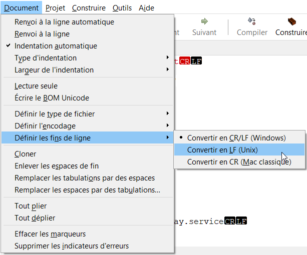

## Réponse détaillée

Les fins de lignes sont marquées de façon différente sous Windows et sous macOS ou Linux.

Windows utilise deux caractères pour marquer les fins de lignes : retour de chariot (Carridge Return ou CR) suivi de nouvelle ligne (Line Feed ou LF).

Sous Linux et sous macOS, les sauts de ligne sont encodés seulement avec LF (les anciennes versions de Mac utilisaient CR mais il y a longtemps que ce n'est plus le cas).

Lorsque vous travaillez sous Linux, l'utilisation d'un fichier avec des fins de ligne encodées avec CRLF peut causer toutes sortes de problèmes.

Par exemple, si vous tentez d'exécuter un fichier bash avec un encodage de fins de ligne à la Windows, vous pourriez obtenir le message suivant :

Résultat à l'écran

/bin/bash^M: bad interpreter: No such file or directory

### Vérifier les caractères de fin de ligne

Les techniques pour vérifier quels caractères de fin de ligne sont utilisés dépendent de votre système d'exploitation.

#### Windows, macOS ou Linux avec Geany

Avec l'éditeur Geany, vous pouvez aller dans le menu �?diter / Préférences / �?diteur / Affichage. Cochez Afficher les fins de ligne.

Vous verrez ceci :


Pour vérifier quels caractères sont utilisés pour marquer les fins de ligne, vous pouvez utiliser la commande file sur un système Linux ou macOS.

Terminal

file monfichier.sh

Si le fichier utiliser CRLF, vous obtiendrez un résultat semblable à ceci :

Résultat à l'écran

monfichier.sh: Bourne-Again shell script, UTF-8 Unicode text executable, with CRLF line terminators

Dans le cas où les fins de ligne sont correctement encodées avec LF, vous obtiendrez plutôt ceci :

Résultat à l'écran

monfichier.sh: Bourne-Again shell script, UTF-8 Unicode text executable

La commande cat avec l'option -v vous permettra de voir les caractères de fins de ligne mal encodés. Cette commande fonctionne sous macOS ou Linux.

Terminal

cat -v monfichier.sh

Si une fin de ligne est marquée par CRLF, elle apparaîtra sous la forme ^M.

Résultat à l'écran

#!/bin/bash^M

### Convertir les caractères de fins de ligne

Geany peut convertir les caractères de fins de ligne selon vos préférences.

Ici encore, les techniques disponibles dépendent de votre système d'exploitation.

#### Window, macOS ou Linux avec Geany

Sous Windows, macOS ou Linux, rendez-vous dans le menu Document / Définir les fins de ligne et choisissez l'option qui vous convient.


Sous macOS ou Linux, plusieurs utilitaires en ligne de commande permettent également d'effectuer la conversion.

Par exemple, vous pouvez entrer cette commande pour convertir les sauts de ligne CRLF en LF.

Prenez soin d'ajuster la commande : changez fichierCRLF.sh pour le nom du fichier original et fichierLF.sh pour le nom du fichier converti.

Terminal

perl -pe 's/\r$//g' < fichierCRLF.sh > fichierLF.sh

## 3.10 Nmap

[Nmap](https://nmap.org/) (Network mapper) est un petit utilitaire gratuit qui permet notamment de balayer une plage d'adresses IP afin de trouver l'adresse d'un périphérique branché au réseau et de connaître les ports ouverts (en anglais : port scanning).

Il fonctionne sous Linux, MacOS ou Windows.

Les gestionnaires de réseau s'en servent pour sonder leur réseau.

Vous pouvez vous aussi l'utiliser pour effectuer un balayage sur votre réseau à la maison.

Mais attention : si vous l'utilisez sur un réseau public ou sur le réseau d'une entreprise, ceci peut vous attirer des problèmes légaux, tel que spécifié sur le site de Nmap[1](https://nmap.org/book/legal-issues.html) :

> When used properly, Nmap helps protect your network from invaders. But when used improperly, Nmap can (in rare cases) get you sued, fired, expelled, jailed, or banned by your ISP.


Pour installer Nmap, vous pouvez télécharger la version qui correspond à votre système d'exploitation ici : <https://nmap.org/download.html> ou encore utiliser la ligne de commande.

Sous MacOS :

Terminal

brew install nmap

Sous Linux Ubuntu :

Terminal

sudo apt-get install nmap

## Trouver l'adresse IP d'un périphérique

Pour trouver les adresses IP utilisées dans le sous-réseau 192.168.1, entrez cette commande :

Terminal

nmap -T4 192.168.1.1-255

Dans le résultat obtenu à l'écran présenté plus bas, on voit que dans la plage d'adresses 192.168.1.1 à 192.168.1.255, plusieurs adresses IP sont utilisées.

192.168.1.1 est l'adresse locale du routeur (default gateway). Une autre des adresses correspond à l'ordinateur que vous utilisez.

Si vous recherchez l'adresse IP d'un Raspberry Pi, il reste à tenter de vous [apical\_lien\_interne][se\_brancher\_au\_raspberry\_pi\_via\_ssh,connecter via SSH][/apical\_lien\_interne] avec les autres adresses pour trouver laquelle correspond au Pi (je parierais sur l'adresse qui a un port ouvert pour le service ssh ou celle qui indique clairement le nom du Raspberry Pi mais ces informations ne sont pas toujours affichées).

Résultat à l'écran

MBPdeMonNom:~ monnom$ nmap -T4 192.168.1.1-255

 

Starting Nmap 7.91 ( https://nmap.org ) at 2020-12-09 12:19 EST  
Nmap scan report for 192.168.1.1  
Host is up (0.0067s latency).  
Not shown: 992 closed ports  
PORT       STATE     SERVICE  
53/tcp     open      domain  
80/tcp     open      http  
443/tcp    open      https  
2002/tcp   filtered  globe  
5000/tcp   open      upnp  
9100/tcp   open      jetdirect  
49152/tcp  open      unknown  
49153/tcp  open      unknown

 

Nmap scan report for 192.168.1.103  
Host is up (0.0070s latency).  
All 1000 scanned ports on 192.168.1.103 are closed

 

Nmap scan report for 192.168.1.116  
Host is up (0.0087s latency).  
Not shown: 999 closed ports  
PORT      STATE  SERVICE  
6668/tcp  open   irc

 

Nmap scan report for 192.168.1.126  
Host is up (0.023s latency).  
Not shown: 658 closed ports, 337 filtered ports  
PORT       STATE  SERVICE  
3689/tcp   open   rendezvous  
5000/tcp   open   upnp  
7000/tcp   open   afs3-fileserver  
7100/tcp   open   font-service  
62078/tcp  open   iphone-sync

 

Nmap scan report for 192.168.1.130  
Host is up (0.020s latency).  
Not shown: 998 closed ports  
PORT       STATE     SERVICE  
111/tcp    filtered  rpcbind  
62078/tcp  open      iphone-sync

 

Nmap scan report for MBPdeMonNom (192.168.1.131)  
Host is up (0.00049s latency).  
Not shown: 993 closed ports  
PORT      STATE  SERVICE  
80/tcp    open   http  
88/tcp    open   kerberos-sec  
443/tcp   open   https  
445/tcp   open   microsoft-ds  
2200/tcp  open   ici  
3306/tcp  open   mysql  
8000/tcp  open   http-alt

 

Nmap scan report for 192.168.1.134  
Host is up (0.0064s latency).  
Not shown: 999 closed ports  
PORT       STATE  SERVICE  
62078/tcp  open   iphone-sync

 

Nmap scan report for 192.168.1.140  
Host is up (0.011s latency).  
Not shown: 997 closed ports  
PORT       STATE  SERVICE  
53/tcp     open   domain  
80/tcp     open   http  
49152/tcp  open   unknown

 

Nmap scan report for raspberrypi (192.168.1.165)  
Host is up (0.0100s latency).  
Not shown: 998 closed ports  
PORT   STATE  SERVICE  
22/tcp open   ssh  
80/tcp open   http

 

Nmap scan report for 192.168.1.198  
Host is up (0.013s latency).  
Not shown: 999 closed ports  
PORT      STATE     SERVICE  
9080/tcp  filtered  glrpc

 

Nmap done: 255 IP addresses (10 hosts up) scanned in 35.67 seconds


1. « Legal Issues ». Nmap. <https://nmap.org/book/legal-issues.html>


« A Quick Port Scanning Tutorial ». Nmap. <https://nmap.org/book/port-scanning-tutorial.html>

## 3.11 Commandes réseau (ifconfig)

La commande [ifconfig](https://man7.org/linux/man-pages/man8/ifconfig.8.html) permet d'obtenir de l'information sur les configurations réseau et, optionnellement, de les modifier.

La première fois que vous lancez cette commande, il se peut que vous obteniez le message « -bash: ifconfig: command not found ». Pour régler le problème, vous devez lancer cette commande :

Terminal

sudo apt install net-tools

Après cela, la commande sera reconnue.

## Informations sur le réseau

Pour connaître les configurations réseau, notamment l'adresse IP de l'ordinateur, lancez la commande ifconfig sans aucun paramètre :

Terminal

ifconfig

Résultat à l'écran

pi@raspberrypi:~ $ ifconfig  
eth0: flags=4163<UP,BROADCAST,RUNNING,MULTICAST> mtu 1500  
          inet 209.197.21.136 netmask 255.255.255.0 broadcast 209.197.21.255  
          inet6 ff80::688d:633f:1aa9:9c99 prefixlen 64 scopeid 0x20<link>  
          ether b9:29:ee:b9:dd:a9 txqueuelen 1000 (Ethernet)  
          RX packets 3396 bytes 276824 (270.3 KiB)  
          RX errors 0 dropped 0 overruns 0 frame 0  
          TX packets 92 bytes 10453 (10.2 KiB)  
          TX errors 0 dropped 0 overruns 0 carrier 0 collisions 0

 

lo: flags=73<UP,LOOPBACK,RUNNING> mtu 65536  
          inet 127.0.0.1 netmask 255.0.0.0  
          inet6 ::1 prefixlen 128 scopeid 0x10<host>  
          loop txqueuelen 1000 (Local Loopback)  
          RX packets 0 bytes 0 (0.0 B)  
          RX errors 0 dropped 0 overruns 0 frame 0  
          TX packets 0 bytes 0 (0.0 B)  
          TX errors 0 dropped 0 overruns 0 carrier 0 collisions 0

 

wlan0: flags=4163<UP,BROADCAST,RUNNING,MULTICAST> mtu 1500  
          inet 192.168.1.145 netmask 255.255.255.240 broadcast 192.168.1.255  
          inet6 2609:b109:d39:f46c:9619:5ede:b859:83e9 prefixlen 64 scopeid 0x0<global>  
          inet6 fe89::88f9:1cb9:893b:39c9 prefixlen 64 scopeid 0x20<link>  
          ether b9:29:ee:e9:89:f9 txqueuelen 1000 (Ethernet)  
          RX packets 309 bytes 266742 (260.4 KiB)  
          RX errors 0 dropped 0 overruns 0 frame 0  
          TX packets 243 bytes 30961 (30.2 KiB)  
          TX errors 0 dropped 0 overruns 0 carrier 0 collisions 0


Il est possible d'empêcher les connections Wi-Fi sans devoir modifier les configurations ni redémarrer le Pi.

Terminal

sudo ifconfig wlan0 down

Et pour recommencer à utiliser le Wi-Fi :

Terminal

sudo ifconfig wlan0 up

## 3.12 Copier une image du système d'exploitation sur une carte microSD (flasher)

Un fichier image permet d'installer sur une carte microSD un système d'exploitation ainsi que des configurations et logiciels prédéfinis. On dira flasher l'image sur la carte.

Peu importe la technique utilisée, tout ce qui se trouvait sur la carte sera écrasé par l'image.

Je vous propose trois techniques pour y arriver :

* [Avec Raspberry Pi Imager](999_999_merged.md#raspberry)
* [�? la ligne de commande](999_999_merged.md#commande) (Mac et Linux seulement)
* [Avec Etcher](051_060_merged.md#etcher)

## Raspberry Pi Imager

Raspberry Pi Imager est généralement utilisé pour flasher sur une carte le système d'exploitation Raspberry Pi OS. Ce petit utilitaire permet également de flasher n'importe quelle image sur une carte.

De plus, il offre la possibilité d'exécuter quelques configurations directement sur le système Linux qu'il s'apprête à copier. Intéressant!

L'outil peut être installé sur un système Windows, Mac ou Linux.

Pour installer Raspberry Pi Imager sur votre poste de travail, téléchargez-le à partir d'ici : <https://www.raspberrypi.org/downloads/>.

Une fois installé, lancez-le. Vous obtiendrez cet écran d'accueil.

Ici, vous n'avez pas besoin de cliquer sur CHOISIR LE MOD�^LE.

Cliquez sur CHOISISSEZ L'OS pour choisir le système d'exploitation à installer.

Sélectionnez Utiliser image personnalisée (Use custom) afin de pouvoir sélectionner une image sur votre poste de travail.

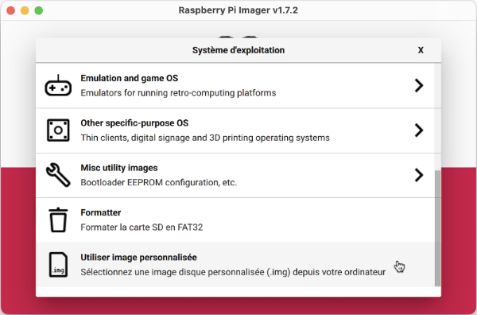

Retrouvez l'image que vous désirez flasher sur la carte. Raspberry Pi Imager est capable de travailler avec un fichier .zip donc inutile de le décompresser.

Cliquez sur CHOISIR LE STOCKAGE pour sélectionner votre carte micro SD.

Cliquez ensuite sur SUIVANT.

Depuis la version 1.6 de Raspberry Pi Imager, il est possible d'effectuer automatiquement certaines configurations sur le système Linux que l'outil s'apprête à copier sur la carte. Cliquez sur le bouton MODIFIER R�?GLAGES lorsqu'il vous est proposé puis remplissez les configurations souhaitées.

Cliquez maintenant sur ENREGISTRER. Dans l'écran suivant, cliquez sur OUI pour que les réglages soient utilisés.

L'image sera installée sur votre carte micro SD.

## �? la ligne de commande

Si vous travaillez sur un ordinateur Mac, l'image peut être flashée à l'aide de la commande dd (Disk Duplicator) sans avoir à faire d'installation supplémentaire.

Si l'image est contenue dans un fichier .zip, il faut d'abord décompresser ce fichier. On obtiendra alors un fichier .img.

Vous aurez besoin de connaître le point de montage de la carte micro SD. L'information peut être trouvée à l'aide de cette commande :

Terminal

diskutil list

Résultat à l'écran

monnom@MacBook-Pro-de-MonNom ~ %diskutil list  
/dev/disk0 (internal, physical):  
...

 

/dev/disk1 (synthesized):  
...

 

/dev/disk2 (external, physical):  
 #: TYPE NAME SIZE IDENTIFIER  
 0: FDisk\_partition\_scheme \*31.9 GB disk2  
 1: Windows\_FAT\_32 ⁨boot⁩ 268.4 MB disk2s1  
 2: Linux ⁨⁩ 31.6 GB disk2s2

On voit ici que le point de montage est disk2 puisqu'il s'agit d'un périphérique externe dont la capacité correspond à la carte.

Pour lancer la copie, utilisez ces commandes.

Prenez soin d'ajuster le nom du fichier .img et de remplacer le N par le chiffre qui correspond au point de montage.

Terminal

diskutil unmountDisk /dev/diskN

 

sudo dd bs=1m if=*chemin*/nom-du-fichier.img of=/dev/rdiskN conv=sync

Note : sous Mac, pour copier facilement le chemin du fichier .img, vous pouvez utiliser cette technique : [apical\_lien\_interne]copier\_le\_chemin\_d\_un\_fichier[/apical\_lien\_interne].

Si vous voulez en savoir plus, les instructions détaillées sur la commande dd sont données ici : [apical\_lien\_interne]copie\_integrale\_d\_un\_disque\_avec\_la\_commande\_dd[/apical\_lien\_interne].

## Etcher

Il existe de nombreux autres utilitaires pour flasher l'image sur la carte, par exemple [Etcher](https://www.balena.io/etcher/). Cet utilitaire peut être utilisé sous Windows, Mac ou Linux.


« 6 Best Raspberry Pi Imager Options and My Surprise Top Pick ». Smart Home Beginner. <https://www.smarthomebeginner.com/best-raspberry-pi-imager/>

## 3.13 Ajuster la date et l'heure sous Linux

Le travail sous Linux sera plus facile si la date et l'heure correspondent à votre réalité.

De plus, une mauvaise configuration de la date pourrait mener à toutes sortes de problèmes, par exemple des certificats SSL considérés invalides, ce qui empêche l'installation de certains logiciels ou paquets.

Dans cette fiche :

* [Informations actuelles](999_999_merged.md#infosactuelles)
* [Ajuster la date - réponse courte](999_999_merged.md#responsecourte)
* [Ajuster la date - réponse plus élaborée](999_999_merged.md#reponseelaboree)  
  + [Ajuster le fuseau horaire](999_999_merged.md#fuseau)
  + [Ajuster la date et l'heure](999_999_merged.md#dateetheure)
  + [Activer la synchronisation de l'horloge](999_999_merged.md#synchro)

## Informations actuelles

Pour voir les configurations actuelles de l'horloge, vous pouvez travailler avec la commande [date](https://man7.org/linux/man-pages/man1/date.1.html).

Commande Linux

date

Vous obtiendrez un résultat du genre :

Résultat à l'écran

vendredi 3 décembre 2021, 08:53:09 (UTC-0500)

Pour obtenir plus d'informations, il est possible de travailler avec [timedatectl](https://www.commandlinux.com/man-page/man1/timedatectl.1.html).

Commande Linux

timedatectl

Vous obtiendrez un résultat du genre :

Résultat à l'écran

Local time: ven 2021-12-03 08:53:23 EST

 

  Universal time: ven 2021-12-03 13:53:23 UTC

 

        RTC time: n/a

 

       Time zone: America/Toronto (EST, -0500)

 

 Network time on: yes

 

NTP synchronized: no

 

 RTC in local TZ: no

## Ajuster la date - réponse courte

La date et l'heure du système peuvent être ajustés comme suit :

Terminal

sudo timedatectl set-time 'AAAA-MM-JJ HH:mm:ss'

ou encore :

Terminal

sudo date -s "AAAA-MM-JJ HH:mm:ss"

## Ajuster la date - réponse plus élaborée

Les commandes précédentes ne fonctionnent pas ou vous désirez modifier également le fuseau horaire ou simplement vous désirez en savoir plus?

Cette section est pour vous!

### Ajuster le fuseau horaire

Pour configurer le fuseau horaire, vous devez d'abord connaître les fuseaux existants.

Commande Linux

timedatectl list-timezones

Vous devez également connaître le fuseau actuellement configuré.

Ceci peut être réalisé à l'aide de timedatectl comme démontré plus haut ou encore à l'aide d'une de ces techniques qui donnent des informations complémentaires.

Commande Linux

cat /etc/timezone

Résultat à l'écran

America/Toronto

ou, si la variable d'environnement TZ existe :

Terminal

echo $TZ

Résultat à l'écran

America/Toronto

ou

Commande Linux

date +"%Z %z"

Résultat à l'écran

EST -0500

#### timedatectl

Il est possible de modifier le fuseau horaire directement à l'aide de la commande **timedatectl**:

Commande Linux

sudo timedatectl set-timezone America/Toronto

#### tzdata

Vous pouvez également configurer le fuseau horaire à l'aide de tzdata.

Le programme vous demandera votre emplacement et votre fuseau horaire puis ajustera automatiquement l'horloge pour vous.

Commande Linux

sudo dpkg-reconfigure tzdata

#### lien symbolique

Dans le système de fichiers, le fuseau horaire est configuré à l'aide d'un lien symbolique qui pointe vers le fichier du fuseau horaire souhaité.

Pour connaître la configuration actuelle :

Terminal

ls -l /etc/localtime

Résultat à l'écran

lrwxrwxrwx 1 root root 27 déc 3 09:07 /etc/localtime -> /usr/share/zoneinfo/Etc/UTC

Pour modifier ce lien :

Commande Linux

sudo ln -sf /usr/share/zoneinfo/America/Toronto /etc/localtime

Maintenant, vous obtiendrez ceci :

Résultat à l'écran

pi@raspberrypi:/usr/share/zoneinfo $ ls -l /etc/localtime  
lrwxrwxrwx 1 root root 35 déc 3 09:13 /etc/localtime -> /usr/share/zoneinfo/America/Toronto

#### export

Le fuseau horaire peut également être obtenu en questionnant la variable d'environnement TZ, tel que démontré plus tôt.

Il est possible de modifier cette variable comme ceci. Notez que cette modification ne sera pas permanente sauf si vous entrez cette commande dans le fichier ~/.bashrc ou, plus globalement, dans le fichier /etc/environment.

Attention : cette technique a une portée plus réduite que les précédentes puisqu'elle n'affectera pas le lien symbolique. La commande date donnera le bon fuseau horaire mais avec timedatectl, le fuseau horaire demeurera inchangé.

Commande Linux

export TZ=America/Toronto

### Ajuster la date et l'heure

Si, une fois le fuseau horaire ajusté, la date et/ou l'heure ne correspondent pas à la réalité, vous pouvez ajuster votre système à l'aide d'une de ces techniques.

#### date

Pour ajuster la date et l'heure avec la commande date :

Terminal

sudo date -s "AAAA-MM-JJ HH:mm:ss"

#### timedatectl

 Le même résultat peut être obtenu à l'aide de timedatectl :

Terminal

sudo timedatectl set-time 'AAAA-MM-JJ HH:mm:ss'

Notez que si vous obtenez le message « Failed to set time: Automatic time synchronization is enabled », vous devez désactiver le service NTP (Network Time Protocol) comme suit :

Terminal

sudo timedatectl set-ntp 0

Vous pourrez ensuite relancer la commande pour ajuster la date et l'heure.


Si, lorsque vous lancez la commande timedatectl, vous obtenez une ligne qui dit System clock synchronized: No, vous pouvez activer la synchronisation de l'horloge avec ces commandes :

Terminal

sudo apt install systemd-timesyncd  
sudo timedatectl set-ntp true

Si vous ne parvenez pas à activer la synchronisation de l'horloge, vous pouvez rechercher une solution ici : <https://askubuntu.com/questions/1046214/enable-system-clock-synchronization>.

## 3.14 �?diteur nano

nano est un tout petit éditeur texte, souvent utilisé pour éditer des fichiers de configuration.

Il est installé par défaut sur la plupart des distributions Linux de même que sur MacOS.

Pour le lancer, il suffit d'entrer la commande nano suivie par le nom du fichier à éditer. Notez que le fichier sera créé s'il n'existait pas.

Terminal

nano monfichier.txt

Si le fichier n'est pas dans le dossier courant, il est possible d'entrer le chemin complet avant le nom du fichier.

Terminal

nano /chemin/monfichier.txt

Dans le cas d'un fichier qui est placé dans un dossier système, il faudra utiliser sudo pour avoir la permission de l'enregistrer une fois les modifications effectuées.

Terminal

sudo nano /etc/NetworkManager/system-connections/preconfigured.nmconnection

Il est possible de faire afficher le numéro de ligne et de colonne courants au bas de l'écran en ajoutant l'option -c.

Terminal

nano -c /chemin/monfichier.txt

Quand vous avez terminé d'éditer le fichier, appuyez sur Ctrl + X puis O (ou Y si votre OS est en anglais) pour enregistrer les modifications.


Bien que nano soit un éditeur en ligne de commande, il vous offre plusieurs raccourcis-clavier pour effectuer les principales actions dont vous aurez besoin.

Les principaux raccourcis sont affichés au bas de la fenêtre.

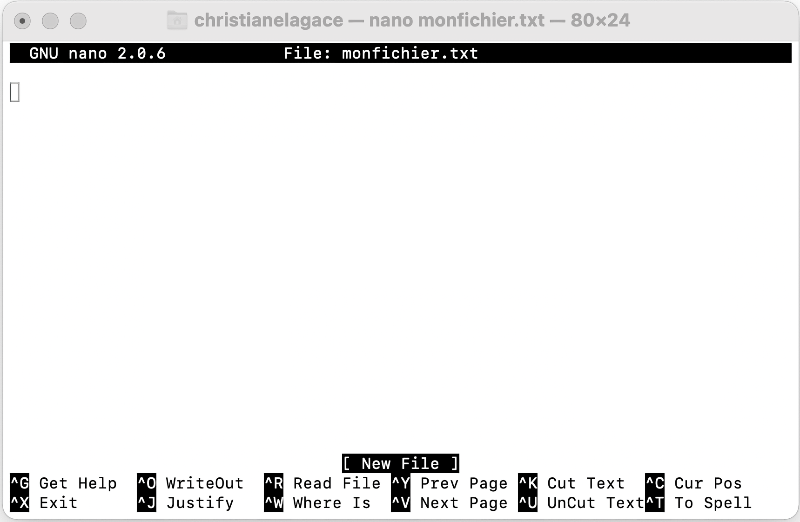

Le symbole ^ placé devant un caractère indique qu'il faut appuyer sur la touche Ctrl (même sous Mac).

La lettre M placée devant un caractère indique qu'il faut appuyer sur la touche Alt ou Esc selon votre système.

Voici quelques raccourcis qui pourraient vous être utiles :

* Ctrl + G : afficher l'aide, avec notamment une liste de tous les raccourcis-clavier
* Ctrl + O : enregistrer sans sortir de Nano (c'est la lettre O et non le chiffre)
* Ctrl + X : sortir de nano (si des modifications sont en cours, il vous demandera si vous désirez enregistrer)
* Ctrl + K : effacer la ligne courante (Kut)
* Ctrl + \_ : aller à une ligne et possiblement à une colonne donnée
* Ctrl + W : rechercher du texte
* Ctrl + \ : rechercher et remplacer
* Ctrl + C : afficher le numéro de ligne et de colonne du curseur
* Esc  6 : copier le texte sélectionné dans le presse-papier. Si aucun texte sélectionné, copie la ligne courante.
* Ctrl + U : coller le contenu du presse papier
* Esc  D : compter le nombre de mots, de lignes et de caractères
* Esc  U : défaire (undo)
* Esc  E : rétablir (redo)

## 3.15 �?diteur vim

Dans cette fiche :

* [vim](#vim)
* [Mode commande vs mode insertion](999_999_merged.md#mode)
* [Principales commandes](999_999_merged.md#commandes)

## vim

vim, le successeur de vi, est un éditeur très ancien et très peu convivial mais très puissant. Tout utilisateur Linux doit en avoir une connaissance de base car il est profondément ancré dans le monde Linux. Il est encore, de nos jours, utilisé par la plupart des administrateurs de systèmes Linux.

Pour lancer cet éditeur, entrez la commande vim suivie du nom du fichier. Si aucun fichier ne correspond au nom demandé, un fichier vierge sera créé lorsque le travail sera enregistré.

Ex :

Commande Linux

vim nom\_fichier

## Mode commande vs mode insertion

vim fonctionne en deux modes :

* En mode d'insertion (ou d'entrée) : pour entrer du texte
* En mode commande : pour utiliser une commande dans le tableau qui suit

�? son ouverture, vim vous place en mode commande. Pour passer d'un mode à l'autre :

* en mode commande : la lettre i ou la touche INSERT vous place en mode insertion
* en mode d'insertion : ESCAPE vous place en mode commande


Voici quelques commandes utiles. Pour entrer ces commandes, vous devez d'abord vous placer en mode commande.

| Commande | Rôle |
| --- | --- |
| i (ou touche INSERT) | Passe en mode d'insertion |
| :w | Write : Sauvegarde les changements |
| :w nom | Sauvegarde en spécifiant le nom du fichier |
| :wq | Write and Quit : Sauvegarde et sort |
| :q! | Quit : Sort sans conserver les changements. ! = Aucun message d'avertissement |
| :q | Sort directement, si aucun changement n'a été effectué |
| :n ou nG | Se place sur la ligne n Ex : :5 -> va à la ligne 5 |
| :set number | Affiche les numéros de lignes |
| :set nonu | Enlève l'affichage des numéros de lignes |
| :debut,fin s/chaîne\_ori/chaine\_modif/g ou  :debut,fin s/chaîne\_ori/chaine\_modif/c | Remplace le texte globalement ou avec demande de confirmation Aucun espace dans toute la commande  Utiliser le signe $ pour représenter la dernière ligne du fichier  Le s signifie Substitute  Le g signifie Globalement  Le c signifie Confirmation  Ex: :1,$s/allo/salut/g -> remplace tous les allo par des salut |
| :!commande | Lance une commande au shell Ex : :!date -> affiche la date du jour |
| :!lp nom\_fichier | Imprime le fichier (il faut spécifier son nom puisqu'il s'agit d'une commande au shell) |
| Y | Y majuscule : Yank : copie une ligne |
| Y3Y | Copie 3 lignes |
| dd | Coupe une ligne |
| d3d | Coupe 3 lignes |
| dw | DeleteWord : Coupe un mot |
| D ou d$ | Coupe les caractères à partir du curseur jusqu'à la fin de la ligne |
| p | P minuscule : Paste : coller à la suite de la ligne du curseur ce qui a été coupé ou copié |
| P | P majuscule : Paste : coller avant la ligne du curseur ce qui a été coupé ou copié |
| u | Undo |
| / | Pour effectuer une recherche dans le texte (comme dans man) n pour rechercher occurrence suivante  N pour rechercher occurence précédente |
| :noh | No Highlight : Enlève l'affichage inverse vidéo dû à la précédente recherche |
| F1 ou :help | Aide (pour sortir de l'aide : :q) L'aide obtenue par F1 sera différente de celle obtenue par :help |
| Ctrl+l | Ctrl + L minuscule : Réaffiche l'écran (enlève les messages d'erreur) |
| Ctrl+[ | Annule une commande partiellement formée |
| Ctrl+g | Affiche nom du fichier et position du curseur (Ctrl+l pour enlever l'affichage) |
| . | Répète la dernière opération |
| :flèche\_haut | Historique des commandes |

Vous pouvez également copier un bloc de texte à l'aide des fonctionnalités standard du shell (prendre en bloc pour copier puis cliquer à l'aide du bouton du centre pour coller).

Pour plus de détails sur les commandes et le fonctionnement de vim :

Commande Linux

man vim

## 3.16 nmcli, l'outil en ligne de commande du NetworkManager

Network Manager est un outil de gestion de réseaux pour les systèmes Linux.

Il n'est pas installé par défaut sur toutes les saveurs Linux. Par exemple, il ne l'est pas sous [apical\_lien\_interne][installation\_de\_raspberry\_pi\_os,Raspberry Pi OS][/apical\_lien\_interne] mais il l'est sous [apical\_lien\_interne][installation\_de\_home\_assistant\_et\_premier\_acces,HassOS][/apical\_lien\_interne].

Lorsque Network Manager est installé, plusieurs opérations sur le réseau peuvent être réalisées dans une fenêtre Terminal grâce à la commande nmcli.

Je vous en présente ici quelques-unes.

| Commande | Utilité | Exemple | Résultat à l'écran |
| --- | --- | --- | --- |
| nmcli general status | Affiche l'état du réseau. | nmcli general status | STATE       CONNECTIVITY   WIFI-HW   WIFI     WWAN-HW   WWAN  connected full                     enabled     enabled   enabled        enabled |
| nmcli device status  ou  nmcli device  ou  nmcli dev | Affiche l'état des périphériques de réseau : eth0, wifi, docker0, hassio, dummy0, etc. | nmcli dev | DEVICE          TYPE       STATE           CONNECTION  eth0              ethernet  connected     my-network wlan0            wifi         disconnected  --  docker0         bridge     unmanaged   --  hassio           bridge      unmanaged   --  dummy0        dummy    unmanaged   --  veth2699941 ethernet   unmanaged   --  veth325a905 ethernet   unmanaged   --  veth552f89d  ethernet   unmanaged   --  veth5ed12c5  ethernet   unmanaged   --  veth7a81945  ethernet   unmanaged   --  veth7d1b12e  ethernet   unmanaged   --  vethc11a8d9  ethernet   unmanaged   --  vethc6aa009  ethernet   unmanaged   --  vethfa30482  ethernet   unmanaged   --  lo                  loopback  unmanaged   -- |
| nmcli device wifi | Affiche l'état des réseaux Wi-Fi. |  | IN-USE BSSID SSID MODE CHAN RATE SIGNAL BARS SECURITY   00:0C:E6:88:F6:23 MONRESEAU Infra 6 195 Mbit/s 64 \*\*\* --   00:0C:E6:88:AC:A3 MONRESEAU Infra 11 195 Mbit/s 60 \*\*\* --   00:0C:E6:88:F3:E3 MONRESEAU Infra 1 195 Mbit/s 40 \*\* --   96:53:30:D3:02:D5 DIRECT-d5-HP M203 LaserJet Infra 6 130 Mbit/s 39 \*\* WPA2   00:0C:E6:88:F3:E2 -- Infra 1 195 Mbit/s 34 \*\* WPA2 802.1X |
| nmcli device wifi show | Affiche le SSID du réseau Wi-Fi actif ainsi que son mot de passe en clair. Un code QR permet à un appareil de se connecter à ce réseau (pas de code QR quand la commande est lancée via SSH). | nmcli device wifi show | SSID: ssid-du-reseau Security: WPA Password: mot-de-passe-en-clair |
| nmcli radio | Affiche le statut des interfaces radio Wi-Fi et WWAN (réseaux étendus sans fil  ou, en anglais, Wireless Wide Area Network). | nmcli radio | WIFI-HW   WIFI       WWAN-HW   WWAN  enabled     enabled   enabled       enabled |
| nmcli con  ou  nmcli con show | Affiche la liste des profils de connexion, dont leur nom qui est utilisé dans plusieurs commandes plus bas | nmcli con | NAME            UUID             TYPE        DEVICE  my-network   a983c...829   ethernet   eth0  hotspot         4deea...6ed   wifi          -- |
| nmcli device wifi rescan | Effectue une nouvelle recherche des réseaux Wi-Fi (n'affiche rien à l'écran, faire suivre de nmcli device wifi pour voir la nouvelle liste des réseaux connus). | nmcli device wifi rescan  nmcli device wifi |  |
| nmcli device wifi connect | Connecte le système à un réseau Wi-Fi à l'aide de son SSID et de son mot de passe. | nmcli device wifi connect "ssid-du-reseau" password "mot-de-passe-en-clair" |  |
| nmcli con add | Crée un nouveau profil de connexion. | nmcli con add type wifi con-name wifi-maison ssid "nom-du-reseau"  OU  nmcli con add type ethernet con-name cable-maison |  |
| nmcli con delete | Supprime un profil de connexion (supprime le fichier correspondant dans le dossier /etc/NetworkManager/system-connections). | nmcli con delete id "nom-du-profil" |  |
| nmcli con up profil-connexion | Active une connexion à partir de son profil de connexion. | nmcli con up "nom-du-profil" |  |
| nmcli con down profil-connexion | Désactive une connexion à partir de son profil de connexion. | nmcli con down "nom-du-profil" |  |
| nmcli network off | Déconnecte le système de tous les réseaux. | nmmcli network off |  |
| nmcli network on | Reconnecte le système à tous les réseaux. | nmcli network on |  |
| nmcli con edit profil-connexion | �?dite un profil de connexion dont le fichier est présent dans le dossier /etc/NetworkManager/system-connections. | nmcli con edit my-network | nmcli> set ipv4.addresses 192.168.1.145/24 Do you also want to set 'ipv4.method' to 'manual'? [yes]: yes nmcli> set ipv4.dns xxx.xxx.xxx.xxx nmcli> set ipv4.gateway 192.168.1.1 nmcli> save Connection 'my-network (a983c9da...) successfully updated. nmcli> quit |
| nmcli con reload | Recharge les configurations réseau à partir des fichiers présents dans le dossier /etc/NetworkManager/system-connections. | nmcli con reload |  |
| nmcli con show profil-connexion | Affiche le profil de connexion, notamment l'adresse IP. | nmcli con show my-network | connection.id:                           my-network connection.uuid:                        a983c9d... connection.stable-id:                  -- connection.type:                        802-3-ethernet connection.interface-name:         -- connection.autoconnect:             yes connection.autoconnect-priority:   0 connection.autoconnect-retries:   -1 (default) connection.multi-connect:            0 (default) connection.auth-retries:              -1 connection.timestamp:                1634654402 connection.read-only:                  no connection.permissions:               -- connection.zone:                         -- connection.master:                      -- connection.slave-type:                 -- connection.autoconnect-slaves:    -1 (default) connection.secondaries:               -- connection.gateway-ping-timeout:    0 connection.metered:                     unknown connection.lldp:                            default connection.mdns:                         -1 (default) connection.llmnr:                         -1 (default) connection.wait-device-timeout:    -1 802-3-ethernet.port:                     -- ... ipv4.method:                               auto ipv4.dns:                                     8.8.8.8,8.8.4.4 ... GENERAL.NAME:                          my-network GENERAL.UUID:                           a983c9da... GENERAL.DEVICES:                      eth0 ... IP4.ADDRESS[1]:                       192.168.1.145/24 IP4.GATEWAY:                             192.168.1.1 ... |


« Utiliser l'outil de ligne de commande du NetworkManager, nmcli ». RedHat. <https://access.redhat.com/documentation/fr-fr/red_hat_enterprise_linux/7/html/networking_guide/sec-using_the_networkmanager_command_line_tool_nmcli>

« nmcli - Man Page ». ManKier. <https://www.mankier.com/1/nmcli>

« nmcli - examples - Man Page ». Mankier. <https://www.mankier.com/7/nmcli-examples>

« Gestion du réseau Linux avec NetworkManager ». François Goffinet. <https://linux.goffinet.org/administration/configuration-du-reseau/gestion-du-reseau-linux-avec-networkmanager/>

« nmcli ». Gnome Developer. <https://developer-old.gnome.org/NetworkManager/stable/nmcli.html>

« nmcli-examples ». Gnome Developer. <https://developer-old.gnome.org/NetworkManager/stable/nmcli-examples.html>


Sous Linux, la commande [systemctl](https://www.man7.org/linux/man-pages/man1/systemctl.1.html) permet d'effectuer différentes vérifications et configurations sur le gestionnaire de services systemd.

Voici quelques commandes utiles.

| Commande | Utilité | Résultat à l'écran |
| --- | --- | --- |
| systemctl restart NetworkManager | Redémarrer le service de réseau |  |
| systemctl list-unit-files | grep NetworkManager | Vérifier l'état des services de réseau | NetworkManager-dispatcher.service     enabled   enabled NetworkManager-wait-online.service   enabled enabled NetworkManager-service                    enabled enabled |
| systemctl --system daemon-reload | Recharger toutes les configurations de systemd, sans redémarrer les services |  |
| systemctl restart hassos-supervisor | Sous Home Assistant, redémarrer le superviseur de hassos |  |

<!-- --- split --- -->

# 4. Raspberry Pi

## 4.1 Bien traiter son Raspberry Pi :-)

Le Raspberry Pi est un petit ordinateur alors certaines précautions s'imposent quand on le manipule.

## Boîtier

Le Raspberry Pi doit être fixé dans un boîtier. Ceci le protégera des chocs et de la poussière en plus de vous aider à ne pas mettre vos doigts sur ses composantes électronique.

## Dissipateurs thermiques

Il pourrait arriver que le Pi chauffe. Assurez-vous que des dissipateurs thermiques (heatsink) soient collés aux endroits appropriés. Généralement, on en place un sur le processeur, un sur la mémoire vive, un sur le contrôleur Ethernet et un autre sur le contrôleur USB.

## Ventilateur

Il est intéressant d'ajouter un ventilateur si le boîtier le permet.

Pour que le ventilateur fonctionne à bas régime, il faut brancher le fil rouge sur la broche 3.3V ([apical\_lien\_interne][qu\_est-ce\_que\_le\_gpio,broche physique no 1,pinout][/apical\_lien\_interne]) et le fil noir sur une des broches de mise à terre (broche no 6, 9, 14, 20, 25, 30, 34 ou 39).

Notez que pour que le ventilateur tourne plus vite, il suffit de brancher le fil rouge sur une broche 5V (broche no 2 ou 4).

Dans le cas où le ventilateur comporte un troisième fil, généralement bleu, ce fil doit être branché sur la broche TXD (no 8).

## Câble du bloc d'alimentation

�?vitez d'enrouler le fil du bloc d'alimentation alentour du bloc. Ceci accélère son usure et risque de casser plus rapidement les petits fils qui sont à l'intérieur.

En effet, à force de l'enrouler et de le dérouler, le fil devient complètement tordu.

Il est préférable de replier le fil sur lui-même, quitte à terminer par un tour ou deux.

## Manipulation de la carte micro SD

Lors du retrait de la carte micro SD, tirez-la horizontalement. Si vous tentez de la tirer verticalement, vous risquez d'endommager l'unité dans laquelle la carte est insérée.

## Branchements au GPIO

Lorsque vous effectuez des branchements au GPIO, assurez-vous que le Pi ne soit pas sous tension.


Assurez-vous d'[apical\_lien\_interne][Eteindre\_un\_systeme\_linux\_de\_facon\_securitaire,éteindre le système de façon sécuritaire][/apical\_lien\_interne] avant de débrancher le Raspberry Pi.


Si vous souhaitez installer un système Linux sur un Raspberry Pi, l'outil Raspberry Pi Imager est votre ami!

Il s'agit d'un petit utilitaire que vous installez sur votre poste de travail et qui permet d'installer sur une carte micro SD la toute dernière version du système d'exploitation choisi.

Notez que si vous préférez installer Raspberry Pi OS sans devoir installer un logiciel sur votre poste de travail, [apical\_lien\_interne][installation\_de\_raspberry\_pi\_os,il est possible de le faire manuellement][/apical\_lien\_interne] mais les étapes sont plus nombreuses.

L'outil peut être installé sur un système Windows, Mac ou Linux Ubuntu.

Pour installer Raspberry Pi Imager sur votre poste de travail, téléchargez-le à partir d'ici : <https://www.raspberrypi.org/downloads/>.

Une fois installé, lancez-le. Vous obtiendrez cet écran d'accueil.

Ciquez sur CHOISIR LE MOD�^LE pour sélectionner votre modèle de Raspberry Pi.

Cliquez sur CHOISIR L'OS pour choisir le système d'exploitation à installer.

* Dans la plupart des cas, l'interface graphique n'est pas requise. Choisissez alors Raspberry Pi OS (other) puis Raspberry Pi OS Lite (64 bit).
* Si vous avez besoin d'une version avec interface graphique, choisissez Raspberry Pi OS (64 bit).

Remarque : Raspberry Pi OS (appelé autrefois Raspbian) est une version de Debian spécialement adaptée pour le Raspberry Pi.

Cliquez sur CHOISIR LE STOCKAGE pour sélectionner votre carte micro SD.

Cliquez ensuite sur SUIVANT.

Depuis la version 1.6 de Raspberry Pi Imager, il est possible d'effectuer automatiquement certaines configurations sur le système Linux que l'outil s'apprête à copier sur la carte. Cliquez sur le bouton MODIFIER R�?GLAGES lorsqu'il vous est proposé puis remplissez les configurations souhaitées.

Parmi les configurations utiles, notons :

* le nom et le mot de passe de l'usager Linux
* l'activation SSH
* la configuration du réseau Wi-Fi
* la configuration du clavier (qwerty: us vs azerty: fr).

Cliquez maintenant sur ENREGISTRER. Dans l'écran suivant, cliquez sur OUI pour que les réglages soient utilisés.

Le système d'exploitation sera installé sur votre carte micro SD.

Notez que vous pourriez avoir besoin du mot de passe d'un compte administrateur sur votre poste de travail pour y arriver.

Patientez, l'opération se déroule sur de nombreuses minutes.

Une fois l'écriture sur la carte terminée, [apical\_lien\_interne][retirer\_un\_disque\_amovible\_de\_facon\_securitaire,retirez la carte de l'ordinateur de façon sécuritaire][/apical\_lien\_interne], insérez-la dans le Pi puis démarrez ce dernier.

Et voilà!

## 4.3 Configurer le réseau sans fil sur Raspberry Pi OS

Plusieurs options vous permettent de connecter le Raspberry Pi à un réseau :

* câble RJ-45 (ethernet)
* réseau Wi-Fi régulier
* [apical\_lien\_interne][retrouver\_le\_nom\_du\_reseau\_et\_le\_mot\_de\_passe\_du\_partage\_de\_connexion\_ce\_\_\_,partage de la connection cellulaire d'un téléphone ][/apical\_lien\_interne] (ausssi appelé hot spot ou Wi-Fi access point)

Lorsque vous travaillez avec un câble RJ-45, vous n'avez pas de configurations spécifique à faire. Le Pi saura trouver le réseau.

Les techniques que je vous propose ici vous permettront de connecter sans fil un Pi qui roule avec Raspberry Pi OS, soit avec le Wi-Fi ou avec le partage de connexion cellulaire.

Notez que pour une connexion Wi-Fi, le Raspberry Pi 3 ne supporte que le 2.4 GHz alors que le Raspberry Pi 4 supporte également le 5 GHz. Entrez vos configurations en conséquence!

Dans cette fiche :

* [NetworkManager vs dhcpcd](999_999_merged.md#environnement)
* [Configurer le réseau à l'aide de NetworkManager](999_999_merged.md#networkmanager)
  + [Utilitaire nmtui](999_999_merged.md#nmtui)
  + [Commande nmcli](999_999_merged.md#nmcli)
  + [Configurer le réseau à l'aide de l'utilitaire raspi-config](999_999_merged.md#raspi)
* [Vérifier les configurations réseau](999_999_merged.md#verification)

## NetworkManager vs dhcpcd

Depuis Raspberry Pi OS Bookworm (2023), la gestion du réseau est réalisée avec [NetworkManager](https://networkmanager.dev/). Auparavant, elle était faite avec [dhcpcd](https://github.com/NetworkConfiguration/dhcpcd).

Pour vérifier si le système d'exploitation du Raspberry Pi utilise NetworkManager, entrez cette commande :

Terminal du Pi

nmcli device status

Résultat à l'écran

pi@raspberrypi:~ $ nmcli device status  
DEVICE          TYPE       STATE                    CONNECTION   
eth0            ethernet   connected                Wired connection 1   
lo              loopback   connected (externally)   lo   
wlan0           wifi       disconnected             --   
p2p-dev-wlan0   wifi-p2p   disconnected             --

Dans la colonne STATE, si vous voyez connected ou disconnected, c'est que l'OS utilise NetworkManager.

Si vous voyez plutôt unmanaged, ou encore si la commande nmcli n'est pas reconnue, c'est que l'OS utilise un auytre système pour gérer le réseau.

Si votre système n'utilise pas NetworkManager, référez-vous à la fiche « [apical\_lien\_interne]configurer\_le\_reseau\_a\_l\_aide\_de\_dhcpcd[/apical\_lien\_interne] ».

## Configurer le réseau à l'aide de NetworkManager

Je vous propose différentes techniques pour configurer le réseau à l'aide de NetworkManager.

Peu importe la technique choisie, vous devez démarrer le Pi puis accéder au Terminal à l'aide d'un écran ou via SSH.

Pour chaque configuration réseau, un fichier sera créé dans le dossier /etc/NetworkManager/system-connections.

### Utilitaire nmtui

Il est possible d'effectuer les configurations réseau à l'aide de l'utilitaire nmtui (Network Manager Text UI).

Terminal

sudo nmtui

Si vous sélectionnez Edit a connection, l'utilitaire vous présentera les connexions existantes et vous offrira la possiblité d'en créer de nouvelles.

Sélectionnez la configuration réseau désirée ou sélectionnez Add puis Wi-Fi pour créer une nouvelle connexion sans fil.

Informations à entrer :

* Profile name : vous pouvez donner le nom que vous désirez à votre configuration réseau.
* Device : vous pouvez laisser cette case à blanc. NetworkManager retrouvera automatiquement le nom du périphérique (pour une connexion Wi-Fi, c'est généralement wlan0).
* SSID : entrer le nom de votre réseau.
* Security : il faut généralement sélectionner WPA & PWA2 Personal.
* Password : entrer le mot de passe du réseau.

### Commande nmcli

Voici une seconde technique pour configurer le réseaau.

nmcli (Network Manager Command Line Interface) est l'interface en ligne de commande pour configurer le réseau à l'aide de NetworkManager.

Entrez ces commandes en modifiant le nom du réseau (ssid) et le mot de passe (psk). Ajustez également le nom de la connexion (dans l'exemple : wifi-maison) pour quelque-chose de significatif.

Terminal

nmcli con add type wifi con-name wifi-maison ssid "nom-du-reseau"  
nmcli con modify wifi-maison wifi-sec.key-mgmt wpa-psk  
nmcli con modify wifi-maison wifi-sec.psk mot-de-passe-en-clair

#### Crypter le mot de passe

Il est possible de modifier le fichier ainsi créé (/etc/NetworkManager/system-connections/wifi-maison.nmconnection) pour que le mot de passe y soit crypté.

Ceci est optionnel.

Pour convertir le mot de passe, utilisez le petit utilitaire wpa\_passhprase à la ligne de commande.

Terminal

wpa\_passphrase nom-du-reseau mot-de-passe-en-clair

Résultat à l'écran

pi@raspberrypi:~ $ wpa\_passphrase nom-du-reseau mot-de-passe-en-clair  
network={  
        ssid="nom-du-reseau"   
        #psk="mot-de-passe-en-clair"   
        psk=83205bec70146c3e7ee3915a11f565f18abef050e5d0262c0ac9bffb887acdbe  
}

Il suffit d'éditer le fichier de configuration pour y copier le mot de passe crypté à la place du mot de passe en clair.

### Configurer le réseau à l'aide de l'utilitaire raspi-config

L'utilitaire [raspi-config](https://www.raspberrypi.org/documentation/configuration/raspi-config.md) permet lui aussi de configurer le réseau.

* Démarrez le Pi puis accédez au Terminal à l'aide d'un écran ou via SSH.
* Entrez la commande suivante :

  Terminal

  sudo raspi-config
* Dans le menu qui apparaît, choisissez System Options (sur d'anciennes versions, il fallait choisir Network Options).
* Choisissez ensuite Wireless LAN (sur d'anciennes versions : Wi-fi).
* Dans l'écran Please enter SSID, entrez le nom du réseau.
* Entrez ensuite le mot de passe du réseau dans l'écran Please enter passphrase.
* Choisissez Finish pour sortir de raspi-config.


Il faut toujours effectuer ces manipulations après avoir modifié les configurations réseau.

* Redémarrez le Pi pour que les modifications soient effectives :

  Terminal

  sudo reboot
* Vérifier sur quel réseau le Pi est connecté :

  Terminal

  iwgetid

  Résultat à l'écran

  wlan0   ESSID:"nom-du-reseau"
* Avec NetworkManager, il est possible de vérifier l'état du réseau à l'aide de cette commande :

  Terminal

  nmcli general status

  Résultat à l'écran

  STATE       CONNECTIVITY   WIFI-HW    WIFI      WWAN-HW    WWAN  
  connected   full           enabled    enabled   enabled    enabled
* Vérifiez maintenant que vous avez une adresse IP :

  Terminal

  hostname -I
* Si vous n'obtenez pas d'adresse IP après ces manipulations, essayez de vous brancher à un réseau 2.4 GHz. Parfois, même avec un Raspberry Pi 4, le 5 GHz ne fonctionne pas bien.


Le partage de la connection cellulaire d'un téléphone (ausssi appelé hot spot ou Wi-Fi access point) permet d'utiliser le réseau cellulaire d'un téléphone pour fournir le réseau à un ordinateur.

Si vous choisissez de travailler à partir d'un partage de connexion cellulaire, vous devrez retrouver le nom du réseau et son mot de passe.

Cette configuration n'est pas idéale mais elle est une bonne solution de dépannage si vous éprouvez des problèmes avec le réseau câblé ou Wi-Fi.

|  |  |  |
| --- | --- | --- |
| Sur iPhone, rendez-vous dans Réglages / Partage de connexion.  Le mot de passe est évident à trouver.  Pour le nom du réseau, c'est celui qui est présenté entre guillemets français plus bas. |  | Sur un téléphone Android, rendez-vous dans Paramètres / Réseau et Internet / Partage de connexion / Point d'accès au Wi-Fi.  Le mot de passe sera visible quand vous cliquez sur la suite de points. |
| Partage de connexion iPhone |  | Partage de connexion Android |

## 4.5 Trouver l'adresse IP du Raspberry Pi

Vous aurez besoin de l'adresse IP du Raspberry Pi pour effectuer différentes opérations.

Je vous présente ici différentes techniques pour retrouver cette adresse.

## Avec écran et clavier

Pour connaître l'adresse IP d'un Pi muni d'un écran et d'un clavier, ouvrez une fenêtre Terminal sur le Pi et entrez-y la commande :

Terminal

hostname -I

Prenez soin d'utiliser un I majuscule. L'adresse IP apparaîtra directement en réponse à cette commande.

Résultat à l'écran

pi@raspberrypi:~ $ hostname -I

 

192.168.1.145

Si le Pi est branché à l'aide d'un câble RJ-45 et qu'il a en plus un accès Wi-Fi, vous obtiendrez deux adresses IP.

Selon les configurations de votre réseau, les deux adresses peuvent être dans le même masque de sous-réseau ou non.

Résultat à l'écran

pi@raspberrypi:~ $ hostname -I

 

192.168.1.145 192.168.1.219

Autre alternative pour trouver l'adresse IP :

Terminal

ip addr show

ou son raccourci :

Terminal

ip a

L'adresse IP du Pi se trouve vers la fin des informations affichées, dans la section qui débute par eth0 pour le réseau câblé ou wlan0 pour le sans fil, tout de suite après le mot inet

Résultat à l'écran

pi@raspberrypi:~ $ ip addr show  
1: lo: <LOOPBACK,UP,LOWER\_UP> mtu 65536 qdisc noqueue state UNKNOWN group default qlen 1000  
   link/loopback 00:00:00:00:00:00 brd 00:00:00:00:00:00  
   inet 127.0.0.1/8 scope host lo  
      valid\_lft forever preferred\_lft forever  
   inet6 ::1/128 scope host  
      valid\_lft forever preferred\_lft forever  
2: eth0: <NO-CARRIER,BROADCAST,MULTICAST,UP> mtu 1500 qdisc pfifo\_fast state DOWN group default qlen 1000  
   link/ether b8:27:eb:75:39:34 brd ff:ff:ff:ff:ff:ff  
3: wlan0: <BROADCAST,MULTICAST,UP,LOWER\_UP> mtu 1500 qdisc pfifo\_fast state UP group default qlen 1000  
   link/ether b8:27:eb:20:6c:61 brd ff:ff:ff:ff:ff:ff  
   inet 192.168.1.145/24 brd 192.168.1.255 scope global dynamic noprefixroute wlan0  
      valid\_lft 82089sec preferred\_lft 71289sec  
   inet6 fe80::7fa0:10ff:f021:2519/64 scope link  
      valid\_lft forever preferred\_lft forever

Vous pouvez également demander la sortie abrégée de cette commande afin de retrouver l'information plus rapidement.

Terminal

ip --brief a

Résultat à l'écran

pi@raspberrypi: ~ $ ip --brief a  
lo              UNKNOWN       127.0.0.1/8 ::1/128  
eth0            DOWN  
wlan0           UP            192.168.1.145/24 fd80:7f28:f411:5847:9ccf/64


Si vous prévoyez accéder à votre Pi uniquement via SSH, vous n'avez pas besoin d'y brancher écran ni clavier. On dira que vous avez une installation headless.

�? ce moment, il faudra vous tourner vers votre routeur pour connaître l'adresse IP du Pi. L'interface de gestion du routeur vous offre un écran dans lequel vous retrouverez l'adresse IP des périphériques branchés au routeur.

Vous n'avez pas accès au routeur? Il vous reste encore deux solutions :

* [apical\_lien\_interne][donner\_une\_adresse\_ip\_statique\_au\_raspberry\_pi,Donner une adresse IP statique au Pi,microsddansordi][/apical\_lien\_interne].

  ou
* Sur un réseau privé, utiliser [apical\_lien\_interne][nmap,Nmap][/apical\_lien\_interne] pour effectuer un balayage du réseau et ainsi trouver l'adresse IP du Raspberry Pi (risque de problèmes légaux sur un réseau public).


Par défaut, lorsque le Raspberry Pi démarre, son adresse IP apparaît à l'écran lors du démarrage.

C'est le fichier /etc/rc.local qui est responsable de cet affichage.

Fichier /etc/rc.local

#!/bin/sh -e  


# rc.local  


# This script is executed at the end of each multiuser runlevel.  
# Make sure that the script will "exit 0" on success or any other  
# value on error.  


# In order to enable or disable this script just change the execution  
# bits.  


# By default this script does nothing.

 

# Print the IP address  
\_IP=$(hostname -I) || true  
if [ "$\_IP" ]; then  
  printf "My IP address is %s\n" "$\_IP"  
fi

 

exit 0

Si l'adresse ne s'affiche pas, la cause la plus probable est qu'il n'y a pas de connexion au réseau.

## 4.7 Envoyer l'adresse IP par courriel après le démarrage du Raspberry Pi

Si vous travaillez avec votre Raspberry Pi sans y brancher un écran, il peut être difficile de connaître son adresse IP.

S'il a une [apical\_lien\_interne][donner\_une\_adresse\_ip\_statique\_au\_raspberry\_pi,adresse IP statique][/apical\_lien\_interne], cette adresse sera toujours la même. Mais si c'est une adresse fournie par DHCP, elle pourrait être différente d'une fois à l'autre.

Ceci est encore plus vrai si vous utilisez votre Raspberry Pi à différents endroits, par exemple à l'école et à la maison.

Une solution intéressante pour trouver facilement l'adresse IP du Pi consiste à lancer un script Python au démarrage du Pi qui vous enverra cette adresse par courriel.

Pour réaliser cette manipulation, vous aurez besoin soit d'un clavier et d'un écran, soit de [apical\_lien\_interne][trouver\_l\_adresse\_ip\_du\_raspberry\_pi,connaître l'adresse IP initiale du Pi,headless][/apical\_lien\_interne].

L'idéal est d'effectuer l'envoi à partir d'un [apical\_lien\_interne][creer\_une\_adresse\_de\_courriel\_avec\_votre\_nom\_de\_domaine,courriel que vous aurez créé chez un hébergeur Web][/apical\_lien\_interne] car l'envoi de courriel avec une adresse du type Gmail ne fonctionnera pas. Puisque le mot de passe de ce courriel sera écrit en clair dans le script, il est conseillé d'utilier un compte de courriel qui ne sert qu'à cette cause.

Voici le script Python que vous devez installer sur votre Raspberry Pi. J'ai choisi de le placer dans le dossier /home/pi et de le nommer envoyer\_ip\_courriel.py mais vous pouvez changer l'emplacement et le nom comme bon vous semble.

Si vous utilisez votre ordinateur pour créer le script, vous devrez le [apical\_lien\_interne][copier\_un\_fichier\_sur\_une\_machine\_linux\_a\_partir\_d\_un\_autre\_ordinateur,copier sur le Raspberry Pi,scp][/apical\_lien\_interne] avant de poursuivre.

Je me suis inspirée de [ce script](https://www.reddit.com/r/raspberry_pi/comments/11p8xj/configure_your_pi_to_autoemail_its_ip_address_on/)1, que j'ai simplifié puis adapté pour Python 3.

Fichier envoyer\_ip\_courriel.py

#!/usr/bin/env python3

 """  
Envoie l'adresse IP du Pi par courriel  
Paramètres : aucun  
Auteur : Christiane Lagacé  
Inspiré de : https://www.reddit.com/r/raspberry\_pi/comments/11p8xj/configure\_your\_pi\_to\_autoemail\_its\_ip\_address\_on/  
et de https://realpython.com/python-send-email/  
Date : 16 septembre 2022  
Dernier ajustement : 12 août 2025  
"""  
  
 import smtplib, ssl  
import subprocess  
from email.mime.text import MIMEText  
from email.mime.multipart import MIMEMultipart  
  
 # \*\*\*\*\*\*\*\*\*\*\*\*\*\*\*\*\*\*\*\*\*\*\*\*\*\*\*\*\*\*\*\*\*\*\*\*\*\*\*\*\*\*\*  
# Configurations \*\*\*\*\*\*\*\*\*\*\*\*\*\*\*\*\*\*\*\*\*\*\*\*\*\*\*\*  
# \*\*\*\*\*\*\*\*\*\*\*\*\*\*\*\*\*\*\*\*\*\*\*\*\*\*\*\*\*\*\*\*\*\*\*\*\*\*\*\*\*\*\*  
smtp\_server = 'mail.mondomaine.com'  
port = 587   
sender\_email = 'monnom@mondomaine.com'  
password = 'mon\_mot\_de\_passe'  
receiver\_email = 'unnom@undomaine.com'  
# \*\*\*\*\*\*\*\*\*\*\*\*\*\*\*\*\*\*\*\*\*\*\*\*\*\*\*\*\*\*\*\*\*\*\*\*\*\*\*\*\*\*\*  
# Fin configurations \*\*\*\*\*\*\*\*\*\*\*\*\*\*\*\*\*\*\*\*\*\*\*\*  
# \*\*\*\*\*\*\*\*\*\*\*\*\*\*\*\*\*\*\*\*\*\*\*\*\*\*\*\*\*\*\*\*\*\*\*\*\*\*\*\*\*\*\*  
  
 hostname = subprocess.getoutput('hostname')   # Par défaut, on aura une chaîne du genre "raspberrypi"  
  
 try:  
    adresse\_ip = subprocess.getoutput('hostname -I')  
except Exception as e:  
    print(f"Exception: {e}")  
    adresse\_ip = 'aucune'  
   
message = MIMEMultipart()  
message['From'] = sender\_email  
message['To'] = receiver\_email  
message['Subject'] = f'Adresse IP de {hostname}'  
  
body = f"""Informations du Raspberry Pi:  
  
Hostname: {hostname}  
Adresse(s) IP: {adresse\_ip}  
"""  
  
message.attach(MIMEText(body, 'plain', 'utf-8'))  
   
# Envoyer le courriel  
context = ssl.create\_default\_context()  
try:  
     server = None  
    server = smtplib.SMTP(smtp\_server,port)  
    server.ehlo() # Can be omitted  
    server.starttls(context=context) # Secure the connection  
    server.ehlo() # Can be omitted  
    server.login(sender\_email, password)  
    server.sendmail(sender\_email, receiver\_email, message.as\_string())  
   
    print(body)  
    print(f'Courriel envoyé à {receiver\_email}')  
except Exception as e:  
    print(e)  
finally:  
    if server is not None:  
        server.quit()

Après avoir copié le script sur le Pi, prenez soin de vous assurer qu'il fonctionne correctement.

Terminal sur le Raspberry Pi

python3 ~/envoyer\_ip\_courriel.py

Une fois que vous êtes capables de recevoir l'adreses IP du Pi par courriel, vous pouvez automatiser le lancement du script au démarrage.

Pour y arriver, j'ai choisi de passer par la [crontab](https://man7.org/linux/man-pages/man5/crontab.5.html).

Pour éditer le fichier cron :

Terminal sur le Raspberry Pi

crontab -e

Si on vous demande de choisir un éditeur, sélectionnez Nano.

Au bas du fichier, ajoutez cette ligne et assurez-vous de faire un retour de charriot à la fin de la ligne.

Si votre usager Linux ne s'appelle pas pi, corrigez la ligne en conséquence.

Fichier cron

@reboot sleep 10; bash -c '/usr/bin/python3 /home/pi/envoyer\_ip\_courriel.py > /home/pi/boot.log 2>&1' &

Cette instruction demande d'attendre 10 secondes avant de lancer le script afin de laisser le temps au Pi de se connecter au réseau. Si votre réseau est lent, vous pouvez modifier le nombre de secondes d'attente, par exemple pour 15.

De plus, la sortie du script Python sera inscrite dans le fichier /home/pi/boot.log. Si tout a fonctionné, l'adresse IP du Pi doit y figurer. Sinon, le fichier contiendra un message d'erreur qui pourra vous aider à corriger la situation.

Lors du redémarrage du Pi, vous devriez recevoir un courriel avec l'adresse IP du Raspberry Pi. Si vous ne le recevez pas, consultez le fichier /home/pi/boot.log. S'il ne contient aucune erreur, c'est peut-être parce qu'il y a un problème au niveau des configurations du courriel.


1. « Configure your PI to auto-email its IP address on boot ». reddit. <https://www.reddit.com/r/raspberry_pi/comments/11p8xj/configure_your_pi_to_autoemail_its_ip_address_on/>


Une fois [apical\_lien\_interne][configurer\_le\_reseau\_wi-fi\_sur\_le\_raspberry\_pi,la connexion au réseau configurée][/apical\_lien\_interne] et le Raspberry Pi redémarré, j'aime effectuer quelques commandes pour vérifier l'étant de ma connexion :

* Pour connaître l'adresse IP du Raspberry Pi (remarquez le I majuscule) :

  Terminal du Raspberry Pi

  hostname -I
* Pour connaître le nom du réseau sans fil sur lequel le Pi est branché :

  Terminal du Raspberry Pi

  iwgetid
* Pour vérifier si le Pi peut accéder au réseau :

  Terminal du Raspberry Pi

  ping 8.8.8.8
* Pour vérifier si le Pi a accès à un serveur DNS :

  Terminal du Raspberry Pi

  ping google.com
* Pour vérifier les serveurs DNS configurés :

  Terminaldu Raspberry Pi

  cat /etc/resolv.conf

  Résultat à l'écran

  # Generated by NetworkManager  
  search mondomaine.loc  
  nameserver 999.999.999.999  
  nameserver 999.999.999.999
* Pour vérifier si la date du Pi est la bonne (pourrait empêcher l'installation de certains programmes) :

  Terminal du Raspberry Pi

  timedatectl

## 4.9 Donner une adresse IP statique au Raspberry Pi

Pour avoir un fonctionnement optimal, la boîte domotique, par exemple un Raspberry Pi, doit avoir une adresse IP statique (aussi appelée adresse IP fixe) dans le réseau.

Si la boîte domotique a une adresse IP dynamique fournie par un serveur DHCP, comme c'est le cas par défaut quand vous la branchez à votre réseau, cette adresse pourrait être appelée à changer. Une fois l'adresse changée, vous ne pourrez plus vous connecter à distance à moins d'avoir acccès au Raspberry Pi ou au routeur pour retrouver l'adresse IP.

Une adresse IP fixe permettra également de préserver le bon fonctionnement du système après un redémarrage du réseau (j'ai connu des problèmes de ce type avec mon Raspberry Pi de même qu'avec mes haut-parleurs Alexa, le tout a été réglé par des adresses IP statiques).

Dans cette fiche :

* [Retrouver les serveurs de noms actuels](021_030_merged.md#dns)
* [Vérifier si votre système utilise NetworkManager](999_999_merged.md#verifiernetworkmanager)
* [Configurer l'adresse IP statique sur le Pi avec NetworkManager](999_999_merged.md#surlepi)
  + [Utilitaire nmtui](999_999_merged.md#nmtui)
  + [Commande nmcli](999_999_merged.md#nmcli)
  + [�?dition des fichiers de configuration](999_999_merged.md#nmconnection)
  + [Utiliser une adresse IP différente pour un autre réseau](999_999_merged.md#autrereseau)
    - [Activer une configuration pour se brancher à un réseau](999_999_merged.md#activer)
  + [Revenir à une adresse IP fournie par DHCP](999_999_merged.md#dhcp)
* [Configurer l'adresse IP statique en insérant la carte micro SD dans votre ordinateur](999_999_merged.md#microsddansordi)
* [Configurer l'adresse IP statique sur le routeur](999_999_merged.md#surlerouteur)
  + [Adresse MAC du Raspberry Pi](999_999_merged.md#adressemac)
  + [Configuration](#configuration)
* [Vérifier si tout a fonctionné](999_999_merged.md#verifier)

## Retrouver les serveurs de noms actuels

Lors de la configuration d'une adresse IP statique, vous aurez besoin d'entrer l'adresse IP des serveurs de noms de votre réseau.

Sous Windows, vous pouvez connaître les serveurs de noms actuellements utilisés pour votre ordinateur à l'aide de cette commande :

Terminal Windows

ipconfig /all

Résultat à l'écran

...  
Adresse IPv4............: 192.168.1.145 (préféré)  
...  
Passerelle par défaut...: 192.168.1.1  
Serveur DHCP............: 999.999.999.999  
                          999.999.999.999  
...

Vous pouvez également obtenir l'information comme suit :

Terminal Windows

Get-NetIPConfiguration

Résultat à l'écran

...  
IPv4Address          : 192.168.1.145  
...  
IPv4DefaultGateway   : 192.168.1.1  
DNSServer            : 999.999.999.999  
                       999.999.999.999  
...

Sous Mac, vous pouvez connaître les serveurs de noms à l'aide de la commande :

Terminal Mac

scutil --dns

Résultat à l'écran

resolver #1  
  nameserver[0] : 999.999.999.999  
  nameserver[1] : 999.999.999.999  
...

Et sous Linux :

Terminal Linux

cat /etc/resolv.conf

Résultat à l'écran

# Generated by NetworkManager  
search mondomaine.loc  
nameserver 999.999.999.999  
nameserver 999.999.999.999

## Vérifier si votre système utilise NetworkManager

Depuis Raspberry Pi OS Bookworm (2023), la gestion du réseau est réalisée avec [NetworkManager](https://networkmanager.dev/). Auparavant, elle était faite avec [dhcpcd](https://github.com/NetworkConfiguration/dhcpcd).

Pour vérifier si le système d'exploitation du Raspberry Pi utilise NetworkManager, entrez cette commande :

Terminal du Pi

nmcli device status

Résultat à l'écran

pi@raspberrypi:~ $ nmcli device status  
DEVICE          TYPE       STATE                    CONNECTION   
eth0            ethernet   connected                Wired connection 1   
lo              loopback   connected (externally)   lo   
wlan0           wifi       disconnected             --   
p2p-dev-wlan0   wifi-p2p   disconnected             --

Dans la colonne STATE, si vous voyez connected ou disconnected, c'est que l'OS utilise NetworkManager.

Si vous voyez plutôt unmanaged, ou encore si la commande nmcli n'est pas reconnue, c'est que l'OS utilise un auytre système pour gérer le réseau.

Si votre système n'utilise pas NetworkManager, référez-vous à la fiche « [apical\_lien\_interne]configurer\_l\_adresse\_ip\_statique\_du\_raspberry\_pi\_avec\_dhcpcd[/apical\_lien\_interne] ».

## Configurer l'adresse IP statique sur le Pi avec NetworkManager

Avec NetworkManager, vous avez plusieurs options pour configurer une adresse IP statique. Choisissez l'option qui vous plait parmi  :

* [Utilitaire nmtui](999_999_merged.md#nmtui)
* [Commande nmcli](999_999_merged.md#nmcli)
* [�?dition des fichiers de connexion](999_999_merged.md#nmconnection)

### Utilitaire nmtui

Il est possible d'effectuer les configurations réseau à l'aide de l'utilitaire nmtui (Network Manager Text UI).

Terminal

sudo nmtui

Si vous sélectionnez Edit a connection, l'utilitaire vous présentera les connexions existantes et vous offrira la possiblité d'en créer de nouvelles.

Pour donner une adresse IP statique à une configuration réseau, sélectionnez la configuration désirée puis modifiez la ligne IPv4 CONFIGURATION pour Manual.

Sélectionnez ensuite Show.

Voici un exemple de configuration d'adresse IP statique pour Wired connection 1.

Vous pouvez laisser la case Device à blanc. NetworkManager retrouvera automatiquement le nom du périphérique selon le type de connexion (Ethernet -> généralement eth0, Wi-Fi -> généralement wlan0).

Référez-vous à la section sur [nmcli](999_999_merged.md#nmcli) pour les détails des autres informations à entrer.

### Commande nmcli

Si vous préférez, vous pouvez configurer une adresse IP statique à l'aide de la commande nmcli :

* ipv4.addresses : Entrez l'adresse IP statique suivie du masque de sous-réseau (dans l'exemple : /24 qui signifie que les 3 premiers octets sont le masque de sous-réseau).
* ipv4.gateway : Entrez l'adresse IP locale du routeur. Avec un masque de sous-réseau 24, on entre les 3 premiers nombres de l'adresse IP, suivis généralement par le chiffre 1 (dans l'exemple : 192.168.1.1).
* ipv4.dns : Entrez l'adresse IP du ou des serveurs de noms de domaine (en anglais : nameserver, DNS) de votre réseau suivies de 8.8.8.8 et de 8.8.4.4 (serveurs DNS de Google). Remarquez qu'avec nmcli, les adresses DNS doivent être séparées par des virgules.

Terminal

sudo nmcli connection modify "Wired connection 1" \  
pv4.method "manual" \  
ipv4.addresses "192.168.1.145/24" \  
ipv4.gateway "192.168.1.1" \  
ipv4.dns "xxx.xxx.xxx.xxx,8.8.8.8,8.8.4.4"

### �?dition des fichiers de connexion

Voici une autre technique pour configurer une adresse IP statique.

Les informations sur les connexions sont enregistrées dans des fichiers dont l'extension est .nmconnection.

Il est possible d'éditer directement ces fichiers. Notez que cette technique est plus complexe que les précédentes.

Pour y arriver :

* Vérifiez quelles connexions réseau existent.

  Terminal

  nmcli con show

  On voit ici qu'il y a une configuration pour le réseau câblé (ethernet) puis une configuration pour le Wi-Fi.  

  Résultat à l'écran

  pi@raspberrypi:~ $ nmcli con show  
  NAME                  UUID                                    TYPE        DEVICE   
  Wired connection 1    25d6bfa8-6c8c-3f8f-be53-516bece110e9    ethernet    eth0   
  lo                    cfbfab11-be1b-448d-846e-23608dd88ed9    loopback    lo   
  preconfigured         e8a78fe4-2969-4cd7-9b20-295f3f8bb529    wifi        --
* Vérifiez quels fichiers de configuration existent.

  Terminal

  ls /etc/NetworkManager/system-connections

  Il pourrait y avoir plusieurs fichiers. Leur nom débutera par ce qui était dans la colonne NAME de la commande nmcli con show et se terminera par .nmconnection.

  On voit ici que seule la connection Wi-Fi a un seul fichier de configuration.

  Résultat à l'écran

  pi@raspberrypi:~ $ ls /etc/NetworkManager/system-connections  
  preconfigured.nmconnection
* Si vous désirez éditer un fichier de configuration qui n'existe pas, vous devez le créer à l'aide de cette commande.  

  Remarquez que si le nom de la configuration comprend des espaces, il faut ajouter une barre oblique inverse devant chaque espace.

  Terminal

  sudo nmcli connection modify Wired\ connection\ 1 connection.autoconnect yes
* Pour vous assurer que NetworkManager saura utiliser ce fichier pour configurer le réseau, entrez cette commande et assurez-vous que le chemin du fichier est /etc/NetworkManager/system-connection.

  Terminal

  nmcli -f NAME,UUID,FILENAME connection

  Résultat à l'écran

  pi@raspberrypi:~ $ nmcli -f NAME,UUID,FILENAME connection  
  NAME                 UUID                                 FILENAME   
  lo                   ee200fcc-dcb0-4976-a81d-65554b48c0b1 /run/NetworkManager/system-connections/lo.nmconnection   
  preconfigured        a2aa2a5f-4bf6-46a0-9e40-fb70c86d610b /etc/NetworkManager/system-connections/preconfigured.nmconnection   
  Wired connection 1   05e42c99-0c51-3798-aae9-e0246598d0ae /etc/NetworkManager/system-connections/Wired connection 1.nmconnection
* �?ditez le fichier qui correspond à la connexion pour laquelle l'adresse IP statique doit être utiilsée. Rappel : le résultat de la commande nmcli con show fait le lien entre un nom de fichier et le type de réseau.

  Terminal

  sudo nano /etc/NetworkManager/system-connections/Wired\ connection\ 1.nmconnection
* Remplissez le fichier en respectant ces consignes :
  + Section [connection] :
    - id : la valeur qui apparaît correspond au nom du fichier sans l'extension.
    - uuid : la valeur qui apparaît correspond à l'identificateur unique (Universally Unique IDentifier, UUID) qui apparaissait avec la commande nmcli con show.
    - type : ethernet ou wifi
  + Section [wifi] (sans fil seulement) :  
    - mode : infrastructure
    - ssid : entrez le nom du réseau sans fil
  + Section [wifi-security] (sans fil seulement) :
    - key-mgmt : wpa-psk
    - psk : entrer le mot de passe du réseau sans fil en clair. Notez que certains outils permettent de générer une version cryptée du mot de passe.
  + Section [ipv4] :
    - address1 : Entrez l'adresse IP statique suivie du masque de sous-réseau suivi d'une virgule puis de l'adresse IP locale du routeur.
    - dns : Entrez l'adresse IP du ou des serveurs de noms de domaine de votre réseau suivies de 8.8.8.8 et de 8.8.4.4 (serveurs DNS de Google) . Dans le fichier de configuration, les différentes adresses doivent être séparées par un point-virgule.
    - method : Entez manual pour indiquer que l'adresse iP est statique. La valeur auto serait utilisée pour une adresse DHCP.

Exemple pour une connection câblée :

Fichier Wired connection 1.nmconnection

[connection]  
id=Wired connection 1  
uuid=25d6bfa8-6c8c-3f8f-be53-516bece110e9  
type=ethernet

 

[ipv4]  
address1=192.168.1.145/24,192.168.1.1  
dns=xxx.xxx.xxx.xxx;8.8.8.8;8.8.4.4  
method=manual

Exemple pour une connection Wi-Fi :

Fichier preconfigured.nmconnection

[connection]  
id=preconfigured  
uuid=e8a78fe4-2969-4cd7-9b20-295f3f8bb529  
type=wifi  
  
[wifi]  
mode=infrastructure  
ssid=xxxxxx  
  
[wifi-security]  
key-mgmt=wpa-psk  
psk=xxxxxxxx

 

[ipv4]  
address1=192.168.1.145/24,192.168.1.1  
dns=xxx.xxx.xxx.xxx;8.8.8.8;8.8.4.4  
method=manual

Pour enregistrer les modifications, appuyez sur Ctrl + X puis O (ou Y si votre OS est en anglais) pour enregistrer les modifications.

Redémarrez le Raspberry Pi.

### Utiliser une adresse IP différente pour un autre réseau

Prenons le cas où vous utilisez un Raspberry Pi dans votre établissement scolaire puis vous le ramenez à votre domicile pour poursuivre vos travaux.

Il pourrait arriver que l'adresse IP statique utilisée à l'école ne soit pas compatible avec les configurations de votre réseau à la maison.

Ceci peut être géré en créant un fichier de configuration spécifique pour chaque environnement.

Au besoin, une configuraation pourrait avoir une adresse IP statique et l'autres, une adresse fournie par DHCP.

Pour créer un fichier de configuration, vous pouvez utiliser l'option Edit a connection puis Add dans l'utilitaire nmtui ou encore lancer cette commande en ajustant le nom de la connection (con-name) et le nom du réseau (ssid).

Terminal

sudo nmcli connection add type wifi con-name wifi-maison ssid "nom-du-reseau"

Pour un réseau câblé :

Terminal

sudo nmcli connection add type ethernet con-name cable-maison

Ceci créera un fichier wifi-maison.nmconnection ou cable-maison.nmconnection ou tout autre nom basé sur l'attribut con-name.

Peu importe dans quel dossier vous étiez lorsque vous avez passé la commande, le fichier sera créé dans le dossier /etc/NetworkManager/system-connections.

Vous pourrez ensuite compléter le fichier comme dans les exemples plus haut.

#### Activer une configuration pour se brancher à un réseau

Pour activer la configuration, vous pouvez utiliser l'option Activate a connection dans l'utilitaire nmtui ou encore entrer cette commande :

Terminal

sudo nmcli con up cable-maison

Attention : si vous avez deux fichiers qui donnent une adresse IP statique pour un réseau **câblé**, celui qui s'active par défaut **pourrait être** le dernier qui a été utilisé.

En effet, selon la documentation officielle de nm-settings-nmcli[1](https://networkmanager.pages.freedesktop.org/NetworkManager/NetworkManager/nm-settings-nmcli.html) :

> If multiple profiles are ready to autoconnect on the same device, the one with the better "connection.autoconnect-priority" is chosen. If the priorities are equal, then the most recently connected profile is activated. If the profiles were not connected earlier or their "connection.timestamp" is identical, the choice is undefined.

Il faut prendre certaines précautions lorsque les adresses IP des deux environnements sont incompatibles. Par exemple le format des adresses IP à l'école pourrait être 192.168.29.xxx et à la maison, 10.0.0.xxx.

Dans un tel cas, si la bonne configuration câblée n'est pas active lors du démarrage du Raspberry Pi, vous aurez besoin d'un écran et d'un clavier pour activer la configuration désirée puisque l'adresse IP active sera incompatible avec votre réseau, ce qui empêchera le branchement via SSH.

Par contre, pour une connexion Wi-Fi, c'est la connexion qui correspond au nom du réseau Wi-Fi disponible qui sera automatiquement activée. Vous pourrez donc vous brancher via SSH et donc, vous n'aurez pas besoin d'un écran ni d'un clavier à brancher au Raspberry Pi.


Si vous désirez modifier vos configurations pour revenir à une adresse IP fournie par le serveur DHCP, il suffit de modifier la ligne method dans la section [ipv4].

Fichier Fichier xxx.nmconnection

[ipv4]

 

method=auto

Lors du prochain redémarrage, il est fort probable que le Pi aura tout de même la même adresse IP puisque le serveur DHCP se rappellera de la dernière adresse fournie. Cependant, ceci n'est pas garanti alors sans l'adresse IP statique, vous devrez [vérifier l'adresse IP]() en branchant un écran sur le Pi.

## Configurer l'adresse IP statique en insérant la carte micro SD dans votre ordinateur

Il est possible de donner une adresse IP statique au Pi à partir de votre ordinateur sans que Raspberry Pi OS ne soit démarré. Ceci fonctionne autant pour les systèmes qui utilisent NetworkManager que pour ceux qui utilisent dhcpcd. Cette technique est pratique si vous n'avez pas d'écran à brancher au Pi.

Par contre, ceci ne devrait être utilisé que si vous n'avez pas accès à un écran puisque le temps de démarrage du Raspberry Pi sera toujours long tant que la configuration que vous vous apprêtez à faire sera en place. Une fois l'adresse IP statique correctement configurée et le Pi démarré, vous pourrez modifier cette configuration pour raccourcir le temps de démarrage, tel que mentionné au bas de la procédure.

Si vous insérez la carte micro SD directement dans votre ordinateur (Mac, Windows ou Linux), vous remarquerez que le dossier /etc n'y figure pas puisqu'il faut que Raspberry Pi OS soit en marche pour qu'il apparaisse.

Résultat à l'écran

MBPdeMonNom:~ monnom$ ls /Volumes/boot/

 

|  COPYING.linux |  fixup4cd.dat | 
 |  LICENCE.broadcom |  fixup4db.dat | 
 |  bcm2708-rpi-b-plus.dtb |  fixup4x.dat | 
 |  bcm2708-rpi-b-rev1.dtb |  fixup\_cd.dat | 
 |  bcm2708-rpi-b.dtb |  fixup\_db.dat | 
 |  bcm2708-rpi-cm.dtb |  fixup\_x.dat | 
 |  bcm2708-rpi-zero-w.dtb |  issue.txt | 
 |  bcm2708-rpi-zero.dtb |  kernel.img | 
 |  bcm2709-rpi-2-b.dtb |  kernel7.img | 
 |  bcm2710-rpi-2-b.dtb |  kernel7l.img | 
 |  bcm2710-rpi-3-b-plus.dtb |  kernel8.img | 
 |  bcm2710-rpi-3-b.dtb |  overlays | 
 |  bcm2710-rpi-cm3.dtb |  start.elf | 
 |  bcm2711-rpi-4-b.dtb |  start4.elf | 
 |  bcm2711-rpi-cm4.dtb |  start4cd.elf | 
 |  bootcode.bin |  start4db.elf | 
 |  **cmdline.txt** |  start4x.elf | 
 |  config.txt |  start\_cd.elf | 
 |  fixup.dat |  start\_db.elf | 
 |  fixup4.dat |  start\_x.elf |

Qu'à celà ne tienne, il est possible de donner une adresse statique au Pi en éditant le fichier cmdline.txt à l'aide de l'éditeur de votre choix. Pour ma part, j'aime travailler avec Geany.

Ce fichier contient une série de configurations qui seront lues lors du démarrage de Rarspberry Pi OS.

Je vous conseille de prendre copie du fichier avant de l'éditer. Ceci permettra de revenir à la version originale si jamais vos manipulations empêchent le bon fonctionnement de l'OS.

Voici le contenu initial de ce fichier.

Fichier cmdline.txt

console=serial0,115200 console=tty1 root=PARTUUID=58ce116e-02 rootfstype=ext4 elevator=deadline fsck.repair=yes rootwait quiet init=/usr/lib/raspi-config/init\_resize.sh splash plymouth.ignore-serial-consoles

Chaque configuration est séparée par un espace. Toutes les configurations doivent tenir sur une seule ligne.

Ajoutez simplement à la fin de cette ligne [la configuration suivante](https://www.kernel.org/doc/Documentation/filesystems/nfs/nfsroot.txt#:~:text=ip=) en ajustant les informations requises au format :

ip=addresseIP::adresseIPLocaleRouteur:masqueSousReseau:HostNameDuPi:eth0:off

Par exemple :

Fichier cmdline.txt

ip=192.168.1.145::192.168.1.1:255.255.255.0:raspberrypi:eth0:off

Enregistrez le fichier puis retirez la carte micro SD de l'ordinateur de façon sécuritaire.

Insérez la carte dans le Pi et mettez-le sous tension.

Soyez patients : mon Pi a mis loooooongtemps (un peu plus de 2 minutes) avant de redémarrer après que j'aie modifié le fichier cmdline.txt.

Ce délai est normal.

Si vous ne souhaitez pas attendre à chaque redémarrage du Pi, [apical\_lien\_interne][se\_brancher\_au\_raspberry\_pi\_via\_ssh,branchez-vous via SSH][/apical\_lien\_interne] puis configurez l'adresse IP statique à l'aide d'une autre méthode présentée dans cette fiche. Retirez ensuite la configuration du fichier cmdline.txt.

## Configurer l'adresse IP statique sur le routeur

Personnellement, chez moi, je préfère travailler à partir du routeur. Ceci m'assure qu'il n'y aura aucun conflit d'adresses IP car le routeur sait que cette adresse est réservée pour le Pi.

### Adresse MAC du Raspberry Pi

Si vous désirez configurer l'adresse IP statique à partir de votre routeur, vous aurez besoin de l'adresse MAC du Raspberry Pi.

L'adresse peut être trouvée à partir de l'interface de votre routeur qui [liste les périphériques branchés](999_999_merged.md#listeperipheriques) mais parfois, il est difficile de déterminer quel périphérique est le Raspberry Pi.

Si vous avez un doute ou si vous préférez retrouver l'adresse MAC directement à partir du Pi, branchez un écran et un clavier au Raspberry Pi, ouvrez une fenêtre Terminal puis entrez cette commande :

Terminal

ifconfig

Si le Pi indique que la commande n'existe pas, vous devrez effectuer une installation supplémentaire :

Terminal

sudo apt install net-tools

Dans le résultat de ifconfig, vous obtiendrez un paragraphe par carte réseau. Les plus communes sont eth0 pour le réseau câblé et wlan0 pour le sans fil.

L'adresse MAC apparaîtra près du mot ether pour la carte que vous désirez utiliser (câblé ou sans fil). Elle est constituée de 6 nombres hexadécimaux séparés par des « : » (ex : b8:27:eb:b56:dc:a2).

### Configuration

La technique précise pour configurer l'adresse statique dépendra de la marque du routeur. En gros, les étapes ressembleront à ceci :

* Assurez-vous d'abord que le Pi soit connecté au réseau par un câble RJ45 ou via Wi-Fi, selon la technique qui sera utilisée pendant son fonctionnement normal.
* Par mesure de sécurité, la plupart des routeurs ne permettent pas par défaut l'accès aux configurations via Wi-Fi. Si c'est le cas avec votre routeur, branchez l'ordinateur au routeur à l'aide d'un câble RJ45.
* Sur votre ordinateur, ouvrez la page Web à l'adresse IP locale du routeur. Il s'agit généralement de 192.168.0.1 ou 192.168.1.1. Sur certains systèmes, il faut plutôt accéder au 10.0.0.1. En cas de doute, rendez-vous sur ce site : <http://whatsmyrouterip.com/>.
* Selon votre routeur, vous aurez accès à une option de menu du genre
  + Connectivité / Réseau local / DHCP
  + ou Configuration / Configuration de base / Configuration du réseau / Paramètre de serveur DHCP
  + ou encore Mode Expert / Configuration / Serveur DHCP / Liste des clients
  + ou même tout simplement Connected Devices.

    Il y a autant d'organisation des options de menus qu'il y a de routeurs. Si vous ne trouvez pas l'endroit où effectuer la configuration, voyez le manuel de votre routeur.
* Pour accéder aux configurations des adresses IP, vous devriez vous retrouver dans un des scénarios suivants :
  + Sur certains systèmes, un bouton devrait vous permettre d'ajouter manuellement une réservation de périphérique (autre appellation possible : Réservation DHCP). Vous devrez ensuite entrer l'[adresse MAC du Raspberry Pi](999_999_merged.md#adressemac) et l'adresse IP fixe que vous souhaitez lui assigner. L'adresse IP peut généralement être n'importe quoi dans la plage192.168.0.2 à 192.168.0.254 ou 192.168.1.2 à 192.168.1.254. Important : l'adresse utilisée ne doit pas être déjà attribuée à un autre élément du réseau.
  + Sur d'autres systèmes , on voit la liste des périphériques branchés au routeur.

    L'écran pourra ressembler à un de ceux-ci :

    

    
  + Il vous faut cocher le Raspberry Pi �?" après vous être assurés qu'il s'agit du bon périphérique à l'aide de l'adresee MAC �?" puis cliquer sur Ajouter une réservation DHCP (autre appellation possible : Réserver).

    D'autres système demandent de cliquer sur le bouton d'édition puis de cocher une case du genre Reserved IP.

    Le Pi apparaît désormais dans la liste des adresses réservées comme montré dans ces deux exemples.

    

    

    Note : vous pouvez effectuer une vérification supplémentaire pour vous assurer que vous avez donné une adresse IP statique au bon périphérique. Il suffit de comparer l'adresse IP du périphérique sélectionné avec celle donnée [apical\_lien\_interne][trouver\_l\_adresse\_ip\_du\_raspberry\_pi,directement sur votre Raspberry Pi][/apical\_lien\_interne].

## Vérifier si tout a fonctionné

Comme dans toute manipulation, il faut tester si on obtient le résultat escompté peu importe la technique utilisée.

Après le redémarrage, le Pi devrait avoir l'adresse IP qu'on lui a imposée.

La technique pour retrouver l'adresse IP du Pi est donnée sur cette fiche : [apical\_lien\_interne]trouver\_l\_adresse\_ip\_du\_raspberry\_pi[/apical\_lien\_interne]


1. « nm-settings-nmcli ». NetworkManager. <https://networkmanager.pages.freedesktop.org/NetworkManager/NetworkManager/nm-settings-nmcli.html>


« Raspberry Pi ASAP Setup Guide - Assigning IP addresses ». GitHub. <https://kr15h.github.io/RPi-Setup#titles.3.1>

« RPi cmdline.txt ». elinux.org. <https://elinux.org/RPi_cmdline.txt>

## 4.10 Activer SSH sur le Raspberry Pi

Par défaut, Raspberry Pi OS empêche les connexions SSH. Vous devez donc activer SSH sur votre Raspberry Pi.

## Vérifier si SSH est activé

D'abord, pour vérifier si SSH est activé, branchez un clavier et un écran au Pi et entrez cette commande :

Terminal sur le Raspberry Pi

sudo systemctl status ssh

Si SSH est activé, vous verrez une ligne de ce genre :

Résultat à l'écran

pi@raspberrypi:~ $ sudo systemctl status ssh  
   ssh.service - OpenBSD Secure Shell server  
      Loaded: loaded (/lib/systemd/system/ssh.service; enabled; preset: enabled)  
      Active: active (running) since Mon 2025-08-11 09:38:49 EDT; 6h ago  
        Docs: man:sshd(8)  
              man:sshd\_config(5)  
     Process: 618 ExecStartPre=/usr/sbin/sshd -t (code=exited, status=0/SUCCESS)  
    Main PID: 660 (sshd)  
       Tasks: 1 (limit: 3921)  
         CPU: 470ms  
      CGroup: /system.slice/ssh.service

S'il n'est pas activé, vous verrez plutôt une information du genre Active: inactive (dead).

## Activer SSH

Vous pouvez activer SSH de différentes façons :

* [Sur le Pi à la ligne de commande](999_999_merged.md#commande)
* [Sur le Pi avec l'utilitaire raspi-config](999_999_merged.md#raspi)
* [Directement sur la carte micro SD lors d'une installation headless](999_999_merged.md#headless)
* [Sur le Pi avec l'interface graphique](999_999_merged.md#graphique)

Une fois SSH activé, il sera important de [modifier le mot de passe](999_999_merged.md#motdepasse) afin de ne pas ouvrir un trou de sécurité.

### Ligne de commande

Vous pouvez aussi activer SSH à l'aide d'une fenêtre Terminal sur le Pi (après y avoir branché un écran et un clavier).

Terminal sur le Raspberry Pi

sudo systemctl enable ssh  
sudo systemctl start ssh

### Utilitaire raspi-config

Il est possible d'activer SSH à partir de l'utilitaire raspi-config.

Branchez un écran et un clavier sur le Pi puis ouvrez une fenêtre Terminal.

Entrez la commande :

Terminal sur le Raspberry Pi

sudo raspi-config

Dans le menu qui apparaît, choisissez 5 Interfacing Options.

Choisissez ensuite P2 SSH.

�? la question Would you like the SSH server to be enabled?, répondez Oui.

### Installation headless

Si vous ne disposez pas d'un écran et d'un clavier pour travailler directement sur le Pi, vous pouvez activer SSH avec une méthode dite headless (littéralement : sans tête).

Il s'agit d'insérer la carte micro SD dans le lecteur de cartes de votre ordinateur et de créer un petit fichier vide nommé ssh à la racine de la partition boot.

Sous Mac ou Linux, le fichier sera créé à l'aide de la commande suivante :

Terminal sur l'ordinateur

touch /Volumes/boot/ssh

Sous Windows, vous pouvez ouvrir le gestionnaire de fichier, vous rendre à la racine de la partition boot puis créer le fichier à l'aide d'un clic droit / Nouveau / Document texte. Attention : le fichier doit s'appeler ssh sans extension.

Une fois le fichier créé, vous pouvez [apical\_lien\_interne][retirer\_un\_disque\_amovible\_de\_facon\_securitaire,retirer la carte micro SD de façon sécuritaire][/apical\_lien\_interne], l'insérer dans le Rapsberry Pi puis mettre le Pi sous tension.

Remarquez qu'au prochain démarrage du Pi, ce fichier disparaîtra. Pour savoir si le SSH est activé, vérifiez si le service sshd est actif à l'aide de la commande ps -ef | grep sshd.

### Interface graphique

Si votre Pi dispose d'une interface graphique, branchez un écran, un clavier et une souris sur le Pi puis :

* Rendez-vous dans le menu Préférences / Configuration du Raspberry Pi.

  
* Cliquez sur l'onglet Interfaces.
* Vis-à-vis l'option SSH, cochez Activé.

  


Une fois SSH activé, si votre PI a été installé avec le nom d'usager par défaut (pi) et le mot de passe par défaut (raspberry), n'importe qui peut se brancher à distance sur le Raspberry Pi, en autant que les règles du réseau le permettent.

Afin de refermer le trou de sécurité que cela crée, vous devez absolument [apical\_lien\_interne][mot\_de\_passe\_sur\_raspberry\_pi\_os,utiliser un mot de passe différent de celui par défaut][/apical\_lien\_interne].

## 4.11 Se brancher au Raspberry Pi via SSH

Si vous avez besoin de travailler directement sur le Raspberry Pi, plusieurs options s'offrent à vous :

* Brancher un écran, un clavier (et une souris si l'OS possède une interface graphique) directement sur le Pi.

  Remarque : si vous travaillez avec un Raspberry Pi 4, seul le port du haut permet l'installation initiale. Par contre, une fois l'installation de Raspberry Pi OS complétée, vous pourrez utiliser le port de votre choix.
* Utiliser l'écran de votre ordinateur portable comme écran du Raspberry Pi grâce à un [apical\_lien\_interne][outil\_de\_capture\_video\_et\_logiciel\_obs\_pour\_utiliser\_l\_ecran\_d\_un\_ordina\_\_\_,outil de capture vidéo][/apical\_lien\_interne] (un clavier externe sera requis).
* Utiliser un [apical\_lien\_interne][realvnc\_pour\_prendre\_controle\_du\_raspberry\_pi\_a\_distance,outil de contrôle à distance tel que VNC Connect][/apical\_lien\_interne] (mode graphique).
* Accéder au Pi à l'aide d'une communication SSH à partir d'un autre ordinateur (mode console).

Si vous souhaitez travailler via SSH, voici la procédure à suivre.


Pour vous brancher au Pi à partir de votre ordinateur, vous aurez besoin de son adresse IP. Vous pouvez la trouver facilement avec [apical\_lien\_interne][trouver\_l\_adresse\_ip\_du\_raspberry\_pi,la commande hostname -I][/apical\_lien\_interne] ou, si vous n'avez pas accès au Pi, à partir de l'interface de votre routeur.

Vous faites une installation headless (sans écran ni clavier sur le Pi) et vous n'avez pas accès au routeur? Il vous reste comme solution de [apical\_lien\_interne][donner\_une\_adresse\_ip\_statique\_au\_raspberry\_pi,donner une adresse IP statique au Pi,microsddansordi][/apical\_lien\_interne].

## Activer SSH

Assurez-vous que le Raspberry Pi est configuré pour permettre la communication via SSH. Les instructions sont données ici : [apical\_lien\_interne]activer\_ssh\_sur\_le\_raspberry\_pi[/apical\_lien\_interne].

## Client SSH

Si vous travaillez avec un ordinateur Mac ou Linux, vous avez déjà un client SSH installé.

Sous Windows, vous pouvez travailler avec un client SSH disponible à partir d'une fenêtre PowerShell ou d'une console Git Bash.

Je ne vous recommande pas l'utilitaire Putty puisque, si vous choisissez de [apical\_lien\_interne][permettre\_le\_branchement\_ssh\_sans\_demander\_le\_mot\_de\_passe\_a\_chaque\_fois,vous authentifier à l'aide de clés SSH][/apical\_lien\_interne], il travaille avec son propre format de clés SSH, non compatible avec le format généré par le traditionnel ssh-keygen.

## Branchement au Pi

Le client SSH vous permet de vous connecter au Pi à l'aide d'une commande entrée dans une fenêtre Terminal de votre ordinateur (vous devez remplacer 192.168.1.145 par l'adresse IP de votre Pi).

Terminal (sur l'ordinateur)

ssh pi@192.168.1.145

Sous Raspberry Pi OS, l'usager par défaut se nomme pi (comme dans l'exemple précédent). Le mot de passe est raspberry à moins que vous ne l'ayez [apical\_lien\_interne][mot\_de\_passe\_sur\_raspberry\_pi\_os,changé lors de l'installation de Raspberry Pi OS][/apical\_lien\_interne], ce qui est fortement recommandé.

Selon les configurations effectuées sur le Raspberry Pi, il est possible d'utiliser un autre nom d'usager ou un autre port.

Par exemple, sous Home Assistant, l'usager à utiliser s'appelle root et le port est 22222.

Terminal (sur l'ordinateur)

ssh root@192.168.1.145 -p 22222

## Erreur « REMOTE HOST IDENTIFICATION HAS CHANGED! »

Parfois, lorsqu'on tente de se brancher via SSH, on obtient le message suivant :

Résultat à l'écran

MacBook-Pro-de-MonNom:~ monnom$ ssh pi@192.168.1.145  
@@@@@@@@@@@@@@@@@@@@@@@@@@@@@@@@@@@@@@@@@@@@@@@@@@@@@@@@@@@  
@ WARNING: REMOTE HOST IDENTIFICATION HAS CHANGED! @  
@@@@@@@@@@@@@@@@@@@@@@@@@@@@@@@@@@@@@@@@@@@@@@@@@@@@@@@@@@@  
IT IS POSSIBLE THAT SOMEONE IS DOING SOMETHING NASTY!  
Someone could be eavesdropping on you right now (man-in-the-middle attack)!  
It is also possible that a host key has just been changed.  
The fingerprint for the ECDSA key sent by the remote host is  
SHA256:XuhSy6HE1PkibkA17UpvKSLNuStDY73bfGhip7KVQ6U.  
Please contact your system administrator.  
Add correct host key in /Users/monnom/.ssh/known\_hosts to get rid of this message.  
Offending ECDSA key in /Users/monnom/.ssh/known\_hosts:10  
ECDSA host key for 192.168.1.145 has changed and you have requested strict checking.  
Host key verification failed.

Plusieurs facteurs peuvent causer ce comportement, par exemple si le Raspberry Pi utilise une adresse IP qui était auparavant utilisée par un autre périphérique auquel un branchement a été fait via SSH.

Ceci se traduit par une mauvaise information dans le fichier known\_hosts.

Pour corriger la situation, toujours dans une fenêtre Terminal sur votre ordinateur, retirez l'information sur cette adresse IP du fichier known\_hosts à l'aide de la commande ssh-keygen -R.

Prenez soin d'entrer l'adresse IP du Raspberry Pi :

Terminal

ssh-keygen -R 192.168.1.145

Si vous utilisez un port pour la connexion SSH, par exemple le port 22222, la syntaxe sera comme suit.

Notez la présence des guillemets alentour de l'adresse IP et du port. Ceci est nécessaire avec un shell zsh puisque ce shell interprète les crochets carrés comme une série de choix.

Terminal

ssh-keygen -R "[192.168.1.145]:22222"

Si ceci ne règle pas le problème, il est possible d'effacer complètement le fichier known\_hosts.


« How to Enable SSH on Raspberry Pi ». Linuxize. <https://linuxize.com/post/how-to-enable-ssh-on-raspberry-pi/>

« Raspberry Pi Terminal Commands: A Quick Guide for Raspberry Pi Users ». Make Use Of. <https://www.makeuseof.com/tag/15-useful-commands-every-raspberry-pi-user-should-know/>

« Logging into the Raspberry Pi ». GitHub - WebThingsIO/wiki. <https://github.com/WebThingsIO/wiki/wiki/Logging-into-the-Raspberry-Pi>


Si vous n'arrivez pas à vous brancher à votre Raspberry Pi via SSH, vous pouvez activer le mode verbeux pour vous aider à cibler le problème.

Il suffit d'ajouter l'option -v à la commande :

Terminal

ssh -v pi@192.168.1.145

Résultat à l'écran

monnom@MacBook-Pro-de-MonNom ~ %ssh -v pi@192.168.1.145

 

OpenSSH\_8.6p1, LibreSSL 3.3.6

 

debug1: Reading configuration data /etc/ssh/ssh\_config

 

debug1: /etc/ssh/ssh\_config line 21: include /etc/ssh/ssh\_config.d/\* matched no files

 

debug1: /etc/ssh/ssh\_config line 54: Applying options for \*

 

debug1: Authenticator provider $SSH\_SK\_PROVIDER did not resolve; disabling

 

debug1: Connecting to 192.168.1.145 [192.168.1.145] port 22.

 

debug1: connect to address 192.168.1.145 port 22: Connection refused

 

ssh: connect to host 192.168.1.145 port 22: Connection refused

Les options -vv et -vvv donnent encore plus de détails.

Résultat à l'écran

monnom@MacBook-Pro-de-MonNom ~ %ssh -vvv pi@192.168.1.145  
OpenSSH\_8.6p1, LibreSSL 3.3.6  
debug1: Reading configuration data /etc/ssh/ssh\_config  
debug1: /etc/ssh/ssh\_config line 21: include /etc/ssh/ssh\_config.d/\* matched no files  
debug1: /etc/ssh/ssh\_config line 54: Applying options for \*  
debug2: resolve\_canonicalize: hostname 192.168.1.145 is address  
debug3: expanded UserKnownHostsFile '~/.ssh/known\_hosts' -> '/Users/monnom/.ssh/known\_hosts'  
debug3: expanded UserKnownHostsFile '~/.ssh/known\_hosts2' -> '/Users/monnom/.ssh/known\_hosts2'  
debug1: Authenticator provider $SSH\_SK\_PROVIDER did not resolve; disabling  
debug3: ssh\_connect\_direct: entering  
debug1: Connecting to 192.168.1.145 [192.168.1.145] port 22.  
debug3: set\_sock\_tos: set socket 3 IP\_TOS 0x48  
debug1: connect to address 192.168.1.145 port 22: Connection refused  
ssh: connect to host 192.168.1.145 port 22: Connection refused

## 4.13 Permettre le branchement SSH sans demander le mot de passe à chaque fois

Si vous avez besoin de vous connecter régulièrement à votre Raspberry Pi via SSH à partir de votre ordinateur, vous aimerez ce que je vous propose ici. Pour que ces instructions fonctionnent, votre Pi doit tourner avec Raspberry Pi OS (anciennement Raspbian).

La technique consiste à utiliser une paire « clé SSH publique - clé SSH privée » pour garantir que l'accès provient bien de votre ordinateur.

La clé privée, qui remplace le mot de passe, doit être sur votre ordinateur avec la clé publique. La clé publique sera de plus copiée sur le Pi à un endroit précis afin de permettre l'authentification sans mot de passe.

Pour comprendre le fonctionnement des clés publiques et privées, vous pouvez consulter cette fiche : « [apical\_lien\_interne]comment\_fonctionne\_l\_authentification\_via\_ssh[/apical\_lien\_interne] ».

## Activer SSH sur le Pi

Assurez-vous que [apical\_lien\_interne][activer\_ssh\_sur\_le\_raspberry\_pi,votre Pi est configuré pour permettre les connexions via SSH][/apical\_lien\_interne].

## Vérifier l'existence clés SSH

Les clés SSH, si elles existent, sont stockées dans le dossier ~/.ssh sur votre ordinateur.

Les instructions suivantes peuvent être lancées telles qu'elles dans un Terminal sous Mac ou Linux.

Sous Windows, pour effectuer les mêmes manipulations, vous devez ouvrir une fenêtre Terminal (et non CMD) ou une fenêtre PowerShell. Vous pouvez également installer la console Git Bash (<https://git-scm.com/downloads>).

Je ne vous recommande pas l'utilitaire Putty puisqu'il travaille avec son propre format de clés SSH, non compatible avec le format généré par le traditionnel ssh-keygen.

Pour vérifier si les clés SSH ont déjà été générées, entrez cette commande sur votre ordinateur :

Terminal sur l'ordinateur

ls ~/.ssh

Nous allons utiliser l'algorithme Ed25519 qui est l'[algorithme recommandé de nos jours](https://medium.com/risan/upgrade-your-ssh-key-to-ed25519-c6e8d60d3c54).

La clé publique est stockée dans le fichier id\_ed25519.pub et la clé privée, dans le fichier id\_ed25519.

## Générer les clés SSH

Si les clés n'existent pas, vous devrez les générer à l'aide de cette commande sur votre ordinateur :

Terminal sur l'ordinateur

ssh-keygen -t ed25519 -C 'moncourriel@mondomaine.com'

Note : certains systèmes ne supportent pas les clés générées avec ed25519. Si c'est le cas pour vous, vous pouvez utiliser l'algorithme rsa qui est moins sécuritaire mais plus largement supporté.

Terminal sur l'ordinateur

ssh-keygen -t rsa -C 'moncourriel@mondomaine.com'

Acceptez l'emplacement par défaut (sous Windows : C:\Users\MonNom\.ssh\id\_ed25519, sous Mac : /Users/monnom/.ssh/id\_ed25519).

Afin d'augmenter la sécurité, vous pouvez entrer un mot de passe lorsqu'on vous demande un passphrase. Par contre, ceci obligera à entrer ce mot de passe à chaque connexion. Vous pouvez donc appuyer sur Entrée sans entrer de mot de passe.

Vous obtiendrez ceci à l'écran :

Résultat à l'écran

monnom@MacBook-Pro-de-MonNom ~ %ssh-keygen -t ed25519 -C 'moncourriel@mondomaine.com'  
Generating public/private ed25519 key pair.  
Enter file in which to save the key (/Users/monnom/.ssh/id\_ed25519):  
Enter passphrase (empty for no passphrase):   
Enter same passphrase again:   
Your identification has been saved in /Users/monnom/.ssh/id\_ed25519  
Your public key has been saved in /Users/monnom/.ssh/id\_ed25519.pub  
The key fingerprint is:  
SHA256:Ns82o1VfRLrY5sHIBiPJ3pDHGJiMTQuhixPRhAle8vI moncourriel@mondomaine.com  
The key's randomart image is:  
+--[ED25519 256]--+  
|...B. o\*.o.     .|  
|. =.o...=. + + o |  
| .....  . . B = .|  
|   oo.     . O \* |  
|  o .E S    + B =|  
|   .   . + . + = |  
|          B    o |  
|        + o      |  
|       .         |  
+----[SHA256]-----+

## Copier la clé publique sur le Raspberry Pi

Pour copier la clé publique sur le Pi, entrez cette commande sur votre ordinateur en prenant soin de changer pi pour le nom de votre usager sur Raspberry Pi OS et l'adresse IP pour celle du Pi.

Notez que si vous travaillez sous Windows, vous devrez ouvrir une fenêtre Git Bash pour que cette commande fonctionne (au moment d'écrire ces lignes, même PowerShell ne reconnaissait pas la command essh-copy-id).

Terminal sur l'ordinateur

ssh-copy-id -i ~/.ssh/id\_ed25519 pi@192.168.1.145

Vous devrez entrer le mot de passe du Pi à cette étape pour permettre la copie de la clé.

Ceci créera le fichier ~/.ssh/authorized\_keys sur le Pi et y copiera la clé publique.

Si le fichier existait déjà, la clé sera ajoutée à la fin du contenu présent. Ceci permet de configurer la connexion sans mot de passe à partir de plusieurs ordinateurs.

Note : dans le cas où cette commande ne fonctionne pas, vous pouvez afficher la valeur de la clé publique sur votre ordinateur à l'aide de la commande cat ~/.ssh/id\_ed25519.pub et copier cette valeur dans un fichier nommé authorized\_keys que vous transférerez sur le Pi dans le dossier ~/.ssh à l'aide de la commande scp.

## Activer l'authentification via les clés SSH

Vous devez effectuer ces manipulations seulement si les instructions qui précèdent ne permettent toujours pas de vous connecter via SSH sans entrer le mot de passe.

Pour savoir si vous devez poursuivre, tentez de vous connecter avec la commande, en prenant soin d'ajuster le nom d'usager et l'adresse IP de votre Pi :

Terminal sur l'ordinateur

ssh pi@192.168.1.145

Si un mot de passe vous est tout de même demandé, il vous faut poursuivre avec ces étapes. Sinon, vous avez terminé cette configuration!

Pour poursuivre, sur le Pi, vous devez éditer le fichier /etc/ssh/sshd\_config.

Terminal sur le Pi

sudo nano /etc/ssh/sshd\_config

Il faut enlever le # devant la ligne qui permet l'authentification à partir de la clé dans le fichier .ssh/authorized\_keys.

Fichier /etc/ssh/sshd\_config sur le Pi

# Expect .ssh/authorized\_keys2 to be disregarded by default in future.  
AuthorizedKeysFile .ssh/authorized\_keys .ssh/authorized\_keys2

Il faut également s'assurer que le système permet l'authentification à l'aide d'une clé plublique :

Fichier /etc/ssh/sshd\_config sur le Pi

PubkeyAuthentication yes

Et désactiver le mode strict :

Fichier /etc/ssh/sshd\_config sur le Pi

#PermitRootLogin prohibit-password  
StrictModes no

Redémarrez ensuite le service SSH :

Terminal sur le Pi

sudo service ssh restart

Vous devriez désormais pouvoir vous connecter au Pi via SSH sans avoir à entrer votre mot de passe.


« Passwordless SSH access ». Raspberry Pi. <https://www.raspberrypi.org/documentation/remote-access/ssh/passwordless.md>

« How to SSH from a MAC to RaspberryPi without entering the password every-time? ». Medium. <https://medium.com/@sandeeparneja/how-to-ssh-from-a-mac-to-raspberrypi-without-entering-the-password-every-time-afd769ecfb6>

« ssh-keygen - Generate a New SSH Key ». ssh.com. <https://www.ssh.com/ssh/keygen/>

« Comparing SSH Keys - RSA, DSA, ECDSA, or EdDSA? ». Teleport. <https://goteleport.com/blog/comparing-ssh-keys/>

## 4.14 Comment fonctionne l'authentification via SSH?


« Public �?" private key pairs & how they work ». Preveil. <https://www.preveil.com/blog/public-and-private-key/>

## 4.15 Copie de sécurité de la carte micro SD du Raspberry Pi

Le système d'exploitation, les logiciels et possiblement les données de votre Raspberry Pi seront stockés sur la toute petite carte micro SD insérée dans le Raspberry Pi.

Cette carte est fragile et pourrait connaître des ratées.

Une des principales causes de carte micro SD corrompue est un arrêt du Raspberry Pi non [apical\_lien\_interne][Eteindre\_un\_systeme\_linux\_de\_facon\_securitaire,sécuritaire][/apical\_lien\_interne], par exemple une panne de courant ou encore un débranchement sans avoir fait sudo halt.

Sur un système domotique, le fait d'écrire sur la carte de façon répétée est un autre facteur qui contribue au risque de bris.

C'est pourquoi il est important d'en prendre régulièrement une copie de sécurité afin de vous assurer de pouvoir réinstaller le tout facilement si le besoin s'en fait sentir.

La technique la plus sûre d'effectuer une copie de sécurité consiste à passer par le système domotique. La plupart offrent une fonctionnalité pour sauvegarder les fichiers et les données, sans conserver le système d'exploitation.

Une telle sauvegarde pourra être réinstallée sur un système domotique tout neuf afin de retrouver le système dans l'état où il était lors de la sauvegarde.

Si le système domotique n'offre pas de possibilité de sauvegarde, il faudra se tourner vers une autre des techniques présentées ici.

Dans cette fiche :

* [Sauvegarde de la boîte domotique sans le système d'exploitation](999_999_merged.md#sauvegarde)
* [Copie de l'image de la carte sur un ordinateur](999_999_merged.md#surordinateur)
  + [Utilitaire dd à partir d'un ordinateur Mac ou Linux](999_999_merged.md#ddmaclinux)
  + [Utilitaire dd pour Windows](999_999_merged.md#ddwin)
  + [Utilitaire dd directement sur le Rapsberry Pi pendant que la carte est utilisée](999_999_merged.md#ddpi)
  + [Win32 Disk Imager et autres utilitaires pour Windows](999_999_merged.md#win32diskimager)
* [Copie de la carte sur une autre carte](999_999_merged.md#surautrecarte)
  + [Procédure sans interface graphique](999_999_merged.md#console)
  + [Procédure avec interface graphique](999_999_merged.md#graphique)

## Sauvegarde de la boîte domotique sans le système d'exploitation

Plusieurs boîtes domotiques offrent des fonctionnalités pour effectuer une sauvegarde complète des fichiers et de la base de données qu'ils utilisent.

C'est le cas notamment avec [apical\_lien\_interne][copie\_de\_securite\_de\_jeedom,Jeedom][/apical\_lien\_interne] ou [apical\_lien\_interne][sauvegarde\_de\_home\_assistant,Home Assistant][/apical\_lien\_interne].

Une telle sauvegarde ne comprend que les fichiers de la boîte domotique, pas ceux du système d'exploitation. Pour la restaurer, il faut d'abord réinstaller le système d'exploitation puis une copie vierge de la boîte domotique.

La procédure de différents systèmes est détaillée ici :

* [apical\_lien\_interne][copie\_de\_securite\_de\_jeedom,Jeedom,restaurer][/apical\_lien\_interne]
* [apical\_lien\_interne][reinstaller\_home\_assistant\_a\_partir\_d\_une\_sauvegarde,Home Assistant][/apical\_lien\_interne]

## Copie de l'image de la carte sur un ordinateur (fichier .img)

Attention : selon la technique choisie, la taille de la carte et les configurations de votre système, l'opération peut prendre facilement entre 20 minutes et une heure.

Si vous travaillez avec un système qui n'offre pas de possibilité de sauvegarde, vous pouvez procéder à une sauvegarde complète de la carte, incluant le système d'exploitation.

Notez que cette technique est plus délicate à réaliser et il arrive que l'image du disque soit difficile à remettre en place.

Je vous présente ici différentes façons de créer un fichier image de la carte micro SD du Raspberry Pi.

* [Utilitaire dd à partir d'un ordinateur Mac ou Linux](999_999_merged.md#ddmaclinux)
* [Utilitaire dd pour Windows](999_999_merged.md#ddwin)
* [Utilitaire dd directement sur le Rapsberry Pi pendant que la carte est utilisée](999_999_merged.md#ddpi)
* [Win32 Disk Imager et autres utilitaires pour Windows](999_999_merged.md#win32diskimager)

### Utilitaire dd à partir d'un ordinateur Mac ou Linux

La commande Linux [apical\_lien\_interne][copie\_integrale\_d\_un\_disque\_avec\_la\_commande\_dd,dd][/apical\_lien\_interne] permet  d'effectuer une copie intégrale de la carte micro SD. Le résultat sera un fichier image qui pourra au besoin [apical\_lien\_interne][copier\_une\_image\_du\_systeme\_d\_exploitation\_sur\_une\_carte\_microsd\_flasher,être réinstallé (flashé) sur une carte micro SD][/apical\_lien\_interne].

Cette technique nécessite de retirer la carte du Raspberry Pi pour l'insérer dans un lecteur de carte micro SD directement sur votre ordinateur ou sur un lecteur externe. Vous pouvez même insérer la carte dans un lecteur branché sur un autre Raspberry Pi (qui roulera à l'aide de sa propre carte micro SD) pour effectuer l'opération.

#### macOS

Voici d'abord les instructions sous Mac. [Suivront les instructions sous Linux.](999_999_merged.md#ddlinux) Vous remarquerez que la commande dd présente quelques différences entre les deux systèmes.

Notez que si la carte micro SD est utilisée pour un système d'exploitation HassOS, ceci ne fonctionnera pas puisque macOS n'est pas capable de lire les cartes sur lesquelles HassOS est installé.

La première étape pour effectuer la copie consite à retrouver le point de montage de la carte. Avant d'insérer la carte, ouvrez une fenêtre Terminal et entrez la commande df. Insérez ensuite la carte micro SD puis entrez à nouveau la commande df. La ou les lignes ajoutées correspondent à la carte micro SD. Sur mon ordinateur Mac, j'obtiens ceci :

* Résultat à l'écran

  /dev/disk2s1 5029504 4846592 182912 97% 0 0 100% /Volumes/RECOVERY  
  /dev/disk2s6 516188   108923 407265 22% 0 0 100% /Volumes/boot

  Ces entrées correspondent aux deux partitions de ma carte (s1 et s6). Le point de montage est la partie commune entre les deux, c'est-à-dire /dev/disk2.

  Si la carte ne peut pas être lue par votre ordinateur, il est tout de même possible de connaître son point de montage à l'aide de la commande diskutil list. On peut reconnaître ici que ma carte de 32 Go est montés sous /dev/disk2.

  Résultat à l'écran

  /dev/disk2 (external, physical):  
     #:                       TYPE NAME     SIZE       IDENTIFIER  
     0:      GUID\_partition\_scheme         \*32.0 GB    disk2  
     1:         Microsoft Reserved ⁨⁩         33.6 MB    disk2s1  
     2:           Linux Filesystem ⁨⁩         25.2 MB    disk2s2  
     3:           Linux Filesystem ⁨⁩        268.4 MB    disk2s3  
     4:           Linux Filesystem ⁨⁩         25.2 MB    disk2s4  
     5:           Linux Filesystem ⁨⁩        268.4 MB    disk2s5  
     6:           Linux Filesystem ⁨⁩          8.4 MB    disk2s6  
     7:           Linux Filesystem ⁨⁩        100.7 MB    disk2s7  
     8:           Linux Filesystem ⁨⁩         31.3 GB    disk2s8

  Entrez maintenant la commande dd comme suit. Ajustez le point de montage puis le nom du fichier.
* Remarquez le r dans le point de montage (/dev/rdisk2), qui permet, sur un système macOS, une opération beaucoup plus rapide.

  Je vous suggère de terminer le nom du fichier par la date courante au format aaaa-mm-jj.

  Terminal macOS

  sudo dd bs=32m if=/dev/rdisk2 of=nom-du-fichier-aaaa-mm-jj.img
* Le fichier sera créé dans le dossier courant. Vous pouvez utiliser la commande pwd (Print Working Directory) pour connaître son chemin exact.
* L'opération inverse vous permettra de [apical\_lien\_interne][copie\_integrale\_d\_un\_disque\_avec\_la\_commande\_dd,réinstaller votre carte à partir de cette image,recuperer][/apical\_lien\_interne].

#### Linux

Si vous avez accès à un ordinateur Linux ou si vous avez une autre carte micro SD qui peut servir à faire rouler votre Raspberry Pi, vous pourrez utiliser le système Linux pour créer une image de votre carte.

* Vous devez connaître le point de montage de la carte. Avant d'insérer la carte, entrez la commande lsblk -fp. Insérez ensuite la carte micro SD puis entrez à nouveau la commande lsblk -fp. La ou les lignes ajoutées correspondent à la carte micro SD. Sur mon ordinateur Linux, j'obtiens ceci :

  Linux

  pi@raspberrypi:~ $ lsblk -fp  
  NAME             FSTYPE FSVER   LABEL    UUID                                  FSAVAIL FSUSE%  MOUNTPOINT  
  /dev/sda  
  �"o�"?/dev/sda1      vfat   FAT32   boot    0193-3CD3  
  �""�"?/dev/sda2      ext4   1.0     rootfs  a2e795f4-b2cf-4ea1-a687-ddf67a64c0a8  
  /dev/mmcblk0  
  �"o�"?/dev/mmcblk0p1 vfat   FAT32   boot    0193-3CD3                              223.66M    12%  /boot  
  �""�"?/dev/mmcblk0p2 ext4   1.0     rootfs  a2e795f4-b2cf-4ea1-a687-ddf67a64c0a8       26G     4%  /
* Entrez maintenant la commande dd comme suit. Ajustez le point de montage puis le nom du fichier.

  Je vous suggère de terminer le nom du fichier par la date courante au format aaaa-mm-jj.

  Terminal Linux

  sudo dd bs=32M if=/dev/sda of=nom-du-fichier-aaaa-mm-jj.img
* Le fichier sera créé dans le dossier courant. Vous pouvez utiliser la commande pwd (Print Working Directory) pour connaître son chemin exact.
* L'opération inverse vous permettra de [apical\_lien\_interne][copie\_integrale\_d\_un\_disque\_avec\_la\_commande\_dd,réinstaller votre carte à partir de cette image,recuperer][/apical\_lien\_interne].

### Utilitaire dd pour Windows

Attention : cet utilitaire pose souvent problème, ce n'est pas la meilleure technique à utiliser.

La commande dd n'existe pas nativement sous Windows. Heureusement, il est possible d'installer [un petit utilitaire](http://www.chrysocome.net/dd) qui fera le travail.

* Téléchergez l'utilitaire à partir de ce site : <http://www.chrysocome.net/download>. Choisissez la dernière version stable.
* Décompressez le fichier .zip puis copiez le fichier dd.exe à l'endroit de votre choix.
* Insérer la carte micro SD dans l'ordinateur Windows.
* Pour connaître le numéro attribué à la carte micro SD, faites un clic droit sur le bouton Windows puis choisissez Gestion du disque.

  Dans cette image, on voit que la carte correspond au disque 1.

  
* Ouvrez une fenêtre PowerShell.
* Placez-vous dans le dossier qui contient le fichier dd.exe.
* Lancez cette commande afn de créer une image de la carte micro SD. Adaptez le numéro du disque (ici : 1) à celui que vous aurez trouvé plus tôt.

  PowerShell

  ./dd if=\\?\Device\Harddisk1\Partition0 of=nom-du-fichier-aaaa-mm-jj.img bs=1M

### Utilitaire dd directement sur le Raspberry Pi pendant que la carte est utilisée

L'avantage de cette technique, c'est qu'elle peut être utilisée peu importe le système d'exploitation de votre ordinateur puisque c'est le Raspberry Pi qui créera l'image.

Son grand désavantage : la copie est extrêmement longue à réaliser et mes tests se sont souvent soldés par une erreur d'écriture :-(

Notez que si la carte micro SD est utilisée pour un système d'exploitation HassOS, ceci ne fonctionnera pas puisque le système d'exploitation est optimisé pour Home Assistant et plusieurs opérations n'y sont pas permises.

La carte micro SD demeurera dans le Raspberry Pi et vous utiliserez une clé USB pour accueillir le fichier image. Ce fichier pourra ensuite être copié sur votre ordinateur.

Notez que la clé USB doit être formatée dans un format lisible par un système de fichier Linux et qui supporte les gros fichiers, par exemple exFAT.

Pendant tout le processus, vous ne devez effectuer aucune opération sur le Raspberry Pi afin d'éviter que des changements surviennent dans le système de fichiers, ce qui pourrait corrompre l'image.

* Branchez une clé USB sur le Raspberry Pi.
* Pour connaître le point de montage de la clé USB, entrez la commande lsblk -fp.

  Vous reconnaîtrez votre clé à son nom (LABEL). Vous devez noter le nom du périphérique qui représente la clé USB (ici : /dev/sda2) ainsi que celui du disque dur (/dev/mmcblk0).

  Résultat à l'écran

  pi@raspberrypi:~ $ lsblk -fp  
  NAME             FSTYPE FSVER LABEL   UUID                                  FSAVAIL FSUSE% MOUNTPOINT  
  /dev/sda   
  �"o�"?/dev/sda1      vfat   FAT32 EFI     67E3-17ED   
  �""�"?/dev/sda2     exfat  1.0   macle  633B-0FD4  
  /dev/mmcblk0   
  �"o�"?/dev/mmcblk0p1 vfat   FAT32 boot    0193-3CD3                             223,6M   12%   /boot  
  �""�"?/dev/mmcblk0p2 ext4   1.0   rootfs  a2e795f4-b2cf-4ea1-a687-ddf67a64c0a8     24G   10%   /
* Il faut maintenant monter la clé USB, c'est-à-dire la rendre disponible pour le système d'exploitation.

  Terminal du Raspberry Pi

  sudo mkdir /mnt/usb  
  sudo mount /dev/sda2 /mnt/usb -o uid=pi,gid=pi
* Lancez la commande dd pour effectuer la copie du système vers la clé USB.

  Terminal du Raspberry Pi

  sudo dd bs=32M if=/dev/mmcblk0 of=/mnt/usb/nom-du-fichier-aaaa-mm-jj.img

  Patientez, cette étape prendra de loooooonnngues minutes, voire même une heure entière sans que rien ne se passe à l'écran.
* Vous pouvez maintenant copier ce fichier sur votre ordinateur. J'aime bien utiliser le terminal de l'ordinateur pour effectuer cette copie mais l'inverse est également possible. Entrez cette commande en prenant soin de changer pi pour le nom de votre usager sur Raspberry Pi OS et l'adresse IP pour celle du Pi.

  Terminal de l'ordinateur

  scp pi@192.168.1.145:/mnt/usb/nom-du-fichier-aaaa-mm-jj.img /dossierlocal
* Vous devez finalement démonter la clé USB.

  Terminal du Raspberry Pi

  sudo umount /dev/sda2

### Win32 Disk Imager et autres utilitaires pour Windows

Sous Windows, il est également possible de créer une image d'une carte micro SD à l'aide d'un outil spécialisé.

Le plus populaire s'appelle Win32 Disk Imager. Malheureusement, il a du mal à rouler sur certains systèmes récents.

On m'a rapporté que le fait de fermer Google Drive pouvait régler le problème. �? vous d'essayer...

Je vous propose quelques utilitaires mais je ne les ai pas toutes testés.

* Win32 Disk Imager (<https://sourceforge.net/projects/win32diskimager/>).   
  La procédure est disponible ici : <https://computers.tutsplus.com/articles/how-to-clone-your-raspberry-pi-sd-cards-with-windows--mac-59294>.
* HDD Raw Copy Tool (<https://hddguru.com/software/HDD-Raw-Copy-Tool/>) NON TEST�?
* USB Image Tool (<https://www.alexpage.de/usb-image-tool/>) NON TEST�?

Peu importe le logiciel utilisé, vous pourrez remettre l'image sur une carte micro SD à l'aide de Raspberry Pi Imager.

## Copie de la carte sur une autre carte

Attention : selon la technique choisie, la taille de la carte et les configurations de votre système, l'opération peut prendre facilement entre 20 minutes et une heure.

Pour ceci, vous aurez besoin d'un lecteur de carte USB que vous brancherez sur le Pi et d'une seconde carte, évidemment.

Voici le lecteur que j'utilise :

L'avantage de cette technique est qu'elle permet de faire la copie sans retirer la carte du Raspberry Pi. Moins de manipulations de la carte = diminution des risques de l'endommager.

Notez que comme pour la création d'un fichier image, la copie sur une autre carte est délicate à réaliser.

### Sans interface graphique

Sous Raspberry Pi OS Lite, il est possible d'installer une version en ligne de commande de piclone.

Attention : si vous travaillez avec un autre système d'exploitation, par exemple HassOS, et qu'il n'est pas possible d'y installer Git (sudo apt install git), vous devrez plutôt créer une image de la carte sur votre ordinateur ([technique présentée plus haut](999_999_merged.md#surordinateur)) puis flasher cette image sur l'autre carte.

Les étapes qui suivent sont en fait une traduction de la procédure présentée dans le répertoire GitHub de l'utilitaire piclone\_cmd : <https://github.com/nwright-mcc/piclone_cmd>.

* Installez piclone\_cmd :

  Terminal

  git clone https://github.com/nwright-mcc/piclone\_cmd.git
* Installez uuid :

  Terminal

  sudo apt-get install uuid
* Insérez votre carte micro SD dans le lecteur connecté au port USB du Raspberry Pi.
* Déterminez quel nom porte le point de montage :

  Terminal

  ls /dev/sd\*

  Vous obtiendrez en sortie quelque chose du genre /dev/sda /dev/sda1.

  Résultat à l'écran

  pi@raspberrypi:~ $ ls /dev/sd\*  
  /dev/sda /dev/sda1

  Ceci signifie que votre carte a comme point de montage /dev/sda. Si vous obtenez autre chose du genre /dev/sdb, il vous faudra retirer un des périphériques branchés afin de déterminer lequel correspond à la carte micro SD du lecteur USB.
* Lancez maintenant l'opération de clonage en prenant soin d'utiliser le bon point de montage :

  Terminal

  cd ~/piclone\_cmd

   

  sudo ./piclone\_cmd /dev/sda

  

### Avec interface graphique

Si vous travaillez avec un Raspberry Pi OS complet (donc, pas la version Lite), voici la procédure.

* Sur le Raspberry Pi, rendez-vous dans le menu Accessoires / SD Card Copier.  

  
* Choissez la source et la cible puis cliquez sur Start. Pas plus compliqué que ça!

  


« Backups ». Raspberry Pi. <https://www.raspberrypi.org/documentation/linux/filesystem/backup.md>

« Back up your Raspberry Pi: how to save and restore files ». The MagPi Magazine. <https://magpi.raspberrypi.org/articles/back-up-raspberry-pi>

« nwright-mcc/piclone\_cmd ». GitHub. <https://github.com/nwright-mcc/piclone_cmd>

## 4.16 Outil de capture vidéo et logiciel OBS : pour utiliser l'écran d'un ordinateur portable comme sortie vidéo du Raspberry Pi

Il n'est pas toujours obligatoire de brancher un écran au Raspberry Pi pour pouvoir travailler avec ce tout petit ordinateur. En effet, plusieurs techniques permettent d'effectuer une installation du système d'exploitation et/ou une opération du Pi de façon headless, c'est-à-dire sans nécessiter le branchement d'un clavier et d'un écran.

Les principales techniques pour opérer un Raspberry Pi sans lui brancher clavier ni écran sont :

* [apical\_lien\_interne][se\_brancher\_au\_raspberry\_pi\_via\_ssh,branchement via SSH][/apical\_lien\_interne] (mode console)
* utilisation d'un [apical\_lien\_interne][realvnc\_pour\_prendre\_controle\_du\_raspberry\_pi\_a\_distance,outil de contrôle à distance tel que VNC Connect][/apical\_lien\_interne] (mode graphique)

Pourtant, même avec ces techniques, le branchement d'un écran peut être pratique, notamment si vous n'arrivez pas à [apical\_lien\_interne][trouver\_l\_adresse\_ip\_du\_raspberry\_pi,retrouver l'adresse IP du Pi][/apical\_lien\_interne] nécessaire pour accéder au Pi via SSH ou avec VNC Connect.

Si vous devez vous déplacer avec votre matériel, un moniteur est plutôt encombrant.

Vous serez heureux d'apprendre que l'écran de votre ordinateur portable peut être utilisé comme écran pour le Raspberry Pi. Vous aurez besoin pour celà d'un petit bidule appelé outil de capture vidéo.

En bonus, l'utilisation d'un tel outil permet d'effectuer des captures d'écran du Raspberry Pi directement à partir de votre ordinateur puisque la sortie vidéo sera affichée dans une application qui tourne sur cet ordinateur.

Attention : Raspberry Pi OS devra avoir été configuré pour [apical\_lien\_interne][permettre\_l\_utilisation\_d\_un\_ecran\_directement\_sur\_le\_pi,permettre le branchement d'un écran directement sur le Pi][/apical\_lien\_interne].

Notez que vous aurez tout de même besoin d'un clavier branché au Raspberry Pi �?" et possiblement d'une souris sous Raspberry Pi OS avec interface graphique �?" si vous souhaitez interagir avec lui sans passer par SSH ni par un outil de contrôle à distance.

Heureusement, ceci est tout de même moins encombrant à déplacer qu'un moniteur.

## Outil de capture vidéo

L'outil de capture vidéo est un petit objet qui sera branché entre l'ordinateur et la sortie vidéo du Raspberry Pi.

Il en existe de nombreux modèles dont le prix est généralement aux alentours de 20$.

Recherchez video capture sur le site Web de votre détaillant favori, vous en trouverez plusieurs.

Voici celui que j'utilise :

## Branchements

Une des extrémités de l'outil de capture vidéo doit être branchée à l'ordinateur via le port USB (sur l'image plus bas, j'ai ajouté un adaptateur pour mon port USB-C).

�? l'autre bout de l'outil, une prise permet de recevoir un câble HDMI. La seconde extrémité du câble sera branchée au Raspberry Pi. Assurez-vous qu'il soit éteint avant d'effectuer le branchement. De toute façon, vous devrez redémarrer le Pi après avoir effectué les configurations plus bas.

Sur l'image, vous voyez le branchement vers un Raspberry Pi 3B+. Si vous avez un Raspberry Pi 4, vous devrez plutôt utiliser un câble avec une extrémité HDMI et l'autre, micro HDMI.

## Logiciel OBS

Pour que votre ordinateur portable puisse afficher la sortie vidéo du Raspberry Pi, vous aurez besoin d'un logiciel spécialisé.

J'utilise OBS (Open Broadcaster Software), qui peut être téléchargé à partir de ce lien : <https://obsproject.com/fr/download>.

Il est disponible pour Mac, Linux et Windows.

Une fois le logiciel téléchargé et installé, il ne vous reste que quelques configurations à réaliser :

* Assurez-vous de voir au bas de l'écran d'OBS une zone Source suivie d'une ligne avec des + et des -. Si elles ne sont pas visibles, rendez-vous dans le menu Afficher / Docs / Sources puis dans Afficher / Boutons de la liste Scène/Source.
* Sous la zone Sources au bas de l'écran, cliquez sur +.

  
* Dans le menu qui apparaît, choisissez Périphérique de capture vidéo.

  
* Dans l'écran suivant, sélectionnez Créer une nouvelle source.

  
* Dans la zone Périphérique, choisissez USB 3.0 HD video.
* Sélectionnez une résolution, par exemple 1280x720.

  Si la résolution est trop grande, elle débordera de l'écran d'OBS. Si elle est trop petite, seule une partie de l'écran sera utilisée.

  Remarquez que cette résolution pourra être modifiée par la suite en cliquant sur l'icône de configuration au bas de la zone Sources.

  
* Démarrez le Raspberry Pi. Vous verrez alors sur l'écran de votre ordinateur portable la sortie vidéo du Raspberry Pi. Vous devrez brancher un clavier et possiblement une souris si vous désirez interagir avec le Pi.

  


« HDMI USB Capture ». Wiistar. <http://www.wiistar.com/Uploads/images/2020/06/12/1591961504_download_file.mp4>

## 4.17 VNC Connect pour prendre contrôle du Raspberry Pi à distance

La compagnie [Real VNC](https://www.realvnc.com/fr/) est bien connue pour les possibilités qu'elle offre de contrôler un ordinateur à distance : le serveur VNC est installé sur l'ordinateur qui doit être contrôlé et le client VNC, appelé VNC Viewer, est installé sur l'ordinateur qui doit prendre le contrôle.

Grâce à cet outil, il est possible d'afficher l'interface graphique d'un Raspberry Pi à distance et ainsi contrôler le Raspberry Pi depuis votre ordinateur.

Notez que cet outil est sans intérêt si vous utilisez le système d'exploitation Raspberry Pi OS Lite (sans interface graphique) sur le Raspberry Pi.

Saviez-vous que VNC Connect, qui comprend le client et le serveur VNC, est installé par défaut sur Raspberry Pi OS lorsque vous choissez une installation avec interface graphique?

Il est également possible d'installer VNC Connect sur le Pi à la ligne de commande :

Terminal

sudo apt update  
sudo apt install realvnc-vnc-server realvnc-vnc-viewer

Voici maintenant les étapes à réaliser pour prendre contrôle du Raspberry Pi à partir de votre ordinateur portable.

## Activer le serveur VNC sur le Raspberry Pi

�? partir de l'interface graphique :

* Rendez-vous dans le menu Préférences / Configuration du Raspberry Pi.

  
* Dans l'onglet Interfaces, cochez Activé vis-a-vis VNC.

  

�? l'aide de raspi-config :

* Lancez l'utilitaire raspi-config.

  Terminal

  sudo raspi-config
* Rendez-vous dans Interface Options.
* Choisissez ensuite VNC.
* Répondez Oui à la question Would you like the VNC Server to be enabled?.

## Installer VNC Viewer sur votre ordinateur

Pour un usage non commercial, VNC Viewer peut être installé gratuitement sur votre ordinateur à partir de ce lien : <https://www.realvnc.com/fr/connect/download/viewer/>

Il est disponible pour Mac, Linux, Window, iOS, Android et plus.

## Démarrer le contrôle à distance à partir du même réseau

Pour effectuer un contrôle par connection directe, vous devez vous assurer que votre ordinateur et le Raspberry Pi sont sur le même réseau.

Notez qu'il est possible de travailler avec VNC Viewer à partir d'un autre réseau à condition d'avoir un compte chez Real VNC. Tout ceci est gratuit pour usage non commercial. Plus d'informations à ce propos sont données ici : h[ttps://www.realvnc.com/fr/raspberrypi/#sign-up](https://www.realvnc.com/fr/raspberrypi/#sign-up)

Revenons à la connection directe. La façon la plus simple pour vérifier si l'ordinateur et le Pi sont sur le même réseau est d'ouvrir une fenêtre Terminal sur votre ordinateur et d'entrer la commande ping suivie de [apical\_lien\_interne][trouver\_l\_adresse\_ip\_du\_raspberry\_pi,l'adresse IP du Raspberry Pi][/apical\_lien\_interne].

Terminal

ping 192.168.1.145

Vous trouverez plus de détails sur cette fiche : « [apical\_lien\_interne]verifier\_si\_l\_ordinateur\_et\_le\_raspberry\_pi\_sont\_branches\_sur\_le\_meme\_re\_\_\_[/apical\_lien\_interne] ».

Lorsque le test est concluant, vous pouvez démarrer VNC et entrer l'adresse IP du Raspberry Pi à l'endroit indiqué.

VNC Viewer vous demandera ensuite d'entrer un code d'usager valide sur le Raspberry Pi ainsi que son mot de passe.

Vous avez désormais le contrôle du Raspberry Pi à partir de votre ordinateur. C'est à peu près comme si votre clavier, votre souris et votre écran étaient branchés directement sur le Pi.


« VNC (Virtual Network Computing) ». Raspberry Pi. <https://www.raspberrypi.org/documentation/remote-access/vnc/>


Par défaut, sur Raspberry Pi OS, il y a un usager administrateur nommé pi dont le mot de passe est raspberry.

Le fait de conserver ce mot de passe pour l'usager pi alors que [apical\_lien\_interne][activer\_ssh\_sur\_le\_raspberry\_pi,SSH est activé][/apical\_lien\_interne] ou que [apical\_lien\_interne][realvnc\_pour\_prendre\_controle\_du\_raspberry\_pi\_a\_distance,le serveur VNC est activé][/apical\_lien\_interne] constitue un trou de sécurité.

Un message à cet effet est d'ailleurs affiché lors du démarrage du Pi.

Résultat à l'écran

SSH is enabled and the default password for the 'pi' user has not been changed.  
This is a security risk - please login as the 'pi' user and type 'passwd' to set a new password.

Il faut donc modifier ce mot de passe. Tel que mentionné dans le message à l'écran, ceci se fait à l'aide de la commande :

Terminal

passwd

## Mot de passe oublié

Il est possible de réinitialiser le mot de passe de l'usager pi à condition d'avoir un accès physique au Raspberry Pi avec un écran et un clavier.

* [apical\_lien\_interne][Eteindre\_un\_systeme\_linux\_de\_facon\_securitaire,�?teignez le Pi de façon sécuritaire][/apical\_lien\_interne] puis retirez la carte micro SD.
* Insérez la carte dans votre ordinateur.
* Créez une copie du fichier cmdline.txt qui se trouve directement à la racine de la carte. Ceci permettra de revenir à la version originale si jamais vos manipulations empêchent le bon fonctionnement de l'OS.
* �?ditez le fichier cmdline.txt. Vous devez lui ajouter la configuration init=/bin/sh qui forcera le Pi à démarrer en mode mode mono-utilisateur.

  Fichier cmdline.txt

  console=serial0,115200 console=tty1 root=PARTUUID=6f2deb42-02 rootfstype=ext4 elevator=deadline fsck.repair=yes rootwait init=/bin/sh

  Attention : dans ce fichier, chaque configuration est séparée par un espace et toutes les configurations doivent tenir sur une seule ligne.
* [apical\_lien\_interne][retirer\_un\_disque\_amovible\_de\_facon\_securitaire,Retirez la carte de l'ordinateur de façon sécuritaire][/apical\_lien\_interne], remettez-la dans le Pi et démarrez le Pi.
* L'étape suivante dépend de votre système :
  + Si les lignes arrêtent de défiler à l'écran et que le système semble gelé (généralement après la ligne random: crng init done), appuyez sur la touche Entrée et vous obtiendrez une invite de commande (#). Entrez-y cette commande :

    Terminal

    mount -o remount, rw /

    
  + Si le démarrage s'est déroulé normalement, vous pourrez vous connecter avec le code d'usager su sans mot de passe.
* Pour modifier le mot de passe de l'usager pi, entrez cette commande :

  Terminal

  passwd pi
* Refaites maintenant tout le chemin à l'envers : éteignez le Pi de façon sécuritaire, retirez la carte micro SD, insérez-la dans votre ordinateur, éditez le fichier cmdline.txt, retirez la configuration init=/bin/sh, retirez la carte de l'ordinateur, remettez-la dans le Pi puis redémarrez ce dernier.
* Bingo!


« Linux users ». Raspberry Pi. <https://www.raspberrypi.org/documentation/linux/usage/users.md>

« Reset lost admin password for Raspberry Pi ». Mapledyne. <http://mapledyne.com/ideas/2015/8/4/reset-lost-admin-password-for-raspberry-pi>

## 4.19 Vérifier si l'ordinateur et le Raspberry Pi sont branchés sur le même réseau

Dans certains contextes, pour que l'ordinateur puisse communiquer correctement avec le Raspberry Pi, soit [apical\_lien\_interne][se\_brancher\_au\_raspberry\_pi\_via\_ssh,via SSH][/apical\_lien\_interne] ou encore en affichant la page Web de la boîte domotique, il faut que l'ordinateur et le Raspberry Pi soient branchés sur le même réseau.

## ping

La commande [ping](https://www.ionos.fr/digitalguide/serveur/outils/commande-ping/) permet de vérifier si un ordinateur peut rejoindre une adresse IP donnée.

Ouvrez une fenêtre Terminal sur l'ordinateur puis entrez la commande ping suivie de l'[apical\_lien\_interne][trouver\_l\_adresse\_ip\_du\_raspberry\_pi,adresse IP du Raspberry Pi][/apical\_lien\_interne].

Terminal de l'ordinateur

ping 192.168.1.145

Si l'ordinateur et le Pi sont sur le même réseau, vous devriez avoir un résultat qui ressemble à ceci.

Résultat à l'écran

MacBook-Pro-de-MonNom:~ monnom$ ping 192.168.1.145  
PING 192.168.1.145 (192.168.1.145): 56 data bytes  
64 bytes from 192.168.1.145: icmp\_seq=0 ttl=62 time=2.407 ms  
64 bytes from 192.168.1.145: icmp\_seq=1 ttl=62 time=8.484 ms  
64 bytes from 192.168.1.145: icmp\_seq=2 ttl=62 time=3.625 ms  
^Z  
[6]+ Stopped ping 192.168.1.145

Pour arrêter le défilement, appuyez sur Ctrl + C.

Dans le cas où l'ordinateur et le Pi ne sont pas sur le même réseau, vous verrez le message « Request timeout ».

Résultat à l'écran

MacBook-Pro-de-MonNom:~ monnom$ ping 192.168.1.145  
PING 192.168.1.145 (192.168.1.145): 56 data bytes  
Request timeout for icmp\_seq 0  
Request timeout for icmp\_seq 1  
Request timeout for icmp\_seq 2  
^Z  
[7]+ Stopped ping 192.168.1.145

Un message « No route to host » signifie que l'ordinateur n'a pas accès à internet. Pour le vérifiez, faites un ping vers l'adresse 8.8.8.8 qui correspond à Google.

Résultat à l'écran

MacBook-Pro-de-MonNom:~ monnom$ ping 8.8.8.8  
PING 8.8.8.8 (8.8.8.8): 56 data bytes  
ping: sendto: No route to host  
ping: sendto: No route to host  
Request timeout for icmp\_seq 0  
ping: sendto: No route to host  
Request timeout for icmp\_seq 1  
^Z  
[10]+ Stopped ping 8.8.8.8


Le [masque de sous-réseau](https://openclassrooms.com/fr/courses/1561696-les-reseaux-de-zero/1562627-les-masques-de-sous-reseaux-a-la-decouverte-du-subnetting) permet de déterminer la plage d'adresses IP qui feront partie du même sous-réseau. Il s'agit d'une série de 4 nombres séparés par des points, par exemple 255.255.255.0.

Parfois, le masque de sous-réseau est représenté en ajoutant une barre oblique ainsi qu'un nombre à la suite de l'adresse IP, par exemple 192.168.1.145/24. On parlera de notation CIDR (Classless Inter-Domain Routing). Dans cet exemple, le nombre 24 indique qu'il y a 24 bits dans le masque de sous-réseau, soit les trois premier nombres de l'adresse IP (chaque nombre est encodé en binaire sur 8 bits). La notation CIDR /24 représente donc un masque de sous-réseau 255.255.255.0.

On peut également retrouver le masque de sous-réseau sous sa forme hexadécimale, par exemple 0xffffff00. Dans ce cas, il est possible de le convertir en sa version décimale. Ce petit outil peut vous assister dans cette tâche : [https://www.celebrazio.net/tech/web/ip\_tools.html](https://www.celebrazio.net/tech/web/ip_tools.html#:~:text=Convert%20hex%20IP-address%20or%20mask%20dotted%20decimal).

Pour connaître le masque de sous-réseau de votre ordinateur, lancez la commande ipconfig /all (Windows) ou ifconfig (Mac ou Linux).

Le masque apparaîtra sur une ligne avec une appellation du genre Subnet mask ou netmask.

Une fois que vous connaissez le masque de sous-réseau ainsi que l'adresse IP de votre ordinateur et celle du Raspberry Pi, vous pouvez utiliser ce petit outil pour vérifier si les deux sont sur le même réseau : <http://www.meridianoutpost.com/resources/etools/network/two-ips-on-same-network.php>.

## 4.20 Activer Bluetooth sur Raspberry Pi OS Lite

Depuis sa version 3, le Raspberry Pi est équipé de tout ce qu'il faut côté matériel pour les communications Bluetooth (version 4.1 pour le Pi 3B, version 4.2 pour le Pi 3A+ ou 3B+ et version 5.0 pour le Pi 4).

Il faut cependant effectuer les installations nécessaires pour faire fonctionner le tout.

Les instructions données ici permettent de rendre le Bluetooth fonctionnel sur Raspberry Pi OS Lite, qui requiert plus de configurations que les autres distributions.

Vous pouvez avoir besoin d'activer Bluetooth pour travailler par exemple avec un clavier Bluetooth. Si c'est votre cas, suivez toute la procédure que je vous présente, incluant l'étape de pairage.

Vous pouvez aussi avoir besoin d'activer Bluetooth afin d'interagir avec des appareils Bluetooth dans une boîte domotique par exemple. Si c'est votre cas, seule la première partie sera nécessaire. Vous n'aurez pas besoin d'effectuer le pairage expliqué dans la seconde partie.

## Vérifier si bluetooth est activé

Avant de vous lancer dans les configurations, il est bon de vérifier si tout n'est pas déjà en place.

Lancez cette commande sur le Pi :

Terminal

sudo service bluetooth status

Si vous obtenez une indication « active (running) », c'est que tout est ok. Vous n'avez pas à faire l'installation du paquet ni l'activation du bluetooth.

## Installation des paquets

D'abord, il faut installer les paquets manquants.

Terminal

sudo apt install bluetooth pi-bluetooth bluez blueman

Il faut ensuite redémarrer le Pi.

Terminal

sudo reboot

Si vous étiez connecté via SSH, vous devrez refaire la connexion lorsque le Pi sera redémarré.

## Activation du Bluetooth

Pour voir si Bluetooth est activé, lancez la commande :

Terminal

sudo service bluetooth status

Si vous voyez Active: inactive (dead), il faudra démarrer le service Bluetooth :

Terminal

sudo systemctl start bluetooth

Si tout est OK, le statut devrait indiquer que le service Bluetooth fonctionne.

Terminal

sudo service bluetooth status

Résultat à l'écran

pi@raspberrypi:~ $ sudo service bluetooth status  
�-� bluetooth.service - Bluetooth service  
   Loaded: loaded (/lib/systemd/system/bluetooth.service; enabled; vendor preset  
   Active: active (running) since Mon 2020-11-02 18:11:45 EST; 2s ago  
     Docs: man:bluetoothd(8)  
 Main PID: 12002 (bluetoothd)  
   Status: "Running"  
    Tasks: 1 (limit: 2063)  
   CGroup: /system.slice/bluetooth.service  
           �""�"?12002 /usr/lib/bluetooth/bluetoothd

 

 

 

Nov 02 18:11:45 raspberrypi systemd[1]: Starting Bluetooth service...  
Nov 02 18:11:45 raspberrypi bluetoothd[12002]: Bluetooth daemon 5.50  
Nov 02 18:11:45 raspberrypi systemd[1]: Started Bluetooth service.  
Nov 02 18:11:45 raspberrypi bluetoothd[12002]: Starting SDP server  
Nov 02 18:11:46 raspberrypi bluetoothd[12002]: Bluetooth management interface 1.

Si vous obtenez encore Active: inactive (dead), je vous propose une manipulation supplémentaire.

Terminal

sudo modprobe btusb  
sudo systemctl start bluetooth  
sudo service bluetooth status

Une fois que le service bluetooth est actif, il reste une dernière étape : activer le service HCI UART (Host Controller Interface - Universal Asynchronous Receiver Transmitter) afin de permettre la transmission de données.

Pour voir si c'est déjà fait :

Terminal

systemctl status hciuart

Si vous voyez Active: inactive (dead), il faudra démarrer le service.

Terminal

sudo systemctl start hciuart

## Pairage avec un appareil Bluetooth

Si vous avez activé Bluetooth sur votre Raspberry Pi dans le but d'interagir avec des appareils Bluetooth dans une boîte domotique, arrêtez ici.

Les étapes qui suivent sont intéressante dans d'autres cas, par exemple pour pairer un clavier bluetooth avec le Raspberry Pi.

Pour effectuer le pairage, vous avez besoin de l'utilitaire bluetoothctl.

La première fois que vous le ferez, vous devrez également lancer l'agent.

Terminal

sudo bluetoothctl

 

agent on

Pour lancer la recherche d'appareils, lancez la commande :

Terminal

scan on

Vous verrez apparaître une série d'adresses MAC pour les appareils Bluetooth détectés.

Vous devez connaître l'adresse MAC de l'appareil qui doit être pairé. Une fois que vous voyez que le Pi a détecté cette adresse, vous pouvez pairer l'appareil de façon temporaire avec :

Terminal

pair XX:XX:XX:XX:XX:XX

ou de façon permanente avec :

Terminal

trust XX:XX:XX:XX:XX:XX

Vous pouvez désormais utiliser votre appareil Bluetooth avec votre Raspberry Pi.


« How to Set Up Bluetooth on a Raspberry Pi ». howchoo. <https://howchoo.com/pi/bluetooth-raspberry-pi>

## 4.21 Retrouver le modèle exact du Raspberry Pi

Vous avez en main un Raspberry Pi mais vous ne savez pas de quel modèle il s'agit? Je vous présente ici quelques alternatives pour retrouver cette information.

Je vous fais la démonstration avec quelques Raspberry Pi que j'ai en ma possession.

## Information imprimée sur la carte

Le modèle et la version du Raspberry Pi sont imprimés directement sur la carte.

### Raspberry Pi 2B

### Raspberry Pi 3B

### Raspberry Pi 4

## Connecteurs

Si le boîtier du Pi ne vous permet pas de lire les informations sur la carte, sachez que les connecteurs sont différents entre certains modèles du Raspberry Pi.

Remarquez que les connecteurs des modèles 2B et 3B sont à peu près identiques. Cependant, la position des DEL vous permet de différencier les modèles.

De plus, si vous avez de bons yeux, vous verrez que le modèle 3B possède une antenne Wi-Fi alors que le modèle 2B n'en avait pas.

### Raspberry Pi 2B

Les DEL du modèle 2B sont positionnées près du GPIO.

### Raspberry Pi 3B

L'antenne Wi-Fi du modèle 3B est positionnée près du GPIO.

Notez que si vous avez un modèle 3B+, l'antenne apparaît beaucoup plus petite. Elle est positionnée au même endroit et ressemble à un petit carré rougeâtre.

Les DEL sont positionnées près du connecteur d'alimentation.

### Raspberry Pi 4

La présence de deux ports micro HDMI pour brancher des écrans est la caractéristique la plus évidente du Raspberry Pi 4.

## Modèle et révision à l'aide d'une commande au terminal

Si vous avez un système d'exploitation installé sur la carte micro SD, par exemple Raspberry Pi OS ou HassOS, entrez une des commandes suivantes au terminal afin d'en connaître d'avantage.

Pour obtenir le numéro de modèle et la révision :

Terminal

cat /proc/device-tree/model

### Raspberry Pi 2B

Résultat à l'écran

Raspberry Pi 2 Model B Rev 1.1

### Raspberry Pi 3B

Résultat à l'écran

Raspberry Pi 3 Model B Rev 1.2

### Raspberry Pi 4B

Résultat à l'écran

Raspberry Pi 4 Model B Rev 1.2

## Information détaillée à l'aide d'une commande au terminal

Pour obtenir encore plus d'informations :

Terminal

cat /proc/cpuinfo

### Raspberry Pi 2B

Résultat à l'écran

processor : 0  
model name : ARMv7 Processor rev 5 (v7l)  
BogoMIPS : 38.40  
Features : half thumb fastmult vfp edsp neon vfpv3 tls vfpv4 idiva idivt vfpd32 lpae evtstrm   
CPU implementer : 0x41  
CPU architecture: 7  
CPU variant : 0x0  
CPU part : 0xc07  
CPU revision : 5  
  
processor : 1  
model name : ARMv7   
Processor rev 5 (v7l)  
BogoMIPS : 38.40Features : half thumb fastmult vfp edsp neon vfpv3 tls vfpv4 idiva idivt vfpd32 lpae evtstrm   
CPU implementer : 0x41  
CPU architecture: 7  
CPU variant : 0x0  
CPU part : 0xc07  
CPU revision : 5  
  
processor : 2  
model name : ARMv7 Processor rev 5 (v7l)  
BogoMIPS : 38.40  
Features : half thumb fastmult vfp edsp neon vfpv3 tls vfpv4 idiva idivt vfpd32 lpae evtstrm   
CPU implementer : 0x41  
CPU architecture: 7  
CPU variant : 0x0  
CPU part : 0xc07  
CPU revision : 5  
  
processor : 3  
model name : ARMv7   
Processor rev 5 (v7l)  
BogoMIPS : 38.40Features : half thumb fastmult vfp edsp neon vfpv3 tls vfpv4 idiva idivt vfpd32 lpae evtstrm   
CPU implementer : 0x41  
CPU architecture: 7  
CPU variant : 0x0  
CPU part : 0xc07  
CPU revision : 5  
  
Hardware : BCM2835  
Revision : a01041  
Serial : 00000000dde81138  
Model : Raspberry Pi 2 Model B Rev 1.1

### Raspberry Pi 3B

Résultat à l'écran

processor : 0  
model name : ARMv7 Processor rev 4 (v7l)  
BogoMIPS : 38.40  
Features : half thumb fastmult vfp edsp neon vfpv3 tls vfpv4 idiva idivt vfpd32 lpae evtstrm crc32   
CPU implementer : 0x41  
CPU architecture: 7  
CPU variant : 0x0  
CPU part : 0xd03  
CPU revision : 4  
  
processor : 1  
model name : ARMv7 Processor rev 4 (v7l)  
BogoMIPS : 38.40  
Features : half thumb fastmult vfp edsp neon vfpv3 tls vfpv4 idiva idivt vfpd32 lpae evtstrm crc32   
CPU implementer : 0x41  
CPU architecture: 7  
CPU variant : 0x0  
CPU part : 0xd03  
CPU revision : 4  
  
processor : 2  
model name : ARMv7 Processor rev 4 (v7l)  
BogoMIPS : 38.40  
Features : half thumb fastmult vfp edsp neon vfpv3 tls vfpv4 idiva idivt vfpd32 lpae evtstrm crc32   
CPU implementer : 0x41  
CPU architecture: 7  
CPU variant : 0x0  
CPU part : 0xd03  
CPU revision : 4  
  
processor : 3  
model name : ARMv7 Processor rev 4 (v7l)  
BogoMIPS : 38.40  
Features : half thumb fastmult vfp edsp neon vfpv3 tls vfpv4 idiva idivt vfpd32 lpae evtstrm crc32   
CPU implementer : 0x41  
CPU architecture: 7  
CPU variant : 0x0  
CPU part : 0xd03  
CPU revision : 4  
  
Hardware : BCM2835  
Revision : a02082  
Serial : 00000000dfa8f8ea  
Model : Raspberry Pi 3 Model B Rev 1.2

### Raspberry Pi 4B

Résultat à l'écran

processor : 0  
model name : ARMv7   
Processor rev 3 (v7l)  
BogoMIPS : 108.00  
Features : half thumb fastmult vfp edsp neon vfpv3 tls vfpv4 idiva idivt vfpd32 lpae evtstrm crc32   
CPU implementer : 0x41  
CPU architecture: 7  
CPU variant : 0x0  
CPU part : 0xd08  
CPU revision : 3  
  
processor : 1  
model name : ARMv7   
Processor rev 3 (v7l)  
BogoMIPS : 108.00  
Features : half thumb fastmult vfp edsp neon vfpv3 tls vfpv4 idiva idivt vfpd32 lpae evtstrm crc32   
CPU implementer : 0x41  
CPU architecture: 7  
CPU variant : 0x0  
CPU part : 0xd08  
CPU revision : 3  
  
processor : 2  
model name : ARMv7   
Processor rev 3 (v7l)  
BogoMIPS : 108.00  
Features : half thumb fastmult vfp edsp neon vfpv3 tls vfpv4 idiva idivt vfpd32 lpae evtstrm crc32   
CPU implementer : 0x41  
CPU architecture: 7  
CPU variant : 0x0  
CPU part : 0xd08  
CPU revision : 3  
  
processor : 3  
model name : ARMv7   
Processor rev 3 (v7l)  
BogoMIPS : 108.00  
Features : half thumb fastmult vfp edsp neon vfpv3 tls vfpv4 idiva idivt vfpd32 lpae evtstrm crc32   
CPU implementer : 0x41  
CPU architecture: 7  
CPU variant : 0x0  
CPU part : 0xd08  
CPU revision : 3  
  
Hardware : BCM2711  
Revision : c03112  
Serial : 1000800013a8d1d9  
Model : Raspberry Pi 4 Model B Rev 1.2


L'information affichée par la commande cat /proc/cpuinfo permet de savoir si le Raspberry Pi fonctionne en 32 ou en 64 bits.

Sur la ligne model name, si vous voyez ARMv7 ou moins, c'est du 32 bits.

Si vous voyez AMRv8, c'est que le Pi a une architecture en 64 bits.

Une autre technique permet de retrouver clairement l'information. Elle nécessite l'installation de l'utilitaire lshw (LiSt HardWare).

Terminal

sudo apt-get install lshw

Une fois l'utilitaire installé, lancez la commande [lshw](https://linux.die.net/man/1/lshw) :

Terminal

sudo lshw

Vous verrez clairement si le Pi a une architecture 32 ou 64 bits.

Voici ce que j'obtiens avec un Raspberry Pi 3B+ :

Résultat à l'écran

raspberrypi   
    description: ARMv7 Processor rev 4 (v7l)  
     product: Raspberry Pi 3 Model B Rev 1.2  
     serial: 00000000dea8f9ea  
     width: 32 bits  
     capabilities: smp  
  \*-core  
       description: Motherboard  
       physical id: 0  
     \*-cpu:0  
         description: CPU  
         product: cpu  
         physical id: 0  
         bus info: cpu@0  
         size: 1200MHz  
         capacity: 1200MHz  
         capabilities: half thumb fastmult vfp edsp neon vfpv3 tls vfpv4 idiva idivt vfpd32 lpae evtstrm crc32 cpufreq  
     \*-cpu:1  
         description: CPU  
         product: cpu  
         physical id: 1  
         bus info: cpu@1  
         size: 1200MHz  
         capacity: 1200MHz  
         capabilities: half thumb fastmult vfp edsp neon vfpv3 tls vfpv4 idiva idivt vfpd32 lpae evtstrm crc32 cpufreq  
     \*-cpu:2  
         description: CPU  
         product: cpu  
         physical id: 2  
         bus info: cpu@2  
         size: 1200MHz  
         capacity: 1200MHz  
         capabilities: half thumb fastmult vfp edsp neon vfpv3 tls vfpv4 idiva idivt vfpd32 lpae evtstrm crc32 cpufreq  
     \*-cpu:3  
         description: CPU  
         product: cpu  
         physical id: 3  
         bus info: cpu@3  
         size: 1200MHz  
         capacity: 1200MHz  
         capabilities: half thumb fastmult vfp edsp neon vfpv3 tls vfpv4 idiva idivt vfpd32 lpae evtstrm crc32 cpufreq  
     \*-memory  
         description: System memory  
         physical id: 4  
         size: 923MiB  
  \*-usbhost  
       product: DWC OTG Controller  
       vendor: Linux 5.10.52-v7+ dwc\_otg\_hcd  
       physical id: 1  
       bus info: usb@1  
       logical name: usb1  
       version: 5.10  
       capabilities: usb-2.00  
       configuration: driver=hub slots=1 speed=480Mbit/s  
     \*-usb  
         description: USB hub  
         product: SMC9514 Hub  
         vendor: Standard Microsystems Corp.  
         physical id: 1  
         bus info: usb@1:1  
         version: 2.00  
         capabilities: usb-2.00  
         configuration: driver=hub maxpower=2mA slots=5 speed=480Mbit/s  
       \*-usb:0  
           description: Ethernet interface  
           product: SMSC9512/9514 Fast Ethernet Adapter  
           vendor: Standard Microsystems Corp.  
           physical id: 1  
           bus info: usb@1:1.1  
           logical name: eth0  
           version: 2.00  
           serial: b8:27:eb:a8:f9:ea  
           size: 100Mbit/s  
           capacity: 100Mbit/s  
           capabilities: usb-2.00 ethernet physical tp mii 10bt 10bt-fd 100bt 100bt-fd autonegotiation  
           configuration: autonegotiation=on broadcast=yes driver=smsc95xx driverversion=5.10.52-v7+ duplex=full firmware=smsc95xx USB 2.0 Ethernet ip=192.168.29.10 link=yes maxpower=2mA multicast=yes port=twisted pair speed=100Mbit/s  
       \*-usb:1  
           description: Communication device  
      product: Aeotec Z-Stick Gen5 (ZW090) - UZB  
           vendor: Sigma Designs, Inc.  
           physical id: 2  
           bus info: usb@1:1.2  
           version: 0.00  
           capabilities: usb-2.00  
           configuration: driver=cdc\_acm maxpower=100mA speed=12Mbit/s  
       \*-usb:2  
           description: Keyboard  
           product: Dell USB Keyboard  
           vendor: Dell  
           physical id: 3  
           bus info: usb@1:1.3  
           version: 3.06  
           capabilities: usb-1.10  
           configuration: driver=usbhid maxpower=70mA speed=2Mbit/s  
  \*-network  
       description: Wireless interface  
       physical id: 2  
       logical name: wlan0  
       serial: b8:27:eb:fd:ac:bf  
       capabilities: ethernet physical wireless  
       configuration: broadcast=yes driver=brcmfmac driverversion=7.45.98.94 firmware=01-3b33decd multicast=yes wireless=IEEE 802.11

## Quantité de mémoire vive (RAM)

La commande [free](https://man7.org/linux/man-pages/man1/free.1.html) permet de connaître l'état de la mémoire vive. L'option -h (qui tient pour human) affiche en plus les unités de mesure.

Terminal

free -h

Résultat à l'écran

total     used     free     shared     buff/cache     available  
Mem:   923Mi     228Mi    207Mi     0.0Ki          488Mi         690Mi  
Swap:  230Mi        0B    230Mi

 On voit que ce Raspberry Pi possède 923 Mo de mémoire vive.

Dans les fait, il faut arrondir au multiple de 1024 le plus près. Ce Pi est donc considéré avoir 1 Go de mémoire vive.

Il est également possible de connaître la quantité de mémoire vive à l'aide d'une inscription sur la puce de mémoire vive. �?videmment, il ne doit pas y avoir de dissipateur thermique sur cette puce pour que l'information soit disponible.

Par exemple, l'inscription D9WHV indique qu'il y a 4 Go de mémoire vive.

D'autres valeurs sont fournies ici : <https://www.canadarobotix.com/blogs/how-to/how-to-tell-which-raspberry-pi-4-ram-size-do-i-have>.


« Checking Your Raspberry Pi Revision Number & Board Version ». Rasperry Pi Spy. <https://www.raspberrypi-spy.co.uk/2012/09/checking-your-raspberry-pi-board-version/>

## 4.22 Effectuer une impression d'écran sous Raspberry Pi OS

Je vous présente ici quelques utilitaires qui permettent de faire des impressions d'écran sous Linux.

## fbcat

[fbcat](https://github.com/jwilk/fbcat) est un petit utilitaire tout simple qui effectue une impression d'écran de la console.

Il peut fonctionner même sans environnement graphique, par exemple sous Raspberry Pi OS Lite.

Il génère un fichier au format .ppm (Portable Pixmap Format).

Pour l'installer :

Terminal

sudo apt install fbcat

Et pour l'utiliser :

Terminal

fbcat > nom\_fichier.ppm

Voici ce que j'obtiens si je lance cette commande dans une fenêtre SSH alors que le Pi n'a aucun écran branché.

Et si je branche un clavier et un écran sur le Raspberry Pi et que je relance la commande, j'obtiendrai exactement ce que je vois à l'écran.

## fbgrab

L'utilitaire [fbgrab](https://github.com/GunnarMonell/fbgrab) fonctionne un peu comme fbcat sauf que le résultat est un fichier .png et que la syntaxe ne nécessite pas de redirection (>).

Il est automatiquement installé quand vous installez fbcat.

Pour l'utiliser :

Terminal

fbgrab nom\_fichier.png

## setterm

La commande [setterm](https://man7.org/linux/man-pages/man1/setterm.1.html) (SET TERMinal atttibutes) permet d'enregistrer dans un fichier texte ce qui est affiché dans le terminal.

Ce n'est pas tout à fait une impression d'écran mais les informations trouvées sont les mêmes puisque le terminal n'affiche que du texte.

Terminal

sudo setterm --dump

Par défaut, les informations seront enregistrées dans un fichier nommé screen.dump dans le dossier courant.

Un fichier .dump est un simple fichier texte.

Il est possible de spécifier le nom du fichier désiré. Vous pouvez même utiliser l'extension .txt si vous préférez.

Terminal

sudo setterm --dump --file mon\_fichier.txt

Voici ce que j'obtiens si je lance la commande setterm dans une fenêtre SSH alors que le Pi n'a aucun écran branché.

Fichier screen.dump

[ OK ] Started Manage Sound Card State (restore and store).  
       Starting Save/Restore Sound Card State...  
       Starting Snappy daemon...  
[ OK ] Started triggerhappy global hotkey daemon.  
[ OK ] Started System Logging Service.  
[ OK ] Started Raise network interfaces.  
[ OK ] Started Deferred execution scheduler.  
[ OK ] Started rng-tools.service.  
[ OK ] Started Save/Restore Sound Card State.  
[ OK ] Reached target Sound Card.  
[ OK ] Started Login Service.  
[ OK ] Started WPA supplicant.  
[ OK ] Started Avahi mDNS/DNS-SD Stack.  
[ OK ] Started dphys-swapfile - set up, mount/unmount, and delete a swap file.  
       Starting Authorization Manager...  
[ OK ] Started Authorization Manager.  
[ OK ] Started Modem Manager.  
[ OK ] Started Check for Raspberry Pi EEPROM updates.  
[ OK ] Started LSB: Switch to ondemand cpu governor (unless shift key is pressed).  
[ OK ] Started Snappy daemon.  
       Starting Wait until snapd is fully seeded...  
       Starting Time & Date Service...  
[ OK ] Started Time & Date Service.  
[ OK ] Started Wait until snapd is fully seeded.  
       Starting Load/Save RF Kill Switch Status...  
[ OK ] Started Configure Bluetooth Modems connected by UART.  
[ OK ] Started Load/Save RF Kill Switch Status.  
[ OK ] Created slice system-bthelper.slice.  
       Starting Raspberry Pi bluetooth helper...  
[ OK ] Started Raspberry Pi bluetooth helper.  
       Starting Bluetooth service...  
[ OK ] Started Bluetooth service.  
[ OK ] Reached target Bluetooth.  
       Starting Hostname Service...  
[ OK ] Started Hostname Service.  
[ OK ] Started dhcpcd on all interfaces.  
[ OK ] Reached target Network.  
       Starting Permit User Sessions...  
[ OK ] Reached target Network is Online.  
[ OK ] Started Unattended Upgrades Shutdown.  
       Starting MariaDB 10.3.34 database server...  
       Starting Fail2Ban Service...  
       Starting OpenBSD Secure Shell server...  
       Starting Network Time Service...  
       Starting The Apache HTTP Server...  
       Starting /etc/rc.local Compatibility...  
My IP address is 192.168.1.113  
[ OK ] Started Permit User Sessions.  
[ OK ] Started Fail2Ban Service.  
[ OK ] Started /etc/rc.local Compatibility.  
       Starting Terminate Plymouth Boot Screen...  
       Starting Hold until boot process finishes up...

 

Raspbian GNU/Linux 10 raspberrypi tty1

 

raspberrypi login:

Et si je branche un clavier et un écran sur le Raspberry Pi et que je relance la commande, j'obtiendrai exactement ce que je vois à l'écran.

Fichier screen.dump

pi@raspberrypi:~ $ hostname -I  
192.168.1.113  
pi@raspberrypi:~ $ sudo setterm --dump

## Scrot

Scrot (SCReenshOT) et un autre utilitaire qui permet d'effectuer des impressions d'écran.

Il est plus puissant que les autres mais il nécessite qu'un environnement graphique soit installé et ce, même pour faire une capture d'écran de la console.

Il est installé par défaut avec Raspberry Pi OS with Desktop.

Je vous propose ici une astuce pour pouvoir tout de même l'utiliser avec Raspberry Pi OS Lite.

### Installation d'un environnement graphique sous Raspberry Pi OS Lite

Dans la version Lite de Raspberry Pi OS, vous devrez d'abord installer un environnement graphique.

Si vous tentez d'appeler Scrot alors qu'aucun environnement graphique n'est disponible, vous obtiendrez le message « giblib error: Can't open X display. It \*is\* running, yeah? ».

Je vous propose d'installer XFCE, un environnement graphique léger.

Terminal

sudo apt install xfce4

Si vous ne souhaitez pas que votre Raspberry Pi démarre toujours en environnement graphique :

Terminal

sudo systemctl set-default multi-user.target

Vous devrez cependant passer en mode graphique avant d'utiliser Scrot.

Terminal

sudo service lightdm start

### Installation de Scrot

Une fois que vous avez un environnement graphique en place, vous pouvez installer Scrot.

Terminal

sudo apt install scrot


Si votre clavier dispose d'une touche Imp�?cr ou Print Screen, vous n'avez qu'à appuyer sur cette touche et une image de l'écran sera enregistrée dans votre dossier personnel.

Sinon, vous pouvez ouvrir une fenêtre Terminal et entrer la commande :

Terminal

scrot

Ceci créera une image de l'écran au format .png, placée dans le dossier courant. Pour connaître le chemin de ce dossier, entrez la commande pwd (Print Working Directory). Sous Raspberry Pi OS, il s'agit par défaut du dossier /home/pi.

L'image créée incluera la fenêtre Terminal.

Pour ne pas avoir la fenêtre Terminal dans l'image, il est possible de demander un délai. Par exemple, avec la commande :

Terminal

scrot -d 3

Vous aurez un délai de 3 secondes pour refermer la fenêtre Terminal avant que l'impression d'écran soit faite.


Lorsqu'on exécute une commande au Terminal du Raspberry Pi avec sudo, il est possible de configurer le Pi pour qu'il demande le mot de passe ou non.

La configuration est dans le fichier /etc/sudoers.d/010\_pi-nopasswd.

Pour l'éditer :

Terminal

sudo nano /etc/sudoers.d/010\_pi-nopasswd

Pour que le mot de passe soit demandé à chaque commande sudo :

Fichier /etc/sudoers.d/010\_pi-nopasswd

pi ALL=(ALL) PASSWD: ALL

Pour ne plus exiger le mot de passe quand une commande débute par sudo :

Fichier /etc/sudoers.d/010\_pi-nopasswd

pi ALL=(ALL) NOPASSWD: ALL

Note : il faut utiliser le mot pi peu importe comment s'appelle votre usager sur le Raspberry Pi.


Rouler un câble réseau semble une tâche simple mais pour bien le rouler, il faut connaître la technique.

Je vous propose cette technique qui permet de protéger les câbles de l'entortillement tout en évitant que les câbles s'emmèlent.

<!-- --- split --- -->


## 5.1 ping vers le Raspberry Pi ne fonctionne pas

### Problème :

Lorsque vous essayez de faire un ping vers le Raspberry Pi à partir de votre ordinateur, vous obtenez le message « Request timeout ».

### Contexte :

* MacOS Mojave
* Raspberry Pi 3B+
* Raspbian 10 (Buster)


L'adresse IP utilisée n'est pas la bonne.


Pour connaître l'adresse IP du Pi, branchez un clavier et un écran au Raspberry Pi et entrez la commande :

Terminal

hostname -I

Résultat à l'écran

pi@raspberrypi:~ $ hostname -I  
192.168.1.145

### Autre cause possible :

L'ordinateur et le Raspberry Pi ne sont pas sur le même réseau.


Changez le réseau de votre ordinateur ou du Raspberry Pi afin que les deux appareils puissent communiquer ensemble.

### Autre cause possible :

Le Pi n'a pas de connexion réseau. Vous le savez puisque lorsque vous faites ping 8.8.8.8 (serveur DNS de Google) à partir du Raspberry Pi, vous obtenez le message « Request timeout ».

Autre façon de le savoir : dans une fenêtre de commande sur votre ordinateur Mac ou Linux, entrez la commande traceroute (ou TRACERT sous Windows) suivie de l'adresse IP du Pi. Si le Pi n'a pas de connexion réseau, vous obtiendrez le message « Host is down ».

Attention : vous obtiendrez le même résultat si vous travaillez avec la mauvaise adresse IP.

Résultat à l'écran

MBPdeMonNom:~ monnom$ traceroute 192.168.1.145  
traceroute to 192.168.1.145 (192.168.1.145), 64 hops max, 52 byte packets  
 1 \* \* \*  
 2 \* \*traceroute: sendto: No route to host  
traceroute: wrote 192.168.1.145 52 chars, ret=-1  
 \*  
traceroute: sendto: Host is down  
 3 traceroute: wrote 192.168.1.145 52 chars, ret=-1  
 \*traceroute: sendto: Host is down  
traceroute: wrote 192.168.1.145 52 chars, ret=-1  
 \*traceroute: sendto: Host is down  
traceroute: wrote 192.168.1.145 52 chars, ret=-1  
^Z


Suivez les conseils prodigués ici pour régler votre problème : <https://docs.dataplicity.com/docs/get-pi-connected-to-the-internet>.

### Autre cause possible :

Problème de connectivité intermittent sur votre ordinateur.


Ceci arrive parfois sur mon MacBook Pro. Il suffit de désactiver puis de réactiver le Wi-Fi pour régler le problème.

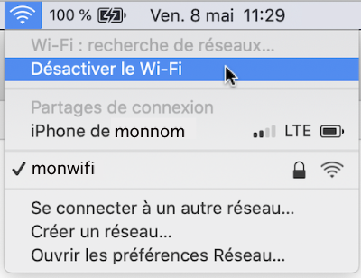

### Autre cause possible :

Il y a une configuration du réseau qui empêche les communications pair-à-pair (peer-to-peer).


Validez les configurations du réseau avec le gestionnaire du réseau.


Si vous n'arrivez toujours pas à réaliser le ping et que toutes vos configurations semblent correctes, il vous reste l'option de connecter un clavier et un écran au Raspberry Pi plutôt que de s'y connecter via SSH.

Si c'est d'une autre communication réseau dont vous avez besoin, essayez de brancher le Pi avec un fil RJ-45.

## 5.2 Le Pi n'a aucune adresse IP

### Problème :

Lorsque vous tentez de vous connecter via SSH à votre Raspberry Pi, rien ne fonctionne.

Et si vous branchez un clavier et un écran au Pi et que vous demandez l'adresse IP à l'aide de la commande hostname -I, il n'y en a aucune.

Résultat à l'écran

pi@raspberrypi:~ $ hostname -I  
  
pi@raspberrypi:~ $

### Contexte :

* Raspbian 11 (bullseye)


Le Wi-Fi n'a pas été configuré sur le Pi.


Pour configurer le Wi-Fi sans interface graphique, suivez ces instructions.

Elles permettent de faire la configuration sans nécessiter écran ni clavier.

Notez que vous pourriez également effectuer les configurations directement sur le Pi en éditant plutôt le fichier /etc/wpa\_supplicant/wpa\_supplicant.conf.

* Insérez la carte micro SD dans votre ordinateur.
* Créez un fichier nommé [wpa\_supplicant.conf](https://linux.die.net/man/5/wpa_supplicant.conf) à la racine de la partition boot.

  Sous Windows, utilisez l'utilitaire de texte de votre choix.

  Sous Mac ou Linux, utilisez ces commandes :

  Terminal

  cd /Volumes/boot  
  sudo nano wpa\_supplicant.conf

  Remarque : ce fichier sera automatiquement déplacé vers le dossier /etc/wpa\_supplicant la première fois que le Pi sera démarré.
* Copiez les instructions suivantes dans le fichier. Ajustez le nom du réseau et le mot de passe pour y accéder. Si vous n'êtes pas au Canada, changez CA pour le [code à 2 lettres de votre pays](https://en.wikipedia.org/wiki/List_of_ISO_3166_country_codes).

  Fichier wpa\_supplicant.conf

  country=CA  
  ctrl\_interface=DIR=/var/run/wpa\_supplicant GROUP=netdev  
  update\_config=1

   

  network={  
      ssid="NOM-DU-RESEAU"  
      psk="MOT-DE-PASSE-DU-RESEAU"  
  }
* Il est possible de configurer plusieurs réseaux si tel est votre besoin. Simplement ajouter une autre section network. Par exemple, pour pemettre de se brancher à un réseau non sécurisé (sans mot de passe) :

  Fichier wpa\_supplicant.conf

  ...  
    
  network={  
      ...  
  }  
    
  network={  
      ssid="NOM-DU-RESEAU"  
      key\_mgmt=NONE  
  }
* Si vous avez utilisé nano pour éditer le fichier, appuyez sur Ctrl + X puis O (ou  Y si votre OS est en anglais) pour enregistrer les modifications.
* Redémarrez ensuite le Pi.

### Autre cause possible :

Les configurations sont faites pour un réseau 5 GHz alors que le Raspberry Pi modèle 3B+ que vous utilisez ne supporte que le 2.4 Ghz.


Modifiez les configurations pour utiliser le réseau 2.4 GHz ou changez le Raspberry Pi pour un modèle qui supporte le 5 GHz (à partir de la version 4).

Remarquez que sur certains réseaux, le 2.4 GHz et le 5 GHz portent le même nom alors le réseau de la bonne fréquence sera automatiquement utilisé.

### Autre cause possible :

Le fichier wpa\_supplicant.conf cause problème pour une raison inconnue.

Ceci fait en sorte que lorsque vous faites sudo raspi-config pour configurer le Wi-Fi, vous obtenez le message « Could not communicate with wpa\_supplicant ».

Dans certains cas, vous pourriez avoir plutôt le message « No wireless interface found ».

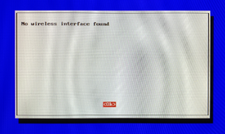


Supprimez le fichier wpa\_supplicant.conf :

Terminal

sudo rm /etc/wpa\_supplicant/wpa\_supplicant.conf

Recréez ce fichier comme suit :

Terminal

sudo nano /etc/wpa\_supplicant/wpa\_supplicant.conf

Inscrivez-y les informations pour votre réseau Wi-Fi tel que montré plus haut puis redémarrez le Pi.

### Autre cause possible :

Un problème a été détecté pendant que le système tentait de recourir au service DHCP lors du démarrage, par exemmple un problème de voltage trop bas.

L'outil rfkill (Radio Frequency Kill) a bloqué le Wi-Fi pour protéger le système.

D'ailleurs, ceci peut être vérifié à l'aide de cette commande :

Terminal

sudo rfkill list

Résultat à l'écran

0: phy0: Wireless LAN  
        Soft blocked: yes  
        Hard blocked: no  
1: hci0: Bluetooth  
        Soft blocked: yes  
        Hard blocked: no


Débarrez le Wi-Fi avec cette commande puis redémarrez le système.

Terminal

sudo rfkill unblock wifi

Demandez à Raspberry Pi OS d'activer le Wi-Fi :

Terminal

sudo ip link set wlan0 up

Vérifiez maintenant que vous avez une adresse IP :

Terminal

hostname -I

Si vous n'avez toujours pas d'adresse, redémarrez le Raspberry Pi.

Terminal

sudo reboot

Si le problème persiste, entrez la commande suivante pour réinitialiser le réseau.

Terminal

sudo wpa\_supplicant -c /etc/wpa\_supplicant/wpa\_supplicant.conf -i wlan0

## 5.3 Le Pi n'a que l'adresse 127.0.0.1

### Problème :

Lorsque vous demandez au Pi son adresse IP il ne donne que l'adresse 127.0.0.1.

### Contexte :

* Raspbian 10 (buster)


Vous avez utilisé la mauvaise commande.


Utilisez la commande hostname -I (notez le i majuscule) pour obtenir l'adresse IP.

Si vous utilisez un i minuscule, c'est normal de ne voir que 127.0.0.1.

## 5.4 Aucun accès au réseau (message Wi-Fi is currently blocked by rfkill)

### Problème :

Lorsque vous démarrez votre Raspberry Pi, vous n'obtenez aucune adresse IP. La console affiche entre autres le message « Wi-Fi is currently blocked by rfkill ».

Ceci peut également se produire après des modifications aux configurations du réseau. Vous obtenez alors le message « RTNETLINK answers: Operation not possible due to RF-kill ».

### Contexte :

* Rasbian 10 (buster)


Un problème a été détecté pendant que le système tentait de recourir au service DHCP pendant le démarrage, par exemmple un problème de voltage trop bas.

L'outil rfkill (Radio Frequency Kill) a bloqué le Wi-Fi pour protéger le système.

D'ailleurs, ceci peut être vérifié à l'aide de cette commande :

Terminal

sudo rfkill list

Résultat à l'écran

0: phy0: Wireless LAN  
        Soft blocked: yes  
        Hard blocked: no  
1: hci0: Bluetooth  
        Soft blocked: yes  
        Hard blocked: no


Débarrez le Wi-Fi avec cette commande puis redémarrez le système.

Terminal

sudo rfkill unblock wifi

Demandez à Raspberry Pi OS d'activer le Wi-Fi :

Terminal

sudo ip link set wlan0 up

Vérifiez maintenant que vous avez une adresse IP :

Terminal

hostname -I

Si vous n'avez toujours pas d'adresse, redémarrez le Raspberry Pi.

Terminal

sudo reboot

Si le problème persiste, entrez la commande suivante pour réinitialiser le réseau.

Terminal

sudo wpa\_supplicant -c /etc/wpa\_supplicant/wpa\_supplicant.conf -i wlan0

## 5.5 Aucun accès au réseau (message Could not communicate with wpa\_supplicant)

### Problème :

Lorsque vous démarrez votre Raspberry Pi, vous n'obtenez aucune adresse IP. Lorsque vous faites sudo raspi-config pour configurer le Wi-Fi, vous obtenez le message « Could not communicate with wpa\_supplicant ».

Dans certains cas, vous pourriez avoir plutôt le message « No wireless interface found ».

### Contexte :

* Rasbian 10 (buster)


Le fichier wpa\_supplicant.conf cause problème pour une raison inconnue.


Supprimez le fichier wpa\_supplicant.conf :

Terminal

sudo rm /etc/wpa\_supplicant/wpa\_supplicant.conf

Recréez ce fichier comme suit :

Terminal

sudo nano /etc/wpa\_supplicant/wpa\_supplicant.conf

Inscrivez-y les informations pour votre réseau Wi-Fi.

Fichier wpa\_supplicant.conf

country=CA  
ctrl\_interface=DIR=/var/run/wpa\_supplicant GROUP=netdev  
update\_config=1

 

network={  
    ssid="NOM-DU-RESEAU"  
    psk="MOT-DE-PASSE-DU-RESEAU"  
}

Appuyez sur Ctrl + X puis O (ou Y si votre OS est en anglais) pour enregistrer les modifications.

Une fois les informations entrées, demandez à Raspberry Pi OS de les prendre en compte :

Terminal

sudo ip link set wlan0 up

Vérifiez maintenant que vous avez une adresse IP :

Terminal

hostname -I

Si vous n'avez toujours pas d'adresse, redémarrez le Raspberry Pi.

Terminal

sudo reboot

Si le problème persiste, entrez la commande suivante pour réinitialiser le réseau.

Terminal

sudo wpa\_supplicant -c /etc/wpa\_supplicant/wpa\_supplicant.conf -i wlan0

## 5.6 Aucun accès réseau (message Network is unreachable)

### Problème :

Lorsque vous démarrez votre Raspberry Pi, vous n'obtenez aucune adresse IP. Lorsque vous faites ping 8.8.8.8 pour vérifier si Google peut être rejoint, vous obtenez le message « Network is unreachable ».

Résultat à l'écran

pi@raspberry:~ $ ping 8.8.8.8

 

connect: Network is unreachable

De plus, quand vous demandez d'afficher la table des routes à l'aide de la commande route -n, vous obtenez une table vide.

Résultat à l'écran

pi@raspberry: ~ $ route -n

 

Kernel IP routing table

 

Destination    Gateway    Genmask    Flags Metric Ref    Use Iface

Autre test : quand vous vérifiez l'état du réseau sans fil à l'aide de la commande cat /sys/class/net/wlan0/operstate, vous obtenez le mot down.

Résultat à l'écran

pi@raspberry: ~ $ cat /sys/class/net/wlan0/operstate

 

down

### Contexte :

* Rasbian 10 (buster)


Les configurations du réseau sans fil ne sont pas correctes.


Attention : cette solution s'applique à un réseau géré par dhcpcd. Depuis Raspberry Pi OS Bookworm en 2023, le gestionnaire de réseau par défaut est plutôt Network Manager.

Alors que la carte micro SD est insérée dans votre ordinateur, créez un fichier nommé [wpa\_supplicant.conf](https://linux.die.net/man/5/wpa_supplicant.conf) à la racine de sa partition boot.

Sous Windows, utilisez l'utilitaire de texte de votre choix.

Sous Mac ou Linux, utilisez ces commandes :

Terminal

cd /Volumes/boot  
sudo nano wpa\_supplicant.conf

Copiez les instructions suivantes dans le fichier. Ajustez le nom du réseau et le mot de passe pour y accéder.

Si vous utilisez un Raspberry Pi 3B+ ou moins récent, vous devez utiliser un Wi-Fi de 2.4 GHz.

Même avec le Raspberry Pi 4, il arrive que le Wi-Fi de 5 GHz soit moins stable. Choisir un Wi-Fi de 2.4 GHz pourrait régler le problème.

Fichier wpa\_supplicant.conf

country=CA  
ctrl\_interface=DIR=/var/run/wpa\_supplicant GROUP=netdev  
update\_config=1

 

network={  
    ssid="NOM-DU-RESEAU"  
    psk="MOT-DE-PASSE-DU-RESEAU"  
}

Redémarrez ensuite le Raspberry Pi pour que les configurations soient prises en compte.

## 5.7 Erreur « Connection refused »

### Problème :

Lorsque vous tentez de vous brancher via SSH sur le Raspberry Pi, vous obtenez le message « Connection refused ».

Résultat à l'écran

monnom@MacBook-Pro-de-MonNom ~ %ssh pi@192.168.1.145  
ssh: connect to host 192.168.1.145 port 22: Connection refused

### Contexte :

* Raspberry Pi 4
* Raspberry Pi OS Lite 10 (Buster)


SSH n'a pas été activé sur le Raspberry Pi.


Si vous avez accès à un clavier et à un écran branchés sur le Pi, entrez les commandes suivantes :

Terminal

sudo systemctl enable ssh  
sudo systemctl start ssh

Si vous ne disposez pas d'un écran et d'un clavier pour travailler directement sur le Pi, vous pouvez activer SSH avec une méthode dite headless.

Il s'agit d'insérer la carte micro SD dans le lecteur de cartes de votre ordinateur et de créer un petit fichier vide nommé ssh à la racine de la partition boot.

Sous Mac ou Linux, le fichier sera créé à l'aide de la commande suivante :

Terminal

touch /Volumes/boot/ssh

Sous Windows, vous pouvez ouvrir le gestionnaire de fichier, vous rendre à la racine de la partition boot puis créer le fichier à l'aide d'un clic droit / Nouveau / Document texte. Attention : le fichier doit s'appeler ssh sans extension.

Une fois le fichier créé, vous pouvez retirer la carte micro SD de façon sécuritaire, l'insérer dans le Rapsberry Pi puis mettre le Pi sous tension.

Remarquez qu'au prochain démarrage du Pi, ce fichier disparaîtra mais le SSH demeurera actif.

### Autre cause possible :

Vous avez tenté de vous connecter avec des informations erronées trop souvent alors l'adresse IP de votre ordinateur a été bannie (liste noire ou black list).

Ceci est probablement dû au fait que l'administrateur du Raspberry Pi a installé un logiciel du genre [fail2ban](https://www.fail2ban.org/wiki/index.php/Main_Page) et l'a configuré pour protéger le Raspberry Pi contre des tentatives d'attaques par force brute.

Pour savoir si c'est le cas pour vous, branchez un écran et un clavier au Raspberry Pi puis entrez cette commande :

Terminal du Raspberry Pi

sudo iptables -L -nv

Si vous obtenez le message « iptables: command not found », vous devrez installer iptables.

Terminal du Raspberry Pi

sudo apt install iptables

Vous saurez que votre adresse IP a été bannie si vous voyez la valeur REJECTED dans la colonne target.

Résultat à l'écran

pi@raspberrypi:~ $ sudo iptables -L -nv  
Chain INPUT (policy ACCEPT 0 packets, 0 bytes)  
 pkts bytes target     prot opt in    out     source             destination   
   1    64 f2b-sshd   tcp  --  \*     \*       0.0.0.0/0          0.0.0.0/0       multiport dports 22

 

Chain FORWARD (policy ACCEPT 0 packets, 0 bytes)  
 pkts bytes target     prot opt in    out     source             destination

 

Chain OUTPUT (policy ACCEPT 0 packets, 0 bytes)  
 pkts bytes target     prot opt in    out     source             destination

 

Chain f2b-sshd (1 references)  
 pkts bytes target     prot opt in    out     source             destination   
   1    64 REJECT    all  --  \*     \*       192.168.1.150     0.0.0.0/0       reject-with icmp-port-unreachable  
   0     0 RETURN     all  --  \*     \*       0.0.0.0/0          0.0.0.0/0


La première étape consiste à trouver le nom du service qui vous a banni.

Terminal du Raspberry Pi

sudo fail2ban-client status | grep "Jail list"

Si c'est effectivement vos tentatives de connection via SSH qui sont en cause, vous verrez sshd.

Résultat à l'écran

`- Jail list: sshd

Pour que la connection SSH soit à nouveau possible à partir de votre adresse IP, lancez cette commande après avoir ajusté votre adresse IP.

Terminal du Raspberry Pi

sudo fail2ban-client set sshd unbanip 192.168.1.150


« How to Unban an IP properly with Fail2Ban ». Server Fault. <https://serverfault.com/questions/285256/how-to-unban-an-ip-properly-with-fail2ban>

## 5.8 Erreur « Le fichier Release n'est pas encore valide »

### Problème :

Lorsque vous essayez de faire une mise à jour de Raspbian à l'aide de la commande sudo apt-get update, vous obtenez un message du genre « Le fichier « Release » pour http://raspbian.raspberrypi.org/raspbian/dists/buster/InRelease n'est pas encore valable. Les mises à jour depuis ce dépôt ne s'effectueront pas ».

ou, en anglais :

« Release file for http://raspbian.raspberrypi.org/raspbian/dists/buster/InRelease is not valid yet. Updates for this repository will not be applied. ».

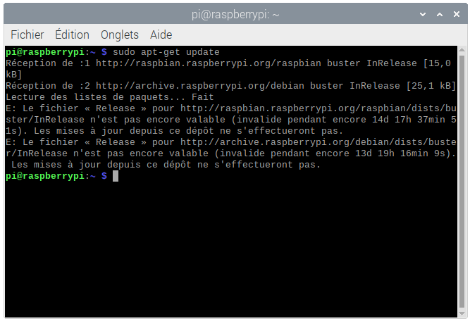

### Contexte :

* Raspberry Pi 3B
* Raspbian 10 (Buster)


L'horloge du Raspberry Pi n'est pas bien configurée.


Mettez l'horloge à jour à l'aide de la commande suivante, en remplaçant A:M:J HH:mm:ss par la date et l'heure voulues :

Terminal

sudo timedatectl set-time 'A:M:J HH:mm:ss'

### Autre cause possible :

Le fichier Release présent à la racine du dépôt n'est pas à jour. Ce fichier permet notamment de vérifier l'intégrité des paquets.


Si vous faites confiance à ce site, relancez la commande à l'aide de l'option --allow-releaseinfo-change.

Terminal

sudo apt-get update --allow-releaseinfo-change

### Autre cause possible :

Un problème de réseautique empêche le Raspberry Pi d'accéder aux ressources internet dont il a besoin.


Si vous n'avez pas accès à la modification des règles de routage, vous pouvez tenter de passer d'un réseau WI-FI à un réseau câblé ou vice-versa. Il arrive que les règles soient différentes entre les deux.

Si vous travaillez avec un Raspberry Pi 3B, sachez qu'il ne supporte que le Wi-Fi 2.4 GHz alors que le 3B+ et les suivants supportent également le 5 GHz.

## 5.9 �?cran noir our message « Digital power saving mode » à l'écran

### Problème :

Lorsque vous branchez un moniteur à votre Raspberry Pi, l'écran est tout noir. Un rectangle avec le message « DIGITAL POWER SAVING MODE » ou « DVI-D POWER SAVING MODE » apparaît puis disparaît.

Parfois,le message peut être plutôt « Câble de signal non connecté ».

Ce message indique généralement que l'écran ne reçoit pas de signal de l'ordinateur.

### Contexte :

* Raspberry Pi 4


Le câble pour connecter l'écran est mal branché ou défectueux.


Vérifier les branchements et si le problème n'est pas réglé, essayer avec un autre câble.

### Autre cause possible :

Le signal envoyé par le Raspberry Pi vers l'écran n'est pas suffisamment fort pour que l'écran détecte la présence du Pi.


Branchez-vous au Pi via SSH (ou retirez la carte micro SD et insérez-la dans votre ordinateur pour pouvoir modifier ses fichiers) puis éditez le fichier /boot/config.txt. Ceci peut être fait à l'aide de l'éditeur Nano :

Terminal

sudo nano /boot/config.txt

Vous devez enlever le # devant la ligne hdmi\_force\_hotplug afin d'activer cette configuration.

Fichier /boot/config.txt

# uncomment if hdmi display is not detected and composite is being output  
hdmi\_force\_hotplug=1

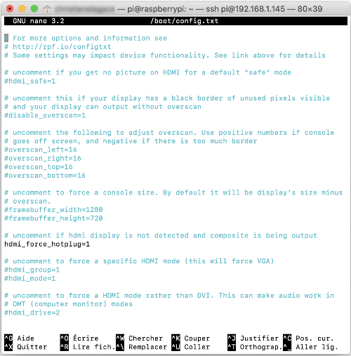

Pour sortir de Nano en enregistrant les modifications, appuyez sur Ctrl + o, appuyez sur Entrée puis faites Ctrl + x.

Vous devrez redémarrer le Pi pour que les nouvelles configurations soient prises en compte.

Si ça ne fonctionne pas, enlevez le # devant une seconde configuration : hdmi\_drive=2. Enregistrez puis redémarrez le Pi.

Fichier /boot/config.txt

# uncomment to force a HDMI mode rather than DVI. This can make audio work in  
# DMT (computer monitor) modes  
hdmi\_drive=2

Si le problème n'est toujours pas réglé, éditez à nouveau le fichier /boot/config.txt et cette fois, enlevez le # devant la configuration hdmi\_safe = 1. Remettez un # devant les deux autres lignes.

Fichier /boot/config.txt

# uncomment if you get no picture on HDMI for a default "safe" mode  
hdmi\_safe=1

Si tout se passe bien, vous devriez voir l'affichage du Raspberry Pi mais en très gros et légèrement déformé. Même si l'affichage n'est pas intéressant, ceci indique que le signal peut se rendre, donc il n'y a pas un problème de câble et on sait que le Pi est capable d'envoyer un signal assez fort.

Voici ce que je vois sous Raspberry Pi OS complet. Sous Raspberry Pi OS Lite, même déformation mais sans interface graphique.

La solution finale consiste généralement à essayer d'enlever et de remettre un # devant les différentes configurations dans le fichier /boot/config.txt.


« Affichage HDMI de la Raspberry Pi qui ne marche pas, la solution ! ». Raspberry Pi. <https://raspberry-pi.fr/hdmi-raspberry-pi-marche-pas-solution/>

## 5.10 WARNING: REMOTE HOST IDENTIFICATION HAS CHANGED!

### Problème :

Lorsque vous tentez de vous connecter au Raspberry Pi via SSH, vous obtenez le message « WARNING: REMOTE HOST IDENTIFICATION HAS CHANGED! »

Résultat à l'écran

MacBook-Pro-de-MonNom:~ monnom$ ssh pi@192.168.1.145  
@@@@@@@@@@@@@@@@@@@@@@@@@@@@@@@@@@@@@@@@@@@@@@@@@@@@@@@@@@@  
@ WARNING: REMOTE HOST IDENTIFICATION HAS CHANGED! @  
@@@@@@@@@@@@@@@@@@@@@@@@@@@@@@@@@@@@@@@@@@@@@@@@@@@@@@@@@@@  
IT IS POSSIBLE THAT SOMEONE IS DOING SOMETHING NASTY!  
Someone could be eavesdropping on you right now (man-in-the-middle attack)!  
It is also possible that a host key has just been changed.  
The fingerprint for the ECDSA key sent by the remote host is  
SHA256:XuhSy6HE1PkibkA17UpvKSLNuStDY73bfGhip7KVQ6U.  
Please contact your system administrator.  
Add correct host key in /Users/monnom/.ssh/known\_hosts to get rid of this message.  
Offending ECDSA key in /Users/monnom/.ssh/known\_hosts:10  
ECDSA host key for 192.168.1.145 has changed and you have requested strict checking.  
Host key verification failed.

### Contexte :

* Raspbian 10 (buster)


Il y a un problème avec le fichier known\_hosts car les clés SSH ont changé.


Retirez l'information sur cette adresse IP du fichier known\_hosts comme suit en prenant soin d'ajuster l'adresse IP du Pi.

Terminal de l'ordinateur

ssh-keygen -R 192.168.1.145

Si vous utilisez un port pour la connexion SSH, par exemple le port 22222, la syntaxe sera comme suit.

Notez la présence des guillemets alentour de l'adresse IP et du port. Ceci est nécessaire avec un shell zsh puisque ce shell interprète les crochets carrés comme une série de choix.

Terminal de l'ordinateur

ssh-keygen -R "[192.168.1.145]:22222"

La prochaine fois que vous tenterez de vous connecter, vous devrez confirmer que vous désirez vous connecter.

Résultat à l'écran

MacBook-Pro-de-MonNom:~ monnom$ ssh-keygen -R 192.168.1.145  
# Host 192.168.1.145 found: line 10  
/Users/monnom/.ssh/known\_hosts updated.  
Original contents retained as /Users/monnom/.ssh/known\_hosts.old  
MacBook-Pro-de-MonNom:~ monnom$ ssh pi@192.168.1.145  
The authenticity of host '192.168.1.145 (192.168.1.145)' can't be established.  
ECDSA key fingerprint is SHA256:XuhSy6HE1PkibkA17UpvKSLNuStDY73bfGhip7KVQ6U.  
Are you sure you want to continue connecting (yes/no/[fingerprint])? yes  
Warning: Permanently added '192.168.1.145' (ECDSA) to the list of known hosts.  
pi@192.168.1.145's password:

## 5.11 Erreur « Rejected request from RFC1918 IP to public server address »

### Problème :

Lorsque vous tentez d'accéder à votre boîte domotique à l'aide de son sous-domaine configuré chez un founisseur spécialisé dans la gestion des DNS dynamiques, vous obtenez le message « Rejected request from RFC1918 IP to public server address ».

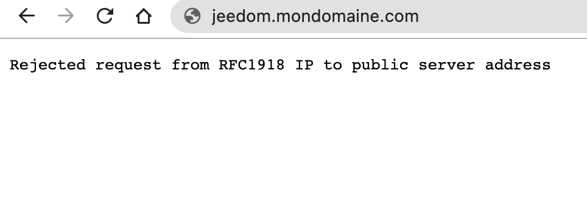

### Contexte :

* Adresse IP dynamique
* Sous domaine réservé chez un founisseur spécialisé dans la gestion des DNS dynamiques, par exemple Duck DNS


Vous tentez d'utiliser le sous-domaine alors que vous êtes déjà dans le même réseau que la boîte domotique.


Utilisez un périphérique branché sur un réseau distinc pour pouvoir utiliser le sous-domaine. Par exemple, utilisez un appareil mobile avec données mobiles (Wi-Fi désactivé).

Si vous désirez accéder à la boîte domotique à partir d'un appareil branché sur le même réseau, utilisez plutôt la technique de branchement local. Par exemple, avec Jeedom, utilisez [apical\_lien\_interne][installation\_de\_jeedom\_et\_premier\_acces,la technique présentée ici,acceder][/apical\_lien\_interne].

## 5.12 Erreur « Under-voltage detected! »

### Problème :

Lorsque vous branchez un écran sur votre Raspberry Pi, vous voyez à l'occasion un message du genre « [ 4969.034201] Under-voltage detected! (0x00050005) ».

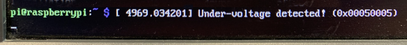

### Contexte :

* Raspberry Pi 3B+


L'alimentation du Raspberry Pi ne fournit pas un voltage assez élevé (voltage requis : 5V).


Utilisez un meilleur bloc d'alimentation.

## 5.13 Erreur « Could not get lock /var/lib/dpkg/lock-frontend - open »

### Problème :

Lorsque vous tentez d'installer un paquet avec apt install, vous voyez un message du genre « E: Could not get lock /var/lib/dpkg/lock-frontend - open (11: Resource temporarily unavailable) » suivi de « E: Unable to acquire the dpkg frontend lock (/var/lib/dpkg/lock-frontend), is another process using it? ».

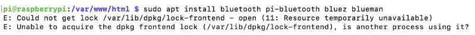

### Contexte :

* Raspberry Pi 3B+
* Raspberry Pi OS Lite 10 (Buster)


Un processus est déjà en train d'utiliser le fichier /var/lib/dpkg/lock-frontend.


Patientez puis réessayez la commande.

Si cela ne fonctionne toujours pas, redémarrez le Raspberry Pi.


« How To Fix `Could not get lock /var/lib/dpkg/lock - open (11 Resource temporarily unavailable)` Errors ». Linux Unprising. <https://www.linuxuprising.com/2018/07/how-to-fix-could-not-get-lock.html>

## 5.14 Erreur « Authentication token manipulation error »

### Problème :

Lorsque vous tentez de réinitialiser le mot de passe du Raspberry Pi à l'aide de [la technique qui consiste à ajouter init=/bin/sh au fichier cmdline.txt](), vous obtenez le message « Authentication token manipulation error ».

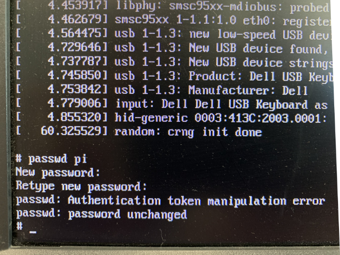

### Contexte :

* Raspberry Pi 4
* Raspberry Pi OS Lite 10 (Buster)


Le système de fichiers n'a pas été monté.


�? l'invite de commande (#), entrez cette commande :

Terminal

mount -o remount, rw /

## 5.15 Erreur « Sap driver initialization failed »

### Problème :

Lorsque vous tentez de vérifier l'état du service Bluetooth sur le Raspberry Pi, vous obtenez le message « Sap driver initialization failed ».

Résultat à l'écran

pi@raspberrypi:~ $ service bluetooth status  
�-� bluetooth.service - Bluetooth service  
    Loaded: loaded (/lib/systemd/system/bluetooth.service; enabled; vendor preset: enabled)  
    Active: active (running) since Tue 2022-09-06 20:51:20 BST; 12min ago  
      Docs: man:bluetoothd(8)  
  Main PID: 598 (bluetoothd)  
    Status: "Running"  
     Tasks: 1 (limit: 4915)  
    CGroup: /system.slice/bluetooth.service  
            �""�"?598 /usr/lib/bluetooth/bluetoothd

 

Sep 06 20:51:20 raspberrypi systemd[1]: Starting Bluetooth service...  
Sep 06 20:51:20 raspberrypi bluetoothd[598]: Bluetooth daemon 5.50  
Sep 06 20:51:20 raspberrypi systemd[1]: Started Bluetooth service.  
Sep 06 20:51:20 raspberrypi bluetoothd[598]: Starting SDP server  
Sep 06 20:51:20 raspberrypi bluetoothd[598]: Bluetooth management interface 1.18 initialized  
Sep 06 20:51:20 raspberrypi bluetoothd[598]: Sap driver initialization failed.  
Sep 06 20:51:20 raspberrypi bluetoothd[598]: sap-server: Operation not permitted (1)  
Sep 06 20:51:20 raspberrypi bluetoothd[598]: Failed to set privacy: Rejected (0x0b)

### Contexte :

* Raspberry Pi 4
* Raspberry Pi OS Lite 10 (Buster)


...


...

## 5.16 Erreur « /usr/libexec/sftp-server: not found »

### Problème :

Lorsque vous tentez de copier un fichier entre votre ordinateur et un Raspberry Pi en utilisant la commande scp, vous obtenez le message «  sh: /usr/libexec/sftp-server: not found ».

### Contexte :

* Raspberry Pi 4
* Raspberry Pi OS Lite 10 (Buster)


Votre ordinateur (le client) utilise OpenSSH 9.0 ou plus récent.

Par défaut, cette version est basée sur le protocole SFTP, ce qui est incompatible avec le Pi (le serveur).


Ajoutez l'option -O (lettre o majuscule) pour forcer l'utilisation du protocole FTP.

Terminal

scp -O pi@192.168.1.145:/dossier/sous-dossier/monfichier.extension /dossierlocal

<!-- --- split --- -->


## 6.1 Qu'est-ce que Python ?

Selon [Wikipédia](https://fr.wikipedia.org/wiki/Python_(langage)) :

> Python est un langage de programmation objet, multi-paradigme et multiplateformes. [...] Il peut s'utiliser dans de nombreux contextes et s'adapter à tout type d'utilisation grâce à des bibliothèques spécialisées. Il est cependant particulièrement utilisé comme langage de script pour automatiser des tâches simples mais fastidieuses.

La première version publique de Python est sortie en 1991. Son auteur, le programmeur Guido van Rossum, était un fan de la série télévisée Monty Python's Flying Circus, une série humoristique sous forme de sketches. C'est de cette série que le langage de programmation tient son nom.

Python est un langage de programmation interprété. Il est reconnu pour sa syntaxe concise et élégante ainsi que la rapidité avec laquelle il permet de développer un programme. De plus, il est possible de lui programmer des modules d'extension en C ou en C++.

Ces caractéristiques combinées au fait qu'il est un logiciel libre font de lui un langage de progammation très prisé.


« Learning Python: From Zero to Hero ». Medium. <https://medium.freecodecamp.org/learning-python-from-zero-to-hero-120ea540b567>

« The Python Tutorial ». Python. <https://docs.python.org/3.6/tutorial/index.html>

« Python 3.6.4 documentation ». Python. <https://docs.python.org/3.6/index.html>

« Apprendre le langage de programmation python ». apprendre-python.com. <http://apprendre-python.com/>

« Apprenez à programmer en Python ». Open Classrooms. <https://openclassrooms.com/courses/apprenez-a-programmer-en-python>

« Introduction au langage de programmation Python 3 ». Fabrice Sincère. <http://fsincere.free.fr/isn/python/cours_python.php?version=3>

« Petites choses diverses à savoir pour débuter en Python ». Formation Django. <http://www.formation-django.fr/python/petites-choses-a-savoir.html>

## 6.2 Python 2.X vs 3.X

Comme tout langage de programmation, Python a subi de nombreuses modifications à mesure qu'il évoluait et prenait de la maturité. �? un certain stade, ses concepteurs sont venus à un point où ils ont dû briser la compatibilité avec les anciennes versions afin d'offrir de nouvelles possibilités.

C'est pour cette raison qu'il existe deux « familles » de programmes Python : ceux qui sont conçus pour la branche 2.X et ceux pour la branche 3.X.

La version 2.7 est la dernière version de la première branche. Aucune autre version majeure ne sera produite pour la branche 2.X. Elle n'évoluera donc plus mais en revanche, elle est très stable et ceci est vu d'un bon oeil par de nombreux programmeurs.

Dans la branche 3.X, qui évolue depuis 2008, de nombreuses modifications et ajouts visent à améliorer l'expérience des programmeurs et les performances des programmes. C'est pourquoi cette branche est vue comme le présent et le futur de Python.

Si vous hésitez entre Python 2.X et 3.X, vous devriez choisir 3.X. Le seul cas où Python 2.X devrait être utilisé est lorsque vous n'avez pas le choix, par exemple lorsque vous avez besoin d'un paquet qui n'a pas été migré vers 3.X.

Voici, à titre d'exemple, une différence importante entre Python 2.X et 3.X : la commande print est devenue une fonction. �? elle seule, cette différence a empêché la rétro-compatibilité avec de nombreux programmes.

Python 2.X

print "Hello World"

Python 3.X

print("Hello World")

## Vérifier si Python est installé

Dans une fenêtre Terminal, vous pouvez lancer cette commande pour vérifier si Python est installé et obtenir le numéro de version :

Terminal

python --version

Sous Raspberry Pi OS 10 (Buster), cette commande donne le résultat suivant :

Résultat à l'écran

Python 2.7.16

Plusieurs versions de Python peuvent cohabiter. Pour vérifier si Python 3 est installé :

Terminal

python3 --version

Résultat à l'écran

Python 3.7.3

Ainsi, on voit que lors de l'installation de Raspberry Pi OS 10 (Buster), Python 2.7 et Python 3.7 sont installés par défaut.

## Afficher la version de Python par programmation

Il est possible d'afficher la version de Python par programmation. Ceci générera un affichage à la console :

Python

import platform

 

platform.python\_version()


« Should I use Python 2 or Python 3 for my development activity? ». Python. <https://wiki.python.org/moin/Python2orPython3>

## 6.3 Shebang ou hash bang : #!

Les script Python commencent généralement par une ligne qui débute par les caractères #! suivis par le chemin de l'interpréteur Python. Cette ligne se nomme shebang ou hash bang.

La présence du shebang permet d'appeler le script Python sans avoir à préciser le nom de son interpréteur.

L'usager devra avoir les droits d'exécution sur le script.

Terminal

chmod u+x mon\_script.py

Le script pourra être appelé comme suit :

Terminal

./mon\_script.py

## Shebang qui utilise la variable d'environnement $PATH

La meilleure technique consiste à utiliser /usr/bin/env devant le nom de l'interpréteur.

Cette formulation fait en sorte que le système retrouvera le chemin exact de l'interpréteur à partir de la variable d'environnement $PATH de l'usager.

Ceci assure un maximum de compatibilité si le script doit être exécuté sur un autre système ou même par un autre usager.

Python

#!/usr/bin/env python3

## Shebang fixe

Parfois, on retrouve plutôt ceci, qui correspond au chemin donné lorsqu'on entre la commande which python3 dans une fenêtre terminal.

Python

#!/usr/bin python3

Remarquez qu'il n'y a pas de barre oblique avant le mot python3.

Cette formulation fonctionne également mais elle risque de ne plus fonctionner si le script est utilisé sur un autre système ou par un autre usager.


Dans le cas où le script Phython ne débute pas par un shebang, il faudra ajouter python3 devant son nom pour pouvoir l'exécuter.

Notez qu'à ce moment, l'usager n'a pas besoin d'avoir les droits d'exécution sur le fichier.

Terminal

python3 mon\_script.py


Pour tester un programme Python, il est possible de l'exécuter dans une fenêtre Terminal.

Déplacez-vous dans le dossier qui contient le programme puis tapez son nom avec son extension.

Exemple sous Windows :

Fenêtre de commande DOS

cd \Users\votrenom\Documents\mondossier

 

helloworld.py

Exemple sous Mac ou Linux :

Terminal

cd ~/mondossier

 

./helloworld.py

Il est également possible d'exéuter le programme en faisant appel à la commande python (pour Python 2.7) ou python3.

Terminal

cd ~/mondossier  
python3 helloworld.py

## 6.5 Les structures de contrôle

Les structures de contrôles permettent de contrôler le flux d'un programme grâce à des conditions et à des boucles.

## La condition

Ex :

Python

if nom == 'Annie':

 

    ...

 

elif nom == 'Toto':

 

    ...

 

else:

 

    ...

Note : l'indentation (4 espaces) est importante : c'est elle qui indique quand un bloc d'instruction se termine.

## La boucle while

Pour boucler tant qu'une condition est vraie.

Ex :

Python

while x < 10:

 

    ...

## La boucle for

Cette boucle permet de faire une itération un nombre défini de fois.

Ex :

Python

for i in range(10):

 

    ...


Ex :

Python

valeurs = ['a', 'b', 'c']

 

 

 

for valeur in valeurs:

 

    ...

## 6.6 Utilisation d'un paquet ou d'un module

Pour utiliser [apical\_lien\_interne][les\_paquets\_et\_modules\_python,un module ou un paquet][/apical\_lien\_interne], peut importe s'il fait partie de la bibliothèque standard ou s'il est externe, faut débuter le script Python par une instruction import.

Bien entendu, un module ou un paquet externe [apical\_lien\_interne][installer\_un\_paquet\_python,devra d'abord être installé sur votre poste de travail][/apical\_lien\_interne].

Par exemple, pour utiliser le module calendar :

Python

import calendar

 

 

 

...

 

 

 

if calendar.isleap(annee):

 

    ...

## Instruction from ... import ...

Lorsqu'on utilise l'instruction import, chaque classe ou fonction importée doit être précédée par le nom du module ou du paquet, comme démontré plus haut avec calendar.isleap().

Il est possible de modifier ce comportement à l'aide de la syntaxe from ... import \*. Les classes et fonctions seront désormais accessibles comme si elles faisaient partie du coeur de Python.

Python

from calendar import \*

 

 

 

...

 

 

 

if isleap(annee):

 

    ...

Autre exemple :

Python

from tkinter import \*

 

 

 

...

 

canevas = Canvas(fenetre, width=150, height=150)

 

...

## Paquet contenant plusieurs modules

Puisqu'un paquet est un dossier qui contient des modules, Python devait avoir un moyen de comprendre ce qu'il doit faire lorsqu'on lui lance une instruction import sur un paquet.

Dans les faits, lorsqu'il rencontre le nom d'un paquet dans une instruction import, Python recherchera un fichier nommé \_\_init\_\_.py dans ce dossier. Autrement dit, l'importation d'un paquet consiste à importer le module \_\_init\_\_ présent dans ce paquet.

Certains paquets sont configurés pour que tous leurs modules soient importés automatiquement. D'autres laissent le soin au programmeur d'importer seulement les modules désirés.

C'est pourquoi, lorsque vous avez besoin d'une fonction ou d'une classe définie dans un autre module du paquet, il se peut que vous ayez besoin de faire une importation précise du module désiré.

La syntaxe à utiliser est sous la forme :

Syntaxe Python

from *paquet*.*module* import *fonction*

ou

Syntaxe Python

from *paquet*.*module* import *Classe*

ou encore, si le nombre de classes ou de fonctions à utiliser est important :

Syntaxe Python

from *paquet*.*module* import \*

Ex :

Python

from tkinter.font import Font

 

 

 

police = Font(family='Helvetica', size=12, weight='normal')

 

...


« Python 101: All about imports ». Mouse vs Python. <https://www.blog.pythonlibrary.org/2016/03/01/python-101-all-about-imports/>

« The Python Standard Library ». Python. <https://docs.python.org/3/library/index.html>

« UsefulModules ». Python. <https://wiki.python.org/moin/UsefulModules>

« PyPI - the Python Package Index ». Python. <https://pypi.python.org/pypi>

« Python 3 Module of the Week ». PyMOTW-3. <https://pymotw.com/3/index.html>

« Les imports en Python ». Sam & Max. <http://sametmax.com/les-imports-en-python/>

« Structuring Your Project - Packages ». The Hitchhiker's guide to Python. <http://docs.python-guide.org/en/latest/writing/structure/#packages>

## 6.7 �? quel endroit Python recherche-t-il les modules?

Si un programme Python utilise un module sans savoir à quel endroit il est placé, vous obtiendrez une erreur du genre :

Résultat à l'écran

Traceback (most recent call last):  
 File "./mon\_programme.py", line 4, in <module>  
import mon\_module  
ModuleNotFoundError: No module named 'mon\_module'

Lorsqu'il rencontre une instruction import, Python recherchera un fichier dont le nom est identique au nom du module, avec l'extension .py.

Il recherchera ce fichier :

* dans le dossier courant
* dans la liste des dossiers de la variable d'environnement Python sys.path
* dans la liste des dossiers de la variable d'environnement de l'OS PYTHONPATH

## sys.path

Pour connaître la valeur de sys.path, entrez ce code à la ligne de commande Python (rappel : entrez python3 dans une fenêtre Terminal pour obtenir la ligne de commande Python).

Python

>>> import sys  
>>> for path in sys.path:  
...     print(path)

Appuyez deux fois sur Retour et vous verrez la liste des dossiers apparaître.

Sur Raspberry Pi OS, voici ce que j'obtiens.

Résultat à l'écran

/usr/lib/python37.zip  
/usr/lib/python3.7  
/usr/lib/python3.7/lib-dynload  
/usr/local/lib/python3.7/dist-packages  
/usr/lib/python3/dist-packages

Vous pouvez ajouter un dossier à sys.path par programmation :

Python

import sys  
sys.path.append("/chemin/dossier-a-ajouter")

## PYTHONPATH

Pour connaître la valeur de PYTHONPATH sur un système Linux ou Mac :

Terminal

echo $PYTHONPATH

Et sur un système Windows :

Invite de commande (CMD)

echo %PYTHONPATH%

Il est possible d'ajouter du contenu à cette variable. Mais attention : ceci sera valable jusqu'à ce que l'ordinateur soit redémarré.

Sour Linux ou Mac :

Terminal

export PHTYONPATH=$PYTHONPATH:/chemin/dossier-a-ajouter

ou

Terminal

cd /chemin/dossier-a-ajouter

 

export PYTHONPATH=$PYTHONPATH:$PWD

Sous Windows :

Invite de commande (CMD)

set PYTHONPATH=%PYTHONPATH%;C:\chemin\dossier-a-ajouter

Les dossiers ajoutés ainsi à PYTHONPATH seront automatiquement ajoutés à sys.path.

Si vous voulez faire un ajout permanent, ajoutez cette instruction dans le fichier .bashrc ou, si vous travaillez sous Windows, passez par le panneau de configuration.


« Where does Python look for modules? ». Matthew Brett. <https://bic-berkeley.github.io/psych-214-fall-2016/sys_path.html>

« Python import, sys.path, and PYTHONPATH Tutorial ». Dev Dungeon. <https://www.devdungeon.com/content/python-import-syspath-and-pythonpath-tutorial#:~:text=PYTHONPATH%20is%20related%20to%20sys,for%20modules%20when%20using%20import%20.>

## 6.8 Les tableaux, listes et tuples

## Tuple

En Python, un [tuple](https://docs.python.org/3/tutorial/datastructures.html#tut-tuples) est un tableau immuable et très performant. On utilisera les parenthèses pour l'initialiser.

Ex :

Python

valeurs = ('a', 'b', 'c')

Dans le cas où il y a un seul élément dans le tuple, on doit faire suivre cet élément par une virgule afin que Python comprenne qu'il ne s'agit pas d'une chaîne de caractères entourée de parenthèses.

Ex :

Python

valeurs = ('a',)

## Liste

Une liste est un tableau modifiable de longueur variable. On utilisera les crochets carrés pour l'initialiser.

Ex :

Python

valeurs = ['a', 'b', 'c']


Un tableau associatif est caractérisé par des éléments qui portent un nom plutôt qu'un indice. On utilisera les accolades pour l'initialiser.

Ex :

Python

configuration = {

 

    'menu': 'gauche',

 

    'langue': 'fr'

 

}

 

...

 

valeur = configuration['langue']

## 6.9 �?crire nos propres fonctions

Il est très rare qu'une application soit écrite tout d'un bout sans utiliser de fonctions.

On utilisera souvent des fonctions qui font partie intégrante de Python (ex : print()). On parlera de fonctions préprogrammées.

On pourra également coder nos propres fonctions. On parlera alors de fonctions utilisateur, fonctions définies par l'utilisateur ou encore, en anglais, user-defined functions (UDF).

Quel est l'intérêt de coder nos propres fonctions ? Il y a différents raisons qui justifient ce choix :

* Le même code doit être exécuté à plusieurs endroits dans le programme ([apical\_lien\_interne][principe\_dry\_do\_no\_repeat\_yourself,principe DRY : Do not Repeat Yourself][/apical\_lien\_interne]).
* Le code devient plus facile à comprendre si une partie du code est placé dans une fonction disticte ([principe KISS](http://fr.wikipedia.org/wiki/Principe_KISS) : Keep It Simple, Stupid !).
* Il faut attacher du code à un événement (ex : un clic sur un bouton). La fonction permettra de délimiter le code à exécuter lorsque l'événement survient.

Comme dans tous les langages de programmation, lorsqu'on code une fonction, il y a deux étapes à réaliser :

* la déclaration de la fonction
* l'appel de la fonction

## Déclaration de la fonction

Lorsqu'une fonction est déclarée, son code n'est pas exécuté tout de suite. Il le sera seulement lorsque la fonction sera appelée.

La déclaration d'une fonction se fait à l'aide du mot-clé def. Tout le code de la fonction sera décalé de 4 espaces par rapport au programme principal. Ainsi, Python saura que le code de la fonction est terminé lorsqu'il rencontrera une ligne qui n'est pas décalée.

Ex :

Python

def ma\_fonction():

 

    ...

 

    ...

 

 

 

# cette ligne ne fait pas partie de la fonction

## Appel de la fonction

Pour appeler une fonction, il faut écrire son nom suivi de parenthèses :

Python

# la fonction sera exécutée immédiatement

 

ma\_fonction()

Il est également possible de passer des paramètres à la fonction.

Ex :

Python

def afficher\_message(message):

 

    ...

 

    print(message)

 

 

 

...

 

afficher\_message('Bien le bonjour !')

## Documentation de la fonction

Pour chacune des fonctions que vous coderez, il est d'usage de commencer par un commentaire [Docstring](https://www.python.org/dev/peps/pep-0257/) qui indique ce que la fonction fait. Le commentaire Docstring est constitué d'une ou plusieurs lignes de texte entourées par des triples apostrophes (""").

Ex :

Python

def soumettre\_click():

 

    """ Enregistre les informations dans la base de données. """

 

    ...

Python

def ma\_fonction():

 

    """ Effectue telle ou telle action.

 

 

 

    Ceci est un commentaire sur plusieurs lignes.

 

    On laisse généralement une ligne blanche après la première ligne, qui est un sommaire.

 

    Les triple-guillemets peuvent se refermer à droite de la dernière ligne ou encore sur la ligne suivante.

 

    """

 

    ...


En Python, il faut toujours placer une fonction avant le programme qui l'utilise. C'est pourquoi on retrouvera les définitions de fonctions en haut du programme et le programme principal dans le bas.

Puisque les fonctions doivent être définies avant le programme principal, il est pratique d'ajouter un commentaire qui indique clairement à quel endroit le programme principal commence.

Ex :

Python

def ma\_fonction():

 

    ...

 

    ...

 

 

 

########## programme principal ##########

 

 

 

fenetre = Tk()

 

...

## 6.10 Utiliser une variable du programme principal dans une fonction (portée des variables)

Lorsqu'une application Python contient des fonctions utilisateur et que ces fonctions doivent utiliser des variables, il faut prendre le temps de comprendre la portée des variables.

La portée d'une variable (variable scope) indique à quel endroit elle peut être utilisée dans le programme.

Une variable qui est créée dans une fonction ne risque pas d'entrer en conflit avec une autre variable du même nom créée dans une autre fonction ni même avec une variable du même nom créée dans le programme principal.

La portée d'une variable est limitée à la fonction dans laquelle elle a été créée.

## Passer un paramètre à la fonction

Il arrive cependant des cas où on voudra créer une variable dans le programme principal et utiliser cette même variable dans une fonction. La technique par excellence consiste à passer la variable en paramètre à la fonction.

Ex :

Python

def afficher\_message(nom):  
    """Affiche un message avec le nom saisi par l'usager."""

 

    print('Bonjour, ' + nom + ' !')

 

 

 

########## programme principal ##########

 

 

 

nom = input('Quel est ton nom ? ')

 

afficher\_message(nom)

## �?tendre la portée à l'aide de global

Certaines situations nous empêchent de passer des paramètres à une fonction. Ce sera le cas, notamment, lorsque la fonction est appelée par Python en réponse à un événement.

�? ce moment, on pourra indiquer à Python que la variable qu'on utilise dans la fonction est la même que celle créée dans le programme principal. Ceci sera fait à l'aide du mot-clé global.

Soit le programme suivant, qui n'utilise ni paramètre, ni variable globale :

Python

def changer\_nom():

 

    """Change la valeur de la variable nom sans affecter le programme principal."""

 

    nom = 'abc'

 

 

 

########## programme principal ##########

 

 

 

nom = input('Quel est ton nom ? ')

 

changer\_nom()

 

print('Bonjour, ' + nom + ' !')

Le message utilisera toujours le nom saisi par l'usager et ce, même si la fonction assigne la valeur 'abc' à une variable qui s'appelle elle aussi nom.

Si on voulait changer ce comportement :

Python

def changer\_nom():

 

    """Change la valeur de la variable globale nom, ce qui affectera le programme principal."""

 

    global nom

 

    nom = 'abc'

 

 

 

########## programme principal ##########

 

 

 

nom = input('Quel est ton nom ? ')

 

changer\_nom()

 

print('Bonjour, ' + nom + ' !')

 Cette fois, le programme affichera toujours « Bonjour, abc ! ».

## 6.11 La programmation objet en Python

Même si les concepts de programmation orientée objet sont les mêmes d'un langage de programmation à l'autre, les différences de syntaxe peuvent parfois être déconcertantes.

Quelques faits saillants :

* Le nom de la classe est écrit [apical\_lien\_interne][Casse\_Pascal\_LaCassePascal,en casse Pascal][/apical\_lien\_interne]  ").
* Si la classe hérite d'une autre classe, on met le nom de la classe de base entre parenthèses.
* Si la classe n'a pas de parent, on ne met pas de parenthèses.
* �? l'intérieur de la classe, tout le code doit être placé dans une méthode. Seule exception : l'initialisation des variables de classe.
* Chaque méthode est déclarée avec le mot-clé def.
* Le constructeur s'appelle \_\_init\_\_.
* Le constructeur et les autres méthodes reçoivent toujours self comme premier paramètre.
* Lors de l'appel d'une méthode, on ignore le paramètre self puisque c'est le noyau qui se chargera de le passer en paramètre.
* Un point sépare le nom d'un objet de ses membres.
* Lorsqu'une méthode doit appeler une autre méthode de la classe, il faut faire précéder le nom par self.

Voici donc un exemple de classe écrite en Python pour vous guider pendant votre programmation.

Python

class MaClasse(ClasseDeBase):  
  
    # Attributs de classe  
    un\_attribut\_de\_classe = 'valeur'  
  
    def \_\_init\_\_(self, parametre='Valeur par défaut'):  
        # Initialisation des attributs (variables d'instance)  
        self.un\_attribut = parametre  
        self.un\_autre\_attribut = 'autre valeur'  
  
    def \_\_str\_\_(self):  
        return 'Chaîne qui représente l\'objet: %d, %s' % (self.un\_attribut, self.un\_autre\_attribut)  
  
    def une\_methode(self):  
        ...  
  
    def une\_autre\_methode(self):  
        ...  
        self.une\_methode()  
        return ...

## 6.12 Passer un paramètre à un script Python

Il est possible de passer un ou plusieurs paramètres, aussi appelés arguments, à un script Python à partir de la ligne de commande.

Terminal

python3 monscript.py unparametre autreparametre

Pour lire la valeur des paramètres dans le script, il faut d'abord importer le module sys.

Python

import sys

Les paramètres sont contenus dans un tableau nommé sys.argv.

L'élément 0 du tableau est toujours le nom du script.

L'élément 1 est le premier argument, l'élément 2 est le second argument et ainsi de suite.

Python

nom\_script = sys.argv[0]  
premier\_parametre = sys.argv[1]  
deuxieme\_parametre = sys.argv[2]

## Si aucun paramètre n'est passé (paramètre optionnel)

Si le script tente de lire un paramètre alors qu'aucun n'a été passé, le script lèvera une exception de type IndexError.

Il faut donc toujours lire le paramètre dans un try... except.

Lorsqu'aucun paramètre n'est passé, le programme réagira en conséquence. Il pourrait, par exemple, fournir une valeur par défaut.

Python

try:  
    valeur = sys.argv[1]  
 except IndexError:  
    valeur = "x"

## Paramètre numérique

�? la base, les paramètres sont tous de type texte.

Si le paramètre doit être utilisé comme un nombre, il faut d'abord le convertir.

Python

try:  
    iterations = int(sys.argv[1])  
...  
  
for i in range(iterations):  
    ...

## Paramètre numérique optionnel

En combinant les deux approches précédentes, on s'assure que dans le cas d'un paramètre numérique, le programme fonctionne s'il n'est pas passé ou si sa valeur n'est pas numérique.

Python

try:  
    iterations = int(sys.argv[1])  
 except IndexError:  
    iterations = 1   # arrivera ici si aucun paramètre n'est passé  
except:  
    iterations = 1   # arrivera ici si le paramètre n'était pas numérique


« Python Command Line Arguments ». Real Python. <https://realpython.com/python-command-line-arguments/#the-sysargv-array>

## 6.13 Forcer l'arrêt d'un script

Quand vous lancez un script, que ce soit un script bash ou un script Python, il pourrait arriver une situation où vous devez en forcer l'arrêt, par exemple si le script entre dans une boucle sans fin.

## Ctrl+C

La façon la plus intéressante pour terminer un programme est d'appuyez sur les touches Ctrl+C. Ceci émet un signal [apical\_lien\_interne][sigint,SIGINT][/apical\_lien\_interne] qui arrête gentiment le programme.

Dans le cas d'un script Python, SIGINT lève une exception de type KeyboardInterrupt qui interrompt le code et qui peut être attrrapée et traitée au même titre que toute autre exception.

## Ctrl+Z

Dans le cas où Ctrl+C ne fonctionne pas, on peut se tourner vers une action un peu plus corsée : appuyer sur les touches Ctrl+Z . Ceci émet un signal [apical\_lien\_interne][sigtstp\_et\_sigstop,SIGTSTP][/apical\_lien\_interne] qui arrête immédiatement le programme.

Dans les faits, le programme est mis en pause, ce qui peut causer des problèmes, par exemple en ne libérant pas les ports associés au processus.

Dans le cas d'un script Python, SIGTSTP ne laisse pas le temps au script de se terminer normalement.

Il est à noter que certains scripts pourrraient ignorer ce signal.


Dans d'autres situations plus complexes, par exemple si le script est lancé par un intermédiaire comme une boîte domotique, alors on n'a pas accès à Ctrl+C ou Ctrl+Z pour l'arrêter. �? ce moment, il faut tuer le processus à l'aide de la commande kill ou pkill.

### pkill

La commande [pkill](https://linux.die.net/man/1/pkill) tue un processus à partir de son nom.

Le plus simple est de lui fournir, à l'aide de -f, le nom du script Python que l'on veut arrêter.

Terminal

sudo pkill -f mon\_script.py

Par défaut, pkill envoit un signal [apical\_lien\_interne][sigkill,SIGKILL][/apical\_lien\_interne] qui tue brutalement le processsus sans lui laisser la chance de se terminer de façon gracieuse (libération de la mémoire et tout et tout).

Aucun script ne peut ignorer ce signal.

### kill

La commande [kill](https://man7.org/linux/man-pages/man1/kill.1.html) tue un processus à partir de son numéro généré par le système d'exploitation.

Pour faut trouver le numéro du processus qui correspond au script, on peut utiliser la commande [ps](http://www.linux-france.org/article/man-fr/man1/ps-1.html). On précisera qu'on ne veut voir que les processus dont le nom contient python.

Terminal

ps -ef | grep python

Vous obtiendrez un résultat semblable à cet extrait :

Résultat à l'écran

pi@raspberrypi:~ $ ps -ef | grep python  
pi   891    1260    0    11:16    pts/0    00:00:00    python3    clignote.py  
pi  1288    1260    0    07:57    pts/0    00:00:00    python3    allume\_led.py

La deuxième colonne indique le numéro du processus. Ainsi, pour terminer le script clignote.py, il faut faire :

Terminal

kill -9 891

Il est possible d'utiliser le nom du signal à envoyer plutôt que son numéro :

Terminal

kill -SIGKILL 891

Ces deux commandes envoient un signal [apical\_lien\_interne][sigkill,SIGKILL][/apical\_lien\_interne] qui tue brutalement le processsus sans lui laisser la chance de se terminer de façon gracieuse (libération de la mémoire et tout et tout).

Aucun script ne peut ignorer ce signal.

Remarquez que le même résultat que Ctrl+C peut être obtenu en entrant ceci dans une seconde fenêtre Terminal :

* kill -2 suivi du numéro de processus

  ou
* kill -SIGINT suivi du numéro de processus


« Signal (IPC) ». Wikipedia. <https://en.wikipedia.org/wiki/Signal_(IPC)>

« kill - Envoyer un signal à un processus ». MAN Linux Magique. <http://www.man-linux-magique.net/man1/kill.html>

« What to do when a Linux desktop freezes? - If all else fails, you Raise The Elephant ». Stack Exchange. <https://unix.stackexchange.com/questions/31818/what-to-do-when-a-linux-desktop-freezes#answer-33891>

## 6.14 Erreurs fréquentes

Information à venir...


« Invalid Syntax in Python: Common Reasons for SyntaxError ». Real Python. <https://realpython.com/invalid-syntax-python/>

## 6.15 La syntaxe Python vs autres langages

Si vous avez déjà travaillé avec quelques langages de programmation, vous savez que la syntaxe varie d'un langage à l'autre. Parfois, les différences sont minimes mais d'autre fois, elles peuvent être déroutantes.

Pour vous aider à vous acclimater à Python, voici quelques éléments de syntaxe à connaître et leur comparaison avec d'autres langages.

|  | Python | JavaScript | PHP | C# |
| --- | --- | --- | --- | --- |
| Chaînes de caractères | nom = "Annie"  ou  nom = 'Annie'  Les deux sont équivalents mais les programmeurs préfèrent généralement les apostrophes.  Les triples apostrophes ou guillemets permettent de générer une chaîne incluant les sauts de ligne et tabulations. Très utile pour générer du HTML ou du JSON.  html = '''      <ul>      <li>Premier élément</li>      <li>Deuxième élément</li>      </ul>  '''  L'ajout d'un b devant une chaîne transformera cette chaîne en une chaîne d'octets, requis dans certains contextes précis.  chaine\_octets = b"Bonjour"  L'ajout d'un f devant une chaîne permet de la formater.  nom = 'Annie'  salutation = f'Bonjour, {nom}!' | nom = "Annie";  ou  nom = 'Annie'; | $nom = "Annie";  ou  $nom = 'Annie';  La version avec guillemets permet d'interpréter des variables dans la chaîne.  $texte = "Bonjour $nom";  La version avec apostrophes est très légèrement plus rapide. | nom = "Annie"; |
| Booléens | True  False    Sensible à la casse | true  false    Sensible à la casse | True ou true ou TRUE  False ou false ou FALSE    Insensible à la casse | true  false    Certaines fonctions C# retournent cependant True ou False...    bool valeur = true;  Console.WriteLine(valeur); // True |
| Opérateurs booléens | and  or  not | &&  ||  ! | && ou and  || ou or  ! | &&  ||  ! |
| Concaténation | nom\_complet = prenom + ' ' + nom\_famille | nomComplet = prenom + ' ' + nomFamille; | $nomComplet = $prenom . ' ' . $nomFamille; | nomComplet = prenom + '" " + nomFamille; |
| Incrémentation | i += 1 | i += 1; ([affectation après addition](https://developer.mozilla.org/fr/docs/Web/JavaScript/Reference/Operators/Addition_assignment))  i++ ([opérateur d'incrémentation en suffixe](https://developer.mozilla.org/fr/docs/Web/JavaScript/Reference/Operators/Increment))  ++i (opérateur d'incrémentation en préfixe) | $i += 1;  $i++ ([post-incrémente](https://www.php.net/manual/fr/language.operators.increment.php))  ++$i (pré-incrémente) | i += 1;  i++  ++i |
| Conversion de type | nombre= int(saisie) | nombre = parseInt(saisie); | $nombre = (int)$saisie;  ou  $nombre = intval($saisie); | nombre = Convert.ToInt32(saisie);  ou  Int32.TryParse(saisie, out nombre); |
| Affichage à l'écran | print(nom)  ou, pour éviter les sauts de ligne :  print(nom, end='')    On peut interpréter des variables dans une chaîne : print(f"Votre score est {score}") | L'affichage se fait à l'aide de manipulations du DOM :  balise.innerHTML = nom;    Si on utilise jQuery :  $(balise).html(nom);    Pour afficher à la console :  console.log(nom);    Pour afficher dans une fenêtre popup :  window.alert(nom); | echo $nom; | Dans une page Web :  Response.Write(nom);    �? la console :  Console.WriteLine(nom); |
| Lecture à la console | nombre = input('Veuillez entrer un nombre : ') |  |  | Console.WriteLine("Veuillez entrer un nombre : ");  nombre = Console.ReadLine(); |
| Tableaux | valeurs = ['a', 'b', 'c']  En Python, on dit que c'est une [liste](https://docs.python.org/3/tutorial/datastructures.html#more-on-lists) (modifiable, longueur variable)  Il existe également des [tuples](https://docs.python.org/3/tutorial/datastructures.html#tut-tuples) (immuables mais plus performants) :  valeurs = ('a', 'b', 'c')  ou, s'il y a un seul élément dans le tuple :  valeurs = ('a',) | var valeurs = ['a', 'b', 'c']; | $valeurs = ['a', 'b', 'c']; | string[] valeurs = {"a", "b", "c"}; |
| Tableaux associatifs (dictionnaires) | configuration = {      'menu': 'gauche',      'langue': 'fr'  }  ...  valeur = configuration['langue'] | var configuration = {      'menu' : 'gauche',      'langue': 'fr' };  ...  valeur = configuration['langue']; | $configuration = [      'menu' => 'gauche',      'langue' => 'fr',  ];  ...  $valeur = $configuration['langue'] | Dictionary<string, string> configuration = new Dictionary<string, string>()  {      {"menu","gauche"},      {"langue", "fr"}  };  ...  valeur = configuration["langue"]; |
| Vérifier si une valeur fait partie d'une liste de valeurs | if i in (3, 6, 9):      ... |  |  |  |
| Conditions | if nom == 'Annie':      ...  elif nom == 'Toto':      ...  else:      ...    Note : l'indentation (4 espaces) est importante : c'est elle qui indique quand un bloc d'instruction se termine. | if (nom == 'Annie') {      ...  } else if (nom == 'Toto') {      ...  } else {      ...  } | if ($nom == 'Annie') {      ...  } elseif ($nom == 'Toto') {      ...  } else {      ...  } | if (nom == "Annie)  {      ...  }  else if (nom == "Toto")  {      ...  }  else  {      ...  } |
| Boucles while | while x < 10:      ... | while (x < 10) {      ...  } | while (x < 10) {      ...  } | while (x < 10) {      ...  } |
| Boucles sur un nombre déterminé d'itérations | for i in range(10):      ...    La boucle pourrait commencer à une autre valeur que 0, il est possible de spécifier le départ, la fin (exclue de la boucle) et la valeur du saut :  for i in range(1, 10, 1)      ... | for (i = 0; i < 10; i++) {      ...  } | for ($i = 0; $i < 10; $i++) {      ...  } | for (i = 0; i < 10; i++)  {      ...  } |
| Boucles sur les éléments d'un tableau | valeurs = ['a', 'b', 'c']  for valeur in valeurs:      ... | var valeurs = ['a', 'b', 'c'];    for (var valeur in valeurs) {      ...  } | $valeurs = ['a', 'b', 'c'];    foreach ($valeurs as $valeur) {      ...  } | string[] valeurs = {"a", "b", "c"};    foreach (int valeur in valeurs)  {      ...  } |
| Opérateur ternaire (inline if) | valeur\_si\_vrai if condition else valeur\_si\_faux    Remarquez que l'ordre des opérandes est différent des autres langages.  Ex :  majeur = True if age >= 18 else False | condition ? valeurSiVrai : valeurSiFaux | condition ? valeurSiVrai : valeurSiFaux | condition ? valeurSiVrai : valeurSiFaux |
| Exceptions | try:      ...  except TypeException as e:      ... # traitement d'une exception précise  except Exception as e:      ... # traitement des autres exceptions  else:      ... # traitement si pas d'exception  finally:      ... # traitement si exception ou non | try {      ...  } catch (e) {      if (e instanceof TypeException) {          ... // traitement d'une exception précise      } else {          ... // traitement des autres exceptions      }  }  finally {      ... // traitement si exception ou non  } | try {      ...  } catch (TypeException $e) {      ... // traitement d'une exception précise  } catch (Throwable $e) {      ... // traitement des autres exceptions si PHP 7  } catch (Exception $e) {      ... // traitement des autres exceptions si PHP 5.X  } finally {      ... // traitement si exception ou non  } | try  {      ...  }  catch (TypeException)  {      ... // traitement d'une exception précise  }  catch (Exception e)  {      ... // traitement des autres exceptions  }  finally  {      ... // traitement si exception ou non  } |
| Commentaires | # | //  /\* ... \*/ | #  //  /\* ... \*/ | //  /\* ... \*/ |
| Commentaires de documentation | Cette documentation d'appelle [Docstring](https://www.python.org/dev/peps/pep-0257/).    def ma\_fonction(parametre):      """Résumé de la fonction sous forme impérative.        Autres paragraphes pour documenter les paramètres et la valeur de retour.        """      ... | function maFonction(parametre)  {      /// 
Résumé de la fonction.
      /// <param name="parametre" type="Number">Description du paramètre.</param>      /// <returns type="Number">Description de la valeur de retour.</returns>      ...  } | Cette documentation s'appelle [phpDocumentor](https://www.phpdoc.org/).    /\*\*   \* Résumé de la fonction.   \*   \* @param int $parametre Description du paramètre.   \*   \* @author Annie Gagnon <anniegagnon@gmail.com>   \* @return int Description de la valeur de retour.   \*   \*/  function maFonction(int $parametre) : int {      ...  } | /// 
  /// Résumé de la fonction.  /// 
  /// <param name="parametre">Description du paramètre.</param>  /// <returns>Description de la valeur de retour.</returns>  int MaFonction(int parametre)  {      ...  } |
| Constante pour changement de ligne qui vaudra  '\n' (systèmes Unix comme Linux et Mac)  ou  '\r\n' (Windows) | [os.linesep](https://docs.python.org/fr/3/library/os.html?highlight=os%20linesep#os.linesep) |  | [PHP\_EOL](http://php.net/manual/en/reserved.constants.php#constant.php-eol) | [Environment.NewLine](https://msdn.microsoft.com/fr-fr/library/system.environment.newline(v=vs.110).aspx) |
| Valeur nulle | variable = None | let variable = null; | $variable = NULL; | string variable = null; |
|  | Python | JavaScript | PHP | C# |

Pour compléter ce tableau, voici quelques normes de programmation généralement appliquées dans différents langages.

|  | [Python](https://www.python.org/dev/peps/pep-0008/) | [JavaScript](https://google.github.io/styleguide/jsguide.html) | [PHP](http://www.php-fig.org/psr/psr-1/) | [C#](https://docs.microsoft.com/en-us/dotnet/standard/design-guidelines/capitalization-conventions) |
| --- | --- | --- | --- | --- |
| Projets | Il n'y a pas de convention officielle pour le nom du projet.  Voici ce que je vous suggère :  touteenminuscules  ou  casse\_serpent  Sous PyCharm, puisque l'environnement de développenent est copié pour chacun des projets, je vous suggère de regrouper dans un même projet tous vos exercices qui utilisent une même base de données.  Ceux qui n'utilisent aucune BD pourront être placés par exemple dans un projet console\_sans\_bd et dans un autre projet graphique\_sans\_bd. |  |  |  |
| Espaces de noms | toutenminuscules |  |  |  |
| Fichiers | toutenminuscules  ou  casse\_serpent | toutenminuscules  ou  minuscules-avec-traits-d-union | Dépend du framework utilisé |  |
| Noms de variables | casse\_serpent | casseChameau | Le guide officiel précise qu'aucune recommandation n'est faite pour le nom des variables.  Cependant, la casseChameau est la plus utilisée.  Les variables débutent obligatoirement par un $. | casseChameau |
| Noms de classes | CassePascal | CassePascal | CassePascal | CassePascal |
| Noms de fonctions | casse\_serpent | casseChameau | casseChameau | CassePascal |
| Noms de constantes | MAJUSCULES\_AVEC\_CASSE\_SERPENT | MAJUSCULES\_AVEC\_CASSE\_SERPENT | MAJUSCULES\_AVEC\_CASSE\_SERPENT | CassePascal |
|  | Python | JavaScript | PHP | C# |


« Python 3.6.4 documentation ». Python. <https://docs.python.org/3.6/index.html>

« Learning Python: From Zero to Hero ». Medium. <https://medium.freecodecamp.org/learning-python-from-zero-to-hero-120ea540b567>

« PEP 8 -- Style Guide for Python Code ». Python. <https://www.python.org/dev/peps/pep-0008/>

« PEP257: Good Python docstrings by example ». Dolph Mathews. <http://blog.dolphm.com/pep257-good-python-docstrings-by-example/>

<!-- --- split --- -->


## 7.1 Erreur « SyntaxError: invalid character in identifier »

### Problème :

Lorsque vous lancez un programme Python sur le Raspberry Pi, vous obtenez le message « SyntaxError: invalid character in identifier »

### Contexte :

* Python 3
* Raspberry Pi


Vous avez copié du code à partir d'Internet et ceci a ajouté des caractères blancs différents des espaces requis pour indenter le code.

En effet, sur le Web, lorsque le code présente deux espaces d'affilée, le second doit être encodé avec &nbsp;.


D'abord, configurez votre éditeur pour qu'il affiche un point lorsqu'il y a un espace.

Si vous utilisez Geany : �?diter / Préférences / �?diteur / Affichage / Afficher les espaces.

Si vous ne voyez pas les 4 points qui représentent les 4 espaces d'indentation, effacez le blanc et refaites des espaces.

## 7.2 Erreur « ValueError: Channel must be an integer or list/tuple of integers »

### Problème :

Lorsque vous lancez un script Python qui doit interagir avec le GPIO du Raspberry Pi, vous obtenez le message « ValueError: Channel must be an integer or list/tuple of integers ».

### Contexte :

* RPi.GPIO-0.7.0


Vous tentez d'envoyer ou de recevoir un signal à un port du GPIO mais vous utiliez une valeur non numérique pour spécifier son numéro.

Ceci peut arriver, par exemple, si vous utilisez un paramètre en ligne de commande pour spécifier le numéro du port.

Python

port = sys.argv[1]  
GPIO.output(port, 1)

Solution proposée :

Une valeur reçue par un paramètre à la ligne de commande est toujours considéré comme une chaîne de caractères.

Il faut la convertir en entier pour pouvoir l'utiliser ici.

Python

port = int(sys.argv[1])  
GPIO.output(port, 1)

<!-- --- split --- -->


## 8.1 Automatiser des tâches sous Linux ou Mac

Sous Linux ou Mac, les scripts bash (Bourne Again SHell) permettent d'automatiser des tâches.

Par exemple, on pourrait avoir un script bash qui se charge de copier certains fichiers dans un nouveau dossier dont le nom contient la date du jour.


« Bash Guide for Beginners ». Machtelt Garrels. <https://tldp.org/LDP/Bash-Beginners-Guide/html/Bash-Beginners-Guide.html>


Les scripts bash peuvent recevoir des paramètres, aussi appelés arguments.

Pour appeler le script, il suffit de passer les valeurs des paramètres à la suite du nom du script, séparés par des espaces.

Terminal

./monscript.sh premierparametre deuxiemeparametre

Dans le script, le premier paramètre sera $1, le second sera $2, etc.

Le script pourra utiliser les paramètres comme bon lui semble.

Ici, il ne fait que les afficher à l'écran.

Fichier monscript.sh

#!/bin/bash  
# Pour tester le passage de paramètres

 

echo "Premier paramètre: " $1  
echo "Deuxième paramètre: " $2

Ce qui donnera :

Résultat à l'écran

pi@raspberrypi:~ $ ./monscript.sh a b  
Premier paramètre: a  
Deuxième paramètre: b

<!-- --- split --- -->

