

# Chapitres 11–20

<!-- --- split --- -->





<!-- --- split --- -->


## 10.1 Niveaux d'utilisation de l'IA autorisés dans ce cours

Dans le cadre de ce cours, les outils d'IA générative peuvent être utilisés pendant les travaux formatifs à condition de correctement citer la source.

Leur utilisation lors d'examens sommatifs constitue un plagiat.

Dans le cas où le cours propose un travail long sommatif, l'utilisation de l'IA est permise à condition de correctement citer la source.

Dans cette fiche :

* [Pourquoi interdire l'IA pendant les examens?](#pourquoi)
* [Don't be a junior](#junior)
* [Utilisation intelligente de l'IA](#utilisation)
* [Niveaux permis d'utilisation de l'IA](#niveaux)
* [Importance de citer les sources](#citer)

## Pourquoi interdire l'IA pendant les examens?

Il est essentiel pour une technicienne ou un technicien en informatique de développer les processus mentaux qui lui permettent de comprendre du code, bien sûr, mais aussi d'en développer et d'en déboguer.

Même plus : la technicienne ou le technicien doit être en mesure de juger de la [apical\_lien\_interne][les\_qualites\_d\_un\_bon\_programme\_php,qualité du code][/apical\_lien\_interne]. Est-il fonctionnel, sécuritaire, robuste, convivial, performant et clair?

Pourquoi ces exigences? Eh bien parce que si vous n'y répondez pas, vous serez limités par ce que les outils d'IA générative vous proposeront. Vous pourriez même être carrément remplacés par ces outils.

## Don't be a junior

Pour travailler en informatique, vous devez offrir une plus-value à votre employeur par rapport à l'IA. Le programme Techniques de l'informatique vous propose justement de développer les compétences requises pour y arriver.

À ce sujet, je vous invite à visionner la vidéo « How to NOT get replaced by AI in 2024 » par Zero To Mastery : <https://www.youtube.com/watch?v=MNAq3M5yQVo>

Un des conseils prodigués dans cette vidéo : « Don't be a junior ». Traduction libre, inspirée de ChatGPT ;-) : « Ne reste pas bloqué au niveau débutant. ». Autrement dit : pour avoir de l'emploi en informatique dans un monde où l'IA est capable de produire du code, vous devez proposer à votre employeur des compétences qui vont au-delà de la simple utilisation de l'IA.

Citation extraite de cette vidéo :

> You need to learn to build things with IA, not to learn how to consume IA.

Traduction libre : « Vous devez apprendre à bâtir des choses avec l'IA, pas seulement apprendre à utiliser l'IA ».

## Utilisation intelligente de l'IA

Soyez intelligents dans votre niveau d'utilisation de l'IA.

Par exemple, si vous vous appuyez beaucoup sur l'IA lors de travaux formatifs alors que l'IA n'est pas autorisée dans les examens sommatifs, vous serez mal préparés pour ces examens.

Vous risquez alors d'échouer.

N'oubliez pas que l'IA doit APPUYER ce que votre cerveau peut faire. Elle ne doit pas REMPLACER votre cerveau.

Autrement dit :

Lorsque son utilisation est permise, l’IA doit servir d’assistant personnel pour vous soutenir, par exemple, dans des tâches longues ou répétitives.  
  
Elle ne doit pas être utilisée comme une béquille pour accomplir des travaux que vous ne comprenez pas.

Un de mes étudiants a proposé une phrase intéressante (merci Mickola !) :

> L'IA, sers-toi-z-en *(sic)* plus comme un dictionnaire que comme un solutionnaire.

## Niveaux permis d'utilisation de l'IA

Ce tableau résume ce qui est permis pour les évaluations formatives et sommatives.

Des détails sur chaque niveau sont présentés plus bas.

|  |  |  |  |  |
| --- | --- | --- | --- | --- |
|  | Niveau 0  Aucune utilisation | Niveau 1  Demander des explications | Niveau 2  Trouver les erreurs | Niveau 3  Générer un peu de code |
| Exercice formatif | Suggéré au début | Permis | Permis après 5 minutes de recherche | Permis pour des petites sections de code seulement  Citation de la source et compréhension du code obligatoires  Suggestion : créer d'abord une version vous-mêmes et demander à l'IA de l'améliorer. |
| Travail long formatif ou sommatif (s'il y a lieu) | Suggéré au début | Permis | Permis après 5 minutes de recherche | Permis pour des petites sections de code seulement  Citation de la source et compréhension du code obligatoires  Suggestion : créer d'abord une version vous-mêmes et demander à l'IA de l'améliorer. |
| Examen sommatif | Obligatoire | Interdit | Interdit | Interdit |

### Aucune utilisation

Le niveau 0 consiste à ne pas utiliser l'IA.

C'est ce que je vous suggère pendant les premiers exercices formatifs que vous réalisez avec un nouveau langage ou une nouvelle technologie.

Travailler sans l'IA vous permettra de mieux comprendre comment ce langage ou cette technologie fonctionne.

Après avoir réussi à réaliser quelques exercices sans assistance, vous pourrez commencer à utiliser l'IA dans vos travaux formatifs lorsque c'est permis. Plus vous gagnerez en expérience, plus vous serez outillés pour juger de ce que l'IA vous suggère.

Suggestion : une fois que vous aurez commencé à utiliser l'IA, essayez de vous en passer pendant le prochain exercice. Ceci vous permettra de réaliser le niveau de dépendance que vous avez développé face à l'utilisation de l'IA.

### Demander des explications

Le niveau 1 consiste à demander aux outils d'IA générative de vous expliquer des extraits de code fournis dans les notes de cours ou trouvés sur Internet.

Voilà une technique efficace pour mieux comprendre ce que vous faites!

### Trouver les erreurs

Le niveau 2 consiste à utiliser les outils d'IA générative pour vous aider à trouver les erreurs dans votre code.

Il faut le dire, l'IA est souvent d'une grande aide à ce niveau.

Mais attention : si vous faites toujours appel à l'IA pour corriger vos erreurs, vous allez rapidement développer une paresse intellectuelle.

Je vous suggère de toujours commencer par rechercher la cause de l'erreur pendant au moins 5 minutes avant de faire appel à l'IA. Ceci vous permettra de mieux développer vos capacités de débogage et vous aurez une meilleure compréhension de votre code.

### Générer un peu de code

Le niveau 3 consiste à demander aux outils d'IA générative de vous aider à écrire du code.

En fait, il ne s'agit pas de leur demander de tout coder à votre place. On peut demander de fournir des suggestions de structure ou de coder de petites sections d'une application. Vous devez demeurer l'auteur principal de votre code.

Afin de garantir que vous continuez d'apprendre correctement, il est suggéré de créer d'abord vous-mêmes une version du code puis de demander à l'IA de l'améliorer.


Que le code provienne de l'IA ou de recherches sur Internet, vous devez toujours :

* citer vos sources (même s'il s'agit d'un exercice formatif)
* bien comprendre le code (être en mesure de l'expliquer clairement si l'enseignant – ou votre patron – vous questionne)
* adapter ce code s'il n'est pas tout à fait conforme à votre besoin.

Il est important de bien citer vos sources dans vos exercices formatifs lorsque vous vous inspirez de code trouvé sur Internet ou généré par une IA générative.   
  
Ceci assurera que lors de travaux sommatifs, vous puissiez encore citer ces sources afin de limiter les risques d'être accusés de plagiat.

## 10.2 Effets de l'IA sur la productivité et sur l'apprentissage

En tant qu'enseignantes et enseignants, il est normal de se questionner sur les effets de l'utilisation de l'intelligence artificielle générative sur l'apprentissage.

La population étudiante devrait se poser les mêmes questions.

Un groupe de chercheurs[1](https://ssrn.com/abstract=4895486) a justement publié une étude qui jette un éclairage scientifique sur le sujet.

L'expérimentation a été réalisée auprès de près d'une centaine d'élèves du secondaire dans une classe de mathématiques en Turquie. Les élèves ont été séparés en trois groupes afin de comparer les résultats.

* Le premier groupe n'avait pas accès à l'intelligence artificielle.
* Le second avait accès à l'équivalent de la plateforme ChatGPT-4 traditionnelle.
* Le troisième pouvait utiliser une plateforme basée elle aussi sur ChatGPT-4 mais adaptée afin de mieux encadrer les apprentissages. Cette plateforme, configurée par un groupe d'enseignants, connaissait la réponse attendue pour chaque question mais elle ne la fournissait pas directement, un peu comme un enseignant le ferait.

Après avoir réalisé des exercices à l'aide des outils qui leurs étaient attitrés, les élèves des trois groupes ont réalisé des exercices sans avoir recours à l'IA.

Les résultats sont éloquents.

|  |  |  |  |
| --- | --- | --- | --- |
|  | Groupe 1  Aucune IA | Groupe 2  ChatGPT-4 classique | Groupe 3  ChatGPT-4 adapté |
| Augmentation des performances avec acccès à l'IA (par rapport au groupe 1) | --- | 48% | 127% |
| Réduction des performances quand on retire l'accès à l'IA (par rapport au groupe 1) | --- | 17% | non significatif |

Les conclusions de l'étude sont les suivantes[1](https://ssrn.com/abstract=4895486) :

> Our results suggest that students attempt to use GPT-4 as a “crutch” during practice problem sessions, and when successful, perform worse on their own. Thus, to maintain long-term productivity, we must be cautious when deploying generative AI to ensure humans continue to learn critical skills.

Traduction libre : nos résultats suggèrent que les élèves ont tendance à utiliser GPT-4 comme une « béquille » pendant l'apprentissage et quand cela fonctionne, ils performent moins bien lorsqu'ils en sont privés. Afin de maintenir la productivité à long terme, il faut être prudents lorsqu'on déploie l'intelligence artificielle générative pour assurer que les humains continuent d'apprendre les compétences critiques.

## Source

1. Bastani, Hamsa et Bastani, Osbert et Sungu, Alp et Ge, Haosen et Kabakcı, Özge et Mariman, Rei, Generative AI Can Harm Learning (15 juillet 2024). The Wharton School Research Paper, Disponible en ligne: <https://ssrn.com/abstract=4895486>

<!-- --- split --- -->


## 11.1 S'organiser pour mieux s'y retrouver

Si vous savez vous organiser, peu importe dans quel domaine, vous aurez un atout pour mieux réussir.

## Quelques citations

Pour vous inspirer, j'ai trouvé quelques citations sur l'organisation.

|  |  |  |
| --- | --- | --- |
| La variété, c'est de l'organisation ; l'uniformité, c'est du mécanisme. La variété, c'est la vie ; l'uniformité, c'est la mort. | La raison d'être d'une organisation est de permettre à des gens ordinaires de faire des choses extraordinaires. | J'ai construit mon organisation sur la peur. |
| - [Benjamin Constant, Artiste, écrivain, Homme politique, Romancier (1767 - 1830)](https://citation-celebre.leparisien.fr/citations/61384) | - [Peter Drucker, Artiste, écrivain, Enseignant (1909 - 2005)](https://citation-celebre.leparisien.fr/citations/65630)  Bon, on parle ici d'une organisation dans le sens de groupement plutôt que de la façon dont les choses sont structurées mais la citation fonctionne avec les deux contextes. | - [Al Capone, Criminel, Gangster, Homme d'affaire, Hors-la-loi (1899 - 1947)](https://citation-celebre.leparisien.fr/citations/106218)  Oups, oubliez-la, elle ne va pas dans le bon sens ;-) |


Certains élèves trouvent difficile de se retrouver dans les notes de cours. À force de creuser la question et de discuter avec eux et avec mes collègues, j'ai compris qu'une des causes était un problème d'organisation.

Je vous propose donc quelques pistes pour vous aider à utiliser les notes de cours sans vous y perdre.

|  |  |  |
| --- | --- | --- |
| 1. | 2. | 3. |
| **Lire la théorie** | **Travailler à partir de l'énoncé de l'exercice** | **Lire l'énoncé complet** |
| En arrivant en classe, avant que le cours ne commence, prenez quelques minutes afin de prendre connaissance des fiches qui précèdent l'exercice prévu au cours. Vous perdrez ainsi moins de temps à chercher de l'information dans les notes de cours lorsque vous débuterez l'exercice.  Lire fiches théorie  Pendant cette lecture rapide, ne cliquez pas sur les liens qui mènent à d'autres fiches. Vous aurez l'occasion de cliquer sur ces liens plus tard. | Il est tentant de commencer l'exercice pendant qu'on lit la théorie. Pourtant, vous devez toujours partir de l'énoncé de l'exercice pour faire votre travail car parfois, il y a des précisions à respecter ou même des indications sur des étapes qu'il serait préférable de ne pas faire tout de suite. | Avant de commencer l'exercice, effectuez une lecture complète de ce qui est demandé. Vous aurez une meilleure vue d'ensemble de ce qui est attendu. |

Voici quelques autres suggestions pour vous aider à vous organiser.

* Si vous êtes du genre à faire Ctrl+clic pour ouvrir les liens dans un nouvel onglet, assurez-vous de conserver dans le premier onglet l'énoncé du travail à réaliser puisque vous devrez y revenir sans cesse.
* Petite astuce : vous pouvez travailler avec plusieurs navigateurs pour vous y retrouver plus facilement. Par exemple, ouvrez l'exercice dans Chrome, 2 ou 3 pages théoriques principales dans FireFox et les pages que vous utilisez moins souvent dans Edge.
* Si vous trouvez que vous avez trop d'onglets ouverts, ne vous gênez pas pour en refermer afin que ce soit plus confortable pour vous. Après tout, vous pouvez réouvrir n'importe quelle page rapidement à l'aide de l'historique à droite de l'écran.
* Au besoin, ajoutez des pages à vos favoris pour les retrouver rapidement. Saviez-vous que l'étoile dans le haut d'Apical permet d'ajouter la page à gauche de l'écran?
* Utilisez l'outil de recherche d'Apical pour retrouver de l'information ou la solution à un message d'erreur.


Pendant que je vous donne des explications en début de période, vous devez placer votre cellulaire sur la table, face cachée.

De cette façon, vous serez plus disponibles pour recevoir ce que je vous communique.

Image générée à l'aide de l'intelligence artificielle

<!-- --- split --- -->


## 12.1 En résumé...

Voici un résumé des informations essentielles du ou des prochains chapitres.

Notez que certaines fiches, qui font partie intégrante du cours, pourraient ne pas figurer dans ce résumé.

Je vous recommande d'effectuer une lecture de l'ensemble des fiches de ces chapitres afin de bien saisir les enjeux.

## [apical\_lien\_interne]qu\_est-ce\_qu\_un\_objet\_connecte[/apical\_lien\_interne]

Un objet connecté, parfois appelé appareil connecté ou appareil intelligent, c'est un objet de tous les jours dans lequel on a ajouté des composantes qui lui permettent d'envoyer ou de recevoir des données au serveur auquel il est connecté.

Les objects connectés font partie d'une grande famille qu'on appelle Internet des Objets ou, en anglais, Internet of Things (IoT).

  

## [apical\_lien\_interne]qu\_est-ce\_qu\_un\_systeme\_domotique[/apical\_lien\_interne]

Un système domotique, c’est différent d’une série d’objets connectés. Avec un système domotique, on a un contrôle centralisé alors qu'avec une série d'objets connectés, on aura souvent une application pour chacun des objets.

## [apical\_lien\_interne]systeme\_domotique\_cle\_en\_main\_vs\_diy[/apical\_lien\_interne]

Lorsque les données sont transmises dans l'infonuagique, attention aux [apical\_lien\_interne][systeme\_domotique\_cle\_en\_main\_vs\_diy,trous de sécurité,securite][/apical\_lien\_interne].

## [apical\_lien\_interne]un\_raspberry\_pi\_comme\_unite\_centrale[/apical\_lien\_interne]

Vous aurez besoin de :

* Un Raspberry Pi 3 ou 4
* Un bloc d'alimentation d'au moins 2.5A
* Une carte micro SD (classe 10, min. 16 Go) - pour la phase de test (un disque dur est plus robuste qu'une carte micro SD)
* Un boîtier
* Un système d'exploitation
* Possiblement un écran et un clavier

## [apical\_lien\_interne]bien\_traiter\_son\_raspberry\_pi[/apical\_lien\_interne]

Protéger le Pi avec un boîtier.

Installer des dissipateurs thermiques.

Installer un ventilateur.

Ne pas enrouler le fil du bloc d'alimentation.

Attention quand il faut retirer la carte micro SD.

Arrêter le Pi de la bonne façon.

## [apical\_lien\_interne]quelques\_logiciels\_de\_domotique\_interessants[/apical\_lien\_interne]

Jeedom

Home Assistant

## [apical\_lien\_interne]ifttt[/apical\_lien\_interne]

IFTTT signifie IF This, Then That.

Service Web gratuit qui permet d’automatiser des tâches pour des objets connectés Wi-Fi entre eux — par exemple un capteur de mouvement et une prise intelligente — ou entre les objets et des services Web — par exemple Gmail, Facebook, Google Assistant.

Il peut être utililisé par-dessus une boîte domotique via une extension ou encore de façon autonome.

IFTTT fonctionne avec le principe d'un déclencheur (trigger), le this et d'une action, le that. Par exemple, le déclencheur pourrait être l'envoi d'un courriel dont le titre est « J'ai froid » et l'action serait de démarrer le chauffage.

## [apical\_lien\_interne]installation\_de\_jeedom\_et\_premier\_acces[/apical\_lien\_interne]

Suivez bien les étapes!

Je vous les résume ici.

* Insérer la carte micro SD dans l'ordinateur.
* Installer Raspberry Pi OS Lite sur la carte micro SD à l'aide de Raspberry Pi Imager. Prendre soin de configurer le nom et le mot de passe de l'usager Linux, le réseau sans fil et l'activation SSH.
* Je vous conseille d'attendre au prochain cours pour configurer l'adresse IP statique.
* Insérer la carte micro SD dans le PI, brancher un écran au Pi puis démarrer.
* Idéalement, brancher un câble réseau (plus stable que le Wi-Fi).
* Vérifier l'accès au réseau.

  Terminal du Raspberry Pi

  ping google.com
* Mettre le système à jour (ceci pourrait être fait au prochain cours pour gagner un peu de temps).

  Terminal du Raspberry Pi

  sudo apt update  
  sudo apt upgrade
* Vérifier l'adresse IP du Pi.

  Terminal du Raspberry Pi

  hostname -I
* Lancez la commande suivante pour installer Jeedom :

  Terminal du Raspberry Pi

  wget -O- https://raw.githubusercontent.com/jeedom/core/master/install/install.sh | sudo bash
* Redémarrez le Pi.

  Terminal du Raspberry Pi

  sudo reboot
* Accéder à Jeedom à partir de l'ordinateur en entrant l'adreses IP dans un navigateur. L'ordinateur doit être connecté au réseau Domotique-Pedago si le Pi est configuré pour communiquer en Wi-Fi ou sur CEGEPVICTO si le Pi est câblé vers le commutateur dédié.


La sauvegarde permet de remettre rapidement Jeedom en état de marche si un problème survenait.

Pour lancer une sauvegarde manuelle, rendez-vous dans le menu Réglages / Système / Sauvegardes puis cliquez sur Lancer une sauvegarde.

Il existe aussi un système de sauvegarde automatique mais ce n'est pas ce qui nous intéresse pour l'instant.

Important : que ce soit une sauvegarde manuelle ou automatique, il faut la télécharger sur notre ordinateur pour pouvoir la réutiliser en cas de crash de Jeedom.

## 12.2 Qu'est-ce qu'un objet connecté ?

Un objet connecté, parfois appelé appareil connecté ou appareil intelligent, c'est un objet de tous les jours dans lequel on a ajouté des composantes qui lui permettent d'envoyer ou de recevoir des données au serveur auquel il est connecté.

C'est ainsi que les objets sont devenus intelligents.

L'Office québécois de la langue française définit un objet connecté comme suit[1](http://gdt.oqlf.gouv.qc.ca/ficheOqlf.aspx?Id_Fiche=26544584) :

> Objet qui est capable, outre sa fonction principale, d'envoyer ou de recevoir des informations par l'intermédiaire d'un réseau de télécommunication.

  

## Objets connectés prêts-à-porter

Les objets connectés prêts-à-porter (en anglais : wearables ou smartwear) forment un sous-ensemble des objets connectés. Il s'agit d'objets qu'une personne porte sur elle, par exemple une montre, une ceinture, des boucles d'oreille et même le tissus d'un vêtement, qui permettent de capter puis de transmettre des informations sur la condition physique de la personne.

## Internet des objets

Les objects connectés font partie d'une grande famille qu'on appelle Internet des Objets ou, en anglais, Internet of Things (IoT).

Voici une définition intéressante de l'Internet des Objets[2](https://jpdias.me/hardware/iot/2018/12/19/indoorsensing.html) :

> The Internet-of-Things can be seen as the result of the interconnection via the Internet of computing devices embedded in everyday objects, enabling them to send and receive data. This paradigm-shift provoked a ripple effect transforming everyday objects into smart objects [...].

## Source

1. « objet connecté ». Office québécois de la langue française. <http://gdt.oqlf.gouv.qc.ca/ficheOqlf.aspx?Id_Fiche=26544584>

2. « Indoor Sensing Hub powered by Mozilla Things Framework ». João Pedro Dias. <https://jpdias.me/hardware/iot/2018/12/19/indoorsensing.html>

## 12.3 Qu'est-ce qu'un système domotique ?

La domotique est un ensemble de composantes et de techniques qui permettent d'automatiser et de contrôler à distance différents systèmes dans une maison.

Mais attention : un système domotique, c’est différent d’une série d’[apical\_lien\_interne][qu\_est-ce\_qu\_un\_objet\_connecte,objets connectés][/apical\_lien\_interne]. Avec un système domotique, on a un contrôle centralisé alors qu'avec une série d'objets connectés, on aura souvent une application pour chacun des objets.

## La boîte domotique (hub)

Pour qu'on parle de domotique il faut que le contrôle soit centralisé.

L'endroit où le contrôle centralisé s'opère s'appelle boîte domotique ou système de gestion domotique.

En France, les gens l'appellent box domotique. Et en anglais, on parle de hub, smart hub ou encore smart home hub.

La boîte domotique sera composée de :

* Une unité centrale
* Un logiciel de domotique
* Une passerelle (gateway)


Le système domotique complet comprendra :

* Une boîte domotique (unité centrale, logiciel de domotique et passerelle)
* Des appareils connectés
* Un ou plusieurs appareils pour contrôler le système à distance

Différents protocoles de communication seront utilisés pour assurer la communication entre la boîte domotique et les appareils connectés.


De nombreux acteurs sur le marché offrent des solutions domotiques clé en main. Ces solutions sont généralement stables, efficaces et sécuritaires. Cependant, elles sont coûteuses à l'achat et plusieurs nécessitent par la suite des frais mensuels.

Si vous êtes le moindrement [apical\_lien\_interne][pourquoi\_effectuer\_une\_veille\_technologique,geek,geek][/apical\_lien\_interne], vous aimerez certainement monter votre propre système domotique. Certains ne nécessitent aucune programmation, seulement de la configuration. D'autres doivent être programmés de toutes pièces alors qu'une troisième catégorie utilise des modules existants et vous permet d'y ajouter vos propres modules.

Attention : lors du choix du logiciel de domotique à utiliser, vérifiez bien les frais encourus. Certains sont complètement libres (Open Source) alors que d'autres vous demanderont de sortir votre porte feuille, mais à moindre coût que pour une solution clé en main.

Dans tous les cas, vous devrez apporter une attention quasi maladive pour la sécurité de votre système afin de ne pas compromettre votre maison face aux personnes malveillantes. Saviez-vous que des images de caméras de surveillance dont le mot de passe n'avait pas été changé sur la plateforme Web [se sont retrouvées sur des sites pirates](https://ici.radio-canada.ca/nouvelle/1805366/webcam-camera-vie-privee-diffusion-iot)? Le fait qu'un objet connecté diffuse des informations dans l'infonuagique est certainement un facteur de risque à considérer.

Quoi qu'il en soit, la domotique est un monde fascinant qui offre une infinité de possibilités.

Si la domotique vous interpelle, suivez-moi !

<!-- --- split --- -->


## 13.1 Boîtes domotiques commerciales

Il existe une quantité phénoménale de boîtes domotiques commerciales. Certaines offrent des fonctionnalités limitées, notamment au niveau des protocoles de communication supportés, alors que d'autres sont plus versatiles.

Ces appareils sont des boîtes domotiques complètes (hub). Ils combinent donc [apical\_lien\_interne][qu\_est-ce\_qu\_un\_systeme\_domotique,l'unité centrale ainsi que le logiciel de domotique et la passerelle][/apical\_lien\_interne].

Remarquez que je n'ai pas testé toutes ces boîtes domotiques. Je vous fais simplement un résumé d'informations trouvées au fil de mes recherches.

## SmartThings de Samsung

La boîte domotique SmartThings supporte plusieurs protocoles : Wi-Fi, Bluetooth, Zigbee, Z-Wave. Ceci lui permet de contrôler un nombre impressionnant d'appareils de domotique. Par contre, elle ne peut pas contrôler les appareils Nest.

Néanmoins, la boîte SmartThings est plutôt intéressante pour monter un petit système domotique à la maison.

## Vera

Offerte dans différentes version : Vera Edge, Vera Plus et Vera Secure, cette boîte domotique supporte Z-Wave, Zigbee, Bluetooth et Wi-Fi.

## Ezlo Atom

Toute petite boîte domotique qui se branche directement dans une prise de courant. Elle a gagné le [2020 IoT Breakthrough Award](https://www.businesswire.com/news/home/20200103005027/en/Ezlo-Innovation-Recognized-2020-IoT-Breakthrough-Award).

## Hubitat Elevation

Cet appareil est très versatile au niveau des protocoles de communication : Zigbee, Z-Wave et Wi-Fi. Supporte [apical\_lien\_interne][ifttt,IFTTT][/apical\_lien\_interne]. Son interface est complexe mais offre plus de possibilités.

## Wink

Voici une autre boîte domotique qui supporte de nombreux protocoles : Bluetooth LE, Z-wave, ZigBee, Kidde, Lutron Clear Connect.

## Assistants vocaux

Même si leurs fonctionnalités sont limitées, les assistants vocaux d'Amazon, Google et Apple peuvent également servir de boîtes domotiques.

### Echo d'Amazon (Alexa)

Amazon a sorti toute une gamme d'appareils Echo contrôlés par la voix à l'aide de l'assistant personnel Alexa : Echo Dot, Echo Show, Echo Plus, Echo Studio, etc.

Un appareil Echo peut contrôler certains appareils connectés via Bluetooth ou Wi-Fi. Mais pour contrôler un appareil qui utilise le protocole [apical\_lien\_interne][le\_protocole\_z-wave,Z-Wave][/apical\_lien\_interne], il faudra connecter votre Echo à une autre boîte domotique compatible.

Si vous possédez un Echo Plus ou un Echo Show, vous avez probablement accès au protocole Zigbee (sur certaines versions). Malheureusement, Z-Wave n'est toujours pas supporté.

Dans le contexte où vous utilisez un appareil Echo combiné à une autre boîte domotique, votre Echo n'est pas une boîte domotique mais bien un appareil pour contrôler votre système domotique à distance, au même titre que votre téléphone ou votre montre intelligente.

### Google Nest

Les appareils Google Nest (avant 2019, on les appelait Google Home), sont comparables aux appareils Echo d'Amazon.

Par contre, au moment d'écrire ces lignes, aucun ne supportait le protogole Zigbee. Et tout comme la famille Echo, ils ne supportaient pas non plus le Z-Wave. Il faudra donc ajouter une boîte domotique pour contrôler des appareils Zigbee ou Z-Wave, ce qui relaie Google Nest au rôle de contrôleur vocal.

### HomePod d'Apple

Le HomePod d'Apple est une autre boîte domotique comparable aux appareils Echo d'Amazon.

Côté protocoles, il est assez limité. Il ne supporte pas Zigbee ni Z-Wave. Son étendue de protocole ressemble donc à celle des appareils Google Nest.

Le HomePod est spécialement prisé par les amateurs de musique à l'oreille fine puisqu'il offre un excellent son. Par contre, ses fonctionnalités de domotique sont limitées.

Tout comme les appareils Echo ou Google Nest, si vous désirez un système domotique plus évolué, vous devrez y ajouter une boîte domotique et utiliser le HomePod comme contrôleur vocal.

## Pour plus d'information

« Best smart home hubs of 2022 ». Tom's Guide. <https://www.tomsguide.com/us/best-smart-home-hubs,review-3200.html>

## 13.2 Un Raspberry Pi comme unité centrale

Un système domotique comprend généralement plusieurs appareils (ex : lumière, serrure, thermostat, stores) qui pourront être contrôlés soit de façon automatique, soit par une action effectuée à partir d'un appareil distant comme un téléphone intelligent ou une montre intelligente.

La boîte domotique du système peut être un ordinateur ou une carte électronique spécialisée. Elle n'a pas besoin de beaucoup de puissance et elle doit idéalement être peu gourmande en énergie. C'est pourquoi le Raspberry Pi est un excellent choix.

Attention : le Raspberry Pi Zero n'offre généralement pas assez de puissance pour un système domotique. Il faudra privilégier le Pi version 3 B+ ou 4.

Lors de la dernière révision de cette fiche, le coût du Raspberry Pi 4 oscillait aux alentours de CDN $200, incluant le **bloc d'alimentation**.

Le bloc d'alimentation doit fournir au moins 2.5A.

Idéalement, le Pi doit être combiné à un disque dur sur lequel le système d'exploitation sera installé. Mais pendant la période de test, il est possible de travailler sur une **carte micro SD** :

* capacité minimale de 16 Go (Raspberry Pi OS nécessite 8 Go mais vous aurez besoin d'espace supplémentaire pour stocker les données de votre système) ;
* formatée en FAT32, parfois appelé MS-DOS (FAT) ;
* de classe 10 et de bonne qualité.

Une fois la période de test du système terminée, il est important de remplacer la carte micro SD par un disque dur car la durée de vie d'une carte est relativement courte dans un environnement où il y a beaucoup d'écritures, comme avec un système domotique.

## Boîtier du Raspberry Pi

Pour protéger votre Raspberry Pi, il est conseillé de le placer dans un [boîtier spécialement conçu à cet effet](https://www.amazon.ca/s?k=boitier+raspberry+pi+3&language=fr_CA&adgrpid=72294318691&gclid=CjwKCAjw27jnBRBuEiwAdjQXDPOh9CoL1JRjk4kmdLEOjyfHIUEty6AUKI8kFtUS2NzERkzIIfXYAxoCMukQAvD_BwE&hvadid=338546238465&hvdev=c&hvlocphy=9000324&hvnetw=g&hvpos=1t1&hvqmt=b&hvrand=2828071454453860068&hvtargid=kwd-303645210151&hydadcr=9390_11338178&tag=googlefrenchd-20&ref=pd_sl_1yqdzk44nc_b).

Il est également possible de constuire un boîtier avec les matériaux de votre choix, par exemple des blocs Lego.

J'ai construit le mien (j'ai eu l'impression de retrouver mes 10 ans pendant le projet!) en m'inspirant de ceci : <https://domotique34.com/blog/2012/10/18/construisez-votre-boitier-pour-le-raspberry-pi-en-lego/>.

Et voici le résultat!

 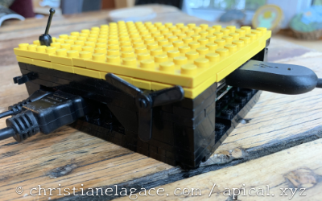 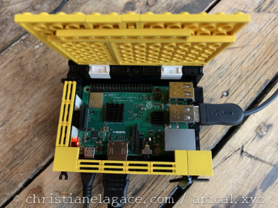 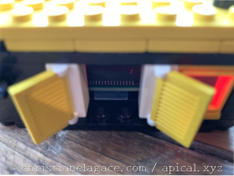

Remarquez la petite fenêtre qui permet de voir les DEL rouge (alimentation) et verte (accès à la carte micro SD). J'ai aussi prévu des portes pour accéder à la carte micro SD.

Une autre option s'offre à vous si vous disposez d'une imprimante 3D : imprimer votre propres boîtier. Et pas de problème si vous n'avez pas de talent de concepteur, plusieurs modèles sont disponibles sur Thingiverse (<https://www.thingiverse.com/search?q=raspberry+pi+case>).

Attention : si vous achetez ou imprimez un boîtier, prenez soin de choisir un modèle fait spécifiquement pour votre version du Raspberry Pi. Les connecteurs ne sont pas placés au même endroit d'une version à l'autre.


Selon le logiciel de domotique choisi, vous pourriez avoir à installer le système d'exploitation Raspberry Pi OS (la version Lite, sans interface graphique, est généralement suffisante) puis y ajouter le logiciel de domotique. C'est le cas par exemple avec [apical\_lien\_interne][installation\_de\_jeedom\_et\_premier\_acces,Jeedom][/apical\_lien\_interne] et avec [apical\_lien\_interne][installation\_de\_domoticz,Domoticz][/apical\_lien\_interne].

D'autres logiciels de domotique tournent sur un système d'exploitation créé spécifiquement pour eux. C'est le cas notamment avec [apical\_lien\_interne][installation\_de\_home\_assistant\_et\_premier\_acces,Home Assistant][/apical\_lien\_interne].

Notez que, selon les choix que vous ferez, vous pourriez avoir besoin d'un **écran**, d'un **clavier** pour effectuer l'installation.

## 13.3 Bien traiter son Raspberry Pi :-)

Le Raspberry Pi est un petit ordinateur alors certaines précautions s'imposent quand on le manipule.

## Boîtier

Le Raspberry Pi doit être fixé dans un boîtier. Ceci le protégera des chocs et de la poussière en plus de vous aider à ne pas mettre vos doigts sur ses composantes électronique.

## Dissipateurs thermiques

Il pourrait arriver que le Pi chauffe. Assurez-vous que des dissipateurs thermiques (heatsink) soient collés aux endroits appropriés. Généralement, on en place un sur le processeur, un sur la mémoire vive, un sur le contrôleur Ethernet et un autre sur le contrôleur USB.

## Ventilateur

Il est intéressant d'ajouter un ventilateur si le boîtier le permet.

Pour que le ventilateur fonctionne à bas régime, il faut brancher le fil rouge sur la broche 3.3V ([apical\_lien\_interne][qu\_est-ce\_que\_le\_gpio,broche physique no 1,pinout][/apical\_lien\_interne]) et le fil noir sur une des broches de mise à terre (broche no 6, 9, 14, 20, 25, 30, 34 ou 39).

Notez que pour que le ventilateur tourne plus vite, il suffit de brancher le fil rouge sur une broche 5V (broche no 2 ou 4).

Dans le cas où le ventilateur comporte un troisième fil, généralement bleu, ce fil doit être branché sur la broche TXD (no 8).

## Câble du bloc d'alimentation

Évitez d'enrouler le fil du bloc d'alimentation alentour du bloc. Ceci accélère son usure et risque de casser plus rapidement les petits fils qui sont à l'intérieur.

En effet, à force de l'enrouler et de le dérouler, le fil devient complètement tordu.

Il est préférable de replier le fil sur lui-même, quitte à terminer par un tour ou deux.

## Manipulation de la carte micro SD

Lors du retrait de la carte micro SD, tirez-la horizontalement. Si vous tentez de la tirer verticalement, vous risquez d'endommager l'unité dans laquelle la carte est insérée.

## Branchements au GPIO

Lorsque vous effectuez des branchements au GPIO, assurez-vous que le Pi ne soit pas sous tension.

## Arrêt du système d'exploitation

Assurez-vous d'[apical\_lien\_interne][Eteindre\_un\_systeme\_linux\_de\_facon\_securitaire,éteindre le système de façon sécuritaire][/apical\_lien\_interne] avant de débrancher le Raspberry Pi.

<!-- --- split --- -->


## 14.1 Quelques logiciels de domotique intéressants

Les boîtes domotiques commerciales incluent un logiciel de domotique. Chaque compagnie a son propre logiciel et généralement, il n'est pas possible de le changer.

Si vous montez votre boîte domotique avec un Raspberry Pi, vous pouvez y installer un logiciel que vous aurez codé ou encore travailler avec un des nombreux logiciels libres (Open Source) sur le marché. Une communauté active travaille sur chacun d'entre eux et contribue à leur amélioration au niveau des fonctionnalités, de la convivialité et de la sécurité.

## Jeedom

Jeedom peut être installé gratuitement sur un Raspberry Pi en version DIY. Il est également possible d'acheter une boîte domotique Jeedom prête à l'emploi.

Dans la version DIY, en plus des modules existants, vous pouvez programmer vos propres modules Jeedom en PHP : <https://www.jeedom.com/site/fr/dev.html>.

Jeedom vous intéresse? Commencez ici : [apical\_lien\_interne]installation\_de\_jeedom\_et\_premier\_acces[/apical\_lien\_interne].

## Home Assistant

Home Assistant est un excellent logiciel domotique à code source ouvert qui peut être installé sur un Raspberry Pi.

Il peut tourner par-dessus le système d'exploitation de votre choix (on parlera alors de [Home Assistant Supervised](https://github.com/home-assistant/supervised-installer)), par-desssus Raspberry Pi OS (on parlera de [Home Assistant Core](https://www.home-assistant.io/docs/installation/raspberry-pi/)) ou, selon la technique recommandée, par-dessus le système d'exploitation Home Assistant Operating System, aussi appelé HassOS ou Hass.io. Ce système d'exploitation est basé sur resinOS.

Pour vous lancer avec Home Assistant, suivez le guide : [apical\_lien\_interne]installation\_de\_home\_assistant\_et\_premier\_acces[/apical\_lien\_interne].


OpenNetHome : <http://opennethome.org/>

openHAB : <https://www.openhab.org/>

Node-RED : <https://nodered.org/>

WebThings : <https://webthings.io/>

Domoticz : <https://www.domoticz.com/>

etc.

## 14.2 IFTTT

IFTTT signifie IF This, Then That. Traduction libre : Si ceci alors cela.

Mais IFTTT, c'est quoi exactement?

C'est un service Web gratuit qui permet d’automatiser des tâches pour des objets connectés Wi-Fi entre eux — par exemple un capteur de mouvement et une prise intelligente — ou entre les objets et des services Web — par exemple Gmail, Facebook, Google Assistant.

IFTTT fonctionne avec le principe d'un déclencheur (trigger), le this et d'une action, le that. Par exemple, le déclencheur pourrait être l'envoi d'un courriel dont le titre est « J'ai froid » et l'action serait de démarrer le chauffage.

## IFTTT vs boîte domotique

Dans la plupart des boîtes domotiques, par exemple [apical\_lien\_interne][installation\_de\_jeedom\_et\_premier\_acces,Jeedom][/apical\_lien\_interne] ou [apical\_lien\_interne][installation\_de\_home\_assistant\_et\_premier\_acces,Home Assistant][/apical\_lien\_interne], le système de scénarios, parfois appelés automatisation, est plus puissant que IFTTT.

Cependant, IFTTT n'est pas sans intérêt puisqu'il peut être utililisé par-dessus une boîte domotique via une extension ou encore de façon autonome, appuyé par une application du genre de [Smart Life](https://ifttt.com/smartlife).

Grâce à IFTTT, il est plus facile d'intégrer à une boîte domotique des objets connectés Wi-Fi à prime abord non compatibles.

## Pour plus d'information

« IFTTT - Every thing works better together ». IFTTT. <https://ifttt.com/>

« IFTTT et Domotique : Comment automatiser les interactions entre les périphériques wifi? ». Domo Blog. <https://www.domo-blog.fr/ifttt-et-domotique-comment-automatiser-les-interactions-entre-les-peripheriques-wifi/>

« Using IFTTT with the Raspberry Pi ». The Pi Hut. <https://thepihut.com/blogs/raspberry-pi-tutorials/using-ifttt-with-the-raspberry-pi>

« IFTTT et Jeedom : Comment utiliser les périphériques wifi avec le système domotique ». Domo Blog. <https://www.domo-blog.fr/ifttt-et-jeedom-comment-utiliser-les-peripheriques-wifi-avec-le-systeme-domotique/#:~:text=IFTTT%20permet%20%C3%A0%20Jeedom%20de,largement%20dans%20toute%20la%20maison.>

« Smart Life : comment dompter le « couteau Suisse » de la maison connectée ? ». Les Alexiens. <https://www.lesalexiens.fr/tutoriels/tutoriel-comment-dompter-smart-life-le-couteau-suisse-de-la-maison-connectee/>

<!-- --- split --- -->


## 15.1 Installation de Jeedom et premier accès

Jeedom est offert en version DIY, que vous pouvez installer directement sur un Raspberry Pi ou sur un autre ordinateur de votre choix. Il est également possible d'acheter une boîte domotique commerciale avec Jeedom préinstallé.

C'est la solution DIY qui nous intéresse ici, avec un [apical\_lien\_interne][un\_raspberry\_pi\_comme\_unite\_centrale,Raspberry Pi comme unité centrale][/apical\_lien\_interne].

Nous allons voir ici comment effectuer l'installation de Jeedom.

Note : si vous n'avez pas accès à un écran et à un clavier pour le Raspberry Pi, il est possible d'effectuer une installation dite headless : « [apical\_lien\_interne]installation\_de\_jeedom\_sans\_clavier\_ni\_ecran[/apical\_lien\_interne] ».

Les instructions présentées ici requièrent l'utilisation d'un clavier et d'un écran.


Commencez par prendre connaissance de la fiche suivante afin d'acquérir les bonnes composantes de base : [apical\_lien\_interne][un\_raspberry\_pi\_comme\_unite\_centrale][/apical\_lien\_interne].

## Installer Raspberry Pi OS Lite

Vous êtres maintenant prêts à installer le système d'exploitation. Ici, on voudra travailler avec Raspberry Pi OS Lite.

Suivez les instructions sur cette fiche : [apical\_lien\_interne]raspberry\_pi\_imager[/apical\_lien\_interne].

## Démarrer le Raspberry Pi

Retirez la carte micro SD de l'ordinateur de façon sécuritaire puis insérez-la dans le Raspberry Pi.

Important : vous devez brancher l'écran au Raspberry Pi avant de mettre le Pi sous tension.

Mettez le Pi sous tension.

L'écran vous présentera une invite pour vous authentifier au Raspberry Pi.

Si vous n'avez pas modifié ces informations avec Raspberry Pi Imager, le code d'usager est pi et le mot de passe est raspberry.

## Modifier le mot de passe

Puisque vous avez activé SSH, vous devrez changer le mot de passe du Raspberry Pi [apical\_lien\_interne][activer\_ssh\_sur\_le\_raspberry\_pi,afin de ne pas ouvrir un trou de sécurité,motdepasse][/apical\_lien\_interne].

Ceci est requis seulement si vous ne l'avez pas déjà fait dans Raspberry Pi Imager.

Le mot de passe peut être modifié à partir du terminal à l'aide de cette commande :

Terminal du Raspberry Pi

passwd

## Vérifier l'accès réseau

Assurez-vous que vous avez accès à Internet :

Terminal du Raspberry Pi

ping 8.8.8.8

Pour arrêter l'affichage, appuyez sur Ctrl + C.

Si vous obtenez un message du genre « Network in unreachable », vous devez vous assurer que le Pi a accès à un réseau :

* soit il est branché à l'aide d'un câble RJ-45 (aucune configuration requise)
* soit il est [apical\_lien\_interne][configurer\_le\_reseau\_wi-fi\_sur\_le\_raspberry\_pi,correctement configuré pour accéder au réseau sans fil,networkmanager][/apical\_lien\_interne]

Vérifiez ensuite s'il a accès à un serveur DNS :

Terminal du Raspberry Pi

ping google.com

Si cela ne fonctionne pas (message du genre « Temporary failure in name resolution »), c'est que les serveurs DNS n'ont pas été correctement entrés lors de la[apical\_lien\_interne][configurer\_le\_reseau\_wi-fi\_sur\_le\_raspberry\_pi,configuration du réseau sans fil,networkmanager][/apical\_lien\_interne].

## Ajuster l'heure

En temps normal, la date et l'heure du système devraient avoir été ajustées automatiquement grâce au service NTP disponible sur le réseau.

Cependant, si le réseau n'offre pas ce service, vous devrez ajuster la date et l'heure manuellement.

Une date erronée pourrait empêcher l'installation de Jeedom.

Pour vérifier la date du système :

Terminal du Raspberry Pi

timedatectl

Pour ajuster la date et l'heure :

Terminal du Raspberry Pi

sudo timedatectl set-time 'AAAA-MM-JJ HH:mm:ss'

## Mettre à jour le système

Avant d'aller plus loin, c'est une bonne idée de mettre le système à jour.

Entez ces commandes afin de mettre à jour la liste de paquets puis de procéder à la mise à jour du système :

Terminal du Raspberry Pi

sudo apt update  
sudo apt upgrade

## Donner une adresse IP statique au Pi

Ceci n'est pas obligatoire mais c'est généralement recommandé pour un système domotique.

[apical\_lien\_interne][donner\_une\_adresse\_ip\_statique\_au\_raspberry\_pi,Suivez les instructions données ici][/apical\_lien\_interne].

## Installer Jeedom

L'installation de Jeedom se fait à l'aide d'une instruction en ligne de commande :

Terminal du Raspberry Pi

wget -O- https://raw.githubusercontent.com/jeedom/core/master/install/install.sh | sudo bash

Patientez, l'installation peut prendre facilement de 15 à 30 minutes, selon la vitesse de votre réseau.

Si vous obtenez une erreur du genre « Package ntp is not available », c'est qu'il y a une incompatibilité entre Jeedom et la version de Raspberry Pi OS installée. Vous pouvez installer une ancienne version du système d'exploitation à l'aide de l'une de ces techniques :

* à partir de Raspberry Pi Imager : Raspberry Pi OS (other) / Raspberry Pi OS (Legacy, 64 bits) Lite
* en faisant une [apical\_lien\_interne][installation\_de\_raspberry\_pi\_os,installation manuelle][/apical\_lien\_interne] à partir d'une image trouvée parmi la liste des anciennes versions : <https://downloads.raspberrypi.org/raspbian_lite/images/>. Relancez ensuite la commande wget.

  Au moment d'écrire ces lignes en novembre 2025, Jeedom s'installait correctement sur Raspberry Pi OS 12 (Bookworm), sorti en juin 2023, mais pas sur la version 13 (Trixie), sortie en août 2025.

Si le processus d'installation vous pose des questions, vous pouvez accepter ce qu'il propose.

À la fin de l'opération, vous obtiendrez un message de succès.

Résultat à l'écran

==================================================  
| TOUTES LES VERIFICATIONS SONT FAITES |  
==================================================  
\033[1;32métape 12 vérification de jeedom réussie\033[0;39m  
Installation finie. Un redémarrage devrait être effectué

Redémarrez ensuite votre Pi :

Terminal du Raspberry Pi

reboot


Voilà, vous pouvez désormais [apical\_lien\_interne][acceder\_a\_jeedom,accéder à Jeedom][/apical\_lien\_interne] à partir de votre navigateur!

## Pour plus d'information

« Installation ». Jeedom. <https://doc.jeedom.com/fr_FR/installation/rpi>

## 15.2 Installation de Jeedom sans clavier ni écran

Si vous n'avez pas accès à un clavier et à un écran pour votre Raspberry Pi, je vous propose cette technique pour effectuer une installation de Jeedom dite headless (litéralement : sans tête, c'est-à-dire sans écran).

## Installer Raspberry Pi OS Lite

La première étape consiste à installer le système d'exploitation. Ici, on voudra travailler avec Raspberry Pi OS Lite.

Suivez les instructions sur cette fiche : [apical\_lien\_interne]raspberry\_pi\_imager[/apical\_lien\_interne].

Important : prenez le temps de modifier les réglages en cliquant sur le bouton approprié lorsqu'il apparaît.

Parmi les configurations à réaliser pour une installation headless, notons :

* le nom et le mot de passe de l'usager Linux
* l'activation SSH
* la configuration du réseau Wi-Fi
* la configuration du clavier (qwerty: us vs azerty: fr).

Attention : avec une installation headless, il reste une étape à réaliser avant d'insérer la carte micro SD dans le Raspberry Pi.

## Donner une adresse IP statique au Pi

Dans une installation headless, puisqu'aucun écran n'est branché au Raspberry Pi, donner une adresse IP statique est la seule façon de connaître l'adresse IP qu'il faudra utiliser pour accéder à Jeedom ou pour se brancher au Raspberry Pi via SSH.

Attention : ceci ralentira le processus de démarrage du Raspberry Pi.

La technique consiste à éditer le fichier cmdline.txt. Contrairement aux fichiers du système d'exploitation, ce fichier est visible lorsque la carte micro SD est insérée dans l'ordinateur.

Ajoutez simplement, à la fin de cette ligne, [la configuration suivante](https://www.kernel.org/doc/Documentation/filesystems/nfs/nfsroot.txt#:~:text=ip=) en ajustant les informations requises au format :

ip=addresseIP::adresseIPLocaleRouteur:masqueSousReseau:HostNameDuPi:eth0:off

Par exemple :

Fichier cmdline.txt

console=... ip=192.168.1.145::192.168.1.1:255.255.255.0:raspberrypi:eth0:off

Enregistrez le fichier, le Raspberry Pi saura lire son contenu lors du démarrage.

Note : puisque cette technique ralentit le processus de démarrage, une fois que vous aurez réussi à vous brancher au Raspberry Pi via SSH, je vous suggère d'effectuer la configuration de l'adresse IP statique [apical\_lien\_interne][donner\_une\_adresse\_ip\_statique\_au\_raspberry\_pi,à l'aide d'une autre technique][/apical\_lien\_interne] puis de supprimer cette configuration du fichier cmdline.txt.

## Démarrer le Raspberry Pi

Retirez la carte micro SD de l'ordinateur de façon sécuritaire puis insérez-la dans le Raspberry Pi.

Mettez le Pi sous tension.

## Connexion SSH

Puisque lors d'une installation headless, le Raspberry Pi n'a ni écran, ni clavier, il faudra s'y connecter via SSH pour effectuer certaines manipulations.

Vous aurez besoin d'un client SSH. Ce client est disponible par défaut sous Mac ou Linux de même que sous Windows dans une fenêtre PowerShell ou dans une console Git Bash.

Le client SSH vous permet de vous connecter au Pi à l'aide d'une commande entrée dans une fenêtre Terminal de votre ordinateur (vous devez remplacer pi par le nom de votre usager Linux et 192.168.1.145 par l'adresse IP de votre Pi).

Terminal (sur l'ordinateur)

ssh pi@192.168.1.145

## Ajuster l'heure

En temps normal, la date et l'heure du système devraient avoir été ajustées automatiquement grâce au service NTP disponible sur le réseau.

Cependant, si le réseau n'offre pas ce service, vous devrez ajuster la date et l'heure manuellement.

Une date erronée pourrait empêcher l'installation de Jeedom.

Pour vérifier la date du système :

Console SSH

timedatectl

Pour ajuster la date et l'heure :

Console SSH

sudo timedatectl set-time 'AAAA-MM-JJ HH:mm:ss'

## Mettre à jour le système

Avant d'aller plus loin, c'est une bonne idée de mettre le système à jour.

D'abord, assurez-vous que vous avez accès à Internet :

Console SSH

ping 8.8.8.8

et à un serveur DNS :

Console SSH

ping google.com

Maintenant, entez ces commandes afin de mettre à jour la liste de paquets puis de procéder à la mise à jour du système :

Console SSH

sudo apt update  
sudo apt upgrade

## Installer Jeedom

L'installation de Jeedom se fait à l'aide d'une instruction en ligne de commande :

Console SSH

wget -O- https://raw.githubusercontent.com/jeedom/core/master/install/install.sh | sudo bash

Patientez, l'installation peut prendre facilement de 15 à 30 minutes, selon la vitesse de votre réseau.

Si le processus d'installation vous pose des questions, vous pouvez accepter ce qu'il propose.

À la fin de l'opération, vous obtiendrez un message de succès.

Résultat à l'écran

==================================================  
| TOUTES LES VERIFICATIONS SONT FAITES |  
==================================================  
\033[1;32métape 12 vérification de jeedom réussie\033[0;39m  
Installation finie. Un redémarrage devrait être effectué

Redémarrez ensuite votre Pi :

Console SSH

sudo reboot


Voilà, vous pouvez désormais [apical\_lien\_interne][acceder\_a\_jeedom,accéder à Jeedom][/apical\_lien\_interne] à partir de votre navigateur!

## 15.3 Accéder à Jeedom

Une fois que [apical\_lien\_interne][installation\_de\_jeedom\_et\_premier\_acces,Jeedom a été installé][/apical\_lien\_interne], vous êtes prêts à commencer à explorer votre nouveau joujou!

## Vérifier si Jeedom est installé

Mais tout d'abord, si vous ne venez pas tout juste d'installer Jeedom sur votre carte micro SD, sachez que vous pouvez vérifier si Jeedom y est installé. Insérez la carte dans un Pi puis démarrez-le. À l'aide d'une connexion SSH ou d'un clavier et d'un écran, lancez cette commande :

Terminal du Raspberry Pi

find / -name jeedom 2> /dev/null

Vous devriez obtenir quelques fichiers, par exemple /var/lib/mysql/jeedom et /etc/cron.d/jeedom.


Ouvrez un navigateur sur un ordinateur connecté au même réseau que le Pi et entrez-y l'[apical\_lien\_interne][trouver\_l\_adresse\_ip\_du\_raspberry\_pi,adresse IP du Pi][/apical\_lien\_interne].

Vous accéderez ainsi à l'interface de Jeedom.

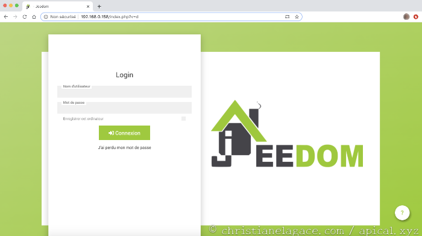

La première fois que vous vous branchez, vous devez utiliser le code d'usager admin et le mot de passe admin. Vous serez alors invités à changer ces valeurs.

Jeedom vous demandera ensuite de vous créer un compte sur Jeedom Market. Rassurez-vous, vous n'aurez rien à acheter pour effectuer la majorité des tâches domotiques.

Voilà, vous pouvez maintenant commencer à [apical\_lien\_interne][configurer\_la\_cle\_usb\_z-wave\_sur\_jeedom,configurer votre boîte domotique][/apical\_lien\_interne]!

<!-- --- split --- -->




Tout bon système informatique doit pouvoir être sauvegardé afin de pouvoir tout remettre en place en cas de problème.

Jeedom a tout ce qu'il faut pour cela.

## Sauvegarde manuelle

Le système de sauvegarde de Jeedom permet de créer un fichier compressé qui contiendra tout le contenu du dossier /var/www/html ainsi qu'un script SQL de la base de données.

Pour lancer une sauvegarde manuelle, rendez-vous dans le menu Réglages / Système / Sauvegardes puis cliquez sur Lancer une sauvegarde.

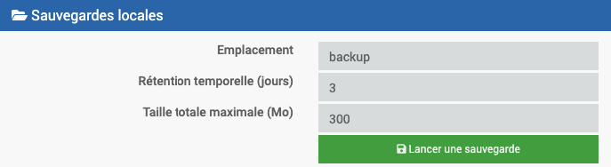

La fenêtre Informations affichera le résultat de l'opération.

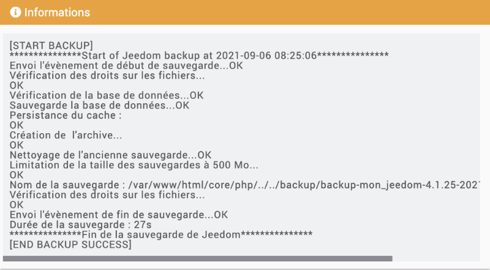

Le fichier de sauvegarde sera enregistré dans le dossier /var/www/html/backup sur le Raspberry Pi.

Pour vous assurer qu'il ne soit pas perdu si jamais la carte micro SD était corrompue, téléchargez-le sur votre poste de travail à l'aide du bouton Télécharger la sauvegarde.

## Contenu d'une sauvegarde

Si vous êtes curieux, vous pouvez examiner le contenu d'un fichier de sauvegarde.

Après avoir téléchargé le fichier sur votre poste de travail à l'aide du bouton Télécharger la sauvegarde dans Jeedom, décompressez-le.

Vous constaterez que la sauvegarde contient de nombreux fichiers qui permettent de réinitialiser toutes vos configurations.

En fait, c'est tout le contenu du dossier /var/www/html qui est présent.

Un script SQL de la base de données est également présent.

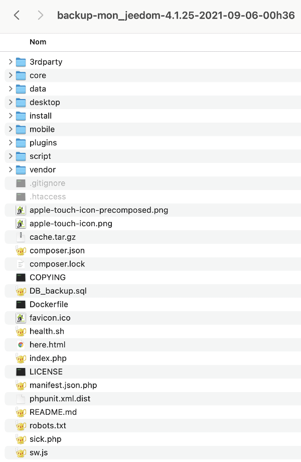

## Sauvegardes automatiques

Par défaut, Jeedom fera une sauvegarde complète du système à chaque nuit.

L'heure de la sauvegarde est établie par Jeedom en fonction de la charge du Market puisqu'il y a possibilité de copier automatiquement le fichier de sauvegarde dans l'infomuagique.

Pour connaître l'heure exacte de la sauvegarde, rendez-vous dans Réglages / Système / Moteur de tâches. Recherchez une tâche dont la classe est Jeedom et la fonction est backup.

On voit ici que la sauvegarde sera lancée à chaque jour à 00h36 ([syntaxe cron](https://www.domo-blog.fr/editer-la-crontab-du-raspberry/) 36 00 \* \* \*).

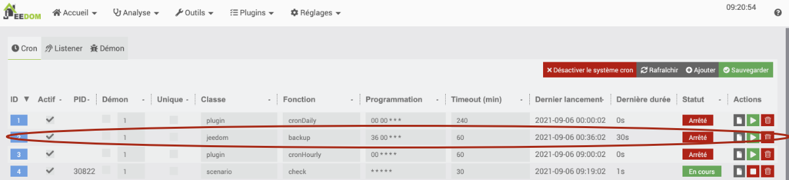

Comme pour les sauvegardes manuelles, le fichier de sauvegarde sera enregistré dans le dossier /var/www/html/backup sur le Raspberry Pi.

Résultat à l'écran

pi@raspberrypi:~ $ ls /var/www/html/backup  
backup-mon\_jeedom-4.1.25-2021-09-04-00h36.tar.gz  
backup-mon\_jeedom-4.1.25-2021-09-05-00h36.tar.gz  
backup-mon\_jeedom-4.1.25-2021-09-06-00h36.tar.gz


Il est possible d'apporter des précisions sur la façon dont les sauvegardes seront effectuées.

* Rendez-vous dans le menu Réglages / Système / Sauvegardes.

  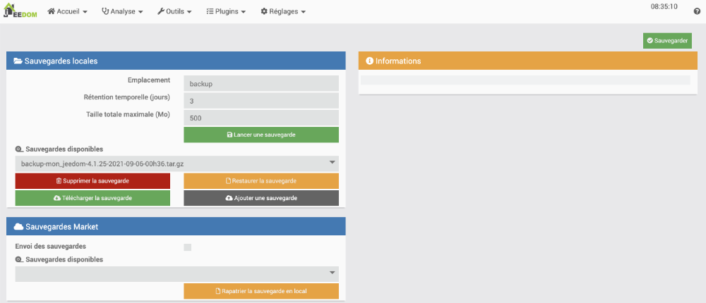
* De là, vous pouvez configurer les sauvegardes automatiques.
  + Il est possible de modifier le nom du dossier qui contiendra les sauvegardes par défaut : backup).
  + Le nombre de sauvegardes conservées sur le Pi dépend des configurations Rétention temporelle (jours) et Taille totale maximale (Mo).
  + Il est possible de copier automatiquement les sauvegardes dans l'infonuagique. Cette solution requiert cependant un paiement mensuel de 2 euros. Par contre, [apical\_lien\_interne][copier\_automatiquement\_le\_fichier\_de\_sauvegarde\_sur\_votre\_ordinateur,je vous montre ici une technique pour télécharger les sauvegardes sans frais sur votre ordinateur][/apical\_lien\_interne].


Votre système Jeedom est défaillant ou encore vous désirez revenir à une configuration antérieure?

Pas de problème, la restauration est très simple si vous avez en main le fichier de sauvegarde.

* Si votre système est encore fonctionnel, vous pouvez travailler directement à partir de votre Jeedom. S'il est défaillant, vous devez installer une nouvelle copie de Jeedom.
* Si votre système était encore fonctionnel, le fichier de sauvegarde pourra être retrouvé directement par l'interface de Jeedom. Passez à l'étape suivante.

  Dans le cas où votre système était défaillant, vous devez, après avoir réinstallé Jeedom, copier le fichier vers le Raspberry Pi.

  Terminal de votre ordinateur

  scp /dossierlocal/backup-mon\_jeedom-4.1.25-2021-09-06-00h36.tar.gz pi@192.168.1.145:

  Une fois copié sur le Pi, il devra être déplacé dans le dossier /var/www/html/backup.

  Terminal du Raspberry Pi

  sudo mv backup-mon\_jeedom-4.1.25-2021-09-06-00h36.tar.gz /var/www/html/backup
* Dans Jeedom, rendez-vous dans le menu Réglages / Système / Sauvegardes.
* Dans la zone Sauvegardes locales, section Sauvegardes disponibles, sélectionnez la sauvegarde désirée dans la liste déroulante.
* Cliquez sur Restaurer la sauvegarde. Jeedom affichera l'état d'avancement dans la fenêtre Informations.

  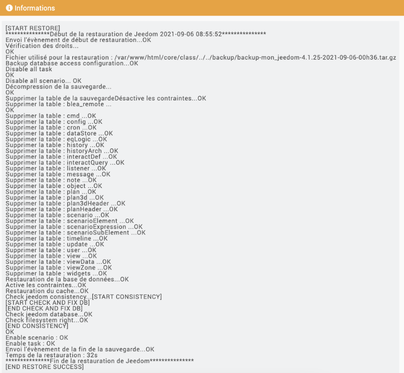

## 16.2 Copier automatiquement le fichier de sauvegarde sur votre ordinateur

Les sauvegardes locales directement sur le Raspberry Pi sont intéressantes mais elles pourraient n'être d'aucun secours si jamais la carte micro SD était défaillante.

C'est pourquoi il est important de copier le fichier de sauvegarde à un autre endroit.

Puisque la sauvegarde dans l'infonuagique via l'interface de Jeedom nécessite des frais mensuels, je vous propose de faire une copie manuelle des fichiers de sauvegarde vers votre ordinateur personnel.

Il y a bien sûr la possibilité d'automatiser le transfert du fichier via Samba, tel que décrit dans cet article : <https://jeedomiser.fr/article/automatiser-et-externaliser-vos-sauvegardes-jeedom/>.

Ce que je vous propose est encore plus simple : une copie vers votre ordinateur personnel, qui sera lancée automatiquement à chaque jour.

* Créez un petit fichier bash pour automatiser cette tâche.
  + Le nom du fichier de sauvegarde est toujours le même à l'exception de la date du jour. L'heure pourra aussi être différente mais si vous vous en tenez aux sauvegardes lancées automatiquement, elle sera toujours la même à une ou deux minutes près.

    Le fichier bash devra donc monter le nom du fichier de sauvegarde à partir de la date du jour. Vous pouvez vous inspirer du [apical\_lien\_interne][script\_pour\_faciliter\_la\_copie\_de\_securite,script pour faciliter la copie de sécurité dans le nuage][/apical\_lien\_interne].

    Je vous conseille de vérifier la présence du fichier de sauvegarde sur le Raspberry Pi (sous Windows : if exist fichier.extension, sous Mac : if [ -e fichier.extension ]). En effet, si la sauvegarde n'a pas pu être effectuée exactement à la minute programmée, le nom du fichier sera légèrement différent (ex : backup-mon\_jeedom-4.1.25-2021-09-06-00h3**7**.tar.gz au lieu de backup-mon\_jeedom-4.1.25-2021-09-06-00h3**6**.tar.gz)
  + Le fichier bash se chargera de lancer [apical\_lien\_interne][copier\_un\_fichier\_sur\_une\_machine\_linux\_a\_partir\_d\_un\_autre\_ordinateur,la commande scp pour copier un fichier du Pi vers votre ordinateur,versordi][/apical\_lien\_interne].
  + Puisque la commande scp demande un mot de passe pour accéder au Pi, assurez-vous d'avoir [apical\_lien\_interne][permettre\_le\_branchement\_ssh\_sans\_demander\_le\_mot\_de\_passe\_a\_chaque\_fois,copié la clé publique SSH sur votre Pi][/apical\_lien\_interne] afin que le mot de passe ne soit plus demandé.
* Une fois le fichier bash écrit et testé, configurez le système d'exploitation de votre ordinateur pour que le fichier soit lancé automatiquement à la fréquence que vous désirez.
  + Sous Windows :
    - Planificateur de tâches / Action / Créer une tâche de base.
    - Nommer la tâche (ex : copie Jeedom)
    - Déclencheur : tous les jours et préciser l'heure désirée
    - Action : Démarrer un programme
    - Programme/script : Start-process -FilePath "$env:ProgramFiles\Git\bin\bash.exe" -ArgumentList "-l", "-c", '"bash monScript.bash"' -WorkingDirectory "C:\chemin\du\script"

      Prenez soin de remplacer monScript.bash le nom de votre script ainsi que C:\chemin\du\script par le chemin du dosiser qui contient ce script.

      Pour plus d'info : <https://www.pcastuces.com/pratique/astuces/5515.htm>.
  + Sous Mac, j'ai écrit une fiche sur le sujet : [apical\_lien\_interne]lancer\_une\_tache\_de\_facon\_automatique\_crontab[/apical\_lien\_interne].
* Évidemment, votre ordinateur personnel devra être ouvert et branché sur le même réseau que le Raspberry Pi pour que la copie fonctionne.

##

<!-- --- split --- -->


## 17.1 Erreur « Controller is busy »

### Problème :

Lorsque vous tentez d'ajouter un appareil connecté Z-Wave à Jeedom, vous obtenez le message « Controller is busy » et aucun appareil n'est détecté.

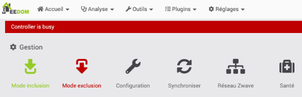

### Contexte :

* Jeedom 4.0.61
* Raspberry Pi 4
* Clé USB Z-Wave Aeotec Z-Stick Gen5

### Cause possible :

La clé USB Z-Wave n'est pas reconnue par le Raspberry Pi.

Pour voir si c'est le cas, lancez cette commande sur le Pi (notez que le premier caractère est un L minuscule) :

Terminal

lsusb

Si la clé est reconnue, vous obtiendrez une ligne qui la décrit.

Résultat à l'écran

Bus 002 Device 001: ID 1d6b:0003 Linux Foundation 3.0 root hub

 

Bus 001 Device 007: ID 0658:0200 Sigma Designs, Inc. Aeotec Z-Stick Gen5n(ZW090) - UZB

 

BUS 001 DEVICE 006: id 1A40:0101 Terminus Technology Inc. Hub

 

Bus 001 Device 003: ID 413c:2003 Dell Computers Corp. Keyboard

 

Bus 001 Device 002: ID 2109:3431 VIA Labs, Inc. Hub

 

Bus 001 Device 001: ID 1d6b:0002 Linux Foundation 2.0 root hub

Si la clé n'apparaît pas, c'est peut-être parce que le Pi 4 essaie de lui parler en USB3 et ce, même si elle est branchée dans un port USB2, alors que la clé ne parle qu'en USB2.

### Solution proposée :

L'ajout d'un hub USB, dans lequel on branchera la clé Z-Wave, pourrait régler le problème.

Celui que j'utilise : <https://www.amazon.ca/-/fr/Sabrent-Hub-USB-2-0-4-Port/dp/B00BWF5U0M>.

### Autre cause possible :

Jeedom n'utilise pas le bon port pour la clé USB Z-Wave.

### Solution proposée :

Rendez-vous dans le menu Plugins / Gestion des plugins puis cliquez sur Z-Wave dans la zone Mes plugins.

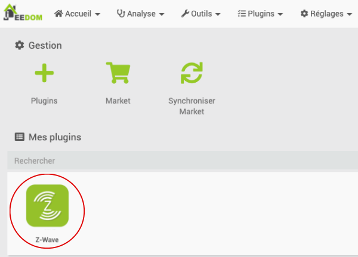

Dans la zone Configuration, mettez le port clé Z-Wave à Auto.

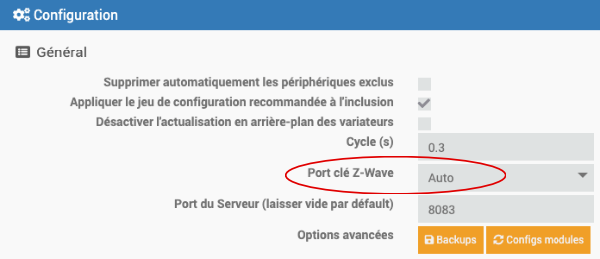

Si vous obtenez une mention NOOK dans la zone Démon, cliquez sur l'icône de flèche pour redémarrer le démon. Tant que vous n'obtenez pas OK pour le statut et pour la configuration, vous ne pourrez pas ajouter d'appareils connectés Z-Wave à Jeedom.

## 17.2 Impossible d'ajouter un objet connecté Z-Wave

### Problème :

Lorsque vous tentez d'ajouter un appareil connecté Z-Wave à Jeedom, l'appareil n'est jamais détecté même si vous effectuez les manipulations demandées, par exemple cliquer rapidement 3 fois sur le bouton d'inclusion.

### Contexte :

* Jeedom 4.0.61
* Raspberry Pi 4
* Clé USB Z-Wave Aeotec Z-Stick Gen5

### Cause possible :

L'appareil considère encore qu'il est connecté à une boîte domotique.

Ceci se produit si l'appareil n'a pas été correctement déconnecté de la boîte domotique lors d'une précédente installation.

Tant que l'appareil est configuré pour une boîte domotique, il n'est pas possible de l'inclure dans une autre boîte domotique.

### Solution proposée :

Effectuez une réinitialisation de l'appareil (factory reset). Sur certains appareils, ceci consiste à appuyer sur le bouton d'inclusion de façon prolongée pendant 10 secondes.

Consultez le manuel de l'appareil pour connaître la procédure spécifique à votre appareil.

### Autre cause possible :

L'appareil est muni d'un système d'auto-inclusion.

### Solution proposée :

Débranchez l'appareil, mettez la  boîte domotique en mode inclusion puis rebranchez l'appareil.

S'il est effectivement muni d'un système  d'auto-inclusion et qu'il n'est pas déjà connecté à une autre boîte domotique, il devrait être automatiquement détecté.

### Autre cause possible :

L'appareil est trop loin de la clé USB Z-Wave.

On sait qu'une fois que les appareils Z-Wave sont inclus dans le système, un appareil peut servir de relais Z-Wave vers un autre appareil, ce qui augmente la portée du Z-Wave.

Cependant, pendant l'inclusion, un appareil ne peut pas compter sur un autre pour lui relayer le signal. L'appareil à inclure doit donc être près de la clé USB Z-Wave.

### Solution proposée :

Déplacez l'appareil pour qu'il soit près de la clé USB Z-Wave.

Une fois l'inclusion complétée, l'appareil pourra être déplacé vers sa destination finale.

## 17.3 Erreur pendant l'installation de Jeedom avec wget

### Problème :

Lorsque vous tentez d'installer Jeedom sur une image toute fraîche de Raspberry Pi OS Lite à l'aide de la commande wget -O- https://raw.githubusercontent.com/jeedom/core/master/install/install.sh | sudo bash, vous obtenez le message « ERROR: The certificate of ‘raw.githubusercontent.com’ is not trusted. ».

Résultat à l'écran

pi@raspberrypi:~ $ wget -O- https://raw.githubusercontent.com/jeedom/core/master/install/install.sh | sudo bash  
--2021-08-19 16:23:22-- https://raw.githubusercontent.com/jeedom/core/master/install/install.sh  
Resolving raw.githubusercontent.com (raw.githubusercontent.com)... 185.199.109.133, 185.199.108.133, 185.199.110.133, ...  
Connecting to raw.githubusercontent.com (raw.githubusercontent.com)|185.199.109.133|:443... connected.  
ERROR: The certificate of ‘raw.githubusercontent.com’ is not trusted.  
ERROR: The certificate of ‘raw.githubusercontent.com’ doesn't have a known issuer.

Pendant l'installation, plusieurs messages d'erreur peuvent apparaître, par exemple :

* E: Release file for http://archive.raspberrypi.org/debian/dists/buster/InRelease is not valid yet (invalid for another 188d 0h 2min 42s)
* E: Failed to fetch http://raspbian.raspberrypi.org/raspbian/pool/main/m/mariadb-10.3/mariadb-server\_10.3.27-0+deb10u1\_all.deb 404 Not Found [IP: 93.93.128.193 80]
* E: Unable to fetch some archives, maybe run apt-get update or try with --fix-missing?
* Ne peut installer mariadb-client mariadb-common mariadb-server - Annulation

### Contexte :

* Raspberry Pi OS 10 (buster) sans interface graphique

### Cause possible :

La date du système n'est pas à jour, ce qui invalide le certificat SSL qui permet d'accéder à un service externe.

### Solution proposée :

Ajustez la date de Raspberry Pi OS : <

## 17.4 Erreur « Forbidden »

### Problème :

Lorsque vous tentez d'accéder à Jeedom en entrant l'adresse IP du Raspberry Pi dans un navigateur, vous obtenez l'erreur « Forbidden You don't have permission to access this resource. »

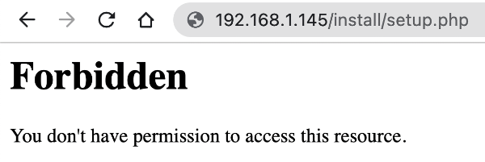

### Contexte :

* Raspberry Pi OS
* Jeedom

### Cause possible :

Un problème est survenu pendant l'installation de Jeedom.

### Solution proposée :

Je n'ai pas réussi à trouver la cause exacte du problème. Puisque ce problème m'est arrivé sur une installtion toute fraîche, le plus simple était de recommencer l'installation du système d'exploitation puis de Jeedom.

## 17.5 Erreur « Release file for http://archive.raspberrypi.org/debian/dists/buster/InRelease is not valid yet »

### Problème :

Lorsque vous tentez de mettre votre système Linux à jour avec la commande sudo apt update,  vous obtenez le message d'erreur « Release file for http://archive.raspberrypi.org/debian/dists/buster/InRelease is not valid yet ».

Résultat à l'écran

pi@raspberrypi:~ $ sudo apt update  
Get:1 http://archive.raspberrypi.org/debian buster InRelease [32.6 kB]  
Get:2 http://raspbian.raspberrypi.org/raspbian buster InRelease [15.0 kB]  
Reading package lists... Done   
E: Release file for http://archive.raspberrypi.org/debian/dists/buster/InRelease is not valid yet (invalid for another 187d 23h 42min 32s). Updates for this repository will not be applied.  
E: Release file for http://raspbian.raspberrypi.org/raspbian/dists/buster/InRelease is not valid yet (invalid for another 187d 18h 43min 12s). Updates for this repository will not be applied.

### Contexte :

* Raspberry Pi OS 10 (buster) sans interface graphique

### Cause possible :

La date du système n'est pas à jour, ce qui invalide le certificat SSL qui permet d'accéder à un service externe.

### Solution proposée :

Ajustez la date de Raspberry Pi OS : <

## 17.6 Erreur « Échec lors du téléchargement du fichier »

### Problème :

Lorsque vous tentez d'installer un plugin Jeedom à partir du Market, vous obtenez le message d'erreur « Échec lors du téléchargement du fichier. Veuillez réessayer plus tard (taille inférieure à 100 octets). Cela peut être dû à une absence de connexion au market (vérifiez dans la configuration de rpi qu'un test de connexion au market marche) ou lié à un manque de place, une version minimale requise non consistante avec votre version de rpi un souci du plugin sur le market, etc. ».

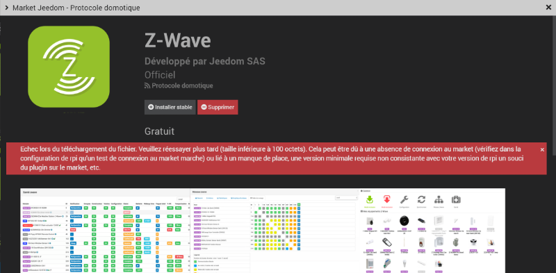

### Contexte :

* Raspberry Pi OS 10 (buster) sans interface graphique

### Cause possible :

Vous avez tenté de désactiver les validations SSL du Market puisque vous aviez une erreur de certificat SSL.

Cette erreur était en fait due à une mauvaise date du système.

### Solution proposée :

Rendez-vous dans le menu Réglages / Système / Configuration.

Dans l'onglet Mises à jour/Market, enlevez le crochet devant Pas de validation SSL (non recommandé).

Ajustez ensuite la date de Raspberry Pi OS pour régler l'erreur de certificat SSL : <

## 17.7 Erreur « Impossible de contacter le serveur Z-Wave »

### Problème :

Lorsque vous tentez d'accéder au menu Plugins / Protocole domotique / Z-Wave, vous obtenez l'erreur « Impossible de contacter le serveur Z-Wave. » ou encore « Le Réseau Z-Wave est en cours de démarrage. ».

### Contexte :

* Jeedom 4.3.17

### Cause possible :

Jeedom n'a pas terminé de charger les ressources nécessaires pour faire fonctionner la clé USB Z-Wave.

### Solution proposée :

Réessayez dans quelques minutes.

Si le problème n'est toujours pas résolu, redémarrez le système.

## 17.8 J'obtiens l'identifiant d'une commande plutôt que sa valeur

### Problème :

Lorsque vous exécutez un scénario qui doit ajouter la valeur d'un capteur dans un fichier journal à l'aide de log::add(), vous obtenez l'identifiant de la commande plutôt que sa valeur.

### Contexte :

* Jeedom 4.3.17

### Cause possible :

Vous avez entré directement la chaîne qui représente la commande, sans exécuter cette chaîne.

### Solution proposée :

Ajustez votre code pour que la commande soit exécutée.

Plutôt que ceci :

Bloc de code dans scénario (PHP)

log::add('meslogs', 'INFO', 'Luminance : #[Cuisine][Détecteur Lumière][Luminance]#');

Entrez ceci :

Bloc de code dans scénario (PHP)

$cmd = cmd::byString('#[Cuisine][Détecteur Lumière][Luminance]#');  
$value = $cmd->execCmd();  
log::add('meslogs', 'INFO', "Luminance : $value");

## 17.9 Erreur « SQLSTATE[HY000] [1045] Access denied for user 'jeedom'@'localhost' (using password: YES) »

### Problème :

Lorsque vous lancez l'interface Web de Jeedom, vous obtenez le message « SQLSTATE[HY000] [1045] Access denied for user 'jeedom'@'localhost' (using password: YES) ».

### Contexte :

* Jeedom 4.3.17

### Cause possible :

Vous avez modifié le mot de passe de la base de données Jeedom mais vous n'avez pas changé la configuration dans Jeedom.

### Solution proposée :

Pour dire à Jeedom quel est le mot de passe de sa base de données :

* Éditez le fichier de configuration common.config.php.

  Terminal

  sudo nano /var/www/html/core/config/common.config.php
* Entrez le nouveau mot de passe à la ligne password.

  Fichier /var/www/html/core/config/common.config.php

  <?php

   

  /\* This file is part of Jeedom.  
  \*  
  \* Jeedom is free software: you can redistribute it and/or modify  
  \* it under the terms of the GNU General Public License as published by  
  \* the Free Software Foundation, either version 3 of the License, or  
  \* (at your option) any later version.  
  \*  
  \* Jeedom is distributed in the hope that it will be useful,  
  \* but WITHOUT ANY WARRANTY; without even the implied warranty of  
  \* MERCHANTABILITY or FITNESS FOR A PARTICULAR PURPOSE. See the  
  \* GNU General Public License for more details.  
  \*  
  \* You should have received a copy of the GNU General Public License  
  \* along with Jeedom. If not, see <http://www.gnu.org/licenses/>.  
  \*/

   

  /\* \* \*\*\*\*\*\*\*\*\*\*\*\*\*\*\*\*\*\*\*\*\* Debug \*\*\*\*\*\*\*\*\*\*\*\*\*\*\*\* \*/  
  define('DEBUG', 0);

   

  /\* \* \*\*\*\*\*\*\*\*\*\*\*\*\*\*\*\*\*\*\*\*\*\*\* MySQL & Memcached \*\*\*\*\*\*\*\*\*\*\*\*\*\*\*\*\*\*\* \*/  
  global $CONFIG;  
  $CONFIG = array(  
     //MySQL parametres  
     'db' => array(  
        'host' => 'localhost',  
        'port' => '3306',  
        'dbname' => 'jeedom',  
        'username' => 'jeedom',  
        'password' => 'mot-de-passe-en-clair',  
     ),  
  );

## 17.10 Erreur « Le driver Z-Wave n'est pas initialisé »

### Problème :

Dans l'interface Web de jeedom, lorsque vous vous rendez dans le menu, Plugins / Protocole domotique / Z-Wave JS, vous obtenez le message « Le driver Z-Wave n'est pas initialisé, veuillez patienter. Si le message reste trop longtemps, veuillez vérifier la configuration du démon » ou encore « Le démon Z-Wave n'est pas démarré ».

### Contexte :

* Jeedom 4.3.20

### Cause possible :

Vous avez mal configuré le port de la clé USB Z-Wave.

### Solution proposée :

Pour connaître le port à utiliser, débranchez la clé USB Z-Wave du Raspberry Pi puis rebranchez-la.

Dans une fenêtre Terminal sur le Raspberry Pi ou via SSH, entrez cette commande :

Terminal

dmesg | grep tty

Résultat à l'écran

pi@jeedom:~ $ dmesg | grep tty  
[ 0.000000] Kernel command line: coherent\_pool=1M 8250.nr\_uarts=0 snd\_bcm2835.enable\_compat\_alsa=0 snd\_bcm2835.enable\_hdmi=1 video=HDMI-A-1:1680x1050M@60 smsc95xx.macaddr=D8:3A:DD:24:30:4D vc\_mem.mem\_base=0x3f000000 vc\_mem.mem\_size=0x3f600000 console=ttyS0,115200 console=tty1 root=PARTUUID=c764c245-02 rootfstype=ext4 elevator=deadline fsck.repair=yes rootwait  
[ 0.001837] printk: console [tty1] enabled  
[ 1.584526] fe201000.serial: ttyAMA0 at MMIO 0xfe201000 (irq = 36, base\_baud = 0) is a PL011 rev2  
[ 5.314135] cdc\_acm 1-1.3:1.0: ttyACM0: USB ACM device  
[ 159.584503] cdc\_acm 1-1.3:1.0: ttyACM0: USB ACM device

Le port à utiliser apparaîtra sur la dernière ligne.

Utilisez cette valeur dans l'écran Plugins / Gestion des plugins / Z-Wave JS vis-à-vis la configuration Port du contrôleur Z-Wave.

Patientez quelques minutes après avoir enregistré la configuration pour que tout rentre dans l'ordre.

<!-- --- split --- -->




Si vous ne réussissez pas à terminer cet exercice pendant le cours, vous devez absolument terminer à la maison avant le prochain cours.

1. [apical\_lien\_interne][installation\_de\_jeedom\_et\_premier\_acces,Installez Jeedom][/apical\_lien\_interne] sur votre Raspberry Pi.
2. Branchez votre Pi sur le réseau filaire afin d'obtenir de meilleures performances.
   1. Ne faites pas le sudo apt upgrade pour l'instant, c'est trop long au Cégep. Vous devrez le faire en devoir chez vous.
   2. Effectuez toutes les configurations présentées sur la fiche d'installation de Jeedom maisne faites pas la configuration d'adresses IP statiques pour l'instant.
3. Une fois le Raspberry Pi démarré, [apical\_lien\_interne][trouver\_l\_adresse\_ip\_du\_raspberry\_pi,vérifiez l'adresse IP de votre Pi][/apical\_lien\_interne]. Au Cégep, le Wi-Fi fournira une adresse DHCP au format 172.19.240.xxx. Avec le réseau filaire qui passe par le commutateur fourni, l'adresse sera au format 192.168.29.xxx.
4. Faites le nécessaire pour pouvoir [apical\_lien\_interne][permettre\_le\_branchement\_ssh\_sans\_demander\_le\_mot\_de\_passe\_a\_chaque\_fois,vous brancher via SSH sans avoir à entrer votre mot de passe à chaque fois][/apical\_lien\_interne].
5. [apical\_lien\_interne][installation\_de\_jeedom\_et\_premier\_acces,Accédez à Jeedom,acceder][/apical\_lien\_interne] à partir de votre navigateur. Le but ici est simplement de vous assurer que vous avez accès à Jeedom. Nous commencerons à le configurer au prochain cours.
6. Si vous avez travaillé jusqu'ici en filaire, faites le nécessaire pour que le tout fonctionne sans fil et vice-versa. Vous devez pouvoir travailler avec ces deux interfaces. Si vous n'aviez pas configuré le réseau sans fil dans Raspberry Pi Imager, vous pouvez le faire en suivant les étapes de cette fiche : « [apical\_lien\_interne]configurer\_le\_reseau\_wi-fi\_sur\_le\_raspberry\_pi[/apical\_lien\_interne] ».
7. OPTIONNEL : faites en sorte que l'[apical\_lien\_interne][envoyer\_l\_adresse\_ip\_par\_courriel\_apres\_le\_demarrage\_du\_raspberry\_pi,adresse IP du Pi vous soit envoyée par courriel lors du démarrage][/apical\_lien\_interne].
8. Effectuez une [apical\_lien\_interne][copie\_de\_securite\_de\_jeedom,sauvegarde manuelle de Jeedom][/apical\_lien\_interne] et téléchargez-la sur votre poste de travail.
9. Sur une nouvelle carte micro SD, faites une nouvelle [apical\_lien\_interne][installation\_de\_jeedom\_et\_premier\_acces,installation de Jeedom][/apical\_lien\_interne] puis [apical\_lien\_interne][copie\_de\_securite\_de\_jeedom,restaurez le système à partir de la sauvegarde que vous venez de réaliser,restaurer][/apical\_lien\_interne]. Vous aurez ainsi deux cartes fonctionnelles qui contiennent un Jeedom dans le même état.
10. Prenez le temps de visionner [apical\_lien\_interne][comment\_bien\_rouler\_un\_cable\_reseau,la petite vidéo qui montre comment bien rouler votre câble réseau][/apical\_lien\_interne].