# Chapitres 21–30

<!-- --- split --- -->

# 19. Pour le prochain cours


Vous disposez d'un cours pour acquérir les connaissances théoriques et finaliser cet exercice.

Une fois cet exercice complété, vous devez effectuer vos lectures pour l'exercice suivant.

<!-- --- split --- -->


## 20.1 En résumé...

Voici un résumé des informations essentielles du ou des prochains chapitres.

Notez que certaines fiches, qui font partie intégrante du cours, pourraient ne pas figurer dans ce résumé.

Je vous recommande d'effectuer une lecture de l'ensemble des fiches de ces chapitres afin de bien saisir les enjeux.

## [apical\_lien\_interne][donner\_une\_adresse\_ip\_statique\_au\_raspberry\_pi,Adresse IP statique,terminal][/apical\_lien\_interne]

Terminal

sudo nmtui

## [apical\_lien\_interne]le\_protocole\_z-wave[/apical\_lien\_interne]

Z-Wave est un protocole de communication sans fil destiné principalement à la domotique.

Portée théorique de 100 à 200 mètres selon la génération.

## [apical\_lien\_interne]le\_protocole\_zigbee[/apical\_lien\_interne]

Le protocole ZigBee a été développé pour les milieux industriels afin de faciliter la transmission de données en milieu difficile.

Moins grande portée que Z-Wave : 10 à 100 mètres.

## [apical\_lien\_interne]precautions\_avant\_l\_achat\_d\_un\_objet\_connecte[/apical\_lien\_interne]

Vérifier :

* Protocole de communication
* Fréquence
* Compatibilité avec la boîte domotique

## [apical\_lien\_interne]objets\_pour\_representer\_la\_maison[/apical\_lien\_interne]

Dans Jeedom, la notion d'objet permet de regrouper les appareils connectés.

Les objets fonctionnent en hiérarchie.

Par exemple, pour une maison à étages :

* Premier objet : Maison
* Ensuite, un objet par étage dont l'objet parent est la maison
* Et ensuite, un objet par pièce dont l'objet parent est l'étage.

Dans le cas où la maison ne comporte pas plusieurs étages, on pourra configurer les pièces avec la maison comme objet parent.

Si vous avez des objets à l'exterieur de la maison, une autre configuration pourrait être :

* Premier objet : Tout
* Ensuite, un objet Maison et un objet Dehors qui ont Tout comme parent
* Et ensuite, les objets sont organisés par étages et/ou par pièces.


Bien suivre ces étapes!

## 20.2 Passerelle et protocoles de communication

Les appareils branchés à un système domotique peuvent communiquer à l'aide de [différentes normes et protocoles de communication](https://fr.wikipedia.org/wiki/Domotique#Technologies_radios) :

* [apical\_lien\_interne][le\_protocole\_z-wave,Z-Wave][/apical\_lien\_interne]
* [apical\_lien\_interne][le\_protocole\_zigbee,Zigbee][/apical\_lien\_interne]
* [apical\_lien\_interne][mqtt,MQTT][/apical\_lien\_interne]
* [apical\_lien\_interne][interface\_rfxcom,RFXCOM][/apical\_lien\_interne]
* Wi-Fi
* Bluetooth
* etc.

Une passerelle, en anglais gateway, permet d'assurer la communication entre les appareils qui utilisent des protocoles différents.

Dans un système domotique DIY, c'est la boîte domotique qui joue le rôle de passerelle. Au besoin, on lui ajoutera des composantes sous forme de cartes d'extension ou de clé USB qui lui permettront de communiquer dans les protocoles requis.

Par abus de langage, on donnera parfois le nom de passerelle à la carte d'extension ou à la clé USB.

## Pour plus d'information

« Qu’est-ce qu’une “gateway” en domotique ? ». Maker help. <https://makerhelp.fr/quest-ce-quune-gateway-en-domotique/>

« Quelle passerelle domotique choisir ? RFXCom, Z-Wave, Zigbee, Xiaomi Aqara, Philips Hue… ». Projets DIY. <https://projetsdiy.fr/quelle-passerelle-domotique-choisir-rfxcom-z-wave-zigbee-xiaomi-aqara-philips-hue/>

## 20.3 Le protocole Z-Wave

Z-Wave est un protocole de communication sans fil destiné principalement à la domotique.

Il permet l'échange d'informations entre l'unité centrale du système domotique et les appareils qu'elle contrôle. Les informations transférées peuvent être, par exemple :

* des données récoltées par un capteur
* des ordres à exécuter (ex : allume-toi)

Un système domotique peut généralement gérer plusieurs protocoles.

Pour que votre système domotique puisse gérer le protocole Z-Wave, l'unité centrale doit être munie d'une composante matérielle (carte ou clé USB) qui lui permet de communiquer avec Z-Wave. Les autres composantes devront être munies d'une puce Z-Wave pour pouvoir communiquer.

## Z-Wave vs Z-Wave Plus

La certification Z-Wave Plus, aussi connue sous le nom 500 Series ou encore Gen5, assure que l'appareil offre des capacités étendues, par exemple une plus grande portée, une moins grande consommation énergétique (donc durée de vie plus grande pour la pile), une plus grande stabilité, etc.

Il existe également une certification Z-Wave Plus V2, également appelée 700 Series ou Gen7. Les appareils Z-Wave Gen7 offrent des capacités encore plus intéressantes que Gen5.

## Fréquence

Le protocole Z-Wave utilise les ondes basse fréquence. Attention : [la fréquence est différente selon le pays d'origine de l'appareil](https://www.silabs.com/wireless/z-wave/technology/global-regions). Avant d'acheter un appareil domotique avec une puce Z-Wave, il faut s'assurer que sa fréquence est la même que celle des autres appareils sinon, ils ne pourront pas communiquer ensemble.

À titre d'exemple, Z-Wave utilise une fréquence de 908.4 MHz au Canada et aux États-Unis. En Europe, il utilise une fréquence de 868,4 MHz.

## Portée

La portée théorique du Z-Wave est de 100 mètres. Dans les faits, à cause des obstacles (murs, meubles), la portée est plutôt aux alentours de 30 mètres.

La portée théorique est de 150 mètres pour Gen5 et 200 mètres pour Gen7.

Ce qui est intéressant, c'est que plusieurs puces Z-Wave peuvent se relayer un signal, ce qui augmente la portée par maillage.

## Sécurité

Le protocole Z-Wave n'est pas sans danger. En effet, si votre système domotique contrôle des appareils dont la puce Z-Wave effectue l’échange des clés de chiffrement selon l'ancienne procédure S0, il est relativement facile d'intercepter ces clés.

La procédure S2 (Security 2), plus sécuritaire, est obligatoire depuis 2017. Par contre, certains appareils ont conservé la procédure S0 pour assurer une rétrocompatibilité. C'est de là que vient la faille de sécurité.

Il est donc impératif de bien vérifier ce qu'il y a derrière un appareil connecté avant d'en faire l'acquisition.

## Pour plus d'information

« Principes de base de d’un réseau Z-Wave ». La domotique de Nechry. <https://nechry-automation.ch/2017/01/25/principes-de-base-reseau-z-wave/>

« Sécurité du protocole Z-Wave ». La domotique de Nechry. <https://nechry-automation.ch/2018/01/17/securite-zwave/>

« Z-Wave ». Wikipédia. <https://fr.wikipedia.org/wiki/Z-Wave>

« What is Z-Wave, Z-Wave Plus, Z-Wave S2, Z-Wave SmartStart and Z-Wave Plus V2 ». Vesternet. <https://www.vesternet.com/pages/what-is-z-wave#what>

« Introduction to the Z-Wave Security Ecosystem ». Sigma Designs. <https://cdn.shopify.com/s/files/1/0066/8149/3559/files/z-wave-security-white-paper.pdf>

« Une nouvelle puce z-wave pour une smart home encore plus performante ». Domo blog. <https://www.domo-blog.fr/nouvelle-puce-z-wave-smart-home-plus-performante/>

« Z Wave Vs ZigBee: Which Is Better For Your Smart Home? ». The Smart Cave. <https://thesmartcave.com/z-wave-vs-zigbee-home-automation/>

« Le protocole Z-Wave met votre maison connectée à la portée des pirates ». 01net.com. <https://www.01net.com/actualites/le-protocole-z-wave-met-votre-maison-connectee-a-la-portee-des-pirates-1457870.html>

« EZ-Wave: A Z-Wave hacking tool capable of breaking bulbs, abusing Z-Wave devices ». Privacy and security fanatic. <https://www.csoonline.com/article/3024217/ez-wave-z-wave-hacking-tool-capable-of-breaking-bulbs-and-abusing-z-wave-devices.html>

« Understanding Smart Home Communication Protocols ». Newegg. <https://www.newegg.com/insider/understanding-smart-home-communication-protocols/>

## 20.4 Le protocole ZigBee

Le protocole ZigBee a été développé pour les milieux industriels afin de faciliter la transmission de données en milieu difficile.

Sa portée est d'environ 10 m.

Il utilise une fréquence de 2.4 GHz. Il pourrait donc y avoir de l'interférence en provenance des appareils Wi-Fi de la maison.

Les objets connectés ZigBee sont généralement moins dispendieux que les Z-Wave mais plus dispendieux que les Wi-Fi.

## Pour plus d'information

« ZigBee ». Wikipédia. <https://fr.wikipedia.org/wiki/ZigBee>

« Z Wave Vs ZigBee: Which Is Better For Your Smart Home? ». The Smart Cave. <https://thesmartcave.com/z-wave-vs-zigbee-home-automation/>

## 20.5 La clé USB Z-Wave

Pour que le Raspberry Pi, en tant qu'[apical\_lien\_interne][un\_raspberry\_pi\_comme\_unite\_centrale,unité centrale de votre système domotique][/apical\_lien\_interne], puisse émettre et recevoir des signaux avec [apical\_lien\_interne][le\_protocole\_z-wave,le protocole Z-Wave][/apical\_lien\_interne], il faut lui ajouter un petit quelque chose : une clé USB Z-Wave ou encore une carte d'extension.

## Clé USB Z-Wave

Plusieurs fabricants offrent des clés USB qui permettent au Raspberry Pi de communiquer avec les appareils Z-Wave, par exemple :

* [Silicon labs  Z-Wave 700 UZB-7 USB stick](https://www.digikey.ca/fr/products/detail/silicon-labs/SLUSB001A/9867108) (environ CDN $30)
* [Zooz ZWave 800 Long Range USB Stick](https://www.aartech.ca/zst39-800lr) (environ CDN $50)
* [Aeotec ZWA010-A ZWave USB ZStick 7](https://www.aartech.ca/zwa010/aeotec-zstick-7-zwave-plus-gen7.html) (environ CDN $70)


La carte d'extension Razberry se branche directement sur le port GPIO du Raspberry Pi.

Malheureusement, Razberry n'est plus en vente. Il faut donc se retourner vers une clé USB Z-Wave.

## 20.6 La clé USB Zigate

Information à venir...

## Pour plus d'information

« Zigate ». Zigate. <https://zigate.fr/>

« Test de la Zigate, la passerelle domotique ZigBee pour jeedom et Eedomus ». Domo Blog. <https://www.domo-blog.fr/zigate-domotique-zigbee-jeedom-eedomus/>

## 20.7 Interface RFXCOM

L'émetteur/récepteur RFXCOM, aussi appelé RFXtrx, peut être branché au Raspberry Pi afin de communiquer avec des appareils qui utilisent une fréquence radio de 433MHz.

## Pour plus d'information

« Présentation du nouveau boîtier RFXcom RFXtrx433XL ». Domotique Technoseb27. <https://domotiquetechnoseb27.com/2018/12/21/presentation-du-boitier-rfxcom-rfxtrx433xl/>

« Fabriquer une passerelle domotique RFLink/RFXCom 433MHz pour 10,50€ (test avec Domoticz)  ». Projets DIY. <https://projetsdiy.fr/passerelle-radio-domotique-433mhz-rflink-rfxcom-domoticz/>

## 20.8 Le protocole MQTT

MQTT (Message Queuing Telemetry Transport) est un protocole de communication machine à machine très léger basé sur TCP/IP.

Il permet de transférer des informations à l'aide d'un mécanisme publication/abonnement (publish/subscribe).

Dans le monde de la domotique, il a une application intéressante : il permet à deux boîtes domotiques de communiquer ensemble. Les données d'un capteur branché sur la boîte A pourraient ainsi déclencher une action sur un récepteur branché sur la boîte B.

Dans cette fiche :

* [Agent MQTT](#agent)
* [Exemple de fonctionnement](#exemple)
* [Les canaux de communication MQTT](#canal)
* [Payload](#payload)
* [QoS](#qos)
* [Retain](#retain)
* [Conditions pour qu'une communication MQTT ait lieu](#conditions)

## Agent MQTT

Pour gérer les communications, il faut avoir un agent MQTT (en anglais, MQTT broker), parfois appelé courtier MQTT ou encore serveur MQTT.

[Mosquitto](https://mosquitto.org/) est un agent MQTT libre et très répandu. C'est d'ailleurs lui qui peut être facilement installé par différentes boîtes domotiques comme Jeedom ou Home Assistant.

Il ne faut pas confondre l'agent Mosquitto avec le site Web [https://test.mosquitto.org](https://mosquitto.org/) qui est une installation publique de ce même Mosquitto, souvent utilisée pour faire des tests.

Attention : les informations qui transigent sur https://test.mosquitto.org sont publiques! De plus, la communication n'est pas fiable, le serveur peut arrêter de fonctionner à tout moment. C'est un serveur de test.

Les informations qui transigent sur un agent local sont plus sécuritaires que celles qui transigent sur https://test.mosquitto.org, à condition que l'agent MQTT [apical\_lien\_interne][la\_securite\_avec\_mqtt,soit correctement configuré][/apical\_lien\_interne].

## Exemple de fonctionnement

Voici un exemple simple du fonctionnement d'une communication MQTT :

* Une boîte domotique envoie de l'information au sujet d'un de ses objets connectés, par exemple un capteur de luminosité, à un agent MQTT sur un canal donné. Le système domotique est ici le client publieur (publisher).
* Une autre boîte domotique est abonnée à ce canal. Elle recevra alors l'information sur la luminosité. Une règle d'automatisation lui permettra d'allumer ou d'éteindre une ampoule selon l'information reçue. Cette boîte est le client abonné (subscriber).
* L'information peut circuler dans les deux sens, c'est-à-dire que la boîte de l'ampoule, qui était le client abonné dans l'opération précédente, deviendra un client publieur si elle envoie de l'information au sujet de son état à l'agent MQTT sur un autre canal.
* Les abonnés de ce canal seront informés de l'état de l'ampoule et pourront réagir convenablement.

Ce mécanisme est intéressant puisqu'il peut fonctionner localement, sans devoir faire appel à un service infonuagique.

## Les canaux de communication MQTT

La communication entre le publieur et un abonné passe par un canal. On utilise parfois le terme sujet. En anglais, on dira channel ou topic.

L'agent MQTT peut gérer autant de canaux que nécessaire.

Le publieur décide sur quel canal il publie l'information. L'agent enverra cette information seulement aux abonnés de ce canal. Ceci permet à plusieurs publieurs d'envoyer des informations qui ne seront reçues que par ceux qui désirent recevoir ces informations.

Pour qu'un canal existe, il suffit qu'un publieur et un abonné l'utilisent. Il n'y a pas d'étape de création en tant que telle.

[Le nom d'un canal](https://www.hivemq.com/blog/mqtt-essentials-part-5-mqtt-topics-best-practices/) contient généralement plusieurs niveaux afin de bien organiser les canaux que l'agent MQTT doit gérer.

Le nom sera sous la forme : un\_niveau/un\_sous\_niveau/un\_nom.

Il sera écrit entièrement en lettre minuscules avec possiblement des barres de soulignement pour séparer les mots.

Il est préférable d'éviter les espaces, les caractères accentués et les caractères spéciaux dans le nom d'un canal.

Voici quelques exemples valables :

* maison/chambre/temperature
* securite/porte
* sauvegarde/homeassistant
* homeassistant/cafetiere


Si vous désirez écouter tout ce qui se publie sur un canal, peu importe les sous-niveaux, vous pouvez utiliser un #.

Par exemple, pour écouter tout ce qui se dit sur le canal jeedom, peu importe les sous-niveaux, vous écouterez le canal jeedom/#.

Pour écouter tout ce qui est publié sur un agent MQTT, vous écouterez le canal #.

## Payload

Le payload, aussi appelé la charge utile ou simplement les données, est le corps de l'information publiée sur un canal.

En fait, un message publié via MQTT contient un canal et un payload. On peut faire une comparaison avec un courriel qui contient un titre et un message.

## QoS

La qualité du service peut prendre les valeurs 0, 1 ou 2, la valeur 2 étant la meilleure garantie de livraison du message mais également la plus exigente au niveau des ressources.

Cette valeur peut être configurée du côté du client publieur et du côté du client abonné.

Lorsque le client abonné a une QoS inférieure à celle du client publieur, c'est la plus basse valeur qui est utilisée pour envoyer l'information de l'agent MQTT vers le client abonné.

<https://www.hivemq.com/blog/mqtt-essentials-part-6-mqtt-quality-of-service-levels/>

## Retain

Cette option permet notamment aux nouveaux abonnés de recevoir immédiatement le dernier message retenu sur ce canal.

<https://www.hivemq.com/blog/mqtt-essentials-part-8-retained-messages/>

## Conditions pour qu'une communication MQTT ait lieu

Pour qu'une communication MQTT ait lieu, il faut :

* un client publieur et un client abonné qui utilisent le même agent MQTT (si l'agent est local, le publieur et l'abonné devront être sur le même sous-réseau)
* un client publieur et un client abonné qui utilisent le même canal MQTT

## Pour plus d'information

« MQTT ». Wikipédia. <https://fr.wikipedia.org/wiki/MQTT>

« MQTT Essentials ». HiveMQ. <https://www.hivemq.com/mqtt-essentials/>

« MQTT Tutorial for Arduino, ESP8266 and ESP32 ». DIYI0T. <https://diyi0t.com/introduction-into-mqtt/>

<!-- --- split --- -->


## 21.1 Les appareils de la maison intelligente

Une maison intelligente peut comprendre de nombreux appareils contrôlés par l'unité centrale du système domotique.

La plupart sont vendus tels quels et ont besoin de peu de configuration pour fonctionner.

Il est également possible de créer nos propres appareils domotiques grâce à des cartes électroniques munies d'une puce pour communiquer avec un protocole de communication compatible. Parmi les cartes disponibles, notons le Arduino Nano IoT, l'ESP32 et la carte Z-Wave Z-Uno.

Les appareils peuvent être des capteurs, des récepteurs ou les deux.

Les capteurs (en anglais : sensors) récoltent des données sur l'environnement et les envoient à la boîte domotique. Par exemple, un détecteur de mouvement pourra envoyer un signal dès qu'il détecte un mouvement. Un thermomètre enverra la température actuelle dès qu'un changement de température survient.

Les récepteurs (en anglais : receivers) fonctionnent à l'inverse : ils effectuent une opération en fonction des données qu'ils reçoivent de la boîte domotique. On pourra par exemple avoir une ampoule qui s'allume à une intensité donnée, change de couleur ou s'éteint. Une prise de courant peut s'ouvrir ou se refermer. Un moteur peut se mettre en marche ou s'arrêter.

Voici un échantillon d'appareils domotiques intéressants qui communiquent en Z-Wave.

## Prise de courant

* [Prise Z-Wave Plus Fruugo](https://www.fruugo.ca/z-wave-plus-smart-plug-us-power-socket-home-automation-system-9084mhz-frequency-energy-efficie/p-333650810-735358798) (environ CDN $55)
* [PRISE Z-Wave Zooz](https://www.aartech.ca/zen04-800lr) (environ CDN $40)

## Interrupteur de lumière

* [Interrupteur Z-Wave Zooz](https://www.aartech.ca/zen77-800lr) (environ CDN $50)
* [Interrupteur Z-Wave Leviton](https://www.homedepot.ca/produit/leviton-interrupteur-decora-smart-z-wave-serie-800-en-blanc-fil-neutre-requis-/1001898914) (environ CDN $60)

## Détecteur de mouvements

* [Détecteur de mouvements Z-Wave Zooz](https://www.aartech.ca/zse18-800lr) (environ CDN $50)
* [Détecteur de mouvement Z-Wave Homeseer](https://www.aartech.ca/ms100-g8) (environ CDN $60)

## Détecteur de fuites d'eau

* [HomeSeer G8 Z-Wave Plus Long Range Water Leak Sensor](https://www.aartech.ca/ls100-g8) (environ CDN $60)

## Relais

Un relais est en fait un interrupteur. Il permet de faire passer le courant ou de l'arrêter de façon à faire tourner un moteur ou non.

En domotique, le relais pourra être contrôlé à distance.

Le relais sera branché dans une prise de courant, dans un interrupteur mural ou encore directement dans une boîte électrique.

* [Shelly Qubino Wave i4 DC ZWave 800 4 Input Module](https://www.aartech.ca/shelly-wave-i4-dc) (environ CDN $25)

## Localisateurs d'objets

Les localisateurs d'objets (trackers) permettent au système domotique de réagir, par exemple, lorsque le sac d'école auquel un localisateur d'objet est attaché arrvie à la maison.

Le protocole de communication n'est pas Z-Wave mais bien Bluetooth low energy (BLE).

Parmi les fabricants de localisateurs d'objets, notons :

* [Tile](https://www.thetileapp.com/en-us/store/tiles/sticker)
* [Cube](https://cubetracker.com/collections/all)
* [Nut](https://www.nutfind.com/collections/all)

## Pour plus d'information

« Top 15 Sensor Types Being Used in IoT ». Finoit. <https://www.finoit.com/blog/top-15-sensor-types-used-iot/>

## 21.2 Précautions avant l'achat d'un objet connecté

Il existe une multitude d'objets connectés mais tous ne peuvent pas nécessairement communiquer avec votre boîte domotique.

Il faut donc effectuer quelques vérifications avant de procéder à l'achat d'un tel appareil.

## Protocole de communication

Le [apical\_lien\_interne][passerelle\_et\_protocoles\_de\_communication,protocole de communication][/apical\_lien\_interne] utilisé par l'objet connecté est un des principaux facteurs à considérer.

En effet, les objets peuvent communiquer dans différentes normes ou protocoles de communication : Z-Wave, Zigbee, Wi-Fi, Bluetooth, RFXcom, etc.

La boîte domotique, de son côté, peut inclure différentes passerelles pour communiquer dans ces protocoles.

Les protocoles supportés par les boîtes domotiques commerciales sont pré-déterminés et vous devez vérifier les spécifications techniques pour les connaître.

Les boîtes domotiques DIY, quant à elles, peuvent communiquer dans n'importe quel protocole pour autant que vous leur ajoutiez la passerelle adéquate, généralement sous forme de clé USB ou de carte d'extension.

Par exemple, la clé USB Z-Wave permettra à une boîte domotique DIY de communiquer avec des objets connectés à l'aide du protocole Z-Wave.

## Fréquence

La fréquence utilisée par un protocole peut différer selon le pays d'origine de l'appareil. C'est le cas par exemple avec les appareils Z-Wave.

Avant d'acheter un appareil domotique avec une puce Z-Wave, il faut s'assurer qu'il utilise la bonne fréquence. Par exemple, au Canada et aux États-Unis, Z-Wave utilise une fréquence de 908.4 MHz.

Si vous projetez d'acheter un objet connecté Wi-Fi, il faut également vérifier s'il utilise la fréquence 2.4 GHz ou 5 GHz ou les deux de même que quelles fréquences sont disponibles sur votre réseau. Généralement, les objets connectés Wi-Fi communiquerons en 2.4 GHz puisque cette fréquence offre une plus grande portée.

Si l'appareil ne peut communiquer qu'en 2.4 GHz alors que la seule fréquence disponible est le 5 GHz, aucune communication ne sera possible.


Il faut également vérifier la compatibilité de l'objet avec [apical\_lien\_interne][quelques\_logiciels\_de\_domotique\_interessants,la boîte domotique][/apical\_lien\_interne] que vous avec choisie.

Avec certains logiciels de domotique, il faut utiliser une extension (plugin, add-on) pour permettre le pairage avec un appareil connecté. Ces extension sont parfois écrites spécifiquement pour une marque donnnée.

Par exemple, le logiciel Jeedom nécessite l'extension [documentée ici](https://jeedom-plugins-extra.github.io/plugin-Wifi-Smartplug/fr_FR/) pour contrôler les prises intelligentes TP Link HS100 et HS110. Mais au moment d'écrire ces lignes, aucune extension ne permettait de communiquer avec les prises intelligentes de marque Teckin. Vérifiez donc la disponibilité des extensions avant d'acheter vos appareils connectés.

## 21.3 Construire son propre objet connecté

Information à venir...

Carte Z-uno : <https://www.amazon.ca/Z-Uno-Universal-Z-Wave-Create-Devices/dp/B01IRBDBZY> (environ CDN $95)

## Pour plus d'information

« Z-Uno Z-Wave IoT Development Board ». hackaday.io. <https://hackaday.io/project/26903-z-uno>

« Indoor Sensing Hub powered by Mozilla Things Framework ». João Pedro Dias. <https://jpdias.me/hardware/iot/2018/12/19/indoorsensing.html>

## 21.4 Prises Wi-Fi vs Z-Wave vs ZigBee

Les prises intelligentes Wi-Fi sont très populaires et plus abordables que les prises Z-Wave ou ZigBee.

Mais il y a un mais.

Je vous présente ici quelques grandes lignes pour guider votre choix sur la prise intelligente à acheter.

|  |  |  |  |
| --- | --- | --- | --- |
|  | Wi-Fi | Z-Wave | ZigBee |
| Coût | Plus abordable, souvent aux alentours de 10$ | Plus cher, souvent aux alentours de 50$ | Moyennement cher, souvent aux alentours de 20$ |
| Boîte domotique | Aucune boîte domotique à installer, se branche à un serveur externe et est contrôlé par un téléphone intelligent | Boite domotique à installer, par exemple Jeedom ou Home Assistant | Boite domotique à installer, par exemple Jeedom ou Home Assistant.  Est aussi supporté par Amazon Echo Plus. |
| Confidentialité des données | Transitent sur un serveur externe | Sont conservées chez vous sur votre boîte domotique | Sont conservées chez vous sur votre boîte domotique |
| Considérations techniques | Doit être près de votre routeur sans fil, selon sa portée théorique.  Le téléphone doit pouvoir se brancher sur un réseau 2.4 GHz pour la configuration initiale de la prise. | Portée théorique de 100 à 200 mètres selon la version, portée pratique aux alentours de 30 mètres pour la plus ancienne version.  D'autres appareils Z-Wave peuvent servir de relai | Portée théorique de 10 à 100 mètres selon la version.  D'autres appareils ZigBee peuvent servir de relai |
| Indépendance | La prise ne pourra pas être contrôlée à distance si le serveur externe est en panne. Vous êtes donc dépendant de l'infonuagique. | --- | --- |

## Pour plus d'information

« nRF52840-DK Range Testing With BLE, ZigBee and Thread Protocols at 0, 4 and 8dBm Transmit Power Settings ». DevZone. <https://devzone.nordicsemi.com/nordic/nordic-blog/b/blog/posts/nrf52840-dk-range-testing-with-ble-zigbee-and-thread-protocols-at-0-4-and-8dbm-transmit-power-settings>

<!-- --- split --- -->


## 22.1 Objets pour représenter la maison

Dans Jeedom, les objets permettent d'organiser les équipements selon une arborescence. Ceci permet de mieux nous y retrouver dans notre multitude d'appareils connectés.

Lorsque vous accédez à l'interface graphique de Jeedom, si vous n'avez encore créé aucun objet, vous obtiendrez le message « Aucun objet racine trouvé ».

Les objets représentent habituellement la maison et ses pièces.

Par exemple, pour une maison à étages :

* Premier objet : Maison
* Ensuite, un objet par étage dont l'objet parent est la maison.
* Et ensuite, un objet par pièce dont l'objet parent est l'étage.

Si vous avez des objets à l'exterieur de la maison, une autre configuration pourrait être :

* Premier objet : Tout
* Ensuite, un objet Maison et un objet Dehors qui ont Tout comme parent.
* Et ensuite, les objets sont organisés par étages et/ou par pièces.

Dans le fond, vous êtes libres d'organiser vos objets comme bon vous semble.

## Ajouter un objet

Pour ajouter un objet :

* Cliquez sur le menu Outils / Objets.

  
* Cliquez sur Ajouter.
* Entrez un nom d'objet représentera la pièce (ex : Tout, Dehors, Maison, Premier étage, Cuisine, Salon).
* Spécifiez l'objet parent de l'objet (sauf pour l'objet le plus haut dans la hiérarchie), et optionnellement son icône et une photo qui le représente.

  

## Pour plus d'information

« Comment créer un objet ( pièce ) sous Jeedom ». Domotique by Technoseb27. <https://domotiquetechnoseb27.com/2019/10/22/comment-creer-un-objet-piece-sous-jeedom/>

## 22.2 Configurer la clé USB Z-Wave sur Jeedom

Pour que votre [apical\_lien\_interne][installation\_de\_jeedom\_et\_premier\_acces,boîte domotique Jeedom][/apical\_lien\_interne] puisse communiqur avec les objets connectés qui utilisent le protocole Z-Wave, vous devez lui brancher une clé USB Z-Wave et configurer la boîte pour qu'elle la reconnaisse.

* Branchez la clé USB Z-Wave sur le Raspberry Pi.
* Vous devez maintenant vous assurer que la clé est reconnue par le Pi. En effet, il y a parfois des incompatibilités entre la clé et le Raspberry Pi 4. Si c'est le cas, une solution intéresante consiste à brancher la clé dans un hub USB qui, lui, sera branché au Pi.

  Pour vérifier si la clé est reconnue, lancez cette commande sur le Pi (notez que le premier caractère est un L minuscule) :

  Terminal du Raspberry Pi

  lsusb

  Si la clé est reconnue, vous obtiendrez une ligne qui la décrit.

  Résultat à l'écran

  Bus 002 Device 001: ID 1d6b:0003 Linux Foundation 3.0 root hub

   

  Bus 001 Device 007: ID 0658:0200 Sigma Designs, Inc. Aeotec Z-Stick Gen5n(ZW090) - UZB

   

  BUS 001 DEVICE 006: id 1A40:0101 Terminus Technology Inc. Hub

   

  Bus 001 Device 003: ID 413c:2003 Dell Computers Corp. Keyboard

   

  Bus 001 Device 002: ID 2109:3431 VIA Labs, Inc. Hub

   

  Bus 001 Device 001: ID 1d6b:0002 Linux Foundation 2.0 root hub

  Selon le modèle de votre clé, vous pourriez aussi avoir Silicon Labs CP210x UART Bridge.
* Accédez à l'[apical\_lien\_interne][installation\_de\_jeedom\_et\_premier\_acces,interface d'administration de Jeedom,acceder][/apical\_lien\_interne].
* Rendez-vous dans le menu Plugins / Gestion des plugins.
* Cliquez sur l'icône Market. Note : si vous n'aviez pas créé de compte Market lors de votre premier accès à Jeedom, vous devez vous créer un compte Market et le configurer dans Jeedom. Les instructions sont données sur cette fiche : « [apical\_lien\_interne]brancher\_un\_jeedom\_existant\_sur\_un\_nouveau\_compte\_market[/apical\_lien\_interne] ».

  
* Recherchez « Z-Wave ».

  
* Dans les résultats de recherche, choisissez Z-Wave, par Jeedom SAS puis effectuez l'installation stable.

  Note : si le plugin Z-Wave n'est pas disponible, essayez d'effectuer une [apical\_lien\_interne][le\_centre\_de\_mise\_a\_jour\_de\_jeedom,mise à jour de Jeedom][/apical\_lien\_interne].

  
* Une fois l'installation complétée, acceptez de vous rendre sur la page de configuration du plugin. Vous pourrez retourner à la page de configuration plus tard à l'aide du menu Plugins / Gestion des plugins puis en cliquant sur l'icône Z-Wave.
* Si la clé est dans l'état inactif, cliquez sur le bouton Activer.

  
* Si vous ne réussissez pas à activer la clé, ceci peut dépendre d'une erreur de programmation du côté du plugin ou à une mauvaise compatibilité du plugin avec la dernière version du système d'exploitation. Rendez-vous dans le menu Analyse / Logs / zwavejs pour voir les messages d'erreur. Si vous voyez un message du genre « file\_exists(): Argument #1 ($filename) must be of type string, array given », suivez les instructions sur la fiche [apical\_lien\_interne]erreur\_activation\_de\_la\_cle\_z-wave\_file\_exists[/apical\_lien\_interne].
* Normalement, l'activation le la clé USB lance automatiquement une mise à jour des dépendances. Dans la zone Dépendances, vous verrez alors le message  « Installation en cours ». Si, après la fin de la mise à jour, vous voyez NOK, cliquez sur Relancer.

  

  Armez-vous de patience, cette opération dure de longues minutes. Vous pourriez avoir l'impression que le processus est figé avant d'atteindre 100%. Par exemple, sur mon Jeedom, l'installation est restée figée à 11% pendant 13 minutes.

  

  Si l'opération échoue, vous pouvez trouver une trace des problèmes rencontrés en allant dans le menu Analyse / Logs / openzwave\_update.

  Parfois, un simple redémarrage du Raspberry Pi permet de compléter l'opération avec succès.
* Plus bas dans ce même écran, vous devez préciser le port du contrôleur Z-Wave. Pour trouver le port utilisé :
  + Débranchez la clé USB Z-Wave du Raspberry Pi puis rebranchez-la.
  + Dans une fenêtre Terminal sur le Raspberry Pi ou via SSH, entrez cette commande :

    Terminal du Raspberry Pi

    dmesg | grep tty

    Résultat à l'écran

    pi@jeedom:~ $ dmesg | grep tty  
    [ 0.000000] Kernel command line: coherent\_pool=1M 8250.nr\_uarts=0 snd\_bcm2835.enable\_compat\_alsa=0 snd\_bcm2835.enable\_hdmi=1 video=HDMI-A-1:1680x1050M@60 smsc95xx.macaddr=D8:3A:DD:24:30:4D vc\_mem.mem\_base=0x3f000000 vc\_mem.mem\_size=0x3f600000 console=ttyS0,115200 console=tty1 root=PARTUUID=c764c245-02 rootfstype=ext4 elevator=deadline fsck.repair=yes rootwait  
    [ 0.001837] printk: console [tty1] enabled  
    [ 1.584526] fe201000.serial: ttyAMA0 at MMIO 0xfe201000 (irq = 36, base\_baud = 0) is a PL011 rev2  
    [ 5.314135] cdc\_acm 1-1.3:1.0: ttyACM0: USB ACM device  
    [ 159.584503] cdc\_acm 1-1.3:1.0: ttyACM0: USB ACM device
  + Le port à utiliser apparaîtra sur la dernière ligne. C'est la valeur à choisir dans la liste déroulante vis-à-vis Port du contrôleur Z-Wave. Notez que si le port désiré n'apparaît pas dans la liste déroulante, vous pouvez essayer de régler la situation en enlevant le crochet vis-à-vis Soft Reset dans la zone Configuration. Vous devrez ensuite redémarrer Jeedom.

  N'oubliez pas de cliquer sur Sauvegarder.
* Après cette manipulation, vous devriez voir le statut OK dans la zone Démon. Au besoin, cliquez sur (Re)Démarrer.

  

  Si vous obtenez un message d'erreur à propos du serveur MQTT, relancez l'installation des dépendances. Jeedom se chargera d'installer le serveur MQTT dont la clé Z-Wave a besoin.

  Si vous n'arrivez toujours pas à obtenir le statut OK, vous pouvez consulter le log openzwave pour obtenir plus d'information. Au besoin, pour obtenir plus d'informations, ajustez le niveau de log à Debug dans la zone Logs et surveillance puis cliquez à nouveau sur Redémarrer. Vous pouvez aussi demander à votre prof de vous aider :-)
* Quand le statut et la configuration sont à OK, votre boîte domotique est prête à [apical\_lien\_interne][ajouter\_un\_appareil\_connecte\_z-wave\_a\_jeedom,se connecter avec des appareils Z-Wave][/apical\_lien\_interne].

## Pour plus d'information

« Z-Stick Gen5 Utilitaire de sauvegarde ». La domotique de Nechry. <https://nechry-automation.ch/2017/10/23/z-stick-gen5-utilitaire-de-sauvegarde/>

<!-- --- split --- -->


## 23.1 Réinitialiser le mot de passe Jeedom

Si vous avez perdu un mot de passe Jeedom, que ce soit pour l'usager admin ou pour un autre, vous pouvez le réinitialiser à condition d'avoir accès au terminal Linux du Raspberry Pi sur lequel Jeedom est installé.

Ceci peut être fait en branchant un clavier et un écran sur le Pi ou encore [apical\_lien\_interne][se\_brancher\_au\_raspberry\_pi\_via\_ssh,via SSH][/apical\_lien\_interne].

Je vous conseille vivement le branchement via SSH puisque le nouveau mot de passe apparaîtra à l'écran et, puisqu'il est très long, il sera plus facile de faire un copier-coller pour l'entrer dans l'interface Web.

Notez que si vous avez encore un accès administrateur, il est préférable d'utiliser [la méthode indiquée plus bas](#graphique) pour modifier le mot de passe à l'aide de l'interface Jeedom.

## Réinitialisation à l'aide du terminal

Je vous propose deux techniques pour réinitialiser le mot de passe à l'aide du Terminal.

La première modifiera directement le mot de passe de l'usager admin.

La seconde créera un usager temporaire avec lequel vous pourrez vous connecter afin de rétablir le mot de passe de l'usager admin.

### Modification directe du mot de passe admin

Pour entrer vous-même le nouveau mot de passe, entrez cette commande dans le terminal du Pi :

Terminal

php /var/www/html/core/php/jeecli.php user password [username] [password]

Vous pouvez également laisser Jeedom générer un mot de passe (attention : il sera long...) à l'aide de cette commande :

Terminal

php /var/www/html/install/reset\_password.php

Vous serez invité à entrer le nom de l'usager pour lequel le mot de passe doit être réinitialisé.

Le programme vous affichera ensuite le nouveau mot de passe. Prenez-le bien en note, il ne sera pas facile à retenir!

Résultat à l'écran

pi@raspberrypi:~ $ php /var/www/html/install/reset\_password.php  
Reset user password  
List of user :   
- admin  
- toto  
Please type login :   
admin  
Operation successfull, your new password for user admin is xs3FWlI8GI7HRRT9PW2MVD6sVeCJfTrO

Une fois reconnecté à Jeedom avec un compte d'administrateur, vous pourrez remettre un mot de passe plus facile à retenir.

### Création d'un usager temporaire

Si la méthode précédente vous pose problème ou simplement si vous souhaitez utiliser une technique différente, vous pouvez suivre ces étapes.

* Vous aurez besoin du mot de passe qui permet d'accéder à la console MySQL. Pour le retrouver, lancez cette commande dans le terminale du Pi :

  Terminal

  cat /var/www/html/core/config/common.config.php

  Résultat à l'écran

  pi@jeedom:~ $ cat /var/www/html/core/config/common.config.php  
  <?php  
    
  /\* This file is part of Jeedom. \*  
   \* Jeedom is free software: you can redistribute it and/or modify  
   \* it under the terms of the GNU General Public License as published by  
   \* the Free Software Foundation, either version 3 of the License, or  
   \* (at your option) any later version. \* \* Jeedom is distributed in the hope that it will be useful,  
   \* but WITHOUT ANY WARRANTY; without even the implied warranty of  
   \* MERCHANTABILITY or FITNESS FOR A PARTICULAR PURPOSE. See the  
   \* GNU General Public License for more details.  
   \*  
   \* You should have received a copy of the GNU General Public License  
   \* along with Jeedom. If not, see <http://www.gnu.org/licenses/>.  
   \*/  
    
  /\* \* \*\*\*\*\*\*\*\*\*\*\*\*\*\*\*\*\*\*\*\*\* Debug \*\*\*\*\*\*\*\*\*\*\*\*\*\*\*\* \*/  
  define('DEBUG', 0);  
    
  /\* \* \*\*\*\*\*\*\*\*\*\*\*\*\*\*\*\*\*\*\*\*\*\*\* MySQL & Memcached \*\*\*\*\*\*\*\*\*\*\*\*\*\*\*\*\*\*\* \*/  
  global $CONFIG;  
  $CONFIG = array(  
          //MySQL parametres  
          'db' => array(  
                  'host' => 'localhost',  
                  'port' => '3306',  
                  'dbname' => 'jeedom',  
                  'username' => 'jeedom',  
                  'password' => 'e8bbfd4a998c5c4',  
          ),  
  );
* Pour accéder à la console MySQL, entrez cette commande. Vous entrerez le mot de passe trouvé à l'étape précédente lorsque requis.

  Terminal

  mysql -ujeedom -p
* Entrez maintenant ces requêtes SQL pour créer un nouvel usager temporaire.

  MySQL

  use jeedom;  
  REPLACE INTO user SET `login`='adminTmp',password='c7ad44cbad762a5da0a452f9e854fdc1e0e7a52a38015f23f3eab1d80b931dd472634dfac71cd34ebc35d16ab7fb8a90c81f975113d6c7538dc69dd8de9077ec',profils='admin', enable='1';
* Connectez-vous dans l'interface Web de Jeedom à l'aide du code d'usager adminTmp et du mot de passe admin.
* Modifiez le mot de passe de l'usager admin à l'aide de la technique présentée plus bas.
* Reconnectez-vous ensuite à l'aide du nouveau mot de passe.
* Important : supprimez l'usager adminTmp car sa présence pourrait causer un trou de sécurité.


Si vous avez encore un accès administrateur, vous pouvez utiiser l'interface graphique de Jeedom pour choisir un nouveau mot de passe.

Rendez-vous dans Réglages / Système / Utilisateurs.

Cet écran, qui n'est disponible que pour les administrateurs, vous permet de modifier le mot de passe de n'importe quel usager.

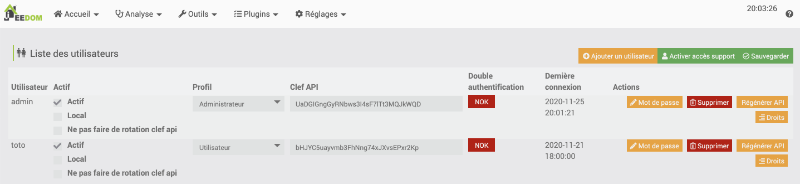

## 23.2 Accéder à Jeedom à distance gratuitement

Travailler avec Jeedom à partir d'un ordinateur situé sur le même réseau est très simple : il suffit d'entrer [apical\_lien\_interne][slug\_de\_la\_fiche,l'adresse IP du Raspberry Pi][/apical\_lien\_interne] dans un navigateur et le tour est joué!

Par contre, le système domotique prend toute sa puissance lorsque vous pouvez y accéder à distance, par exemple pour éteindre une lumière oubliée ou pour consulter une caméra pendant votre absence.

Attention : le fait de donner un accès à votre boîte domotique via Internet peut ouvrir un trou de sécurité.  
Assurez-vous d'utiliser des [apical\_lien\_interne][Gestion\_des\_mots\_de\_passe,mots de passe forts,motsdepassesecuritaires][/apical\_lien\_interne].

Plusieurs options s'offrent à vous pour configurer l'accès à distance :

* À l'aide de l'application mobile officielle que vous pouvez acheter directement sur Jeedom Market au coût de 4 € (environ 6 $ CA). Les instructions sont données ici : « [apical\_lien\_interne]application\_mobile\_officielle\_pour\_acceder\_a\_jeedom\_a\_distance[/apical\_lien\_interne] ».
* En effectuant vous-même les configurations nécessaires et ce, tout à fait gratuitement (sauf si vous devez acheter un nom de domaine).

Je vous explique ici comment effectuer les configurations afin que vous n'ayiez pas à débourser pour accéder à Jeedom à partir de n'importe où.

## Adresse IP publique

Vous aurez besoin de connaître l'adresse IP publique du Raspberry Pi.

Puisque le Pi et votre ordinateur sont présentement branchés sur le même réseau interne, les deux seront vus publiquement avec la même adresse IP.

Pour connaître l'adresse IP publique de votre ordinateur (et donc du Pi), rendez-vous sur un site qui vous donne cette information. Il en existe plusieurs, par exemple :

* [mon-ip.com](http://www.mon-ip.com/)
* [whatismyipaddress.com](https://whatismyipaddress.com/)
* [myip.com](https://www.myip.com/)

Votre adresse IP publique apparaîtra dans la page Web. Prenez-la en note pour plus tard.

## Configuration du sous-domaine

### Si vous avez une adresse IP dynamique

La plupart des fournisseurs Internet offrent des adresses IP dynamiques, c'est-à-dire qu'elles peuvent changer au fil du temps.

Si c'est votre cas, vous devez travailler avec des outils qui se chargeront de mettre à jour l'adresse IP lorsque votre fournisseur Internet la modifiera.

Pour y arriver :

* Créez-vous un compte gratuit chez un founisseur spécialisé dans la gestion des DNS dynamiques, par exemple :
  + Duck DNS : [https://www.duckdns.org](https://www.duckdns.org/)
  + No-IP : [https://www.noip.com](https://www.noip.com/)

  Je vais vous faire la démonstration avec Duck DNS.
* Dans l'interface du fournisseur, créez un sous-domaine, par exemple monsousdomaine.

  Ceci vous permettra d'accéder à Jeedom à l'aide d'une adresse du genre monsousdomaine.domainedufournisseur.org. Chez DuckDns, ce sera monsousdomaine.duckdns.org. Le fournisseur associera automatiquement le sous-domaine à votre adresse IP publique actuelle.

  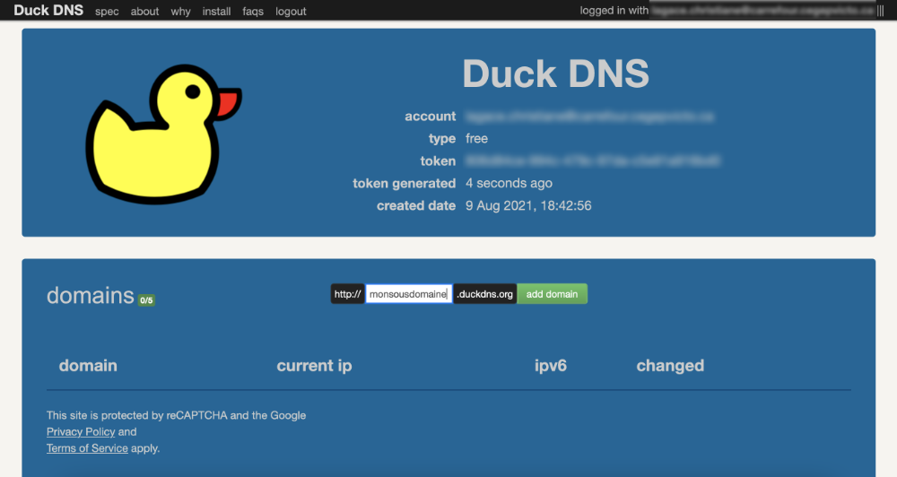
* Rendez-vous maintenant [apical\_lien\_interne][installation\_de\_jeedom\_et\_premier\_acces,dans l'interface d'administration de Jeedom,acceder][/apical\_lien\_interne].
* Cliquez sur le menu Plugins / Gestion des plugins.
* Cliquez sur Market.
* Recherchez Dyndns.
* Installez le plugin officiel Dyndns.

  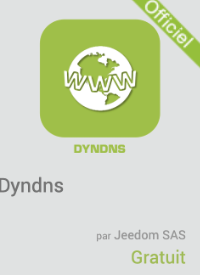
* Une fois l'installation complétée, acceptez de vous rendre sur la page de configuration du plugin. Vous pourrez retourner à la page de configuration plus tard à l'aide du menu Plugins / Gestion des plugins puis en cliquant sur l'icône Dyndns.
* Dans la zone État, cliquez sur Activer.
* Pour configurer votre DNS dynamique, rendez-vous dans le menu Plugins / Programmation / Dyndns puis cliquez sur Ajouter.
* Donnez le nom de votre choix à l'équipement, par exemple dyndns.
* Dans l'écran qui suit, sélectionnez le founisseur spécialisé dans la gestion des DNS dynamiques avec lequel vous avez travaillé.  

  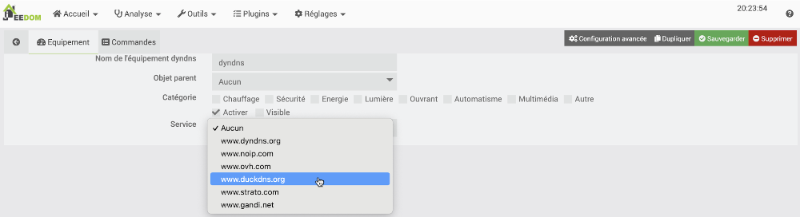
* Complétez les informations demandées avec les valeurs fournies par votre fournisseur puis sauvegardez vos configurations.  

  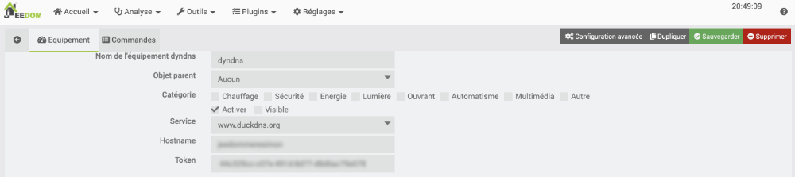

### Si vous avez une adresse IP fixe

La procédure présentée pour les adresses IP dynamiques fonctionne aussi pour les adresses IP fixes. Cependant, une adresse IP fixe vous permet d'accéder à Jeedom à partir de votre propre nom de domaine.

Si vous ne possédez pas de nom de domaine, vous devrez en réserver un et en assumer les frais. Les instructions sont données ici : « [apical\_lien\_interne]Choisir\_et\_reserver\_son\_nom\_de\_domaine[/apical\_lien\_interne] ».

Notez que vous n'avez pas besoin d'hébergement Web, seul le nom de domaine est nécessaire ici.

Les étapes qui suivent vous amèneront à créer un sous-domaine, qui sera utilisé pour accéder à Jeedom. Vous pourrez donc utiliser votre nom de domaine pour un site Web et, sans frais supplémentaires, un sous-domaine pour Jeedom.

Pour créer le sous-domaine et le faire pointer sur l'adresse IP publique, vous utiliserez une technique différente selon qu'elle doit être effectuée chez le registraire ou chez un hébergeur.

#### Chez le registraire

Si vous venez de réserver votre nom de domaine ou si vous l'aviez déjà en main et qu'il ne pointe pas chez un hébergeur externe, vous devrez effectuer les configurations directement chez le registraire du nom de domaine.

Je vous montre ici comment y parvenir chez GoDaddy.

* Une fois authentifié chez GoDaddy, cliquez sur votre nom dans le coin supérieur droit de l'écran puis choisissez My Products.
* Cliquez sur les points verticaux à droite du nom de domaine puis choisissez Manage DNS.

  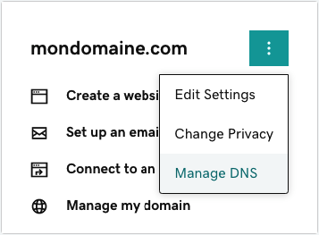
* Dans le bas de la zone Records, cliquez sur Add.
* Dans la zone Type, choisissez A.
* Dans la zone Host, entrez le sous-domaine qui sera utilisé. Par exemple, si vous désirez accéder à Jeedom à l'aide d'une adresse du genre jeedom.mondomaine.com, vous devez inscrire simplement jeedom
* Dans la zone Points to, entrez l'adresse IP publique trouvée plus tôt.
* Dans la zone TTL (Time To Live) vous pouvez conserver la valeur par défaut (1 Hour) ou encore entrer une durée plus courte.

  Cette valeur indique pendant combien de temps les configurations demeureront en mémoire cache.

  Plus la valeur est courte, plus le trafic DNS est élevé. Par contre, un TTL trop long vous empêchera d'accéder à Jeedom après un changement  et ce, tant que la durée du TTL n'est pas écoulée.
* Cliquez sur Save.

  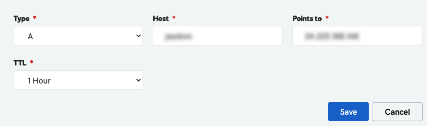


Si vous aviez déjà en main un nom de domaine et qu'il pointe chez un hébergeur externe, c'est chez cet hébergeur que vous devez effectuer les configurations.

Je vous explique ici comment configurer votre adresse IP avec une interface cPanel.

* Dans le cPanel, cliquez sur Zone Editor.

  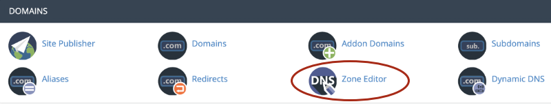
* Vis-à-vis le nom de domaine que vous désirez utiliser, cliquez sur le bouton + A Record.

  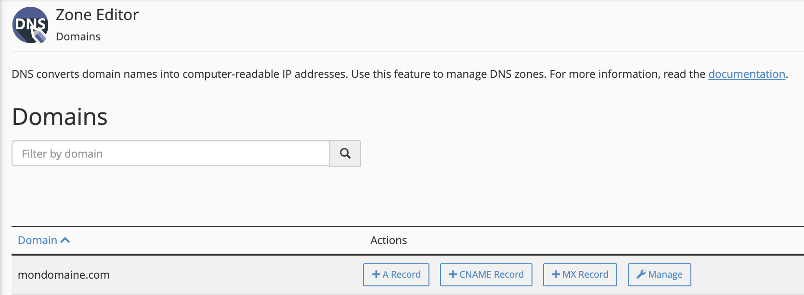
* Dans la zone Name, entrez le nom complet du sous-domaine, par exemple jeedom.mondomaine.com
* Dans la zone Address, entrez l'adresse IP publique de votre Raspberry Pi.
* Cliquez sur Add An A Record.

  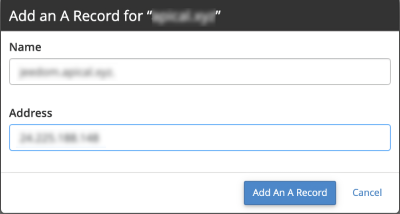

## Configurations sur le routeur

Lorsque vous tenterez d'accéder à Jeedom à partir de votre nouveau sous-domaine, la requête sera dirigée vers votre routeur.

Il vous faut le configurer pour qu'il transmette la demande au Raspberry Pi.

* Assurez-vous que le Raspberry Pi ait [apical\_lien\_interne][donner\_une\_adresse\_ip\_statique\_au\_raspberry\_pi,une adresse IP statique][/apical\_lien\_interne].
* Par mesure de sécurité, la plupart des routeurs ne permettent pas par défaut l'accès aux configurations via Wi-Fi. Si c'est le cas avec votre routeur, branchez l'ordinateur au routeur à l'aide d'un câble RJ45.
* Sur votre ordinateur, ouvrez la page Web à l'adresse IP locale du routeur. Il s'agit généralement de 192.168.0.1 ou 192.168.1.1. Sur certains systèmes, il faut plutôt accéder au 10.0.0.1. En cas de doute, rendez-vous sur ce site : <http://whatsmyrouterip.com/>.
* Dans les menus de votre routeur, recherchez une option du genre Transfert de port ou Port Forwarding. Le chemin pour atteindre l'écran peut être plus complexe, par exemple Mode Expert / Configuration / NAT / Transfert de port ou encore Sécurité / Applications et jeux / Transfert de connexion unique ou Routage de port unique.
* Sur certains systèmes, vous serez redirigé vers un site Web pour effectuer les configurations. Recherchez alors sur ce site une option du genre Voir réseau / Paramètres avancés / Redirection de port.
* Vous devez spécifier que pour les protocoles TCP et UDP, avec le port 80, la redirection ira vers le port 80 et l'adresse IP locale du Raspberry Pi.  

  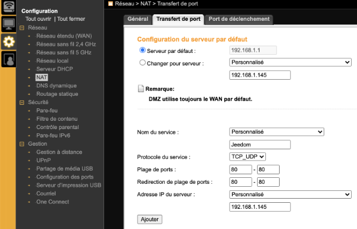

  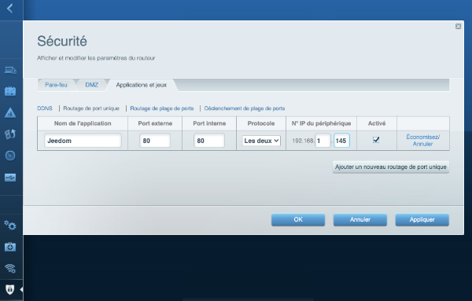

  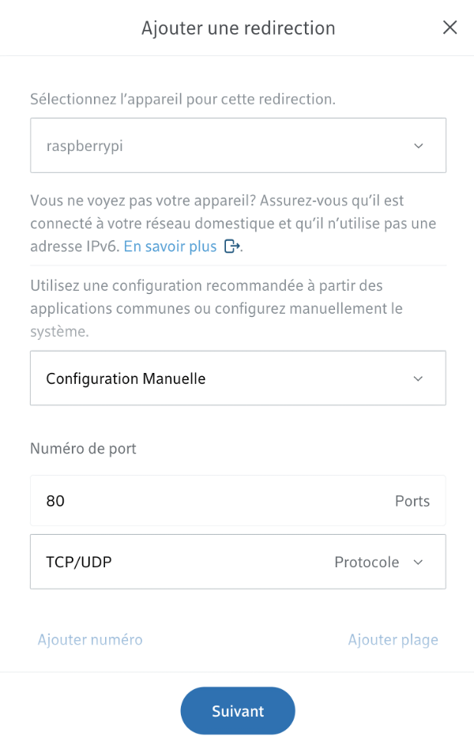
* Faites de même avec le port 443 puisque vous configurerez sous peu l'accès sécurisé avec https.

## Tester les configurations

Pour tester vos configurations, ouvrez un appareil mobile et entrez votre sous-domaine dans un navigateur.

Puisque vous vous trouvez au même endroit que le Raspberry Pi, assurez-vous que le Wi-Fi soit désactivé sur l'appareil mobile afin d'utiliser le réseau cellulaire.

En effet, si vous tentez d'utiliser le sous-domaine à partir du même réseau que le Raspberry Pi, vous obtiendrez le message « Rejected request from RFC1918 IP to public server address ».

Lorsque vous referez cette procédure alors que vous n'êtes pas sur le même réseau que le Pi, vous pourrez utiliser le réseau Wi-Fi sans problème sur un appareil mobile ou sur un ordinateur.

## Certificat SSL avec Let’s Encrypt

Afin d'augmenter la sécurité de votre système, je vous conseille fortement d'installer un certificat SSL sur votre Raspberry Pi.

Ceci peut être réalisé sans frais.

La technique que je vous propose installera [certbot](https://snapcraft.io/certbot), une application qui automatise la configuration de certificats SSL avec Let's Encrypt.

Accédez au Raspberry Pi [apical\_lien\_interne][se\_brancher\_au\_raspberry\_pi\_via\_ssh,via SSH][/apical\_lien\_interne] ou en y branchant un clavier et un écran puis suivez ces étapes :

* Comme toujours, avant d'installer quoi que ce soit sur un système Linux, il faut s'assurer qu'il est à jour.

  Terminal

  sudo apt-get update

   

  sudo apt-get upgrade
* Il existe plusieurs techniques pour installer certbot. Ici, j'utilise [snapd](https://snapcraft.io/install/certbot/raspbian), un utilitaire qui donne accès à des applications et à leurs dépendances, prêtes à l'emploi pour les versions populaires de Linux.

  Pour installer snapd :

  Terminal

  sudo apt install snapd
* Redémarrez le Raspberry Pi :

  Terminal

  sudo reboot
* Une installation supplémentaire est nécessaire :

  Terminal

  sudo snap install core; sudo snap refresh core
* Vous pouvez maintenant installer certbot à l'aide de cette commande :

  Terminal

  sudo snap install certbot --classic
* Pour rendre la commande certbot disponible, ajoutez un lien :

  Terminal

  sudo ln -s /snap/bin/certbot /usr/bin/certbot
* Maintenant, entrez cette commande pour configurer cerbot. Vous serez invité à entrer le sous-domaine que vous désirez utiliser pour Jeedom.

  Terminal

  sudo certbot --apache
* Une fois les configurations de cerbot complétées, vous voyez la confirmation que le certificat est bien installé.

  Résultat à l'écran

  Congratulations! You have successfully enabled HTTPS on https://monsousdomaine.duckdns.org
* Vous pouvez désormais accéder à Jeedom avec la même technique qu'avant mais cette fois, vous êtes en https, identifié par un cadenas fermé.

  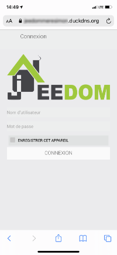

## Pour plus d'information

« Quick and Dirty Dynamic DNS Using GoDaddy ». Instructables Circuits. <https://www.instructables.com/Quick-and-Dirty-Dynamic-DNS-Using-GoDaddy/>



L'application mobile Jeedom vous permet d'accéder à votre boîte domotique à partir de n'importe quel endroit où un accès Internet est disponible.

Vous devez savoir que cette application n'est pas gratuite. Si vous préférez ne rien débourser, je vous propose une autre technique sur cette fiche : « [apical\_lien\_interne]acceder\_a\_jeedom\_a\_distance\_gratuitement[/apical\_lien\_interne] ».

Si vous souhaitez installer l'application Jeedom, dont la configuration est beaucoup plus simple, suivez ces étapes :

* Rendez-vous [apical\_lien\_interne][installation\_de\_jeedom\_et\_premier\_acces,dans l'interface d'administration de Jeedom,acceder][/apical\_lien\_interne].
* Cliquez sur le menu Plugins / Gestion des plugins.
* Cliquez sur Market.
* Recherchez mobile.
* Cliquez sur l'icône de l'application mobile officielle. Ceci vous permet de l'acheter au coût de 4 € soit environ 6 $ CA.

  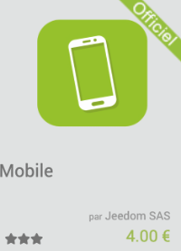
* Le Market vous redirigera vers un mode de paiement.
* Lorsque le paiement sera effectué, le bouton Acheter se transformera en bouton Installer stable. Cliquez sur ce bouton.
* Une fois l'installation complétée, acceptez de vous rendre sur la page de configuration du plugin. Vous pourrez retourner à la page de configuration plus tard à l'aide du menu Plugins / Gestion des plugins puis en cliquant sur l'icône App Mobile.
* Dans la zone État, cliquez sur Activer.
* Rendez-vous ensuite dans le menu Plugins / Communication / App Mobile.
* Cliquez sur Ajouter.
* Donnez un nom à l'équipement, par exemple App Mobile.
* Dans l'écran qui suit, cochez Activer.
* Sélectionnez le type d'appareil mobile qui sera utilisé.
* Sélectionnez les utilisateurs de Jeedom qui pourront utiliser l'application mobile.  

  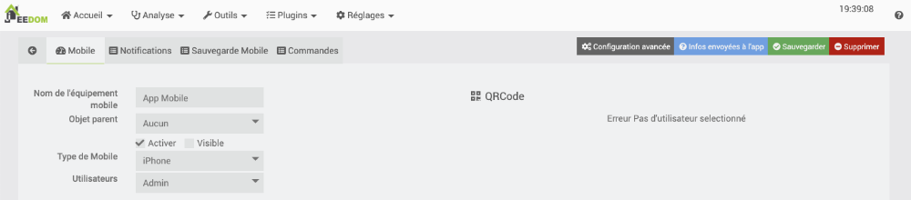
* Cliquez sur Sauvegarder. Un code QR apparaît à droite de l'écran.

  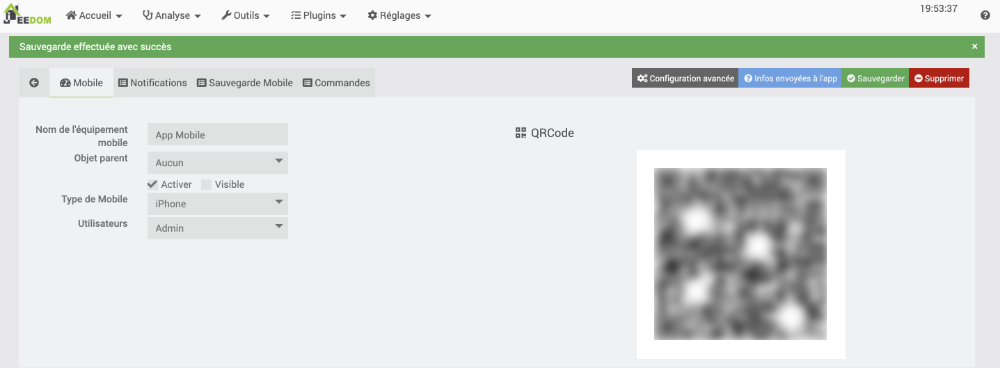
* Sur votre appareil mobile, installez l'application officielle de Jeedom.

  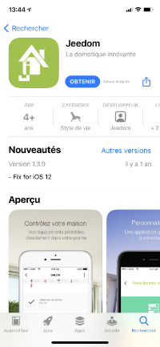
* Ouvrez l'application mobile puis suivez les étapes à l'écran. Pendant le processus, vous serez invité à scanner le code QR affiché dans l'écran de configuration. Ceci permet d'entrer certaines configurations de façon automatique.

## 23.4 Arrêter le clignotement des DEL sur la clé USB Z-Wave

Lorsque vous branchez une clé USB Z-Wave Aeotec sur votre boîte domotique, elle commence immédiatement à clignoter.

Il n'y a pas vraiment d'utilité à ce clignotement et à la longue, cela peut devenir dérangeant.

Je vous propose donc d'arrêter le clignotement à l'aide de cette technique que j'ai trouvée sur ce site : <https://forum.jeedom.com/viewtopic.php?t=22124>. Ceci ne modifie en rien les fonctionnalités de la clé. Seules les DEL sont affectées.

Cette technique fonctionne autant sur un système domotique qui tourne sur Raspberry Pi OS, par exemple Jeedom, que sur un système Home Assistant qui tourne sur HassOS.

* Accédez au Raspberry Pi [apical\_lien\_interne][se\_brancher\_au\_raspberry\_pi\_via\_ssh,via SSH][/apical\_lien\_interne] ou en y branchant un clavier et un écran (sous Home Assistant, l'accès SSH [apical\_lien\_interne][se\_brancher\_a\_home\_assistant\_via\_ssh,est détaillé ici][/apical\_lien\_interne]).
* Afin de connaître le port tty de la clé, lancez cette commande. (sous Home Assistant, vous trrouverez le port dans le menu Paramètres / Appareils et services / onglet Intégrations / tuile Z-Wave.

  Terminal

  dmesg | grep tty

  Dans la sortie à l'écran, repérez les lignes qui parlent d'un dispositif USB, à la toute fin des informations affichées. La mention tty identifie le port utilisé par la clé Z-Wave.

  Résultat à l'écran

  [ 6.031407] cdc\_acm 1-1.3.3:1.0: ttyACM0: USB ACM device
* Pour arrêter le clignotement, lancez cette commande en prenant le soin de changer ttyACM0 pour le port utilisé sur votre système.  

  Terminal

  echo -ne "\x01\x08\x00\xF2\x51\x01\x00\x05\x01\x51" > /dev/ttyACM0
* Et pour relancer le clignotement :  

  Terminal

  echo -ne "\x01\x08\x00\xF2\x51\x01\x01\x05\x01\x50" > /dev/ttyACM0

## Pour plus d'information

« Configurer les leds du Aeotec Z-Stick Gen5 sous Linux ». Jeedom. <https://forum.jeedom.com/viewtopic.php?t=22124>

« How to disable LED on Z-Stick Gen5 ». Aeotec. <https://aeotec.freshdesk.com/support/solutions/articles/6000171881-how-to-disable-led-on-z-stick-gen5->



Vous désirez [apical\_lien\_interne][acceder\_a\_jeedom\_a\_distance\_gratuitement,accéder à Jeedom à distance gratuitement][/apical\_lien\_interne] mais le port 80 est déjà utilisé pour accéder à un autre périphérique dans votre maison? Pas de problème, je vous montre ici comment modifier le port qui sera utilisé par Jeedom.

Les modifications doivent être réalisées dans les fichiers de configuration d'Apache sur le Raspberry Pi.

Accédez au Raspberry Pi [apical\_lien\_interne][se\_brancher\_au\_raspberry\_pi\_via\_ssh,via SSH][/apical\_lien\_interne] ou en y branchant un clavier et un écran puis suivez ces étapes :

* Éditez le fichier ports.conf d'Apache.

  Terminal

  sudo nano /etc/apache2/ports.conf
* Ajoutez un # devant la ligne Listen 80 afin qu'elle ne soit plus active.

  Ajoutez une nouvelle ligne Listen avec le numéro du port que vous souhaitez utiliser, par exemple Listen 8088.

  x

  # If you just change the port or add more ports here, you will likely also  
  # have to change the VirtualHost statement in  
  # /etc/apache2/sites-enabled/000-default.conf

   

  #Listen 80  
  Listen 8088

   

  <IfModule ssl\_module>  
   Listen 443  
  </IfModule>

   

  <IfModule mod\_gnutls.c>  
   Listen 443  
  </IfModule>

   

  # vim: syntax=apache ts=4 sw=4 sts=4 sr noet
* Redémarrez le Raspberry Pi.

  Terminal

  sudo reboot
* Modifiez les [apical\_lien\_interne][acceder\_a\_jeedom\_a\_distance\_gratuitement,configurations du routeur,routeur][/apical\_lien\_interne] afin que le port externe soit celui entré plus haut (ex : 8088). Le port interne peut demeurer le 80.
* Désormais, pour accéder à Jeedom, vous devrez terminer son IP ou son sous-domaine par deux points suivis du numéro de port, par exemple 192.168.1.145:8088 à l'interne ou monsousdomaine.domainedufournisseur.org:8088 à l'externe.

## 23.6 Retrouver l'adresse IP du Pi à l'aide de Jeedom

Le [apical\_lien\_interne][lancer\_un\_script\_python\_avec\_le\_plugin\_script,plugin Script,installation][/apical\_lien\_interne] permet d'effectuer différentes opérations dans Jeedom et de récupérer des valeurs qui pourront être utilisées dans les scénarios.

Ici, je vous montre les configurations à réaliser pour retrouver l'adresse IP du Raspberry Pi sur lequel Jeedom est installé.

J'ai combiné les deux dans un équipement Script nommé IP est dont l'objet parent est Partout.

## Adresse IP privée

L'adresse IP privée est la plus utile puisque c'est elle qui vous permet d'accéder à Jeedom à partir de votre ordinateur quand vous êtes branchés sur le même réseau que le Raspberry Pi.

Pour l'obtenir, ajoutez une commande script avec ces informations :

* Nom : IpPrivee
* Type script : Script
* Type : Info puis Autre
* Requête : hostname -I

## Adresse IP publique

Si vous avez besoin de connaître l'adresse publique, ajoutez une commande script avec ces informations :

* Nom : IpPublique
* Type script : HTTP
* Type : Info puis Autre
* Requête : echo $(wget -qO - https://api.ipify.org)


Voici un petit scénario plutôt pratique!

Vous devez d'abord avoir [apical\_lien\_interne][envoyer\_un\_courriel\_avec\_jeedom,configuré Jeedom pour envoyer du courriel][/apical\_lien\_interne].

* Mode du scénario : Provoqué
* Événement : #start#
* Action : #[Partout][Courriel administrateur][Annie Gagnon]#
* Titre : Jeedom vient de démarrer
* Message : Adresse IP privée : #[Partout][IP][IpPrivee]#

<!-- --- split --- -->




1. [apical\_lien\_interne][donner\_une\_adresse\_ip\_statique\_au\_raspberry\_pi,Donnez une adresse IP statique à votre Raspberry Pi,terminal][/apical\_lien\_interne] pour le réseau câblé seulement. Votre prof vous fournira l'adresse IP statique à utiliser.
2. Une fois le Raspberry Pi démarré, [apical\_lien\_interne][trouver\_l\_adresse\_ip\_du\_raspberry\_pi,assurez-vous que son adresse IP][/apical\_lien\_interne] correspond à celle fournie par votre prof.
3. OPTIONNEL : [apical\_lien\_interne][configurer\_le\_reseau\_wi-fi\_sur\_le\_raspberry\_pi,Ajoutez une configuration réseau pour le Wi-Fi à votre maison,networkmanager][/apical\_lien\_interne]. Vous pouvez, à votre choix, utiliser une adresse IP statique ou non à la maison.
4. Ajustez votre boîte Jeedom afin qu'elle utilise le bon fuseau horaire (à vous de trouver comment). Si jamais, une fois le fuseau horaire configuré et Jeedom redémarré, la date et l'heure qui apparaissent dans le coin supérieur droit de l'écran ne sont pas corrects, [apical\_lien\_interne][Ajuster\_la\_date\_et\_l\_heure\_sous\_Linux\_Ubuntu,ajustez-les manuellement sur le Raspberry Pi][/apical\_lien\_interne].
5. Dans Jeedom, trouvez l'option de menu qui permet d'entrer  les coordonnées de l'endroit où se trouve votre système domotique (ex : votre domicile ou le cégep). Remplissez la latitude, la longitude ainsi que la section Adresse. Notez que vous n'aurez pas à modifier ces informations lorsque vous déplacerez votre Pi entre votre domicile et le Cégep.
6. Donnez votre nom à votre boîte Jeedom. Ce nom apparaîtra dans le coin supérieur droit de l'écran lors du prochain redémarrage de Jeedom. Cette configuration est essentielle pour faciliter le travail de votre prof lors de la correction des épreuve sommatives.
7. [apical\_lien\_interne][objets\_pour\_representer\_la\_maison,Ajoutez des objets pour représenter la maison et ses pièces][/apical\_lien\_interne]. En devoir, vous devez prendre des photos réelles de votre maison, de votre appartement *ou de tout autre endroit de votre choix* afin de les utiliser pour illustrer les objets.
8. [apical\_lien\_interne][configurer\_la\_cle\_usb\_z-wave\_sur\_jeedom,Configurez votre clé Z-Wave][/apical\_lien\_interne].
9. OPTIONNEL : Si vous utilisez une clé USB Z-Wave qui comporte un cercle lumineux, [apical\_lien\_interne][arreter\_le\_clignotement\_des\_del\_sur\_la\_cle\_usb\_z-wave,amusez-vous à arrêter et à redémarrer le clignotement de la clé][/apical\_lien\_interne].
10. Effectuez une [apical\_lien\_interne][copie\_de\_securite\_de\_jeedom,sauvegarde manuelle de Jeedom][/apical\_lien\_interne] et téléchargez-la sur votre poste de travail.
11. Sur votre seconde carte micro SD, [apical\_lien\_interne][copie\_de\_securite\_de\_jeedom,restaurez le système à partir de la sauvegarde que vous venez de réaliser,restaurer][/apical\_lien\_interne].

<!-- --- split --- -->

# 25. Pour le prochain cours


Vous disposez d'un cours pour acquérir les connaissances théoriques et finaliser cet exercice.

Une fois cet exercice complété, vous devez effectuer vos lectures pour l'exercice suivant.

<!-- --- split --- -->


<!-- --- split --- -->


## 26.1 En résumé...

Voici un résumé des informations essentielles du ou des prochains chapitres.

Notez que certaines fiches, qui font partie intégrante du cours, pourraient ne pas figurer dans ce résumé.

Je vous recommande d'effectuer une lecture de l'ensemble des fiches de ces chapitres afin de bien saisir les enjeux.

## [apical\_lien\_interne]le\_dashboard\_jeedom[/apical\_lien\_interne]

Le dashboard permet de voir en un seul endroit l'état de nos objets connectés et la possibilité de leur envoyer un ordre.

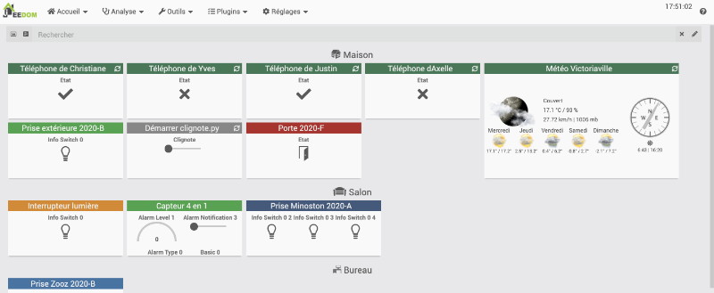

## [apical\_lien\_interne]ajouter\_un\_appareil\_connecte\_z-wave\_a\_jeedom[/apical\_lien\_interne]

Bien suivre ces étapes!

## [apical\_lien\_interne]configurer\_une\_tuile[/apical\_lien\_interne]

Vous aurez une petite correction à apporter au code de Jeedom. Voir la fiche « [apical\_lien\_interne]le\_noeud\_n\_a\_pas\_encore\_de\_commande[/apical\_lien\_interne] ».

Vous pouvez, pour chaque tuile, déterminer ce qui doit être affiché et comment l'information doit être affichée.

N'hésitez pas à explorer!


Bien suivre ces étapes!

## 26.2 Le dashboard Jeedom

Le dashboard, ou tableau de bord en français, est l'endroit où vous pouvez voir tous vos objets connectés en un coup d'oeil.

Pour y accéder : Accueil / Dashboard.


La couleur des tuiles indique la catégorie d'équipement que vous avez cochée dans la fenêtre de configuration de l'équipement.

Vert foncé : aucune catégorie ou Autre

Bleu clair : Chauffage

Rouge : Sécurité

Vert clair : Énergie

Orange : Lumière

Gris : Automatisme

Bleu foncé : Multimédia

## Déplacer et redimensionner les tuiles

Il est possible de déplacer et de redimensionner les tuiles du Dashboard en cliquant sur l'icône de crayon dans le coin supérieur droit de la fenêtre. Une fois l'opération terminée, appuyez de nouveau sur le crayon pour sauvegarder.

Remarquez que vous ne pouvez pas déplacer les tuiles entre les objets de cette façon, par exemple déplacer une tuile de la cuisine vers le salon.

## Déterminer ce qui est visible sur le Dashboard

Chaque équipement peut être affiché ou non sur le Dashboard grâce à la case à cocher Visible sur sa page de configuration.

Le fonctionnement est légèrement différent pour les objets qui représentent les pièces de la maison. La case Visible permet de les afficher un peu partout, notamment dans la liste des objets. Il est possible de les masquer seulement sur le Dashboard en cochant la case Masquer sur le Dashboard.

## Pour plus d'information

« Dashboard ». Jeedom. <https://doc.jeedom.com/fr_FR/core/4.0/dashboard>


Une fois que vous avez [apical\_lien\_interne][configurer\_la\_cle\_usb\_z-wave\_sur\_jeedom,ajouté votre clé USB Z-Wave dans Jeedom][/apical\_lien\_interne], vous pouvez y ajouter des appareils connectés.

L'ajout d'un objet connecté se fait à l'aide du mode Inclusion. Une fois l'objet connecté correctement intégré au système, vous n'aurez plus besoin du mode inclusion.

Dans cet exemple, je vais vous expliquer comment ajouter une prise de courant intelligente Z-Wave (smart plug). Les étapes sont sensiblement les mêmes pour tout type d'objet connecté Z-Wave.

* Accédez à l'[apical\_lien\_interne][installation\_de\_jeedom\_et\_premier\_acces,interface d'administration de Jeedom,acceder][/apical\_lien\_interne].
* Rendez-vous dans le menu Plugins / Protocole domotique / Z-Wave JS.

  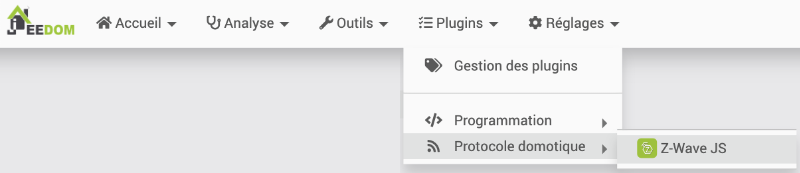
* Pendant le pairage, assurez-vous de brancher la prise assez près de la boîte domotique. Vous pourrez au besoin la déplacer par la suite.
* Si la prise a déjà été pairée à un autre système (ce sera le cas avec le matériel prêté par l'école), vous devez d'abord la réinitialiser (factory reset). Vérifiez le manuel de l'utilisateur pour connaître les opérations à réaliser pour y parvenir. Dans le cas de la prise intelligente Zooz utilisée dans cet exemple, il faut appuyer sur le bouton pendant 20 secondes.

  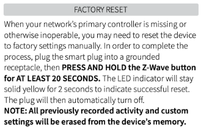

  (source : <https://www.getzooz.com/downloads/zooz-z-wave-plus-smart-plug-zen06-ver2-manual.pdf>)
* Une fois la prise réinitialisée, cliquez sur Inclusions dans Jeedom. Important : ne cliquez pas sur Synchroniser. Ceci ajouterait à votre boîte domotique tous les équipements qui avaient été pairés à votre clé Z-Wave l'an passé :-(
* Choisissez le mode Inclusion par défaut puis cliquez sur Démarrer.

  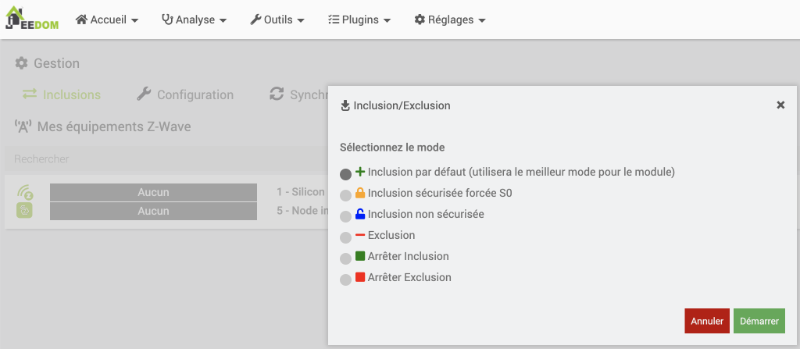

  Note : avec le mode Inclusion par défaut, Jeedom fait une inclusions sécurisée s'il en est capable. Sinon, il faut une inclusions non sécurisée.

  Le mode sécurisé assure que les paquets d'informations seront transmis de façon cryptée et ne seront décryptées qu'à leur arrivée.

  Certains équipements ne fonctionnent qu'en mode sécurisé alors que d'autres ne supportent pas cette fonctionnalité.

  Jeedom vous informera que le mode inclusion est activé.

  Note  : si vous obtenez à ce stade un message « Échec de la requête HTTP », « Connection refused » ou « Impossible de contacter le serveur Z-wave », c'est peut-être parce que le système n'a pas terminé l'inclusion de la clé USB Z-Wave ou encore parce que Jeedom a besoin d'être redémarré. Réessayez dans quelques minutes et au besoin, redémarrez le système.
* Une fois que vous voyez le message indiquant le mode inclusion, vous devez effectuer une opération sur l'objet connecté pour le mettre en mode pairage.

  L'action à réaliser est propre à chaque appareil.

  Pour certains, vous devez appuyer sur un bouton un nombre spécifique de fois ou pendant une durée précise.

  Pour d'autres, il faut entrer un bout de trombone dans un trou.  
    
  Pour d'autres encore, qui sont munis d'un système d'auto-inclusion, il faut simplement brancher l'appareil pendant que la boîte domotique est en mode inclusion.

  Parfois, il faut retirer un capot pour accéder au bouton de pairage.

  Vérifiez le manuel de l'utilisateur pour connaître l'opération à réaliser sur votre appareil. Dans le cas de la prise intelligente Zooz utilisée dans cet exemple, il faut appuyer sur le bouton de pairage pendant 3 secondes pour effectuer un pairage sécurisé.

  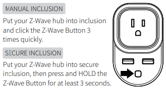

  (source : <https://www.getzooz.com/downloads/zooz-z-wave-plus-smart-plug-zen06-ver2-manual.pdf>)

  Remarquez qu'un appareil ne peut être pairé qu'avec une seule boîte domotique à la fois. Si l'appareil a déjà été pairé à une autre boîte, vous devrez d'abord défaire le pairage ou, si c'est impossible, effectuer une réinitialisation de l'appareil (factory reset). Consultez le manuel de l'appareil pour connaître la procédure.
* Si Jeedom vous demande des classes de sécurité ou des clés de sécurité, vous pouvez simplement cliquer sur Continuer. Ceci fera en sorte que l'inclusion sera non sécurisée.
* Jeedom affichera ensuite l'écran de configuration de l'équipement.

  Remplissez les informations demandées :

  + Nom de l'équipement
  + [apical\_lien\_interne][objets\_pour\_representer\_la\_maison,Objet parent][/apical\_lien\_interne]
  + Si désiré : Catégorie

  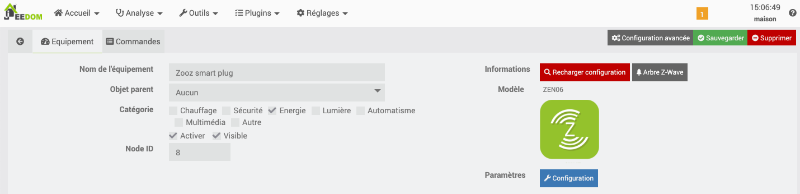

Avant de vous lancer dans des manipulations plus évoluées, assurez-vous que Jeedom communique adéquatement avec l'appareil connecté.

Pour ce faire, rendez-vous dans le menu Plugins / Protocole domotique / Z-Wave JS puis cliquez sur votre appareil connecté.

Cliquez sur le bouton Valeurs. Jeedom affichera les informations reçues du capteur.

Essayez de modifier une de ces valeurs pour voir si Jeedom en tient compte.

Par exemple, pour une prise intelligente, appuyez sur le bouton physique de la prise pour l'allumer ou pour l'éteindre. Jeedom devrait afficher ON ou OFF pour indiquer que la prise est allumée ou éteinte.

Remarquez qu'il peut y avoir un délai plus ou moins long avant que la modification d'une valeur apparaisse sur Jeedom.

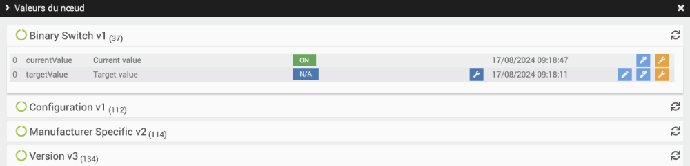

Dans le cas d'un capteur, par exemple un capteur de mouvement, ouvrez le boîtier du capteur afin de déclencher le détecteur de sabotage (tamper detection). Ici encore, le but est de s'assurer que Jeedom montre le changement de valeur.

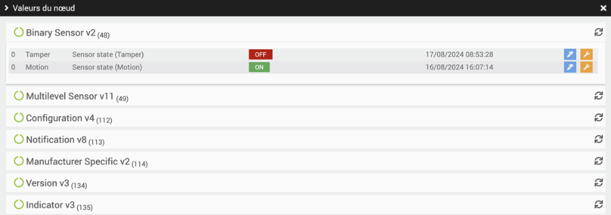

## 26.4 Le noeud n'a pas encore de commande

Dans Jeedom, une commande correspond à une information qui doit être recueillie d'un appareil connecté.

En temps normal, Jeedom ajoute lui-même les commandes requises. Mais parfois, on obtient plutôt le message « Le nœud n'a pas encore de commande.  » lorsqu'on va dans le menu Plugins / Protocole domotique / Z-Wave JS et qu'on clique sur un équipement.

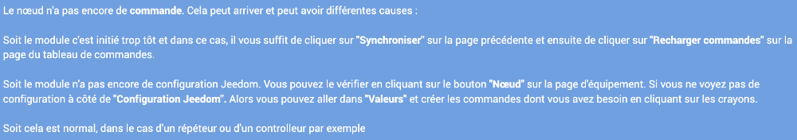

## Corriger des erreurs de programmation

Certaines versions de Z-Wave JS comportent des erreurs de programmation ou plutôt elles n'ont pas été mises à jour pour la dernière version du système d'exploitation.

Pour régler ce problème :

* Dans la fenêtre Terminal du Raspberry Pi, prenez une copie de sécurité du fichier qui contient des erreurs de programmation.

  Terminal du Raspberry Pi

  sudo cp /var/www/html/plugins/zwavejs/core/class/zwavejs.class.php /var/www/html/plugins/zwavejs/core/class/zwavejs.class-original.php
* Éditez maintenant le fichier /var/www/html/plugins/zwavejs/core/class/zwavejs.class.php.

  Terminal du Raspberry Pi

  sudo nano /var/www/html/plugins/zwavejs/core/class/zwavejs.class.php
* Rendez-vous à la ligne 1595 en appuyant sur les touches Ctrl + \_.
* Modifiez la ligne log::add(\_\_CLASS\_\_, 'debug', '[' . \_\_FUNCTION\_\_ . ']' . \_("Création d'une commande info", \_\_FILE\_\_) . ' ' . $\_path); pour

  Fichier zwavejs.class.php

  log::add(\_\_CLASS\_\_, 'debug', '[' . \_\_FUNCTION\_\_ . ']' . \_("Création d'une commande info") . ' ' . $\_path);
* Appuyez sur Ctrl + W pour rechercher d'autres lignes avec log::add.
* Si la même erreur est présente, enlevez le paramètre \_\_FILE\_\_ dans la fonction \_() (il ne doit y avoir qu'un \_ dans le nom de la fonction).
* Pour enregistrer le fichier, appuyez sur Ctrl + X puis O (ou Y si votre OS est en anglais).


Il est possible d'ajouter des commandes manuellement afin d'obtenir les informations désirées sur un objet connecté. Les commandes peuvent aussi se traduire en boutons pour envoyer des ordres à l'objet connecté (ex : Allume-toi!).

Suivez les étapes données sur la fiche « [apical\_lien\_interne]configurer\_une\_tuile[/apical\_lien\_interne] ».

## 26.5 Configurer une tuile

Parfois, le Dashboard de Jeedom offre une présentation intéressante des informations de chaque objet connecté. D'autres fois, il faut effectuer un travail manuel pour que les informations désirées soient affichées.

Pour ajouter une information sur une tuile du Dashboard :

* Dans l'interface graphique de Jeedom, rendez-vous dans Plugins / Protocole domotique / Z-Wave JS puis cliquez sur l'équipement pour lequel vous désirez ajouter des informations.
* Cliquez sur Valeurs.
* Les valeurs sont présentées dans différentes sections, par exemple Binary Switch, Notification, etc. Certaines commandes sont de type Info, c'est-à-dire qu'elles permettent d'afficher un état. D'autres sont de type Action, c'est-à-dire qu'elles permettent d'envoyer un ordre à l'équipement, par exemple Allume-toi.

  Selon votre besoin, cliquez sur l'icône « Créer la commande Action » ou « Créer la commande Info ».

  Un même appareil comprend généralement plusieurs commandes. À vous d'explorer celles qui sont intéressantes.

  Voici un exemple avec une prise intelligente.

  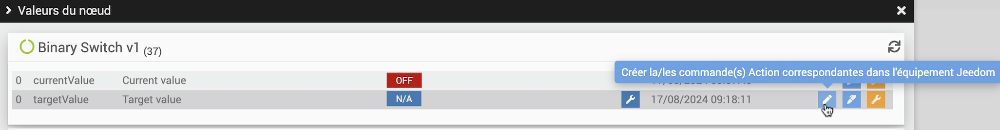

  Note : si vous avez en main une prise intelligente à intensité réglable (multilevel switch ou dimmable switch), la commande qui permet de modifier l'intensité pourrait s'appeler targetValue plutôt que On et Off.

  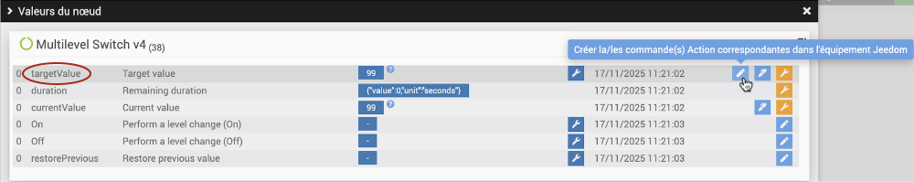

  Important : si vous voyez un carré rouge sans texte qui apparaît au bas de l'écran, c'est que vous n'avez pas [apical\_lien\_interne][le\_noeud\_n\_a\_pas\_encore\_de\_commande,corrigé les erreurs de programmation][/apical\_lien\_interne] dans le fichier /var/www/html/plugins/zwavejs/core/class/zwavejs.class.php.
* Une fois la commande ajoutée, refermez cette fenêtre puis cliquez sur l'onglet Commandes.
* Vous verrez au moins une nouvelle commande pour chaque ajout que vous avez réalisé. Dans cet exemple, une commande de type Info permet de savoir si la prise est allumée ou éteinte. Deux commandes de type Action ont été ajoutées, la première pour éteindre la prise, la seconde pour l'allumer.

  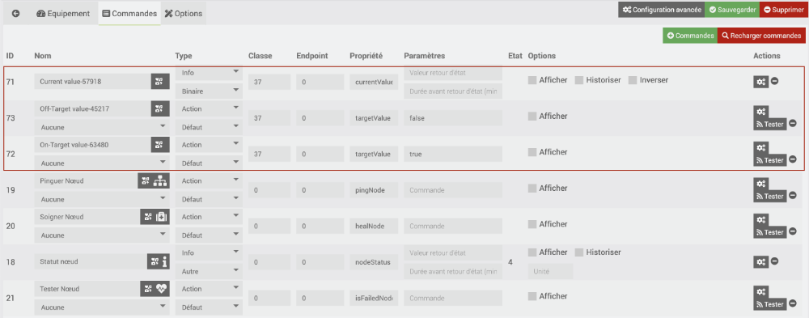

  Note : si vous avez en main une prise intelligente à intensité réglable, la commande targetValue pourrait être associée par défaut à un gradateur dans le Dashboard (mention #slider#).

  Vous pouvez au besoin ajouter des commandes (Bouton +Commandes) pour mettre carrément la prise en état Allumée (targetValue = 99) ou Éteinte (targetValue = 0).

  La classe 38 correspond à un récepteur à intensité variable pour Jeedom.

  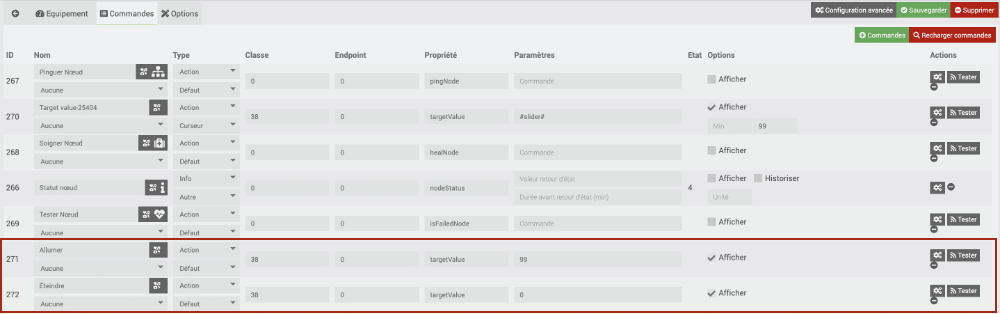
* Testez vos nouvelles commandes. Un clic sur le bouton Tester d'une commande de type Action effectuera cette action sur l'appareil connecté. La valeur d'une commande de type Info est affichée directement dans le tableau dans la colonne État.
* Pour chaque commande, donnez-lui un nom significatif dans la colonne Nom puis cochez les cases Afficher et, pour les commandes de type Info, Historiser.

  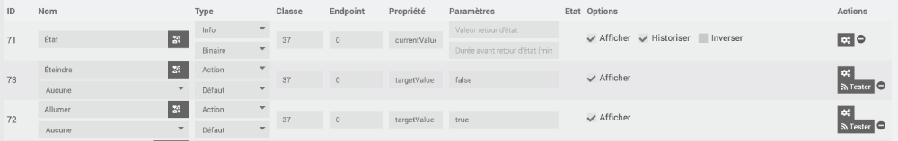
* Dans le cas d'un capteur d'ouverture de porte, il arrive que la valeur retournée soit 22 lorsque la porte est ouverte (aimants éloignés) ou 23 lorsque la porte est fermée (aimants collés).

  Pour avoir un affichage plus intéressant, cliquez sur la roue crantée à droite de la commande. Dans l'onglet Configuration, entrez la formule de calcul #value#-22

  Ceci fera en sorte que lorsque la porte est ouverte, on aura la valeur 0 et lorsqu'elle est fermée, on aura la valeur 1.

  La valeur sera correctement calculée lors du prochain changement d'état.

  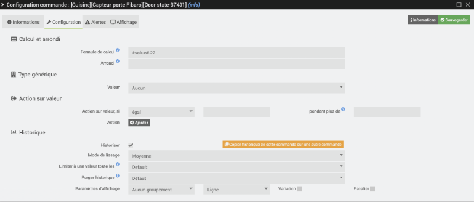
* De retour à l'onglet Commandes, vous pouvez modifier le type d'une commande. S'il est numérique, la valeur apparaîtra dans le tableau de bord sous forme de nombre. S'il est binaire, on verra plutôt un X (valeur 0) ou un crochet (toute autre valeur).
* Autre configuration intéressante : cliquez sur le bouton Configuration avancée. Pour chacune des commandes affichées sur le Dashboard, cliquez sur l'icône de roue crantée puis, dans l'onglet Affichage, cochez Retour à la ligne forcé avant le widget et Retour à la ligne forcé après le widget. Les tuiles présenteront donc les information l'une sous l'autre.
* Rendez-vous maintenant dans le menu Accueil / Dashboard. Vous avez maintenant accès aux commandes dans une interface plus intuitive.

## Pour plus d'information

« Capteur d’ouverture Z-Wave Gen7 d’Aeotec avec Jeedom ». /jeedomiser.fr. <https://jeedomiser.fr/article/capteur-ouverture-z-wave-gen7-aeotec-avec-jeedom/>

Jeedom-CommandeTargetValueMultilevelSwitch.


La page de synthèse n'affiche pas autant d'informations que le Dashboard mais elle offre une vue synthétisée et un visuel plus attrayant.

Elle affiche par défaut une tuile pour chaque objet (ex : maison, cuisine, salon) avec, comme image de fond, l'image que vous avez associée à cet objet.

Pour chaque objet, il est possible de déterminer ce qui doit y être affiché en configurant des résumés.

* Rendez-vous dans le menu Outils / Objets et cliquez sur l'objet que vous désirez configurer dans la synthèse.
* Cliquez sur l'onglet Résumé par équipements.
* Ciquez sur le nom d'un équipement pour afficher ses commandes.
* Cliquez sur le bouton Résumé(s) et cochez le type de résumé que vous désirez voir apparaître dans la synthèse.

  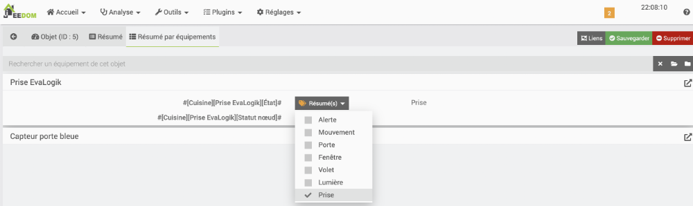

Lorsque la commande est binaire, un icône apparaîtra dans la synthèse, sur la tuile de l'objet, quand la commande sera activée (ex : prise allumée) et il disparaîtra quand la commande sera désactivée (ex : prise éteinte).

Dans le cas d'une commande numérique, par exemple une température, la valeur apparaîtra dans la barre supérieure de la tuile.

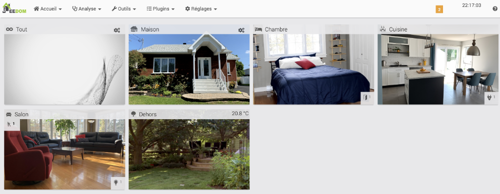

## 26.7 Ajouter une prise Wi-Fi Tuya/SmartLife à Jeedom

Les prises Wi-Fi sont généralement conçues pour passer par l'infonuagique afin d'être contrôlées par un appareil mobile à l'aide d'une application spécialisée.

Certaines peuvent néanmoins être ajoutées à une boîte domotique afin de pouvoir interagir avec d'autres objets connectés qui utilisent possiblement un autre protocole de communication, par exemple le protocole Z-Wave.

Les prises Wi-Fi Teckin font partie de cette catérogie.

Attention : les prises Teckin doivent être pairées dans l'application SmartLife avant d'être intégrées à Jeedom, ce qui peut déplaire aux usagers qui ne souhaitent pas passer par l'infonuagique avec leur système domotique.   
  
De plus, l'application infonuagique SmartLife ne permet pas de faire plus d'une requête par minute, ce qui enlève beaucoup de réactivité aux prises Wi-Fi.

## Configuration de la prise Wi-Fi sur votre téléphone

Les prises Wi-Fi Teckin sont conçues pour travailler avec l'application SmartLife. Vous devez installer cette application sur votre iPhone ou sur votre téléphone Android et ce, même si le but ultime est de contrôler la prise avec Jeedom.

Suivez [apical\_lien\_interne][integration\_tuya\_pour\_ajouter\_des\_prises\_wi-fi\_teckin\_dans\_home\_assistant,les étapes détaillées pour le pairage dans l'application SmartLife,telephone][/apical\_lien\_interne]. Ne suivez que les instructions de la section « Configuration de la prise Wi-Fi sur votre téléphone » car les autres sections ne concernent pas Jeedom.

## Plugin SmartLife dans Jeedom

Pour rendre le pairage dans Jeedom possible, vous devez retrouver le plugin SmartLife disponible dans le market Jeedom.

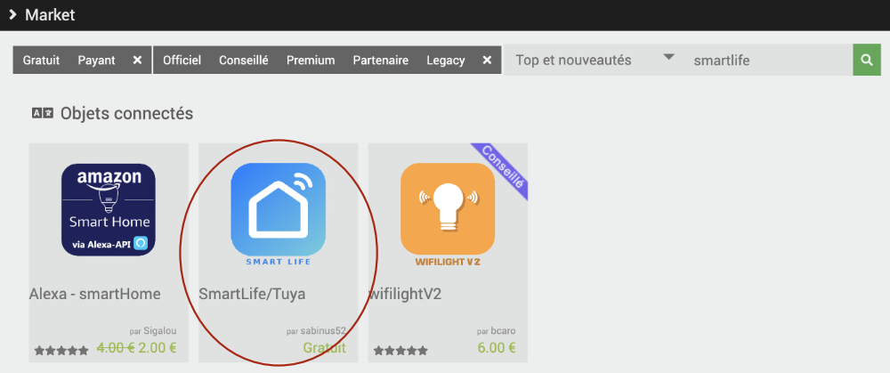

Installez ce plugin puis activez-le.

N'oubliez pas : pour que le pairage d'une prise Teckin dans Jeedom fonctionne, il faut que la prise soit associée à votre téléphone. Il est donc nécessaire d'entrer vos informations de connexion à l'application SmartLife dans le plugin.

Rendez-vous dans le menu Plugins / Objets connectés /Objets SmartLife/Tuya / Configuration puis remplissez la zone Configuration à partir de vos informatinos SmartLife.

* Utilisateur/Téléphone : informations utilisées pour vous connecter à l'application. Ceci pourrait être votre courriel.
* Mot de passe
* Code pays : retrouvez le code de votre pays dans cette liste : <https://countrycode.org/>. Le code pour le Canada est 1.
* Plateforme : SmartLife

Inutile de cliquer sur Tester la connexion, ceci ne fonctionnera pas et ce, même si les informations sont toutes bien entrées.

Cliquez sur Sauvegarder.

Rendez-vous dans le menu Plugins / Objets connectés /Objets SmartLife/Tuya puis cliquez sur Découverte des objets. Si tout se déroule normalement, vous devriez voir apparaître toutes les prises et tous les scénarios entrés sur l'application SmartLife.

Cliquez sur l'objet de votre choix et remplissez sa fiche comme vous le feriez pour n'importe quel objet connecté.

## Pour plus d'information

« Documentation du plugin SmartLife ». Jeedom. <https://sabinus52.github.io/jeedom-smartlife/fr_FR/>

« La prise TECKIN, le plugin Smartlif et Jeedom ». YouDom. <https://youdom.net/2022/02/24/la-prise-teckin-le-plugin-smartlif-et-jeedom/>

## 26.8 Travailler avec la météo sous Jeedom

Les données météo peuvent servir de déclencheur pour un scénario Jeedom.

Les donnés météo de Jeedom proviennent de l'API [Weather API](https://www.weatherapi.com/) et ne nécessitent aucune clé de configuration.


Pour avoir accès aux données météo dans Jeedom, installez le plugin gratuit Weather - officiel par Jeedom SAS.

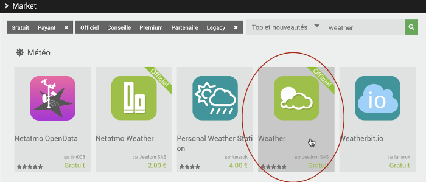

Une fois installé vous devrez l'activer sur sa page de configuration.

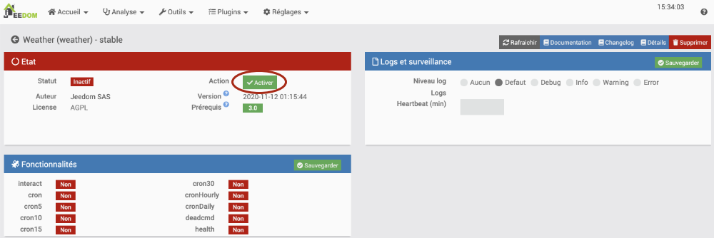

Pour préciser l'endroit pour lequel vous désirez avoir la météo, rendez-vous dans Plugins / Météo / Weather puis cliquez sur le +.

Jeedom vous demandera le nom de l'équipement. Entrez quelque chose du genre « Météo Victoriaville ».

Vous pourrez ensuite remplir les autres informations comme vous le feriez avec d'autres équipements.

Les coordonnées GPS peuvent être retrouvées sur Google Maps.

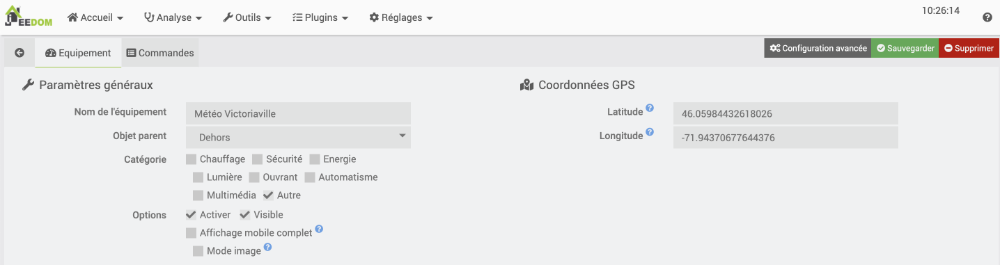

Si vous avez sélectionné un objet parent qui est visible sur le Dashboard et que vous avez rendu l'équipement de météo visible, vous pourrez voir la météo directement sur le Dashboard.

Pour voir toutes les informations présentées, vous devrez peut-être [apical\_lien\_interne][le\_dashboard\_jeedom,redimensionner la tuile,redimensionner][/apical\_lien\_interne] de la météo.

Si aucune donnée météo n'est affichée, vous devez cliquer sur l'icône de rafraîchissement au coin supérieur droit de la tuile.

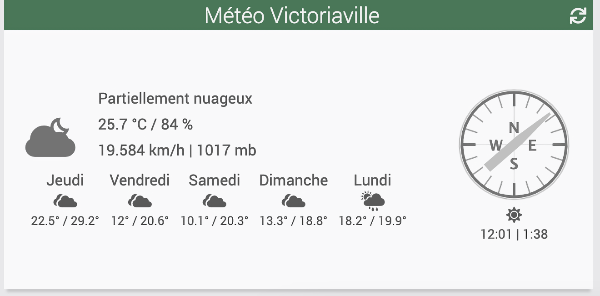

Voici la même tuile mais cette fois, après avoir coché Mode image.

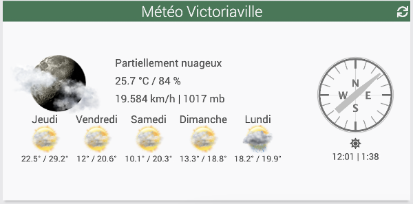


Si un appareil connecté a déjà été inclus dans une boîte domotique, vous ne pourrez pas l'inclure dans une autre boîte sans avoir effectué une opération préalable.

Vous avez deux choix :

* Effectuer une réinitialisation de l'appareil (factory reset). Sur certains appareils, ceci consiste à appuyer sur le bouton d'inclusion de façon prolongée pendant 10 secondes. Consultez le manuel de l'appareil pour connaître la procédure spécifique à votre appareil.

  ou
* Exclure l'appareil de votre boîte domotique (même s'il n'a jamais été inclus dans cette boîte). Dans Jeedom, rendez-vous dans Plugins / Protocole domotique / Z-Wave JS / Bouton Inclusions. Choisissez Exclusion. Après avoir cliqué sur Démarrer, effectuez l'opération sur l'appareil connecté pour le mettre en mode pairage. Consultez le manuel de l'appareil pour connaître la procédure spécifique à votre appareil. Jeedom confirmera l'exclusion.

  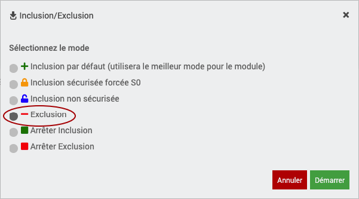

<!-- --- split --- -->




1. Les manuels d'instructions pour les différents objets connectés à votre disposition ont été déposés sur Teams. Retrouvez l'information qui indique comment ajouter un capteur d'ouverture de porte InteSet à une boîte domotique.
2. Toujours en recherchant dans les manuels d'instructions, combien de fois faut-il appuyer sur le bouton de la prise intelligente Zooz pour effectuer une inclusion sécurisée?
3. [apical\_lien\_interne][ajouter\_un\_appareil\_connecte\_z-wave\_a\_jeedom,Ajoutez à votre boîte Jeedom au moins un capteur et au moins un récepteur][/apical\_lien\_interne] selon le matériel qui vous a été fourni. Attention : vous devrez [apical\_lien\_interne][le\_noeud\_n\_a\_pas\_encore\_de\_commande,corriger une erreur de programmation puis ajouter manuellement les commandes pour chaque appareil][/apical\_lien\_interne]. Amusez-vous à explorer les commandes disponibles, l'effet d'un changement de type de numérique à binaire, etc.
4. [apical\_lien\_interne][travailler\_avec\_la\_meteo\_sous\_jeedom,Installez et configurez le plugin météo][/apical\_lien\_interne].
5. Quand tout est installé, assurez-vous que tous vos objets ainsi que votre service météo sont visibles dans l'écran obtenu à partir du menu Accueil / Dashboard. Au besoin, éditez-les et cochez la case Visible.
6. Modifiez l'état de votre récepteur à partir du Dashboard (ex : allumez l'ampoule ou mettez la prise de courant à On).
7. Pour un objet connecté qui donne la température, vous devez modifier sa tuile sur le Dashboard. Cliquez sur l'icône de crayon dans le coin supérieur droit du Dashboard puis sur les trois points verticaux dans le coin de la tuile à modifier. On veut voir en fond de tuile le graphique de l'historique de la température.
8. Faites une impression d'écran de votre Dashboard. L'impression d'écran doit montrer le nom de la boîte Jeedom ainsi que tout ce qui a été ajouté au tableau de bord. Déposez-la sur Teams dans le devoir prévu à cet effet.
9. OPTIONNEL : [apical\_lien\_interne][configurer\_la\_page\_de\_synthese,configurez la page de synthèse][/apical\_lien\_interne] afin d'y afficher les informations que vous jugez les plus pertinentes.
10. Effectuez une [apical\_lien\_interne][copie\_de\_securite\_de\_jeedom,sauvegarde manuelle de Jeedom][/apical\_lien\_interne] et téléchargez-la sur votre poste de travail.
11. OPTIONNEL : si vous possédez un Raspberry Pi, installez-y un système Jeedom à votre résidence et configurez-le pour [apical\_lien\_interne][acceder\_a\_jeedom\_a\_distance\_gratuitement,pouvoir y accéder à distance][/apical\_lien\_interne].