<!-- --- split --- -->

# 149 — 6. Pour le prochain cours


Vous disposez d'un cours pour acquérir les connaissances théoriques et finaliser cet exercice.

Une fois cet exercice complété, vous devez effectuer vos lectures pour l'exercice suivant.

<!-- --- split --- -->




Nous voici rendus à la semaine de relâche.

Vous n'avez aucune nouvelle théorie ni aucun nouvel exercice à réaliser pendant cette semaine.

Si vous avez accumulé du retard, c'est l'occasion idéale de le rattraper.

Si vous êtes à jour dans vos travaux, cette semaine est à vous alors reposez-vous bien !

<!-- --- split --- -->


<!-- --- split --- -->


## 150 — 8.1 Le format YAML

YAML est un format de représentation des données semblable à XML ou JSON.

Originalement, cet acronyme venait de Yet Another Markup Language. Ironiquement, il signifie maintenant YAml ain't Markup Language.

Le format YAML ressemble énormément au JSON. En fait, YAML est un sur-ensemble de JSON.

Alors que JSON est le champion comme format d'échange de données, YAML est le préféré pour les fichiers de configuration.

En effet, contrairement à JSON, le format YAML permet :

* l'ajout de commentaires
* les chaînes sur plusieurs lignes
* une lecture plus facile puisqu'il utilise l'indentation plutôt que les délimiteurs
* la référence à une autre section du même fichier à l'aide d'ancres
* etc.

## Structure d'un fichier YAML

Dans un fichier YAML, on retrouve une série de blocs de configuration.

On donnera un nom à chacun des blocs.

Le nom d'un bloc doit respecter ces conditions :

* �Stre unique
* Utiliser seulement des lettres minuscules, des chiffres et des barres de soulignement

Dans un bloc, on peut retrouver des collections dans lesquelles chaque item débute par un trait d'union.

On peut également retrouver des paires clé-valeur au format cle: valeur.

YAML

nom\_du\_bloc:  
  - item1: valeur1  
    autrecleitem1: autrevaleuritem1  
  - item2: valeur2  
    autrecleitem2: autrevaleuritem2

Il est possible d'imbriquer les collections et les paires clé-valeur. L'indentation est la seule façon pour indiquer une imbrication.

Les fichiers YAML doivent répondre à ces exigences :

* utiliser des espaces (les tabulations ne fonctionnent pas)
* délimiter le code à l'aide d'indentations (généralement 2 ou 4 espaces pour une indentation)
* la valeur booléenne vrai peut être entrée avec une de ces valeurs : True, On, Yes
* la valeur booléenne faux peut être entrée avec une de ces valeurs: False, Off, No

## Configuration sur plusieurs lignes

Lorsqu'une configuration comporte plusieurs lignes, il faut utliser l'un de ces caractères :

* | : signifie que les sauts de lignes sont importants dans ce qui suit
* > : signifie que les sauts de lignes sont remplacés par des espaces. Autrement dit, la configuration pourrait être entrée sur une seule ligne et donner le même résultat.

Dans les deux cas, on peut ajouter un trait d'union après le caractère afin d'indiquer qu'il faut enlever les sauts de ligne à la fin de la chaîne.

YAML

value\_template: >-  
    
    Ouverte  
    
    Fermée  
  

## Quelques exemples

Voici quelques exemples de fichiers de configuration YAML.

### configuration.yaml

Ce fichier est utilisé par le logiciel domotique Home Assistant.

Fichier configuration.yaml

# Configure a default setup of Home Assistant (frontend, api, etc)  
default\_config:

 

# SMTP  
notify:  
  - name: courriel\_administrateur  
    platform: smtp  
    sender: homeassistant@mondomaine.com  
    server: mail.mondomaine.com  
    timeout: 15  
    port: 587  
    encryption: starttls  
    username: homeassistant@mondomaine.com  
    password: mot\_de\_passse\_en\_clair  
    sender\_name: Home Assistant  
    recipient: destinataire@sondomaine.com  
   
# Text to speech  
tts:  
  - platform: google\_translate

 

group: !include groups.yaml  
automation: !include automations.yaml  
script: !include scripts.yaml  
scene: !include scenes.yaml

### Homestead.yaml

Ce fichier est utilisé par les développeurs Laravel pour configurer leur environnement Homestead.

Fichier Homestead.yaml

---  
ip: "192.168.10.10"  
memory: 2048  
cpus: 1  
provider: virtualbox

 

authorize: ~/.ssh/id\_rsa.pub

 

backup: true

 

keys:  
    - ~/.ssh/id\_rsa

 

folders:  
    - map: ~/Documents/CodeLaravel  
      to: /home/vagrant/code

 

sites:  
    - map: monsite.test  
      to: /home/vagrant/code/monsite/public  
      php : "7.4"  
    - map: autresite.test  
      to: /home/vagrant/code/autresite/public  
   
databases:  
    - homestead

## Pour plus d'information

« YAML ». Wikipédia. <https://fr.wikipedia.org/wiki/YAML>

« YAML ». yaml.org. <https://yaml.org/>

« Why JSON isn't a good configuration language ». Lucidchart. <https://www.lucidchart.com/techblog/2018/07/16/why-json-isnt-a-good-configuration-language/>

« YAML idiosyncrasies ». SaltStack. <https://docs.saltstack.com/en/latest/topics/troubleshooting/yaml_idiosyncrasies.html>

« YAML Style Guide ». Home Assistant. <https://developers.home-assistant.io/docs/documenting/yaml-style-guide/>

« YAML Multiline ». YAML Multiline. <https://yaml-multiline.info/>

« YAML Ain�?Tt Markup Language (YAML�"�) version 1.2 - Scalars ». yaml.org. <https://yaml.org/spec/1.2.2/#23-scalars>

## 151 — 8.2 Travailler avec le module complémentaire File editor

Il existe quelques modules complémentaires qui permettent d'éditer des fichiers à partir de l'interface graphique de Home Assistant.

Parmi ceux-ci, notons File Editor et [apical\_lien\_interne][travailler\_avec\_le\_module\_complementaire\_studio\_code\_server,Studio Code Server][/apical\_lien\_interne].

Je vous montre ici comment installer File Editor.

## Avantages de File Editor

* Très rapide à charger

## Inconvénients

* Comme tout autre éditeur disponible à partir de l'interface Web de Home Assistant, File Editor ne peut éditeur que les fichiers du dossier config (sous HassoS : /mnt/data/supervisor/homeassistant) et de ses sous-dossiers
* Ne fonctionne pas s'il n'y a pas accès à Internet (Home Assistant pourrait être utilisé avec un Intranet seulement)

## Installation

Pour l'installer, rendez-vous dans le menu Paramètres / Modules complémentaires puis cliquez sur Boutique des modules complémentaires au bas de l'écran.

Dans la zone de recherche, tapez File editor.

Cliquez sur la tuile du module complémentaire puis, dans l'écran suivant, cliquez sur Installer.

Une fois le module installé, cliquez sur Démarrer.

Le module complémentaire est prêt à être utilisé. Vous pourrez revenir à cet écran à tout moment à partir de l'option de menu Paramètres / Modules complémentaires / Clic sur la tuile File editor.

Pour un accès plus rapide, vous pouvez activer l'option Ajouter à la barre latérale.

## �?dition d'un fichier

Pour éditer un fichier, cliquez sur Ouvrir l'interface utilisateur Web dans le coin inférieur droit.

Vous avez maintenant atteint l'écran qui permet d'ouvrir le fichier de votre choix à l'aide de l'icône de chemise, à gauche de la barre bleue.

Note : pour afficher les fichiers du dossier .storage dans File Editor :

* Rendez-vous dans le menu Paramètres / Modules complémentaires / Tuile File editor / onglet Configuration.
* Au-dessus de la zone Ignore Pattern, enlever .storage.

[apical\_lien\_interne][Editer\_le\_fichier\_configuration\_yaml,Dans une prochaine fiche][/apical\_lien\_interne], je vous explique comment utiliser File editor pour éditer le fichier configuration.yaml.

## 152 — 8.3 Travailler avec le module complémentaire Studio Code Server

Il existe quelques modules complémentaires qui permettent d'éditer des fichiers à partir de l'interface graphique de Home Assistant.

Parmi ceux-ci, notons [apical\_lien\_interne][travailler\_avec\_le\_module\_complementaire\_file\_editor,File Editor][/apical\_lien\_interne] et Studio Code Server.

Je vous montre ici comment installer Studio Code Server.

## Avantages de Studio Code Server

* Fonctionne même s'il n'y a pas accès à Internet (Home Assistant pourrait être utilisé avec un Intranet seulement)
* Coloration syntaxique
* Très configurable

## Inconvénients

* Lent à charger
* Comme tout autre éditeur disponible à partir de l'interface Web de Home ASsistant, Studio Code Server ne peut éditeur que les fichiers du dossier config (sous HassoS : /mnt/data/supervisor/homeassistant) et de ses sous-dossiers

## Installation

Pour l'installer, rendez-vous dans le menu Paramètres / Modules complémentaires puis cliquez sur Boutique des modules complémentaires au bas de l'écran.

Dans la zone de recherche, tapez Studio Code Server.

Cliquez sur la tuile du module complémentaire trouvé puis, dans l'écran suivant, cliquez sur Installer.

Une fois le module installé, cliquez sur Démarrer.

Le module complémentaire est prêt à être utilisé. Vous pourrez revenir à cet écran à tout moment à partir de l'option de menu Paramètres / Modules complémentaires / Clic sur la tuile Studio Code Server.

## �?dition d'un fichier

Pour éditer un fichier, cliquez sur Ouvrir l'interface utilisateur Web dans le coin inférieur droit.

Vous avez maintenant atteint l'écran qui permet d'ouvrir le fichier de votre choix à partir de la zone Explorer.

Par défaut, le module ne présente pas de barre de menu. Pour la faire apparaître, cliquez sur l'icône Customize Layout puis choisissez Menu Bar.

## 153 — 8.4 �?diter le fichier configuration.yaml

Le fichier configuration.yaml permet d'effectuer une foule de configurations dans Home Assistant.

Physiquement, il est placé dans le dossier /mnt/data/supervisor/homeassistant/configuration.yaml. Mais il est plus simple de travailler dans l'interface Web pour y accéder.

Pour l'éditer, [apical\_lien\_interne][travailler\_avec\_le\_module\_complementaire\_file\_editor,ouvrez l'extension File editor][/apical\_lien\_interne] ou [apical\_lien\_interne][travailler\_avec\_le\_module\_complementaire\_studio\_code\_server,Studio Code Server][/apical\_lien\_interne].

Cette démonstration est réalisée à l'aide de File editor.

Cliquez sur l'icône de chemise à gauche de la barre bleue.

Par défaut, l'extension présente les fichiers du dossier /mnt/data/supervisor/homeassistant ([apical\_lien\_interne][dossier\_config,aussi appelé dossier config][/apical\_lien\_interne]). C'est justement là que se trouve notre fichier.

Cliquez sur le fichier configuration.yaml.

Voici le contenu initial de ce fichier.

Fichier configuration.yaml

# Loads default set of integrations. Do not remove.  
default\_config:

 

# Load frontend themes from the themes folder  
frontend:  
  themes: !include\_dir\_merge\_named themes

 

automation: !include automations.yaml  
script: !include scripts.yaml  
scene: !include scenes.yaml

## Chargement des configurations par défaut

La toute première ligne du fichier, default\_config:, permet de charger [les configurations par défaut de Home Assistant](https://www.home-assistant.io/integrations/default_config/).

## Chargement d'autres fichiers YAML

Afin de ne pas surcharger le fichier configuration.yaml, il est possible d'écrire des configurations dans d'autres fichiers YAML et de les inclure ici.

C'est ce qui est fait par défaut avec les fichiers automations.yaml, scripts.yaml et scenes.yaml.

## Ajout de configurations

Il est possible d'ajouter des instructions dans le fichier configuration.yaml, notamment pour :

* ajouter des capteurs [apical\_lien\_interne][configurer\_un\_capteur\_virtuel,virtuels][/apical\_lien\_interne]
* effectuer des configurations pour pouvoir [apical\_lien\_interne][configurer\_home\_assistant\_pour\_l\_envoi\_de\_courriel,envoyer du courriel][/apical\_lien\_interne]
* effectuer des configurations  pour [apical\_lien\_interne][publication\_et\_abonnement\_mqtt\_avec\_home\_assistant,s'abonner à un canal MQTT,abonnement][/apical\_lien\_interne]
* etc.

Chacune des configurations doit être placée dans une section avec un nom unique.

Voici, par exemple, comment ajouter un capteur virtuel qui simule une porte pouvant être ouverte ou fermée.

Le code peut être ajouté à différents endroits dans le fichier. J'ai choisi ici de l'ajouter au bas des instructions existantes.

Fichier configuration.yaml

input\_boolean:  
  porte\_virtuelle:  
    name: Porte virtuelle  
    icon: mdi:door

Puisque le nom de la section doit être unique, ceci n'est pas valide :

Fichier configuration.yaml

input\_boolean:  
  porte\_virtuelle:  
    name: Porte virtuelle  
    icon: mdi:door  
input\_boolean:  
  ventilateur\_virtuel:  
    name: Ventilateur virtuel  
    icon: mdi:fan

Lorsque plusieurs configurations doivent faire partie d'une même section, il faut plutôt faire ceci :

Fichier configuration.yaml

input\_boolean:  
  porte\_virtuelle:  
    name: Porte virtuelle  
    icon: mdi:door  
  ventilateur\_virtuel:  
    name: Ventilateur virtuel  
    icon: mdi:fan

N'oubliez pas d'enregistrer vos modifications en cliquant sur l'icône de disquette dans le haut de l'écran ou en appuyant sur Ctrl+S (Windows) ou �O~ Cmd+S (macOS).

La couleur rouge indique que les modifications n'ont pas été enregistrées.


Avant de poursuivre, il est important de vérifier votre travail.

Suivez les conseils « [apical\_lien\_interne]validation\_des\_configurations[/apical\_lien\_interne] » pour vous assurer que vos configurations sont valides.

## Pour que les configurations soient prises en compte

La plupart des modifications au fichier de configuration nécessiteront un rechargement des configurations : Outils de développement / onglet YAML / Section Rechargement de la configuration YAML.

Parfois, un redémarrage de Home Assistant sera nécessaire : Paramètres / Système / Clic sur l'icône de démarrage dans le haut de l'écran / Redémarrer Home Assistant.

## Pour plus d'information

« Advanced Configuration ». Home Assistant. <https://www.home-assistant.io/getting-started/configuration/>

« Default Config ». Home Asssistant. <https://www.home-assistant.io/integrations/default_config/>

« Troubleshooting your configuration ». Home Assistant. <https://www.home-assistant.io/docs/configuration/troubleshooting/#problems-with-the-configuration>

« Home Assistant configuration YAML (The beginners guide) ». Siytek. <https://siytek.com/home-assistant-configuration-yaml-beginners-guide/>

## 154 — 8.5 Validation des configurations

Une fois vos configurations en place [apical\_lien\_interne][Editer\_le\_fichier\_configuration\_yaml,dans le fichier configuration.yaml][/apical\_lien\_interne], il faut s'assurer que le tout soit valide avant de poursuivre.

Si vous essayez un redémarrage alors que le fichier de configuration n'est pas valide, Home Assistant ne le permettra pas.

Dans cette impression d'écran, on voit qu'il manque le symbole deux-points (:) à la ligne 12.

## Interface graphique - bouton de validation

Il est possible de valider la configuration à tout moment à partir de l'interface graphique de Home Assistant.

Rendez-vous dans le menu Outils de développement / YAML puis cliquez sur le bouton Vérifier la configuration.

Si les configurations sont valides, vous verrez apparaître le message « La configuration n'empêchera pas Home Assistant de redémarrer! ».

S'il y a des erreurs, vous verrez plutôt les mots « Configuration non valide! » avec une explication de l'erreur.

## Interface graphique - lors du démarrage

Home Assistant vérifie automatiquement la validité des configuration quand le système démarre.

S'il trouve des erreurs, il ajoute une pastille à côté du menu Notifications.

Un clic sur cette pastille nous confirme que la notification concerne une erreur de configuration.

## Console Home Assistant

Le fichier de configurations peut également être validé [apical\_lien\_interne][la\_console\_home\_assistant,à la console Home Assistant][/apical\_lien\_interne].

Entrez la commande suivante :

Terminal HassOS

ha core check

Si les configurations sont valides, vous obtiendrez le message « Command completed successfully ».

Résultat à l'écran

# ha core check  
Processing... Done.

 

Command completed successfully.

En cas d'erreur, vous obtiendrez plutôt un message d'erreur.

Résultat à l'écran

# ha core check  
Processing... Done.

 

Error: Testing configuration at /config  
  
ERROR:annotatedyaml.loader:while scanning a simple key  
 in "/config/configuration.yaml", line 12, column 1  
could not find expected ':'  
 in "/config/configuration.yaml", line 13, column 18  
Fatal error while loading config: while scanning a simple key  
 in "/config/configuration.yaml", line 12, column 1  
could not find expected ':'  
 in "/config/configuration.yaml", line 13, column 18  
Failed config  
 General Errors:   
 - while scanning a simple key  
 in "/config/configuration.yaml", line 12, column 1  
could not find expected ':'  
 in "/config/configuration.yaml", line 13, column 18

 

Successful config (partial)


Les validateurs YAML permettent d'effectuer l'analyse syntaxique (parse) de votre code YAML afin de vous aider à trouver ce qui ne va pas.

Il en existe plusieurs, par exemple :

* <http://yaml-online-parser.appspot.com/>
* <https://codebeautify.org/yaml-validator>
* <http://www.yamllint.com/>

Ces validateurs se concentrent sur la syntaxe YAML mais ils ne sont pas en mesure de vérifier si les configurations sont conformes à ce que Home Assistant s'attend.

<!-- --- split --- -->




Home Assistant permet d'associer une icône à différentes entités.

Il utilise pour celà la bibliothèque Material Design.

Parfois, il est possible de sélectionner l'icône directement dans l'interface utilisateur. D'autres fois, il faut connaître le nom de l'iccône.

Dans tous les cas, il est possible d'utiliser un site Web pour faciliter la recherche d'icônes.

Les icônes Material Design sont listés sur ces sites :

* <https://pictogrammers.com/library/mdi/>
* <https://pictogrammers.github.io/@mdi/font/7.4.47/> (vous pouvez modifier la version de la bibliothèque dans l'URL)

Si le site présente les icônes avec un nom qui débute par mdi-, il suffit de modifier dans son nom mdi- par mdi: pour que Home Assistant la reconnaisse.

Sinon, il faut ajouter mdi: devant le nom.

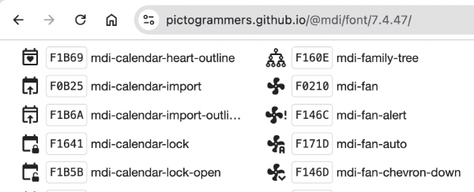

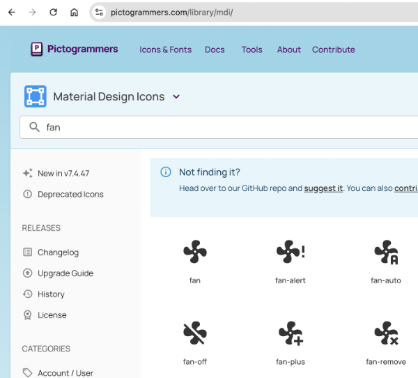

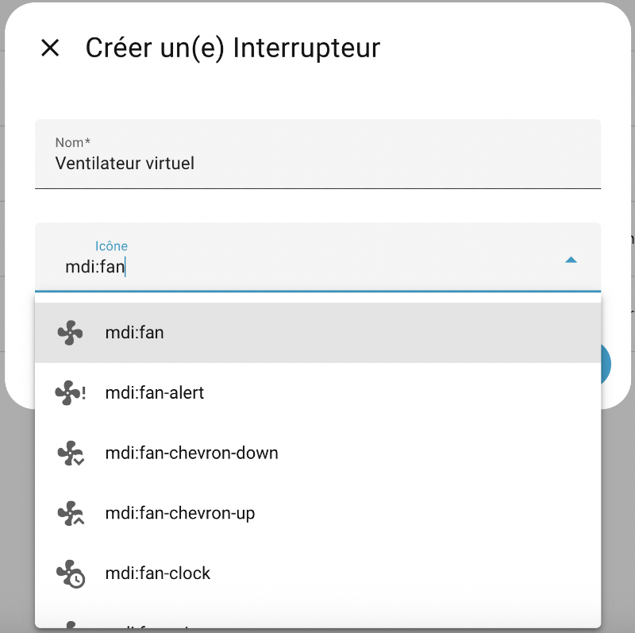

<!-- --- split --- -->


## 155 — 0.1 Configurer un capteur virtuel

Vous souhaitez faire des tests dans Home Assistant sans devoir vous procurer un capteur ou un récepteur réel?

Vous désirez tester une automatisation basée sur la présence et vous ne souhaitez pas devoir courir loin de la maison pour chacun de vos tests?

Ou encore, vous désirez tester une automatisation basée sur la température et vous ne souhaitez pas devoir attendre l'hiver pour la tester?

Les capteurs virtuels vous permettront de faire vos tests facilement.

Les capteurs virtuels permettent également d'étendre les fonctionnalités de Home Assistant, par exemple [apical\_lien\_interne][automatisation\_qui\_tient\_compte\_de\_l\_heure,créer une automatisation qui tient compte de l'heure][/apical\_lien\_interne].

Il est possible de créer un capteur virtuel à l'aide de l'interface graphique ou à l'aide du fichier configuration.yaml.

Peu importe la technique utilisée, les capteurs virtuels seront enregistrés avec les autres entités dans le fichier /mnt/data/supervisor/homeassistant/.storage/core.entity\_registry.

## Création d'un capteur virtuel à l'aide de l'interface graphique

Les capteurs virtuels peuvent être créés à l'aide de l'interface graphique de Home Assistant.

En plus du fichier core.entity\_registry, les capteurs ajoutés via l'interface graphique seront enregistrés dans le dossier /mnt/data/supervisor/homeassistant/.storage, dans un fichier qui porte le nom du type de capteur virtuel (input\_boolean, input\_datetime, input\_number, etc.).

Pour créer un capteur virtuel à l'aide de l'interface graphique :

* Paramètres / Appareils et services / Onglet Entrées (en anglais, ce sera Helpers) / Créer une entrée.
* Sélectionnez le type désiré (faites défiler les options au besoin).

  Un des types très utilisés est l'interrupteur, qui correspond au input\_boolean. Ceci crée un virtuel qui peut avoir deux états, par exemple allumé/éteint, ouvert/fermé, levé/baissé, etc.

  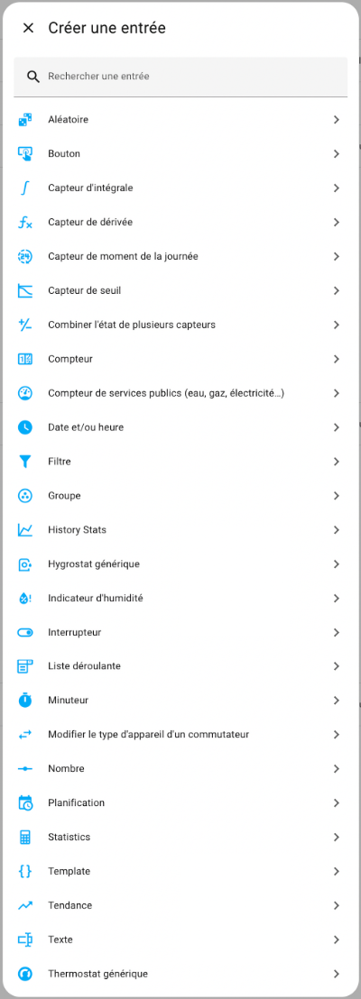
* Le capteur apparaîtra comme suit dans la page Aperçu et on pourra changer son état afin de faire réagir les automatisations qui l'utilisent.

  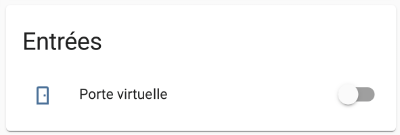

## Création d'un capteur virtuel à l'aide du fichier configuration.yaml

Vous pouvez également créer vos capteurs virtuels en entrant directement des lignes de code dans [apical\_lien\_interne][Editer\_le\_fichier\_configuration\_yaml,le fichier configuration.yaml][/apical\_lien\_interne].

Cette technique vous offre plus d'options.

Notez que seul les capteurs virtuels créés par code apparaîtront dans ce fichier. Ceux créés à l'aide de l'interface graphique n'y apparaîtront pas.

Fichier configuration.yaml

# Capteurs virtuels  
input\_boolean:  
  porte\_virtuelle:  
    name: Porte virtuelle  
    icon: mdi:door

Comme pour toute modification directement dans le fichier de configuration, un [apical\_lien\_interne][Editer\_le\_fichier\_configuration\_yaml,rechargement,rechargement][/apical\_lien\_interne] sera nécessaire pour que ce capteur virtuel soit visible dans la page Aperçu.


Pour chaque capteur, on spécifie :

* son type :
  + [input\_boolean](https://www.home-assistant.io/integrations/input_boolean/)
  + [input\_select](https://www.home-assistant.io/integrations/input_select/)
  + [input\_datetime](https://www.home-assistant.io/integrations/input_datetime/)
  + [input\_number](https://www.home-assistant.io/integrations/input_number/)
  + [input\_text](https://www.home-assistant.io/integrations/input_text/)
* son identifiant (unique, composé uniquement de lettres minuscules, de chiffres et de barres de soulignement)
* son nom tel qu'il apparaîtra dans Aperçu
* sa valeur initiale au démarrage de Home Assistant (note : les input\_boolean utilisent on et off)
* son icône, choisie dans [apical\_lien\_interne][icones\_material\_design\_dans\_home\_assistant,la bibliothèque Material Design][/apical\_lien\_interne]
* autres configurations propres au type de capteur virtuel (ex : liste des options disponibles pour input\_select)

Il est possible de définir plusieurs capteurs virtuels du même type en les plaçant dans le même bloc.

Fichier configuration.yaml

# Capteurs virtuels  
input\_boolean:  
  porte\_virtuelle:  
    name: Porte virtuelle  
    icon: mdi:door  
  presence\_maman:  
    name: Présence de maman  
    icon: mdi:face-profile-woman  
  
input\_number:  
  temperature\_virtuelle:  
    name: Température virtuelle  
    initial: 20  
    min: -35  
    max: 35  
    step: 1  
    icon: mdi:thermometer

<!-- --- split --- -->




Par défaut, dans Home Assistant, un tableau de bord est disponible dans le menu Aperçu et il contient absolument tout ce qui est ajouté à Home Assistant.

Ceci mène souvent à un tableau de bord plutôt encombré.

Il est possible de modifier le tableau de bord original ou encore de créer des tableaux de bord supplémentaires.

Les informations sur un tableau de bord sont stockées dans un fichier dont le nom est au format /mnt/data/supervisor/homeassistant/.storage/lovelace.dashboard\_nom\_du\_tableau ou, selon votre version de Home Assistant, /mnt/data/supervisor/homeassistant/.storage/lovelace.nom\_du\_tableau.

Le nom de ce fichier vient du fait qu'auparavant, l'outil d'édition des tableaux de bord de Home Assistant s'appelait Lovelace.

Attention : il est préférable de ne pas modifier le tableau de bord original (celui nommé Aperçu).  
En effet, si vous le modifiez ou si vous y ajoutez d'autres onglets, Home Assistant n'y ajoutera plus automatiquement les entités créées par après.

Si vous avez modifié le tableau de bord Aperçu, [apical\_lien\_interne][reinitialiser\_le\_tableau\_de\_bord\_apercu,il est possible de le réinitialiser][/apical\_lien\_interne] afin que Home Assistant recommence à le gérer automatiquement.

Prenez note que les fonctionnalités du tableau de bord ont beacoup évolué depuis quelques années. Soyez prudents lorsque vous recherchez des informations sur le Web ou à l'aide d'un outil d'intelligence artificielle. Les informations trouvées pourraient ne plus être exactes.

Pour créer un nouveau tableau de bord :

* Cliquez sur le menu Paramètres / Tableaux de bord.
* Cliquez sur le bouton Ajouter un tableau de bord dans le coin inférieur droit.
* Sélectionnez le type de tableau de bord. Je vais ici faire la démonstration avec un nouveau tableau de bord vide.

  
* Remplissez les informations demandées.

  
* Le tableau de bord apparaît désormais dans la liste des tableaux de bord. Cliquez sur Ouvrir à droite de la ligne de votre nouveau tableau de bord.

  
* Cliquez sur le crayon dans le coin supérieur droit. La barre supérieure de l'écran est maintenant grise pour indiquer que le tableau de bord est en édition.

  
* Pour ajouter des cartes au tableau de bord, vous devez d'abord ajouter une section. Cliquez dans la grande zone pointillée au centre de l'écran.

  
* Renommez la section. Si vous n'avez pas d'inspiration, un nom générique tel que Mes cartes fera l'affaire.
* Ajoutez maintenant une carte en cliquant sur le + dans la zone pointillée.
* L'écran vous présente une série de cartes parmi lesquelles vous devez choisir.

  
* Voici quelques combinaisons intéressantes :
  + La carte Entité permet d'afficher la valeur d'une entité réelle ou virtuelle. Si l'entité le permet, un clic sur la carte permettra de modifier la valeur de l'entité.

    
  + La carte Bouton associée à une prise intelligente (ou autre récepteur) : vous pourrez changer l'état du récepteur en cliquant dessus.

    

    La carte Bouton permet également d'effecteur d'autres opérations, par exemple appeler un service (exécuter une action) ou encore [apical\_lien\_interne][lancer\_une\_automatisation\_a\_l\_aide\_d\_un\_bouton,lancer une automatisation][/apical\_lien\_interne].
  + La carte Capteur associée à un capteur

    
  + La carte Jauge associée à un capteur

    
  + La carte Prévision météo associée à l'outil Météo installé par défaut dans Home Assistant

    
  + La carte Carte associée à tous les téléphones cellulaires que vous suivez

    
  + Les cartes Markdown permettent d'inscrire un texte et de le formater à l'aide de la [syntaxe Markdown](https://commonmark.org/help/) ou encore d'utiliser [apical\_lien\_interne][les\_modeles\_dans\_home\_assistant,des modèles][/apical\_lien\_interne].

    Pour plus d'information sur ce type de carte, consultez la fiche « [apical\_lien\_interne]les\_cartes\_de\_type\_markdown[/apical\_lien\_interne] ».

    
  + Les cartes Conditionnelle et Filtre d'entité pourront afficher des informations conditionnellement à certains états.
  + Les cartes Pile horizontale, Pile verticale et Grille servent à gérer la mise en forme du tableau de bord.
  + etc.

Dans l'écran avec la barre supérieure grise, vous pouvez cliquer sur les trois points verticaux et choisir �?diteur de configuration afin de voir le code YAML associé à l'ensemble de vos tableaux de bord.

Fichier /mnt/data/supervisor/homeassistant/.storage/lovelace (YAML)

views:  
  - title: Home  
    sections:  
    - type: grid  
      cards:  
      - type: heading  
        heading\_style: title  
         heading: Mes cartes  
      - type: entity  
         entity: input\_number.temperature\_virtuelle  
      - show\_name: true  
         show\_icon: true  
         type: button  
         entity: light.plug\_in\_dimmer  
      - type: sensor  
         entity: sensor.capteur\_5\_en\_1\_air\_temperature  
         graph: line  
      - type: gauge  
         entity: sensor.capteur\_5\_en\_1\_illuminance  
      - show\_current: true  
         show\_forecast: true  
         type: weather-forecast  
         entity: weather.forecast\_maison  
         forecast\_type: daily  
       - type: map  
         entities:  
           - entity: person.christiane  
           - entity: device\_tracker.justin  
           - entity: zone.home  
           - entity: zone.cegep  
           - entity: person.yves  
         theme\_mode: auto  
       - type: markdown  
         content: |-  
              
           Porte virtuelle ouverte  
             
           Porte virtuelle fermée  
           


Il est préférable de [apical\_lien\_interne][creer\_un\_tableau\_de\_bord\_personnalise,créer un tableau de bord personnalisé][/apical\_lien\_interne] plutôt que de modifier le tableau de bord Aperçu.

En effet, le tableau de bord Aperçu est géré par Home Assistant. Dès que vous en prenez le contrôle, même si vous ne faites qu'ajouter un onglet, Home Assistant n'y ajoutera plus les nouvelles entités créées.

Home Assistant vous avertit d'ailleurs de ce fait lorsque vous cliquez sur le crayon pour modifier Aperçu.

Si vous avez modifié le tableau de bord Aperçu, il est possible de le réinitialiser.

* Rendez-vous dans le menu Aperçu.
* Cliquez sur le crayon.
* Si la barre supérieur de l'écran ne devient pas immédiatement grise et que vous voyez la fenêtre Modifier le tableau de bord, c'est que vous n'avez jamais modifié ce tableau de bord. Vous n'avez rien d'autre à faire.
* Si la barre supérieure de l'écran devient grise, vous devez effectuer la réinitialisation. Cliquez sur les trois points verticaux et choisissez �?diteur de configuration.
* Copiez tout le code YAML dans un fichier texte et enregistrez-le à l'endroit de votre choix. Ceci vous aidera à tout remettre en place au besoin.
* Supprimez tout le code YAML puis enregistrez.
* Le tableau de bord Aperçu est de nouveau géré par Home Assistant et il vous présente les informations sur toutes vos entités.

## 156 — 1.3 Utiliser vos propres images dans un tableau de bord

Lorsque vous créez un tableau de bord personnalisé, quelques types de cartes vous permettent de travailler avec vos propres images.

## Images disponibles

Les images que vous pouvez afficher peuvent provenir du Web et être identifiées par un URL.

Mieux encore, elles peuvent être stockées directement sur le Pi.

C'est cette dernière alternative que nous allons utiliser ici.

Pour que l'image soit disponible localement à partir de Home Assistant, vous devez d'abord créer le dossier www sous /mnt/data/supervisor/homeassistant .

Si vous travaillez à l'aide de File Editor ceci sera réalisé en cliquant sur l'icône New Folder alors que vous êtes dans le dossier /mnt/data/supervisor/homeassistant (ceci est le dossier config).

Vous pouvez également créer le dossier directement au terminal HassOS.

Dans tous les cas, il faut redémarrer Home Assistant pour qu'il reconnaisse le dossier.

La copie du fichier de l'image peut être réalisée à l'aide de différentes techniques :

* à l'aide de File Editor : cliquez sur l'enveloppe blanche puis sélectionnez le dossier www. L'icône Upload File vous permettra de téléverser votre image.

  
* à l'aide de la commande scp :

  Terminal de l'ordinateur

  scp -O -P 22222 /chemin/monimage.png root@192.168.1.145:/mnt/data/supervisor/homeassistant/www

Une fois l'image copiée dans ce dossier, vous pourrez y accéder à partir de l'URL http://192.168.1.145:8123/local/monimage.png

ou, plus simplement /local/monimage.png.

## Carte Image

Une fois que l'image est disponible sur le Pi, elle peut être affichée sur une carte de type Image comme suit :

## Carte Markdown

La carte Markdown est encore plus puissante puisqu'elle permet entre autres de faire un affichage conditionnel grâce aux [apical\_lien\_interne][les\_modeles\_dans\_home\_assistant,modèles][/apical\_lien\_interne].

Dans sa forme la plus simple, la carte Markdown affichera une image comme suit. Remarquez l'utilisation du langage de balisage [Markdown](https://commonmark.org/help/) pour identifier l'image, au format :

Markdown

Remarquez que le texte entre crochets carrés représente l'attribut alt de l'image.

## Pour plus d'information

« HTTP - Hosting files ». Home Assistant. <https://www.home-assistant.io/integrations/http#hosting-files>

## 157 — 1.4 Assigner un appareil à une pièce

Pour bien visualiser vos appareils dans le tableau de bord Home Assistant, il est intéressant d'assigner chacun à une pièce de la maison.

Vous avez la possibilité de créer autant de pièces que désiré :

* Rendez-vous dans le menu Paramètres / Pièces, étiquettes et zones / onglet Pièces.
* Cliquez sur Créer une pièce.
* Donnez un nom à la pièce et, si désiré, ajoutez-lui une image.

Ceci permet de voir un tableau de bord de tout ce qui concerne cette pièce.

## Assignation à l'interface de l'interface Web

Pour assigner un appareil à une pièce, la technique la plus simple est la suivante :

* Rendez-vous dans le menu Paramètres / Appareils et services / onglet Appareils.
* Cliquez sur l'appareil que vous désirez modifier.
* Cliquez sur le crayon dans le coin supérieur droit de l'écran.
* Sélectionnez la pièce à laquelle l'appareil doit être associé.

  

##


Dans le tableau de bord de Home Assistant, il est possible de configurer une carte pour que son icône soit différente selon l'état de l'entité.

Les icônes seront choisies dans [apical\_lien\_interne][icones\_material\_design\_dans\_home\_assistant,la bibliothèque Material Design][/apical\_lien\_interne].

Dans cette fiche :

* [Carte Markdown](999_999_merged.md#markdown)
* [Intégration Template](999_999_merged.md#template)
  + [Exemple avec une carte de type Entité](999_999_merged.md#entite)
  + [Exemple avec une carte de type Bouton](999_999_merged.md#bouton)
* [Et si on avait besoin de vérifier plus de deux états?](999_999_merged.md#elif)

## Carte Markdown

La carte de type Markdown permet de spécifier des conditions à l'aide d'un [apical\_lien\_interne][les\_modeles\_dans\_home\_assistant,modèle][/apical\_lien\_interne].

Dans sa forme la plus simple, le modèle fera afficher un texte différent selon l'état. C'est déjà mieux que le texte « Activé » ou « Désactivé ».

Pour afficher une icône, ou mieux, une icône suivie d'un texte, entrez plutôt ceci.

Remarquez que la carte Markdown est capable d'interpréter du HTML.

Modèle

  
  <ha-icon icon="mdi:door-open"></ha-icon> Ouverte  
  
  <ha-icon icon="mdi:door-closed"></ha-icon> Fermée  


Pour la condition, ce code utilise le langage [Jinja2](https://palletsprojects.com/projects/jinja). Sa syntaxe ressemble à celle de Python.

La carte prendra désormais cette apparence sur le tableau de bord.

 

## Intégration Template

L'intégration [Template](https://www.home-assistant.io/integrations/template/), installée par défaut dans Home Assistant, est une autre solution pour créer une entité dont l'icône pourra être différente selon l'état d'un capteur.

L'utilisation de cette intégration se fait en ajoutant une entrée dans le fichier configuration.yaml avec la mention platform: template.

La technique consiste à ajouter une couche par-dessus un capteur. Dans le tableau de bord, on ajoutera une carte qui travaille avec cette couche plutôt que directement avec le capteur.

Dans l'exemple qui suit, les couleurs permettent de faire des liens entre les différentes parties du code.

La valeur de l'entité provient d'un capteur virtuel de type input\_boolean. Il s'agira du mot Activé ou Désactivé.

L'icône de l'entité est définie par un modèle qui réagit à l'état de ce même capteur virtuel.

Fichier configuration.yaml

sensor:  
  - platform: template  
    sensors:  
      porte\_virtuelle:  
        friendly\_name: Porte virtuelle  
        value\_template: "{{ states('input\_boolean.porte\_virtuelle') }}"  
        icon\_template: >-  
            
            mdi:door-open  
            
            mdi:door-closed  
          

Il est possible de modifier la valeur pour utiliser un texte plus significatif.

Fichier configuration.yaml

sensor:

 

  - platform: template  
    sensors:  
      porte\_virtuelle:  
        friendly\_name: Porte virtuelle  
        value\_template: >-  
            
            Ouverte  
            
            Fermée  
            
        icon\_template: >-  
            
            mdi:door-open  
            
            mdi:door-closed  
          

Après avoir [apical\_lien\_interne][Editer\_le\_fichier\_configuration\_yaml,rechargé les configurations,rechargement][/apical\_lien\_interne], il est possible d'ajouter une carte dans le tableau de bord pour représenter cette nouvelle entité.

### Exemple avec une carte de type Entité

Dans l'exemple précédent, l'entité s'appelle porte\_virtuelle et elle prend sa valeur d'une autre entité qui  s'appelle elle aussi porte\_virtuelle.

Lors de la configuration de la carte, il faut prendre soin de choisir l'entité dont [apical\_lien\_interne][qu\_est-ce\_qu\_une\_entite,le domaine,identifiant][/apical\_lien\_interne] est sensor puisque c'est pour elle que l'icône personnalisée a été définie.

Voici la carte d'entité dont l'icône et la valeurs proviennent de l'entité sensor.porte\_virtuelle.

 

En comparaison, voici ce qu'on aurait obtenu avec une carte d'entité associée à l'entité input\_boolean.porte\_virtuelle.

 

### Exemple avec une carte de type Bouton

Un résultat encore plus intéressant peut être obtenu à l'aide d'une carte de type Bouton.

Ici aussi, il faut associer la carte à l'entité sensor.porte\_virtuelle, soit celle pour laquelle l'icône change selon l'état.

Un clic sur la carte modifiera l'état de l'entité input\_boolean.porte\_virtuelle, ce qui affectera automatiquement la valeur et l'icône de l'autre.

Et voilà le résultat!

 


Dans les exemples précédents, on avait toujours le choix entre deux états. Un if et un else étaient suffisants.

Je vous montre ici comment faire si on doit choisir parmi trois états différents.

Fichier configuration.yaml

icon\_template: >-  
    
    mdi:rocket-launch  
    
    mdi:scale-balance  
    
    mdi:alert  
  

## 158 — 1.6 lovelace-card-mod - Pour styliser le tableau de bord

Le plugin [lovelace-card-mod](https://github.com/thomasloven/lovelace-card-mod) permet de styliser le tableau de bord de Home Assistant en appliquant des règles CSS aux cartes que vous y ajoutez.

## Installation

Le plugin lovelace-card-mod est disponible sur GitHub mais la commande git n'est pas disponible dans le terminal HassOS alors nous allons utiliser une autre procédure pour l'installer :

* Accédez au terminal HassOS en branchant clavier et écran au Raspberry Pi ou [apical\_lien\_interne][se\_brancher\_a\_home\_assistant\_via\_ssh,via SSH][/apical\_lien\_interne].
* Vérifiez s'il existe un dossier www sous /mnt/data/supervisor/homeassistant. S'il n'existe pas, créez-le puis redémarrez le Raspberry Pi.
* Rendez-vous sur la page GitHub de l'extension : <https://github.com/thomasloven/lovelace-card-mod>

  
* Un seul fichier est requis : card-mod.js. Cliquez sur ce fichier.

  
* Dans le haut de l'écran, faites un clic droit sur l'icône de téléchargement à droite de Raw afin de télécharger le fichier sur votre ordinateur.
* �? l'aide de la commande [apical\_lien\_interne][copier\_un\_fichier\_sur\_une\_machine\_linux\_a\_partir\_d\_un\_autre\_ordinateur,scp,scp][/apical\_lien\_interne] lancée dans le terminal de votre ordinateur, copiez ce fichier sur le Raspberry Pi dans le dossier /mnt/data/supervisor/homeassistant/www.

  Terminal de l'ordinateur

  scp -O -P 22222 /chemin/card-mod.js root@192.168.1.145:/mnt/data/supervisor/homeassistant/www
* Afin de tirer profit au maximum de card-mod.js, il faut l'installer en tant que module. �?ditez le fichier configuration.yaml à l'aide de [apical\_lien\_interne][travailler\_avec\_le\_module\_complementaire\_file\_editor,File editor][/apical\_lien\_interne] ou de [apical\_lien\_interne][travailler\_avec\_le\_module\_complementaire\_studio\_code\_server,Studio Code Server][/apical\_lien\_interne]. Ajoutez-y le code suivant :

  Fichier configuration.yaml

  frontend:  
    extra\_module\_url:  
      - /local/card-mod.js
* Redémarrez Home Assistant.

## Utilisation

Pour éditer le code YAML d'une carte :

* Rendez-vous dans le menu Paramètres / Tableaux de bord.
* Cliquez sur Ouvrir vis-à-vis le tableau désiré.
* Cliquez sur le crayon dans le coin supérieur droit.
* Cliquez sur la carte à modifier.
* Cliquez sur le bouton Afficher l'éditeur de code.

Dans le code YAML de la carte, ajoutez une section card\_mod.

YAML

card\_mod:  
  style: |  
    ha-card {  
      ...  // vos règles CSS ici, comme si vous éditiez le CSS d'un site Web  
    }

## Pour plus d'information

« thomasloven/lovelace-card-mod ». GitHub. <https://github.com/thomasloven/lovelace-card-mod>

« thomasloven/lovelace-card-mod - Lovelace Plugins ». GitHub . <https://github.com/thomasloven/hass-config/wiki/Lovelace-Plugins>

<!-- --- split --- -->




1. �? l'aide de l'interface graphique, [apical\_lien\_interne][configurer\_un\_capteur\_virtuel,créez un capteur virtuel][/apical\_lien\_interne] pour simuler un capteur d'ouverture de porte. Il doit être représenté par l'icône door.
2. Installez [apical\_lien\_interne][travailler\_avec\_le\_module\_complementaire\_file\_editor,le module complémentaire File Editor][/apical\_lien\_interne].
3. Afin de vous assurer d'avoir un éditeur fonctionnel peu importe les conditions qui arrivent (par exemple, File Editor ne sera pas disponible s'il y a une panne Internet), installez également [apical\_lien\_interne][travailler\_avec\_le\_module\_complementaire\_studio\_code\_server,le module complémentaire Studio Code Server][/apical\_lien\_interne].
4. [apical\_lien\_interne][Editer\_le\_fichier\_configuration\_yaml,�? l'aide du fichier configuration.yaml][/apical\_lien\_interne], créez un second capteur virtuel pour simuler le nombre de chats qui sont entrés dans une chatière. Vous pouvez utiliser le module complémentaire de votre choix pour éditer le fichier configuration.yaml.
5. Prenez soin de [apical\_lien\_interne][validation\_des\_configurations,valider vos configurations][/apical\_lien\_interne] avant de [apical\_lien\_interne][Editer\_le\_fichier\_configuration\_yaml,les recharger,recharger][/apical\_lien\_interne] (inutile de redémarrer le système au complet).
6. �? l'aide de la technique de votre choix, créez un récepteur virtuel pour simuler une ampoule.
7. [apical\_lien\_interne][creer\_un\_tableau\_de\_bord\_personnalise,Créez un tableau de bord personnalisé][/apical\_lien\_interne] qui permet de **modifier** l'état de vos capteurs virtuels. Plusieurs types de cartes peuvent faire l'affaire, à vous de choisir celui qui vous convient.
8. Dans votre tableau de bord, ajoutez une [apical\_lien\_interne][changer\_l\_icone\_d\_une\_entite\_selon\_son\_etat,carte qui affiche une icône différente selon l'état de la porte virtuelle][/apical\_lien\_interne].
9. Dans votre tableau de bord, ajoutez une [apical\_lien\_interne][utiliser\_vos\_propres\_images\_dans\_un\_tableau\_de\_bord\_lovelace,carte qui permet d'afficher une image de vous][/apical\_lien\_interne].
10. [apical\_lien\_interne][copier\_un\_fichier\_sur\_une\_machine\_linux\_a\_partir\_d\_un\_autre\_ordinateur,�? l'aide de la commande scp,port][/apical\_lien\_interne], copiez sur votre ordinateur le fichier /mnt/data/supervisor/homeassistant/.storage/core.entity\_registry qui contient toutes les entités. Notez que ce type de manipulation pourrait vous être demandé en examen.
11. [apical\_lien\_interne][sauvegarde\_de\_home\_assistant,Créez une sauvegarde][/apical\_lien\_interne] de votre Home Assistant et copiez le fichier sur votre ordinateur.
12. En prévision du prochain cours, [apical\_lien\_interne][service\_openweathermap,créez-vous une clé d'API OpenWeatherMap][/apical\_lien\_interne]. Vous l'utiliserez seulement dans le prochain exercice mais en la créant tout de suite, vous serez assurés de ne pas avoir à attendre le délai d'activation.

<!-- --- split --- -->

# 159 — 3. Pour le prochain cours


Vous disposez d'un cours pour acquérir les connaissances théoriques et finaliser cet exercice.

Une fois cet exercice complété, vous devez effectuer vos lectures pour l'exercice suivant.

<!-- --- split --- -->


## 160 — 4.1 Ajouter une automatisation à l'aide de l'interface graphique

Les automatisations (en anglais : automations) permettent de déclencher une ou plusieurs actions quand un ou plusieurs déclencheurs surviennent. Par exemple, il est possible d'allumer la lumière quand un mouvement est détecté.

Un scénario plus poussé pourrait allumer la lumière et envoyer une notification quand un mouvement est détecté après minuit.

Pour ajouter une automatisation à l'aide de l'interface graphique de Home Assistant :

* Rendez-vous dans le menu Paramètres / Automatisations et scènes / Onglet Automatisations.
* Cliquez sur Créer une automatisation puis Créer une nouvelle automatisation.

  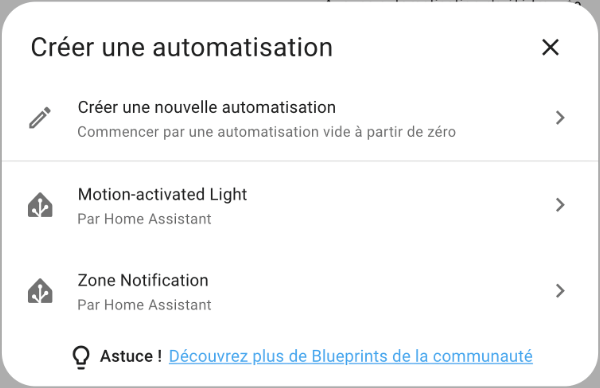

Vous obtenez l'écran de configuration de l'automatisation avec ses zones Quand, Et si et Alors faire.

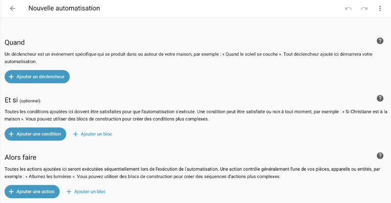


Dans la zone Quand, cliquez sur Ajouter un déclencheur puis choisissez le type du déclencheur.

Dans le cas d'une automatisation qui allume la lumière quand un mouvement est détecté, c'est le changement d'état d'une entité qui lancera l'action. Choisissez donc Entité puis �?tat.

Vous devez spécifier quelle entité lancera l'action et dans quel état elle doit être.

Ici, c'est le détecteur de mouvement du détecteur 5-en-1 qui doit passer de l'état non détecté à l'état détecté.

Notez que si vous n'entrez rien dans les zones De et �?, le déclenchement se produira dès qu'il y a un changement d'état, peu importe lequel.

La zone Pendant (ou for: en YAML) indique que le déclencheur doit avoir été dans cet état pendant une durée minimale pour être pris en compte.

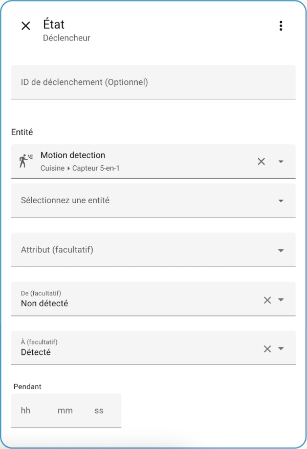


Si le déclencheur nécessite de vérifier si une valeur numérique est supérieure ou inférieure à une autre valeur, vous pouvez utiliser un déclencheur de type �?tat numérique.

L'interface vous offrira d'entrer la valeur au-dessus de laquelle ou au-dessous de laquelle l'entité doit être.

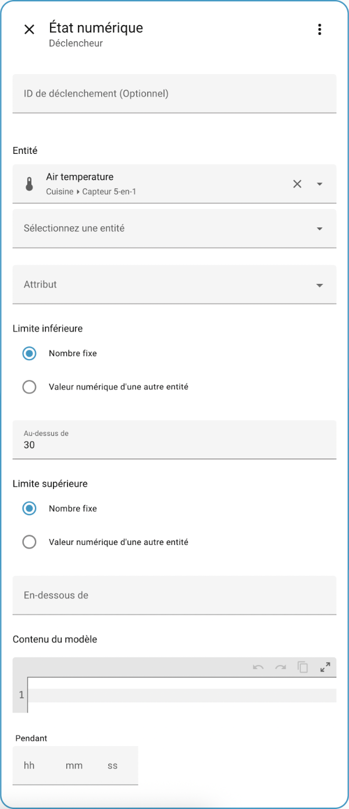

### Déclenchement lors du démarrage de Home Assistant

Si vous désirez que l'automatisation se lance automatiquement au démarrage de Home Assistant, vous devez choisir le déclencheur nommé Home Assistant dans la catégorie Autres déclencheurs.

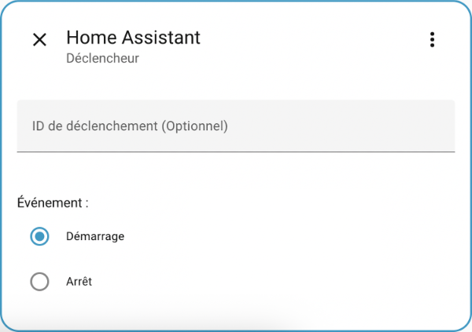

### Travailler avec plusieurs déclencheurs

Vous pouvez ajouter plusieurs déclencheurs. L'action sera exécutée si l'un OU l'autre des déclencheurs est activé, par exemple si la porte est ouverte OU si un mouvement est détecté.

## Conditions : Et si

Il est possible d'ajouter une ou plusieurs conditions en plus du ou des déclencheurs.

Une condition est très semblable à un déclencheur. Cependant, la condition n'est évaluée qu'une fois que l'automatisation a été déclenchée.

Lorsqu'il y a une condition, l'action sera exécutée si un des déclencheurs est évalué à true ET si la condition est évaluée à true.

Par défaut, s'il y a plusieurs conditions, l'action sera exécutée si un des déclencheurs est évalué à true ET si TOUTES les conditions sont évaluées à true.

   (déclencheur1 OU déclencheur2) ET condition1 ET condition2

Dans le cas où il y a des conditions de type OU :

    (déclencheur1 OU déclencheur2) ET (condition1 OU condition2)

Ceci est expliqué avec d'autres mots dans la documentation de Home Assistant[1](https://www.home-assistant.io/docs/automation/trigger) :

> When any of the automation�?Ts triggers becomes true (trigger fires), Home Assistant will validate the conditions, if any, and call the action.

Remarquez que si vous désirez qu'une automatisation ne puisse avoir lieu que certains jours de la semaine, il faut choisir Heure et lieu.

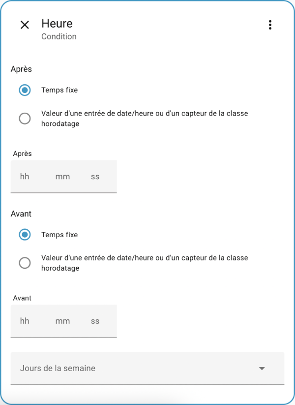 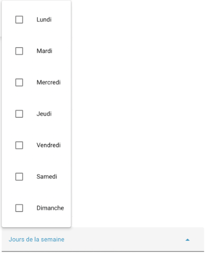

Nous n'ajouterons pas de condition dans cet exemple.

## Actions : Alors faire

Il est maintenant temps de spécifier l'action ou les actions à exécuter par l'automatisation.

Notez qu'il pourrait y avoir plus d'une façon de configurer une même action.

Dans notre exemple, nous allons choisir le type d'action Appareil puisque nous désirons modifier l'état de la prise intelligente qui contrôle la lumière.

Choisissez ensuite quel appareil doit être activé dans la liste déroulante puis l'action qui sera exécutée sur cet appareil (ici : Activer).

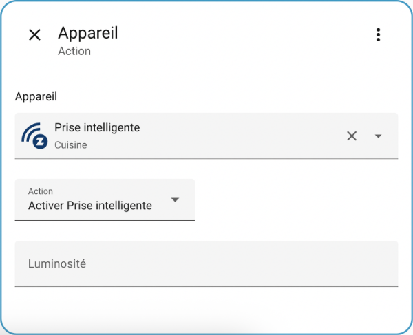

Cliquez sur Enregistrer puis donnez un nom significatif à votre automatisation, par exemple « Allumer lumière quand mouvement détecté ».

Passez la main devant le détecteur de mouvements et constatez que la lumière s'allume automatiquement!

## Code YAML

Une fois l'automatisation sauvegardée, vous verrez qu'elle a été enregistrée au format YAML dans le fichier automations.yaml, qui est d'ailleurs importé dans configuration.yaml.

Fichier automations.yaml

- id: '1666115015224'  
  alias: Allumer lumière quand mouvement détecté  
  description: ''  
  trigger:  
  - platform: state  
    entity\_id:  
    - binary\_sensor.5\_in\_1\_pir\_motion\_sensor\_motion\_detection  
    from: 'off'  
    to: 'on'  
  condition: []  
  action:  
  - type: turn\_on  
    device\_id: f138a74f3ea6ca3212b26d1e92b8cb10  
    entity\_id: light.dimmable\_smart\_plug  
    domain: light  
  mode: single

## Source

1. « Automation Trigger ». Home Assistant. <https://www.home-assistant.io/docs/automation/trigger>

## Pour plus d'information

« Automating Home Assistant ». Home Assistant. <https://www.home-assistant.io/getting-started/automation/>

« Automation Trigger ». Home Assistant. <https://www.home-assistant.io/docs/automation/trigger/>

« Automation conditions ». Home Assistant. <https://www.home-assistant.io/docs/scripts/conditions/>

« Automation actions ». Home Assistant. <https://www.home-assistant.io/docs/automation/action/>


Il est intéressant d'ajouter [apical\_lien\_interne][creer\_un\_tableau\_de\_bord\_personnalise,un bouton,bouton][/apical\_lien\_interne] au tableau de bord pour tester une automatisation. �? ce moment, un clic sur le bouton s'ajoutera aux déclencheurs de l'automatisation.

Il est possible de configurer le bouton pour tenir compte ou non des conditions de l'automatisation.

Pour y arriver :

* [apical\_lien\_interne][creer\_un\_tableau\_de\_bord\_personnalise,�?ditez le tableau de bord][/apical\_lien\_interne] et choisissez dans quelle section vous désirez ajouter la carte. Pour ma part, j'aime bien regrouper les boutons de mes automatisations dans une section nommée Automatisations.
* Ajoutez une carte de type bouton.
* Pour ce qu'on veut faire ici, il est inutile de choisir une entité au début de la carte. S'il y en a une qui apparaît par défaut, cliquez sur le X pour la supprimer.
* Si désiré, indiquez quel nom doit apparaître sur la carte.
* Si désiré, choisissez une icône.
* Cliquez sur Interactions.
* Dans la zone Comportement lors d'un appui court, sélectionnez Exécuter une action.
* Dans la case Action, choississez automation: Déclencher (Automation: Trigger).
* Cliquez ensuite sur Choisir une entité et sélectionnez l'automatisation désirée.
* Si vous désirez que le bouton lance l'automatisation même si les conditions de l'automatisation ne sont pas respectées, activez l'option Aucune condition.

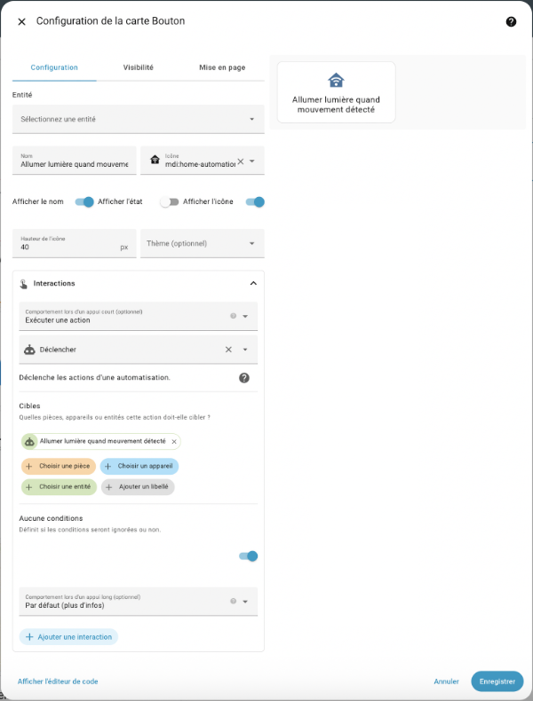

Voici ce que ceci donnera en YAML :

YAML

show\_name: true  
show\_icon: true  
type: button  
name: Allumer lumière quand mouvement détecté  
icon: mdi:home-automation  
tap\_action:  
  action: perform-action  
  perform\_action: automation.trigger  
  target:  
    entity\_id: automation.allumer\_lumiere\_quand\_mouvement\_detecte  
  data:  
    skip\_condition: true  
icon\_height: 40px

## 161 — 4.3 Les capteurs virtuels dans les automatisations

## Capteur virtuel comme déclencheur

La beauté avec les automatisations, c'est que lorsqu'il y a plusieurs déclencheurs, Home Assistant exécutera l'action si l'un OU l'autre est activé.

Il est donc possible de créer l'automatisation avec comme déclencheur le capteur réel puis d'ajouter le capteur virtuel comme second déclencheur. Ceci permettra de tester l'automatisation sans avoir à attendre que le capteur réel change d'état.

Le déclenchement à l'aide d'un capteur virtuel est réalisé à l'aide de la même technique que pour un capteur réel : il faut choisir le type Entité puis �?tat (ou état numérique selon le besoin).

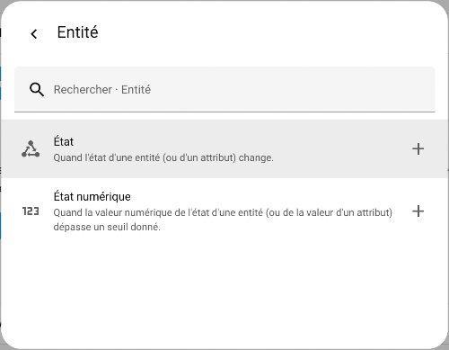

Vous aurez ensuite la possibilité de choisir le capteur virtuel puis, si requis, le changement d'état qui doit déclencher l'automatisation (De et �?).

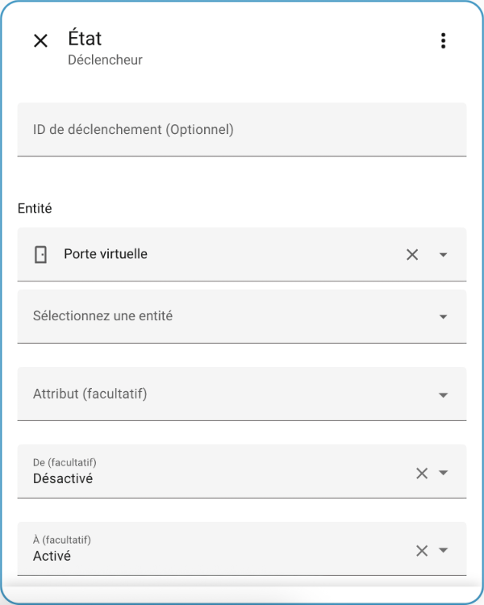


L'état d'un capteur virtuel peut également être modifié à partir d'une automatisation.

Pour se faire, il faut utiliser le type d'action Entrées puis choisir le type d'entrée, par exemple Entrée logique. Home Assistant vous proposera ensuite les actions possibles selon le type d'entrée sélectionné.

Dans la zone Cibles, cliquez sur Choisissez une entité et vous aurez la possibilité de sélectionner le capteur virtuel.

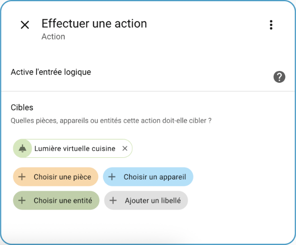

## 162 — 4.4 Script vs automatisation

Sous Home Assistant, un script consiste en une série d'actions à exécuter.

Un script pourrait, par exemple, gérer l'éclairage par rapport à la télévision : allumer la lumière du salon, allumer le téléviseur puis, après 5 minutes, éteindre la lumière du salon.

Les occupants auront donc eu le temps de profiter de la clarté pour s'installer devant le téléviseur avant que la lumière ne s'éteigne afin de ne pas gêner la vision.

## Script vs automatisation

Une automatisation, pour sa part, est un processus plus ou moins complexe qui comprend :

* un ou plusieurs déclencheurs;
* optionnellement une ou plusieurs conditions;
* une ou plusieurs actions.

On pourra avoir par exemple une automatisation qui allume la lumière quand Annie arrive à la maison entre 16h et 22h :

* déclencheur : Annie arrive à la maison
* condition : entre 16h et 22h
* action : allumer la lumière

Une automatisation pourrait même utiliser un script comme action :

* déclencheur : Mouvement détecté dans le salon
* condition : après le coucher du soleil
* action : exécuter le script qui gère l'éclairage par rapport à la télévision

## Création d'un script à l'aide de l'éditeur graphique

Comme pour les automatisations, les scripts peuvent être écrits à l'aide d'un éditeur graphique ou directement en YAML.

Pour accéder à l'éditeur graphique, rendez-vous dans Paramètres / Automatisations et scènes / Onglet Scripts / Créer un script / Créer un nouveau script.

Vous pouvez maintenant déterminer les actions à réaliser ainsi que les blocs qui permettent, par exemple, d'attendre un certain temps, de répéter un certain nombre de fois, etc.

Il faut ajouter une séquence (ou un bloc) pour chaque action à réaliser.

Dans cet exemple, j'ai travaillé avec des virtuels.

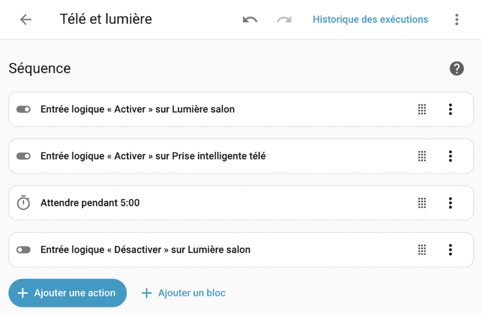

## Création d'un script à l'aide de YAML

Si vous préférez travailler directement en YAML, vos scripts seront créés à l'aide de l'intégration [Scripts](https://www.home-assistant.io/integrations/script/).

Ils doivent répondre à la [syntaxe de Script](https://www.home-assistant.io/docs/scripts) de Home Assistant.

Leur code sera écrit dans le fichier scripts.yaml.

Voici un exemple de script :

Fichier scripts.yaml

tele\_et\_lumiere:  
  sequence:  
  - action: input\_boolean.turn\_on  
    metadata: {}  
    data: {}  
    target:  
    entity\_id: input\_boolean.lumiere\_salon  
  - action: input\_boolean.turn\_on  
    metadata: {}  
    target:  
    entity\_id: input\_boolean.prise\_intelligente\_tele  
  - delay:  
    hours: 0  
    minutes: 5  
    seconds: 0  
    milliseconds: 0  
  - action: input\_boolean.turn\_off  
    metadata: {}  
    data: {}  
    target:  
    entity\_id: input\_boolean.lumiere\_salon  
  alias: Télé et lumière  
  description: ''


Contrairement à l'automatisation, le script ne peut pas être déclenché automatiquement.

Une fois l'action lancée, sa séquence peut comporter l'attente d'un déclencheur mais il faut d'abord que le script ait été lancé.

Pour lancer un script, vous avez plusieurs options, notamment :

* �? l'aide du menu Paramètres / Automatisations et scènes / onglet Scripts / clic sur les trois points verticaux à droite du script désiré / Exécuter.
* En utilisant le script comme action dans une automatisation (Autres actions / Script / Exécuter).
* Sur le tableau de bord, à l'aide d'une [apical\_lien\_interne][lancer\_une\_automatisation\_a\_l\_aide\_d\_un\_bouton,carte de type bouton][/apical\_lien\_interne] qui effectue l'action de lancer le script.

## 163 — 4.5 Trace d'une automatisation

Quand une automatisation est exécutée, Home Assistant conserve une trace de ce qui s'est passé.

Pour voir cette trace, rendez-vous dans Paramètres / Automatisations et scènes puis cliquez sur l'automatisation désirée.

Cliquez sur Historique des exécutions pour voir la trace de la dernière exécution de l'automatisation.

Home Assistant vous affiche alors ce qui a été exécuté.

Vous pouvez cliquer sur les différents cercles pour obtenir de l'information sur chacun.

Dans cet exemple, on voit que l'action n'a pas eu lieu puisque le moment où le déclencheur a eu lieu (17h13) ne respectait pas la condition (entre 18h et 22h).

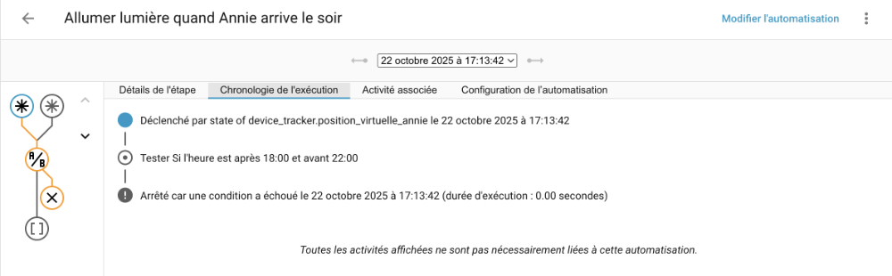

Les différents onglets montrent d'autres détails, à vous de les explorer.

## Pour plus d'information

« Troubleshooting Automations ». Home Assistant. <https://www.home-assistant.io/docs/automation/troubleshooting/>

