# Chapitres 31–40

<!-- --- split --- -->

# 28. Pour le prochain cours


Vous disposez d'un cours pour acquérir les connaissances théoriques et finaliser cet exercice.

Une fois cet exercice complété, vous devez effectuer vos lectures pour l'exercice suivant.

<!-- --- split --- -->


## 29.1 En résumé...

Voici un résumé des informations essentielles du ou des prochains chapitres.

Notez que certaines fiches, qui font partie intégrante du cours, pourraient ne pas figurer dans ce résumé.

Je vous recommande d'effectuer une lecture de l'ensemble des fiches de ces chapitres afin de bien saisir les enjeux.

## [apical\_lien\_interne]telecharger\_des\_plugins\_sur\_le\_market[/apical\_lien\_interne]

Trois étapes pour les plugins :

* Télécharger à partir de Plugins / Gestion des plugins / Market.
* Activer le plugin.
* Parfois, il faut créer un nouvel équipement, par exemple Météo Victoriaville.

## [apical\_lien\_interne]le\_centre\_de\_messages\_de\_jeedom[/apical\_lien\_interne]

Carré orange : message

Carré rouge : mise à jour

Cliquer sur le carré pour plus d'informations.

## [apical\_lien\_interne]travailler\_avec\_le\_plugin\_virtuel[/apical\_lien\_interne]

Le plugin Virtuel permet de simuler un capteur ou un récepteur. Très utile pour tester des scénarios.

## [apical\_lien\_interne]creer\_un\_scenario\_provoque[/apical\_lien\_interne]

 Les scénarios permettent d'automatiser des comportements, par exemple ouvrir la lumière de la cuisine quand la porte s'ouvre.

Un scénario provoqué survient lorsqu'une action survient. Dans cet exemple, c'est lorsque la porte s'ouvre.

## [apical\_lien\_interne]creer\_un\_scenario\_programme[/apical\_lien\_interne]

Un scénario programmé survient à un moment donné, par exemple le 29 août 2025 à 10h00, à tous les samedis à 9h00, etc.


Il est possible qu'un scénario envoie un courriel.


Jeedom Market est l'endroit par excellence pour trouver des plugins intéressants.

La plupart sont gratuits mais certains sont payants, à petit prix.

Le fonctionnement de base est toujours le même :

* Accédez à l'[apical\_lien\_interne][installation\_de\_jeedom\_et\_premier\_acces,interface d'administration de Jeedom,acceder][/apical\_lien\_interne].
* Rendez-vous dans le menu Plugins / Gestion des plugins.

  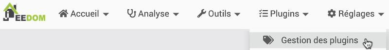
* Cliquez sur l'icône Market. Note : si vous n'aviez pas créé de compte Market lors de votre premier accès à Jeedom, vous devez vous créer un compte Market et le configurer dans Jeedom. Les instructions sont données sur cette fiche : « [apical\_lien\_interne]brancher\_un\_jeedom\_existant\_sur\_un\_nouveau\_compte\_market[/apical\_lien\_interne] ».  

  
* Dans la fenêtre Market, naviguez parmi les top et nouveautés ou sélectionnez une catégorie. Vous pouvez également entrez un mot-clé pour vous aider à trouver le plugin désiré.
* 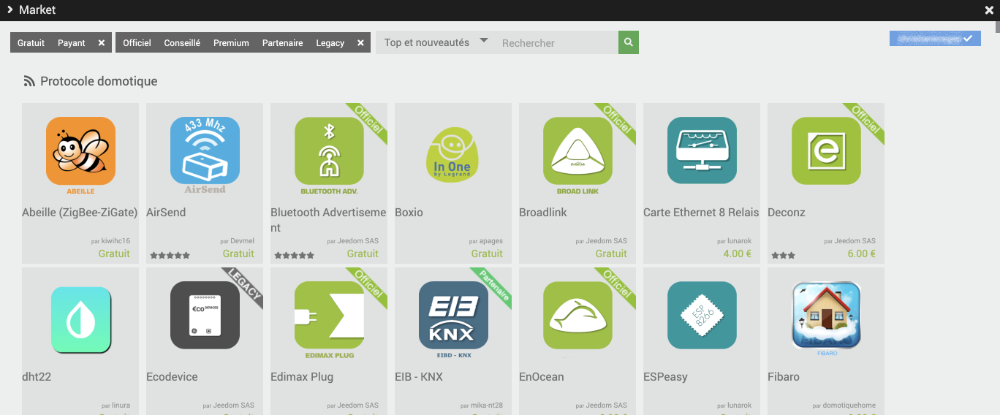
* Quand vous avez trouvé le plugin qui vous intéresse, cliquez sur son icône puis effectuez l'installation stable.

  
* Une fois l'installation complétée, acceptez de vous rendre sur la page de configuration du plugin. Vous pourrez retourner à la page de configuration plus tard à l'aide du menu Plugins / Gestion des plugins puis en cliquant sur l'icône Z-Wave.
* Le plugin devra être activé. Vérifiez les autres paramètres dans cette fenêtre de configuration, certains plugins demandent des actions précises.

  
* Une fois le plugin activé et correctement configuré, vous aurez probablement une nouvelle option de menu sous Plugins.

  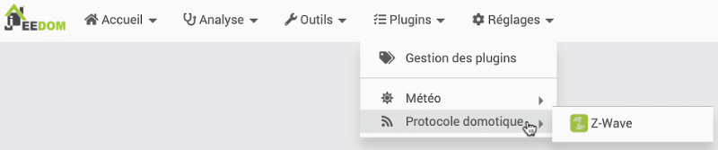
* Certains plugins, par exemple [apical\_lien\_interne][configurer\_la\_cle\_usb\_z-wave\_sur\_jeedom,la clé Z-Wave][/apical\_lien\_interne] que vous trouverez sous le menu Protocole domotique ou encore [apical\_lien\_interne][travailler\_avec\_la\_meteo\_sous\_jeedom,le plugin Weather][/apical\_lien\_interne] que vous trouverez sous le menu Météo, vous demandent de créer un nouvel équipement.

  C'est dans cet équipement que des informations supplémentaires devront être entrées ou que des actions devront être posées, par exemple effectuer le pairage avec des objets connectés Z-Wave ou préciser la ville pour laquelle la météo doit être donnée.


Sur Jeedom Market, vous avez droit à deux boîtes domotiques.

Si vous en branchez une troisième, un accès au menu Plugins / Gestion des plugins / Market vous affichera le message « Code : 0  
Message : Vous avez un trop grand nombre de systeme jeedom déclaré, veuillez en réduire le nombre en allant sur votre page profils du market et en supprimant des jeedoms, n'oubliez pas de sauvegarder ».

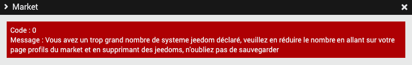

Si, comme moi, vous installez parfois des boîtes Jeedom vierges afin d'y faire des tests, vous pourrez facilement régler le problème en supprimant les boîtes Jeedom inutiles.

Comprenez-moi bien : cette manipulation supprime le lien entre la boîte Jeedom et le compte Market. La boîte demeurera fonctionnelle mais vous ne pourrez plus y ajouter de plugins à partir du Market tant qu'il n'y aura pas [apical\_lien\_interne][brancher\_un\_jeedom\_existant\_sur\_un\_nouveau\_compte\_market,un nouveau compte Market associé à la boîte][/apical\_lien\_interne].

* Rendez-vous sur le site Web de Jeedom Market : [https://market.jeedom.com](https://market.jeedom.com/).
* Cliquez sur Se connecter puis entrez vos informations d'authentification.
* Cliquez sur votre nom puis sélectionnez Profil.
* Choisissez l'onglet Mes boxs.
* Vous obtenez la liste des boîtes Jeedom qui utilisent ce compte Market. Vous pouvez supprimer les boîtes inutiles en cliquant sur le - à droite des boîtes concernées.

  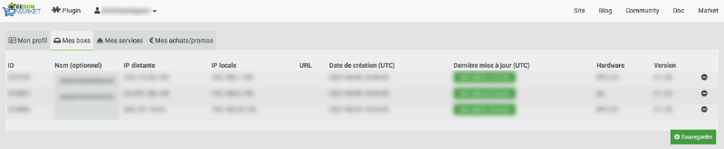
* N'oubliez pas de cliquer sur Sauvegarder.


Si Jeedom Market vous empêche d'installer de nouveaux plugins, c'est peut-être parce que vous avez atteint votre limite quand au nombre de boîtes Jeedom.

La première chose à vérifier, c'est le nombre de boîtes Jeedom effectivement associées à ce compte Jeedom Market et de [apical\_lien\_interne][supprimer\_les\_boites\_jeedom\_inutiles\_dans\_market,supprimer les boîtes inutiles][/apical\_lien\_interne].

Dans le cas où vous désirez conserver toutes les boîtes existantes, il vous reste l'option de vous créer un nouveau compte Jeedom puis d'asocier votre boîte Jeedom excédentaire sur ce compte.

* Rendez-vous sur le site Web de Jeedom Market : [https://market.jeedom.com](https://market.jeedom.com/).
* Cliquez sur S'enregistrer et créez-vous un compte.
* Dans votre interface Web Jeedom, rendez-vous dans le menu Réglages / Système / Configuration.
* Cliquez sur l'onglet Mises à jour/Market.

  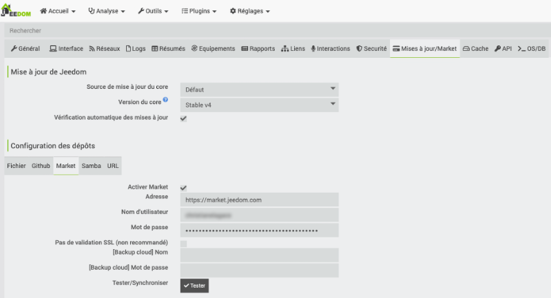
* Dans la zone Configuration des dépôts, onglet Market, vous pouvez entrer les informations de votre nouveau compte Market : nom d'utilisateur et mot de passe.
* Cliquez ensuite sur Sauvegarder dans le coin supérieur droit de la fenêtre.

<!-- --- split --- -->


## 30.1 Le centre de messages de Jeedom

Pendant que vous travaillez avec Jeedom, vous avez peut-être remarqué dans le coin supérieur droit de l'écran de petits carrés de couleur avec un chiffre blanc au centre.

Il s'agit de notifications qui vous informe sur :

* Carré orange : nombre de messages dans le centre de messages
* Carré rouge : nombre de [apical\_lien\_interne][le\_centre\_de\_mise\_a\_jour\_de\_jeedom,mises à jour à installer][/apical\_lien\_interne]

Un clic sur le carré orange mène vers le centre de messages.

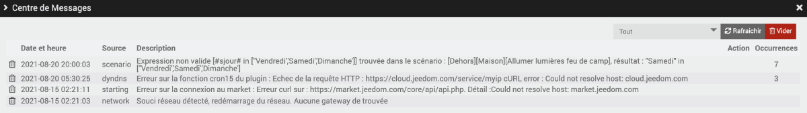

C'est à cet endroit que Jeedom vous informe de :

* anomalies rencontrées
* autres informations que Jeedom désire porter à votre attention

Il est important de consulter les messages sur une base régulière afin de régler ces problèmes.


Une fois que vous avez pris connaissance des messages, vous pouvez cliquer sur Vider pour faire disparaître le carré orange qui indique le nombre de messages présents.

Ainsi, à chaque fois que vous verrez un carré orange apparaître, vous saurez que Jeedom veut porter quelque chose à votre attention.

## 30.2 Le centre de mise à jour de Jeedom

À chaque fois qu'une mise à jour est disponible, que ce soit pour le coeur de Jeedom ou pour un des plugins que vous avez installés, un carré rouge apparaît dans le haut de l'écran.

Un clic sur ce carré affiche l'état du coeur Jeedom de même que la liste des plugins installés avec, pour chacun, une indication si une mise à jour est nécessaire.

Cet écran peut également être atteint par le menu Réglages / Système / Centre de mise à jour.

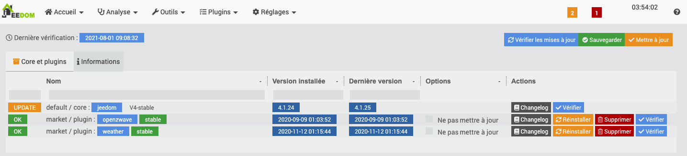

## Avant d'effectuer une mise à jour

C'est une bonne idée de cliquer sur le bouton Changelog afin de prendre connaissance des modifications apportées par chacune des mise à jour.

Vous pourrez ainsi décider si la mise à jour doit être effectuée immédiatement (ex : correction d'une faille de sécurité) ou non (ex : ajustement esthétique, nouvelle fonctionnalité non essentielle pour l'instant).

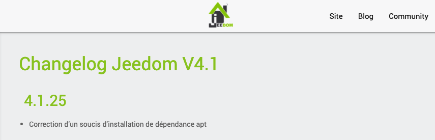

## Effectuer une mise à jour

Il est possible d'effectuer toutes les mises à jour en cliquant sur le bouton Mise à jour dans le haut de l'écran.

Vous pouvez exclure certaines mises à jour en cochant Ne pas mettre à jour vis-à-vis des lignes concernées.

## Mise à jour à partir du Terminal

Parfois, le centre de mise à jour de Jeedom ne proposera pas la toute dernière version de Jeedom. J'ai vu ceci notamment lorsque la version 4.2 est sortie. Impossible de passer à cette version à partir de l'interface graphique de mon Jeedom.

Il est possible d'effectuer une mise à jour à partir du Terminal de Raspberry Pi OS à l'aide des commandes suivantes.

Important : vous devez d'abord [apical\_lien\_interne][copie\_de\_securite\_de\_la\_carte\_micro\_sd\_du\_raspberry\_pi,effectuer une sauvegarde de la carte micro SD du Raspberry Pi][/apical\_lien\_interne] afin de pouvoir revenir en arrière si jamais un problème survenait.

Terminal

sudo apt update  
sudo apt upgrade  
sudo php /var/www/html/install/update.php

Il est ensuite nécessaire de redonner les droits sur le dossier Jeedom.

Terminal

sudo chown -R www-data:www-data /var/www/html

## Pour plus d'information

« Centre de Mise à jour - Mise à jour en ligne de commande ». Jeedom. [https://doc.jeedom.com/fr\_FR/core/4.1/update](https://doc.jeedom.com/fr_FR/core/4.1/update#Mise%20%C3%A0%20jour%20en%20ligne%20de%20commande)

<!-- --- split --- -->


## 31.1 Travailler avec le plugin Virtuel

Le plugin Virtuel permet de simuler un objet connecté.

Très pratique notamment pour faire des tests de scénarios (peut simuler la détection d'un téléphone sans avoir à entrer et à sortir de la maison).

Il peut également être utilisé pour créer un équipement virtuel qui, quand on l'allume ou l'éteint, allume ou éteint une série d'équipements réels.

## Installation du plugin

Pour installer le plugin Virtuel, rendez-vous dans Plugins / Gestion des plugins / Market.

Dans la zone de recherche, entrez ***virtuel***.

Cliquez sur le plugin Virtuel - officiel par Jeedom SAS.

Note : si le plugin n'est pas disponible, c'est peut-être parce que vous devez [apical\_lien\_interne][le\_centre\_de\_mise\_a\_jour\_de\_jeedom,mettre à jour votre système][/apical\_lien\_interne].

## Configuration du plugin

Dans l'interface de Jeedom, rendez-vous dans le menu Plugins / Gestion des plugins / Virtuel.

Activez le plugin en cliquant sur le bouton Activer dans la zone État.


Je vais vous montrer ici comment créer une porte virtuelle qui peut être dans l'état Ouverte ou Fermée.

Rendez-vous dans le menu Plugins / Programmation / Virtuel puis cliquez sur Ajouter.

Donnez un nom significatif à l'équipement (ex : Porte virtuelle).

Activez l'équipement et rendez-le visible car vous voudrez changer son état à partir du Dashboard.

Cliquez sur l'onglet Commandes puis cliquez sur le bouton Ajouter une action virtuelle.

Il faut une action virtuelle pour simuler chacune des valeurs que l'équipement virtuel peut prendre.

Dans le cas de la porte virtuelle, on peut avoir l'état Ouverte et l'état Fermée.

Créez une première action virtuelle avec ces informations :

* Nom : Ouvrir
* Type : action
* Dans la colonne Valeur, Nom information : État
* Dans la colonne Valeur, Valeur : 1

Cliquez sur Sauvegarder.

Vous remarquerez que Jeedom a ajouté une commande dont le nom est État.

Créez une deuxième action virtuelle avec ces informations :

* Nom : Fermer
* Type : action
* Dans la colonne Valeur, Nom information : État
* Dans la colonne Valeur, Valeur : 0

Cliquez sur Sauvegarder.

Puisque dans ce cas, l'équipement virtuel ne peut avoir que deux états, modifiez la ligne État pour que le type doit une information binaire.

Si vous comptez améliorer l'apparence de la tuile [apical\_lien\_interne][widget\_pour\_ajuster\_l\_apparence\_d\_une\_tuile,à l'aide des widgets][/apical\_lien\_interne], vous pouvez enlever le crochet devant Afficher sur cette ligne. Sinon, conservez le crochet.

Une fois ces manipulations terminées, vous obtiendrez ceci :

Sur le Dashboard, vous pouvez maintenant voir une tuile pour votre équipement virtuel.

Il est possible de cliquer sur les boutons pour modifier l'état.

Notez que l'information État avec l'icône ne sera présente que si vous avez coché Afficher vis-à-vis la commande État.

## Pour plus d'information

« Jeedom tuto #5 | Les virtuels (plugin virtuel) | Utilisation ». YouTube - DomoTech. <https://www.youtube.com/watch?v=wiMh8rmfdKU>

« Créer ses commandes avec le plugin Virtuel et Jeedom ». Jeedomiser. <https://jeedomiser.fr/article/creer-ses-propres-commandes-avec-le-plugin-virtuel/>


Il est possible d'utiliser un périphérique virtuel pour stocker et pour modifier la valeur d'une variable. Cette valeur pourra être utilisée ailleurs, par exemple dans un scénario.

Je vous montre ici comment configurer un périphérique virtuel qui pourra manuellement incrémenter ou décrémenter sa propre valeur.

* Rendez-vous dans le menu Plugins / Programmation / Virtuel.
* Cliquez sur le + pour ajouter un équipement.
* Nommez l'équipement Mon équipement (ou autre nom selon le contexte).
* Rattachez-le à l'objet de votre choix pour pouvoir le voir dans le Dashboard. Ici, j'ai choisi de l'associer à l'objet Partout.
* Assurez-vous qu'il soit actif et visible.
* Cliquez sur l'onglet Commandes.
* Cliquez sur Ajouter une action virtuelle.
* Nom de la commande : Incrémenter.
* Nom information : nommez la variable que vous désirez contrôler. Ici, j'ai choisi de l'appeler Ma variable.
* Cliquez immédiatement sur Sauvegarder. Jeedom en profitera pour créer la commande de type info nommée Ma variable.
* Revenez à l'action virtuelle. Sous le nom de l'information, entrez sa valeur. Il s'agit d'une chaîne au format #[Objet][Equipement][Nom information]# + 1. Dans le cas présent, ce sera #[Partout][Mon équipement][Ma variable]# + 1.
* Créez une seconde action virtuelle qui permettra cette fois de décrémenter la variable.
* Pour que les informations apparaissent correctement sur la tuile dans le Dashboard, faites glisser la commande de type info sous les deux autres.

Sur le Dashboard, il est désormais possible d'incrémenter et de décrémenter la variable.

<!-- --- split --- -->


## 32.1 Créer un scénario provoqué

Sous Jeedom, les scénarios permettent d'automatiser des comportements, par exemple ouvrir la lumière de la cuisine quand la porte s'ouvre.

Vous devez d'abord [apical\_lien\_interne][ajouter\_un\_appareil\_connecte\_z-wave\_a\_jeedom,ajouter vos appareils connectés][/apical\_lien\_interne] à Jeedom et idéalement les [apical\_lien\_interne][objets\_pour\_representer\_la\_maison,associer aux objets qui représentent les pièces de votre maison][/apical\_lien\_interne].


Lançons-nous maintenant dans un scénario qui fera allumer la lumière lorsque la porte s'ouvre.

Pour ajouter un scénario :

* Rendez-vous dans le menu Outils / Scénarios puis cliquez sur Ajouter.

  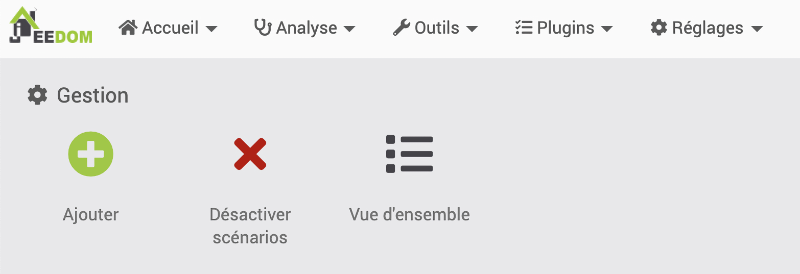
* Donnez un nom au scénario, par exemple « Porte ouverte allume lumière ». Vous verrez alors l'écran de configuration du scénario.

  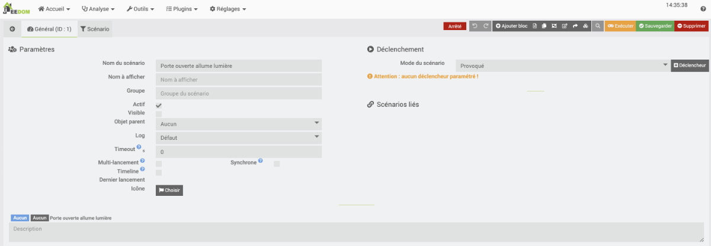
* Vous pouvez regrouper les scénarios afin de mieux vous y retrouver.

  Certains aiment les regrouper par fonctionnalité (ex : Lumières, Chauffage), d'autres par pièce (ex : Cuisine, Salon) ou encore par appareil (ex : Store, Porte). À vous de décider.

  Si le regroupement ne vous intéresse pas pour l'instant, je vous suggère de mettre tous vos scénario dans un groupe nommé « Maison ».
* L'information la plus importante dans cet écran, c'est le mode du scénario. C'est là que vous indiquez ce qui va le déclencher.
  + Il peut être provoqué, par exemple par l'ouverture d'une porte.
  + Il peut être [apical\_lien\_interne][creer\_un\_scenario\_programme,programmé][/apical\_lien\_interne], par exemple tous les jours à 8h00.
  + Il peut également être une combinaison des deux, par exemple allumer les lumières dès qu'une présence est détectée (provoqué) OU lorsqu'il est 21h00 (programmé).

    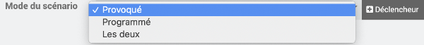

    Dans le scénario que nous bâtissons, nous allons choisir Provoqué puisque c'est l'ouverture de la porte qui sera le déclencheur.
* Un scénario peut être provoqué par un équipement ou encore par un événement.

  Les événements sont [représentés par des mots-clés](https://doc.jeedom.com/fr_FR/core/4.1/scenario#Les%20d%C3%A9clencheurs), par exemple :

  + #start# pour le démarrage de Jeedom
  + #begin\_backup# pour le début d'une sauvegarde
  + #begin\_update# pour le début d'une mise à jour
  + #user\_connect# lorsqu'un usager se connecte à Jeedom
  + etc.
* Pour un scénario déclenché par un événement, vous devez cliquez sur le bouton +Déclencheur puis entrer le mot-clé correspondant dans la case Evénement. Mais ce n'est pas le déclencheur qui nous intéresse dans le cas présent donc passez à l'étape suivante.
* Pour un scénario déclenché par un équipement (c'est ce que nous voulons ici), vous devez cliquez sur le bouton +Déclencheur puis sur l'icône Choisir une commande.

  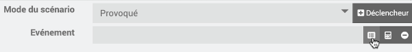

  Dans la fenêtre qui apparaît, sélectionnez l'objet auquel le détecteur d'ouverture de porte est associé. Vous pourrez ensuite sélectionner le détecteur puis la commande qui déclenchera l'action. Dans notre cas, ce sera son état.

  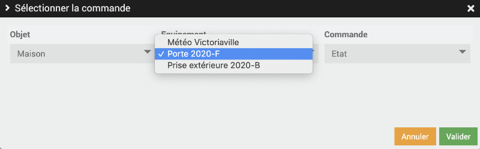

  Vous verrez apparaître une chaîne composée de l'objet, de l'équipement puis de la commande :

  #[Maison][Porte 2020-F][Etat]#
* Si vous laissez le déclencheur comme cela, le scénario sera déclenché dès que l'état change.

  Il est également possible de déclencher le scénario seulement lorsque l'équipement a une valeur précise.

  Il faut à ce moment compléter le déclencheur à la main. Pour que le scénario se déclenche seulement lorsque la porte est ouverte :

  #[Maison][Porte 2020-F][Etat]# == 1
* Pour indiquer ce que le scénario fera, vous devez cliquer sur l'onglet Ajouter bloc dans le haut de l'écran.
* Plusieurs types de blocs sont disponibles, par exemple Si/Alors/Sinon, Action, Boucle, Dans, etc. Ici, nous allons choisir Action.
* Au bas de la ligne Action, cliquez sur Ajouter puis choisissez Action.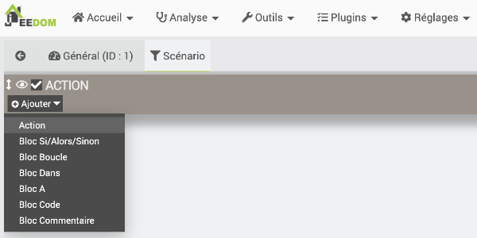
* Cliquez sur l'icône Sélectionner la commande.

  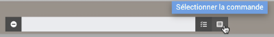
* Indiquez quel équipement sera affecté et quelle commande sera effectuée dessus.

  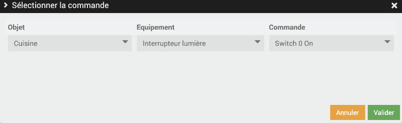

  Vous verrez alors la chaîne qui indique ce qui se passera, dans mon cas :

  #[Cuisine][Interrupteur lumière][Switch 0 On]#
* Si vous désirez que la lumière demeure allumée, votre scénario est complet.

  Par contre, si vous désirez, par exemple, qu'elle s'éteigne après 1 minute, cliquez à nouveau sur Ajouter au bas de la ligne Action puis choisissez Bloc Dans.
* Ce bloc attend une durée en minutes. Entrez 1.
* Ajoutez une action puis indiquez que la lumière doit être fermée : #[Cuisine][Interrupteur lumière][Switch 0 Off]#.
* Cliquez finalement sur Sauvegarder.

## Tester le scénario

Pour tester le scénario, il est possible de cliquer sur le bouton Exécuter.

Si vous désirez avoir plus d'informations sur ce qui se passe pendant l'exécution, vous pouvez appuyer sur Ctrl+Exécuter sous Windows ou ⌘ Cmd+Exécuter sous Mac.

Ceci enregistrera le scénario, l'exécutera puis affichera le log.

Dans cet impression d'écran, on voit que le scénario a été lancé manuellement, que la condition a été évaluée à Faux (la porte n'était pas ouverte) et que rien d'autre ne s'est produit puisque la condition n'était pas respectée.

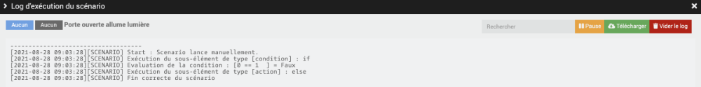

## Modifier un scénario existant

Pour modifier un scénario, suivez ces étapes :

* Rendez-vous dans Outils / Scénarios.
* Sélectionnez le scénario à modifier.
* Vous obtiendrez le même écran que lors de la création du scénario. Vous pouvez y modifier les informations de base dans l'écran qui apparaît : Nom du scénario, mode, déclencheur, etc.
* Pour modifier les détails du scénario, cliquez sur l'onglet Scénario dans le haut de l'écran.
* Vous obtiendrez le même écran que vous avez ajouté un bloc. Vous pouvez y modifier les conditions et actions à exécuter.

## Scénario sous forme de texte

Si vous le désirez, vous pouvez voir votre scénario sous forme de texte en cliquant sur l'icône Édition Texte.

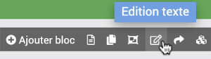

Voici le détail du scénario que nous venons de créer.

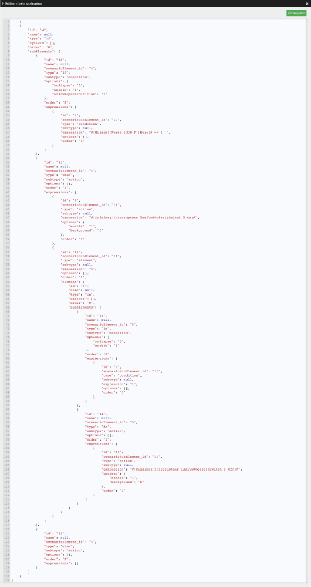

## Pour plus d'information

« Scénarios ». Jeedom. <https://doc.jeedom.com/fr_FR/core/4.0/scenario>

« Concevez vos scénarios avec Jeedom ». Jeedomiser. <https://jeedomiser.fr/article/les-scenarios-dans-jeedom/>


Les scénarios Jeedom peuvent être provoqués, par exemple ouvrir la lumière de la cuisine quand la porte s'ouvre, ou encore programmés, par exemple démarrer la cafetière à tous les jours à 6h15.

Je vais vous guider ici dans la création d'un scénario programmé.

Le fonctionnement des scénarios programmés est semblable à celui des [apical\_lien\_interne][creer\_un\_scenario\_provoque,scénarios provoqués][/apical\_lien\_interne]. Seul le déclencheur diffère.

Pour créer un scénario programmé, suivez ces étapes :

* Vous devez d'abord [apical\_lien\_interne][ajouter\_un\_appareil\_connecte\_z-wave\_a\_jeedom,ajouter vos appareils connectés][/apical\_lien\_interne] à Jeedom.
* Rendez-vous dans le menu Outils / Scénarios puis cliquez sur Ajouter.

  
* Donnez un nom au scénario, par exemple « Démarrage cafetière ». Vous verrez alors l'écran de configuration du scénario.

  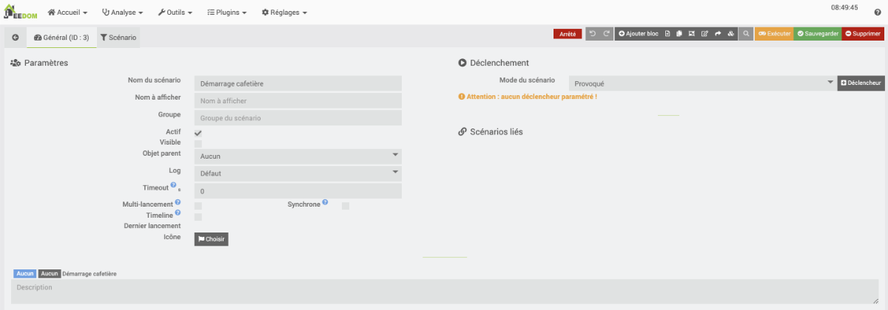
* La case Groupe vous permet de [apical\_lien\_interne][creer\_un\_scenario\_provoque,regrouper les scénarios selon vos préférences,regrouper][/apical\_lien\_interne].
* Dans la zone Mode du scénario, choisissez Programmé.
* Pour entrer les détails de la programmation, cliquez sur +Programmation.
* Le moment où le scénario doit être lancé utilise la syntaxe de la [crontab](https://www.domo-blog.fr/editer-la-crontab-du-raspberry/). Vous pouvez cliquer sur le point d'interrogation à droite de la boîte de saisie Programmation pour lancer l'assistant cron.

  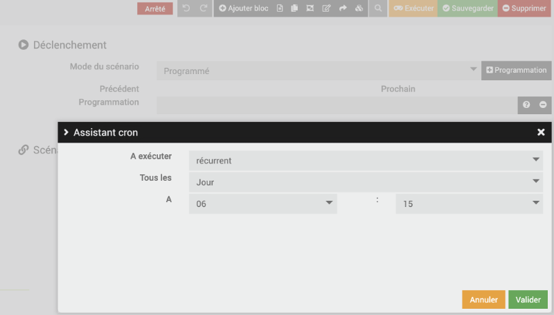

  Il est également possible d'entrer les informations directement dans la boîte de saisie.

  Il s'agit d'une chaîne de 5 blocs séparés par un espace.

  Les blocs sont dans l'ordre :

  + Minutes
  + Heure
  + Jour du mois
  + Numéro du mois
  + Jour de la semaine (lundi = 1)

  Les blocs non utilisés doivent être représentés par un astérisque.

  Par exemple :

  + Pour démarrer à tous les jours à 20h30, entrez 30 20 \* \* \*
  + Pour démarrer à tous les mercredis à 8h15, entrez 15 8 \* \* 3
  + Pour démarrer le 8 de chaque mois à 10h00, entez 0 10 8 \* \*
  + Pour démarrer à chaque année le 31 décembre à 23h59, entrez 59 23 31 12 \*
* Pour permettre de choisir les jours de la semaine où la cafetière doit démarrer automatiquement, cliquez sur + Ajouter un bloc dans le haut de l'écran puis choisissez Si/Alors/Sinon.

  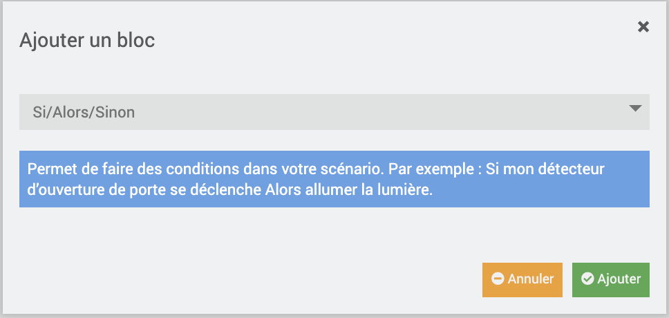
* Dans la zone Si, vous devez entrer une condition. Vous pouvez utiliser des [tags](https://jeedomiser.fr/article/les-scenarios-dans-jeedom/#Les_tags_crees_par_defaut) pour identifier la date (#date#), le jour de la semaine (#sjour#), le nom du mois (#smois#), etc.

  Pour éviter que l'action ne soit réalisée les samedis et dimanches, entrez #sjour# not in ['Samedi', 'Dimanche']
* Maintenant, vous devez entrer l'action à réaliser. Sous ALORS, cliquez sur + Ajouter et choisissez Action.

  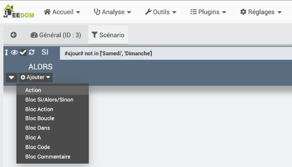
* À l'aide des bouton qui ouvrent des assistants ou en entrant directement les information, remplissez les zones pour que :
  + l'équipement
  + de la prise de votre cafetière
  + soit activé.  

    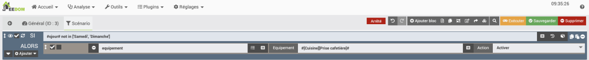

Et voilà, la prise sera activée tous les jours de semaine à 6h15!

## Pour plus d'information

« Les scénarios Jeedom : La notion de temps ». domo-blog. <https://www.domo-blog.fr/scenarios-jeedom-domotique-notion-temps/>

« crontab guru ». Cronitor. <https://crontab.guru/>

## 32.3 Scénario avec plusieurs déclencheurs ou programmations

Il est possible de créer un scénario qui pourra se déclencher dans différents contextes.

Par exemple un scénario pourrait allumer la cafetière lorsqu'il est 6h00 ou lorsqu'un mouvement est détecté dans la cuisine.

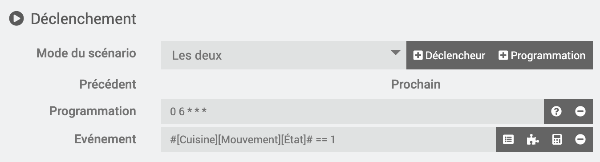

Un autre scénario pourrait envoyer un courriel lorsqu'Axelle entre à la maison ou lorsque Justin entre à la maison.

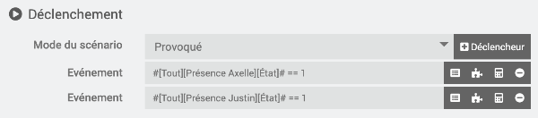

Pour y arriver, il suffit de cliquer plusieurs fois sur +Déclencheur ou sur +Programmation.

Ce qu'il faut comprendre, c'est que lorsqu'il y a plusieurs déclencheurs ou programmations, le scénario sera lancé lorsque l'un OU l'autre des contextes survient.


L'utilisation de plusieurs déclencheurs est très différente de l'utilisation d'un seul déclencheur suivi d'un bloc Si/Alors/Sinon.

Dans ce cas, pour que l'action survienne, il faut que le déclencheur survienne ET que la condition du SI soit vraie au moment où le scénario est lancé.

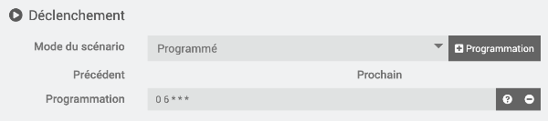

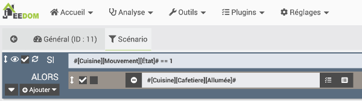

Dans le scénario ci-haut, la cafetière sera allumée s'il est 6h00 ET qu'il y a du mouvement dans la cuisine. Donc, si vous restez au lit trop longtemps, vous n'aurez pas de café puisqu'aucun mouvement ne sera détecté au moment où le scénario est déclenché :-(

## 32.4 Tags dans un scénario

Que le scénario soit programmé, provoqué ou les deux, il est possible d'utiliser un bloc Si/Alors/Sinon afin d'ajouter une condition pour que l'action ait lieu.

Cette condition peut être spécifiée à l'aide d'un équipement, par exemple quand Annie est à la maison ou quand la nuit est tombée.

Elle peut également être basée sur des tags pour identifier différents moments.

Parmi les tags existants, notons[1](https://doc.jeedom.com/fr_FR/core/4.2/scenario#Les%20tags) :

* `#seconde#` : Seconde courante (sans les zéros initiaux, ex : 6 pour 08:07:06).
* `#hour#` : Heure courante au format 24h (sans les zéros initiaux). Ex : 8 pour 08:07:06 ou 17 pour 17:15.
* `#minute#` : Minute courante (sans les zéros initiaux). Ex : 7 pour 08:07:06.
* `#day#` : Jour courant (sans les zéros initiaux). Ex : 6 pour 06/07/2017.
* `#month#` : Mois courant (sans les zéros initiaux). Ex : 7 pour 06/07/2017.
* `#year#` : Année courante.
* `#time#` : Heure et minute courantes. Ex : 1715 pour 17h15.
* `#date#` : Jour et mois. Attention, le premier nombre est le mois. Ex : 1215 pour le 15 décembre.
* `#sday#` : Nom du jour de la semaine. Ex : Samedi.
* `#nday#` : Numéro du jour de 0 (dimanche) à 6 (samedi).
* `#smonth#` : Nom du mois. Ex : Janvier.

Les tags doivent être entrés à la main. Vous devrez également ajouter le code qui complète la condition.

Par exemple :

* Pour éviter que l'action ne soit réalisée les samedis et dimanches, entrez #sjour# not in ['Samedi', 'Dimanche']
* Pour que l'action ne se déroule qu'entre 12h00 et 13h00 (bornes incluses), entrez #hour# >= 12 && #hour# <= 13
* Pour que l'action ne se déroule qu'avant 8h30, entrez #time# < 830
* Pour que l'action se déroule en janvier ou en mars, entrez #month# == 1 || #month# == 3

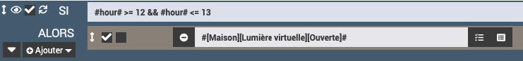

## Source

1. « Scénarios - Les tags ». Jeedom. <https://doc.jeedom.com/fr_FR/core/4.2/scenario#Les%20tags>

## Pour plus d'information

« Les Fonctions PHP dans les scénarios de la domotique Jeedom - les tags ». YouDom. <https://youdom.net/fonctions-php-scenario-jeedom/#3-les-tags>

« Les scénarios Jeedom : La notion de temps ». Guides Jeedom. <https://www.domo-blog.fr/scenarios-jeedom-domotique-notion-temps/>


Si vous avez [apical\_lien\_interne][travailler\_avec\_la\_meteo\_sous\_jeedom,configuré le plugin météo dans Jeedom][/apical\_lien\_interne], il est possible d'utiliser les prévisions météorologiques dans vos scénarios.

Petit détail pas très intuitif : quand vous sélectionnez la météo comme événement déclencheur ou comme condition, la section Commande info vous présente différentes conditions météo telles que Vitesse du vent, Température, Humidité, etc.

Certaines de ces conditions sont suivies de +1, +2, +3 ou +4. Il s'agit des prévisions pour dans 1 jour, dans 2 jours, etc.


Les variables dans Jeedom offrent beaucoup de souplesse pour contrôler les objets connectés de notre système domotique.

On pourrait, par exemple, conserver dans une variable la plus haute température enregistrée dans la journée par un capteur placé dans la cuisine. À 19h, si cette valeur est supérieure à 25, la barrière qui donne accès aux friandises congelées sera débarrée automatiquement. Pas mal, non?

Pour créer une variable, rendez-vous dans le menu Outils / Variables.

Donnez un nom à votre variable, une valeur par défaut si nécessaire puis cliquez sur le crochet vert à la droite de la ligne.

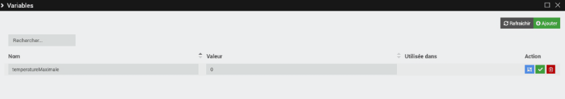

Pour utiliser cette variable, créez un nouveau scénario.

Il est possible d'utiliser la variable dans le déclencheur, par exemple pour déclencher le scénario lorsque la température est supérieure à celle qui est présentement dans la variable.

Voici ce que le déclencheur devrait contenir : #[Cuisine][Capteur 5-en-1][Température]# > #variable(temperatureMaximale)#

Notez que le mot variable doit demeurer tel quel. Seul le nom de la variable sera adapté selon vos besoins.

Pour travailler avec une variable dans l'action du scénario, on pourra ajouter un bloc de type Code.

Dans ce bloc, une variable peut être lue à l'aide de :

Bloc de code du scénario (PHP)

$qqch = $scenario->getData('nomvariable');

et elle peut être modifiée à l'aide de :

Bloc de code du scénario (PHP)

$scenario->setdata('nomvariable', valeur);

Et voici le code qui permettra d'enregistrer la température dans la variable :

Bloc de code du scénario (PHP)

$cmdinfo = "#[Cuisine][Capteur 5-en-1][Température]#";  
$temperature = cmd::byString($cmdinfo)->execCmd();  
$scenario->setdata('temperatureMaximale', $temperature);

## 32.7 Scénario qui s'éternise

En temps normal, un scénario s'exécute en peu de temps.

Le scénario passera donc rapidement du statut En cours :

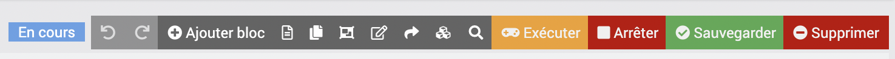

Au statut Arrêté :

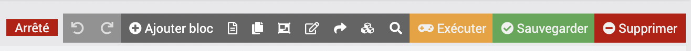

Bien sûr, le scénario sera plus long à exécuter dans certaines circonstances, par exemple lorsqu'il y a une attente prévue avec un bloc Dans.

## Comportement erratique

Si jamais le comportement de vos scénarios semble erratique, vérifiez si un des scénario est toujours en cours d'exécution.

Un exemple de ce qui peut causer ce comportement : le scénario tente d'envoyer un courriel mais le serveur SMTP n'est pas disponible.

Autre exemple : le scénario comporte une boucle infinie.

Tant que le scénario est en cours d'exécution, il ne peut pas être relancé, ni avec le déclencheur, ni en cliquant sur Exécuter.


Quand un scénario demeure en cours d'exéction sur une longue période, vous pouvez cliquer sur Arrêter pour y mettre fin.

Note : il est parfois normal que le scénario demeure en cours d'éxécution longtemps. Ce sera le cas, par exemple [apical\_lien\_interne][la\_base\_des\_scripts\_avec\_rpi\_gpio,s'il fait clignoter une DEL branchée au GPIO,clignoter][/apical\_lien\_interne].

Il est alors possible [apical\_lien\_interne][arreter\_correctement\_un\_scenario\_avec\_boucle\_infinie,d'arrêter le scénario à l'aide d'un autre scénario,scenario][/apical\_lien\_interne].


Quand un scénario ne donne pas les résultats escomptés, vous avez à votre disposition différentes techniques de débogage pour mettre le doigt sur ce qui ne va pas.

Pour certaines des techniques que je vous présente ici, vous avez déjà en main tout ce qu'il y a à savoir.

Pour d'autres, vous pouvez consulter les liens pour apprendre comment faire.

* Lancer le scénario manuellement en cliquant sur le bouton Exécuter plutôt que d'utiliser le déclencheur. Ceci permet de vérifier si c'est le déclencheur qui cause problème.
* Lancer le scénario puis aller voir ce qu'il y a dans le log du scénario en cliquant sur l'icône Log.

  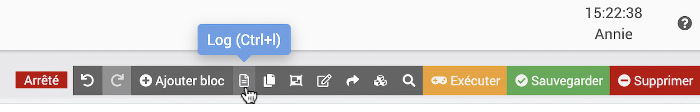

  + Si le log est vide, c'est que le scénario n'a jamais été déclenché.
  + S'il a été déclenché (manuellement ou avec le déclencheur), le log indiquera si une condition a été évaluée à vrai ou à faux.
  + Il indiquera également chaque bloc réalisé.

    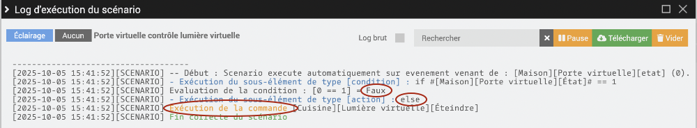
* [apical\_lien\_interne][scenario\_qui\_ajoute\_une\_entree\_dans\_le\_fichier\_journal,Écrire vos propres informations de débogage dans le log du scénario][/apical\_lien\_interne].
* Vérifier si le scénario n'est pas [apical\_lien\_interne][scenario\_qui\_s\_eternise,pris dans une opération qui prend beaucoup de temps ou dans une boucle sans fin][/apical\_lien\_interne].
* Dans le cas où [apical\_lien\_interne][lancer\_un\_script\_python\_avec\_le\_plugin\_script,le scénario lance un script Python][/apical\_lien\_interne] :
  + Tester d'abord le script Python dans une fenêtre Terminal.
  + Quand on sait qu'il fonctionne, tester le fonctionnement de la commande qui lance le script en cliquant sur le bouton Tester dans l'onglet Commandes du plugin Script.

    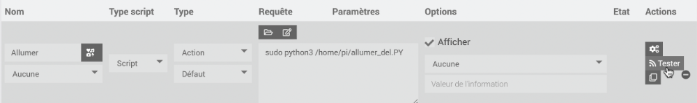
  + Ce n'est qu'une fois ces deux étapes réalisées qu'on est prêts à déboguer le scénario en tant que tel.

<!-- --- split --- -->


## 33.1 Créer une adresse de courriel avec votre nom de domaine

La plupart des hébergeurs offrent gratuitement la gestion d'adresses de courriel qui se terminent par votre nom de domaine (ex : info@mondomaine.com). Selon votre forfait d'hébergement, vous pourrez créer une ou plusieurs adresses de courriel.

Ces courriels sont intéressants puisqu'ils donnent de la crédibilité à votre site Web ou à votre entreprise.

De plus, ils pourront être utilisés pour envoyer des courriels par programmation si votre fournisseur de courriel habituel (ex : GMail) ne le permet pas.

## Registraire vs hébergeur

Si vous avez réservé votre nom de domaine chez un registraire différent de votre hébergeur, c'est tout de même l'hébergeur qui vous offrira les courriels gratuits.

Dans mon cas, j'ai un nom de domaine dont le registraire est GoDaddy. Mais puisque je l'ai configuré pour qu'il utilise les serveurs de noms de mon hébergeur ([A2 Hosting](http://www.a2hosting.com/?aid=612cfb5127102&cid=edae5de3)), c'est chez A2 Hosting que je créerai mes comptes de courriel.

## Créer un compte de courriel avec cPanel

Voici les instructions pour créer un compte de courriel chez un hébergeur qui offre l'interface de getion cPanel.

* D'abord, assurez-vous que votre nom de domaine utilise les serveurs de noms de votre hébergeur (chez GoDaddy : DNS /  Serveurs de noms / Modifier / Personnalisé. Les serveurs de noms débuteront souvent par ns1, ns2, etc.
* Connectez-vous à votre cPanel chez votre hébergeur.
* Rendez-vous dans la section EMAIL puis cliquez sur Email Accounts.

  
* Choisissez l'onglet Add Email Account.
* Entrez le nom du compte désiré, le nom de domaine et choisissez un mot de passe sécuritaire.

  

Note : votre hébergeur vous permet peut-être d'héberger des sites avec différents noms de domaine. Si c'est votre cas et que vous désirez créer un courriel pour un domaine qui n'est pas encore associé à votre compte, vous devrez d'abord associer ce domaine à votre compte. Rendez-vous dans l'option Addon Domains puis entrez le nom de domaine dans la case New Domain Name. Les autres cases seront remplies automatiquement.

## Interface Web de courriel chez votre hébergeur

L'accès à vos courriels peut être fait à partir du cPanel, dans l'option Email Accounts / onglet Email Accounts / lien Access WebMail.

Vous obtiendrez le même écran à l'aide d'un URL au format mondomaine.com/webmail. Vous devrez vous connecter avec votre adresse de courriel et le mot de passe choisi lors de la création du compte de courriel.

La première fois que vous accédez à Webmail, vous devrez [choisir l'application cliente](https://documentation.cpanel.net/display/CKB/Which+Webmail+Application+Should+I+Choose) qui sera utilisée par défaut : Horde, rouncube ou SquirrelMail.

Je vous suggère d'utiliser Horde puisqu'au moment d'écrire ces lignes, c'était la seule application qui offre une interface mobile.

## Rassembler tous vous courriels au même endroit

Afin d'avoir accès à tous vous courriels à partir du même endroit, deux options s'offrent à vous :

* Rediriger votre nouveau courriel vers un courriel existant

  ou
* Ajouter votre nouveau courriel dans votre outil de gestion de courriels.

### Redirection de courriel

Si vous décidez de rediriger votre nouvelle adresse de courriel vers une autre, tous les messages envoyés à la nouvelle adresse apparaîtront dans la boîte de réception de l'autre courriel.

Cette technique présente deux limites :

* Il y a un délai entre le moment où le courriel est reçu dans la nouvelle adresse de courriel et celui où il est effectivement transféré à l'autre adresse. Ce délai peut être de quelques secondes mais également de quelques minutes.
* Dans la boîte de réception de l'autre courriel, il ne sera pas possible de différencier les courriels provenant de l'une ou de l'autre adresse de courriel.

Notez qu'après la redirection, vos courriels seront quand même disponibles dans l'interface Web de courriel du courriel original (à partir d'un URL au format mondomaine.com/webmail).

Pour rediriger votre courriel :

* Dans le cPanel, section EMAIL, cliquez sur Forwarders.
* Cliquez sur le bouton Add Forwarder.
* Entrez l'adresse de courriel qui doit être redirigée.
* Dans la zone Forward to Email Address, entrez l'adresse de courriel qui recevra les messages.


Pour intégrer votre nouveau courriel à votre outil de gestion de courriels préféré, rendez-vous dans le cPanel / Email Accounts et cliquez sur Connect Devices à côté de l'adresse de courriel désirée.

Vous trouverez à cet endroit les informations pour intégrer votre nouvelle adresse à votre outil de courriel préféré, notamment le serveur entrant, le serveur sortant et les ports à utiliser.

## 33.2 Tester la connexion SMTP avec Telnet

Plusieurs facteurs peuvent faire en sorte qu'un site Web ne réussisse pas à envoyer un courriel.

Le principal acteur dans l'envoi de courriel est le serveur SMTP (Simple Mail Transfer Protocol). En testant la communication avec le serveur SMTP à la ligne de commande, nous éliminons tous les problèmes potentiels dus à la programmation du site Web, ce qui facilite le travail de débogage.

## Installation de Telnet

Telnet (terminal network ou telecommunication network, ou encore teletype network)[1](https://fr.wikipedia.org/wiki/Telnet) est un protocole de communication. C'est également un outil en ligne de commande pour tester l'envoi de courriel.

Pour installer Telnet sous Windows, rendez-vous dans Panneau de configuration / Programmes et fonctionnalités / Activer ou désactiver des fonctionnalités Windows / puis cochez Client Telnet.

Pour installer Telnet sous Mac, vous avez besoin de Homebrew.

Si Homebrew n'est pas déjà installé :

Terminal

/usr/bin/ruby -e "$(curl -fsSL https://raw.githubusercontent.com/Homebrew/install/master/install)"

Pour installer Telnet :

Terminal

brew install telnet

## Connexion au serveur SMTP

Pour vous connecter au serveur d'envoi de courriel, suivez ces instructions. Elles sont les mêmes sous Windows et sous Mac.

* D'abord, vous devez avoir en main les informations sur votre compte de courriel. Chez l'hébergeur où vous avez configuré votre adresse de courriel, rendez-vous dans le cPanel puis cliquez sur Email Accounts.
* Vis-à-vis l'adresse de courriel que vous désirez tester, cliquez sur Connect Devices.
* Dans la page qui apparaît, les informations dont vous aurez besoin sont dans la section Mail Client Manual Settings.

  
* Ouvrez une fenêtre de commande.
* Entrez la commande telnet suivie du nom du serveur SMTP (Information que vous trouverez sous Outgoing Server, généralement sous la forme smtp.mondomaine.com ou mail.mondomaine.com) et du numéro de port.

  Notez que le port utilisé sera généralement l'un des suivants :

  + 25 : connexion entre serveurs ou connexion client-serveur non sécurisée
  + 465 : connexion entre client et serveur nécessitant une authentification, à utiliser si 587 ne fonctionne pas
  + 587 : connexion entre client et serveur nécessitant une authentification, généralement ceci est le meilleur choix

  Ex :

  Terrminal

  telnet  *mail.mondomaine.com* 587

  ou

  Terminal

  telnet

   

  open *mail.mondomaine.com* 587

  Si la commande fonctionne, vous devriez obtenir une réponse débutant par 220 suivi du nom de domaine puis de la version du protocole SMTP. La sortie exacte pourra être différente selon le fournisseur.

  Résultat à l'écran

  MBPdeMonNom:~ monnom$ telnet mail.mondomaine.com 587  
  Trying 999.999.999.999...  
  Connected to mail.mondomaine.  
  Escape character is '^]'.  
  220-az1-ss23.fournisseur.com ESMTP Exim 4.93 #2 Mon, 02 Nov 2020 11:17:39 -0700   
  220-We do not authorize the use of this system to transport unsolicited,   
  220 and/or bulk e-mail.
* Remarquez le message « We do not authorize the use of this system to transport unsolicited, and/or bulk e-mail. ». Il ne fait que vous avertir que vous n'êtes pas autorisés à envoyer du courriel non sollicité ni du courriel en lot.
* Lancez la communication entre le client Telnet et le serveur SMTP à l'aide de la commande EHLO suivie de localhost.

  Note : la commande HELO existe également mais certains protocoles SMTP ne la reconnaissent pas.

  Remarquez que les commandes dans la console Telnet sont montrées ici en majuscules mais qu'elles fonctionneront également si vous les entrez en minuscules.

  Console Telnet

  EHLO localhost

  Le serveur SMTP répondra en donnant un code 250 suivi d'une liste des commandes qu'il supporte. Ces commandes pourront être différentes selon le serveur SMTP que vous tentez de joindre.

  Résultat à l'écran

  EHLO localhost  
  250-az1-ss23.fournisseur.com Hello localhost [999.999.999.999]  
  250-SIZE 52428800  
  250-8BITMIME  
  250-PIPELINING  
  250-AUTH PLAIN LOGIN  
  250-STARTTLS  
  250 HELP

## Code et mot de passe du compte de courriel

Attention : l'utilisation de Telnet ouvre un trou de sécurité puisque les informations transigent en clair sur le réseau.   
  
Si vous avez réussi à obtenir une réponse du serveur SMTP avec la liste des commandes 250, vous pouvez arrêter ici, aucun risque n'a été encouru à date.  
  
Si vous souhaitez poursuivre jusqu'à l'envoi d'un courriel réel, vous pouvez poursuivre mais sachez que vos informations d'authenficiation, même si elles sont encodées avec base64 (algorithme qui peut être décrypté), seront transmises en clair.

Si vous utilisez un serveur sécurisé, l'envoi d'un courriel débutera par le code d'usager et le mot de passe du compte de courriel à partir duquel l'envoi doit se faire.

Le code d'usager sera l'adresse de courriel complète, par exemple info@mondomaine.com.

Vous devrez crypter votre code d'usager et votre mot de passe en base64. Ceci peut être réalisé avec un outil en ligne, par exemple [https://www.base64encode.org](https://www.base64encode.org/).

Console Telnet

AUTH LOGIN

 

code-en-base64

 

mdp-en-base64

Il est possible que le serveur affiche un numéro de ligne et une série de caractères après chaque entrée.

Si les informations sont bonnes, le serveur répondra Authentication succeeded.

Résultat à l'écran

AUTH LOGIN  
334 VXNlcm5hbWU6  
bm8tcmVwbHlAbW9uZG9tYWluZS5jb20=  
334 UGFzc3dvcmQ6  
bW90ZGVwYXNzZWRlbW9uY29tcHRl  
235 Authentication succeeded

## FROM et TO

Il faut maintenant spécifier les adresses de courriel qui apparaîtront dans les zones From (De) et To (À).

Le From sera souvent la même adresse que le compte utilisé pour l'envoi mais ceci n'est pas une obligation. Notez cependant que certains serveurs refusent que l'adresse de la clause FROM provienne d'un nom de domaine différent.

Console Telnet

MAIL FROM:annie.gagnon@mondomaine.com

 

RCPT TO:toto.lacasse@hotmail.com

 

DATA

telnet vous indiquera après chaque ligne si tout est correct.

Message à l'écran

MAIL FROM:annie.gagnon@mondomaine.com  
250 OK  
RCPT TO:toto.lacasse@hotmail.com  
250 Accepted  
DATA  
354 Enter message, ending with "." on a line by itself

## Corps du message

Si l'étape précédente a fonctionné, vous êtes maintenant prêt à entrer le message en tant que tel. La fin du message sera notée par un point seul sur sa ligne.

Console Telnet

Subject: message test

 

Ceci est un message test envoyé via telnet.

 

.

Vous pouvez finalement refermer la connexion en entrant la commande QUIT :

Console Telnet

QUIT

Consultez le courriel de destination : si les configurations ont été bien entrées, le message devrait y être.

Notez que le courriel pourrait avoir été placé dans la boîte de courriels indésirables. Vérifiez bien!

## En résumé

Voici la liste des commandes à utiliser pour tester l'envoi de courriel. Je vous suggère de les copier dans un document texte en y insérant les vraies informations à utiliser.

De cette façon, il sera plus facile d'effectuer vos tests.

Terminal

telnet monserveursmtp.com 587

 

EHLO localhost

 

AUTH LOGIN

 

code-en-base64

 

mdp-en-base64

 

MAIL FROM:annie.gagnon@mondomaine.com

 

RCPT TO:toto.lacasse@hotmail.com

 

DATA

 

Subject: message test

 

Ceci est un message test envoyé via telnet.

 

.

 

QUIT

## Pour plus d'information

« Email - How to verify your SMTP connection and parameters (TSL/SSL) with TELNET ? ». DataCadamia. <https://datacadamia.com/marketing/email/smtp_telnet>

« SMTP Commands Reference ». SamLogic Software. <https://www.samlogic.net/articles/smtp-commands-reference.htm>

« Simple Mail Transfer Protocol ». Wikipédia. <http://fr.wikipedia.org/wiki/Simple_Mail_Transfer_Protocol>

## Source

1. « Telnet ». Wikipédia. <https://fr.wikipedia.org/wiki/Telnet>

## 33.3 Envoyer un courriel avec Jeedom

Il est possible de demander à Jeedom de vous envoyer une notification par courriel lorsqu'un événement se produit.

Pour y arriver, vous devez installer le plugin gratuit E-mail - officiel par Jeedom SAS.

Une fois le plugin installé, vous devrez l'activer : Plugins / Gestion des plugins / cliquer sur Mail.

Dans la zone État, cliquez sur Activer.

## Configuration du plugin

Pour configurer le plugin, rendez-vous dans Plugins / Communication / Mail.

Cliquez sur le + pour ajouter un équipement (en fait, c'est un élément de configuration que vous ajouterez).

Donnez un nom de votre choix à l'équipement, par exemple « Courriel administrateur ».

Vous devez ensuite remplir le formulaire pour indiquer avec quel serveur, de la part de qui et vers qui le courriel sera expédié.

Je vous conseille de [apical\_lien\_interne][creer\_une\_adresse\_de\_courriel\_avec\_votre\_nom\_de\_domaine,travailler avec une adresse de courriel qui utilise un nom de domaine qui vous appartient][/apical\_lien\_interne], par exemple jeedom@mondomaine.com. Ceci assurera que le serveur SMTP acceptera d'envoyer le courriel à partir d'une application tierce.

Il faut ensuite indiquer à qui le courriel sera envoyé.

Pour y arriver, cliquez sur l'onglet Commandes.

Vous pouvez entrer autant d'adresses que désiré.

## Utilisation du courriel dans un scénario

Une fois le courriel bien configuré, il est possible de l'utiliser dans un scénario.

Il apparaîtra parmi les équipements.

Une fois sélectionné, Jeedom vous permettra de spécifier le titre du courriel ainsi que le message à envoyer.

## Pour plus d'information

« Plugin Mail ». Jeedom. <https://doc.jeedom.com/fr_FR/plugins/communication/mail/>

<!-- --- split --- -->




Dans tous vous scénario, prenez l'habitude d'utiliser les différentes [apical\_lien\_interne][comment\_deboguer\_un\_scenario,techniques de débogage][/apical\_lien\_interne] à votre disposition.

1. [apical\_lien\_interne][travailler\_avec\_le\_plugin\_virtuel,Ajoutez une porte virtuelle][/apical\_lien\_interne] à votre système (c'est un capteur virtuel).
2. Ajoutez une lumière virtuelle (le processus d'ajout est le même mais il sera utilisé comme un récepteur virtuel).
3. [apical\_lien\_interne][creer\_une\_adresse\_de\_courriel\_avec\_votre\_nom\_de\_domaine,Créez une adresse de courriel][/apical\_lien\_interne] au format jeedom@mondomaine.com (si vous ne possédez plus de nom de domaine, entendez-vous avec un confrère de classe pour avoir votre courriel avec son nom de domaine) puis [apical\_lien\_interne][envoyer\_un\_courriel\_avec\_jeedom,configurez Jeedom pour pouvoir utiliser cette adresse][/apical\_lien\_interne].
4. Dans Jeedom, [apical\_lien\_interne][creer\_un\_scenario\_provoque,créez un scénario provoqué][/apical\_lien\_interne] dans lequel le capteur de votre choix agit sur le récepteur de votre choix. Vous pouvez travailler avec du réel ou avec du virtuel à votre choix.
5. Faites ce qu'il faut pour faire déclencher le scénario. Allez ensuite consulter le log du scénario (icône Log dans le haut de l'écran). Vous devez voir que l'action que vous avez configurée est bien exécutée (ligne débutant par « Exécution de la commande »).
6. Modifiez votre scénario afin que, en plus d'agir sur le récepteur, le capteur vous envoie un courriel. Notez qu'il est possible qu'avec le réseau sans fil utilisé dans le cours, il ne soit pas possible d'envoyer du courriel. Il faut à ce moment utiliser le réseau câblé.
7. Faites une impression d'écran de l'écran où on voit le déclencheur du scénario. Faites une autre impression d'écran, cette fois pour montrer les détails du scénario avec des blocs Action qui affichent des lignes du genre #[Cuisine][Interrupteur lumière][Switch 0 On]#. Les impressions d'écrans doivent montrer clairement le nom de la boîte Jeedom qui apparaît dans le coin supérieur droit de l'écran. Nommez vos fichiers au format nomprenom-capteurrecepteur-1.png et nomprenom-capteurrecepteur-2.png.
8. Créez un second scénario dans lequel vous recevrez un courriel [apical\_lien\_interne][creer\_un\_scenario\_provoque,quand Jeedom démarre,evenement][/apical\_lien\_interne].
9. OPTIONNEL : profitez-en pour que lors du démarrage, [apical\_lien\_interne][retrouver\_l\_adresse\_ip\_du\_pi\_a\_l\_aide\_de\_jeedom,le courriel vous donne l'adresse IP du Pi][/apical\_lien\_interne].
10. Faites deux impressions d'écran de ce scénario afin de montrer le déclencheur et les détails. Les impressions d'écran doivent montrer clairement le nom de la boîte Jeedom. Nommez vos fichiers au format nomprenom-courrieldemarrage-1.png et nomprenom-courrieldemarrage-2.png.
11. Créez un troisième scénario qui effectue une action de votre choix (ex : allumer la lumière, envoyer un courriel) le mardi à 20h (ou à un autre moment de votre choix) à condition que la température extérieure soit inférieure à 1o Celcius (ou autre événement météo de votre choix).
12. Faites deux impressions d'écran de ce scénario afin de montrer le déclencheur et les détails. Les impressions d'écran doivent montrer clairement le nom de la boîte Jeedom. Nommez vos fichiers au format nomprenom-scenarioprogramme-1.png et nomprenom-scenarioprogramme-2.png.
13. OPTIONNEL : Créez un scénario de votre choix qui utilise « les deux » comme déclencheur, par exemple activer la prise intelligente du ventilateur dès que la porte s'ouvre (provoqué) de même qu'à tous les dimanches à 8h00 (programmé).
14. Déposez vos impressions d'écran sur la plateforme électronique du cours.
15. Afin d'accumuler des données en provenance de votre capteur, laissez Jeedom fonctionner sans arrêt pendant 1 journée ou 2. Il doit fonctionner de nuit afin qu'il effectue certaines tâches que nous allons étudier sous peu, par exemple la sauvegarde et l'archivage des données d'historique.

<!-- --- split --- -->

# 35. Pour le prochain cours (deux cours)


Vous disposez de deux cours pour acquérir les connaissances théoriques et finaliser cet exercice.

Une fois cet exercice complété, vous devez effectuer vos lectures pour l'exercice suivant.

<!-- --- split --- -->


<!-- --- split --- -->


## 36.1 En résumé...

Voici un résumé des informations essentielles du ou des prochains chapitres.

Notez que certaines fiches, qui font partie intégrante du cours, pourraient ne pas figurer dans ce résumé.

Je vous recommande d'effectuer une lecture de l'ensemble des fiches de ces chapitres afin de bien saisir les enjeux.

## [apical\_lien\_interne]retrouver\_le\_mot\_de\_passe\_de\_la\_base\_de\_donnees\_jeedom[/apical\_lien\_interne]

Rendez-vous dans le menu Réglages / Système / Configuration / >\_ OS/DB.

Tel qu'indiqué au bas de l'écran, le code d'usager MySQL est jeedom. Le mot de passe apparaît à sa droite.

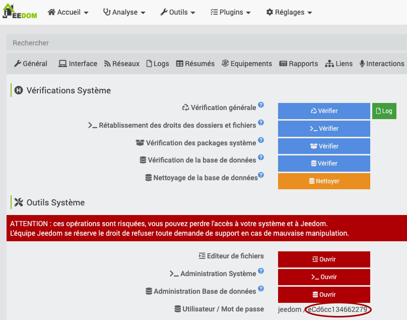

## [apical\_lien\_interne]contenu\_de\_la\_base\_de\_donnees\_de\_jeedom[/apical\_lien\_interne]

Jeedom utilise une BD MySQL que vous pouvez manipuler dans dans la console MySQL.

Terminal du Raspberry Pi

mysql -u jeedom -p

Pour connaître les tables qu'elle contient :

MySQL

USE jeedom;  
SHOW TABLES;

Résultat à l'écran

MariaDB [jeedom]> SHOW TABLES;  
+--------------------+  
| Tables\_in\_jeedom   |  
+--------------------+  
| cache              |  
| cmd                |  
| config             |  
| cron               |  
| dataStore          |  
| eqLogic            |  
| event              |  
| history            |  
| historyArch        |  
| interactDef        |  
| interactQuery      |  
| listener           |  
| message            |  
| note               |  
| object             |  
| plan               |  
| plan3d             |  
| plan3dHeader       |  
| planHeader         |  
| scenario           |  
| scenarioElement    |  
| scenarioExpression |  
| scenarioSubElement |  
| timeline           |  
| update             |  
| user               |  
| view               |  
| viewData           |  
| viewZone           |  
| widgets            |  
+--------------------+  
30 rows in set (0.002 sec)

 

MariaDB [jeedom]>

Il est également possible de consulter la base de données directement dans Jeedom :

* Réglages / Système / Configuration
* Dans l'onglet \_OS/DB, vis-à-vis Administration Base de données, cliquez sur Ouvrir.

  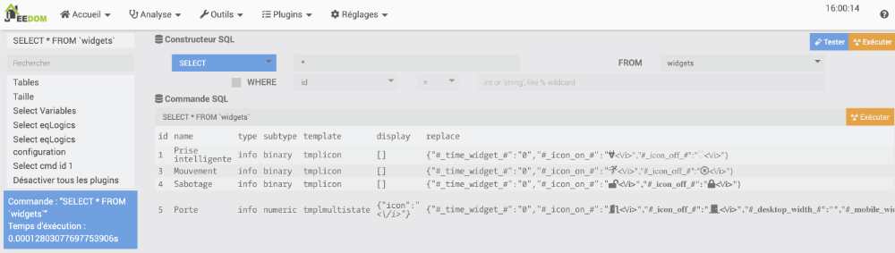

## [apical\_lien\_interne]consulter\_les\_fichiers\_journaux[/apical\_lien\_interne]

Rendez-vous dans le menu Analyse / Logs.

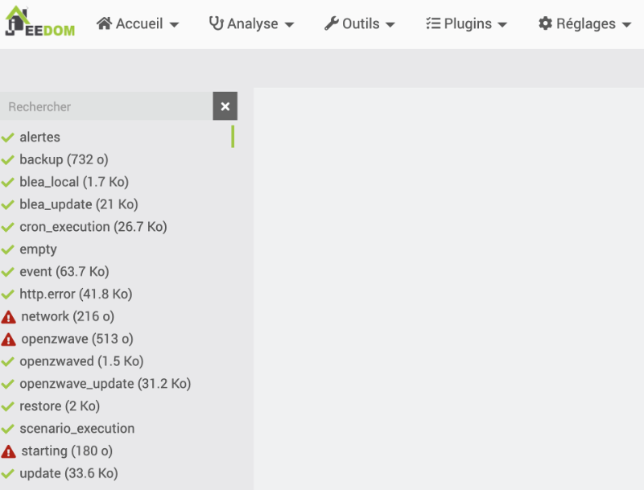

* Données sur les capteurs dans le journal event.
* Données sur l'exécution des scénarios disponibles à partir de l'icône Log dans l'écran d'édition d'un scénario.

  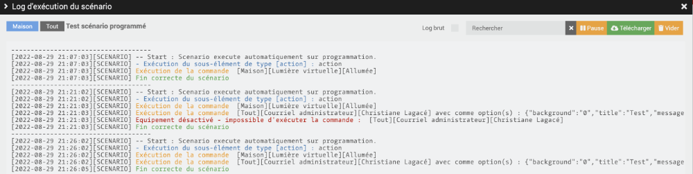
* Autres fichiers journaux disponibles, par exemple Analyse / Temps réel.

  Vous verrez une vue chronologique des événements qui se sont produits.

  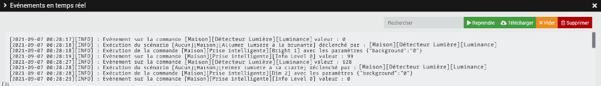

## [apical\_lien\_interne]scenario\_qui\_ajoute\_une\_entree\_dans\_le\_fichier\_journal[/apical\_lien\_interne]

Très pratique pour faire un suivi de ce qui se passe ou pour déboguer un scénario.

Trois techniques différentes sont illustrées dans cet exemple.


Inscrire la valeur d'un capteur :

Bloc de code dans scénario (PHP)

$cmd = cmd::byString('#[Maison][Détecteur Lumière][Luminance]#');  
$value = $cmd->execCmd();  
log::add('alertes', 'ALERT', "Luminance: $value");

Inscrire la valeur du déclencheur :

Bloc de code dans scénario (PHP)

$trigger = cmd::cmdToHumanReadable($scenario->getRealTrigger());

$cmd = cmd::byString($trigger);  
$value = $cmd->execCmd();  
log::add('alertes', 'ALERT', "Valeur du déclencheur : $value");


Il y a toujours une façon de [apical\_lien\_interne][reinitialiser\_le\_mot\_de\_passe\_mysql\_de\_jeedom,réinitialiser le mot de passe][/apical\_lien\_interne] pour accéder à une base de données MySQL, en autant qu'on ait un accès à une fenêtre Terminal sur le serveur MySQL, en l'occurence le Raspberry Pi.

Mais avant de se lancer dans de telles manipulations, il est préférable d'essayer de travailler avec le mot de passe actuel, qui est facile à trouver.

Le mot de passe de la base de données peut être retrouvé à partir de l'interface d'administration de Jeedom.

* Ouvrez [apical\_lien\_interne][installation\_de\_jeedom\_et\_premier\_acces,l'interface d'administration de Jeedom,acceder][/apical\_lien\_interne].
* Rendez-vous dans le menu Réglages / Système / Configuration / >\_ OS/DB.
* Tel qu'indiqué au bas de l'écran, le code d'usager MySQL est jeedom. Le mot de passe apparaît à sa droite.

  

Vous avez maintenant tout ce qu'il faut pour accéder à la base de données.

## 36.3 Réinitialiser le mot de passe MySQL de Jeedom

Je vous propose deux manipulations à effecture sur le serveur de base de données MySQL installé sur votre boîte Jeedom :

* [Modification du mot de passe](#modification) alors que le mot de passe actuel est connu
* [Réinitialisation du mot de passe](#reinitialisation) lorsque le mot de passe actuel n'est pas connu

## Modification du mot de passe

Si vous souhaitez modifier le mot de passe de l'usager jeedom sous MySQL alors que vous connaissez son mot de passe actuel, suivez ces étapes.

* Connectez-vous au Raspberry Pi soit [apical\_lien\_interne][se\_brancher\_au\_raspberry\_pi\_via\_ssh,via SSH][/apical\_lien\_interne] ou encore en y branchant un clavier et un écran.
* Lancez la ligne de commande MySQL puis entrez [apical\_lien\_interne][retrouver\_le\_mot\_de\_passe\_de\_la\_base\_de\_donnees\_jeedom,le mot de passe actuel][/apical\_lien\_interne] lorsque demandé.

  Terminal

  mysql -u jeedom -p
* L'usager jeedom ne détient pas les droits requis pour utiliser les commandes ALTER USER ni pour éditer directement la table USERS.

  Cependant, il peut modifier son propre mot de passe à l'aide de la commande SET PASSWORD.

  Évidemment, vous devez changer mot-de-passe-en-clair pour le mot de passe désiré.

  MySQL

  SET PASSWORD = PASSWORD('mot-de-passe-en-clair');
* Sortez de la ligne de commande MySQL.

  MySQL

  exit
* Vous devez maintenant [dire à Jeedom quel est le nouveau mot de passe](#configurationjeedom).

## Réinitialisation du mot de passe

Avant de tenter une réinitialisation du mot de passe pour accéder à la base de données MySQL de Jeedom, sachez qu'il est possible de [apical\_lien\_interne][retrouver\_le\_mot\_de\_passe\_de\_la\_base\_de\_donnees\_jeedom,retrouver ce mot de passe directement dans la console d'administration de Jeedom][/apical\_lien\_interne].

Si vous devez tout de même réinitialiser le mot de passe, voici comment y parvenir.

* Connectez-vous au Raspberry Pi soit [apical\_lien\_interne][se\_brancher\_au\_raspberry\_pi\_via\_ssh,via SSH][/apical\_lien\_interne] ou encore en y branchant un clavier et un écran.
* Prenez une copie de sécurité du fichier de configuration de MySQL.

  Terminal

  sudo cp /etc/mysql/my.cnf /etc/mysql/my-original.cnf
* Éditez le fichier de configuration de MySQL.

  Terminal

  sudo nano /etc/mysql/my.cnf
* Repérez la section [mysqld] et ajoutez-y l'instruction suivante. Si la section est inexistante, créez-la simplement.

  Fichier my.cnf

  [mysqld]  
  skip-grant-tables

  Attention : ceci est dangereux et il faudra retirer la configuration skip-grant-tables dès que possible.
* Redémarrez MySQL.

  Terminal

  sudo service mysql restart
* Vous pouvez maintenant accéder à MySQL avec l'usager root sans mot de passe.

  Terminal

  mysql -u root
* Entrez cette commande pour réinitialiser le mot de passe de l'usager jeedom pour ce qui vous plaît. Évidemment, vous devez changer mot-de-passe-en-clair pour le mot de passe désiré.

  Notez qu'il n'est pas possible d'utiliser la commande ALTER USER jeedom@localhost IDENTIFIED BY 'mot-de-passe-en-clair'; lorsque la configuration skip-grant-tables est activée.

  MySQL

  USE mysql;  
  UPDATE user SET password=PASSWORD('mot-de-passe-en-clair') WHERE user='jeedom';
* Sortez de la ligne de commande MySQL.

  MySQL

  exit
* Vous pouvez désormais accéder à MySQL avec l'usager jeedom en utilisant ce mot de passe. Entrez cette commande puis entrez le mot de passe lorsque MySQL vous le demandera.

  Terminal

  mysql -u jeedom -p
* Une fois que vous avez constaté que le mot de passe est fonctionnel, ressortez de la ligne de commande MySQL.

  MySQL

  exit
* Important : afin de ne pas ouvrir un trou de sécurité, éditez à nouveau le fichier de configuration de MySQL afin de retirer la ligne qui permet de se connecter avec root sans mot de passe.

  Terminal

  sudo nano /etc/mysql/my.cnf
* Puis redémarrrez une autre fois le service MySQL.

  Terminal

  sudo service mysql restart
* Vous devez maintenant [dire à Jeedom quel est le nouveau mot de passe](#configurationjeedom).


À ce stade, si vous tentez d'accéder à [apical\_lien\_interne][installation\_de\_jeedom\_et\_premier\_acces,l'interface d'administration de Jeedom,acceder][/apical\_lien\_interne], vous obtiendrez le message « SQLSTATE[HY000] [1045] Access denied for user 'jeedom'@'localhost' (using password: YES) ». Il faut donc effectuer une manipulation supplémentaire pour que Jeedom utilise le nouveau mot de passe.

* Prenez une copie de sécurité du fichier que vous devrez modifier.

  Terminal

  sudo cp /var/www/html/core/config/common.config.php /var/www/html/core/config/common.config-original.php
* Éditez le fichier de configuration common.config.php.

  Terminal

  sudo nano /var/www/html/core/config/common.config.php
* Entrez le nouveau mot de passe à la ligne password.

  Fichier /var/www/html/core/config/common.config.php

  <?php

   

  /\* This file is part of Jeedom.  
   \*  
   \* Jeedom is free software: you can redistribute it and/or modify  
   \* it under the terms of the GNU General Public License as published by  
   \* the Free Software Foundation, either version 3 of the License, or  
   \* (at your option) any later version.  
   \*  
   \* Jeedom is distributed in the hope that it will be useful,  
   \* but WITHOUT ANY WARRANTY; without even the implied warranty of  
   \* MERCHANTABILITY or FITNESS FOR A PARTICULAR PURPOSE. See the  
   \* GNU General Public License for more details.  
   \*  
   \* You should have received a copy of the GNU General Public License  
   \* along with Jeedom. If not, see <http://www.gnu.org/licenses/>.  
   \*/

   

  /\* \* \*\*\*\*\*\*\*\*\*\*\*\*\*\*\*\*\*\*\*\*\* Debug \*\*\*\*\*\*\*\*\*\*\*\*\*\*\*\* \*/  
  define('DEBUG', 0);

   

  /\* \* \*\*\*\*\*\*\*\*\*\*\*\*\*\*\*\*\*\*\*\*\*\*\* MySQL & Memcached \*\*\*\*\*\*\*\*\*\*\*\*\*\*\*\*\*\*\* \*/  
  global $CONFIG;  
  $CONFIG = array(  
     //MySQL parametres  
     'db' => array(  
        'host' => 'localhost',  
        'port' => '3306',  
        'dbname' => 'jeedom',  
        'username' => 'jeedom',  
        'password' => 'mot-de-passe-en-clair',  
     ),  
  );

Et voilà! Le mot de passe MySQL de l'usager jeedom est maintenant modifié et l'interface d'administration de Jeedom peut maintenant l'utiliser pour s'y connecter.

## 36.4 Contenu de la base de données de Jeedom

Lorsque j'apprends à utiliser un nouveau système, j'aime bien comprendre ce qui se cache derrière les écrans qu'il me propose. Et ceci passe assurément par sa base de données.

Je vous propose ici quelques manipulations pour explorer la base de données de Jeedom.

Attention : si vous effectuez des manipulations autres que des SELECT, vous risquez d'endommager votre système. C'est une bonne idée d'effectuer une [apical\_lien\_interne][copie\_de\_securite\_de\_jeedom,copie de sécurité de Jeedom][/apical\_lien\_interne] avant de vous lancer.

* Accédez à la ligne de commande du Pi soit [apical\_lien\_interne][se\_brancher\_au\_raspberry\_pi\_via\_ssh,via SSH][/apical\_lien\_interne], soit en y branchant un écran et un clavier.
* Vous devez avoir en main le mot de passe de l'usager jeedom sur le serveur MySQL. Si vous ne le connaissez pas, suivez les instructions ici : [apical\_lien\_interne]retrouver\_le\_mot\_de\_passe\_de\_la\_base\_de\_donnees\_jeedom[/apical\_lien\_interne].
* Dans une fenêtre Terminal sur le Pi, lancez la commande suivante puis entrez le mot de passe lorsque MySQL vous le demandera.

  Terminal

  mysql -u jeedom -p
* Vous êtes désormais à la ligne de commande MySQL. L'invite (MariaDB [(none)]>) indique qu'aucune base de données n'est sélectionnée.  

  Résultat à l'écran

  pi@raspberrypi:~ $ mysql -u jeedom -p  
  Enter password:

   

  Welcome to the MariaDB monitor. Commands end with ; or \g.  
  Your MariaDB connection id is 182  
  Server version: 10.3.29-MariaDB-0+deb10u1 Raspbian 10

   

  Copyright (c) 2000, 2018, Oracle, MariaDB Corporation Ab and others.

   

  Type 'help;' or '\h' for help. Type '\c' to clear the current input statement.

   

  MariaDB [(none)]>
* Pour connaître les bases de données disponibles :

  MySQL

  SHOW DATABASES;

  Résultat à l'écran

  MariaDB [(none)]> SHOW DATABASES;  
  +--------------------+  
  | Database           |  
  +--------------------+  
  | information\_schema |  
  | jeedom             |  
  +--------------------+  
  2 rows in set (0.002 sec)

   

  MariaDB [(none)]>
* Sélectionnez la base de données nommée jeedom. L'invite de commande changera pour MariaDB [jeedom]>.

  MySQL

  USE jeedom;
* Pour connaître les tables qu'elle contient :

  MySQL

  SHOW TABLES;

  Résultat à l'écran

  MariaDB [jeedom]> SHOW TABLES;  
  +--------------------+  
  | Tables\_in\_jeedom   |  
  +--------------------+  
  | cache              |  
  | cmd                |  
  | config             |  
  | cron               |  
  | dataStore          |  
  | eqLogic            |  
  | event              |  
  | history            |  
  | historyArch        |  
  | interactDef        |  
  | interactQuery      |  
  | listener           |  
  | message            |  
  | note               |  
  | object             |  
  | plan               |  
  | plan3d             |  
  | plan3dHeader       |  
  | planHeader         |  
  | scenario           |  
  | scenarioElement    |  
  | scenarioExpression |  
  | scenarioSubElement |  
  | timeline           |  
  | update             |  
  | user               |  
  | view               |  
  | viewData           |  
  | viewZone           |  
  | widgets            |  
  +--------------------+  
  30 rows in set (0.002 sec)

   

  MariaDB [jeedom]>
Notez que vous pourriez avoir quelques tables en plus ou en moins selon les plugins que vous avez installés.

* À partir d'ici, vous pouvez explorer le contenu de chacune des tables, par exemple la table cron, comme ceci :

  MySQL

  SELECT \* FROM cron;

  Résultat à l'écran

  MariaDB [jeedom]> SELECT \* FROM cron;  
  +----+--------+----------+-------------+--------------------+---------+--------+-----------------+------------------+------+  
  | id | enable | class    | function    | schedule           | timeout | deamon | deamonSleepTime | option           | once |  
  +----+--------+----------+-------------+--------------------+---------+--------+-----------------+------------------+------+  
  |  1 |      1 | plugin   | cronDaily   | 00 00 \* \* \*        |     240 |      0 |               1 | NULL             |    0 |  
  |  2 |      1 | jeedom   | backup      | 36 00 \* \* \*        |      60 |      0 |               1 | NULL             |    0 |  
  |  3 |      1 | plugin   | cronHourly  | 00 \* \* \* \*         |      60 |      0 |               1 | NULL             |    0 |  
  |  4 |      1 | scenario | check       | \* \* \* \* \*          |      30 |      0 |               1 | NULL             |    0 |  
  |  5 |      1 | scenario | control     | \* \* \* \* \*          |      30 |      0 |               1 | NULL             |    0 |  
  |  6 |      1 | jeedom   | cronDaily   | 7 0 \* \* \*          |     240 |      0 |               1 | NULL             |    0 |  
  |  7 |      1 | jeedom   | cronHourly  | 2 \* \* \* \*          |      60 |      0 |               1 | NULL             |    0 |  
  |  8 |      1 | jeedom   | cron5       | \*/5 \* \* \* \*        |       5 |      0 |               1 | NULL             |    0 |  
  |  9 |      1 | jeedom   | cron10      | \*/10 \* \* \* \*       |      10 |      0 |               1 | NULL             |    0 |  
  | 10 |      1 | jeedom   | cron        | \* \* \* \* \*          |       2 |      0 |               1 | NULL             |    0 |  
  | 11 |      1 | plugin   | cron        | \* \* \* \* \*          |       2 |      0 |               1 | NULL             |    0 |  
  | 12 |      1 | plugin   | cron5       | \*/5 \* \* \* \*        |       5 |      0 |               1 | NULL             |    0 |  
  | 13 |      1 | plugin   | cron10      | \*/10 \* \* \* \*       |      10 |      0 |               1 | NULL             |    0 |  
  | 14 |      1 | plugin   | cron15      | \*/15 \* \* \* \*       |      15 |      0 |               1 | NULL             |    0 |  
  | 15 |      1 | plugin   | cron30      | \*/30 \* \* \* \*       |      30 |      0 |               1 | NULL             |    0 |  
  | 16 |      1 | plugin   | checkDeamon | \*/5 \* \* \* \*        |       5 |      0 |               1 | NULL             |    0 |  
  | 17 |      1 | cache    | persist     | \*/30 \* \* \* \*       |      30 |      0 |               1 | NULL             |    0 |  
  | 18 |      1 | history  | archive     | 00 5 \* \* \*         |     240 |      0 |               1 | NULL             |    0 |  
  | 19 |      1 | plugin   | heartbeat   | \*/5 \* \* \* \*        |      10 |      0 |               1 | NULL             |    0 |  
  | 20 |      1 | weather  | pull        | 23 19 05 09 \* 2021 |      60 |      0 |               1 | {"weather\_id":3} |    0 |  
  +----+--------+----------+-------------+--------------------+---------+--------+-----------------+------------------+------+  
  20 rows in set (0.002 sec)

   

  MariaDB [jeedom]>
* À vous de poursuivre l'exploration afin de savoir ce que Jeedom stocke dans sa base de données!

## Voir les données directement dans Jeedom

Jeedom vous permet d'effectuer certaines manipulations de la base de données directement dans son interface Web.

* Dans l'interface Web de Jeedom, rendez-vous dans le menu Réglages / Système / Configuration.
* Dans l'onglet \_OS/DB, vis-à-vis Administration Base de données, cliquez sur Ouvrir.

  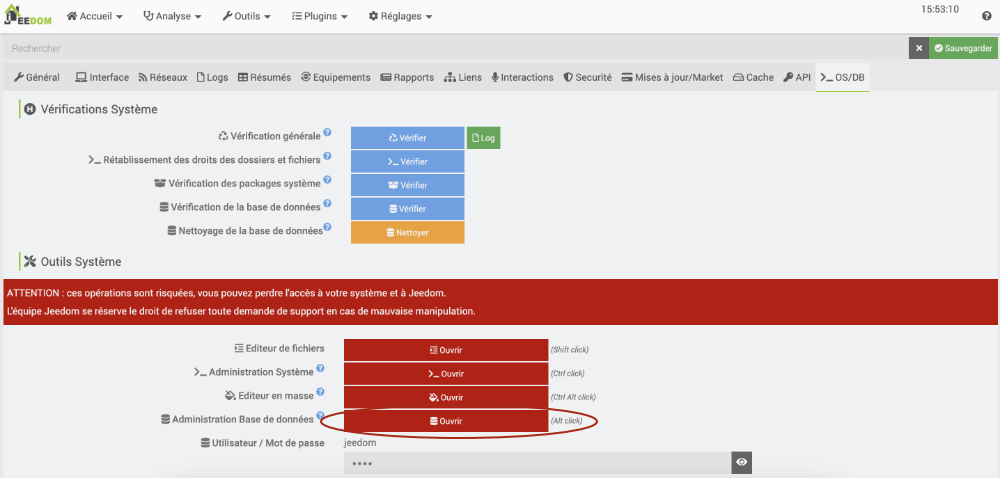
* L'interface permet d'effectuer certaines opérations sur la base de données. Attention : certaines opérations modifieront les données alors vous devez être prudents avant de cliquer sur les différents boutons. C'est une bonne idée d'effectuer une [apical\_lien\_interne][copie\_de\_securite\_de\_jeedom,copie de sécurité de Jeedom][/apical\_lien\_interne] avant de tenter des manipulations.
* L'interface permet d'effectuer facilement un SELECT sur une table données. Voici par exemple le contenu de la table widgets.

  


Petit truc pour explorer la base de données à l'aide d'un outil graphique :

* [apical\_lien\_interne][copie\_de\_securite\_de\_jeedom,Effectuez une copie de sécurité de Jeedom][/apical\_lien\_interne].
* Téléchargez la copie sur votre poste de travail puis décompressez le fichier.
* Créez une base de données vide sur votre poste de travail à l'aide de phpMyAdmin ou d'un autre outil de votre choix (vous devez avoir un serveur MySQL qui roule).
* Remplissez la base de données à l'aide du script SQL qui se trouve dans la copie de sécurité que vous venez de télécharger.
* Vous avez désormais accès aux données de Jeedom dans votre outil SQL préféré!