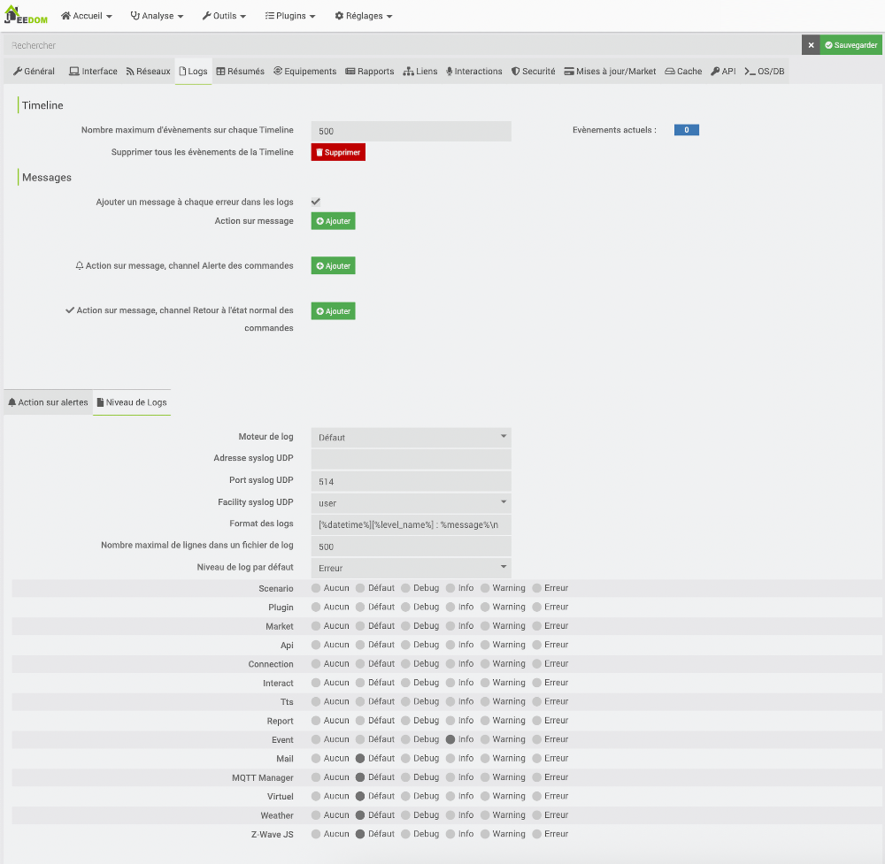
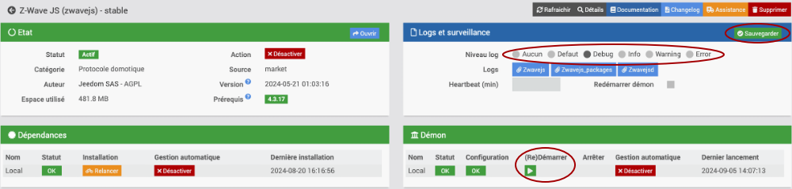
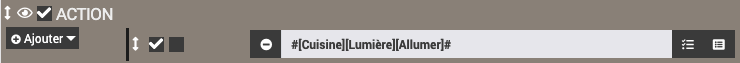

# Chapitres 41–50


<!-- --- split --- -->

<a id="fiche-consulter_les_fichiers_journaux"></a>

## 37.1 Consulter les fichiers journaux

Plusieurs faits peuvent générer une écriture dans un des fichiers journaux (log files) dans Jeedom :

* Déclenchement d'un scénario
* Information envoyée par un capteur
* Problème rencontré
* Sauvegarde automatique de Jeedom
* Exécution d'une commande
* Événement particulier
* etc.

<a id="zwave"></a>

Physiquement, les fichiers journaux sont stockés sur le Raspberry Pi dans le dossier /var/www/html/log.

Heureusement, pour consulter les fichiers journaux, l'interface d'administration vous offre tout ce qu'il faut.

* Rendez-vous dans le menu Analyse / Logs.

  
* Sélectionnez le fichier journal désiré dans la zone de gauche et son contenu apparaîtra dans la zone de droite.

## Données des capteurs Z-Wave

Les données des capteurs Z-Wave peuvent être retrouvées dans différents fichiers journaux.

<a id="pre_globallog"></a>

Le fichier journal [event](https://doc.jeedom.com/fr_FR/core/4.3/log#:~:text=Le%20log%20%E2%80%9CEvent%E2%80%9D) contient les informations en temps réel : valeurs reçues des capteurs, déclenchement des scénarios, etc.

Il renferme une ligne pour chaque événement qui survient sur le système domotique.

Physiquement, le fichier journal Temps réel correspond au fichier /var/www/html/log/event.

Pour le consulter, rendez-vous dans le menu Analyse / Temps réel.

Vous obtiendrez le même résultat à partir du menu Analyse / Logs en sélectionnant event dans la zone de gauche.

Journal event

```
0247|[2023-08-30 08:00:03]INFO : Evènement sur la commande [Dehors][Victoriaville][Température] valeur : 17.5°C 0248|[2023-08-30 08:00:03]INFO : Evènement sur la commande [Dehors][Victoriaville][Humidité] valeur : 95% 0249|[2023-08-30 08:00:03]INFO : Evènement sur la commande [Dehors][Victoriaville][Pression] valeur : 1005Pa 0250|[2023-08-30 08:00:03]INFO : Evènement sur la commande [Dehors][Victoriaville][Vitesse du vent] valeur : 5.184km/h 0251|[2023-08-30 08:00:03]INFO : Evènement sur la commande [Dehors][Victoriaville][Direction du vent] valeur : 117° 0252|[2023-08-30 08:00:03]INFO : Evènement sur la commande [Dehors][Victoriaville][Pluie] valeur : 0mm 0253|[2023-08-30 08:00:04]INFO : Evènement sur la commande [Dehors][Victoriaville][Température Max] valeur : 20.2°C 0254|[2023-08-30 08:00:04]INFO : Evènement sur la commande [Dehors][Victoriaville][Pluie] valeur : 10.47mm 0255|[2023-08-30 08:00:04]INFO : Evènement sur la commande [Dehors][Victoriaville][Température Min +1] valeur : 7.1°C 0256|[2023-08-30 08:00:04]INFO : Evènement sur la commande [Dehors][Victoriav 0257|[2023-08-30 11:09:52]INFO : Evènement sur la commande [Cuisine][Capteur Zooz 4-en-1][Présence] valeur : 0 0258|[2023-08-30 11:10:18]INFO : Evènement sur la commande [Cuisine][Capteur Zooz 4-en-1][Présence] valeur : 1 0259|[2023-08-30 11:10:30]INFO : Evènement sur la commande [Cuisine][Capteur Zooz 4-en-1][Présence] valeur : 0 0260|[2023-08-30 11:12:49]INFO : Evènement sur la commande [Cuisine][Capteur Zooz 4-en-1][Présence] valeur : 1 0261|[2023-08-30 11:12:51]INFO : Exécution de la commande [Salon][Porte virtuelle][Fermée] avec les paramètres {"user_login":"admin","user_id":"1"} 0262|[2023-08-30 11:12:51]INFO : Evènement sur la commande [Salon][Porte virtuelle][État] valeur : 0 0263|[2023-08-30 11:12:52]INFO : Exécution du scénario [Aucun][Aucun][Porte fermée éteint lumière] déclenché par : [Salon][Porte virtuelle][État] 0264|[2023-08-30 11:12:52]INFO : Exécution de la commande [Salon][Prise ZLink][Éteindre] avec les paramètres {"background":"0"} 0265|[2023-08-30 11:12:57]INFO : Exécution de la commande [Salon][Porte virtuelle][Ouverte] avec les paramètres {"user_login":"admin","user_id":"1"} 0266|[2023-08-30 11:12:57]INFO : Evènement sur la commande [Salon][Porte virtuelle][État] valeur : 1 0267|[2023-08-30 11:12:57]INFO : Exécution du scénario [Aucun][Aucun][Porte ouverte allume lumière] déclenché par : [Salon][Porte virtuelle][État] 0268|[2023-08-30 11:12:57]INFO : Exécution de la commande [Salon][Prise ZLink][Allumer] avec les paramètres {"background":"0"}
```

<a id="fiche-configurer_les_fichiers_journaux"></a>

Lorsqu'un scénario est exécuté, que ce soit parce qu'il a été déclenché par un capteur, qu'il a été programmé pour une heure précise ou encore qu'il a été lancé manuellement, il laissera des traces dans le log d'exécution du scénario.

Tous les logs d'exécution des scénarios sont placés dans le dossier /var/www/html/log/scenarioLog. Chaque scénario aura son propre fichier de log.

Pour consulter ces fichiers, ouvrez le scénario désiré puis cliquez sur l'icône Log dans le haut de l'écran.


<a id="niveaudefaut"></a>

Jeedom vous permet de configurer les fichiers journaux afin de répondre à vos besoins.

* Dans le menu Réglages / Système / Configuration, rendez-vous dans l'onglet Logs.
* Un peu plus bas dans l'écran, cliquez sur Niveau de logs.

  

## Niveau de log par défaut

Parmi les configurations les plus intéressante, il y a le niveau de log par défaut.

Les niveaux existants sont :

* Debug (Affiche les messages de type EMERGENCY, ALERT, CRITICAL, ERROR, INFO et DEBUG)
* Info (Affiche les messages de type EMERGENCY, ALERT, CRITICAL, ERROR, WARNING, NOTICE et INFO)
* Warning (Affiche les messages de type EMERGENCY, ALERT, CRITICAL, ERROR et WARNING)
* Error (Affiche les messages de type EMERGENCY, ALERT, CRITICAL et ERROR)

Il est conseillé de configurer le niveau de log par défaut à Debug pendant que vous effectuez des configurations puis à Info par la suite. Ceci permet d'avoir un maximum d'informations pendant que vous ajustez votre système puis une quantité plus raisonnable par la suite.

Une fois que le système est bien rhodé, il est possible de le mettre à Warning afin de diminuer encore la quantité d'informations inscrites dans les fichiers journaux.

## Niveau de log par catégorie de message

Plus bas, vous pouvez sélectionner le niveau de log pour chaque catégorie de message : sénarios, plugins, market, API, connexion, etc.

Ceci permet d'obtenir plus ou moins de messages pour chacune des catégories, par exemple plus de message pour les scénarios et moins de messages pour les plugins.

<a id="chapitre-aller_plus_loin_avec_les_scenarios"></a>

La configuration du niveau de log peut également être faite à un niveau encore plus précis.

On pourra, par exemple, configurer un niveau plus verbeux pour un plugin particulier et moins verbeux pour un autre.

Par exemple, pour modifier le niveau de log des capteurs et récepteurs Z-Wave :

* Rendez-vous dans le menu Plugins / Gestion des plugins.
* Cliquez sur l'icône Z-Wave.
* Dans la zone Logs et surveillance, sélectionnez le niveau de log désiré, par exemple Debug pour avoir un maximum d'information (utile pendant la configuration ou pour aider à cibler un problème) ou Info pour que le niveau soit plus acceptable.

  Ces deux niveaux vous permettent de voir dans le fichier journal les valeurs retournées par les capteurs.

  Remarquez que le niveau Defaut fait référence au niveau configuré dans les réglages du système.

  
* Après avoir modifié le niveau, cliquez sur Sauvegarder dans la section Logs et surveillance puis redémarrez le plugin en cliquant sur (Re)Démarrer dans la zone Démon.

<!-- --- split --- -->

<a id="fiche-scenario_qui_ajoute_une_entree_dans_le_fichier_journal"></a>

## 38.1 Scénario qui ajoute une entrée dans le fichier journal

Un scénario peut écrire dans un fichier journal afin de vous aider à garder une trace de ce qui s'est passé.

Je vous présente ici quelques techniques pour y parvenir.

## Action de type log

La façon la plus facile pour ajouter du texte dans un fichier journal est par une action de type Log.

Ceci écrira dans le log d'exécution du scénario.

* Dans le scénario, cliquez sur Ajouter / Action.
* Cliquez sur l'icône Sélectionner un mot-clé.

  
* Dans la liste déroulante qui apparaît, choisissez Ajouter un log.

  
* Vous pourrez ensuite préciser le message à enregistrer dans le fichier journal.

  
* Il est également possible d'ajouter des valeurs à votre message, par exemple la valeur d'un capteur (commande de type Info seulement). Il vous faudra entrer vous-même [apical\_lien\_interne][retrouver\_la\_chaine\_qui\_identifie\_une\_commande,la chaîne qui mène à cette valeur][/apical\_lien\_interne].

  La chaîne est au format #[Objet][Equipement][Commande]#, par exemple #[Cuisine][Capteur Zooz 4-en-1][Luminosité]#.
* Pour voir le fichier journal du scénario, vous devez cliquer sur l'icône Log dans le haut de la fenêtre d'édition du scénario.

  

  Et voilà le résultat :

  

## Bloc de code

Un bloc de code est un endroit où il est possible d'ajouter des lignes de code PHP qui seront exécutées lorsque le scénario sera lancé.

Le bloc de code offre plus de possibilités pour écrire dans les fichiers journaux.

Dans le scénario, le bloc de code s'ajoute en choisissant Bloc Code sous Action.


C'est dans ce bloc de code qu'il est possible d'ajouter une instruction qui écrira dans un fichier journal.

### $scenario->setLog()

Tout comme les actions de type Log, la méthode [$scenario->setLog()](https://jeedom.github.io/documentation/phpdoc/classes/scenario.html#method_setLog) permet d'écrire dans le log d'exécution du scénario.

PHP

$scenario->setLog('Mon message');

N'oubliez pas le point-virgule à la fin de l'instruction. Après tout, c'est du PHP!

<a id="niveaulog"></a>

La méthode [log::add()](https://jeedom.github.io/documentation/phpdoc/classes/log.html#method_add) vous permet d'écrire dans un fichier journal de votre choix et de spécifier le niveau de gravité du message.

Si le fichier journal n'existe pas, Jeedom le créera automatiquement avant d'y inscrire votre message. Si le fichier journal existe, votre message sera ajouté à la suite des autres messages de ce fichier.

Syntaxe bloc de code dans scénario (PHP)

log::add('nom\_du\_fichier\_journal', 'niveau\_de\_log', 'message');

Les paramètres de cette méthode vont comme suit :

* Le nom du fichier journal peut être n'importe quoi à votre goût. Si le fichier n'existe pas déjà, il sera créé.

  Souvent, on utilisera le fichier nommé alertes pour enregistrer le message dans le log des alertes.
* Le niveau du log peut être, par ordre de gravité :
  + DEBUG
  + INFO
  + NOTICE
  + WARNING
  + ERROR
  + CRITICAL
  + ALERT
  + EMERGENCY

  Attention : selon les [apical\_lien\_interne][configurer\_les\_fichiers\_journaux,configurations du niveau de log][/apical\_lien\_interne], seuls les messages d'un certain niveau seront enregistrés.
* En troisième paramètre, inscrivez le message à enregistrer dans le fichier journal.

N'oubliez pas le point-virgule à la fin de l'instruction!

Bloc de code dans scénario (PHP)

log::add('alertes', 'ALERT', 'Mon message');

Voici un exemple de scénario qui illustre les différentes façons d'écrire dans un fichier journal.


<a id="fiche-retrouver_la_chaine_qui_identifie_une_commande"></a>

Il est possible d'enregistrer un message qui contient des valeurs retrouvées automatiquement par Jeedom.

Pour en savoir plus : « [apical\_lien\_interne]scenario\_qui\_inscrit\_dans\_un\_fichier\_journal\_une\_valeur\_retrouvee\_automa\_\_\_[/apical\_lien\_interne] ».

<a id="fiche-scenario_qui_inscrit_dans_un_fichier_journal_une_valeur_retrouvee_automa___"></a>

Dans Jeedom, chaque commande associée à un équipement peut être utilisée à différentes fins, par exemple pour envoyer la valeur d'un capteur dans un courriel ou pour l'enregistrer dans un fichier journal.

Les commandes peuvent être identifiées par leur identifiant (ID) ou encore par une chaîne.

La chaîne est au format #[Objet][Equipement][Commande]#, par exemple #[Cuisine][Capteur Zooz 4-en-1][Luminosité]#.

Il est également possible de retrouver la chaîne d'une commande comme suit :

* Retrouvez la page de configuration de l'équipement en cliquant sur sa barre de couleur dans le Dashboard ou en vous rendant dans le menu approprié, par exemple pour un objet connecté Z-Wave : Plugins / Protocole domotique / Z-Wave puis en cliquant sur le nom de l'équipement désiré.
* Cliquez sur Configuration avancée dans le haut de l'écran.
* Vous verrez la liste des identifiants et noms des commandes disponibles pour cet équipement.


## 38.3 Scénario qui inscrit dans un fichier journal une valeur retrouvée automatiquement

Que ce soit dans un scénario programmé ou dans un scénario provoqué, il est possible d'enregistrer automatiquement dans un fichier journal un message qui contient des informations retrouvées par programmation.

## Valeur d'un capteur

Voici un bloc de code qui inscrit la valeur d'un capteur de lumière.

Remarquez les guillemets alentour du message afin de permettre à PHP d'interpréter la valeur de la variable.

Bloc de code dans scénario (PHP)

$cmd = cmd::byString('#[Maison][Détecteur Lumière][Luminance]#');  
$value = $cmd->execCmd();  
log::add('alertes', 'ALERT', "Luminance: $value");

Vous obtiendrez le même résultat avec ceci :

Bloc de code dans scénario (PHP)

log::add('alertes', 'ALERT', "Luminance: " . cmd::byString('#[Maison][Détecteur Lumière][Luminance]#')->execCmd());

## Chaîne qui identifie le déclencheur du scénario

Il est possible de retrouver par programmation le nom de la commande qui a déclenché le scénario.

Dans un scénario provoqué, il s'agit d'une chaîne au format #[Objet][Equipement][Commande]#.

Dans un scénario programmé, la chaîne sera schedule.

Dans le cas où le scénario est lancé manuellement par un clic sur le bouton Exécuter dans l'écran d'édition du scénario, la chaîne sera user.

Retrouver ce type d'information par programmation est intéressant spécialement lorsqu'un scénario a plus d'un déclencheur. On saura lequel a servi au déclenchement et le scénario pourra réagir en conséquence.

Bloc de code dans scénario (PHP)

$trigger = cmd::cmdToHumanReadable($scenario->getRealTrigger());  
log::add('alertes', 'ALERT', "Déclencheur : $trigger");

## Valeur du déclencheur

En combinant les deux approches précédentes, on peut obtenir par programmation la valeur de l'équipement qui a déclenché le scénario.

Attention : ceci ne fonctionnera pas si le scénario a été lancé manuellement ou s'il a été lancé à un moment précis (scénario programmé). Il faudra donc ajouter une condition pour ne pas que le code plante.

À vous d'ajouter la condition requise ;-)

Bloc de code dans scénario (PHP)

$trigger = cmd::cmdToHumanReadable($scenario->getRealTrigger());

 

$cmd = cmd::byString($trigger);  
$value = $cmd->execCmd();  
log::add('alertes', 'ALERT', "Valeur du déclencheur : $value");

## Pour plus d'information

« Jeedom v4 | Petits codes entre amis ». KiboOst. <https://kiboost.github.io/jeedom_docs/jeedomV4Tips/CodesScenario/fr_FR/>

<!-- --- split --- -->

<a id="fiche-explorer_jeedom_plus_en_profondeur"></a>

<a id="chapitre-pour_le_prochain_cours_040"></a>

Dans cet exercice, vous êtes appelés à explorer Jeedom : ses fichiers, sa base de données, ses logs. Après tout, vous êtes des développeurs, pas de simples utilisateurs!

1. Modifiez votre scénario dans lequel le capteur de votre choix agit sur le récepteur de votre choix. En plus d'agir sur le récepteur et de vous envoyer un courriel, il doit [apical\_lien\_interne][scenario\_qui\_ajoute\_une\_entree\_dans\_le\_fichier\_journal,inscrire dans un fichier journal][/apical\_lien\_interne] nommé meslogs le texte « Mon premier scénario a été exécuté! ». Pour l'instant, utilisez le [apical\_lien\_interne][scenario\_qui\_ajoute\_une\_entree\_dans\_le\_fichier\_journal,niveau de gravité,niveaulog][/apical\_lien\_interne] ERROR.
2. Une fois l'écriture dans le log fonctionnelle, modifiez le scénario pour que l'inscription utilise le niveau de gravité WARNING. Pour que l'information s'enregistre dans le journal, vous devrez modifier le [apical\_lien\_interne][configurer\_les\_fichiers\_journaux,niveau de log par défaut,niveaudefaut][/apical\_lien\_interne].
3. Perfectionnez le scénario pour qu'il inscrive également dans le log le nom du capteur qui l'a déclenché, retrouvé par programmation (chaîne au format #[Cuisine][Porte][État]#).
4. On veut également inscrire dans le log la valeur du déclencheur, retrouvée par programmation. Dans le cas où le scénario est lancé manuellement en cliquant sur le bouton Exécuter dans l'écran d'édition du scénario, on voudra plutôt inscrire dans le log les mots "Déclenchement manuel". Vous aurez donc un if à ajouter dans le bloc de code.
5. Faites une impression d'écran de l'onglet Scénario qui montre les ajouts que vous avez faits. L'impression d'écran doit montrer clairement le nom de la boîte Jeedom qui apparaît dans le coin supérieur droit de l'écran. Nommez votre fichier au format nomprenom-scenario-journal.png.
6. Sur votre Raspberry Pi, [apical\_lien\_interne][reinitialiser\_le\_mot\_de\_passe\_mysql\_de\_jeedom,modifiez votre mot de passe MySQL,modification][/apical\_lien\_interne] pour que ce soit tata.
7. Dans la [apical\_lien\_interne][contenu\_de\_la\_base\_de\_donnees\_de\_jeedom,base de données Jeedom][/apical\_lien\_interne], retrouvez l'enregistrement exact où il est dit que votre scénario doit écrire dans le fichier meslogs. Faites une impression d'écran qui montre le SELECT qui vous donne l'information recherchée. Nommez votre fichier au format nomprenom-select-journal.png.
8. [apical\_lien\_interne][copie\_de\_securite\_de\_jeedom,Lancez une sauvegarde de Jeedom manuellement,lancer][/apical\_lien\_interne].
9. OPTIONNEL : [apical\_lien\_interne][copier\_automatiquement\_le\_fichier\_de\_sauvegarde\_sur\_votre\_ordinateur,Écrivez un fichier bash][/apical\_lien\_interne] qui permet de copier sur votre ordinateur un fichier de sauvegarde de Jeedom et configurez votre ordinateur pour qu'il soit lancé automatiquement environ 30 minutes après le moment où Jeedom a fait sa sauvegarde.
   1. Laissez votre système Jeedom branché toute la nuit et constatez le lendemain si le fichier de sauvegarde a correctement été copié sur votre ordinateur.
10. Remettez sur la plateforme électronique du cours vos deux impressions d'écran de même que votre fichier bash (si vous avez fait ce dernier).

<!-- --- split --- -->

# 40. Pour le prochain cours

<a id="chapitre-semaine_4_005"></a>

Vous disposez d'un cours pour acquérir les connaissances théoriques et finaliser cet exercice.

Une fois cet exercice complété, vous devez effectuer vos lectures pour l'exercice suivant.

<!-- --- split --- -->

<a id="chapitre-historisation_des_donnees"></a>

<!-- --- split --- -->

<a id="fiche-en_resume_043"></a>

## 41.1 En résumé...

Voici un résumé des informations essentielles du ou des prochains chapitres.

Notez que certaines fiches, qui font partie intégrante du cours, pourraient ne pas figurer dans ce résumé.

Je vous recommande d'effectuer une lecture de l'ensemble des fiches de ces chapitres afin de bien saisir les enjeux.

## [apical\_lien\_interne]configurer\_l\_historique\_des\_commandes[/apical\_lien\_interne]

Pour activer ou désactiver l'historisation des données d'un capteur, rendez-vous dans le menu Plugins / Protocole domotique / Z-Wave. Cliquez sur l'équipement que vous désirez modifier puis sélectionnez l'onglet Commandes. Vous pouvez ajouter ou enlever le crochet devant historiser vis-à-vis une commande de type info.


Pour retrouver les données d'historique d'une commande, vous devez connaître son identifiant.

Vous pouvez retrouver l'identifiant d'une commande à partir de la table cmd.

Résultat à l'écran

MariaDB [jeedom]> select id, eqType, name from cmd;  
+-----+-----------+-------------------------------------------------------+  
| id  | eqType    | name                                                  |  
+-----+-----------+-------------------------------------------------------+  
...  
| 14  | weather   | Température                                           |  
| 15  | weather   | Humidité                                              |  
| 16  | weather   | Pression                                              |  
| 17  | weather   | Vitesse du vent                                       |  
...  
| 37  | openzwave | Info Switch 0 2                                       |  
| 38  | openzwave | Switch 0 2 On                                         |  
| 39  | openzwave | Switch 0 2 Off                                        |  
| 40  | openzwave | Info Switch 0 4                                       |  
| 41  | openzwave | Switch 0 4 On                                         |  
| 42  | openzwave | Switch 0 4 Off                                        |  
| 43  | openzwave | Info Switch 0 3                                       |  
| 44  | openzwave | Switch 0 3 On                                         |  
| 45  | openzwave | Switch 0 3 Off                                        |  
| 46  | openzwave | Info Basic                                            |  
| 47  | openzwave | Basic                                                 |  
| 48  | openzwave | Temperature                                           |  
| 49  | openzwave | Luminance                                            |  
| 50  | openzwave | Relative Humidity                                     |  
+-----+-----------+-------------------------------------------------------+

Voici un extrait de la table history pour la commande dont l'id est 49, un capteur de luminosité.

Résultat à l'écran

MariaDB [jeedom]> select \* from history where cmd\_id = 49;  
+--------+---------------------+----------------+  
| cmd\_id | datetime            | value          |  
+--------+---------------------+----------------+  
|     49 | 2021-09-23 16:15:00 | 1485.75        |  
|     49 | 2021-09-23 16:20:00 | 1445.5         |  
|     49 | 2021-09-23 16:25:00 | 1203.845703125 |  
|     49 | 2021-09-23 16:30:00 | 1210.375       |  
|     49 | 2021-09-23 16:35:00 | 865.03125      |  
|     49 | 2021-09-23 16:45:00 | 757            |  
|     49 | 2021-09-23 16:50:00 | 1050           |  
|     49 | 2021-09-23 16:55:00 | 775.1875       |  
|     49 | 2021-09-23 17:00:00 | 1227.5         |  
|     49 | 2021-09-23 17:05:00 | 1242.796875    |  
|     49 | 2021-09-23 17:10:00 | 1129.25        |  
|     49 | 2021-09-23 17:15:00 | 1146.5         |  
|     49 | 2021-09-23 17:20:00 | 1153.125       |  
|     49 | 2021-09-23 17:25:00 | 958.919921875  |  
|     49 | 2021-09-23 17:30:00 | 823.5          |  
+--------+---------------------+----------------+

L'historique peut être consulté graphiquement à partir du menu Analyse / Historique. Sélectionnez la commande désirée dans la zone de gauche et le graphique de son historique apparaîtra.


## Archivage

À toutes les nuits, Jeedom va déplacer les données de la table history vers la table historyArch après avoir regroupé les données pour chaque heure.

C'est une tâche cron qui se charge de lancer l'opération d'archivage. L'heure précise à laquelle l'archivage débute peut être retrouvée dans la table cron.

Résultat à l'écran

MariaDB [jeedom]> SELECT \* FROM cron;  
+----+--------+----------+-------------+--------------------+---------+--------+-----------------+------------------+------+  
| id | enable | class    | function    | schedule           | timeout | deamon | deamonSleepTime | option           | once |  
+----+--------+----------+-------------+--------------------+---------+--------+-----------------+------------------+------+  
...  
| 18 |      1 | history | archive    | 00 5 \* \* \*        |     240 |      0 |               1 | NULL             |    0 |  
...

## [apical\_lien\_interne]scenario\_qui\_affiche\_une\_information\_dans\_le\_tableau\_de\_bord[/apical\_lien\_interne]

Il faut créer un virtuel avec au moins une commande de type info.

La valeur sera enregistrée dans cette commande comme suit :

Bloc de code du scénario (PHP)

$valeur = ...;  
$cmd = cmd::byString('#[Partout][Mon équipement][Ma valeur]#');  
$cmd->event($valeur);

<a id="fiche-configurer_l_historique_des_commandes"></a>

Bloc de code du scénario (PHP)

$sql = "SELECT ...";  
//$scenario->setLog("SQL = $sql");   // pour faciliter le débogage - on pourra tester cette requête directement dans MySQL

 

try {  
    $resultat = DB::Prepare($sql, NULL, DB::FETCH\_TYPE\_ALL);  
    //$scenario->setLog(print\_r($resultat, true));   // pour voir les données brutes dans cette variable

 

    foreach ($resultat as $enreg) {  
        $valeur = $enreg['...'];  
        $scenario->setLog("Valeur : $valeur");  
    }  
} catch (Throwable $e) {  
    $scenario->setLog($e->getMessage());  
}

## 41.2 Configurer l'historique des commandes

Par défaut, pour chaque équipement, et plus précisément pour leurs commandes pour lesquelles [apical\_lien\_interne][selectionner\_les\_commandes\_a\_afficher\_sur\_une\_tuile,l'historisation a été activée,historique][/apical\_lien\_interne], Jeedom va enregistrer les valeurs dans la base de données à toutes les 5 minutes dans la table history.

Rappel : pour activer ou désactiver l'historisation des données d'un capteur, rendez-vous dans le menu Plugins / Protocole domotique / Z-Wave. Cliquez sur l'équipement que vous désirez modifier puis sélectionnez l'onglet Commandes. Vous pouvez ajouter ou enlever le crochet devant historiser vis-à-vis une commande de type info.


## Consulter les données d'historique

Pour retrouver les données d'historique d'une commande, vous devez connaître son identifiant.

Vous pouvez retrouver l'identifiant d'une commande à partir de la table cmd.

Résultat à l'écran

MariaDB [jeedom]> select id, eqType, name from cmd;  
+-----+-----------+-------------------------------------------------------+  
| id  | eqType    | name                                                  |  
+-----+-----------+-------------------------------------------------------+  
...  
| 14  | weather   | Température                                           |  
| 15  | weather   | Humidité                                              |  
| 16  | weather   | Pression                                              |  
| 17  | weather   | Vitesse du vent                                       |  
...  
| 37  | openzwave | Info Switch 0 2                                       |  
| 38  | openzwave | Switch 0 2 On                                         |  
| 39  | openzwave | Switch 0 2 Off                                        |  
| 40  | openzwave | Info Switch 0 4                                       |  
| 41  | openzwave | Switch 0 4 On                                         |  
| 42  | openzwave | Switch 0 4 Off                                        |  
| 43  | openzwave | Info Switch 0 3                                       |  
| 44  | openzwave | Switch 0 3 On                                         |  
| 45  | openzwave | Switch 0 3 Off                                        |  
| 46  | openzwave | Info Basic                                            |  
| 47  | openzwave | Basic                                                 |  
| 48  | openzwave | Temperature                                           |  
| 49  | openzwave | Luminance                                            |  
| 50  | openzwave | Relative Humidity                                     |  
+-----+-----------+-------------------------------------------------------+

L'identifiant est également visible dans l'interface Web de Jeedom à partir du menu Plugins / Protocole domotique / Z-Wave. Cliquez sur l'équipement que vous désirez consulter, sélectionnez l'onglet Commandes puis cliquez sur l'engrenage à droite de la commande pour connaître cet identifiant.


Voici un extrait de la table history pour la commande dont l'id est 49, un capteur de luminosité.

Résultat à l'écran

MariaDB [jeedom]> select \* from history where cmd\_id = 49;  
+--------+---------------------+----------------+  
| cmd\_id | datetime            | value          |  
+--------+---------------------+----------------+  
|     49 | 2021-09-23 16:15:00 | 1485.75        |  
|     49 | 2021-09-23 16:20:00 | 1445.5         |  
|     49 | 2021-09-23 16:25:00 | 1203.845703125 |  
|     49 | 2021-09-23 16:30:00 | 1210.375       |  
|     49 | 2021-09-23 16:35:00 | 865.03125      |  
|     49 | 2021-09-23 16:45:00 | 757            |  
|     49 | 2021-09-23 16:50:00 | 1050           |  
|     49 | 2021-09-23 16:55:00 | 775.1875       |  
|     49 | 2021-09-23 17:00:00 | 1227.5         |  
|     49 | 2021-09-23 17:05:00 | 1242.796875    |  
|     49 | 2021-09-23 17:10:00 | 1129.25        |  
|     49 | 2021-09-23 17:15:00 | 1146.5         |  
|     49 | 2021-09-23 17:20:00 | 1153.125       |  
|     49 | 2021-09-23 17:25:00 | 958.919921875  |  
|     49 | 2021-09-23 17:30:00 | 823.5          |  
+--------+---------------------+----------------+

L'historique peut être consulté graphiquement à partir du menu Analyse / Historique. Sélectionnez la commande désirée dans la zone de gauche et le graphique de son historique apparaîtra.


## Archivage

À toutes les nuits, Jeedom va déplacer les données de la table history vers la table historyArch après avoir regroupé les données pour chaque heure.

En fait, la documentation de Jeedom indique[1](https://doc.jeedom.com/fr_FR/core/4.3/history) :

> Par défaut Jeedom récupère toutes les données plus vieilles de 2h et en fait des paquets de 1h [...] vous devriez avoir une haute précision sur les 2 dernières heures seulement. Pourtant quand je me connecte à 17h, j’ai une précision sur les 17 dernières heures. Pourquoi ? En fait, pour éviter de consommer des ressources inutilement, la tâche qui fait l’archivage ne se déroule qu’une fois par jour, le soir.

## Moment où les données sont archivées

C'est une tâche cron qui se charge de lancer l'opération d'archivage. L'heure précise à laquelle l'archivage débute peut être retrouvée dans la table cron.

Résultat à l'écran

MariaDB [jeedom]> SELECT \* FROM cron;  
+----+--------+----------+-------------+--------------------+---------+--------+-----------------+------------------+------+  
| id | enable | class    | function    | schedule           | timeout | deamon | deamonSleepTime | option           | once |  
+----+--------+----------+-------------+--------------------+---------+--------+-----------------+------------------+------+  
...  
| 18 |      1 | history | archive    | 00 5 \* \* \*        |     240 |      0 |               1 | NULL             |    0 |  
...

## Modifier le mode de lissage d'une commande

Pour chaque commande, vous pouvez préciser comment Jeedom fera pour convertir les données détaillées en blocs de 1h. Rendez-vous dans le menu  Plugins / Protocole domotique / Z-Wave. Cliquez sur l'équipement que vous désirez configurer, sélectionnez l'onglet Commandes puis cliquez sur l'engrenage à droite de la commande.

Dans l'onglet Configuration, zone Historique, vous pouvez préciser le mode de lissage. Les options disponibles sont moyenne, minimum, maximum et aucun.


## Configurations générales

Les paramètres généraux d'historisation des données peuvent être modifiés dans le menu Réglages / Système / Configuration / onglet Équipements.

La zone Historique des commandes permet de préciser notamment le temps pendant lequel les données détaillées seront conservées (Délai avant archivage), le délai avant que les données d'historiques soient supprimées (Purger l'historique si plus vieux que) et l'intervalle de temps à utiliser pour les données archivées (Archiver par paquet de X h).


## Source

1. «  Historique ». Jeedom. <https://doc.jeedom.com/fr_FR/core/4.3/history>

<!-- --- split --- -->

<a id="fiche-bloc_de_code_qui_lance_une_commande_de_type_action"></a>

<a id="fiche-scenario_qui_affiche_une_information_dans_le_tableau_de_bord"></a>

Dans un scénario Jeedom, il est courant de donner un ordre à un équipement. Il suffit d'ajouter une action et de sélectionner la commande qui donne l'ordre désiré à cet équipement.



Il est également possible de donner un ordre à un équipement à l'aide d'un Bloc de code.

Ceci sera réalisé en exécutant la commande de type action configurée dans l'équipement.

Bloc de code du scénario (PHP)

$cmd = cmd::byString('#[Cuisine][Lumière][Allumer]#');  
 $cmd->execCmd();

<a id="fiche-scenario_qui_execute_une_requete_sql"></a>

Pour qu'un scénario puisse afficher une information dans le tableau de bord, le plus simple est de passer par un équipement virtuel.

* Rendez-vous dans le menu Plugins / Programmation / Virtuel.
* Cliquez sur le + pour ajouter un équipement.
* Donnez un nom à l'équipement virtuel, par exemple Mon équipement.
* Rattachez-le à l'objet de votre choix pour pouvoir le voir dans le Dashboard, par exemple Partout.
* Assurez-vous qu'il soit actif et visible.
* Cliquez sur l'onglet Commandes.
* Cliquez sur Ajouter une info virtuelle.
* Donnez un nom à la commande, par exemple Ma valeur.
* Spécifiez le type de cette valeur : numérique, binaire ou autre.
* Assurez-vous de cocher l'option Afficher.
* Cliquez sur Sauvegarder.

Dans le scénario, pour enregistrer une valeur dans cette commande :

Bloc de code du scénario (PHP)

$valeur = ...;  
$cmd = cmd::byString('#[Partout][Mon équipement][Ma valeur]#');  
 $cmd->event($valeur);

Puisque la commande est configurée pour être affichée sur le Dashboard, la valeur enregistrée par le scénario sera automatiquement visible.

<a id="chapitre-exercice_6_007"></a>

Dans un scénario, une action de type bloc de code permet d'exécuter du code PHP.

Il est donc possible d'exécuter une requête SQL et de faire différents traitements selon les résultats obtenus, par exemple :

* [apical\_lien\_interne][scenario\_qui\_ajoute\_une\_entree\_dans\_le\_fichier\_journal,enregistrer dans un fichier journal][/apical\_lien\_interne] l'ensemble des températures de la veille;
* [apical\_lien\_interne][scenario\_qui\_affiche\_une\_information\_dans\_le\_tableau\_de\_bord,afficher dans le tableau de bord][/apical\_lien\_interne] la plus grande et la plus petite température enregistrée la veille;
* [apical\_lien\_interne][bloc\_de\_code\_qui\_lance\_une\_commande\_de\_type\_action,allumer un voyant lumineux][/apical\_lien\_interne] (branché sur une prise intelligente) si la température maximale enregistrée la veille est supérieure à 30.

Dans ce premier exemple, le scénario ajoute une entrée dans le fichier journal du scénario pour chaque information retrouvée dans la BD.

Bloc de code du scénario (PHP)

$sql = "SELECT ...";  
//$scenario->setLog("SQL = $sql");   // pour faciliter le débogage - on pourra tester cette requête directement dans MySQL

 

try {  
    $resultat = DB::Prepare($sql, NULL, DB::FETCH\_TYPE\_ALL);  
    //$scenario->setLog(print\_r($resultat, true));   // pour voir les données brutes dans cette variable

 

    foreach ($resultat as $enreg) {   
        $valeur = $enreg['...'];  
        $scenario->setLog("Valeur : $valeur");  
    }   
} catch (Throwable $e) {  
    $scenario->setLog($e->getMessage());  
}

Cette fois, il n'enregistre que la première information trouvée. Ceci sera pratique par exemple si on utilise une fonction d'aggrégation, par exemple MAX, MIN, AVG, COUNT, SUM.

Bloc de code du scénario (PHP)

$sql = "SELECT COUNT(\*) AS alias ...";  
//$scenario->setLog("SQL = $sql");   // pour faciliter le débogage - on pourra tester cette requête directement dans MySQL

 

try {  
    $resultat = DB::Prepare($sql, NULL, DB::FETCH\_TYPE\_ALL);  
    //$scenario->setLog(print\_r($resultat, true));   // pour voir les données brutes dans cette variable

 

    $scenario->setLog("Nombre d'enregistrements trouvés : {$resultat[0]['alias']}");  
} catch (Throwable $e) {  
    $scenario->setLog($e->getMessage());  
}

Attention : dans les tables history et historyArch, le champ value est de type VARCHAR. Dans certaines requêtes SQL, il faut prendre le soin de le convertir en nombre pour assurer que la valeur 9 soit considérée inférieure à la valeur 10.

Bloc de code du scénario (PHP)

$sql = "SELECT MAX(CAST(... AS UNSIGNED)) ...";

Pour afficher cette valeur dans le tableau de bord à l'aide d'un virtuel, on ajoutera ceci après le DB::Prepare.

Il faut avoir auparavant créé le virtuel avec une commande de type info.

Bloc de code du scénario (PHP)

$cmd = cmd::byString('#[Objet][Equipement][Commande]#');  
 $cmd->event($resultat[0]['alias']);

Et si on désire plutôt mettre une prise intelligente sous tension, on fera ceci :

Bloc de code du scénario (PHP)

$cmd = cmd::byString('#[Bureau][Ma prise][Allumer]#');  
$cmd->execCmd();

<!-- --- split --- -->

<a id="fiche-historique"></a>

<a id="chapitre-pour_le_prochain_cours_041"></a>

1. Faites afficher un graphique de l'historique des données pour une commande d'un capteur de votre choix. Prenez une impression d'écran du graphique en vous assurant qu'on voit bien le nom de la commande. Nommez ce fichier au format NomPrenom-Historique.png.
2. Dans la base de données Jeedom, retrouvez la table dans laquelle vos équipements (vos objets connectés) sont stockés. On veut la table dans laquelle le nom de l'équipement apparaît, soit celui que vous voyez sur les tuiles dans le Dashboard.
3. Puisque cette table contient de nombreux enregistrements, effectuez une requête SQL pour afficher l'enregistrement qui correspond à un de vos équipements en utilisant le nom que vous lui avez donné (... WHERE name ...). Prenez cette requête en note dans un fichier texte que vous nommerez au format NomPrenom-Reponses.txt.
4. Chaque équipement contient de nombreuses commandes. Retrouvez la table dans laquelle les commandes sont stockées.
5. Dans cette table, effectuez une requête SQL pour retrouver tous les enregistrements qui correspondent aux commandes de l'équipement ciblé plus haut. Prenez cette requête en note dans votre fichier texte.
6. Les données captées par les commandes des équipements sont stockées dans la table history. Effectuez une requête SQL qui affiche la date, la valeur, l'identifiant et le nom de la commande ainsi que l'identifiant et le nom de l'équipement. Prenez cette requête en note dans votre fichier texte.

   Ex :

   Résultat à l'écran

   | 2021-09-24 07:05:00 | 122.605 | 113 | Voltage 16     | 15 | Prise intelligente Zooz |  
   | 2021-09-24 07:05:00 | 2       | 191 | Burglar 10     | 28 | Neo détecteur 5 en 1    |  
   | 2021-09-24 07:05:00 | 0       | 192 | SourceNodeId 2 | 28 | Neo détecteur 5 en 1    |  
   | 2021-09-24 07:05:00 | 0.012   | 110 | Energy 0       | 15 | Prise intelligente Zooz |  
   | 2021-09-24 07:05:00 | 0       | 189 | Alarm Level 1  | 28 | Neo détecteur 5 en 1    |  
   | 2021-09-24 07:05:00 | 0       | 114 | Current 20     | 15 | Prise intelligente Zooz |  
   | 2021-09-24 07:05:00 | 0       | 188 | Alarm Type 0   | 28 | Neo détecteur 5 en 1    |  
   | 2021-09-24 07:05:00 | 0       | 112 | Power 8        | 15 | Prise intelligente Zooz |  
   | 2021-09-24 07:05:00 | 245.5   | 183 | Luminance 3    | 28 | Neo détecteur 5 en 1    |  
   | 2021-09-24 07:10:00 | 0.012   | 110 | Energy 0       | 15 | Prise intelligente Zooz |  
   | 2021-09-24 07:10:00 | 0       | 112 | Power 8        | 15 | Prise intelligente Zooz |
7. Raffinez cette requête afin qu'elle affiche les unes à la suite des autres les informations de l'équipement tirées de la table history ET les informations tirées de la table historyArch, le tout en ordre de date. Notez que puisque votre système domotique est rarement branché de soir, il se peut que votre table d'archive soit pratiquement vide. Prenez cette requête en note dans votre fichier texte.
8. Copiez le résultat de la requête au bas du fichier texte. Notez que si vous travaillez en ligne de commande MySQL, pour pouvoir copier du texte en provenance du Pi vers votre ordinateur, vous devez travailler en SSH.
9. Créez un nouveau scénario qui [apical\_lien\_interne][scenario\_qui\_execute\_une\_requete\_sql,effectue une requête SQL][/apical\_lien\_interne] pour retrouver la plus haute température enregistrée hier et qui [apical\_lien\_interne][scenario\_qui\_affiche\_une\_information\_dans\_le\_tableau\_de\_bord,affiche cette information dans le tableau de bord][/apical\_lien\_interne].

   Ce scénario sera lancé à tous les jours 10 minutes après la tâche d'archivage. Vous devrez retrouver dans la table cron l'heure programmée pour la tâche history archive et entrer cette valeur plus 10 minutes dans le déclencheur du scénario.

   Afin de vous laisser vous concentrer sur le bloc de code PHP plutôt que sur la requête SQL, je vous fournis la requête à utiliser. Vous devrez évidemment ajuster le nom de votre équipement.

   SELECT MAX(historyArch.value) AS max FROM historyArch   
   INNER JOIN cmd ON cmd\_id = cmd.id   
   INNER JOIN eqLogic ON eqLogic\_id = eqLogic.id   
   WHERE eqLogic.name = 'Capteur 5-en-1 Neo'   
   AND cmd.name = 'Température'   
   AND DATE(historyArch.datetime) = CURDATE() - INTERVAL 1 DAY
10. Copiez le code du bloc PHP au bas du fichier texte.
11. Soit la base de données Jeedom dont le script SQL est donné dans ce fichier : [BaseDeDonneesJeedom.txt](). Installez cette base de données sur votre poste de travail puis ouvrez-la dans l'éditeur de bases de données de votre choix (ex : phpMyAdmin, MySQL Workbench).
12. Dans la base de données qui vous a été fournie, indiquez de quelle date à quelle date les données ont été comptabilisées. Vous n'avez pas à fournir les requêtes SQL requises. Inscrivez seulement la réponse au bas du fichier.
13. Toujours dans la base de données Jeedom qui vous a été fournie, trouvez la plus haute température enregistrée par un capteur. Vous n'avez pas à fournir les requêtes SQL requises. Inscrivez seulement la réponse au bas du fichier.
14. Remettez votre fichier texte et votre impression d'écran sur la plateforme électronique du cours.
15. En prévision de l'exercice qui aura lieu après le formatif formel, prévoyez emmener votre matériel électronique : planche de maquettage, DEL, résistances, câbles DuPont.

<!-- --- split --- -->

# 44. Pour le prochain cours

<a id="chapitre-examen_formatif_formel_003"></a>

Vous disposez d'un cours pour acquérir les connaissances théoriques et finaliser cet exercice.

Une fois cet exercice complété, vous devez effectuer vos lectures pour l'exercice suivant.

<!-- --- split --- -->

<a id="fiche-grille_de_correction_018"></a>

<a id="fiche-examen_formatif_formel"></a>

Voici la grille de correction qui sera utilisée pour l'exercice formatif formel.

Les opérations que vous devrez réaliser devront respecter les techniques, les pratiques et les normes enseignées. Plusieurs sont implicites, par exemple bien nommer vos équipements.

Notez que la correction sera faite à partir des fichiers remis.

FICHIER NON REMIS = FICHIER NON CORRIGÉ (note : 0).

| 25 points | Excellent | Satisfaisant | Minimal | Faible | Insuffisant |
| --- | --- | --- | --- | --- | --- |
| Respect des consignes | Toutes les consignes (ex : nomenclature) respenctent ce qui a été demandé.  2 points |  |  | Pas plus de 1 erreur  1 point | Au moins 2 erreurs ou fonctionnalité non réalisée  0 |
| Réalisation des configurations | Toutes les configurations (sur le Pi, dans Jeedom, dans les virtuels) ont été correctement réalisées.  9 points | Pas plus de 1 erreur  8 points | Pas plus de 2 erreurs  6 points | Pas plus de 3 erreurs  3 point | Au moins 4 erreurs ou fonctionnalité non réalisée  0 |
| Programmation et requêtes | Toute la programmation et les requêtes (ex : scénarios, base de données) ont été correctement réalisées.  9 points | Pas plus de 1 erreur  8 points | Pas plus de 2 erreurs  6 points | Pas plus de 3 erreurs  3 point | Au moins 4 erreurs ou fonctionnalité non réalisée  0 |

<a id="chapitre-semaine_5_006"></a>

Cet examen sera auto-corrigé en classe au prochain cours.

Vous devez tout de même remettre votre travail sur la plateforme électronique du cours.

Puisqu'il s'agit d'un examen formatif, il n'y a aucun point attribué mais une grille de correction vous est fournie à titre indicatif.

1. Dans votre boîte Jeedom existante, créez un ventilateur virtuel. Le ventilateur doit pouvoir être allumé à puissance maximale, c'est-à-dire que sa force doit pouvoir prendre la valeur 100. Il peut également être allumé à puissance moyenne (force = 50) ou être éteint (force = 0).
2. Prenez une impression d'écran de la configuration des commandes du ventilateur virtuel. L'impression d'écran doit montrer clairement le nom de la boîte Jeedom qui apparaît dans le coin supérieur droit de l'écran. Nommez votre fichier au format nomprenom-ventilateur.png.
3. Créez un thermomètre virtuel qui permet d'incrémenter et de décrémenter une valeur nommée température.
4. Prenez une impression d'écran de la configuration des commandes du thermomètre virtuel. L'impression d'écran doit montrer clairement le nom de la boîte Jeedom qui apparaît dans le coin supérieur droit de l'écran.

   Attention : l'écran doit montrer clairement le contenu de chaque case. Si du contenu est tronqué, seule la partie visible sera corrigée. Par exemple, pour agrandir la colonne Valeur, vous devez d'abord modifier le CSS pour diminuer la taille de la colonne Nom (clic droit sur Nom, Inspecter, changer width:300px pour width:200px). Vous pouvez maintenant agrandir la colonne Valeur (clic droit sur Valeur, Inspecter, changer min-width:180px pour min-width:400px). Quand les informations sont toutes bien affichées, vous pouvez refermer la fenêtre Inspecter puis réaliser l'impression d'écran.

   Nommez votre fichier au format nomprenom-thermometre.png.
5. Écrivez un scénario qui se charge d'allumer le ventilateur à pleine puissance si la température virtuelle est supérieure ou égale à 10. Le ventilateur sera à puissance moyenne si la température est entre 5 et 9 inclusivement. Il sera éteint dès que la température virtuelle est inférieure à 5.

   Ceci peut être réalisé à l'aide d'un seul scénario ou de plusieurs scénarios, selon vos préférences. Le ou les scénarios doivent être dans le groupe nommé Formatif formel.
6. Pour chaque scénario, faites une impression d'écran de l'écran où on voit le déclencheur du scénario. Faites une autre impression d'écran, cette fois pour montrer les détails du scénario avec des blocs Action . Les impressions d'écrans doivent montrer clairement le nom de la boîte Jeedom qui apparaît dans le coin supérieur droit de l'écran. Nommez vos fichiers au format nomprenom-scenario-1.png, nomprenom-scenario-2.png. Si vous avez plus d'un scénario, poursuivez avec -3, -4, etc.
7. Écrivez un nouveau scénario qui inscrit dans le fichier journal nommé "formatif" le nombre d'enregistrements total de la table history. Pour les besoins de cet exercice, le scénario n'aura pas de déclencheur. Vous le testerez en cliquant sur le bouton Exécuter.
8. Pour ce scénario, vous n'avez à faire qu'une seule impression d'écran : celui où on voit les détails du scénario avec des blocs Action . Nommez votre fichier au format nomprenom-history.png.
9. Remettez vos impressions d'écrans sur la plateforme électronique du cours.