# Chapitres 51–60

<!-- --- split --- -->


<!-- --- split --- -->


## 46.1 En résumé...

Voici un résumé des informations essentielles du ou des prochains chapitres.

Notez que certaines fiches, qui font partie intégrante du cours, pourraient ne pas figurer dans ce résumé.

Je vous recommande d'effectuer une lecture de l'ensemble des fiches de ces chapitres afin de bien saisir les enjeux.

## [apical\_lien\_interne]qu\_est-ce\_que\_le\_gpio[/apical\_lien\_interne]

Le sigle GPIO signifie General Purpose Input Output (littéralement : Entrée-sortie à usage général).

Il existe deux systèmes de numérotation : physique et broadcom (Broadcom SOC channel : BCM).

## [apical\_lien\_interne]brancher\_une\_del\_au\_raspberry\_pi[/apical\_lien\_interne]

La planche de maquettage :

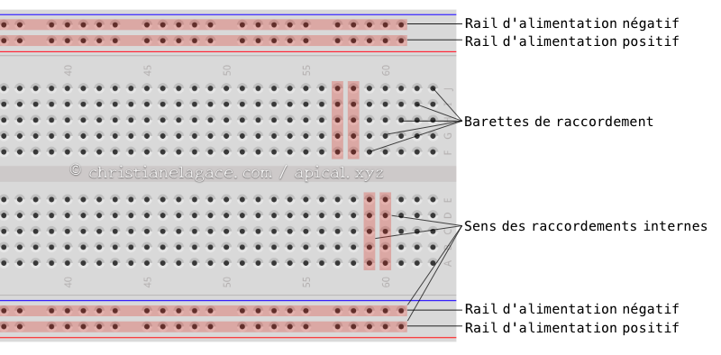

Dos de la planche de maquettage :

Ça prend toujours une résistance pour protéger la DEL et le Raspberry Pi.

Sans entrer dans les détails de calcul, disons qu'une résistance de 330 ohm est un bon passe partout pour un petit montage avec une seule DEL.

Exemple de branchement avec tension de 3.3V :

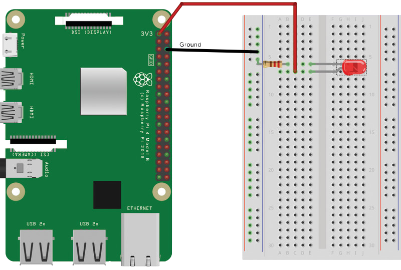

Exemple de branchement sur une broche programmable :

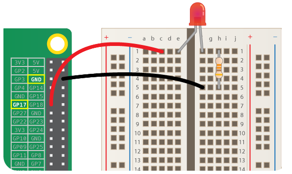

Important ! Sens de la DEL :

* Longue patte (moins de matériel dans le bulbe) : côté tension (power)
* Courte patte : côté mise à terre (GND)

 

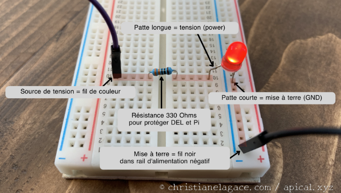

## [apical\_lien\_interne]la\_base\_des\_scripts\_avec\_rpi\_gpio[/apical\_lien\_interne]

Il y a un [apical\_lien\_interne][Qu\_est-ce\_que\_Python,chapitre de référence sur Python][/apical\_lien\_interne] au début de la formation.

Le script doit être placé directement sur le Raspberry Pi pour être exécuté. Si vous l'avez écrit sur votre ordinateur, vous devrez le copier sur le Pi après l'avoir édité.

Nom du fichier : entièrement en minuscules (ex : monscript.py) ou casse serpent (ex : mon\_script.py).

Petit script qui fait clignoter une DEL jusqu'à ce que quelqu'un appuie sur Ctrl+C.

Python

#!/usr/bin/env python3  
# -\*- coding:utf-8 -\*-

 

"""  
Fait clignoter une DEL rouge sur le Raspberry Pi  
Paramètres : aucun  
Montage : DEL rouge branchée sur GPIO.BCM 23 et résistance de 330 Ohms  
Auteur : Christiane Lagacé  
Date : 17 septembre 2025  
"""  
  
import RPi.GPIO as GPIO    # il faudra mettre GPIO. devant le nom des classes du paquet  
from time import sleep     # les classes du paquets peuvent être utilisées directement sans le nom du paquet  
  
GPIO.setmode(GPIO.BCM)    # type d'adressage broadcom (numéros de ports)  
led = 23                   # adresse broadcom du branchement de la DEL  
GPIO.setup(led, GPIO.OUT)  # sens du signal : le Pi peut envoyer un signal à sa broche (ici, au port 23)  
  
print('Programme qui fait clignoter une DEL')  
print('Appuyez sur Ctrl+C pour terminer.')  
  
try:  
    while True:  
        GPIO.output(led, 1)     # envoie 3.3V au port  
        sleep(1)  
        GPIO.output(led, 0)     # n'envoie rien au port  
        sleep(1)  
except KeyboardInterrupt:  
    print ('Fin du programme, vous avez appuyé sur Ctrl+C.')  
except Exception as e:  
    print('Une exception est survenue.' + str(e))  
finally:  
    GPIO.cleanup()     # réinitialise les ports  
    print('Nettoyage final réalisé avec succès!')

Exécution du script :

Terminal

python3 monscript.py


Voir détails sur la fiche.


Le sigle GPIO signifie General Purpose Input Output (littéralement : Entrée-sortie à usage général).

Il s'agit d'une série de 40 broches (en anglais : pins) qui permettent de contrôler différents composants électroniques.

Un circuit électronique pourra être réalisé en branchant des composants électroniques sur des broches ciblées du GPIO. Les branchements seront réalisés à l'aide de fils spécialisés appelés [câbles DuPont](https://en.wikipedia.org/wiki/Jump_wire).

Notez que pour les modèles qui ont précédé le Raspberry Pi 1B+ (2014), le GPIO n'avait que 26 broches. Et pour le Raspberry Pi Zero, il y a 40 trous auxquels les broches peuvent être soudées.


Certaines broches jouent un rôle particulier. Il faut se référer au schéma officiel du GPIO[1](https://www.raspberrypi.org/documentation/usage/gpio/) pour connaître leur rôle.

L'application Web Raspberry Pi Pinout (<https://pinout.xyz/>) est également très aidante.

Attention : il existe deux systèmes de numérotation : physique et broadcom (Broadcom SOC channel : BCM).

Dans le schéma qui suit, les numéros 1 à 40 réfèrent à la numérotation physique. Vous remarquerez que certaines broches, par exemple la 11, sont libellées GPIO 17. Dans ce cas, 17 correspond à la numérotation broadcom.

La numérotation physique permet de retrouver la bonne broche sur le Pi. La numérotation broadcom sera souvent utilisée en programmation.

Source de l'image : <https://www.raspberrypi.org/documentation/usage/gpio/>

## Tension des broches

Les broches qui permettent de fournir une source électrique (power) à un composant travaillent avec une tension de 5V ou de 3.3V.

Les autres broches travaillent avec une tension de 3.3V. Attention : si vous leur envoyez 5V, vous allez briser le GPIO et peut-être même le Pi au complet. Ouch $$\_\_$$

Lorsqu'une broche reçoit une tension suffisamment haute (ex : 3.3V), son état est à 1 (ON). Sinon, elle est à 0 (OFF).

L'état d'une broche peut être contrôlé par programmation avec des langages comme le Python, le JavaScript et bien d'autres.

Le branchement d'un composant électronique sur une planche de maquettage puis au GPIO est expliqué dans la fiche « [apical\_lien\_interne]brancher\_une\_del\_au\_raspberry\_pi[/apical\_lien\_interne] ».

## Source

1. « GPIO ». Raspberry Pi. <https://www.raspberrypi.org/documentation/usage/gpio/>

## Pour plus d'information

« General Purpose Input/Output ». Wikipédia. <https://fr.wikipedia.org/wiki/General_Purpose_Input/Output>

« GPIO ». Raspberry Pi. <https://www.raspberrypi.org/documentation/usage/gpio/>

« Raspberry Pi GPIO Pinout: What Each Pin Does on Pi 4, Earlier Models ». Tom's hardware. <https://www.tomshardware.com/reviews/raspberry-pi-gpio-pinout,6122.html>

« Allumer et éteindre une LED avec la Raspberry Pi et Python ». Raspberry Pi FR. <https://raspberry-pi.fr/led-raspberry-pi/>

« Raspberry Pi Pinout ». Raspberry Pi Pinout. <https://pinout.xyz/>

## 46.3 Brancher une DEL au Raspberry Pi

Si vous branchez une petite diode électroluminescente (DEL, en anglais light-emitting diode ou LED) au GPIO de votre Raspberry Pi, votre système domotique pourrait par exemple allumer la DEL quand quelqu'un entre dans la pièce.

Ce type de composant électronique est peu dispendieux. Vous trouverez des DEL à deux pattes en vente pour environ 10$ le paquet de 100.

## Travail avec une planche de maquettage

Une planche de maquettage (aussi appelée platine d'essai, platine de prototypage ou, en anglais, breadboard) est un petite plaque de plastique munie de trous dans lesquels il est possible de brancher des composants électroniques sans nécessiter de soudure. Les trous de chaque rangée sont reliés entre eux par une plaque métallique, ce qui permet de former un circuit électronique.

Saviez-vous que le terme breadboard vient effectivement d'une planche pour découper du pain? C'est que dans les premiers temps où l'électronique s'est développée, des gens utilisaient une vraie planche à pain sur laquelle ils vissaient les composants électronique de leur montage[1](https://www.instructables.com/Use-a-real-Bread-Board-for-prototyping-your-circui/)!

Vous pouvez faire le montage de la DEL et d'une résistance sur une planche de maquettage branchée au GPIO à l'aide de fils appelés câbles DuPont. On utilisera ici des câbles mâle-femelle avec l'extrémité mâle branchée à la planche de maquettage et l'extrémité femelle branchée au GPIO.

Montage A

Source de l'image : <https://magpi.raspberrypi.org/articles/get-started-with-electronics-and-raspberry-pi>

## Précautions lors du montage

Il est important de couper le courant du Raspberry Pi avant d'effectuer les branchements. Sinon, vous risquez d'endommager le composant électronique, le GPIO ou même le Raspberry Pi.

### Les fils du circuit

La couleur des fils utilisés pour brancher les composants sur la planche de maquettage n'a pas d'importance.

Cependant, par convention, on utilisera un fil noir pour brancher à la mise à terre (ground ou GND).

Sur la planche de maquettage, le fil de mise à terre sera généralement – mais pas obligatoirement – branché dans le rail d'alimentation négatif.

Les rails d'alimentation sont les deux premières et les deux dernières rangées de trous sur le côté long de la planche de maquettage. Le rail négatif est généralement marqué d'une ligne bleue ou noire.

Sur certaines planches, le sens des raccordements internes est visible lorsqu'on retire la feuille de protection arrière.

### Branchement d'une DEL

Lorsque vous branchez une DEL, il ne faut pas que les deux pattes soient branchées sur des trous qui sont interconnectés. On pourra les brancher, par exemple :

* sur deux barrettes de raccordement différentes (voir montage A)
* une patte le rail positif (ou négatif) et l'autre, sur une barrette de raccordement au centre (voir montage B)
* de chaque côté de la goutière, c'est-à-dire la partie encavées au centre (voir montage C)

Lors du branchement de la DEL, assurez-vous que la longue patte soit branchée du côté de la source de tension (power). La patte la plus courte sera branchée du côté de la mise à terre.

Si vous avez de la difficulté à déterminer quelle est la patte la plus longue (c'est parfois le cas après qu'une soudure ait été faite), regardez à l'intérieur du bulbe. La patte longue (à gauche sur les images) a généralement moins de matériel que la courte.

Donc, le côté avec moins de matériel dans le bulbe (la patte la plus longue) doit être branché du côté de la source de tension.

 

Montage B

### Emplacement de la résistance

Dans un petit circuit qui implique seulement une DEL et une résistance, la résistance peut être placée de n'importe quel côté de la DEL.

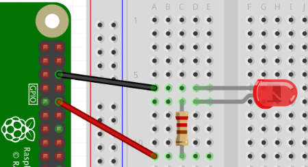             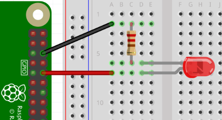

Circuits réalisés à l'aide du logiciel [Fritzing](https://fritzing.org/).

Notez que dans ce type de circuit, une résistance de 330 Ohms est une valeur sûre. Si vous désirez en savoir plus sur les résistances, consultez la fiche « [apical\_lien\_interne]les\_resistances[/apical\_lien\_interne] ».

## Broche 3.3V vs broche programmable

Vous devez déterminer quelle broche du GPIO fournira la tension à votre circuit.

Avec un branchement directement sur la broche no 1 (3V3 power), comme sur le montage A, la DEL s'allumera dès que le Raspberry Pi sera sous tension.

Si vous préférez allumer la DEL par programmation, il faudra brancher sa longue patte sur une autre broche du GPIO, par exemple la broche 17, comme sur le montage C.

Il faudra alors écrire un petit programme qui enverra ou non un signal à cette broche, par exemple [apical\_lien\_interne][la\_base\_des\_scripts\_avec\_rpi\_gpio,en utilisant la bibliothèque RPi.GPIO][/apical\_lien\_interne].

Montage C

Source de l'image : <https://www.futurelearn.com/courses/physical-computing-raspberry-pi-python/0/steps/76169>

## Branchement sans planche de maquettage

Si vous préférez, il est même possible de brancher la DEL et sa résistance directement au GPIO. Pour effectuer ce branchement, les câbles DuPont auront des extrémités femelle-femelle.

Un peu de soudure sera nécessaire entre la DEL et la résistance.

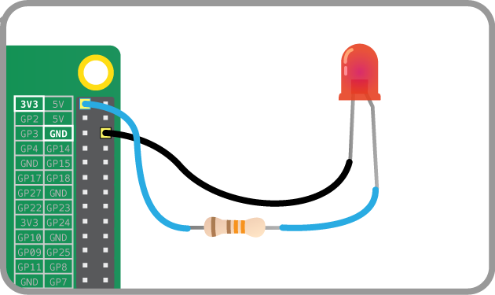

Source de l'image : <https://projects.raspberrypi.org/en/projects/physical-computing-with-scratch/3>

## Source

1. « Use a Real Bread-Board for Prototyping Your Circuit ». Instructables Circuits. <https://www.instructables.com/Use-a-real-Bread-Board-for-prototyping-your-circui/>

## Pour plus d'information

« Get started with electronics and Raspberry Pi ». The MagPi Magazine. <https://magpi.raspberrypi.org/articles/get-started-with-electronics-and-raspberry-pi>

« Breadboard tutorial: learn electronics with Raspberry Pi ». The MagPi Magazine. <https://magpi.raspberrypi.org/articles/breadboard-tutorial>

« LED ». Framboise 314. <https://www.framboise314.fr/scratch-raspberry-pi-composants/led/>

« Introduction aux circuits ». CCDMD - Apprendre à programmer pour rendre des objets connectés à Internet à l’aide des plateformes Arduino et Raspberry PI. <https://objets.ccdmd.qc.ca/manuel/2-1-introduction-aux-circuits/>

## 46.4 Les résistances

Dans tout circuit électronique qui comporte une DEL, il faut ajouter une résistance. Ceci assure que le courant ne grillera pas la DEL, le GPIO ou même le Raspberry Pi.

Généralement, les tensions maximales supportées parr les DEL (forward voltage) sont de[1](https://electronics.stackexchange.com/questions/297356/how-much-voltage-does-a-green-led-need-to-be-supplied-will-it-handle-5v) :

* DEL blanche : 3.3V
* DEL bleue  : 3.3V
* DEL verte : 2.2V
* DEL jaune : 2.1V
* DEL rouge : 2.0V

Même si la DEL supporte la tension fournie par le Pi sur la broche de 3.3V, il faut utiliser une résistance pour protéger la DEL et le Raspberry Pi. En effet, une fois la DEL allumée, elle risque de consommer trop de courant (le I dans V=RI) et de finir par faire griller soit la DEL, soit le Pi. Ouch!

Pour connaître la valeur requise pour la résistance, consultez la fiche technique de la DEL afin de connaître la tension maximale qu'elle peut accepter.

À titre d'exemple, voici un extrait d'une fiche technique pour une DEL blanche.

Remarquez que la tension maximale de la DEL est ici de 3.6V, soit un peu plus que la tension maximale habituelle pour une DEL blanche. Si vous n'avez pas accès à la fiche technique de votre DEL, vous pouvez utiliser les valeurs habituelles.

Source de l'extrait de fiche technique : <http://www1.futureelectronics.com/doc/EVERLIGHT%C2%A0/334-15__T1C1-4WYA.pdf>

La colonne condition est importante : c'est elle qui dit quelle quantité de courant la DEL peut supporter, ici 20mA. Il s'agit de la valeur habituelle pour une DEL de cette taille.

Cette valeur doit être utilisée dans les calculs de la résistance requise. Dans les faits, on pourrait utiliser une valeur inférieure qui ferait en sorte que la DEL éclaire moins. Une DEL allumée nécessite au moins 1mA pour être visible.

L'important, c'est de ne pas dépasser la valeur maximale.

Vous pouvez utiliser un petit outil en ligne pour calculer la valeur de la résistance à utiliser.

En voici quelques-uns :

* <https://www.hobby-hour.com/electronics/ledcalc.php>
* <http://www.muzique.com/schem/led.htm>
* <https://www.circuitbread.com/tools/led-resistor-calculator>

Il faut utiliser une résistance égale ou plus grande que la valeur donnée dans le calcul. Mais si la valeur est trop élevée, il risque de ne pas y avoir assez de courant pour allumer la DEL.


Maintenant, quand on a une résistance en main, et qu'elle est détachée du petit papier qui donnait sa valeur, comment peut-on trouver cette information?

Il est possible de déterminer la valeur d'une résistance à partir de ses bandes de couleur. Un exemple vous est donné ici : <https://www.positron-libre.com/cours/electronique/resistances/code-couleurs-resistances.php>.

La valeur de la résistance  peut également être lue avec un multimètre.

## Valeur de résistance sure, sans calculs

Sur plusieurs sites, vous verrez qu'on utilise une résistance de 330 Ohms.

Pourtant, si on fait le calcul avec :

* une source de tension de 3.3V
* une tension maximale de 2V (DEL rouge)
* un courant de 20mA (c'est la valeur maximale supportée)

on obtient plutôt une résistance de 65 Ohms.

Alors, pourquoi 330 Ohms? C'est simplement une valeur de résistance suffisante pour :

* une source de tension de 5V (sur le Raspberry Pi, seules les broches non programmables 2 et 4 peuvent fournir cette tension)
* une tension maximale de 2V (DEL rouge)
* un courant de 10mA (la DEL sera moins lumineuse)

En fait, ce calcul donnerait 300 Ohms mais cette valeur est moins courante dans les kits électroniques de démarrage alors on utilise la prochaine valeur disponible : 330 Ohms.

Dans le cas où on travaille avec une source de tension de 3.3V, on pourrait faire le calcul suivant :

* une source de tension de 3.3V
* une tension maximale de 2V (DEL rouge)
* un courant de 10mA

on obtient une résistance de 130 Ohms. Ici encore, dans les kits électroniques de démarrage, la prochaine valeur courante disponible est de 330 Ohms.

Pour obtenir une DEL plus lumineuse, il suffit de diminuer la valeur de la résistance jusqu'à concurrence de la valeur exacte calculée avec un courant de 20mA.

## Source

1. « How much voltage does a green LED need to be supplied? Will it handle 5V? ». StackExchange. <https://electronics.stackexchange.com/questions/297356/how-much-voltage-does-a-green-led-need-to-be-supplied-will-it-handle-5v>

## Pour plus d'information

« Basics: Picking Resistors for LEDs ». Evil Mad Scientist. <https://www.evilmadscientist.com/2012/resistors-for-leds/>

« Connaitre les résistances Arduino ». Electronique Kit. <https://www.electronique-kit.com/les-r%C3%A9sistances-arduino>

## 46.5 Tester les broches du GPIO

Vous avez modifié les branchements du GPIO alors que le Raspberry Pi était sous tension? Il se peut que le GPIO ne fonctionne plus correctement.

Pour le vérifier, vous pouvez utiliser un petit utilitaire en ligne de commande : [gpiotest](https://github.com/joan2937/pigpio/blob/master/EXAMPLES/Shell/GPIOTEST/gpiotest).

Pour l'utiliser, suivez ces étapes :

* Vous devez avoir en main un Raspberry Pi sur lequel [apical\_lien\_interne][raspberry\_pi\_imager,Raspberry Pi OS est installé][/apical\_lien\_interne]. La version Lite est suffisante.
* Il ne doit rien y avoir de branché sur les broches du GPIO, pas même le ventilateur du boîtier du Pi. Toutes les broches doivent être libres.
* Pour lancer les commandes sur le Pi, vous pouvez y brancher un écran et un clavier ou encore vous y connecter [apical\_lien\_interne][se\_brancher\_au\_raspberry\_pi\_via\_ssh,via SSH][/apical\_lien\_interne].
* Le script nécessite que la bibliothèque [pigpio](http://abyz.me.uk/rpi/pigpio/) soit installée sur le Pi. Pour le savoir, entrez cette commande :

  Terminal

  sudo pigpiod

  Le message Can't lock /var/run/pigpio.pid ou aucun message signifie que le démon de cette bibliothèque est déjà en cours d'exécution. Poursuivez à l'étape de téléchargement plus bas.

  Le message pigpiod: command not found indique que vous devrez installer la bibliothèque.

  + Pour installer la bibliothèque, le Raspberry Pi aura besoin d'un [apical\_lien\_interne][configurer\_le\_reseau\_wi-fi\_sur\_le\_raspberry\_p,accès à Internet][/apical\_lien\_interne].

    Lancez cette commande pour procéder à l'installation :

    Terminal

    sudo apt install pigpio
  + Lancez maintenant le démon.

    Terminal

    sudo pigpiod
* Poursuivez ici si le démon était déjà en cours d'utilisation. Téléchargez le script qui permet de tester le GPIO :

  Terminal

  wget http://abyz.me.uk/rpi/pigpio/code/gpiotest.zip
* Décompressez le fichier :

  Terminal

  unzip gpiotest.zip
* Lancez le script :

  Terminal

  ./gpiotest

  Si vous obtenez le message socket connect failed, c'est que vous n'avez pas lancé le démon avec la commande sudo pigpiod.

  Voici un exemple du résultat lorsque toutes les broches fonctionnent correctement :

  Résultat à l'écran

  pi@raspberrypi:~ $ ./gpiotest  
  This program checks the Pi's (user) gpios.

   

  The program reads and writes all the gpios. Make sure NOTHING  
  is connected to the gpios during this test.

   

  The program uses the pigpio daemon which must be running.

   

  To start the daemon use the command sudo pigpiod.

   

  Press the ENTER key to continue or ctrl-C to abort...

   

  Testing...  
  Skipped non-user gpios: 0 1 28 29 30 31   
  Tested user gpios: 2 3 4 5 6 7 8 9 10 11 12 13 14 15 16 17 18 19 20 21 22 23 24 25 26 27   
  Failed user gpios: None

  Si une broche ne fonctionne plus, vous obtiendrez un message du genre Write 1 to gpio 17 failed.

## Pour plus d'information

« R-Pi Troubleshooting - Testing ». Embedded Linux Wiki. <https://elinux.org/R-Pi_Troubleshooting#Testing>

<!-- --- split --- -->




Il est possible de communiquer avec le [apical\_lien\_interne][qu\_est-ce\_que\_le\_gpio,GPIO][/apical\_lien\_interne] à l'aide de différents langages de programmation, par exemple en C, Python ou même PHP.

Plusieurs bibliothèques permettent d'y arriver. En voici quelques-unes :

* RPi.GPIO : <https://sourceforge.net/p/raspberry-gpio-python/wiki/Examples/> (Python)
* gpiozero : <https://gpiozero.readthedocs.io/en/stable/> (Python)
* pigpio : <http://abyz.me.uk/rpi/pigpio/python.html> (Python)
* Wiring Pi : <http://wiringpi.com/reference/> (peut être utilisé avec plusieurs langages)

La bibliothèque RPi.GPIO sera utilisée dans [apical\_lien\_interne][installation\_de\_la\_bibliotheque\_rpi\_gpio,les fiches qui suivent][/apical\_lien\_interne] pour démontrer comment programmer un script qui interagit avec le GPIO du Raspberry Pi.

## 47.2 Installation de la bibliothèque RPi.GPIO

La bibliothèque [RPi.GPIO](https://pypi.org/project/RPi.GPIO/) est très utilisée pour envoyer et recevoir du signal sur le GPIO du Raspberry Pi.

## Installation de la bibliothèque RPi.GPIO

Cette bibliothèque est installée par défaut sur Raspberry Pi OS.

Pour vérifier quelle version est installée, lancez cette commande sur le Pi, lancez la console Python.

Terminal du Raspberry Pi

python3

Pour charger la bibliothèque et vérifier sa version :

Console Python

import RPi.GPIO as GPIO   
GPIO.VERSION

Et pour refermer la console Python :

Console Python

quit()

Vous obtiendrez ceci :

Résultat à l'écran

pi@raspberrypi:~ $ python3  
Python 3.11.2 (main, Apr 28 2025, 14:11:48) [GCC 12.2.0] on linux  
Type "help", "copyright", "credits" or "license" for more information.  
>>> import RPi.GPIO as GPIO  
>>> GPIO.VERSION  
'0.7.2'  
>>> quit()


Si vous êtes aux prises avec une vieille version que vous devez mettre à jour, lancez cette commande. Mais attention : ceci peut prendre de longue, longues minutes.

Ne le faites que si la version actuelle pose problème.

Terminal du Raspberry Pi

sudo apt update && sudo apt install python-rpi.gpio python3-rpi.gpio

## 47.3 La base des scripts avec RPi.GPIO

Le script Python qui sera en charge d'envoyer ou de recevoir un signal des [apical\_lien\_interne][qu\_est-ce\_que\_le\_gpio,broches GPIO][/apical\_lien\_interne] du Raspberry Pi peut être écrit :

* directement sur le Pi à l'aide d'un éditeur comme nano.
* sur l'ordinateur à l'aide de l'éditeur de votre choix, par exemple Geany ou PyCharm.

La bibliothèque [apical\_lien\_interne][installation\_de\_la\_bibliotheque\_rpi\_gpio,RPi.GPIO][/apical\_lien\_interne] sera utilisée dans cette démonstration. Elle est installée par défaut sur Raspberry Pi OS.

Notez que si vous utilisez un éditeur comme PyCharm sur votre ordinateur, il vous donnera des erreurs si votre code utilise des bibliothèques qui sont sur le Pi mais pas sur votre ordinateur. Vous pourrez ignorer ces erreurs.

Le script doit être placé directement sur le Raspberry Pi pour être exécuté. Si vous l'avez écrit sur votre ordinateur, vous devrez [apical\_lien\_interne][copier\_un\_fichier\_sur\_une\_machine\_linux\_a\_partir\_d\_un\_autre\_ordinateur,le copier sur le Pi][/apical\_lien\_interne]  après l'avoir édité.

## Nom du fichier

Par convention, les scripts Python seront inscrits dans un fichier texte dont le nom se termine par .py.

Le nom du fichier peut :

* être tout en minuscules (ex : monscript.py)

  ou
* utiliser la casse serpent (ex : mon\_script.py)

## Entête du script Python

Lançons-nous dans la programmation!

Tout programme Python doit débuter par une ligne, qu'on appellera shebang ou hash bang.

Le [apical\_lien\_interne][Shebang\_ou\_hash\_bang,shebang][/apical\_lien\_interne] permet de spécifier quel interpréteur doit être utilisé.

Python

#!/usr/bin/env python3

Vient ensuite une ligne qui indique l'encodage du fichier. Cette ligne était nécessaire en Python 2 mais elle est optionnelle en Python 3 puisque l'encodage par défaut est UTF-8.

Python

# -\*- coding:utf-8 -\*-

Tout programme qui se respecte doit contenir un en-tête standard. Cet en-tête indique notamment le but du script, les paramètres attendus, le montage physique requis, la date de création et l'auteur.

En Python, les commentaires de documentation utilisent la syntaxe [DocString](https://www.python.org/dev/peps/pep-0257/) et sont placés entre triples guillemets.

Python

"""  
Fait clignoter une DEL rouge sur le Raspberry Pi  
Paramètres : aucun  
Montage : DEL rouge branchée sur GPIO.BCM 23 et résistance de 330 Ohms  
Auteur : Christiane Lagacé  
Date : 17 septembre 2025  
"""

Vient ensuite le chargement des bibliothèques, ici RPi.GPIO.

Python

import RPi.GPIO as GPIO

## Choisir le type d'adressage

Les broches du GPIO peuvent être référées par leur adresse physique (position de la broche sur le Pi, numérotée de 1 à 40) ou par leur adresse broadcom (numéros de ports).

L'adresse BCM est généralement utilisée. Il faut l'indiquer au script comme suit :

Python

GPIO.setmode(GPIO.BCM)

## Variables pour les numéros de ports

Le script sera plus facile à lire si vous utilisez des variables pour reternir les numéros des ports que vous utilisez.

Attention : del est un mot réservé en Python. Nous allons utiliser led comme nom de variable.

Python

led = 23

 

bouton = 25

## Déterminer le sens du signal

Pour chaque port que vous souhaitez utiliser dans le script, il faut indiquer si le signal sera en entrée ou en sortie.

### GPIO.OUT : le Pi peut envoyer un signal au port

Par exemple, pour que le Pi envoie un signal au port 23 afin d'allumer une DEL :

Python

GPIO.setup(led, GPIO.OUT)

Il est possible de changer l'état (d'envoyer un signal) dans une instruction indépendante (voir plus bas) ou encore de le faire dans la même instruction :

Python

GPIO.setup(led, GPIO.OUT, initial=0)

Attention : si vous faites GPIO.setup(led, GPIO.OUT) sans préciser l'état initial, votre script devra par la suite se charger d'envoyer un signal au port pour allumer ou éteindre la DEL.

Si vous ne le faites pas, le port demeurera dans un état flottant. La DEL pourrait donc s'allumer même si vous ne lui avez envoyé aucun signal.

### GPIO.IN : le Pi peut recevoir un signal du port

Si le programme devait lire la valeur envoyée par un composant branché sur le port 12, par exemple un bouton poussoir :

Python

GPIO.setup(bouton, GPIO.IN)

Et pour éviter un état flottant :

Python

GPIO.setup(bouton, GPIO.IN, pull\_up\_down=GPIO.PUD\_DOWN)

## Envoi d'un signal

Pour les ports qui reçoivent un signal du Pi (GPIO.OUT), le Pi peut envoyer un signal à l'aide de trois systèmes qui sont équivalents :

* GPIO.HIGH, GPIO.LOW
* True, False
* 1, 0

Pour allumer la DEL, on envoie un signal positif :

Python

GPIO.output(led, 1)

Pour l'éteindre, on envoie un signal non positif :

Python

GPIO.output(led, 0)

Pour savoir par programmation dans quel état est le port :

Python

etat = GPIO.input(led)

## Réception d'un signal

Pour les ports qui envoient un signal au pi (GPIO.IN), le Pi peut lire la valeur envoyée :

Python

valeur = GPIO.input(bouton)

### Événements

Pour détecter quand un port reçoit un signal, par exemple quand un bouton est pressé, deux choix s'offrent à nous :

* lire continuellement l'état dans une boucle
* travailler avec les événements

L'événement sera rattaché à une fonction de rappel qui doit être définie dans le haut du programme.

La définition de la fonction commence par le mot-clé def et tout le corps de la fonction doit être décalé de 4 espaces.

Python

def bouton\_presse(channel):  
    print("Le bouton est enfoncé!")

Pour associer l'événement à la fonction de rappel :

Python

GPIO.add\_event\_detect(bouton,GPIO.RISING,callback=bouton\_presse)

ou

Python

GPIO.add\_event\_detect(bouton, GPIO.RISING)  
GPIO.add\_event\_callback(bouton, bouton\_presse)

## Réinitialisation des ports

En terminant, il est conseillé de réinitialiser les ports qui ont été utilisés dans le script. Ceci permet de les protéger d'un bris dû à un court-circuit.

Attention : si un script a pour but d'allumer une lumière et de la laisser allumée, il ne faut pas qu'il réinitialise les ports.

Quand on réinitialise les ports, ils sont de nouveau disponibles pour un autre script Python.

De plus, les DEL allumées seront éteintes dès que la réinitialisation est faite.

Python

GPIO.cleanup()

Pour assurer que la réinitialisation ait lieu même si le programme plante ou s'il se termine quand l'usager appuie sur les touches Ctrl+C, on placera le code dans un try et on fera la réinitialisation dans le finally.

Python

try:   
    ...  
except:  
    ...  
finally:  
    GPIO.cleanup()

Note : le finally ne sera pas exécuté si l'usager termine le programme avec les touches Ctrl+Z. En effet, alors que Ctrl+C émet un signal SIGINT – qui arrête gentiment le programme, Ctrl+Z émet un signal SIGTSTP qui arrête immédiatement le programme.


Voici un tout petit script qui s'occupe d'envoyer un signal pour allumer une DEL.

Python

#!/usr/bin/env python3  
# -\*- coding:utf-8 -\*-

 

"""  
Allume une DEL rouge sur le Raspberry Pi  
Paramètres : aucun  
Montage : DEL rouge branchée sur GPIO.BCM 23 et résistance de 330 Ohms  
Auteur : Christiane Lagacé  
Date : 17 septembre 2025  
"""  
  
import RPi.GPIO as GPIO    # il faudra mettre GPIO. devant le nom des classes du paquet  
  
GPIO.setmode(GPIO.BCM)    # type d'adressage broadcom (numéros de ports)  
led = 23                   # adresse broadcom du branchement de la DEL  
GPIO.setup(led, GPIO.OUT)  # sens du signal : le Pi peut envoyer un signal à sa broche (ici, au port 23)  
  
print(f'Programme qui allume une DEL branchée au port BCM {led}')  
GPIO.output(led, 1)     # envoie 3.3V au port  
# pas de GPIO.cleanup() ici sinon la DEL serait immédiatement éteinte.

## Exemple complet : faire clignoter une DEL

Pour faire exemple un peu plus complexe, voici un petit script qui fait clignoter une DEL jusqu'à ce que quelqu'un appuie sur Ctrl+C.

Python

#!/usr/bin/env python3  
# -\*- coding:utf-8 -\*-

 

"""  
Fait clignoter une DEL rouge sur le Raspberry Pi  
Paramètres : aucun  
Montage : DEL rouge branchée sur GPIO.BCM 23 et résistance de 330 Ohms  
Auteur : Christiane Lagacé  
Date : 17 septembre 2025  
"""  
  
import RPi.GPIO as GPIO    # il faudra mettre GPIO. devant le nom des classes du paquet  
from time import sleep     # les classes du paquets peuvent être utilisées directement sans le nom du paquet  
  
GPIO.setmode(GPIO.BCM)    # type d'adressage broadcom (numéros de ports)  
led = 23                   # adresse broadcom du branchement de la DEL  
GPIO.setup(led, GPIO.OUT)  # sens du signal : le Pi peut envoyer un signal à sa broche (ici, au port 23)  
  
print('Programme qui fait clignoter une DEL')  
print('Appuyez sur Ctrl+C pour terminer.')  
  
try:  
    while True:  
        GPIO.output(led, 1)     # envoie 3.3V au port  
        sleep(1)  
        GPIO.output(led, 0)     # n'envoie rien au port  
        sleep(1)  
except KeyboardInterrupt:  
    print('Fin du programme, vous avez appuyé sur Ctrl+C.')  
except Exception as e:  
    print('Une exception est survenue.' + str(e))  
finally:  
    GPIO.cleanup()     # réinitialise les ports  
    print('Nettoyage final réalisé avec succès!')

## Lancer le script

Pour exécuter le script, entrez la commande python3 suivie du nom du fichier.

Terminal

python3 monscript.py

## Pour plus d'information

« RasPi.TV - RPi.GPIO Quick Reference ». RasPi.TV. <https://raspi.tv/download/RPi.GPIO-Cheat-Sheet.pdf>

« RPi.GPIO basics 3 – How to Exit GPIO programs cleanly, avoid warnings and protect your Pi ». RasPi.TV. <https://raspi.tv/2013/rpi-gpio-basics-3-how-to-exit-gpio-programs-cleanly-avoid-warnings-and-protect-your-pi>

« RPi.GPIO basics 6 – Using inputs and outputs together with RPi.GPIO – pull-ups and pull-downs ». RasPi.TV. <https://raspi.tv/2013/rpi-gpio-basics-6-using-inputs-and-outputs-together-with-rpi-gpio-pull-ups-and-pull-downs>


Si vous travaillez avec la bibliothèque [apical\_lien\_interne][installation\_de\_la\_bibliotheque\_rpi\_gpio,RPi.GPIO][/apical\_lien\_interne], vous savez que la méthode GPIO.cleanup() réinitialise les ports que vous avez utilisés.

Il est donc bon de terminer vos scripts par un appel à cette méthode.

Mais si vous avez lancé un script qui allume une DEL sur une planche de maquettage et que ce script ne s'est pas terminé normalement, la DEL restera allumée.

Il vous faut une méthode pour réinitialiser les broches du GPIO.

Puisque GPIO.cleanup() ne travaille que sur les ports qui ont été utilisés dans le même script, je vous ai concocté un petit script qui utilise tous les ports afin de pouvoir bien les réinitialiser.

Python

#!/usr/bin/env python3  
# -\*- coding:utf-8 -\*-  
  
"""  
Réinitialise toutes les broches programmables sur le Raspberry Pi  
Paramètres : aucun  
Montage : aucun  
Auteur : Christiane Lagacé  
Date : 16 septembre 2021  
"""  
  
import RPi.GPIO as GPIO  
  
# Le but du script est justement de libérer les ports alors on ne veut pas voir le message :  
# RuntimeWarning: This channel is already in use, continuing anywa  
GPIO.setwarnings(False)  
  
GPIO.setmode(GPIO.BOARD)  
  
print('Programme qui réinitialise toutes les broches programmables du Raspberry Pi')  
broches = (3,5,7,8,10,11,12,13,15,16,18,19,21,22,23,24,26,29,31,32,33,35,36,37,38,40)  
  
print('Sens actuel des broches (numérotation physique) :')

 

 

 

for i in broches:  
    sens = GPIO.gpio\_function(i)  
  
    # On réassigne le même sens que la broche avait car le cleanup n'a d'effet que pour les broches affectées par le script  
    if sens == 1:  
        GPIO.setup(i, GPIO.IN)  
    else:  
        GPIO.setup(i, GPIO.OUT)  
  
    print(str(i) + ': ' + ('IN' if sens else 'OUT'))  
  
GPIO.cleanup()  
print('Réinitialisation réalisée avec succès!')

## 47.5 Passer un paramètre à un script Python

Il est possible de passer un ou plusieurs paramètres, aussi appelés arguments, à un script Python à partir de la ligne de commande.

Terminal

python3 monscript.py unparametre autreparametre

Pour lire la valeur des paramètres dans le script, il faut d'abord importer le module sys.

Python

import sys

Les paramètres sont contenus dans un tableau nommé sys.argv.

L'élément 0 du tableau est toujours le nom du script.

L'élément 1 est le premier argument, l'élément 2 est le second argument et ainsi de suite.

Python

nom\_script = sys.argv[0]  
premier\_parametre = sys.argv[1]  
deuxieme\_parametre = sys.argv[2]

## Si aucun paramètre n'est passé (paramètre optionnel)

Si le script tente de lire un paramètre alors qu'aucun n'a été passé, le script lèvera une exception de type IndexError.

Il faut donc toujours lire le paramètre dans un try... except.

Lorsqu'aucun paramètre n'est passé, le programme réagira en conséquence. Il pourrait, par exemple, fournir une valeur par défaut.

Python

try:  
    valeur = sys.argv[1]  
 except IndexError:  
    valeur = "x"

## Paramètre numérique

À la base, les paramètres sont tous de type texte.

Si le paramètre doit être utilisé comme un nombre, il faut d'abord le convertir.

Python

try:  
    iterations = int(sys.argv[1])  
...  
  
for i in range(iterations):  
    ...

## Paramètre numérique optionnel

En combinant les deux approches précédentes, on s'assure que dans le cas d'un paramètre numérique, le programme fonctionne s'il n'est pas passé ou si sa valeur n'est pas numérique.

Python

try:  
    iterations = int(sys.argv[1])  
 except IndexError:  
    iterations = 1   # arrivera ici si aucun paramètre n'est passé  
except:  
    iterations = 1   # arrivera ici si le paramètre n'était pas numérique

## Pour plus d'information

« Python Command Line Arguments ». Real Python. <https://realpython.com/python-command-line-arguments/#the-sysargv-array>

## 47.6 La syntaxe Python vs autres langages

Si vous avez déjà travaillé avec quelques langages de programmation, vous savez que la syntaxe varie d'un langage à l'autre. Parfois, les différences sont minimes mais d'autre fois, elles peuvent être déroutantes.

Pour vous aider à vous acclimater à Python, voici quelques éléments de syntaxe à connaître et leur comparaison avec d'autres langages.

|  | Python | JavaScript | PHP | C# |
| --- | --- | --- | --- | --- |
| Chaînes de caractères | nom = "Annie"  ou  nom = 'Annie'  Les deux sont équivalents mais les programmeurs préfèrent généralement les apostrophes.  Les triples apostrophes ou guillemets permettent de générer une chaîne incluant les sauts de ligne et tabulations. Très utile pour générer du HTML ou du JSON.  html = '''      <ul>      <li>Premier élément</li>      <li>Deuxième élément</li>      </ul>  '''  L'ajout d'un b devant une chaîne transformera cette chaîne en une chaîne d'octets, requis dans certains contextes précis.  chaine\_octets = b"Bonjour"  L'ajout d'un f devant une chaîne permet de la formater.  nom = 'Annie'  salutation = f'Bonjour, {nom}!' | nom = "Annie";  ou  nom = 'Annie'; | $nom = "Annie";  ou  $nom = 'Annie';  La version avec guillemets permet d'interpréter des variables dans la chaîne.  $texte = "Bonjour $nom";  La version avec apostrophes est très légèrement plus rapide. | nom = "Annie"; |
| Booléens | True  False    Sensible à la casse | true  false    Sensible à la casse | True ou true ou TRUE  False ou false ou FALSE    Insensible à la casse | true  false    Certaines fonctions C# retournent cependant True ou False...    bool valeur = true;  Console.WriteLine(valeur); // True |
| Opérateurs booléens | and  or  not | &&  ||  ! | && ou and  || ou or  ! | &&  ||  ! |
| Concaténation | nom\_complet = prenom + ' ' + nom\_famille | nomComplet = prenom + ' ' + nomFamille; | $nomComplet = $prenom . ' ' . $nomFamille; | nomComplet = prenom + '" " + nomFamille; |
| Incrémentation | i += 1 | i += 1; ([affectation après addition](https://developer.mozilla.org/fr/docs/Web/JavaScript/Reference/Operators/Addition_assignment))  i++ ([opérateur d'incrémentation en suffixe](https://developer.mozilla.org/fr/docs/Web/JavaScript/Reference/Operators/Increment))  ++i (opérateur d'incrémentation en préfixe) | $i += 1;  $i++ ([post-incrémente](https://www.php.net/manual/fr/language.operators.increment.php))  ++$i (pré-incrémente) | i += 1;  i++  ++i |
| Conversion de type | nombre= int(saisie) | nombre = parseInt(saisie); | $nombre = (int)$saisie;  ou  $nombre = intval($saisie); | nombre = Convert.ToInt32(saisie);  ou  Int32.TryParse(saisie, out nombre); |
| Affichage à l'écran | print(nom)  ou, pour éviter les sauts de ligne :  print(nom, end='')    On peut interpréter des variables dans une chaîne : print(f"Votre score est {score}") | L'affichage se fait à l'aide de manipulations du DOM :  balise.innerHTML = nom;    Si on utilise jQuery :  $(balise).html(nom);    Pour afficher à la console :  console.log(nom);    Pour afficher dans une fenêtre popup :  window.alert(nom); | echo $nom; | Dans une page Web :  Response.Write(nom);    À la console :  Console.WriteLine(nom); |
| Lecture à la console | nombre = input('Veuillez entrer un nombre : ') |  |  | Console.WriteLine("Veuillez entrer un nombre : ");  nombre = Console.ReadLine(); |
| Tableaux | valeurs = ['a', 'b', 'c']  En Python, on dit que c'est une [liste](https://docs.python.org/3/tutorial/datastructures.html#more-on-lists) (modifiable, longueur variable)  Il existe également des [tuples](https://docs.python.org/3/tutorial/datastructures.html#tut-tuples) (immuables mais plus performants) :  valeurs = ('a', 'b', 'c')  ou, s'il y a un seul élément dans le tuple :  valeurs = ('a',) | var valeurs = ['a', 'b', 'c']; | $valeurs = ['a', 'b', 'c']; | string[] valeurs = {"a", "b", "c"}; |
| Tableaux associatifs (dictionnaires) | configuration = {      'menu': 'gauche',      'langue': 'fr'  }  ...  valeur = configuration['langue'] | var configuration = {      'menu' : 'gauche',      'langue': 'fr' };  ...  valeur = configuration['langue']; | $configuration = [      'menu' => 'gauche',      'langue' => 'fr',  ];  ...  $valeur = $configuration['langue'] | Dictionary<string, string> configuration = new Dictionary<string, string>()  {      {"menu","gauche"},      {"langue", "fr"}  };  ...  valeur = configuration["langue"]; |
| Vérifier si une valeur fait partie d'une liste de valeurs | if i in (3, 6, 9):      ... |  |  |  |
| Conditions | if nom == 'Annie':      ...  elif nom == 'Toto':      ...  else:      ...    Note : l'indentation (4 espaces) est importante : c'est elle qui indique quand un bloc d'instruction se termine. | if (nom == 'Annie') {      ...  } else if (nom == 'Toto') {      ...  } else {      ...  } | if ($nom == 'Annie') {      ...  } elseif ($nom == 'Toto') {      ...  } else {      ...  } | if (nom == "Annie)  {      ...  }  else if (nom == "Toto")  {      ...  }  else  {      ...  } |
| Boucles while | while x < 10:      ... | while (x < 10) {      ...  } | while (x < 10) {      ...  } | while (x < 10) {      ...  } |
| Boucles sur un nombre déterminé d'itérations | for i in range(10):      ...    La boucle pourrait commencer à une autre valeur que 0, il est possible de spécifier le départ, la fin (exclue de la boucle) et la valeur du saut :  for i in range(1, 10, 1)      ... | for (i = 0; i < 10; i++) {      ...  } | for ($i = 0; $i < 10; $i++) {      ...  } | for (i = 0; i < 10; i++)  {      ...  } |
| Boucles sur les éléments d'un tableau | valeurs = ['a', 'b', 'c']  for valeur in valeurs:      ... | var valeurs = ['a', 'b', 'c'];    for (var valeur in valeurs) {      ...  } | $valeurs = ['a', 'b', 'c'];    foreach ($valeurs as $valeur) {      ...  } | string[] valeurs = {"a", "b", "c"};    foreach (int valeur in valeurs)  {      ...  } |
| Opérateur ternaire (inline if) | valeur\_si\_vrai if condition else valeur\_si\_faux    Remarquez que l'ordre des opérandes est différent des autres langages.  Ex :  majeur = True if age >= 18 else False | condition ? valeurSiVrai : valeurSiFaux | condition ? valeurSiVrai : valeurSiFaux | condition ? valeurSiVrai : valeurSiFaux |
| Exceptions | try:      ...  except TypeException as e:      ... # traitement d'une exception précise  except Exception as e:      ... # traitement des autres exceptions  else:      ... # traitement si pas d'exception  finally:      ... # traitement si exception ou non | try {      ...  } catch (e) {      if (e instanceof TypeException) {          ... // traitement d'une exception précise      } else {          ... // traitement des autres exceptions      }  }  finally {      ... // traitement si exception ou non  } | try {      ...  } catch (TypeException $e) {      ... // traitement d'une exception précise  } catch (Throwable $e) {      ... // traitement des autres exceptions si PHP 7  } catch (Exception $e) {      ... // traitement des autres exceptions si PHP 5.X  } finally {      ... // traitement si exception ou non  } | try  {      ...  }  catch (TypeException)  {      ... // traitement d'une exception précise  }  catch (Exception e)  {      ... // traitement des autres exceptions  }  finally  {      ... // traitement si exception ou non  } |
| Commentaires | # | //  /\* ... \*/ | #  //  /\* ... \*/ | //  /\* ... \*/ |
| Commentaires de documentation | Cette documentation d'appelle [Docstring](https://www.python.org/dev/peps/pep-0257/).    def ma\_fonction(parametre):      """Résumé de la fonction sous forme impérative.        Autres paragraphes pour documenter les paramètres et la valeur de retour.        """      ... | function maFonction(parametre)  {      /// 
Résumé de la fonction.
      /// <param name="parametre" type="Number">Description du paramètre.</param>      /// <returns type="Number">Description de la valeur de retour.</returns>      ...  } | Cette documentation s'appelle [phpDocumentor](https://www.phpdoc.org/).    /\*\*   \* Résumé de la fonction.   \*   \* @param int $parametre Description du paramètre.   \*   \* @author Annie Gagnon <anniegagnon@gmail.com>   \* @return int Description de la valeur de retour.   \*   \*/  function maFonction(int $parametre) : int {      ...  } | /// 
  /// Résumé de la fonction.  /// 
  /// <param name="parametre">Description du paramètre.</param>  /// <returns>Description de la valeur de retour.</returns>  int MaFonction(int parametre)  {      ...  } |
| Constante pour changement de ligne qui vaudra  '\n' (systèmes Unix comme Linux et Mac)  ou  '\r\n' (Windows) | [os.linesep](https://docs.python.org/fr/3/library/os.html?highlight=os%20linesep#os.linesep) |  | [PHP\_EOL](http://php.net/manual/en/reserved.constants.php#constant.php-eol) | [Environment.NewLine](https://msdn.microsoft.com/fr-fr/library/system.environment.newline(v=vs.110).aspx) |
| Valeur nulle | variable = None | let variable = null; | $variable = NULL; | string variable = null; |
|  | Python | JavaScript | PHP | C# |

Pour compléter ce tableau, voici quelques normes de programmation généralement appliquées dans différents langages.

|  | [Python](https://www.python.org/dev/peps/pep-0008/) | [JavaScript](https://google.github.io/styleguide/jsguide.html) | [PHP](http://www.php-fig.org/psr/psr-1/) | [C#](https://docs.microsoft.com/en-us/dotnet/standard/design-guidelines/capitalization-conventions) |
| --- | --- | --- | --- | --- |
| Projets | Il n'y a pas de convention officielle pour le nom du projet.  Voici ce que je vous suggère :  touteenminuscules  ou  casse\_serpent  Sous PyCharm, puisque l'environnement de développenent est copié pour chacun des projets, je vous suggère de regrouper dans un même projet tous vos exercices qui utilisent une même base de données.  Ceux qui n'utilisent aucune BD pourront être placés par exemple dans un projet console\_sans\_bd et dans un autre projet graphique\_sans\_bd. |  |  |  |
| Espaces de noms | toutenminuscules |  |  |  |
| Fichiers | toutenminuscules  ou  casse\_serpent | toutenminuscules  ou  minuscules-avec-traits-d-union | Dépend du framework utilisé |  |
| Noms de variables | casse\_serpent | casseChameau | Le guide officiel précise qu'aucune recommandation n'est faite pour le nom des variables.  Cependant, la casseChameau est la plus utilisée.  Les variables débutent obligatoirement par un $. | casseChameau |
| Noms de classes | CassePascal | CassePascal | CassePascal | CassePascal |
| Noms de fonctions | casse\_serpent | casseChameau | casseChameau | CassePascal |
| Noms de constantes | MAJUSCULES\_AVEC\_CASSE\_SERPENT | MAJUSCULES\_AVEC\_CASSE\_SERPENT | MAJUSCULES\_AVEC\_CASSE\_SERPENT | CassePascal |
|  | Python | JavaScript | PHP | C# |

## Pour plus d'information

« Python 3.6.4 documentation ». Python. <https://docs.python.org/3.6/index.html>

« Learning Python: From Zero to Hero ». Medium. <https://medium.freecodecamp.org/learning-python-from-zero-to-hero-120ea540b567>

« PEP 8 -- Style Guide for Python Code ». Python. <https://www.python.org/dev/peps/pep-0008/>

« PEP257: Good Python docstrings by example ». Dolph Mathews. <http://blog.dolphm.com/pep257-good-python-docstrings-by-example/>

## 47.7 Copier un fichier sur une machine Linux à partir d'un autre ordinateur et vice-versa

Dans cette fiche :

* [Commande scp](#scp)
  + [Copie de l'ordinateur vers le Raspberry Pi](#ordiverspi)
  + [Copier du Raspberry Pi vers l'ordinateur](#piversordi)
  + [Copie d'un dossier complet](#dossiercomplet)
  + [Accès qui nécessite un port particulier](#port)
  + [Erreur serveur non trouvé](#nontrouve)
* [Copie à l'aide d'une clé USB](#usb)

## Commande scp

La commande scp (Secure CoPy), est très intéressante pour copier des fichiers d'un ordinateur vers un autre.

Il est possible de l'utiliser, par exemple, pour copier un fichier d'un ordinateur vers un Raspberry Pi ou vice-versa.

On appellera machine locale la machine (l'ordinateur ou le Pi) sur laquelle on entre la commande.

On appellera machine distante l'autre machine impliquée dans l'échange.

Un [apical\_lien\_interne][activer\_ssh\_sur\_le\_raspberry\_pi,le serveur SSH doit être activé][/apical\_lien\_interne] sur la machine distante. C'est généralement le cas sur le Raspberry Pi mais pas sur l'ordinateur.

C'est pourquoi la commande sera entrée sur le terminal de l'ordinateur, peu importe quelle machine contient le fichier à copier.

Le format de la commande scp est :

Syntaxe sur le terminal de l'ordinateur

scp source cible

Pour identifier la machine distante, on fera précéder la source ou la cible, selon le cas, par usager@adresse IP de la machine distante, suivi de deux points. Des exemples sont donnés dans les sections qui suivent.

### Copie de l'ordinateur vers le Raspberry Pi

Pour copier un fichier à partir de l'ordinateur vers le Pi, la machine distante sera la cible.

Entrez cette commande en prenant soin de changer pi pour le nom de votre usager sur Raspberry Pi OS et l'adresse IP pour celle du Pi.

Terminal de l'ordinateur

scp dossierlocal/monfichier.extension pi@192.168.1.145:/dossierdistant/sous-dossier

### Copier du Raspberry Pi vers l'ordinateur

Pour copier un fichier du Pi vers votre ordinateur, la machine distante sera la source.

Terminal de l'ordinateur

scp pi@192.168.1.145:/dossierdistant/sous-dossier/monfichier.extension /dossierlocal

### Copie d'un dossier complet

L'option -r permet de copier un dossier complet entre le Raspberry Pi et l'ordinateur.

Il faut spécifier le nom du dossier à copier sans le faire suivre d'une barre oblique ni d'un astérisque.

Pour copier le dossier de l'ordinateur vers le Pi :

Terminal de l'ordinateur

scp -r /dossierlocal pi@192.168.1.145:/dossierdistant

Pour copier le dossier du Pi vers l'ordinateur :

Terminal de l'ordinateur

scp -r pi@192.168.1.145:/dossierdistant /dossierlocal

### Accès qui nécessite un port particulier

Certains systèmes, par exemple Home Assistant, exigent l'utilisation d'un port particulier pour un accès SSH. Ce port devra lui aussi être utilisé avec scp.

Dans cet exemple, j'ai travaillé avec l'usager root et le port 22222 puisque ce sont ces valeurs qui sont utilisées sous Home Assistant.

Terminal de l'ordinateur

scp -P 22222 root@192.168.1.145:/dossierdistant/sous-dossier/monfichier.extension /dossierlocal

ou, pour copier de l'ordinateur vers le Pi :

Terminal de l'ordinateur

scp -P 22222 /dossierlocal root@192.168.1.145:/dossierdistant/sous-dossier/monfichier.extension

### Erreur serveur non trouvé

Lors de l'utilisation de la commande scp, le serveur SSH pourrait être configuré pour travailler par défaut en mode sécurisé.

Vous le saurez si vous obtenez le message d'erreur suivant :

sh: /usr/libexec/sftp-server: not found  
scp: Connection closed

Vous pourrez régler le problème en ajoutant l'option -O.

Selon la documentation de scp[1](https://man7.org/linux/man-pages/man1/scp.1.html#:~:text=Use%20the%20legacy%20SCP%20protocol) :

> -O : Use the legacy SCP protocol for file transfers instead of the SFTP protocol. Forcing the use of the SCP protocol may be necessary for servers that do not implement SFTP, for backwards-compatibility for particular filename wildcard patterns and for expanding paths with a ‘~’ prefix for older SFTP servers.

Terminal

scp -O -P 22222 root@192.168.1.145:/dossierdistant/sous-dossier/monfichier.extension /dossierlocal

## Copie à l'aide d'une clé USB

Pour effectuer une copie de fichier à l'aide d'une clé USB, suivez ces étapes :

* Copiez le fichier de l'ordinateur sur une clé USB puis insérez la clé dans le Raspberry Pi.
* Accédez à la ligne de commande du Pi soit [apical\_lien\_interne][se\_brancher\_au\_raspberry\_pi\_via\_ssh,via SSH][/apical\_lien\_interne], soit en y branchant un écran et un clavier.
* Vous devez monter la clé pour que son contenu soit accessible.
  + Si c'est la première fois que vous utilisez une clé USB sur le Pi, créez le dossier de montage.

    Terminal

    sudo mkdir /mnt/cleusb
  + Vous pouvez maintenant monter la clé. Généralement, elle est reconnue comme /dev/sda1 mais elle pourrait être autre chose, par exemple /dev/sdb1.

    Terminal

    sudo mount /dev/sda1 /mnt/cleusb
* Copiez le fichier de la clé USB vers le dossier désiré sur le Pi.

  Terminal

  cp /mnt/cleusb/monfichier.extension /dossier/sous-dossier
* Démontez la clé USB avant de la retirer du Pi.

  Terminal

  sudo umount /dev/sda1

## Source

1. « scp(1) — Linux manual page ». man7.org. [https://man7.org/linux/man-pages/man1/scp.1.html](https://man7.org/linux/man-pages/man1/scp.1.html#:~:text=Use%20the%20legacy%20SCP%20protocol)

## Pour plus d'information

« SCP (Secure Copy) ». Raspberry Pi. <https://www.raspberrypi.org/documentation/remote-access/ssh/scp.md>


Quand un script Python est lancé, il est associé à un processus dans le système d'exploitation.

Si vous lancez un script Python qui est très long à exécuter ou qui comporte une boucle sans fin, il faudra le tuer pour qu'il se termine et libère les ressources qu'il utilise.

Pour tuer un processus au terminal, vous pouvez utiliser la commande [pkill](https://linuxize.com/post/pkill-command-in-linux/) suivie de -f puis du nom du script Python.

Terminal du Raspberry Pi

sudo pkill -f mon\_script.py

Une autre approche consiste à utiliser le numéro de processus.

Ce numéro peut être trouvé à l'aide de la commande ps.

Terminal du Raspberry Pi

ps -ef mon\_script.py

Notez qu'il est possible de faire afficher les en-têtes de colonnes comme suit :

Terminal du Raspberry Pi

ps -ef | head -1;ps -ef mon\_script.py

Résultat à l'écran

monnom@MacBook-Pro-de-MonNom ~ %ps -ef | head -1;ps -ef mon\_script.py  
UID     PID     PPID   C   TIME   TTY          TIME   CMD  
 501   84833    33164   0   8:49   ttys006   0:00.00   grep mon\_script.py  
 501   84730   80397   0   8:49   ttys007   0:14.34   /.../Python mon\_script.py

Peu importe si on a demandé l'affichage des en-têtes de colonnes ou non, la ligne de résultat dont la commande est grep mon\_script.py correspond à la commande ps elle-même. On peut donc l'ignorer.

La ou les autres lignes correspondent à des scripts en cours d'exécution. Le numéro de processus apparaît dans le seconde colonne.

Il est désormais possible d'arrêter le processus désiré :

Terminal du Raspberry Pi

kill -9 84730

<!-- --- split --- -->




1. Commencez par consulter le [apical\_lien\_interne][qu\_est-ce\_que\_le\_gpio,shéma des broches du GPIO,schema][/apical\_lien\_interne] afin de localiser une broche de mise à terre de même que trois broches sur lesquelles vous pouvez contrôler une DEL par programmation.
2. Effectuez un [apical\_lien\_interne][brancher\_une\_del\_au\_raspberry\_pi,montage sur une planche de maquettage][/apical\_lien\_interne] afin de pouvoir contrôler une DEL bleue, une DEL rouge  et une DEL verte par programmation à l'aide du Pi. La programmation requise est spécifiée aux numéros qui suivent. Attention : ne faites aucun branchement sur le GPIO alors que le Pi est allumé sinon vous risquez de faire griller le GPIO.
3. Écrivez un [apical\_lien\_interne][la\_base\_des\_scripts\_avec\_rpi\_gpio,script Python][/apical\_lien\_interne] qui allume la DEL bleue et testez-le à la ligne de commande sur le Pi. Notez bien : le script doit allumer la DEL et non la faire clignoter.
4. Créez un autre script Python et copiez-y le code [apical\_lien\_interne][script\_pour\_reinitialiser\_toutes\_les\_broches\_programmables\_du\_gpio,pour réinitialiser toutes les broches du GPIO][/apical\_lien\_interne]. Pour tester ce script, lancez le script qui allume une DEL puis lancez le script qui réinitialise les broches. La DEL devrait s'éteindre.
5. Modifiez le script Python qui permet d'allumer une DEL bleue. Le script doit [apical\_lien\_interne][passer\_un\_parametre\_a\_un\_script\_python,recevoir un paramètre][/apical\_lien\_interne] qui indique s'il doit allumer ou éteindre la DEL. Lorsqu'aucun paramètre n'est reçu, la DEL s'allumera.
6. Combinez vos scripts Python pour interagir avec la DEL rouge, la DEL bleue et la DEL verte en un seul script. Vous aurez besoin de plusieurs paramètres, par exemple un pour la couleur de la DEL et un pour dire si la DEL doit être allumée, éteinte ou en clignotement.
7. Copiez tous vos scripts Python sur votre poste de travail [apical\_lien\_interne][copier\_un\_fichier\_sur\_une\_machine\_linux\_a\_partir\_d\_un\_autre\_ordinateur,à l'aide de la commande scp][/apical\_lien\_interne]. Notez qu'à l'examen, si vous ne réussissez pas à copier vos scripts Python, votre note sera beaucoup affectée.

<!-- --- split --- -->

# 49. Pour le prochain cours


Vous disposez d'un cours pour acquérir les connaissances théoriques et finaliser cet exercice.

Une fois cet exercice complété, vous devez effectuer vos lectures pour l'exercice suivant.

<!-- --- split --- -->


## 50.1 En résumé...

Voici un résumé des informations essentielles du ou des prochains chapitres.

Notez que certaines fiches, qui font partie intégrante du cours, pourraient ne pas figurer dans ce résumé.

Je vous recommande d'effectuer une lecture de l'ensemble des fiches de ces chapitres afin de bien saisir les enjeux.


Une fois le script Python écrit et testé à la ligne de commande, on peut le faire exécuter par Jeedom à l'aide du plugin Script.

Pour lancer le script, il faut ajouter un équipement (ce sera en fait une commande vers le script).

Rendez-vous dans le menu Plugins / Programmation / Script puis cliquez sur le +.

Donnez un nom à l'équipement, par exemple « Allumer DEL rouge ».

Cochez la case Activer pour que le script puisse être utilisé.

Si désiré, activez la case Visible pour rendre l'équipement visible sur le Dashboard. Notez que le script pourra fonctionner même s'il n'est pas visible.

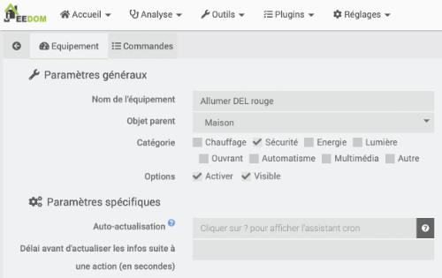

Cliquez ensuite sur l'onglet Commandes puis sur Ajouter une commande script.

Donnez un nom à la commande (ex : Lancer).

Le type doit être à Action.

Dans la case Requête, entrez une commande sous la forme sudo python3 /chemin/nom\_du\_script.PY.

* Vous devez préciser le chemin complet du script.
* Le nom du fichier doit se terminer par .PY en majuscules (ou autre extension de votre choix) car l'extension .py est automatiquement interprétée par Jeedom comme du Python 2.

Après avoir sauvegardé, vous pouvez cliquer sur le bouton Tester afin de voir si tout fonctionne.

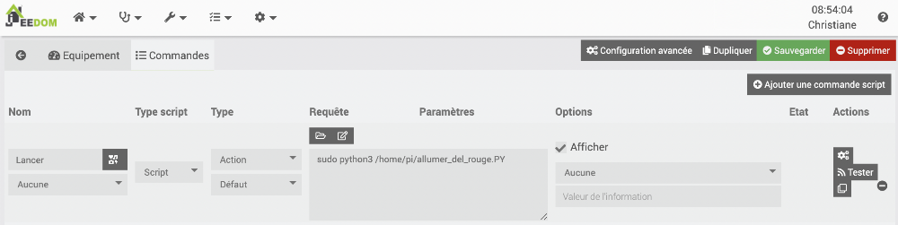

Le script Python, qui est une commande d'un équipement au yeux de Jeedom, peut désormais être utilisé au même titre que n'importe quelle autre commande [dans vos scénarios Jeedom]()!

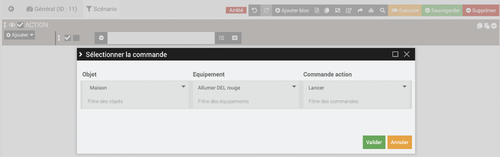


Si un scénario lance un script Python qui fait clignoter une DEL (donc avec boucle infinie), on pourra arrêter le clignotement à l'aide d'un autre scénario qui se charge de :

* Arrêter le scénario qui avait lancé le cligotement  

  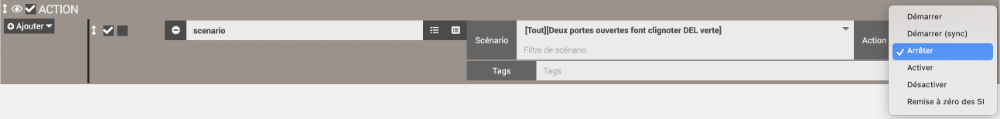
* Tuer le processus associé au script Python qui a lancé le clignotement à l'aide d'une commande du genre :  

  Terminal du Raspberry Pi

  sudo pkill -f clignoter.PY
* S'assurer que la DEL est éteinte :
  + lancer un script Python qui se charge d'éteindre la DEL

    ou
  + lancer le [script Python qui se charge de réinitialiser toutes les broches]()

## 50.2 Lancer un script Python avec le plugin Script

Le plugin Script, comme son nom le laisse entendre, permet de lancer à partir de Jeedom des scripts présents sur le Raspberry Pi.

Les possibilités offertes par ces scripts sont quasi illimitées. On s'en servira, notamment, de contrôler les ports du GPIO du Raspberry Pi.

## Installation du plugin

Pour installer le plugin Script, rendez-vous dans Plugins / Gestion des plugins / Market.

Dans la zone de recherche, entrez script.

Cliquez sur le plugin Script - officiel par Jeedom SAS.

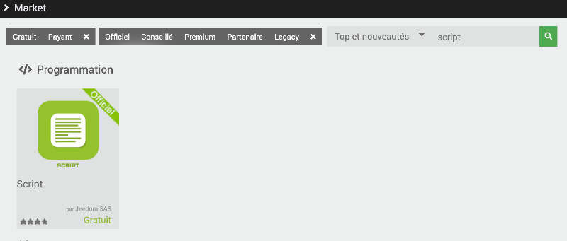

## Activation du plugin

Dans l'interface de Jeedom, rendez-vous dans le menu Plugins / Programmation / Script puis cliquez sur l'icône Configuration.

Pour activer le plugin, cliquez sur le bouton Activer dans la zone État.

## Édition d'un script

Bien entendu, pour que le plugin exécute un script, il faut éditer ce script.

Plusieurs types de scripts sont supportés :

* Script : Python ou Bash
* HTTP
* HTML
* XML
* JSON

Pour lancer une commande ou une série de commandes qui contrôlent une LED, un [apical\_lien\_interne][la\_base\_des\_scripts\_avec\_rpi\_gpio,script Python][/apical\_lien\_interne] est un excellent choix.

Pour éditer ce script, vous avez le choix entre :

* écrire le fichier directement sur le Pi par exemple avec l'éditeur nano
* l'écrire directement dans Jeedom
* l'écrire sur votre ordinateur personnel puis de le [apical\_lien\_interne][copier\_un\_fichier\_sur\_une\_machine\_linux\_a\_partir\_d\_un\_autre\_ordinateur,copier sur le Pi][/apical\_lien\_interne] .

Attention : si vous éditez le script sur un ordinateur Windows, les caractères de fin de ligne ne sont pas reconnus par Linux et Jeedom réagira en vous disant que le fichier n'existe pas.

Vous devez absolument [apical\_lien\_interne][encodage\_des\_fins\_de\_lignes\_crlf\_vs\_lf,changer l'encodage des fins de lignes][/apical\_lien\_interne] afin que Linux puisse utiliser le fichier.

Dans le cas d'un script Python 3, le nom du fichier doit se terminer par .PY en majuscules (ou autre extension de votre choix) car l'extension .py est automatiquement interprétée par Jeedom comme du Python 2.

Pour renommer votre script :

Terminal du Raspberry Pi

mv /home/pi/mon\_script.py /home/pi/mon\_script.PY


Le script Python peut être placé n'importe où sur le Raspberry Pi.

Sachez que si le script est placé dans le dossier /var/www/html ou dans un de ses sous-dossiers, il fera automatiquement partie de [apical\_lien\_interne][copie\_de\_securite\_de\_jeedom,la copie de sécurité de Jeedom][/apical\_lien\_interne].

Mais j'avoue que pour fins de simplicité, je place souvent mes scripts sous /home/pi (le dossier personnel de l'usager pi) puisque c'est le dossier qui apparaît lorsqu'on accède au Terminal à partir d'un clavier et d'un écran branchés au Pi ou via SSH.

À ce moment, je suis responsable d'effectuer mes copies de sécurité.

Il revient à chacun d'assumer ses choix!

Remarquez que sous Plugins / Programmation / Script / Configuration, la case Chemin des scripts utilisateur indique l'emplacement où seront enregistrés les scripts qui sont créés directement dans Jeedom.

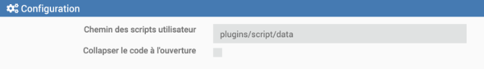

## Lancement du script à partir de Jeedom

Pour lancer le script, il faut ajouter dans le plugin Script un équipement puis une commande.

Rendez-vous dans le menu Plugins / Programmation / Script puis cliquez sur le +.

Donnez un nom à l'équipement, par exemple « Allumer DEL rouge ».

Cochez la case Activer pour que le script puisse être utilisé.

Si désiré, activez la case Visible pour rendre l'équipement visible sur le Dashboard. Notez que le script pourra fonctionner même s'il n'est pas visible.

Cliquez ensuite sur l'onglet Commandes puis sur Ajouter une commande script.

Donnez un nom à la commande (ex : Lancer).

Le type doit être à Action.

Il est possible d'éditer le script directement dans Jeedom en cliquant sur l'icône Nouveau ou de faire référence à un script existant.

Dans cette démonstration, j'utilise un script existant.

Dans la case Requête, entrez une commande sous la forme sudo python3 /chemin/nom\_du\_script.PY.

Vous devez préciser le chemin complet du script.

Après avoir sauvegardé, vous pouvez cliquer sur le bouton Tester afin de voir si tout fonctionne.

## Lancer le script à partir d'un scénario

Le script, qui est une commande d'un équipement au yeux de Jeedom, peut désormais être utilisé au même titre que n'importe quelle autre commande [apical\_lien\_interne][creer\_un\_scenario\_provoque,dans vos scénarios Jeedom][/apical\_lien\_interne]!

## Quelques erreurs courantes

### Extension .PY

Dans le cas d'un script Python 3, il faut changer l'extension du fichier pour .PY (en majuscules).

Si le nom se termine par .py, il sera considéré par Jeedom comme étant un fichier Python 2 et Jeedom ajoutera automatiquement la commande python devant la commande entrée. Vous obtiendrez alors un message d'erreur du genre « Erreur sur python sudo python3 /home/pi/allumer\_led.py 2>&1 valeur retournée : 2. Détails : python: can't open file 'sudo': [Errno 2] No such file or directory ».

![can't open file 'sudo': [Errno 2] No such file or directory](NotesDeCoursApical-420_3a4_vi_objets_connectes_1_a_2025_files/Jeedom-ErreurNomFichierPython3.png)

### sudo

Pour qu'un script Python puisse interagir avec le GPIO, vous devez précéder la commande par sudo.

Si vous ne le faites pas, vous obtiendrez un message du genre « Erreur sur python3 /home/pi/allumer\_led.PY 2>&1 valeur retournée : 1. Détails : Traceback (most recent call last): File "/home/pi/allumer\_led.PY", line 23, in GPIO.setup(led, GPIO.OUT) RuntimeError: No access to /dev/mem Try running as root! ».

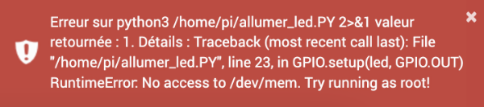

### Chemin du script

Vous devez spécifier le chemin complet du script.

Si vous ne le faites pas, vous obtiendrez un message du genre « Erreur sur sudo python3 allumer\_led.PY 2>&1 valeur retournée : 2. Détails : python3: can't open file 'allumer\_led.PY': [Errno 2] No such file or directory ».

![can't open file 'allumer_led.PY': [Errno 2] No such file or directory](NotesDeCoursApical-420_3a4_vi_objets_connectes_1_a_2025_files/Jeedom-ErreurCheminNonPrecise.png)

### Droits d'exécution ou python3

Un script Python peut être exécuté de deux façons : en faisant précéder son nom par python3 ou [apical\_lien\_interne][La\_protection\_des\_fichiers,en donnant des droits d'exécution au fichier][/apical\_lien\_interne].

Si l'usager courant n'a pas les droits d'exécution sur le fichier et que vous n'avez pas fait précéder son nom par python3 dans la commande sous Jeedom, vous obtiendrez un message du genre « Erreursur sudo /home/pi/allumer\_led.PY 2>&1 valeur retournée : 1. Détails :sudo /home/pi/allumer\_led.PY: command not found ».

## Pour plus d'information

« Plugin Script ». Plugin Script. <https://doc.jeedom.com/fr_FR/plugins/programming/script/>

## 50.3 Arrêter correctement un scénario avec boucle infinie

Règle générale, avec le plugin Scripts dans Jeedom, il faut éviter de lancer des scripts qui contiennent une boucle sans fin.

Parfois, cependant, la tâche à réaliser nécessite une telle boucle, par exemple [apical\_lien\_interne][la\_base\_des\_scripts\_avec\_rpi\_gpio,pour faire clignoter une DEL branchée au GPIO,clignoter][/apical\_lien\_interne].

Rappelez-vous que lorsqu'on lance le script Python à la ligne de commande, il faut appuyer sur Ctrl+C pour l'arrêter. Mais quand c'est Jeedom qui le lance, ceci n'est pas possible.

Ceci pose problème dans un système domotique qui doit démarrer ou arrêter le clignotement à l'aide de scénarios. En effet, tant que le clignotement est en cours, aucun autre script Python ne peut travailler avec la broche utilisée, même pas pour lui envoyer le signal de s'éteindre. Si vous tentez de le faire, vous obtiendrez une erreur du genre « ... File "/home/pi/mon\_script.PY", line 34, in GPIO.setup(del, GPIO.OUT) ... lgpio.error: 'GPIO not allocated'».

Pour qu'un scénario puisse arrêter correctement le clignotement, il doit :

* [Arrêter le scénario qui a lancé le cligotement](#scenario)
* [Tuer le processus associé au script Python qui a lancé le clignotement](#processus)
* [S'assurer que la DEL est éteinte](#del)

## Arrêter le scénario qui a lancé le clignotement

Si vous faites afficher dans le Dashboard le scénario qui a lancé le clignotement, vous verrez une animation qui indique que le scénario est toujours en cours d'exécution et ce, même si vous avez pris soin de tuer le processus en charge du clignotement (technique présentée plus bas).

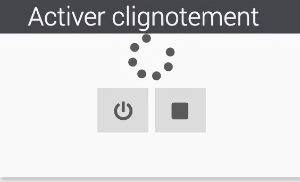

Heureusement, il est possible de demander au scénario qui doit arrêter le clignotement de commencer par arrêter le scénario précédent.

Pour qu'un scénario arrête un autre scénario, il faut choisir Sélectionner un mot-clé plutôt que Sélectionner la commande.

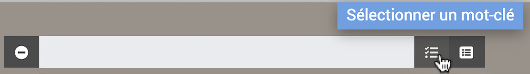

Dans la liste déroulante qui apparaît, sélectionnez Scénario. Ceci permet d'avoir un scénario qui agit sur un autre scénario.

À partir de là, vous pourrez sélectionner le scénario qui contient la boucle sans fin et choisir l'action Arrêter.

## Tuer le processus associé au script Python qui a lancé le clignotement

Quand un script Python est lancé, il est associé à un processus dans le système d'exploitation.

Pour arrêter un script avec une boucle sans fin alors qu'il a été lancé au terminal, il est possible d'arrêter ce processus en appuyant sur les touches Ctrl+C.

Dans le cas où il a été lancé dans Jeedom, il faut utiliser la commande [pkill](https://linuxize.com/post/pkill-command-in-linux/) suivie de -f puis du nom du script Python.

Cette commande peut être testée au terminal.

Terminal du Raspberry Pi

sudo pkill -f clignoter.PY

Dans Jeedom, le processus sera tué à l'aide du plugin Script. Il faut créer une commande de type action dans la quelle on entre la commande pkill complète.

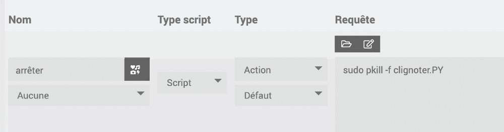

Quand vous lancez cette commande, il peut arriver que Jeedom affiche un message disant que la commande a retourné un code 15.

Vous pouvez ignorer ce message.


Dans le cas d'un script qui fait clignoter une DEL, il peut arriver que la DEL demeure allumée après que le processus ait été tué. Tout dépend de l'état dans lequel elle se trouvait au moment précis où le processus a été tué.

Pour l'éteindre, vous avez deux choix :

* lancer un script Python qui se charge d'éteindre la DEL

  ou
* lancer le [apical\_lien\_interne][script\_pour\_reinitialiser\_toutes\_les\_broches\_programmables\_du\_gpio,script Python qui se charge de réinitialiser toutes les broches][/apical\_lien\_interne]


Un script Python peut [apical\_lien\_interne][passer\_un\_parametre\_a\_un\_script\_python,recevoir des paramètres][/apical\_lien\_interne].

Le plugin Script de Jeedom permet de lancer un script Python en lui passant un ou plusieurs paramètres.

Il suffit d'entrer dans la case Requête une chaîne au format :

sudo python3 /chemin/nom\_script.PY paramètre

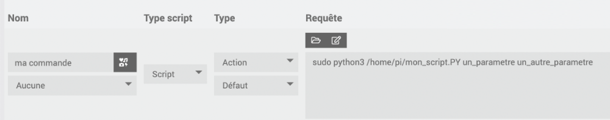

<!-- --- split --- -->


## 51.1 Erreur « Permission denied »

### Problème :

Lorsque vous essayez de lancer un script bash à partir de Jeedom à l'aide du plugin Script - officiel par Jeedom SAS, vous obtenez un message du genre « Erreur sur /home/pi/monscript.sh 2>&1 valeur retournée : 126. Détails : sh: 1: /home/pi/monscript.sh: Permission denied ».

### Contexte :

* Jeedom 4.0.61

### Cause possible :

Le script ne possède pas les droits d'exécution pour la catégorie d'usagers « Autres ».

### Solution proposée :

Donnez les droits d'exécution sur le fichier. Même si ceci n'est pas requis, on peut dans une même commande donner les droits égalemenet au propriétaire et au groupe propriétaire.

Terminal sur Raspberry Pi

chmod 777 monscript.sh

## 51.2 Erreur « 127 : not found »

### Problème :

Lorsque vous essayez de lancer un script bash à partir de Jeedom à l'aide du plugin Script - officiel par Jeedom SAS, vous obtenez un message du genre « Erreur sur /var/www/html/plugns/script/test.sh 2>&1 valeur retournée : 127. Détails : sh: 1:/var/www/html/plugns/script/test.sh: not found ».

Pourtant, vous êtes certains que le fichier existe à l'emplacement proposé.

### Contexte :

* Jeedom 4.0.61

### Cause possible :

Le script a été écrit sur un ordinateur Windows avant d'être copié sur le Raspberry Pi et l'encodage des fins de lignes n'a pas été adapté pour Linux.

Pour le savoir, lancez la commande suivante sur le Raspberry Pi :

Terminal

cat -v test.sh

Si une fin de ligne est marquée par CRLF (encodage requis sous Windows), elle apparaîtra sous la forme ^M.

Résultat à l'écran

#!/bin/bash^M

### Solution proposée :

L'éditeur Geany peut convertir les caractères de fins de ligne selon vos préférences.

Sous Windows, Mac ou Linux, rendez-vous dans le menu Document / Définir les fins de ligne et choisissez l'option qui vous convient.

## 51.3 Erreur « RuntimeError: No access to /dev/mem. Try running as root! »

### Problème :

Lorsque vous essayez de lancer un script bash à partir de Jeedom à l'aide du plugin Script - officiel par Jeedom SAS, vous obtenez un message du genre « Erreur sur /home/pi/monscript.sh on 2>&1 valeur retournée : 1. Détails : Traceback (most recent call last): File "/home/pi/monscript.py", line 19, in GPIO.setup(led, GPIO.OUT) RuntimeError: No access to /dev/mem. Try running as root! ».

### Contexte :

* Jeedom 4.0.61

### Cause possible :

Le script bash qui se charge d'appeler le script Python ne fait pas de sudo devant la commande.

Fichier monscript.sh

#!/bin/bash

 

python3 /home/pi/monscript.py

### Solution proposée :

Ajoutez sudo devant la commande.

Fichier monscript.sh

#!/bin/bash

 

sudo python3 /home/pi/monscript.py

<!-- --- split --- -->




N'oubliez pas que vous avez à votre disposition différentes [apical\_lien\_interne][comment\_deboguer\_un\_scenario,techniques de débogage][/apical\_lien\_interne] pour vos scénarios.

1. Dans votre boîte Jeedom, [apical\_lien\_interne][lancer\_un\_script\_python\_avec\_le\_plugin\_script,ajoutez une commande qui permet de lancer le script,lancer][/apical\_lien\_interne] qui allume la DEL bleue. Testez votre script à l'aide du bouton Tester disponible à côté de la commande.
2. Faites le nécessaire pour que lorsqu'une porte de votre système domotique s'ouvre, [apical\_lien\_interne][lancer\_un\_script\_python\_avec\_le\_plugin\_script,la DEL bleue s'allume][/apical\_lien\_interne]. Autrement dit, le scénario doit appeler la commande associée au script Python lorsque la condition est rencontrée.
3. Votre boîte Jeedom doit éteindre la DEL bleue lorsque la porte se referme. Vous devez utiliser votre script avec paramètre, créé au dernier cours, pour y parvenir.
4. Lorsqu'une autre porte de votre système s'ouvre (vous pouvez au besoin créer un autre virtuel), la DEL rouge doit s'allumer puis s'éteindre lorsque la porte se referme.
5. Faites le nécessaire pour que lorsque les deux portes sont ouvertes en même temps, une DEL verte clignote (cette fois, il s'agit bien de la faire clignoter ;-)). Le clignotement s'arrêtera dès qu'au moins une des porte se referme.
6. Écrivez un scénario qui, lorsque Jeedom démarre, allume la DEL rouge pendant une seconde, la DEL bleue pendant une seconde et la DEL verte, également pendant une seconde. Il n'est pas nécessaire d'attendre qu'une DEL soit éteinte avant d'allumer la suivante mais c'est correct si vous le faites. Notez bien : lorsque vous écrivez un script Python, vous devez toujours le tester dans le Terminal du Pi avant de l'utiliser dans Jeedom. Ceci vous permettra de repérer plus facilement les erreurs potentielles, par exemple des erreurs d'indentation ou de syntaxe.
7. Effectuez une sauvegarde manuelle de Jeedom et téléchargez-la sur votre poste de travail.
8. Sur votre seconde carte micro SD, restaurez le système à partir de la sauvegarde que vous venez de réaliser (TRÈS IMPORTANT en cas de défectuosité de la première carte pendant l'examen).

<!-- --- split --- -->

# 53. Pour le prochain cours


Vous disposez d'un cours pour acquérir les connaissances théoriques et finaliser cet exercice.

Une fois cet exercice complété, vous devez effectuer vos lectures pour l'exercice suivant.

<!-- --- split --- -->


## 54.1 En résumé...

Voici un résumé des informations essentielles du ou des prochains chapitres.

Notez que certaines fiches, qui font partie intégrante du cours, pourraient ne pas figurer dans ce résumé.

Je vous recommande d'effectuer une lecture de l'ensemble des fiches de ces chapitres afin de bien saisir les enjeux.


Permet de savoir si une personne en particulier est à la maison ou pas.

On peut [apical\_lien\_interne][travailler\_avec\_le\_plugin\_networks,travailler avec le plugin Networks][/apical\_lien\_interne] : détectera la présence d'un téléphone via Wi-Fi.

On peut [apical\_lien\_interne][travailler\_avec\_le\_plugin\_detection\_de\_telephone,travailler avec le plugin Détection de téléphone][/apical\_lien\_interne] : détectera la présence d'un téléphone via Bluetooth.

Si on n'a pas de téléphone, on peut utiliser un localisateur d'objets (Ex : Tile, Cube, Nut) et travailler avec [apical\_lien\_interne][travailler\_avec\_le\_plugin\_bluetooth\_advertisement\_blea,plugin BLEA][/apical\_lien\_interne].

Dans tous les cas, les scénarios seront plus faciles à réaliser si le déclencheur est le téléphone réel OU une présence virtuelle.


La détection de présence est dans la même famille que la détection de mouvement. La différence, c'est que la détection de présence permet de savoir si une personne en particulier est dans la maison plutôt que de détecter un mouvement quelconque.

Il existe plusieurs techniques pour détecter la présence d'une personne.

Et plusieurs plugins Jeedom pour y arriver.

Dans le cas où l'une des personnes pour qui vous désirez détecter la présence ne possède pas de téléphone, il est possible de travailler avec un localisateur d'objets (tracker), par exemple un Tile (<https://www.thetileapp.com/en-us/store/tiles/sticker>) un Cube (<https://cubetracker.com/collections/all>) ou un Nut (<https://www.nutfind.com/collections/all>).

À ce moment, vous devrez utiliser [apical\_lien\_interne][travailler\_avec\_le\_plugin\_bluetooth\_advertisement\_blea,le plugin Bluetooth Advertisement (BLEA)][/apical\_lien\_interne].

Mais concentrons-nous pour l'instant sur l'utilisation du téléphone cellulaire.

Dans les fiches qui suivent, je vous montre comment :

* Détecter la présence d'un téléphone via le Wi-Fi [apical\_lien\_interne][travailler\_avec\_le\_plugin\_networks,à l'aide du plugin Networks][/apical\_lien\_interne]
* Détecter la présence d'un téléphone via Bluetooth [apical\_lien\_interne][travailler\_avec\_le\_plugin\_detection\_de\_telephone,à l'aide du plugin Détection de téléphone][/apical\_lien\_interne]

## 54.3 Travailler avec le plugin Networks

Le plugin [Networks](https://doc.jeedom.com/fr_FR/plugins/communication/networks/) permet d'effectuer différentes tâches sur un réseau. Il est capable notamment de faire un ping sur une adresse IP afin de voir si l'appareil branché sur cet appareil est en mesure de répondre.

Il permet également de « réveiller » un appareil à l'aide du WOL (Wake On Lan). Cette fonctionnalité est en dehors du propos de cette fiche alors si ça vous intéresse, je vous laisse approfondir par vous-même. Voici un lien pour vous aider : [https://youdom.net/demarrer-son-ordinateur-avec-votre-domotique-jeedom/]()%20:%20https:/youdom.net/demarrer-son-ordinateur-avec-votre-domotique-jeedom/).

## Installation du plugin

Pour installer le plugin **Networks**, rendez-vous dans Plugins / Gestion des plugins / Market.

Rercherchez le plugin **Networks** - par Jeedom SAS puis procédez à son installation.

Une fois le plugin installé, vous devez l'activer dans son écran de configuration.

## Adresse IP du téléphone

Pour détecter la présence d'un téléphone, vous devez connaître son adresse IP.

Votre téléphone doit être branché à un réseau Wi-Fi qui peut communiquer avec votre Raspberry Pi.

Pour connaître l'adresse IP d'un téléphone :

Sur iPhone, rendez-vous dans Réglages / Wi-Fi puis cliquez sur le réseau que vous utilisez présentement. L'adresse IP sera affichée plus bas.

Sur Android, rendez-vous dans Paramètres / Réseau et Internet / Internet puis cliquez sur le réseau que vous utilisez présentement. L'adresse IP sera affichée plus bas.

## Ajout d'un téléphone

De retour dans Jeedom, vous devez ajouter un équipement dans le plugin Networks pour chaque téléphone que vous désirez détecter.

Rendez-vous dans le menu Plugins / Communication / Network puis cliquez sur Ajouter.

Parmi les informations demandées, notez :

* Adresse IP : tel que noté plus haut
* Méthode de ping : ARP

Remarquez que l'adresse MAC et le broadcast IP ne sont pas requis ici puiqu'ils servent à faire du WOL (Wake On Lan).

Dans l'onglet Commandes, vous pouvez choisir de n'afficher que certaines commandes, par exemple le statut et l'adresse IP.

Et voilà! Le Dashboard indiquera quand le téléphone est détecté ou non et vous pourrez utiliser cette information dans vos scénarios.

Une façon facile de vérifier si Jeedom détecte correctement votre téléphone : désactivez le Wi-Fi du téléphone et constatez que le statut affiche un X.

Jeedom devrait rafraîchir le statut en dedans de 1-2 minutes.


Maintenant que Jeedom peut détecter la présence de téléphones, vous pouvez créer des scénarios qui réagissent à la présence ou à l'absence des différents occupants de la maison!

Pour tester vos scénarios, vous avez trois choix :

* Demander à quelqu'un de s'en aller avec son cellulaire et de revenir des dizaines de fois pendant que vous faites vos tests (ouf!).
* Désactiver le Wi-Fi de votre téléphonee pour simuler votre départ. Jeedom vous marquera comme absent après quelques minutes (un peu long mais fonctionnel).
* Ajouter un détecteur de présence [apical\_lien\_interne][travailler\_avec\_le\_plugin\_virtuel,virtuel][/apical\_lien\_interne] et utiliser deux déclencheurs dans vos scénarios. L'action sera réalisée si la présence réelle change OU si la présence virtuelle change.

  

## 54.4 Travailler avec le plugin Détection de téléphone

Le plugin Détection de téléphone permet de réagir lorsqu'une personne – ou plutôt son téléphone – entre ou sort de la maison.

Son fonctionnement est semblable à celui du [apical\_lien\_interne][travailler\_avec\_le\_plugin\_networks,plugin Networks][/apical\_lien\_interne] sauf qu'il travaille en Bluetooth plutôt qu'en Wi-Fi.

À vous de voir celui que vous préférez.

## Installation du plugin

Pour installer le plugin Détection de téléphone, rendez-vous dans Plugins / Gestion des plugins / Market.

Dans la zone de recherche, entrez phone.

Cliquez sur le plugin Détection de téléphone (Bluetooth) - par sebmafate.

## Configuration du Bluetooth sur le Pi

Avant d'aller plus loin, effectuez les manipulations nécessaires pour activer le Bluetooth sur le Raspberry Pi, tel qu'expliqué sur cette fiche : [apical\_lien\_interne]activer\_bluetooth\_sur\_raspberry\_pi\_os\_lite[/apical\_lien\_interne]. Remarquez que vous n'aurez pas à effectuer de pairage à ce stade.

## Configuration du plugin

Dans l'interface de Jeedom, rendez-vous dans le menu Plugins / Sécurité / Détection de téléphone (Bluetooth).

D'abord, activez le plugin en cliquant sur le bouton Activer dans la zone État.

Dans la zone Dépendances, assurez-vous que toutes les dépendances sont installées. Si vous voyez le statut NOK, cliquez sur Relancer pour régler le problème.

Dans la zone Configuration, si [apical\_lien\_interne][activer\_bluetooth\_sur\_raspberry\_pi\_os\_lite,le Bluetooth a été correctement activé sur le Pi][/apical\_lien\_interne], la zone Contrôleur Bluetooth devrait vous offrir une adresse MAC dans la liste déroulante. Sélectionnez cette adresse puis cliquez sur Sauvegarder.

Après cette configuration, la zone Démon devrait indiquer que le statut est OK. Si c n'est pas le cas, cliquez sur (Re)Démarrer.

## Adresse MAC Bluetooth du téléphone

Pour détecter la présence d'un téléphone, vous devez connaître son adresse MAC (Media Access Control) pour le Bluetooth.

Attention : ne pas confondre avec l'adresse MAC du Wi-Fi. On veut l'adresse MAC Bluetooth.

Sur iPhone, rendez-vous dans Réglages / Général / Informations. L'adresse MAC recherchée est vis-à-vis Bluetooth.

Sur Android, rendez-vous dans Paramètres / À propos du téléphone. L'adresse MAC recherchée est vis-à-vis Adresse Bluetooth.

## Ajout d'un téléphone

De retour dans Jeedom, rendez-vous dans le menu Plugins / Sécurité / Détection de téléphone (Bluetooth) puis cliquez sur Ajouter.

Entrez les informations sur le téléphone.

Et voilà! Le Dashboard indiquera quand le téléphone est détecté ou non et vous pourrez utiliser cette information dans vos scénarios.

## Si le téléphone n'est pas détecté

Parfois, il faut mettre quelques efforts supplémentaires pour que le téléphone soit correctement détecté. Voici quelques actions qui pourraient vous aider à régler un problème de téléphone non détecté.

* Assurez-vous que l'adresse Mac entrée est bien celle du Bluethooth du téléphone.
* Redémarrez Jeedom. Vous pourrier avoir à réactiver Bluetooth et HCI UART sur le Pi.

  Terminal

  sudo systemctl start bluetooth  
  sudo service bluetooth status  
  sudo systemctl start hciuart  
  systemctl status hciuart
* Consultez le fichier journal phone\_detection.
* Redémarrez le démon en cliquant sur (re)Démarrer dasn la fenêtre de configuration du plugin Détection de téléphone.
* Patientez... parfois, le plugin peut mettre quelques minutes avant de réagir puisque s'il vérifie plus souvent, cela demandera trop de ressources au système.


Maintenant que Jeedom peut détecter la présence de téléphones, vous pouvez créer des scénarios qui réagissent à la présence ou à l'absence des différents occupants de la maison!

Pour tester vos scénarios, vous avez trois choix :

* Demander à quelqu'un de s'en aller avec son cellulaire et de revenir des dizaines de fois pendant que vous faites vos tests (ouf!).
* Désactiver le bluetooth de votre téléphonee pour simuler votre départ. Jeedom vous marquera comme absent après quelques minutes (un peu long mais fonctionnel).
* Ajouter un détecteur de présence [apical\_lien\_interne][travailler\_avec\_le\_plugin\_virtuel,virtuel][/apical\_lien\_interne] et utiliser deux déclencheurs dans vos scénarios. L'action sera réalisée si la présence réelle change OU si la présence virtuelle change.

  

## Pour plus d'information

« sebmafate/phone\_detection ». GitHub - sebmafate/phone\_detection. <https://github.com/sebmafate/phone_detection>

« Gestion de la présence avancées ». La domotique pratique. <https://www.ladomopratique.com/jeedom-scenario-gestion-de-la-presence-avancees/>

« Tuto : Centre de gestion de présence dans la domotique Jeedom ». Ça sert à quoi?. <https://www.ca-sert-a-quoi.com/articles/domotique/tuto-centre-de-gestion-de-presence/>

## 54.5 Travailler avec le plugin Bluetooth Advertisement (BLEA)

Si, dans votre système domotique Jeedom, vous désirez détecter la présence de personnes ciblées mais que vous ne pouvez pas utiliser les téléphones cellulaires en guise d'appareils à détecter, vous pouvez vous tourner vers les localisateurs d'objets (trackers), par exemple :

* Tile (<https://www.thetileapp.com/en-us/store/tiles/sticker>)
* Cube (<https://cubetracker.com/collections/all>)
* Nut (<https://www.nutfind.com/collections/all>)

Vous travaillerez à ce moment avec le plugin Bluetooth Advertisement, aussi appelé BLEA.

## Installation du plugin

Pour installer le plugin BLEA, rendez-vous dans Plugins / Gestion des plugins / Market.

Dans la zone de recherche, entrez blea.

Cliquez sur le plugin Bluetooth Advertisement - officiel par Jeedom SAS.

## Configuration du bluetooth sur le Pi

Avant d'aller plus loin, effectuez les manipulations nécessaires pour activer le bluetooth sur le Raspberry Pi, tel qu'expliqué sur cette fiche : [apical\_lien\_interne]activer\_bluetooth\_sur\_raspberry\_pi\_os\_lite[/apical\_lien\_interne]. Remarquez que vous n'aurez pas à effectuer de pairage à ce stade.

## Configuration du plugin

Dans l'interface de Jeedom, rendez-vous dans le menu Plugins / Protocole domotique / Publicité Bluetooth (ou Bluetooth Advertisement) puis cliquez sur l'icône Configuration.

D'abord, activez le plugin en cliquant sur le bouton Activer dans la zone État.

Dans la zone Dépendances, assurez-vous que toutes les dépendances sont installées. Si vous voyez le statut NOK, cliquez sur Relancer pour régler le problème.

Dans la zone Configuration / Démon, si le bluetooth a été correctement activé, la zone Port clef bluetooth devrait vous offrir une adresse MAC dans la liste déroulante. Sélectionnez cette adresse.

Après cette configuration, la zone Démon devrait indiquer que le statut est OK.

## Pairage d'un périphérique Bluetooth

Pour pairer un périphérique, suivez ces instructions.

* Rendez-vous dans me menu Plugins / Protocole domotique / Bluetooth Advertisement.

  
* Cliquez sur Lancer Scan.
* Dans la fenêtre Inclusion BLEA, choisissez Tous afin de maximiser les chances de trouver votre équipement Bluetooth. Si jamais trop d'équipements étaient trouvés, vous pourrez raffiner la recherche afin de cibler une compagnie précise.

  
* Jeedom vous informera qu'il est en mode scan.

  
* Puis il vous montrera les équipements trouvés.

  Vous pouvez désormais configurer l'équipement Bluetooth comme vous le feriez avec tout autre équipement en précisant le nom de l'équipement, son objet parent, sa catégorie, etc.

  

## Si le périphérique n'est pas détecté

Par défaut, seul les périphériques reconnus par le plugin BLEA sont détectables.

Il y a une option sur la page de configuration du plugin qui permet de détecter tous les périphériques bluetooth.

Pour l'activer, rendez-vous dans le menu Plugins / Protocole domotique / Bluetooth Advertisement / onglet Configuration / section Configuration. Cochez Autoriser l'inclusion de devices inconnus.

Lors du prochain scan, une multitude d'appareils bluetooth seront détectés. Le défi sera de retrouver lequel correspond au périphérique souhaité.

Certains n'affichent que leur adresse MAC.

Avec un peu de chance, votre périphérique sera identifié par son nom, comme ici mon localisateur d'objets Cube Pro.

Une fois que vous avez repéré votre périphérique, vous pouvez aller dans ses configurations pour modifier son nom, ajuster les commandes qui seront visibles sur la tuile, etc.

## Pour plus d'information

« BLEA (Bluetooth advertisement) ». Jeedom. <https://doc.jeedom.com/fr_FR/plugins/automation%20protocol/blea/>