

<!-- --- split --- -->


## 84.1 Configurer Home Assistant pour l'envoi de courriel

Home Assistant est capable d'envoyer du courriel lorsqu'il est correctement configuré.

D'abord, [apical\_lien\_interne][creer\_une\_adresse\_de\_courriel\_avec\_votre\_nom\_de\_domaine,créez une adresse de courriel avec votre nom de domaine][/apical\_lien\_interne]. Cette adresse pourra être utilisée pour envoyer des courriels par programmation si votre fournisseur de courriel habituel (ex : GMail) ne le permet pas. L'adresse pourrait être sous la forme homeassistant@mondomaine.com.

Ajoutez maintenant ces configurations [apical\_lien\_interne][Editer\_le\_fichier\_configuration\_yaml,dans le fichier configuration.yaml][/apical\_lien\_interne].

Fichier configuration.yaml

notify:  
  - name: courriel\_administrateur   
    platform: smtp  
    sender: homeassistant@mondomaine.com  
    server: mail.mondomaine.com  
    timeout: 15  
    port: 587  
    encryption: starttls  
    username: homeassistant@mondomaine.com  
    password: mot\_de\_passe\_en\_clair  
    sender\_name: Home Assistant  
    recipient: destinataire@sondomaine.com

Si le courriel doit être envoyé à plus d'un destinataire :

Fichier configuration.yaml

recipient:  
      - destinataire@sondomaine.com  
      - autredestinataire@autredomaine.com

Attention : ne mettez pas de caractères accentués sur la ligne sender\_name.

J'ai fait des tests avec sender\_name: Home Assistant Cégep et j'obtenais ceci dans mon courriel comme nom de l'envoyeur :

=?utf-8?q?Home\_Assistant\_C=C3=A9gep\_=3Chomeassistant...

Tout est entré dans l'ordre quand j'ai enlevé l'accent.

Il est cependant possible d'utiliser des accents dans le titre et dans le message du courriel.

## Tester le tout

Pour vérifier si les configurations fonctionnent, rendez-vous dans le menu Outils de développement puis choisissez l'onglet Actions.

Le nom de l'action doit être « notify. » suivi du nom que vous avez donné à votre configuration YAML (si la configuration commence par name: courriel\_administrateur, le nom du service est notify.courriel\_administrateur).

Dans les zones prévues à cet effet, donnez un titre et un message au courriel puis cliquez sur Exécuter l'action.

Si vous préférez remplir les informations en mode YAML, vous obtiendrez ceci :

Vérifiez dans la ou les boîtes de courriel qui ont été configurées (recipient), le message devrait y avoir été envoyé.

Attention : le message pourrait avoir été placé dans les pourriels. Si c'est le cas, vous devrez configurer votre outil de messgerie pour ajouter l'expéditeur aux expéditeurs approuvés afin que ça ne se reproduise plus.

Une fois ces configurations en place, il sera possible [apical\_lien\_interne][automatisation\_qui\_envoie\_un\_courriel,d'envoyer un courriel dans une automatisation][/apical\_lien\_interne], par exemple lorsque le capteur d'ouverture de porte détecte que la porte a été ouverte entre minuit et 6h00.

## Pour plus d'information

« SMTP ». Home Assistant. <https://www.home-assistant.io/integrations/smtp/>


Pour qu'une automatisation envoie un courriel, dans la zone Alors faire , il faut choisir :  Autres actions / Effectuer une action.

Dans la liste déroulante des actions, choisissez celui dont le nom est « Send a notification » suivi du nom que vous avez donné à votre configuration YAML.

Notez que cette action ne sera pas présente si la configuration pour l'envoi de courriel n'est pas correcte ou si Home Assistant n'a pas été redémarré après sa création.

Renseignez ensuite les informations du courriel à envoyer.

Ce courriel sera envoyé automatiquement lorsque le déclencheur que vous avez configuré sera activé (ex : lorsque la porte sera ouverte).

Si vous préférez travailler directement en YAML, le code du fichier automatisations.yaml ira comme suit :

Fichier automatisations.yaml

- id: '1606739413415'  
  alias: Porte ouverte envoie courriel  
  description: ''  
  trigger:  
  - trigger: state  
    entity\_id:  
    - input\_boolean.porte\_virtuelle  
    from: 'off'  
    to: 'on'  
  conditions: []  
  actions:  
  - action: notify.courriel\_administrateur  
  data:  
    message: La porte a été ouverte!  
    title: Porte ouverte  
 mode: single

<!-- --- split --- -->


## 85.1 Erreur « Unable to find service notify »

### Problème :

Lorsque vous utilisez le menu Outils de développement / Services afin de tester votre configuration SMTP pour envoyer du courriel avec Home Assistant, vous obtenez le message « �?chec d'appel du service "notify/courriel\_administrateur". Unable to find service notify/courriel\_administrateur ».

### Contexte :

* Home Assistant 0.118.4
* HassOS 4.16
* Raspberry Pi 3B

### Cause possible :

Vous n'avez pas redémarré le Raspberry Pi après avoir entré les configurations du service SMTP dans le fichier configuration.yaml.

### Solution proposée :

Redémarrez le Pi puis refaites le test d'envoi de courriel.

### Autre cause possible :

Il y a une erreur dans les configurations du service SMTP.

### Solution proposée :

Assurez-vous que les configurations utilisent les bonnes données. Par exemple, l'encryption pour la plupart des serveurs SMTP doit être starttls (notez la présence des deux t : START Transport Layer Security).

N'oubliez pas de redémarrer le Raspberry Pi après avoir modifié les configurations.

### Autre cause possible :

L'adresse de courriel que vous tentez d'utiliser ne permet pas l'envoi de courriel à partir d'une application.

Ceci est parfois le cas avec les adresses de fournisseurs génériques, par exemple gmail.

### Solution proposée :

Créez-vous une adresse de courriel avec un nom de domaine qui vous appartient (voir <).

<!-- --- split --- -->


## 86.1 Erreur « Aucune entité correspondante trouvée »

### Problème :

Lorsque vous créez une automatisation qui tient compte de la position d'un capteur virtuel de type device\_tracker, la section Entité avec emplacement, qui apparaît notamment quand on ajoute un déclencheur ou une condition de type zone, ne montre pas votre capteur virtuel.

Elle n'affiche que vos capteurs de positionnement réels, par exemple un téléphone ou la personne associée à ce téléphone.

Si vous n'avez aucun capteur de positionnement réel, elle affiche « Aucune entité correspondante trouvée ».

### Contexte :

* Home Assistant 2022.10.5
* HassOS 9.3
* Raspberry Pi 4

### Cause possible :

Lorsque vous avez initialisé la position du capteur virtuel, vous avez utilisé un nom de zone plutôt qu'une position GPS.

### Solution proposée :

Initialisez la position du capteur virtuel à l'aide d'une position GPS :

* Rendez-vous dans le menu Outils de développement / onglet Services (ou Action selon votre version de Home Assistant).
* Choisissez le service device\_tracker.see. Vous verrez apparaître à l'écran Dispoitif de suivi: See.
* Cochez GPS Coordinates.
* Retrouvez les coordonnées GPS désirées. Vous pouvez trouver les coordonnées GPS d'un point en faisant un clic droit à l'endroit désiré sur Google Maps

  
* Entrez les coordonnées entre crochets carrés avec une virgule entre la latitude et la longitude, par exemple [46.05970,-71.94362].

  
* Votre capteur virtuel est désormais disponible dans votre automatisation.

  Mais attention : si, par la suite, vous lui donnez une position en entrant le nom d'une zone dans la section Location name, votre capteur virtuel n'aura plus de coordonnées GPS.

  

<!-- --- split --- -->




1. Faites le nécessaire pour pouvoir [apical\_lien\_interne][configurer\_home\_assistant\_pour\_l\_envoi\_de\_courriel,envoyer du courriel avec Home Assistant][/apical\_lien\_interne]. L'adresse de courriel utilisée doit être au format homeassistant@mondomaine.com.
2. Modifiez une de vos automatisations pour qu'en plus d'agir sur le récepteur, [apical\_lien\_interne][automatisation\_qui\_envoie\_un\_courriel,elle envoie un courriel pour vous aviser de ce qui vient de se passer][/apical\_lien\_interne]. Le message envoyé devra contenir une information au sujet d'un capteur de votre choix, obtenue à l'aide d'un modèle.
3. Modifiez cette automatisation pour qu'en plus d'envoyer un courriel, elle écrive la valeur du capteur [apical\_lien\_interne][Ecrire\_dans\_un\_fichier\_journal,dans un fichier journal][/apical\_lien\_interne].
4. Créez une automatisation qui [apical\_lien\_interne][trouver\_l\_adresse\_ip\_de\_home\_assistant,retrouve l'adresse IP du Raspberry Pi à l'aide d'un modèle,modele][/apical\_lien\_interne] et qui vous l'envoie par courriel lors du démarrage de Home Assistant.
5. Créez une automatisation qui effectue l'action de votre choix [apical\_lien\_interne][automatisation\_qui\_tient\_compte\_de\_l\_heure,à 10h tous les jours][/apical\_lien\_interne] (vous pouvez changer l'heure pour vos tests).
6. Créez une automatisation qui effectue l'action de votre choix seulement si le capteur est activé entre 10h et 12h inclusivement (vous pouvez changer l'intervalle de temps pour vos tests).
7. Créez une automatisation qui effectue l'opération de votre choix à partir du déclencheur de votre choix mais seulement le samedi et le dimanche.
8. [apical\_lien\_interne][sauvegarde\_de\_home\_assistant,Créez une sauvegarde][/apical\_lien\_interne] de votre Home Assistant et copiez le fichier sur votre ordinateur.

<!-- --- split --- -->

# 88. Pour le prochain cours


Vous disposez d'un cours pour acquérir les connaissances théoriques et finaliser cet exercice.

Une fois cet exercice complété, vous devez effectuer vos lectures pour l'exercice suivant.

<!-- --- split --- -->


## 89.1 Les zones dans Home Assistant

Par défaut, Home Assistant a créé une zone lors de sa configuration initiale. Elle porte le nom que vous avez donné à votre boîte (ex : Maison).

Pour tirer profit des fonctionnalités de localisation de Home Assistant, vous devez définir les autres zones d'importance pour votre système : �?cole, Travail, Centre commercial, etc.

Comme pour plusieurs configurations, les zones peuvent être définies à l'aide de l'interface graphique ou encore dans le fichier configuration.yaml.

## Interface graphique

Lorsque vous définissez des zones dans Home Assistant, elles sont enregistrées dans le fichier /mnt/data/supervisor/homeassistant/.storage/zone.

Pour configurer l'emplacement de votre maison (l'endroit où se trouve Home Assistant) :

* Rendez-vous dans le menu Paramètres / Pièces, étiquettes et Zones / Onglet Zones.
* L'icône de maison devrait apparaître dans votre zone initiale. Déplacez-la à l'endroit désiré.

Pour ajouter d'autres emplacements :

* Rendez-vous dans le menu Paramètres / Pièces, étiquettes et Zones / Onglet Zones.
* Cliquez sur Ajouter une zone.
* Donnez un nom à l'emplacement.
* Optionnel : choisissez une icône de [apical\_lien\_interne][icones\_material\_design\_dans\_home\_assistant,la bibliothèque Material Design][/apical\_lien\_interne].
* Sur la carte, placez le marqueur vis-à-vis l'emplacement souhaité.
* Il est possible de définir un rayon pour les zones. Faites glisser le point blanc pour agrandir ou rapetisser la zone.
* Cliquez sur Ajouter pour enregistrer vos modifications.

  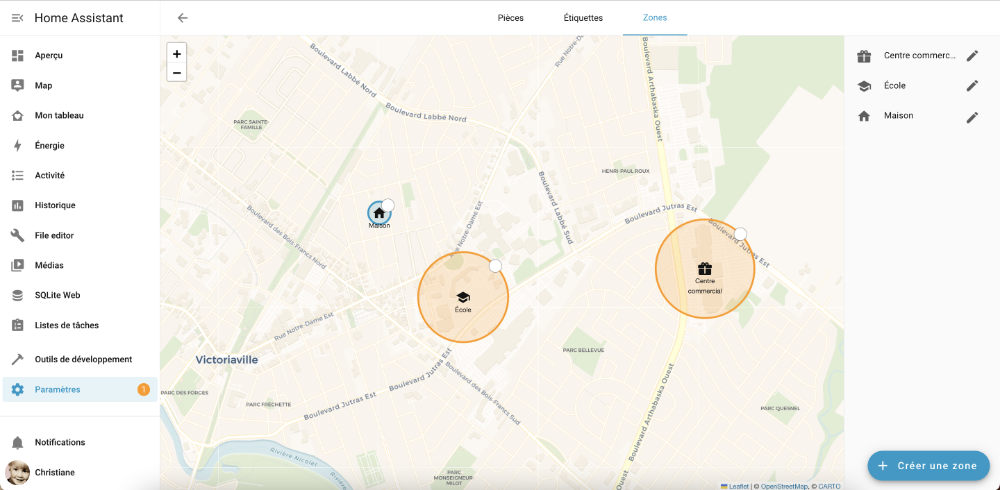
* Une fois les configurations terminées, vous devez redémarrer Home Assistant afin qu'elles soient prises en compte.

## Fichier configuration.yaml

Il est également possible de définir les zones dans le fichier configuration.yaml.

Fichier configuration.yaml

zone:  
  - name: Cégep  
    icon: mdi:school  
    latitude: 46.059284365916156  
    longitude: -71.94339343404864  
    radius: 190

 

  - name: Centre commercial  
    latitude: 46.059869287591276  
    longitude: -71.92660569775728

##


L'application mobile Home Assistant, à installer sur le téléphone de chacune des personnes dont vous désirez connaître la position, permet de créer des automatisations qui tiennent compte de l'endroit où chaque personne se trouve.

Elle ajoute un gros plus à votre système domotique mais le prix à payer est que les données de vos déplacements se retrouveront dans le nuage alors qu'un des avantages d'un système domotique DIY est justement que les données demeurent locales.

Mais considérant que plusieurs applications nous suivent déjà sur nos téléphones, ça ne me pose pas problème.

En recherchant l'application dans l'App Store ou dans Google Play, si vous voyez plusieurs applications qui parlent de Home Assistant, choisissez celle qui utilise le logo de Home Assistant.

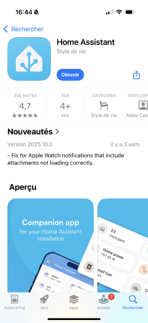

Grâce à l'application mobile Home Assistant, vos automatisations peuvent être plus éclatées qu'avec une simple [apical\_lien\_interne][detecter\_la\_presence\_grace\_au\_wi-fi,détection de présence avec le Wi-Fi][/apical\_lien\_interne].

Vous pouvez, par exemple, démarrer le chauffage dès que vous quittez le bureau, recevoir une notification lorsqu'un de vos enfants arrive au centre commercial, allumer une lumière tamisée lorsque votre amoureux ou votre amoureuse atteint le coin de la rue pour rentrer à la maison.

La seule limite est votre imagination!

## Autoriser l'utilisation des données de localisation

Pour que Home Assistant puisse savoir à quel endroit une personne se situe, il faut que l'application mobile soit autorisée à utiliser les données de localisation du téléphone.

Il est possible que pendant l'installation, l'application vous en demande l'autorisation.

Les autorisations peuvent par la suite être modifiées en tout temps.

Sur iPhone, rendez-vous dans Réglages / Confidentialité et sécurité / Service de localisation. Donnez le droit Toujours à l'application Home Assistant.

Sur Android, rendez-vous dans Paramètres / Sécurité et confidentialité / Paramètres de confidentialité / Gestionnaire des autorisations / Localisation. Assurez-vous que l'application Home Assistant ait l'autorisation Toujours autorisée.


Lors du premier démarrage de l'application mobile Home Assistant, cliquez sur Connect to my Home Assistant.

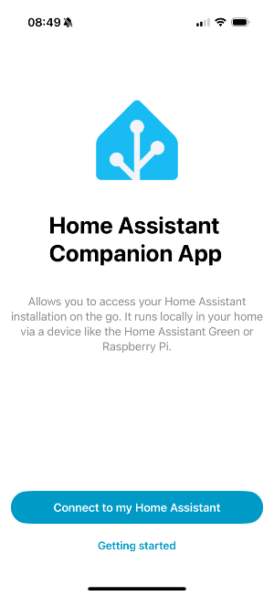

Si votre serveur est détecté, cliquez dessus pour le sélectionner.

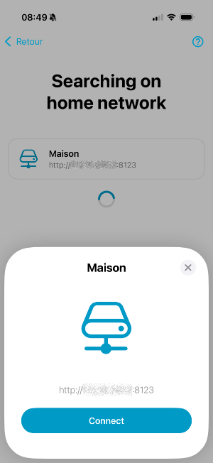

Sinon, cliquez sur Enter address manually puis entrez l'adresse IP de votre serveur, incluant le protocole (ici : http://) et le port (ici : 8123).

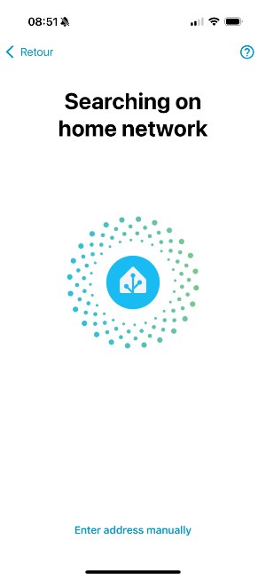   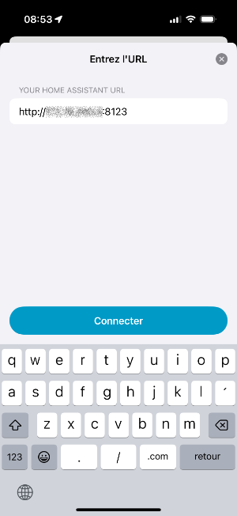

La personne en possession de ce téléphone a désormais la possibilité de contrôler votre Home Assistant à partir de celui-ci, [apical\_lien\_interne][gerer\_les\_personnes,dans les limites des privilèges que vous aurez accordé à l'utilisateur correspondant][/apical\_lien\_interne].

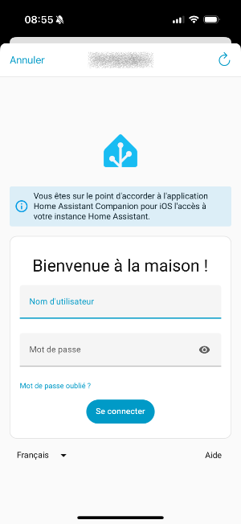

## Définir les zones

Pour que l'application puisse indiquer à Home Assistant à quel endroit vous vous trouvez, vous devez [apical\_lien\_interne][les\_zones\_dans\_home\_assistant,définir les zones d'importance pour votre système][/apical\_lien\_interne] : Maison, �?cole, Travail, Centre commercial, etc.

## Pour plus d'information

« Setting up presence detection ». Home Assistant. <https://www.home-assistant.io/getting-started/presence-detection/>


L'intégration [notify](https://www.home-assistant.io/integrations/notify/) permet d'envoyer une notification à l'application mobile associée à votre Home Assistant.

Pour l'utiliser dans une automatisation ou dans les outils de développement, il faut exécuter l'action Notifications: Send a notification via mibile\_app\_... (notify.mobile\_app\_...), où les points de suspension sont remplacés par le nom du téléphone.

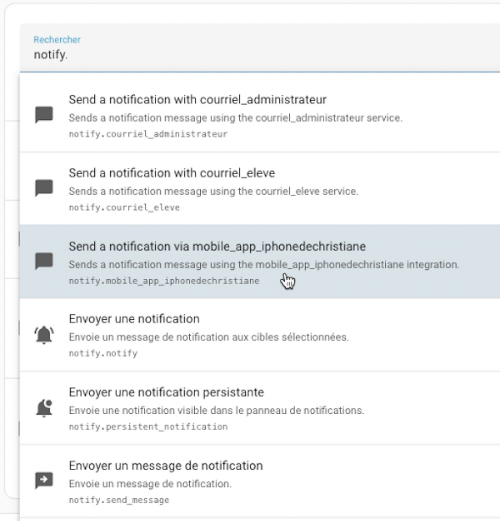

Si cette action n'apparaît pas, ouvrez l'application mobile puis rendez-vous dans le menu Paramètres / Application Companion / Notifications. Assurez-vous que la case Autorisation est à Activé.

Vous devez ensuite renseigner le titre et le message.

La notification apparaîtra à l'écran comme les autres notifications du téléphone.

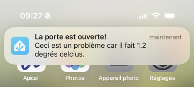

## 89.4 Gérer les personnes

Home Assistant vous permet de définir les personnes qui peuvent être « suivies », par exemple celles que le système pourra identifier comme présentes dans la maison ou pas.

Pour gérer les personnes :

* Rendez-vous dans le menu Paramètres / Personnes.
* Cliquez le nom de la personne à éditer ou sur Ajouter une personne pour ajouter une personne.

  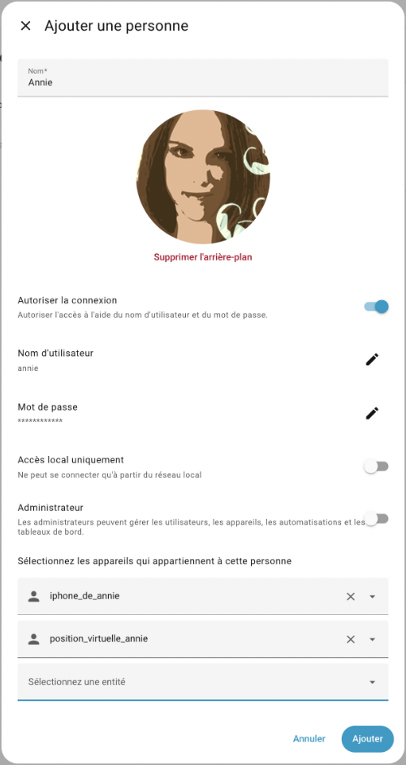
* Téléchargez une photo de la personne.
* Remplissez les informations demandées.
* Si la personne a déjà installé [apical\_lien\_interne][travailler\_avec\_l\_application\_home\_assistant,l'application Home Assistant][/apical\_lien\_interne] sur son téléphone, choisissez le téléphone qui lui correspond dans la liste déroulante.
* Vous pouvez également lui assigner une [apical\_lien\_interne][simuler\_la\_position\_gps\_d\_une\_personne\_avec\_device\_tracker\_see,position virtuelle][/apical\_lien\_interne] afin de faciliter les tests de vos automatisations.

Si [apical\_lien\_interne][les\_zones\_dans\_home\_assistant,l'emplacement de la maison][/apical\_lien\_interne] a été correctement configuré et que les personnes sont correctement associées à leur application mobile sur leur téléphone, l'écran Aperçu indiquera clairement qui est à la maison (on verra le nom de votre boîte Home Assistant) et qui est absent.

 

Dans le cas où la personne se trouve dans une [apical\_lien\_interne][les\_zones\_dans\_home\_assistant,zone connue][/apical\_lien\_interne], Home Assistant affichera le nom de cette zone.

Si une personne apparaît comme absente alors qu'elle est à la maison :

* Assurez-vous que [apical\_lien\_interne][les\_zones\_dans\_home\_assistant,l'emplacement de la maison][/apical\_lien\_interne] a été correctement configuré.
* Redémarrez Home Assistant pour vous assurer que toutes les configurations sont prise en compte.

Si une personne montre le statut Inconnu (en anglais, Unknown ou Unk), c'est qu'il y a un problème avec son téléphone.

Pour régler ce problème :

* Assurez-vous d'abord que la personne est [associée à son téléphone](999_999_merged.md#telephone).
* Assurez-vous ensuite que [apical\_lien\_interne][travailler\_avec\_l\_application\_home\_assistant,l'application Home Assistant détient les droits pour accéder aux données de localisation du téléphone,autoriser][/apical\_lien\_interne].
* Parfois, un redémarrage du téléphone est nécessaire.

## Pour plus d'information

« Person ». Home Assistant. <https://www.home-assistant.io/integrations/person/>

## 89.5 Automatisation qui tient compte de la présence

J'aime configurer Home Assistant pour que les lumières s'allument automatiquement quand une personne arrive à la maison après une heure donnée.

Ceci peut être réalisé à l'aide d'une automatisation qui utilise [apical\_lien\_interne][gerer\_les\_personnes,le détecteur de présence][/apical\_lien\_interne].

Pour créer une telle automatisation :

* Paramètres / Automatisations et scènes / Créer une automatisation.
* Le type de déclencheur sera Heure et lieu / Zone.
* Dans la liste déroulante, choisissez la personne, le téléphone associé à la personne ou encore [apical\_lien\_interne][simuler\_la\_position\_gps\_d\_une\_personne\_avec\_device\_tracker\_see,le virtuel][/apical\_lien\_interne] qui doit déclencher l'action.

  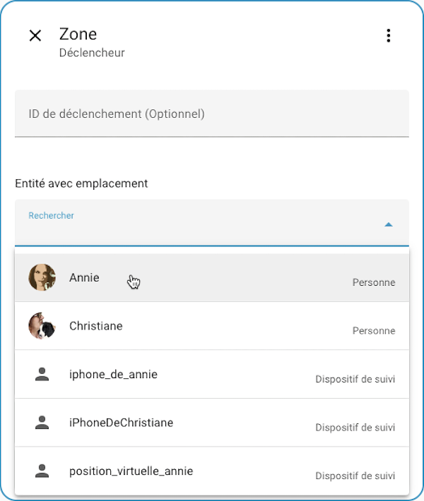
* Choisissez la zone désirée puis précisez si le déclenchement doit avoir lieu quand la personne entre ou sort de la zone.
* Vous pouvez finalement ajouter, selon vos besoins, les autres déclencheurs ou conditions, par exemple pour [apical\_lien\_interne][automatisation\_qui\_tient\_compte\_de\_l\_heure,tenir compte de l'heure][/apical\_lien\_interne], puis de spécifier les actions à réaliser.

## Pour plus d'information

« Setting up presence detection ». Home Assistant. <https://www.home-assistant.io/getting-started/presence-detection/>

« Making Home Assistant�?Ts Presence Detection not so Binary ». Phil Hawthorne. <https://philhawthorne.com/making-home-assistants-presence-detection-not-so-binary/>

## 89.6 Simuler la position GPS d'une personne avec device\_tracker.see

Lorsque vous désirez que Home Assistant puisse [apical\_lien\_interne][automatisation\_qui\_tient\_compte\_de\_la\_presence,réagir selon la position d'une personne][/apical\_lien\_interne] en utilisant [apical\_lien\_interne][travailler\_avec\_l\_application\_home\_assistant,l'application Home Assistant][/apical\_lien\_interne], il devient difficile de tester les automatisations sans devoir vous déplacer physiquement dans la ville.

Par chance, la position géographique d'une personne peut être simulée grâce au service [device\_tracker.see](https://www.home-assistant.io/integrations/device_tracker/#device_trackersee-service).

Ce service peut modifier la position d'un système de suivi GPS réel ou virtuel.

## Créer un device\_tracker

Le fonctionnement d'une entité de type device\_tracker est passablement différent de celui des autres types de [apical\_lien\_interne][configurer\_un\_capteur\_virtuel,virtuels][/apical\_lien\_interne], par exemple input\_boolean ou encore input\_text.

D'abord, pour créer une entité de type device\_tracker, il suffit d'appeler le service (exécuter l'action) device\_tracker.see.

Ensuite, la valeur de l'entité ainsi créée sera perdue au redémarrage de Home Assistant.

Voici donc comment créer un device\_tracker :

Entrez ceci dans Outils de développement /  Actions :

* Action : Voir (device\_tracker.see).

  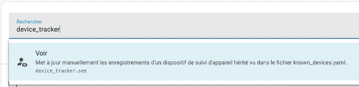

  Notez que selon les configurations de votre système, il pourrait arriver que le service ne soit pas reconnu. Si c'est votre cas, ajoutez cette ligne dans le fichier configuration.yaml :

  Fichier configuration.yaml

  device\_tracker:

  Vous devrez ensuite redémarrer Home Assistant (un rechargement des configurations n'est pas suffisant).
* ID de l'appareil : entrez l'identifiant de l'objet à modifier. Si aucune entité ne correspond à cet identifiant, une entité virtuelle sera créée.

  Attention : lorsqu'on fait appel au service device\_tracker.see, il faut préciser l'identifiant de l'objet et non l'identifiant de l'entité. Donc, il ne faut pas entrer le domaine device\_tracker, seulement l'identifiant de l'objet.

  Par exemple, ceci ne fonctionnera pas : device\_tracker.position\_virtuelle\_annie.

  il faut plutôt entrer position\_virtuelle\_annie.
* Emplacement : si vous désirez travailler avec les zones, entrez le nom d'une zone définie dans votre système Home Assistant ou home pour simuler que la personne est à la maison.

  Notez que le travail avec des zones offre moins de possibilités que le travail avec une position GPS.

  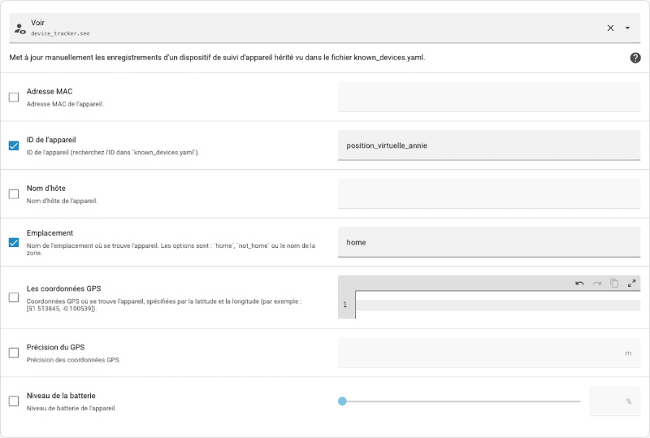
* Pour tirer tout le potentiel du positionnement, if faut travailler avec des coordonnées GPS. Deux syntaxes sont disponibles :
  + sur une ligne, le tout entre crochets carrés :   
    [46.058476616659746, -71.94362640380861]
  + sur deux lignes, chaque valeur précédée d'un trait d'union puis d'un espace :   
    - 46.058476616659746  
    - -71.94362640380861

  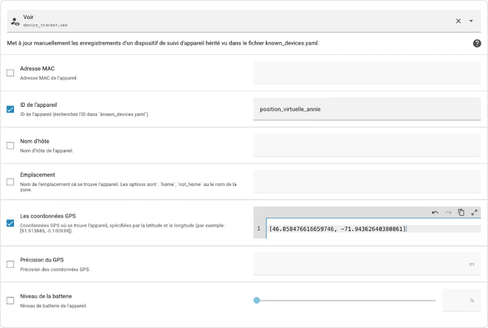

Une fois le service appelé, si l'entité n'existait pas, elle est créée. Sinon, sa position est simplement mise à jour.

## Retrouver l'identifiant d'un device\_tracker

Vous pouvez confirmer que l'entité existe et retrouver son nom à partir du menu Paramètres / Appareils et services / Onglet Entités.

Suggestion : utilisez la case Filtre pour retrouver les entités plus rapidement.

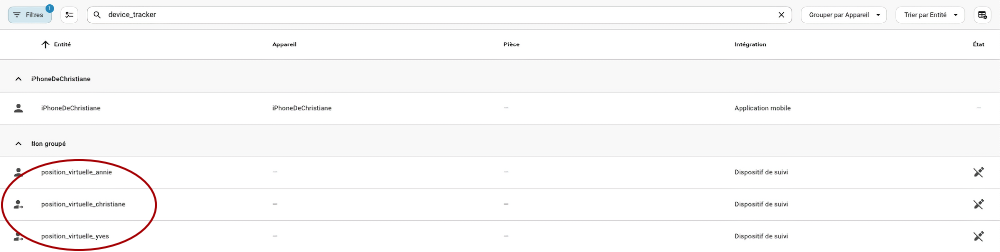

Les informations sur le device\_tracker sont enregistrées dans le fichier /mnt/data/supervisor/homeassistant/known\_devices.yaml.

Ce fichier peut être visualisé à l'aide du [apical\_lien\_interne][travailler\_avec\_le\_module\_complementaire\_file\_editor,module complémentaire File editor][/apical\_lien\_interne].

Fichier known\_devices.yaml

position\_virtuelle\_annie:  
  name: position\_virtuelle\_annie  
  mac:  
  icon:  
  picture:  
  track: true

## device\_tracker dans une automatisation qui travaille avec une zone

Voici un problème qui peut survenir ou non selon votre version de Home Assistant.

Lorsqu'une [apical\_lien\_interne][automatisation\_qui\_tient\_compte\_de\_la\_presence,automatisation doit réagir quand une personne virtuelle entre ou sort d'une zone donnée][/apical\_lien\_interne], elle doit être en mesure de retrouver les coordonnées GPS du device\_tracker.

Si vous avez utilisé un nom de zone pour spécifier la position d'un device\_tracker, vous pourriez obtenir un message du genre « Message malformed: Entity is neither a valid entity ID nor a valid UUID for dictionary value » lorsque vous enregistrez l'automatisation.

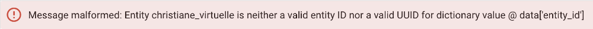

Et même si vous n'obtenez pas ce message, le changement de position à l'aide d'un nom de zone pourrait ne pas être pris en compte par l'automatisation.

Si vous rencontrez ce problème, vous pouvez le contourner en utilisant des coordonnées GPS pour spécifier la position du device\_tracker.

## Voir la position d'un device\_tracker sur une carte

Vous pouvez voir la position virtuelle dans le tableau de bord sur une carte de type Carte ou encore directement dans l'option de menu Map.

Pour que la position du virtuel apparaisse il faut donner à l'entité une position GPS et non une position à partir d'une zone.

Par défaut, la carte affichera la première lettre de [apical\_lien\_interne][qu\_est-ce\_qu\_une\_entite,l'identifiant de l'objet,objet][/apical\_lien\_interne].

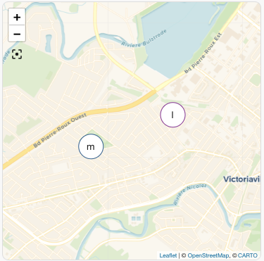

## Changer l'image d'un device\_tracker

Le fichier customize.yaml permet d'apporter des personnalisations à différentes entités, notamment l'image utilisée pour représenter un device\_tracker.

Si le fichier n'existe pas encore, créez-le dans le même dossier que configuration.yaml, c'est-à-dire /mnt/data/supervisor/homeassistant.

Ceci peut être réalisé [apical\_lien\_interne][la\_console\_home\_assistant,dans le terminal HassOS,terminal][/apical\_lien\_interne] ou encore à l'aide de [apical\_lien\_interne][travailler\_avec\_le\_module\_complementaire\_file\_editor,le module complémentaire File editor][/apical\_lien\_interne].

Dans configuration.yaml, vous devez avoir une référence à ce fichier.

Fichier configuration.yaml

homeassistant:  
  customize: !include customize.yaml

Dans le fichier customize.yaml, vous pouvez désormais préciser l'image à utiliser pour le device\_tracker.

Pour utiliser vos propres images, vous devez [apical\_lien\_interne][utiliser\_vos\_propres\_images\_dans\_un\_tableau\_de\_bord\_lovelace,les téléverser sur le Pi dans un dossier précis][/apical\_lien\_interne].

L'image à utliiser peut ensuite être configurée comme suit :

Fichier customize.yaml

device\_tracker.position\_virtuelle\_annie:  
  entity\_picture: /local/annie.png

Redémarrez Home Assistant pour que les configurations soient actives.

Désormais, l'image apparaît sur la carte plutôt que la première lettre de l'identifiant de l'entité.

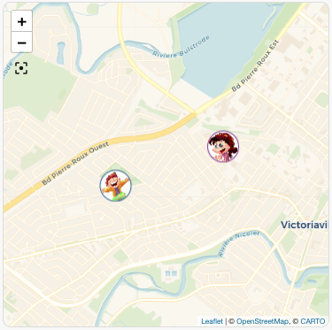

Source des images : <http://clipart-library.com/clip-art/kid-transparent-background-22.htm>


Grâce aux [apical\_lien\_interne][les\_modeles\_dans\_home\_assistant,modèles][/apical\_lien\_interne], il est possible de retrouver spécifiquement la latitude et la longitude d'un device\_tracker.

D'abord, comme avec n'importe quelle entité, il est possible de connaître les attributs disponibles à partir du menu Outils de développement / Modèle.

Entrez dans la zone de gauche une chaîne au format {{ states.id\_de\_l\_entite }}.

Modèle

{{ states.device\_tracker.position\_virtuelle\_annie }}

Voici le résultat à l'écran lorsque la position a été définie à l'aide de coordonnées GPS.

J'ai ajouté des sauts de ligne pour que les attributs soient plus visibles.

Résultat à l'écran

<template TemplateState(<  
    state device\_tracker.position\_virtuelle\_annie=Travail;  
    source\_type=gps,  
    latitude=46.05123588418276,  
    longitude=-72.00332701206209,  
    gps\_accuracy=0,  
    friendly\_name=position\_virtuelle\_annie  
    @ 2025-11-03T11:04:01.874055-05:00>  
)>

Si la position a été définie à l'aide du nom d'une zone, il y aura moins d'attributs disponibles.

Résultat à l'écran

<template TemplateState(<  
    state device\_tracker.position\_virtuelle\_annie=Travail;  
    source\_type=gps,  
    friendly\_name=position\_virtuelle\_annie  
    @ 2025-11-03T11:15:01.874055-05:00>  
)>

Voici un autre exemple où la position de l'entité n'a pas été redéfinie après un redémarrage de Home Assistant.

Résultat à l'écran

<template TemplateState(<  
    state device\_tracker.position\_virtuelle\_annie=not\_home;  
    source\_type=None,  
    friendly\_name=position\_virtuelle\_annie  
    @ 2025-11-03T11:04:55.752248-05:00>  
)>

Une fois que vous connaissez les attributs disponibles, vous pouvez retrouver spécifiquement la latitude et la longitude si elles sont disponibles.

Modèle

{{ state\_attr('device\_tracker.position\_virtuelle\_annie', 'latitude') }}

Modèle

{{ state\_attr('device\_tracker.position\_virtuelle\_annie', 'longitude') }}

<!-- --- split --- -->




1. [apical\_lien\_interne][travailler\_avec\_l\_application\_home\_assistant,Installez l'application Home Assistant][/apical\_lien\_interne] sur votre téléphone.
2. [apical\_lien\_interne][gerer\_les\_personnes,Gérez les informations associées à votre personne][/apical\_lien\_interne] afin d'y ajouter une photo de vous et d'y associer votre téléphone.
3. [apical\_lien\_interne][les\_zones\_dans\_home\_assistant,Définissez deux zones de votre choix][/apical\_lien\_interne], par exemple �?cole et Travail.
4. Créez un [apical\_lien\_interne][simuler\_la\_position\_gps\_d\_une\_personne\_avec\_device\_tracker\_see,device\_tracker][/apical\_lien\_interne] qui simule votre propre position. Déplacez-vous virtuellement dans chacune des zones que vous avez configurées.
5. Ajoutez au moins une autre personne. Il peut s'agir d'une personne qui vit sous votre toit ou non. Associez cette personne à un téléphone ou à un device\_tracker.
6. Créez une automatisation qui agit sur votre récepteur [apical\_lien\_interne][automatisation\_qui\_tient\_compte\_de\_la\_presence,lorsqu'une personne de votre choix arrive à la maison][/apical\_lien\_interne].
7. Créez une automatisation qui agit sur votre récepteur lorsqu'une personne de votre choix est à la maison depuis 5 minutes.
8. Créez une automatisation qui agit sur votre récepteur lorsqu'il n'y a plus personne à la maison. Attention : il devra être déclenché quand l'une ou l'autre des personne quitte et l'action sera exécutée seulement si les deux personnes sont absentes.
9. En vue du prochain l'exercice, assurez-vous de laisser votre boîte domotique branchée pendant environ 24 heures afin qu'elle puisse accumuler les données de vos capteurs.

<!-- --- split --- -->

# 91. Pour le prochain cours


Vous disposez d'un cours pour acquérir les connaissances théoriques et finaliser cet exercice.

Une fois cet exercice complété, vous devez effectuer vos lectures pour l'exercice suivant.

<!-- --- split --- -->


<!-- --- split --- -->


## 92.1 En résumé...

Voici un résumé des informations essentielles du ou des prochains chapitres.

Notez que certaines fiches, qui font partie intégrante du cours, pourraient ne pas figurer dans ce résumé.

Je vous recommande d'effectuer une lecture de l'ensemble des fiches de ces chapitres afin de bien saisir les enjeux.

## [apical\_lien\_interne]Qu\_est-ce\_que\_SQLite[/apical\_lien\_interne]

SQLite est un SGBD relationnel léger conçu spécifiquement pour le stockage local de données. Il ne nécessite pas l'installation d'un serveur de base de données.

Il est moins puissant que d'autres SGBDR comme MySQL mais il a tout ce qu'il faut pour gérer les données d'une application native. Il est très utilisé avec les applications Android et iOS.

Une base de données est constituée d'un simple fichier stocké localement. Il a souvent l'extension .db mais ceci n'est pas obligatoire.

SQLite est installé nativement sur macOS. Sous Windows, il faut procéder à son installation.

## [apical\_lien\_interne]La\_ligne\_de\_commande\_SQLite[/apical\_lien\_interne]

Pour lancer la ligne de commande SQLite :

Terminal

sqlite3

Il est désormais possible d'entrer des commandes à l'invite sqlite>.

Pour se brancher à une base de données :

Terminal

sqlite3 \chemin\mabd.db

On peut ensuite entrer la plupart des requêtes SQL habituelles.

Ligne de commande SQLite

SELECT id, nomfamille, prenom FROM etudiants WHERE naissance < date('2002-10-01');

La ligne de commande SQLite offre quelques fonctionnalités spécifiques avec des commandes qui débutent par un point.

Par exemple, pour lister les tables de la base de données active :

Ligne de commande SQLite

.tables

Pour sortir de la ligne de commande SQLite :

Ligne de commande SQLite

.exit


Home Assistant utilise par défaut une base de données SQLite. Elle est contenue dans le fichier /mnt/data/supervisor/homeassistant/home-assistant\_v2.db.

Elle peut être explorée via l'interface Web de Home Assistant grâce au module complémentaire SQLite Web.

Voici une représentation graphique de ses tables.

.

## 92.2 Qu'est-ce que SQLite ?

SQLite est un SGBD relationnel léger conçu spécifiquement pour le stockage local de données. Il ne nécessite pas l'installation d'un serveur de base de données.

SQLite fonctionne dans différents environnements, notamment Linux, Windows, macOS, Android et iOS.

Ce petit SGBD, créé en 2000 par D. Richard Hipp, est à code source ouvert. La version actuelle, SQLite 3.X, a été publiée en 2004.

Selon [Wikipédia](https://fr.wikipedia.org/wiki/SQLite) :

> SQLite est le moteur de base de données le plus utilisé au monde, grâce à son utilisation dans de nombreux logiciels grand public comme Firefox, Skype, Google Gears, dans certains produits d'Apple, d'Adobe et de McAfee et dans les bibliothèques standards de nombreux langages comme PHP ou Python. De par son extrême légèreté (moins de 300 Ko), il est également très populaire sur les systèmes embarqués, notamment sur la plupart des smartphones modernes : l'iPhone ainsi que les systèmes d'exploitation mobiles Symbian et Android l'utilisent comme base de données embarquée. Au total, on peut dénombrer plus d'un milliard de copies connues et déclarées de la bibliothèque.

Saviez-vous que Google Chrome utilise SQLite pour stocker les cookies?

Si vous voulez voir les données brutes de ces cookies sur votre ordinateur, rendez-vous dans le dossier C:\Users\votrenom\AppData\Local\Google\Chrome\User Data\Default (Windows) ou /Users/votrenom/Library/Application Support/Google/Chrome/Default (Mac).

Le fichier se nomme Cookies.

Vous pourrez l'ouvrir à la ligne de commande SQLite ou dans votre éditeur graphique SQLite préféré.

## Forces et limitations

Moins puissant que d'autres SGBDR comme MySQL ou MS SQL, SQLite supporte néanmoins de nombreuses fonctionnalités :

* jointures internes et externes
* requêtes imbriquées
* transactions
* contraintes d'intégrité référentielle
* fonctions d'aggrégation
* etc.

Parmi ses limites, notons :

* ne supporte que quatre types de données : INTEGER, REAL, TEXT, BLOB (dans les faits, les types de données sont dynamiques et tout est stocké à l'interne en tant que texte), mais est-ce que c'est vraiment une limite ?
* ne supporte pas les jointures externes vers la droite (RIGHT OUTER JOIN)
* ne supporte pas les procédures et fonctions stockées
* possibilités de modification d'une table avec ALTER TABLE limitées
* gestion des droits d'accès aux données limitée aux droits conférés par le système d'exploitation au fichier de la base de données
* etc.

## Dans quels types d'applications est-ce que je peux utiliser SQLite ?

Si vous développez une **application native**, par exemple une application mobile, une application embarquée ou une application de bureau, SQLite est un choix intéressant pour stocker des données localement.

Il n'est cependant pas adapté pour les applications Web car la plupart des navigateurs ne le supportent plus depuis 2010.

## Où sont stockées les données ?

Une base de données SQLite est en fait un simple fichier dans lequel les informations sont encodées de façon particulière. Toutes les tables et leurs données sont stockées dans ce même fichier.

Les bases de données SQLite sont locales, c'est-à-dire que leurs fichiers sont enregistrés sur le poste de l'usager ou sur son appareil mobile.

Si la base de données est utilisée par une application native, son fichier sera généralement stocké au même endroit que l'application, à moins que le développeur en ait décidé autrement.

## Pour plus d'information

« SQLite ». Wikipédia. <https://fr.wikipedia.org/wiki/SQLite>

« Appropriate Uses For SQLite ». SQLite. <https://sqlite.org/whentouse.html>

« SQLite Tutorial ». SQLite Tutorial. <http://www.sqlitetutorial.net/>

« Distinctive Features Of SQLite ». SQLite. <https://www.sqlite.org/different.html>

« Limits In SQLite ». SQLite. <https://sqlite.org/limits.html>

« SQL Features That SQLite Does Not Implement ». SQLite. <https://www.sqlite.org/omitted.html>

## 92.3 Installation de SQLite

Pour travailler avec une base de données [apical\_lien\_interne][Qu\_est-ce\_que\_SQLite,SQLite][/apical\_lien\_interne], il n'y a aucun serveur à installer. Tout se déroule localement.

Il faut par contre que le service et les outils pour SQLite soient installés afin que le système d'exploitation sache comment interagir avec une base de données SQLite.

## Installation sous macOS

Sous Mac, SQLite est installé de base.

Pour le vérifier :

* Ouvrez le Terminal.
  + Lancez la commande sqlite3 :

    Terminal

    sqlite3

    Vous obtiendrez l'invite SQLite.

    

    Notez que le message « Connected to a transient in-memory database » indique qu'aucune base de données n'est ouverte alors les opérations seront effectuées en mémoire vive et seront perdues lors de la fermeture de la ligne de commande.

    Pour travailler avec une vraie base de données, il faudra soit [apical\_lien\_interne][La\_ligne\_de\_commande\_SQLite,créer une nouvelle base de données,nouvelle][/apical\_lien\_interne], soit [apical\_lien\_interne][La\_ligne\_de\_commande\_SQLite,ouvrir une base de données existante,existante][/apical\_lien\_interne].

    Mais pour l'instant, nous pouvons travailler en mémoire vive pour effectuer ces vérifications.
* Pour voir si SQLite fonctionne, entrez la commande suivante :

  Ligne de commande SQLite

  .database

  SQLite devrait répondre qu'il est présentement branché sur une base de données nommée main (il s'agit de la base de données en mémoire vive).
* Pour sortir de SQLite, entrez la commande suivante :

  Ligne de commande SQLite

  .exit

## Installation sous Windows

Pour installer SQLite sous Windows :

* Rendez-vous sur la page de téléchargement de SQLite (<https://www.sqlite.org/download.html>) puis, dans la section Precompiled Binaries for Windows, téléchargez les DLL pour votre système ainsi que les outils pour la ligne de commande (bundle of command-line tools).
* Créez un dossier nommé sqlite sous C: puis décompressez les fichiers directement dans ce dossier. Le dossier contiendra différents fichiers dont sqlite3.exe.
* Ajoutez C:\sqlite à votre variable d'environnement PATH :
  + D'abord, refermez vos fenêtres de commande car elles ont été ouvertes avec leur propre copie des variables d'environnement.
  + Appuyez sur les touches Windows + X pour accéder au menu Power User.
  + Sélectionnez l'option Système.
  + L'onglet �? propos de sera sélectionné par défaut. Rendez-vous plus bas dans cette page et choisissez Paramètres système avancés.
  + Cliquez sur Variables d'environnement.
  + Dans la section Variables système, cliquez sur la variable Path puis sur Modifier.
  + Cliquez sur Nouveau puis ajoutez la chaîne C:\sqlite.
* Ouvrez une fenêtre de commande puis lancez la commande sqlite3. Vous obtiendrez l'invite sqlite>

  

  Notez que le message « Connected to a transient in-memory database » indique qu'aucune base de données n'est ouverte alors les opérations seront effectuées en mémoire vive et seront perdues lors de la fermeture de la ligne de commande.

  Pour travailler avec une vraie base de données, il faudra soit [apical\_lien\_interne][La\_ligne\_de\_commande\_SQLite,créer une nouvelle base de données,nouvelle][/apical\_lien\_interne], soit [apical\_lien\_interne][La\_ligne\_de\_commande\_SQLite,ouvrir une base de données existante,existante][/apical\_lien\_interne].

  Mais pour l'instant, nous pouvons travailler en mémoire vive pour effectuer ces vérifications.
* Pour voir si SQLite fonctionne, entrez la commande suivante :

  Ligne de commande SQLite

  .database

  SQLite devrait répondre qu'il est présentement branché sur une base de données nommée main (il s'agit de la base de données en mémoire vive).
* Pour sortir de SQLite, entrez la commande suivante :

  Ligne de commande SQLite

  .exit

## Pour plus d'information

« SQLite - Installation ». Tutorial points. <https://www.tutorialspoint.com/sqlite/sqlite_installation.htm>

## 92.4 La ligne de commande SQLite

La ligne de commande SQLite est l'endroit où vous pouvez entrer les requêtes SQL pour effectuer les opérations CRUD sur vos données.

Pour lancer la ligne de commande SQLite sous Windows, vous devez d'abord [apical\_lien\_interne][Installation\_de\_SQLite,installer SQLite sur votre poste de travail et faire en sorte que son dossier fasse partie du PATH][/apical\_lien\_interne]).

Sous macOS et sous Linux, tout est disponible dès le départ.

* Ouvrez une fenêtre Terminal.
* Lancez la commande sqlite3.

  Terminal

  sqlite3
* Vous obtiendrez l'invite sqlite>, qui vous invite à entrer vos commandes.

  .png)


La ligne de commande SQLite permet d'entrer deux types de commandes :

* Les commandes spéciales pour la ligne de commande. Elles débutent toutes par un point (il ne faut pas qu'il y ait d'espace avant ni après le point pour que la commande fonctionne). Par exemple, .open, .show, .backup, .exit et toutes les autres commandes listées par .help. (voir [Command Line Shell For SQLite](http://tool.oschina.net/uploads/apidocs/sqlite/sqlite.html)).
* Les requêtes SQL, par exemple CREATE, SELECT, INSERT, UPDATE, DELETE. Chacune doit se terminer par un point-virgule.

Voici comment combiner ces deux types de commandes afin de vérifier la liste des tables de la base de données sélectionnée puis afficher les enregistrements de la table etudiants :

Ligne de commande SQLite

.tables

 

SELECT \* FROM etudiants;

Résultat à l'écran

sqlite> .tables  
etablissements  etudiants  
sqlite> SELECT \* FROM etudiants;

 

1|Desmarais|Louis|1178793  
2|Bourgeois|Philippe|1161295  
3|Meloche|Ariane|1182286

 

4|Gaumond|Mathieu|1121543

 

5|Rousseau|Isabelle|1119872

 

sqlite>

## Créer une nouvelle base de données

Dès l'ouverture de la ligne de commande SQLite, si le message « Connected to a transient in-memory database » apparaît, ceci indique qu'aucune base de données n'est ouverte. Si vous ne faites pas attention, les opérations seront effectuées en mémoire vive dans une base de données temporaire et seront perdues lors de la fermeture de la ligne de commande.

Pour corriger la situation, deux options s'offrent à vous :

* Créer la base de données dès le lancement de SQLite;
* Travailler dans la base de données temporaire puis l'enregistrer dans un fichier permanent avant de sortir de la ligne de commande.

### Création lors du lancement de SQLite

Lors du lancement de SQLite, dans le Terminal de votre ordinateur, vous pouvez ajouter le nom de votre nouvelle base de données à la suite de la commande sqlite3. Il est d'usage d'utiliser un nom de fichier avec l'extension .db.

La base de données sera créée si elle n'existe pas. Sinon, elle sera ouverte. Toutes les opérations effectuées par la suite s'appliqueront à cette base de données.

Terminal

sqlite3 mabd.db

�? tout moment, la commande .database lancée à l'invite de commande affichera le nom de la base de données sur laquelle les opérations sont appliquées.

Attention : la base de données sera créée dans le dossier courant (celui affiché dans le Terminal avant de lancer la commande sqlite3). Si vous souhaitez la créer ailleurs, il faudra spécifier son chemin.

Terminal

sqlite3 \Users\votrenom\Documents\mabd.db


Il est également possible de travailler dans la base de données temporaire puis terminer votre travail par l'instruction .save suivie du nom à donner à la base de données.

Ligne de commande SQLite

CREATE TABLE IF NOT EXISTS categories (

 

id INTEGER PRIMARY KEY AUTOINCREMENT,

 

nom TEXT

 

);

 

.save mabd.db

Ici encore, si vous désirez enregistrer le fichier ailleurs que dans le dossier courant, il faudra spécifier son chemin. Notez que l'invite de commande SQLite demande que les dossiers soient séparés par des barres obliques (/) et ce, même sous Windows.

Ligne de commande SQLite

.save /Users/votrenom/Documents/mabd.db

## Se brancher à une base de données

Si vous avez déjà une base de données SQLite (fichier dont le nom se termine généralement par .db), il est possible de l'ouvrir de deux façons :

* lors du lancement de la ligne de commande
* à l'aide de la commande .open

### Ouverture dès le lancement de la ligne de commande

L'ajout du nom de la base de données à la suite de la commande sqlite3 permet d'ouvrir directement cette base de données.

Terminal

sqlite3 mabd.db

Si la base de données existait, elle sera ouverte. Sinon, elle sera créée. La commande .tables permettra de vérifier si la BD est vide ou non (si elle contient des tables ou non).

Ligne de commande SQLite

.tables

### Ouverture d'une base de données après coup

Si vous n'avez pas spécifié le nom de la base de données dès le lancement de la ligne de commande, il est possible de quitter le mode « transcient » en ouvrant la base de données à l'aide de la commande .open.

Ligne de commande SQLite

.open mabd.db

Encore ici, si le fichier n'est pas dans le dossier courant, il faudra spécifier son chemin.

Ligne de commande SQLite

.open /Users/votrenom/Documents/mabd.db

## Quitter la ligne de commande

Après une séance de travail, il est important de quitter correctement la ligne de commande SQLite :

Ligne de commande SQLite

.exit

## Pour plus d'information

« SQLite Tutorial ». Tutorials Point. <https://www.tutorialspoint.com/sqlite/index.htm>

« SQL As Understood By SQLite ». SQLite. <http://www.sqlite.org/lang.html>

« Command Line Shell For SQLite ». SQLite. <https://sqlite.org/cli.html>

« SQLite Commands ». SQLite tutorial. <http://www.sqlitetutorial.net/sqlite-commands/>

« Getting Started with SQLite3 �?" Basic Commands ». Site Point. <https://www.sitepoint.com/getting-started-sqlite3-basic-commands/>

## 92.5 Fonctions SQLite pour manipuler des nombres

Tout comme avec le texte, il est possible de manipuler des nombres à l'intérieur d'une requête SQLite.

| Fonction | Utilité | Exemple |
| --- | --- | --- |
| ABS | Retourne la valeur absolue d'un nombre. | SELECT ABS(valeur) FROM matable; |
| ROUND | Arrondit un nombre. | SELECT ROUND(prix) FROM articles;  ou  SELECT ROUND(total / quantite, 2) FROM matable; |

## Pour plus d'information

« SQL As Understood By SQLite - Core Functions ». SQLite. <https://www.sqlite.org/lang_corefunc.html>

## 92.6 Fonctions SQLite pour manipuler du texte

Il est possible d'effectuer des manipulations dans du texte avant de l'afficher ou encore dans une clause WHERE.

Les principales fonctions sont résumées ici :

| Fonction | Utilité | Exemple |
| --- | --- | --- |
| INSTR | Retourne la position d'une sous-chaîne dans la chaîne. | SELECT id, nomfamille, prenom FROM clients WHERE INSTR(telephone, '819') > 0; |
| LENGTH | Retourne le nombre de caractères dans la chaîne. | SELECT \* FROM produits WHERE LENGTH(code) > 5; |
| LOWER | Transforme la chaîne en lettres minuscules. | SELECT id, LOWER(code) FROM produits; |
| REPLACE | Remplace une sous-chaîne par une autre dans la chaîne. | SELECT id, REPLACE(telephone, '(819)', '819') FROM clients; |
| SUBSTR | Retourne une partie de la chaîne. | SELECT id, SUBSTR(commentaire, 1, 10) FROM pages; |
| TRIM | Enlève des caractères au début et à la fin de la chaîne (par défaut, enlève les espaces). | SELECT id, TRIM(commentaire) FROM pages; |
| UPPER | Transforme la chaîne en lettres majuscules. | SELECT id, UPPER(code) FROM produits; |

## Pour plus d'information

« SQL As Understood By SQLite - Core Functions ». SQLite. <https://www.sqlite.org/lang_corefunc.html>

« SQLite String Functions ». SQLite Tutorial. <http://www.sqlitetutorial.net/sqlite-string-functions/>

## 92.7 Les dates avec SQLite

SQLite ne gère qu'un petit nombre de types de données : INTEGER, REAL, TEXT, BLOB. Alors, pour stocker une date, quel type de données devrait être utilisé ?

Il y a différentes possibilités mais la plus intéressante consiste à utiliser le type TEXT. La date devra alors toujours être enregistrée au même format.

Le standard est d'utiliser le format aaaa-mm-jj (et non aaaa/mm/jj) puisque [certaines fonctions SQLite](https://www.sqlite.org/lang_datefunc.html) retournent des dates au format aaaa-mm-jj.

Lorsque ce standard est établi, il est possible d'utiliser une date dans une requête SELECT comme suit :

SQLite

SELECT id, nomfamille, prenom FROM etudiants WHERE naissance < date('2002-10-01');

## Fonctions SQLite pour manipuler les dates

Voici les principales fonctions qui vous aideront dans vos manipulations de dates.

| Fonction | Utilité | Exemple |
| --- | --- | --- |
| [datetime](https://www.sqlitetutorial.net/sqlite-date-functions/sqlite-datetime-function/) | Manipule des dates incluant l'heure.  Entre autres, elle permet d'obtenir la date et l'heure actuelle. | UPDATE donnees(date\_modification) VALUES(datetime('now','localtime')); |
| [date](https://www.sqlitetutorial.net/sqlite-date-functions/sqlite-date-function/) | Manipule des dates.  Entre autres, permet de transformer une chaîne en date afin d'effectuer des calculs. | SELECT id, nomfamille, prenom FROM etudiants WHERE naissance < date('2002-10-01'); |
| julianday | Retourne le nombre de jours entre une date butoir et une date. | SELECT id, nomfamille, prenom FROM employes WHERE julianday('now') - julianday(embauche) >= 365; |

## Pour plus d'information

« SQL As Understood By SQLite - Date And Time Functions ». SQLite. <https://www.sqlite.org/lang_datefunc.html>

« SQLite Date Functions ». SQLite Tutorial. <http://www.sqlitetutorial.net/sqlite-date-functions/>

## 92.8 Autres opérations intéressantes

Voici une série de commandes pouvant être réalisées à la ligne de commande SQLite ou à l'aide de requêtes SQL.

Vous trouverez également dans cette liste des commandes qui peuvent être ajoutées dans un fichier nommé .sqliterc,. Sous Windows, ce fichier doit être placé dans le dossier C:\Users\monnom. Sous Mac, ce sera dans le dossier /Users/monnom.

Les commandes listées dans le fichier .sqliterc seront automatiquement exécutées lorsque vous ouvrirez la ligne de commande SQLite.

Notez que sous Windows, pour créer un fichier dont le nom débute avec un point, vous devez mettre un point avant et un point après son nom. Le point de la fin sera automatiquement effacé.

## Lister les tables de la base de données

Ligne de commande SQLite

.tables

SQLite

SELECT name FROM sqlite\_master WHERE type='table';


Ligne de commande SQLite

.shell cls

## Formater l'affichage des données à la ligne de commande SQLite

Ligne de commande SQLite

.mode column  
.headers on  
SELECT \* FROM *nomtable*;

Il est possible de changer .mode column par :

Ligne de commande SQLite

.mode box

Cette fois, les données apparaîtront dans un tableau.

Ces configurations sont très utiles alors il est intéressant de les ajouter au fichier .sqliterc.

Fichier .sqliterc

.mode column  
.headers on


Par défaut, lorsque le mode column est activé, chaque champ affiché aura une largeur correspondant à la plus grande valeur entre :

* 10
* la largeur de l'entête
* la largeur de la première ligne de données

Il est possible de modifier cet affichage à l'aide de la commande .width.

La commande .witdh prendra la forme suivante :

Syntaxe MySQL

.width *largeurcolonne1*, *largeurcolonne2*, *largeurcolonne3*, *largeurcolonne4*

Une valeur de 0 indique que la largeur doit répondre aux règles ci-haut mentionnées.

Ligne de commande SQLite

.width 0, 20

Cette commande laissera la première colonne à sa valeur par défaut et ajustera la seconde à 20 caractères. Les colonnes suivantes conserveront leur largeur actuelle.

## Afficher la requête qui permet de recréer une table

Ligne de commande SQLite

.schema *nomtable*

SQLite

SELECT sql FROM sqlite\_master WHERE type = 'table' AND tbl\_name = '*nomtable*';


Ligne de commande SQLite

.dump *nomtable*

