# 4. Raspberry Pi

## 4.1 Bien traiter son Raspberry Pi :-)

Le Raspberry Pi est un petit ordinateur alors certaines précautions s'imposent quand on le manipule.

## Boîtier

Le Raspberry Pi doit être fixé dans un boîtier. Ceci le protégera des chocs et de la poussière en plus de vous aider à ne pas mettre vos doigts sur ses composantes électronique.

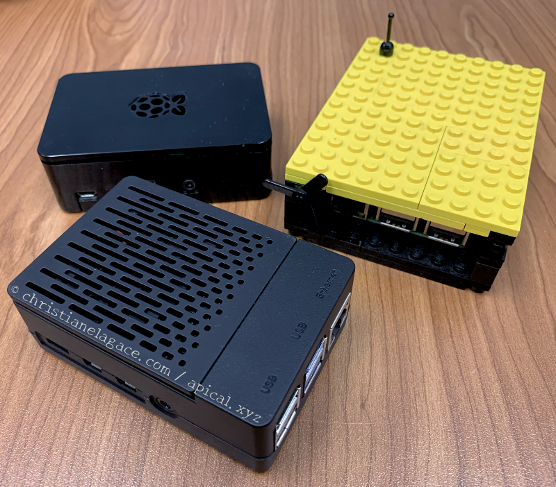

## Dissipateurs thermiques

Il pourrait arriver que le Pi chauffe. Assurez-vous que des dissipateurs thermiques (heatsink) soient collés aux endroits appropriés. Généralement, on en place un sur le processeur, un sur la mémoire vive, un sur le contrôleur Ethernet et un autre sur le contrôleur USB.

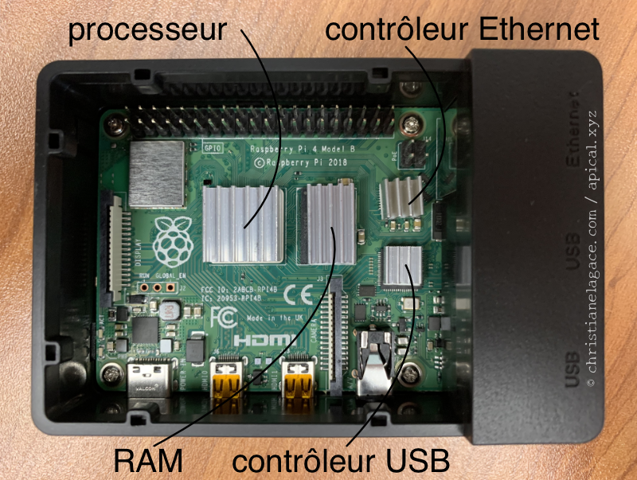

## Ventilateur

Il est intéressant d'ajouter un ventilateur si le boîtier le permet.

Pour que le ventilateur fonctionne à bas régime, il faut brancher le fil rouge sur la broche 3.3V ([apical\_lien\_interne][qu\_est-ce\_que\_le\_gpio,broche physique no 1,pinout][/apical\_lien\_interne]) et le fil noir sur une des broches de mise à terre (broche no 6, 9, 14, 20, 25, 30, 34 ou 39).

Notez que pour que le ventilateur tourne plus vite, il suffit de brancher le fil rouge sur une broche 5V (broche no 2 ou 4).

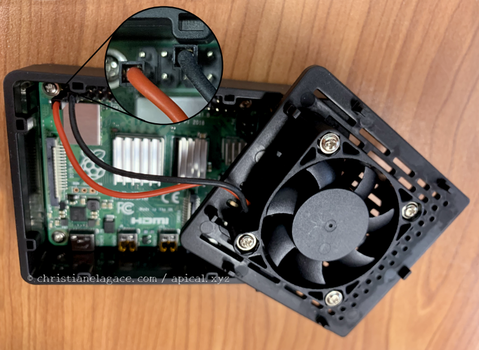

Dans le cas où le ventilateur comporte un troisième fil, généralement bleu, ce fil doit être branché sur la broche TXD (no 8).

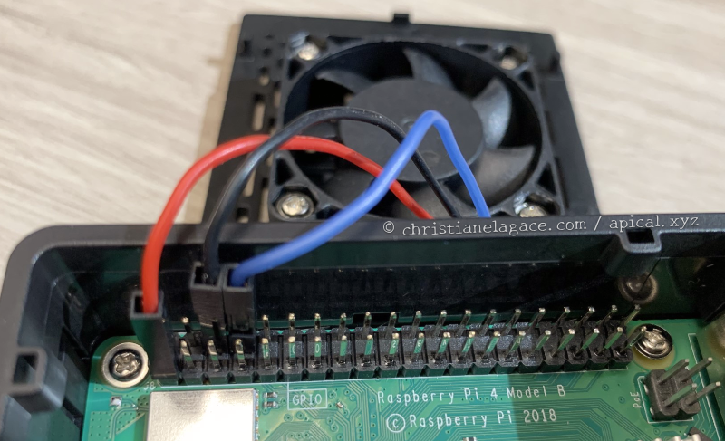

## Câble du bloc d'alimentation

Évitez d'enrouler le fil du bloc d'alimentation alentour du bloc. Ceci accélère son usure et risque de casser plus rapidement les petits fils qui sont à l'intérieur.

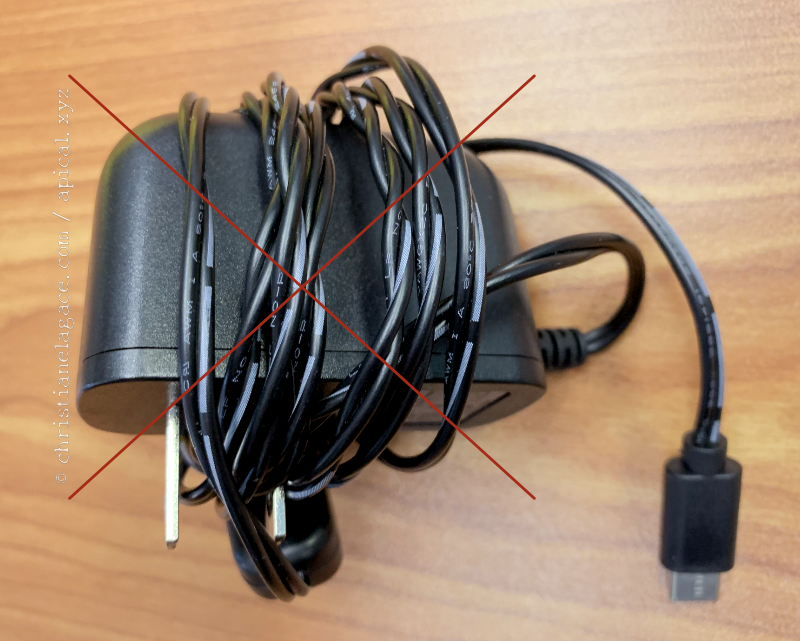

En effet, à force de l'enrouler et de le dérouler, le fil devient complètement tordu.

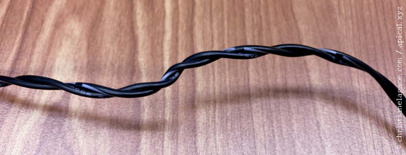

Il est préférable de replier le fil sur lui-même, quitte à terminer par un tour ou deux.

## Manipulation de la carte micro SD

Lors du retrait de la carte micro SD, tirez-la horizontalement. Si vous tentez de la tirer verticalement, vous risquez d'endommager l'unité dans laquelle la carte est insérée.

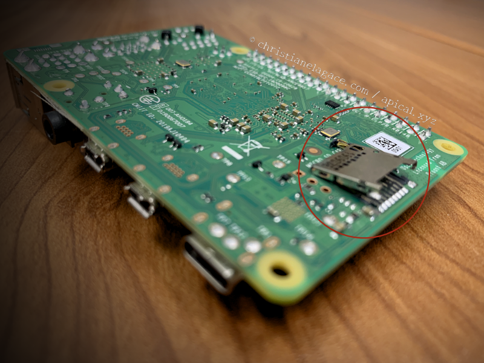

## Branchements au GPIO

Lorsque vous effectuez des branchements au GPIO, assurez-vous que le Pi ne soit pas sous tension.

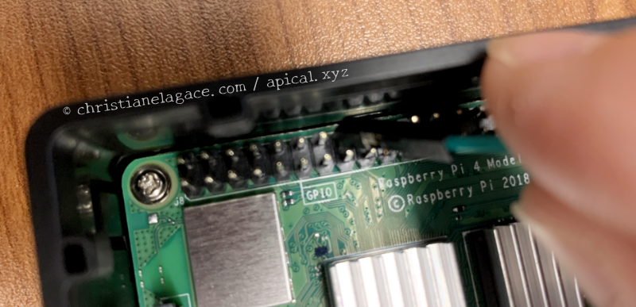

## Arrêt du système d'exploitation

Assurez-vous d'[apical\_lien\_interne][Eteindre\_un\_systeme\_linux\_de\_facon\_securitaire,éteindre le système de façon sécuritaire][/apical\_lien\_interne] avant de débrancher le Raspberry Pi.

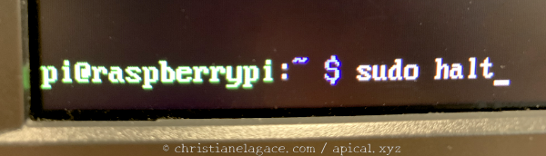

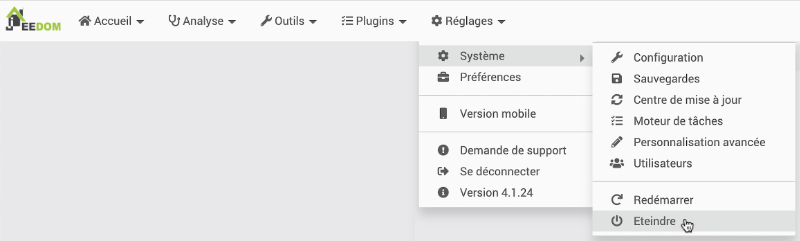

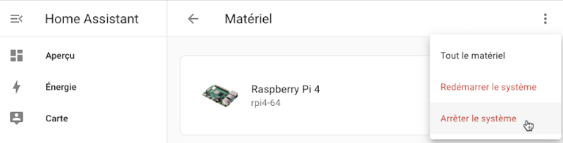

## 4.2 Raspberry Pi Imager

Si vous souhaitez installer un système Linux sur un Raspberry Pi, l'outil Raspberry Pi Imager est votre ami!

Il s'agit d'un petit utilitaire que vous installez sur votre poste de travail et qui permet d'installer sur une carte micro SD la toute dernière version du système d'exploitation choisi.

Notez que si vous préférez installer Raspberry Pi OS sans devoir installer un logiciel sur votre poste de travail, [apical\_lien\_interne][installation\_de\_raspberry\_pi\_os,il est possible de le faire manuellement][/apical\_lien\_interne] mais les étapes sont plus nombreuses.

L'outil peut être installé sur un système Windows, Mac ou Linux Ubuntu.

Pour installer Raspberry Pi Imager sur votre poste de travail, téléchargez-le à partir d'ici : <https://www.raspberrypi.org/downloads/>.

Une fois installé, lancez-le. Vous obtiendrez cet écran d'accueil.

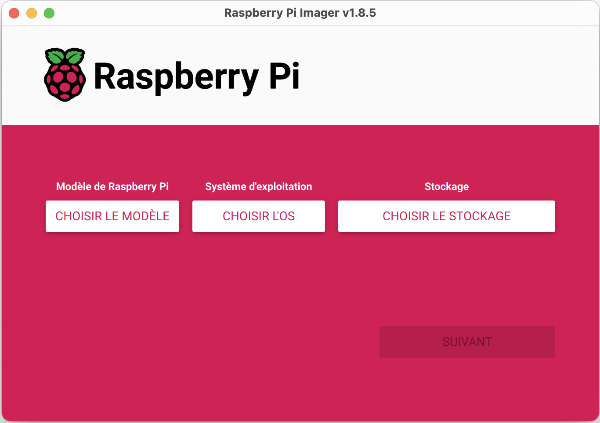

Ciquez sur CHOISIR LE MODÈLE pour sélectionner votre modèle de Raspberry Pi.

Cliquez sur CHOISIR L'OS pour choisir le système d'exploitation à installer.

* Dans la plupart des cas, l'interface graphique n'est pas requise. Choisissez alors Raspberry Pi OS (other) puis Raspberry Pi OS Lite (64 bit).
* Si vous avez besoin d'une version avec interface graphique, choisissez Raspberry Pi OS (64 bit).

Remarque : Raspberry Pi OS (appelé autrefois Raspbian) est une version de Debian spécialement adaptée pour le Raspberry Pi.

Cliquez sur CHOISIR LE STOCKAGE pour sélectionner votre carte micro SD.

Cliquez ensuite sur SUIVANT.

Depuis la version 1.6 de Raspberry Pi Imager, il est possible d'effectuer automatiquement certaines configurations sur le système Linux que l'outil s'apprête à copier sur la carte. Cliquez sur le bouton MODIFIER RÉGLAGES lorsqu'il vous est proposé puis remplissez les configurations souhaitées.

Parmi les configurations utiles, notons :

* le nom et le mot de passe de l'usager Linux
* l'activation SSH
* la configuration du réseau Wi-Fi
* la configuration du clavier (qwerty: us vs azerty: fr).

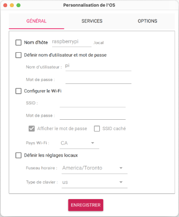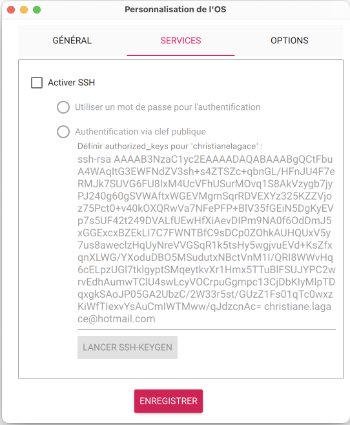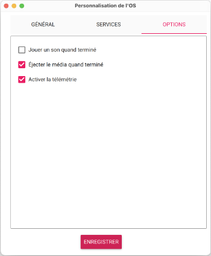

Cliquez maintenant sur ENREGISTRER. Dans l'écran suivant, cliquez sur OUI pour que les réglages soient utilisés.

Le système d'exploitation sera installé sur votre carte micro SD.

Notez que vous pourriez avoir besoin du mot de passe d'un compte administrateur sur votre poste de travail pour y arriver.

Patientez, l'opération se déroule sur de nombreuses minutes.

Une fois l'écriture sur la carte terminée, [apical\_lien\_interne][retirer\_un\_disque\_amovible\_de\_facon\_securitaire,retirez la carte de l'ordinateur de façon sécuritaire][/apical\_lien\_interne], insérez-la dans le Pi puis démarrez ce dernier.

Et voilà!

## 4.3 Configurer le réseau sans fil sur Raspberry Pi OS

Plusieurs options vous permettent de connecter le Raspberry Pi à un réseau :

* câble RJ-45 (ethernet)
* réseau Wi-Fi régulier
* [apical\_lien\_interne][retrouver\_le\_nom\_du\_reseau\_et\_le\_mot\_de\_passe\_du\_partage\_de\_connexion\_ce\_\_\_,partage de la connection cellulaire d'un téléphone ][/apical\_lien\_interne] (ausssi appelé hot spot ou Wi-Fi access point)

Lorsque vous travaillez avec un câble RJ-45, vous n'avez pas de configurations spécifique à faire. Le Pi saura trouver le réseau.

Les techniques que je vous propose ici vous permettront de connecter sans fil un Pi qui roule avec Raspberry Pi OS, soit avec le Wi-Fi ou avec le partage de connexion cellulaire.

Notez que pour une connexion Wi-Fi, le Raspberry Pi 3 ne supporte que le 2.4 GHz alors que le Raspberry Pi 4 supporte également le 5 GHz. Entrez vos configurations en conséquence!

Dans cette fiche :

* NetworkManager vs dhcpcd
* Configurer le réseau à l'aide de NetworkManager
  + Utilitaire nmtui
  + Commande nmcli
  + Configurer le réseau à l'aide de l'utilitaire raspi-config
* Vérifier les configurations réseau

## NetworkManager vs dhcpcd

Depuis Raspberry Pi OS Bookworm (2023), la gestion du réseau est réalisée avec [NetworkManager](https://networkmanager.dev/). Auparavant, elle était faite avec [dhcpcd](https://github.com/NetworkConfiguration/dhcpcd).

Pour vérifier si le système d'exploitation du Raspberry Pi utilise NetworkManager, entrez cette commande :

Terminal du Pi

nmcli device status

Résultat à l'écran

pi@raspberrypi:~ $ nmcli device status  
DEVICE          TYPE       STATE                    CONNECTION   
eth0            ethernet   connected                Wired connection 1   
lo              loopback   connected (externally)   lo   
wlan0           wifi       disconnected             --   
p2p-dev-wlan0   wifi-p2p   disconnected             --

Dans la colonne STATE, si vous voyez connected ou disconnected, c'est que l'OS utilise NetworkManager.

Si vous voyez plutôt unmanaged, ou encore si la commande nmcli n'est pas reconnue, c'est que l'OS utilise un auytre système pour gérer le réseau.

Si votre système n'utilise pas NetworkManager, référez-vous à la fiche « [apical\_lien\_interne]configurer\_le\_reseau\_a\_l\_aide\_de\_dhcpcd[/apical\_lien\_interne] ».

## Configurer le réseau à l'aide de NetworkManager

Je vous propose différentes techniques pour configurer le réseau à l'aide de NetworkManager.

Peu importe la technique choisie, vous devez démarrer le Pi puis accéder au Terminal à l'aide d'un écran ou via SSH.

Pour chaque configuration réseau, un fichier sera créé dans le dossier /etc/NetworkManager/system-connections.

### Utilitaire nmtui

Il est possible d'effectuer les configurations réseau à l'aide de l'utilitaire nmtui (Network Manager Text UI).

Terminal

sudo nmtui

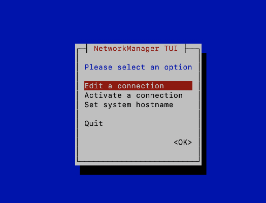

Si vous sélectionnez Edit a connection, l'utilitaire vous présentera les connexions existantes et vous offrira la possiblité d'en créer de nouvelles.

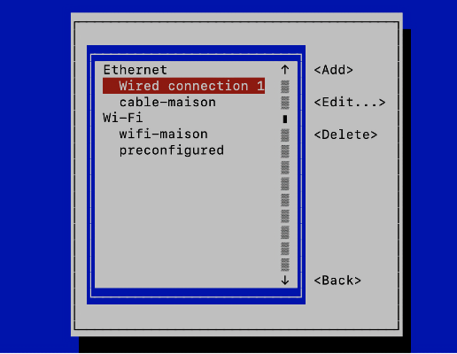

Sélectionnez la configuration réseau désirée ou sélectionnez Add puis Wi-Fi pour créer une nouvelle connexion sans fil.

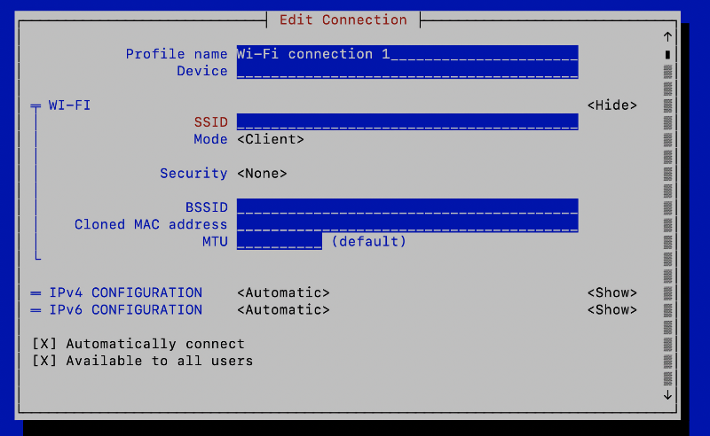

Informations à entrer :

* Profile name : vous pouvez donner le nom que vous désirez à votre configuration réseau.
* Device : vous pouvez laisser cette case à blanc. NetworkManager retrouvera automatiquement le nom du périphérique (pour une connexion Wi-Fi, c'est généralement wlan0).
* SSID : entrer le nom de votre réseau.
* Security : il faut généralement sélectionner WPA & PWA2 Personal.
* Password : entrer le mot de passe du réseau.

### Commande nmcli

Voici une seconde technique pour configurer le réseaau.

nmcli (Network Manager Command Line Interface) est l'interface en ligne de commande pour configurer le réseau à l'aide de NetworkManager.

Entrez ces commandes en modifiant le nom du réseau (ssid) et le mot de passe (psk). Ajustez également le nom de la connexion (dans l'exemple : wifi-maison) pour quelque-chose de significatif.

Terminal

nmcli con add type wifi con-name wifi-maison ssid "nom-du-reseau"  
nmcli con modify wifi-maison wifi-sec.key-mgmt wpa-psk  
nmcli con modify wifi-maison wifi-sec.psk mot-de-passe-en-clair

#### Crypter le mot de passe

Il est possible de modifier le fichier ainsi créé (/etc/NetworkManager/system-connections/wifi-maison.nmconnection) pour que le mot de passe y soit crypté.

Ceci est optionnel.

Pour convertir le mot de passe, utilisez le petit utilitaire wpa\_passhprase à la ligne de commande.

Terminal

wpa\_passphrase nom-du-reseau mot-de-passe-en-clair

Résultat à l'écran

pi@raspberrypi:~ $ wpa\_passphrase nom-du-reseau mot-de-passe-en-clair  
network={  
        ssid="nom-du-reseau"   
        #psk="mot-de-passe-en-clair"   
        psk=83205bec70146c3e7ee3915a11f565f18abef050e5d0262c0ac9bffb887acdbe  
}

Il suffit d'éditer le fichier de configuration pour y copier le mot de passe crypté à la place du mot de passe en clair.

### Configurer le réseau à l'aide de l'utilitaire raspi-config

L'utilitaire [raspi-config](https://www.raspberrypi.org/documentation/configuration/raspi-config.md) permet lui aussi de configurer le réseau.

* Démarrez le Pi puis accédez au Terminal à l'aide d'un écran ou via SSH.
* Entrez la commande suivante :

  Terminal

  sudo raspi-config
* Dans le menu qui apparaît, choisissez System Options (sur d'anciennes versions, il fallait choisir Network Options).
* Choisissez ensuite Wireless LAN (sur d'anciennes versions : Wi-fi).
* Dans l'écran Please enter SSID, entrez le nom du réseau.
* Entrez ensuite le mot de passe du réseau dans l'écran Please enter passphrase.
* Choisissez Finish pour sortir de raspi-config.

## Vérifier les configurations réseau

Il faut toujours effectuer ces manipulations après avoir modifié les configurations réseau.

* Redémarrez le Pi pour que les modifications soient effectives :

  Terminal

  sudo reboot
* Vérifier sur quel réseau le Pi est connecté :

  Terminal

  iwgetid

  Résultat à l'écran

  wlan0   ESSID:"nom-du-reseau"
* Avec NetworkManager, il est possible de vérifier l'état du réseau à l'aide de cette commande :

  Terminal

  nmcli general status

  Résultat à l'écran

  STATE       CONNECTIVITY   WIFI-HW    WIFI      WWAN-HW    WWAN  
  connected   full           enabled    enabled   enabled    enabled
* Vérifiez maintenant que vous avez une adresse IP :

  Terminal

  hostname -I
* Si vous n'obtenez pas d'adresse IP après ces manipulations, essayez de vous brancher à un réseau 2.4 GHz. Parfois, même avec un Raspberry Pi 4, le 5 GHz ne fonctionne pas bien.

## 4.4 Retrouver le nom du réseau et le mot de passe du partage de connexion cellulaire

Le partage de la connection cellulaire d'un téléphone (ausssi appelé hot spot ou Wi-Fi access point) permet d'utiliser le réseau cellulaire d'un téléphone pour fournir le réseau à un ordinateur.

Si vous choisissez de travailler à partir d'un partage de connexion cellulaire, vous devrez retrouver le nom du réseau et son mot de passe.

Cette configuration n'est pas idéale mais elle est une bonne solution de dépannage si vous éprouvez des problèmes avec le réseau câblé ou Wi-Fi.

|  |  |  |
| --- | --- | --- |
| Sur iPhone, rendez-vous dans Réglages / Partage de connexion.  Le mot de passe est évident à trouver.  Pour le nom du réseau, c'est celui qui est présenté entre guillemets français plus bas. |  | Sur un téléphone Android, rendez-vous dans Paramètres / Réseau et Internet / Partage de connexion / Point d'accès au Wi-Fi.  Le mot de passe sera visible quand vous cliquez sur la suite de points. |
| Partage de connexion iPhone |  | Partage de connexion Android |

## 4.5 Trouver l'adresse IP du Raspberry Pi

Vous aurez besoin de l'adresse IP du Raspberry Pi pour effectuer différentes opérations.

Je vous présente ici différentes techniques pour retrouver cette adresse.

## Avec écran et clavier

Pour connaître l'adresse IP d'un Pi muni d'un écran et d'un clavier, ouvrez une fenêtre Terminal sur le Pi et entrez-y la commande :

Terminal

hostname -I

Prenez soin d'utiliser un I majuscule. L'adresse IP apparaîtra directement en réponse à cette commande.

Résultat à l'écran

pi@raspberrypi:~ $ hostname -I

 

192.168.1.145

Si le Pi est branché à l'aide d'un câble RJ-45 et qu'il a en plus un accès Wi-Fi, vous obtiendrez deux adresses IP.

Selon les configurations de votre réseau, les deux adresses peuvent être dans le même masque de sous-réseau ou non.

Résultat à l'écran

pi@raspberrypi:~ $ hostname -I

 

192.168.1.145 192.168.1.219

Autre alternative pour trouver l'adresse IP :

Terminal

ip addr show

ou son raccourci :

Terminal

ip a

L'adresse IP du Pi se trouve vers la fin des informations affichées, dans la section qui débute par eth0 pour le réseau câblé ou wlan0 pour le sans fil, tout de suite après le mot inet

Résultat à l'écran

pi@raspberrypi:~ $ ip addr show  
1: lo: <LOOPBACK,UP,LOWER\_UP> mtu 65536 qdisc noqueue state UNKNOWN group default qlen 1000  
   link/loopback 00:00:00:00:00:00 brd 00:00:00:00:00:00  
   inet 127.0.0.1/8 scope host lo  
      valid\_lft forever preferred\_lft forever  
   inet6 ::1/128 scope host  
      valid\_lft forever preferred\_lft forever  
2: eth0: <NO-CARRIER,BROADCAST,MULTICAST,UP> mtu 1500 qdisc pfifo\_fast state DOWN group default qlen 1000  
   link/ether b8:27:eb:75:39:34 brd ff:ff:ff:ff:ff:ff  
3: wlan0: <BROADCAST,MULTICAST,UP,LOWER\_UP> mtu 1500 qdisc pfifo\_fast state UP group default qlen 1000  
   link/ether b8:27:eb:20:6c:61 brd ff:ff:ff:ff:ff:ff  
   inet 192.168.1.145/24 brd 192.168.1.255 scope global dynamic noprefixroute wlan0  
      valid\_lft 82089sec preferred\_lft 71289sec  
   inet6 fe80::7fa0:10ff:f021:2519/64 scope link  
      valid\_lft forever preferred\_lft forever

Vous pouvez également demander la sortie abrégée de cette commande afin de retrouver l'information plus rapidement.

Terminal

ip --brief a

Résultat à l'écran

pi@raspberrypi: ~ $ ip --brief a  
lo              UNKNOWN       127.0.0.1/8 ::1/128  
eth0            DOWN  
wlan0           UP            192.168.1.145/24 fd80:7f28:f411:5847:9ccf/64

## Headless

Si vous prévoyez accéder à votre Pi uniquement via SSH, vous n'avez pas besoin d'y brancher écran ni clavier. On dira que vous avez une installation headless.

À ce moment, il faudra vous tourner vers votre routeur pour connaître l'adresse IP du Pi. L'interface de gestion du routeur vous offre un écran dans lequel vous retrouverez l'adresse IP des périphériques branchés au routeur.

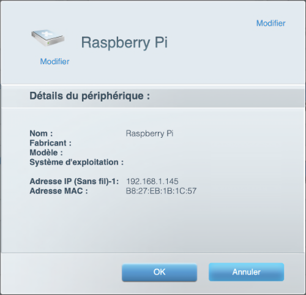

Vous n'avez pas accès au routeur? Il vous reste encore deux solutions :

* [apical\_lien\_interne][donner\_une\_adresse\_ip\_statique\_au\_raspberry\_pi,Donner une adresse IP statique au Pi,microsddansordi][/apical\_lien\_interne].

  ou
* Sur un réseau privé, utiliser [apical\_lien\_interne][nmap,Nmap][/apical\_lien\_interne] pour effectuer un balayage du réseau et ainsi trouver l'adresse IP du Raspberry Pi (risque de problèmes légaux sur un réseau public).

## 4.6 Afficher l'adresse IP du Pi à l'écran lors du démarrage

Par défaut, lorsque le Raspberry Pi démarre, son adresse IP apparaît à l'écran lors du démarrage.

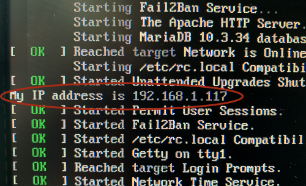

C'est le fichier /etc/rc.local qui est responsable de cet affichage.

Fichier /etc/rc.local

#!/bin/sh -e  
#  
# rc.local  
#  
# This script is executed at the end of each multiuser runlevel.  
# Make sure that the script will "exit 0" on success or any other  
# value on error.  
#  
# In order to enable or disable this script just change the execution  
# bits.  
#  
# By default this script does nothing.

 

# Print the IP address  
\_IP=$(hostname -I) || true  
if [ "$\_IP" ]; then  
  printf "My IP address is %s\n" "$\_IP"  
fi

 

exit 0

Si l'adresse ne s'affiche pas, la cause la plus probable est qu'il n'y a pas de connexion au réseau.

## 4.7 Envoyer l'adresse IP par courriel après le démarrage du Raspberry Pi

Si vous travaillez avec votre Raspberry Pi sans y brancher un écran, il peut être difficile de connaître son adresse IP.

S'il a une [apical\_lien\_interne][donner\_une\_adresse\_ip\_statique\_au\_raspberry\_pi,adresse IP statique][/apical\_lien\_interne], cette adresse sera toujours la même. Mais si c'est une adresse fournie par DHCP, elle pourrait être différente d'une fois à l'autre.

Ceci est encore plus vrai si vous utilisez votre Raspberry Pi à différents endroits, par exemple à l'école et à la maison.

Une solution intéressante pour trouver facilement l'adresse IP du Pi consiste à lancer un script Python au démarrage du Pi qui vous enverra cette adresse par courriel.

Pour réaliser cette manipulation, vous aurez besoin soit d'un clavier et d'un écran, soit de [apical\_lien\_interne][trouver\_l\_adresse\_ip\_du\_raspberry\_pi,connaître l'adresse IP initiale du Pi,headless][/apical\_lien\_interne].

L'idéal est d'effectuer l'envoi à partir d'un [apical\_lien\_interne][creer\_une\_adresse\_de\_courriel\_avec\_votre\_nom\_de\_domaine,courriel que vous aurez créé chez un hébergeur Web][/apical\_lien\_interne] car l'envoi de courriel avec une adresse du type Gmail ne fonctionnera pas. Puisque le mot de passe de ce courriel sera écrit en clair dans le script, il est conseillé d'utilier un compte de courriel qui ne sert qu'à cette cause.

Voici le script Python que vous devez installer sur votre Raspberry Pi. J'ai choisi de le placer dans le dossier /home/pi et de le nommer envoyer\_ip\_courriel.py mais vous pouvez changer l'emplacement et le nom comme bon vous semble.

Si vous utilisez votre ordinateur pour créer le script, vous devrez le [apical\_lien\_interne][copier\_un\_fichier\_sur\_une\_machine\_linux\_a\_partir\_d\_un\_autre\_ordinateur,copier sur le Raspberry Pi,scp][/apical\_lien\_interne] avant de poursuivre.

Je me suis inspirée de [ce script](https://www.reddit.com/r/raspberry_pi/comments/11p8xj/configure_your_pi_to_autoemail_its_ip_address_on/)1, que j'ai simplifié puis adapté pour Python 3.

Fichier envoyer\_ip\_courriel.py

#!/usr/bin/env python3

 """  
Envoie l'adresse IP du Pi par courriel  
Paramètres : aucun  
Auteur : Christiane Lagacé  
Inspiré de : https://www.reddit.com/r/raspberry\_pi/comments/11p8xj/configure\_your\_pi\_to\_autoemail\_its\_ip\_address\_on/  
et de https://realpython.com/python-send-email/  
Date : 16 septembre 2022  
Dernier ajustement : 12 août 2025  
"""  
  
 import smtplib, ssl  
import subprocess  
from email.mime.text import MIMEText  
from email.mime.multipart import MIMEMultipart  
  
 # \*\*\*\*\*\*\*\*\*\*\*\*\*\*\*\*\*\*\*\*\*\*\*\*\*\*\*\*\*\*\*\*\*\*\*\*\*\*\*\*\*\*\*  
# Configurations \*\*\*\*\*\*\*\*\*\*\*\*\*\*\*\*\*\*\*\*\*\*\*\*\*\*\*\*  
# \*\*\*\*\*\*\*\*\*\*\*\*\*\*\*\*\*\*\*\*\*\*\*\*\*\*\*\*\*\*\*\*\*\*\*\*\*\*\*\*\*\*\*  
smtp\_server = 'mail.mondomaine.com'  
port = 587   
sender\_email = 'monnom@mondomaine.com'  
password = 'mon\_mot\_de\_passe'  
receiver\_email = 'unnom@undomaine.com'  
# \*\*\*\*\*\*\*\*\*\*\*\*\*\*\*\*\*\*\*\*\*\*\*\*\*\*\*\*\*\*\*\*\*\*\*\*\*\*\*\*\*\*\*  
# Fin configurations \*\*\*\*\*\*\*\*\*\*\*\*\*\*\*\*\*\*\*\*\*\*\*\*  
# \*\*\*\*\*\*\*\*\*\*\*\*\*\*\*\*\*\*\*\*\*\*\*\*\*\*\*\*\*\*\*\*\*\*\*\*\*\*\*\*\*\*\*  
  
 hostname = subprocess.getoutput('hostname')   # Par défaut, on aura une chaîne du genre "raspberrypi"  
  
 try:  
    adresse\_ip = subprocess.getoutput('hostname -I')  
except Exception as e:  
    print(f"Exception: {e}")  
    adresse\_ip = 'aucune'  
   
message = MIMEMultipart()  
message['From'] = sender\_email  
message['To'] = receiver\_email  
message['Subject'] = f'Adresse IP de {hostname}'  
  
body = f"""Informations du Raspberry Pi:  
  
Hostname: {hostname}  
Adresse(s) IP: {adresse\_ip}  
"""  
  
message.attach(MIMEText(body, 'plain', 'utf-8'))  
   
# Envoyer le courriel  
context = ssl.create\_default\_context()  
try:  
     server = None  
    server = smtplib.SMTP(smtp\_server,port)  
    server.ehlo() # Can be omitted  
    server.starttls(context=context) # Secure the connection  
    server.ehlo() # Can be omitted  
    server.login(sender\_email, password)  
    server.sendmail(sender\_email, receiver\_email, message.as\_string())  
   
    print(body)  
    print(f'Courriel envoyé à {receiver\_email}')  
except Exception as e:  
    print(e)  
finally:  
    if server is not None:  
        server.quit()

Après avoir copié le script sur le Pi, prenez soin de vous assurer qu'il fonctionne correctement.

Terminal sur le Raspberry Pi

python3 ~/envoyer\_ip\_courriel.py

Une fois que vous êtes capables de recevoir l'adreses IP du Pi par courriel, vous pouvez automatiser le lancement du script au démarrage.

Pour y arriver, j'ai choisi de passer par la [crontab](https://man7.org/linux/man-pages/man5/crontab.5.html).

Pour éditer le fichier cron :

Terminal sur le Raspberry Pi

crontab -e

Si on vous demande de choisir un éditeur, sélectionnez Nano.

Au bas du fichier, ajoutez cette ligne et assurez-vous de faire un retour de charriot à la fin de la ligne.

Si votre usager Linux ne s'appelle pas pi, corrigez la ligne en conséquence.

Fichier cron

@reboot sleep 10; bash -c '/usr/bin/python3 /home/pi/envoyer\_ip\_courriel.py > /home/pi/boot.log 2>&1' &

Cette instruction demande d'attendre 10 secondes avant de lancer le script afin de laisser le temps au Pi de se connecter au réseau. Si votre réseau est lent, vous pouvez modifier le nombre de secondes d'attente, par exemple pour 15.

De plus, la sortie du script Python sera inscrite dans le fichier /home/pi/boot.log. Si tout a fonctionné, l'adresse IP du Pi doit y figurer. Sinon, le fichier contiendra un message d'erreur qui pourra vous aider à corriger la situation.

Lors du redémarrage du Pi, vous devriez recevoir un courriel avec l'adresse IP du Raspberry Pi. Si vous ne le recevez pas, consultez le fichier /home/pi/boot.log. S'il ne contient aucune erreur, c'est peut-être parce qu'il y a un problème au niveau des configurations du courriel.

## Source

1. « Configure your PI to auto-email its IP address on boot ». reddit. <https://www.reddit.com/r/raspberry_pi/comments/11p8xj/configure_your_pi_to_autoemail_its_ip_address_on/>

## 4.8 Vérifier l'état de la connexion sans fil

Une fois [apical\_lien\_interne][configurer\_le\_reseau\_wi-fi\_sur\_le\_raspberry\_pi,la connexion au réseau configurée][/apical\_lien\_interne] et le Raspberry Pi redémarré, j'aime effectuer quelques commandes pour vérifier l'étant de ma connexion :

* Pour connaître l'adresse IP du Raspberry Pi (remarquez le I majuscule) :

  Terminal du Raspberry Pi

  hostname -I
* Pour connaître le nom du réseau sans fil sur lequel le Pi est branché :

  Terminal du Raspberry Pi

  iwgetid
* Pour vérifier si le Pi peut accéder au réseau :

  Terminal du Raspberry Pi

  ping 8.8.8.8
* Pour vérifier si le Pi a accès à un serveur DNS :

  Terminal du Raspberry Pi

  ping google.com
* Pour vérifier les serveurs DNS configurés :

  Terminaldu Raspberry Pi

  cat /etc/resolv.conf

  Résultat à l'écran

  # Generated by NetworkManager  
  search mondomaine.loc  
  nameserver 999.999.999.999  
  nameserver 999.999.999.999
* Pour vérifier si la date du Pi est la bonne (pourrait empêcher l'installation de certains programmes) :

  Terminal du Raspberry Pi

  timedatectl

## 4.9 Donner une adresse IP statique au Raspberry Pi

Pour avoir un fonctionnement optimal, la boîte domotique, par exemple un Raspberry Pi, doit avoir une adresse IP statique (aussi appelée adresse IP fixe) dans le réseau.

Si la boîte domotique a une adresse IP dynamique fournie par un serveur DHCP, comme c'est le cas par défaut quand vous la branchez à votre réseau, cette adresse pourrait être appelée à changer. Une fois l'adresse changée, vous ne pourrez plus vous connecter à distance à moins d'avoir acccès au Raspberry Pi ou au routeur pour retrouver l'adresse IP.

Une adresse IP fixe permettra également de préserver le bon fonctionnement du système après un redémarrage du réseau (j'ai connu des problèmes de ce type avec mon Raspberry Pi de même qu'avec mes haut-parleurs Alexa, le tout a été réglé par des adresses IP statiques).

Dans cette fiche :

* Retrouver les serveurs de noms actuels
* Vérifier si votre système utilise NetworkManager
* Configurer l'adresse IP statique sur le Pi avec NetworkManager
  + Utilitaire nmtui
  + Commande nmcli
  + Édition des fichiers de configuration
  + Utiliser une adresse IP différente pour un autre réseau
    - Activer une configuration pour se brancher à un réseau
  + Revenir à une adresse IP fournie par DHCP
* Configurer l'adresse IP statique en insérant la carte micro SD dans votre ordinateur
* Configurer l'adresse IP statique sur le routeur
  + Adresse MAC du Raspberry Pi
  + Configuration
* Vérifier si tout a fonctionné

## Retrouver les serveurs de noms actuels

Lors de la configuration d'une adresse IP statique, vous aurez besoin d'entrer l'adresse IP des serveurs de noms de votre réseau.

Sous Windows, vous pouvez connaître les serveurs de noms actuellements utilisés pour votre ordinateur à l'aide de cette commande :

Terminal Windows

ipconfig /all

Résultat à l'écran

...  
Adresse IPv4............: 192.168.1.145 (préféré)  
...  
Passerelle par défaut...: 192.168.1.1  
Serveur DHCP............: 999.999.999.999  
                          999.999.999.999  
...

Vous pouvez également obtenir l'information comme suit :

Terminal Windows

Get-NetIPConfiguration

Résultat à l'écran

...  
IPv4Address          : 192.168.1.145  
...  
IPv4DefaultGateway   : 192.168.1.1  
DNSServer            : 999.999.999.999  
                       999.999.999.999  
...

Sous Mac, vous pouvez connaître les serveurs de noms à l'aide de la commande :

Terminal Mac

scutil --dns

Résultat à l'écran

resolver #1  
  nameserver[0] : 999.999.999.999  
  nameserver[1] : 999.999.999.999  
...

Et sous Linux :

Terminal Linux

cat /etc/resolv.conf

Résultat à l'écran

# Generated by NetworkManager  
search mondomaine.loc  
nameserver 999.999.999.999  
nameserver 999.999.999.999

## Vérifier si votre système utilise NetworkManager

Depuis Raspberry Pi OS Bookworm (2023), la gestion du réseau est réalisée avec [NetworkManager](https://networkmanager.dev/). Auparavant, elle était faite avec [dhcpcd](https://github.com/NetworkConfiguration/dhcpcd).

Pour vérifier si le système d'exploitation du Raspberry Pi utilise NetworkManager, entrez cette commande :

Terminal du Pi

nmcli device status

Résultat à l'écran

pi@raspberrypi:~ $ nmcli device status  
DEVICE          TYPE       STATE                    CONNECTION   
eth0            ethernet   connected                Wired connection 1   
lo              loopback   connected (externally)   lo   
wlan0           wifi       disconnected             --   
p2p-dev-wlan0   wifi-p2p   disconnected             --

Dans la colonne STATE, si vous voyez connected ou disconnected, c'est que l'OS utilise NetworkManager.

Si vous voyez plutôt unmanaged, ou encore si la commande nmcli n'est pas reconnue, c'est que l'OS utilise un auytre système pour gérer le réseau.

Si votre système n'utilise pas NetworkManager, référez-vous à la fiche « [apical\_lien\_interne]configurer\_l\_adresse\_ip\_statique\_du\_raspberry\_pi\_avec\_dhcpcd[/apical\_lien\_interne] ».

## Configurer l'adresse IP statique sur le Pi avec NetworkManager

Avec NetworkManager, vous avez plusieurs options pour configurer une adresse IP statique. Choisissez l'option qui vous plait parmi  :

* Utilitaire nmtui
* Commande nmcli
* Édition des fichiers de connexion

### Utilitaire nmtui

Il est possible d'effectuer les configurations réseau à l'aide de l'utilitaire nmtui (Network Manager Text UI).

Terminal

sudo nmtui

Si vous sélectionnez Edit a connection, l'utilitaire vous présentera les connexions existantes et vous offrira la possiblité d'en créer de nouvelles.

Pour donner une adresse IP statique à une configuration réseau, sélectionnez la configuration désirée puis modifiez la ligne IPv4 CONFIGURATION pour Manual.

Sélectionnez ensuite Show.

Voici un exemple de configuration d'adresse IP statique pour Wired connection 1.

Vous pouvez laisser la case Device à blanc. NetworkManager retrouvera automatiquement le nom du périphérique selon le type de connexion (Ethernet -> généralement eth0, Wi-Fi -> généralement wlan0).

Référez-vous à la section sur nmcli pour les détails des autres informations à entrer.

### Commande nmcli

Si vous préférez, vous pouvez configurer une adresse IP statique à l'aide de la commande nmcli :

* ipv4.addresses : Entrez l'adresse IP statique suivie du masque de sous-réseau (dans l'exemple : /24 qui signifie que les 3 premiers octets sont le masque de sous-réseau).
* ipv4.gateway : Entrez l'adresse IP locale du routeur. Avec un masque de sous-réseau 24, on entre les 3 premiers nombres de l'adresse IP, suivis généralement par le chiffre 1 (dans l'exemple : 192.168.1.1).
* ipv4.dns : Entrez l'adresse IP du ou des serveurs de noms de domaine (en anglais : nameserver, DNS) de votre réseau suivies de 8.8.8.8 et de 8.8.4.4 (serveurs DNS de Google). Remarquez qu'avec nmcli, les adresses DNS doivent être séparées par des virgules.

Terminal

sudo nmcli connection modify "Wired connection 1" \  
pv4.method "manual" \  
ipv4.addresses "192.168.1.145/24" \  
ipv4.gateway "192.168.1.1" \  
ipv4.dns "xxx.xxx.xxx.xxx,8.8.8.8,8.8.4.4"

### Édition des fichiers de connexion

Voici une autre technique pour configurer une adresse IP statique.

Les informations sur les connexions sont enregistrées dans des fichiers dont l'extension est .nmconnection.

Il est possible d'éditer directement ces fichiers. Notez que cette technique est plus complexe que les précédentes.

Pour y arriver :

* Vérifiez quelles connexions réseau existent.

  Terminal

  nmcli con show

  On voit ici qu'il y a une configuration pour le réseau câblé (ethernet) puis une configuration pour le Wi-Fi.  

  Résultat à l'écran

  pi@raspberrypi:~ $ nmcli con show  
  NAME                  UUID                                    TYPE        DEVICE   
  Wired connection 1    25d6bfa8-6c8c-3f8f-be53-516bece110e9    ethernet    eth0   
  lo                    cfbfab11-be1b-448d-846e-23608dd88ed9    loopback    lo   
  preconfigured         e8a78fe4-2969-4cd7-9b20-295f3f8bb529    wifi        --
* Vérifiez quels fichiers de configuration existent.

  Terminal

  ls /etc/NetworkManager/system-connections

  Il pourrait y avoir plusieurs fichiers. Leur nom débutera par ce qui était dans la colonne NAME de la commande nmcli con show et se terminera par .nmconnection.

  On voit ici que seule la connection Wi-Fi a un seul fichier de configuration.

  Résultat à l'écran

  pi@raspberrypi:~ $ ls /etc/NetworkManager/system-connections  
  preconfigured.nmconnection
* Si vous désirez éditer un fichier de configuration qui n'existe pas, vous devez le créer à l'aide de cette commande.  

  Remarquez que si le nom de la configuration comprend des espaces, il faut ajouter une barre oblique inverse devant chaque espace.

  Terminal

  sudo nmcli connection modify Wired\ connection\ 1 connection.autoconnect yes
* Pour vous assurer que NetworkManager saura utiliser ce fichier pour configurer le réseau, entrez cette commande et assurez-vous que le chemin du fichier est /etc/NetworkManager/system-connection.

  Terminal

  nmcli -f NAME,UUID,FILENAME connection

  Résultat à l'écran

  pi@raspberrypi:~ $ nmcli -f NAME,UUID,FILENAME connection  
  NAME                 UUID                                 FILENAME   
  lo                   ee200fcc-dcb0-4976-a81d-65554b48c0b1 /run/NetworkManager/system-connections/lo.nmconnection   
  preconfigured        a2aa2a5f-4bf6-46a0-9e40-fb70c86d610b /etc/NetworkManager/system-connections/preconfigured.nmconnection   
  Wired connection 1   05e42c99-0c51-3798-aae9-e0246598d0ae /etc/NetworkManager/system-connections/Wired connection 1.nmconnection
* Éditez le fichier qui correspond à la connexion pour laquelle l'adresse IP statique doit être utiilsée. Rappel : le résultat de la commande nmcli con show fait le lien entre un nom de fichier et le type de réseau.

  Terminal

  sudo nano /etc/NetworkManager/system-connections/Wired\ connection\ 1.nmconnection
* Remplissez le fichier en respectant ces consignes :
  + Section [connection] :
    - id : la valeur qui apparaît correspond au nom du fichier sans l'extension.
    - uuid : la valeur qui apparaît correspond à l'identificateur unique (Universally Unique IDentifier, UUID) qui apparaissait avec la commande nmcli con show.
    - type : ethernet ou wifi
  + Section [wifi] (sans fil seulement) :  
    - mode : infrastructure
    - ssid : entrez le nom du réseau sans fil
  + Section [wifi-security] (sans fil seulement) :
    - key-mgmt : wpa-psk
    - psk : entrer le mot de passe du réseau sans fil en clair. Notez que certains outils permettent de générer une version cryptée du mot de passe.
  + Section [ipv4] :
    - address1 : Entrez l'adresse IP statique suivie du masque de sous-réseau suivi d'une virgule puis de l'adresse IP locale du routeur.
    - dns : Entrez l'adresse IP du ou des serveurs de noms de domaine de votre réseau suivies de 8.8.8.8 et de 8.8.4.4 (serveurs DNS de Google) . Dans le fichier de configuration, les différentes adresses doivent être séparées par un point-virgule.
    - method : Entez manual pour indiquer que l'adresse iP est statique. La valeur auto serait utilisée pour une adresse DHCP.

Exemple pour une connection câblée :

Fichier Wired connection 1.nmconnection

[connection]  
id=Wired connection 1  
uuid=25d6bfa8-6c8c-3f8f-be53-516bece110e9  
type=ethernet

 

[ipv4]  
address1=192.168.1.145/24,192.168.1.1  
dns=xxx.xxx.xxx.xxx;8.8.8.8;8.8.4.4  
method=manual

Exemple pour une connection Wi-Fi :

Fichier preconfigured.nmconnection

[connection]  
id=preconfigured  
uuid=e8a78fe4-2969-4cd7-9b20-295f3f8bb529  
type=wifi  
  
[wifi]  
mode=infrastructure  
ssid=xxxxxx  
  
[wifi-security]  
key-mgmt=wpa-psk  
psk=xxxxxxxx

 

[ipv4]  
address1=192.168.1.145/24,192.168.1.1  
dns=xxx.xxx.xxx.xxx;8.8.8.8;8.8.4.4  
method=manual

Pour enregistrer les modifications, appuyez sur Ctrl + X puis O (ou Y si votre OS est en anglais) pour enregistrer les modifications.

Redémarrez le Raspberry Pi.

### Utiliser une adresse IP différente pour un autre réseau

Prenons le cas où vous utilisez un Raspberry Pi dans votre établissement scolaire puis vous le ramenez à votre domicile pour poursuivre vos travaux.

Il pourrait arriver que l'adresse IP statique utilisée à l'école ne soit pas compatible avec les configurations de votre réseau à la maison.

Ceci peut être géré en créant un fichier de configuration spécifique pour chaque environnement.

Au besoin, une configuraation pourrait avoir une adresse IP statique et l'autres, une adresse fournie par DHCP.

Pour créer un fichier de configuration, vous pouvez utiliser l'option Edit a connection puis Add dans l'utilitaire nmtui ou encore lancer cette commande en ajustant le nom de la connection (con-name) et le nom du réseau (ssid).

Terminal

sudo nmcli connection add type wifi con-name wifi-maison ssid "nom-du-reseau"

Pour un réseau câblé :

Terminal

sudo nmcli connection add type ethernet con-name cable-maison

Ceci créera un fichier wifi-maison.nmconnection ou cable-maison.nmconnection ou tout autre nom basé sur l'attribut con-name.

Peu importe dans quel dossier vous étiez lorsque vous avez passé la commande, le fichier sera créé dans le dossier /etc/NetworkManager/system-connections.

Vous pourrez ensuite compléter le fichier comme dans les exemples plus haut.

#### Activer une configuration pour se brancher à un réseau

Pour activer la configuration, vous pouvez utiliser l'option Activate a connection dans l'utilitaire nmtui ou encore entrer cette commande :

Terminal

sudo nmcli con up cable-maison

Attention : si vous avez deux fichiers qui donnent une adresse IP statique pour un réseau **câblé**, celui qui s'active par défaut **pourrait être** le dernier qui a été utilisé.

En effet, selon la documentation officielle de nm-settings-nmcli[1](https://networkmanager.pages.freedesktop.org/NetworkManager/NetworkManager/nm-settings-nmcli.html) :

> If multiple profiles are ready to autoconnect on the same device, the one with the better "connection.autoconnect-priority" is chosen. If the priorities are equal, then the most recently connected profile is activated. If the profiles were not connected earlier or their "connection.timestamp" is identical, the choice is undefined.

Il faut prendre certaines précautions lorsque les adresses IP des deux environnements sont incompatibles. Par exemple le format des adresses IP à l'école pourrait être 192.168.29.xxx et à la maison, 10.0.0.xxx.

Dans un tel cas, si la bonne configuration câblée n'est pas active lors du démarrage du Raspberry Pi, vous aurez besoin d'un écran et d'un clavier pour activer la configuration désirée puisque l'adresse IP active sera incompatible avec votre réseau, ce qui empêchera le branchement via SSH.

Par contre, pour une connexion Wi-Fi, c'est la connexion qui correspond au nom du réseau Wi-Fi disponible qui sera automatiquement activée. Vous pourrez donc vous brancher via SSH et donc, vous n'aurez pas besoin d'un écran ni d'un clavier à brancher au Raspberry Pi.

### Revenir à une adresse IP fournie par DHCP

Si vous désirez modifier vos configurations pour revenir à une adresse IP fournie par le serveur DHCP, il suffit de modifier la ligne method dans la section [ipv4].

Fichier Fichier xxx.nmconnection

[ipv4]

 

method=auto

Lors du prochain redémarrage, il est fort probable que le Pi aura tout de même la même adresse IP puisque le serveur DHCP se rappellera de la dernière adresse fournie. Cependant, ceci n'est pas garanti alors sans l'adresse IP statique, vous devrez vérifier l'adresse IP en branchant un écran sur le Pi.

## Configurer l'adresse IP statique en insérant la carte micro SD dans votre ordinateur

Il est possible de donner une adresse IP statique au Pi à partir de votre ordinateur sans que Raspberry Pi OS ne soit démarré. Ceci fonctionne autant pour les systèmes qui utilisent NetworkManager que pour ceux qui utilisent dhcpcd. Cette technique est pratique si vous n'avez pas d'écran à brancher au Pi.

Par contre, ceci ne devrait être utilisé que si vous n'avez pas accès à un écran puisque le temps de démarrage du Raspberry Pi sera toujours long tant que la configuration que vous vous apprêtez à faire sera en place. Une fois l'adresse IP statique correctement configurée et le Pi démarré, vous pourrez modifier cette configuration pour raccourcir le temps de démarrage, tel que mentionné au bas de la procédure.

Si vous insérez la carte micro SD directement dans votre ordinateur (Mac, Windows ou Linux), vous remarquerez que le dossier /etc n'y figure pas puisqu'il faut que Raspberry Pi OS soit en marche pour qu'il apparaisse.

Résultat à l'écran

MBPdeMonNom:~ monnom$ ls /Volumes/boot/

 

|  COPYING.linux |  fixup4cd.dat | 
 |  LICENCE.broadcom |  fixup4db.dat | 
 |  bcm2708-rpi-b-plus.dtb |  fixup4x.dat | 
 |  bcm2708-rpi-b-rev1.dtb |  fixup\_cd.dat | 
 |  bcm2708-rpi-b.dtb |  fixup\_db.dat | 
 |  bcm2708-rpi-cm.dtb |  fixup\_x.dat | 
 |  bcm2708-rpi-zero-w.dtb |  issue.txt | 
 |  bcm2708-rpi-zero.dtb |  kernel.img | 
 |  bcm2709-rpi-2-b.dtb |  kernel7.img | 
 |  bcm2710-rpi-2-b.dtb |  kernel7l.img | 
 |  bcm2710-rpi-3-b-plus.dtb |  kernel8.img | 
 |  bcm2710-rpi-3-b.dtb |  overlays | 
 |  bcm2710-rpi-cm3.dtb |  start.elf | 
 |  bcm2711-rpi-4-b.dtb |  start4.elf | 
 |  bcm2711-rpi-cm4.dtb |  start4cd.elf | 
 |  bootcode.bin |  start4db.elf | 
 |  **cmdline.txt** |  start4x.elf | 
 |  config.txt |  start\_cd.elf | 
 |  fixup.dat |  start\_db.elf | 
 |  fixup4.dat |  start\_x.elf |

Qu'à celà ne tienne, il est possible de donner une adresse statique au Pi en éditant le fichier cmdline.txt à l'aide de l'éditeur de votre choix. Pour ma part, j'aime travailler avec Geany.

Ce fichier contient une série de configurations qui seront lues lors du démarrage de Rarspberry Pi OS.

Je vous conseille de prendre copie du fichier avant de l'éditer. Ceci permettra de revenir à la version originale si jamais vos manipulations empêchent le bon fonctionnement de l'OS.

Voici le contenu initial de ce fichier.

Fichier cmdline.txt

console=serial0,115200 console=tty1 root=PARTUUID=58ce116e-02 rootfstype=ext4 elevator=deadline fsck.repair=yes rootwait quiet init=/usr/lib/raspi-config/init\_resize.sh splash plymouth.ignore-serial-consoles

Chaque configuration est séparée par un espace. Toutes les configurations doivent tenir sur une seule ligne.

Ajoutez simplement à la fin de cette ligne [la configuration suivante](https://www.kernel.org/doc/Documentation/filesystems/nfs/nfsroot.txt#:~:text=ip=) en ajustant les informations requises au format :

ip=addresseIP::adresseIPLocaleRouteur:masqueSousReseau:HostNameDuPi:eth0:off

Par exemple :

Fichier cmdline.txt

ip=192.168.1.145::192.168.1.1:255.255.255.0:raspberrypi:eth0:off

Enregistrez le fichier puis retirez la carte micro SD de l'ordinateur de façon sécuritaire.

Insérez la carte dans le Pi et mettez-le sous tension.

Soyez patients : mon Pi a mis loooooongtemps (un peu plus de 2 minutes) avant de redémarrer après que j'aie modifié le fichier cmdline.txt.

Ce délai est normal.

Si vous ne souhaitez pas attendre à chaque redémarrage du Pi, [apical\_lien\_interne][se\_brancher\_au\_raspberry\_pi\_via\_ssh,branchez-vous via SSH][/apical\_lien\_interne] puis configurez l'adresse IP statique à l'aide d'une autre méthode présentée dans cette fiche. Retirez ensuite la configuration du fichier cmdline.txt.

## Configurer l'adresse IP statique sur le routeur

Personnellement, chez moi, je préfère travailler à partir du routeur. Ceci m'assure qu'il n'y aura aucun conflit d'adresses IP car le routeur sait que cette adresse est réservée pour le Pi.

### Adresse MAC du Raspberry Pi

Si vous désirez configurer l'adresse IP statique à partir de votre routeur, vous aurez besoin de l'adresse MAC du Raspberry Pi.

L'adresse peut être trouvée à partir de l'interface de votre routeur qui liste les périphériques branchés mais parfois, il est difficile de déterminer quel périphérique est le Raspberry Pi.

Si vous avez un doute ou si vous préférez retrouver l'adresse MAC directement à partir du Pi, branchez un écran et un clavier au Raspberry Pi, ouvrez une fenêtre Terminal puis entrez cette commande :

Terminal

ifconfig

Si le Pi indique que la commande n'existe pas, vous devrez effectuer une installation supplémentaire :

Terminal

sudo apt install net-tools

Dans le résultat de ifconfig, vous obtiendrez un paragraphe par carte réseau. Les plus communes sont eth0 pour le réseau câblé et wlan0 pour le sans fil.

L'adresse MAC apparaîtra près du mot ether pour la carte que vous désirez utiliser (câblé ou sans fil). Elle est constituée de 6 nombres hexadécimaux séparés par des « : » (ex : b8:27:eb:b56:dc:a2).

### Configuration

La technique précise pour configurer l'adresse statique dépendra de la marque du routeur. En gros, les étapes ressembleront à ceci :

* Assurez-vous d'abord que le Pi soit connecté au réseau par un câble RJ45 ou via Wi-Fi, selon la technique qui sera utilisée pendant son fonctionnement normal.
* Par mesure de sécurité, la plupart des routeurs ne permettent pas par défaut l'accès aux configurations via Wi-Fi. Si c'est le cas avec votre routeur, branchez l'ordinateur au routeur à l'aide d'un câble RJ45.
* Sur votre ordinateur, ouvrez la page Web à l'adresse IP locale du routeur. Il s'agit généralement de 192.168.0.1 ou 192.168.1.1. Sur certains systèmes, il faut plutôt accéder au 10.0.0.1. En cas de doute, rendez-vous sur ce site : <http://whatsmyrouterip.com/>.
* Selon votre routeur, vous aurez accès à une option de menu du genre
  + Connectivité / Réseau local / DHCP
  + ou Configuration / Configuration de base / Configuration du réseau / Paramètre de serveur DHCP
  + ou encore Mode Expert / Configuration / Serveur DHCP / Liste des clients
  + ou même tout simplement Connected Devices.

    Il y a autant d'organisation des options de menus qu'il y a de routeurs. Si vous ne trouvez pas l'endroit où effectuer la configuration, voyez le manuel de votre routeur.
* Pour accéder aux configurations des adresses IP, vous devriez vous retrouver dans un des scénarios suivants :
  + Sur certains systèmes, un bouton devrait vous permettre d'ajouter manuellement une réservation de périphérique (autre appellation possible : Réservation DHCP). Vous devrez ensuite entrer l'adresse MAC du Raspberry Pi et l'adresse IP fixe que vous souhaitez lui assigner. L'adresse IP peut généralement être n'importe quoi dans la plage192.168.0.2 à 192.168.0.254 ou 192.168.1.2 à 192.168.1.254. Important : l'adresse utilisée ne doit pas être déjà attribuée à un autre élément du réseau.
  + Sur d'autres systèmes , on voit la liste des périphériques branchés au routeur.

    L'écran pourra ressembler à un de ceux-ci :

    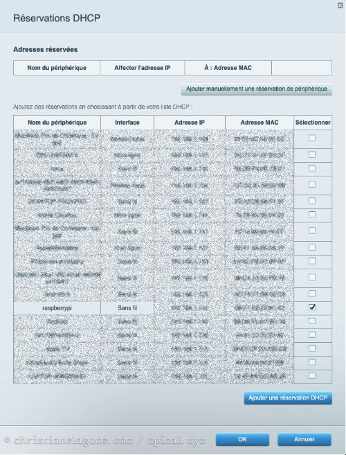

    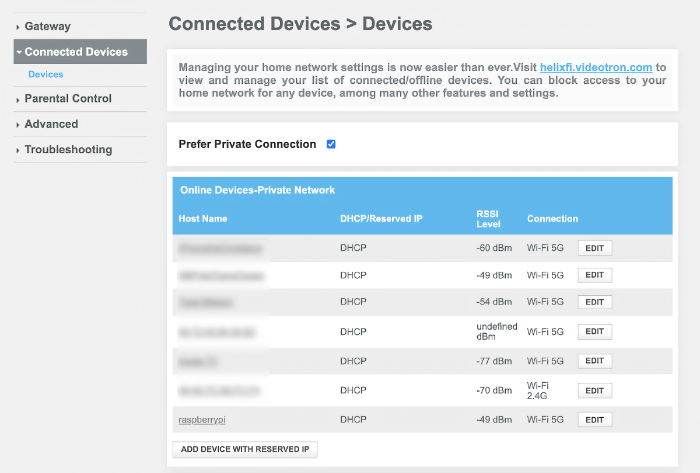
  + Il vous faut cocher le Raspberry Pi — après vous être assurés qu'il s'agit du bon périphérique à l'aide de l'adresee MAC — puis cliquer sur Ajouter une réservation DHCP (autre appellation possible : Réserver).

    D'autres système demandent de cliquer sur le bouton d'édition puis de cocher une case du genre Reserved IP.

    Le Pi apparaît désormais dans la liste des adresses réservées comme montré dans ces deux exemples.

    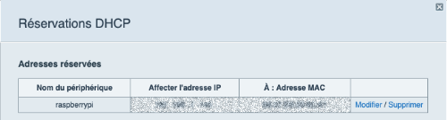

    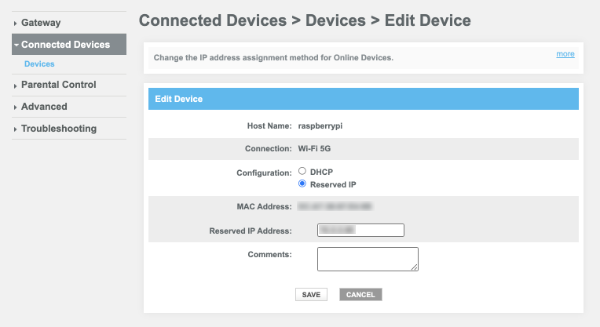

    Note : vous pouvez effectuer une vérification supplémentaire pour vous assurer que vous avez donné une adresse IP statique au bon périphérique. Il suffit de comparer l'adresse IP du périphérique sélectionné avec celle donnée [apical\_lien\_interne][trouver\_l\_adresse\_ip\_du\_raspberry\_pi,directement sur votre Raspberry Pi][/apical\_lien\_interne].

## Vérifier si tout a fonctionné

Comme dans toute manipulation, il faut tester si on obtient le résultat escompté peu importe la technique utilisée.

Après le redémarrage, le Pi devrait avoir l'adresse IP qu'on lui a imposée.

La technique pour retrouver l'adresse IP du Pi est donnée sur cette fiche : [apical\_lien\_interne]trouver\_l\_adresse\_ip\_du\_raspberry\_pi[/apical\_lien\_interne]

## Source

1. « nm-settings-nmcli ». NetworkManager. <https://networkmanager.pages.freedesktop.org/NetworkManager/NetworkManager/nm-settings-nmcli.html>

## Pour plus d'information

« Raspberry Pi ASAP Setup Guide - Assigning IP addresses ». GitHub. <https://kr15h.github.io/RPi-Setup#titles.3.1>

« RPi cmdline.txt ». elinux.org. <https://elinux.org/RPi_cmdline.txt>

## 4.10 Activer SSH sur le Raspberry Pi

Par défaut, Raspberry Pi OS empêche les connexions SSH. Vous devez donc activer SSH sur votre Raspberry Pi.

## Vérifier si SSH est activé

D'abord, pour vérifier si SSH est activé, branchez un clavier et un écran au Pi et entrez cette commande :

Terminal sur le Raspberry Pi

sudo systemctl status ssh

Si SSH est activé, vous verrez une ligne de ce genre :

Résultat à l'écran

pi@raspberrypi:~ $ sudo systemctl status ssh  
   ssh.service - OpenBSD Secure Shell server  
      Loaded: loaded (/lib/systemd/system/ssh.service; enabled; preset: enabled)  
      Active: active (running) since Mon 2025-08-11 09:38:49 EDT; 6h ago  
        Docs: man:sshd(8)  
              man:sshd\_config(5)  
     Process: 618 ExecStartPre=/usr/sbin/sshd -t (code=exited, status=0/SUCCESS)  
    Main PID: 660 (sshd)  
       Tasks: 1 (limit: 3921)  
         CPU: 470ms  
      CGroup: /system.slice/ssh.service

S'il n'est pas activé, vous verrez plutôt une information du genre Active: inactive (dead).

## Activer SSH

Vous pouvez activer SSH de différentes façons :

* Sur le Pi à la ligne de commande
* Sur le Pi avec l'utilitaire raspi-config
* Directement sur la carte micro SD lors d'une installation headless
* Sur le Pi avec l'interface graphique

Une fois SSH activé, il sera important de modifier le mot de passe afin de ne pas ouvrir un trou de sécurité.

### Ligne de commande

Vous pouvez aussi activer SSH à l'aide d'une fenêtre Terminal sur le Pi (après y avoir branché un écran et un clavier).

Terminal sur le Raspberry Pi

sudo systemctl enable ssh  
sudo systemctl start ssh

### Utilitaire raspi-config

Il est possible d'activer SSH à partir de l'utilitaire raspi-config.

Branchez un écran et un clavier sur le Pi puis ouvrez une fenêtre Terminal.

Entrez la commande :

Terminal sur le Raspberry Pi

sudo raspi-config

Dans le menu qui apparaît, choisissez 5 Interfacing Options.

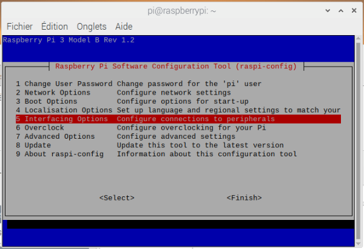

Choisissez ensuite P2 SSH.

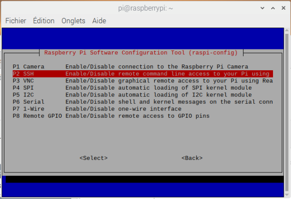

À la question Would you like the SSH server to be enabled?, répondez Oui.

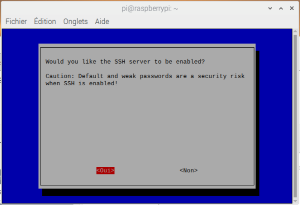

### Installation headless

Si vous ne disposez pas d'un écran et d'un clavier pour travailler directement sur le Pi, vous pouvez activer SSH avec une méthode dite headless (littéralement : sans tête).

Il s'agit d'insérer la carte micro SD dans le lecteur de cartes de votre ordinateur et de créer un petit fichier vide nommé ssh à la racine de la partition boot.

Sous Mac ou Linux, le fichier sera créé à l'aide de la commande suivante :

Terminal sur l'ordinateur

touch /Volumes/boot/ssh

Sous Windows, vous pouvez ouvrir le gestionnaire de fichier, vous rendre à la racine de la partition boot puis créer le fichier à l'aide d'un clic droit / Nouveau / Document texte. Attention : le fichier doit s'appeler ssh sans extension.

Une fois le fichier créé, vous pouvez [apical\_lien\_interne][retirer\_un\_disque\_amovible\_de\_facon\_securitaire,retirer la carte micro SD de façon sécuritaire][/apical\_lien\_interne], l'insérer dans le Rapsberry Pi puis mettre le Pi sous tension.

Remarquez qu'au prochain démarrage du Pi, ce fichier disparaîtra. Pour savoir si le SSH est activé, vérifiez si le service sshd est actif à l'aide de la commande ps -ef | grep sshd.

### Interface graphique

Si votre Pi dispose d'une interface graphique, branchez un écran, un clavier et une souris sur le Pi puis :

* Rendez-vous dans le menu Préférences / Configuration du Raspberry Pi.

  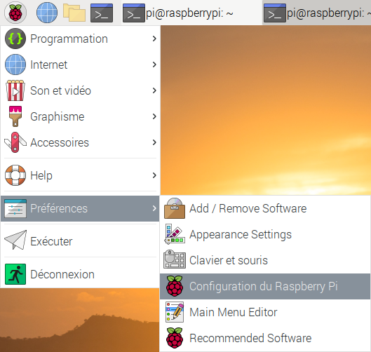
* Cliquez sur l'onglet Interfaces.
* Vis-à-vis l'option SSH, cochez Activé.

  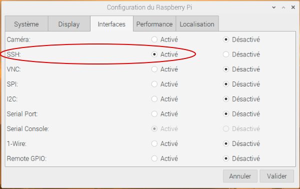

## Changer le mot de passe par défaut

Une fois SSH activé, si votre PI a été installé avec le nom d'usager par défaut (pi) et le mot de passe par défaut (raspberry), n'importe qui peut se brancher à distance sur le Raspberry Pi, en autant que les règles du réseau le permettent.

Afin de refermer le trou de sécurité que cela crée, vous devez absolument [apical\_lien\_interne][mot\_de\_passe\_sur\_raspberry\_pi\_os,utiliser un mot de passe différent de celui par défaut][/apical\_lien\_interne].

## 4.11 Se brancher au Raspberry Pi via SSH

Si vous avez besoin de travailler directement sur le Raspberry Pi, plusieurs options s'offrent à vous :

* Brancher un écran, un clavier (et une souris si l'OS possède une interface graphique) directement sur le Pi.

  Remarque : si vous travaillez avec un Raspberry Pi 4, seul le port du haut permet l'installation initiale. Par contre, une fois l'installation de Raspberry Pi OS complétée, vous pourrez utiliser le port de votre choix.
* Utiliser l'écran de votre ordinateur portable comme écran du Raspberry Pi grâce à un [apical\_lien\_interne][outil\_de\_capture\_video\_et\_logiciel\_obs\_pour\_utiliser\_l\_ecran\_d\_un\_ordina\_\_\_,outil de capture vidéo][/apical\_lien\_interne] (un clavier externe sera requis).
* Utiliser un [apical\_lien\_interne][realvnc\_pour\_prendre\_controle\_du\_raspberry\_pi\_a\_distance,outil de contrôle à distance tel que VNC Connect][/apical\_lien\_interne] (mode graphique).
* Accéder au Pi à l'aide d'une communication SSH à partir d'un autre ordinateur (mode console).

Si vous souhaitez travailler via SSH, voici la procédure à suivre.

## Adresse IP

Pour vous brancher au Pi à partir de votre ordinateur, vous aurez besoin de son adresse IP. Vous pouvez la trouver facilement avec [apical\_lien\_interne][trouver\_l\_adresse\_ip\_du\_raspberry\_pi,la commande hostname -I][/apical\_lien\_interne] ou, si vous n'avez pas accès au Pi, à partir de l'interface de votre routeur.

Vous faites une installation headless (sans écran ni clavier sur le Pi) et vous n'avez pas accès au routeur? Il vous reste comme solution de [apical\_lien\_interne][donner\_une\_adresse\_ip\_statique\_au\_raspberry\_pi,donner une adresse IP statique au Pi,microsddansordi][/apical\_lien\_interne].

## Activer SSH

Assurez-vous que le Raspberry Pi est configuré pour permettre la communication via SSH. Les instructions sont données ici : [apical\_lien\_interne]activer\_ssh\_sur\_le\_raspberry\_pi[/apical\_lien\_interne].

## Client SSH

Si vous travaillez avec un ordinateur Mac ou Linux, vous avez déjà un client SSH installé.

Sous Windows, vous pouvez travailler avec un client SSH disponible à partir d'une fenêtre PowerShell ou d'une console Git Bash.

Je ne vous recommande pas l'utilitaire Putty puisque, si vous choisissez de [apical\_lien\_interne][permettre\_le\_branchement\_ssh\_sans\_demander\_le\_mot\_de\_passe\_a\_chaque\_fois,vous authentifier à l'aide de clés SSH][/apical\_lien\_interne], il travaille avec son propre format de clés SSH, non compatible avec le format généré par le traditionnel ssh-keygen.

## Branchement au Pi

Le client SSH vous permet de vous connecter au Pi à l'aide d'une commande entrée dans une fenêtre Terminal de votre ordinateur (vous devez remplacer 192.168.1.145 par l'adresse IP de votre Pi).

Terminal (sur l'ordinateur)

ssh pi@192.168.1.145

Sous Raspberry Pi OS, l'usager par défaut se nomme pi (comme dans l'exemple précédent). Le mot de passe est raspberry à moins que vous ne l'ayez [apical\_lien\_interne][mot\_de\_passe\_sur\_raspberry\_pi\_os,changé lors de l'installation de Raspberry Pi OS][/apical\_lien\_interne], ce qui est fortement recommandé.

Selon les configurations effectuées sur le Raspberry Pi, il est possible d'utiliser un autre nom d'usager ou un autre port.

Par exemple, sous Home Assistant, l'usager à utiliser s'appelle root et le port est 22222.

Terminal (sur l'ordinateur)

ssh root@192.168.1.145 -p 22222

## Erreur « REMOTE HOST IDENTIFICATION HAS CHANGED! »

Parfois, lorsqu'on tente de se brancher via SSH, on obtient le message suivant :

Résultat à l'écran

MacBook-Pro-de-MonNom:~ monnom$ ssh pi@192.168.1.145  
@@@@@@@@@@@@@@@@@@@@@@@@@@@@@@@@@@@@@@@@@@@@@@@@@@@@@@@@@@@  
@ WARNING: REMOTE HOST IDENTIFICATION HAS CHANGED! @  
@@@@@@@@@@@@@@@@@@@@@@@@@@@@@@@@@@@@@@@@@@@@@@@@@@@@@@@@@@@  
IT IS POSSIBLE THAT SOMEONE IS DOING SOMETHING NASTY!  
Someone could be eavesdropping on you right now (man-in-the-middle attack)!  
It is also possible that a host key has just been changed.  
The fingerprint for the ECDSA key sent by the remote host is  
SHA256:XuhSy6HE1PkibkA17UpvKSLNuStDY73bfGhip7KVQ6U.  
Please contact your system administrator.  
Add correct host key in /Users/monnom/.ssh/known\_hosts to get rid of this message.  
Offending ECDSA key in /Users/monnom/.ssh/known\_hosts:10  
ECDSA host key for 192.168.1.145 has changed and you have requested strict checking.  
Host key verification failed.

Plusieurs facteurs peuvent causer ce comportement, par exemple si le Raspberry Pi utilise une adresse IP qui était auparavant utilisée par un autre périphérique auquel un branchement a été fait via SSH.

Ceci se traduit par une mauvaise information dans le fichier known\_hosts.

Pour corriger la situation, toujours dans une fenêtre Terminal sur votre ordinateur, retirez l'information sur cette adresse IP du fichier known\_hosts à l'aide de la commande ssh-keygen -R.

Prenez soin d'entrer l'adresse IP du Raspberry Pi :

Terminal

ssh-keygen -R 192.168.1.145

Si vous utilisez un port pour la connexion SSH, par exemple le port 22222, la syntaxe sera comme suit.

Notez la présence des guillemets alentour de l'adresse IP et du port. Ceci est nécessaire avec un shell zsh puisque ce shell interprète les crochets carrés comme une série de choix.

Terminal

ssh-keygen -R "[192.168.1.145]:22222"

Si ceci ne règle pas le problème, il est possible d'effacer complètement le fichier known\_hosts.

## Pour plus d'information

« How to Enable SSH on Raspberry Pi ». Linuxize. <https://linuxize.com/post/how-to-enable-ssh-on-raspberry-pi/>

« Raspberry Pi Terminal Commands: A Quick Guide for Raspberry Pi Users ». Make Use Of. <https://www.makeuseof.com/tag/15-useful-commands-every-raspberry-pi-user-should-know/>

« Logging into the Raspberry Pi ». GitHub - WebThingsIO/wiki. <https://github.com/WebThingsIO/wiki/wiki/Logging-into-the-Raspberry-Pi>

## 4.12 Mode verbeux lors d'une connexion SSH

Si vous n'arrivez pas à vous brancher à votre Raspberry Pi via SSH, vous pouvez activer le mode verbeux pour vous aider à cibler le problème.

Il suffit d'ajouter l'option -v à la commande :

Terminal

ssh -v pi@192.168.1.145

Résultat à l'écran

monnom@MacBook-Pro-de-MonNom ~ %ssh -v pi@192.168.1.145

 

OpenSSH\_8.6p1, LibreSSL 3.3.6

 

debug1: Reading configuration data /etc/ssh/ssh\_config

 

debug1: /etc/ssh/ssh\_config line 21: include /etc/ssh/ssh\_config.d/\* matched no files

 

debug1: /etc/ssh/ssh\_config line 54: Applying options for \*

 

debug1: Authenticator provider $SSH\_SK\_PROVIDER did not resolve; disabling

 

debug1: Connecting to 192.168.1.145 [192.168.1.145] port 22.

 

debug1: connect to address 192.168.1.145 port 22: Connection refused

 

ssh: connect to host 192.168.1.145 port 22: Connection refused

Les options -vv et -vvv donnent encore plus de détails.

Résultat à l'écran

monnom@MacBook-Pro-de-MonNom ~ %ssh -vvv pi@192.168.1.145  
OpenSSH\_8.6p1, LibreSSL 3.3.6  
debug1: Reading configuration data /etc/ssh/ssh\_config  
debug1: /etc/ssh/ssh\_config line 21: include /etc/ssh/ssh\_config.d/\* matched no files  
debug1: /etc/ssh/ssh\_config line 54: Applying options for \*  
debug2: resolve\_canonicalize: hostname 192.168.1.145 is address  
debug3: expanded UserKnownHostsFile '~/.ssh/known\_hosts' -> '/Users/monnom/.ssh/known\_hosts'  
debug3: expanded UserKnownHostsFile '~/.ssh/known\_hosts2' -> '/Users/monnom/.ssh/known\_hosts2'  
debug1: Authenticator provider $SSH\_SK\_PROVIDER did not resolve; disabling  
debug3: ssh\_connect\_direct: entering  
debug1: Connecting to 192.168.1.145 [192.168.1.145] port 22.  
debug3: set\_sock\_tos: set socket 3 IP\_TOS 0x48  
debug1: connect to address 192.168.1.145 port 22: Connection refused  
ssh: connect to host 192.168.1.145 port 22: Connection refused

## 4.13 Permettre le branchement SSH sans demander le mot de passe à chaque fois

Si vous avez besoin de vous connecter régulièrement à votre Raspberry Pi via SSH à partir de votre ordinateur, vous aimerez ce que je vous propose ici. Pour que ces instructions fonctionnent, votre Pi doit tourner avec Raspberry Pi OS (anciennement Raspbian).

La technique consiste à utiliser une paire « clé SSH publique - clé SSH privée » pour garantir que l'accès provient bien de votre ordinateur.

La clé privée, qui remplace le mot de passe, doit être sur votre ordinateur avec la clé publique. La clé publique sera de plus copiée sur le Pi à un endroit précis afin de permettre l'authentification sans mot de passe.

Pour comprendre le fonctionnement des clés publiques et privées, vous pouvez consulter cette fiche : « [apical\_lien\_interne]comment\_fonctionne\_l\_authentification\_via\_ssh[/apical\_lien\_interne] ».

## Activer SSH sur le Pi

Assurez-vous que [apical\_lien\_interne][activer\_ssh\_sur\_le\_raspberry\_pi,votre Pi est configuré pour permettre les connexions via SSH][/apical\_lien\_interne].

## Vérifier l'existence clés SSH

Les clés SSH, si elles existent, sont stockées dans le dossier ~/.ssh sur votre ordinateur.

Les instructions suivantes peuvent être lancées telles qu'elles dans un Terminal sous Mac ou Linux.

Sous Windows, pour effectuer les mêmes manipulations, vous devez ouvrir une fenêtre Terminal (et non CMD) ou une fenêtre PowerShell. Vous pouvez également installer la console Git Bash (<https://git-scm.com/downloads>).

Je ne vous recommande pas l'utilitaire Putty puisqu'il travaille avec son propre format de clés SSH, non compatible avec le format généré par le traditionnel ssh-keygen.

Pour vérifier si les clés SSH ont déjà été générées, entrez cette commande sur votre ordinateur :

Terminal sur l'ordinateur

ls ~/.ssh

Nous allons utiliser l'algorithme Ed25519 qui est l'[algorithme recommandé de nos jours](https://medium.com/risan/upgrade-your-ssh-key-to-ed25519-c6e8d60d3c54).

La clé publique est stockée dans le fichier id\_ed25519.pub et la clé privée, dans le fichier id\_ed25519.

## Générer les clés SSH

Si les clés n'existent pas, vous devrez les générer à l'aide de cette commande sur votre ordinateur :

Terminal sur l'ordinateur

ssh-keygen -t ed25519 -C 'moncourriel@mondomaine.com'

Note : certains systèmes ne supportent pas les clés générées avec ed25519. Si c'est le cas pour vous, vous pouvez utiliser l'algorithme rsa qui est moins sécuritaire mais plus largement supporté.

Terminal sur l'ordinateur

ssh-keygen -t rsa -C 'moncourriel@mondomaine.com'

Acceptez l'emplacement par défaut (sous Windows : C:\Users\MonNom\.ssh\id\_ed25519, sous Mac : /Users/monnom/.ssh/id\_ed25519).

Afin d'augmenter la sécurité, vous pouvez entrer un mot de passe lorsqu'on vous demande un passphrase. Par contre, ceci obligera à entrer ce mot de passe à chaque connexion. Vous pouvez donc appuyer sur Entrée sans entrer de mot de passe.

Vous obtiendrez ceci à l'écran :

Résultat à l'écran

monnom@MacBook-Pro-de-MonNom ~ %ssh-keygen -t ed25519 -C 'moncourriel@mondomaine.com'  
Generating public/private ed25519 key pair.  
Enter file in which to save the key (/Users/monnom/.ssh/id\_ed25519):  
Enter passphrase (empty for no passphrase):   
Enter same passphrase again:   
Your identification has been saved in /Users/monnom/.ssh/id\_ed25519  
Your public key has been saved in /Users/monnom/.ssh/id\_ed25519.pub  
The key fingerprint is:  
SHA256:Ns82o1VfRLrY5sHIBiPJ3pDHGJiMTQuhixPRhAle8vI moncourriel@mondomaine.com  
The key's randomart image is:  
+--[ED25519 256]--+  
|...B. o\*.o.     .|  
|. =.o...=. + + o |  
| .....  . . B = .|  
|   oo.     . O \* |  
|  o .E S    + B =|  
|   .   . + . + = |  
|          B    o |  
|        + o      |  
|       .         |  
+----[SHA256]-----+

## Copier la clé publique sur le Raspberry Pi

Pour copier la clé publique sur le Pi, entrez cette commande sur votre ordinateur en prenant soin de changer pi pour le nom de votre usager sur Raspberry Pi OS et l'adresse IP pour celle du Pi.

Notez que si vous travaillez sous Windows, vous devrez ouvrir une fenêtre Git Bash pour que cette commande fonctionne (au moment d'écrire ces lignes, même PowerShell ne reconnaissait pas la command essh-copy-id).

Terminal sur l'ordinateur

ssh-copy-id -i ~/.ssh/id\_ed25519 pi@192.168.1.145

Vous devrez entrer le mot de passe du Pi à cette étape pour permettre la copie de la clé.

Ceci créera le fichier ~/.ssh/authorized\_keys sur le Pi et y copiera la clé publique.

Si le fichier existait déjà, la clé sera ajoutée à la fin du contenu présent. Ceci permet de configurer la connexion sans mot de passe à partir de plusieurs ordinateurs.

Note : dans le cas où cette commande ne fonctionne pas, vous pouvez afficher la valeur de la clé publique sur votre ordinateur à l'aide de la commande cat ~/.ssh/id\_ed25519.pub et copier cette valeur dans un fichier nommé authorized\_keys que vous transférerez sur le Pi dans le dossier ~/.ssh à l'aide de la commande scp.

## Activer l'authentification via les clés SSH

Vous devez effectuer ces manipulations seulement si les instructions qui précèdent ne permettent toujours pas de vous connecter via SSH sans entrer le mot de passe.

Pour savoir si vous devez poursuivre, tentez de vous connecter avec la commande, en prenant soin d'ajuster le nom d'usager et l'adresse IP de votre Pi :

Terminal sur l'ordinateur

ssh pi@192.168.1.145

Si un mot de passe vous est tout de même demandé, il vous faut poursuivre avec ces étapes. Sinon, vous avez terminé cette configuration!

Pour poursuivre, sur le Pi, vous devez éditer le fichier /etc/ssh/sshd\_config.

Terminal sur le Pi

sudo nano /etc/ssh/sshd\_config

Il faut enlever le # devant la ligne qui permet l'authentification à partir de la clé dans le fichier .ssh/authorized\_keys.

Fichier /etc/ssh/sshd\_config sur le Pi

# Expect .ssh/authorized\_keys2 to be disregarded by default in future.  
AuthorizedKeysFile .ssh/authorized\_keys .ssh/authorized\_keys2

Il faut également s'assurer que le système permet l'authentification à l'aide d'une clé plublique :

Fichier /etc/ssh/sshd\_config sur le Pi

PubkeyAuthentication yes

Et désactiver le mode strict :

Fichier /etc/ssh/sshd\_config sur le Pi

#PermitRootLogin prohibit-password  
StrictModes no

Redémarrez ensuite le service SSH :

Terminal sur le Pi

sudo service ssh restart

Vous devriez désormais pouvoir vous connecter au Pi via SSH sans avoir à entrer votre mot de passe.

## Pour plus d'information

« Passwordless SSH access ». Raspberry Pi. <https://www.raspberrypi.org/documentation/remote-access/ssh/passwordless.md>

« How to SSH from a MAC to RaspberryPi without entering the password every-time? ». Medium. <https://medium.com/@sandeeparneja/how-to-ssh-from-a-mac-to-raspberrypi-without-entering-the-password-every-time-afd769ecfb6>

« ssh-keygen - Generate a New SSH Key ». ssh.com. <https://www.ssh.com/ssh/keygen/>

« Comparing SSH Keys - RSA, DSA, ECDSA, or EdDSA? ». Teleport. <https://goteleport.com/blog/comparing-ssh-keys/>

## 4.14 Comment fonctionne l'authentification via SSH?

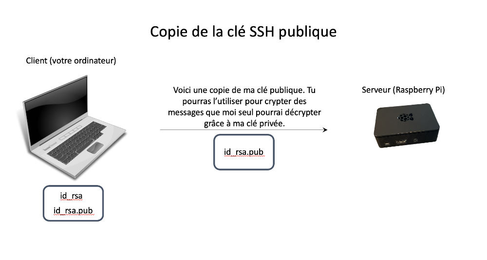

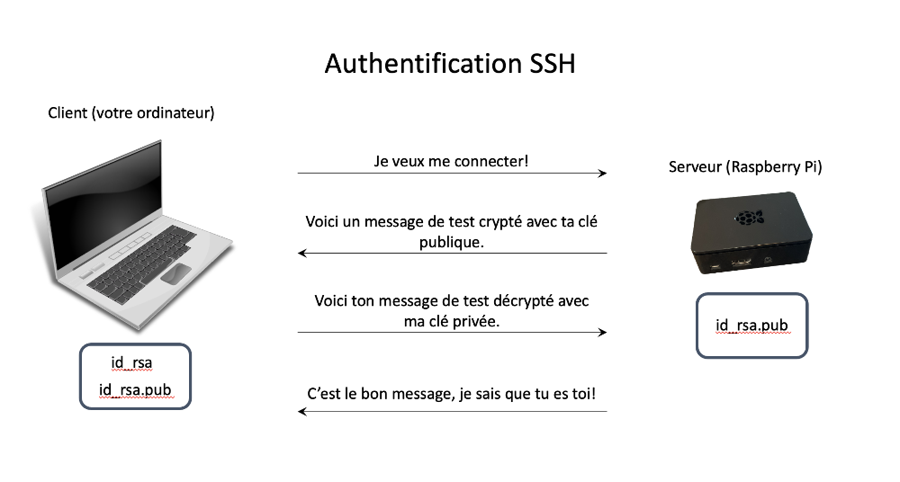

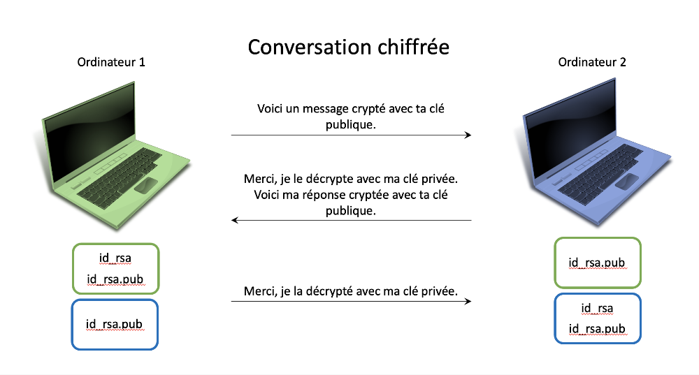

## Pour plus d'information

« Public – private key pairs & how they work ». Preveil. <https://www.preveil.com/blog/public-and-private-key/>

## 4.15 Copie de sécurité de la carte micro SD du Raspberry Pi

Le système d'exploitation, les logiciels et possiblement les données de votre Raspberry Pi seront stockés sur la toute petite carte micro SD insérée dans le Raspberry Pi.

Cette carte est fragile et pourrait connaître des ratées.

Une des principales causes de carte micro SD corrompue est un arrêt du Raspberry Pi non [apical\_lien\_interne][Eteindre\_un\_systeme\_linux\_de\_facon\_securitaire,sécuritaire][/apical\_lien\_interne], par exemple une panne de courant ou encore un débranchement sans avoir fait sudo halt.

Sur un système domotique, le fait d'écrire sur la carte de façon répétée est un autre facteur qui contribue au risque de bris.

C'est pourquoi il est important d'en prendre régulièrement une copie de sécurité afin de vous assurer de pouvoir réinstaller le tout facilement si le besoin s'en fait sentir.

La technique la plus sûre d'effectuer une copie de sécurité consiste à passer par le système domotique. La plupart offrent une fonctionnalité pour sauvegarder les fichiers et les données, sans conserver le système d'exploitation.

Une telle sauvegarde pourra être réinstallée sur un système domotique tout neuf afin de retrouver le système dans l'état où il était lors de la sauvegarde.

Si le système domotique n'offre pas de possibilité de sauvegarde, il faudra se tourner vers une autre des techniques présentées ici.

Dans cette fiche :

* Sauvegarde de la boîte domotique sans le système d'exploitation
* Copie de l'image de la carte sur un ordinateur
  + Utilitaire dd à partir d'un ordinateur Mac ou Linux
  + Utilitaire dd pour Windows
  + Utilitaire dd directement sur le Rapsberry Pi pendant que la carte est utilisée
  + Win32 Disk Imager et autres utilitaires pour Windows
* Copie de la carte sur une autre carte
  + Procédure sans interface graphique
  + Procédure avec interface graphique

## Sauvegarde de la boîte domotique sans le système d'exploitation

Plusieurs boîtes domotiques offrent des fonctionnalités pour effectuer une sauvegarde complète des fichiers et de la base de données qu'ils utilisent.

C'est le cas notamment avec [apical\_lien\_interne][copie\_de\_securite\_de\_jeedom,Jeedom][/apical\_lien\_interne] ou [apical\_lien\_interne][sauvegarde\_de\_home\_assistant,Home Assistant][/apical\_lien\_interne].

Une telle sauvegarde ne comprend que les fichiers de la boîte domotique, pas ceux du système d'exploitation. Pour la restaurer, il faut d'abord réinstaller le système d'exploitation puis une copie vierge de la boîte domotique.

La procédure de différents systèmes est détaillée ici :

* [apical\_lien\_interne][copie\_de\_securite\_de\_jeedom,Jeedom,restaurer][/apical\_lien\_interne]
* [apical\_lien\_interne][reinstaller\_home\_assistant\_a\_partir\_d\_une\_sauvegarde,Home Assistant][/apical\_lien\_interne]

## Copie de l'image de la carte sur un ordinateur (fichier .img)

Attention : selon la technique choisie, la taille de la carte et les configurations de votre système, l'opération peut prendre facilement entre 20 minutes et une heure.

Si vous travaillez avec un système qui n'offre pas de possibilité de sauvegarde, vous pouvez procéder à une sauvegarde complète de la carte, incluant le système d'exploitation.

Notez que cette technique est plus délicate à réaliser et il arrive que l'image du disque soit difficile à remettre en place.

Je vous présente ici différentes façons de créer un fichier image de la carte micro SD du Raspberry Pi.

* Utilitaire dd à partir d'un ordinateur Mac ou Linux
* Utilitaire dd pour Windows
* Utilitaire dd directement sur le Rapsberry Pi pendant que la carte est utilisée
* Win32 Disk Imager et autres utilitaires pour Windows

### Utilitaire dd à partir d'un ordinateur Mac ou Linux

La commande Linux [apical\_lien\_interne][copie\_integrale\_d\_un\_disque\_avec\_la\_commande\_dd,dd][/apical\_lien\_interne] permet  d'effectuer une copie intégrale de la carte micro SD. Le résultat sera un fichier image qui pourra au besoin [apical\_lien\_interne][copier\_une\_image\_du\_systeme\_d\_exploitation\_sur\_une\_carte\_microsd\_flasher,être réinstallé (flashé) sur une carte micro SD][/apical\_lien\_interne].

Cette technique nécessite de retirer la carte du Raspberry Pi pour l'insérer dans un lecteur de carte micro SD directement sur votre ordinateur ou sur un lecteur externe. Vous pouvez même insérer la carte dans un lecteur branché sur un autre Raspberry Pi (qui roulera à l'aide de sa propre carte micro SD) pour effectuer l'opération.

#### macOS

Voici d'abord les instructions sous Mac. Suivront les instructions sous Linux. Vous remarquerez que la commande dd présente quelques différences entre les deux systèmes.

Notez que si la carte micro SD est utilisée pour un système d'exploitation HassOS, ceci ne fonctionnera pas puisque macOS n'est pas capable de lire les cartes sur lesquelles HassOS est installé.

La première étape pour effectuer la copie consite à retrouver le point de montage de la carte. Avant d'insérer la carte, ouvrez une fenêtre Terminal et entrez la commande df. Insérez ensuite la carte micro SD puis entrez à nouveau la commande df. La ou les lignes ajoutées correspondent à la carte micro SD. Sur mon ordinateur Mac, j'obtiens ceci :

* Résultat à l'écran

  /dev/disk2s1 5029504 4846592 182912 97% 0 0 100% /Volumes/RECOVERY  
  /dev/disk2s6 516188   108923 407265 22% 0 0 100% /Volumes/boot

  Ces entrées correspondent aux deux partitions de ma carte (s1 et s6). Le point de montage est la partie commune entre les deux, c'est-à-dire /dev/disk2.

  Si la carte ne peut pas être lue par votre ordinateur, il est tout de même possible de connaître son point de montage à l'aide de la commande diskutil list. On peut reconnaître ici que ma carte de 32 Go est montés sous /dev/disk2.

  Résultat à l'écran

  /dev/disk2 (external, physical):  
     #:                       TYPE NAME     SIZE       IDENTIFIER  
     0:      GUID\_partition\_scheme         \*32.0 GB    disk2  
     1:         Microsoft Reserved ⁨⁩         33.6 MB    disk2s1  
     2:           Linux Filesystem ⁨⁩         25.2 MB    disk2s2  
     3:           Linux Filesystem ⁨⁩        268.4 MB    disk2s3  
     4:           Linux Filesystem ⁨⁩         25.2 MB    disk2s4  
     5:           Linux Filesystem ⁨⁩        268.4 MB    disk2s5  
     6:           Linux Filesystem ⁨⁩          8.4 MB    disk2s6  
     7:           Linux Filesystem ⁨⁩        100.7 MB    disk2s7  
     8:           Linux Filesystem ⁨⁩         31.3 GB    disk2s8

  Entrez maintenant la commande dd comme suit. Ajustez le point de montage puis le nom du fichier.
* Remarquez le r dans le point de montage (/dev/rdisk2), qui permet, sur un système macOS, une opération beaucoup plus rapide.

  Je vous suggère de terminer le nom du fichier par la date courante au format aaaa-mm-jj.

  Terminal macOS

  sudo dd bs=32m if=/dev/rdisk2 of=nom-du-fichier-aaaa-mm-jj.img
* Le fichier sera créé dans le dossier courant. Vous pouvez utiliser la commande pwd (Print Working Directory) pour connaître son chemin exact.
* L'opération inverse vous permettra de [apical\_lien\_interne][copie\_integrale\_d\_un\_disque\_avec\_la\_commande\_dd,réinstaller votre carte à partir de cette image,recuperer][/apical\_lien\_interne].

#### Linux

Si vous avez accès à un ordinateur Linux ou si vous avez une autre carte micro SD qui peut servir à faire rouler votre Raspberry Pi, vous pourrez utiliser le système Linux pour créer une image de votre carte.

* Vous devez connaître le point de montage de la carte. Avant d'insérer la carte, entrez la commande lsblk -fp. Insérez ensuite la carte micro SD puis entrez à nouveau la commande lsblk -fp. La ou les lignes ajoutées correspondent à la carte micro SD. Sur mon ordinateur Linux, j'obtiens ceci :

  Linux

  pi@raspberrypi:~ $ lsblk -fp  
  NAME             FSTYPE FSVER   LABEL    UUID                                  FSAVAIL FSUSE%  MOUNTPOINT  
  /dev/sda  
  ├─/dev/sda1      vfat   FAT32   boot    0193-3CD3  
  └─/dev/sda2      ext4   1.0     rootfs  a2e795f4-b2cf-4ea1-a687-ddf67a64c0a8  
  /dev/mmcblk0  
  ├─/dev/mmcblk0p1 vfat   FAT32   boot    0193-3CD3                              223.66M    12%  /boot  
  └─/dev/mmcblk0p2 ext4   1.0     rootfs  a2e795f4-b2cf-4ea1-a687-ddf67a64c0a8       26G     4%  /
* Entrez maintenant la commande dd comme suit. Ajustez le point de montage puis le nom du fichier.

  Je vous suggère de terminer le nom du fichier par la date courante au format aaaa-mm-jj.

  Terminal Linux

  sudo dd bs=32M if=/dev/sda of=nom-du-fichier-aaaa-mm-jj.img
* Le fichier sera créé dans le dossier courant. Vous pouvez utiliser la commande pwd (Print Working Directory) pour connaître son chemin exact.
* L'opération inverse vous permettra de [apical\_lien\_interne][copie\_integrale\_d\_un\_disque\_avec\_la\_commande\_dd,réinstaller votre carte à partir de cette image,recuperer][/apical\_lien\_interne].

### Utilitaire dd pour Windows

Attention : cet utilitaire pose souvent problème, ce n'est pas la meilleure technique à utiliser.

La commande dd n'existe pas nativement sous Windows. Heureusement, il est possible d'installer [un petit utilitaire](http://www.chrysocome.net/dd) qui fera le travail.

* Téléchergez l'utilitaire à partir de ce site : <http://www.chrysocome.net/download>. Choisissez la dernière version stable.
* Décompressez le fichier .zip puis copiez le fichier dd.exe à l'endroit de votre choix.
* Insérer la carte micro SD dans l'ordinateur Windows.
* Pour connaître le numéro attribué à la carte micro SD, faites un clic droit sur le bouton Windows puis choisissez Gestion du disque.

  Dans cette image, on voit que la carte correspond au disque 1.

  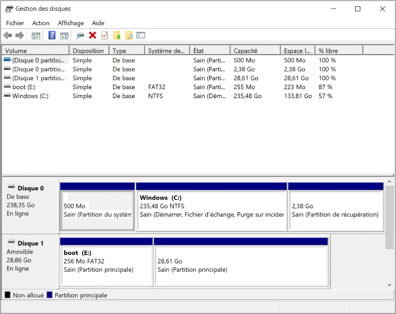
* Ouvrez une fenêtre PowerShell.
* Placez-vous dans le dossier qui contient le fichier dd.exe.
* Lancez cette commande afn de créer une image de la carte micro SD. Adaptez le numéro du disque (ici : 1) à celui que vous aurez trouvé plus tôt.

  PowerShell

  ./dd if=\\?\Device\Harddisk1\Partition0 of=nom-du-fichier-aaaa-mm-jj.img bs=1M

### Utilitaire dd directement sur le Raspberry Pi pendant que la carte est utilisée

L'avantage de cette technique, c'est qu'elle peut être utilisée peu importe le système d'exploitation de votre ordinateur puisque c'est le Raspberry Pi qui créera l'image.

Son grand désavantage : la copie est extrêmement longue à réaliser et mes tests se sont souvent soldés par une erreur d'écriture :-(

Notez que si la carte micro SD est utilisée pour un système d'exploitation HassOS, ceci ne fonctionnera pas puisque le système d'exploitation est optimisé pour Home Assistant et plusieurs opérations n'y sont pas permises.

La carte micro SD demeurera dans le Raspberry Pi et vous utiliserez une clé USB pour accueillir le fichier image. Ce fichier pourra ensuite être copié sur votre ordinateur.

Notez que la clé USB doit être formatée dans un format lisible par un système de fichier Linux et qui supporte les gros fichiers, par exemple exFAT.

Pendant tout le processus, vous ne devez effectuer aucune opération sur le Raspberry Pi afin d'éviter que des changements surviennent dans le système de fichiers, ce qui pourrait corrompre l'image.

* Branchez une clé USB sur le Raspberry Pi.
* Pour connaître le point de montage de la clé USB, entrez la commande lsblk -fp.

  Vous reconnaîtrez votre clé à son nom (LABEL). Vous devez noter le nom du périphérique qui représente la clé USB (ici : /dev/sda2) ainsi que celui du disque dur (/dev/mmcblk0).

  Résultat à l'écran

  pi@raspberrypi:~ $ lsblk -fp  
  NAME             FSTYPE FSVER LABEL   UUID                                  FSAVAIL FSUSE% MOUNTPOINT  
  /dev/sda   
  ├─/dev/sda1      vfat   FAT32 EFI     67E3-17ED   
  └─/dev/sda2     exfat  1.0   macle  633B-0FD4  
  /dev/mmcblk0   
  ├─/dev/mmcblk0p1 vfat   FAT32 boot    0193-3CD3                             223,6M   12%   /boot  
  └─/dev/mmcblk0p2 ext4   1.0   rootfs  a2e795f4-b2cf-4ea1-a687-ddf67a64c0a8     24G   10%   /
* Il faut maintenant monter la clé USB, c'est-à-dire la rendre disponible pour le système d'exploitation.

  Terminal du Raspberry Pi

  sudo mkdir /mnt/usb  
  sudo mount /dev/sda2 /mnt/usb -o uid=pi,gid=pi
* Lancez la commande dd pour effectuer la copie du système vers la clé USB.

  Terminal du Raspberry Pi

  sudo dd bs=32M if=/dev/mmcblk0 of=/mnt/usb/nom-du-fichier-aaaa-mm-jj.img

  Patientez, cette étape prendra de loooooonnngues minutes, voire même une heure entière sans que rien ne se passe à l'écran.
* Vous pouvez maintenant copier ce fichier sur votre ordinateur. J'aime bien utiliser le terminal de l'ordinateur pour effectuer cette copie mais l'inverse est également possible. Entrez cette commande en prenant soin de changer pi pour le nom de votre usager sur Raspberry Pi OS et l'adresse IP pour celle du Pi.

  Terminal de l'ordinateur

  scp pi@192.168.1.145:/mnt/usb/nom-du-fichier-aaaa-mm-jj.img /dossierlocal
* Vous devez finalement démonter la clé USB.

  Terminal du Raspberry Pi

  sudo umount /dev/sda2

### Win32 Disk Imager et autres utilitaires pour Windows

Sous Windows, il est également possible de créer une image d'une carte micro SD à l'aide d'un outil spécialisé.

Le plus populaire s'appelle Win32 Disk Imager. Malheureusement, il a du mal à rouler sur certains systèmes récents.

On m'a rapporté que le fait de fermer Google Drive pouvait régler le problème. À vous d'essayer...

Je vous propose quelques utilitaires mais je ne les ai pas toutes testés.

* Win32 Disk Imager (<https://sourceforge.net/projects/win32diskimager/>).   
  La procédure est disponible ici : <https://computers.tutsplus.com/articles/how-to-clone-your-raspberry-pi-sd-cards-with-windows--mac-59294>.
* HDD Raw Copy Tool (<https://hddguru.com/software/HDD-Raw-Copy-Tool/>) NON TESTÉ
* USB Image Tool (<https://www.alexpage.de/usb-image-tool/>) NON TESTÉ

Peu importe le logiciel utilisé, vous pourrez remettre l'image sur une carte micro SD à l'aide de Raspberry Pi Imager.

## Copie de la carte sur une autre carte

Attention : selon la technique choisie, la taille de la carte et les configurations de votre système, l'opération peut prendre facilement entre 20 minutes et une heure.

Pour ceci, vous aurez besoin d'un lecteur de carte USB que vous brancherez sur le Pi et d'une seconde carte, évidemment.

Voici le lecteur que j'utilise :

L'avantage de cette technique est qu'elle permet de faire la copie sans retirer la carte du Raspberry Pi. Moins de manipulations de la carte = diminution des risques de l'endommager.

Notez que comme pour la création d'un fichier image, la copie sur une autre carte est délicate à réaliser.

### Sans interface graphique

Sous Raspberry Pi OS Lite, il est possible d'installer une version en ligne de commande de piclone.

Attention : si vous travaillez avec un autre système d'exploitation, par exemple HassOS, et qu'il n'est pas possible d'y installer Git (sudo apt install git), vous devrez plutôt créer une image de la carte sur votre ordinateur (technique présentée plus haut) puis flasher cette image sur l'autre carte.

Les étapes qui suivent sont en fait une traduction de la procédure présentée dans le répertoire GitHub de l'utilitaire piclone\_cmd : <https://github.com/nwright-mcc/piclone_cmd>.

* Installez piclone\_cmd :

  Terminal

  git clone https://github.com/nwright-mcc/piclone\_cmd.git
* Installez uuid :

  Terminal

  sudo apt-get install uuid
* Insérez votre carte micro SD dans le lecteur connecté au port USB du Raspberry Pi.
* Déterminez quel nom porte le point de montage :

  Terminal

  ls /dev/sd\*

  Vous obtiendrez en sortie quelque chose du genre /dev/sda /dev/sda1.

  Résultat à l'écran

  pi@raspberrypi:~ $ ls /dev/sd\*  
  /dev/sda /dev/sda1

  Ceci signifie que votre carte a comme point de montage /dev/sda. Si vous obtenez autre chose du genre /dev/sdb, il vous faudra retirer un des périphériques branchés afin de déterminer lequel correspond à la carte micro SD du lecteur USB.
* Lancez maintenant l'opération de clonage en prenant soin d'utiliser le bon point de montage :

  Terminal

  cd ~/piclone\_cmd

   

  sudo ./piclone\_cmd /dev/sda

  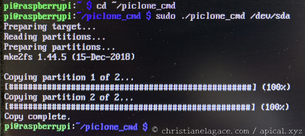

### Avec interface graphique

Si vous travaillez avec un Raspberry Pi OS complet (donc, pas la version Lite), voici la procédure.

* Sur le Raspberry Pi, rendez-vous dans le menu Accessoires / SD Card Copier.  

  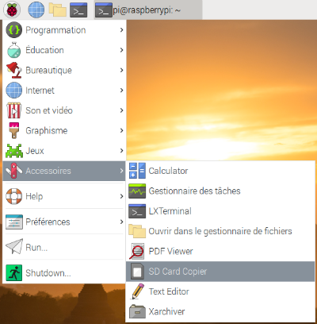
* Choissez la source et la cible puis cliquez sur Start. Pas plus compliqué que ça!

  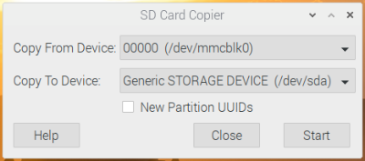

## Pour plus d'information

« Backups ». Raspberry Pi. <https://www.raspberrypi.org/documentation/linux/filesystem/backup.md>

« Back up your Raspberry Pi: how to save and restore files ». The MagPi Magazine. <https://magpi.raspberrypi.org/articles/back-up-raspberry-pi>

« nwright-mcc/piclone\_cmd ». GitHub. <https://github.com/nwright-mcc/piclone_cmd>

## 4.16 Outil de capture vidéo et logiciel OBS : pour utiliser l'écran d'un ordinateur portable comme sortie vidéo du Raspberry Pi

Il n'est pas toujours obligatoire de brancher un écran au Raspberry Pi pour pouvoir travailler avec ce tout petit ordinateur. En effet, plusieurs techniques permettent d'effectuer une installation du système d'exploitation et/ou une opération du Pi de façon headless, c'est-à-dire sans nécessiter le branchement d'un clavier et d'un écran.

Les principales techniques pour opérer un Raspberry Pi sans lui brancher clavier ni écran sont :

* [apical\_lien\_interne][se\_brancher\_au\_raspberry\_pi\_via\_ssh,branchement via SSH][/apical\_lien\_interne] (mode console)
* utilisation d'un [apical\_lien\_interne][realvnc\_pour\_prendre\_controle\_du\_raspberry\_pi\_a\_distance,outil de contrôle à distance tel que VNC Connect][/apical\_lien\_interne] (mode graphique)

Pourtant, même avec ces techniques, le branchement d'un écran peut être pratique, notamment si vous n'arrivez pas à [apical\_lien\_interne][trouver\_l\_adresse\_ip\_du\_raspberry\_pi,retrouver l'adresse IP du Pi][/apical\_lien\_interne] nécessaire pour accéder au Pi via SSH ou avec VNC Connect.

Si vous devez vous déplacer avec votre matériel, un moniteur est plutôt encombrant.

Vous serez heureux d'apprendre que l'écran de votre ordinateur portable peut être utilisé comme écran pour le Raspberry Pi. Vous aurez besoin pour celà d'un petit bidule appelé outil de capture vidéo.

En bonus, l'utilisation d'un tel outil permet d'effectuer des captures d'écran du Raspberry Pi directement à partir de votre ordinateur puisque la sortie vidéo sera affichée dans une application qui tourne sur cet ordinateur.

Attention : Raspberry Pi OS devra avoir été configuré pour [apical\_lien\_interne][permettre\_l\_utilisation\_d\_un\_ecran\_directement\_sur\_le\_pi,permettre le branchement d'un écran directement sur le Pi][/apical\_lien\_interne].

Notez que vous aurez tout de même besoin d'un clavier branché au Raspberry Pi – et possiblement d'une souris sous Raspberry Pi OS avec interface graphique – si vous souhaitez interagir avec lui sans passer par SSH ni par un outil de contrôle à distance.

Heureusement, ceci est tout de même moins encombrant à déplacer qu'un moniteur.

## Outil de capture vidéo

L'outil de capture vidéo est un petit objet qui sera branché entre l'ordinateur et la sortie vidéo du Raspberry Pi.

Il en existe de nombreux modèles dont le prix est généralement aux alentours de 20$.

Recherchez video capture sur le site Web de votre détaillant favori, vous en trouverez plusieurs.

Voici celui que j'utilise :

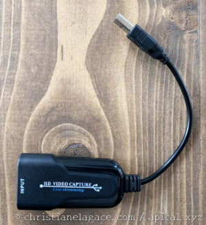

## Branchements

Une des extrémités de l'outil de capture vidéo doit être branchée à l'ordinateur via le port USB (sur l'image plus bas, j'ai ajouté un adaptateur pour mon port USB-C).

À l'autre bout de l'outil, une prise permet de recevoir un câble HDMI. La seconde extrémité du câble sera branchée au Raspberry Pi. Assurez-vous qu'il soit éteint avant d'effectuer le branchement. De toute façon, vous devrez redémarrer le Pi après avoir effectué les configurations plus bas.

Sur l'image, vous voyez le branchement vers un Raspberry Pi 3B+. Si vous avez un Raspberry Pi 4, vous devrez plutôt utiliser un câble avec une extrémité HDMI et l'autre, micro HDMI.

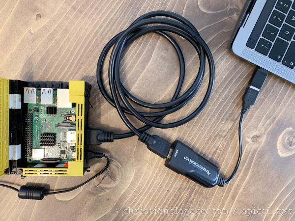

## Logiciel OBS

Pour que votre ordinateur portable puisse afficher la sortie vidéo du Raspberry Pi, vous aurez besoin d'un logiciel spécialisé.

J'utilise OBS (Open Broadcaster Software), qui peut être téléchargé à partir de ce lien : <https://obsproject.com/fr/download>.

Il est disponible pour Mac, Linux et Windows.

Une fois le logiciel téléchargé et installé, il ne vous reste que quelques configurations à réaliser :

* Assurez-vous de voir au bas de l'écran d'OBS une zone Source suivie d'une ligne avec des + et des -. Si elles ne sont pas visibles, rendez-vous dans le menu Afficher / Docs / Sources puis dans Afficher / Boutons de la liste Scène/Source.
* Sous la zone Sources au bas de l'écran, cliquez sur +.

  
* Dans le menu qui apparaît, choisissez Périphérique de capture vidéo.

  
* Dans l'écran suivant, sélectionnez Créer une nouvelle source.

  
* Dans la zone Périphérique, choisissez USB 3.0 HD video.
* Sélectionnez une résolution, par exemple 1280x720.

  Si la résolution est trop grande, elle débordera de l'écran d'OBS. Si elle est trop petite, seule une partie de l'écran sera utilisée.

  Remarquez que cette résolution pourra être modifiée par la suite en cliquant sur l'icône de configuration au bas de la zone Sources.

  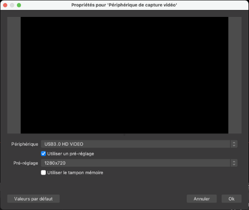
* Démarrez le Raspberry Pi. Vous verrez alors sur l'écran de votre ordinateur portable la sortie vidéo du Raspberry Pi. Vous devrez brancher un clavier et possiblement une souris si vous désirez interagir avec le Pi.

  

## Pour plus d'information

« HDMI USB Capture ». Wiistar. <http://www.wiistar.com/Uploads/images/2020/06/12/1591961504_download_file.mp4>

## 4.17 VNC Connect pour prendre contrôle du Raspberry Pi à distance

La compagnie [Real VNC](https://www.realvnc.com/fr/) est bien connue pour les possibilités qu'elle offre de contrôler un ordinateur à distance : le serveur VNC est installé sur l'ordinateur qui doit être contrôlé et le client VNC, appelé VNC Viewer, est installé sur l'ordinateur qui doit prendre le contrôle.

Grâce à cet outil, il est possible d'afficher l'interface graphique d'un Raspberry Pi à distance et ainsi contrôler le Raspberry Pi depuis votre ordinateur.

Notez que cet outil est sans intérêt si vous utilisez le système d'exploitation Raspberry Pi OS Lite (sans interface graphique) sur le Raspberry Pi.

Saviez-vous que VNC Connect, qui comprend le client et le serveur VNC, est installé par défaut sur Raspberry Pi OS lorsque vous choissez une installation avec interface graphique?

Il est également possible d'installer VNC Connect sur le Pi à la ligne de commande :

Terminal

sudo apt update  
sudo apt install realvnc-vnc-server realvnc-vnc-viewer

Voici maintenant les étapes à réaliser pour prendre contrôle du Raspberry Pi à partir de votre ordinateur portable.

## Activer le serveur VNC sur le Raspberry Pi

À partir de l'interface graphique :

* Rendez-vous dans le menu Préférences / Configuration du Raspberry Pi.

  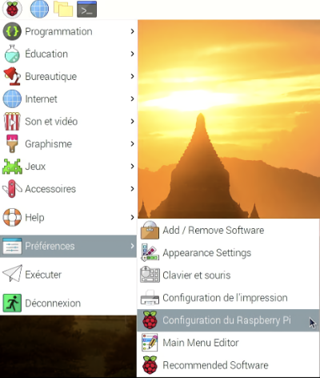
* Dans l'onglet Interfaces, cochez Activé vis-a-vis VNC.

  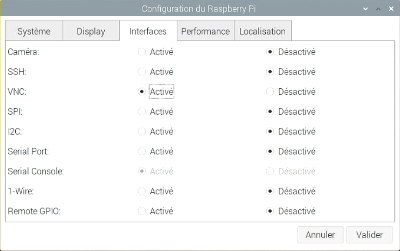

À l'aide de raspi-config :

* Lancez l'utilitaire raspi-config.

  Terminal

  sudo raspi-config
* Rendez-vous dans Interface Options.
* Choisissez ensuite VNC.
* Répondez Oui à la question Would you like the VNC Server to be enabled?.

## Installer VNC Viewer sur votre ordinateur

Pour un usage non commercial, VNC Viewer peut être installé gratuitement sur votre ordinateur à partir de ce lien : <https://www.realvnc.com/fr/connect/download/viewer/>

Il est disponible pour Mac, Linux, Window, iOS, Android et plus.

## Démarrer le contrôle à distance à partir du même réseau

Pour effectuer un contrôle par connection directe, vous devez vous assurer que votre ordinateur et le Raspberry Pi sont sur le même réseau.

Notez qu'il est possible de travailler avec VNC Viewer à partir d'un autre réseau à condition d'avoir un compte chez Real VNC. Tout ceci est gratuit pour usage non commercial. Plus d'informations à ce propos sont données ici : h[ttps://www.realvnc.com/fr/raspberrypi/#sign-up](https://www.realvnc.com/fr/raspberrypi/#sign-up)

Revenons à la connection directe. La façon la plus simple pour vérifier si l'ordinateur et le Pi sont sur le même réseau est d'ouvrir une fenêtre Terminal sur votre ordinateur et d'entrer la commande ping suivie de [apical\_lien\_interne][trouver\_l\_adresse\_ip\_du\_raspberry\_pi,l'adresse IP du Raspberry Pi][/apical\_lien\_interne].

Terminal

ping 192.168.1.145

Vous trouverez plus de détails sur cette fiche : « [apical\_lien\_interne]verifier\_si\_l\_ordinateur\_et\_le\_raspberry\_pi\_sont\_branches\_sur\_le\_meme\_re\_\_\_[/apical\_lien\_interne] ».

Lorsque le test est concluant, vous pouvez démarrer VNC et entrer l'adresse IP du Raspberry Pi à l'endroit indiqué.

VNC Viewer vous demandera ensuite d'entrer un code d'usager valide sur le Raspberry Pi ainsi que son mot de passe.

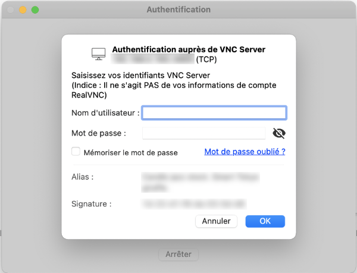

Vous avez désormais le contrôle du Raspberry Pi à partir de votre ordinateur. C'est à peu près comme si votre clavier, votre souris et votre écran étaient branchés directement sur le Pi.

## Pour plus d'information

« VNC (Virtual Network Computing) ». Raspberry Pi. <https://www.raspberrypi.org/documentation/remote-access/vnc/>

## 4.18 Mot de passe sur Raspberry Pi OS

Par défaut, sur Raspberry Pi OS, il y a un usager administrateur nommé pi dont le mot de passe est raspberry.

Le fait de conserver ce mot de passe pour l'usager pi alors que [apical\_lien\_interne][activer\_ssh\_sur\_le\_raspberry\_pi,SSH est activé][/apical\_lien\_interne] ou que [apical\_lien\_interne][realvnc\_pour\_prendre\_controle\_du\_raspberry\_pi\_a\_distance,le serveur VNC est activé][/apical\_lien\_interne] constitue un trou de sécurité.

Un message à cet effet est d'ailleurs affiché lors du démarrage du Pi.

Résultat à l'écran

SSH is enabled and the default password for the 'pi' user has not been changed.  
This is a security risk - please login as the 'pi' user and type 'passwd' to set a new password.

Il faut donc modifier ce mot de passe. Tel que mentionné dans le message à l'écran, ceci se fait à l'aide de la commande :

Terminal

passwd

## Mot de passe oublié

Il est possible de réinitialiser le mot de passe de l'usager pi à condition d'avoir un accès physique au Raspberry Pi avec un écran et un clavier.

* [apical\_lien\_interne][Eteindre\_un\_systeme\_linux\_de\_facon\_securitaire,Éteignez le Pi de façon sécuritaire][/apical\_lien\_interne] puis retirez la carte micro SD.
* Insérez la carte dans votre ordinateur.
* Créez une copie du fichier cmdline.txt qui se trouve directement à la racine de la carte. Ceci permettra de revenir à la version originale si jamais vos manipulations empêchent le bon fonctionnement de l'OS.
* Éditez le fichier cmdline.txt. Vous devez lui ajouter la configuration init=/bin/sh qui forcera le Pi à démarrer en mode mode mono-utilisateur.

  Fichier cmdline.txt

  console=serial0,115200 console=tty1 root=PARTUUID=6f2deb42-02 rootfstype=ext4 elevator=deadline fsck.repair=yes rootwait init=/bin/sh

  Attention : dans ce fichier, chaque configuration est séparée par un espace et toutes les configurations doivent tenir sur une seule ligne.
* [apical\_lien\_interne][retirer\_un\_disque\_amovible\_de\_facon\_securitaire,Retirez la carte de l'ordinateur de façon sécuritaire][/apical\_lien\_interne], remettez-la dans le Pi et démarrez le Pi.
* L'étape suivante dépend de votre système :
  + Si les lignes arrêtent de défiler à l'écran et que le système semble gelé (généralement après la ligne random: crng init done), appuyez sur la touche Entrée et vous obtiendrez une invite de commande (#). Entrez-y cette commande :

    Terminal

    mount -o remount, rw /

    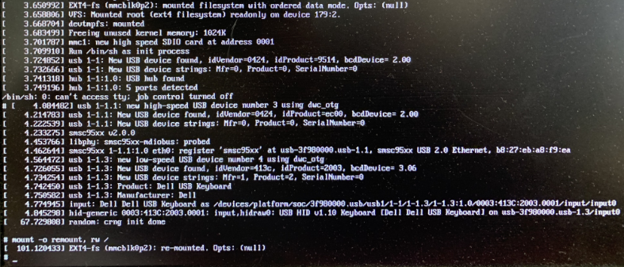
  + Si le démarrage s'est déroulé normalement, vous pourrez vous connecter avec le code d'usager su sans mot de passe.
* Pour modifier le mot de passe de l'usager pi, entrez cette commande :

  Terminal

  passwd pi
* Refaites maintenant tout le chemin à l'envers : éteignez le Pi de façon sécuritaire, retirez la carte micro SD, insérez-la dans votre ordinateur, éditez le fichier cmdline.txt, retirez la configuration init=/bin/sh, retirez la carte de l'ordinateur, remettez-la dans le Pi puis redémarrez ce dernier.
* Bingo!

## Pour plus d'information

« Linux users ». Raspberry Pi. <https://www.raspberrypi.org/documentation/linux/usage/users.md>

« Reset lost admin password for Raspberry Pi ». Mapledyne. <http://mapledyne.com/ideas/2015/8/4/reset-lost-admin-password-for-raspberry-pi>

## 4.19 Vérifier si l'ordinateur et le Raspberry Pi sont branchés sur le même réseau

Dans certains contextes, pour que l'ordinateur puisse communiquer correctement avec le Raspberry Pi, soit [apical\_lien\_interne][se\_brancher\_au\_raspberry\_pi\_via\_ssh,via SSH][/apical\_lien\_interne] ou encore en affichant la page Web de la boîte domotique, il faut que l'ordinateur et le Raspberry Pi soient branchés sur le même réseau.

## ping

La commande [ping](https://www.ionos.fr/digitalguide/serveur/outils/commande-ping/) permet de vérifier si un ordinateur peut rejoindre une adresse IP donnée.

Ouvrez une fenêtre Terminal sur l'ordinateur puis entrez la commande ping suivie de l'[apical\_lien\_interne][trouver\_l\_adresse\_ip\_du\_raspberry\_pi,adresse IP du Raspberry Pi][/apical\_lien\_interne].

Terminal de l'ordinateur

ping 192.168.1.145

Si l'ordinateur et le Pi sont sur le même réseau, vous devriez avoir un résultat qui ressemble à ceci.

Résultat à l'écran

MacBook-Pro-de-MonNom:~ monnom$ ping 192.168.1.145  
PING 192.168.1.145 (192.168.1.145): 56 data bytes  
64 bytes from 192.168.1.145: icmp\_seq=0 ttl=62 time=2.407 ms  
64 bytes from 192.168.1.145: icmp\_seq=1 ttl=62 time=8.484 ms  
64 bytes from 192.168.1.145: icmp\_seq=2 ttl=62 time=3.625 ms  
^Z  
[6]+ Stopped ping 192.168.1.145

Pour arrêter le défilement, appuyez sur Ctrl + C.

Dans le cas où l'ordinateur et le Pi ne sont pas sur le même réseau, vous verrez le message « Request timeout ».

Résultat à l'écran

MacBook-Pro-de-MonNom:~ monnom$ ping 192.168.1.145  
PING 192.168.1.145 (192.168.1.145): 56 data bytes  
Request timeout for icmp\_seq 0  
Request timeout for icmp\_seq 1  
Request timeout for icmp\_seq 2  
^Z  
[7]+ Stopped ping 192.168.1.145

Un message « No route to host » signifie que l'ordinateur n'a pas accès à internet. Pour le vérifiez, faites un ping vers l'adresse 8.8.8.8 qui correspond à Google.

Résultat à l'écran

MacBook-Pro-de-MonNom:~ monnom$ ping 8.8.8.8  
PING 8.8.8.8 (8.8.8.8): 56 data bytes  
ping: sendto: No route to host  
ping: sendto: No route to host  
Request timeout for icmp\_seq 0  
ping: sendto: No route to host  
Request timeout for icmp\_seq 1  
^Z  
[10]+ Stopped ping 8.8.8.8

## Masque de sous-réseau

Le [masque de sous-réseau](https://openclassrooms.com/fr/courses/1561696-les-reseaux-de-zero/1562627-les-masques-de-sous-reseaux-a-la-decouverte-du-subnetting) permet de déterminer la plage d'adresses IP qui feront partie du même sous-réseau. Il s'agit d'une série de 4 nombres séparés par des points, par exemple 255.255.255.0.

Parfois, le masque de sous-réseau est représenté en ajoutant une barre oblique ainsi qu'un nombre à la suite de l'adresse IP, par exemple 192.168.1.145/24. On parlera de notation CIDR (Classless Inter-Domain Routing). Dans cet exemple, le nombre 24 indique qu'il y a 24 bits dans le masque de sous-réseau, soit les trois premier nombres de l'adresse IP (chaque nombre est encodé en binaire sur 8 bits). La notation CIDR /24 représente donc un masque de sous-réseau 255.255.255.0.

On peut également retrouver le masque de sous-réseau sous sa forme hexadécimale, par exemple 0xffffff00. Dans ce cas, il est possible de le convertir en sa version décimale. Ce petit outil peut vous assister dans cette tâche : [https://www.celebrazio.net/tech/web/ip\_tools.html](https://www.celebrazio.net/tech/web/ip_tools.html#:~:text=Convert%20hex%20IP-address%20or%20mask%20dotted%20decimal).

Pour connaître le masque de sous-réseau de votre ordinateur, lancez la commande ipconfig /all (Windows) ou ifconfig (Mac ou Linux).

Le masque apparaîtra sur une ligne avec une appellation du genre Subnet mask ou netmask.

Une fois que vous connaissez le masque de sous-réseau ainsi que l'adresse IP de votre ordinateur et celle du Raspberry Pi, vous pouvez utiliser ce petit outil pour vérifier si les deux sont sur le même réseau : <http://www.meridianoutpost.com/resources/etools/network/two-ips-on-same-network.php>.

## 4.20 Activer Bluetooth sur Raspberry Pi OS Lite

Depuis sa version 3, le Raspberry Pi est équipé de tout ce qu'il faut côté matériel pour les communications Bluetooth (version 4.1 pour le Pi 3B, version 4.2 pour le Pi 3A+ ou 3B+ et version 5.0 pour le Pi 4).

Il faut cependant effectuer les installations nécessaires pour faire fonctionner le tout.

Les instructions données ici permettent de rendre le Bluetooth fonctionnel sur Raspberry Pi OS Lite, qui requiert plus de configurations que les autres distributions.

Vous pouvez avoir besoin d'activer Bluetooth pour travailler par exemple avec un clavier Bluetooth. Si c'est votre cas, suivez toute la procédure que je vous présente, incluant l'étape de pairage.

Vous pouvez aussi avoir besoin d'activer Bluetooth afin d'interagir avec des appareils Bluetooth dans une boîte domotique par exemple. Si c'est votre cas, seule la première partie sera nécessaire. Vous n'aurez pas besoin d'effectuer le pairage expliqué dans la seconde partie.

## Vérifier si bluetooth est activé

Avant de vous lancer dans les configurations, il est bon de vérifier si tout n'est pas déjà en place.

Lancez cette commande sur le Pi :

Terminal

sudo service bluetooth status

Si vous obtenez une indication « active (running) », c'est que tout est ok. Vous n'avez pas à faire l'installation du paquet ni l'activation du bluetooth.

## Installation des paquets

D'abord, il faut installer les paquets manquants.

Terminal

sudo apt install bluetooth pi-bluetooth bluez blueman

Il faut ensuite redémarrer le Pi.

Terminal

sudo reboot

Si vous étiez connecté via SSH, vous devrez refaire la connexion lorsque le Pi sera redémarré.

## Activation du Bluetooth

Pour voir si Bluetooth est activé, lancez la commande :

Terminal

sudo service bluetooth status

Si vous voyez Active: inactive (dead), il faudra démarrer le service Bluetooth :

Terminal

sudo systemctl start bluetooth

Si tout est OK, le statut devrait indiquer que le service Bluetooth fonctionne.

Terminal

sudo service bluetooth status

Résultat à l'écran

pi@raspberrypi:~ $ sudo service bluetooth status  
● bluetooth.service - Bluetooth service  
   Loaded: loaded (/lib/systemd/system/bluetooth.service; enabled; vendor preset  
   Active: active (running) since Mon 2020-11-02 18:11:45 EST; 2s ago  
     Docs: man:bluetoothd(8)  
 Main PID: 12002 (bluetoothd)  
   Status: "Running"  
    Tasks: 1 (limit: 2063)  
   CGroup: /system.slice/bluetooth.service  
           └─12002 /usr/lib/bluetooth/bluetoothd

 

 

 

Nov 02 18:11:45 raspberrypi systemd[1]: Starting Bluetooth service...  
Nov 02 18:11:45 raspberrypi bluetoothd[12002]: Bluetooth daemon 5.50  
Nov 02 18:11:45 raspberrypi systemd[1]: Started Bluetooth service.  
Nov 02 18:11:45 raspberrypi bluetoothd[12002]: Starting SDP server  
Nov 02 18:11:46 raspberrypi bluetoothd[12002]: Bluetooth management interface 1.

Si vous obtenez encore Active: inactive (dead), je vous propose une manipulation supplémentaire.

Terminal

sudo modprobe btusb  
sudo systemctl start bluetooth  
sudo service bluetooth status

Une fois que le service bluetooth est actif, il reste une dernière étape : activer le service HCI UART (Host Controller Interface - Universal Asynchronous Receiver Transmitter) afin de permettre la transmission de données.

Pour voir si c'est déjà fait :

Terminal

systemctl status hciuart

Si vous voyez Active: inactive (dead), il faudra démarrer le service.

Terminal

sudo systemctl start hciuart

## Pairage avec un appareil Bluetooth

Si vous avez activé Bluetooth sur votre Raspberry Pi dans le but d'interagir avec des appareils Bluetooth dans une boîte domotique, arrêtez ici.

Les étapes qui suivent sont intéressante dans d'autres cas, par exemple pour pairer un clavier bluetooth avec le Raspberry Pi.

Pour effectuer le pairage, vous avez besoin de l'utilitaire bluetoothctl.

La première fois que vous le ferez, vous devrez également lancer l'agent.

Terminal

sudo bluetoothctl

 

agent on

Pour lancer la recherche d'appareils, lancez la commande :

Terminal

scan on

Vous verrez apparaître une série d'adresses MAC pour les appareils Bluetooth détectés.

Vous devez connaître l'adresse MAC de l'appareil qui doit être pairé. Une fois que vous voyez que le Pi a détecté cette adresse, vous pouvez pairer l'appareil de façon temporaire avec :

Terminal

pair XX:XX:XX:XX:XX:XX

ou de façon permanente avec :

Terminal

trust XX:XX:XX:XX:XX:XX

Vous pouvez désormais utiliser votre appareil Bluetooth avec votre Raspberry Pi.

## Pour plus d'information

« How to Set Up Bluetooth on a Raspberry Pi ». howchoo. <https://howchoo.com/pi/bluetooth-raspberry-pi>

## 4.21 Retrouver le modèle exact du Raspberry Pi

Vous avez en main un Raspberry Pi mais vous ne savez pas de quel modèle il s'agit? Je vous présente ici quelques alternatives pour retrouver cette information.

Je vous fais la démonstration avec quelques Raspberry Pi que j'ai en ma possession.

## Information imprimée sur la carte

Le modèle et la version du Raspberry Pi sont imprimés directement sur la carte.

### Raspberry Pi 2B

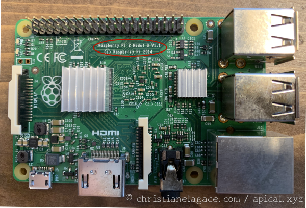

### Raspberry Pi 3B

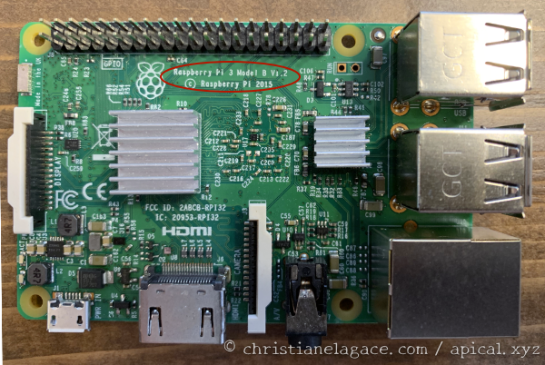

### Raspberry Pi 4

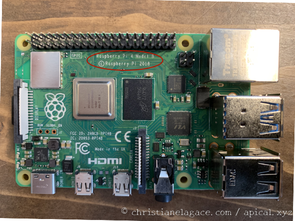

## Connecteurs

Si le boîtier du Pi ne vous permet pas de lire les informations sur la carte, sachez que les connecteurs sont différents entre certains modèles du Raspberry Pi.

Remarquez que les connecteurs des modèles 2B et 3B sont à peu près identiques. Cependant, la position des DEL vous permet de différencier les modèles.

De plus, si vous avez de bons yeux, vous verrez que le modèle 3B possède une antenne Wi-Fi alors que le modèle 2B n'en avait pas.

### Raspberry Pi 2B

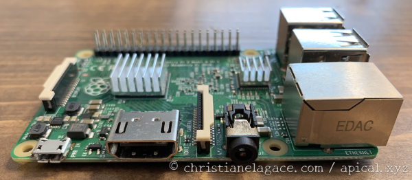

Les DEL du modèle 2B sont positionnées près du GPIO.

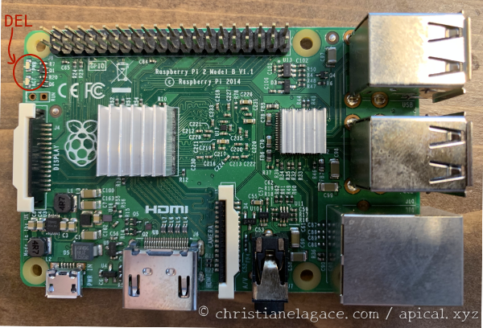

### Raspberry Pi 3B

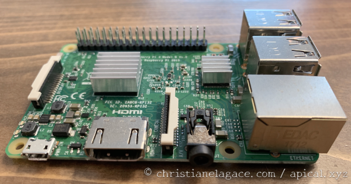

L'antenne Wi-Fi du modèle 3B est positionnée près du GPIO.

Notez que si vous avez un modèle 3B+, l'antenne apparaît beaucoup plus petite. Elle est positionnée au même endroit et ressemble à un petit carré rougeâtre.

Les DEL sont positionnées près du connecteur d'alimentation.

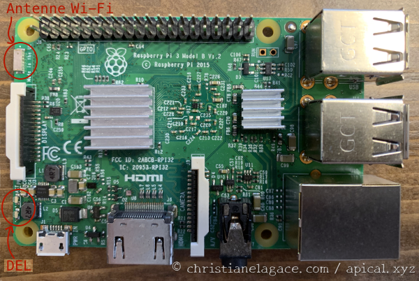

### Raspberry Pi 4

La présence de deux ports micro HDMI pour brancher des écrans est la caractéristique la plus évidente du Raspberry Pi 4.

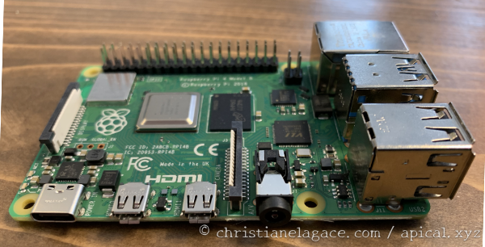

## Modèle et révision à l'aide d'une commande au terminal

Si vous avez un système d'exploitation installé sur la carte micro SD, par exemple Raspberry Pi OS ou HassOS, entrez une des commandes suivantes au terminal afin d'en connaître d'avantage.

Pour obtenir le numéro de modèle et la révision :

Terminal

cat /proc/device-tree/model

### Raspberry Pi 2B

Résultat à l'écran

Raspberry Pi 2 Model B Rev 1.1

### Raspberry Pi 3B

Résultat à l'écran

Raspberry Pi 3 Model B Rev 1.2

### Raspberry Pi 4B

Résultat à l'écran

Raspberry Pi 4 Model B Rev 1.2

## Information détaillée à l'aide d'une commande au terminal

Pour obtenir encore plus d'informations :

Terminal

cat /proc/cpuinfo

### Raspberry Pi 2B

Résultat à l'écran

processor : 0  
model name : ARMv7 Processor rev 5 (v7l)  
BogoMIPS : 38.40  
Features : half thumb fastmult vfp edsp neon vfpv3 tls vfpv4 idiva idivt vfpd32 lpae evtstrm   
CPU implementer : 0x41  
CPU architecture: 7  
CPU variant : 0x0  
CPU part : 0xc07  
CPU revision : 5  
  
processor : 1  
model name : ARMv7   
Processor rev 5 (v7l)  
BogoMIPS : 38.40Features : half thumb fastmult vfp edsp neon vfpv3 tls vfpv4 idiva idivt vfpd32 lpae evtstrm   
CPU implementer : 0x41  
CPU architecture: 7  
CPU variant : 0x0  
CPU part : 0xc07  
CPU revision : 5  
  
processor : 2  
model name : ARMv7 Processor rev 5 (v7l)  
BogoMIPS : 38.40  
Features : half thumb fastmult vfp edsp neon vfpv3 tls vfpv4 idiva idivt vfpd32 lpae evtstrm   
CPU implementer : 0x41  
CPU architecture: 7  
CPU variant : 0x0  
CPU part : 0xc07  
CPU revision : 5  
  
processor : 3  
model name : ARMv7   
Processor rev 5 (v7l)  
BogoMIPS : 38.40Features : half thumb fastmult vfp edsp neon vfpv3 tls vfpv4 idiva idivt vfpd32 lpae evtstrm   
CPU implementer : 0x41  
CPU architecture: 7  
CPU variant : 0x0  
CPU part : 0xc07  
CPU revision : 5  
  
Hardware : BCM2835  
Revision : a01041  
Serial : 00000000dde81138  
Model : Raspberry Pi 2 Model B Rev 1.1

### Raspberry Pi 3B

Résultat à l'écran

processor : 0  
model name : ARMv7 Processor rev 4 (v7l)  
BogoMIPS : 38.40  
Features : half thumb fastmult vfp edsp neon vfpv3 tls vfpv4 idiva idivt vfpd32 lpae evtstrm crc32   
CPU implementer : 0x41  
CPU architecture: 7  
CPU variant : 0x0  
CPU part : 0xd03  
CPU revision : 4  
  
processor : 1  
model name : ARMv7 Processor rev 4 (v7l)  
BogoMIPS : 38.40  
Features : half thumb fastmult vfp edsp neon vfpv3 tls vfpv4 idiva idivt vfpd32 lpae evtstrm crc32   
CPU implementer : 0x41  
CPU architecture: 7  
CPU variant : 0x0  
CPU part : 0xd03  
CPU revision : 4  
  
processor : 2  
model name : ARMv7 Processor rev 4 (v7l)  
BogoMIPS : 38.40  
Features : half thumb fastmult vfp edsp neon vfpv3 tls vfpv4 idiva idivt vfpd32 lpae evtstrm crc32   
CPU implementer : 0x41  
CPU architecture: 7  
CPU variant : 0x0  
CPU part : 0xd03  
CPU revision : 4  
  
processor : 3  
model name : ARMv7 Processor rev 4 (v7l)  
BogoMIPS : 38.40  
Features : half thumb fastmult vfp edsp neon vfpv3 tls vfpv4 idiva idivt vfpd32 lpae evtstrm crc32   
CPU implementer : 0x41  
CPU architecture: 7  
CPU variant : 0x0  
CPU part : 0xd03  
CPU revision : 4  
  
Hardware : BCM2835  
Revision : a02082  
Serial : 00000000dfa8f8ea  
Model : Raspberry Pi 3 Model B Rev 1.2

### Raspberry Pi 4B

Résultat à l'écran

processor : 0  
model name : ARMv7   
Processor rev 3 (v7l)  
BogoMIPS : 108.00  
Features : half thumb fastmult vfp edsp neon vfpv3 tls vfpv4 idiva idivt vfpd32 lpae evtstrm crc32   
CPU implementer : 0x41  
CPU architecture: 7  
CPU variant : 0x0  
CPU part : 0xd08  
CPU revision : 3  
  
processor : 1  
model name : ARMv7   
Processor rev 3 (v7l)  
BogoMIPS : 108.00  
Features : half thumb fastmult vfp edsp neon vfpv3 tls vfpv4 idiva idivt vfpd32 lpae evtstrm crc32   
CPU implementer : 0x41  
CPU architecture: 7  
CPU variant : 0x0  
CPU part : 0xd08  
CPU revision : 3  
  
processor : 2  
model name : ARMv7   
Processor rev 3 (v7l)  
BogoMIPS : 108.00  
Features : half thumb fastmult vfp edsp neon vfpv3 tls vfpv4 idiva idivt vfpd32 lpae evtstrm crc32   
CPU implementer : 0x41  
CPU architecture: 7  
CPU variant : 0x0  
CPU part : 0xd08  
CPU revision : 3  
  
processor : 3  
model name : ARMv7   
Processor rev 3 (v7l)  
BogoMIPS : 108.00  
Features : half thumb fastmult vfp edsp neon vfpv3 tls vfpv4 idiva idivt vfpd32 lpae evtstrm crc32   
CPU implementer : 0x41  
CPU architecture: 7  
CPU variant : 0x0  
CPU part : 0xd08  
CPU revision : 3  
  
Hardware : BCM2711  
Revision : c03112  
Serial : 1000800013a8d1d9  
Model : Raspberry Pi 4 Model B Rev 1.2

## 32 ou 64 bits?

L'information affichée par la commande cat /proc/cpuinfo permet de savoir si le Raspberry Pi fonctionne en 32 ou en 64 bits.

Sur la ligne model name, si vous voyez ARMv7 ou moins, c'est du 32 bits.

Si vous voyez AMRv8, c'est que le Pi a une architecture en 64 bits.

Une autre technique permet de retrouver clairement l'information. Elle nécessite l'installation de l'utilitaire lshw (LiSt HardWare).

Terminal

sudo apt-get install lshw

Une fois l'utilitaire installé, lancez la commande [lshw](https://linux.die.net/man/1/lshw) :

Terminal

sudo lshw

Vous verrez clairement si le Pi a une architecture 32 ou 64 bits.

Voici ce que j'obtiens avec un Raspberry Pi 3B+ :

Résultat à l'écran

raspberrypi   
    description: ARMv7 Processor rev 4 (v7l)  
     product: Raspberry Pi 3 Model B Rev 1.2  
     serial: 00000000dea8f9ea  
     width: 32 bits  
     capabilities: smp  
  \*-core  
       description: Motherboard  
       physical id: 0  
     \*-cpu:0  
         description: CPU  
         product: cpu  
         physical id: 0  
         bus info: cpu@0  
         size: 1200MHz  
         capacity: 1200MHz  
         capabilities: half thumb fastmult vfp edsp neon vfpv3 tls vfpv4 idiva idivt vfpd32 lpae evtstrm crc32 cpufreq  
     \*-cpu:1  
         description: CPU  
         product: cpu  
         physical id: 1  
         bus info: cpu@1  
         size: 1200MHz  
         capacity: 1200MHz  
         capabilities: half thumb fastmult vfp edsp neon vfpv3 tls vfpv4 idiva idivt vfpd32 lpae evtstrm crc32 cpufreq  
     \*-cpu:2  
         description: CPU  
         product: cpu  
         physical id: 2  
         bus info: cpu@2  
         size: 1200MHz  
         capacity: 1200MHz  
         capabilities: half thumb fastmult vfp edsp neon vfpv3 tls vfpv4 idiva idivt vfpd32 lpae evtstrm crc32 cpufreq  
     \*-cpu:3  
         description: CPU  
         product: cpu  
         physical id: 3  
         bus info: cpu@3  
         size: 1200MHz  
         capacity: 1200MHz  
         capabilities: half thumb fastmult vfp edsp neon vfpv3 tls vfpv4 idiva idivt vfpd32 lpae evtstrm crc32 cpufreq  
     \*-memory  
         description: System memory  
         physical id: 4  
         size: 923MiB  
  \*-usbhost  
       product: DWC OTG Controller  
       vendor: Linux 5.10.52-v7+ dwc\_otg\_hcd  
       physical id: 1  
       bus info: usb@1  
       logical name: usb1  
       version: 5.10  
       capabilities: usb-2.00  
       configuration: driver=hub slots=1 speed=480Mbit/s  
     \*-usb  
         description: USB hub  
         product: SMC9514 Hub  
         vendor: Standard Microsystems Corp.  
         physical id: 1  
         bus info: usb@1:1  
         version: 2.00  
         capabilities: usb-2.00  
         configuration: driver=hub maxpower=2mA slots=5 speed=480Mbit/s  
       \*-usb:0  
           description: Ethernet interface  
           product: SMSC9512/9514 Fast Ethernet Adapter  
           vendor: Standard Microsystems Corp.  
           physical id: 1  
           bus info: usb@1:1.1  
           logical name: eth0  
           version: 2.00  
           serial: b8:27:eb:a8:f9:ea  
           size: 100Mbit/s  
           capacity: 100Mbit/s  
           capabilities: usb-2.00 ethernet physical tp mii 10bt 10bt-fd 100bt 100bt-fd autonegotiation  
           configuration: autonegotiation=on broadcast=yes driver=smsc95xx driverversion=5.10.52-v7+ duplex=full firmware=smsc95xx USB 2.0 Ethernet ip=192.168.29.10 link=yes maxpower=2mA multicast=yes port=twisted pair speed=100Mbit/s  
       \*-usb:1  
           description: Communication device  
      product: Aeotec Z-Stick Gen5 (ZW090) - UZB  
           vendor: Sigma Designs, Inc.  
           physical id: 2  
           bus info: usb@1:1.2  
           version: 0.00  
           capabilities: usb-2.00  
           configuration: driver=cdc\_acm maxpower=100mA speed=12Mbit/s  
       \*-usb:2  
           description: Keyboard  
           product: Dell USB Keyboard  
           vendor: Dell  
           physical id: 3  
           bus info: usb@1:1.3  
           version: 3.06  
           capabilities: usb-1.10  
           configuration: driver=usbhid maxpower=70mA speed=2Mbit/s  
  \*-network  
       description: Wireless interface  
       physical id: 2  
       logical name: wlan0  
       serial: b8:27:eb:fd:ac:bf  
       capabilities: ethernet physical wireless  
       configuration: broadcast=yes driver=brcmfmac driverversion=7.45.98.94 firmware=01-3b33decd multicast=yes wireless=IEEE 802.11

## Quantité de mémoire vive (RAM)

La commande [free](https://man7.org/linux/man-pages/man1/free.1.html) permet de connaître l'état de la mémoire vive. L'option -h (qui tient pour human) affiche en plus les unités de mesure.

Terminal

free -h

Résultat à l'écran

total     used     free     shared     buff/cache     available  
Mem:   923Mi     228Mi    207Mi     0.0Ki          488Mi         690Mi  
Swap:  230Mi        0B    230Mi

 On voit que ce Raspberry Pi possède 923 Mo de mémoire vive.

Dans les fait, il faut arrondir au multiple de 1024 le plus près. Ce Pi est donc considéré avoir 1 Go de mémoire vive.

Il est également possible de connaître la quantité de mémoire vive à l'aide d'une inscription sur la puce de mémoire vive. Évidemment, il ne doit pas y avoir de dissipateur thermique sur cette puce pour que l'information soit disponible.

Par exemple, l'inscription D9WHV indique qu'il y a 4 Go de mémoire vive.

D'autres valeurs sont fournies ici : <https://www.canadarobotix.com/blogs/how-to/how-to-tell-which-raspberry-pi-4-ram-size-do-i-have>.

## Pour plus d'information

« Checking Your Raspberry Pi Revision Number & Board Version ». Rasperry Pi Spy. <https://www.raspberrypi-spy.co.uk/2012/09/checking-your-raspberry-pi-board-version/>

## 4.22 Effectuer une impression d'écran sous Raspberry Pi OS

Je vous présente ici quelques utilitaires qui permettent de faire des impressions d'écran sous Linux.

## fbcat

[fbcat](https://github.com/jwilk/fbcat) est un petit utilitaire tout simple qui effectue une impression d'écran de la console.

Il peut fonctionner même sans environnement graphique, par exemple sous Raspberry Pi OS Lite.

Il génère un fichier au format .ppm (Portable Pixmap Format).

Pour l'installer :

Terminal

sudo apt install fbcat

Et pour l'utiliser :

Terminal

fbcat > nom\_fichier.ppm

Voici ce que j'obtiens si je lance cette commande dans une fenêtre SSH alors que le Pi n'a aucun écran branché.

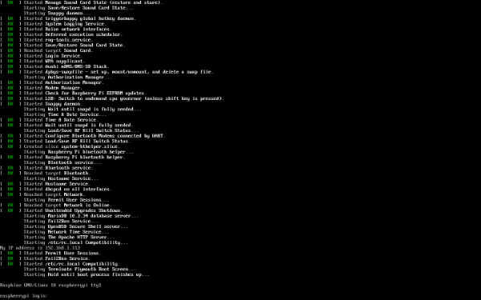

Et si je branche un clavier et un écran sur le Raspberry Pi et que je relance la commande, j'obtiendrai exactement ce que je vois à l'écran.

## fbgrab

L'utilitaire [fbgrab](https://github.com/GunnarMonell/fbgrab) fonctionne un peu comme fbcat sauf que le résultat est un fichier .png et que la syntaxe ne nécessite pas de redirection (>).

Il est automatiquement installé quand vous installez fbcat.

Pour l'utiliser :

Terminal

fbgrab nom\_fichier.png

## setterm

La commande [setterm](https://man7.org/linux/man-pages/man1/setterm.1.html) (SET TERMinal atttibutes) permet d'enregistrer dans un fichier texte ce qui est affiché dans le terminal.

Ce n'est pas tout à fait une impression d'écran mais les informations trouvées sont les mêmes puisque le terminal n'affiche que du texte.

Terminal

sudo setterm --dump

Par défaut, les informations seront enregistrées dans un fichier nommé screen.dump dans le dossier courant.

Un fichier .dump est un simple fichier texte.

Il est possible de spécifier le nom du fichier désiré. Vous pouvez même utiliser l'extension .txt si vous préférez.

Terminal

sudo setterm --dump --file mon\_fichier.txt

Voici ce que j'obtiens si je lance la commande setterm dans une fenêtre SSH alors que le Pi n'a aucun écran branché.

Fichier screen.dump

[ OK ] Started Manage Sound Card State (restore and store).  
       Starting Save/Restore Sound Card State...  
       Starting Snappy daemon...  
[ OK ] Started triggerhappy global hotkey daemon.  
[ OK ] Started System Logging Service.  
[ OK ] Started Raise network interfaces.  
[ OK ] Started Deferred execution scheduler.  
[ OK ] Started rng-tools.service.  
[ OK ] Started Save/Restore Sound Card State.  
[ OK ] Reached target Sound Card.  
[ OK ] Started Login Service.  
[ OK ] Started WPA supplicant.  
[ OK ] Started Avahi mDNS/DNS-SD Stack.  
[ OK ] Started dphys-swapfile - set up, mount/unmount, and delete a swap file.  
       Starting Authorization Manager...  
[ OK ] Started Authorization Manager.  
[ OK ] Started Modem Manager.  
[ OK ] Started Check for Raspberry Pi EEPROM updates.  
[ OK ] Started LSB: Switch to ondemand cpu governor (unless shift key is pressed).  
[ OK ] Started Snappy daemon.  
       Starting Wait until snapd is fully seeded...  
       Starting Time & Date Service...  
[ OK ] Started Time & Date Service.  
[ OK ] Started Wait until snapd is fully seeded.  
       Starting Load/Save RF Kill Switch Status...  
[ OK ] Started Configure Bluetooth Modems connected by UART.  
[ OK ] Started Load/Save RF Kill Switch Status.  
[ OK ] Created slice system-bthelper.slice.  
       Starting Raspberry Pi bluetooth helper...  
[ OK ] Started Raspberry Pi bluetooth helper.  
       Starting Bluetooth service...  
[ OK ] Started Bluetooth service.  
[ OK ] Reached target Bluetooth.  
       Starting Hostname Service...  
[ OK ] Started Hostname Service.  
[ OK ] Started dhcpcd on all interfaces.  
[ OK ] Reached target Network.  
       Starting Permit User Sessions...  
[ OK ] Reached target Network is Online.  
[ OK ] Started Unattended Upgrades Shutdown.  
       Starting MariaDB 10.3.34 database server...  
       Starting Fail2Ban Service...  
       Starting OpenBSD Secure Shell server...  
       Starting Network Time Service...  
       Starting The Apache HTTP Server...  
       Starting /etc/rc.local Compatibility...  
My IP address is 192.168.1.113  
[ OK ] Started Permit User Sessions.  
[ OK ] Started Fail2Ban Service.  
[ OK ] Started /etc/rc.local Compatibility.  
       Starting Terminate Plymouth Boot Screen...  
       Starting Hold until boot process finishes up...

 

Raspbian GNU/Linux 10 raspberrypi tty1

 

raspberrypi login:

Et si je branche un clavier et un écran sur le Raspberry Pi et que je relance la commande, j'obtiendrai exactement ce que je vois à l'écran.

Fichier screen.dump

pi@raspberrypi:~ $ hostname -I  
192.168.1.113  
pi@raspberrypi:~ $ sudo setterm --dump

## Scrot

Scrot (SCReenshOT) et un autre utilitaire qui permet d'effectuer des impressions d'écran.

Il est plus puissant que les autres mais il nécessite qu'un environnement graphique soit installé et ce, même pour faire une capture d'écran de la console.

Il est installé par défaut avec Raspberry Pi OS with Desktop.

Je vous propose ici une astuce pour pouvoir tout de même l'utiliser avec Raspberry Pi OS Lite.

### Installation d'un environnement graphique sous Raspberry Pi OS Lite

Dans la version Lite de Raspberry Pi OS, vous devrez d'abord installer un environnement graphique.

Si vous tentez d'appeler Scrot alors qu'aucun environnement graphique n'est disponible, vous obtiendrez le message « giblib error: Can't open X display. It \*is\* running, yeah? ».

Je vous propose d'installer XFCE, un environnement graphique léger.

Terminal

sudo apt install xfce4

Si vous ne souhaitez pas que votre Raspberry Pi démarre toujours en environnement graphique :

Terminal

sudo systemctl set-default multi-user.target

Vous devrez cependant passer en mode graphique avant d'utiliser Scrot.

Terminal

sudo service lightdm start

### Installation de Scrot

Une fois que vous avez un environnement graphique en place, vous pouvez installer Scrot.

Terminal

sudo apt install scrot

### Utilisation

Si votre clavier dispose d'une touche ImpÉcr ou Print Screen, vous n'avez qu'à appuyer sur cette touche et une image de l'écran sera enregistrée dans votre dossier personnel.

Sinon, vous pouvez ouvrir une fenêtre Terminal et entrer la commande :

Terminal

scrot

Ceci créera une image de l'écran au format .png, placée dans le dossier courant. Pour connaître le chemin de ce dossier, entrez la commande pwd (Print Working Directory). Sous Raspberry Pi OS, il s'agit par défaut du dossier /home/pi.

L'image créée incluera la fenêtre Terminal.

Pour ne pas avoir la fenêtre Terminal dans l'image, il est possible de demander un délai. Par exemple, avec la commande :

Terminal

scrot -d 3

Vous aurez un délai de 3 secondes pour refermer la fenêtre Terminal avant que l'impression d'écran soit faite.

## 4.23 sudo : demander le mot de passe ou non

Lorsqu'on exécute une commande au Terminal du Raspberry Pi avec sudo, il est possible de configurer le Pi pour qu'il demande le mot de passe ou non.

La configuration est dans le fichier /etc/sudoers.d/010\_pi-nopasswd.

Pour l'éditer :

Terminal

sudo nano /etc/sudoers.d/010\_pi-nopasswd

Pour que le mot de passe soit demandé à chaque commande sudo :

Fichier /etc/sudoers.d/010\_pi-nopasswd

pi ALL=(ALL) PASSWD: ALL

Pour ne plus exiger le mot de passe quand une commande débute par sudo :

Fichier /etc/sudoers.d/010\_pi-nopasswd

pi ALL=(ALL) NOPASSWD: ALL

Note : il faut utiliser le mot pi peu importe comment s'appelle votre usager sur le Raspberry Pi.

## 4.24 Comment bien rouler un câble réseau

Rouler un câble réseau semble une tâche simple mais pour bien le rouler, il faut connaître la technique.

Je vous propose cette technique qui permet de protéger les câbles de l'entortillement tout en évitant que les câbles s'emmèlent.

