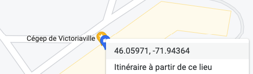

# 98. Exercice 19

## 98.1 Position des enfants

Vous désirez ajouter à votre système domotique Home Assistant tout ce qu'il faut pour gérer la position de vos enfants.

Vous utiliserez ici seulement des capteurs virtuels.

1. Si ce n'est pas déjà fait, [apical\_lien\_interne][les\_zones\_dans\_home\_assistant,définissez les zones École et Centre commercial][/apical\_lien\_interne].
2. Disons que vous avez 2 enfants : Gabriel et Élodie.
   * Dans les outils de développement, [apical\_lien\_interne][simuler\_la\_position\_gps\_d\_une\_personne\_avec\_device\_tracker\_see,simulez une position GPS pour chacun de vos enfants][/apical\_lien\_interne]. Les positions virtuelles doivent s'appeler position\_virtuelle\_gabriel et position\_virtuelle\_elodie.
   * Assurez-vous que chaque enfant soit identifié par une photo. Attention : il ne s'agit pas d'associer une position virtuelle à une personne dans le menu Paramètres / Personnes.
3. Ajoutez un tableau de bord nommé "Coordonnées des enfants". Affichez-y :  
   * une carte géographique qui montre les trois zones que vous avez définies ainsi que la position des enfants
   * un bouton qui déplace Gabriel à l'école
   * un bouton qui déplace Gabriel à la maison
   * un bouton qui déplace Gabriel au centre commercial
   * un bouton qui déplace Gabriel à une coordonnée de votre choix qui n'est pas dans vos zones. Notez que vous pouvez trouver les coordonnées d'un point à l'aide d'un clic droit dans Google Maps. Un clic sur ces coordonnées les copiera dans le presse-papier.

     
   * même chose pour Élodie
4. Dans les outils de développement, écrivez les modèles qui affichent ces informations :
   * La latitude de la zone home
   * La longitude de la zone home
   * Le rayon de la zone home
   * La position de Gabriel, telle que retournée par le capteur virtuel (ex : École, Centre commercial, not\_home).
5. Écrivez une automatisation qui vous envoie un courriel dès qu'un des enfants entre dans la zone Centre commercial.
6. Modifiez l'automatisation pour qu'elle envoie également [apical\_lien\_interne][envoyer\_une\_notification\_a\_l\_application\_mobile,une notification à l'application mobile][/apical\_lien\_interne]. Le message devra indiquer le nom de l'enfant qui est au centre commercial.
7. Écrivez une automatisation qui monte un chauffage virtuel de 3 degrés dès qu'un des enfants quitte la zone École.
8. Écrivez une automatisation qui baisse le chauffage de 3 degrés lorsque les deux enfants sont partis de la maison.
9. Ajoutez un bouton au tableau de bord. Si le bouton est pressé avant midi alors que le soleil est levé, le système simule un réveille-matin en affichant dans un virtuel de texte « Levez-vous les enfants! ». S'il est pressé après 18h alors que le soleil est couché, il affiche « Allez vous coucher les enfant! ».
10. [apical\_lien\_interne][sauvegarde\_de\_home\_assistant,Créez une sauvegarde][/apical\_lien\_interne] de votre Home Assistant et copiez le fichier sur votre ordinateur.
11. En prévision de l'examen qui se déroulera au prochain cours, assurez-vous que votre seconde carte micro SD ait une copie fonctionnelle de Home Assistant avec vos dernières manipulations. Cette copie sera utilisée si jamais il y avait un problème avec votre carte actuelle.
