<!-- --- split --- -->




Dans les semaines qui suivent, vous apprendrez comment intégrer dans Home Assistant des objets connectés qui sont déjà associés à d'autres plateformes et vice-versa.

Vous aurez encore besoin de votre installation Home Assistant mais pour l'instant, vous devez effectuer une installation de Jeedom sur une seconde carte micro SD.

Notez que si vous avez déjà une carte qui contient une installation Jeedom, il est préférable d'effectuer une nouvelle installation. Installer un système plus d'une fois est une bonne technique pour mieux comprendre le processus.

Si votre seconde carte contient déjà un système que vous désirez conserver, créez une sauvegarde et téléchargez le fichier sur votre ordinateur.

Faites le nécessaire pour intégrer un capteur et un récepteur réels dans Jeedom.

<!-- --- split --- -->

# 320 — 2. Pour le prochain cours


Vous disposez d'un cours pour acquérir les connaissances théoriques et finaliser cet exercice.

Une fois cet exercice complété, vous devez effectuer vos lectures pour l'exercice suivant.

<!-- --- split --- -->


<!-- --- split --- -->


## 321 — 3.1 Home Assistant : interagir avec un objet branché sur Jeedom

Certains objets connectés ne peuvent pas être ajoutés à Jeedom et d'autres ne peuvent pas être ajoutés à Home Assistant. Tout dépend des plugins ou des intégrations qui existent sur l'un ou l'autre de ces produits.

Peut-être même que vous avez mis beaucoup de temps à développer un objet personnalisé sur l'une des plateformes et que vous désirez maintenant passer à l'autre sans devoir tout recommencer.

Grâce à certaines techniques de communication, ce n'est pas un problème, on pourra avoir des objets sur l'une des boîtes domotiques qui sont contrôlés par l'autre et vice-versa.

Les deux principales techniques sont :

* Travailler avec un API (Application Programming Interface) (expliqué dans la présente fiche [apical\_lien\_interne][jeedom\_recuperer\_la\_valeur\_d\_un\_capteur\_branche\_sur\_home\_assistant\_ou\_la\_\_\_,et dans la suivante][/apical\_lien\_interne])
* [apical\_lien\_interne][publication\_et\_abonnement\_mqtt\_avec\_home\_assistant,MQTT][/apical\_lien\_interne]

Pour que la communication entre deux applications ait lieu à l'aide d'un API, il faut qu'une application ait le moyen de lancer une commande sur l'autre application. Le plus souvent, cette commande passera par un URL. On dira alors qu'on travaille avec un API REST.

Sous Jeedom, [apical\_lien\_interne][url\_d\_un\_objet\_connecte\_jeedom,un URL est assigné à chaque commande ou état d'un objet connecté][/apical\_lien\_interne]. C'est grâce à cet URL, que Home Assistant pourra récupérer la valeur d'un capteur branché sur une boîte domotique Jeedom ou encore de modifier la valeur d'un récepteur.

## Récupérer la valeur d'un capteur Jeedom dans Home Assistant

Pour chaque capteur, Jeedom définit au moins une commande de type info.

Si un capteur fournit plusieurs informations, il faudra sélectionner la bonne commande.

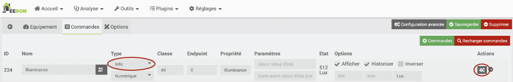

Avec l'engrenage situé à droite de la commande, on peut retrouver l'URL qui donne la valeur de cette commande.

C'est cet URL qui est la clé pour permettre à un autre système d'accéder à la valeur de la commande.

Pour voir la valeur de la commande dans Home Assistant, il suffit d'ajouter dans le fichier configuration.yaml un capteur de la plateforme REST et d'y coller l'URL de la commade désirée.

Fichier configuration.yaml

sensor:  
  - platform: rest  
    resource: http://192.168.1.145/core/api/jeeApi.php?apikey=NptrtQxE...iXI6LsiU&type=cmd&id=234  
    name: porte d'entrée Jeedom

Une fois Home Assistant redémarré (un rechargement des configurations n'est pas suffisant), le capteur de Jeedom pourra être utilisé au même titre que n'importe quel autre qui serait branché directement dans Home Assistant.

Petit hic cependant, le délai d'actualisation est généralement plus long que si le capteur était branché directement à Home Assistant. Par exemple, mes tests avec un virtuel prenaient une quinzaine de secondes avant de se rafraîchir dans Home Assistant.

## Modifier l'état d'un récepteur réel Jeedom dans Home Assistant

Home Assistant peut modifier la valeur d'un récepteur branché à Jeedom.

Il faut ici aussi ajouter un capteur dans le fichier configuration.yaml.

Cette fois, l'URL correspondra à une commande de type action.

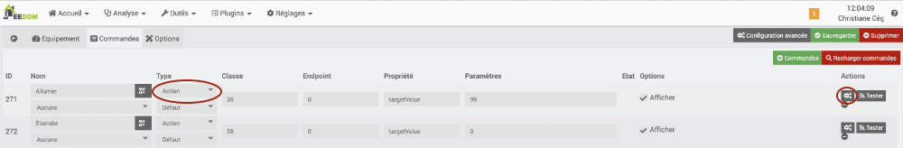

Si, dans Jeedom, la technique pour retrouver l'URL est la même que pour une commande Info, le travail dans Home Assistant sera différent lorsqu'on veut envoyer un ordre.

Plutôt que de créer un capteur, il faut créer des commandes REST.

Ici, j'ai ajouté deux commandes : une pour allumer la prise et l'autre, pour l'éteindre.

Fichier configuration.yaml

rest\_command:  
  allumer\_lumiere\_jeedom:  
    url: "http://192.168.1.145/core/api/jeeApi.php?apikey=NptrtQxE...iXI6LsiU&type=cmd&id=271"  
  eteindre\_lumiere\_jeedom:  
    url: "http://192.168.1.145/core/api/jeeApi.php?apikey=NptrtQxE...iXI6LsiU&type=cmd&id=272"

Après un redémarrage de Home Assistant, il est possible d'utiliser ces commandes en tant qu'action pour interagir avec le récepteur de Jeedom.

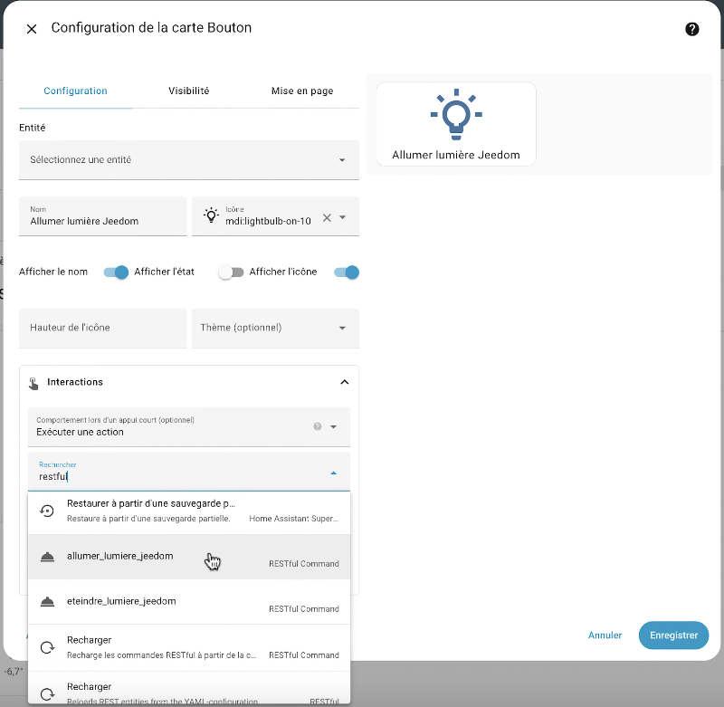


La valeur d'un virtuel sur Jeedom peut être modifiée à partir de Home Assistant.

Après avoir récupéré l'URL qui permet d'accéder à la valeur du virtuel, il suffit d'y ajouter &value= suivi de la valeur à donner.

Fichier configuration.yaml

rest\_command:  
  temperature\_virtuelle\_jeedom\_chaud:  
  url: "http://192.168.1.145/core/api/jeeApi.php?apikey=NptrtQxE...iXI6LsiU&type=cmd&id=209&value=30"


Vous avez un objet connecté dans Home Assistant et vous désirez l'utiliser dans Jeedom? Pas de problème!

Il est possible de configurer Home Assistant pour qu'il envoie des informations à un autre système, par exemple Jeedom.

La technique est tout à fait opposée à celle utilisée pour [apical\_lien\_interne][home\_assistant\_interagir\_avec\_un\_objet\_branche\_sur\_jeedom,récupérer dans Home Assistant une valeur en provenance de Jeedom][/apical\_lien\_interne].

Sous Home Assistant, les objets connectés n'ont pas d'URL que l'on peut récupérer. Il faudra plutôt que Home Assistant pousse vers Jeedom la valeur souhaitée, dans un objet virtuel dont on connaîtra l'URL.

Home Assistant utilisera pour cela des commandes de type [REST](https://www.home-assistant.io/integrations/sensor.rest).

Voici comment y parvenir :

* Dans Jeedom, [apical\_lien\_interne][travailler\_avec\_le\_plugin\_virtuel,créez un équipement virtuel][/apical\_lien\_interne] qui recevra la valeur de Home Assistant.

  Donnez-lui un nom clair, par exemple Luminosité cuisine - Home Assistant.

  Dans l'onglet Commandes, cet objet virtuel devra avoir une info virtuelle pour recevoir la valeur de Home Assistant. Dans cet exemple, je l'ai simplement appelée valeur.

  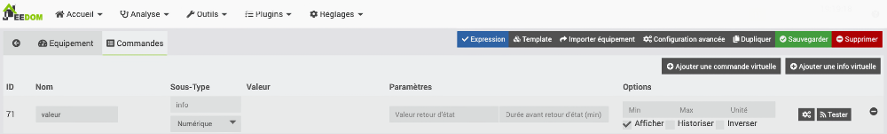
* Dans Jeedom, retrouvez l'URL de cet équipement virtuel.
* Pour tester l'URL, entrez-le dans un navigateur et ajoutez-y &value= suivi de la valeur à donner, que vous coderez ici en dur. Vous saurez que l'URL est bon quand le virtuel dans Jeedom affiche la valeur entrée.
* Dans Home Assistant, ajoutez une entrée dans le fichier configuration.yaml.

  Fichier configuration.yaml

  rest\_command:  
    pousser\_eclairement\_vers\_jeedom:  
      url: "http://192.168.1.145/core/api/jeeApi.php?apikey=NptrtQxE...iXI6LsiU&type=cmd&id=71&value={{ states('sensor.neo\_capteur\_5\_en\_1\_illuminance')}}"
* Redémarrez Home Assistant.
* Pour tester la commande, rendez-vous dans les outils de développement de Home Assistant, onglet Actions, et exécutez l'action RESTful Command: pousser\_eclairement\_vers\_jeedom.

  La valeur du capteur devrait apparaître dans l'objet virtuel sous Jeedom.

  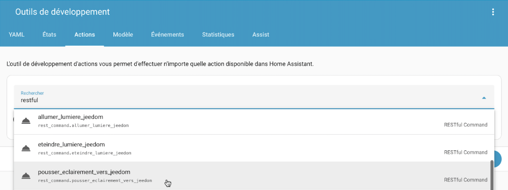
* Maintenant, il faut créer une automatisation qui va exécuter cette action dès que la valeur du capteur change. Comme ça, la valeur réelle du capteur sera toujours synchronisée avec la l'objet virtuel sous Jeedom.

  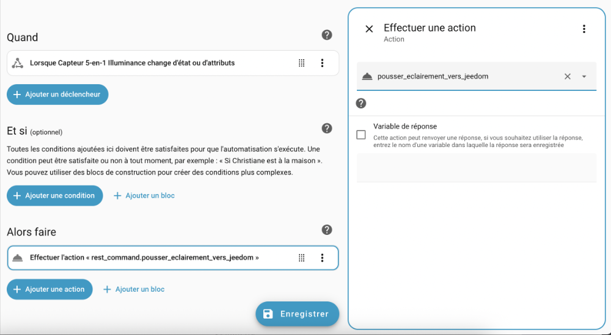

## 322 — 3.3 Jeedom : lancer une action sur un récepteur branché sur Home Assistant

Home Assistant peut permettre à d'autres systèmes de lancer une commande pour interagir avec ses propres objets connectés.

### Clé d'API

Vous devez générer une clé d'API, que Jeedom appelle jeton d'accès de longue durée, pour permettre à Jeedom de lancer une action dans Home Assistant :

* Dans Home Assistant, cliquez sur votre nom au bas de la colonne de gauche, cliquez sur l'onglet Sécurité puis faites défiler la page jusqu'à la section Jetons d'accès de longue durée.

  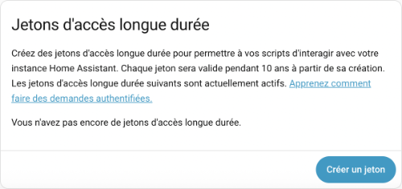
* Cliquez sur Créer un jeton puis donnez-lui un nom significatif, par exemple Jeedom.
* Le jeton, dont la durée de vie est de 10 ans, ne sera affiché qu'une fois à l'écran. Prenez-le en note sinon il ne sera plus utilisable.

  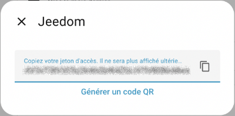
* Vous pouvez maintenant refermer cette fenêtre.

### Information sur l'entité Home Assistant qui sera appelée par Jeedom

Dans sa forme la plus simple, l'action agira directement sur une entité, par exemple sur l'entité light.dimmable\_smart\_plug.

Il est possible de regrouper plusieurs actions dans un script Home Assistant. �? ce moment, Jeedom agira sur une entité du genre script.actions\_de\_noel.

Conservez l'information sur l'entité désirée pour la prochaine étape.

### Commande cURL

Jeedom lancera une commande [cURL](https://curl.se/docs/manpage.html) (client URL) pour lancer l'action sur Home Assistant.

cURL est un outil en ligne de commande qui permet de transférer des données. Il est donc possible de transférer des informations vers un serveur ou d'obtenir des information à partir d'un serveur.

Pour trouver les détails de la commande cURL à utiliser, rendez-vous dans la documentation de l'API REST de Home Assistant : [https://developers.home-assistant.io/docs/api/rest/](https://developers.home-assistant.io/docs/api/rest/#:~:text=/api/services/).

Faites défiler la page jusqu'à la liste des URL disponibles.

Cliquez sur la ligne POST qui permet d'appeler un service.

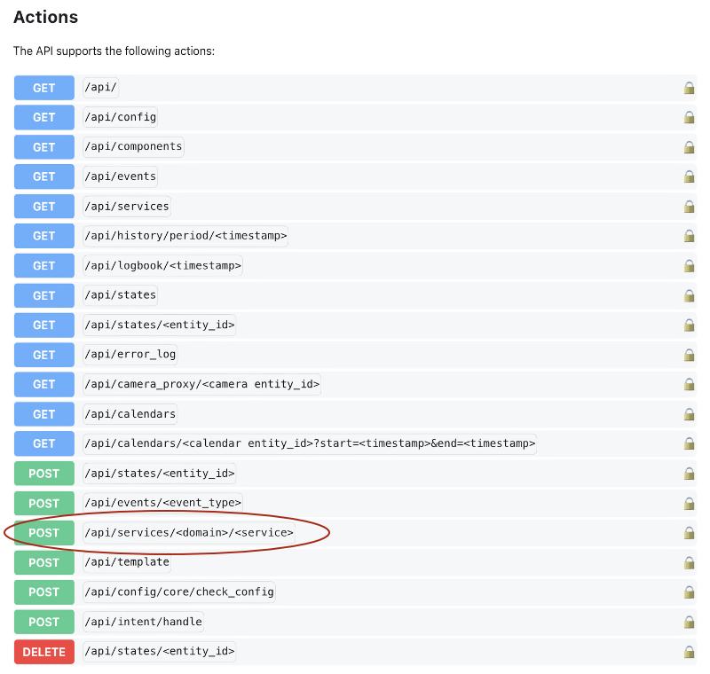

Le format de la commande cURL à utiliser sera affiché.

cURL

curl \  
  -H "Authorization: Bearer TOKEN" \  
  -H "Content-Type: application/json" \  
  -d '{"entity\_id": "switch.christmas\_lights"}' \  
  http://localhost:8123/api/services/switch/turn\_on

Quelques explications sur cette commande :

* La barre oblique inverse à la fin de chaque ligne indique que la commande se poursuit à la ligne suivante. Tout ceci pourrait donc être entré sur une seule ligne.
* L'option -H permet d'envoyer des informations d'en-tête supplémentaires (**H**eader). Ici, il faut fournir le jeton d'authentification afin de prouver que vous avez les droits requis pour cette opération. Vous devez remplacer TOKEN par votre jeton d'accès de longue durée.
* La seconde option -H envoie d'autres informations d'en-tête. Ici, on indique que le type d'informations envoyées au serveur est au format JSON. C'est d'ailleurs le seul format accepté par l'API de Home Assistant.
* L'option -d permet de fournir des informations (**d**ata). Ces informations devront être au format JSON, en cohérence avec les informations d'en-tête envoyées.

  Ici, on doit indiquer l'identifiant de l'entité sur laquelle on désire travailler. Remplacez switch.christmas\_lights par l'entité que vous avez notée plus tôt.
* La dernière informations de la commande cURL indique à quel serveur on s'adresse et quel service on désire effectuer.

  Remplacez localhost par l'adresse IP du Raspberry Pi qui héberge Home Assistant. N'oubliez pas de préciser le port (8123).

  Remplacez switch/turn\_on par une chaîne au format domaine/action qui représente l'action à réaliser.

  Pour connaître les actions disponibles, vous pouvez vous rendre dans Outils de développement / Actions. Remplacez le point dans le nom complet de l'action par une barre oblique. Ainsi, light.turn\_on deviendra light/turn\_on.

cURL répondra en vous donnant de l'information sur le ou les états qui ont été modifiés par la commande.

Résultat à l'écran

[{  
    "entity\_id":"light.dimmable\_smart\_plug",  
    "state":"on",  
    "attributes":{  
        "supported\_color\_modes":["brightness"],  
        "color\_mode":"brightness",  
        "brightness":139,  
        "friendly\_name":"Prise intelligente ",  
        "supported\_features":32  
    },  
    "last\_changed":"2025-11-17T20:28:08.585502+00:00",  
    "last\_reported":"2025-11-17T20:28:08.585502+00:00",  
    "last\_updated":"2025-11-17T20:28:08.585502+00:00",  
    "context":{  
        "id":"01KA9R1R854XR5ZRP504AN6RHZ",  
        "parent\_id":null,  
        "user\_id":"cbc1d1e7099c42129153b19c8c8fcd7c"  
    }  
}]

Pour tester la commande, branchez-vous en SSH sur le Raspberry Pi **qui héberge Jeedom** puis lancez-y la commande cURL qui agira sur Home Assistant. Vous devriez voir la prise de courant s'allumer!

Une fois la commande cURL testée, vous êtes prêt à l'automatiser.

### Script dans Jeedom

Sous Jeedom, vous devez créer un script qui se chargera de lancer la commande cURL :

* Rendez-vous dans Plugins / Programmation / Script (si cette option n'est pas disponible, c'est que vous devez installer le plugin Script par Jeedom SAS).
* Cliquez sur Ajouter.
* Donnez un nom à l'équipement qui représente le script, par exemple Gérer prise Home Assistant.
* Activez l'équipement.
* Dans l'onglet Commandes, cliquez sur Ajouter une commande script.
* Dans la première case, donnez un nom à la commande. On utilise généralement un seul mot, par exemple Allumer.
* Dans la colonne Type, choisissez Action. Laissez la case du dessous à Défaut.
* Dans la colonne Requête, entrez la commande cURL. Attention : les apostrophes ne fonctionnent pas. Vous devrez donc utiliser des guillemets alentour des données du paramètre data (-d) et, à l'intérieur du JSON fourni, ajouter des barres obliques devant chaque guillemet.   
  Ex : -d "{\"entity\_id\": \"light.dimmable\_smart\_plug\"}"
* Au besoin, ajoutez d'autres commandes script. Dans cet exemple, j'ai ajouté une seconde commande pour éteindre la prise intelligente.

  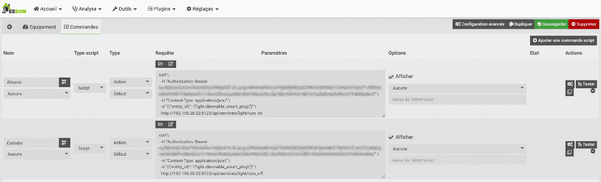
* Cliquez sur Sauvegarder.
* Pour tester une commande, cliquez sur le bouton Tester à sa droite. La prise intelligente branchée sur Home Assistant devrait s'allumer ou s'éteindre selon la commande testée.
* Vous pouvez désormais utiliser ce script dans vos scénarios.
* 

## Pour plus d'information

« Tuto Contrôler Home Assistant par Jeedom ». YouTube - La Maison de Jeed Home. <https://www.youtube.com/watch?v=h3qOeaguPl4>

## 323 — 3.4 URL d'un objet connecté Jeedom

Lorsqu'un objet connecté est pairé à une boîte domotique Jeedom, il se voit attribuer un URL. Il est ensuite possible d'agir sur cet objet à partir de cet URL.

Pour connaître l'URL d'un objet, et plus spécifiquement l'URL qui permet de lancer une commande donnée sur cet objet :

* Dans [apical\_lien\_interne][installation\_de\_jeedom\_et\_premier\_acces,l'interface Web de Jeedom,acceder][/apical\_lien\_interne], rendez-vous dans le menu Plugins / Protocole domotique / Z-Wave (ou autre menu qui donne accès à l'équipement recherché s'il ne s'agit pas d'un objet connecté Z-Wave).
* Cliquez sur l'objet connecté désiré.
* Sélectionnez l'onglet Commandes.
* Retrouvez la commande que vous désirez lancer à l'aide d'un URL. Si vous désirez effectuer une action sur l'objet, ce sera une commande de type Action. Si vous désirez retrouver de l'information fournie par l'objet, ce sera une commande de type Info.

  Parfois, il n'est pas facile de retrouver la commande puisque les noms ne sont pas toujours significatifs. Au besoin, cliquez sur le bouton Tester vis-à-vis une commande pour voir si elle a l'effet escompté. Les commandes de type Action effectueront l'action correspondante et les commandes de type Info afficheront la valeur correspondante dans le haut de l'écran.

  Par exemple, pour allumer ma prise intelligente Zooz, la commande s'appelle Switch 0 On et quand je clique sur Tester vis-à-vis cette commande, je constate que la prise s'allume.

  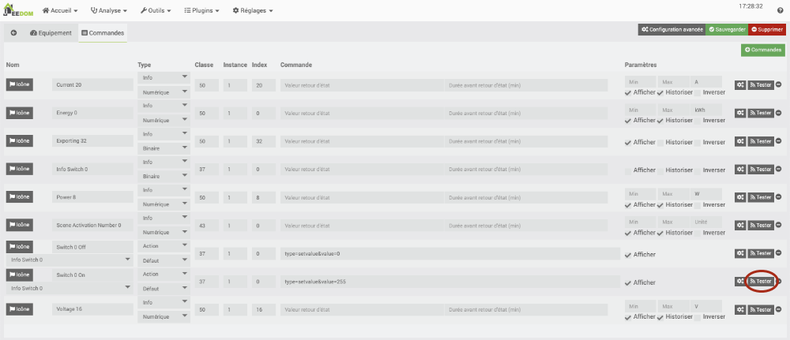
* Une fois la commande repérée, cliquez sur le bouton d'engrenage juste à sa droite.
* Dans la fenêtre qui apparaît, cliquez sur l'icône à côté de URL directe.

  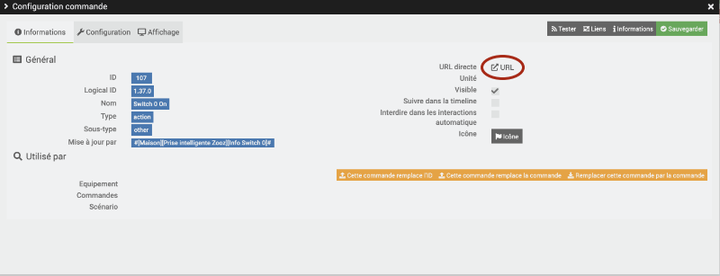
* Un nouvel onglet s'ouvre dans le navigateur. L'URL qui apparaît active la commande. C'est cet URL que vous devez prendre en note pour pouvoir effectuer cette commande par programmation.


Il est possible de retrouver l'URL de n'importe quelle commande si on connaît les informations suivantes :

* adresse IP du Raspberry Pi qui héberge Jeedom
* clé API de Jeedom, que vous pouvez retrouver dans le menu Réglages / Système / Configuration, onglet API.

  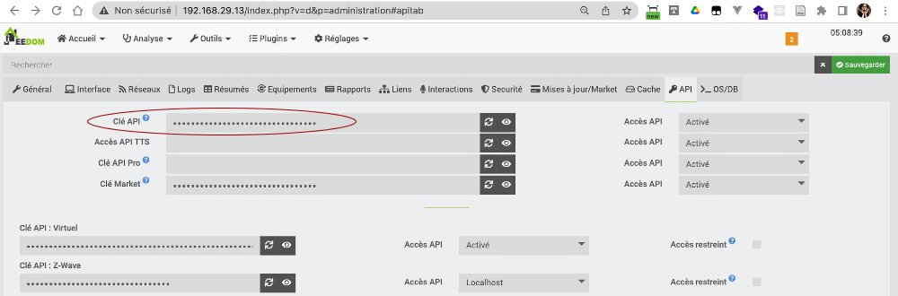
* identifiant de la commande (ID), que l'on retrouve dans la même fenêtre que l'URL d'une commande.

L'URL qui permet de lancer une commande sur un objet connecté sera au format :

http://adresse\_ip\_du\_pi/core/api/JeeApi.php?apikey=cle\_api&type=cmd&id=id\_commande

Exemple :

http://192.168.1.145/core/api/jeeApi.php?apikey=C6VL4SqycjFFeKixYcqiJj7Bax5e2ncI&type=cmd&id=107

## URL pour modifier la valeur d'un équipement virtuel

Pour tout type d'équipement, les commandes de type info servent à fournir une valeur, par exemple la luminosité d'un capteur de luminosité.

Ces valeurs ne sont en principe pas modifiées par programmation.

Par contre, dans le cas d'un équipement virtuel, il peut être intéressant de les modifier. Il faudra alors ajuster l'URL pour y parvenir.

Prenons par exemple un virtuel qui sert à stocker une valeur.

Dans les configurations de cet équipement, [apical\_lien\_interne][travailler\_avec\_le\_plugin\_virtuel,on créera une commande,actions][/apical\_lien\_interne] de type info. C'est dans cette info que la valeur sera stockée.

Ici, j'ai simplement appelé cette info Ma valeur. Jeedom lui a attribué l'identifiant 74.

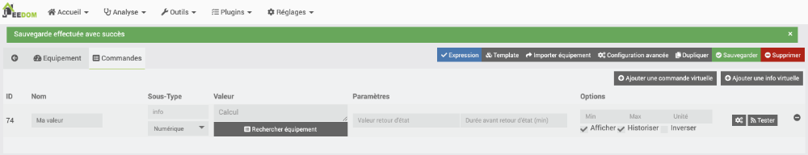


Si je clique sur l'icône d'engrenage pour connaître son URL, j'obtiens :

http://192.168.1.145/core/api/jeeApi.php?apikey=C6VL4SqycjFFeKixYcqiJj7Bax5e2ncI&type=cmd&id=74

Si j'entre cet URL dans un navigateur, j'obtiens la valeur actuelle du virtuel.


Pour modifier sa valeur, il faut utiliser un URL au format :

http://adresse\_ip\_du\_pi/core/api/JeeApi.php?id=id\_commande&apikey=cle\_api\_virtuel&type=event&plugin=virtual&value=valeur\_a\_assigner

Attention : la clé API est différente de la commande originale. Pour la retrouver, rendez-vous dans l'écran Réglages / Système / Configuration, onglet API. La clé recherchée est vis-à-vis Clé API : Virtuel.

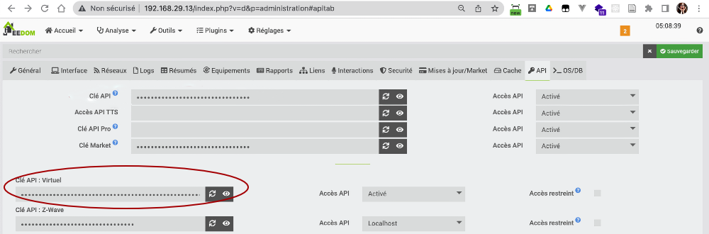

Il faut donc modifier l'URL obtenu comme suit :

http://192.168.1.145/core/api/jeeApi.php?id=74&apikey=axDLsOvyIXU6SY6hxJhUDco1RyTs9Q8XpZbjpdESyu3bcBFRBJSH7NylyFc54VY9&type=event&plugin=virtual&value=56

<!-- --- split --- -->




Dans cet exercice, vous devez travailler deux par deux. L'un de vous ouvrira sa boîte domotique Jeedom et l'autre ouvrira Home Assistant.

Vous aurez des manipulations à faire sur les deux machines mais vous ferez chaque manipulation ensemble pour vous assurer de bien comprendre les deux côtés de la médaille.

1. Assurez-vous d'avoir un capteur réel et un capteur virtuel dans votre boîte Jeedom.
2. Sous Home Assistant, faites afficher dans le tableau de bord la valeur du capteur réel et celle du capteur virtuel branchés à la boîte Jeedom.
3. Modifiez ces valeurs dans Jeedom (ex : mettez la main sur le capteur de luminosité ou modifiez à la main la valeur d'un virtuel) et vérifiez que les modifications sont effectives dans Home Assistant.
4. �? partir d'une commande de type action, effectuez une opération sur un récepteur dans Jeedom à partir de Home Assistant. Par exemple, éteignez une lumière réelle ou virtuelle.
5. Vous devez maintenant faire l'inverse : passer des infos de Home Assistant vers Jeedom. Assurez-vous d'avoir un capteur réel et un capteur virtuel dans Home Assistant.
6. Sous Jeedom, faites afficher dans le Dashboard la valeur du capteur réel et celle du capteur virtuel branchés à la boîte Home Assistant.
7. Modifiez ces valeurs dans Home Assistant (ex : mettez la main sur le capteur de luminosité ou modifiez à la main la valeur d'un virtuel) et vérifiez que les modifications sont effectives dans Jeedom.
8. Effectuez une opération sur un récepteur dans Home Assistant à partir de Jeedom.

<!-- --- split --- -->




CET EXERCICE EST OPTIONNEL.

Sur le Jeedom de votre professeur, un équipement virtuel porte un nom au format eleve9 où 9 est le numéro de votre Raspberry Pi par exemple eleve1, ..., eleve 10, etc. Cet équipement contient une commande nommée note. Votre professeur vous fournira l'id de la commande ainsi que la clé d'API.

1. �? partir de votre Home Assistant, entrez dans cette commande la note que vous désirez obtenir pour le cours d'objets connectés. La note doit être un chiffre entre 0 et 100.
2. �? partir de votre Home Assistant, créez une automatisation qui vous envoie un courriel (ou une notification, ou une écriture dans un fichier journal) dès qu'un collègue de votre choix entre une note inférieure à 60 dans son objet sur Jeedom.
3. �? partir de votre Home Assistant, créez une automatisation qui augmente votre note dès qu'un collègue de votre choix entre une note supérieure à la vôtre dans son objet sur Jeedom. Votre note sera 1 de plus que la sienne. Les notes sont plafonnées à 100.

<!-- --- split --- -->

# 324 — 6. Pour le prochain cours


Vous disposez d'un cours pour acquérir les connaissances théoriques et finaliser cet exercice.

Une fois cet exercice complété, vous devez effectuer vos lectures pour l'exercice suivant.

<!-- --- split --- -->


## 325 — 7.1 Le protocole MQTT

MQTT (Message Queuing Telemetry Transport) est un protocole de communication machine à machine très léger basé sur TCP/IP.

Il permet de transférer des informations à l'aide d'un mécanisme publication/abonnement (publish/subscribe).

Dans le monde de la domotique, il a une application intéressante : il permet à deux boîtes domotiques de communiquer ensemble. Les données d'un capteur branché sur la boîte A pourraient ainsi déclencher une action sur un récepteur branché sur la boîte B.

Dans cette fiche :

* [Agent MQTT](999_999_merged.md#agent)
* [Exemple de fonctionnement](999_999_merged.md#exemple)
* [Les canaux de communication MQTT](999_999_merged.md#canal)
* [Payload](#payload)
* [QoS](#qos)
* [Retain](#retain)
* [Conditions pour qu'une communication MQTT ait lieu](#conditions)

## Agent MQTT

Pour gérer les communications, il faut avoir un agent MQTT (en anglais, MQTT broker), parfois appelé courtier MQTT ou encore serveur MQTT.

[Mosquitto](https://mosquitto.org/) est un agent MQTT libre et très répandu. C'est d'ailleurs lui qui peut être facilement installé par différentes boîtes domotiques comme Jeedom ou Home Assistant.

Il ne faut pas confondre l'agent Mosquitto avec le site Web [https://test.mosquitto.org](https://mosquitto.org/) qui est une installation publique de ce même Mosquitto, souvent utilisée pour faire des tests.

Attention : les informations qui transigent sur https://test.mosquitto.org sont publiques! De plus, la communication n'est pas fiable, le serveur peut arrêter de fonctionner à tout moment. C'est un serveur de test.

Les informations qui transigent sur un agent local sont plus sécuritaires que celles qui transigent sur https://test.mosquitto.org, à condition que l'agent MQTT [apical\_lien\_interne][la\_securite\_avec\_mqtt,soit correctement configuré][/apical\_lien\_interne].

## Exemple de fonctionnement

Voici un exemple simple du fonctionnement d'une communication MQTT :

* Une boîte domotique envoie de l'information au sujet d'un de ses objets connectés, par exemple un capteur de luminosité, à un agent MQTT sur un canal donné. Le système domotique est ici le client publieur (publisher).
* Une autre boîte domotique est abonnée à ce canal. Elle recevra alors l'information sur la luminosité. Une règle d'automatisation lui permettra d'allumer ou d'éteindre une ampoule selon l'information reçue. Cette boîte est le client abonné (subscriber).
* L'information peut circuler dans les deux sens, c'est-à-dire que la boîte de l'ampoule, qui était le client abonné dans l'opération précédente, deviendra un client publieur si elle envoie de l'information au sujet de son état à l'agent MQTT sur un autre canal.
* Les abonnés de ce canal seront informés de l'état de l'ampoule et pourront réagir convenablement.

Ce mécanisme est intéressant puisqu'il peut fonctionner localement, sans devoir faire appel à un service infonuagique.

## Les canaux de communication MQTT

La communication entre le publieur et un abonné passe par un canal. On utilise parfois le terme sujet. En anglais, on dira channel ou topic.

L'agent MQTT peut gérer autant de canaux que nécessaire.

Le publieur décide sur quel canal il publie l'information. L'agent enverra cette information seulement aux abonnés de ce canal. Ceci permet à plusieurs publieurs d'envoyer des informations qui ne seront reçues que par ceux qui désirent recevoir ces informations.

Pour qu'un canal existe, il suffit qu'un publieur et un abonné l'utilisent. Il n'y a pas d'étape de création en tant que telle.

[Le nom d'un canal](https://www.hivemq.com/blog/mqtt-essentials-part-5-mqtt-topics-best-practices/) contient généralement plusieurs niveaux afin de bien organiser les canaux que l'agent MQTT doit gérer.

Le nom sera sous la forme : un\_niveau/un\_sous\_niveau/un\_nom.

Il sera écrit entièrement en lettre minuscules avec possiblement des barres de soulignement pour séparer les mots.

Il est préférable d'éviter les espaces, les caractères accentués et les caractères spéciaux dans le nom d'un canal.

Voici quelques exemples valables :

* maison/chambre/temperature
* securite/porte
* sauvegarde/homeassistant
* homeassistant/cafetiere

### Caractères génériques

Si vous désirez écouter tout ce qui se publie sur un canal, peu importe les sous-niveaux, vous pouvez utiliser un #.

Par exemple, pour écouter tout ce qui se dit sur le canal jeedom, peu importe les sous-niveaux, vous écouterez le canal jeedom/#.

Pour écouter tout ce qui est publié sur un agent MQTT, vous écouterez le canal #.

## Payload

Le payload, aussi appelé la charge utile ou simplement les données, est le corps de l'information publiée sur un canal.

En fait, un message publié via MQTT contient un canal et un payload. On peut faire une comparaison avec un courriel qui contient un titre et un message.

## QoS

La qualité du service peut prendre les valeurs 0, 1 ou 2, la valeur 2 étant la meilleure garantie de livraison du message mais également la plus exigente au niveau des ressources.

Cette valeur peut être configurée du côté du client publieur et du côté du client abonné.

Lorsque le client abonné a une QoS inférieure à celle du client publieur, c'est la plus basse valeur qui est utilisée pour envoyer l'information de l'agent MQTT vers le client abonné.

<https://www.hivemq.com/blog/mqtt-essentials-part-6-mqtt-quality-of-service-levels/>

## Retain

Cette option permet notamment aux nouveaux abonnés de recevoir immédiatement le dernier message retenu sur ce canal.

<https://www.hivemq.com/blog/mqtt-essentials-part-8-retained-messages/>

## Conditions pour qu'une communication MQTT ait lieu

Pour qu'une communication MQTT ait lieu, il faut :

* un client publieur et un client abonné qui utilisent le même agent MQTT (si l'agent est local, le publieur et l'abonné devront être sur le même sous-réseau)
* un client publieur et un client abonné qui utilisent le même canal MQTT

## Pour plus d'information

« MQTT ». Wikipédia. <https://fr.wikipedia.org/wiki/MQTT>

« MQTT Essentials ». HiveMQ. <https://www.hivemq.com/mqtt-essentials/>

« MQTT Tutorial for Arduino, ESP8266 and ESP32 ». DIYI0T. <https://diyi0t.com/introduction-into-mqtt/>

## 326 — 7.2 La sécurité avec MQTT

Le protocole MQTT peut être très sécuritaire s'il est bien utilisé. Dans le cas contraire, il peut ouvrir la porte à des attaques ou à une violation de la vie privée.

Voici quelques aspects à prendre en considération.

## Agent MQTT utilisé

Les clients publieurs et les clients abonnés doivent passer par un agent MQTT pour que les informations transigent du publieur vers le ou les abonnés.

Cet agent peut être installé n'importe où : sur la machine du client publieur, sur la machine du client abonné, sur une machine tierce. Il est même possible d'utiliser un agent de test disponible à l'adresse [https://test.mosquitto.org](https://test.mosquitto.org/).

Attention si vous utilisez cet agent de test : les informations qui y transigent sont publiques! Il ne faut en aucun cas l'utiliser pour autre chose que des tests.

## Visibilité de l'agent MQTT sur le réseau

Si l'agent MQTT est sur le même réseau que le client publieur et le client abonné et qu'ils sont protégés par un pare-feu, il n'y a pas de risque que les données qui transigent soient interceptées en dehors de ce réseau.

Vous pourriez vous croire en sécurité mais n'oubliez jamais que le pirate peut être une personne de l'intérieur, qui a accès à ce même réseau.

Dans le cas où un port est ouvert pour rendre l'agent disponible sur Internet, les risques d'interception sont encore plus importants.

Dans tous les cas, vous devez prendre les précautions mentionnées dans les sections qui suivent.

## Mot de passe pour s'abonner à un canal

Lorsque vous configurez un agent MQTT, vous avez la possibilité de demander un identifiant et un mot de passe.

Ceci est particulièrement important dès que l'agent MQTT est mis en production. Mais pour que ce soit efficace, il faut également que la communication soit encryptée, d'où l'importance du point suivant.


Par défaut, un agent MQTT écoutera sur le port TCP/IP 1883. Il s'agit d'un port [réservé par l'Internet Assigned Numbers Authority (IANA) pour MQTT](https://www.iana.org/assignments/service-names-port-numbers/service-names-port-numbers.xhtml?search=mqtt).

Ce port n'est pas sécuritaire.

Il est préférable d'utiliser le port 8883. Il s'agit d'un autre port réservé par l'IANA pour MQTT mais cette fois, il exige une [communication avec SSL/TLS](https://obrienlabs.net/how-to-setup-your-own-mqtt-broker#setup-letsencrypt-ssl-certificate-optional). Vous aurez donc à [installer un certificat TLS](http://www.steves-internet-guide.com/mosquitto-tls/). Les clients devront utiliser ce certificat pour que les communications fonctionnent.

## 327 — 7.3 Client MQTT dans Home Assistant

Home Assistant peut effectuer des communications [apical\_lien\_interne][mqtt,MQTT][/apical\_lien\_interne] grâce à l'[intégration MQTT](https://www.home-assistant.io/integrations/mqtt/).

Cette intégration installera un client MQTT avec la possibilité d'installer également un agent.

Rappel : pour qu'une communication MQTT ait lieu, il faut :

* un client publieur et un client abonné qui utilisent le même agent MQTT (si l'agent est local, le publieur et l'abonné devront être sur le même sous-réseau)
* un client publieur et un client abonné qui utilisent le même canal MQTT

Dans cette fiche :

* [Installation du client MQTT](#installation)
* [Configuration du client MQTT (informations sur l'agent à utiliser)](#configuration)
  + [Agent test.mosquitto.org](999_999_merged.md#mosquittoorg)
  + [Agent installé localement](999_999_merged.md#local)
    - [Mot de passe de l'agent MQTT sur Home Assistant](999_999_merged.md#motdepasse)
    - [Installer un agent après-coup ou reconfigurer l'agent local](999_999_merged.md#installer)
  + [Agent installé sur un second ordinateur](999_999_merged.md#ip)
* [Utilisation d'une connexion sécurisée](999_999_merged.md#securise)
* [Tester MQTT](999_999_merged.md#tester)
  + [Publier un paquet](999_999_merged.md#publier)
  + [�?couter un sujet](999_999_merged.md#ecouter)
  + [Caractères génériques](001_010_merged.md#generiques)
* [Abonnement et publication](999_999_merged.md#abonnementpublication)

## Installation du client MQTT

Pour installer l'intégration MQTT dans Home Assistant :

* Rendez-vous dans le menu Paramètres / Appareils et services / onglet Intégrations.
* Cliquez sur Ajouter une intégration.
* Recherchez MQTT puis cliquez sur l'intégration trouvée.

  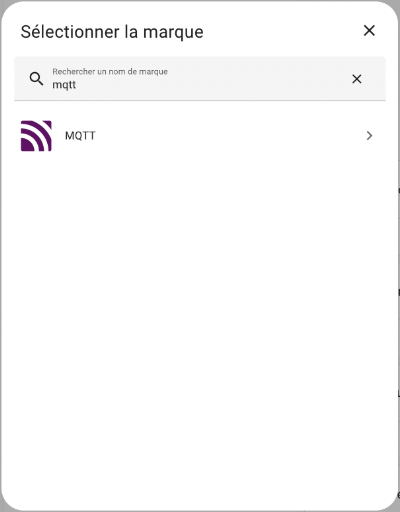
* Home Assistant vous demande ensuite de préciser ce que vous désirez ajouter. Choisissez MQTT.

  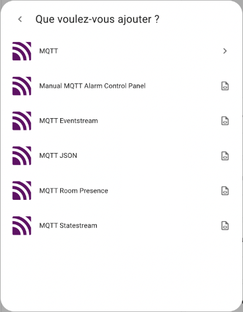
* Dans l'écran suivant, choisissez l'une des options :

  + Utiliser le module complémentaire officiel Mosquitto Mqtt Broker : pour installer un agent MQTT sur le Pi
  + Saisir manuellement les informations de connexion du courtier MQTT : pour utiliser un agent MQTT existant, qui peut être sur le Pi ou ailleurs

  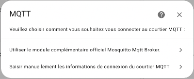

## Configuration du client MQTT (informations sur l'agent à utiliser)

La configuration du client MQTT consiste principalement à indiquer les coordonnées de l'agent MQTT à utiliser.

Les configurations du client MQTT seront enregistrées dans le fichier /mnt/data/supervisor/homeassistant/.storage/core.config\_entries.

Une fois le client correctement configuré, Home Assistant pourra publier sur des canaux et à s'abonner à d'autres canaux sur ce même agent.

Il est possible en tout temps de modifier les configurations du client MQTT. Rendez-vous dans le menu Paramètres / Appareils et services / Clic sur la tuile MQTT / Clic sur les trois points verticaux / Reconfigurer.

### Agent test.mosquitto.org

Pendant le processus d'installation du client MQTT, vous devez préciser si vous souhaitez travailler avec un agent MQTT installé sur le même Raspberry Pi que Home Assistant ou utiliser un agent MQTT externe.

Pour travailler avec l'agent test.mosquitto.org, choisissez Saisir manuellement les informations de connexion du courtier MQTT.

Avec l'agent test.mosquitto.org, il n'y a pas de code d'usager ni de mot de passe à fournir.

Il ne faut pas oublier que toutes les informations publiées sur test.mosquitto.org sont publiques donc il ne faut utiliser cet agent que pour faire des tests avec des données non sensibles.

Remarquez que dans cet exemple, le port 1883 est utilisé pour les communications non cryptées.

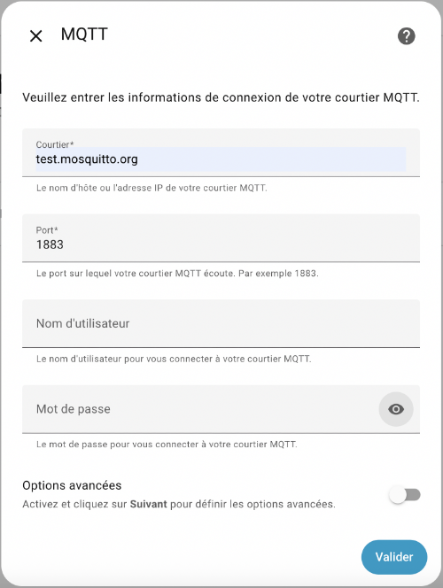

Notez que puisque l'agent test.mosquitto.org est un agent de test, il n'y a pas de garantie qu'il fonctionne correctement en tout temps.

De plus, il est possible qu'il limite le nombre de connexions en provenance d'une même adresse IP publique (toutes les boîtes domotiques de la classe ont la même adresse IP publique).

Si vous obtenez le message « �?chec de connexion », assurez-vous que vous avez bien écrit l'URL de l'agent puis réessayez.

Si cela ne fonctionne toujours pas, il faudra qu'une autre personne de la classe referme sa connexions pour que vous y ayez accès.

Parfois, c'est l'agent qui est temporairement non disponible. Il faut alors réessayer plus tard. Notez qu'il peut arriver que l'agent ne soit pas disponible pendant plusieurs heures.

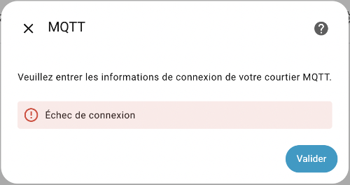

### Agent installé localement

Pour installer un agent MQTT sur le même Raspberry Pi que Home Assistant, vous pouvez cliquer sur Utiliser le module complémentaire officiel Mosquitto Mqtt Broker lors de l'installation du client. L'agent sera alors installé en même temps que le client.

Vous pouvez alors modifier les configurations de l'agent en vous rendant dans le menu Paramètres / Appareils et services / Clic sur la tuile MQTT / Clic sur les trois points verticaux / Reconfigurer.

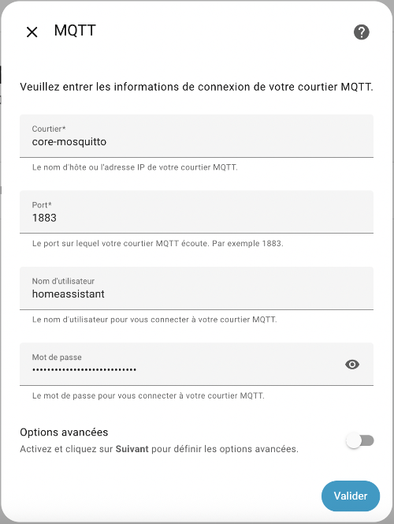

Avec ce type d'installation, un autre système pourra utiliser cet agent à l'aide de ces informations :

* courtier : adresse IP du Pi sans le port (ex : 192.168.1.145)
* code d'usager : homeassistant
* Mot de passe : voir la section suivante.

#### Mot de passe de l'agent MQTT sur Home Assistant

Dans l'écran de configuration de l'agent MQTT, si vous cliquez sur l'icône pour voir le mot de passe, vous verrez apparaître \_\_\*\*password\_not\_changed\*\*\_\_.

Pour retrouver le mot de passe, vous devez consulter le fichier /mnt/data/supervisor/homeassistant/.storage/core.config\_entries).

Fichier /mnt/data/supervisor/homeassistant/.storage/core.config\_entries

...{"broker":"core-mosquitto","discovery":true,"password":"Ath4Goh4Ierai0ahWaeSiejeaquat8ailohk7raiyoo4xeeLe6TooKo8aejo3sha","port":1883,"username":"homeassistant"} ...

Il est également possible de modifier le code d'usager et son mot de passe comme suit :

* Créez une nouvelle personne dans Home Assistant.
* Configurez cette personne pour qu'elle soit autorisée à se connecter puis choisissez son mot de passe.
* Le nom de cette personne et son mot de passe pourront être utilisés par un client pour se connecter à l'agent MQTT installé sur votre Home Assistant.

#### Installer un agent après-coup ou reconfigurer l'agent local

Si vous avez installé votre client MQTT en cliquant sur Saisir manuellement les informations de connexion du courtier MQTT, aucun agent n'aura été installé sur votre Home Assistant.

Il est possible d'ajouter un agent après que l'installation du client ait été complétée.

Cette technique permet également de remettre les configurations en place si vous avez utilisé un autre agent MQTT et que vous désirez revenir à l'agent installé sur votre Home Assistant.

* Rendez-vous dans le menu Paramètres / Appareils et services / Clic sur la tuile MQTT / Clic sur les trois points verticaux / Supprimer.
* Cliquez sur Ajouter un service.
* SélectionnezUtiliser le module complémentaire officiel Mosquitto Mqtt Broker.
* L'agent MQTT est maintenant installé et configuré.

### Agent installé sur un second ordinateur

L'agent MQTT à utiliser peut être installé n'importe où, en autant que votre boîte domotique y ait accès.

Dans cet exemple, l'agent est installé sur un second Raspberry Pi ou sur tout autre ordinateur.

Pour savoir si Home Assistant peut accéder à cet agent, il suffit de faire un ping vers son adresse IP.

## Utilisation d'une connexion sécurisée

Afin de sécuriser la communication, il faut utiliser le port 8883.

Il faut alors activer les options avancées puis configurer le certificat TLS.

Pour plus d'information : <https://www.home-assistant.io/integrations/mqtt/#advanced-broker-configuration>

## Tester MQTT

Avant d'automatiser les publications MQTT, c'est une bonne idée de tester vos configurations.

* Rendez-vous dans le menu Paramètres / Appareils et services / onglet Intégrations.
* Cliquez sur la tuile du client MQTT.
* Cliquez sur l'icône d'engrenage.

Cet écran vous permet de publier un paquet ou d'écouter un sujet.

### Publier un paquet

Pour publier un paquet, il suffit d'entrer le nom du canal désiré dans la zone Sujet puis d'entrer la valeur à publier.

Les valeurs publiées pourront être utilisées par un autre système au même titre que si la publication avait été faite à l'aide d'une automatisation, par exemple.

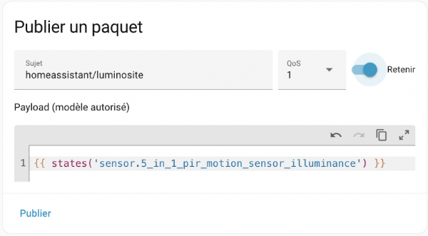

Attention : si vous ajoutez un saut de ligne, ce saut de ligne fera partie de la valeur envoyée.

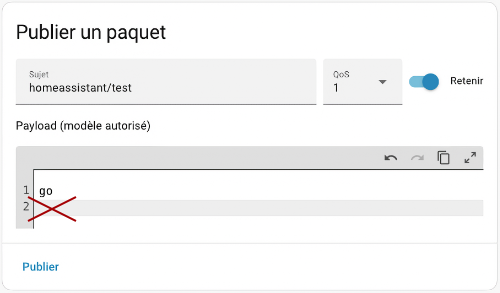 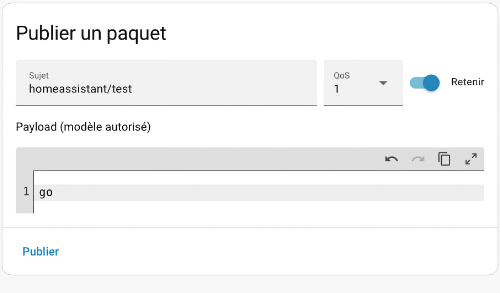

### �?couter un sujet

Ici, vous pouvez écouter un sujet pour vérifier si vos configurations sont correctes.

Ceci est utile seulement pour tester MQTT.   
  
Avec cette technique, si votre boîte Home Assistant est redémarrée, elle ne réagira plus aux messages reçus sur ce canal.   
  
Pour un vrai abonnement MQTT, il faut utiliser la [apical\_lien\_interne][publication\_et\_abonnement\_mqtt\_avec\_home\_assistant,technique officielle,abonnement][/apical\_lien\_interne].

Dans la zone �?couter un sujet, entrez le nom du canal désiré.

Cliquez sur Commencer à écouter.

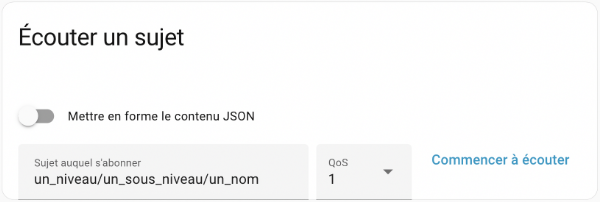

Dès qu'une information est publiée sur ce canal, elle apparaîtra au bas de l'écran.

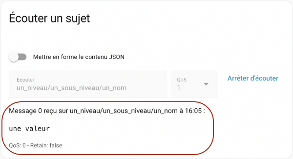

### Caractères génériques

Si vous désirez écouter tout ce qui se publie sur un canal, peu importe les sous-niveaux, vous pouvez utiliser un #.

Par exemple, pour écouter tout ce qui se dit sur le canal jeedom, peu importe les sous-niveaux, vous écouterez le canal jeedom/#.

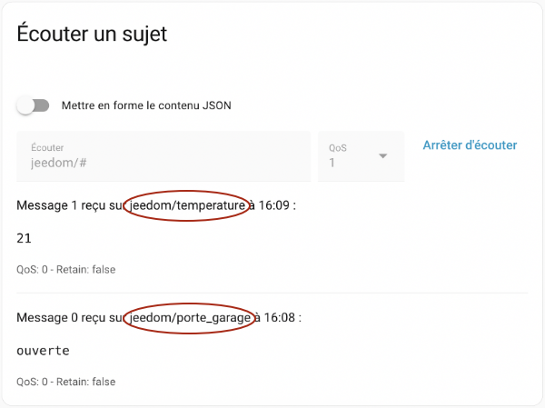


Les techniques pour utiliser le client MQTT sont détaillées dans la fiche « [apical\_lien\_interne]publication\_et\_abonnement\_mqtt\_avec\_home\_assistant[/apical\_lien\_interne] ».

## 328 — 7.4 Publication et abonnement MQTT avec Home Assistant

Une fois que vous avez [apical\_lien\_interne][client\_mqtt\_dans\_home\_assistant,installé un client MQTT][/apical\_lien\_interne] sur Home Assistant et que vous avez configuré l'agent MQTT à utiliser, vous pouvez débuter le processus de publication et d'abonnement MQTT.

Dans cette fiche :

* [Publication sur un canal](999_999_merged.md#publication)
* [Abonnement à un canal](999_999_merged.md#abonnement)
* [Affichage de l'information reçue](999_999_merged.md#carte)
* [Déclencheur d'une automatisation](#declencheur)


Home Assistant peut publier de l'information sur un canal à l'aide de l'action [mqtt.publish](https://www.home-assistant.io/integrations/mqtt#action-mqttpublish).

Cette action peut être utilisée dans vos automatisations au même titre que n'importe quelle autre action.

Il est également possible de la tester à l'aide du menu Outils développement / Actions.

Vous devrez spécifier ces informations :

* Sujet (Topic) : nom du canal
* Charge utile (Payload) : information à publier codée en dur ou [apical\_lien\_interne][les\_modeles\_dans\_home\_assistant,à l'aide d'un modèle][/apical\_lien\_interne].

  Dans le fichier automation.yaml, lorsque vous utilisez un modèle, n'oubliez pas les apostrophes ou guillemets alentour du modèle.

  Les apostrophes ou guillemets ne sont pas requis quand on travaille avec l'interface graphique.

  Modèle

  payload: '{{ states(''sensor.5\_in\_1\_pir\_motion\_sensor\_illuminance'') }}'

  Dans le fichier automation.yaml ou dans l'interface graphique, lorsque les données sont publiées [apical\_lien\_interne][format\_json\_dans\_un\_modele,au format JSON][/apical\_lien\_interne], il ne faut pas entourer le modèle de guillemets ou d'apostrophes (dans cet exemple, il n'y a pas de guillemets alentour de state\_attr('domaine.identifiant\_objet', 'attribut1')).

  Modèle

    
  {{ valeurs | to\_json }}
* QoS : [apical\_lien\_interne][mqtt,Qualité du service,qos][/apical\_lien\_interne]
* Retenir (Retain) : Activez cette option pour que le message soit [apical\_lien\_interne][mqtt,retenu,retain][/apical\_lien\_interne].

  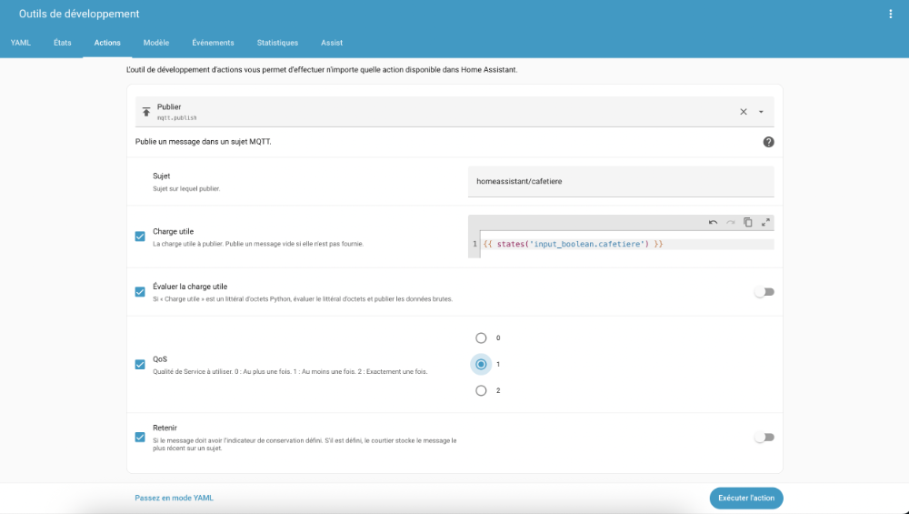

Une fois l'information publiée, il faut qu'il y ait un abonné sur ce canal pour vérifier si tout a fonctionné.

Généralement, l'abonné ne sera pas Home Assistant lui-même car ceci serait inutile. Il pourrait s'agir parr exemple d'une autre boîte domotique.

## Abonnement à un canal

Home Assistant peut s'abonner à un canal afin de connaître la valeur de la dernière charge utile publiée sur ce canal. Une entité est créée lors de l'abonnement, ce qui ouvre la porte à de nombreuses possibilités.

Pour abonner Home Assistant à un canal, il faut entrer une configuration dans le fichier configuration.yaml.

Fichier configuration.yaml

mqtt:  
  sensor:  
    - name: "nom de l'équipement"  
      state\_topic: "un\_niveau/un\_sous\_niveau/un\_nom"

Attention : cette syntaxe est obsolète :

Fichier configuration.yaml

sensor:  
  - platform: mqtt  
    name: "nom de l'équipement"  
    state\_topic: "un\_niveau/un\_sous\_niveau/un\_nom"

## Entité créée

L'abonnement à un canal crée un nouvel équipement qui contient une entité pour donner accès à la dernière valeur reçue.

L'attribut name sera utilisé pour générer l'identifiant de l'entité. Home Assistant remplacera les espaces par des barres de soulignement et les caractères spéciaux par leur équivalent dans les caractères de base. Ainsi, « nom de l'équipement » sera utilisé pour créer l'entité sensor.nom\_de\_l\_equipement.

Dans cette impression d'écran, l'entité a été utilisée pour afficher sur le tableau de bord la dernière valeur reçue sur ce canal.

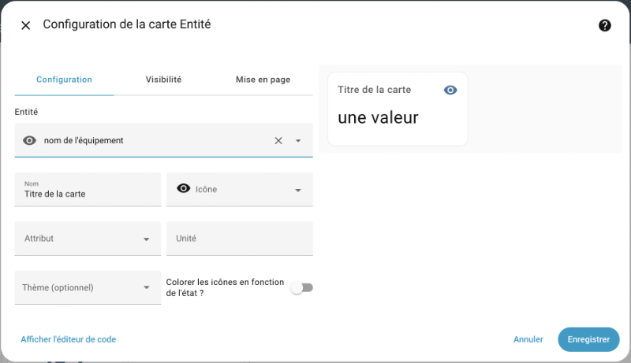


Pour qu'une automatisation soit déclenchée quand un message MQTT est reçu, le plus facile consiste à utiliser l'entité créée lors de l'abonnement au canal MQTT.

Lors de l'ajout du déclencheur, on choisira Entité / �?tat ou Entité / �?tat numérique selon les besoins de l'automatisation.

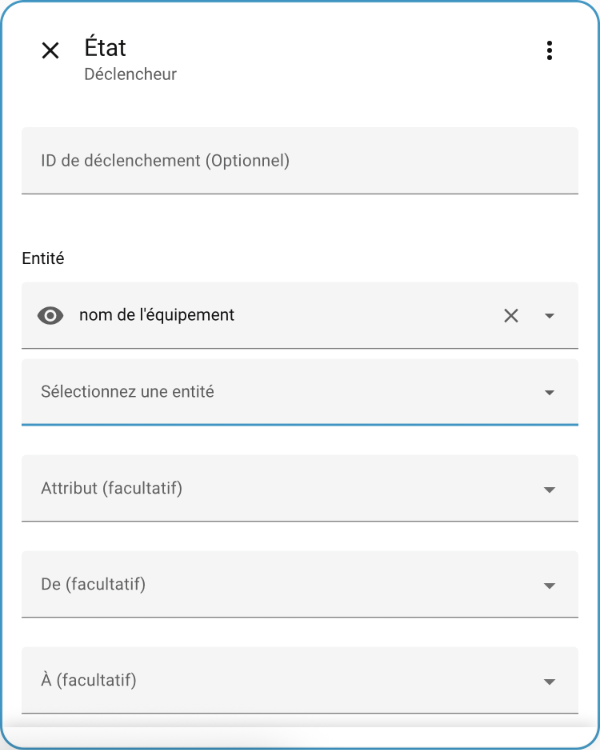

Cette entité pourra être utilisée comme n'importe quelle autre entité pour :

* déclencher l'automatisation dès que sa valeur change (Entité / �?tat puis ne rien inscrire dans la zone De: ni dans dans la zone �?:)
* déclencher l'automatisation quand sa valeur est égale à quelque chose (Entité / �?tat puis inscrire la valeur dans la zone �?:)
* déclencher l'automatisation quand sa valeur est entre deux valeurs (Entité / �?tat numérique puis préciser les limites inférieure et supérieure)
* etc.

Autre technique : configurer le déclencheur avec Autres déclencheurs / MQTT.

Vous pourrez alors choisir le sujet (le canal) à écouter et, au besoin, ne réagir que lorsque la charge utile (la valeur reçue) est égale à une valeur donnée.

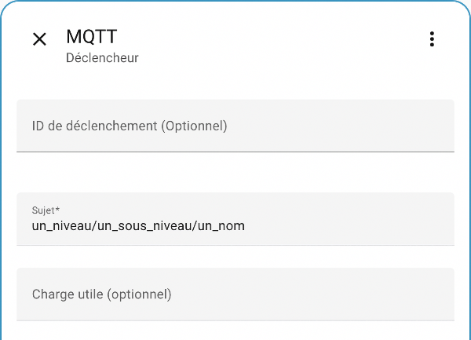

<!-- --- split --- -->




Dans cet exercice, vous devez travailler deux par deux. Chacun de vous utilisera sa boîte Home Assistant.

Vous aurez des manipulations à faire sur les deux boîtes domotiques mais vous ferez chaque manipulation ensemble pour vous assurer de bien comprendre les deux côtés de la médaille.

1. [apical\_lien\_interne][client\_mqtt\_dans\_home\_assistant,Installez un client MQTT sur une des boîtes Home Assistant][/apical\_lien\_interne] en utilisant l'option Utiliser le module complémentaire officiel Mosquitto Mqtt Broker afin d'installer également un agent MQTT. Dans le reste de l'exercice, cette boîte s'appellera boîte A.
2. Dans l'autre boîte, installez un client MQTT en utilisant l'option Saisir manuellement les informations de connexion du courtier MQTT. Effectuez les configurations requises pour utiliser l'agent MQTT de la première boîte Home Assistant. Dans le reste de l'exercice, cette boîte s'appellera boîte B.
3. Assurez-vous d'avoir un capteur réel et un capteur virtuel dans chacune des boîtes Home Assistant.
4. Testons les possibilités de publication et d'abonnement.
   1. Dans la boîte A, [apical\_lien\_interne][client\_mqtt\_dans\_home\_assistant,testez votre installation pour publier un mot de votre choix,publier][/apical\_lien\_interne] sur un canal au format mon\_nom/premier\_test.
   2. Dans la boîte B, [apical\_lien\_interne][client\_mqtt\_dans\_home\_assistant,faites un test pour savoir si vous êtes capables de recevoir des données MQTT sur le canal utilisé,tester][/apical\_lien\_interne].
   3. Testons l'inverse. Dans la boîte B, publiez un mot de votre choix sur un canal au format mon\_nom/second\_test.
   4. Dans la boîte A, faites un test pour être capable de recevoir ce mot.
5. Refaites les tests mais en utilisant l'agent test.mosquitto.org.
6. �? l'aide de l'agent MQTT local installé sur la boîte A ou de l'agent test.mosquitto.org, vous devez contrôler un récepteur distant.
   1. Dans la boîte A, faites en sorte que [apical\_lien\_interne][publication\_et\_abonnement\_mqtt\_avec\_home\_assistant,dès qu'une valeur est reçue sur le canal de votre choix,abonnement][/apical\_lien\_interne], une lumière virtuelle s'allume si la valeur est 1. La lumière s'éteindra si la valeur est 0.
   2. Dans la boîte B, envoyez via MQTT la valeur 0 ou 1 pour contrôler la lumière virtuelle de la boîte A.
7. Vous devez maintenant afficher la valeur d'un capteur distant.
   1. Dans la boîte B, faites afficher dans le tableau de bord la valeur du capteur réel de la boîte A de même que celle de son capteur virtuel.
   2. Important : ceci n'est pas un test pour savoir si MQTT fonctionne. La boîte B doit être abonnée au canal sur lequel la boîte A publie la valeur de son capteur. La boîte B doit donc ajouter une entrée dans le fichier configuration.yaml.
   3. Le but est que la valeur soit modifiée dans la boîte B dès que la valeur change dans la boîte A. La boîte A a donc du travail à faire pour automatiser le processus.
   4. Modifiez ces valeurs dans la boîte A (ex : mettez la main sur le capteur de luminosité ou modifiez à la main la valeur d'un virtuel) et vérifiez que les modifications sont effectives dans la boîte B.
   5. Vous devez maintenant faire l'inverse : faire afficher dans la boîte A la valeur des appareils branchés sur la boîte B.
8. Pour ce dernier numéro, vous n'avez pas besoin d'être en équipe de deux. Votre professeur dispose d'un agent MQTT que vous devez utiliser avec votre Home Assistant pour effectuer une opération sur un autre système domotique qui est en la possession de votre professeur. 
   * Les coordonnées de l'agent MQTT vous seront données en classe.
   * Ce que vous devez faire :
     + Vous devez allumer la lumière intelligente branchée à la boîte domotique de votre prof en envoyant la charge utile on sur le canal exercice22/9 où 9 représente le numéro de votre Raspberry Pi.
     + Pour refermer la lumière : la charge utile sera off.
     + Après chaque opération, écoutez sur le canal exercice22/reponse/9 pour recevoir la réponse de la boîte domotique sur laquelle l'ampoule est connectée.

<!-- --- split --- -->

# 329 — 9. Pour le prochain cours


Vous disposez d'un cours pour acquérir les connaissances théoriques et finaliser cet exercice.

Une fois cet exercice complété, vous devez effectuer vos lectures pour l'exercice suivant.

