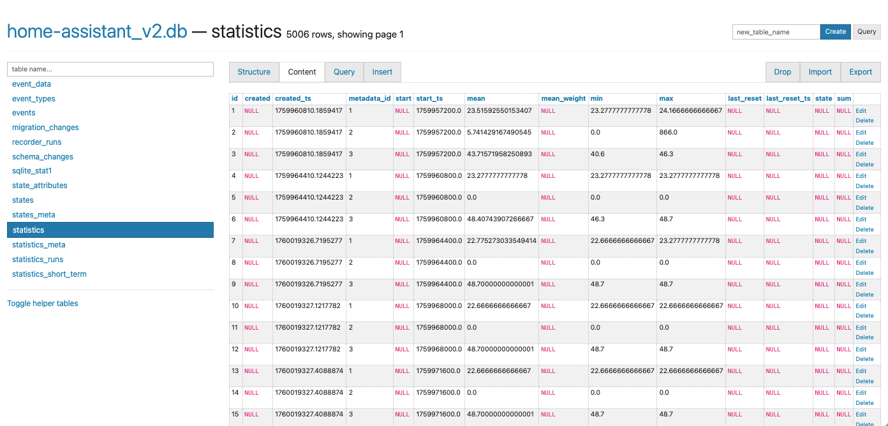
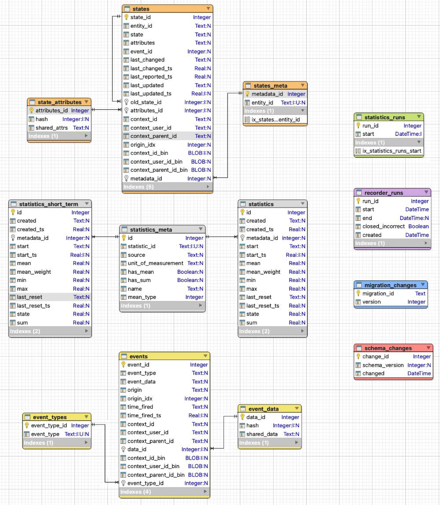
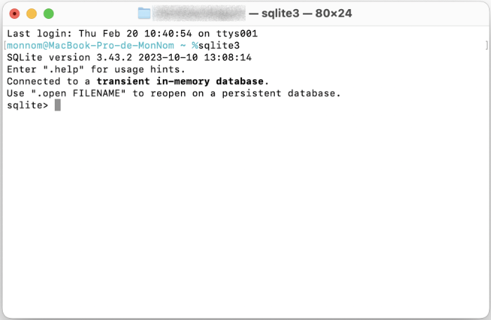
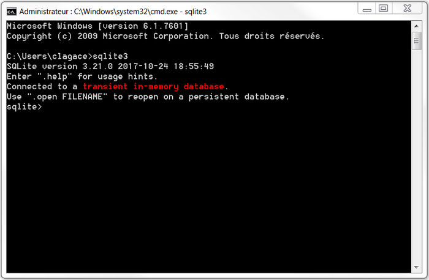
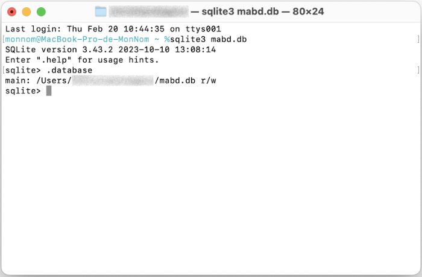
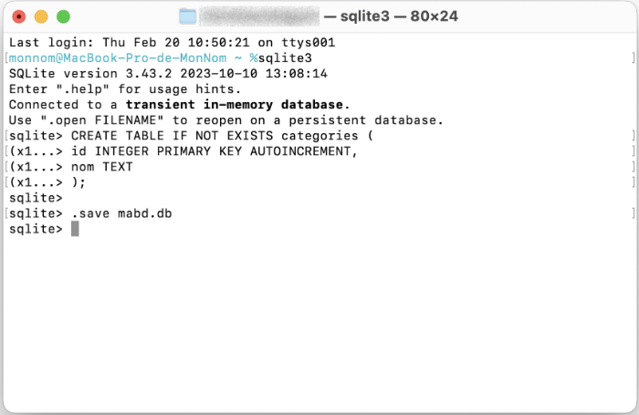

# 92. SQLite {#chapitre-sqlite}

## 92.1 En résumé... {#fiche-en_resume_041}

Voici un résumé des informations essentielles du ou des prochains chapitres.

Notez que certaines fiches, qui font partie intégrante du cours, pourraient ne pas figurer dans ce résumé.

Je vous recommande d'effectuer une lecture de l'ensemble des fiches de ces chapitres afin de bien saisir les enjeux.

## Qu\_est-ce\_que\_SQLite

SQLite est un SGBD relationnel léger conçu spécifiquement pour le stockage local de données. Il ne nécessite pas l'installation d'un serveur de base de données.

Il est moins puissant que d'autres SGBDR comme MySQL mais il a tout ce qu'il faut pour gérer les données d'une application native. Il est très utilisé avec les applications Android et iOS.

Une base de données est constituée d'un simple fichier stocké localement. Il a souvent l'extension .db mais ceci n'est pas obligatoire.

SQLite est installé nativement sur macOS. Sous Windows, il faut procéder à son installation.

## La\_ligne\_de\_commande\_SQLite

Pour lancer la ligne de commande SQLite :

Terminal

sqlite3

Il est désormais possible d'entrer des commandes à l'invite sqlite>.

Pour se brancher à une base de données :

Terminal

sqlite3 \chemin\mabd.db

On peut ensuite entrer la plupart des requêtes SQL habituelles.

Ligne de commande SQLite

SELECT id, nomfamille, prenom FROM etudiants WHERE naissance < date('2002-10-01');

La ligne de commande SQLite offre quelques fonctionnalités spécifiques avec des commandes qui débutent par un point.

Par exemple, pour lister les tables de la base de données active :

Ligne de commande SQLite

.tables

Pour sortir de la ligne de commande SQLite :

Ligne de commande SQLite

.exit

## contenu\_de\_la\_base\_de\_donnees\_de\_home\_assistant

Home Assistant utilise par défaut une base de données SQLite. Elle est contenue dans le fichier /mnt/data/supervisor/homeassistant/home-assistant\_v2.db.

Elle peut être explorée via l'interface Web de Home Assistant grâce au module complémentaire SQLite Web.

Voici une représentation graphique de ses tables.

.

## 92.2 Qu'est-ce que SQLite ? {#fiche-Qu_est-ce_que_SQLite}

SQLite est un SGBD relationnel léger conçu spécifiquement pour le stockage local de données. Il ne nécessite pas l'installation d'un serveur de base de données.

SQLite fonctionne dans différents environnements, notamment Linux, Windows, macOS, Android et iOS.

Ce petit SGBD, créé en 2000 par D. Richard Hipp, est à code source ouvert. La version actuelle, SQLite 3.X, a été publiée en 2004.

Selon [Wikipédia](https://fr.wikipedia.org/wiki/SQLite) :

> SQLite est le moteur de base de données le plus utilisé au monde, grâce à son utilisation dans de nombreux logiciels grand public comme Firefox, Skype, Google Gears, dans certains produits d'Apple, d'Adobe et de McAfee et dans les bibliothèques standards de nombreux langages comme PHP ou Python. De par son extrême légèreté (moins de 300 Ko), il est également très populaire sur les systèmes embarqués, notamment sur la plupart des smartphones modernes : l'iPhone ainsi que les systèmes d'exploitation mobiles Symbian et Android l'utilisent comme base de données embarquée. Au total, on peut dénombrer plus d'un milliard de copies connues et déclarées de la bibliothèque.

Saviez-vous que Google Chrome utilise SQLite pour stocker les cookies?

Si vous voulez voir les données brutes de ces cookies sur votre ordinateur, rendez-vous dans le dossier C:\Users\votrenom\AppData\Local\Google\Chrome\User Data\Default (Windows) ou /Users/votrenom/Library/Application Support/Google/Chrome/Default (Mac).

Le fichier se nomme Cookies.

Vous pourrez l'ouvrir à la ligne de commande SQLite ou dans votre éditeur graphique SQLite préféré.

## Forces et limitations

Moins puissant que d'autres SGBDR comme MySQL ou MS SQL, SQLite supporte néanmoins de nombreuses fonctionnalités :

* jointures internes et externes
* requêtes imbriquées
* transactions
* contraintes d'intégrité référentielle
* fonctions d'aggrégation
* etc.

Parmi ses limites, notons :

* ne supporte que quatre types de données : INTEGER, REAL, TEXT, BLOB (dans les faits, les types de données sont dynamiques et tout est stocké à l'interne en tant que texte), mais est-ce que c'est vraiment une limite ?
* ne supporte pas les jointures externes vers la droite (RIGHT OUTER JOIN)
* ne supporte pas les procédures et fonctions stockées
* possibilités de modification d'une table avec ALTER TABLE limitées
* gestion des droits d'accès aux données limitée aux droits conférés par le système d'exploitation au fichier de la base de données
* etc.

## Dans quels types d'applications est-ce que je peux utiliser SQLite ?

Si vous développez une **application native**, par exemple une application mobile, une application embarquée ou une application de bureau, SQLite est un choix intéressant pour stocker des données localement.

Il n'est cependant pas adapté pour les applications Web car la plupart des navigateurs ne le supportent plus depuis 2010.

## Où sont stockées les données ?

Une base de données SQLite est en fait un simple fichier dans lequel les informations sont encodées de façon particulière. Toutes les tables et leurs données sont stockées dans ce même fichier.

Les bases de données SQLite sont locales, c'est-à-dire que leurs fichiers sont enregistrés sur le poste de l'usager ou sur son appareil mobile.

Si la base de données est utilisée par une application native, son fichier sera généralement stocké au même endroit que l'application, à moins que le développeur en ait décidé autrement.

## Pour plus d'information

« SQLite ». Wikipédia. <https://fr.wikipedia.org/wiki/SQLite>

« Appropriate Uses For SQLite ». SQLite. <https://sqlite.org/whentouse.html>

« SQLite Tutorial ». SQLite Tutorial. <http://www.sqlitetutorial.net/>

« Distinctive Features Of SQLite ». SQLite. <https://www.sqlite.org/different.html>

« Limits In SQLite ». SQLite. <https://sqlite.org/limits.html>

« SQL Features That SQLite Does Not Implement ». SQLite. <https://www.sqlite.org/omitted.html>

## 92.3 Installation de SQLite {#fiche-Installation_de_SQLite}

Pour travailler avec une base de données SQLite, il n'y a aucun serveur à installer. Tout se déroule localement.

Il faut par contre que le service et les outils pour SQLite soient installés afin que le système d'exploitation sache comment interagir avec une base de données SQLite.

## Installation sous macOS

Sous Mac, SQLite est installé de base.

Pour le vérifier :

* Ouvrez le Terminal.
  + Lancez la commande sqlite3 :

    Terminal

    sqlite3

    Vous obtiendrez l'invite SQLite.

    

    Notez que le message « Connected to a transient in-memory database » indique qu'aucune base de données n'est ouverte alors les opérations seront effectuées en mémoire vive et seront perdues lors de la fermeture de la ligne de commande.

    Pour travailler avec une vraie base de données, il faudra soit créer une nouvelle base de données, soit ouvrir une base de données existante.

    Mais pour l'instant, nous pouvons travailler en mémoire vive pour effectuer ces vérifications.
* Pour voir si SQLite fonctionne, entrez la commande suivante :

  Ligne de commande SQLite

  .database

  SQLite devrait répondre qu'il est présentement branché sur une base de données nommée main (il s'agit de la base de données en mémoire vive).
* Pour sortir de SQLite, entrez la commande suivante :

  Ligne de commande SQLite

  .exit

## Installation sous Windows

Pour installer SQLite sous Windows :

* Rendez-vous sur la page de téléchargement de SQLite (<https://www.sqlite.org/download.html>) puis, dans la section Precompiled Binaries for Windows, téléchargez les DLL pour votre système ainsi que les outils pour la ligne de commande (bundle of command-line tools).
* Créez un dossier nommé sqlite sous C: puis décompressez les fichiers directement dans ce dossier. Le dossier contiendra différents fichiers dont sqlite3.exe.
* Ajoutez C:\sqlite à votre variable d'environnement PATH :
  + D'abord, refermez vos fenêtres de commande car elles ont été ouvertes avec leur propre copie des variables d'environnement.
  + Appuyez sur les touches Windows + X pour accéder au menu Power User.
  + Sélectionnez l'option Système.
  + L'onglet À propos de sera sélectionné par défaut. Rendez-vous plus bas dans cette page et choisissez Paramètres système avancés.
  + Cliquez sur Variables d'environnement.
  + Dans la section Variables système, cliquez sur la variable Path puis sur Modifier.
  + Cliquez sur Nouveau puis ajoutez la chaîne C:\sqlite.
* Ouvrez une fenêtre de commande puis lancez la commande sqlite3. Vous obtiendrez l'invite sqlite>

  

  Notez que le message « Connected to a transient in-memory database » indique qu'aucune base de données n'est ouverte alors les opérations seront effectuées en mémoire vive et seront perdues lors de la fermeture de la ligne de commande.

  Pour travailler avec une vraie base de données, il faudra soit créer une nouvelle base de données, soit ouvrir une base de données existante.

  Mais pour l'instant, nous pouvons travailler en mémoire vive pour effectuer ces vérifications.
* Pour voir si SQLite fonctionne, entrez la commande suivante :

  Ligne de commande SQLite

  .database

  SQLite devrait répondre qu'il est présentement branché sur une base de données nommée main (il s'agit de la base de données en mémoire vive).
* Pour sortir de SQLite, entrez la commande suivante :

  Ligne de commande SQLite

  .exit

## Pour plus d'information

« SQLite - Installation ». Tutorial points. <https://www.tutorialspoint.com/sqlite/sqlite_installation.htm>

## 92.4 La ligne de commande SQLite {#fiche-La_ligne_de_commande_SQLite}

La ligne de commande SQLite est l'endroit où vous pouvez entrer les requêtes SQL pour effectuer les opérations CRUD sur vos données.

Pour lancer la ligne de commande SQLite sous Windows, vous devez d'abord installer SQLite sur votre poste de travail et faire en sorte que son dossier fasse partie du PATH).

Sous macOS et sous Linux, tout est disponible dès le départ.

* Ouvrez une fenêtre Terminal.
* Lancez la commande sqlite3.

  Terminal

  sqlite3
* Vous obtiendrez l'invite sqlite>, qui vous invite à entrer vos commandes.

  .png)

## Deux types de commandes permises

La ligne de commande SQLite permet d'entrer deux types de commandes :

* Les commandes spéciales pour la ligne de commande. Elles débutent toutes par un point (il ne faut pas qu'il y ait d'espace avant ni après le point pour que la commande fonctionne). Par exemple, .open, .show, .backup, .exit et toutes les autres commandes listées par .help. (voir [Command Line Shell For SQLite](http://tool.oschina.net/uploads/apidocs/sqlite/sqlite.html)).
* Les requêtes SQL, par exemple CREATE, SELECT, INSERT, UPDATE, DELETE. Chacune doit se terminer par un point-virgule.

Voici comment combiner ces deux types de commandes afin de vérifier la liste des tables de la base de données sélectionnée puis afficher les enregistrements de la table etudiants :

Ligne de commande SQLite

.tables

 

SELECT \* FROM etudiants;

Résultat à l'écran

sqlite> .tables  
etablissements  etudiants  
sqlite> SELECT \* FROM etudiants;

 

1|Desmarais|Louis|1178793  
2|Bourgeois|Philippe|1161295  
3|Meloche|Ariane|1182286

 

4|Gaumond|Mathieu|1121543

 

5|Rousseau|Isabelle|1119872

 

sqlite>

## Créer une nouvelle base de données {#nouvelle}

Dès l'ouverture de la ligne de commande SQLite, si le message « Connected to a transient in-memory database » apparaît, ceci indique qu'aucune base de données n'est ouverte. Si vous ne faites pas attention, les opérations seront effectuées en mémoire vive dans une base de données temporaire et seront perdues lors de la fermeture de la ligne de commande.

Pour corriger la situation, deux options s'offrent à vous :

* Créer la base de données dès le lancement de SQLite;
* Travailler dans la base de données temporaire puis l'enregistrer dans un fichier permanent avant de sortir de la ligne de commande.

### Création lors du lancement de SQLite

Lors du lancement de SQLite, dans le Terminal de votre ordinateur, vous pouvez ajouter le nom de votre nouvelle base de données à la suite de la commande sqlite3. Il est d'usage d'utiliser un nom de fichier avec l'extension .db.

La base de données sera créée si elle n'existe pas. Sinon, elle sera ouverte. Toutes les opérations effectuées par la suite s'appliqueront à cette base de données.

Terminal

sqlite3 mabd.db

À tout moment, la commande .database lancée à l'invite de commande affichera le nom de la base de données sur laquelle les opérations sont appliquées.

Attention : la base de données sera créée dans le dossier courant (celui affiché dans le Terminal avant de lancer la commande sqlite3). Si vous souhaitez la créer ailleurs, il faudra spécifier son chemin.

Terminal

sqlite3 \Users\votrenom\Documents\mabd.db

### Travail dans la base de données temporaire

Il est également possible de travailler dans la base de données temporaire puis terminer votre travail par l'instruction .save suivie du nom à donner à la base de données.

Ligne de commande SQLite

CREATE TABLE IF NOT EXISTS categories (

 

id INTEGER PRIMARY KEY AUTOINCREMENT,

 

nom TEXT

 

);

 

.save mabd.db

Ici encore, si vous désirez enregistrer le fichier ailleurs que dans le dossier courant, il faudra spécifier son chemin. Notez que l'invite de commande SQLite demande que les dossiers soient séparés par des barres obliques (/) et ce, même sous Windows.

Ligne de commande SQLite

.save /Users/votrenom/Documents/mabd.db

## Se brancher à une base de données {#existante}

Si vous avez déjà une base de données SQLite (fichier dont le nom se termine généralement par .db), il est possible de l'ouvrir de deux façons :

* lors du lancement de la ligne de commande
* à l'aide de la commande .open

### Ouverture dès le lancement de la ligne de commande

L'ajout du nom de la base de données à la suite de la commande sqlite3 permet d'ouvrir directement cette base de données.

Terminal

sqlite3 mabd.db

Si la base de données existait, elle sera ouverte. Sinon, elle sera créée. La commande .tables permettra de vérifier si la BD est vide ou non (si elle contient des tables ou non).

Ligne de commande SQLite

.tables

### Ouverture d'une base de données après coup

Si vous n'avez pas spécifié le nom de la base de données dès le lancement de la ligne de commande, il est possible de quitter le mode « transcient » en ouvrant la base de données à l'aide de la commande .open.

Ligne de commande SQLite

.open mabd.db

Encore ici, si le fichier n'est pas dans le dossier courant, il faudra spécifier son chemin.

Ligne de commande SQLite

.open /Users/votrenom/Documents/mabd.db

## Quitter la ligne de commande

Après une séance de travail, il est important de quitter correctement la ligne de commande SQLite :

Ligne de commande SQLite

.exit

## Pour plus d'information

« SQLite Tutorial ». Tutorials Point. <https://www.tutorialspoint.com/sqlite/index.htm>

« SQL As Understood By SQLite ». SQLite. <http://www.sqlite.org/lang.html>

« Command Line Shell For SQLite ». SQLite. <https://sqlite.org/cli.html>

« SQLite Commands ». SQLite tutorial. <http://www.sqlitetutorial.net/sqlite-commands/>

« Getting Started with SQLite3 – Basic Commands ». Site Point. <https://www.sitepoint.com/getting-started-sqlite3-basic-commands/>

## 92.5 Fonctions SQLite pour manipuler des nombres {#fiche-fonctions_sqlite_pour_manipuler_des_nombres}

Tout comme avec le texte, il est possible de manipuler des nombres à l'intérieur d'une requête SQLite.

| Fonction | Utilité | Exemple |
| --- | --- | --- |
| ABS | Retourne la valeur absolue d'un nombre. | SELECT ABS(valeur) FROM matable; |
| ROUND | Arrondit un nombre. | SELECT ROUND(prix) FROM articles;  ou  SELECT ROUND(total / quantite, 2) FROM matable; |

## Pour plus d'information

« SQL As Understood By SQLite - Core Functions ». SQLite. <https://www.sqlite.org/lang_corefunc.html>

## 92.6 Fonctions SQLite pour manipuler du texte {#fiche-fonctions_sqlite_pour_manipuler_du_texte}

Il est possible d'effectuer des manipulations dans du texte avant de l'afficher ou encore dans une clause WHERE.

Les principales fonctions sont résumées ici :

| Fonction | Utilité | Exemple |
| --- | --- | --- |
| INSTR | Retourne la position d'une sous-chaîne dans la chaîne. | SELECT id, nomfamille, prenom FROM clients WHERE INSTR(telephone, '819') > 0; |
| LENGTH | Retourne le nombre de caractères dans la chaîne. | SELECT \* FROM produits WHERE LENGTH(code) > 5; |
| LOWER | Transforme la chaîne en lettres minuscules. | SELECT id, LOWER(code) FROM produits; |
| REPLACE | Remplace une sous-chaîne par une autre dans la chaîne. | SELECT id, REPLACE(telephone, '(819)', '819') FROM clients; |
| SUBSTR | Retourne une partie de la chaîne. | SELECT id, SUBSTR(commentaire, 1, 10) FROM pages; |
| TRIM | Enlève des caractères au début et à la fin de la chaîne (par défaut, enlève les espaces). | SELECT id, TRIM(commentaire) FROM pages; |
| UPPER | Transforme la chaîne en lettres majuscules. | SELECT id, UPPER(code) FROM produits; |

## Pour plus d'information

« SQL As Understood By SQLite - Core Functions ». SQLite. <https://www.sqlite.org/lang_corefunc.html>

« SQLite String Functions ». SQLite Tutorial. <http://www.sqlitetutorial.net/sqlite-string-functions/>

## 92.7 Les dates avec SQLite {#fiche-les_dates_avec_sqlite}

SQLite ne gère qu'un petit nombre de types de données : INTEGER, REAL, TEXT, BLOB. Alors, pour stocker une date, quel type de données devrait être utilisé ?

Il y a différentes possibilités mais la plus intéressante consiste à utiliser le type TEXT. La date devra alors toujours être enregistrée au même format.

Le standard est d'utiliser le format aaaa-mm-jj (et non aaaa/mm/jj) puisque [certaines fonctions SQLite](https://www.sqlite.org/lang_datefunc.html) retournent des dates au format aaaa-mm-jj.

Lorsque ce standard est établi, il est possible d'utiliser une date dans une requête SELECT comme suit :

SQLite

SELECT id, nomfamille, prenom FROM etudiants WHERE naissance < date('2002-10-01');

## Fonctions SQLite pour manipuler les dates

Voici les principales fonctions qui vous aideront dans vos manipulations de dates.

| Fonction | Utilité | Exemple |
| --- | --- | --- |
| [datetime](https://www.sqlitetutorial.net/sqlite-date-functions/sqlite-datetime-function/) | Manipule des dates incluant l'heure.  Entre autres, elle permet d'obtenir la date et l'heure actuelle. | UPDATE donnees(date\_modification) VALUES(datetime('now','localtime')); |
| [date](https://www.sqlitetutorial.net/sqlite-date-functions/sqlite-date-function/) | Manipule des dates.  Entre autres, permet de transformer une chaîne en date afin d'effectuer des calculs. | SELECT id, nomfamille, prenom FROM etudiants WHERE naissance < date('2002-10-01'); |
| julianday | Retourne le nombre de jours entre une date butoir et une date. | SELECT id, nomfamille, prenom FROM employes WHERE julianday('now') - julianday(embauche) >= 365; |

## Pour plus d'information

« SQL As Understood By SQLite - Date And Time Functions ». SQLite. <https://www.sqlite.org/lang_datefunc.html>

« SQLite Date Functions ». SQLite Tutorial. <http://www.sqlitetutorial.net/sqlite-date-functions/>

## 92.8 Autres opérations intéressantes {#fiche-Autres_operations_interessantes}

Voici une série de commandes pouvant être réalisées à la ligne de commande SQLite ou à l'aide de requêtes SQL.

Vous trouverez également dans cette liste des commandes qui peuvent être ajoutées dans un fichier nommé .sqliterc,. Sous Windows, ce fichier doit être placé dans le dossier C:\Users\monnom. Sous Mac, ce sera dans le dossier /Users/monnom.

Les commandes listées dans le fichier .sqliterc seront automatiquement exécutées lorsque vous ouvrirez la ligne de commande SQLite.

Notez que sous Windows, pour créer un fichier dont le nom débute avec un point, vous devez mettre un point avant et un point après son nom. Le point de la fin sera automatiquement effacé.

## Lister les tables de la base de données

Ligne de commande SQLite

.tables

SQLite

SELECT name FROM sqlite\_master WHERE type='table';

## Nettoyer la fenêtre de commande SQLite

Ligne de commande SQLite

.shell cls

## Formater l'affichage des données à la ligne de commande SQLite {#formater}

Ligne de commande SQLite

.mode column  
.headers on  
SELECT \* FROM *nomtable*;

Il est possible de changer .mode column par :

Ligne de commande SQLite

.mode box

Cette fois, les données apparaîtront dans un tableau.

Ces configurations sont très utiles alors il est intéressant de les ajouter au fichier .sqliterc.

Fichier .sqliterc

.mode column  
.headers on

## Ajuster la largeur de l'affichage des colonnes à la ligne de commande SQLite

Par défaut, lorsque le mode column est activé, chaque champ affiché aura une largeur correspondant à la plus grande valeur entre :

* 10
* la largeur de l'entête
* la largeur de la première ligne de données

Il est possible de modifier cet affichage à l'aide de la commande .width.

La commande .witdh prendra la forme suivante :

Syntaxe MySQL

.width *largeurcolonne1*, *largeurcolonne2*, *largeurcolonne3*, *largeurcolonne4*

Une valeur de 0 indique que la largeur doit répondre aux règles ci-haut mentionnées.

Ligne de commande SQLite

.width 0, 20

Cette commande laissera la première colonne à sa valeur par défaut et ajustera la seconde à 20 caractères. Les colonnes suivantes conserveront leur largeur actuelle.

## Afficher la requête qui permet de recréer une table

Ligne de commande SQLite

.schema *nomtable*

SQLite

SELECT sql FROM sqlite\_master WHERE type = 'table' AND tbl\_name = '*nomtable*';

## Afficher les requêtes qui permettent de recréer la table et d'y insérer les données

Ligne de commande SQLite

.dump *nomtable*