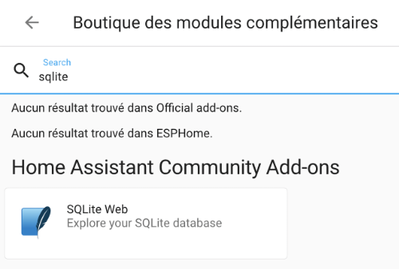
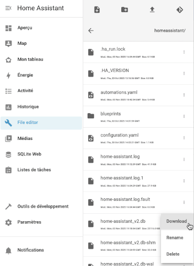

# 93. La base de données Home Assistant {#chapitre-la_base_de_donnees_home_assistant}

## 93.1 Contenu de la base de données de Home Assistant {#fiche-contenu_de_la_base_de_donnees_de_home_assistant}

Par défaut, Home Assistant utilise une base de données SQLite pour stocker les configurations de même que les données sur les capteurs.

Cette base de données est contenue dans le fichier /mnt/data/supervisor/homeassistant/home-assistant\_v2.db.

Remarquez qu'il est possible de [configurer Home Assistant pour qu'il utilise un autre système de gestion de bases de données](https://www.home-assistant.io/integrations/recorder/), par exemple MySQL ou PostgreSQL.

Dans cette fiche :

* [Explorer la base de données dans l'interface Web](https://apical.xyz/formations/pageunique/systeme_domotique_diy#web)
* [Explorer la base de données dans le terminal HassOS](https://apical.xyz/formations/pageunique/systeme_domotique_diy#hassos)
  + [Liste des tables](https://apical.xyz/formations/pageunique/systeme_domotique_diy#tables)
  + [Structure des tables](https://apical.xyz/formations/pageunique/systeme_domotique_diy#structure)
  + [Interroger les données](https://apical.xyz/formations/pageunique/systeme_domotique_diy#donnees)
* [Explorer la base de données dans le Terminal de votre ordinateur](https://apical.xyz/formations/pageunique/systeme_domotique_diy#terminal)

## Explorer la base de données dans l'interface Web {#web}

Pour explorer facilement votre base de données SQLite, vous pouvez installer le module complémentaire SQLite Web.

* Cliquez sur votre nom dans le bas de la barre latérale de gauche afin d'accéder à votre profil.
* Activez le Mode avancé.
* Rendez-vous dans le menu Paramètres / Modules complémentaires.
* Cliquez sur Boutique des modules complémentaires.
* Dans la zone de recherche, tapez sqlite.

  
* Cliquez sur la tuile SQLite Web pour lancer l'installation.
* Grâce aux onglets Structure, Content et Query, vous avez la possibilité de voir la structure des tables et leurs données et d'effectuer des requêtes SQL.

  .png)

## Explorer la base de données dans le terminal HassOS {#hassos}

Il est possible d'explorer la base de données Home Assistant directement dans le Terminal HassOS.

Terminal HassOS

# cd /mnt/data/supervisor/homeassistant/  
# sqlite3 home-assistant\_v2.db  
SQLite version 3.48.0 2025-01-14 11:05:00  
Enter ".help" for usage hints.  
sqlite>

### Liste des tables {#tables}

Utilisez la commande .tables pour obtenir la liste des tables de cette base de données.

Terminal HassOS

sqlite> .tables  
event\_data            schema\_changes       statistics\_meta   
event\_types           state\_attributes     statistics\_runs   
events                states               statistics\_short\_term  
migration\_changes     states\_meta   
recorder\_runs         statistics

### Structure des tables {#structure}

Pour connaître la structure d'une table, vous ne pouvez pas utiliser la commande SHOW CREATE TABLE bien connue sous MySQL.

Plutôt, vous devez faire ceci :

SQLite

.schema nomtable

Résultat à l'écran

sqlite> .schema statistics  
CREATE TABLE statistics (  
  id INTEGER NOT NULL,    
  created CHAR(0),  
  created\_ts FLOAT,  
  metadata\_id INTEGER,  
  start CHAR(0),  
  start\_ts FLOAT,  
  mean FLOAT,  
  mean\_weight FLOAT,  
  min FLOAT,  
  max FLOAT,  
  last\_reset CHAR(0),  
  last\_reset\_ts FLOAT,  
  state FLOAT,  
  sum FLOAT,  
  PRIMARY KEY (id),  
  FOREIGN KEY(metadata\_id) REFERENCES statistics\_meta (id) ON DELETE CASCADE  
);  
CREATE INDEX ix\_statistics\_start\_ts ON statistics (start\_ts);  
CREATE UNIQUE INDEX ix\_statistics\_statistic\_id\_start\_ts ON statistics (metadata\_id, start\_ts);  
sqlite>

Pour connaître la structure de toutes les tables :

SQLite

SELECT sql FROM sqlite\_master;

Je vous présente la structure des tables sous forme graphique.

Pour produire ce diagramme, j'ai ouvert la base de données dans <a href="fiche-generer\_un\_schema\_de\_la\_base\_de\_donnees\_avec\_valentina\_studio.md#generer\_un\_schema\_de\_la\_base\_de\_donnees\_avec\_valentina\_studio">Valentina Studio</a> après l'avoir [téléversée sur mon poste de travail](https://apical.xyz/formations/pageunique/systeme_domotique_diy#terminal).

### Interroger les données {#donnees}

À partir d'ici, il est possible d'afficher le contenu des différentes tables. Mais avant, il est intéressant d'effectuer deux petites configurations pour améliorer le rendu.

SQLite

.mode column  
.headers on

Et pour voir le contenu d'une table :

SQLite

sqlite> SELECT \* FROM statistics\_meta;  
id   statistic\_id                                   source     unit\_of\_measurement  has\_mean   has\_sum  
--   --------------------------------------------   --------   -------------------  --------   -------  
1    sensor.node\_14\_battery\_level                   recorder   %                    1          0   
2    sensor.dome\_door\_window\_sensor\_battery\_level   recorder   %                    1          0   
3    sensor.neo\_capteur\_5\_en\_1\_illuminance          recorder   Lux                  1          0   
4    sensor.porte\_dentree\_battery\_level             recorder   %                    1          0   
5    sensor.node\_16\_humidity                        recorder   %                    1          0   
6    sensor.node\_16\_air\_temperature                 recorder   °C                   1          0

Si vous préférez, vous pouvez remplacer .mode column par :

SQLite

.mode box

Cette fois, les données appararaîtront dans un tableau.

SQLite

sqlite> SELECT \* FROM statistics\_meta;  
┌────┬──────────────────────────────────────────────┬──────────┬─────────────────────┬──────────┬─────────┐  
│ id │ statistic\_id                                 │ source   │ unit\_of\_measurement │ has\_mean │ has\_sum │  
├────┼──────────────────────────────────────────────┼──────────┼─────────────────────┼──────────┼─────────┤  
│ 1  │ sensor.node\_14\_battery\_level                 │ recorder │ %                   │ 1        │ 0       │  
│ 2  │ sensor.dome\_door\_window\_sensor\_battery\_level │ recorder │ %                   │ 1        │ 0       │  
│ 3  │ sensor.neo\_capteur\_5\_en\_1\_illuminance        │ recorder │ Lux                 │ 1        │ 0       │  
│ 4  │ sensor.porte\_dentree\_battery\_level           │ recorder │ %                   │ 1        │ 0       │  
│ 5  │ sensor.node\_16\_humidity                      │ recorder │ %                   │ 1        │ 0       │  
│ 6  │ sensor.node\_16\_air\_temperature               │ recorder │ °C                  │ 1        │ 0       │  
└────┴──────────────────────────────────────────────┴──────────┴─────────────────────┴──────────┴─────────┘

## Explorer la base de données dans le Terminal de votre ordinateur {#terminal}

Si vous préférez, il est possible de l'explorer dans la fenêtre Terminal de votre ordinateur. Vous devrez pour cela en télécharger une copie.

Je vous propose deux techniques pour y arriver :

* À partir de la commande scp :

  Terminal de l'ordinateur

  scp -O -P 22222 root@192.168.1.145:/mnt/data/supervisor/homeassistant/home-assistant\_v2.db /chemin/local
* À partir du <a href="fiche-travailler\_avec\_le\_module\_complementaire\_file\_editor.md#travailler\_avec\_le\_module\_complementaire\_file\_editor">module complémentaire File Editor</a> : cliquez sur l'enveloppe puis retrouvez le fichier home-assistant\_v2.db, directement dans le <a href="fiche-dossier\_config.md#dossier\_config">dossier config</a>. Un clic sur les trois points verticaux vous permettra de télécharger le fichier.

  

Sur votre poste de travail, <a href="fiche-Installation\_de\_SQLite.md#Installation\_de\_SQLite">assurez-vous que SQLite soit installé</a>.

Dans une fenêtre Terminal, entrez la commande sqlite3 suivie du chemin complet de la base de données (là où vous l'avez téléchargée).

Terminal

sqlite3 chemin/home-assistant\_v2.db

Résultat à l'écran

monnom@MacBook-Pro-de-MonNom ~ %sqlite3 /Users/monnom/Downloads/home-assistant\_v2.db  
SQLite version 3.43.2 2023-10-10 13:08:14  
Enter ".help" for usage hints.  
sqlite>

À partir d'ici, vous pouvez effectuer les mêmes opérations que démontré plus haut.

## Pour plus d'information {#motdepasse}

« Database ». Home Assistant. <https://www.home-assistant.io/docs/backend/database/>

« Data ». Home assistant. <https://data.home-assistant.io/docs/data>