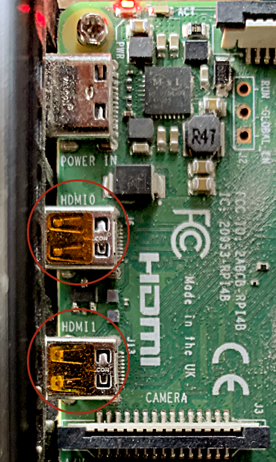

# 119. Divers Linux et Raspberry Pi

## 119.1 Installation de Raspberry Pi OS manuellement

Raspberry Pi OS, connu autrefois sous le nom Raspbian, peut être installé :

* Avec <a href="fiche-raspberry_pi_imager.md#raspberry_pi_imager">Raspberry Pi Imager</a>   
  ou
* À la ligne de commande

Les deux techniques sont équivalentes, à vous de choisir celle qui vous convient.

Je vous explique ici comment travailler à la ligne de commande pour installer Raspberry Pi OS, que ce soit la version avec interface graphique (with desktop) ou sans (lite).

* Téléchargez Raspberry Pi OS ici : <https://www.raspberrypi.org/downloads/raspberry-pi-os/>. Prenez soin de choisir la version qui correspond à vos besoins. Généralement, si vous souhaitez utiliser le Raspberry Pi comme serveur, par exemple <a href="fiche-qu_est-ce_qu_un_systeme_domotique.md#qu_est-ce_qu_un_systeme_domotique">dans un système domotique</a>, la version lite est préférable.
* Décompressez le contenu du fichier zip sur votre ordinateur. Vous obtiendrez un fichier .img.
* Insérez la carte micro SD dans votre ordinateur.
* Il faut maintenant copier l'image sur la carte micro SD. On dira flasher l'image sur la carte.  
  + Sous Mac ou Linux, l'image peut être flashée à l'aide de la commande dd sans avoir à faire d'installation supplémentaire.

    Les commandes pour copier l'image sur la carte sont les suivantes (version Mac).

    Prenez soin d'ajuster le nom du fichier .img et de remplacer le N par le chiffre qui correspond au point de montage (pour connaître le point de montage sous Mac : diskutil list).

    Dans cet exemple, j'ai utilisé le fichier .img pour une installation Lite.

    Terminal

    diskutil unmountDisk /dev/diskN

     

    sudo dd bs=1m if=*chemin*/2021-03-04-raspios-buster-armhf-lite.img of=/dev/rdiskN conv=sync

    Note : sous Mac, pour copier facilement le chemin du fichier .img, vous pouvez utiliser cette technique : <a href="fiche-copier_le_chemin_d_un_fichier.md#copier_le_chemin_d_un_fichier">copier_le_chemin_d_un_fichier</a>.

    Si vous voulez en savoir plus, les instructions détaillées sur la commande dd sont données ici : <a href="fiche-copie_integrale_d_un_disque_avec_la_commande_dd.md#copie_integrale_d_un_disque_avec_la_commande_dd">copie_integrale_d_un_disque_avec_la_commande_dd</a>.
  + Il est également possible de flasher l'image sur la carte à l'aide d'un utilitaire graphique, par exemple [Etcher](https://www.balena.io/etcher/). Cet utilitaire peut être utilisé sous Mac, Linux ou Windows.

La carte micro SD est maintenant prête à être insérée dans le Raspberry Pi. Mais avant, vous voudrez peut-être effectuer quelques configurations directement sur la carte afin d'éviter d'avoir à brancher un écran et un clavier sur le Pi , ce qui vous permettra de réaliser une installation dite headless (littéralement : sans tête).

Vous pouvez donc, si vous le désirez, réaliser les configurations qui suivent AVANT d'insérer la carte dans le Pi :

* <a href="fiche-configurer_le_reseau_wi-fi_sur_le_raspberry_pi.md#configurer_le_reseau_wi-fi_sur_le_raspberry_pi">Configurer le réseau sans fil</a>
* <a href="fiche-activer_ssh_sur_le_raspberry_pi.md#activer_ssh_sur_le_raspberry_pi">Activer SSH</a>
* <a href="fiche-permettre_l_utilisation_d_un_ecran_directement_sur_le_pi.md#permettre_l_utilisation_d_un_ecran_directement_sur_le_pi">Permettre l'utilisation d'un écran directement sur le Pi</a>
* <a href="fiche-donner_une_adresse_ip_statique_au_raspberry_pi.md#donner_une_adresse_ip_statique_au_raspberry_pi">Donner une adresse IP statique au Pi</a>

Une fois les configurations désirées complétées, <a href="fiche-retirer_un_disque_amovible_de_facon_securitaire.md#retirer_un_disque_amovible_de_facon_securitaire">retirez la carte de l'ordinateur de façon sécuritaire</a>, insérez-la dans le Pi puis démarrez ce dernier.

Et voilà!

## 119.2 Permettre l'utilisation d'un moniteur même s'il n'était pas branché lors du démarrage (hotplug)

Même si vous prévoyez travailler sur le Pi via SSH, il peut être pratique de pouvoir lui brancher un écran, par exemple en cas de problème réseau.

Par défaut, les configurations de Raspberry Pi OS Lite ne permettent pas toujours au Pi d'envoyer un signal suffisant pour que l'écran le reconnaisse.

De plus, aucun signal ne sera envoyé à l'écran s'il n'était pas branché lors du démarrage du Raspberry Pi.

Pour régler ce problème, éditez le fichier /boot/config.txt sur la carte micro SD du Raspberry Pi. Vous pouvez le faire via SSH ou encore en insérant la carte dans votre ordinateur.

Si vous avez inséré la carte dans votre ordinateur, vous devez d'abord vous placer dans le dossier qui représente les fichiers de la carte. Il s'agit de la partition boot (ou bootfs, selon votre système).

Terminal

cd /Volumes/boot

Maintenant, vous pouvez éditer le fichier config.txt.

Sous Windows, utilisez l'utilitaire de texte de votre choix.

Sous Mac ou Linux, vous pouvez, si vous préférez, utiliser cette commande :

Terminal

sudo nano config.txt

## Raspberry Pi 3 et moins

Le Raspberry Pi 3 ne comporte qu'un seul port HDMI. Pour activer le branchement à chaud (hotplug), Vous devez enlever le # devant la ligne hdmi_force_hotplug.

Fichier /boot/config.txt

# uncomment if hdmi display is not detected and composite is being output  
hdmi_force_hotplug=1

## Raspberry Pi 4 et plus

Depuis la version 4, le Raspberry Pi offre deux ports micro-HDMI. Il faut donc préciser à quel port on s'adresse en ajoutant :0 ou :1 au nom de la configuration.

Le :0 permet de configurer le port le plus près de la prise USB-C. Si aucun port n'est spécifié, c'est également ce port qui sera affecté par la configuration.

Terminal

# uncomment if hdmi display is not detected and composite is being output  
hdmi_force_hotplug:0=1  
hdmi_force_hotplug:1=1

Attention : pendant l'installation de Raspberry Pi OS, il se pourrait que vous deviez brancher l'écran sur le port micro HDMI adjacent à la prise USB-C (port 0). En effet, sur certains systèmes, vous pourriez rester bloqués sur l'écran arc-en-ciel du démarrage (rainbow screen).  
  
Sur ces systèmes, seul le port 0 permet l'installation initiale mais rassurez-vous, une fois l'installation de Raspberry Pi OS complétée, vous pourrez utiliser le port de votre choix.

## Pour plus d'information

« The config.txt file - Generic Display Options ». Raspberry Pi. <https://www.raspberrypi.com/documentation/computers/config_txt.html#generic-display-options>

« Configuration - HDMI configuration ». Raspberry Pi. <https://www.raspberrypi.com/documentation/computers/configuration.html#hdmi-configuration>