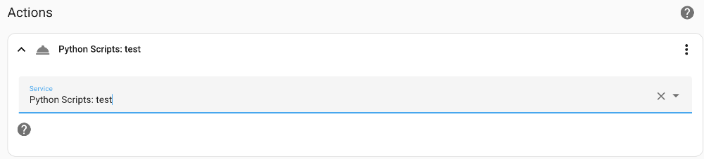

# 122. Les scripts Python avec Home Assistant {#chapitre-les_scripts_python_avec_home_assistant}

## 122.1 Automatisation qui appelle un script Python {#fiche-automatisation_qui_appelle_un_script_python}


Pour qu'une automatisation puisse appeler un script Python, vous devez d'abord ajouter l'intégration [Python Scripts](https://www.home-assistant.io/integrations/python_script/).

Ceci est réalisé en ajoutant cette ligne dans le fichier configuration.yaml.

Fichier configuration.yaml


```
python\_script:
```


Un redémarrage du système est requis pour que ce soit disponible mais attendez, un redémarrage sera également requis à une prochaine étape.

## Dossier qui contient les scripts

Pour qu'un script Python puisse être exposé en tant que service, vous devez d'abord créer le dossier python\_scripts sous /mnt/data/supervisor/homeassistant.

Si vous travaillez à l'aide de File Editor ceci sera réalisé en cliquant sur l'icône New Folder alors que vous êtes dans le dossier config (c'est ce dossier qui représente /mnt/data/supervisor/homeassistant dans l'interface Web).

Vous pouvez également créer le dossier directement au terminal HassOS.

## Écriture du script

Important : l'intégration Python Scripts ne permet pas aux script d'utiliser l'instruction import.

Le script peut être écrit directement dans File Editor ou encore être écrit sur votre ordinateur puis copié dans le dossier python\_scripts sur le Pi [à l'aide de scp,scp](53_scripts_python_pour_envoyer_et_recevoir_du_signal_sur_le_gpio.md#fiche-copier_un_fichier_sur_une_machine_linux_a_partir_d_un_autre_ordinateur).

Son nom doit se terminer par l'extension .py.

Fichier test.py


```python
xxx
```


## Déclaration du service

Maintenant que le script est écrit, il faut dire à Home Assistant qu'il existe.

Encore une fois, c'est dans configuration.yaml que ça se passe.

Il faut préciser le nom du script sans son extension (ici : test).

Si le script attend des paramètres, on les précisera à l'aide de data.

Dans cet exemple, j'ai inscrit la valeur du paramètre en dur mais il aurait été possible d'utiliser un modèle pour retrouver une valeur fournie par Home Assistant.

configuration.yaml


```
service: python\_script.test
data:
nom: 'Annie'
```


Une fois cette configuration en place, vous devez redémarrer le système pour qu'elle soit prise en compte.

Vous pouvez le faire maintenant puisque toutes les manipulations qui requièrent un redémarrage sont effectuées.

Par la suite, vous pourrez modifier votre script Python et l'automatisation qui l'utilise sans qu'un redémarrage ne soit nécessaire.

## Automatisation

Il est désormais possible d'utiliser votre script Python dans une automatisation.

Créez votre automatisation, définissez le déclencheur et possiblement les conditions puis comme action, choisissez Appeler un service.

Dans la liste déroulante des services, vous aurez accès au service dont le nom correspond à la ligne service que vous avez écrite plus tôt dans configuration.yaml (ici : python\_script.test).



## 122.2 Intégration AppDaemon pour exécuter des scripts Python {#fiche-integration_appdaemon_pour_executer_des_scripts_python}

[AppDaemon](https://github.com/hassio-addons/repository/tree/master/appdaemon) est une intégration Home Assistant qui permet d'exécuter un script Python dans un bac de sable (sandbox) c'est-à-dire dans un environnement isolé du reste du système.

Pour installer AppDaemon :

* Rendez-vous dans le menu Paramètres / Modules complémentaires / Boutiques des modules complémentaires.
* Recherchez AppDaemon.
* Cliquez sur la tuile AppDaemon puis sur Installer.
* Une fois l'installation complétée, cliquez sur Démarrer puis sur Ouvrir l'interface utilisateur Web.
* ...