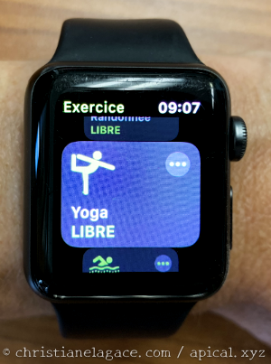
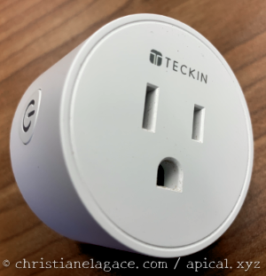
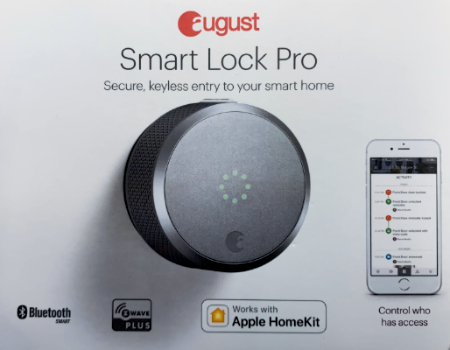
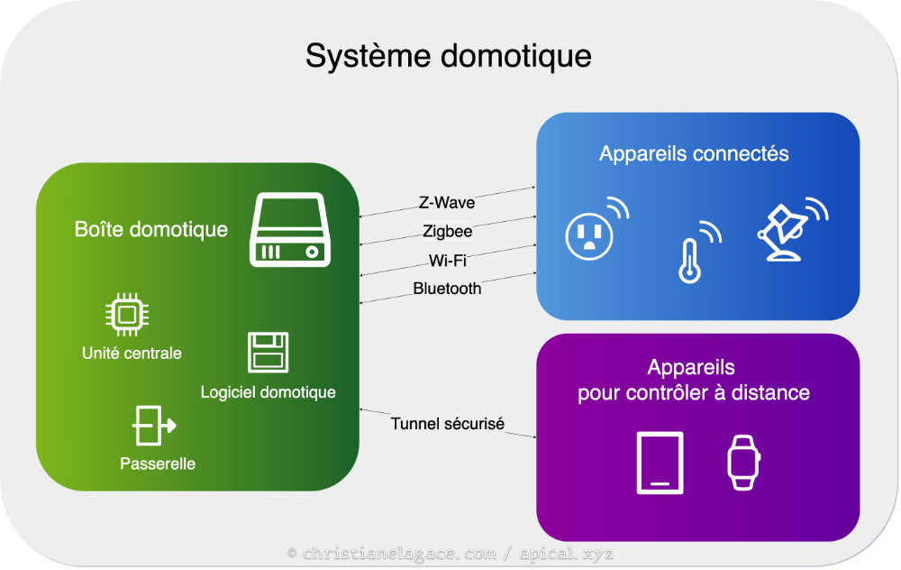
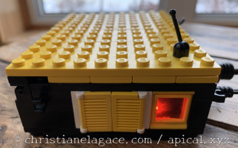
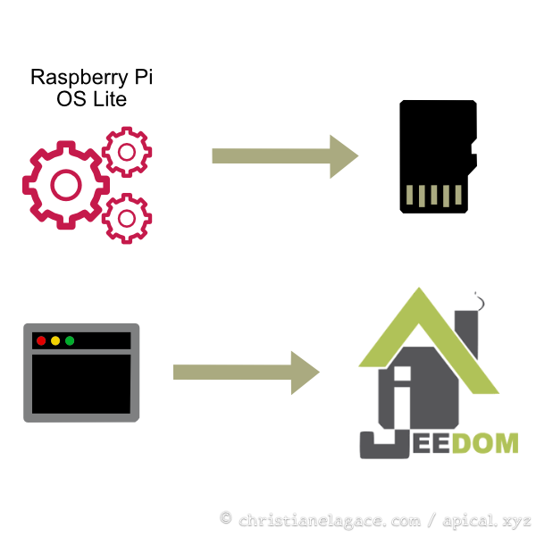
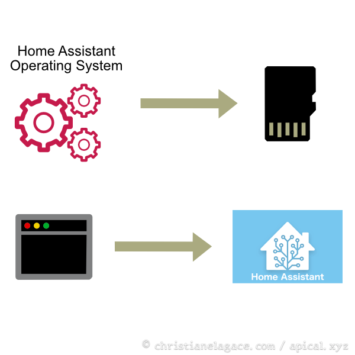

# 12. La domotique {#chapitre-la_domotique}

## 12.1 En résumé... {#fiche-en_resume_018}

Voici un résumé des informations essentielles du ou des prochains chapitres.

Notez que certaines fiches, qui font partie intégrante du cours, pourraient ne pas figurer dans ce résumé.

Je vous recommande d'effectuer une lecture de l'ensemble des fiches de ces chapitres afin de bien saisir les enjeux.

## [Qu est-ce qu un objet connecte](14_la_domotique.md#fiche-qu_est-ce_qu_un_objet_connecte)

Un objet connecté, parfois appelé appareil connecté ou appareil intelligent, c'est un objet de tous les jours dans lequel on a ajouté des composantes qui lui permettent d'envoyer ou de recevoir des données au serveur auquel il est connecté.

Les objects connectés font partie d'une grande famille qu'on appelle Internet des Objets ou, en anglais, Internet of Things (IoT).

  

## [Qu est-ce qu un systeme domotique](14_la_domotique.md#fiche-qu_est-ce_qu_un_systeme_domotique)

Un système domotique, c’est différent d’une série d’objets connectés. Avec un système domotique, on a un contrôle centralisé alors qu'avec une série d'objets connectés, on aura souvent une application pour chacun des objets.



## [Systeme domotique cle en main vs diy](14_la_domotique.md#fiche-systeme_domotique_cle_en_main_vs_diy)

Lorsque les données sont transmises dans l'infonuagique, attention aux [trous de sécurité,securite](14_la_domotique.md#fiche-systeme_domotique_cle_en_main_vs_diy).

## [Un raspberry pi comme unite centrale](15_lunite_centrale_du_systeme_domotique_raspberry_pi.md#fiche-un_raspberry_pi_comme_unite_centrale)

Vous aurez besoin de :

* Un Raspberry Pi 3 ou 4
* Un bloc d'alimentation d'au moins 2.5A
* Une carte micro SD (classe 10, min. 16 Go) - pour la phase de test (un disque dur est plus robuste qu'une carte micro SD)
* Un boîtier
* Un système d'exploitation
* Possiblement un écran et un clavier



## [Bien traiter son raspberry pi](15_lunite_centrale_du_systeme_domotique_raspberry_pi.md#fiche-bien_traiter_son_raspberry_pi)

Protéger le Pi avec un boîtier.


Installer des dissipateurs thermiques.


Installer un ventilateur.


Ne pas enrouler le fil du bloc d'alimentation.


Attention quand il faut retirer la carte micro SD.


Arrêter le Pi de la bonne façon.


## [Quelques logiciels de domotique interessants](16_le_logiciel_de_domotique.md#fiche-quelques_logiciels_de_domotique_interessants)

Jeedom



Home Assistant



## [Ifttt](16_le_logiciel_de_domotique.md#fiche-ifttt)

IFTTT signifie IF This, Then That.

Service Web gratuit qui permet d’automatiser des tâches pour des objets connectés Wi-Fi entre eux — par exemple un capteur de mouvement et une prise intelligente — ou entre les objets et des services Web — par exemple Gmail, Facebook, Google Assistant.

Il peut être utililisé par-dessus une boîte domotique via une extension ou encore de façon autonome.

IFTTT fonctionne avec le principe d'un déclencheur (trigger), le this et d'une action, le that. Par exemple, le déclencheur pourrait être l'envoi d'un courriel dont le titre est « J'ai froid » et l'action serait de démarrer le chauffage.

## [Installation de jeedom et premier acces](17_jeedom_au_coeur_de_votre_systeme_domotique.md#fiche-installation_de_jeedom_et_premier_acces)

Suivez bien les étapes!

Je vous les résume ici.

* Insérer la carte micro SD dans l'ordinateur.
* Installer Raspberry Pi OS Lite sur la carte micro SD à l'aide de Raspberry Pi Imager. Prendre soin de configurer le nom et le mot de passe de l'usager Linux, le réseau sans fil et l'activation SSH.
* Je vous conseille d'attendre au prochain cours pour configurer l'adresse IP statique.
* Insérer la carte micro SD dans le PI, brancher un écran au Pi puis démarrer.
* Idéalement, brancher un câble réseau (plus stable que le Wi-Fi).
* Vérifier l'accès au réseau.

  Terminal du Raspberry Pi

```
  ping google.com
```
* Mettre le système à jour (ceci pourrait être fait au prochain cours pour gagner un peu de temps).

  Terminal du Raspberry Pi

```
  sudo apt update
  sudo apt upgrade
```
* Vérifier l'adresse IP du Pi.

  Terminal du Raspberry Pi

```
  hostname -I
```
* Lancez la commande suivante pour installer Jeedom :

  Terminal du Raspberry Pi

```
  wget -O- https://raw.githubusercontent.com/jeedom/core/master/install/install.sh | sudo bash
```
* Redémarrez le Pi.

  Terminal du Raspberry Pi

```
  sudo reboot
```
* Accéder à Jeedom à partir de l'ordinateur en entrant l'adreses IP dans un navigateur. L'ordinateur doit être connecté au réseau Domotique-Pedago si le Pi est configuré pour communiquer en Wi-Fi ou sur CEGEPVICTO si le Pi est câblé vers le commutateur dédié.

## [Copie de securite de jeedom](18_pour_vous_assurer_de_ne_rien_perdre_en_cas_de_probleme.md#fiche-copie_de_securite_de_jeedom)

La sauvegarde permet de remettre rapidement Jeedom en état de marche si un problème survenait.

Pour lancer une sauvegarde manuelle, rendez-vous dans le menu Réglages / Système / Sauvegardes puis cliquez sur Lancer une sauvegarde.

Il existe aussi un système de sauvegarde automatique mais ce n'est pas ce qui nous intéresse pour l'instant.

Important : que ce soit une sauvegarde manuelle ou automatique, il faut la télécharger sur notre ordinateur pour pouvoir la réutiliser en cas de crash de Jeedom.

## 12.2 Qu'est-ce qu'un objet connecté ? {#fiche-qu_est-ce_qu_un_objet_connecte}

Un objet connecté, parfois appelé appareil connecté ou appareil intelligent, c'est un objet de tous les jours dans lequel on a ajouté des composantes qui lui permettent d'envoyer ou de recevoir des données au serveur auquel il est connecté.

C'est ainsi que les objets sont devenus intelligents.

L'Office québécois de la langue française définit un objet connecté comme suit[1](http://gdt.oqlf.gouv.qc.ca/ficheOqlf.aspx?Id_Fiche=26544584) :

> Objet qui est capable, outre sa fonction principale, d'envoyer ou de recevoir des informations par l'intermédiaire d'un réseau de télécommunication.

  

## Objets connectés prêts-à-porter

Les objets connectés prêts-à-porter (en anglais : wearables ou smartwear) forment un sous-ensemble des objets connectés. Il s'agit d'objets qu'une personne porte sur elle, par exemple une montre, une ceinture, des boucles d'oreille et même le tissus d'un vêtement, qui permettent de capter puis de transmettre des informations sur la condition physique de la personne.

## Internet des objets

Les objects connectés font partie d'une grande famille qu'on appelle Internet des Objets ou, en anglais, Internet of Things (IoT).

Voici une définition intéressante de l'Internet des Objets[2](https://jpdias.me/hardware/iot/2018/12/19/indoorsensing.html) :

> The Internet-of-Things can be seen as the result of the interconnection via the Internet of computing devices embedded in everyday objects, enabling them to send and receive data. This paradigm-shift provoked a ripple effect transforming everyday objects into smart objects [...].

## Source

1. « objet connecté ». Office québécois de la langue française. <http://gdt.oqlf.gouv.qc.ca/ficheOqlf.aspx?Id_Fiche=26544584>

2. « Indoor Sensing Hub powered by Mozilla Things Framework ». João Pedro Dias. <https://jpdias.me/hardware/iot/2018/12/19/indoorsensing.html>

## 12.3 Qu'est-ce qu'un système domotique ? {#fiche-qu_est-ce_qu_un_systeme_domotique}

La domotique est un ensemble de composantes et de techniques qui permettent d'automatiser et de contrôler à distance différents systèmes dans une maison.

Mais attention : un système domotique, c’est différent d’une série d’[objets connectés](14_la_domotique.md#fiche-qu_est-ce_qu_un_objet_connecte). Avec un système domotique, on a un contrôle centralisé alors qu'avec une série d'objets connectés, on aura souvent une application pour chacun des objets.

## La boîte domotique (hub)

Pour qu'on parle de domotique il faut que le contrôle soit centralisé.

L'endroit où le contrôle centralisé s'opère s'appelle boîte domotique ou système de gestion domotique.

En France, les gens l'appellent box domotique. Et en anglais, on parle de hub, smart hub ou encore smart home hub.

La boîte domotique sera composée de :

* Une unité centrale
* Un logiciel de domotique
* Une passerelle (gateway)

## Le système domotique

Le système domotique complet comprendra :

* Une boîte domotique (unité centrale, logiciel de domotique et passerelle)
* Des appareils connectés
* Un ou plusieurs appareils pour contrôler le système à distance

Différents protocoles de communication seront utilisés pour assurer la communication entre la boîte domotique et les appareils connectés.


## 12.4 Système domotique clé en main vs DIY {#fiche-systeme_domotique_cle_en_main_vs_diy}

De nombreux acteurs sur le marché offrent des solutions domotiques clé en main. Ces solutions sont généralement stables, efficaces et sécuritaires. Cependant, elles sont coûteuses à l'achat et plusieurs nécessitent par la suite des frais mensuels.

Si vous êtes le moindrement <a href="fiche-pourquoi_effectuer_une_veille_technologique.md#pourquoi_effectuer_une_veille_technologique">geek,geek</a>, vous aimerez certainement monter votre propre système domotique. Certains ne nécessitent aucune programmation, seulement de la configuration. D'autres doivent être programmés de toutes pièces alors qu'une troisième catégorie utilise des modules existants et vous permet d'y ajouter vos propres modules.

Attention : lors du choix du logiciel de domotique à utiliser, vérifiez bien les frais encourus. Certains sont complètement libres (Open Source) alors que d'autres vous demanderont de sortir votre porte feuille, mais à moindre coût que pour une solution clé en main.

Dans tous les cas, vous devrez apporter une attention quasi maladive pour la sécurité de votre système afin de ne pas compromettre votre maison face aux personnes malveillantes. Saviez-vous que des images de caméras de surveillance dont le mot de passe n'avait pas été changé sur la plateforme Web [se sont retrouvées sur des sites pirates](https://ici.radio-canada.ca/nouvelle/1805366/webcam-camera-vie-privee-diffusion-iot)? Le fait qu'un objet connecté diffuse des informations dans l'infonuagique est certainement un facteur de risque à considérer.

Quoi qu'il en soit, la domotique est un monde fascinant qui offre une infinité de possibilités.

Si la domotique vous interpelle, suivez-moi !
