# 54. Détecteur de présence sous Jeedom

## 54.1 En résumé...

Voici un résumé des informations essentielles du ou des prochains chapitres.

Notez que certaines fiches, qui font partie intégrante du cours, pourraient ne pas figurer dans ce résumé.

Je vous recommande d'effectuer une lecture de l'ensemble des fiches de ces chapitres afin de bien saisir les enjeux.

## [apical\_lien\_interne]la\_detection\_de\_presence[/apical\_lien\_interne]

Permet de savoir si une personne en particulier est à la maison ou pas.

On peut [apical\_lien\_interne][travailler\_avec\_le\_plugin\_networks,travailler avec le plugin Networks][/apical\_lien\_interne] : détectera la présence d'un téléphone via Wi-Fi.

On peut [apical\_lien\_interne][travailler\_avec\_le\_plugin\_detection\_de\_telephone,travailler avec le plugin Détection de téléphone][/apical\_lien\_interne] : détectera la présence d'un téléphone via Bluetooth.

Si on n'a pas de téléphone, on peut utiliser un localisateur d'objets (Ex : Tile, Cube, Nut) et travailler avec [apical\_lien\_interne][travailler\_avec\_le\_plugin\_bluetooth\_advertisement\_blea,plugin BLEA][/apical\_lien\_interne].

Dans tous les cas, les scénarios seront plus faciles à réaliser si le déclencheur est le téléphone réel OU une présence virtuelle.

## 54.2 La détection de présence

La détection de présence est dans la même famille que la détection de mouvement. La différence, c'est que la détection de présence permet de savoir si une personne en particulier est dans la maison plutôt que de détecter un mouvement quelconque.

Il existe plusieurs techniques pour détecter la présence d'une personne.

Et plusieurs plugins Jeedom pour y arriver.

Dans le cas où l'une des personnes pour qui vous désirez détecter la présence ne possède pas de téléphone, il est possible de travailler avec un localisateur d'objets (tracker), par exemple un Tile (<https://www.thetileapp.com/en-us/store/tiles/sticker>) un Cube (<https://cubetracker.com/collections/all>) ou un Nut (<https://www.nutfind.com/collections/all>).

À ce moment, vous devrez utiliser [apical\_lien\_interne][travailler\_avec\_le\_plugin\_bluetooth\_advertisement\_blea,le plugin Bluetooth Advertisement (BLEA)][/apical\_lien\_interne].

Mais concentrons-nous pour l'instant sur l'utilisation du téléphone cellulaire.

Dans les fiches qui suivent, je vous montre comment :

* Détecter la présence d'un téléphone via le Wi-Fi [apical\_lien\_interne][travailler\_avec\_le\_plugin\_networks,à l'aide du plugin Networks][/apical\_lien\_interne]
* Détecter la présence d'un téléphone via Bluetooth [apical\_lien\_interne][travailler\_avec\_le\_plugin\_detection\_de\_telephone,à l'aide du plugin Détection de téléphone][/apical\_lien\_interne]

## 54.3 Travailler avec le plugin Networks

Le plugin [Networks](https://doc.jeedom.com/fr_FR/plugins/communication/networks/) permet d'effectuer différentes tâches sur un réseau. Il est capable notamment de faire un ping sur une adresse IP afin de voir si l'appareil branché sur cet appareil est en mesure de répondre.

Il permet également de « réveiller » un appareil à l'aide du WOL (Wake On Lan). Cette fonctionnalité est en dehors du propos de cette fiche alors si ça vous intéresse, je vous laisse approfondir par vous-même. Voici un lien pour vous aider : [https://youdom.net/demarrer-son-ordinateur-avec-votre-domotique-jeedom/]()%20:%20https:/youdom.net/demarrer-son-ordinateur-avec-votre-domotique-jeedom/).

## Installation du plugin

Pour installer le plugin **Networks**, rendez-vous dans Plugins / Gestion des plugins / Market.

Rercherchez le plugin **Networks** - par Jeedom SAS puis procédez à son installation.

Une fois le plugin installé, vous devez l'activer dans son écran de configuration.

## Adresse IP du téléphone

Pour détecter la présence d'un téléphone, vous devez connaître son adresse IP.

Votre téléphone doit être branché à un réseau Wi-Fi qui peut communiquer avec votre Raspberry Pi.

Pour connaître l'adresse IP d'un téléphone :

Sur iPhone, rendez-vous dans Réglages / Wi-Fi puis cliquez sur le réseau que vous utilisez présentement. L'adresse IP sera affichée plus bas.

Sur Android, rendez-vous dans Paramètres / Réseau et Internet / Internet puis cliquez sur le réseau que vous utilisez présentement. L'adresse IP sera affichée plus bas.

## Ajout d'un téléphone

De retour dans Jeedom, vous devez ajouter un équipement dans le plugin Networks pour chaque téléphone que vous désirez détecter.

Rendez-vous dans le menu Plugins / Communication / Network puis cliquez sur Ajouter.

Parmi les informations demandées, notez :

* Adresse IP : tel que noté plus haut
* Méthode de ping : ARP

Remarquez que l'adresse MAC et le broadcast IP ne sont pas requis ici puiqu'ils servent à faire du WOL (Wake On Lan).

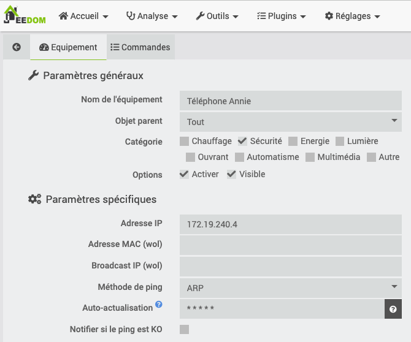

Dans l'onglet Commandes, vous pouvez choisir de n'afficher que certaines commandes, par exemple le statut et l'adresse IP.

Et voilà! Le Dashboard indiquera quand le téléphone est détecté ou non et vous pourrez utiliser cette information dans vos scénarios.

Une façon facile de vérifier si Jeedom détecte correctement votre téléphone : désactivez le Wi-Fi du téléphone et constatez que le statut affiche un X.

Jeedom devrait rafraîchir le statut en dedans de 1-2 minutes.

## Utilisation dans vos scénarios

Maintenant que Jeedom peut détecter la présence de téléphones, vous pouvez créer des scénarios qui réagissent à la présence ou à l'absence des différents occupants de la maison!

Pour tester vos scénarios, vous avez trois choix :

* Demander à quelqu'un de s'en aller avec son cellulaire et de revenir des dizaines de fois pendant que vous faites vos tests (ouf!).
* Désactiver le Wi-Fi de votre téléphonee pour simuler votre départ. Jeedom vous marquera comme absent après quelques minutes (un peu long mais fonctionnel).
* Ajouter un détecteur de présence [apical\_lien\_interne][travailler\_avec\_le\_plugin\_virtuel,virtuel][/apical\_lien\_interne] et utiliser deux déclencheurs dans vos scénarios. L'action sera réalisée si la présence réelle change OU si la présence virtuelle change.

  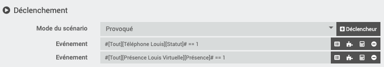

## 54.4 Travailler avec le plugin Détection de téléphone

Le plugin Détection de téléphone permet de réagir lorsqu'une personne – ou plutôt son téléphone – entre ou sort de la maison.

Son fonctionnement est semblable à celui du [apical\_lien\_interne][travailler\_avec\_le\_plugin\_networks,plugin Networks][/apical\_lien\_interne] sauf qu'il travaille en Bluetooth plutôt qu'en Wi-Fi.

À vous de voir celui que vous préférez.

## Installation du plugin

Pour installer le plugin Détection de téléphone, rendez-vous dans Plugins / Gestion des plugins / Market.

Dans la zone de recherche, entrez phone.

Cliquez sur le plugin Détection de téléphone (Bluetooth) - par sebmafate.

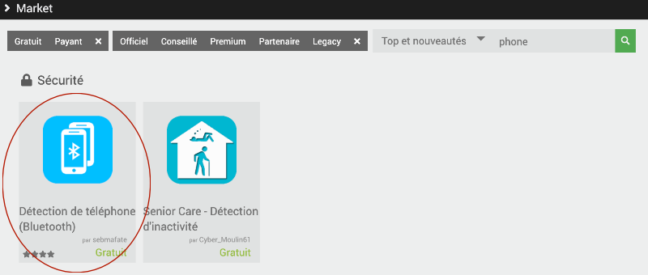

## Configuration du Bluetooth sur le Pi

Avant d'aller plus loin, effectuez les manipulations nécessaires pour activer le Bluetooth sur le Raspberry Pi, tel qu'expliqué sur cette fiche : [apical\_lien\_interne]activer\_bluetooth\_sur\_raspberry\_pi\_os\_lite[/apical\_lien\_interne]. Remarquez que vous n'aurez pas à effectuer de pairage à ce stade.

## Configuration du plugin

Dans l'interface de Jeedom, rendez-vous dans le menu Plugins / Sécurité / Détection de téléphone (Bluetooth).

D'abord, activez le plugin en cliquant sur le bouton Activer dans la zone État.

Dans la zone Dépendances, assurez-vous que toutes les dépendances sont installées. Si vous voyez le statut NOK, cliquez sur Relancer pour régler le problème.

Dans la zone Configuration, si [apical\_lien\_interne][activer\_bluetooth\_sur\_raspberry\_pi\_os\_lite,le Bluetooth a été correctement activé sur le Pi][/apical\_lien\_interne], la zone Contrôleur Bluetooth devrait vous offrir une adresse MAC dans la liste déroulante. Sélectionnez cette adresse puis cliquez sur Sauvegarder.

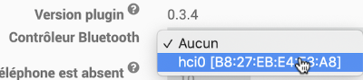

Après cette configuration, la zone Démon devrait indiquer que le statut est OK. Si c n'est pas le cas, cliquez sur (Re)Démarrer.

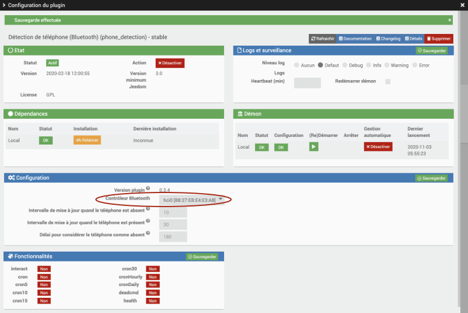

## Adresse MAC Bluetooth du téléphone

Pour détecter la présence d'un téléphone, vous devez connaître son adresse MAC (Media Access Control) pour le Bluetooth.

Attention : ne pas confondre avec l'adresse MAC du Wi-Fi. On veut l'adresse MAC Bluetooth.

Sur iPhone, rendez-vous dans Réglages / Général / Informations. L'adresse MAC recherchée est vis-à-vis Bluetooth.

Sur Android, rendez-vous dans Paramètres / À propos du téléphone. L'adresse MAC recherchée est vis-à-vis Adresse Bluetooth.

## Ajout d'un téléphone

De retour dans Jeedom, rendez-vous dans le menu Plugins / Sécurité / Détection de téléphone (Bluetooth) puis cliquez sur Ajouter.

Entrez les informations sur le téléphone.

Et voilà! Le Dashboard indiquera quand le téléphone est détecté ou non et vous pourrez utiliser cette information dans vos scénarios.

## Si le téléphone n'est pas détecté

Parfois, il faut mettre quelques efforts supplémentaires pour que le téléphone soit correctement détecté. Voici quelques actions qui pourraient vous aider à régler un problème de téléphone non détecté.

* Assurez-vous que l'adresse Mac entrée est bien celle du Bluethooth du téléphone.
* Redémarrez Jeedom. Vous pourrier avoir à réactiver Bluetooth et HCI UART sur le Pi.

  Terminal

  sudo systemctl start bluetooth  
  sudo service bluetooth status  
  sudo systemctl start hciuart  
  systemctl status hciuart
* Consultez le fichier journal phone\_detection.
* Redémarrez le démon en cliquant sur (re)Démarrer dasn la fenêtre de configuration du plugin Détection de téléphone.
* Patientez... parfois, le plugin peut mettre quelques minutes avant de réagir puisque s'il vérifie plus souvent, cela demandera trop de ressources au système.

## Utilisation dans vos scénarios

Maintenant que Jeedom peut détecter la présence de téléphones, vous pouvez créer des scénarios qui réagissent à la présence ou à l'absence des différents occupants de la maison!

Pour tester vos scénarios, vous avez trois choix :

* Demander à quelqu'un de s'en aller avec son cellulaire et de revenir des dizaines de fois pendant que vous faites vos tests (ouf!).
* Désactiver le bluetooth de votre téléphonee pour simuler votre départ. Jeedom vous marquera comme absent après quelques minutes (un peu long mais fonctionnel).
* Ajouter un détecteur de présence [apical\_lien\_interne][travailler\_avec\_le\_plugin\_virtuel,virtuel][/apical\_lien\_interne] et utiliser deux déclencheurs dans vos scénarios. L'action sera réalisée si la présence réelle change OU si la présence virtuelle change.

  

## Pour plus d'information

« sebmafate/phone\_detection ». GitHub - sebmafate/phone\_detection. <https://github.com/sebmafate/phone_detection>

« Gestion de la présence avancées ». La domotique pratique. <https://www.ladomopratique.com/jeedom-scenario-gestion-de-la-presence-avancees/>

« Tuto : Centre de gestion de présence dans la domotique Jeedom ». Ça sert à quoi?. <https://www.ca-sert-a-quoi.com/articles/domotique/tuto-centre-de-gestion-de-presence/>

## 54.5 Travailler avec le plugin Bluetooth Advertisement (BLEA)

Si, dans votre système domotique Jeedom, vous désirez détecter la présence de personnes ciblées mais que vous ne pouvez pas utiliser les téléphones cellulaires en guise d'appareils à détecter, vous pouvez vous tourner vers les localisateurs d'objets (trackers), par exemple :

* Tile (<https://www.thetileapp.com/en-us/store/tiles/sticker>)
* Cube (<https://cubetracker.com/collections/all>)
* Nut (<https://www.nutfind.com/collections/all>)

Vous travaillerez à ce moment avec le plugin Bluetooth Advertisement, aussi appelé BLEA.

## Installation du plugin

Pour installer le plugin BLEA, rendez-vous dans Plugins / Gestion des plugins / Market.

Dans la zone de recherche, entrez blea.

Cliquez sur le plugin Bluetooth Advertisement - officiel par Jeedom SAS.

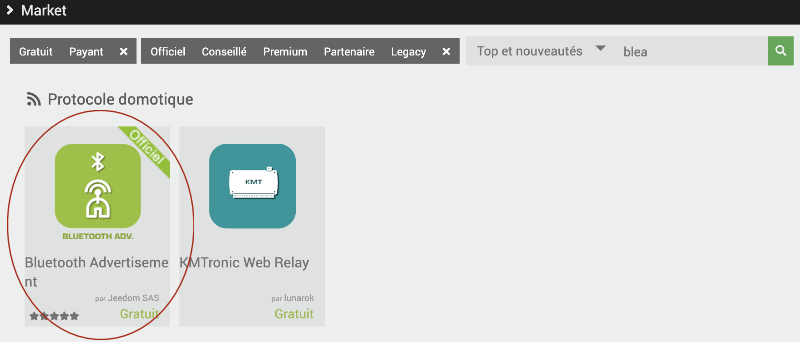

## Configuration du bluetooth sur le Pi

Avant d'aller plus loin, effectuez les manipulations nécessaires pour activer le bluetooth sur le Raspberry Pi, tel qu'expliqué sur cette fiche : [apical\_lien\_interne]activer\_bluetooth\_sur\_raspberry\_pi\_os\_lite[/apical\_lien\_interne]. Remarquez que vous n'aurez pas à effectuer de pairage à ce stade.

## Configuration du plugin

Dans l'interface de Jeedom, rendez-vous dans le menu Plugins / Protocole domotique / Publicité Bluetooth (ou Bluetooth Advertisement) puis cliquez sur l'icône Configuration.

D'abord, activez le plugin en cliquant sur le bouton Activer dans la zone État.

Dans la zone Dépendances, assurez-vous que toutes les dépendances sont installées. Si vous voyez le statut NOK, cliquez sur Relancer pour régler le problème.

Dans la zone Configuration / Démon, si le bluetooth a été correctement activé, la zone Port clef bluetooth devrait vous offrir une adresse MAC dans la liste déroulante. Sélectionnez cette adresse.

Après cette configuration, la zone Démon devrait indiquer que le statut est OK.

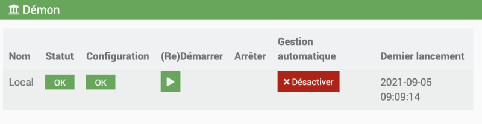

## Pairage d'un périphérique Bluetooth

Pour pairer un périphérique, suivez ces instructions.

* Rendez-vous dans me menu Plugins / Protocole domotique / Bluetooth Advertisement.

  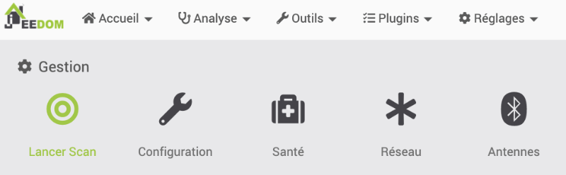
* Cliquez sur Lancer Scan.
* Dans la fenêtre Inclusion BLEA, choisissez Tous afin de maximiser les chances de trouver votre équipement Bluetooth. Si jamais trop d'équipements étaient trouvés, vous pourrez raffiner la recherche afin de cibler une compagnie précise.

  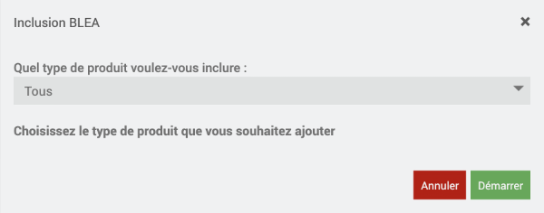
* Jeedom vous informera qu'il est en mode scan.

  
* Puis il vous montrera les équipements trouvés.

  Vous pouvez désormais configurer l'équipement Bluetooth comme vous le feriez avec tout autre équipement en précisant le nom de l'équipement, son objet parent, sa catégorie, etc.

  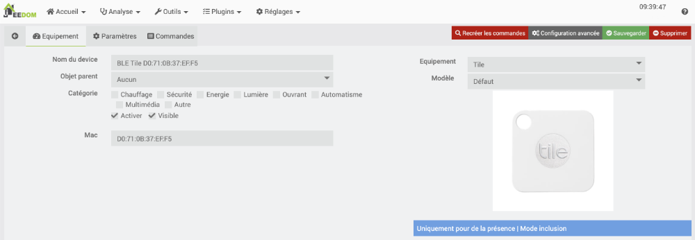

## Si le périphérique n'est pas détecté

Par défaut, seul les périphériques reconnus par le plugin BLEA sont détectables.

Il y a une option sur la page de configuration du plugin qui permet de détecter tous les périphériques bluetooth.

Pour l'activer, rendez-vous dans le menu Plugins / Protocole domotique / Bluetooth Advertisement / onglet Configuration / section Configuration. Cochez Autoriser l'inclusion de devices inconnus.

Lors du prochain scan, une multitude d'appareils bluetooth seront détectés. Le défi sera de retrouver lequel correspond au périphérique souhaité.

Certains n'affichent que leur adresse MAC.

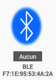

Avec un peu de chance, votre périphérique sera identifié par son nom, comme ici mon localisateur d'objets Cube Pro.

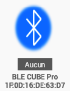

Une fois que vous avez repéré votre périphérique, vous pouvez aller dans ses configurations pour modifier son nom, ajuster les commandes qui seront visibles sur la tuile, etc.

## Pour plus d'information

« BLEA (Bluetooth advertisement) ». Jeedom. <https://doc.jeedom.com/fr_FR/plugins/automation%20protocol/blea/>
