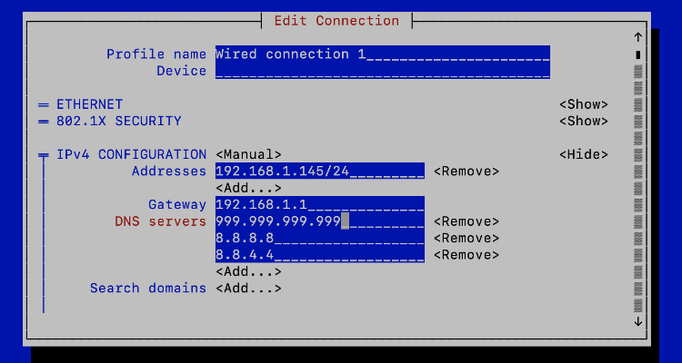
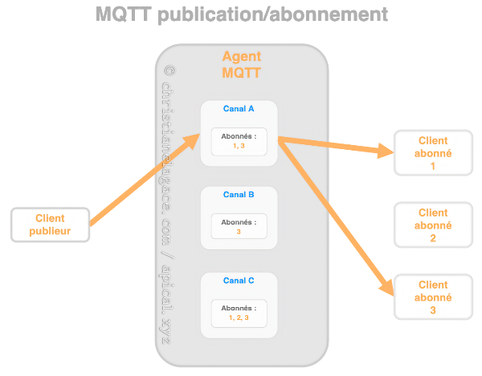

# 20. La passerelle domotique et les protocoles de communication

## 20.1 En résumé...

Voici un résumé des informations essentielles du ou des prochains chapitres.

Notez que certaines fiches, qui font partie intégrante du cours, pourraient ne pas figurer dans ce résumé.

Je vous recommande d'effectuer une lecture de l'ensemble des fiches de ces chapitres afin de bien saisir les enjeux.

## [apical\_lien\_interne][donner\_une\_adresse\_ip\_statique\_au\_raspberry\_pi,Adresse IP statique,terminal][/apical\_lien\_interne]

Terminal

sudo nmtui

## [apical\_lien\_interne]le\_protocole\_z-wave[/apical\_lien\_interne]

Z-Wave est un protocole de communication sans fil destiné principalement à la domotique.

Portée théorique de 100 à 200 mètres selon la génération.

## [apical\_lien\_interne]le\_protocole\_zigbee[/apical\_lien\_interne]

Le protocole ZigBee a été développé pour les milieux industriels afin de faciliter la transmission de données en milieu difficile.

Moins grande portée que Z-Wave : 10 à 100 mètres.

## [apical\_lien\_interne]precautions\_avant\_l\_achat\_d\_un\_objet\_connecte[/apical\_lien\_interne]

Vérifier :

* Protocole de communication
* Fréquence
* Compatibilité avec la boîte domotique

## [apical\_lien\_interne]objets\_pour\_representer\_la\_maison[/apical\_lien\_interne]

Dans Jeedom, la notion d'objet permet de regrouper les appareils connectés.

Les objets fonctionnent en hiérarchie.

Par exemple, pour une maison à étages :

* Premier objet : Maison
* Ensuite, un objet par étage dont l'objet parent est la maison
* Et ensuite, un objet par pièce dont l'objet parent est l'étage.

Dans le cas où la maison ne comporte pas plusieurs étages, on pourra configurer les pièces avec la maison comme objet parent.

Si vous avez des objets à l'exterieur de la maison, une autre configuration pourrait être :

* Premier objet : Tout
* Ensuite, un objet Maison et un objet Dehors qui ont Tout comme parent
* Et ensuite, les objets sont organisés par étages et/ou par pièces.

## [apical\_lien\_interne]configurer\_la\_cle\_usb\_z-wave\_sur\_jeedom[/apical\_lien\_interne]

Bien suivre ces étapes!

## 20.2 Passerelle et protocoles de communication

Les appareils branchés à un système domotique peuvent communiquer à l'aide de [différentes normes et protocoles de communication](https://fr.wikipedia.org/wiki/Domotique#Technologies_radios) :

* [apical\_lien\_interne][le\_protocole\_z-wave,Z-Wave][/apical\_lien\_interne]
* [apical\_lien\_interne][le\_protocole\_zigbee,Zigbee][/apical\_lien\_interne]
* [apical\_lien\_interne][mqtt,MQTT][/apical\_lien\_interne]
* [apical\_lien\_interne][interface\_rfxcom,RFXCOM][/apical\_lien\_interne]
* Wi-Fi
* Bluetooth
* etc.

Une passerelle, en anglais gateway, permet d'assurer la communication entre les appareils qui utilisent des protocoles différents.

Dans un système domotique DIY, c'est la boîte domotique qui joue le rôle de passerelle. Au besoin, on lui ajoutera des composantes sous forme de cartes d'extension ou de clé USB qui lui permettront de communiquer dans les protocoles requis.

Par abus de langage, on donnera parfois le nom de passerelle à la carte d'extension ou à la clé USB.

## Pour plus d'information

« Qu’est-ce qu’une “gateway” en domotique ? ». Maker help. <https://makerhelp.fr/quest-ce-quune-gateway-en-domotique/>

« Quelle passerelle domotique choisir ? RFXCom, Z-Wave, Zigbee, Xiaomi Aqara, Philips Hue… ». Projets DIY. <https://projetsdiy.fr/quelle-passerelle-domotique-choisir-rfxcom-z-wave-zigbee-xiaomi-aqara-philips-hue/>

## 20.3 Le protocole Z-Wave

Z-Wave est un protocole de communication sans fil destiné principalement à la domotique.

Il permet l'échange d'informations entre l'unité centrale du système domotique et les appareils qu'elle contrôle. Les informations transférées peuvent être, par exemple :

* des données récoltées par un capteur
* des ordres à exécuter (ex : allume-toi)

Un système domotique peut généralement gérer plusieurs protocoles.

Pour que votre système domotique puisse gérer le protocole Z-Wave, l'unité centrale doit être munie d'une composante matérielle (carte ou clé USB) qui lui permet de communiquer avec Z-Wave. Les autres composantes devront être munies d'une puce Z-Wave pour pouvoir communiquer.

## Z-Wave vs Z-Wave Plus

La certification Z-Wave Plus, aussi connue sous le nom 500 Series ou encore Gen5, assure que l'appareil offre des capacités étendues, par exemple une plus grande portée, une moins grande consommation énergétique (donc durée de vie plus grande pour la pile), une plus grande stabilité, etc.

Il existe également une certification Z-Wave Plus V2, également appelée 700 Series ou Gen7. Les appareils Z-Wave Gen7 offrent des capacités encore plus intéressantes que Gen5.

## Fréquence

Le protocole Z-Wave utilise les ondes basse fréquence. Attention : [la fréquence est différente selon le pays d'origine de l'appareil](https://www.silabs.com/wireless/z-wave/technology/global-regions). Avant d'acheter un appareil domotique avec une puce Z-Wave, il faut s'assurer que sa fréquence est la même que celle des autres appareils sinon, ils ne pourront pas communiquer ensemble.

À titre d'exemple, Z-Wave utilise une fréquence de 908.4 MHz au Canada et aux États-Unis. En Europe, il utilise une fréquence de 868,4 MHz.

## Portée

La portée théorique du Z-Wave est de 100 mètres. Dans les faits, à cause des obstacles (murs, meubles), la portée est plutôt aux alentours de 30 mètres.

La portée théorique est de 150 mètres pour Gen5 et 200 mètres pour Gen7.

Ce qui est intéressant, c'est que plusieurs puces Z-Wave peuvent se relayer un signal, ce qui augmente la portée par maillage.

## Sécurité

Le protocole Z-Wave n'est pas sans danger. En effet, si votre système domotique contrôle des appareils dont la puce Z-Wave effectue l’échange des clés de chiffrement selon l'ancienne procédure S0, il est relativement facile d'intercepter ces clés.

La procédure S2 (Security 2), plus sécuritaire, est obligatoire depuis 2017. Par contre, certains appareils ont conservé la procédure S0 pour assurer une rétrocompatibilité. C'est de là que vient la faille de sécurité.

Il est donc impératif de bien vérifier ce qu'il y a derrière un appareil connecté avant d'en faire l'acquisition.

## Pour plus d'information

« Principes de base de d’un réseau Z-Wave ». La domotique de Nechry. <https://nechry-automation.ch/2017/01/25/principes-de-base-reseau-z-wave/>

« Sécurité du protocole Z-Wave ». La domotique de Nechry. <https://nechry-automation.ch/2018/01/17/securite-zwave/>

« Z-Wave ». Wikipédia. <https://fr.wikipedia.org/wiki/Z-Wave>

« What is Z-Wave, Z-Wave Plus, Z-Wave S2, Z-Wave SmartStart and Z-Wave Plus V2 ». Vesternet. <https://www.vesternet.com/pages/what-is-z-wave#what>

« Introduction to the Z-Wave Security Ecosystem ». Sigma Designs. <https://cdn.shopify.com/s/files/1/0066/8149/3559/files/z-wave-security-white-paper.pdf>

« Une nouvelle puce z-wave pour une smart home encore plus performante ». Domo blog. <https://www.domo-blog.fr/nouvelle-puce-z-wave-smart-home-plus-performante/>

« Z Wave Vs ZigBee: Which Is Better For Your Smart Home? ». The Smart Cave. <https://thesmartcave.com/z-wave-vs-zigbee-home-automation/>

« Le protocole Z-Wave met votre maison connectée à la portée des pirates ». 01net.com. <https://www.01net.com/actualites/le-protocole-z-wave-met-votre-maison-connectee-a-la-portee-des-pirates-1457870.html>

« EZ-Wave: A Z-Wave hacking tool capable of breaking bulbs, abusing Z-Wave devices ». Privacy and security fanatic. <https://www.csoonline.com/article/3024217/ez-wave-z-wave-hacking-tool-capable-of-breaking-bulbs-and-abusing-z-wave-devices.html>

« Understanding Smart Home Communication Protocols ». Newegg. <https://www.newegg.com/insider/understanding-smart-home-communication-protocols/>

## 20.4 Le protocole ZigBee

Le protocole ZigBee a été développé pour les milieux industriels afin de faciliter la transmission de données en milieu difficile.

Sa portée est d'environ 10 m.

Il utilise une fréquence de 2.4 GHz. Il pourrait donc y avoir de l'interférence en provenance des appareils Wi-Fi de la maison.

Les objets connectés ZigBee sont généralement moins dispendieux que les Z-Wave mais plus dispendieux que les Wi-Fi.

## Pour plus d'information

« ZigBee ». Wikipédia. <https://fr.wikipedia.org/wiki/ZigBee>

« Z Wave Vs ZigBee: Which Is Better For Your Smart Home? ». The Smart Cave. <https://thesmartcave.com/z-wave-vs-zigbee-home-automation/>

## 20.5 La clé USB Z-Wave

Pour que le Raspberry Pi, en tant qu'[apical\_lien\_interne][un\_raspberry\_pi\_comme\_unite\_centrale,unité centrale de votre système domotique][/apical\_lien\_interne], puisse émettre et recevoir des signaux avec [apical\_lien\_interne][le\_protocole\_z-wave,le protocole Z-Wave][/apical\_lien\_interne], il faut lui ajouter un petit quelque chose : une clé USB Z-Wave ou encore une carte d'extension.

## Clé USB Z-Wave

Plusieurs fabricants offrent des clés USB qui permettent au Raspberry Pi de communiquer avec les appareils Z-Wave, par exemple :

* [Silicon labs  Z-Wave 700 UZB-7 USB stick](https://www.digikey.ca/fr/products/detail/silicon-labs/SLUSB001A/9867108) (environ CDN $30)
* [Zooz ZWave 800 Long Range USB Stick](https://www.aartech.ca/zst39-800lr) (environ CDN $50)
* [Aeotec ZWA010-A ZWave USB ZStick 7](https://www.aartech.ca/zwa010/aeotec-zstick-7-zwave-plus-gen7.html) (environ CDN $70)

## Carte d'extension

La carte d'extension Razberry se branche directement sur le port GPIO du Raspberry Pi.

Malheureusement, Razberry n'est plus en vente. Il faut donc se retourner vers une clé USB Z-Wave.

## 20.6 La clé USB Zigate

Information à venir...

## Pour plus d'information

« Zigate ». Zigate. <https://zigate.fr/>

« Test de la Zigate, la passerelle domotique ZigBee pour jeedom et Eedomus ». Domo Blog. <https://www.domo-blog.fr/zigate-domotique-zigbee-jeedom-eedomus/>

## 20.7 Interface RFXCOM

L'émetteur/récepteur RFXCOM, aussi appelé RFXtrx, peut être branché au Raspberry Pi afin de communiquer avec des appareils qui utilisent une fréquence radio de 433MHz.

## Pour plus d'information

« Présentation du nouveau boîtier RFXcom RFXtrx433XL ». Domotique Technoseb27. <https://domotiquetechnoseb27.com/2018/12/21/presentation-du-boitier-rfxcom-rfxtrx433xl/>

« Fabriquer une passerelle domotique RFLink/RFXCom 433MHz pour 10,50€ (test avec Domoticz)  ». Projets DIY. <https://projetsdiy.fr/passerelle-radio-domotique-433mhz-rflink-rfxcom-domoticz/>

## 20.8 Le protocole MQTT

MQTT (Message Queuing Telemetry Transport) est un protocole de communication machine à machine très léger basé sur TCP/IP.

Il permet de transférer des informations à l'aide d'un mécanisme publication/abonnement (publish/subscribe).

Dans le monde de la domotique, il a une application intéressante : il permet à deux boîtes domotiques de communiquer ensemble. Les données d'un capteur branché sur la boîte A pourraient ainsi déclencher une action sur un récepteur branché sur la boîte B.

Dans cette fiche :

* Agent MQTT
* Exemple de fonctionnement
* Les canaux de communication MQTT
* Payload
* QoS
* Retain
* Conditions pour qu'une communication MQTT ait lieu

## Agent MQTT

Pour gérer les communications, il faut avoir un agent MQTT (en anglais, MQTT broker), parfois appelé courtier MQTT ou encore serveur MQTT.

[Mosquitto](https://mosquitto.org/) est un agent MQTT libre et très répandu. C'est d'ailleurs lui qui peut être facilement installé par différentes boîtes domotiques comme Jeedom ou Home Assistant.

Il ne faut pas confondre l'agent Mosquitto avec le site Web [https://test.mosquitto.org](https://mosquitto.org/) qui est une installation publique de ce même Mosquitto, souvent utilisée pour faire des tests.

Attention : les informations qui transigent sur https://test.mosquitto.org sont publiques! De plus, la communication n'est pas fiable, le serveur peut arrêter de fonctionner à tout moment. C'est un serveur de test.

Les informations qui transigent sur un agent local sont plus sécuritaires que celles qui transigent sur https://test.mosquitto.org, à condition que l'agent MQTT [apical\_lien\_interne][la\_securite\_avec\_mqtt,soit correctement configuré][/apical\_lien\_interne].

## Exemple de fonctionnement

Voici un exemple simple du fonctionnement d'une communication MQTT :

* Une boîte domotique envoie de l'information au sujet d'un de ses objets connectés, par exemple un capteur de luminosité, à un agent MQTT sur un canal donné. Le système domotique est ici le client publieur (publisher).
* Une autre boîte domotique est abonnée à ce canal. Elle recevra alors l'information sur la luminosité. Une règle d'automatisation lui permettra d'allumer ou d'éteindre une ampoule selon l'information reçue. Cette boîte est le client abonné (subscriber).
* L'information peut circuler dans les deux sens, c'est-à-dire que la boîte de l'ampoule, qui était le client abonné dans l'opération précédente, deviendra un client publieur si elle envoie de l'information au sujet de son état à l'agent MQTT sur un autre canal.
* Les abonnés de ce canal seront informés de l'état de l'ampoule et pourront réagir convenablement.

Ce mécanisme est intéressant puisqu'il peut fonctionner localement, sans devoir faire appel à un service infonuagique.

## Les canaux de communication MQTT

La communication entre le publieur et un abonné passe par un canal. On utilise parfois le terme sujet. En anglais, on dira channel ou topic.

L'agent MQTT peut gérer autant de canaux que nécessaire.

Le publieur décide sur quel canal il publie l'information. L'agent enverra cette information seulement aux abonnés de ce canal. Ceci permet à plusieurs publieurs d'envoyer des informations qui ne seront reçues que par ceux qui désirent recevoir ces informations.

Pour qu'un canal existe, il suffit qu'un publieur et un abonné l'utilisent. Il n'y a pas d'étape de création en tant que telle.

[Le nom d'un canal](https://www.hivemq.com/blog/mqtt-essentials-part-5-mqtt-topics-best-practices/) contient généralement plusieurs niveaux afin de bien organiser les canaux que l'agent MQTT doit gérer.

Le nom sera sous la forme : un\_niveau/un\_sous\_niveau/un\_nom.

Il sera écrit entièrement en lettre minuscules avec possiblement des barres de soulignement pour séparer les mots.

Il est préférable d'éviter les espaces, les caractères accentués et les caractères spéciaux dans le nom d'un canal.

Voici quelques exemples valables :

* maison/chambre/temperature
* securite/porte
* sauvegarde/homeassistant
* homeassistant/cafetiere

### Caractères génériques

Si vous désirez écouter tout ce qui se publie sur un canal, peu importe les sous-niveaux, vous pouvez utiliser un #.

Par exemple, pour écouter tout ce qui se dit sur le canal jeedom, peu importe les sous-niveaux, vous écouterez le canal jeedom/#.

Pour écouter tout ce qui est publié sur un agent MQTT, vous écouterez le canal #.

## Payload

Le payload, aussi appelé la charge utile ou simplement les données, est le corps de l'information publiée sur un canal.

En fait, un message publié via MQTT contient un canal et un payload. On peut faire une comparaison avec un courriel qui contient un titre et un message.

## QoS

La qualité du service peut prendre les valeurs 0, 1 ou 2, la valeur 2 étant la meilleure garantie de livraison du message mais également la plus exigente au niveau des ressources.

Cette valeur peut être configurée du côté du client publieur et du côté du client abonné.

Lorsque le client abonné a une QoS inférieure à celle du client publieur, c'est la plus basse valeur qui est utilisée pour envoyer l'information de l'agent MQTT vers le client abonné.

<https://www.hivemq.com/blog/mqtt-essentials-part-6-mqtt-quality-of-service-levels/>

## Retain

Cette option permet notamment aux nouveaux abonnés de recevoir immédiatement le dernier message retenu sur ce canal.

<https://www.hivemq.com/blog/mqtt-essentials-part-8-retained-messages/>

## Conditions pour qu'une communication MQTT ait lieu

Pour qu'une communication MQTT ait lieu, il faut :

* un client publieur et un client abonné qui utilisent le même agent MQTT (si l'agent est local, le publieur et l'abonné devront être sur le même sous-réseau)
* un client publieur et un client abonné qui utilisent le même canal MQTT

## Pour plus d'information

« MQTT ». Wikipédia. <https://fr.wikipedia.org/wiki/MQTT>

« MQTT Essentials ». HiveMQ. <https://www.hivemq.com/mqtt-essentials/>

« MQTT Tutorial for Arduino, ESP8266 and ESP32 ». DIYI0T. <https://diyi0t.com/introduction-into-mqtt/>