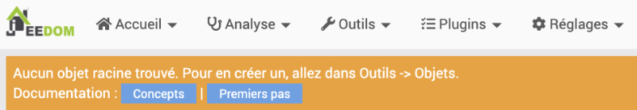
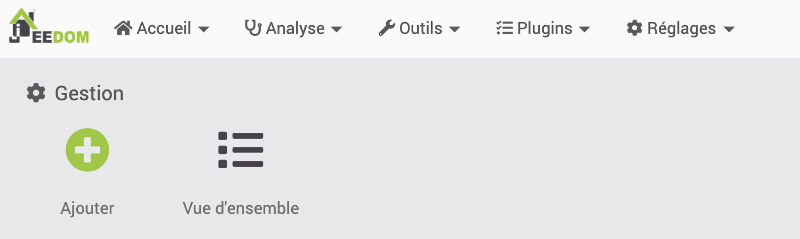
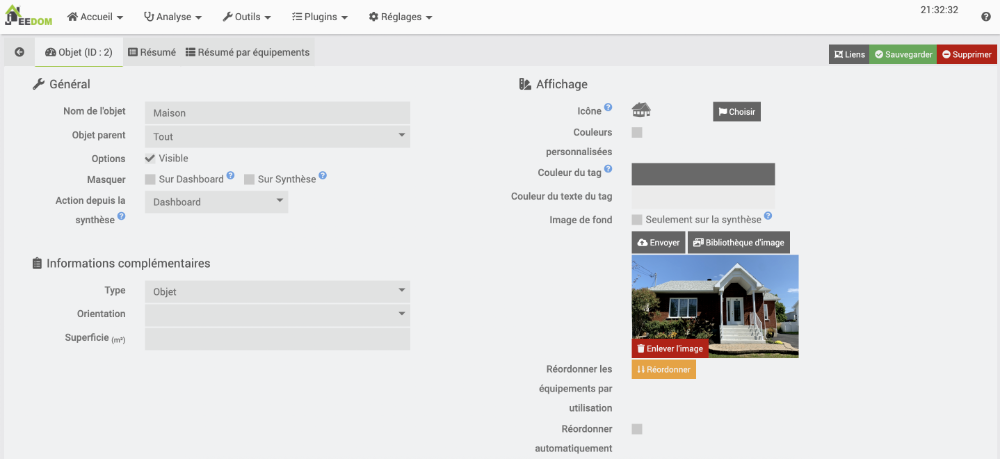
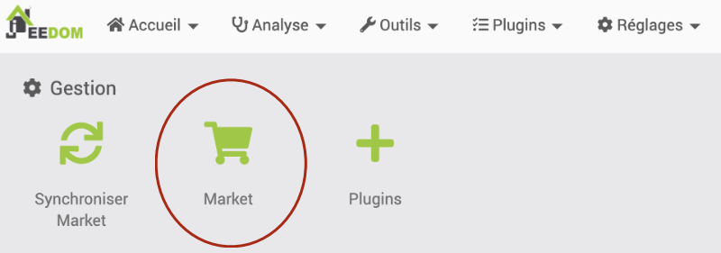
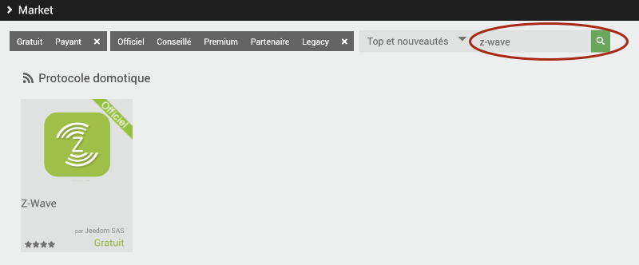
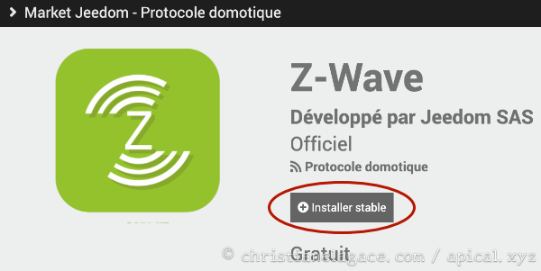
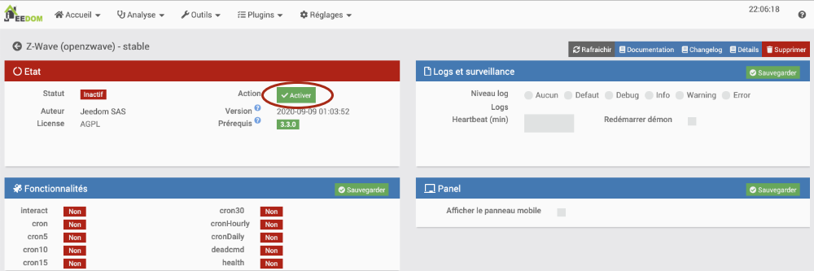
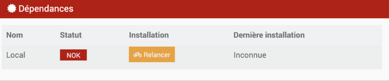
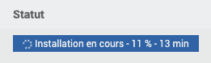
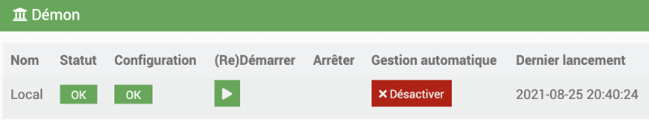

# 22. Commencer à travailler avec Jeedom {#chapitre-commencer_a_travailler_avec_jeedom}

## 22.1 Objets pour représenter la maison {#fiche-objets_pour_representer_la_maison}

Dans Jeedom, les objets permettent d'organiser les équipements selon une arborescence. Ceci permet de mieux nous y retrouver dans notre multitude d'appareils connectés.

Lorsque vous accédez à l'interface graphique de Jeedom, si vous n'avez encore créé aucun objet, vous obtiendrez le message « Aucun objet racine trouvé ».



Les objets représentent habituellement la maison et ses pièces.

Par exemple, pour une maison à étages :

* Premier objet : Maison
* Ensuite, un objet par étage dont l'objet parent est la maison.
* Et ensuite, un objet par pièce dont l'objet parent est l'étage.

Si vous avez des objets à l'exterieur de la maison, une autre configuration pourrait être :

* Premier objet : Tout
* Ensuite, un objet Maison et un objet Dehors qui ont Tout comme parent.
* Et ensuite, les objets sont organisés par étages et/ou par pièces.

Dans le fond, vous êtes libres d'organiser vos objets comme bon vous semble.

## Ajouter un objet

Pour ajouter un objet :

* Cliquez sur le menu Outils / Objets.

  
* Cliquez sur Ajouter.
* Entrez un nom d'objet représentera la pièce (ex : Tout, Dehors, Maison, Premier étage, Cuisine, Salon).
* Spécifiez l'objet parent de l'objet (sauf pour l'objet le plus haut dans la hiérarchie), et optionnellement son icône et une photo qui le représente.

  

## Pour plus d'information {#cookie-consent-banner}

« Comment créer un objet ( pièce ) sous Jeedom ». Domotique by Technoseb27. <https://domotiquetechnoseb27.com/2019/10/22/comment-creer-un-objet-piece-sous-jeedom/>

## 22.2 Configurer la clé USB Z-Wave sur Jeedom {#fiche-configurer_la_cle_usb_z-wave_sur_jeedom}

Pour que votre [boîte domotique Jeedom](17_jeedom_au_coeur_de_votre_systeme_domotique.md#fiche-installation_de_jeedom_et_premier_acces) puisse communiqur avec les objets connectés qui utilisent le protocole Z-Wave, vous devez lui brancher une clé USB Z-Wave et configurer la boîte pour qu'elle la reconnaisse.

* Branchez la clé USB Z-Wave sur le Raspberry Pi.
* Vous devez maintenant vous assurer que la clé est reconnue par le Pi. En effet, il y a parfois des incompatibilités entre la clé et le Raspberry Pi 4. Si c'est le cas, une solution intéresante consiste à brancher la clé dans un hub USB qui, lui, sera branché au Pi.

  Pour vérifier si la clé est reconnue, lancez cette commande sur le Pi (notez que le premier caractère est un L minuscule) :

  Terminal du Raspberry Pi

```
  lsusb
```

  Si la clé est reconnue, vous obtiendrez une ligne qui la décrit.

  Résultat à l'écran

```
  Bus 002 Device 001: ID 1d6b:0003 Linux Foundation 3.0 root hub
  Bus 001 Device 007: ID 0658:0200 Sigma Designs, Inc. Aeotec Z-Stick Gen5n(ZW090) - UZB
  BUS 001 DEVICE 006: id 1A40:0101 Terminus Technology Inc. Hub
  Bus 001 Device 003: ID 413c:2003 Dell Computers Corp. Keyboard
  Bus 001 Device 002: ID 2109:3431 VIA Labs, Inc. Hub
  Bus 001 Device 001: ID 1d6b:0002 Linux Foundation 2.0 root hub
```

  Selon le modèle de votre clé, vous pourriez aussi avoir Silicon Labs CP210x UART Bridge.
* Accédez à l'[interface d'administration de Jeedom,acceder](17_jeedom_au_coeur_de_votre_systeme_domotique.md#fiche-installation_de_jeedom_et_premier_acces).
* Rendez-vous dans le menu Plugins / Gestion des plugins.
* Cliquez sur l'icône Market. Note : si vous n'aviez pas créé de compte Market lors de votre premier accès à Jeedom, vous devez vous créer un compte Market et le configurer dans Jeedom. Les instructions sont données sur cette fiche : « [brancher\_un\_jeedom\_existant\_sur\_un\_nouveau\_compte\_market](32_jeedom_market.md#fiche-brancher_un_jeedom_existant_sur_un_nouveau_compte_market) ».

  
* Recherchez « Z-Wave ».

  
* Dans les résultats de recherche, choisissez Z-Wave, par Jeedom SAS puis effectuez l'installation stable.

  Note : si le plugin Z-Wave n'est pas disponible, essayez d'effectuer une [mise à jour de Jeedom](33_messages_et_mises_a_jour.md#fiche-le_centre_de_mise_a_jour_de_jeedom).

  
* Une fois l'installation complétée, acceptez de vous rendre sur la page de configuration du plugin. Vous pourrez retourner à la page de configuration plus tard à l'aide du menu Plugins / Gestion des plugins puis en cliquant sur l'icône Z-Wave.
* Si la clé est dans l'état inactif, cliquez sur le bouton Activer.

  
* Si vous ne réussissez pas à activer la clé, ceci peut dépendre d'une erreur de programmation du côté du plugin ou à une mauvaise compatibilité du plugin avec la dernière version du système d'exploitation. Rendez-vous dans le menu Analyse / Logs / zwavejs pour voir les messages d'erreur. Si vous voyez un message du genre « file\_exists(): Argument #1 ($filename) must be of type string, array given », suivez les instructions sur la fiche <a href="fiche-erreur\_activation\_de\_la\_cle\_z-wave\_file\_exists.md#erreur\_activation\_de\_la\_cle\_z-wave\_file\_exists">erreur\_activation\_de\_la\_cle\_z-wave\_file\_exists</a>.
* Normalement, l'activation le la clé USB lance automatiquement une mise à jour des dépendances. Dans la zone Dépendances, vous verrez alors le message  « Installation en cours ». Si, après la fin de la mise à jour, vous voyez NOK, cliquez sur Relancer.

  

  Armez-vous de patience, cette opération dure de longues minutes. Vous pourriez avoir l'impression que le processus est figé avant d'atteindre 100%. Par exemple, sur mon Jeedom, l'installation est restée figée à 11% pendant 13 minutes.

  

  Si l'opération échoue, vous pouvez trouver une trace des problèmes rencontrés en allant dans le menu Analyse / Logs / openzwave\_update.

  Parfois, un simple redémarrage du Raspberry Pi permet de compléter l'opération avec succès.
* Plus bas dans ce même écran, vous devez préciser le port du contrôleur Z-Wave. Pour trouver le port utilisé :
  + Débranchez la clé USB Z-Wave du Raspberry Pi puis rebranchez-la.
  + Dans une fenêtre Terminal sur le Raspberry Pi ou via SSH, entrez cette commande :

    Terminal du Raspberry Pi

```
    dmesg | grep tty
```

    Résultat à l'écran

```
    pi@jeedom:~ $ dmesg | grep tty
    [ 0.000000] Kernel command line: coherent\_pool=1M 8250.nr\_uarts=0 snd\_bcm2835.enable\_compat\_alsa=0 snd\_bcm2835.enable\_hdmi=1 video=HDMI-A-1:1680x1050M@60 smsc95xx.macaddr=D8:3A:DD:24:30:4D vc\_mem.mem\_base=0x3f000000 vc\_mem.mem\_size=0x3f600000 console=ttyS0,115200 console=tty1 root=PARTUUID=c764c245-02 rootfstype=ext4 elevator=deadline fsck.repair=yes rootwait
    [ 0.001837] printk: console [tty1] enabled
    [ 1.584526] fe201000.serial: ttyAMA0 at MMIO 0xfe201000 (irq = 36, base\_baud = 0) is a PL011 rev2
    [ 5.314135] cdc\_acm 1-1.3:1.0: ttyACM0: USB ACM device
    [ 159.584503] cdc\_acm 1-1.3:1.0: ttyACM0: USB ACM device
```
  + Le port à utiliser apparaîtra sur la dernière ligne. C'est la valeur à choisir dans la liste déroulante vis-à-vis Port du contrôleur Z-Wave. Notez que si le port désiré n'apparaît pas dans la liste déroulante, vous pouvez essayer de régler la situation en enlevant le crochet vis-à-vis Soft Reset dans la zone Configuration. Vous devrez ensuite redémarrer Jeedom.

  N'oubliez pas de cliquer sur Sauvegarder.
* Après cette manipulation, vous devriez voir le statut OK dans la zone Démon. Au besoin, cliquez sur (Re)Démarrer.

  

  Si vous obtenez un message d'erreur à propos du serveur MQTT, relancez l'installation des dépendances. Jeedom se chargera d'installer le serveur MQTT dont la clé Z-Wave a besoin.

  Si vous n'arrivez toujours pas à obtenir le statut OK, vous pouvez consulter le log openzwave pour obtenir plus d'information. Au besoin, pour obtenir plus d'informations, ajustez le niveau de log à Debug dans la zone Logs et surveillance puis cliquez à nouveau sur Redémarrer. Vous pouvez aussi demander à votre prof de vous aider :-)
* Quand le statut et la configuration sont à OK, votre boîte domotique est prête à [se connecter avec des appareils Z-Wave](29_commencer_a_travailler_avec_jeedom_suite.md#fiche-ajouter_un_appareil_connecte_z-wave_a_jeedom).

## Pour plus d'information

« Z-Stick Gen5 Utilitaire de sauvegarde ». La domotique de Nechry. <https://nechry-automation.ch/2017/10/23/z-stick-gen5-utilitaire-de-sauvegarde/>