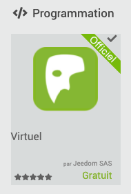
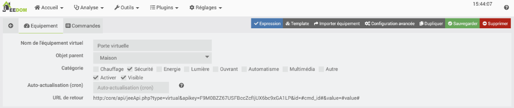
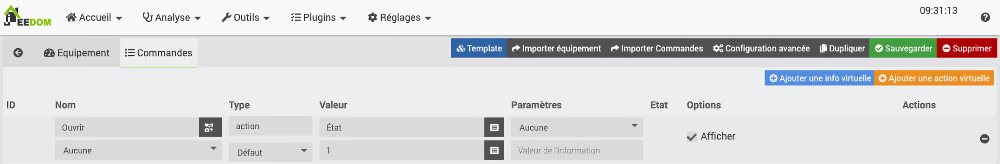
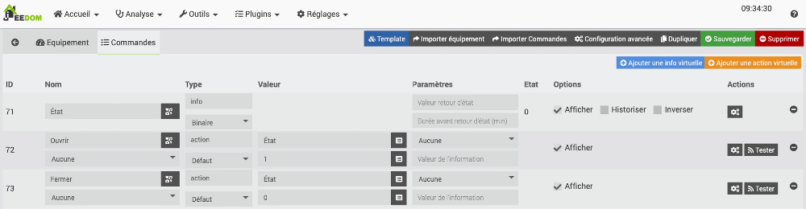
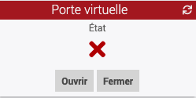
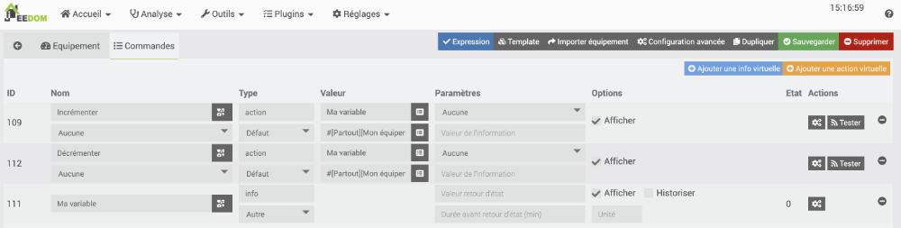
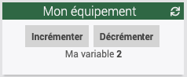

# 31. Les équipements virtuels dans Jeedom

## 31.1 Travailler avec le plugin Virtuel

Le plugin Virtuel permet de simuler un objet connecté.

Très pratique notamment pour faire des tests de scénarios (peut simuler la détection d'un téléphone sans avoir à entrer et à sortir de la maison).

Il peut également être utilisé pour créer un équipement virtuel qui, quand on l'allume ou l'éteint, allume ou éteint une série d'équipements réels.

## Installation du plugin

Pour installer le plugin Virtuel, rendez-vous dans Plugins / Gestion des plugins / Market.

Dans la zone de recherche, entrez ***virtuel***.

Cliquez sur le plugin Virtuel - officiel par Jeedom SAS.

Note : si le plugin n'est pas disponible, c'est peut-être parce que vous devez <a href="fiche-le_centre_de_mise_a_jour_de_jeedom.md#le_centre_de_mise_a_jour_de_jeedom">mettre à jour votre système</a>.

## Configuration du plugin

Dans l'interface de Jeedom, rendez-vous dans le menu Plugins / Gestion des plugins / Virtuel.

Activez le plugin en cliquant sur le bouton Activer dans la zone État.

## Ajout d'un équipement virtuel

Je vais vous montrer ici comment créer une porte virtuelle qui peut être dans l'état Ouverte ou Fermée.

Rendez-vous dans le menu Plugins / Programmation / Virtuel puis cliquez sur Ajouter.

Donnez un nom significatif à l'équipement (ex : Porte virtuelle).

Activez l'équipement et rendez-le visible car vous voudrez changer son état à partir du Dashboard.

Cliquez sur l'onglet Commandes puis cliquez sur le bouton Ajouter une action virtuelle.

Il faut une action virtuelle pour simuler chacune des valeurs que l'équipement virtuel peut prendre.

Dans le cas de la porte virtuelle, on peut avoir l'état Ouverte et l'état Fermée.

Créez une première action virtuelle avec ces informations :

* Nom : Ouvrir
* Type : action
* Dans la colonne Valeur, Nom information : État
* Dans la colonne Valeur, Valeur : 1

Cliquez sur Sauvegarder.

Vous remarquerez que Jeedom a ajouté une commande dont le nom est État.

Créez une deuxième action virtuelle avec ces informations :

* Nom : Fermer
* Type : action
* Dans la colonne Valeur, Nom information : État
* Dans la colonne Valeur, Valeur : 0

Cliquez sur Sauvegarder.

Puisque dans ce cas, l'équipement virtuel ne peut avoir que deux états, modifiez la ligne État pour que le type doit une information binaire.

Si vous comptez améliorer l'apparence de la tuile <a href="fiche-widget_pour_ajuster_l_apparence_d_une_tuile.md#widget_pour_ajuster_l_apparence_d_une_tuile">à l'aide des widgets</a>, vous pouvez enlever le crochet devant Afficher sur cette ligne. Sinon, conservez le crochet.

Une fois ces manipulations terminées, vous obtiendrez ceci :

Sur le Dashboard, vous pouvez maintenant voir une tuile pour votre équipement virtuel.

Il est possible de cliquer sur les boutons pour modifier l'état.

Notez que l'information État avec l'icône ne sera présente que si vous avez coché Afficher vis-à-vis la commande État.

## Pour plus d'information

« Jeedom tuto #5 | Les virtuels (plugin virtuel) | Utilisation ». YouTube - DomoTech. <https://www.youtube.com/watch?v=wiMh8rmfdKU>

« Créer ses commandes avec le plugin Virtuel et Jeedom ». Jeedomiser. <https://jeedomiser.fr/article/creer-ses-propres-commandes-avec-le-plugin-virtuel/>

## 31.2 Équipement virtuel qui incrémente une variable

Il est possible d'utiliser un périphérique virtuel pour stocker et pour modifier la valeur d'une variable. Cette valeur pourra être utilisée ailleurs, par exemple dans un scénario.

Je vous montre ici comment configurer un périphérique virtuel qui pourra manuellement incrémenter ou décrémenter sa propre valeur.

* Rendez-vous dans le menu Plugins / Programmation / Virtuel.
* Cliquez sur le + pour ajouter un équipement.
* Nommez l'équipement Mon équipement (ou autre nom selon le contexte).
* Rattachez-le à l'objet de votre choix pour pouvoir le voir dans le Dashboard. Ici, j'ai choisi de l'associer à l'objet Partout.
* Assurez-vous qu'il soit actif et visible.
* Cliquez sur l'onglet Commandes.
* Cliquez sur Ajouter une action virtuelle.
* Nom de la commande : Incrémenter.
* Nom information : nommez la variable que vous désirez contrôler. Ici, j'ai choisi de l'appeler Ma variable.
* Cliquez immédiatement sur Sauvegarder. Jeedom en profitera pour créer la commande de type info nommée Ma variable.
* Revenez à l'action virtuelle. Sous le nom de l'information, entrez sa valeur. Il s'agit d'une chaîne au format #[Objet][Equipement][Nom information]# + 1. Dans le cas présent, ce sera #[Partout][Mon équipement][Ma variable]# + 1.
* Créez une seconde action virtuelle qui permettra cette fois de décrémenter la variable.
* Pour que les informations apparaissent correctement sur la tuile dans le Dashboard, faites glisser la commande de type info sous les deux autres.

Sur le Dashboard, il est désormais possible d'incrémenter et de décrémenter la variable.

