
# 33. L'envoi de courriel dans Jeedom

## 33.1 Créer une adresse de courriel avec votre nom de domaine

La plupart des hébergeurs offrent gratuitement la gestion d'adresses de courriel qui se terminent par votre nom de domaine (ex : info@mondomaine.com). Selon votre forfait d'hébergement, vous pourrez créer une ou plusieurs adresses de courriel.

Ces courriels sont intéressants puisqu'ils donnent de la crédibilité à votre site Web ou à votre entreprise.

De plus, ils pourront être utilisés pour envoyer des courriels par programmation si votre fournisseur de courriel habituel (ex : GMail) ne le permet pas.

## Registraire vs hébergeur

Si vous avez réservé votre nom de domaine chez un registraire différent de votre hébergeur, c'est tout de même l'hébergeur qui vous offrira les courriels gratuits.

Dans mon cas, j'ai un nom de domaine dont le registraire est GoDaddy. Mais puisque je l'ai configuré pour qu'il utilise les serveurs de noms de mon hébergeur ([A2 Hosting](http://www.a2hosting.com/?aid=612cfb5127102&cid=edae5de3)), c'est chez A2 Hosting que je créerai mes comptes de courriel.

## Créer un compte de courriel avec cPanel

Voici les instructions pour créer un compte de courriel chez un hébergeur qui offre l'interface de getion cPanel.

* D'abord, assurez-vous que votre nom de domaine utilise les serveurs de noms de votre hébergeur (chez GoDaddy : DNS /  Serveurs de noms / Modifier / Personnalisé. Les serveurs de noms débuteront souvent par ns1, ns2, etc.
* Connectez-vous à votre cPanel chez votre hébergeur.
* Rendez-vous dans la section EMAIL puis cliquez sur Email Accounts.

  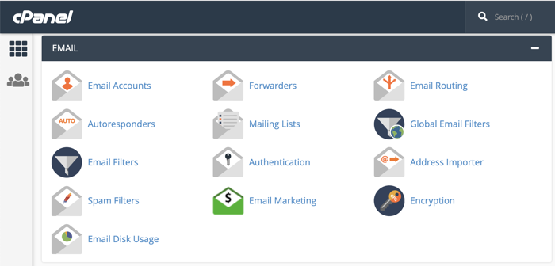
* Choisissez l'onglet Add Email Account.
* Entrez le nom du compte désiré, le nom de domaine et choisissez un mot de passe sécuritaire.

  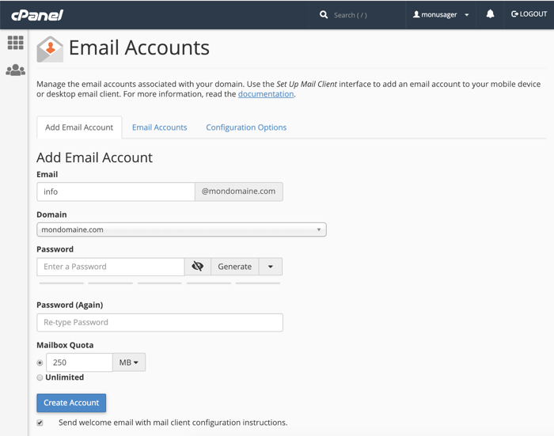

Note : votre hébergeur vous permet peut-être d'héberger des sites avec différents noms de domaine. Si c'est votre cas et que vous désirez créer un courriel pour un domaine qui n'est pas encore associé à votre compte, vous devrez d'abord associer ce domaine à votre compte. Rendez-vous dans l'option Addon Domains puis entrez le nom de domaine dans la case New Domain Name. Les autres cases seront remplies automatiquement.

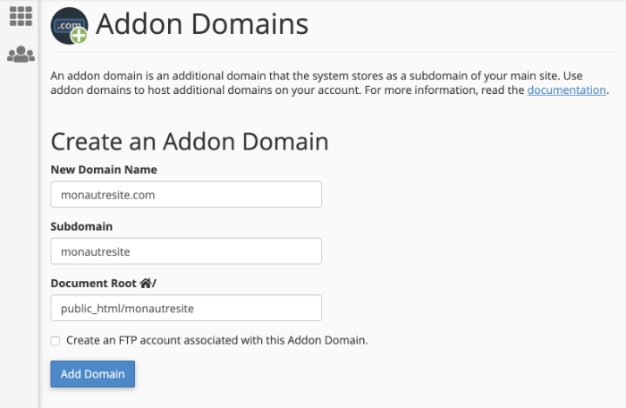

## Interface Web de courriel chez votre hébergeur

L'accès à vos courriels peut être fait à partir du cPanel, dans l'option Email Accounts / onglet Email Accounts / lien Access WebMail.

Vous obtiendrez le même écran à l'aide d'un URL au format mondomaine.com/webmail. Vous devrez vous connecter avec votre adresse de courriel et le mot de passe choisi lors de la création du compte de courriel.

La première fois que vous accédez à Webmail, vous devrez [choisir l'application cliente](https://documentation.cpanel.net/display/CKB/Which+Webmail+Application+Should+I+Choose) qui sera utilisée par défaut : Horde, rouncube ou SquirrelMail.

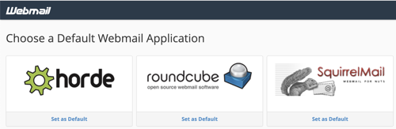

Je vous suggère d'utiliser Horde puisqu'au moment d'écrire ces lignes, c'était la seule application qui offre une interface mobile.

## Rassembler tous vous courriels au même endroit

Afin d'avoir accès à tous vous courriels à partir du même endroit, deux options s'offrent à vous :

* Rediriger votre nouveau courriel vers un courriel existant

  ou
* Ajouter votre nouveau courriel dans votre outil de gestion de courriels.

### Redirection de courriel

Si vous décidez de rediriger votre nouvelle adresse de courriel vers une autre, tous les messages envoyés à la nouvelle adresse apparaîtront dans la boîte de réception de l'autre courriel.

Cette technique présente deux limites :

* Il y a un délai entre le moment où le courriel est reçu dans la nouvelle adresse de courriel et celui où il est effectivement transféré à l'autre adresse. Ce délai peut être de quelques secondes mais également de quelques minutes.
* Dans la boîte de réception de l'autre courriel, il ne sera pas possible de différencier les courriels provenant de l'une ou de l'autre adresse de courriel.

Notez qu'après la redirection, vos courriels seront quand même disponibles dans l'interface Web de courriel du courriel original (à partir d'un URL au format mondomaine.com/webmail).

Pour rediriger votre courriel :

* Dans le cPanel, section EMAIL, cliquez sur Forwarders.
* Cliquez sur le bouton Add Forwarder.
* Entrez l'adresse de courriel qui doit être redirigée.
* Dans la zone Forward to Email Address, entrez l'adresse de courriel qui recevra les messages.

### Gestion des courriels avec votre application préférée

Pour intégrer votre nouveau courriel à votre outil de gestion de courriels préféré, rendez-vous dans le cPanel / Email Accounts et cliquez sur Connect Devices à côté de l'adresse de courriel désirée.

Vous trouverez à cet endroit les informations pour intégrer votre nouvelle adresse à votre outil de courriel préféré, notamment le serveur entrant, le serveur sortant et les ports à utiliser.

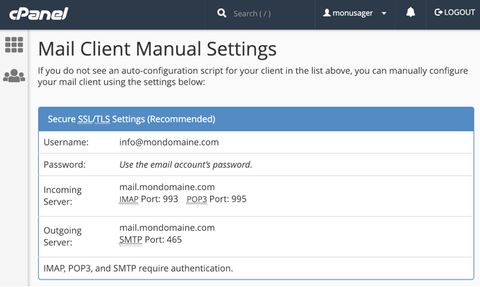

## 33.2 Tester la connexion SMTP avec Telnet

Plusieurs facteurs peuvent faire en sorte qu'un site Web ne réussisse pas à envoyer un courriel.

Le principal acteur dans l'envoi de courriel est le serveur SMTP (Simple Mail Transfer Protocol). En testant la communication avec le serveur SMTP à la ligne de commande, nous éliminons tous les problèmes potentiels dus à la programmation du site Web, ce qui facilite le travail de débogage.

## Installation de Telnet

Telnet (terminal network ou telecommunication network, ou encore teletype network)[1](https://fr.wikipedia.org/wiki/Telnet) est un protocole de communication. C'est également un outil en ligne de commande pour tester l'envoi de courriel.

Pour installer Telnet sous Windows, rendez-vous dans Panneau de configuration / Programmes et fonctionnalités / Activer ou désactiver des fonctionnalités Windows / puis cochez Client Telnet.

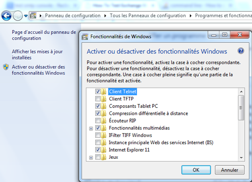

Pour installer Telnet sous Mac, vous avez besoin de Homebrew.

Si Homebrew n'est pas déjà installé :

Terminal

/usr/bin/ruby -e "$(curl -fsSL https://raw.githubusercontent.com/Homebrew/install/master/install)"

Pour installer Telnet :

Terminal

brew install telnet

## Connexion au serveur SMTP

Pour vous connecter au serveur d'envoi de courriel, suivez ces instructions. Elles sont les mêmes sous Windows et sous Mac.

* D'abord, vous devez avoir en main les informations sur votre compte de courriel. Chez l'hébergeur où vous avez configuré votre adresse de courriel, rendez-vous dans le cPanel puis cliquez sur Email Accounts.
* Vis-à-vis l'adresse de courriel que vous désirez tester, cliquez sur Connect Devices.
* Dans la page qui apparaît, les informations dont vous aurez besoin sont dans la section Mail Client Manual Settings.

  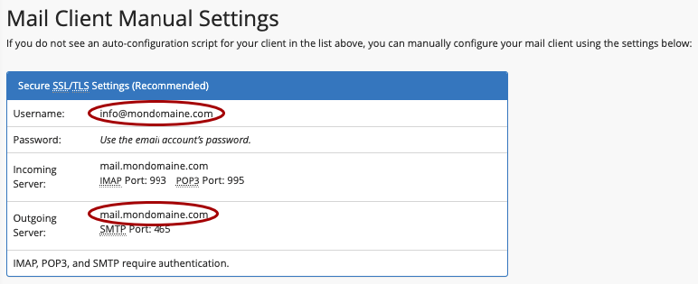
* Ouvrez une fenêtre de commande.
* Entrez la commande telnet suivie du nom du serveur SMTP (Information que vous trouverez sous Outgoing Server, généralement sous la forme smtp.mondomaine.com ou mail.mondomaine.com) et du numéro de port.

  Notez que le port utilisé sera généralement l'un des suivants :

  + 25 : connexion entre serveurs ou connexion client-serveur non sécurisée
  + 465 : connexion entre client et serveur nécessitant une authentification, à utiliser si 587 ne fonctionne pas
  + 587 : connexion entre client et serveur nécessitant une authentification, généralement ceci est le meilleur choix

  Ex :

  Terrminal

  telnet  *mail.mondomaine.com* 587

  ou

  Terminal

  telnet

   

  open *mail.mondomaine.com* 587

  Si la commande fonctionne, vous devriez obtenir une réponse débutant par 220 suivi du nom de domaine puis de la version du protocole SMTP. La sortie exacte pourra être différente selon le fournisseur.

  Résultat à l'écran

  MBPdeMonNom:~ monnom$ telnet mail.mondomaine.com 587  
  Trying 999.999.999.999...  
  Connected to mail.mondomaine.  
  Escape character is '^]'.  
  220-az1-ss23.fournisseur.com ESMTP Exim 4.93 #2 Mon, 02 Nov 2020 11:17:39 -0700   
  220-We do not authorize the use of this system to transport unsolicited,   
  220 and/or bulk e-mail.
* Remarquez le message « We do not authorize the use of this system to transport unsolicited, and/or bulk e-mail. ». Il ne fait que vous avertir que vous n'êtes pas autorisés à envoyer du courriel non sollicité ni du courriel en lot.
* Lancez la communication entre le client Telnet et le serveur SMTP à l'aide de la commande EHLO suivie de localhost.

  Note : la commande HELO existe également mais certains protocoles SMTP ne la reconnaissent pas.

  Remarquez que les commandes dans la console Telnet sont montrées ici en majuscules mais qu'elles fonctionneront également si vous les entrez en minuscules.

  Console Telnet

  EHLO localhost

  Le serveur SMTP répondra en donnant un code 250 suivi d'une liste des commandes qu'il supporte. Ces commandes pourront être différentes selon le serveur SMTP que vous tentez de joindre.

  Résultat à l'écran

  EHLO localhost  
  250-az1-ss23.fournisseur.com Hello localhost [999.999.999.999]  
  250-SIZE 52428800  
  250-8BITMIME  
  250-PIPELINING  
  250-AUTH PLAIN LOGIN  
  250-STARTTLS  
  250 HELP

## Code et mot de passe du compte de courriel

Attention : l'utilisation de Telnet ouvre un trou de sécurité puisque les informations transigent en clair sur le réseau.   
  
Si vous avez réussi à obtenir une réponse du serveur SMTP avec la liste des commandes 250, vous pouvez arrêter ici, aucun risque n'a été encouru à date.  
  
Si vous souhaitez poursuivre jusqu'à l'envoi d'un courriel réel, vous pouvez poursuivre mais sachez que vos informations d'authenficiation, même si elles sont encodées avec base64 (algorithme qui peut être décrypté), seront transmises en clair.

Si vous utilisez un serveur sécurisé, l'envoi d'un courriel débutera par le code d'usager et le mot de passe du compte de courriel à partir duquel l'envoi doit se faire.

Le code d'usager sera l'adresse de courriel complète, par exemple info@mondomaine.com.

Vous devrez crypter votre code d'usager et votre mot de passe en base64. Ceci peut être réalisé avec un outil en ligne, par exemple [https://www.base64encode.org](https://www.base64encode.org/).

Console Telnet

AUTH LOGIN

 

code-en-base64

 

mdp-en-base64

Il est possible que le serveur affiche un numéro de ligne et une série de caractères après chaque entrée.

Si les informations sont bonnes, le serveur répondra Authentication succeeded.

Résultat à l'écran

AUTH LOGIN  
334 VXNlcm5hbWU6  
bm8tcmVwbHlAbW9uZG9tYWluZS5jb20=  
334 UGFzc3dvcmQ6  
bW90ZGVwYXNzZWRlbW9uY29tcHRl  
235 Authentication succeeded

## FROM et TO

Il faut maintenant spécifier les adresses de courriel qui apparaîtront dans les zones From (De) et To (À).

Le From sera souvent la même adresse que le compte utilisé pour l'envoi mais ceci n'est pas une obligation. Notez cependant que certains serveurs refusent que l'adresse de la clause FROM provienne d'un nom de domaine différent.

Console Telnet

MAIL FROM:annie.gagnon@mondomaine.com

 

RCPT TO:toto.lacasse@hotmail.com

 

DATA

telnet vous indiquera après chaque ligne si tout est correct.

Message à l'écran

MAIL FROM:annie.gagnon@mondomaine.com  
250 OK  
RCPT TO:toto.lacasse@hotmail.com  
250 Accepted  
DATA  
354 Enter message, ending with "." on a line by itself

## Corps du message

Si l'étape précédente a fonctionné, vous êtes maintenant prêt à entrer le message en tant que tel. La fin du message sera notée par un point seul sur sa ligne.

Console Telnet

Subject: message test

 

Ceci est un message test envoyé via telnet.

 

.

Vous pouvez finalement refermer la connexion en entrant la commande QUIT :

Console Telnet

QUIT

Consultez le courriel de destination : si les configurations ont été bien entrées, le message devrait y être.

Notez que le courriel pourrait avoir été placé dans la boîte de courriels indésirables. Vérifiez bien!

## En résumé

Voici la liste des commandes à utiliser pour tester l'envoi de courriel. Je vous suggère de les copier dans un document texte en y insérant les vraies informations à utiliser.

De cette façon, il sera plus facile d'effectuer vos tests.

Terminal

telnet monserveursmtp.com 587

 

EHLO localhost

 

AUTH LOGIN

 

code-en-base64

 

mdp-en-base64

 

MAIL FROM:annie.gagnon@mondomaine.com

 

RCPT TO:toto.lacasse@hotmail.com

 

DATA

 

Subject: message test

 

Ceci est un message test envoyé via telnet.

 

.

 

QUIT

## Pour plus d'information

« Email - How to verify your SMTP connection and parameters (TSL/SSL) with TELNET ? ». DataCadamia. <https://datacadamia.com/marketing/email/smtp_telnet>

« SMTP Commands Reference ». SamLogic Software. <https://www.samlogic.net/articles/smtp-commands-reference.htm>

« Simple Mail Transfer Protocol ». Wikipédia. <http://fr.wikipedia.org/wiki/Simple_Mail_Transfer_Protocol>

## Source

1. « Telnet ». Wikipédia. <https://fr.wikipedia.org/wiki/Telnet>

## 33.3 Envoyer un courriel avec Jeedom

Il est possible de demander à Jeedom de vous envoyer une notification par courriel lorsqu'un événement se produit.

Pour y arriver, vous devez installer le plugin gratuit E-mail - officiel par Jeedom SAS.

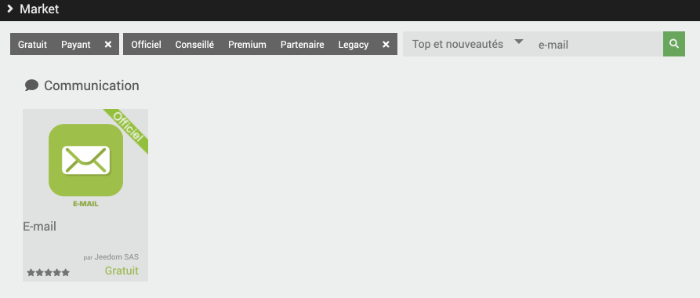

Une fois le plugin installé, vous devrez l'activer : Plugins / Gestion des plugins / cliquer sur Mail.

Dans la zone État, cliquez sur Activer.

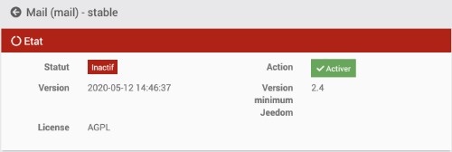

## Configuration du plugin

Pour configurer le plugin, rendez-vous dans Plugins / Communication / Mail.

Cliquez sur le + pour ajouter un équipement (en fait, c'est un élément de configuration que vous ajouterez).

Donnez un nom de votre choix à l'équipement, par exemple « Courriel administrateur ».

Vous devez ensuite remplir le formulaire pour indiquer avec quel serveur, de la part de qui et vers qui le courriel sera expédié.

Je vous conseille de <a href="fiche-creer\_une\_adresse\_de\_courriel\_avec\_votre\_nom\_de\_domaine.md#creer\_une\_adresse\_de\_courriel\_avec\_votre\_nom\_de\_domaine">travailler avec une adresse de courriel qui utilise un nom de domaine qui vous appartient</a>, par exemple jeedom@mondomaine.com. Ceci assurera que le serveur SMTP acceptera d'envoyer le courriel à partir d'une application tierce.

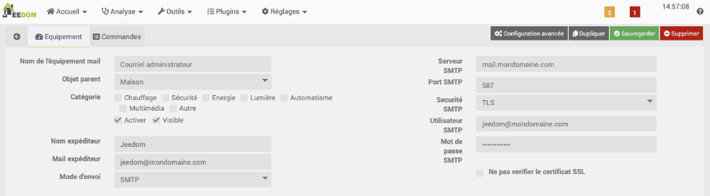

Il faut ensuite indiquer à qui le courriel sera envoyé.

Pour y arriver, cliquez sur l'onglet Commandes.

Vous pouvez entrer autant d'adresses que désiré.

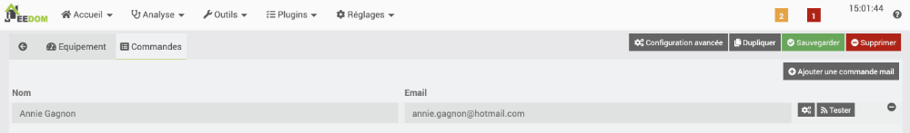

## Utilisation du courriel dans un scénario

Une fois le courriel bien configuré, il est possible de l'utiliser dans un scénario.

Il apparaîtra parmi les équipements.

Une fois sélectionné, Jeedom vous permettra de spécifier le titre du courriel ainsi que le message à envoyer.

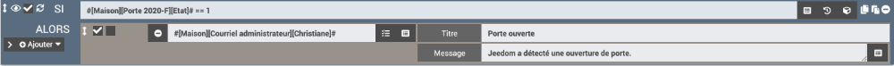

## Pour plus d'information

« Plugin Mail ». Jeedom. <https://doc.jeedom.com/fr_FR/plugins/communication/mail/>