# 71. Les tableaux de bord

## 71.1 Créer un tableau de bord personnalisé

Par défaut, dans Home Assistant, un tableau de bord est disponible dans le menu Aperçu et il contient absolument tout ce qui est ajouté à Home Assistant.

Ceci mène souvent à un tableau de bord plutôt encombré.

Il est possible de modifier le tableau de bord original ou encore de créer des tableaux de bord supplémentaires.

Les informations sur un tableau de bord sont stockées dans un fichier dont le nom est au format /mnt/data/supervisor/homeassistant/.storage/lovelace.dashboard\_nom\_du\_tableau ou, selon votre version de Home Assistant, /mnt/data/supervisor/homeassistant/.storage/lovelace.nom\_du\_tableau.

Le nom de ce fichier vient du fait qu'auparavant, l'outil d'édition des tableaux de bord de Home Assistant s'appelait Lovelace.

Attention : il est préférable de ne pas modifier le tableau de bord original (celui nommé Aperçu).  
En effet, si vous le modifiez ou si vous y ajoutez d'autres onglets, Home Assistant n'y ajoutera plus automatiquement les entités créées par après.

Si vous avez modifié le tableau de bord Aperçu, [apical\_lien\_interne][reinitialiser\_le\_tableau\_de\_bord\_apercu,il est possible de le réinitialiser][/apical\_lien\_interne] afin que Home Assistant recommence à le gérer automatiquement.

Prenez note que les fonctionnalités du tableau de bord ont beacoup évolué depuis quelques années. Soyez prudents lorsque vous recherchez des informations sur le Web ou à l'aide d'un outil d'intelligence artificielle. Les informations trouvées pourraient ne plus être exactes.

Pour créer un nouveau tableau de bord :

* Cliquez sur le menu Paramètres / Tableaux de bord.
* Cliquez sur le bouton Ajouter un tableau de bord dans le coin inférieur droit.
* Sélectionnez le type de tableau de bord. Je vais ici faire la démonstration avec un nouveau tableau de bord vide.

  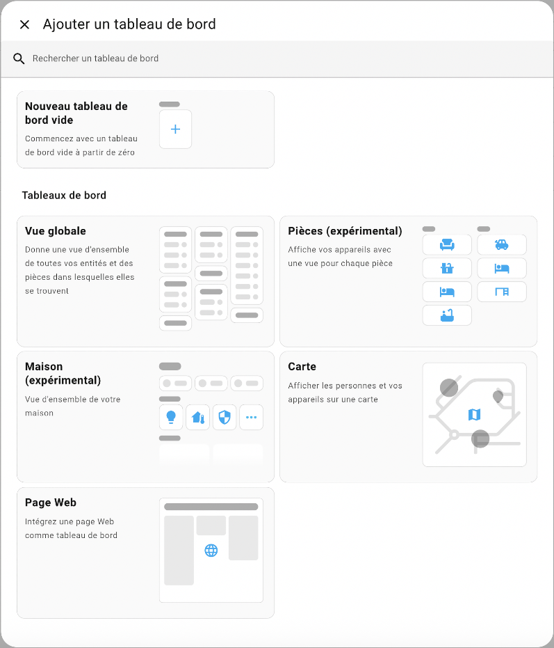
* Remplissez les informations demandées.

  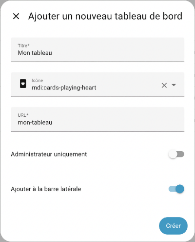
* Le tableau de bord apparaît désormais dans la liste des tableaux de bord. Cliquez sur Ouvrir à droite de la ligne de votre nouveau tableau de bord.

  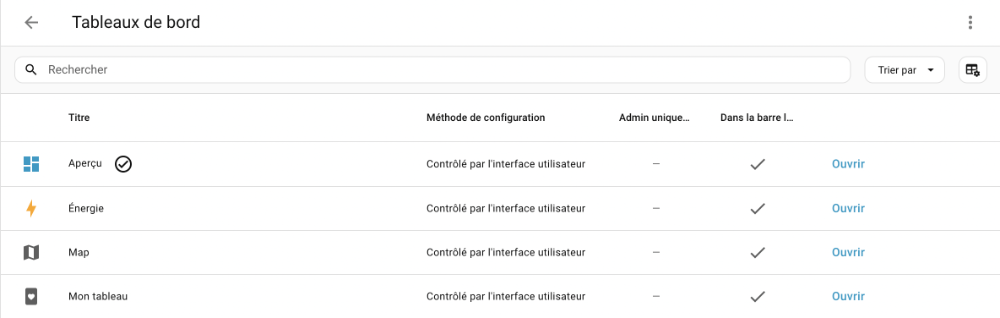
* Cliquez sur le crayon dans le coin supérieur droit. La barre supérieure de l'écran est maintenant grise pour indiquer que le tableau de bord est en édition.

  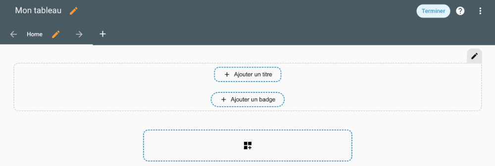
* Pour ajouter des cartes au tableau de bord, vous devez d'abord ajouter une section. Cliquez dans la grande zone pointillée au centre de l'écran.

  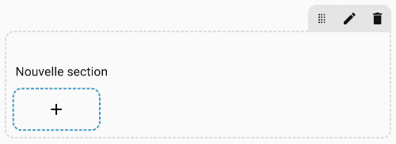
* Renommez la section. Si vous n'avez pas d'inspiration, un nom générique tel que Mes cartes fera l'affaire.
* Ajoutez maintenant une carte en cliquant sur le + dans la zone pointillée.
* L'écran vous présente une série de cartes parmi lesquelles vous devez choisir.

  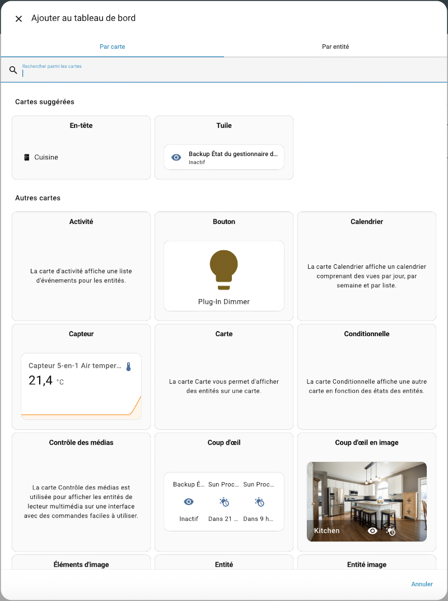
* Voici quelques combinaisons intéressantes :
  + La carte Entité permet d'afficher la valeur d'une entité réelle ou virtuelle. Si l'entité le permet, un clic sur la carte permettra de modifier la valeur de l'entité.

    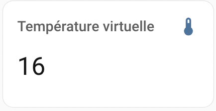
  + La carte Bouton associée à une prise intelligente (ou autre récepteur) : vous pourrez changer l'état du récepteur en cliquant dessus.

    

    La carte Bouton permet également d'effecteur d'autres opérations, par exemple appeler un service (exécuter une action) ou encore [apical\_lien\_interne][lancer\_une\_automatisation\_a\_l\_aide\_d\_un\_bouton,lancer une automatisation][/apical\_lien\_interne].
  + La carte Capteur associée à un capteur

    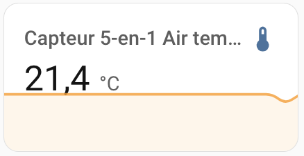
  + La carte Jauge associée à un capteur

    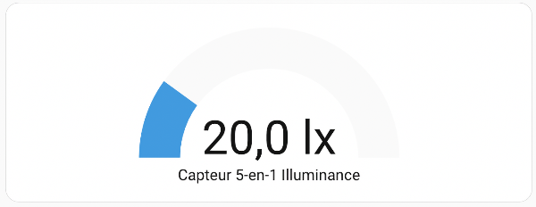
  + La carte Prévision météo associée à l'outil Météo installé par défaut dans Home Assistant

    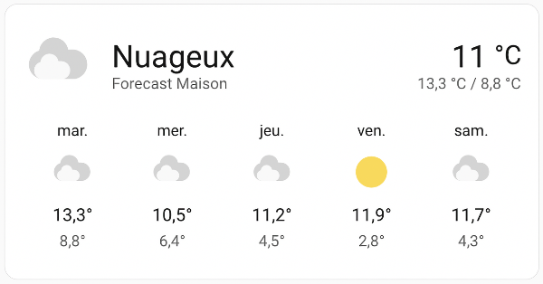
  + La carte Carte associée à tous les téléphones cellulaires que vous suivez

    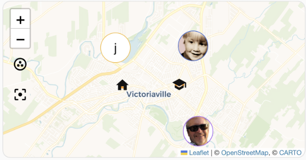
  + Les cartes Markdown permettent d'inscrire un texte et de le formater à l'aide de la [syntaxe Markdown](https://commonmark.org/help/) ou encore d'utiliser [apical\_lien\_interne][les\_modeles\_dans\_home\_assistant,des modèles][/apical\_lien\_interne].

    Pour plus d'information sur ce type de carte, consultez la fiche « [apical\_lien\_interne]les\_cartes\_de\_type\_markdown[/apical\_lien\_interne] ».

    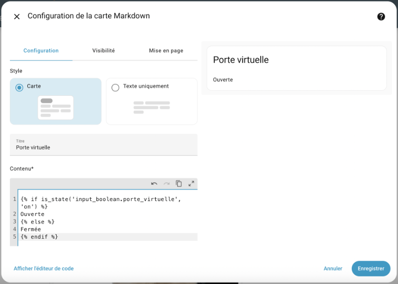
  + Les cartes Conditionnelle et Filtre d'entité pourront afficher des informations conditionnellement à certains états.
  + Les cartes Pile horizontale, Pile verticale et Grille servent à gérer la mise en forme du tableau de bord.
  + etc.

Dans l'écran avec la barre supérieure grise, vous pouvez cliquer sur les trois points verticaux et choisir Éditeur de configuration afin de voir le code YAML associé à l'ensemble de vos tableaux de bord.

Fichier /mnt/data/supervisor/homeassistant/.storage/lovelace (YAML)

views:  
  - title: Home  
    sections:  
    - type: grid  
      cards:  
      - type: heading  
        heading\_style: title  
         heading: Mes cartes  
      - type: entity  
         entity: input\_number.temperature\_virtuelle  
      - show\_name: true  
         show\_icon: true  
         type: button  
         entity: light.plug\_in\_dimmer  
      - type: sensor  
         entity: sensor.capteur\_5\_en\_1\_air\_temperature  
         graph: line  
      - type: gauge  
         entity: sensor.capteur\_5\_en\_1\_illuminance  
      - show\_current: true  
         show\_forecast: true  
         type: weather-forecast  
         entity: weather.forecast\_maison  
         forecast\_type: daily  
       - type: map  
         entities:  
           - entity: person.christiane  
           - entity: device\_tracker.justin  
           - entity: zone.home  
           - entity: zone.cegep  
           - entity: person.yves  
         theme\_mode: auto  
       - type: markdown  
         content: |-  
              
           Porte virtuelle ouverte  
             
           Porte virtuelle fermée  
           

## 71.2 Réinitialiser le tableau de bord Aperçu

Il est préférable de [apical\_lien\_interne][creer\_un\_tableau\_de\_bord\_personnalise,créer un tableau de bord personnalisé][/apical\_lien\_interne] plutôt que de modifier le tableau de bord Aperçu.

En effet, le tableau de bord Aperçu est géré par Home Assistant. Dès que vous en prenez le contrôle, même si vous ne faites qu'ajouter un onglet, Home Assistant n'y ajoutera plus les nouvelles entités créées.

Home Assistant vous avertit d'ailleurs de ce fait lorsque vous cliquez sur le crayon pour modifier Aperçu.

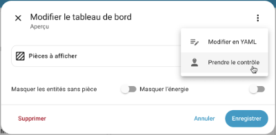

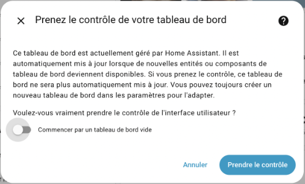

Si vous avez modifié le tableau de bord Aperçu, il est possible de le réinitialiser.

* Rendez-vous dans le menu Aperçu.
* Cliquez sur le crayon.
* Si la barre supérieur de l'écran ne devient pas immédiatement grise et que vous voyez la fenêtre Modifier le tableau de bord, c'est que vous n'avez jamais modifié ce tableau de bord. Vous n'avez rien d'autre à faire.
* Si la barre supérieure de l'écran devient grise, vous devez effectuer la réinitialisation. Cliquez sur les trois points verticaux et choisissez Éditeur de configuration.
* Copiez tout le code YAML dans un fichier texte et enregistrez-le à l'endroit de votre choix. Ceci vous aidera à tout remettre en place au besoin.
* Supprimez tout le code YAML puis enregistrez.
* Le tableau de bord Aperçu est de nouveau géré par Home Assistant et il vous présente les informations sur toutes vos entités.

## 71.3 Utiliser vos propres images dans un tableau de bord

Lorsque vous créez un tableau de bord personnalisé, quelques types de cartes vous permettent de travailler avec vos propres images.

## Images disponibles

Les images que vous pouvez afficher peuvent provenir du Web et être identifiées par un URL.

Mieux encore, elles peuvent être stockées directement sur le Pi.

C'est cette dernière alternative que nous allons utiliser ici.

Pour que l'image soit disponible localement à partir de Home Assistant, vous devez d'abord créer le dossier www sous /mnt/data/supervisor/homeassistant .

Si vous travaillez à l'aide de File Editor ceci sera réalisé en cliquant sur l'icône New Folder alors que vous êtes dans le dossier /mnt/data/supervisor/homeassistant (ceci est le dossier config).

Vous pouvez également créer le dossier directement au terminal HassOS.

Dans tous les cas, il faut redémarrer Home Assistant pour qu'il reconnaisse le dossier.

La copie du fichier de l'image peut être réalisée à l'aide de différentes techniques :

* à l'aide de File Editor : cliquez sur l'enveloppe blanche puis sélectionnez le dossier www. L'icône Upload File vous permettra de téléverser votre image.

  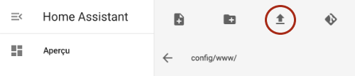
* à l'aide de la commande scp :

  Terminal de l'ordinateur

  scp -O -P 22222 /chemin/monimage.png root@192.168.1.145:/mnt/data/supervisor/homeassistant/www

Une fois l'image copiée dans ce dossier, vous pourrez y accéder à partir de l'URL http://192.168.1.145:8123/local/monimage.png

ou, plus simplement /local/monimage.png.

## Carte Image

Une fois que l'image est disponible sur le Pi, elle peut être affichée sur une carte de type Image comme suit :

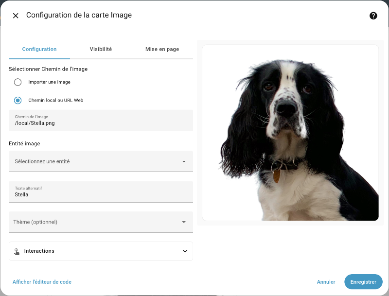

## Carte Markdown

La carte Markdown est encore plus puissante puisqu'elle permet entre autres de faire un affichage conditionnel grâce aux [apical\_lien\_interne][les\_modeles\_dans\_home\_assistant,modèles][/apical\_lien\_interne].

Dans sa forme la plus simple, la carte Markdown affichera une image comme suit. Remarquez l'utilisation du langage de balisage [Markdown](https://commonmark.org/help/) pour identifier l'image, au format :

Markdown

Remarquez que le texte entre crochets carrés représente l'attribut alt de l'image.

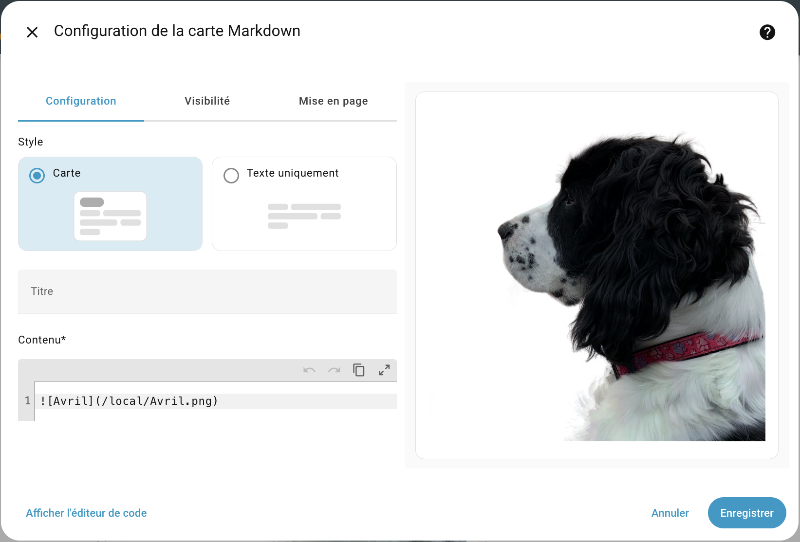

## Pour plus d'information

« HTTP - Hosting files ». Home Assistant. <https://www.home-assistant.io/integrations/http#hosting-files>

## 71.4 Assigner un appareil à une pièce

Pour bien visualiser vos appareils dans le tableau de bord Home Assistant, il est intéressant d'assigner chacun à une pièce de la maison.

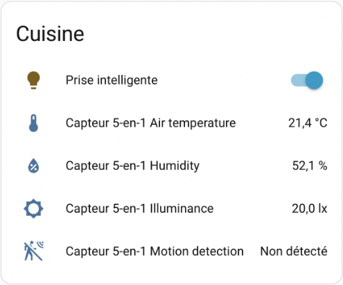

Vous avez la possibilité de créer autant de pièces que désiré :

* Rendez-vous dans le menu Paramètres / Pièces, étiquettes et zones / onglet Pièces.
* Cliquez sur Créer une pièce.
* Donnez un nom à la pièce et, si désiré, ajoutez-lui une image.

Ceci permet de voir un tableau de bord de tout ce qui concerne cette pièce.

## Assignation à l'interface de l'interface Web

Pour assigner un appareil à une pièce, la technique la plus simple est la suivante :

* Rendez-vous dans le menu Paramètres / Appareils et services / onglet Appareils.
* Cliquez sur l'appareil que vous désirez modifier.
* Cliquez sur le crayon dans le coin supérieur droit de l'écran.
* Sélectionnez la pièce à laquelle l'appareil doit être associé.

  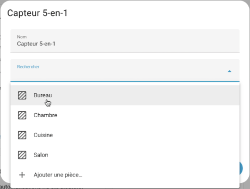

##

## 71.5 Changer l'icône d'une entité selon son état

Dans le tableau de bord de Home Assistant, il est possible de configurer une carte pour que son icône soit différente selon l'état de l'entité.

Les icônes seront choisies dans [apical\_lien\_interne][icones\_material\_design\_dans\_home\_assistant,la bibliothèque Material Design][/apical\_lien\_interne].

Dans cette fiche :

* [Carte Markdown](#markdown)
* [Intégration Template](#template)
  + [Exemple avec une carte de type Entité](#entite)
  + [Exemple avec une carte de type Bouton](#bouton)
* [Et si on avait besoin de vérifier plus de deux états?](#elif)

## Carte Markdown

La carte de type Markdown permet de spécifier des conditions à l'aide d'un [apical\_lien\_interne][les\_modeles\_dans\_home\_assistant,modèle][/apical\_lien\_interne].

Dans sa forme la plus simple, le modèle fera afficher un texte différent selon l'état. C'est déjà mieux que le texte « Activé » ou « Désactivé ».

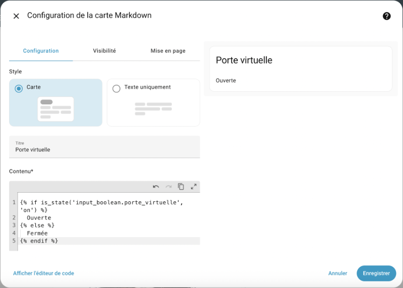

Pour afficher une icône, ou mieux, une icône suivie d'un texte, entrez plutôt ceci.

Remarquez que la carte Markdown est capable d'interpréter du HTML.

Modèle

  
  <ha-icon icon="mdi:door-open"></ha-icon> Ouverte  
  
  <ha-icon icon="mdi:door-closed"></ha-icon> Fermée  


Pour la condition, ce code utilise le langage [Jinja2](https://palletsprojects.com/projects/jinja). Sa syntaxe ressemble à celle de Python.

La carte prendra désormais cette apparence sur le tableau de bord.

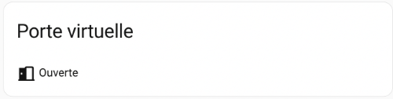 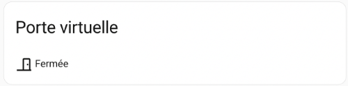

## Intégration Template

L'intégration [Template](https://www.home-assistant.io/integrations/template/), installée par défaut dans Home Assistant, est une autre solution pour créer une entité dont l'icône pourra être différente selon l'état d'un capteur.

L'utilisation de cette intégration se fait en ajoutant une entrée dans le fichier configuration.yaml avec la mention platform: template.

La technique consiste à ajouter une couche par-dessus un capteur. Dans le tableau de bord, on ajoutera une carte qui travaille avec cette couche plutôt que directement avec le capteur.

Dans l'exemple qui suit, les couleurs permettent de faire des liens entre les différentes parties du code.

La valeur de l'entité provient d'un capteur virtuel de type input\_boolean. Il s'agira du mot Activé ou Désactivé.

L'icône de l'entité est définie par un modèle qui réagit à l'état de ce même capteur virtuel.

Fichier configuration.yaml

sensor:  
  - platform: template  
    sensors:  
      porte\_virtuelle:  
        friendly\_name: Porte virtuelle  
        value\_template: "{{ states('input\_boolean.porte\_virtuelle') }}"  
        icon\_template: >-  
            
            mdi:door-open  
            
            mdi:door-closed  
          

Il est possible de modifier la valeur pour utiliser un texte plus significatif.

Fichier configuration.yaml

sensor:

 

  - platform: template  
    sensors:  
      porte\_virtuelle:  
        friendly\_name: Porte virtuelle  
        value\_template: >-  
            
            Ouverte  
            
            Fermée  
            
        icon\_template: >-  
            
            mdi:door-open  
            
            mdi:door-closed  
          

Après avoir [apical\_lien\_interne][Editer\_le\_fichier\_configuration\_yaml,rechargé les configurations,rechargement][/apical\_lien\_interne], il est possible d'ajouter une carte dans le tableau de bord pour représenter cette nouvelle entité.

### Exemple avec une carte de type Entité

Dans l'exemple précédent, l'entité s'appelle porte\_virtuelle et elle prend sa valeur d'une autre entité qui  s'appelle elle aussi porte\_virtuelle.

Lors de la configuration de la carte, il faut prendre soin de choisir l'entité dont [apical\_lien\_interne][qu\_est-ce\_qu\_une\_entite,le domaine,identifiant][/apical\_lien\_interne] est sensor puisque c'est pour elle que l'icône personnalisée a été définie.

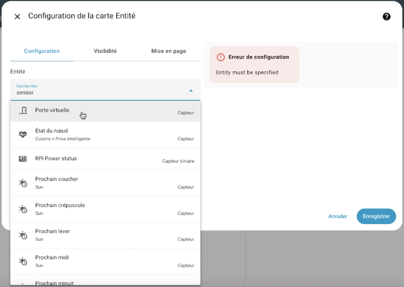

Voici la carte d'entité dont l'icône et la valeurs proviennent de l'entité sensor.porte\_virtuelle.

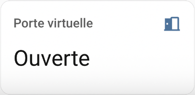 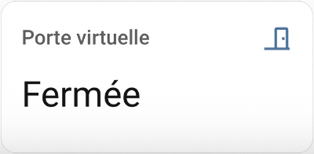

En comparaison, voici ce qu'on aurait obtenu avec une carte d'entité associée à l'entité input\_boolean.porte\_virtuelle.

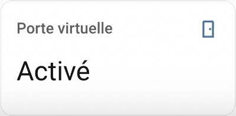 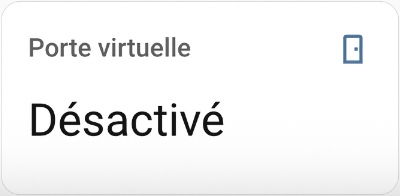

### Exemple avec une carte de type Bouton

Un résultat encore plus intéressant peut être obtenu à l'aide d'une carte de type Bouton.

Ici aussi, il faut associer la carte à l'entité sensor.porte\_virtuelle, soit celle pour laquelle l'icône change selon l'état.

Un clic sur la carte modifiera l'état de l'entité input\_boolean.porte\_virtuelle, ce qui affectera automatiquement la valeur et l'icône de l'autre.

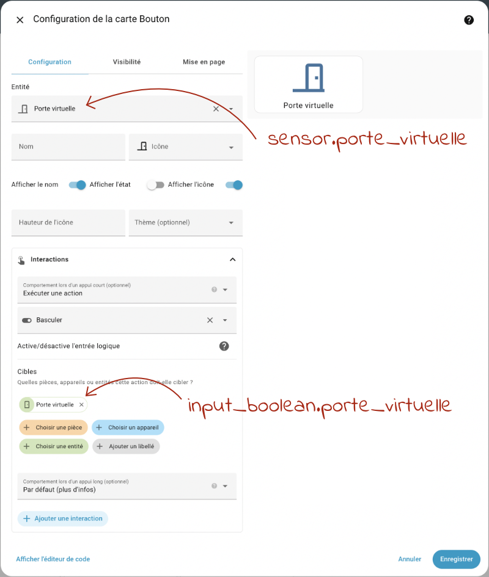

Et voilà le résultat!

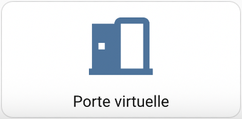 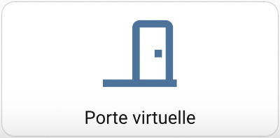

## Et si on avait besoin de vérifier plus de deux états?

Dans les exemples précédents, on avait toujours le choix entre deux états. Un if et un else étaient suffisants.

Je vous montre ici comment faire si on doit choisir parmi trois états différents.

Fichier configuration.yaml

icon\_template: >-  
    
    mdi:rocket-launch  
    
    mdi:scale-balance  
    
    mdi:alert  
  

## 71.6 lovelace-card-mod - Pour styliser le tableau de bord

Le plugin [lovelace-card-mod](https://github.com/thomasloven/lovelace-card-mod) permet de styliser le tableau de bord de Home Assistant en appliquant des règles CSS aux cartes que vous y ajoutez.

## Installation

Le plugin lovelace-card-mod est disponible sur GitHub mais la commande git n'est pas disponible dans le terminal HassOS alors nous allons utiliser une autre procédure pour l'installer :

* Accédez au terminal HassOS en branchant clavier et écran au Raspberry Pi ou [apical\_lien\_interne][se\_brancher\_a\_home\_assistant\_via\_ssh,via SSH][/apical\_lien\_interne].
* Vérifiez s'il existe un dossier www sous /mnt/data/supervisor/homeassistant. S'il n'existe pas, créez-le puis redémarrez le Raspberry Pi.
* Rendez-vous sur la page GitHub de l'extension : <https://github.com/thomasloven/lovelace-card-mod>

  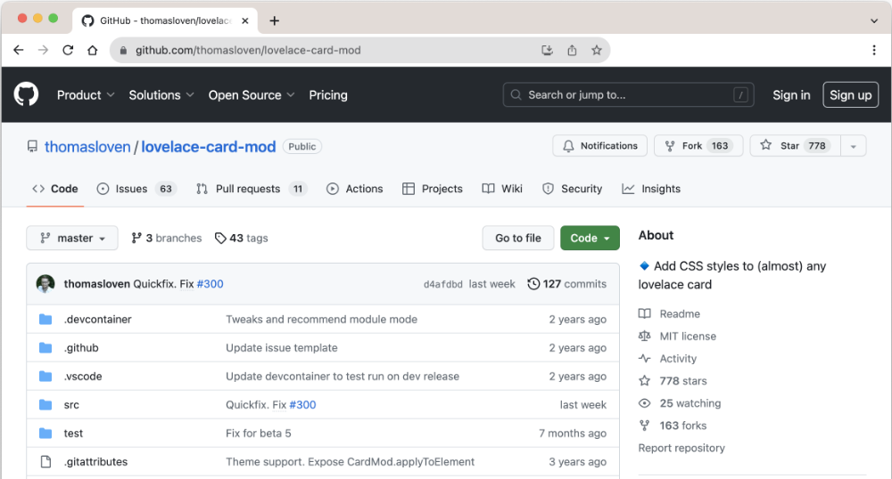
* Un seul fichier est requis : card-mod.js. Cliquez sur ce fichier.

  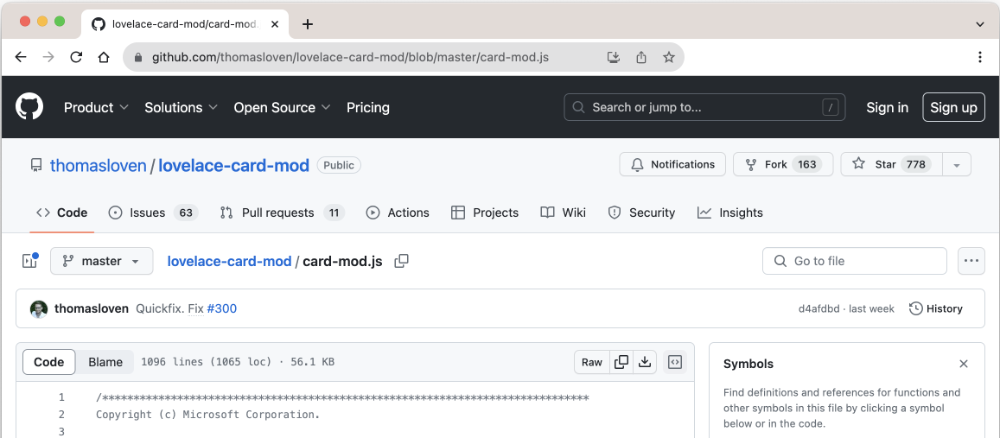
* Dans le haut de l'écran, faites un clic droit sur l'icône de téléchargement à droite de Raw afin de télécharger le fichier sur votre ordinateur.
* À l'aide de la commande [apical\_lien\_interne][copier\_un\_fichier\_sur\_une\_machine\_linux\_a\_partir\_d\_un\_autre\_ordinateur,scp,scp][/apical\_lien\_interne] lancée dans le terminal de votre ordinateur, copiez ce fichier sur le Raspberry Pi dans le dossier /mnt/data/supervisor/homeassistant/www.

  Terminal de l'ordinateur

  scp -O -P 22222 /chemin/card-mod.js root@192.168.1.145:/mnt/data/supervisor/homeassistant/www
* Afin de tirer profit au maximum de card-mod.js, il faut l'installer en tant que module. Éditez le fichier configuration.yaml à l'aide de [apical\_lien\_interne][travailler\_avec\_le\_module\_complementaire\_file\_editor,File editor][/apical\_lien\_interne] ou de [apical\_lien\_interne][travailler\_avec\_le\_module\_complementaire\_studio\_code\_server,Studio Code Server][/apical\_lien\_interne]. Ajoutez-y le code suivant :

  Fichier configuration.yaml

  frontend:  
    extra\_module\_url:  
      - /local/card-mod.js
* Redémarrez Home Assistant.

## Utilisation

Pour éditer le code YAML d'une carte :

* Rendez-vous dans le menu Paramètres / Tableaux de bord.
* Cliquez sur Ouvrir vis-à-vis le tableau désiré.
* Cliquez sur le crayon dans le coin supérieur droit.
* Cliquez sur la carte à modifier.
* Cliquez sur le bouton Afficher l'éditeur de code.

Dans le code YAML de la carte, ajoutez une section card\_mod.

YAML

card\_mod:  
  style: |  
    ha-card {  
      ...  // vos règles CSS ici, comme si vous éditiez le CSS d'un site Web  
    }

## Pour plus d'information

« thomasloven/lovelace-card-mod ». GitHub. <https://github.com/thomasloven/lovelace-card-mod>

« thomasloven/lovelace-card-mod - Lovelace Plugins ». GitHub . <https://github.com/thomasloven/hass-config/wiki/Lovelace-Plugins>
