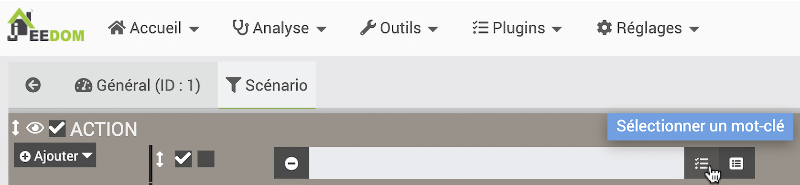
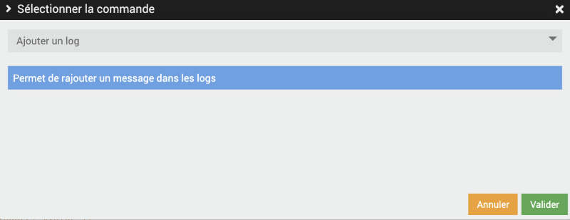
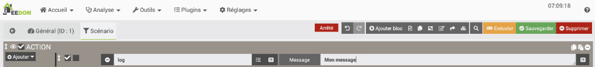
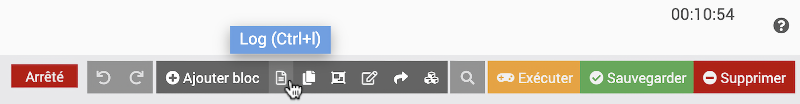
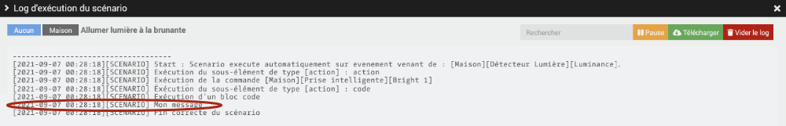
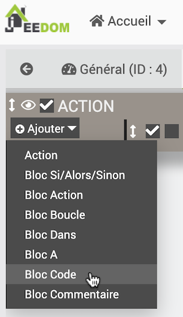
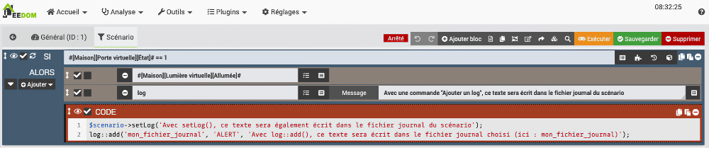
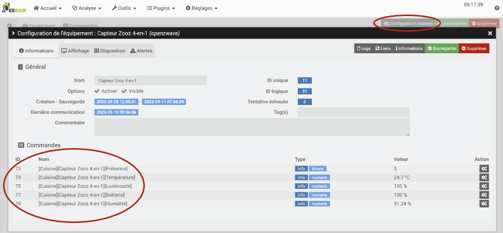

# 38. Aller plus loin avec les scénarios {#chapitre-aller_plus_loin_avec_les_scenarios}

## 38.1 Scénario qui ajoute une entrée dans le fichier journal {#fiche-scenario_qui_ajoute_une_entree_dans_le_fichier_journal}

Un scénario peut écrire dans un fichier journal afin de vous aider à garder une trace de ce qui s'est passé.

Je vous présente ici quelques techniques pour y parvenir.

## Action de type log

La façon la plus facile pour ajouter du texte dans un fichier journal est par une action de type Log.

Ceci écrira dans le log d'exécution du scénario.

* Dans le scénario, cliquez sur Ajouter / Action.
* Cliquez sur l'icône Sélectionner un mot-clé.

  
* Dans la liste déroulante qui apparaît, choisissez Ajouter un log.

  
* Vous pourrez ensuite préciser le message à enregistrer dans le fichier journal.

  
* Il est également possible d'ajouter des valeurs à votre message, par exemple la valeur d'un capteur (commande de type Info seulement). Il vous faudra entrer vous-même la chaîne qui mène à cette valeur.

  La chaîne est au format #[Objet][Equipement][Commande]#, par exemple #[Cuisine][Capteur Zooz 4-en-1][Luminosité]#.
* Pour voir le fichier journal du scénario, vous devez cliquer sur l'icône Log dans le haut de la fenêtre d'édition du scénario.

  

  Et voilà le résultat :

  

## Bloc de code

Un bloc de code est un endroit où il est possible d'ajouter des lignes de code PHP qui seront exécutées lorsque le scénario sera lancé.

Le bloc de code offre plus de possibilités pour écrire dans les fichiers journaux.

Dans le scénario, le bloc de code s'ajoute en choisissant Bloc Code sous Action.

C'est dans ce bloc de code qu'il est possible d'ajouter une instruction qui écrira dans un fichier journal.

### $scenario->setLog()

Tout comme les actions de type Log, la méthode [$scenario->setLog()](https://jeedom.github.io/documentation/phpdoc/classes/scenario.html#method_setLog) permet d'écrire dans le log d'exécution du scénario.

PHP

$scenario->setLog('Mon message');

N'oubliez pas le point-virgule à la fin de l'instruction. Après tout, c'est du PHP!

### log::add() {#niveaulog}

La méthode [log::add()](https://jeedom.github.io/documentation/phpdoc/classes/log.html#method_add) vous permet d'écrire dans un fichier journal de votre choix et de spécifier le niveau de gravité du message.

Si le fichier journal n'existe pas, Jeedom le créera automatiquement avant d'y inscrire votre message. Si le fichier journal existe, votre message sera ajouté à la suite des autres messages de ce fichier.

Syntaxe bloc de code dans scénario (PHP)

log::add('nom\_du\_fichier\_journal', 'niveau\_de\_log', 'message');

Les paramètres de cette méthode vont comme suit :

* Le nom du fichier journal peut être n'importe quoi à votre goût. Si le fichier n'existe pas déjà, il sera créé.

  Souvent, on utilisera le fichier nommé alertes pour enregistrer le message dans le log des alertes.
* Le niveau du log peut être, par ordre de gravité :
  + DEBUG
  + INFO
  + NOTICE
  + WARNING
  + ERROR
  + CRITICAL
  + ALERT
  + EMERGENCY

  Attention : selon les configurations du niveau de log, seuls les messages d'un certain niveau seront enregistrés.
* En troisième paramètre, inscrivez le message à enregistrer dans le fichier journal.

N'oubliez pas le point-virgule à la fin de l'instruction!

Bloc de code dans scénario (PHP)

log::add('alertes', 'ALERT', 'Mon message');

Voici un exemple de scénario qui illustre les différentes façons d'écrire dans un fichier journal.

### Variables dans les messages

Il est possible d'enregistrer un message qui contient des valeurs retrouvées automatiquement par Jeedom.

Pour en savoir plus : « scenario\_qui\_inscrit\_dans\_un\_fichier\_journal\_une\_valeur\_retrouvee\_automa\_\_\_ ».

## 38.2 Retrouver manuellement la chaîne qui identifie une commande {#fiche-retrouver_la_chaine_qui_identifie_une_commande}

Dans Jeedom, chaque commande associée à un équipement peut être utilisée à différentes fins, par exemple pour envoyer la valeur d'un capteur dans un courriel ou pour l'enregistrer dans un fichier journal.

Les commandes peuvent être identifiées par leur identifiant (ID) ou encore par une chaîne.

La chaîne est au format #[Objet][Equipement][Commande]#, par exemple #[Cuisine][Capteur Zooz 4-en-1][Luminosité]#.

Il est également possible de retrouver la chaîne d'une commande comme suit :

* Retrouvez la page de configuration de l'équipement en cliquant sur sa barre de couleur dans le Dashboard ou en vous rendant dans le menu approprié, par exemple pour un objet connecté Z-Wave : Plugins / Protocole domotique / Z-Wave puis en cliquant sur le nom de l'équipement désiré.
* Cliquez sur Configuration avancée dans le haut de l'écran.
* Vous verrez la liste des identifiants et noms des commandes disponibles pour cet équipement.

## 38.3 Scénario qui inscrit dans un fichier journal une valeur retrouvée automatiquement {#fiche-scenario_qui_inscrit_dans_un_fichier_journal_une_valeur_retrouvee_automa___}

Que ce soit dans un scénario programmé ou dans un scénario provoqué, il est possible d'enregistrer automatiquement dans un fichier journal un message qui contient des informations retrouvées par programmation.

## Valeur d'un capteur

Voici un bloc de code qui inscrit la valeur d'un capteur de lumière.

Remarquez les guillemets alentour du message afin de permettre à PHP d'interpréter la valeur de la variable.

Bloc de code dans scénario (PHP)

$cmd = cmd::byString('#[Maison][Détecteur Lumière][Luminance]#');  
$value = $cmd->execCmd();  
log::add('alertes', 'ALERT', "Luminance: $value");

Vous obtiendrez le même résultat avec ceci :

Bloc de code dans scénario (PHP)

log::add('alertes', 'ALERT', "Luminance: " . cmd::byString('#[Maison][Détecteur Lumière][Luminance]#')->execCmd());

## Chaîne qui identifie le déclencheur du scénario

Il est possible de retrouver par programmation le nom de la commande qui a déclenché le scénario.

Dans un scénario provoqué, il s'agit d'une chaîne au format #[Objet][Equipement][Commande]#.

Dans un scénario programmé, la chaîne sera schedule.

Dans le cas où le scénario est lancé manuellement par un clic sur le bouton Exécuter dans l'écran d'édition du scénario, la chaîne sera user.

Retrouver ce type d'information par programmation est intéressant spécialement lorsqu'un scénario a plus d'un déclencheur. On saura lequel a servi au déclenchement et le scénario pourra réagir en conséquence.

Bloc de code dans scénario (PHP)

$trigger = cmd::cmdToHumanReadable($scenario->getRealTrigger());  
log::add('alertes', 'ALERT', "Déclencheur : $trigger");

## Valeur du déclencheur

En combinant les deux approches précédentes, on peut obtenir par programmation la valeur de l'équipement qui a déclenché le scénario.

Attention : ceci ne fonctionnera pas si le scénario a été lancé manuellement ou s'il a été lancé à un moment précis (scénario programmé). Il faudra donc ajouter une condition pour ne pas que le code plante.

À vous d'ajouter la condition requise ;-)

Bloc de code dans scénario (PHP)

$trigger = cmd::cmdToHumanReadable($scenario->getRealTrigger());

 

$cmd = cmd::byString($trigger);  
$value = $cmd->execCmd();  
log::add('alertes', 'ALERT', "Valeur du déclencheur : $value");

## Pour plus d'information {#popupbienvenue}

« Jeedom v4 | Petits codes entre amis ». KiboOst. <https://kiboost.github.io/jeedom_docs/jeedomV4Tips/CodesScenario/fr_FR/>