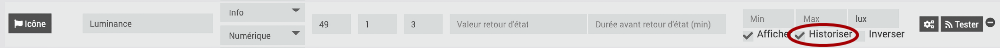
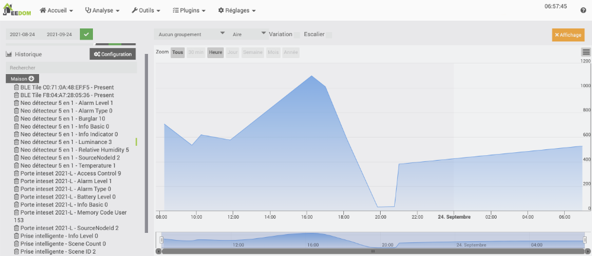
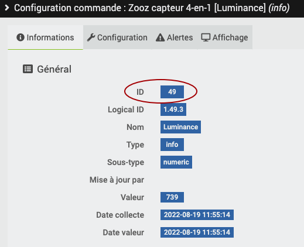
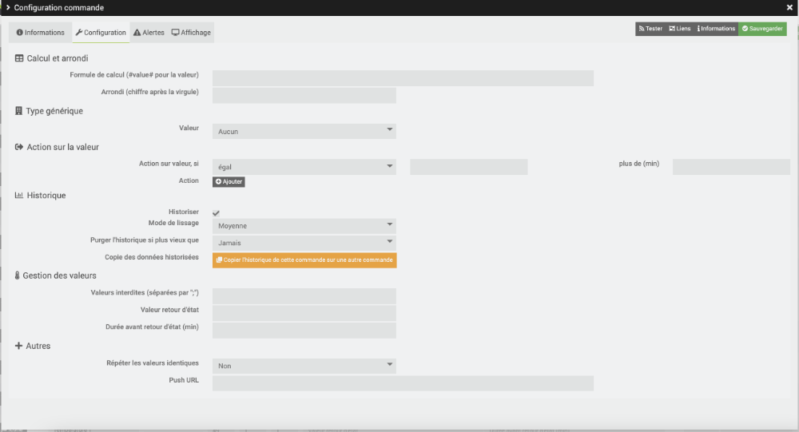
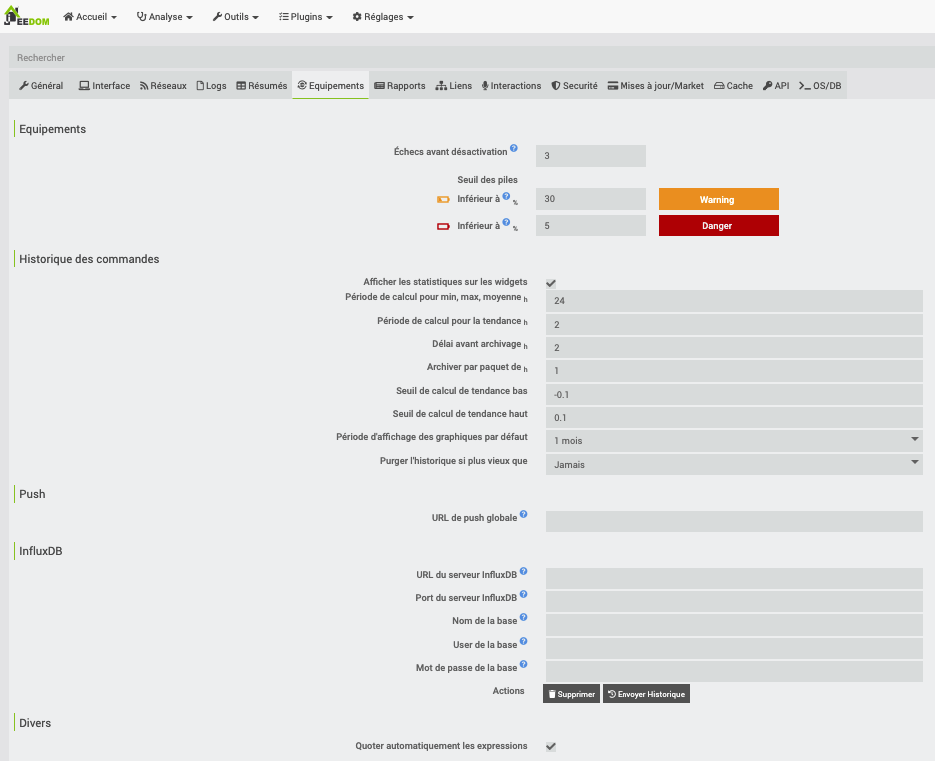

# 41. Historisation des données

## 41.1 En résumé...

Voici un résumé des informations essentielles du ou des prochains chapitres.

Notez que certaines fiches, qui font partie intégrante du cours, pourraient ne pas figurer dans ce résumé.

Je vous recommande d'effectuer une lecture de l'ensemble des fiches de ces chapitres afin de bien saisir les enjeux.

## <a href="fiche-configurer_l_historique_des_commandes.md#configurer_l_historique_des_commandes">configurer_l_historique_des_commandes</a>

Pour activer ou désactiver l'historisation des données d'un capteur, rendez-vous dans le menu Plugins / Protocole domotique / Z-Wave. Cliquez sur l'équipement que vous désirez modifier puis sélectionnez l'onglet Commandes. Vous pouvez ajouter ou enlever le crochet devant historiser vis-à-vis une commande de type info.

Pour retrouver les données d'historique d'une commande, vous devez connaître son identifiant.

Vous pouvez retrouver l'identifiant d'une commande à partir de la table cmd.

Résultat à l'écran

MariaDB [jeedom]> select id, eqType, name from cmd;  
+-----+-----------+-------------------------------------------------------+  
| id  | eqType    | name                                                  |  
+-----+-----------+-------------------------------------------------------+  
...  
| 14  | weather   | Température                                           |  
| 15  | weather   | Humidité                                              |  
| 16  | weather   | Pression                                              |  
| 17  | weather   | Vitesse du vent                                       |  
...  
| 37  | openzwave | Info Switch 0 2                                       |  
| 38  | openzwave | Switch 0 2 On                                         |  
| 39  | openzwave | Switch 0 2 Off                                        |  
| 40  | openzwave | Info Switch 0 4                                       |  
| 41  | openzwave | Switch 0 4 On                                         |  
| 42  | openzwave | Switch 0 4 Off                                        |  
| 43  | openzwave | Info Switch 0 3                                       |  
| 44  | openzwave | Switch 0 3 On                                         |  
| 45  | openzwave | Switch 0 3 Off                                        |  
| 46  | openzwave | Info Basic                                            |  
| 47  | openzwave | Basic                                                 |  
| 48  | openzwave | Temperature                                           |  
| 49  | openzwave | Luminance                                            |  
| 50  | openzwave | Relative Humidity                                     |  
+-----+-----------+-------------------------------------------------------+

Voici un extrait de la table history pour la commande dont l'id est 49, un capteur de luminosité.

Résultat à l'écran

MariaDB [jeedom]> select \* from history where cmd_id = 49;  
+--------+---------------------+----------------+  
| cmd_id | datetime            | value          |  
+--------+---------------------+----------------+  
|     49 | 2021-09-23 16:15:00 | 1485.75        |  
|     49 | 2021-09-23 16:20:00 | 1445.5         |  
|     49 | 2021-09-23 16:25:00 | 1203.845703125 |  
|     49 | 2021-09-23 16:30:00 | 1210.375       |  
|     49 | 2021-09-23 16:35:00 | 865.03125      |  
|     49 | 2021-09-23 16:45:00 | 757            |  
|     49 | 2021-09-23 16:50:00 | 1050           |  
|     49 | 2021-09-23 16:55:00 | 775.1875       |  
|     49 | 2021-09-23 17:00:00 | 1227.5         |  
|     49 | 2021-09-23 17:05:00 | 1242.796875    |  
|     49 | 2021-09-23 17:10:00 | 1129.25        |  
|     49 | 2021-09-23 17:15:00 | 1146.5         |  
|     49 | 2021-09-23 17:20:00 | 1153.125       |  
|     49 | 2021-09-23 17:25:00 | 958.919921875  |  
|     49 | 2021-09-23 17:30:00 | 823.5          |  
+--------+---------------------+----------------+

L'historique peut être consulté graphiquement à partir du menu Analyse / Historique. Sélectionnez la commande désirée dans la zone de gauche et le graphique de son historique apparaîtra.

## Archivage

À toutes les nuits, Jeedom va déplacer les données de la table history vers la table historyArch après avoir regroupé les données pour chaque heure.

C'est une tâche cron qui se charge de lancer l'opération d'archivage. L'heure précise à laquelle l'archivage débute peut être retrouvée dans la table cron.

Résultat à l'écran

MariaDB [jeedom]> SELECT \* FROM cron;  
+----+--------+----------+-------------+--------------------+---------+--------+-----------------+------------------+------+  
| id | enable | class    | function    | schedule           | timeout | deamon | deamonSleepTime | option           | once |  
+----+--------+----------+-------------+--------------------+---------+--------+-----------------+------------------+------+  
...  
| 18 |      1 | history | archive    | 00 5 \* \* \*        |     240 |      0 |               1 | NULL             |    0 |  
...

## <a href="fiche-scenario_qui_affiche_une_information_dans_le_tableau_de_bord.md#scenario_qui_affiche_une_information_dans_le_tableau_de_bord">scenario_qui_affiche_une_information_dans_le_tableau_de_bord</a>

Il faut créer un virtuel avec au moins une commande de type info.

La valeur sera enregistrée dans cette commande comme suit :

Bloc de code du scénario (PHP)

$valeur = ...;  
$cmd = cmd::byString('#[Partout][Mon équipement][Ma valeur]#');  
$cmd->event($valeur);

## <a href="fiche-scenario_qui_execute_une_requete_sql.md#scenario_qui_execute_une_requete_sql">scenario_qui_execute_une_requete_sql</a>

Bloc de code du scénario (PHP)

$sql = "SELECT ...";  
//$scenario->setLog("SQL = $sql");   // pour faciliter le débogage - on pourra tester cette requête directement dans MySQL

 

try {  
    $resultat = DB::Prepare($sql, NULL, DB::FETCH_TYPE_ALL);  
    //$scenario->setLog(print_r($resultat, true));   // pour voir les données brutes dans cette variable

 

    foreach ($resultat as $enreg) {  
        $valeur = $enreg['...'];  
        $scenario->setLog("Valeur : $valeur");  
    }  
} catch (Throwable $e) {  
    $scenario->setLog($e->getMessage());  
}

## 41.2 Configurer l'historique des commandes

Par défaut, pour chaque équipement, et plus précisément pour leurs commandes pour lesquelles <a href="fiche-selectionner_les_commandes_a_afficher_sur_une_tuile.md#selectionner_les_commandes_a_afficher_sur_une_tuile">l'historisation a été activée</a>, Jeedom va enregistrer les valeurs dans la base de données à toutes les 5 minutes dans la table history.

Rappel : pour activer ou désactiver l'historisation des données d'un capteur, rendez-vous dans le menu Plugins / Protocole domotique / Z-Wave. Cliquez sur l'équipement que vous désirez modifier puis sélectionnez l'onglet Commandes. Vous pouvez ajouter ou enlever le crochet devant historiser vis-à-vis une commande de type info.

## Consulter les données d'historique

Pour retrouver les données d'historique d'une commande, vous devez connaître son identifiant.

Vous pouvez retrouver l'identifiant d'une commande à partir de la table cmd.

Résultat à l'écran

MariaDB [jeedom]> select id, eqType, name from cmd;  
+-----+-----------+-------------------------------------------------------+  
| id  | eqType    | name                                                  |  
+-----+-----------+-------------------------------------------------------+  
...  
| 14  | weather   | Température                                           |  
| 15  | weather   | Humidité                                              |  
| 16  | weather   | Pression                                              |  
| 17  | weather   | Vitesse du vent                                       |  
...  
| 37  | openzwave | Info Switch 0 2                                       |  
| 38  | openzwave | Switch 0 2 On                                         |  
| 39  | openzwave | Switch 0 2 Off                                        |  
| 40  | openzwave | Info Switch 0 4                                       |  
| 41  | openzwave | Switch 0 4 On                                         |  
| 42  | openzwave | Switch 0 4 Off                                        |  
| 43  | openzwave | Info Switch 0 3                                       |  
| 44  | openzwave | Switch 0 3 On                                         |  
| 45  | openzwave | Switch 0 3 Off                                        |  
| 46  | openzwave | Info Basic                                            |  
| 47  | openzwave | Basic                                                 |  
| 48  | openzwave | Temperature                                           |  
| 49  | openzwave | Luminance                                            |  
| 50  | openzwave | Relative Humidity                                     |  
+-----+-----------+-------------------------------------------------------+

L'identifiant est également visible dans l'interface Web de Jeedom à partir du menu Plugins / Protocole domotique / Z-Wave. Cliquez sur l'équipement que vous désirez consulter, sélectionnez l'onglet Commandes puis cliquez sur l'engrenage à droite de la commande pour connaître cet identifiant.

Voici un extrait de la table history pour la commande dont l'id est 49, un capteur de luminosité.

Résultat à l'écran

MariaDB [jeedom]> select \* from history where cmd_id = 49;  
+--------+---------------------+----------------+  
| cmd_id | datetime            | value          |  
+--------+---------------------+----------------+  
|     49 | 2021-09-23 16:15:00 | 1485.75        |  
|     49 | 2021-09-23 16:20:00 | 1445.5         |  
|     49 | 2021-09-23 16:25:00 | 1203.845703125 |  
|     49 | 2021-09-23 16:30:00 | 1210.375       |  
|     49 | 2021-09-23 16:35:00 | 865.03125      |  
|     49 | 2021-09-23 16:45:00 | 757            |  
|     49 | 2021-09-23 16:50:00 | 1050           |  
|     49 | 2021-09-23 16:55:00 | 775.1875       |  
|     49 | 2021-09-23 17:00:00 | 1227.5         |  
|     49 | 2021-09-23 17:05:00 | 1242.796875    |  
|     49 | 2021-09-23 17:10:00 | 1129.25        |  
|     49 | 2021-09-23 17:15:00 | 1146.5         |  
|     49 | 2021-09-23 17:20:00 | 1153.125       |  
|     49 | 2021-09-23 17:25:00 | 958.919921875  |  
|     49 | 2021-09-23 17:30:00 | 823.5          |  
+--------+---------------------+----------------+

L'historique peut être consulté graphiquement à partir du menu Analyse / Historique. Sélectionnez la commande désirée dans la zone de gauche et le graphique de son historique apparaîtra.

## Archivage

À toutes les nuits, Jeedom va déplacer les données de la table history vers la table historyArch après avoir regroupé les données pour chaque heure.

En fait, la documentation de Jeedom indique[1](https://doc.jeedom.com/fr_FR/core/4.3/history) :

> Par défaut Jeedom récupère toutes les données plus vieilles de 2h et en fait des paquets de 1h [...] vous devriez avoir une haute précision sur les 2 dernières heures seulement. Pourtant quand je me connecte à 17h, j’ai une précision sur les 17 dernières heures. Pourquoi ? En fait, pour éviter de consommer des ressources inutilement, la tâche qui fait l’archivage ne se déroule qu’une fois par jour, le soir.

## Moment où les données sont archivées

C'est une tâche cron qui se charge de lancer l'opération d'archivage. L'heure précise à laquelle l'archivage débute peut être retrouvée dans la table cron.

Résultat à l'écran

MariaDB [jeedom]> SELECT \* FROM cron;  
+----+--------+----------+-------------+--------------------+---------+--------+-----------------+------------------+------+  
| id | enable | class    | function    | schedule           | timeout | deamon | deamonSleepTime | option           | once |  
+----+--------+----------+-------------+--------------------+---------+--------+-----------------+------------------+------+  
...  
| 18 |      1 | history | archive    | 00 5 \* \* \*        |     240 |      0 |               1 | NULL             |    0 |  
...

## Modifier le mode de lissage d'une commande

Pour chaque commande, vous pouvez préciser comment Jeedom fera pour convertir les données détaillées en blocs de 1h. Rendez-vous dans le menu  Plugins / Protocole domotique / Z-Wave. Cliquez sur l'équipement que vous désirez configurer, sélectionnez l'onglet Commandes puis cliquez sur l'engrenage à droite de la commande.

Dans l'onglet Configuration, zone Historique, vous pouvez préciser le mode de lissage. Les options disponibles sont moyenne, minimum, maximum et aucun.

## Configurations générales

Les paramètres généraux d'historisation des données peuvent être modifiés dans le menu Réglages / Système / Configuration / onglet Équipements.

La zone Historique des commandes permet de préciser notamment le temps pendant lequel les données détaillées seront conservées (Délai avant archivage), le délai avant que les données d'historiques soient supprimées (Purger l'historique si plus vieux que) et l'intervalle de temps à utiliser pour les données archivées (Archiver par paquet de X h).

## Source

1. «  Historique ». Jeedom. <https://doc.jeedom.com/fr_FR/core/4.3/history>