# 79. Les modèles Home Assistant

## 79.1 Les modèles dans Home Assistant

Les modèles sont un mécanisme qui permet d'obtenir une valeur à partir d'autres valeurs avec possibilité d'opérations mathématiques, de tests conditionnels, etc.

On peut les comparer à de petits bouts de programmes qui ont accès notamment aux valeurs :

* [apical\_lien\_interne][configurer\_un\_capteur\_virtuel,des capteurs virtuels][/apical\_lien\_interne] que vous pourrez ajuster dans l'onglet Aperçu
* des capteurs réels
* de toute autre entité

Grâce à eux, les scripts et les automatisations bénéficient de plus de possibilités.

Dans cette fiche :

* [Éditeur de modèles](#editeur)
* [Valeur principale d'un capteur](#valeur)
* [Capteur avec attributs](#attributs)
* [Retrouver un attribut particulier](#particulier)
* [Conditions](#conditions)
* [Travailler avec des valeurs numériques](#numerique)
* [Variables dans un modèle](#variable)
* [Boucles dans un modèle](#boucle)
* [Commentaires dans un modèle](#commentaire)
* [Identifiants d'objets non conformes](#templatesyntaxerror)
* [Résumé des syntaxes](#resume)

## Éditeur de modèles

Le code d'un modèle doit répondre aux règles énoncées ici : [https://www.home-assistant.io/docs/configuration/templating/](https://www.home-assistant.io/docs/configuration/templating/#important-template-rules).

Le langage utilisé pour définir un modèle est [Jinja2](https://palletsprojects.com/projects/jinja). Sa syntaxe ressemble à celle de Python.

Pour vous aider à valider le code d'un modèle, rendez-vous dans Outils de développement / Modèle (en anglais : Template).

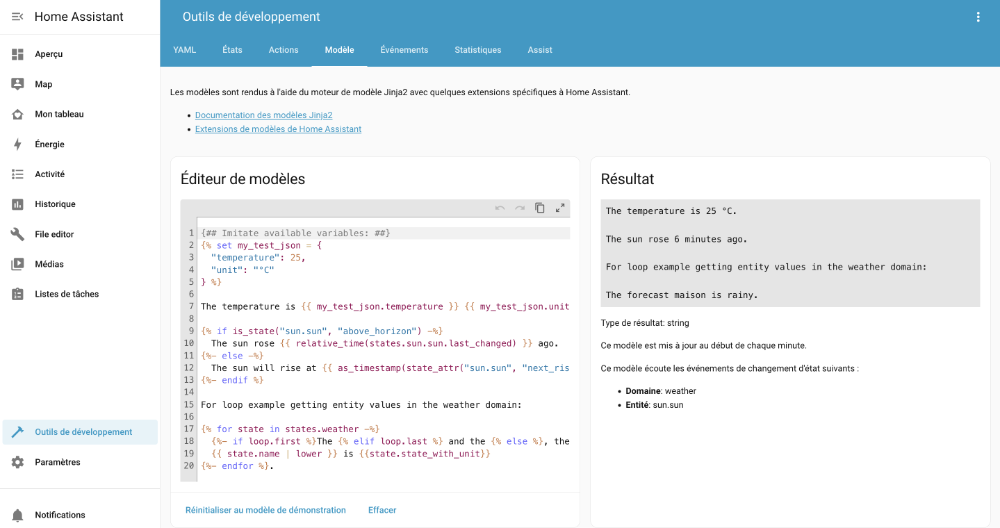

Effacez le contenu de l'éditeur de modèles et remplacez-le par celui que vous désirez tester. Le résultat apparaîtra immédiatement à droite.

## Valeur principale d'un capteur

Dans sa forme la plus simple, le modèle pourra retrouver la valeur principale d'un capteur.

Pour travailler avec les valeurs des capteurs, il faut utiliser les [objets de type state](https://www.home-assistant.io/docs/configuration/state_object/).

Ici, on utilisera la fonction states() et on lui fournira en paramètre [apical\_lien\_interne][qu\_est-ce\_qu\_une\_entite,l'identifiant de l'entité,identifiant][/apical\_lien\_interne], le tout entre doubles accolades.

Modèle

{{ states('input\_boolean.porte\_virtuelle') }}

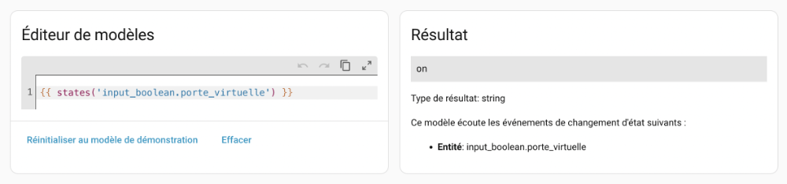

Le même résultat est obtenu avec ceci :

Modèle

{{ states.input\_boolean.porte\_virtuelle['state'] }}

ou encore avec :

Modèle

{{ states.input\_boolean.porte\_virtuelle.state }}

Cependant, selon la documentation officielle de Home Assistant[1](https://www.home-assistant.io/docs/configuration/templating/):

> Avoid using states.sensor.temperature.state, instead use states('sensor.temperature'). It is strongly advised to use the states(), is\_state(), state\_attr() and is\_state\_attr() as much as possible, to avoid errors and error message when the entity isn’t ready yet (e.g., during Home Assistant startup).

## Capteur avec attributs

Certains capteurs ont plusieurs attributs.

Pour le savoir, utilisez un modèle qui constiste en le mot states suivi d'un point puis de l'identifiant du capteur.

Cette syntaxe ne doit pas être utilisée dans une automatisation mais elle est utile dans les outils de développement.

Modèle

{{ states.weather.forecast\_maison }}

ou, si vous préférez travailler avec OpenWeatherMap :

Modèle

{{ states.weather.openweathermap }}

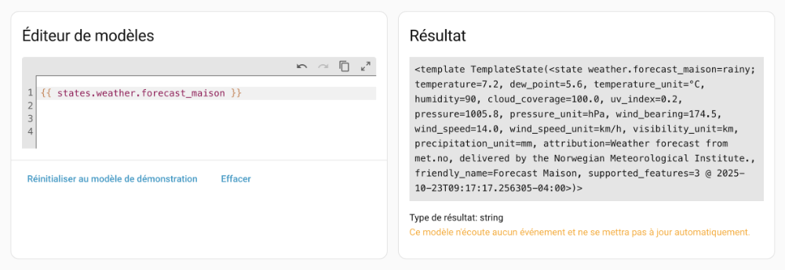

On voit d'un coup tous les attributs disponibles.

Il est possible de demander à voir seulement les attributs.

Modèle

{{ states.weather.forecast\_maison.attributes }}

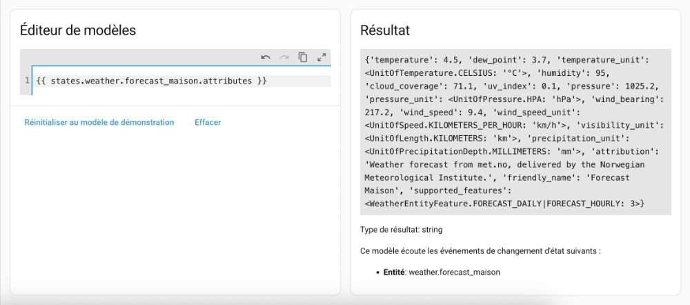

## Retrouver un attribut particulier

Pour travailler avec un attribut particulier :

Modèle

{{ state\_attr('weather.forecast\_maison', 'humidity') }}

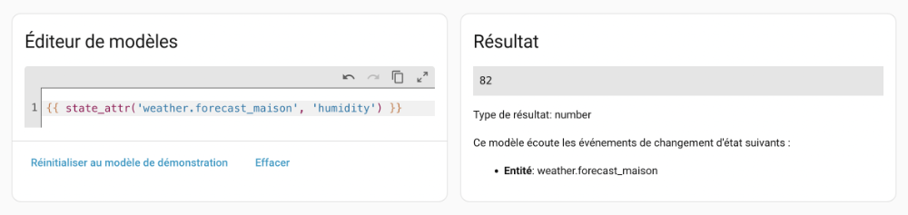

## Conditions

La fonction is\_state() retourne true si un capteur correspond à la valeur passée en paramètre :

Modèle

{{ is\_state('sun', 'rising') }}

Avec is\_state\_attr(), on peut vérifier si un attribut a une valeur donnée :

Modèle

{{ is\_state\_attr('weather.forecast\_maison', 'temperature', 20 ) }}

Le test conditionnel combiné à states(), state\_attr(), is\_state() ou is\_state\_attr() offre des possibilités intéressantes :

Modèle

  
  ouverte  
  
  fermée  


## Travailler avec des valeurs numériques

Dans le cas où le modèle doit effectuer un test entre une valeur retrournée par states() et une valeur numérique (int ou float),  [les bonnes pratiques](https://www.home-assistant.io/docs/configuration/templating/#important-template-rules) veulent que le modèle utilise un filtre pour assurer que la valeur est du bon type.

Il s'agit d'ajouter une pipe (|) suivie du type.

Modèle

  
  Il faut démarrer le chauffage!  
  
  Il faut démarrer la climatisation!  
  
  La température est parfaite!  


Parfois, ce n'est pas une question de bonnes pratiques mais bien une question de bon fonctionnement.

Par exemple, si vous tentez de comparer la valeur d'un capteur avec une valeur numérique, vous pourriez obtenir une erreur du genre « TypeError: '<' not supported between instances of 'str' and 'int' ».

Le message est alors clair : il n'est pas possible de comparer une chaîne et un entier.

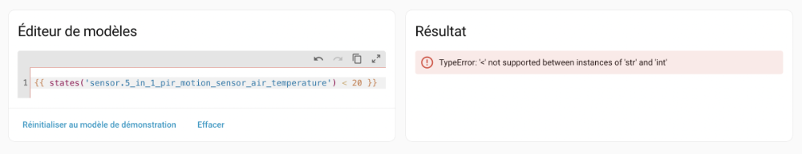

La conversion de type est alors une obligation en plus d'être une bonne pratique :

Modèle

{{ states('sensor.5\_in\_1\_pir\_motion\_sensor\_air\_temperature') | int < 20 }}

## Variables dans un modèle

Afin de rendre le code plus facile à lire, vous pouvez créer des variables que vous réutiliserez plus loin dans le modèle.

Modèle



 

  
  Humidité élevée  
  
  Humidité normale  


## Boucles dans un modèle

Un modèle peut effectuer une boucle pour réaliser une opération un nombre défini de fois ou encore pour effectuer une opération sur chaque entité qui répond à un critère.

Par exemple, pour effectuer une opération sur chacun des capteurs virtuels booléens (ici, on ne fait qu'afficher l'identifiant) :

Modèle

  
  {{ state.entity\_id }}  


Pour boucler un nombre défini de fois (ici, on ne fait qu'afficher l'index) :

Modèle

  
  {{ index }}  


## Commentaires dans un modèle

J'aime bien conserver dans l'éditeur de modèles de Home Assistant une série de tests que je réalise.

Pour mieux m'y retrouver, j'y ajoute des commentaires.

Les commentaires dans les modèles sont entourés de {# et de #}.

Modèle

{# Ceci est un commentaire #}

## Identifiants d'objets non conformes

Si, lorsque vous testez un tel modèle dans l'éditeur, vous obtenez un message du genre « TemplateSyntaxError: expected token 'end of print statement', got '... », c'est peut-être parce que l'identifiant de l'objet (ce qui suit le point dans l'[apical\_lien\_interne][qu\_est-ce\_qu\_une\_entite,identifiant de l'entité][/apical\_lien\_interne]) débute par un caractère non autorisé, par exemple un chiffre.

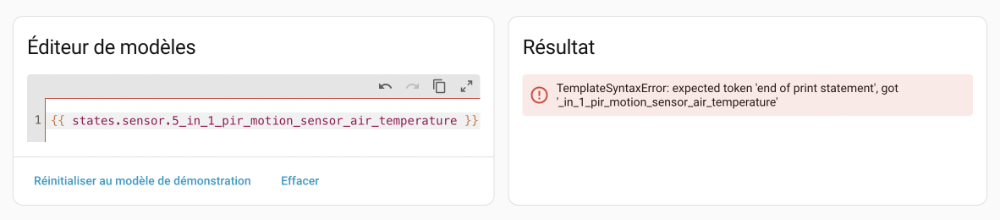

Pour régler ce problème, vous pouvez utiliser cette syntaxe (remplacez sensor par le domaine et identifiant\_objet\_problematique par l'identifiant de l'objet) :

Modèle

{{ states.sensor['identifiant\_objet\_problematique'] }}

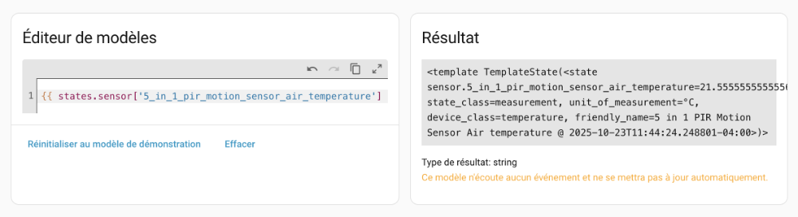

Remarquez les différentes syntaxes et leur résultat. Dans cet exemple, j'ai utilisé un identifiant d'objet qui ne pose pas de problème.

Les deux premiers modèles donnent le même résultat mais pas le troisième.

Dans tous les cas, il est conseillé de travailler avec states() plutôt qu'avec states..

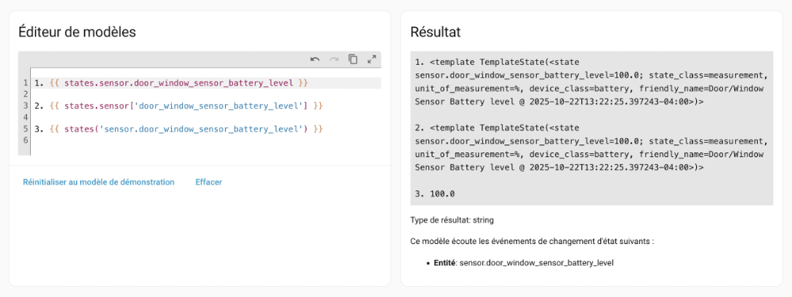

## Résumé des syntaxes

| Syntaxe | Description | Résultat |
| --- | --- | --- |
| {{ states('weather.forecast\_maison') }}  Syntaxes équivalentes à éviter :  {{ states.weather.forecast\_maison['state'] }}  {{ states.weather.forecast\_maison.state }} | Donne la valeur principale d'une entité. | cloudy |
| Autre exemple :  {{ states('input\_boolean.porte\_virtuelle') }} |  | on |
| {{ states.weather.forecast\_maison }}  Syntaxe équivalente :  {{ states.weather['forecast\_maison'] }} | Donne la valeur principale d'une entité de même que de tous ses attributs.  À utiliser seulement dans les outils de développement.  La première syntaxe ne fonctionne pas si [apical\_lien\_interne][qu\_est-ce\_qu\_une\_entite,l'identifiant de l'objet,objet][/apical\_lien\_interne] débute par un chiffre. | <template TemplateState(<state weather.forecast\_maison=partlycloudy; temperature=4.5, dew\_point=3.7, temperature\_unit=°C, humidity=95, cloud\_coverage=71.1, uv\_index=0.1, pressure=1025.2, pressure\_unit=hPa, wind\_bearing=217.2, wind\_speed=9.4, wind\_speed\_unit=km/h, visibility\_unit=km, precipitation\_unit=mm, attribution=Weather forecast from met.no, delivered by the Norwegian Meteorological Institute., friendly\_name=Forecast Maison, supported\_features=3 @ 2025-10-25T08:45:35.357881-04:00>)> |
| Autre exemple :  {{ states.input\_boolean.porte\_virtuelle }} |  | <template TemplateState(<state input\_boolean.porte\_virtuelle=off; editable=False, icon=mdi:door, friendly\_name=Porte virtuelle @ 2025-10-22T19:27:16.228318-04:00>)> |
| {{ states.weather.forecast\_maison.attributes }}  Syntaxe équivalente :  {{ states.weather['forecast\_maison'].attributes }} | Donne la valeur de tous les attributs d'une entité.  À utiliser seulement dans les outils de développement.  La première syntaxe ne fonctionne pas si [apical\_lien\_interne][qu\_est-ce\_qu\_une\_entite,l'identifiant de l'objet,objet][/apical\_lien\_interne] débute par un chiffre. | {'temperature': 4.5, 'dew\_point': 3.7, 'temperature\_unit': <UnitOfTemperature.CELSIUS: '°C'>, 'humidity': 95, 'cloud\_coverage': 71.1, 'uv\_index': 0.1, 'pressure': 1025.2, 'pressure\_unit': <UnitOfPressure.HPA: 'hPa'>, 'wind\_bearing': 217.2, 'wind\_speed': 9.4, 'wind\_speed\_unit': <UnitOfSpeed.KILOMETERS\_PER\_HOUR: 'km/h'>, 'visibility\_unit': <UnitOfLength.KILOMETERS: 'km'>, 'precipitation\_unit': <UnitOfPrecipitationDepth.MILLIMETERS: 'mm'>, 'attribution': 'Weather forecast from met.no, delivered by the Norwegian Meteorological Institute.', 'friendly\_name': 'Forecast Maison', 'supported\_features': <WeatherEntityFeature.FORECAST\_DAILY|FORECAST\_HOURLY: 3>} |
| {{ state\_attr('weather.forecast\_maison', 'humidity') }} | Donne la valeur d'un attribut de l'entité. | 79 |
| {{ is\_state('sun', 'rising') }} | Vérifie si l'état correspond à une valeur. | False |
| {{ is\_state\_attr('weather.forecast\_maison', 'temperature', 20 ) }} | Vérifie si un attribut correspond à une valeur. | True |

## Source

1. « Templating ». Home Assistant. <https://www.home-assistant.io/docs/configuration/templating/>

## 79.2 Exemple d'automatisation avec un modèle

Dans cette fiche, nous allons créer une automatisation dont la condition dépend de la valeur d'un capteur virtuel numérique.

Plus précisément, l'action ne sera exécutée que si le capteur virtuel a une valeur située entre 20 et 30 exclusivement.

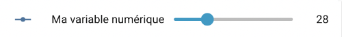

### Sans les modèles

Faisons d'abord un premier test sans utiliser les modèles.

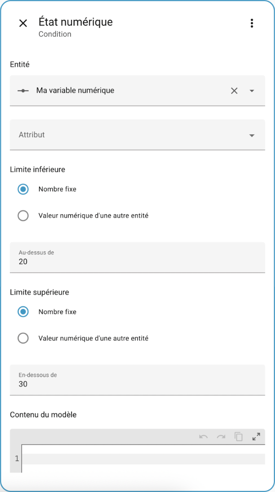

Le YAML généré pour cette condition sera :

Fichier automations.yaml

- condition: numeric\_state  
  entity\_id: input\_number.ma\_variable\_numerique  
  above: '20'  
  below: '30'

### Avec les modèles

Il est possible de faire ce même travail à l'aide d'un modèle.

On accèdera à une condition gérée par un modèle en choisissant Autres conditions / Modèle.

Notez que la zone Contenu du modèle au bas de l'écran présenté plus haut permet simplement de comparer la valeur de l'entité avec celle d'une autre entité.

Voici le code du modèle qui donne true si la valeur du capteur virtuel est entre 20 et 30 exclusivement et false dans le cas contraire.

Il est suggéré de tester ce modèle dans [apical\_lien\_interne][les\_modeles\_dans\_home\_assistant,l'éditeur de modèle,editeur][/apical\_lien\_interne] avant de l'utiliser dans une automatisation.

Modèle

  
{{ maVariable | int > 20 and maVariable | int < 30 }}

Il aurait aussi pu être écrit comme suit :

Modèle

  
  true  
  
  false  


ou encore :

Modèle

{{ states('input\_number.ma\_variable\_numerique') | int > 20 and states('input\_number.ma\_variable\_numerique') | int < 30 }}

En testant ce modèle dans les outils de développement, on voit que le modèle retourne true puisque le capteur virtuel a présentement la valeur 28.

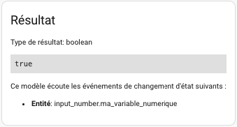

Maintenant qu'on sait que le modèle fonctionne, il est possible de l'utiliser dans la condition de l'automatisation en choisissant Autres conditions / Modèle.

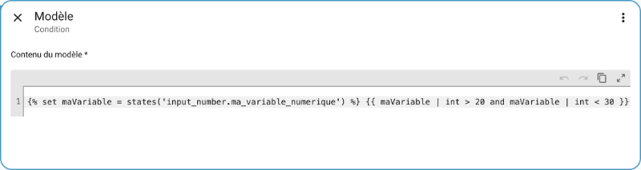

Et voici le code YAML généré pour cette condition.

Fichier automations.yaml

- condition: template  
  value\_template: ' {{ maVariable | int > 20 and maVariable | int < 30 }}'

Voici un autre exemple d'automatisation qui utilise les modèles. Cette fois, l'automatisation se chargera de stocker la valeur d'un capteur dans un virtuel.

Au moment d'écrire ces lignes, il n'était pas possible d'utiliser l'interface graphique pour définir la valeur d'un virtuel numérique si cette valeur n'est pas directement un nombre.

Il faut alors passer par l'édition du fichier automations.yaml.

Seule l'action a été illustrée ici.

Fichier automations.yaml

- action: input\_number.set\_value  
  data:   
    value: "{{ states('domaine.identifiant\_objet') | int }}"  
  target:  
    entity\_id: input\_number.mon\_virtuel

## 79.3 Retrouver les valeurs d'une entité

Les objets connectés fournissent souvent plusieurs informations.

Selon leurs concepteurs, ces informations prendre différents formats, par exemple :

* Une entité par information avec différents attributs pour chacune
* Toutes les informations [apical\_lien\_interne][format\_json\_dans\_un\_modele,encodées en JSON][/apical\_lien\_interne]

Regardons d'abord comment les informations peuvent être retrouvées lorsqu'on a une entité par information.

Prenons l'exemple d'un capteur multiple. Ce capteur pourra avoir une entité pour la luminosité, une autre pour la température, etc.

Ces entités sont listées dans le menu Paramètres / Appareils et services / Onglet Entités.

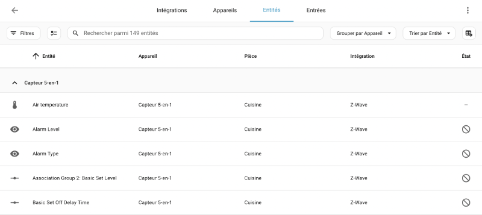

Pour connaître [apical\_lien\_interne][qu\_est-ce\_qu\_une\_entite,l'identifiant de l'entité,identifiant][/apical\_lien\_interne], cliquez sur une entité puis cliquez sur l'icône d'engrenage.

L'identifiant apparaît dans la zone ID d'entité.

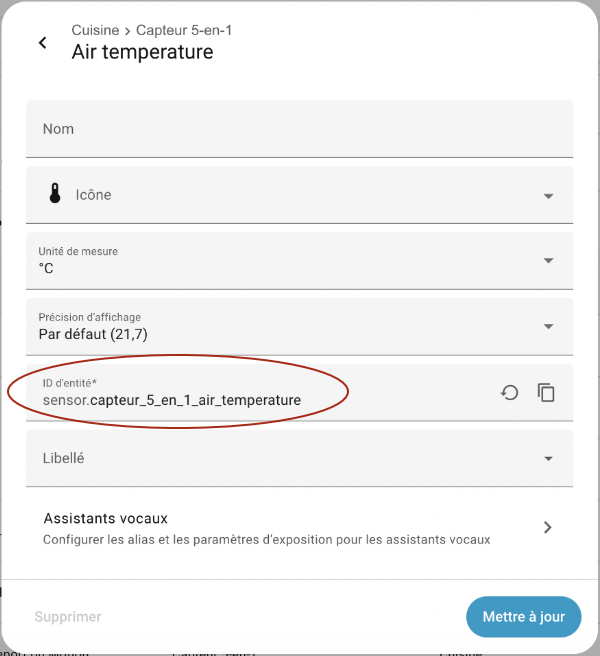

## Valeur principale

Pour connaître la valeur principale d'une entité, il suffit d'utiliser la fonction states.

Modèle Home Assistant

{{ states('sensor.capteur\_5\_en\_1\_air\_temperature') }}

Résultat à l'écran

22.2777777777778

Voici un second exemple :

Modèle Home Assistant

{{ states('device\_tracker.position\_virtuelle\_annie') }}

Résultat à l'écran

not\_home

## Attributs

Pour chaque entité qui le permet, Home Assistant peut retrouver, en plus de l'information principale, d'autres informations sous forme d'attributs.

Pour connaître les attributs disponibles et leur valeur, utilisez la fonction states suivie d'un point puis de l'identifiant de l'entité.

Cet identifiant est ici utilisé comme un objet, ce qui donnera toutes les informations sur cet objet.

Modèle Home Assistant

{{ states.sensor.capteur\_5\_en\_1\_air\_temperature }}

Le résultat affiche la valeur principale de l'entité suivie par ses attributs puis par la date et l'heure de la requête.

J'ai ajouté des sauts de ligne pour faciliter la lecture.

Résultat à l'écran

<  
  template TemplateState(<  
    state sensor.capteur\_5\_en\_1\_air\_temperature=22.2777777777778;   
    state\_class=measurement,  
    unit\_of\_measurement=°C,   
    device\_class=temperature,   
    friendly\_name=Capteur 5-en-1 Air temperature  
    @ 2025-10-25T08:45:35.306584-04:00  
  >)  
>

Voici un second exemple où les informations supplémentaires sont encore plus intéressantes.

Modèle Home Assistant

{{ states.device\_tracker.position\_virtuelle\_annie}}

Résultat à l'écran

<  
  template TemplateState(<  
    state device\_tracker.position\_virtuelle\_annie=not\_home;   
    source\_type=gps,   
    latitude=46.06010262108603,   
    longitude=-71.94367076350665,   
    gps\_accuracy=0,   
    friendly\_name=position\_virtuelle\_annie   
    @ 2025-10-25T08:46:50.141120-04:00  
  >)  
>

Il sera possible de connaître directement la valeur d'un de ces attributs à l'aide d'un modèle du genre state\_attr('id\_de\_l\_entite', 'nom\_attribut').

Modèle Home Assistant

{{ state\_attr('device\_tracker.position\_virtuelle\_annie', 'latitude') }}

Résultat à l'écran

46.06010262108603

## 79.4 Quelques manipulations de chaînes dans les modèles Home Assistant

En plus de permettre de [apical\_lien\_interne][retrouver\_les\_valeurs\_d\_une\_entite,retrouver la valeur d'une entité][/apical\_lien\_interne], les modèles permettent d'effectuer une foule de manipulations sur ces informations.

Dans cette fiche :

* [Longueur d'une chaîne](#longueur)
* [Recherche d'une position](#position)
* [Sous-chaîne](#souschaine)

## Longueur d'une chaîne

Modèle



## Recherche d'une position

Modèle



## Sous-chaîne

Modèle



ou, pour avoir toute la chaîne à partir d'une position :

Modèle



## 79.5 Quelques manipulations de nombres dans les modèles

Voici quelques manipulations de nombres dans les modèles Home Assistant.

Pour arrondir un nombre, aucune décimale :

Modèle

  
{{ nombre | round(0) }}

Pour arrondir un nombre, 3 décimales :

Modèle

  
{{ nombre | round(3) }}

Pour arrondir à l'entier inférieur :

Modèle

{{ nombre | int }}

Pour arrondir à l'entier supérieur :

Modèle

{{ nombre | round(0, 'ceil') }}

## 79.6 Modèles qui manipulent des dates et des heures

Dans tous les langages de programmation, les opérations avec dates et heures nécessitent un traitement particulier.

Sous Home Assistant, les opérations d'addition et de soustractions sur les dates et heures peuvent être effectuées à l'aide d'un [apical\_lien\_interne][les\_modeles\_dans\_home\_assistant,modèle][/apical\_lien\_interne].

Mais pour y arriver, il faut bien comprendre la représentation des dates et les conversions nécessaires.

* [Représentation d'une date dans Home Assistant](#representation)
* [Date du jour](#datedujour)
* [Fuseau horaire](#fuseauhoraire)
* [Convertion d'une date en timestamp](#conversiondatetimestamp)
  + [timestamp d'une date sous forme de chaîne](#chaine)
  + [timestamp d'un objet de type datetime](#datetime)
  + [timestamp d'une date codée en dur](#dur)
  + [timestamp d'un sensor.date\_time](#sensor)
  + [timestamp d'un sensor.time](#time)
* [Conversion d'un timestamp en chaîne](#conversiontimestampchaine)
* [Calculs avec un timestamp](#calculstimestamp)
* [Comparaison avec la date du jour](#comparaisondatedujour)
* [Comparaison avec l'heure actuelle sans calculs](#comparaisonheureactuelle)
* [Comparaison avec l'heure actuelle si besoin d'effectuer des calculs](#comparaisonheureactuelleaveccalculs)

## Représentation d'une date dans Home Assistant

Home Assistant permet d'afficher les dates et heures dans le fuseau horaire local. Mais à l'interne, il représente toutes les dates et heures en temps universel coordonné (UTC).

Une date peut être représentée à l'aide de différents types :

* chaîne de caractères
* objet Python de type [datetime](https://docs.python.org/3/library/datetime.html)
* timestamp (nombre de secondes écoulées entre le 1er janvier 1970 à 00:00:00 UTC et la date).

## Date du jour

La fonction now() permet d'obtenir la date et l'heure actuelles dans le fuseau horaire local. Elle retourne un objet Python de type datetime.

Modèle

{{ now() }}

La fonction utcnow() permet d'obtenir la date et l'heure actuelles au format UTC.

Modèle

{{ utcnow() }}

Puisqu'on obtient un objet, il est possible de le manipuler à l'aide des méthodes et propriétés de la [classe datetime](https://docs.python.org/3/library/datetime.html).

Par exemple, pour obtenir l'année courante :

Modèle

{{ now().year }}

Attention : l'heure n'est pas réévaluée à chaque seconde. Selon la documentation officielle de Home Assistant[1](https://www.home-assistant.io/docs/configuration/templating/):

> Using now() will cause templates to be refreshed at the start of every new minute.

Il est aussi possible de travailler avec [apical\_lien\_interne][afficher\_la\_date\_et\_l\_heure\_dans\_le\_tableau\_de\_bord,un capteur virtuel qui affiche la date et l'heure actuelles][/apical\_lien\_interne], par exemple sensor.date, sensor.time, sensor.date\_time.

Remarquez qu'on obtient ici une chaîne de caractères.

Modèle

{{ states('sensor.date\_time') }}

Selon la documentation officielle de Home Assistant[2](https://www.home-assistant.io/integrations/time_date/):

> Sensors including the time update every minute, the date sensor updates each day at midnight, and the beat sensor updates with each beat (86.4 seconds).

## Fuseau horaire

Il est rare que les modèles aient besoin de connaître le fuseau horaire local mais si jamais vous en avez besoin, vous pouvez connaître le fuseau horaire configuré dans Home Assistant à l'aide de la propriété tzinfo de la classe Python datetime.

Ceci affichera chez moi America/Toronto :

Modèle

{{ now().tzinfo }}

Il est même possible de savoir si, selon la date, l'heure locale est à l'heure avancée (Daylight Daving Time).

Modèle

{{ now().timetuple().tm\_isdst }}

## Convertion d'une date en timestamp

La conversion d'une date en timestamp permettra d'utiliser cette date dans des calculs et dans des comparaisons.

Dans les exemples suivants, je travaille avec un virtuel de type input\_datetime. Il s'agit d'une case dans laquelle on peut inscrire la date et l'heure de notre choix.

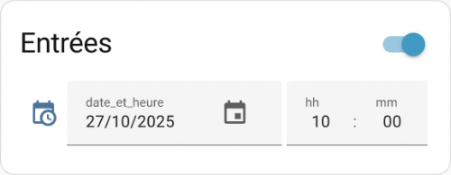

La valeur de cette entité sera donnée sous forme de chaîne de caractères.

Modèle

{{ states('input\_datetime.date\_et\_heure') }}

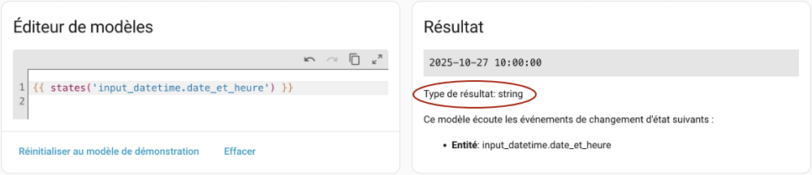

Une fois la date entrée dans la case, on pourrait par exemple la convertir en timestamp afin de calculer la date de la semaine suivante (également en timestamp) comme suit :

Modèle

  
{{ mon\_timestamp + 60\*60\*24\*7 }}

D'autres exemples sont donnés [plus bas](#calculstimestamp).

### timestamp d'une date sous forme de chaîne

L'attribut timestamp d'un capteur de date représente cette date convertie en UTC puis en timestamp.

Modèle

{{ state\_attr('input\_datetime.date\_et\_heure', 'timestamp') }}

La conversion en timestamp peut se faire également à l'aide du filtre as\_timestamp :

Modèle

{{ states('input\_datetime.date\_et\_heure') | as\_timestamp }}

ou encore avec la fonction as\_timestamp() :

Modèle

{{ as\_timestamp(states('input\_datetime.date\_et\_heure')) }}

### timestamp d'un objet de type datetime

Avec un objet de type datetime, il faut utiliser la fonction as\_timestamp() pour obtenir un timestamp :

Modèle

{{ as\_timestamp(now()) }}

ou encore le filtre as\_timestamp :

Modèle

{{ now() | as\_timestamp }}

Notez que puisqu'un timestamp est basé sur UTC, on obtiendra le même résultat avec utcnow().

Modèle

{{ as\_timestamp(utcnow()) }}

En effet, si on utilise now(), la date sera d'abord convertie en UTC avant de passer en timestamp. Avec utcnow(), la première étape est déjà réalisée. Les deux fonctions ont une seule différence finale : le nombre de chiffres après la virgule.

### timestamp d'une date codée en dur

Si vous avez besoin d'effectuer des calculs à partir d'une date codée en dur (en anglais : hardcoded), il faut d'abord convertir cette date en objet datetime à l'aide de la fonction Python [strptime()](https://www.programiz.com/python-programming/datetime/strptime).

Vous pouvez utiliser les formats documentés ici : <https://docs.python.org/3/library/time.html#time.strftime>.

La fonction as\_timestamp() pourra alors générer le timestamp.

Modèle

{{ as\_timestamp(strptime('2005-10-18', '%Y-%m-%d')) }}

Autre exemple avec date et heure :

Modèle

{{ as\_timestamp(strptime('2005-10-18 10:00:00', '%Y-%m-%d %H:%M:%S')) }}

### timestamp d'un sensor.date\_time

Avec un sensor.date\_time, il faut utiliser une astuce supplémentaire.

En effet, ce capteur virtuel affiche la date au format AAAA-MM-JJ, HH:MM

alors que as\_timestamp attend une chaîne au format AAAA-MM-JJ HH:MM:SS, avec ou sans l'heure.

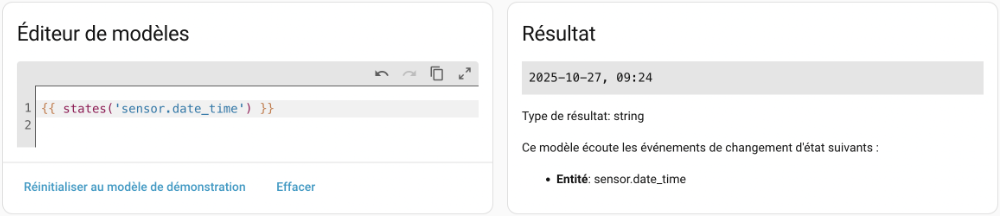

Il faut alors utiliser la méthode replace() pour enlever la virgule.

Sans cette précaution, on obtiendrait la valeur None.

Modèle

{{ as\_timestamp(states('sensor.date\_time').replace(',','')) }}

On aurait aussi pu travailler avec strptime() en précisant correctement le [format](https://docs.python.org/3/library/time.html#time.strftime) de la date reçue.

Modèle

{{ as\_timestamp(strptime(states('sensor.date\_time'), '%Y-%m-%d, %H:%M')) }}

Une autre option est de travailler avec un sensor.date\_time\_iso, qui représente la date et l'heure actuelles au format AAAA-MM-JJTHH:MM:SS (remarquez le T entre la date et l'heure) et qui peut être directement converti en timestamp.

Modèle

{{ as\_timestamp(states('sensor.date\_time\_iso')) }}

### timestamp d'un sensor.time

Avec un sensor.time, il faut adopter une autre technique.

Le problème, c'est qu'il manque la partie date à la valeur de ce capteur. Alors puisque la date buttoir d'un timestamp est le 1er janvier 1970, il est possible de concaténer cette date avant de faire la conversion.  Il ne faut pas oublier l'espace requis entre la date et l'heure.

Sans cette concaténation, on obtiendrait la valeur None.

Modèle

{{ as\_timestamp('1970-01-01 ' + states('sensor.time')) }}

## Conversion d'un timestamp en chaîne

Une fois les calculs de dates effectués, on obtient généralement un timestamp. Il faudra le reconvertir en chaîne afin de bien voir la date qu'il représente.

Il est possible de convertir un timestamp en objet Python à l'aide de as\_datetime() puis d'effectuer la conversion en chaîne à l'aide de la fonction Python [strftime()](https://www.programiz.com/python-programming/datetime/strftime).

Vous aurez alors la possibilité du format d'affichage de votre choix (ici, j'ai utilisé le format AAAA/MM/JJ pour la date et j'ai laissé tomber les secondes).

Modèle

  
...  
{{ as\_datetime(mon\_timestamp).strftime('%Y/%m/%d %H:%M') }}

Home Assistant met à notre disposition des filtres qui permettent d'effectuer la conversion plus simplement.

Le filtre timestamp\_utc permet de convertir un timestamp en une chaîne qui représente la date UTC.

La chaîne sera au format AAAA-MM-JJ HH:MM:SS.

Modèle

{{ mon\_timestamp | timestamp\_utc }}

Attention : ceci ne fonctionnera que si vous avez en main un timestamp.

Modèle

{{ states('sensor.date\_time\_iso') | timestamp\_utc }}

Le filtre timestamp\_local permet de convertir un timestamp en une chaîne qui représente la date dans le fuseau horaire local.

La chaîne sera ici aussi au format AAAA-MM-JJ HH:MM:SS.

Modèle

{{ mon\_timestamp | timestamp\_local }}

Le filtre timestamp\_custom permet de convertir un timestamp en une chaîne qui représente la date dans le format souhaité, en heure locale ou UTC.

Le premier paramètre représente le format souhaité.

Si vous lui passez la valeur true comme second paramètre, la chaîne représentera la date au fuseau horaire local.

Le paramètre false donnera la date au format UTC.

Modèle

{{ mon\_timestamp | timestamp\_custom("%Y-%m-%d %H:%M:%S", true) }}

Ici, on n'obtiendra que la date sans heure.

Modèle

{{ mon\_timestamp | timestamp\_custom("%Y-%m-%d", true) }}

## Calculs avec un timestamp

Le fait de transformer une date en timestamp permet de l'utiliser dans des calculs. Par exemple, on pourrait faire une addition pour obtenir la date de la semaine suivante.

Une fois les calculs effectués, la date pourra être reconvertie en chaîne.

Ici, j'ai effectué le calcul de secondes pour représenter 7 jours (60\*60\*24\*7).

Modèle

{{ (as\_timestamp(states('input\_datetime.date\_et\_heure')) + 604800) | timestamp\_local }}

## Comparaison avec la date du jour

Plusieurs techniques permettent de comparer une date avec la date du jour.

On peut travailler avec now() :

Modèle

{{ state\_attr('input\_datetime.date\_et\_heure', 'timestamp') < as\_timestamp(now()) }}

ou avec un sensor.date\_time\_iso, qui représente lui aussi la date du jour :

Modèle

{{ state\_attr('input\_datetime.date\_et\_heure', 'timestamp') < as\_timestamp(states('sensor.date\_time\_iso')) }}

ou encore avec un sensor.date\_time, qui représente également la date du jour mais nécessite une manipulation supplémentire :

Modèle

{{ state\_attr('input\_datetime.date\_et\_heure', 'timestamp') < as\_timestamp(states('sensor.date\_time').replace(',','')) }}

## Comparaison avec l'heure actuelle sans calculs

Si vous devez comparer deux entités qui représentent une heure, il est possible d'effectuer une comparaison sans avoir à passer par un timestamp.

Modèle

{{ states('sensor.time') <= states('input\_datetime.heure') }}

## Comparaison avec l'heure actuelle si besoin d'effectuer des calculs

Dans le cas où vous si vous devez faire des calculs, par exemple poser une action 30 minutes avant l'heure affichée, il faudra passer par un timestamp avec les précautions qui s'imposent, comme présenté dans les prochaines sections.

Quand Home Assistant fait des calculs qui impliquent des heures, ces heures seront d'abord converties en UTC si elles sont dans un fuseau horaire différent.

La majorité des heures sont affichées par défaut dans le fuseau horaire local, mais il y a des exceptions. La principale difficulté lorsqu'on compare des heures est donc de s'assurer que le tout soit dans le même fuseau horaire.

### input\_datetime qui saisit la date et l'heure : affiché en local

Un capteur virtuel input\_datetime qui saisit une date et une heure est affiché en heure locale, tel qu'on s'y attend.

À preuve, voici quelques modèles qui effectuent la conversion entre l'heure locale et l'heure UTC. Les résultats obtenus sont affichés plus bas.

Modèle

date et heure (saisi)  
{{ states('input\_datetime.date\_et\_heure') }}

 

date et heure (UTC)  
{{ state\_attr('input\_datetime.date\_et\_heure', 'timestamp') | timestamp\_utc }}  
{{ state\_attr('input\_datetime.date\_et\_heure', 'timestamp') | timestamp\_custom("%H:%M:%S", false) }}  
  
date et heure (local)  
{{ state\_attr('input\_datetime.date\_et\_heure', 'timestamp') | timestamp\_local }}  
{{ state\_attr('input\_datetime.date\_et\_heure', 'timestamp') | timestamp\_custom("%H:%M:%S", true) }}

Résultat à l'écran

date et heure (saisi)  
2022-01-11 10:30:00

 

date et heure (UTC)  
2022-01-11 15:30:00  
15:30:00

 

date et heure (local)  
2022-01-11 10:30:00  
10:30:00

### sensor.time : affiché en local

Si on fait de même avec l'heure courante obtenue par un sensor.time, on voit qu'elle est elle aussi affichée par défaut en heure locale.

Modèle

sensor.time (affiché):  
{{ states('sensor.time') }}

 

sensor.time (UTC)  
{{ as\_timestamp('1970-01-01 ' + states('sensor.time')) | timestamp\_utc }}  
{{ as\_timestamp('1970-01-01 ' + states('sensor.time')) | timestamp\_custom("%H:%M:%S", false) }}  
  
sensor.time (local)  
{{ as\_timestamp('1970-01-01 ' + states('sensor.time')) | timestamp\_local }}  
{{ as\_timestamp('1970-01-01 ' + states('sensor.time')) | timestamp\_custom("%H:%M:%S", true) }}

Résultat à l'écran

sensor.time (affiché):  
09:16

 

sensor.time (UTC)  
1970-01-01 14:16:00  
14:16:00

 

sensor.time (local)  
1970-01-01 09:16:00  
09:16:00

### input\_datetime qui ne saisit que l'heure : affiché en UTC si on ne prend pas de précautions

Avec un input\_datetime qui ne saisit que l'heure, par contre, l'heure affichée est en UTC si on ne prend pas les précautions nécessaires.

Donc, s'il contient la valeur 10h30, c'est 10h30 UTC qui sera utilisé dans les calculs et non 10h30 local converti en UTC comme on s'y attendrait.

J'ai barré les instructions pour vous rappeler que ce n'est pas la technique à utiliser.

Modèle

heure (saisi)  
{{ states('input\_datetime.heure') }}

 

heure (UTC)  
{{ state\_attr('input\_datetime.heure', 'timestamp') | timestamp\_utc }}  
{{ state\_attr('input\_datetime.heure', 'timestamp') | timestamp\_custom("%H:%M:%S", false) }}

 

heure (local)  
{{ state\_attr('input\_datetime.heure', 'timestamp') | timestamp\_local }}  
{{ state\_attr('input\_datetime.heure', 'timestamp') | timestamp\_custom("%H:%M:%S", true) }}

Résultat à l'écran

heure (saisi)  
10:30:00

 

heure (UTC)  
1970-01-01 10:30:00  
10:30:00

 

heure (local)  
1970-01-01 05:30:00  
05:30:00

La bonne technique consiste à utiliser la même astuce que pour un sensor.time : ajouter la date devant l'heure avant de la convertir en timestamp.

Modèle

heure (saisi)  
{{ states('input\_datetime.heure') }}

 

heure en ajoutant date (UTC)  
{{ as\_timestamp('1970-01-01 ' + states('input\_datetime.heure')) | timestamp\_utc }}  
{{ as\_timestamp('1970-01-01 ' + states('input\_datetime.heure')) | timestamp\_custom("%H:%M:%S", false) }}

 

heure en ajoutant date (local)  
{{ as\_timestamp('1970-01-01 ' + states('input\_datetime.heure')) | timestamp\_local }}  
{{ as\_timestamp('1970-01-01 ' + states('input\_datetime.heure')) | timestamp\_custom("%H:%M:%S", true) }}

Résultat à l'écran

heure (saisi)  
10:30:00

 

heure en ajoutant date (UTC)  
1970-01-01 15:30:00  
15:30:00

 

heure en ajoutant date (local)  
1970-01-01 10:30:00  
10:30:00

### Comparaison avec calculs maintenant possible!

Après avoir appliqué la technique pour ramener le input\_datetime dans le bon fuseau horaire, il est possible de faire des calculs puis de les comparer.

Ici, on utilise un modèle pour déclencher une action 30 minutes avant l'heure saisie dans le input\_datetime.

Modèle

{{ as\_timestamp('1970-01-01 ' + states('sensor.time')) >= as\_timestamp('1970-01-01 ' + states('input\_datetime.heure')) - 60\*30 }}

### Autre astuce

Il aurait également été possible d'ajouter 5 heures au input\_datetime alors qu'il est au format timestamp afin de le mettre sur le fuseau horaire local (le nombre d'heures sera différent selon votre fuseau horaire).

Mais ceci est moins intéressant puisqu'il faudra gérer nous-mêmes les passages à l'heure avancée.

Modèle

{{ (state\_attr('input\_datetime.heure', 'timestamp') + 5\*60\*60) | timestamp\_local }}

On obtiendra cette fois 1970-01-01 10:30:00 donc la comparaison est maintenant possible :

Modèle

{{ as\_timestamp('1970-01-01 ' + states('sensor.time')) >= (state\_attr('input\_datetime.heure', 'timestamp') + 5\*60\*60) }}

J'ai trouvé cette solution pendant une nuit d'insomnie!

Source : <https://starecat.com/brain-hey-youre-going-to-sleep-yes-now-shut-up-i-think-i-figuerd-out-how-to-debug-your-program-comic/>

Attention : si vous faites une égalité entre deux heures dans un déclencheur, l'action risque de ne jamais être déclenchée puisque Home Assistant ne réévaluera pas l'heure à chaque seconde.  
  
Il faut plutôt utiliser >= ou <=.  
  
L'utilisation de < ou de > n'est pas non plus souhaitable puisque vos déclencheurs ne lanceraient l'action que la minute suivante, lors de la réévaluation des capteurs de temps.

## Sources

1. « Templating ». Home Assistant. <https://www.home-assistant.io/docs/configuration/templating/>

2. « Time & Date ». Home Assistant. <https://www.home-assistant.io/integrations/time_date/>

## Pour plus d'information

« Templating - time ». Home Assistant. <https://www.home-assistant.io/docs/configuration/templating/#time>

## 79.7 Modèles qui vérifient la présence dans une zone

Les modèles permettent de vérifier la présence d'une entité dans une zone lorsque cette entité gère la position par rapport aux zones Home Assistant.

Si vous lisez ceci alors que vous n'avez pas encore travaillé avec de telles entités, par exemple les device\_trackers, je vous conseille de passer à la fiche suivante et de revenir ici seulement quand le besoin se fera sentir.

Sinon, vous êtes au bon endroit pour comprendre les manipulations des positions par rapport aux zones!

La gestion de la position GPS est bien intégrée à Home Assistant.

Une fois qu'on a défini une entité qui gère la position GPS, que ce soit [apical\_lien\_interne][travailler\_avec\_l\_application\_home\_assistant,avec l'application Home Assistant][/apical\_lien\_interne] ou encore [apical\_lien\_interne][simuler\_la\_position\_gps\_d\_une\_personne\_avec\_device\_tracker\_see,avec device\_tracker.see][/apical\_lien\_interne], il est possible de questionner l'état de cette entité pour savoir si elle est dans une des zones qu'on a définies.

Pour savoir dans quelle zone une personne se trouve :

Modèle

{{ states('device\_tracker.position\_virtuelle\_annie') }}

Ceci affichera home ou le nom de la zone ou not\_home si la personne est en dehors de toutes les zones définies.

Pour vérifier si une personne est dans la zone Maison (elle peut porter un autre nom selon votre configuration de Home Assistant, mais elle sera toujours nommée home dans le code) :

Modèle

{{ is\_state('device\_tracker.position\_virtuelle\_annie','home') }}

Pour vérifier si elle est dans la zone Cégep :

Modèle

{{ is\_state('device\_tracker.position\_virtuelle\_annie','Cégep') }}

Pour vérifier si elle est en dehors des zones connues :

Modèle

{{ is\_state('device\_tracker.position\_virtuelle\_annie','not\_home') }}

## 79.8 Format JSON dans un modèle

L'étude des modèles Home Assistant ne serait pas complète si on ne parlait pas de maniuplation du format JSON.

Si vous lisez ceci alors que vous n'avez pas encore eu besoin du JSON, je vous conseille de passer à la fiche suivante et de revenir ici seulement quand le besoin se fera sentir.

Sinon, vous êtes au bon endroit pour comprendre les manipulations JSON!

Parfois, toutes les informations sur un objet connecté ou plus précisément sur une entité seront encodées au format JSON.

Ce sera le cas notamment pour des informations qui seraient reçues via un API ou via [apical\_lien\_interne][publication\_et\_abonnement\_mqtt\_avec\_home\_assistant,MQTT,json][/apical\_lien\_interne].

## Encodage

Si vous devez encoder des données au format JSON, rappelez-vous que ce format utilise des guillemets et non des apostrophes alentour de la clé. Home Assistant acceptera les deux syntaxes mais les validateurs JSON, par exemple [https://jsonlint.com](https://jsonlint.com/), indiqueront qu'il y a une erreur.

YAML

payload: >-  
  {  
    "latitude": {{ state\_attr('device\_tracker.position\_virtuelle\_annie', 'latitude') }},  
    "longitude": {{ state\_attr('device\_tracker.position\_virtuelle\_annie', 'longitude') }}   
  }

La syntaxe précédente fonctionne bien. Cependant, pour vous assurer que tout soit correctement encodé, il est préférable d'utiliser le filtre [to\_json](https://www.home-assistant.io/docs/configuration/templating/#tofrom-json-examples).

YAML

payload: |-  
    
  {{ valeurs | to\_json }}

Voici un example dans l'interface Web d'une automatisation qui doit envoyer des informations au format JSON.

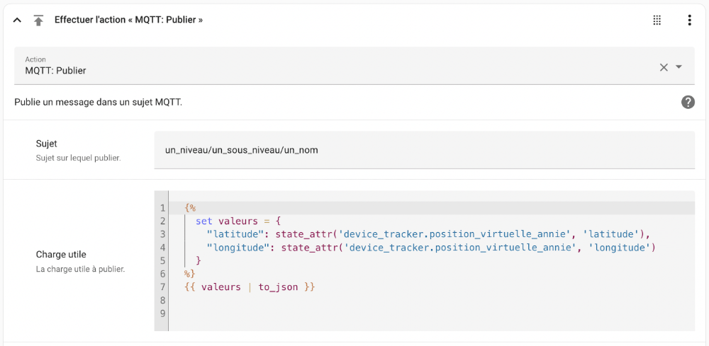

### C'est quoi toutes ces accolades?

Dans les exemples précédents, on voit des accolades qui jouent différents rôles. Apprenez à les différencier afin de mieux comprendre la syntaxe.

*  Cette syntaxe, utilisée dans les modèles, permet d'effectuer du traitement sans retourner de valeur.
* {{ ... }} Les double-accolades sont elle aussi utilisées dans les modèles mais cette fois, elles servent à retourner une valeur.
* { ... } Les simples accolades servent à délimiter la chaîne JSON.

## Décodage

Home Assistant pourrait recevoir des informations comme ceci  de la part d'un objet connecté :

{"luminosite": 40, "temperature": 23, "mouvement": 0, "humidite": 50, "pile": 90}

Les objets qui fournissent une position GPS travailleront souvent avec cette structure de données :

{"latitude": 46.06027408131711, "longitude": -71.9437545693869}

Pour connaître la valeur d'une de ces informations,  il faudra d'abord désérialiser la chaîne JSON à l'aide du filtre [from\_json](https://www.home-assistant.io/docs/configuration/templating/#tofrom-json-examples).

L'information sera ensuite disponible soit comme une propriété (avec un point), soit comme un élément de tableau (avec des crochets carrés).

Les deux syntaxes sont équivalentes.

Modèle Home Assistant

{{ (states('domaine.identifiant\_objet') | from\_json).nom\_information }}

ou

Modèle Home Assistant

{{ (states('domaine.identifiant\_objet') | from\_json)['nom\_information'] }}

Notez que si vous testez ce modèle [apical\_lien\_interne][les\_modeles\_dans\_home\_assistant,dans les outils de développement,editeur][/apical\_lien\_interne] et que vous obtenez l'erreur « JSONDecodeError: unexpected character: line 1 column 1 (char 0) », c'est que les données que vous tentez de lire ne sont pas au format JSON.

## 79.9 Utiliser un modèle dans une carte du tableau de bord

Quand vient le temps de [apical\_lien\_interne][creer\_un\_tableau\_de\_bord\_personnalise,personnaliser le tableau de bord de Home Assistant][/apical\_lien\_interne], les cartes Markdown offrent beaucoup de flexibilité.

Bien sûr, comme leur nom l'indique, elles permettent d'inscrire un texte et de le formater à l'aide de la [syntaxe Markdown](https://commonmark.org/help/).

Elles offrent également la possibilité d'utiliser [apical\_lien\_interne][les\_modeles\_dans\_home\_assistant,des modèles][/apical\_lien\_interne].

Ceci vous permet de modifier l'affichage selon la condition que vous désirez mettre en place.

## 79.10 Information sur l'entité qui a déclenché une automatisation

Quand une automatisation a plusieurs déclencheurs, il est intéressant de savoir lequel a effectivement causé le déclenchement.

On pourrait, par exemple, [apical\_lien\_interne][configurer\_home\_assistant\_pour\_l\_envoi\_de\_courriel,envoyer un courriel][/apical\_lien\_interne], [apical\_lien\_interne][envoyer\_une\_notification\_a\_l\_application\_mobile,une notification][/apical\_lien\_interne] ou encore [apical\_lien\_interne][slug\_de\_la\_fiche,enregistrer une information dans un journal][/apical\_lien\_interne] avec ce modèle, qui permet de retrouver l'identifiant du déclencheur (ex : device\_tracker.position\_virtuelle\_annie).

Modèle

{{ trigger.entity\_id }}

Pour connaître le nom de l'entité qui a fait le déclenchement en changeant d'état :

Modèle

{{ trigger.to\_state.name }}

Pour connaître la valeur de l'entité qui a fait le déclenchement :

Modèle

{{ trigger.to\_state.state }}

Pour connaître le nom de l'automatisation, on utilisera :

Modèle

{{ this.entity\_id }}