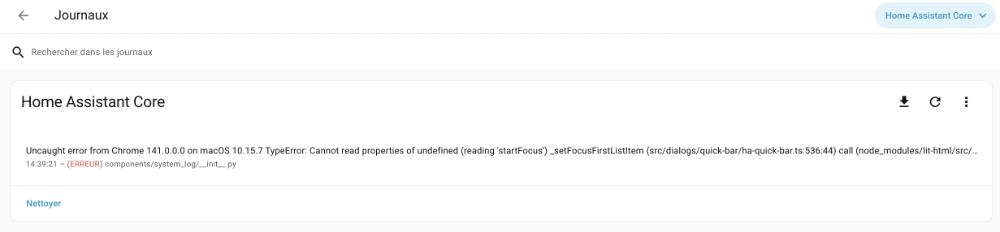
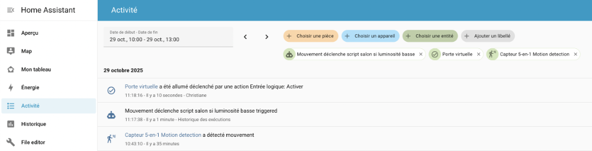
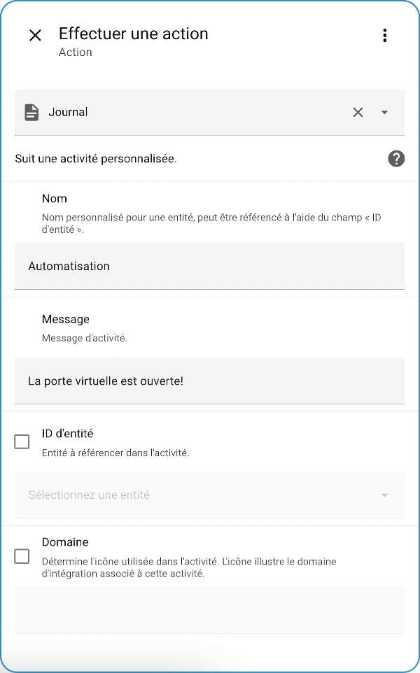
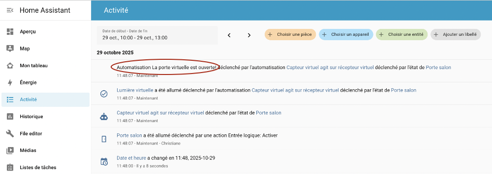
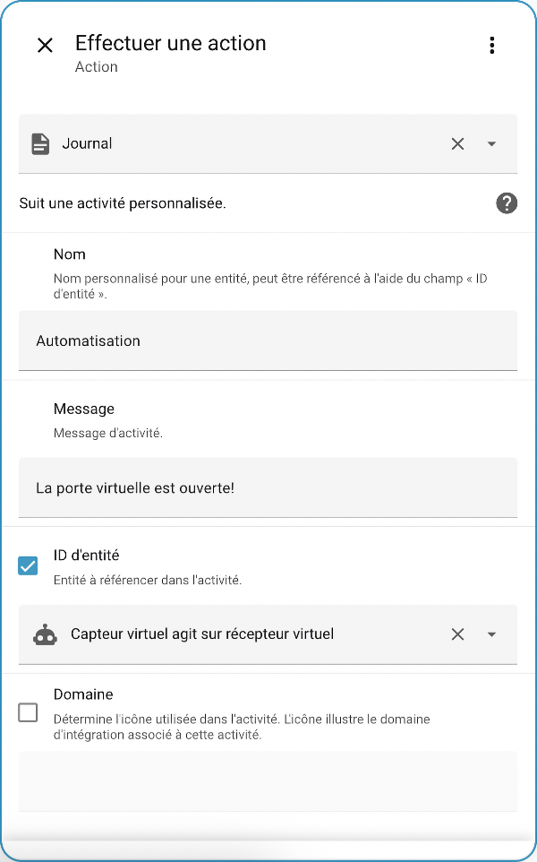
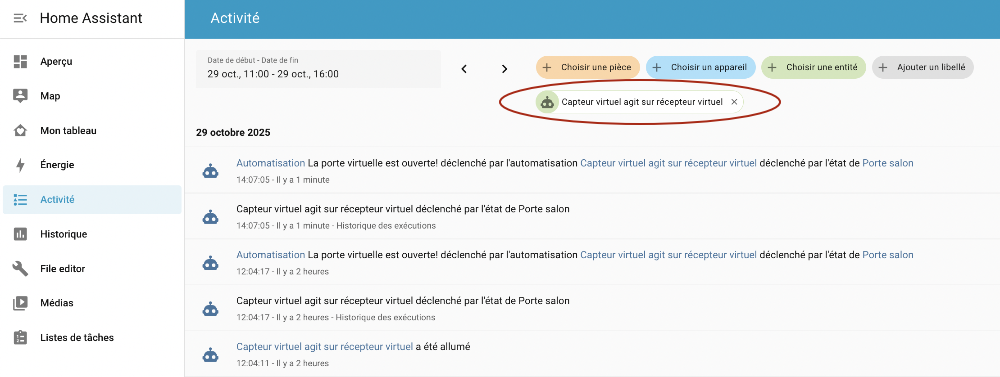
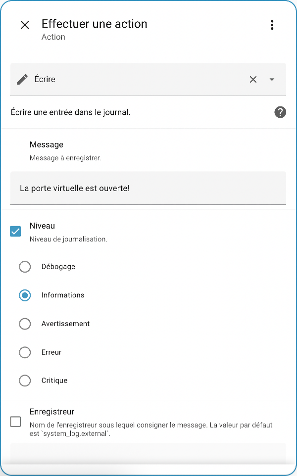
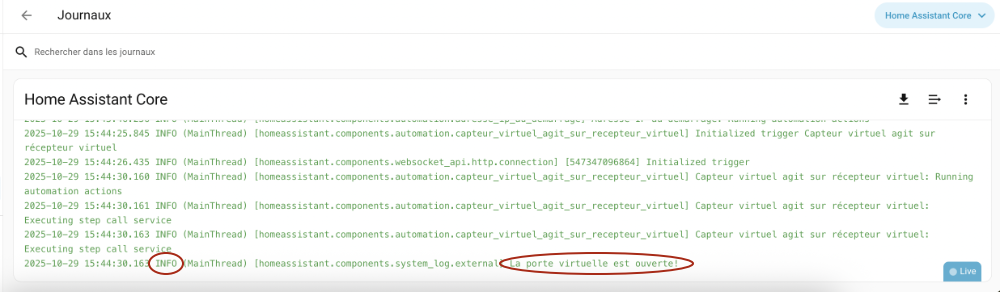
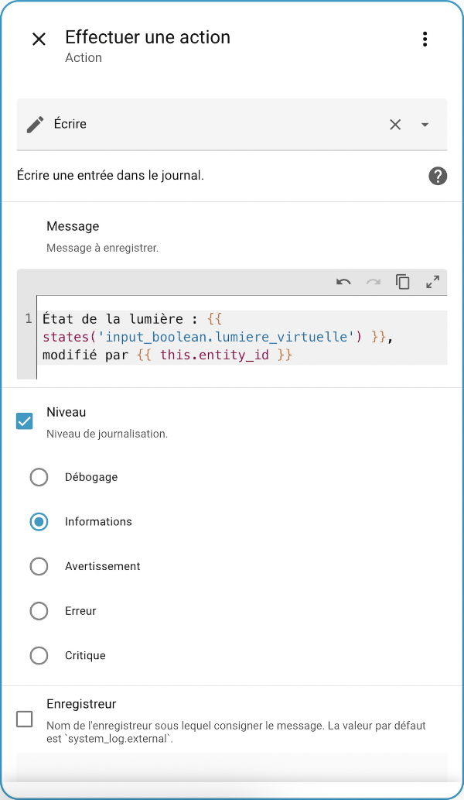
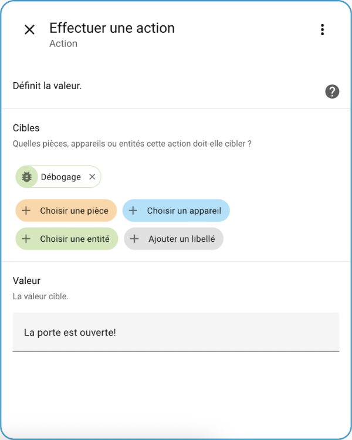

# 240 — 2. Déboguer Home Assistant

## 241 — 2.1 Les fichiers journaux de Home Assistant

À l'aide de l'intégration [System Log](https://www.home-assistant.io/integrations/system_log/), le supervisor de Home Assistant enregistre dans différents fichiers journaux (log files) de l'information sur ce qui se passe dans le système, principalement les erreurs et avertissements.

D'autres informations sont enregistrées [via le service de journalisation journald](https://www.loggly.com/ultimate-guide/using-journalctl/). Ces informations sont stockées sur le disque dans des fichiers binaires.

## Consulter les fichiers journaux dans l'interface Web

Les différents fichiers journaux sont disponibles à partir de ces options de menu.

* Le menu Paramètres / Système / Journaux affiche le journal home-assistant.log sous forme brute ou condensées. Ces informations sont tirées du fichier /mnt/data/supervisor/homeassistant/home-assistant.log.

  
* Dans l'option de menu Activité, disponible directement dans le menu de gauche, vous trouverez le journal des activités qui affiche des informations au sujet des objets connectés et autres événements détectés dans Home Assistant. Ces informations sont tirées de la base de données.

  

## Consulter les fichiers journaux à partir du terminal

Certains fichiers journaux sont également disponibles à partir du [apical\_lien\_interne][la\_console\_home\_assistant,terminal HassOS,terminal][/apical\_lien\_interne].

Pour afficher le contenu du fichier home-assistant.log :

Terminal

cat /mnt/data/supervisor/homeassistant/home-assistant.log

Pour afficher le journal du core de Home Assistant :

Terminal

ha core logs

Il est possible de voir le contenu du fichier journal du conteneur Docker de Home Assistant avec ceci :

Terminal

docker logs homeassistant

Pour afficher le journal du Supervisor :

Terminal

ha supervisor logs

La commande journalctl permet elle aussi d'afficher des fichiers journaux spécifiques :

Terminal

journalctl -u home-assistant

Terminal

journalctl -u hassos-supervisor

ou, pour avoir toute l'information disponible :

Terminal

journalctl

## 242 — 2.2 Écrire dans un fichier journal

Home Assistant propose des services pour écrire dans différents fichiers journaux.

Dans cette fiche :

* [Écriture dans le journal des activités (logbook.log)](#logbook)
  + [Identifiant d'entité à référencer](#identite)
* [Écriture dans le journal de Home Assistant (system\_log.write)](#systemlog)
  + [Niveau de journalisation](#niveau)
  + [Écriture](#ecriture)
* [Enregistrer l'état d'un capteur dans un fichier journal](#etat)

## Écriture dans le journal des activités (logbook.log)

Le service [logbook.log](https://www.home-assistant.io/integrations/logbook/#custom-entries) permet d'écrire dans le fichier journal des activités, disponible à partir du menu Activités dans la barre de gauche..

Il est possible de l'utiliser comme action dans une automatisation en choisissant Autres actions / Effectuer une action.

Dans la case Action, choisissez Journal . Ceci correspond à l'action logbook.log.

Vous devez minimalement spécifier un nom et un message.

Le résultat apparaîtra dans le menu Activité.

On voit ici le nom (Automatisation) et le message (La porte virtuelle est ouverte!).

### Identifiant d'entité à référencer

Pour faciliter la recherche des messages dans le journal des activités, il est possible de spécifier un identifiant d'entité.

Ici, j'ai choisi d'associer l'action à l'entité qui représente l'automatisation.

Dans le journal des activités, vous pouvez désormais filtrer par entité.

Dans cette impression d'écran, on ne voit que les activités associées à cette automatisation.

## Écriture dans le journal de Home Assistant (system\_log.write)

Il est possible de configurer une automatisation pour qu'elle écrive dnas le fichier journal de Home Assistant ( /mnt/data/supervisor/homeassistant/home-assistant.log).

Le contenu de ce fichier peut être consulté via le menu Paramètres / Système / Journaux.

### Niveau de journalisation

Par défaut, seuls les messages de niveau critical sont affichés. Tous les messages sont cependant enregistrés dans la table event\_data de la base de données.

Pour faire afficher les message des [niveaux](https://www.home-assistant.io/integrations/logger/#log-levels) inférieurs (debug, info, warning, error et fatal), il faut ajouter une configuration dans le fichier configuration.yaml.

Par exemple, pour afficher les message de niveau info ou supérieur (info, warning, error, fatal et critical) :

Fichier configuration.yaml

logger:  
  default: info

Il faut redémarrer Home Assistant pour que cette configuration soit prise en compte.

### Écriture

Si vous utilisez l'action Écrire, qui correspond à l'action system\_log.write, vous écrirez un message dans le fichier journal de Home Assistant.

Faites attention de sélectionner un niveau de journalisation qui est correspond au niveau configuré plus haut.

Le résultat sera visible dans Paramètres / Système / Journaux.

Si le niveau est inférieur à critique, vous devrez cliquer sur les trois points verticaux et choisir Afficher les journaux bruts.

## Enregistrer l'état d'un capteur dans un fichier journal

Peu importe dans quel journal vous choisissez d'écrire, il est possible d'utiliser un [apical\_lien\_interne][les\_modeles\_dans\_home\_assistant,modèle][/apical\_lien\_interne] pour inscrire la valeur du capteur.

Remarquez l'utilisation de ce modèle, qui permet de retrouver l'identifiant d'entité de l'automatisation (puisqu'il est utilisé dans une automatisation).

Modèle

{{ this.entity\_id }}

Cette action enregistrera ceci dans le journal :

Journal

État de la lumière : on, modifié par automation.capteur\_virtuel\_agit\_sur\_recepteur\_virtuel

## 243 — 2.3 Vérifier une automatisation en stockant une valeur dans un capteur virtuel

Les capteurs virtuels de type texte peuvent être pratiques pour effectuer des vérifications pendant le déclenchement d'une automatisation.

Résultat :

