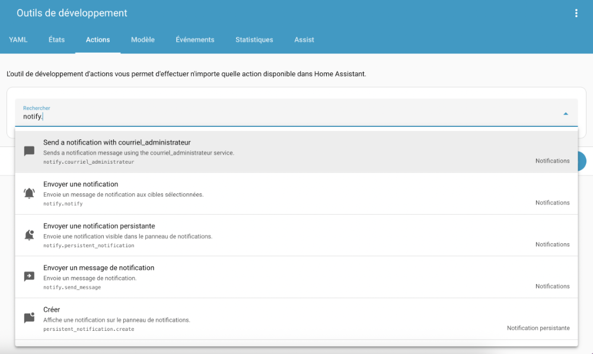
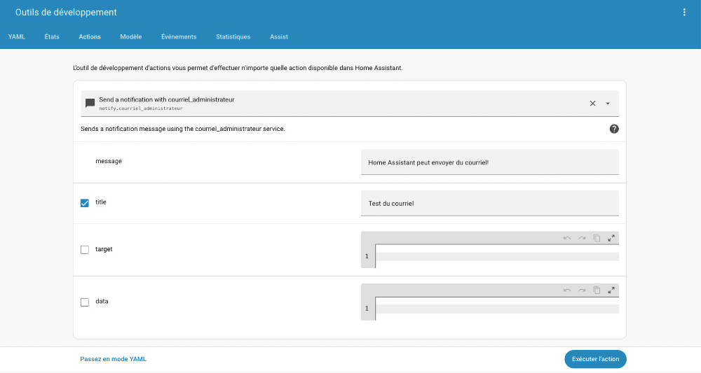
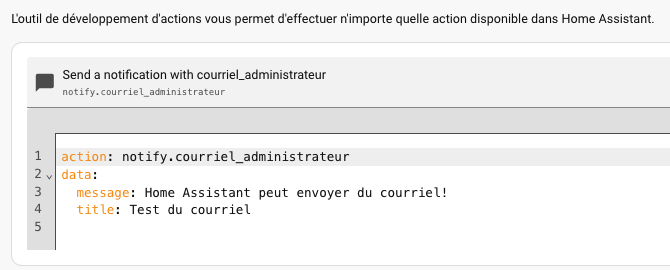
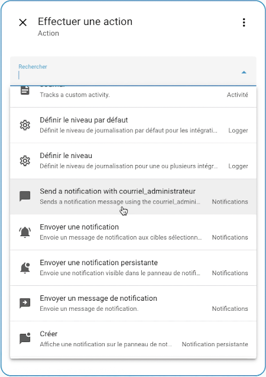
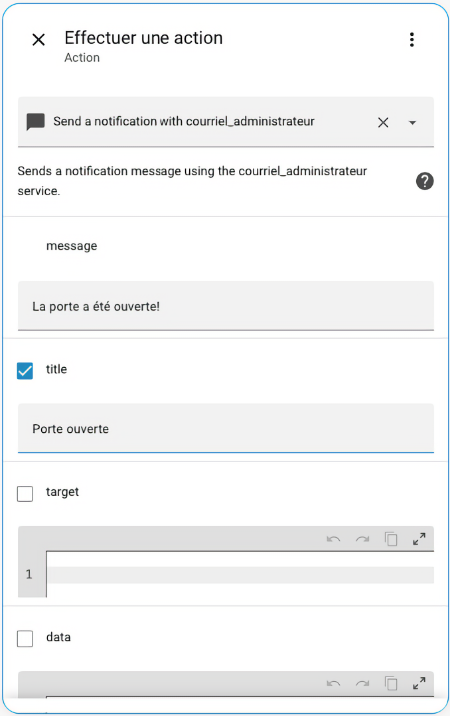

# 84. Notification par courriel

## 84.1 Configurer Home Assistant pour l'envoi de courriel

Home Assistant est capable d'envoyer du courriel lorsqu'il est correctement configuré.

D'abord, [apical\_lien\_interne][creer\_une\_adresse\_de\_courriel\_avec\_votre\_nom\_de\_domaine,créez une adresse de courriel avec votre nom de domaine][/apical\_lien\_interne]. Cette adresse pourra être utilisée pour envoyer des courriels par programmation si votre fournisseur de courriel habituel (ex : GMail) ne le permet pas. L'adresse pourrait être sous la forme homeassistant@mondomaine.com.

Ajoutez maintenant ces configurations [apical\_lien\_interne][Editer\_le\_fichier\_configuration\_yaml,dans le fichier configuration.yaml][/apical\_lien\_interne].

Fichier configuration.yaml

notify:  
  - name: courriel\_administrateur   
    platform: smtp  
    sender: homeassistant@mondomaine.com  
    server: mail.mondomaine.com  
    timeout: 15  
    port: 587  
    encryption: starttls  
    username: homeassistant@mondomaine.com  
    password: mot\_de\_passe\_en\_clair  
    sender\_name: Home Assistant  
    recipient: destinataire@sondomaine.com

Si le courriel doit être envoyé à plus d'un destinataire :

Fichier configuration.yaml

recipient:  
      - destinataire@sondomaine.com  
      - autredestinataire@autredomaine.com

Attention : ne mettez pas de caractères accentués sur la ligne sender\_name.

J'ai fait des tests avec sender\_name: Home Assistant Cégep et j'obtenais ceci dans mon courriel comme nom de l'envoyeur :

=?utf-8?q?Home\_Assistant\_C=C3=A9gep\_=3Chomeassistant...

Tout est entré dans l'ordre quand j'ai enlevé l'accent.

Il est cependant possible d'utiliser des accents dans le titre et dans le message du courriel.

## Tester le tout

Pour vérifier si les configurations fonctionnent, rendez-vous dans le menu Outils de développement puis choisissez l'onglet Actions.

Le nom de l'action doit être « notify. » suivi du nom que vous avez donné à votre configuration YAML (si la configuration commence par name: courriel\_administrateur, le nom du service est notify.courriel\_administrateur).

Dans les zones prévues à cet effet, donnez un titre et un message au courriel puis cliquez sur Exécuter l'action.

Si vous préférez remplir les informations en mode YAML, vous obtiendrez ceci :

Vérifiez dans la ou les boîtes de courriel qui ont été configurées (recipient), le message devrait y avoir été envoyé.

Attention : le message pourrait avoir été placé dans les pourriels. Si c'est le cas, vous devrez configurer votre outil de messgerie pour ajouter l'expéditeur aux expéditeurs approuvés afin que ça ne se reproduise plus.

Une fois ces configurations en place, il sera possible [apical\_lien\_interne][automatisation\_qui\_envoie\_un\_courriel,d'envoyer un courriel dans une automatisation][/apical\_lien\_interne], par exemple lorsque le capteur d'ouverture de porte détecte que la porte a été ouverte entre minuit et 6h00.

## Pour plus d'information

« SMTP ». Home Assistant. <https://www.home-assistant.io/integrations/smtp/>

## 84.2 Automatisation qui envoie un courriel

Pour qu'une automatisation envoie un courriel, dans la zone Alors faire , il faut choisir :  Autres actions / Effectuer une action.

Dans la liste déroulante des actions, choisissez celui dont le nom est « Send a notification » suivi du nom que vous avez donné à votre configuration YAML.

Notez que cette action ne sera pas présente si la configuration pour l'envoi de courriel n'est pas correcte ou si Home Assistant n'a pas été redémarré après sa création.

Renseignez ensuite les informations du courriel à envoyer.

Ce courriel sera envoyé automatiquement lorsque le déclencheur que vous avez configuré sera activé (ex : lorsque la porte sera ouverte).

Si vous préférez travailler directement en YAML, le code du fichier automatisations.yaml ira comme suit :

Fichier automatisations.yaml

- id: '1606739413415'  
  alias: Porte ouverte envoie courriel  
  description: ''  
  trigger:  
  - trigger: state  
    entity\_id:  
    - input\_boolean.porte\_virtuelle  
    from: 'off'  
    to: 'on'  
  conditions: []  
  actions:  
  - action: notify.courriel\_administrateur  
  data:  
    message: La porte a été ouverte!  
    title: Porte ouverte  
 mode: single