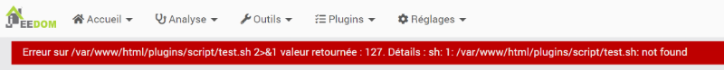

# 51. Dépannage sur le contrôle GPIO avec Jeedom {#chapitre-depannage_sur_le_controle_gpio_avec_jeedom}

## 51.1 Erreur « Permission denied » {#fiche-erreur_permission_denied}

### Problème :

Lorsque vous essayez de lancer un script bash à partir de Jeedom à l'aide du plugin Script - officiel par Jeedom SAS, vous obtenez un message du genre « Erreur sur /home/pi/monscript.sh 2>&1 valeur retournée : 126. Détails : sh: 1: /home/pi/monscript.sh: Permission denied ».


### Contexte :

* Jeedom 4.0.61

### Cause possible :

Le script ne possède pas les droits d'exécution pour la catégorie d'usagers « Autres ».

### Solution proposée :

Donnez les droits d'exécution sur le fichier. Même si ceci n'est pas requis, on peut dans une même commande donner les droits égalemenet au propriétaire et au groupe propriétaire.

Terminal sur Raspberry Pi


```
chmod 777 monscript.sh
```


## 51.2 Erreur « 127 : not found » {#fiche-erreur_127_not_found}

### Problème :

Lorsque vous essayez de lancer un script bash à partir de Jeedom à l'aide du plugin Script - officiel par Jeedom SAS, vous obtenez un message du genre « Erreur sur /var/www/html/plugns/script/test.sh 2>&1 valeur retournée : 127. Détails : sh: 1:/var/www/html/plugns/script/test.sh: not found ».



Pourtant, vous êtes certains que le fichier existe à l'emplacement proposé.

### Contexte :

* Jeedom 4.0.61

### Cause possible :

Le script a été écrit sur un ordinateur Windows avant d'être copié sur le Raspberry Pi et l'encodage des fins de lignes n'a pas été adapté pour Linux.

Pour le savoir, lancez la commande suivante sur le Raspberry Pi :

Terminal


```
cat -v test.sh
```


Si une fin de ligne est marquée par CRLF (encodage requis sous Windows), elle apparaîtra sous la forme ^M.

Résultat à l'écran


```
#!/bin/bash^M
```


### Solution proposée :

L'éditeur Geany peut convertir les caractères de fins de ligne selon vos préférences.

Sous Windows, Mac ou Linux, rendez-vous dans le menu Document / Définir les fins de ligne et choisissez l'option qui vous convient.


## 51.3 Erreur « RuntimeError: No access to /dev/mem. Try running as root! » {#fiche-erreur_runtimeerror_no_access_to_dev_mem_try_running_as_root}

### Problème :

Lorsque vous essayez de lancer un script bash à partir de Jeedom à l'aide du plugin Script - officiel par Jeedom SAS, vous obtenez un message du genre « Erreur sur /home/pi/monscript.sh on 2>&1 valeur retournée : 1. Détails : Traceback (most recent call last): File "/home/pi/monscript.py", line 19, in GPIO.setup(led, GPIO.OUT) RuntimeError: No access to /dev/mem. Try running as root! ».


### Contexte :

* Jeedom 4.0.61

### Cause possible :

Le script bash qui se charge d'appeler le script Python ne fait pas de sudo devant la commande.

Fichier monscript.sh


```
#!/bin/bash
python3 /home/pi/monscript.py
```


### Solution proposée :

Ajoutez sudo devant la commande.

Fichier monscript.sh


```
#!/bin/bash
sudo python3 /home/pi/monscript.py
```
