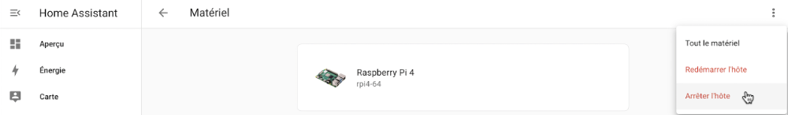
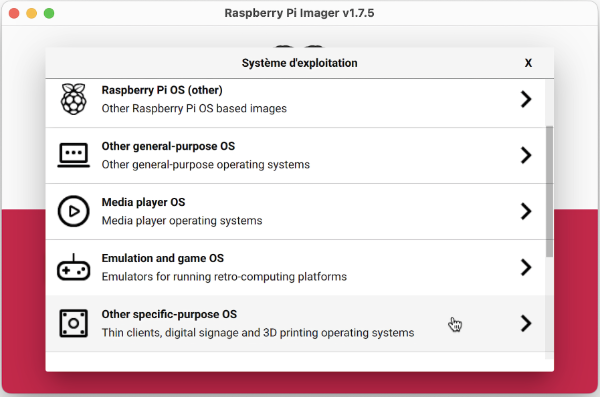
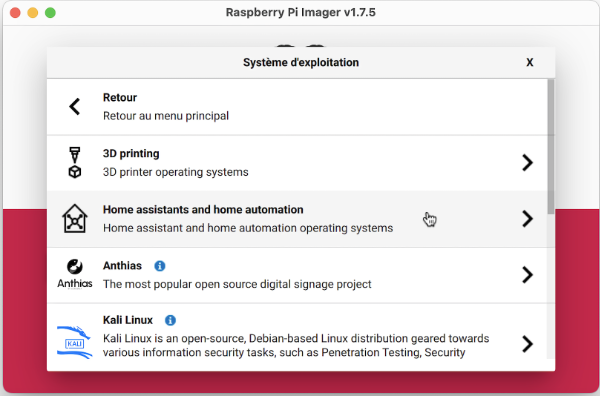
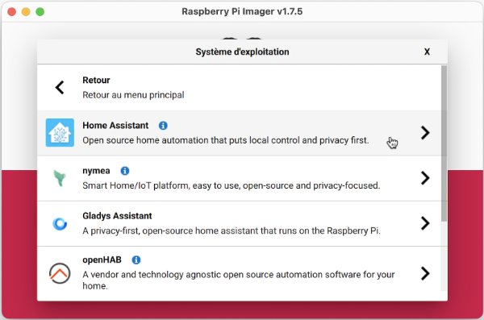
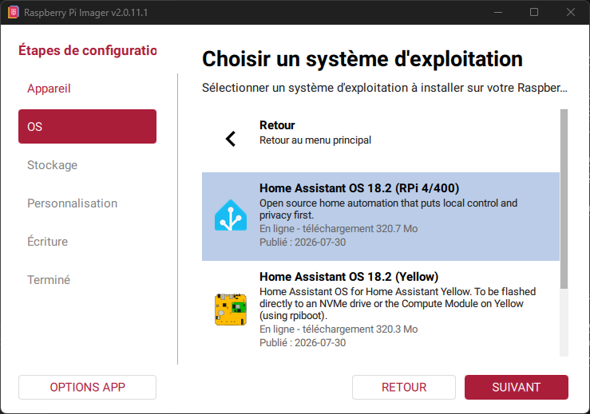
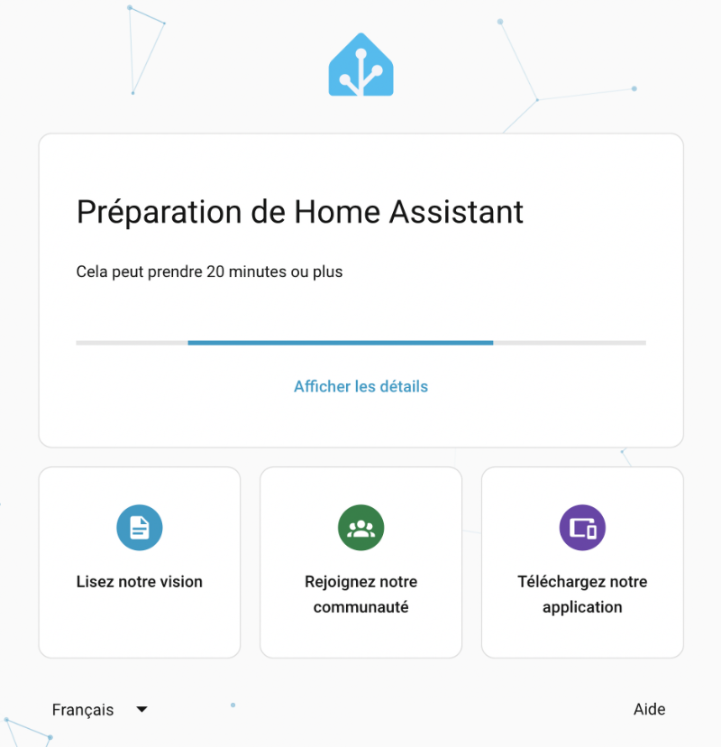
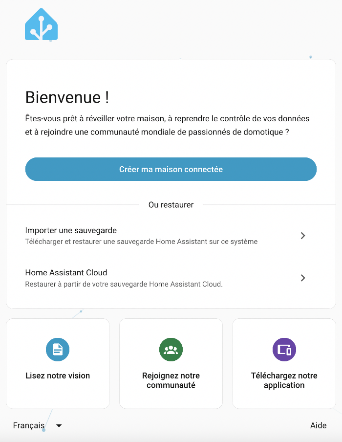
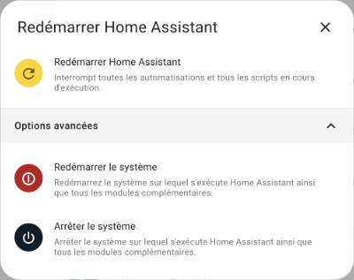

# 58. Home Assistant au coeur de votre système domotique

## 58.1 En résumé...

Voici un résumé des informations essentielles du ou des prochains chapitres.

Notez que certaines fiches, qui font partie intégrante du cours, pourraient ne pas figurer dans ce résumé.

Je vous recommande d'effectuer une lecture de l'ensemble des fiches de ces chapitres afin de bien saisir les enjeux.

## <a href="fiche-installation_de_home_assistant_et_premier_acces.md#installation_de_home_assistant_et_premier_acces">installation_de_home_assistant_et_premier_acces</a>

Bien suivre les étapes sur cette fiche!

## <a href="fiche-la_console_home_assistant.md#la_console_home_assistant">la_console_home_assistant</a>

La console Home Assistant se reconnaît à l'invite ha >.

Résultat à l'écran

Waiting for the Home Assistant CLI to be ready...  
 _    _                                         _     _              _  
| |  | |                          /\           (_)   | |            | |  
| |__| | ___  _ __ ___   ___     /  \   ___ ___ _ ___| |_ __ _ _ __ | |_  
|  __  |/ _ \| '_ \ _ \ / _ \   / /\ \ / __/ __| / __| __/ _\ | '_ \| __|  
| |  | | (_) | | | | | | __ /  / ____ \\__ \__ \ \__ \ || (_| | | | | |_  
|_|  |_|\___/|_| |_| |_|\___| /_/    \_\___/___/_|___/\__\__,_|_| |_|\__|  
  
Welcome on Home Assistant command line.  
Waiting for Supervisor to start up...  
System information  
  IPv4 Addresses for eth0:  
  IPv4 Adresses for wlan0: 192.168.1.145/24  
  IPV6 Adresses for wlan0: fe80:fde8:195c:eb0b:c18a/64  
  
  OS Version:              Home Assistant OS 9.0  
  Home Assistant Core:     2022.9.7  
  
  Home Assistant URL:      http://homeassistant.local:8123  
  Observer URL:            http://homeassistant.local:4357  
  
ha >

Cette console vous donne accès à certaines commandes spécialisées pour Home Assistant.

Le terminal HassOS se reconnaît à l'invite #.

Résultat à l'écran

monnom@MacBook-Pro-de-MonNom ~ %ssh root@192.168.1.145 -p 22222  
Welcome to Home Assistant OS.

 

Use `ha` to access the Home Assistant CLI.  
#

Le terminal HassOS est en fait un terminal Linux spécialisé.

Pour entrer une commande Home Assistant dans un terminal HassOS, faire précéder son nom par ha.

Terminal HassOS

ha network info

Le même résultat serait obtenu dans la console Home Assistant comme suit :

Console Home Assistant

network info

Pour accéder au terminal HassOS à partir de la console Home Assistant, entrez la commande login.

Aucun code d'usager ni mot de passe ne vous sera demandé.

Résultat à l'écran

ha > login  
  
#

## <a href="fiche-Eteindre_home_assistant_de_facon_securitaire.md#Eteindre_home_assistant_de_facon_securitaire">Eteindre_home_assistant_de_facon_securitaire</a>

Pour arrêter ou redémarrer le système complet :

Rendez-vous dans le menu Paramètres / Système / Matériel.

Dans le coin supérieur droit, cliquez sur les trois points verticaux.

ou

Terminal HassOS

halt

ou

Terminal HassOS

reboot

Pour redémarrer seulement le coeur de Home Assistant :

* Rendez-vous dans le menu Paramètres / Système.
* Cliquez sur le lien Redémarrer qui apparaît dans le coin supérieur gauche de l'écran.

ou

Terminal HassOS

ha core restart

## <a href="fiche-dossier_config.md#dossier_config">dossier_config</a>

Sur le Web, on parle souvent du dossier config de Home Assistant. C'est celui qui contient le fichier configuration.yaml. Son emplacement sera différent selon le type d'installation de Home Assistant.

Avec HassOS, il s'agit en fait du dossier /mnt/data/supervisor/homeassistant.

Ainsi, si on vous demande de placer un fichier dans le dossier config/www, il faut plutôt le placer dans le dossier /mnt/data/supervisor/homeassistant/www.

## 58.2 Installation de Home Assistant et premier accès

Home Assistant est un excellent logiciel domotique à code source ouvert qui peut être installé entre autres sur un Raspberry Pi.

Dans les faits, il peut :

* tourner par-dessus le système d'exploitation de votre choix (on parlera de Home Assistant Core)
* tourner par-desssus un système Linux de votre choix, par exemple Raspberry Pi OS (on parlera alors de Home Assistant Supervised)
* tourner dans un conteneur Docker que vous gérez vous-mêmes (on parlera de Home Assistant Container)
* selon la technique recommandée, tourner par-dessus le système d'exploitation Home Assistant Operating System ou HassOS pour les intimes, autrefois appelé Hass.io. HassOS est un système d'exploitation GNU/Linux léger spécifiquement conçu pour exécuter des conteneurs Docker sur des systèmes embarqués. Auparavant, il était basé sur [resinOS](https://www.balena.io/blog/introducing-resinos/). Aujourd'hui, il est bâti à partir de [Buildroot](https://buildroot.org/).

Nous travaillerons ici avec la version installée sur HassOS.

Pour installer Home Assistant selon cette technique, il faut installer une image de HassOS sur la carte micro SD. L'image est disponible directement dans [Raspberry Pi Imager](https://www.raspberrypi.com/software/#:~:text=Raspberry%20Pi%20Imager).

Une fois le Pi démarré, HassOS téléchargera puis installera automatiquement la toute dernière version de Home Assistant.

Notez que la procédure d'installation de Home Assistant est dite headless, c'est-à-dire que vous n'avez pas besoin de brancher écran ni clavier au Raspberry Pi. La seule utilité d'un écran serait de voir l'état d'avancement de l'installation, mais ce n'est pas nécessaire.

Voici les sections couvertes dans cette procédure :

* [Préparer la carte micro SD](https://apical.xyz/formations/pageunique/systeme_domotique_diy#carte)
* [Configurations initiales (clé USB)](https://apical.xyz/formations/pageunique/systeme_domotique_diy#usb)
* [Démarrer le Raspberry Pi](https://apical.xyz/formations/pageunique/systeme_domotique_diy#demarrer)
* [Accéder à Home Assistant](https://apical.xyz/formations/pageunique/systeme_domotique_diy#acceder)
* [Vérifier la présence des fichiers de configuration de la clé USB](https://apical.xyz/formations/pageunique/systeme_domotique_diy#presence)

## Préparer le Raspberry Pi

Commencez par prendre connaissance de la fiche suivante afin d'acquérir les bonnes composantes de base : <a href="fiche-un_raspberry_pi_comme_unite_centrale.md#un_raspberry_pi_comme_unite_centrale">un_raspberry_pi_comme_unite_centrale</a>.

## Préparer la carte micro SD

Pour installer le système d'exploitation HassOS sur votre Rapsberry Pi :

* Insérez la carte micro SD dans votre ordinateur.
* Si ce n'est pas déjà fait, installez [Raspberry Pi Imager](https://www.raspberrypi.com/software/#:~:text=Raspberry%20Pi%20Imager) sur votre ordinateur puis lancez cette application.
* Cliquez sur Choisir l'OS.
* Cliquez sur Other specific-purpose OS.

  
* Choisissez Home assistants and home automation.

  
* Cliquez sur Home Assistant.

  
* Finalement, choisissez la version qui correspond à votre Raspberry Pi.

  
* Spécifiez sur quelle carte l'image doit être installée puis cliquez sur Écrire.
* Une fois l'image en place sur la carte micro SD, vous pourriez avoir à l'écran un message du genre « Le disque que vous avez attaché n’est pas lisible par cet ordinateur. » ou, en anglais « The disk you connected cannot be read on this computer ».
* Ceci est normal, cliquez sur Ignorer.

   

## Configurations initiales (clé USB)

Vous l'avez peut-être remarqué, lors de l'installation de Home Assistant, Raspberry Pi Imager ne vous a pas offert l'option MODIFIER RÉGLAGES. En effet, cette option n'est disponible que lors de l'installation de Raspberry Pi OS.

Une technique différente a été prévue pour effectuer les configurations initiales, par exemple le réseau sans fil, le serveur DNS et l'adresse IP statique.

Il s'agit de placer les fichiers de configuration sur une clé USB qui répond à des règles précises :

* La clé doit être vierge et être formatée en FAT32 :
  + Sous Windows, l'utilitaire par défaut ne fait pas bien le travail. Vous devez utiliser un autre utilitaire, par exemple MiniTool (voir <https://www.minitool.com/partition-disk/fat32-not-an-option.html>).
  + Sous Mac, il n'y pas cette limite de taille. Choisissez MS-DOS (FAT) dans l'utilitaire de disque.
* La clé doit posséder un volume nommé CONFIG (en majuscules).
* Les fichiers de configuration doivent comporter des <a href="fiche-encodage_des_fins_de_lignes_crlf_vs_lf.md#encodage_des_fins_de_lignes_crlf_vs_lf">sauts de ligne correctement encodés pour Linux (LF)</a>.

Les configurations disponibles <a href="fiche-configurer_l_acces_au_reseau_dans_home_assistant.md#configurer_l_acces_au_reseau_dans_home_assistant">sont détaillées sur cette fiche</a>.

Voici un exemple de base :

Fichier network/my-network

[connection]  
id=my-network  
uuid=[votre-uuid-ici](https://www.uuidgenerator.net/)  
type=802-11-wireless  
  
[802-11-wireless]  
mode=infrastructure  
ssid=NOM-DU-RESEAU  
# Uncomment below if your SSID is not broadcasted  
#hidden=true  
  
[802-11-wireless-security]  
auth-alg=open  
key-mgmt=wpa-psk  
psk=MOT-DE-PASSE-DU-RESEAU  
  
[ipv4]  
method=auto  
  
[ipv6]  
addr-gen-mode=stable-privacy  
method=auto

Et voici un exemple avec adresse IP statique :

Fichier network/my-network

[connection]  
id=my-network  
uuid=[votre-uuid-ici](https://www.uuidgenerator.net/)  
type=802-11-wireless  
  
[802-11-wireless]  
mode=infrastructure  
ssid=NOM-DU-RESEAU  
# Uncomment below if your SSID is not broadcasted  
#hidden=true  
  
[802-11-wireless-security]  
auth-alg=open  
key-mgmt=wpa-psk  
psk=MOT-DE-PASSE-DU-RESEAU  
  
[ipv4]  
method=manual  
address=192.168.1.145/24;192.168.1.1  
dns=xxx.xxx.xxx.xxx;8.8.8.8;8.8.4.4;  
  
[ipv6]  
addr-gen-mode=stable-privacy  
method=auto

Remarquez que le réseau sans fil et l'adresse IP statique peuvent aussi <a href="fiche-configurer_l_acces_au_reseau_dans_home_assistant.md#configurer_l_acces_au_reseau_dans_home_assistant">être configurés via l'interface Web de Home Assistant</a> une fois que l'installation est terminée (vous aurez cependant besoin initialement d'une connection réseau câblée).

### Activation du SSH

Pour pouvoir vous connecter au Raspberry Pi via SSH et ainsi avoir un accès complet du système de fichiers du Raspberry Pi, vous devez générer sur votre ordinateur la paire de clés publique et privée puis copier la clé publique dans un fichier nommmé authorized_keys à la racine du [volume CONFIG](https://apical.xyz/formations/pageunique/systeme_domotique_diy#usb).

Suivez bien les instructions qui suivent, un petit écart fera en sorte que ça ne fonctionne pas!

#### Générer les clés SSH

Sous Mac ou Linux, travaillez directement dans une fenêtre Terminal.

Sous Windows, pour effectuer les mêmes manipulations, vous devez ouvrir une fenêtre Terminal (et non CMD) ou PowerShell. Vous pouvez également installer la console Git Bash (<https://git-scm.com/downloads>).

Pour vérifier si les clés SSH ont déjà été générées, entrez cette commande sur votre ordinateur :

Terminal sur l'ordinateur

ls ~/.ssh

Nous allons utiliser l'algorithme Ed25519 qui est l'[algorithme recommandé de nos jours](https://medium.com/risan/upgrade-your-ssh-key-to-ed25519-c6e8d60d3c54).

La clé publique est stockée dans le fichier id_ed25519.pub et la clé privée, dans le fichier id_ed25519.

Si les clés n'existent pas, vous devez les générer les clés à l'aide de cette commande :

Terminal sur l'ordinateur

ssh-keygen -t ed25519 -C 'moncourriel@mondomaine.com'

Acceptez l'emplacement par défaut (sous Windows : C:\Users\MonNom\.ssh\id_ed25519, sous Mac : /Users/monnom/.ssh/id_ed25519).

Afin d'augmenter la sécurité, vous pouvez entrer un mot de passe lorsqu'on vous demande un passphrase. Par contre, ceci obligera à entrer ce mot de passe à chaque connexion. Vous pouvez donc appuyer sur Entrée sans entrer de mot de passe.

#### Fichier authorized_keys

Il faut maintenant copier la clé publique dans un fichier à la racine du [volume CONFIG](https://apical.xyz/formations/pageunique/systeme_domotique_diy#usb).

La technique sera différente selon votre système d'exploitation.

##### MacOS ou Linux

Sous macOS ou Linux, le fichier sera créé et rempli par cette commande :

Terminal sur l'ordinateur

cat /Users/monnom/.ssh/id_ed25519.pub > /Volumes/CONFIG/authorized_keys

##### Windows

Sous Windows, la redirection (caractère >) cause parfois un mauvais fonctionnement (saut de ligne superflu à la fin de la clé, caractères représentés par des rectangles en début de fichier, caractères qui ressemblent à du chinois).

Il est donc préférable de procéder comme suit :

* Créez un fichier texte vierge sur la clé USB dont l'encodage est ANSI ou UTF-8 <a href="fiche-encodage_utf-8_sans_bom.md#encodage_utf-8_sans_bom">sans BOM</a> et nommez-le authorized_keys (aucune extension).

  Attention : vous devez utiliser un éditeur adapté à ce type de tâche, par exemple Geany.

  + Ne créez pas le fichier en faisant un clic droit dans l'explorateur de fichiers / Nouveau fichier.
  + N'utilisez pas non plus le bloc notes de Windows pour créer ce fichier.
  + Ne renommez pas le fichier id_ed25519.pub en authorized_keys.
* Affichez le contenu du fichier id_ed25519.pub à l'écran.

  PowerShell

  cat C:\Users\MonNom\.ssh\id_ed25519.pub
* Copiez-collez dans ce fichier la clé qui a été affichée à l'aide de la commande cat. Important : il faut copier le contenu du fichier et non copier le fichier lui-même car celui qui demeure sous Windows utilisera les caractères de saut de ligne de Windows (CR LF) et celui qui ira sur le système Linux <a href="fiche-encodage_des_fins_de_lignes_crlf_vs_lf.md#encodage_des_fins_de_lignes_crlf_vs_lf">utilisera les sauts de ligne de Linux (LF)</a>.

## Démarrer le Raspberry Pi

Le système d'exploitation est maintenant installé et les configurations de bases sont réalisées.

Passons maintenant à l'installation de Home Assistant.

* Coupez l'alimentation du Raspberry Pi si ce n'est pas déjà fait.
* <a href="fiche-retirer_un_disque_amovible_de_facon_securitaire.md#retirer_un_disque_amovible_de_facon_securitaire">Retirez la carte micro SD de l'ordinateur de façon sécuritaire</a> puis insérez-la dans le Raspberry Pi.
* Si requis, insérez également dans le Pi la clé USB qui contient vos configurations SSH, d'adresse IP et/ou de réseau sans fil.
* Mettez le Pi sous tension.

### Vérifier la date du système

Sur certains réseaux, le service NTP (protocole de diffusion du temps en réseau ou, en anglais, Network Time Protocol) ne fonctionne pas, ce qui empêche le Pi d'avoir la bonne date et la bonne heure. Ceci peut empêcher le bon fonctionnement de l'installation.

Si vous avez un doute sur les configurations de votre réseau, branchez un clavier et un écran au Pi.

Remarquez que si vous ne disposez pas d'un écran et d'un clavier, il est possible d'effectuer certaines vérifications à l'aide d'une <a href="fiche-se_brancher_a_home_assistant_via_ssh.md#se_brancher_a_home_assistant_via_ssh">connexion SSH</a> mais le tout est plus facile avec écran et clavier.

Vous devriez voir cet écran dès que HassOS est rendu assez loin dans son travail d'installation.

Résultat à l'écran

Waiting for the Home Assistant CLI to be ready...  
  
       ▄██▄           _   _   
     ▄██████▄        | | | | ___  _ __ ___   ___   
   ▄████▀▀████▄      | |_| |/ _ \| '_ ` _ \ / _ \   
 ▄█████    █████▄    |  _  | (_) | | | | | |  __/   
▄██████▄  ▄██████▄   |_| |_|\___/|_| |_| |_|\___|          _   
████████  ██▀  ▀██      / \   ___ ___(_)___| |_ __ _ _ __ | |_   
███▀▀███  ██   ▄██     / _ \ / __/ __| / __| __/ _` | '_ \| __|  
██    ██  ▀ ▄█████    / ___ \\__ \__ \ \__ \ || (_| | | | | |_   
███▄▄ ▀█  ▄███████   /_/   \_\___/___/_|___/\__\__,_|_| |_|\__|  
▀█████▄   ███████▀  
  
Welcome on Home Assistant command line interface.  
Waiting for Supervisor to start...

 

Home Assistant Supervisor is running!  
System information  
  IPv4 Adresses for wlan0: 192.168.1.145/24  
  IPV6 Adresses for wlan0: fe80:fde8:195c:eb0b:c18a/64  
  IPv4 Adresses for end0: 192.168.1.140/24  
  IPV6 Adresses for end0: fe80:a310:ae68:cd47:50d4/64  
  
  OS Version:              Home Assistant OS 16.2  
  Home Assistant Core:     landingpage  
  
  Home Assistant URL:      http://homeassistant.local:8123  
  Observer URL:            http://homeassistant.local:4357  
  
System is ready! Use browser or app to configure.  
ha >

À partir de l'invite ha >, passez au terminal HassOS :

Console Home Assistant

login

Lorsque vous voyez l'invite #, vous pouvez entrer cette commande :

Terminal HassOS

date

La date pourrait être au format UTC (Coordinated Universal Time) ou encore dans le fuseau horaire configuré.

Si la date n'est pas valide, prenez le temps de l'ajuster. On commence par définir le fuseau horaire puis on entre la date et l'heure selon ce fuseau.

Terminal HassOS

export TZ=America/Montreal  
date -s "2025-10-13 13:50:00"

### Vérifier les configurations réseau

Pour installer Home Assistant, HassOS aura besoin d'accéder à Internet.

Prenez le temps de vérifier si vos configurations sont bonnes :

* Accédez au terminal HassOS comme vous l'avez fait pour vérifier la date.
* Tentez de rejoindre l'adresse IP de Google.

  Terminal HassOS

  ping 8.8.8.8
* Si vous obtenez le message 8.8.8.8 is alive!, vous pouvez vérifier si le DNS fonctionne en tentant de rejoindre le domaine de Google.

  Terminal HassOS

  ping google.com
* Si vous obtenez le message google.com is alive!, vous savez que votre accès au réseau est bien configuré.
* Pour régler un problème de réseau, vérifiez à quel réseau vous êtes branchés.

  Terminal HassOS

  nmcli con show

  Si le sans fil est correctement configuré, vous devriez avoir au moins une ligne dont la première colonne affiche le nom de votre fichier de configuration réseau et dont la dernière colonne affiche wlan0.

  Le réseau peut également être disponible par câble. Vous aurez alors une ligne dont la première colonne affiche Wired connection 1 et la dernière, end0.

  Résultat à l'écran

  NAME                   UUID                                    TYPE        DEVICE   
  Wired connection 1     85f43ecc-5f84-303c-8510-755f0b81e131    ethernet    end0   
  my-network-cegep       bdc2edc4-2543-4d11-b8b3-cfb6b0b18b0e    wifi        wlan0  
  my-network-maison      84cd8755-2349-464e-9540-6df10ba7aef6    wifi        --

  Si vous n'obtenez aucune ligne avec eth0 et aucune ligne avec wlan0, ou si malgré tout vous n'arrivez pas à faire un ping vers google.com, référez-vous à la fiche « <a href="fiche-configurer_l_acces_au_reseau_dans_home_assistant.md#configurer_l_acces_au_reseau_dans_home_assistant">configurer_l_acces_au_reseau_dans_home_assistant</a> » pour régler le problème.

### Installation automatique de Home Assistant

Dès que le Pi est branché, qu'il a un accès réseau et que son horloge est correctement configurée, HassOS pourra finaliser l'installation.

Soyez patients, cette opération peut prendre jusqu'à 20 minutes!

Pendant que l'installation est en cours, Vous pouvez [accéder à l'interface Web de Home Assistant](https://apical.xyz/formations/pageunique/systeme_domotique_diy#acceder) pour voir la progression (voir détails plus bas).

Une fois l'installation complétée, vous pouvez retirer la clé USB qui contient les configurations. Vous n'en aurez plus besoin puisque les fichiers qu'elle contient ont été copiés sur le Pi.

## Accéder à Home Assistant

L'accès se fait via un navigateur sur votre ordinateur ou via l'application Home Assistant sur votre téléphone.

Dans votre navigateur ou dans l'application Home Assistant, entrez l'un des URL suivants :

* http://homeassistant.local:8123
* http://homeassistant:8123
* http://192.168.1.145:8123 (remplacez 192.168.1.145 par l'adresse IP du Pi)

Notez que si vous travaillez dans un environnement qui comprend plusieurs installations de Home Assistant, par exemple une salle de classe, seule la version avec l'adresse IP fonctionnera.

Pendant que HassOS installe Home Assistant, vous obtiendrez un message à cet effet :

Pendant l'installation, vous pouvez cliquer sur Afficher les détails afin de voir la journalisation (log) des opérations en cours.

Les informations qui apparaissent sont également enregistrées dans un fichier journal que vous pouvez consulter <a href="fiche-la_console_home_assistant.md#la_console_home_assistant">à partir du terminal HassOS</a> à l'aide de cette commande :

Terminal HassOS

ha supervisor logs

Dans le terminal HassOS, Vous saurez que l'installation est terminée quand vous verrez des lignes de ce genre au bas du fichier journal.

Résultat à l'écran

INFO (MainThread) [supervisor.homeassistant.core] Detect a running Home Assistant instance  
INFO (SyncWorker_2) [supervisor.docker.interface] Cleanup images: ['ghcr.io/home-assistant/raspberrypi3-homeassistant:landingpage']

Dans l'interface Web, vous saurez que l'installation est terminée quand vous verrez l'écran de bienvenue.

Cliquez sur Créer ma maison connectée puis suivez les étapes pour finaliser la configuration initiale de Home Assistant.

## Vérifier la présence des fichiers de configuration de la clé USB

Si vous avez utilisé une clé USB pour fournir des fichiers de configuration à Home Assistant, le système les aura copiés sur le Pi lors du démarrage.

Notez que la clé USB n'a plus besoin d'être branchée au Pi à cette étape.

Pour vérifier la présence des fichiers de configuration réseau :

Terminal HassOS

ls /etc/NetworkManager/system-connections

Les fichiers que vous aviez placés dans le dossier network de la clé USB devraient avoir été copiés ici.

Résultat à l'écran

ha > login  
# ls /etc/NetworkManager/system-connections

 

my-network-cegep   my-network-maison

Pour vérifier la présence de la clé SSH :

Terminal HassOS

ls /root/.ssh

Résultat à l'écran

# ls /root/.ssh

 

authorized_keys

Si les fichiers de configuration ne sont pas présents dans ces dossiers, c'est que le système n'a pas reconnu la clé ou encore que ses fichiers n'ont pas été reconnus comme étant des fichiers de configuration.

Pistes de vérifications :

* Quand vous branchez la clé dans votre ordinateur, est-ce que le volume s'appelle CONFIG en majuscules?
* Est-ce que la clé est formatée en FAT32?
* Est-ce que les noms de fichiers et de dossiers correspondent à ce qui est mentionné dans la procédure?
* Est-ce que les caractères de fin de ligne ont été correctement configurés dans les fichiers?

Une fois les problèmes identifiés et corrigés, attendez d'abord que l'installation de Home Assistant soit terminée.

Rebranchez la clé USB sur le Raspberry Pi puis entrez la commande reboot dans le terminal HassOS. Si tout est correct, les fichiers seront cette fois copiés sur le Pi.

Quand vous avez la confirmation que le fichier authorized_keys a été correctement copié, vous pouvez tenter de vous <a href="fiche-se_brancher_a_home_assistant_via_ssh.md#se_brancher_a_home_assistant_via_ssh">connecter au Raspberry Pi via SSH</a> :

Terminal de l'ordinateur

ssh root@192.168.1.145 -p 22222

## Pour plus d'information

« Network ». Github - home-assistant/operating-system. <https://github.com/home-assistant/operating-system/blob/dev/Documentation/network.md>

« Debugging the Home Assistant Operating System ». Home Assistant. <https://developers.home-assistant.io/docs/operating-system/debugging/>

« FAQ ». Home Assistant. <https://www.home-assistant.io/faq>

« Why does Home Assistant have so many names? ». Home Assistant Guide. <https://home-assistant-guide.com/2020/09/22/why-does-home-assistant-have-so-many-names/>

« Guide: Connecting Pi with Home Assistant OS to wifi (or other networking changes) ». Home Assistant. <https://community.home-assistant.io/t/guide-connecting-pi-with-home-assistant-os-to-wifi-or-other-networking-changes/98768>

## 58.3 Le terminal HassOS et la console Home Assistant

En général, il n'est pas nécessaire d'accéder au terminal HassOS. Tout se fait via la page Web de votre Home Assistant ou via l'application mobile <a href="fiche-installation_de_home_assistant_et_premier_acces.md#installation_de_home_assistant_et_premier_acces">avec une des adresses données ici</a>.

Cependant, plusieurs opérations intéressantes peuvent être réalisées dans le terminal HassOS, par exemple accéder au système de fichiers complet sur le Raspberry Pi ainsi qu'aux utilitaires fournis par le système d'exploitation.

Dans cette fiche :

* [Console Home Assistant vs Terminal HassOS](https://apical.xyz/formations/pageunique/systeme_domotique_diy#vs)
  + [Branchement avec clavier et écran](https://apical.xyz/formations/pageunique/systeme_domotique_diy#clavier)
  + [Branchement SSH](https://apical.xyz/formations/pageunique/systeme_domotique_diy#ssh)
* [Console Home Assistant](https://apical.xyz/formations/pageunique/systeme_domotique_diy#consoleha)
  + [Quelques commandes utiles](https://apical.xyz/formations/pageunique/systeme_domotique_diy#commandesconsoleha)
  + [Passer de la console Home Assistant au terminal HassOS](https://apical.xyz/formations/pageunique/systeme_domotique_diy#consolehavsterminal)
* [Terminal HassOS](https://apical.xyz/formations/pageunique/systeme_domotique_diy#terminalhassos)
  + [Quelques commandes utiles](https://apical.xyz/formations/pageunique/systeme_domotique_diy#commandesterminalhassos)
  + [Effectuer une commande Home Assistant dans terminal HassOS](https://apical.xyz/formations/pageunique/systeme_domotique_diy#commandeha)
  + [Passer du terminal HassOS vers la console Home Assistant](https://apical.xyz/formations/pageunique/systeme_domotique_diy#terminalvsconsoleha)

## Console Home Assistant vs Terminal HassOS

La console Home Assistant et le terminal HassOS sont deux environnements en ligne de commande qui vous permettent d'effectuer différentes opérations sur le Raspberry Pi et sur Home Assistant.

Attention : aucun code d'accès n'est demandé pour accéder à la console Home Assistant ou au terminal HassOS à partir d'un clavier et d'un écran branchés directement sur le Raspberry Pi.   
  
Donc, quiconque a accès physique au Pi pourra contrôler le système!

### Branchement avec clavier et écran

Si vous branchez un clavier et un écran au Raspberry Pi, vous verrez à l'écran la console Home Assistant.

Les détails de la console Home Assistant [sont donnés plus bas](https://apical.xyz/formations/pageunique/systeme_domotique_diy#consoleha).

### Branchement SSH

Si vous vous connectez au Pi <a href="fiche-se_brancher_a_home_assistant_via_ssh.md#se_brancher_a_home_assistant_via_ssh">via SSH</a>, vous accédez directement au Terminal HassOS.

Les détails du Terminal HassOS [sont donnés plus bas](https://apical.xyz/formations/pageunique/systeme_domotique_diy#terminalhassos).

## Console Home Assistant

La console Home Assistant permet d'entrer des commandes propres à Home Assistant.

On l'appelle aussi Home Assistant Command Line Interface ou Home Assistant CLI.

Elle se reconnaît à l'invite ha >.

Résultat à l'écran

Waiting for the Home Assistant CLI to be ready...  
  
       ▄██▄           _   _   
     ▄██████▄        | | | | ___  _ __ ___   ___   
   ▄████▀▀████▄      | |_| |/ _ \| '_ ` _ \ / _ \   
 ▄█████    █████▄    |  _  | (_) | | | | | |  __/   
▄██████▄  ▄██████▄   |_| |_|\___/|_| |_| |_|\___|          _   
████████  ██▀  ▀██      / \   ___ ___(_)___| |_ __ _ _ __ | |_   
███▀▀███  ██   ▄██     / _ \ / __/ __| / __| __/ _` | '_ \| __|  
██    ██  ▀ ▄█████    / ___ \\__ \__ \ \__ \ || (_| | | | | |_   
███▄▄ ▀█  ▄███████   /_/   \_\___/___/_|___/\__\__,_|_| |_|\__|  
▀█████▄   ███████▀  
  
Welcome on Home Assistant command line interface.  
Waiting for Supervisor to start...

 

Home Assistant Supervisor is running!  
System information  
  IPv4 Adresses for wlan0: 192.168.1.145/24  
  IPV6 Adresses for wlan0: fe80:fde8:195c:eb0b:c18a/64  
  IPv4 Adresses for end0: 192.168.1.140/24  
  IPV6 Adresses for end0: fe80:a310:ae68:cd47:50d4/64  
  
  OS Version:              Home Assistant OS 16.2  
  Home Assistant Core:     landingpage  
  
  Home Assistant URL:      http://homeassistant.local:8123  
  Observer URL:            http://homeassistant.local:4357  
  
System is ready! Use browser or app to configure.  
ha >

Cette console vous donne accès à certaines commandes spécialisées pour Home Assistant.

Entrez la commande help pour avoir la liste des commandes disponibles.

Console Home Assistant

help

### Quelques commandes utiles

Voici quelques commandes Home Assistant utiles.

* banner (pour faire afficher l'écran d'accueil avec les adresses IP)
* login (pour passer au terminal HassOS)
* network info (informations sur le réseau)
* info (pour connaître la version de différentes couches de Home Assistant)
* core restart (pour redémarrer seulement le coeur de Home Assistant)
* core update (pour mettre à jour le coeur de Home Assistant)
* core check (pour vérifier l'état du coeur de Home Assistant)
* backups new --name nomdubackup (pour effectuer une sauvegarde de Home Assistant)

Pour plus de détails : <https://www.home-assistant.io/common-tasks/os/>

### Passer de la console Home Assistant au terminal HassOS

Pour accéder au terminal HassOS à partir de la console Home Assistant, entrez la commande login.

Aucun code d'usager ni mot de passe ne vous sera demandé.

Résultat à l'écran

ha > login  
  

#

## Terminal HassOS

Le terminal HassOS est un terminal Linux.

Les commandes qui y sont disponibles sont passablement différentes de celles qui sont disponibles sur d'autres distributions Linux puisque HassOS est un système d'exploitation optimisé pour Home Assistant.

Le terminal HassOS se reconnaît à l'invite #.

Résultat à l'écran

monnom@MacBook-Pro-de-MonNom ~ %ssh root@192.168.1.145 -p 22222  
Welcome to Home Assistant OS.

 

Use `ha` to access the Home Assistant CLI.  
#

HassOS utilise l'interpréteur de commande /bin/ash.

Selon Wikipédia[1](https://fr.wikipedia.org/wiki/Almquist_shell) :

> Almquist shell (aussi connu sous le nom de A Shell ou ash) est un interpréteur de commandes dérivé du Bourne shell du Système V Release 4 (SVR4), développé à l'origine par Kenneth Almquist. C'est un Shell Unix petit, rapide et compatible avec la norme POSIX, et c'est pourquoi il est très utilisé dans les systèmes d'exploitation embarqués.

Pour connaître la liste des commandes disponibles :

Terminal HassOS

ls /bin

### Quelques commandes utiles

Voici quelques commandes utiles à effectuer sur le terminal HassOS :

* ls, cp, mv, rm, mkdir (commandes habituelles pour gérer fichiers et dossiers)
* halt (pour arrêter complètement le système)
* date (pour connaître ou ajuster la date du système d'exploitation)
* journalctl (pour voir les messages enregistrés dans un fichier journal donné)
* vi (pour éditer un fichier)
* nmcli con show (pour voir les informations sur les connexions réseau)
* ssh -V (pour connaître le nom du serveur SSH et sa version)
* docker ps (pour afficher la liste des conteneurs Docker)
* lsusb (pour voir si la clé USB Z-Wave est reconnue)

### Effectuer une commande Home Assistant dans terminal HassOS

Si vous êtes dans le terminal HassOS et que vous désirez entrer une commande spécifique à Home Assistant, il est possible de le faire sans sortir du terminal HassOS.

Il suffit de faire précéder la commande par ha.

Terminal HassOS

ha network info

Le même résultat serait obtenu dans la console Home Assistant comme suit :

Console Home Assistant

netword info

### Passer du terminal HassOS vers la console Home Assistant

Si vous souhaitez retourner à la console Home Assistant alors que vous travaillez directement sur le Raspberry Pi à l'aide d'un clavier et d'un écran, vous pouvez entrer cette commande :

Terminal HassOS

exit

Dans le cas où vous êtes branchés via SSH, la commande exit mettra fin à la session SSH.

## Source

1. « Almquist shell ». Wikipédia. <https://fr.wikipedia.org/wiki/Almquist_shell>

## Pour plus d'information

« Common tasks - Operating System ». Home Assistant. <https://www.home-assistant.io/common-tasks/os/>

## 58.4 Éteindre ou redémarrer Home Assistant de façon sécuritaire

Comme pour tout système Linux, il n'est pas souhaitable de fermer Home Assistant simplement en débranchant le Raspberry Pi.

Je vous propose ici différentes techniques pour arrêter le système ou pour redémarrer le système complet ou encore une de ses <a href="fiche-les_couches_logicielles_de_home_assistant.md#les_couches_logicielles_de_home_assistant">couches logicielles</a>.

## Arrêt

### Interface graphique

Rendez-vous dans le menu Paramètres / Système.

Dans le coin supérieur droit, cliquez sur l'icône de démarrage.

Cliquez sur Options avancées / Arrêter le système.

### Terminal HassOS

Il est également possible d'éteindre le Raspberry Pi à partir du <a href="fiche-la_console_home_assistant.md#la_console_home_assistant">terminal HassOS</a> à l'aide de cette commande :

Terminal HassOS

halt

## Redémarrage de Home Assistant

Certaines opérations nécessitent un redémarrage de Home Assistant mais pas du Raspberry Pi complet.

### Interface graphique

Pour redémarrer seulement le coeur de Home Assistant :

* Rendez-vous dans le menu Paramètres / Système.
* Dans le coin supérieur droit, cliquez sur l'icône de démarrage.
* Cliquez sur Redémarrer Home Assistant.

### Terminal HassOS

Pour redémarrer seulement le coeur de Home Assistant :

Terminal HassOS

ha core restart

## Redémarrage complet

Si l'opération nécessite un redémarrage complet du Raspberry Pi, suivez ces étapes.

### Interface graphique

Pour redémarrer complètement le Raspberry Pi :

* Rendez-vous dans le menu Paramètres / Système.
* Dans le coin supérieur droit, cliquez sur l'icône de démarrage.
* Cliquez sur Options avancées / Redémarrer le système.

### Terminal HassOS

Pour redémarrer le système complet :

Terminal HassOS

reboot

## 58.5 Dossier config

Dans la documentation officielle de Home Assistant et dans des groupes de discussion, vous verrez probablement à quelques occasions des instructions qui demandent de placer un fichier dans le dossier config.

Ce dossier est celui qui contient le fichier configuration.yaml. Selon le type d'installation que vous avez effectué, il peut être situé à différents endroits.

Par exemple, si vous avez installé Home Assistant par-dessus le système d'exploitation HassOS, tel que recommandé, le dossier config est en fait /mnt/data/supervisor/homeassistant.

Ainsi, si on vous demande de placer un fichier dans le dossier config/www, il faut plutôt le placer dans le dossier /mnt/data/supervisor/homeassistant/www.

C'est bon à savoir!