# 59. Chapitre de référence pour Home Assistant {#chapitre-chapitre_de_reference_pour_home_assistant}

## 59.1 Les couches logicielles de Home Assistant {#fiche-les_couches_logicielles_de_home_assistant}

Lorsque vous installez Home Assistant sur un Raspberry Pi [selon la méthode recommandée](66_home_assistant_au_coeur_de_votre_systeme_domotique.md#fiche-installation_de_home_assistant_et_premier_acces), vous obtenez un système avec trois couches logicielles :

* Host : le système d'exploitation, Home Assistant Operating System (HassOS)
* Supervisor : le superviseur, responsable de la gestion du système d'exploitation et notamment des modules complémentaires (add-ons)
* Core : le coeur de Home Assistant, responsable de la domotique en tant que telle

Dans une ancienne version de Home Assistant, on pouvait voir ces couches. Cet écran n'est plus disponible mais j'ai conservé l'image puisqu'elle illustre bien les couches dont il est question ici.

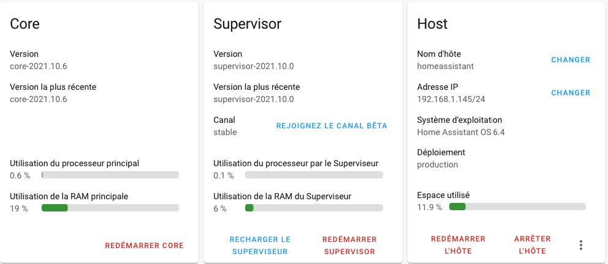

Dans les versions plus récentes de Home Assistant, on peut encore voir ces couches quand on se rend dans le menu Paramètres / À propos.

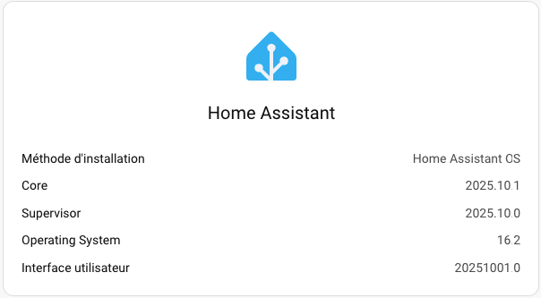

## Pour plus d'information

« Develppers - Architecture ». Home Assistant. <https://developers.home-assistant.io/docs/architecture_index>

## 59.2 Configurer l'accès au réseau dans Home Assistant {#fiche-configurer_l_acces_au_reseau_dans_home_assistant}

Pour utiliser votre système domotique Home Assistant installé sur un Raspberry Pi, la méthode de connexion au réseau privilégiée est une connexion câblée puisqu'elle est plus stable qu'une connexion sans fil.

Lorsque vous branchez le Pi au réseau câblé, aucune configuration particulière n'est requise, sauf si vous désirez fournir une [adresse IP statique](https://apical.xyz/formations/pageunique/systeme_domotique_diy#ipstatique) ou encore si les configurations de votre réseau nécessitent que vous fournissiez l'[adresse d'un serveur DNS,dns](66_home_assistant_au_coeur_de_votre_systeme_domotique.md#fiche-installation_de_home_assistant_et_premier_acces).

Bien entendu, il est également possible d'utiliser un réseau sans fil.

Je vous explique ici comment réaliser ces configurations, que ce soit pour un réseau câblé ou pour un réseau sans fil, à l'aide de différentes approches :

* [Fichiers de configuration sur une clé USB](https://apical.xyz/formations/pageunique/systeme_domotique_diy#usb)
* [Fichiers de configuration directement dans le terminal HassOS](https://apical.xyz/formations/pageunique/systeme_domotique_diy#hassos)
* [Commandes au terminal HassOS](https://apical.xyz/formations/pageunique/systeme_domotique_diy#terminal)
* [Interface Web](https://apical.xyz/formations/pageunique/systeme_domotique_diy#web)

## Fichiers de configuration sur une clé USB {#sansfilusb}


Les configurations réseau de Home Assistant peuvent être réalisées à l'aide de fichiers placés sur une clé USB qui répond à des règles précises :

* La clé doit être vierge et être formatée en FAT32 :
  + Sous Windows, l'utilitaire par défaut ne fait pas bien le travail. Vous devez utiliser un autre utilitaire, par exemple MiniTool (voir <https://www.minitool.com/partition-disk/fat32-not-an-option.html>).
  + Sous Mac, il n'y pas cette limite de taille. Choisissez MS-DOS (FAT) dans l'utilitaire de disque.
* La clé doit posséder un volume nommé CONFIG (en majuscules).
* Important : les fichiers de configuration doivent comporter des [sauts de ligne correctement encodés pour Linux (LF)](04_linux.md#fiche-encodage_des_fins_de_lignes_crlf_vs_lf).

Les informations de connexion de votre réseau doivent être inscrites dans un fichier de configuration nommé my-network (aucune extension) placé dans un dossier nommé network sur la clé USB.

Dans le fichier de configuration, le id doit être identique au nom du fichier (ex : my-network).

Vous devez générer un identificateur unique (Universally Unique IDentifier, UUID) en version 4 à l'aide de ce lien : <https://www.uuidgenerator.net/>. Ce UUID sera copié dans le fichier de configuration du réseau.

Notez que le Raspberry Pi 3 ne supporte que le Wi-Fi 2.4 GHz alors que le Raspberry Pi 4 supporte également le 5 GHz. Tenez-en compte dans vos configurations!

Fichier network/my-network


```
[connection]
id=my-network
uuid=votre-uuid-ici
type=802-11-wireless
[802-11-wireless]
mode=infrastructure
ssid=NOM-DU-RESEAU
# Uncomment below if your SSID is not broadcasted
#hidden=true
[802-11-wireless-security]
auth-alg=open
key-mgmt=wpa-psk
psk=MOT-DE-PASSE-DU-RESEAU
[ipv4]
method=auto
[ipv6]
addr-gen-mode=stable-privacy
method=auto
```


Dans le cas où le réseau sans fil n'a pas de mot de passe, il sera configuré comme suit :

Fichier network/my-network


```
[connection]
id=my-network
uuid=votre-uuid-ici
type=802-11-wireless
[802-11-wireless]
mode=infrastructure
ssid=NOM-DU-RESEAU
# Uncomment below if your SSID is not broadcasted
#hidden=true
[802-11-wireless-security]
auth-alg=open
key-mgmt=NONE
[ipv4]
method=auto
[ipv6]
addr-gen-mode=stable-privacy
method=auto
```


### Configurations pour le réseau câblé

Dans le fichier my-network, c'est la configuration type qui permet de spécifier si la configuration s'applique pour un réseau wi-fi ou pour un réseau câblé.

Entrez type=802-11-wireless pour un réseau wi-fi ou type=802-3-ethernet pour un réseau câblé.

Notez que les sections [802-11-wireless] et [802-11-wireless-security] ne doivent pas faire partie d'un fichier qui configure un réseau câblé.

Fichier network/my-network


```
[connection]
id=my-network
uuid=votre-uuid-ici
type=802-3-ethernet
...
```


### Adresse IP statique {#ipstatique}

L'adresse IP statique permet un fonctionnement optimal du système domotique.

Dans le fichier my-network, remplacez la section [ipv4] par celle présentée plus bas.

Dans cette section, remplacez 192.168.1.145 par l'adresse que vous désirez donner au Pi. Assurez-vous de choisir une adresse qui n'est pas déjà asssignée dans votre réseau.

Au besoin, ajustez le masque de sous-réseau, qui suit sur la même ligne (dans l'exemple : /24 qui signifie que les 3 premiers octets sont le masque de sous-réseau).

Selon les configurations de votre réseau, vous pourriez avoir à ajuster l'adresse IP locale du routeur. Avec un masque de sous-réseau 24, on entre les 3 premiers nombres de l'adresse IP, suivi généralement par le chiffre 1 (dans l'exemple : 192.168.1.1).

Fichier network/my-network


```
...
[ipv4]
method=manual
address=192.168.1.145/24;192.168.1.1
dns=xxx.xxx.xxx.xxx;8.8.8.8;8.8.4.4;
```


### Serveur DNS

Les serveurs DNS permettent de traduire un nom de domaine vers l'adresse IP qui lui correspond.

On utilise généralement les serveurs DNS de Google (8.8.8.8 et 8.8.4.4) ainsi que ceux utilisés par votre ordinateur. Les adresses doivent être séparées par des points-virgules.

Pour connaître les serveurs DNS utilisés par votre ordinateur, [suivez ce lien,dns](05_raspberry_pi.md#fiche-donner_une_adresse_ip_statique_au_raspberry_pi).

La configuration du DNS sur Home Assistant peut être effectuée comme suit, où la série de x sera remplacée par l'adresse IP du serveur DNS.

Fichier network/my-network


```
...
[ipv4]
method=auto
dns=xxx.xxx.xxx.xxx;8.8.8.8;8.8.4.4;
```


### Travailler avec plusieurs configurations réseau {#plusieursconfigurations}

Si, pour une raison ou pour une autre, vous avez besoin d'accéder à différents réseaux, vous pouvez avoir autant de fichiers de configuration que désiré, par exemple my-network-maison, my-network-ecole, tous dans le dossier network.

Chaque configuration devra avoir son propre UUID.

La configuration id de chaque fichier doit correspondre au nom du fichier.

Remarquez que si vous avez configuré une adresse IP statique dans un fichier de configuration, ceci n'aura aucun impact sur les autres fichiers de configuration.

### Redémarrage

Un redémarrage du Raspberry Pi est nécessaire pour que les fichiers de configuration soient pris en compte.

Attention : on parle ici d'un démarrage complet du Raspberry Pi (dans le [terminal HassOS,terminal](66_home_assistant_au_coeur_de_votre_systeme_domotique.md#fiche-la_console_home_assistant), entrer la commande reboot).

La clé USB pourra être retirée après le redémarrage du Pi puisque le système se charge de copier les fichiers de configuration dans le dossier /etc/NetworkManager/system-connections.

## Fichiers de configuration directement dans le terminal HassOS

Une fois qu'ils ont été copiés sur le Pi après un redémarrage, les fichiers de configuration réseau peuvent être édités à partir du [terminal HassOS,terminal](66_home_assistant_au_coeur_de_votre_systeme_domotique.md#fiche-la_console_home_assistant).

Vous pouvez afficher leur contenu à l'aide de la commande cat et les éditer à l'aide de l'éditeur vi, un proche parent de l'[éditeur vim](04_linux.md#fiche-Editeur_vim).

Pour éditer un fichier avec vi :

Terminal


```
vi /etc/NetworkManager/system-connections/nom-du-fichier
```


À son ouverture, vi vous place en mode commande. Pour passer d'un mode à l'autre :

* en mode commande : la lettre i vous place en mode insertion, ce qui permet d'éditer le texte
* en mode insertion : Échap vous place en mode commande

Pour enregistrer le document puis fermer l'éditeur : Échap suivi de : w q (ce qui signifie Write and Quit).

Pour fermer l'éditeur sans enregistrer : Échap suivi de : q !.

Un redémarrage du Pi est nécessaire pour que les modifications soient prises en compte.

Notez que le fait de supprimer un fichier de configuration de ce dossier fait en sorte que lors du redémarrage du système, il ne sera plus pris en compte à moins qu'il se trouve à nouveau sur une clé USB branchée au Pi.

## Commandes au terminal HassOS

Les configurations réseau peuvent être effectuées dans le [terminal HassOS,terminal](66_home_assistant_au_coeur_de_votre_systeme_domotique.md#fiche-la_console_home_assistant).

D'abord, pour connaître la liste des réseaux sans fil disponibles, entrez la commande nmcli device wifi.

Résultat à l'écran


```
# nmcli device wifi
IN-USE BSSID SSID MODE CHAN RATE SIGNAL BARS SECURITY
00:0C:E6:88:F6:23 RESEAUPUBLIC Infra 6 195 Mbit/s 70 \*\*\* --
00:0C:E6:88:F3:E2 MONRESEAU Infra 1 195 Mbit/s 39 \*\* WPA2 802.1X
00:0C:E6:88:F3:E1 AUTRERESEAU Infra 11 195 Mbit/s 35 \*\* WPA2 802.1X
```


Si le réseau désiré n'apparaît pas, vous pouvez demander une relecture des réseaux à l'aide de nmcli device wifi rescan.

Ceci n'affichera rien à l'écran mais un nouvel appel à nmcli device wifi affichera la liste rafraîchie.

Notez que si vous désirez effectuer des tests en vous branchant sur le partage de connexion de votre cellulaire, vous devez ouvrir l'écran de partage de connexion de votre cellulaire avant de demander la relecture.

Résultat à l'écran


```
# nmcli device wifi rescan
# nmcli device wifi
IN-USE BSSID SSID MODE CHAN RATE SIGNAL BARS SECURITY
AA:A7:F2:3E:0D:31 iPhoneDeChristiane Infra 6 130 Mbit/s 97 \*\*\*\* WPA2
00:0C:E6:88:F6:23 RESEAUPUBLIC Infra 6 195 Mbit/s 70 \*\*\* --
00:0C:E6:88:F3:E2 MONRESEAU Infra 1 195 Mbit/s 39 \*\* WPA2 802.1X
00:0C:E6:88:F3:E1 AUTRERESEAU Infra 11 195 Mbit/s 35 \*\* WPA2 802.1X
```


Pour vous brancher à un réseau, utilisez la commande nmcli device wifi connect. Le nom du réseau à utiliser est celui affiché dans la colonne SSID de la commande nmcli device wifi.

Terminal


```
nmcli device wifi connect "iPhoneDeChristiane" password "mot-de-passe-en-clair"
```


Ceci créera un fichier dans le dossier /etc/NetworkManager/system-connections dont le nom correspond au nom du réseau avec l'extension .nmconnection.

Pour vérifier à quel réseau vous êtes branché :

Terminal


```
nmcli con show
```


Le réseau auquel vous êtes branché n'aura pas de traits d'union dans la colonne DEVICE.

Résultat à l'écran


```
NAME UUID TYPE DEVICE
my-network votre-uuid-ici wifi wlan0
Wired connection 1 autre-uuid-ici ethernet --
```


La connexion ainsi créée est permanente, c'est-à-dire qu'elle sera encore effective lors du prochain redémarrage à moins qu'une clé USB soit branchée au Raspberry Pi pour spécifier les connexions réseau à utiliser.

Il est possible de supprimer le fichier de connexion afin que la connexion n'ait plus lieu.

Si la connexion désirée apparaît dans la liste mais n'est pas active (rien dans la colonne DEVICE), il est possible de l'activer comme suit :

Terminal


```
nmcli con up my-network
```


Pour connaître l'adresse IP ainsi obtenue :

Terminal


```
nmcli con show my-network | grep address
```


Il est également possible de voir l'adresse en faisant réafficher la page d'accueil de la console Home Assistant.

Terminal HassOS


```
ha banner
```


Résultat à l'écran


```
# ha banner
▄██▄ \_ \_
▄██████▄ | | | | \_\_\_ \_ \_\_ \_\_\_ \_\_\_
▄████▀▀████▄ | |\_| |/ \_ \| '\_ ` \_ \ / \_ \
▄█████ █████▄ | \_ | (\_) | | | | | | \_\_/
▄██████▄ ▄██████▄ |\_| |\_|\\_\_\_/|\_| |\_| |\_|\\_\_\_| \_
████████ ██▀ ▀██ / \ \_\_\_ \_\_\_(\_)\_\_\_| |\_ \_\_ \_ \_ \_\_ | |\_
███▀▀███ ██ ▄██ / \_ \ / \_\_/ \_\_| / \_\_| \_\_/ \_` | '\_ \| \_\_|
██ ██ ▀ ▄█████ / \_\_\_ \\\_\_ \\_\_ \ \\_\_ \ || (\_| | | | | |\_
███▄▄ ▀█ ▄███████ /\_/ \\_\\_\_\_/\_\_\_/\_|\_\_\_/\\_\_\\_\_,\_|\_| |\_|\\_\_|
▀█████▄ ███████▀
Welcome on Home Assistant command line interface.
Home Assistant Supervisor is running!
System information:
IPv4 Adresses for wlan0: 192.168.1.145/24
IPV6 Adresses for wlan0: fe80:fde8:195c:eb0b:c18a/64
IPv4 Adresses for end0: 192.168.1.140/24
IPV6 Adresses for end0: fe80:a310:ae68:cd47:50d4/64
OS Version: Home Assistant OS 16.2
Home Assistant Core: 2025.10.1
Home Assistant URL: http://homeassistant.local:8123
Observer URL: http://homeassistant.local:4357
System is ready! Use browser or app to configure.
#
```


## Interface Web

Si vous optez pour la configuration Web, vous devrez d'abord brancher le Pi à un réseau câblé puisque c'est le seul qui peut être actif sans configuration.

Si vous aviez entré les configurations réseau [à l'aide d'une clé USB](https://apical.xyz/formations/pageunique/systeme_domotique_diy#usb), il est également possible d'utiliser la configuration Web pour les ajuster après coup.

* [Accédez à l'interface Web de Home Assistant,acceder](66_home_assistant_au_coeur_de_votre_systeme_domotique.md#fiche-installation_de_home_assistant_et_premier_acces).
* Rendez-vous dans le menu Paramètres / Système / Réseau.

  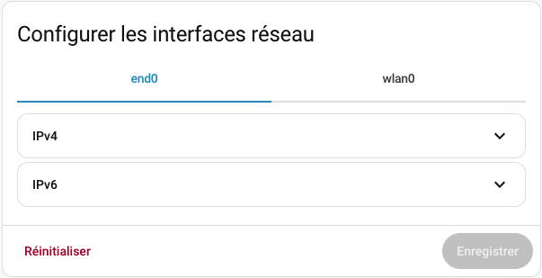
* Vous pouvez configurer le réseau sans fil à l'aide de l'onglet wlan0 et le réseau câblé à l'aide de l'onglet end0.
* Pour vous connecter à un réseau Wi-Fi, cliquez sur wlan0 puis ouvrez la section Wi-Fi pour sélectionner le réseau à utiliser.
* La section IPv4 permet de définir le type d'adresse IP. Cochez Automatique pour laisser le routeur fournir une adresse IP ou Statique pour choisir vous-même l'adresse IP désirée.

  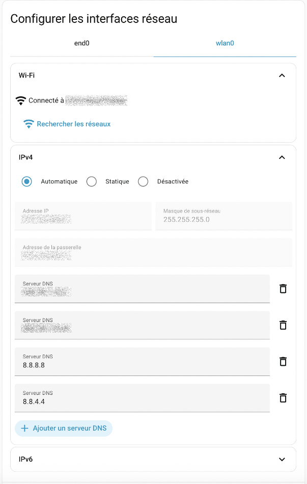
* Notez que si vous désirez effectuer des tests en vous branchant sur le partage de connexion de votre cellulaire, vous devez ouvrir l'écran de partage de connexion de votre cellulaire avant de cliquer sur Rechercher les réseaux.

  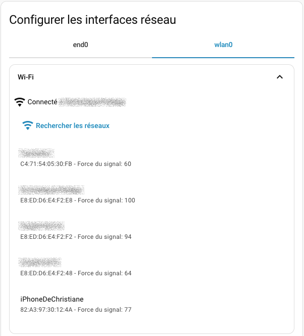
* Si vous avez utilisé l'interface Web pour éditer une nouvelle connexion, ceci créera le fichier /etc/NetworkManager/system-connections/Supervisor wlan0.nmconnection.

## 59.3 Adresse IP statique pour Home Assistant {#fiche-adresse_ip_statique_pour_home_assistant}

Afin d'obtenir plus de stabilité, il est recommandé de donner une adresse IP statique au Raspberry Pi sur lequel roule Home Assistant.

Ceci peut être réalisé de deux façons :

* [À l'aide d'un fichier de configuration placé sur une clé USB](https://apical.xyz/formations/pageunique/systeme_domotique_diy#usb)
* [En éditant les fichiers de configuration directement dans le terminal HassOS](https://apical.xyz/formations/pageunique/systeme_domotique_diy#hassos)
* [À l'aide de l'interface graphique de Home Assistant](https://apical.xyz/formations/pageunique/systeme_domotique_diy#graphique)

## Fichier de configuration sur clé USB {#usb}

Le fichier de configuration doit être placé sur une clé USB qui répond à des règles précises :

* La clé doit être vierge et être formatée en FAT32 :
  + Sous Windows, l'utilitaire par défaut ne fait pas bien le travail. Vous devez utiliser un autre utilitaire, par exemple MiniTool (voir <https://www.minitool.com/partition-disk/fat32-not-an-option.html>).
  + Sous Mac, il n'y pas cette limite de taille. Choisissez MS-DOS (FAT) dans l'utilitaire de disque.
* La clé doit posséder un volume nommé CONFIG (en majuscules).
* Les fichiers de configuration doivent comporter des [sauts de ligne correctement encodés pour Linux (LF)](04_linux.md#fiche-encodage_des_fins_de_lignes_crlf_vs_lf).

Les configurations disponibles [sont détaillées sur cette fiche,sansfilusb](67_chapitre_de_reference_pour_home_assistant.md#fiche-configurer_l_acces_au_reseau_dans_home_assistant).

Voici un exemple qui permet de configurer l'adresse IP statique.

La première partie de la ligne address correspond à l'adresse IP statique suivie du masque de sous-réseau.

Après le point-virgule, on retrouve l'adresse IP locale du routeur.

Fichier network/my-network


```
[connection]
id=my-network
uuid=votre-uuid-ici
type=802-11-wireless
[802-11-wireless]
mode=infrastructure
ssid=NOM-DU-RESEAU
# Uncomment below if your SSID is not broadcasted
#hidden=true
[802-11-wireless-security]
auth-alg=open
key-mgmt=wpa-psk
psk=MOT-DE-PASSE-DU-RESEAU
[ipv4]
method=manual
address=192.168.1.145/24;192.168.1.1
dns=xxx.xxx.xxx.xxx;8.8.8.8;8.8.4.4;
```


Pour un réseau câblé :

Fichier network/my-network-cable


```
[connection]
id=my-network-cable
uuid=efb525c5-17ea-4e3d-b33c-9d79675d216f
type=ethernet
[ipv4]
method=manual
address1=192.168.1.145/24;192.168.1.1
dns=xxx.xxx.xxx.xxx;8.8.8.8;8.8.4.4
```


## Terminal HassOS {#terminalhassos}

Une fois qu'ils ont été copiés sur le Pi après un redémarrage, les fichiers de configuration réseau, qui permettent également de spécifier une adresse iP statique, peuvent être édités directement à partir du [terminal HassOS,terminal](66_home_assistant_au_coeur_de_votre_systeme_domotique.md#fiche-la_console_home_assistant).

Vous pouvez afficher leur contenu à l'aide de la commande cat et les éditer à l'aide de l'éditeur vi, un proche parent de l'[éditeur vim](04_linux.md#fiche-Editeur_vim).

Pour éditer un fichier avec vi :

Terminal


```
vi /etc/NetworkManager/system-connections/nom-du-fichier
```


À son ouverture, vi vous place en mode commande. Pour passer d'un mode à l'autre :

* en mode commande : la lettre i vous place en mode insertion, ce qui permet d'éditer le texte
* en mode insertion : Échap vous place en mode commande

Pour enregistrer le document puis fermer l'éditeur : Échap suivi de : w q (ce qui signifie Write and Quit).

Pour fermer l'éditeur sans enregistrer : Échap suivi de : q !.

Un redémarrage du Pi est nécessaire pour que les modifications soient prises en compte.

Notez que le fait de supprimer un fichier de configuration de ce dossier fait en sorte que lors du redémarrage du système, il ne sera plus pris en compte à moins qu'il se trouve à nouveau sur une clé USB branchée au Pi.

## Interface graphique de Home Assistant

Il est possible de configurer l'adresse IP directement à partir de l'interface graphique de Home Assistant. Évidemment, l'adresse utilisée initialement aura été fournie par DHCP.

* [Accédez à l'interface Web de Home Assistant,acceder](66_home_assistant_au_coeur_de_votre_systeme_domotique.md#fiche-installation_de_home_assistant_et_premier_acces).
* Rendez-vous dans le menu Paramètres / Système / Réseau.

  
* Vous pouvez configuer le réseau sans fil à l'aide de l'onglet WLAN0 et le réseau câblé à l'aide de l'onglet ETH0.
* Cliquez sur WLAN0 ou sur ETH0 puis ouvrez la section IPv4. Vous devez cocher Statique pour entrer l'adresse IP désirée. Attention : une fois que vous cliquerez sur Enregistrer, l'interface semblera avoir de la difficulté à enregistrer. En fait, c'est qu'une fois l'adresse IP changée, l'adresse IP utilisée actuellement pour accéder à l'interface Web de Home Assistant ne sera plus bonne. l'enregistrement. Il vous faudra entrer la nouvelle adresse IP pour poursuivre.

  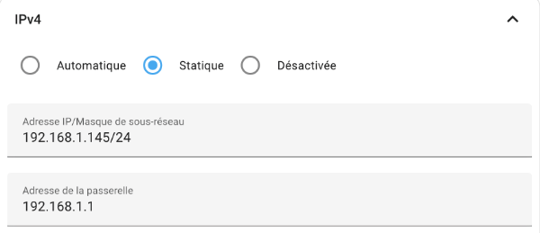

## 59.4 Se brancher à Home Assistant via SSH {#fiche-se_brancher_a_home_assistant_via_ssh}

Je vous présente ici la technique pour se brancher à Home Assistant via SSH afin d'avoir accès à un maximum de fonctionnalités.

Notez qu'il est possible de configurer l'accès SSH <a href="fiche-module_complementaire_terminal_ssh_pour_home_assistant.md#module_complementaire_terminal_ssh_pour_home_assistant">à l'aide du module complémentaire Terminal et SSH</a>. Cependant, ceci ne donne pas tous les accès dont un développeur pourrait avoir besoin. Entre autres, ce module ne permet pas de gérer les configurations réseau à l'aide de la commande nmcli ni de copier des fichiers entre l'ordinateur et le Raspberry Pi à l'aide de scp.

Voici donc comment accéder à un vrai terminal via SSH.

## Activation SSH

Lors de l'installation de Home Assistant, vous avez peut-être déjà créé le fichier authorized\_keys installé sur une clé USB.

Si vous ne l'avez pas fait, effectuez la [procédure de création du fichier authorized\_keys sur la clé USB,ssh](66_home_assistant_au_coeur_de_votre_systeme_domotique.md#fiche-installation_de_home_assistant_et_premier_acces), insérer la clé USB dans le Pi puis redémarrez Home Assistant.

Ceci aura pour effet de :

* Copier le fichier authorized\_keys dans le dossier /root/.ssh.
* Donner les droits de lecture et d'écriture à l'usager propriétaire de ce fichier (comme si vous aviez fait chmod 600 authorized\_keys).
* Activer le serveur SSH (comme si vous aviez fait systemctl start dropbear).

Une fois le redémarrage complété, la clé USB peut être retirée et elle ne sera plus nécessaire.

## Pourquoi faut-il copier seulement la clé publique sur le Pi?

Pour répondre à cette question, consultez cette fiche : « [comment\_fonctionne\_l\_authentification\_via\_ssh](05_raspberry_pi.md#fiche-comment_fonctionne_l_authentification_via_ssh) ».

## Connexion au Pi

Sous Linux et Mac, vous avez accès à un client SSH directement dans une fenêtre Terminal.

Sous Windows, vous pouvez travailler avec un client SSH disponible à partir d'une fenêtre PowerShell ou d'une console Git Bash.

Je ne vous recommande pas l'utilitaire Putty puisqu'il travaille avec son propre format de clés SSH, non compatible avec le format généré par le traditionnel ssh-keygen.

Le client SSH vous permet de vous connecter au Pi à l'aide d'une commande entrée dans une fenêtre Terminal de votre ordinateur (vous devez remplacer 192.168.1.145 par l'adresse IP de votre Pi). Il faut utiliser le port 22222.

Terminal (sur l'ordinateur)


```
ssh root@192.168.1.145 -p 22222
```


Vous n'avez pas de mot de passe à entrer puisque vous utiliser le système de clés SSH.

Vous avez désormais accès au [terminal HassOS](66_home_assistant_au_coeur_de_votre_systeme_domotique.md#fiche-la_console_home_assistant).

Résultat à l'écran


```
monnom@MacBook-Pro-de-MonNom ~ %ssh root@192.168.1.145 -p 22222
Welcome to Home Assistant OS.
Use `ha` to access the Home Assistant CLI.
#
```


## Alternative pour les systèmes Windows

Parfois, sous Windows, la copie de la clé SSH publique ne fonctionne pas correctement. Ceci est souvent dû à une erreur de manipulation car les étapes sont très pointilleuses.

Si vous n'y êtes pas arrivés, je vous propose une façon détournée pour copier cette clé publique. Vous aurez besoin de brancher un clavier et un écran au Raspberry Pi pour effectuer ces manipulations.

* Sur Home Assistant, installez le [module complémentaire File Editor](77_le_fichier_configurationyaml.md#fiche-travailler_avec_le_module_complementaire_file_editor).
* À l'aide de ce module complémentaire, créez un nouveau fichier nommé authorized\_keys. Il sera placé [dans le dossier config](66_home_assistant_au_coeur_de_votre_systeme_domotique.md#fiche-dossier_config), c'est-à-dire /mnt/data/supervisor/homeassistant.
* Sur votre système Windows, à l'aide d'une fenêtre PowerShell, affichez la valeur de votre clé publique SSH.

  PowerShell

  
```
  cat C:\Users\MonNom\.ssh\id\_ed25519.pub
```
* Dans File Editor, éditez votre nouveau fichier authorized\_keys et collez-y la valeur de la clé publique. Elle devrait commencer par ssh-ed25519 et se terminer par le courriel utilisé dans la commande ssh-keygen.
* Puisque File Editor n'a pas accès aux dossiers situés en dehors de la racine du site Web, vous devrez déplacer le fichier à l'aide du clavier branché au Raspberry Pi.

  Terminal HassOS

```
  cp /mnt/data/supervisor/homeassistant/authorized\_keys /root/.ssh
```
* Vous devriez maintenant avoir accès à votre Pi via SSH.

  PowerShell

```
  ssh root@192.168.1.145 -p 22222
```

## Pour plus d'information

« Debugging the Home Assistant Operating System ». Home Assistant. <https://developers.home-assistant.io/docs/operating-system/debugging/>

## 59.5 Ajuster la date et l'heure de Home Assistant {#fiche-ajuster_la_date_et_l_heure_de_home_assistant}

Je vous présente ici comment gérer l'heure et le fuseau horaire du Raspberry Pi avec le système d'exploitation HassOS utilisé par Home Assistant.

Dans cette fiche :

* [Retrouver la date, l'heure et le fuseau horaire au terminal](https://apical.xyz/formations/pageunique/systeme_domotique_diy#infosterminal)
* [Retrouver les informations dans l'interface graphique](https://apical.xyz/formations/pageunique/systeme_domotique_diy#infosgraphique)
  + [Fuseau horaire](https://apical.xyz/formations/pageunique/systeme_domotique_diy#fuseaugraphique)
  + [Date et heure](https://apical.xyz/formations/pageunique/systeme_domotique_diy#dategraphique)
* [Si la date ou l'heure sont erronés](https://apical.xyz/formations/pageunique/systeme_domotique_diy#errone)
* [Ajustements au terminal](https://apical.xyz/formations/pageunique/systeme_domotique_diy#ajustementsterminal)
  + [Fuseau horaire](https://apical.xyz/formations/pageunique/systeme_domotique_diy#fuseau)
  + [Date et l'heure](https://apical.xyz/formations/pageunique/systeme_domotique_diy#date)

## Retrouver la date, l'heure et le fuseau horaire au terminal {#infosterminal}

Pour connaître la date du système, [ouvrez le terminal HassOS,terminal](66_home_assistant_au_coeur_de_votre_systeme_domotique.md#fiche-la_console_home_assistant) puis entrez la commande date.

Résultat à l'écran

```
# date
Wed Oct 8 11:51:14 EDT 2025
```


Cette commande montre également le fuseau horaire. Ici, EDT signifie Eastern Daylight Time, soit l'heure d'été (heure avancée) de la côte Est nord-américaine.

Voici un autre essai, plus tard dans l'année.

Résultat à l'écran


```
# date
Tue Dec 9 08:41:21 EST 2025
```


Ici, le fuseau horaire est EST, c'est-à-dire Eastern Standard Time, l'heure normale de l'est.

## Retrouver les informations dans l'interface graphique {#infosgraphique}

L'interface graphique de Home Assistant permet de retrouver les informations sur le fuseau horaire, la date et l'heure.

### Fuseau horaire {#fuseaugraphique}

Pour connaître - et possiblement modifier - le fuseau horaire via l'interface graphique, rendez-vous dans le menu Paramètres / Système / Général.

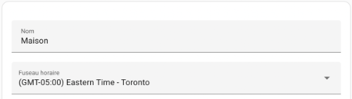

### Date et l'heure {#dategraphique}

La date et l'heure peuvent également être affichés dans l'interface Web de Home Assistant à l'aide d'une [configuration time\_date](93_automatisations_qui_tiennent_compte_de_lheure.md#fiche-afficher_la_date_et_l_heure_dans_le_tableau_de_bord).

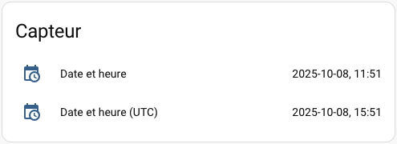

## Si la date ou l'heure sont erronés {#errone}

Avec une installation sur un Raspberry Pi, c'est un système de synchronisation avec un service NTP (protocole de diffusion du temps en réseau ou, en anglais, Network Time Protocol) qui assure que la date et l'heure du système correspondent à la réalité.

Ceci est nécessaire puisque à la base, le Raspberry Pi ne contient pas d'horloge en temps réel (RTC ou, en anglais, Real Time Clock).

Une horloge mal synchronisée peut poser toutes sortes de problèmes dans Home Assistant. Dans le pire des cas, c'est l'installation elle-même qui ne fonctionnera pas puisque le certificat SSL pour télécharger Home Assistant sera considéré invalide (erreur « Can't fetch Whoami data: Cannot connect to host whoami.home-assistant.io:443 ssl:True [SSLCertVerificationError: (1, '[SSL: CERTIFICATE\_VERIFY\_FAILED] certificate verify failed: certificate is not yet valid (\_ssl.c:1129)')] » dans le log lors de l'installation).

Il faut donc faire le nécessaire pour synchroniser l'horloge correctement.

## Ajustements au terminal {#ajustementsterminal}

Puisque le système d'exploitation de Home Assistant n'est pas un Linux « régulier », les méthodes traditionnelles pour ajuster la date et l'heure ne fonctionnent pas toutes.

### Fuseau horaire

Avant de tenter d'ajuster l'heure, il faut configurer le fuseau horaire du système d'exploitation.

Remarquez que si le fuseau horaire du système d'exploitation n'est pas le même que celui configuré dans Home Assistant, vous pourriez obtenir des résultats inconsistants dans Home Assistant.

La seule technique que j'ai trouvée pour configurer le fuseau horaire manuellement sous HassOS consiste à travailler avec la variable d'environnement TZ.

Attention : cette technique a une portée réduite. La commande date donnera le bon fuseau horaire mais avec timedatectl, le fuseau horaire demeurera inchangé.

Terminal HassOS


```
export TZ=America/Toronto
```


Notez que cette modification ne sera pas permanente sauf si vous entrez cette commande dans le fichier ~/.bashrc ou, plus globalement, dans le fichier /etc/environment.

### Date et l'heure

Pour modifier la date et l'heure sous HassOS, la commande qui fonctionne est [date](https://man7.org/linux/man-pages/man1/date.1.html).

Terminal HassOS


```
date -s "2025-10-08 08:50:00"
```


Notez que si vous tentez d'ajuster l'heure à l'aide de la commande timedatectl, vous obtiendrez le message « Failed to set time: Automatic time synchronization is enabled ».

Résultat à l'écran


```
# timedatectl set-time '2022-10-17 11:51:00'
Failed to set time: Automatic time synchronization is enabled
```


## 59.6 Obtenir la version de Home Assistant installée sur mon Raspberry Pi {#fiche-obtenir_la_version_de_home_assistant_installee_sur_mon_raspberry_pi}

Si vous avez besoin de connaître la version de Home Assistant ou de son système d'exploitation, deux options s'offrent à vous :

* [retrouver l'information à partir de l'interface graphique](https://apical.xyz/formations/pageunique/systeme_domotique_diy#graphique)
* [retrouver l'information à la ligne de commande](https://apical.xyz/formations/pageunique/systeme_domotique_diy#commande)

## Interface graphique

Dans l'interface graphique de Home Assistant, rendez-vous dans le menu Paramètres / À propos.

Cet écran affiche la version [de chaque couche logiciel de Home Assistant](67_chapitre_de_reference_pour_home_assistant.md#fiche-les_couches_logicielles_de_home_assistant).


## Ligne de commande

Dans le [terminal HassOS](66_home_assistant_au_coeur_de_votre_systeme_domotique.md#fiche-la_console_home_assistant), entrez cette commande :

Ligne de ccommande Home Assistant


```
ha info
```


La version [de chaque couche logiciel de Home Assistant](67_chapitre_de_reference_pour_home_assistant.md#fiche-les_couches_logicielles_de_home_assistant) apparaît à l'écran.

Résultat à l'écran


```
# ha info
arch: aarch64
channel: stable
docker: 28.3.3
features:
- reboot
- shutdown
- services
- network
- hostname
- timedate
- os\_agent
- haos
- resolved
- journal
- disk
- mount
hassos: "16.2"
homeassistant: 2023.10.1
hostname: homeassistant
logging: info
machine: raspberrypi4-64
operating\_system: Home Assistant OS 16.2
state: running
supervisor: 2025.10.0
supported: true
supported\_arch:
- aarch64
- armv7
- armhf
timezone: America/Toronto
```


## 59.7 Trouver l'adresse IP de Home Assistant {#fiche-trouver_l_adresse_ip_de_home_assistant}

Il n'est généralement pas nécessaire de connaître l'adresse IP du Raspberry Pi pour pouvoir accéder à l'interface graphique de Home Assistant.

En effet, à moins qu'il y ait plusieurs boîtes Home Assistant dans votre environnement, vous pouvez accéder à l'interface Web de Home Assistant à l'aide de l'URL http://homeassistant.local:8123 ou http://homeassistant:8123.

Par contre, l'adresse IP sera requise s'il y a plusieurs boîtes Home Assistant dans votre environnement ou encore si vous désirez vous brancher au Pi via SSH.

Pour connaître l'adresse IP du Raspberry Pi sur lequel Home Assistant est installé, vous disposez de quelques options :

* Brancher un écran au Raspberry Pi : l'adresse IP apparaîtra sur l'écran d'accueil
* Travailler avec la console Home Assistant ou le terminal HassOS.
* Vérifier sur le routeur les périphériques branchés au réseau.
* Sur un réseau privé, effectuer un [balayage du réseau avec Nmap](04_linux.md#fiche-nmap) (risque de problèmes légaux sur un réseau public).

## Travail à la console Home Assistant

Dès le démarrage de Home Assistant, si vous branchez un écran au Raspberry Pi, vous verrez l'adresse IP du Pi affichée à l'écran.

Il est également possible de voir l'adresse en faisant réafficher la page d'accueil de la console Home Assistant.Résultat à l'écran


```
Waiting for the Home Assistant CLI to be ready...
[LOGO]
Welcome on Home Assistant command line interface.
Home Assistant Supervisor is running!
System information:
IPv4 Adresses for wlan0: 192.168.1.145/24
IPV6 Adresses for wlan0: fe80:fde8:195c:eb0b:c18a/64
IPv4 Adresses for end0: 192.168.1.140/24
IPV6 Adresses for end0: fe80:a310:ae68:cd47:50d4/64
OS Version: Home Assistant OS 16.2
Home Assistant Core: landingpage
Home Assistant URL: http://homeassistant.local:8123
Observer URL: http://homeassistant.local:4357
System is ready! Use browser or app to configure.
ha >
```


Vous pouvez faire réafficher cette information en tout temps à l'aide de cette commande :

Console Home Assistant


```
banner
```


Résultat à l'écran


```
ha > banner
[LOGO]
]Welcome on Home Assistant command line interface.
Home Assistant Supervisor is running!
System information:
IPv4 Adresses for wlan0: 192.168.1.145/24
IPV6 Adresses for wlan0: fe80:fde8:195c:eb0b:c18a/64
IPv4 Adresses for end0: 192.168.1.140/24
IPV6 Adresses for end0: fe80:a310:ae68:cd47:50d4/64
OS Version: Home Assistant OS 16.2
Home Assistant Core: 2025.10.1
Home Assistant URL: http://homeassistant.local:8123
Observer URL: http://homeassistant.local:4357
System is ready! Use browser or app to configure.
ha >
```


## network info {#networkinfo}

L'invite de commande ha > vous indique que vous êtes dans la console Home Assistant.

Pour connaître les informations sur le réseau, notamment l'adresse IP du Raspberry Pi, lancez la commande :

Console Home Assistant


```
network info
```


Si vous êtes dans le terminal HassOS (invite #), vous devrez ajouter ha devant la commande.

Terminal HassOS


```
ha network info
```


Résultat à l'écran


```
ha > network info
docker:
address: 172.30.32.0/23
dns: 172.30.32.3
gateway: 172.30.32.1
interface: hassio
host\_internet: true
interfaces:
- connected: true
enabled: true
interface: wlan0
ipv4:
address:
- 192.168.1.145/24
gateway: 192.168.1.1
method: auto
nameservers:
- xxx.xxx.xxx.xxx
- 8.8.8.8
- 8.8.4.4
ready: true
...
```


Il est possible que plusieurs adresses IP apparaissent, par exemple une adresse pour le réseau câblé dans la section end0 et une adresse Wi-Fi dans la section wlan0.

## nmcli (NetworkManager Command Line Interface)

Vous pouvez obtenir encore plus d'informations sur le réseau à l'aide de la commande [nmcli](https://linux.die.net/man/1/nmcli).

D'abord, si vous êtes dans la console Home Assistant, accédez au terminal HassOS en entrant la commande login.

Pour voir les configurations de réseaux disponibles :

Terminal HassOS


```
nmcli con show
```


Vous devriez obtenir une liste de configurations, notamment my-network (si vous avez [configuré le réseau lors de l'installation de Home Assistant,sansfil](66_home_assistant_au_coeur_de_votre_systeme_domotique.md#fiche-installation_de_home_assistant_et_premier_acces)).

Résultat à l'écran


```
NAME UUID TYPE DEVICE
my-network votre-uuid-ici wifi wlan0
Wired connection 1 autre-uuid-ici ethernet --
```


ou, si aucun réseau n'a été configuré :

Résultat à l'écran


```
NAME UUID TYPE DEVICE
HassOS default votre-uuid-ici ethernet ---
```


 Pour voir les détails de la configuration my-network, par exemple :

Terminal HassOS


```
nmcli con show my-network
```


Appuyez sur la touche Entrée jusqu'à l'apparition de la ligne ipV4.addresses qui vous donnera la ou les adresses IP.

Résultat à l'écran


```
...
ipv4.method: manual
ipv4.dns: --
ipv4.dns-search: --
ipv4.dns-options: --
ipv4.dns-priority: 0
ipv4.addresses: 192.168.1.145/24
ipv4.gateway: 192.168.1.1
ipv4.routes: --
...
```


Il est également possible d'obtenir seulement les adresses IP comme suit :

Terminal HassOS


```
nmcli con show my-network | grep address
```


Résultat à l'écran


```
# nmcli con show my-network |grep address
802-11-wireless.mac-address: --
802-11-wireless.cloned-mac-address: --
802-11-wireless.generate-mac-address-mask: --
802-11-wireless.mac-address-blacklist: --
802-11-wireless.mac-address-randomization: default
ipv4.addresses: 192.168.1.145/24
ipv6.addresses: --
```


## Informations sur les serveurs DNS

Pour connaître la liste des serveurs DNS configurés sur le système, entrez cette commande :

Terminal HassOS


```
ha dns info
```


Résultat à l'écran


```
# ha dns info
fallback: true
host: 172.30.32.3
llmnr: true
locals:
- dns://xxx.xxx.xxx.xxx
- dns://8.8.4.4
- dns://8.8.8.8
mdns: true
servers: []
update\_available: false
version: 2025.08.0
version\_latest: 2025.08.0
```


## Retrouver l'adresse IP par programmation

Si vous ajoutez l'intégration [Adresse IP locale](https://www.home-assistant.io/integrations/local_ip) (local\_ip) à Home Assistant, vous pourrez retrouver l'adresse IP locale par programmation.

Une fois l'intégration installée, l'adresse IP de Home Assistant pourra être retrouvée à l'aide d'un [modèle](89_les_modeles_home_assistant.md#fiche-les_modeles_dans_home_assistant).

Ce modèle pourra être utilisé dans des automatisations, par exemple pour [l'envoyer par courriel](94_notification_par_courriel.md#fiche-configurer_home_assistant_pour_l_envoi_de_courriel) lors du [démarrage de Home Assistant,demarrage](83_les_automatisations_home_assistant.md#fiche-ajouter_une_automatisation_a_l_aide_de_l_interface_graphique).

Modèle Home Assistant


```
{{ states('sensor.local\_ip') }}
```


## Pour plus d'information

« How to configure and Manage Network Connections using nmcli ». The Geek Diary. <https://www.thegeekdiary.com/how-to-configure-and-manage-network-connections-using-nmcli/>

## 59.8 Les fichiers et dossiers de Home Assistant {#fiche-les_fichiers_et_dossiers_de_home_assistant}

Cette fiche est un document de référence dans lequel j'ai répertorié quelques fichiers et dossiers utiles dans Home Assistant.

N'hésitez pas à la consulter au besoin afin de mieux vous y retrouver!

| Fichier ou dossier | Rôle | Exemple de contenu |
| --- | --- | --- |
| /mnt/data/supervisor/homeassistant | Contient les fichiers .yaml.  C'est ce dossier qui est souvent référé comme config dans la documentation.  Ainsi, si on vous demande de placer un fichier dans le dossier config/www, il faut plutôt le placer dans le dossier /mnt/data/supervisor/homeassistant/www. |  |
| /etc/NetworkManager/system-connections | Contient les connexions réseau (les fichiers du dossier network de la clé USB y ont été copiés). |  |
| /mnt/data/supervisor/homeassistant/home-assistant.log | Fichier journal principal de Home Assistant. |  |
| /mnt/data/supervisor/backup | Contient les sauvegardes Home Assistant. Pour chaque sauvegarde, le nom du fichier est en fait un slug sous forme de nombre alphanumérique, par exemple 6a4451b2.tar. |  |
| /root/.ssh/authorized\_keys | Contient les clés SSH publiques (notamment celle qui était dans le  fichier authorized\_keys de la clé USB). |  |
| /mnt/data/supervisor/homeassistant/.storage | Contient les configurations faites par l'interface graphique. |  |
| /mnt/data/supervisor/homeassistant/.storage/core.device\_registry | Contient les informations sur les appareils (les objets connectés) ajoutés à Home Assistant. |  |
| /mnt/data/supervisor/homeassistant/.storage/core.entity\_registry | Contient les informations sur les entités créées dans Home Assistant. Les virtuels y figureront, qu'ils aient été créés à l'aide de l'interface graphique ou directement dans configuration.yaml. |  |
| /mnt/data/supervisor/homeassistant/www | Les fichiers placés dans ce dossier sont accessibles sur le Web à partir d'une adresse du genre http://192.168.1.145:8123/local/monimage.png dans le navigateur ou /local/monimage.png dans les automatisations et dans le tableau de bord.  Notez que le dossier www n'est pas présent lors de l'installation initiale. Il faut le créer et redémarrer le système. |  |

## 59.9 Qu'est-ce qu'une entité? {#fiche-qu_est-ce_qu_une_entite}

Quand vous travaillez avec Home Assistant, le terme entité est partout. Il importe donc de bien comprendre ce terme.

Une entité (en anglais : entity) représente un capteur, un récepteur, un service, une zone, une automatisation, etc.

Chaque entité peut apparaître dans le tableau de bord, être utilisée dans une automatisation, historiser des données, etc.

Souvent, pour un seul objet connecté (on l'appelle appareil dans Home Assistant), il y aura plusieurs entités. Par exemple, un capteur 5-en-1 aura une entité pour chacun de ses capteurs et probablement d'autres entités, par exemple un détecteur du niveau de la pile ou même un détecteur pour la version du micrologiciel de l'objet connecté.

Les informations sur les entités sont enregistrées dans le fichier /mnt/data/supervisor/homeassistant/.storage/core.device\_registry.

## Identifiant d'entité {#identifiant}

Un peu partout dans Home Assistant, notamment dans les automatisation, vous travaillerez avec des identifiants d'entités (entity ID).

Cet identifiant est composé de deux morceaux :

* Le domaine : chaîne qui représente de quel type d'entité il s'agit, par exemple sensor, zone, sun, person, input\_number, device\_tracker
* L'identifiant de l'objet : chaîne qui représente l'objet de façon unique pour un domaine donné

L'identifiant de l'entité apparaît donc sous la forme domaine.identifiant\_objet.

On peut voir l'identifiant à partir de l'onglet Aperçu, clic sur l'entité désirée / icône Paramètres (engrenage).

L'identifiant de l'entité est affiché dans la case ID d'entité.

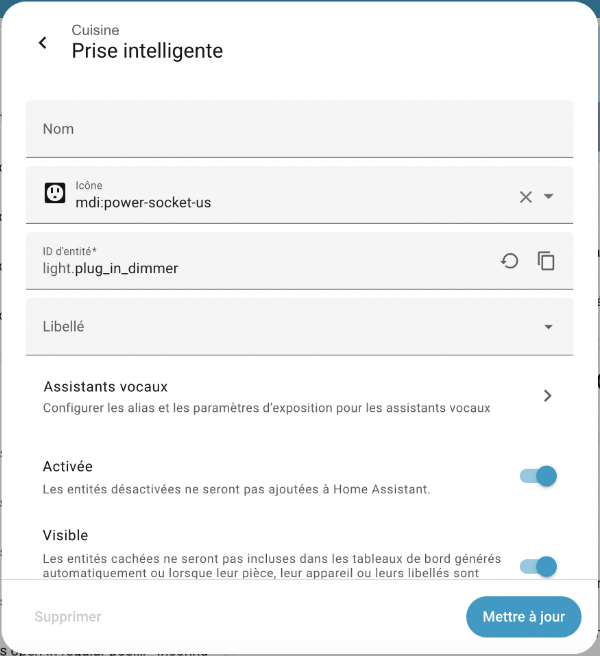

## 59.10 Réinitialiser le mot de passe de Home Assistant (et le code d'usager si désiré) {#fiche-reinitialiser_le_mot_de_passe_de_home_assistant_et_le_code_d_usager_si_d___}

Lorsque vous accédez à l'interface Web de Home Assistant, vous devez entrer un code d'usager et un mot de passe avant de poursuivre.

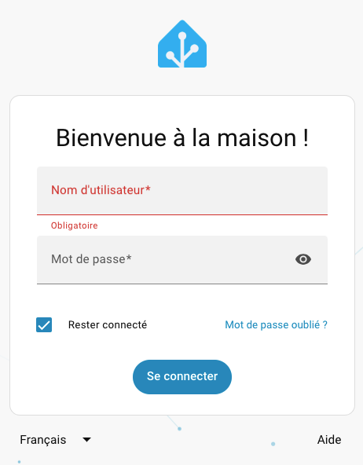

Si vous avez oublié ces informations, il est possible de les réinitialiser à condition d'avoir un accès direct au Raspberry Pi à l'aide d'un clavier et d'un écran ou [à un branchement via SSH](67_chapitre_de_reference_pour_home_assistant.md#fiche-se_brancher_a_home_assistant_via_ssh).

Notez que si vous avez encore les accès requis pour vous connecter avec un compte d'administrateur, il est préférable de modifier le mot de passe via l'interface Web : Paramètres / Personnes / Clic sur l'usager à modifier / Changer le mot de passe.

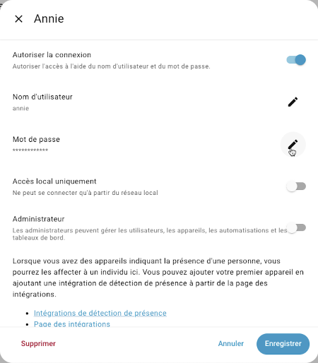

## Est-ce que vous tentez d'accéder au bon Home Assistant?

Avant d'entreprendre la procédure de réinitialisation du mot de passe, vérifiez si vous tentez de vous connecter au bon Home Assistant.

En effet, dans un environnement qui comprend plusieurs installations de Home Assistant, vous pourriez être branché sur n'importe laquelle des installations disponibles si vous avez utilisé l'URL http://homeassistant.local:8123 ou encore http://homeassistant:8123.

Pour vous assurer d'accéder au Home Assistant désiré lorsque plusieurs sont disponibles, vous devez utiliser un URL qui contient l'adresse IP du Raspberry Pi. L'adresse sera au format http://192.168.1.145:8123 , où 192.168.1.145 sera remplacé par l'adresse IP du Pi.

## Mot de passe oublié

Si vous vous rappelez du code d'usager mais que vous avez oublié le mot de passe, suivez ces instructions :

Entrez cette commande à la console Home Assistant :

Console Home Assistant


```
auth reset --username nom\_usager --password nouveau\_mot\_de\_passe\_en\_clair
```


ou celle-ci dans le terminal HassOS (invite #) :

Terminal


```
ha auth reset --username nom\_usager --password nouveau\_mot\_de\_passe\_en\_clair
```


## Code d'usager oublié

Dans le cas où vous ne connaissez aucun code d'usager, il est possible de remédier à la situation en éditant directement certains fichiers sur le Raspberry Pi à partir du terminal HassOS.

Sur HassOS, il est possible d'éditer les fichiers à l'aide de l'éditeur vi, un proche parent de l'[éditeur vim](04_linux.md#fiche-Editeur_vim).

Pour éditer un fichier avec vi :

Terminal


```
vi chemin/fichier
```


À son ouverture, vi vous place en mode commande. Pour passer d'un mode à l'autre :

* en mode commande : la lettre i vous place en mode insertion, ce qui permet d'éditer le texte
* en mode insertion : Échap vous place en mode commande

Pour enregistrer le document puis fermer l'éditeur : Échap suivi de : w q (ce qui signifie Write and Quit).

Pour fermer l'éditeur sans enregistrer : Échap suivi de : q !.

Les fichiers à éditer sont dans le dossier /mnt/data/supervisor/homeassistant/.storage.

Le nom d'usager apparaît à 3 endroits :

Fichier person


```
{
"version": 2,
"key": "person",
"data": {
"items": [
{
"name": "Nom complet",
"user\_id": "f2cd12cfc6424f518721196496cce50f",
"device\_trackers": [],
"id": "nom\_usager"
}
]
}
}
```


Fichier auth


```
...
"credentials": [
{
"id": "dbc82e9608534610afd72541f4c9f7a7",
"user\_id": "f2cd12cfc6424f518721196496cce50f",
"auth\_provider\_type": "homeassistant",
"auth\_provider\_id": null,
"data": {
"username": "nom\_usager"
}
}
],
...
```


Fichier auth\_provider.homeassistant


```
{
"version": 1,
"key": "auth\_provider.homeassistant",
"data": {
"users": [
{
"username": "nom\_usager",
"password": "JDJiJDEyJC9vSzlBamlOWE5wOTJheWdidHBJM3VKSTRONkdQbElBZnZUQmZzdWZxelBFbDkwRno1MWZh"
}
]
}
}
```


Une fois les modifications effectuées, vous devez redémarrer Home Assistant :

Terminal


```
ha core restart
```


Si vous ne connaissez pas le mot de passe de cet usager, vous pouvez le réinitialiser à l'aide de la technique présentée plus haut.

Rechargez maintenant la page Web et vous serez en mesure de vous authentifier avec ce nom d'usager.

## Réinitialiser la phase de préparation (onboarding process) {#reinitialiserpreparation}

Il est possible d'effectuer une action beaucoup plus drastique en supprimant complètement certains fichiers créés pendant la phase de préparation qui est effectuée lors de l'installation de Home Assistant.

Ceci détruira tous les usagers et vous ramènera à l'écran qui vous demande de créer l'usager initial.

Pour réinitialiser la phase de préparation, vous devez simplement supprimer ces fichiers :

* /mnt/data/supervisor/homeassistant/.storage/auth
* /mnt/data/supervisor/homeassistant/.storage/auth\_provider.homeassistant
* /mnt/data/supervisor/homeassistant/.storage/onboarding
* /mnt/data/supervisor/homeassistant/.storage/hassio
* /mnt/data/supervisor/homeassistant/.storage/cloud

## Pour plus d'information

« I'm Locked Out! ». Home Assistant. <https://www.home-assistant.io/docs/locked_out/>

## 59.11 Liste de vérification pour Home Assistant {#fiche-liste_de_verification_pour_home_assistant}

Vous n'arrivez pas à accéder à l'interface Web de Home Assistant? Ou le système a des comportement erratiques? Je vous propose une liste de vérifications pour cerner le problème.

## Le Raspberry Pi a-t-il accès à internet? {#internet}

Pour vérifier si le Raspberry Pi a accès à internet, ouvrez le [terminal Linux HassOS,terminal](66_home_assistant_au_coeur_de_votre_systeme_domotique.md#fiche-la_console_home_assistant) puis entrez cette commande :

Terminal


```
ping 8.8.8.8
```


Si le Pi a du réseau :

Résultat à l'écran


```
# ping 8.8.8.8
8.8.8.8 is alive!
```


Si le Pi n'a pas accès au réseau :

Résultat à l'écran


```
# ping 8.8.8.8
No response from 8.8.8.8
```


Pistes de solution :

* Le câble réseau est-il fonctionnel? Suggestion : branchez votre ordinateur par câble puis désactivez le Wi-Fi sur votre ordinateur. Si l'ordinateur a toujours accès au réseau, utilisez le même câble pour brancher le Pi.
* Le port sur le commutateur réseau est-il fonctionnel?
* Le réseau en tant que tel est-il fonctionnel?
* Les configurations d'accès au réseau (câblées ou sans fil) sont-elles bien réalisées? [Voir plus bas comment le vérifier.](https://apical.xyz/formations/pageunique/systeme_domotique_diy#configurationsreseau)

## Le Raspberry Pi a-t-il accès à un serveur DNS {#dns}

Un serveur DNS est requis pour transformer les adresses du genre google.com ou time.cloudflare.com en leur adresse IP.

Pour vérifier si le Pi a accès à un serveur DNS, ouvrez le terminal Linux HassOS puis entrez cette commande :

Terminal


```
ping google.com
```


Si le Pi a accès à un serveur DNS :

Résultat à l'écran


```
# ping google.com
google.com is alive!
```


Si le Pi n'a pas accès au réseau :

Résultat à l'écran


```
# ping google.com
ping: bad address 'google.com'
```


Pistes de solution :

* Les configurations d'accès au réseau sont-elles bien réalisées? [Voir plus bas comment le vérifier.](https://apical.xyz/formations/pageunique/systeme_domotique_diy#configurationdns)

## L'ordinateur est-il capable de rejoindre le Raspberry Pi?

Pour accéder à l'interface Web de Home Assistant, l'ordinateur et le Pi doivent se « voir » dans le réseau.

Pour le vérifier, ouvrez une fenêtre Terminal sur votre ordinateur et entrez cette commande en remplaçant 192.168.1.145 par l'adresse IP du Pi :

Terminal de l'ordinateur


```
ping 192.168.1.145
```


Si l'ordinateur réussit à rejoindre l'adresse du Pi :

Résultat à l'écran


```
MacBook-Pro-de-MonNom:~ monnom$ ping 192.168.1.145
PING 192.168.1.145 (192.168.1.145): 56 data bytes
64 bytes from 192.168.1.145: icmp\_seq=0 ttl=64 time=56.139 ms
64 bytes from 192.168.1.145: icmp\_seq=1 ttl=64 time=14.215 ms
64 bytes from 192.168.1.145: icmp\_seq=2 ttl=64 time=13.288 ms
```


Si l'ordinateur ne réussit pas à rejoindre l'adresse du Pi :

Résultat à l'écran


```
MacBook-Pro-de-MonNom:~ monnom$ ping 192.168.1.145
PING 192.168.1.145 (192.168.1.145): 56 data bytes
Request timeout for icmp\_seq 0
Request timeout for icmp\_seq 1
Request timeout for icmp\_seq 2
```


Pistes de solution :

* Assurez-vous que le Pi a accès à internet ([voir plus haut](https://apical.xyz/formations/pageunique/systeme_domotique_diy#internet)).
* Assurez-vous que le Pi et l'ordinateur sont sur le même réseau.

## Est-ce que vous tentez d'accéder au bon Home Assistant?

Pour accéder à l'interface Web de Home Assistant, il est possible d'utiliser l'URL http://homeassistant.local:8123 ou encore http://homeassistant:8123. Ceci est pratique puisque vous n'avez pas besoin de connaître l'adresse IP du Raspberry Pi.

Cependant, dans un environnement qui comprend plusieurs installations de Home Assistant, par exemple une salle de classe, une telle adresse ne vous garantit pas que vous vous connecterez au bon Raspberry Pi.

Vous devez alors utiliser un URL qui contient l'adresse IP du Pi que vous souhaitez rejoindre. L'adresse sera au format http://192.168.1.145:8123 , où 192.168.1.145 sera remplacé par l'adresse IP du Pi.

## Les configurations d'accès au réseau sont-elles bien réalisées? {#configurationsreseau}

Si le Raspberry Pi est branché au réseau à l'aide d'un câble RJ-45, qu'il n'a pas besoin d'adresse IP statique ni de serveur DNS spécifique, vous n'avez pas besoin de configurer l'accès au réseau.

Dans le cas contraire, les configurations d'accès au réseau peuvent être réalisées [à l'aide d'une clé USB,sansfil](66_home_assistant_au_coeur_de_votre_systeme_domotique.md#fiche-installation_de_home_assistant_et_premier_acces) branchée au Raspberry Pi lors du démarrage.

Elles peuvent également être réalisées [au terminal HassOS,terminal](67_chapitre_de_reference_pour_home_assistant.md#fiche-configurer_l_acces_au_reseau_dans_home_assistant) ou encore [via l'interface Web,web](67_chapitre_de_reference_pour_home_assistant.md#fiche-configurer_l_acces_au_reseau_dans_home_assistant).

Une fois les configurations réalisées, que ce soit à l'aide d'une clé USB, au terminal ou via l'interface Web, elles sont stockées dans des fichiers que vous retrouverez dans le dossier /etc/NetworkManager/system-connections.

Si vous avez configuré un accès au réseau et que vous ne retrouvez pas de fichiers à cet endroit :

* Si vous avez créé les configurations à l'aide d'une clé USB, est-ce que la clé porte le nom CONFIG en majuscules?
* Si vous avez créé les configurations à l'aide d'une clé USB, est-ce que la clé a été formatée en FAT32?
* Si vous avez créé les configurations à l'aide d'une clé USB, est-ce que le fichier de configuration était dans un sous-dossier nommé network?

### Éditer les configurations

Vous pouvez afficher leur contenu à l'aide de la commande cat et les éditer à l'aide de l'éditeur vi, un proche parent de l'[éditeur vim](04_linux.md#fiche-Editeur_vim).

Pour éditer un fichier avec vi :

Terminal


```
vi chemin/fichier
```


À son ouverture, vi vous place en mode commande. Pour passer d'un mode à l'autre :

* en mode commande : la lettre i vous place en mode insertion, ce qui permet d'éditer le texte
* en mode insertion : Échap vous place en mode commande

Pour enregistrer le document puis fermer l'éditeur : Échap suivi de : w q (ce qui signifie Write and Quit).

Pour fermer l'éditeur sans enregistrer : Échap suivi de : q !.

### Travailler avec plusieurs configurations

Plusieurs configurations peuvent co-exister, par exemple une pour le réseau câblé et une pour le réseau sans fil ou encore, si vous déplacez le Raspberry Pi pour effectuer des tests, une pour le travail et une pour la maison.

S'il y a plusieurs configurations, vérifiez ceci :

* Est-ce que chaque configuration est placée dans un fichier qui lui est propre (ex : my-network-sansfil et my-network-rj45)?
* Est-ce que chaque configuration a son propre UUID?

### Autres vérifications {#configurationdns}

* Pour la ou les configurations, est-ce que la ligne id contient EXACTEMENT le nom du fichier? Par exemple, pour le fichier my-network-sansfil, on aura :

  Fichier my-network-sansfil

  
```
  [connection]
  id=my-network-sansfil
  ...
```
* Si la version du Raspberry Pi est inférieure à 4 et que vous souhaitez utiliser une connexion Wi-Fi, est-ce que les configurations réseau sont faites pour un Wi-Fi 2.4 GHz.
* Si une adresse IP statique a été donnée au Raspberry Pi, est-ce que cette adresse est compatible avec le réseau? Par exemple, une adresse statique du genre 192.168.1.145 ne fonctionnera pas si le réseau fonctionne avec des adresses du genre 10.0.0.xxx.

  Si l'adresse est incompatible, vous avez deux options :

  + la modifier pour une adresse compatible

    ou
  + configurer l'accès au réseau pour qu'il laisse le serveur DHCP fournir l'adresse IP.

    Fichier my-network

```
    ...
    [ipv4]
    method=auto
```
* Si le réseau nécessite un serveur DNS spécifique, est-ce qu'il a été bien configuré?

  Fichier my-network

```
  ...
  [ipv4]
  ...
  dns=xxx.xxx.xxx.xxx;8.8.8.8;8.8.4.4;
```

## Date du système

La date du système se synchronise automatiquement avec un service NTP (protocole de diffusion du temps en réseau ou, en anglais, Network Time Protocol).

Si ce service ne réussit pas à faire son travail, ceci pourrait compromettre le bon fonctionnement de Home Assistant.

Pour vérifier la date du système, [ouvrez le terminal HassOS,terminal](66_home_assistant_au_coeur_de_votre_systeme_domotique.md#fiche-la_console_home_assistant) puis entrez la commande date. La date sera affichée au format UTC.

La date et l'heure peuvent également être affichés dans l'interface Web de Home Assistant à l'aide d'une [configuration time\_date](93_automatisations_qui_tiennent_compte_de_lheure.md#fiche-afficher_la_date_et_l_heure_dans_le_tableau_de_bord).

Si la date n'est pas correctement synchronisée, effectuez les vérifications suivantes :

* Le Pi a-t-il accès à un serveur DNS? [Voir plus haut pour le vérifier.](https://apical.xyz/formations/pageunique/systeme_domotique_diy#configurationdns)
* Tentez une réinitialisation à l'aide de la commande ha core restart.

## 59.12 Intégration Tuya pour ajouter des prises Wi-Fi Teckin dans Home Assistant {#fiche-integration_tuya_pour_ajouter_des_prises_wi-fi_teckin_dans_home_assistant}


Vous possédez une prise intelligente Wi-Fi et vous désirez l'intégrer dans votre boîte domotique Home Assistant?

Cela pourrait être possible s'il existe une intégration qui fait le pont entre la marque de votre prise et Home Assistant.

Remarquez que ceci implique que Home Assistant passe par un serveur externe à chaque fois qu'il doit interagir avec la prise Wi-Fi. Ceci cause une latence supplémentaire, soyez-en averti!

Et en cas de panne du serveur externe, Home Assistant ne pourra plus interagir avec cette prise.

Vous trouverez quelques liens pour d'autres solutions [au bas de cette page](https://apical.xyz/formations/pageunique/systeme_domotique_diy#local).

Je vous présente ici la technique pour ajouter une prise Teckin. J'ai fait mes tests avec le modèle SP10.


La technique comprend trois grandes étapes :

* [Configuration de la prise Wi-Fi sur votre téléphone](https://apical.xyz/formations/pageunique/systeme_domotique_diy#telephone)
* [Configuration d'un compte de développpeur chez Tuya](https://apical.xyz/formations/pageunique/systeme_domotique_diy#tuya)
* [Configuration de l'intégration Tuya dans Home Assistant](https://apical.xyz/formations/pageunique/systeme_domotique_diy#homeassistant)

## Configuration de la prise Wi-Fi sur votre téléphone

La première étape consiste à prendre en main la prise intelligente tel que proposé par le fabricant.

Gardez en tête que ceci implique que les données sur cette prise seront stockées sur un serveur externe. Mais généralement, ceci n'est pas un problème pour une simple prise intelligente.

### Réseau Wi-Fi 2.4 GHz

La majorité des appareils intelligents Wi-Fi fonctionnent sur un réseau 2.4 GHz car plus la fréquence est basse, plus la portée est longue.

Il faudra donc que votre téléphone soit connecté à un réseau 2.4 GHz pour réaliser le pairage.

Plusieurs routeurs utilisent le même nom pour le réseau 2.4 GHz et le 5 GHz. Ils laissent le soin aux appareils de prendre celui qui leur convient. Ce sera toujours le 5 GHz, qui est plus rapide, sauf si l'appareil ne le supporte pas.

Le problème, c'est que les téléphones ne peuvent pas être configurés pour demander du 2.4 GHz lorsque le 5 GHz est disponible.

Donc, si votre routeur sans fil ne vous permet pas de choisir la fréquence, vous devrez modifier ses configurations pour que les deux réseaux portent un nom différent, par exemple maison et maison24.

Autre solution moins élégante : pour effectuer le pairage, éloignez votre téléphone du routeur de façon à ce que seul le 2.4 GHz ne soit disponible!

Autre piste à explorer : pour diminuer l'efficacité de l'antenne du téléphone, ajoutez su papier d'aluminium vis-à-vis l'antenne (généralement placée dans le haut du téléphone, du côté opposé à la caméra). Je n'ai jamais essayé mais sait-on jamais!

### Pairage

Si vous avez en main une prise Teckin, elle sera contrôlée par l'application SmartLife.

Suivez ces étapes pour réaliser le pairage :

* Téléchargez l'application SmartLife gratuitement sur iPhone ou sur Android.

  
* Dans l'écran d'accueil, cliquez sur Enregistrer pour vous créer un compte.

  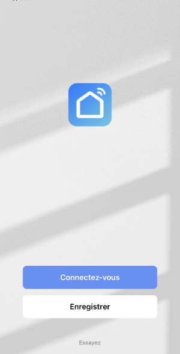
* Une fois le compte créé, vous pourrez cliquez sur + pour ajouter un appareil.

  
* Indiquez quel type d'appareil vous désirez ajouter. Ici, c'est une prise Wi-Fi.

  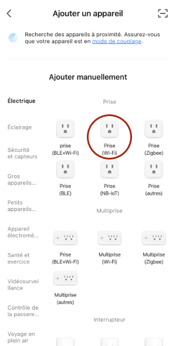
* Si votre téléphone n'est pas branché sur le 2.4 GHz, vous serez invité à entrer le nom du réseau 2.4 GHz et son mot de passe.

  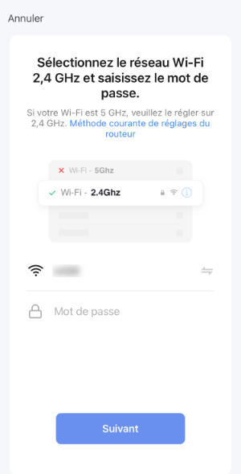
* Éteignez la prise pendant 10 secondes puis allumez-la.

  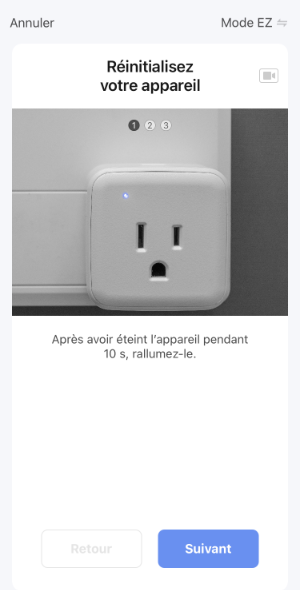
* Appuyez sur le bouton pendant 5 secondes. Le témoin lumineux s'éteindra après environ 3 secondes puis, après 1 seconde ou 2, se rallumera en clignotant rapidement (3 clignotements par seconde).

  Attention : sur certaines prises comme la S10, c'est le bouton lui-même qui clignote alors ne le cachez pas complètement avec votre doigt!

  
* L'écran suivant vous demande simplement de confirmer que le clignotement est rapide.

  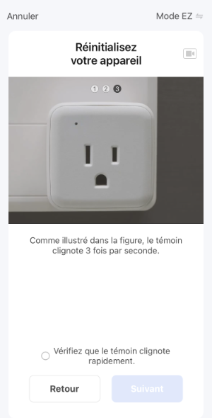
* L'application procède ensuite au pairage avec le prise intelligente.

  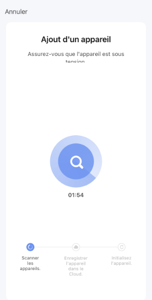
* Voilà, l'application peut maintenant allumer et éteindre la prise et même l'utiliser dans de petits scénarios.

## Compte de développpeur chez Tuya {#tuya}

Les prises Teckin sont fabriquées par la compagnie Tuya Smart.

Pour faire le pont entre la prise Wi-Fi et Home Assistant, il vous faut un compte dévelopeur chez Tuya. Ceci est gratuit.

* Rendez-vous sur le site [https://iot.tuya.com](https://iot.tuya.com/).
* Cliquez sur Sign Up.

  
* Une fois le compte créé, authentifiez-vous sur la plateforme.
* Quand on vous demandera le type de compte, choisissez Individual Developer.

  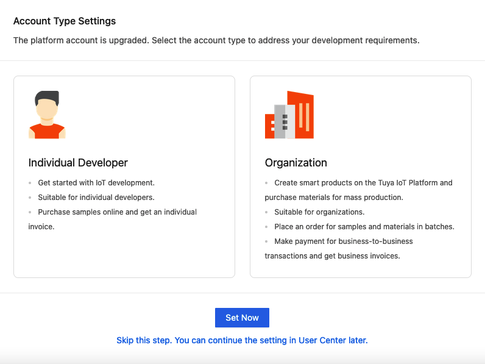
* Vous devez créer un projet qui servira à faire le lien entre votre compte de développpeur chez Tuya et votre compte SmartLife.

  Rendez-vous dans le menu Cloud / Development.

  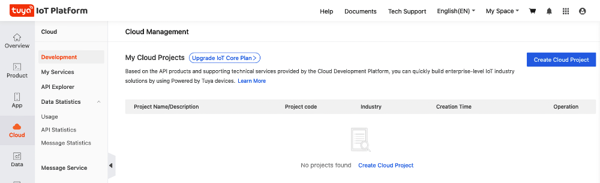
* Cliquez sur Create Cloud Project et remplissez le formulaire.

  Parmi les informations demandées :

  Industry : Smart Home

  Development Method : Smart Home

  Data Center : Vous devriez normalement choisir celui qui est le plus près de chez vous mais les tests que j'ai faits avec Eastern America Data Center ont échoué. J'ai plutôt choisi Western America Data Center même si j'habite au Québec.

  Consultez ce site pour voir quel Data Center peut desservir votre emplacement : <https://developer.tuya.com/en/docs/iot/oem-app-data-center-distributed?id=Kafi0ku9l07qb>

  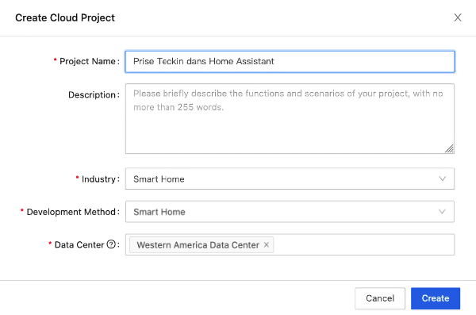
* Dans l'écran suivant, vous devez préciser quelles autorisations seront données au système domotique dans lequel vous allez ajouter la prise Teckin. En plus des autorisations présentes par défaut, ajoutez Device Status Notification.

  Notez que si votre écran ne propose pas les mêmes autorisations dans la zone de droite, c'est peut-être parce que vous n'avez pas choisi la méthode de développement Smart Home.

  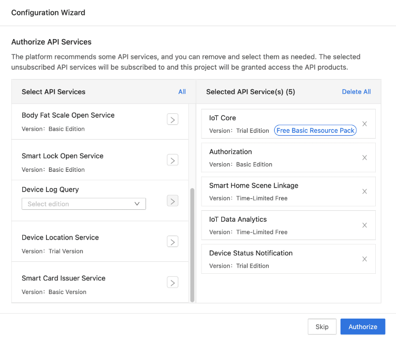
* Cliquez sur Authorize.
* Rendez-vous maintenant dans l'onglet Devices puis Link Tuya App Account.

  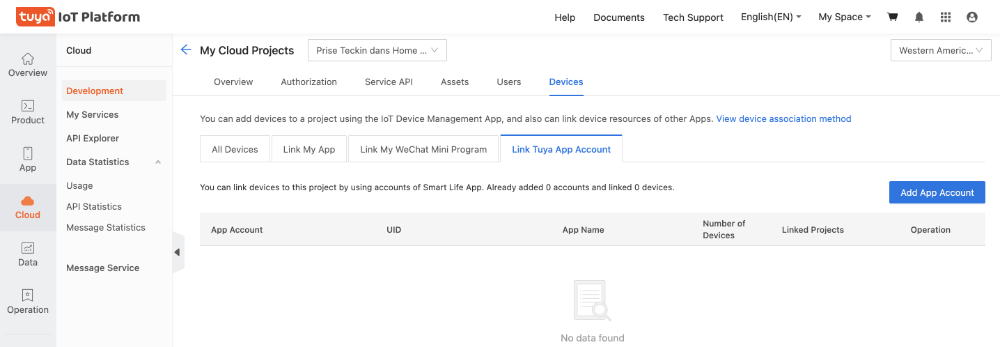
* Cliquez sur le bouton Add App Account. Ceci fera apparaître un code QR à l'écran.

  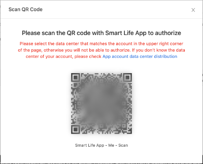
* Ouvrez l'application SmartLife sur votre cellulaire, cliquez sur Profil dans le bas à droite puis sur l'icône Scan dans le haut de l'écran.

  
* Ceci ouvrira la caméra du téléphone. Utilisez-la pour scanner le code QR.

  C'est ici que le Data Center sélectionné lors de la création du projet pourrait poser problème. Si vous obtenez le message « You cannot scan the QR code to add a device deployed in another data center. », éditez le projet pour changer le Data Center puis refaites les étapes pour scanner le code QR.

  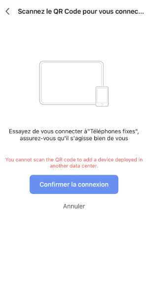
* Une fois le scan réussi, cliquez sur Confirmer la connexion.
* De retour dans l'écran My Cloud Projects, cliquez sur All Devices. Vous devriez voir les appareils que vous avez pairés dans SmartLife.

  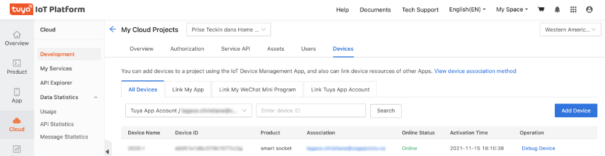
* Cliquez sur l'onglet Overview. Vous obtiendrez un écran qui vous donne les clés d'authorisation dont vous aurez besoin sous peu.

  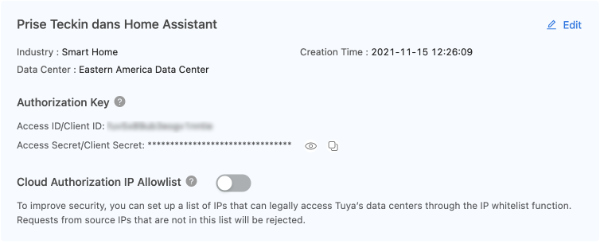

## Intégration Tuya dans Home Assistant {#homeassistant}

Vous êtes maintenant prêt à configurer Home Assistant pour qu'il prenne le contrôle de la prise Wi-Fi.

* Dans Home Assistant, rendez-vous dans le menu Configuration / Intégrations.
* Cliquez sur Ajouter l'intégration puis recherchez Tuya.

  
* Cliquez sur Tuya dans les résultats de recherche.

  Dans les cases Tuya IoT Access ID et Tuya IoT Access Secret, entrez les clés d'autorisation associées à votre compte développeur chez Tuya.

  Dans les cases Nom d'utilisateur et Mot de passe, entrez vos informations d'authentification de l'application SmartLife.

  Une ancienne version de l'intégration Tuya demandait d'entrer le code du pays plutôt que son nom. Si c'est votre cas, la liste est disponible ici : <https://countrycode.org/>.

  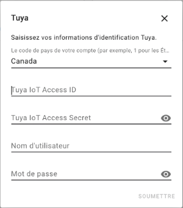
* Vos objets connectés Wi-Fi apparaissent maintenant parmi vos entités (Configuration / Entités). Vous pouvez donc les contrôler via Home Assistant et les utiliser dans vos automatisations au même titre que n'importe quelle autre entité.

## Ajouter une prise Wi-Fi sans passer par un service infonuagique

Dans certaines conditions, vous pourriez ajouter un objet connecté Wi-Fi sans passer par un service infonuagique.

### local Tuya

La première option est d'utiliser l'intégration [local Tuya](https://github.com/rospogrigio/localtuya).

En fait, l'objet connecté sera connu des serveurs externes mais Home Assistant y aura un accès direct, sans nécessiter un passage dans le cloud à chaque interaction entre Home Assistant et l'objet Wi-Fi.

Les instructions sont ici : <https://www.youtube.com/watch?v=vq2L9c5hDfQ>

### Soudure et micrologiciel

Si vous êtes habiles en électronique, il existe des techniques pour changer le micrologiciel d'un objet connecté afin de le rendre disponible directement dans Home Assistant sans passer par un serveur externe.

Un tutoriel sur la technique qui nécessite du soudage vous intéresse? C'est par ici : <https://www.youtube.com/watch?v=hgO2oxJZlUY>

Il y a aussi moyen de remplacer le micrologiciel sans avoir à effectuer de la soudure, grâce à ESPHome et Tuya-convert. Explications ici : <https://www.esphome-devices.com/guides/tuya-convert>.

## Pour plus d'information

« Tuya ». Home Assistant. <https://www.home-assistant.io/integrations/tuya>

## 59.13 Intégration TP-Link Kasa Smart pour ajouter une prise Kasa à Home Assistant {#fiche-integration_tp-link_kasa_smart_pour_ajouter_une_prise_kasa_a_home_assistant}


Les prises intelligentes Kasa peuvent être associées à Home Assistant sans avoir à passer par l'application Kasa.

Pour ma part, je me suis procuré une prise extérieure double KP400.


Pour intégrer cette prise à Home Assistant, plusieurs étapes sont nécessaires :

* [Connecter la prise à votre réseau Wi-Fi](https://apical.xyz/formations/pageunique/systeme_domotique_diy#wifi)
* [Installer l'intégration TP-Link Kasa Smart](https://apical.xyz/formations/pageunique/systeme_domotique_diy#integration)
* [Ajouter la prise à Home Assistant](https://apical.xyz/formations/pageunique/systeme_domotique_diy#ha)

## Connecter la prise à votre réseau Wi-Fi {#wifi}

* Branchez la prise Kasa dans une prise de courant. Elle devrait clignoter en vert et ambre pour indiquer que son réseau et en cours d'émission.
* Commencez par installer le paquet python-kasa sur votre ordinateur (et non sur le Raspberry Pi). Ouvrez une fenêtre Terminal et lancez cette commande :

  Terminal de l'ordinateur

```
  pip install python-kasa
```

  ou

  Terminal de l'ordinateur

```
  python3 -m pip install --user python-kasa
```

  ou

  Terminal de l'ordinateur

```
  git clone https://github.com/python-kasa/python-kasa.git
  cd python-kasa/
  poetry install
```
* Sur votre ordinateur, branchez-vous au réseau émis par la prise. Il devrait porter un nom qui commence par « TPLink- ».
* Dans une fenêtre Terminal, lancez la commande kasa pour découvrir votre prise intelligente. Retenez l'adresse IP Host.

  Résultat à l'écran

```
  monnom@MacBook-Pro-de-MonNom ~ %kasa
  No host name given, trying discovery..
  Discovering devices on 255.255.255.255 for 3 seconds
  == TP-LINK\_Smart Plug\_1AF1 - KP400(US) ==
  Host: 192.168.0.1
  Device state: OFF
  == Plugs ==
  \* Socket 'Kasa\_Smart Plug\_1AF1\_0' state: OFF on\_since: None
  \* Socket 'Kasa\_Smart Plug\_1AF1\_1' state: OFF on\_since: None
  == Generic information ==
  Time: 2000-01-01 16:01:23 (tz: {'index': 6, 'err\_code': 0}
  Hardware: 3.0
  Software: 1.0.2 Build 210105 Rel.165938
  MAC (rssi): 14:EB:C6:89:1B:F1 (-30)
  Location: {'latitude': 0.0, 'longitude': 0.0}
  == Device specific information ==
  LED state: True
  Childs count: 2
  On since: None
  == Modules ==
  + <Module Antitheft (anti\_theft) for 192.168.0.1>
  + <Module Schedule (schedule) for 192.168.0.1>
  + <Module Usage (schedule) for 192.168.0.1>
  + <Module Time (time) for 192.168.0.1>
  - <Module Countdown (countdown) for 192.168.0.1>
  - <Module Emeter (emeter) for 192.168.0.1>
```
* Entrez cette commande pour voir les réseaux Wi-Fi disponibles. Seuls les réseaux 2.4 GHz peuvent être utilisés.

  Terminal de l'ordinateur

```
  kasa --host 192.168.0.1 wifi scan
```

  Résultat à l'écran

```
  monnom@MacBook-Pro-de-MonNom ~ %kasa --host 192.168.0.1 wifi scan
  No --type defined, discovering..
  Scanning for wifi networks, wait a second..
  Found 2 wifi networks!
  WifiNetwork(ssid='mon-reseau', key\_type=3, cipher\_type=None, bssid=None, channel=None, rssi=None)
  WifiNetwork(ssid='un-autre-reseau', key\_type=3, cipher\_type=None, bssid=None, channel=None, rssi=None)
```
* Vous pouvez désormais brancher la prise au réseau désiré.

  Terminal de l'ordinateur

```
  kasa --host 192.168.0.1 wifi join mon-reseau
```

## Installer l'intégration TP-Link Kasa Smart {#integration}

Maintenant que la prise Kasa a un accès Wi-Fi, poursuivons avec l'installation de l'intégration TP-Link Kasa Smart.

* Ouvrez [l'interface Web de Home Assistant,acceder](66_home_assistant_au_coeur_de_votre_systeme_domotique.md#fiche-installation_de_home_assistant_et_premier_acces).
* Rendez-vous dans le menu Paramètres / Appareils et services / onglet Intégrations.
* Cliquez sur Ajouter une intégration.
* Dans la zone de recherche, entrez kasa puis cliquez sur TP-Link Kasa Smart.

  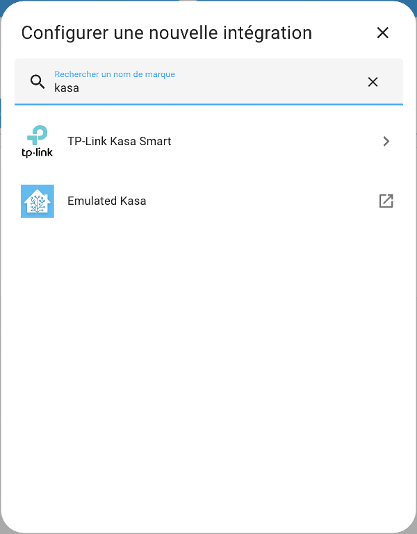

## Ajouter la prise à Home Assistant {#ha}

* L'intégration vous offre alors de débuter la recherche. Dans l'écran suivant, vous pouvez laisser l'hôte vide et cliquer sur Valider pour lancer la recherche d'appareils.

  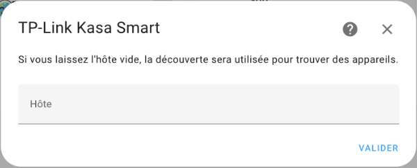
* Dès que votre prise intelligente est trouvée, ses informations apparaissent à l'écran. Cliquez sur Valider.

  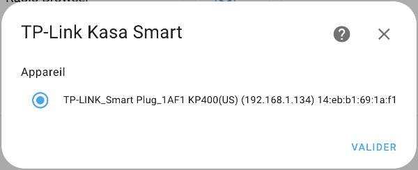
* Vous obtenez ensuite la confirmation que la prise a été ajoutée. Vous pouvez indiquer dans quelle pièce se trouve la prise puis cliquer sur Terminer.  

  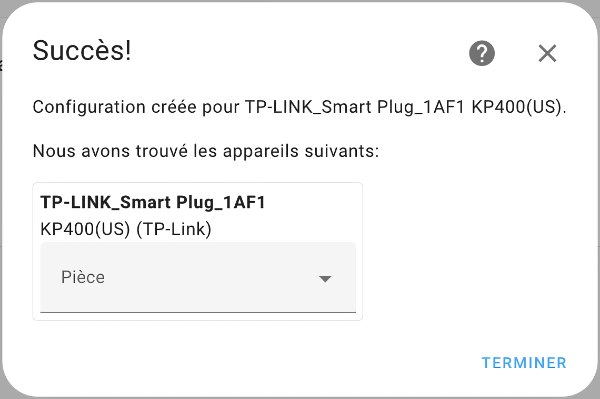
* Si vous n'avez pas [créé un tableau de bord personnalisé](80_les_tableaux_de_bord.md#fiche-creer_un_tableau_de_bord_personnalise), Home Assistant a automatiquement ajouté la prise Kasa au tableau de bord et vous pouvez désormais la contrôler. Ici, on voit deux entités puisque ma prise est double.

  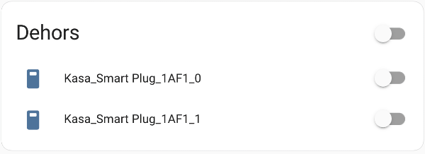
* Dans le cas où vous avez un tableau de bord personnalisé, Home Assistant ne fait plus automatiquement les ajouts. Vous devez donc ajouter une carte pour que votre prise apparaisse.

## Pour plus d'information

« TP-Link Kasa Smart ». Home Assistant. <https://www.home-assistant.io/integrations/tplink/>

« python-kasa ». python-kasa. <https://python-kasa.readthedocs.io/en/latest/index.html>

« Command-line usage ». python-kasa. <https://python-kasa.readthedocs.io/en/latest/cli.html>

« How to setup tplink switch (HS100, HS110) without kasa app ». Salman Zari Ghanvi's Blog. <https://salmanzg.wordpress.com/2020/03/02/how-to-setup-tplink-switch-hs100-hs110-without-kasa-app/>

## 59.14 Éditeur vi {#fiche-editeur_vi}

L'éditeur vi, disponible sur HassOS, est un proche parent de l'[éditeur vim](04_linux.md#fiche-Editeur_vim).

Pour éditer un fichier avec vi :

Terminal

```
vi /chemin/nom-du-fichier
```


À son ouverture, vi vous place en mode commande. Pour passer d'un mode à l'autre :

* en mode commande : la lettre i vous place en mode insertion, ce qui permet d'éditer le texte
* en mode insertion : Échap vous place en mode commande

Pour enregistrer le document puis fermer l'éditeur : Échap suivi de : w q (ce qui signifie Write and Quit).

Pour fermer l'éditeur sans enregistrer : Échap suivi de : q !.

## 59.15 Éteindre ou redémarrer le Raspberry Pi (host shutdown / host reboot) {#fiche-eteindre_ou_redemarrer_le_raspberry_pi}

Pour éteindre ou redémarrer proprement le Raspberry Pi hébergeant Home Assistant sans risquer d'endommager le système de fichiers, vous pouvez utiliser les commandes `host shutdown` ou `host reboot`.

### Éteindre le Raspberry Pi (host shutdown)

Dans la **console Home Assistant** (invite `ha >`) :

Console Home Assistant

```
host shutdown
```

Dans le **terminal HassOS** (invite `#`) ou lors d'une session SSH :

Terminal HassOS

```
ha host shutdown
```

### Redémarrer le Raspberry Pi (host reboot)

Dans la **console Home Assistant** (invite `ha >`) :

Console Home Assistant

```
host reboot
```

Dans le **terminal HassOS** (invite `#`) ou lors d'une session SSH :

Terminal HassOS

```
ha host reboot
```

*(Note : pour redémarrer uniquement le conteneur Home Assistant Core sans redémarrer le Raspberry Pi au complet, utilisez plutôt `ha core restart`).*

