# 60. Dépannage Home Assistant (troubleshooting) {#chapitre-depannage_home_assistant_troubleshooting}

## 60.1 Erreur « wlan0: link is not ready » {#fiche-erreur_wlan0_link_is_not_ready}

### Problème :

Lorsque vous démarrez votre Raspberry Pi qui contient une installation de Home Assistant, vous obtenez à la console le message « IPv6: ADDRCONF (NETDEV\_UP): wlan0: link is not ready - brcmfmac: brcmf\_cfg80211\_set\_power\_mgmt: power save enabled ».

Il est possible que ce message à la console n'empêche pas le logiciel de fonctionner et donc que l'interface soit fonctionnelle dans votre navigateur. Cependant, ceci pourrai causer des problèmes plus tard alors il vaut mieux trouver une solution.

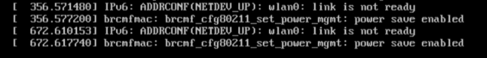

Ce message peut parfois apparaître après le message « [WARN] Home Assistant CLI is not running! Jump into emergency console... ».

![[WARN] Home Assistant CLI is not running! Jump into emergency console...](NotesDeCoursApical-420_3a4_vi_objets_connectes_1_a_2025_files/HomeAssistant-CLIIsNotRunning.png)

### Contexte :

* Home Assistant 32 bits pour Raspberry Pi 3 (fichier d'installation hassos\_rpi3-4.16.img.gz)
* HassOS 4.16
* Raspberry Pi 3B

### Cause possible :

Home Assistant n'a pas fini de se charger.

### Solution proposée :

Patientez! Home Assistant complètera son démarrage puis vous pourrez accéder à la console.

Si vous voyez l'invite de commande du terminal Linux (#) et que vous souhaitez plutôt avoir l'invite de commande de la console Home Assistant (ha >), entrez la commande exit puis vous serez invité à entrer à nouveau le code d'usager de la console : root.

### Autre cause possible :

Le bloc d'alimentation du Raspberry Pi ne fournit pas une intensité de courant suffisante.

### Solution proposée :

Changez le bloc d'alimentation pour un autre qui fourni au moins 2,5 ampères.

### Autre cause possible :

Le réseau sans fil n'a pas été correctement configuré.

### Solution proposée :

D'abord, essayez de brancher le Raspberry Pi au routeur à l'aide d'un câble RJ-45. Si cela règle le problème, c'est qu'effectivement il y avait un problème de configuration du réseau sans fil.

 Si l'accès câblé fonctionne, vous devrez réviser le fichier network/my-network sur la clé USB : <https://github.com/home-assistant/operating-system/blob/dev/Documentation/network.md>.

* La clé doit être vierge et être formatée en FAT32 (sous Mac, choisissez MS-DOS (Fat) dans l'utilitaire de disque).
* La clé doit posséder un volume nommé CONFIG (en majuscules).
* Les configurations doivent être placées dans le fichier network/my-network. Le dossier network doit être à la racine de la clé.
* Dans ce fichier, le id doit être identique au nom du fichier (my-network).
* Les sauts de lignes doivent être codés en Linux (LF) et non en Windows (CRLF).
* Notez que le Raspberry Pi 3 ne supporte que le Wi-Fi 2.4 GHz alors que le Raspberry Pi 4 supporte également le 5 GHz.
* Une fois le fichier my-network complété,retirez la clé de l'ordinateur de façon sécuritaire, insérez-la dans le Raspberry Pi et redémarrez Home Assistant.

Fichier network/my-network

[connection]  
id=my-network  
uuid=72111c67-4a5d-4d5c-925e-f8ee26efb3c3  
type=802-11-wireless  
  
[802-11-wireless]  
mode=infrastructure  
ssid=NOM-DU-RESEAU  
# Uncomment below if your SSID is not broadcasted  
#hidden=true  
  
[802-11-wireless-security]  
auth-alg=open  
key-mgmt=wpa-psk  
psk=MOT-DE-PASSE-DU-RESEAU  
  
[ipv4]  
method=auto  
  
[ipv6]  
addr-gen-mode=stable-privacy  
method=auto

Dans le cas où vous n'arrivez pas à accéder à Home Assistant même avec un câble RJ-45, c'est probablement le système d'exploitation qui est en problème.

Téléchargez à nouveau l'image qui correspond à votre Raspberry Pi (<https://www.home-assistant.io/hassio/installation/>) et flashez-la à nouveau sur la carte micro SD.

## 60.2 Écran noir {#fiche-Ecran_noir}

### Problème :

Lorsque vous démarrez votre Raspberry Pi qui contient une installation de Home Assistant, vous obtenez un écran noir sur l'écran branché directement sur le Pi.

### Contexte :

* Home Assistant 0.118.4
* HassOS 4.16
* Raspberry Pi 3B

Cause possible :

Il n'y a pas de carte micro SD dans le Pi ou la carte ne contient pas de système d'exploitation.

### Solution proposée :

Installez le système d'exploitation sur la carte, insérez-la dans le Pi puis rebranchez le courant.

### Autre cause possible :

La version de Hass.io installée ne correspond pas au modèle de votre Raspberry Pi.

### Solution proposée :

Vérifiez le modèle exact de votre Raspberrry Pi puis téléchargez la version qui lui correspond ici : <https://www.home-assistant.io/hassio/installation/>.

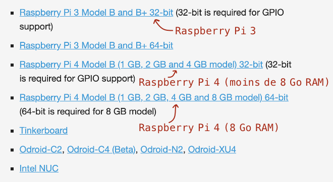

## 60.3 Impossible d'obtenir l'interface Web de Home Assistant sur mon ordinateur {#fiche-impossible_d_obtenir_l_interface_web_de_home_assistant_sur_mon_ordinateur}

### Problème :

Lorsque vous tentez d'afficher l'interface Web de Home Assistant dans votre navigateur, vous n'arrivez pas à vous connecter.

Vous obtenez le même résultat peu importe la forme de l'URL utilisée : http://homeassistant.local:8123, http://homeassistant:8123 ou http://192.168.1.145:8123 (où 192.168.1.145 doit être remplacé par l'adresse IP du Pi).

Souvent, ceci se traduit par l'affichage du message « Ce site est inaccessible. 206.167.1.145 a mis trop de temps à répondre. Voici quelques conseils : Vérifier la connexion Vérifier le proxy et le pare-feu ERR\_CONNECTION\_TIMED\_OUT ».

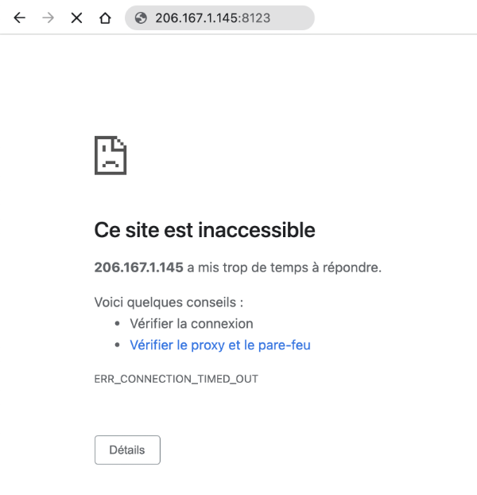

### Contexte :

* Home Assistant 2021.9.7
* HassOS 6.4
* Raspberry Pi 4

### Cause possible :

Le Pi n'a aucun accès au réseau.

Pour confirmer que c'est bien le cas, branchez un clavier et un écran au Raspberry Pi et lancez la commande login pour accéder au terminal HassOS.

Entrez ensuite cette commande :

Terminal

ping 8.8.8.8

Si le réseau fonctionne, vous verrez le message « 8.8.8.8 is alive! ». Passez à la prochaine cause possible.

Sinon, vous verrez « No response from 8.8.8.8 ». Suivez les instructions dans la solution proposée qui suit.

### Solution proposée :

La solution la plus fiable consiste à brancher le Raspberry Pi au réseau à l'aide d'un câble RJ-45.

Si vous préférez travailler avec le réseau sans fil, voici quelques pistes pour vous aider.

D'abord, il faut vérifier si le Wi-Fi est activé sur le Pi.

Entrez cette commande dans le terminal HassOS :

Terminal

nmcli radio

Si le Wi-Fi est activé, vous verrez enabled vis-à-vis la colonne WIFI. Sinon, vous verrez disabled.

Terminal

ha > login  
# nmcli radio  
WIFI-HW  WIFI      WWAN-HW  WWAN   
enabled  disabled  enabled  enabled

Si c'est votre cas, vous devez activer le Wi-Fi :

Terminal

nmcli radio wifi on

Pour lister les réseaux disponibles :

Terminal

nmcli device wifi rescan  
nmcli device wifi

Résultat à l'écran

IN-USE  SSID           MODE   CHAN  RATE        SIGNAL  BARS  SECURITY  
        mon-reseau     Infra  1     270 Mbit/s  69      \*\*\*   WPA WPA2

Dans le cas où vous tentez de vous connecter à l'aide du partage de connexion de votre cellulaire (non conseillé mais ça peut être un dépanneur temporaire), vous devez ouvrir l'écran de partage de connexion sur votre cellulaire (celui dans lequel on voit le nom du réseau et le mot de passe pour la connexion) puis refaire nmcli device wifi rescan suivi de nmcli device wifi. Vous verrez alors votre partage de connexion apparaître :

Résultat à l'écran

IN-USE  SSID           MODE   CHAN  RATE        SIGNAL  BARS  SECURITY  
        iPhoneDeAnnie  Infra  6     130 Mbit/s  100     \*\*\*\*  WPA2

Remarque : le SSID de votre téléphone ne doit pas comprendre d'espaces pour que ça fonctionne. Si le nom de votre téléphone comprend des espaces (ex :  iPhone de Annie), renommez-le (sur iPhone : Réglages / Général / Informations / Nom).

Vous pouvez maintenant vous connecter à votre réseau :

Terminal

nmcli device wifi connect "mon-reseau" password "mot-de-passe-du-reseau"

Redémarrez le Pi :

Terminal

reboot

La connexion sans fil devrait être complètement fonctionnelle. Testez-le en demandant l'addresse IP du Pi directement à la console Home Assistant :

Console Home Assistant

network info

### Autre cause possible :

Quelque chose a été mal chargé dans Home Assistant pour une raison ou pour une autre.

Ceci peut se produire notamment si le réseau est différent de celui utilisé lors de la dernière connexion, par exemple à la suite d'un changement de fournisseur Internet ou encore après avoir déplacé le Raspberry Pi entre la maison et le travail afin d'y effectuer des tests.

### Solution proposée :

Entrez la commande suivante dans la console Home Assistant :

Console Home Assistant

core restart

ou celle-ci dans le terminal HassOS :

Terminal

ha core restart

### Autre cause possible :

Votre ordinateur n'est pas sur le même réseau que le Pi.

### Solution proposée :

Modifiez la connexion réseau de l'ordinateur. Par exemple, si vous avez utilisé le partage de connexion de votre cellulaire pour obtenir une adresse IP pour votre Pi, vous devez également brancher votre ordinateur sur le partage de connexion de votre cellulaire.

### Autre cause possible :

Home Assistant n'a pas terminé de se charger et ce, même si on voit l'écran d'accueil lorsqu'on y branche un écran.

### Solution proposée :

Patientez quelques minutes, normalement tout devrait rentrer dans l'ordre dès que Home Assistant est prêt.

## Pour plus d'information

« Guide: Connecting Pi with Home Assistant OS to wifi (or other networking changes) ». Home Assistant. <https://community.home-assistant.io/t/guide-connecting-pi-with-home-assistant-os-to-wifi-or-other-networking-changes/98768>

## 60.4 Erreur « dd: /dev/rdisk2: Device not configured » {#fiche-erreur_dd_dev_rdisk2_device_not_configured}

### Problème :

Lorsque vous tentez de flasher une image sur une carte micro SD à l'aide de la commande dd, vous obtenez le message « dd: /dev/rdisk2: Device not configured ».

Résultat à l'écran

MacBook-Pro-de-MonNom:~ monnom$ diskutil unmountDisk /dev/disk2  
Unmount of all volumes on disk2 was successful  
MacBook-Pro-de-MonNom:~ monnom$ sudo dd bs=1m if=/Users/monnom/Downloads/haos\_rpi3-64-6.4-64bits.img of=/dev/rdisk2 conv=sync  
Password:  
dd: /dev/rdisk2: Device not configured  
421+0 records in  
420+0 records out  
440401920 bytes transferred in 60.900715 secs (7231474 bytes/sec)

Même si j'utilise [Balena Etcher](https://www.balena.io/etcher/) pour flasher la carte, j'obtiens l'erreur « ENXIO: no such device or address, read ».

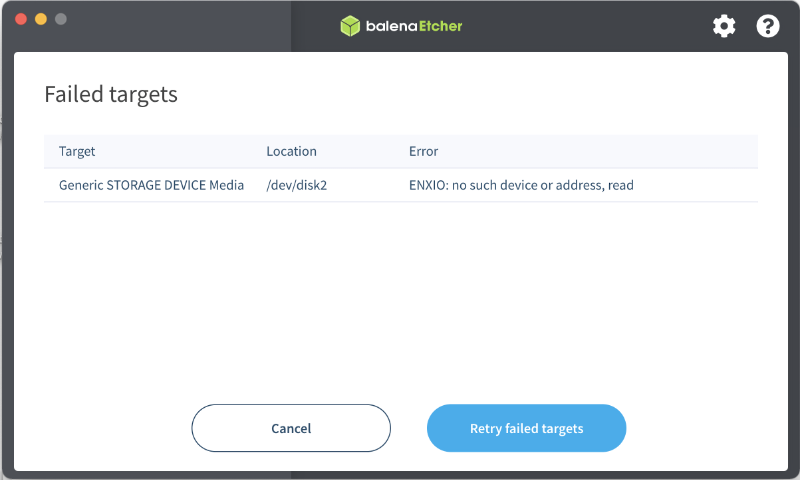

De plus, sur mon Mac, j'obtiens sans cesse le message « Le disque que vous avez attaché n’est pas lisible par cet ordinateur » (en anglais : « The disk you connected cannot be read on this computer ») pendant que la commande dd fait son travail sur la carte micro SD.

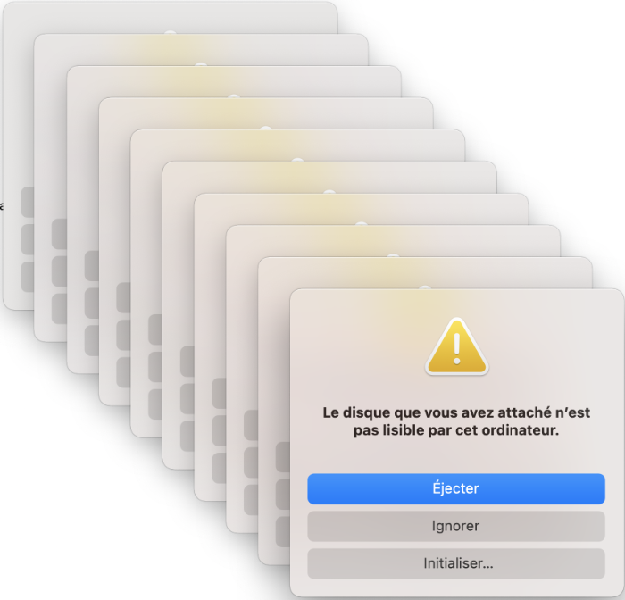

### 

### Contexte :

* MacOS Big Sur (11.5.2)

### Cause possible :

Le lecteur de carte micro SD fait défaut.

### Solution proposée :

Essayez avec un autre lecteur de carte micro SD.

Avec un nouveau lecteur, j'ai réussi à flasher la carte avec la commande dd et avec Etcher.

## 60.5 Erreur « dd: /dev/rdisk2: Operation not permitted » {#fiche-erreur_dd_dev_rdisk2_operation_not_permitted}

### Problème :

Lorsque vous tentez de flasher une image sur une carte micro SD à l'aide de la commande dd, vous obtenez le message « dd: /dev/rdisk2: Operation not permitted ».

Résultat à l'écran

MacBook-Pro-de-MonNom:~ monnom$ sudo dd bs=1m if=/Users/monnom/Downloads/haos\_rpi3-64-6.4-64bits.img of=/dev/rdisk2 conv=sync  
Password:  
dd: /dev/rdisk2: Operation not permitted

### Contexte :

* MacOS Big Sur (11.5.2)

### Cause possible :

Lorsque vous avez inséré la carte micro SD dans votre ordinateur, vous avez cliqué sur Éjecter dans la boîte « Le disque que vous avez attaché n’est pas lisible par cet ordinateur » ou en anglais « The disk you connected cannot be read on this computer », ce qui a rendu le disque non disponible pour cette opération.

### Solution proposée :

Retirez la carte micro SD de l'ordinateur puis insérerz-la à nouveau. Quand vous verrez la boîte de dialogue « Le disque que vous avez attaché n’est pas lisible par cet ordinateur », cliquez sur Ignorer.

Vous pourrez ensuite lancer les opérations pour flasher l'image sur la carte micro SD.

## 60.6 Écran "Preparing Home Assistant" reste affiché à l'infini {#fiche-Ecran_preparing_home_assistant_reste_affiche_a_l_infini}

### Problème :

Lorsque vous démarrez votre Raspberry Pi qui contient une installation de Home Assistant, l'écran Preparing Home Assistant reste affiché à l'infini.

Quand vous cliquez sur le point bleu, vous obtenez un log des opérations effectuées et des erreurs rencontrées.

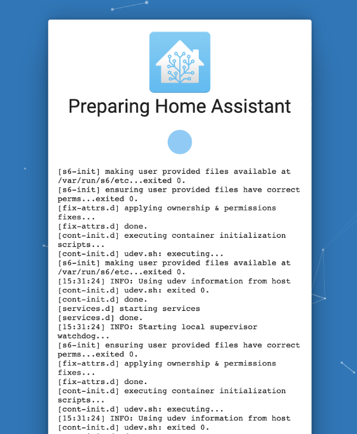

### Contexte :

* Home Assistant 64 bits pour Raspberry Pi 3 (fichier d'installation haos\_rpi3-64-6.4.img)
* HassOS 6.4
* Raspberry Pi 3B

### Cause possible :

Il y a un problème d'accès à Internet.

### Solution proposée :

Tout d'abord, arrêtez votre Raspberry Pi de façon sécuritaire.

* Branchez un clavier et un écran au Raspberry Pi afin d'obtenir la console Home Assistant.
* Entrez la commande suivante pour sortir de la console Home Assistant et ainsi accéder au terminal Linux (HassOS).

  Console Home Assistant

  login
* Vous pouvez désormais arrêter le système de façon sécuritaire.

  Terminal HassOS

  halt

Assurez-vous ensuite que vos configurations sont correctement effectuées à partir de la clé USB : <https://apical.xyz/fiches/home_assistant_au_coeur_de_votre_systeme_domotique/configurer_l_acces_au_reseau_dans_home_assistant>.

### Autre cause possible :

Les configurations du réseau que vous utilisez ne permettent pas de synchroniser l'horloge du Raspberry Pi à l'aide d'un service NTP (protocole de diffusion du temps en réseau ou, en anglais, Network Time Protocol).

Ceci fait en sorte que le certificat SSL pour télécharger Home Assistant est considéré invalide, ce qui empêche de compléter l'installation.

### Solution proposée :

Branchez un câble RJ-45 au Raspberry Pi afin d'utiliser le réseau câblé. Si les configurations de ce réseau sont différentes, l'horloge pourrait être correctement synchronisée.

### Autre solution proposée :

Si vous n'avez pas accès à un réseau câblé, il est possible de choisir un autre réseau sans fil, si disponible.

Branchez un clavier et un écran sur le Raspberry Pi. Vous devriez voir l'invite de commande ha>, ce qui indique que vous êtes dans la console Home Assistant.

Pour sortir de la console Home Assistant et ainsi accéder au terminal Linux (HassOS), entrez cette commande :

Console Home Assistant

login

Demandez à HassOS de vous lister les réseaux sans fil disponibles :

Terminal HassOS

nmcli device wifi

Repérez le réseau souhaité. C'est la colonne SSID qui nous intéresse.

Pour connecter le Pi à ce réseau, entrez la commande :

Terminal HassOS

nmcli device wifi connect "ssid-du-reseau" password "mot-de-passe-en-clair"

## 60.7 Erreur « Failed to install add-on » {#fiche-erreur_failed_to_install_add-on}

### Problème :

Lorsque vous tentez d'installer un module complémentaire (add-on) dans Home Assistant, vous obtenez le message « Failed to install add-on. AddonManager.install blocked from execution, no host internet connection ».

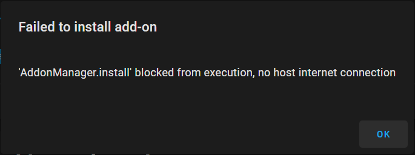

### Contexte :

* Home Assistant 2021.9.7
* HassOS 6.4
* Raspberry Pi 4

### Cause possible :

Il y a un problème d'accès à Internet.

### Solution proposée :

Assurez-vous que vos configurations sont correctement effectuées : <https://apical.xyz/fiches/home_assistant_au_coeur_de_votre_systeme_domotique/configurer_l_acces_au_reseau_dans_home_assistant>.

## 60.8 Erreur Z-Wave JS « Server version is incompatible » {#fiche-erreur_z-wave_js_server_version_is_incompatible}

### Problème :

Après une mise à jour de Home Assistant, lorsque vous accédez à l'écran Configuration / Intégrations, la tuile Z-Wave JS affiche le message « Réessayer la configuration: Z-Wave JS Server version is incompatible: 1.10.6 a version is required that supports at least api schema 10 ».

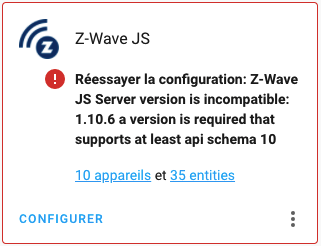

### Contexte :

* Home Assistant 2021.10.6
* HassOS 6.4
* Raspberry Pi 4

### Cause possible :

L'intégration nécessite un ajustement puisqu'il y a une incompatibilité entre la version installée dans Home Assistant 2021.9.7 et 2021.10.6.

### Solution proposée :

Patientez, la mise à jour n'a propablement pas eu le temps de terminer tous les ajustements. Tout devrait rentrer dans l'ordre sous peu.

## 60.9 Erreur incompréhensible dans configuration.yaml {#fiche-erreur_incomprehensible_dans_configuration_yaml}

### Problème :

Après avoir modifié un fichier de configuration dans Home Assistant, une validation de la configuration affiche un message qui ne semble pas avoir de sens, par exemple « Error loading /config/configuration.yaml: while scanning a simple key in "/config/configuration.yaml", line 19, column 1, could not find expected ':' in "/config/configuration.yaml", line 20, column 1 »

ou encore « Integration error: - Integration ' ' not found. »

### Contexte :

* Home Assistant 2021.10.6
* HassOS 6.4
* Raspberry Pi 4

### Cause possible :

Vous avez copié le code à partir d'internet et des caractères spéciaux ont suivi, par exemple des espaces insécables à la place de simples espaces.

Ces caractères sont d'ailleurs illustrés à l'écran par des petits rectangles de couleur.

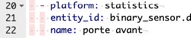

### Solution proposée :

Effacez tous les caractères spéciaux.

## 60.10 scp ne fonctionne pas alors qu'il est possible de se brancher via ssh {#fiche-scp_ne_fonctionne_pas_alors_qu_il_est_possible_de_se_brancher_via_ssh}

### Problème :

Lorsque vous tentez de copier un fichier entre Home Assistant et votre ordinateur à l'aide de la commande scp, vous obtenez le message  « kex\_exchange\_identification: read: Connection reset by peer. Connection reset by 192.168.1.145 port 22 ».

Pourtant, vous pouvez vous brancher via ssh sans mot de passe. Logiquement, scp devrait aussi fonctionner.

Terminal

scp root@192.169.1.145:/chemin/fichier.extension /dossierlocal  
kex\_exchange\_identification: read: Connection reset by peer  
Connection reset by 192.168.1.145 port 22

### Contexte :

* Home Assistant 2021.10.6
* HassOS 6.4
* Raspberry Pi 4

### Cause possible :

Vous travaillez dans le module complémentaire Terminal & SSH, ce qui ne vous offre pas les fonctionnalités souhaitées.

Vous savez que vous êtes dans le module complémentaire quand l'invite de commande est [core-ssh ~]$.

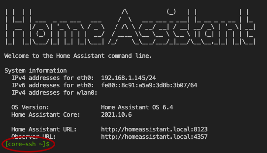

### Solution proposée :

Lancez la commande scp directement dans une fenêtre Terminal sur votre ordinateur.

La commande utilisera les mêmes clés SSH que la commande ssh. (voir <https://apical.xyz/fiches/home_assistant_au_coeur_de_votre_systeme_domotique/installation_de_home_assistant_et_premier_acces#ssh>).

## 60.11 Erreur « sqlite3: command not found » {#fiche-erreur_sqlite3_command_not_found}

### Problème :

Lorsque vous tentez d'accéder à la base de données de Home Assistant, vous obtenez le message  « bash: sqlite3: command not found ».

Terminal

sqlite3 /mnt/data/supervisor/homeassistant/home-assistant\_v2.db  
bash: sqlite3: command not found

### Contexte :

* Home Assistant 2021.10.6
* HassOS 6.4
* Raspberry Pi 4

### Cause possible :

Vous travaillez dans le module complémentaire Terminal & SSH, ce qui ne vous offre pas les fonctionnalités souhaitées.

Vous savez que vous êtes dans le module complémentaire quand l'invite de commande est [core-ssh ~]$.

### Solution proposée :

Branchez-vous au Raspberry Pi à l'aide de la commande ssh afin d'avoir accès à toutes les fonctionnalités disponibles.

Voir <https://apical.xyz/fiches/home_assistant_au_coeur_de_votre_systeme_domotique/se_brancher_a_home_assistant_via_ssh>.

Vous pourrez ensuite accéder à la base de données à l'aide de la commande sqlite3. Voir <https://apical.xyz/fiches/la_base_de_donnees_home_assistant/contenu_de_la_base_de_donnees_de_home_assistant>.

## 60.12 Option pour vérifier les configurations non disponible {#fiche-option_pour_verifier_les_configurations_non_disponible}

### Problème :

Lorsque vous vous rendez dans le menu Configuration / Contrôle du serveur, l'option qui permet de vérifier les configurations n'est pas disponible.

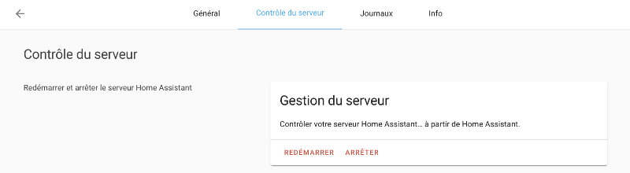

### Contexte :

* Home Assistant 2021.10.6
* HassOS 6.4
* Raspberry Pi 4

### Cause possible :

Le mode avancé n'a pas été activé pour vous.

### Solution proposée :

Si vous détenez les droits d'administration, cliquez sur votre nom au bas de la colonne de gauche puis activez le mode avancé.

Sinon, un administrateur devra se rendre dans le menu Configuration / Personnes pour l'activer pour vous.

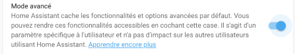

Une fois cette configuration réalisée, retournez dans le menu Configuration / Contrôle du serveur.

Le bouton Vérifier la configuration devrait être disponible.

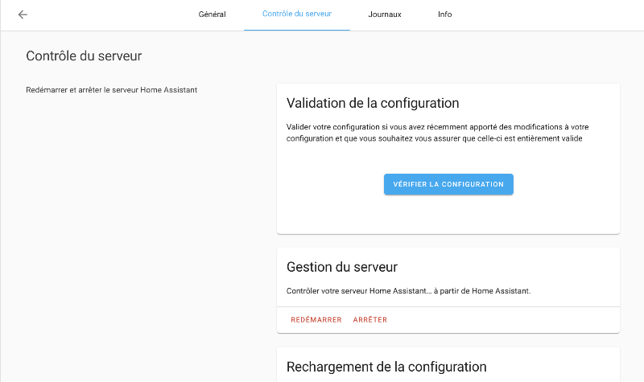

## 60.13 Erreur « Unknown error, see supervisor » {#fiche-erreur_unknown_error_see_supervisor}

### Problème :

Lorsque vous effectuez une action quelconque dans Home Assistant, vous obtenez le message « Error: Unknown error, see supervisor ».

Par exemple, j'ai obtenu ceci en effectuant un ha core restart.

### Contexte :

* Home Assistant 2021.10.6
* HassOS 6.4
* Raspberry Pi 4

### Cause possible :

Quelque chose s'est mal passé. Les causes peuvent être nombreuses...

### Solution proposée :

Pour cerner la cause de l'erreur, faites afficher le fichier journal du Supervisor.

Terminal

ha supervisor logs

Parfois, un simple redémarrage du système règle le problème.

## 60.14 Erreur « Entité non disponible actuellement » {#fiche-erreur_entite_non_disponible_actuellement}

### Problème :

Lorsque vosu accédez au tableau de bord de Home Assistant, la tuile d'une des entités montre le message « Entité non disponible actuellement ».

Par exemple, j'ai obtenu ceci en effectuant un ha core restart.

### Contexte :

* Home Assistant 2021.10.6
* HassOS 6.4
* Raspberry Pi 4

### Cause possible :

Il y a un conflit entre la version de l'entité et la version de Home Assistantou de HassOS.

### Solution proposée :

Pour voir si des mises à jour sont en attente, rendez-vous dans le menu Supervisor / Système.

Les mises à jour en attente seront affichées. Par exemple, si une mise à jour du Core de Home Assistant est en attente :

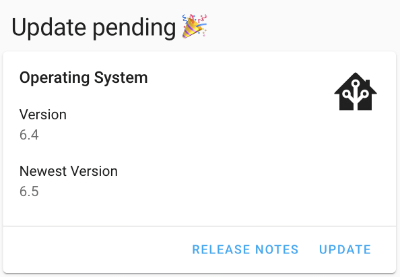

Cliquez sur Update pour effectuer la mise à jour.

### Autre cause possible :

La date du système n'est pas à jour, ce qui invalide le certificat SSL qui permet d'accéder à un service externe.

### Solution proposée :

Ajustez l'heure en suivant les conseils sur cette fiche : <https://apical.xyz/fiches/home_assistant/ajuster_la_date_et_l_heure_de_home_assistant>.

## 60.15 Erreur « Unknown error occured » {#fiche-erreur_unknown_error_occured}

### Problème :

Lorsque vous tentez de configurer l'intégration Tuya dans Home Assistant, vous obtenez l'erreur « Unknown error occured ».

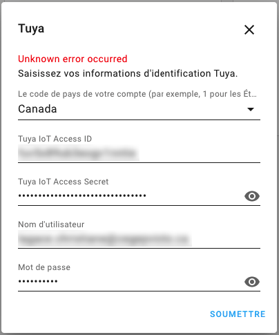

### Contexte :

* Home Assistant 2021.10.6
* HassOS 6.4
* Raspberry Pi 4

### Cause possible :

La date du système n'est pas à jour, ce qui invalide le certificat SSL qui permet d'accéder à un service externe.

Pour mieux cibler le problème et savoir si c'est votre cas, rendez-vous dans le menu Configuration / Journaux et recherchez-y un message qui parle de Tuya.

Dans mon installation, j'ai trouvé ceci :

Résultat à l'écran

Error handling request  
2 février 2021, 14:46:14 – (ERREUR) components/tuya/config\_flow.py

Un clic sur cette erreur donne plus de détails.

Résultat à l'écran

Logger: aiohttp.server  
Source: components/tuya/config\_flow.py:74  
First occurred: 2 février 2021, 14:46:14 (1 occurrences)  
Last logged: 2 février 2021, 14:46:14

 

Error handling request  
Traceback (most recent call last):  
 File "/usr/local/lib/python3.9/site-packages/urllib3/connectionpool.py", line 699, in urlopen  
 httplib\_response = self.\_make\_request(  
 File "/usr/local/lib/python3.9/site-packages/urllib3/connectionpool.py", line 382, in \_make\_request  
 self.\_validate\_conn(conn)  
 File "/usr/local/lib/python3.9/site-packages/urllib3/connectionpool.py", line 1010, in \_validate\_conn  
 conn.connect()  
 File "/usr/local/lib/python3.9/site-packages/urllib3/connection.py", line 416, in connect  
 self.sock = ssl\_wrap\_socket(  
 File "/usr/local/lib/python3.9/site-packages/urllib3/util/ssl\_.py", line 449, in ssl\_wrap\_socket  
 ssl\_sock = \_ssl\_wrap\_socket\_impl(  
 File "/usr/local/lib/python3.9/site-packages/urllib3/util/ssl\_.py", line 493, in \_ssl\_wrap\_socket\_impl  
 return ssl\_context.wrap\_socket(sock, server\_hostname=server\_hostname)  
 File "/usr/local/lib/python3.9/ssl.py", line 500, in wrap\_socket  
 return self.sslsocket\_class.\_create(  
 File "/usr/local/lib/python3.9/ssl.py", line 1040, in \_create  
 self.do\_handshake()  
 File "/usr/local/lib/python3.9/ssl.py", line 1309, in do\_handshake  
 self.\_sslobj.do\_handshake()  
ssl.SSLCertVerificationError: [SSL: CERTIFICATE\_VERIFY\_FAILED] certificate verify failed: certificate is not yet valid (\_ssl.c:1129)

 

...

C'est ici que j'ai réalisé que la date du système était en cause.

### Solution proposée :

Ajustez l'heure en suivant les conseils sur cette fiche : <https://apical.xyz/fiches/home_assistant/ajuster_la_date_et_l_heure_de_home_assistant>.

## 60.16 Erreur Z-Wave JS « Réessayer la configuration: Cannot connect to host » {#fiche-erreur_z-wave_js_reessayer_la_configuration_cannot_connect_to_host}

### Problème :

Lorsque vous accédez à l'écran Configuration / Intégrations, la tuile Z-Wave JS affiche le message « Réessayer la configuration: Cannot connect to host core-zwave-js:3000 ssl:default [Connect call failed ('172.30.33.0', 3000)] ».

Ceci fait en sorte que la clé USB Z-Wave n'est plus capable de communiquer avec vos périphériques.

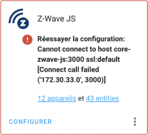

### Contexte :

* Home Assistant 2021.11.4
* HassOS 6.5
* Raspberry Pi 4

### Cause possible :

Un problème est survenu pendant le démarrage de Home Assistant, possiblement dû à une mise à jour.

### Solution proposée :

Redémarrez le système, tout devrait rentrer dans l'ordre.

## 60.17 Erreur Z-Wave JS « Réessayer la configuration: None » {#fiche-erreur_z-wave_js_reessayer_la_configuration_none}

### Problème :

Lorsque vous accédez à l'écran Configuration / Intégrations, la tuile Z-Wave JS affiche le message « Réessayer la configuration: None ».

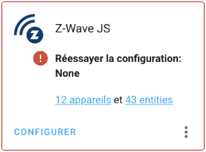

### Contexte :

* Home Assistant 2021.11.4
* HassOS 6.5
* Raspberry Pi 4

### Cause possible :

La clé USB Z-Wave n'est pas branchée au Raspberry Pi.

### Solution proposée :

Branchez la clé puis redémarrez le système.

## 60.18 Erreur Z-Wave JS « Réessayer la configuration: Failed to get the Z-Wave JS add-on info » {#fiche-erreur_reessayer_la_configuration_failed_to_get_the_z-wave_js_add-on_info}

### Problème :

Lorsque vous accédez à l'écran Paramètres / Appareils et services / onglet Intégrations, la tuile Z-Wave JS affiche le message « Réessayer la configuration: Failed to get the Z-Wave JS add-on info: Addon core\_zwafe\_js with version latest does not exist in the store ».

Ceci fait en sorte que la clé USB Z-Wave n'est plus capable de communiquer avec vos périphériques.

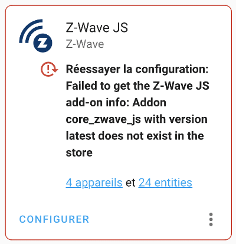

### Contexte :

* Home Assistant 2022.10.4
* HassOS 9.2
* Raspberry Pi 4

### Cause possible :

Le réseau est lent ou il contient des règles qui empêchent Home Assistant d'accéder à tout ce dont il a besoin.

### Solution proposée :

Essayez de vous brancher à un autre réseau. Souvent, un réseau câblé offre une plus grande stabilité.

## 60.19 Erreur Tuya « Échec de la configuration » {#fiche-erreur_tuya_Echec_de_la_configuration}

### Problème :

Lorsque vous accédez à l'écran Configuration / Intégrations, la tuile Tuya affiche le message « Tuya Échec de la configuration. Vérifier les journaux » ou, en anglais « Tuya Failed to set up. Check the logs ».

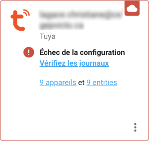

Un clic sur le lien vers les journaux affiche ceci :

Résultat à l'écran

Logger: homeassistant.config\_entries  
Source: components/tuya/\_\_init\_\_.py:66  
First occurred: 08:02:52 (1 occurrences)  
Last logged: 08:02:52

 

Error setting up entry mon.nom@mondomaine.com for tuya  
  
Traceback (most recent call last):  
  File "/usr/src/homeassistant/homeassistant/config\_entries.py", line 304, in async\_setup  
    result = await component.async\_setup\_entry(hass, self) # type: ignore  
  File "/usr/src/homeassistant/homeassistant/components/tuya/\_\_init\_\_.py", line 66, in async\_setup\_entry  
    hass.data[DOMAIN].pop(entry.entry\_id)  
KeyError: '72aa04c596019d1d5ace2615ecdab696'

### Contexte :

* Home Assistant 2021.11.4
* HassOS 6.5
* Raspberry Pi 4

### Cause possible :

Un problème réseautique empêche Home Assistant de communiquer correctement avec les serveurs de Tuya.

### Solution proposée :

Contactez votre gestionnaire de réseau.

### Autre cause possible :

Vous avez effectué une mise à jour de Home Assistant et la nouvelle mise à jour a une incompatibilité avec l'intégration Tuya.

### Solution proposée :

Attendez que Tuya fasse une mise à jour.

### Autre cause possible :

Un ou plusieurs services chez Tuya IoT Platform sont expirés.

Pour savoir si c'est votre cas :

* Rendez-vous sur [https://iot.tuya.com](https://iot.tuya.com/) et authentifiez-vous.
* Rendez-vous dans le menu Cloud / My Services puis cliquez sur l'onglet Subscribed Services.

  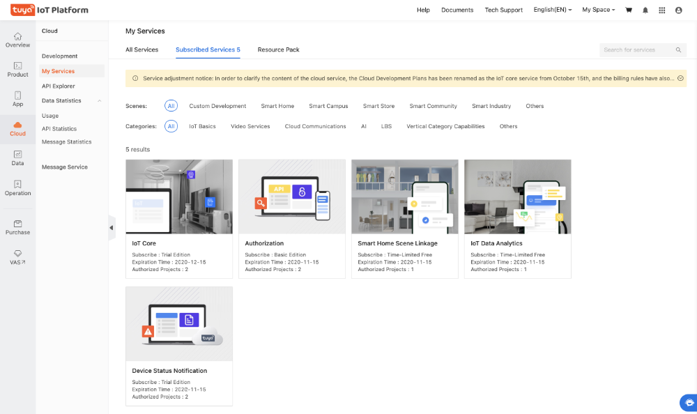
* Vérifiez la date d'expiration qui apparaît sous chacun des services.

### Solution proposée :

Vous devez vous réabonner à une édition d'essai puis créer un nouveau projet.

Pour vous réabonner :

* Rendez-vous dans Cloud / Development.
* À côté de My Cloud Projects, cliquez sur Upgrade IoT Core Plan.
* Cliquez sur Trial Edition . Assurez-vous qu'au bas de l'écran, il est indiqué que le prix est à 0.00$ puis cliquez sur Buy Now.

  

## 60.20 SSH : Erreur « Permission denied (publickey) » {#fiche-erreur_permission_denied_publickey}

### Problème :

Lorsque vous tentez d'accéder au terminal HassOS via SSH à partir d'un ordinateur Windows, vous obtenez le message  « Permission denied (publickey) ».

PowerShell

PS C:\Users\MonNom> ssh root@192.169.1.145 -p 22222  
root@192.168.1.145: Permission denied (publickey).

### Contexte :

* Windows 10
* Home Assistant 2022.9.7
* HassOS 9.0
* Raspberry Pi 4

### Cause possible :

Vous tentez de vous brancher avec le mauvais nom d'usager.

### Solution proposée :

Vous devez utiliser l'usager root.

Terminal

ssh root@192.168.1.145 -p 22222

### Autre cause possible :

Le fichier authorized\_keys n'utilise pas le bon encodage. Ce pourrait être le cas notamment si vous avez utilisé le bloc notes de Windows pour le créer.

### Solution proposée :

Supprimez le fichier authorized\_keys de la clé USB.

Créez un nouveau fichier authorized\_keys sur la clé mais cette fois, utilisez un éditeur plus adapté à ce type de tâche, par exemple Geany.

Suivez les étapes de la section suivante pour y copier la clé publique SSH.

### Autre cause possible :

La clé publique SSH générée par votre système Windows a mal été copiée sur HassOS. Ceci peut arriver si vous avez utilisé la redirection (caractère >) pour copier la clé publique sur la clé USB :

Fenêtre Git Bash

cat /c/Users/MonNom/.ssh/id\_rsa.pub > /d/authorized\_keys

ou :

PowerShell

cat C:\Users\MonNom\.ssh\id\_rsa.pub > D:\authorized\_keys

Notamment, il peut y avoir un caractère de fin de ligne après la clé publique, ce qui empêche son bon fonctionnement.

Il peut également y avoir deux caractères identifiés par des rectangles au début du fichier authorized\_keys.

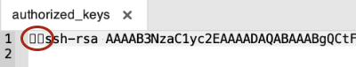

Ce sera la même chose si vous éditez le fichier authorized\_keys directement sur le Pi (vi /root/.ssh/authorized\_keys) et que vous voyez des caractères qui ressemblaient à du chinois :-o

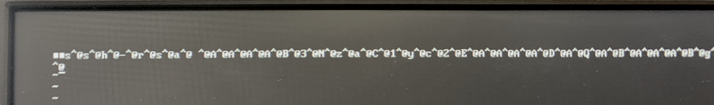

### Solution proposée :

Je vous propose deux techniques pour copier correctement la clé publique SSH sur le Pi.

La première technique est dite headless, c'est-à-dire que vous n'avez pas besoin de brancher clavier ni écran au Raspberry Pi :

* Rebranchez la clé USB sur votre ordinateur.
* Affichez le contenu du fichier id\_rsa.pub à l'écran.

  PowerShell

  cat C:\Users\MonNom\.ssh\id\_rsa.pub
* Si un fichier authorized\_keys était déjà présent sur la clé USB, détruisez-le.
* Créez un fichier texte vierge sur la clé USB dont l'encodage est UTF-8 sans BOM et nommez-le authorized\_keys (aucune extension). Attention : n'utilisez pas le bloc notes de Windows pour créer ce fichier. Utilisez un éditeur plus adapté à ce type de tâche, par exemple Geany.
* Copiez-collez dans ce fichier la clé qui a été affichée à l'aide de la commande cat.
* Branchez la clé USB sur le Raspberry Pi et redémarrez le système. Le fichier sera automatiquement copié dans le dossier /root/.ssh.

Deuxième technique (requiert clavier et écran) :

* Sur Home Assistant, installez le module complémentaire File Editor.
* À l'aide de ce module complémentaire, créez un nouveau fichier nommé authorized\_keys.
* Sur votre système Windows, à l'aide d'une fenêtre PowerShell, affichez la valeur de votre clé publique SSH.

  PowerShell

  cat C:\Users\MonNom\.ssh\id\_rsa.pub
* Dans File Editor, éditez votre nouveau fichier authorized\_keys et collez-y la valeur de la clé publique.
* Puisque File Editor n'a pas accès aux dossiers situés en dehors de la racine du site Web, vous devrez déplacer le fichier à l'aide du clavier branché au Raspberry Pi.

  Terminal HassOS

  cp /mnt/data/supervisor/homeassistant/authorized\_keys /root/.ssh

Avec l'une ou l'autre de ces techniques, vous devriez maintenant avoir accès à votre Pi via SSH.

PowerShell

ssh root@192.168.1.145 -p 22222

## 60.21 Erreur « System is not ready with state: setup » {#fiche-erreur_system_is_not_ready_with_state_setup}

### Problème :

Lorsque vous tentez d'accéder au terminal HassOS en branchant un clavier et un écran au Raspberry Pi, vous obtenez le message  « Error returned from Supervisor: System is not ready with state: setup ».

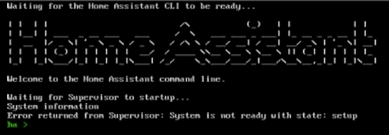

### Contexte :

* Home Assistant 2022.10.4
* HassOS 9.2
* Raspberry Pi 4

### Cause possible :

Le réseau est lent ou il contient des règles qui empêchent Home Assistant d'accéder à tout ce dont il a besoin.

Home Assistant met donc du temps avant d'être prêt.

### Solution proposée :

Patientez.

Vous pouvez entrer la commande banner à quelques reprises.

Quand le système sera prêt, vous verrez les informations sur les adresses IP apparaître comme c'est habituellement le cas.

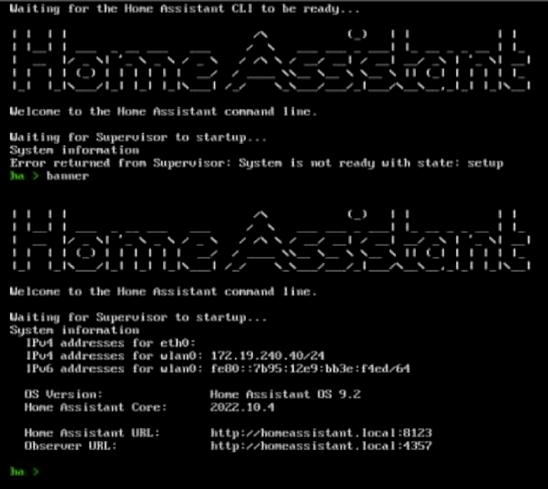

## 60.22 Erreur « Response error: 401 » {#fiche-erreur_response_error_401}

### Problème :

Lorsque vous tentez d'effectuer une opération quelconque dans l'interface Web de Home Assistant, vous obtenez le message  « Response error: 401 ».

### Contexte :

* Home Assistant 2022.10.4
* HassOS 9.2
* Raspberry Pi 4

### Cause possible :

Le navigateur a rencontré un problème avec ses cookies.

### Solution proposée :

Déconnectez-vous de Home Assistant puis reconnectez-vous.

## 60.23 Module complémentaire non trouvé {#fiche-module_complementaire_non_trouve}

### Problème :

Lorsque vous recherchez un module complémentaire que vous savez qui existe, vous obtenez le message « Aucun résultat trouvé dans Official add-ons. Aucun résultat trouvé dans ESPHome. Aucun résultat trouvé dans Home Assistant Community Add-ons. ».

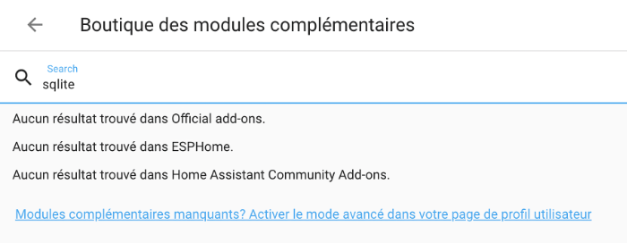

### Contexte :

* Home Assistant 2022.10.5
* HassOS 9.3
* Raspberry Pi 4

### Cause possible :

Vous n'avez pas activé le mode avancé pour l'usager avec lequel vous êtes authentifié.

### Solution proposée :

* Cliquez sur votre nom dans le bas de la colonne de gauche.
* Activez le mode avancé.

  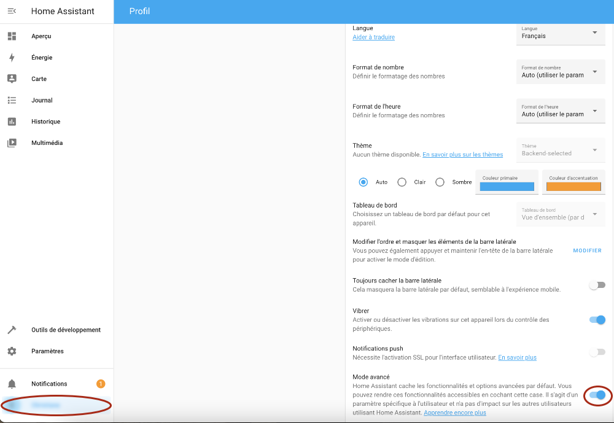
* Le module complémentaire devrait désormais être disponible.

  

## 60.24 Erreur « ERR\_CONNECTION\_REFUSED  » {#fiche-erreur_err_connection_refused}

### Problème :

Lorsque vous tentez de vous connecter à l'interface Web de Home Assistant, vous obtenez un message du genre « Ce site est inaccessible. 192.168.1.145 n'autorise pas la connexion. ERR\_CONNECTION\_REFUSED ».

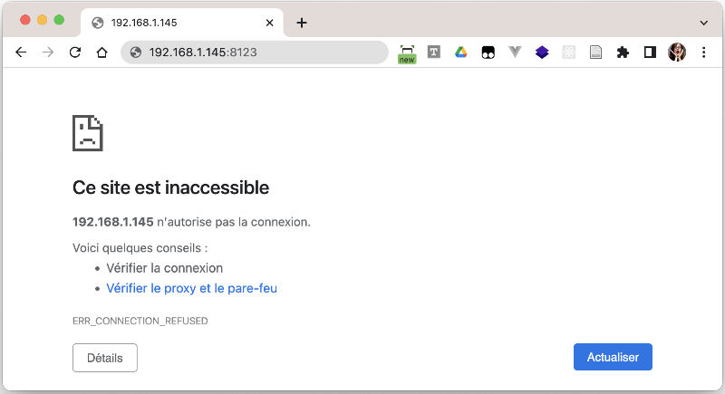

### Contexte :

* Home Assistant 2022.10.5
* HassOS 9.3
* Raspberry Pi 4

### Cause possible :

Le serveur HTTP qui permet d'accéder à l'interface Web de Home Assistant n'a pas été correctement démarré.

Ceci pourrait être dû à un fichier corrompu ou à un fichier de configuration invalide.

Pour savoir si c'est le cas :

* Accédez au Terminal HassOS via SSH ou en branchant un clavier et un écran au Raspberry Pi.
* Lancez la commande ha core restart afin de redémarrer Home Assistant, vous obtenez le message « Unknown error, see supervisor ».

  Résultat à l'écran

  # ha core restart  
  Error: Unknown error, see supervisor

Autre vérification intéressante : si vous consultez les fichiers journaux, vous voyez le message « Home Assistant has crashed! ».

Résultat à l'écran

# ha supervisor logs  
...  
22-11-07 08:12:07 INFO (MainThread) [supervisor.resolution.evaluate] Starting system evaluation with state CoreState.RUNNING  
22-11-07 08:12:08 ERROR (MainThread) [supervisor.homeassistant.core] Home Assistant has crashed!  
22-11-07 08:12:08 INFO (SyncWorker\_3) [supervisor.docker.interface] Cleaning homeassistant application  
22-11-07 08:12:08 INFO (MainThread) [supervisor.homeassistant.module] Update pulse/client.config: /data/tmp/homeassistant\_pulse  
22-11-07 08:12:09 INFO (MainThread) [supervisor.resolution.evaluate] System evaluation complete  
22-11-07 08:12:09 INFO (MainThread) [supervisor.resolution.fixup] Starting system autofix at state CoreState.RUNNING  
22-11-07 08:12:09 INFO (MainThread) [supervisor.resolution.fixup] System autofix complete  
22-11-07 08:12:09 INFO (SyncWorker\_2) [supervisor.docker.homeassistant] Starting Home Assistant ghcr.io/home-assistant/raspberrypi4-64-homeassistant with version 2022.11.1  
22-11-07 08:12:09 INFO (MainThread) [supervisor.homeassistant.core] Wait until Home Assistant is ready  
22-11-07 08:12:19 ERROR (MainThread) [supervisor.homeassistant.core] Home Assistant has crashed!  
22-11-07 08:12:19 ERROR (MainThread) [supervisor.homeassistant.core] Watchdog restart of Home Assistant failed!

### Solution proposée :

Pour en savoir plus sur ce qui cause le problème, effectuez une vérification de l'état du coeur de Home Assistant à l'aide de la commande ha core check.

Terminal

# ha core check  
Error: Testing configuration at /config  
ERROR:homeassistant.util.json:Could not parse JSON content: /config/.storage/core.device\_registry  
Traceback (most recent call last):  
  File "/usr/src/homeassistant/homeassistant/util/json.py", line 39, in load\_json  
    return orjson.loads(fdesc.read()) # type: ignore[no-any-return]  
orjson.JSONDecodeError: unexpected character: line 455 column 20 (char 12223)  
Fatal error while loading config: unexpected character: line 455 column 20 (char 12223)  
Failed config  
  General Errors:   
    - unexpected character: line 455 column 20 (char 12223)

 

Successful config (partial

Dans cet exemple, on voit que le fichier core.device\_registry contient une configuration invalide.

Je me rappelais avoir modifié ce fichier lors de ma dernière session de travail alors j'ai pu le remettre dans son état original.

Le système peut alors être redémarré à l'aide de la commande ha core restart.

## 60.25 Erreur « System is not healthy » {#fiche-erreur_system_is_not_healthy}

### Problème :

Lorsque vous tentez d'installer un module complémentaire dans Home Assistant, vous obtenez le message « Échec de l'installation de l'extension 'AddonManager.install' blocked from execution, system is not healthy - setup ».

### Contexte :

* Home Assistant 2023.9.3
* HassOS 10.5
* Raspberry Pi 4

### Cause possible :

Les causes peuvent être diverses. Pour connaître la cause exacte, rendez-vous dans le menu Paramètres / Système / Corrections.

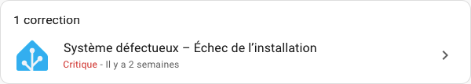

### Solution proposée :

Cliquez sur la tuile de correction. Si le message affiché n'est pas suffisant, cliquez sur le lien En savoir plus.

Parmi les solutions les plus fréquentes, tentez les opérations suivantes. Réessayez l'installation entre chacune pour savoir si le problème est réglé.

* ha core restart
* ha supervisor restart
* reboot
* Effectuer les mises à jour recommandées dans le menu Paramètres / Système / Mises à jour. Commencez par la mise à jour du Supervisor puis du système d'exploitation s'il y a lieu. Notez que selon le problème, il se peut que les mises à jour ne soient pas possibles :-(
* ha jobs options --ignore-conditions healthy
* Si le problème persiste après toutes ces actions, la solution consiste à effectuer une sauvegarde de Home Assistant, à téléverser cette sauvegarde sur l'ordinateur, à réinstaller HassOS puis Home Assistant puis à remettre la sauvegarde en place.

## 60.26 Erreur « 404: Not Found » {#fiche-erreur_404_not_found}

### Problème :

Lorsque vous tentez d'accéder à l'interface Web de Home Assistant, vous obtenez le message « 404: Not Found ».

### Contexte :

* Home Assistant 2023.10.5
* Raspberry Pi 4

### Cause possible :

Le fichier configuration.yaml n'est pas valide.

### Solution proposée :

Remettez les lignes originales en place.

Dans la version 2023.10.5, le fichier contenait les lignes suivantes :

Fichier configuration.yaml

# Loads default set of integrations. Do not remove.  
default\_config:

 

# Load frontend themes from the themes folder  
frontend:  
 themes: !include\_dir\_merge\_named themes

 

automation: !include automations.yaml  
script: !include scripts.yaml  
scene: !include scenes.yaml

## 60.27 Erreur « Échec de l'appel du service update/install » {#fiche-erreur_echec_de_l_appel_du_service_update_install}

### Problème :

Lorsque vous tentez d'effectuer une mise à jour de Home Assistant, vous obtenez le message « Échec de l'appel du service update/install. Error updating Home Assistant Operating System: 'OSManager.update' blocked from execution, supervisor needs to be updated first ».

### Contexte :

* Home Assistant 2023.11.3
* Raspberry Pi 4

### Cause possible :

Comme le message l'indique, il faut commencer par effectuer une mise à jour du Supervisor avant d'effectuer les autres modifications.

### Solution proposée :

Effectuez d'abord la mise à jour du Supervisor. Si l'option de mise à jour du Supervisor n'apparaît pas directement dans le haut de l'écran Paramètres, cliquez sur Afficher toutes les mises à jour.