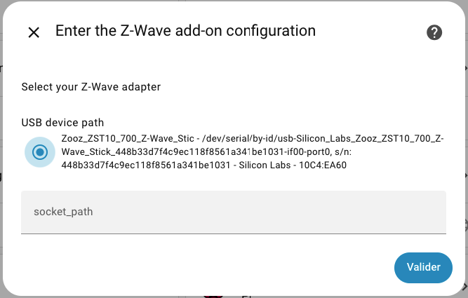
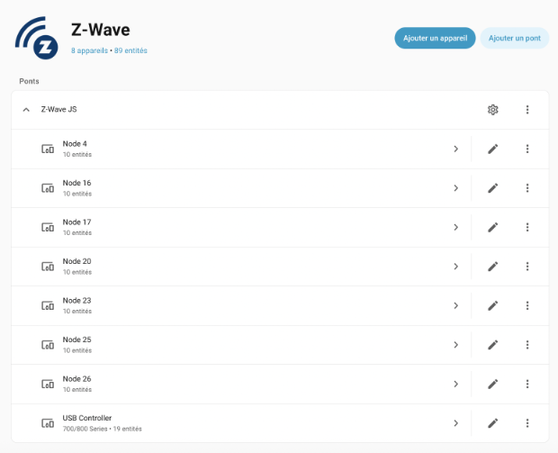
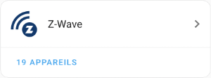
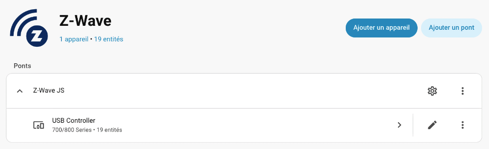
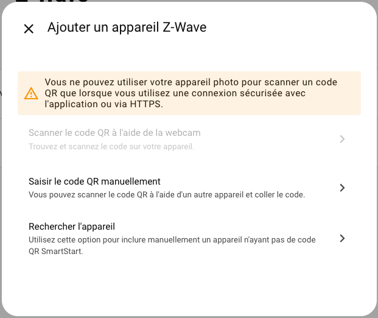
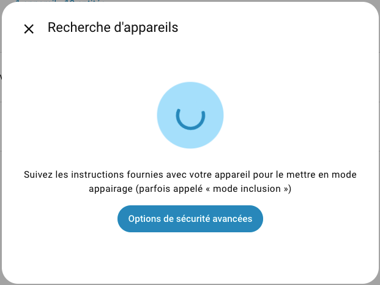
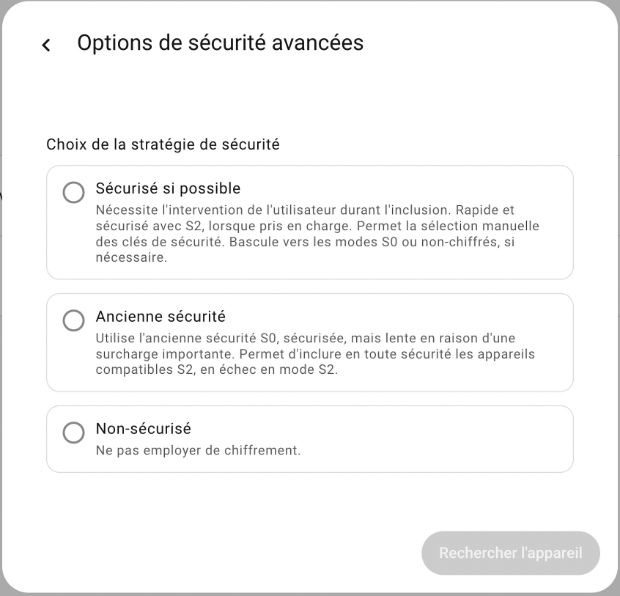
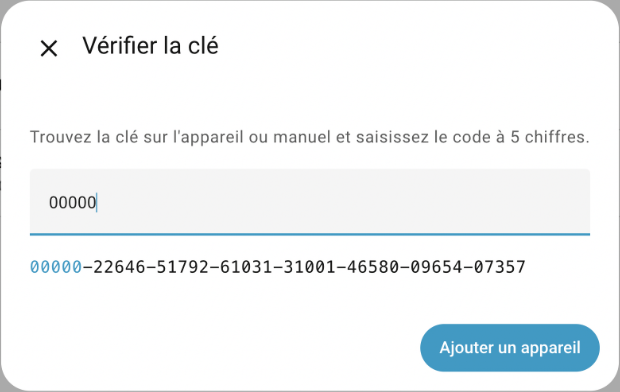
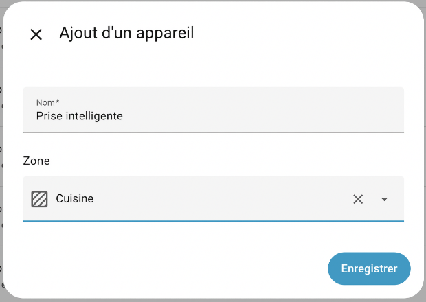
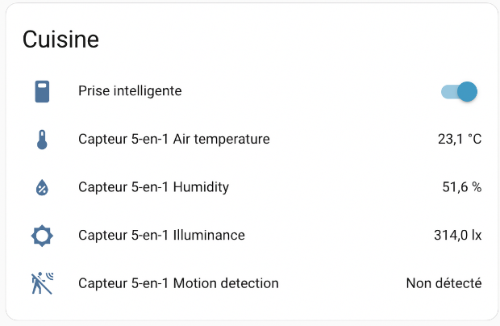

# 63. Commencer à travailler avec Home Assistant

## 63.1 En résumé...

Voici un résumé des informations essentielles du ou des prochains chapitres.

Notez que certaines fiches, qui font partie intégrante du cours, pourraient ne pas figurer dans ce résumé.

Je vous recommande d'effectuer une lecture de l'ensemble des fiches de ces chapitres afin de bien saisir les enjeux.

## <a href="fiche-configurer\_la\_cle\_usb\_z-wave\_sur\_home\_assistant.md#configurer\_la\_cle\_usb\_z-wave\_sur\_home\_assistant">configurer\_la\_cle\_usb\_z-wave\_sur\_home\_assistant</a>

Bien suivre les étapes sur cette fiche!

## <a href="fiche-ajouter\_un\_appareil\_connecte\_z-wave\_a\_home\_assistant.md#ajouter\_un\_appareil\_connecte\_z-wave\_a\_home\_assistant">ajouter\_un\_appareil\_connecte\_z-wave\_a\_home\_assistant</a>

Bien suivre les étapes sur cette fiche!

## <a href="fiche-sauvegarde\_de\_home\_assistant.md#sauvegarde\_de\_home\_assistant">sauvegarde\_de\_home\_assistant</a>

Bien suivre les étapes sur cette fiche!

## 63.2 Configurer la clé USB Z-Wave sur Home Assistant

Avant d'ajouter des périphériques Z-Wave à votre boîte domotique Home Assistant, vous devez configurer la clé USB Z-Wave.

C'est à l'aide d'une intégration que la clé USB Z-Wave sera ajoutée à Home Assistant.

Cette procédure installera deux choses :

* un module complémentaire (add-on), qui est en fait le serveur Z-Wave JS
* [l'intégration Z-Wave JS](https://www.home-assistant.io/integrations/zwave_js/), qui est en fait une fonctionnalité dans Home Assistant.

Pour configurer la clé USB Z-Wave, suivez ces étapes :

* D'abord, assurez-vous que la clé USB Z-Wave soit connectée au Raspberry Pi.
* Rendez-vous dans le menu Paramètres / Appareils et services / onglet Intégrations.
* Dans cerrtains cas, l'écran vous présentera dès le départ l'intégration [Z-Wave JS](https://www.home-assistant.io/integrations/zwave_js/). Elle apparaîtra probablement sous le nom ttyACM0 Z-Wave. Cliquez sur Configurer sur cette tuile. Effectuez l'installation recommandée (Recommanded installation). Vous n'avez aucune information à entrer, à part sélectionner le USB device path proposé.
* Si l'intégration n'apparaît pas automatiquement, vous devrez l'ajouter manuellement en cliquant sur Ajouter une intégration puis en recherchant Z-Wave. Effectuez l'installation recommandée (Recommanded installation). Vous n'avez aucune information à entrer, à part sélectionner le USB device path proposé.

  

Vous pouvez maintenant <a href="fiche-ajouter\_un\_appareil\_connecte\_z-wave\_a\_home\_assistant.md#ajouter\_un\_appareil\_connecte\_z-wave\_a\_home\_assistant">intégrer des appareils connectés Z-Wave à Home Assistant</a>.

Une fois la clé Z-Wave configurée, vous pouvez cliquer sur sa tuile pour voir les appareils qui y sont connectés.

Par défaut, vous verrez probablement une série d'appareils dont le nom débute par Node. Il s'agit d'appareils qui avaient été connectés à cette clé dans un ancien système domotique.

Ces appareils ne nuisent pas à votre système mais si vous le souhaitez, il est possible de les supprimer.

Attention : il ne faut pas supprimer celui qui s'appelle USB Controller.

Pour supprimer unappareil dont le nom débute par Node :

* Cliquez sur la ligne de l'appareil (pas sur un des icônes d'actions).
* Cliquez sur les trois points verticaux à droite de Configurer.
* Cliquez sur Supprimer.

## 63.3 Ajouter un appareil connecté Z-Wave à Home Assistant

Maintenant que <a href="fiche-configurer\_la\_cle\_usb\_z-wave\_sur\_home\_assistant.md#configurer\_la\_cle\_usb\_z-wave\_sur\_home\_assistant">la clé USB Z-Wave a été configurée</a>, il est possible d'intégrer des appareils connectés Z-Wave à Home Assistant.

* Si l'appareil a déjà été inclus dans un système domotique, il faut effectuer une réinitialisation de l'appareil (factory reset) sans quoi, il ne sera pas disponible pour une nouvelle inclusion. Consultez le manuel de l'appareil pour connaître la procédure.
* Pour inclure l'appareil dans Home Assistant, rendez-vous dans le panneau de contrôle Z-Wave : Paramètres / Appareils et services / onglet Intégrations et cliquez sur la tuile Z-Wave.

  
* Cliquez sur Ajouter un appareil.

  
* Dans l'écran qui suit, cliquez sur Rechercher l'appareil.

  
* J-Wave JS commencera la recherche d'appareils. Par défaut, il tentera de faire l'ajout en mode sécurisé et basculera automatiquement en mode non sécurisé si l'appareil ne le supporte pas. Si vous désirez modifier ce comportement, cliquez sur Options de sécurité avancées.

  
* Si vous avez cliqué sur Options de sécurité avancées, vous pouvez choisir la stratégie d'inclusion désirée.

  
* Pour que votre appareil puisse être détecté, vous devez effectuer l'opération de pairage sur l'appareil. Il s'agit généralement de cliquer sur un bouton un nombre déterminé de fois. Consultez le manuel de l'appareil pour connaître la procédure.
* Dans certains cas, vous serez invité à entrer un code de sécurité. Ce code devrait se trouver dans la documentation de l'appareil. Si l'appareil est équipé d'un écran, le code apparaîtra sur cet écran.

  Si vous n'avez pas accès au code de sécurité, entrez une série de zéros puis cliquez sur Submit.

  
* Dès que Home Assistant a tout ce qu'il lui faut, une fenêtre vous avertira que l'appareil est en cours d'interrogation.
* Vous serez ensuite invités à entrer le nom de l'appareil et à l'associer à une pièce de la maison.

  

## Tester les appareils connectés

Avant d'aller plus loin, il est intéressant de tester les capteurs et les récepteurs qui ont été ajoutés à Home Assistant.

Dans le menu Aperçu, vous pouvez voir l'état des capteurs et vous pouvez contrôler l'état des récepteurs.

Par exemple, le capteur 5-en-1 affiche les valeurs pour chacun de ses capteurs.

Si vous mettez la main dessus afin de réduire la luminosité, la valeur devrait être ajustée quasi instantannément.

La prise intelligente, quant à elle, peut être allumée ou éteinte en cliquant sur le bouton à bascule.

