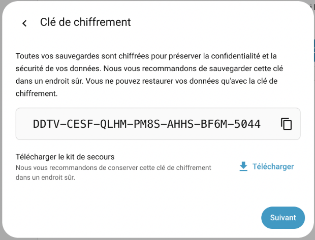
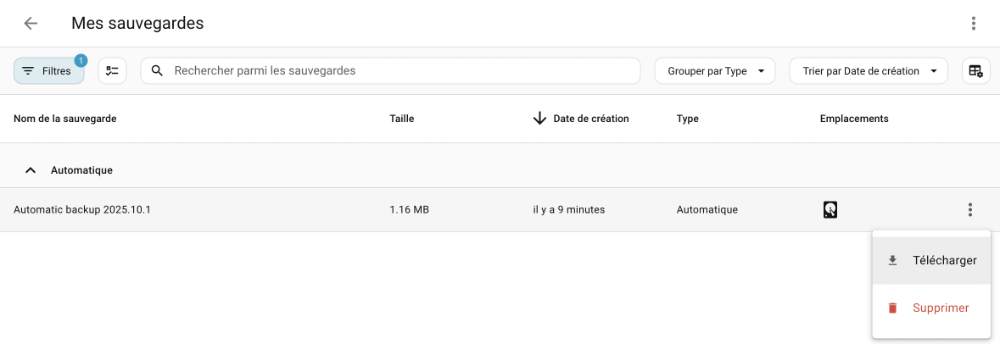
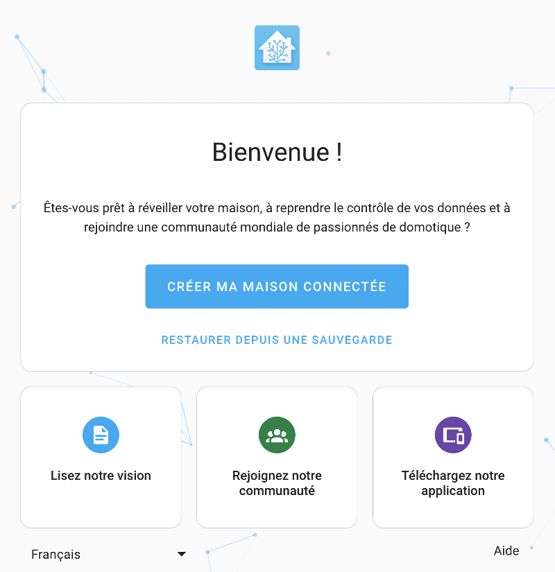
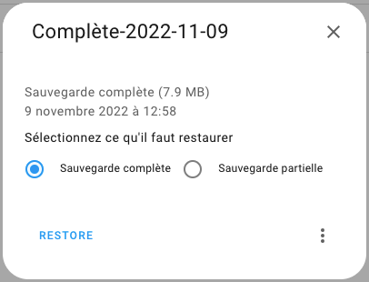
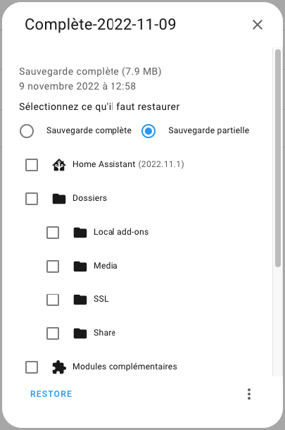
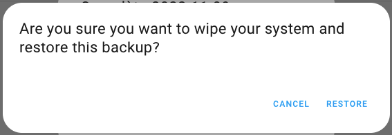

# 64. Sauvegarde de Home Assistant {#chapitre-sauvegarde_de_home_assistant}

## 64.1 Sauvegarde de Home Assistant {#fiche-sauvegarde_de_home_assistant}

Une sauvegarde Home Assistant permet de remettre le système dans l'état où il était lorsque la sauvegarde a été réalisée.

Pour créer une sauvegarde, rendez-vous dans le menu `Paramètres / Système / Sauvegardes` puis cliquez sur Sauvegarder maintenant au bas de l'écran.

Les sauvegardes Home Assistant sont protégées par une clé de chiffrement. Dans l'écran qui suit, cliquez sur Télécharger pour conserver une copie de cette clé. Placez le fichier dans un endroit sûr.



Le fichier de secours contiendra ceci :

Fichier home\_assistant\_backup\_emergency\_kit\_jj\_mm\_aaaa\_hh\_mm.txt


```
Kit de secours pour Home Assistant
Ce kit de secours contient la clé de chiffrement de vos sauvegardes. Vous avez besoin de cette clé pour pouvoir restaurer les sauvegardes de votre Home Assistant.
Date : 8 octobre 2025 à 20:15
Instance :
Maison
Adresse :
http://192.168.1.145:8123
Clé de chiffrement :
DDTV-CESF-QLHM-PM8S-AHHS-BF6M-5044
Pour plus d'informations, visitez le site https://www.home-assistant.io/more-info/backup-emergency-kit
```


Vous devez ensuite choisir entre l'option Sauvegarde automatique et Sauvegarde manuelle.

La sauvegarde automatique qui crée immédiatement une sauvegarde selon les configurations disponibles sur le premier écran de la page de sauvegarde.

La sauvegarde manuelle vous offre de modifier les configurations pour cette fois seulement.

Dans les deux cas, ceci créera un fichier de sauvegarde sur le Raspberry Pi dans le dossier /mnt/data/supervisor/backup.

La liste des sauvegardes existantes est disponible via le menu Paramètres / Système / Sauvegardes.

Elle peut également être affichée via [le terminal HassOS](66_home_assistant_au_coeur_de_votre_systeme_domotique.md#fiche-la_console_home_assistant) à l'aide de cette commande :

Terminal


```
ha backup list
```


## Placer la sauvegarde en lieu sûr {#telecharger}

Pour vous assurer de pouvoir utiliser la sauvegarde en cas de panne de votre système, le fichier de sauvegarde ne doit pas demeurer uniquement sur le Raspberry Pi.

Il faut donc le copier sur votre ordinateur.

La technique la plus simple consiste à utiliser l'interface graphique. Dans le menu `Paramètres / Système / Sauvegardes`, cliquez sur les trois points à droite de la sauvegarde désirée puis choisissez Télécharger la sauvegarde.



Vous aurez alors une copie du fichier de sauvegarde sur votre ordinateur.

## Pour plus d'information

« Home Assistant OS Common Tasks - Home Assistant OS Snapshots ». Home Assistant. <https://www.home-assistant.io/hassio/haos_common_tasks/#home-assistant-os-snapshots>

« Home Assistant Starter: Backup and Restore ». SuburbanNeerd. <https://suburbannerd.com/hassiobackup/>

## 64.2 Réinstaller Home Assistant à partir d'une sauvegarde {#fiche-reinstaller_home_assistant_a_partir_d_une_sauvegarde}

Si vous prenez soin d'effectuer régulièrement [une sauvegarde de Home Assistant](72_sauvegarde_de_home_assistant.md#fiche-sauvegarde_de_home_assistant), vous pourrez remettre le système en place rapidement en cas de problème avec votre carte micro SD.

Dans le cas où Home Assistant est encore fonctionnel, vous pouvez procéder directement à l'[étape de restauration](https://apical.xyz/formations/pageunique/systeme_domotique_diy#restauration).

S'il ne fonctionne plus du tout, vous devrez d'abord effectuer une [réinstallation](https://apical.xyz/formations/pageunique/systeme_domotique_diy#reinstallation).

## Réinstallation {#reinstallation}

* Sur votre boîte Home Assistant actuelle, [effectuez une sauvegarde complète](72_sauvegarde_de_home_assistant.md#fiche-sauvegarde_de_home_assistant).
* [Téléchargez la sauvegarde sur votre ordinateur,telecharger](72_sauvegarde_de_home_assistant.md#fiche-sauvegarde_de_home_assistant).
* Sur la carte micro SD qui contiendra une copie intégrale du système, [effectuez une nouvelle installation de Home Assistant](66_home_assistant_au_coeur_de_votre_systeme_domotique.md#fiche-installation_de_home_assistant_et_premier_acces).
* Une fois l'installation complétée, [accédez à l'interface Web de Home Assistant,acceder](66_home_assistant_au_coeur_de_votre_systeme_domotique.md#fiche-installation_de_home_assistant_et_premier_acces).
* Sur l'écran d'accueil, si Home Assistant réalise que le système n'a pas été initialisé, il vous offre soit de créer votre maison connectée, soit d'effectuer une restauration. Cliquez sur Restaurer depuis une sauvegarde.

  
* Poursuivez avec [les étapes communes pour la réinstallation et la restauration](https://apical.xyz/formations/pageunique/systeme_domotique_diy#commune).

## Restauration {#restauration}

* Alternativement, si le système avait déjà été initialisé, vous pouvez restaurer une sauvegarde à partir du menu Paramètres / Système / Sauvegardes / clic sur les trois points verticaux dans le coin supérieur droit de l'écran / Téléverser une sauvegarde.

  

## Étapes communes pour la réinstallation et la restauration {#commune}

* Retrouvez le fichier de sauvegarde sur votre ordinateur. Il s'agit d'un fichier dont le nom se termine par .tar.

* Home Assistant vous offrira alors de restaurer la sauvegarde complète ou seulement une partie de celle-ci.

  
* Si vous cliquez sur Sauvegarde partielle, Home Assistant vous demandera de choisir quelles parties vous désirez sauvegarder.

  
* Dans tous les cas, vous devrez confirmer avant de poursuivre puisque cette opération écrasera votre installation actuelle de Home Assistant.

  
* Après avoir cliqué sur Restore, vous devez patienter pendant que Home Assistant remet le tout en place. L'opération peut prendre jusqu'à 45 minutes [selon la documentation officielle](https://www.home-assistant.io/common-tasks/os/#estimated-duration).
* Pendant la restauration, il est possible de voir l'avancement des travaux [dans une fenêtre Terminal](66_home_assistant_au_coeur_de_votre_systeme_domotique.md#fiche-la_console_home_assistant) à l'aide de la commande ha supervisor logs.
* À la fin de l'opération, vous aurez votre Home Assistant tel qu'il était au moment où vous avez effectué cette sauvegarde.
* Pour vous assurer que tout soit bien réinitialisé, prenez soin de [redémarrer le système,complet](66_home_assistant_au_coeur_de_votre_systeme_domotique.md#fiche-Eteindre_home_assistant_de_facon_securitaire).

J'ai déjà vu un système qui plantait quand on tentait de téléverser une sauvegarde, probablement dû à un fichier corrompu.

Pas de problème, il est possible de téléverser la sauvegarde manuellement.

Terminal de l'ordinateur


```
scp -O -P 22222 chemin/vers/sauvegarde/sur/ordinateur/personnel root@192.168.1.145:/mnt/data/supervisor/backup/
```


Après un redémarrage de Home Assistant, la sauvegarde est visible dans Paramètres / Système / Sauvegardes. Vous pouvez cliquer sur cette sauvegarde pour accéder aux options de restauration.