# 68. Le fichier configuration.yaml {#chapitre-le_fichier_configuration_yaml}

## 68.1 Le format YAML {#fiche-le_format_yaml}

YAML est un format de représentation des données semblable à XML ou JSON.

Originalement, cet acronyme venait de Yet Another Markup Language. Ironiquement, il signifie maintenant YAml ain't Markup Language.

Le format YAML ressemble énormément au JSON. En fait, YAML est un sur-ensemble de JSON.

Alors que JSON est le champion comme format d'échange de données, YAML est le préféré pour les fichiers de configuration.

En effet, contrairement à JSON, le format YAML permet :

* l'ajout de commentaires
* les chaînes sur plusieurs lignes
* une lecture plus facile puisqu'il utilise l'indentation plutôt que les délimiteurs
* la référence à une autre section du même fichier à l'aide d'ancres
* etc.

## Structure d'un fichier YAML

Dans un fichier YAML, on retrouve une série de blocs de configuration.

On donnera un nom à chacun des blocs.

Le nom d'un bloc doit respecter ces conditions :

* Être unique
* Utiliser seulement des lettres minuscules, des chiffres et des barres de soulignement

Dans un bloc, on peut retrouver des collections dans lesquelles chaque item débute par un trait d'union.

On peut également retrouver des paires clé-valeur au format cle: valeur.

YAML

nom\_du\_bloc:  
  - item1: valeur1  
    autrecleitem1: autrevaleuritem1  
  - item2: valeur2  
    autrecleitem2: autrevaleuritem2

Il est possible d'imbriquer les collections et les paires clé-valeur. L'indentation est la seule façon pour indiquer une imbrication.

Les fichiers YAML doivent répondre à ces exigences :

* utiliser des espaces (les tabulations ne fonctionnent pas)
* délimiter le code à l'aide d'indentations (généralement 2 ou 4 espaces pour une indentation)
* la valeur booléenne vrai peut être entrée avec une de ces valeurs : True, On, Yes
* la valeur booléenne faux peut être entrée avec une de ces valeurs: False, Off, No

## Configuration sur plusieurs lignes

Lorsqu'une configuration comporte plusieurs lignes, il faut utliser l'un de ces caractères :

* | : signifie que les sauts de lignes sont importants dans ce qui suit
* > : signifie que les sauts de lignes sont remplacés par des espaces. Autrement dit, la configuration pourrait être entrée sur une seule ligne et donner le même résultat.

Dans les deux cas, on peut ajouter un trait d'union après le caractère afin d'indiquer qu'il faut enlever les sauts de ligne à la fin de la chaîne.

YAML

value\_template: >-  
    
    Ouverte  
    
    Fermée  
  

## Quelques exemples

Voici quelques exemples de fichiers de configuration YAML.

### configuration.yaml

Ce fichier est utilisé par le logiciel domotique Home Assistant.

Fichier configuration.yaml

# Configure a default setup of Home Assistant (frontend, api, etc)  
default\_config:

 

# SMTP  
notify:  
  - name: courriel\_administrateur  
    platform: smtp  
    sender: homeassistant@mondomaine.com  
    server: mail.mondomaine.com  
    timeout: 15  
    port: 587  
    encryption: starttls  
    username: homeassistant@mondomaine.com  
    password: mot\_de\_passse\_en\_clair  
    sender\_name: Home Assistant  
    recipient: destinataire@sondomaine.com  
   
# Text to speech  
tts:  
  - platform: google\_translate

 

group: !include groups.yaml  
automation: !include automations.yaml  
script: !include scripts.yaml  
scene: !include scenes.yaml

### Homestead.yaml

Ce fichier est utilisé par les développeurs Laravel pour configurer leur environnement Homestead.

Fichier Homestead.yaml

---  
ip: "192.168.10.10"  
memory: 2048  
cpus: 1  
provider: virtualbox

 

authorize: ~/.ssh/id\_rsa.pub

 

backup: true

 

keys:  
    - ~/.ssh/id\_rsa

 

folders:  
    - map: ~/Documents/CodeLaravel  
      to: /home/vagrant/code

 

sites:  
    - map: monsite.test  
      to: /home/vagrant/code/monsite/public  
      php : "7.4"  
    - map: autresite.test  
      to: /home/vagrant/code/autresite/public  
   
databases:  
    - homestead

## Pour plus d'information

« YAML ». Wikipédia. <https://fr.wikipedia.org/wiki/YAML>

« YAML ». yaml.org. <https://yaml.org/>

« Why JSON isn't a good configuration language ». Lucidchart. <https://www.lucidchart.com/techblog/2018/07/16/why-json-isnt-a-good-configuration-language/>

« YAML idiosyncrasies ». SaltStack. <https://docs.saltstack.com/en/latest/topics/troubleshooting/yaml_idiosyncrasies.html>

« YAML Style Guide ». Home Assistant. <https://developers.home-assistant.io/docs/documenting/yaml-style-guide/>

« YAML Multiline ». YAML Multiline. <https://yaml-multiline.info/>

« YAML Ain’t Markup Language (YAML™) version 1.2 - Scalars ». yaml.org. <https://yaml.org/spec/1.2.2/#23-scalars>

## 68.2 Travailler avec le module complémentaire File editor {#fiche-travailler_avec_le_module_complementaire_file_editor}

Il existe quelques modules complémentaires qui permettent d'éditer des fichiers à partir de l'interface graphique de Home Assistant.

Parmi ceux-ci, notons File Editor et Studio Code Server.

Je vous montre ici comment installer File Editor.

## Avantages de File Editor

* Très rapide à charger

## Inconvénients

* Comme tout autre éditeur disponible à partir de l'interface Web de Home Assistant, File Editor ne peut éditeur que les fichiers du dossier config (sous HassoS : /mnt/data/supervisor/homeassistant) et de ses sous-dossiers
* Ne fonctionne pas s'il n'y a pas accès à Internet (Home Assistant pourrait être utilisé avec un Intranet seulement)

## Installation

Pour l'installer, rendez-vous dans le menu Paramètres / Modules complémentaires puis cliquez sur Boutique des modules complémentaires au bas de l'écran.

Dans la zone de recherche, tapez File editor.

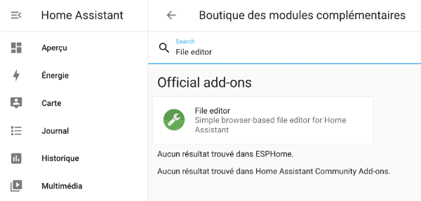

Cliquez sur la tuile du module complémentaire puis, dans l'écran suivant, cliquez sur Installer.

Une fois le module installé, cliquez sur Démarrer.

Le module complémentaire est prêt à être utilisé. Vous pourrez revenir à cet écran à tout moment à partir de l'option de menu Paramètres / Modules complémentaires / Clic sur la tuile File editor.

Pour un accès plus rapide, vous pouvez activer l'option Ajouter à la barre latérale.

## Édition d'un fichier

Pour éditer un fichier, cliquez sur Ouvrir l'interface utilisateur Web dans le coin inférieur droit.

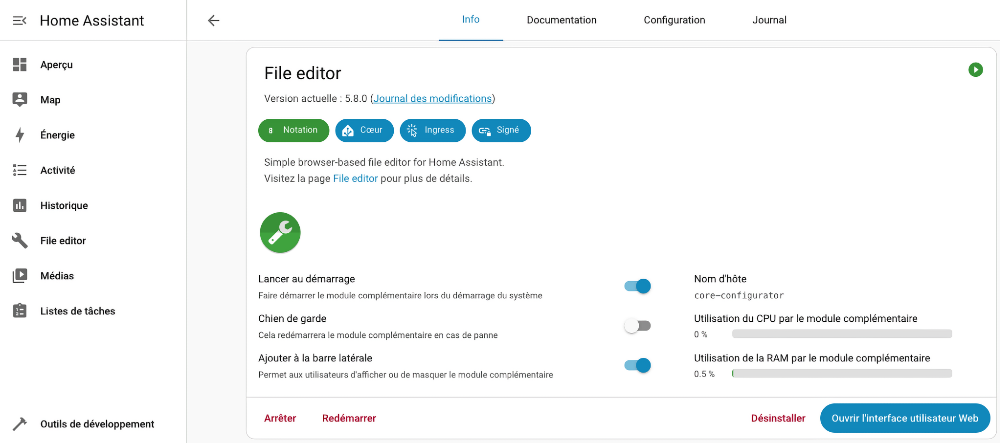

Vous avez maintenant atteint l'écran qui permet d'ouvrir le fichier de votre choix à l'aide de l'icône de chemise, à gauche de la barre bleue.

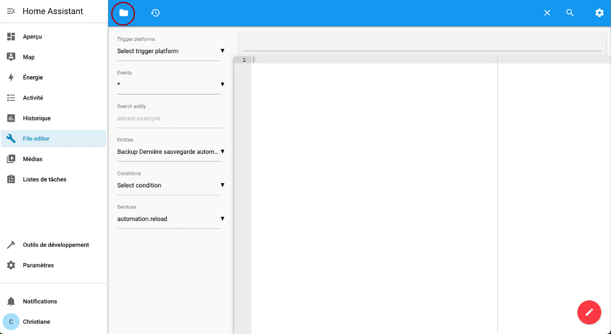

Note : pour afficher les fichiers du dossier .storage dans File Editor :

* Rendez-vous dans le menu Paramètres / Modules complémentaires / Tuile File editor / onglet Configuration.
* Au-dessus de la zone Ignore Pattern, enlever .storage.

Dans une prochaine fiche, je vous explique comment utiliser File editor pour éditer le fichier configuration.yaml.

## 68.3 Travailler avec le module complémentaire Studio Code Server {#fiche-travailler_avec_le_module_complementaire_studio_code_server}

Il existe quelques modules complémentaires qui permettent d'éditer des fichiers à partir de l'interface graphique de Home Assistant.

Parmi ceux-ci, notons File Editor et Studio Code Server.

Je vous montre ici comment installer Studio Code Server.

## Avantages de Studio Code Server

* Fonctionne même s'il n'y a pas accès à Internet (Home Assistant pourrait être utilisé avec un Intranet seulement)
* Coloration syntaxique
* Très configurable

## Inconvénients

* Lent à charger
* Comme tout autre éditeur disponible à partir de l'interface Web de Home ASsistant, Studio Code Server ne peut éditeur que les fichiers du dossier config (sous HassoS : /mnt/data/supervisor/homeassistant) et de ses sous-dossiers

## Installation

Pour l'installer, rendez-vous dans le menu Paramètres / Modules complémentaires puis cliquez sur Boutique des modules complémentaires au bas de l'écran.

Dans la zone de recherche, tapez Studio Code Server.

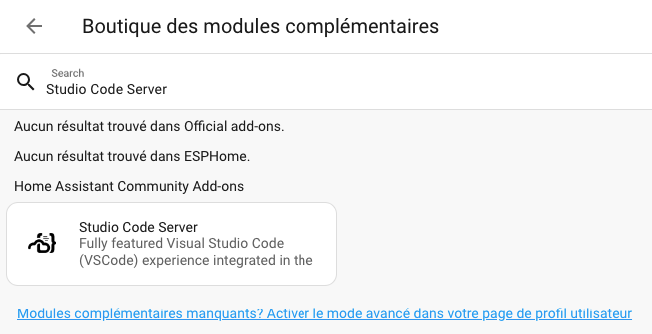

Cliquez sur la tuile du module complémentaire trouvé puis, dans l'écran suivant, cliquez sur Installer.

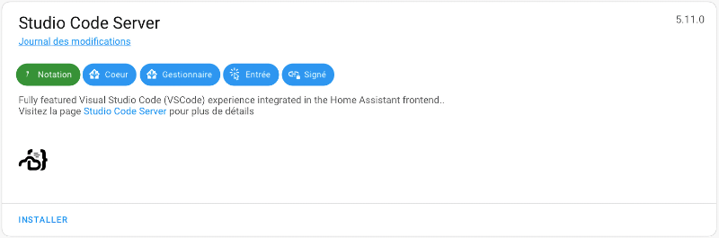

Une fois le module installé, cliquez sur Démarrer.

Le module complémentaire est prêt à être utilisé. Vous pourrez revenir à cet écran à tout moment à partir de l'option de menu Paramètres / Modules complémentaires / Clic sur la tuile Studio Code Server.

## Édition d'un fichier

Pour éditer un fichier, cliquez sur Ouvrir l'interface utilisateur Web dans le coin inférieur droit.

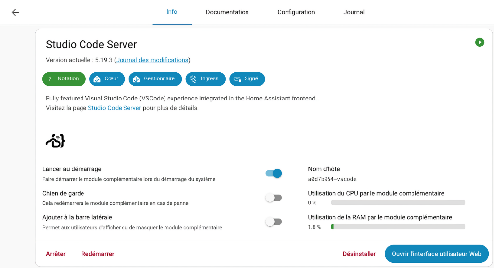

Vous avez maintenant atteint l'écran qui permet d'ouvrir le fichier de votre choix à partir de la zone Explorer.

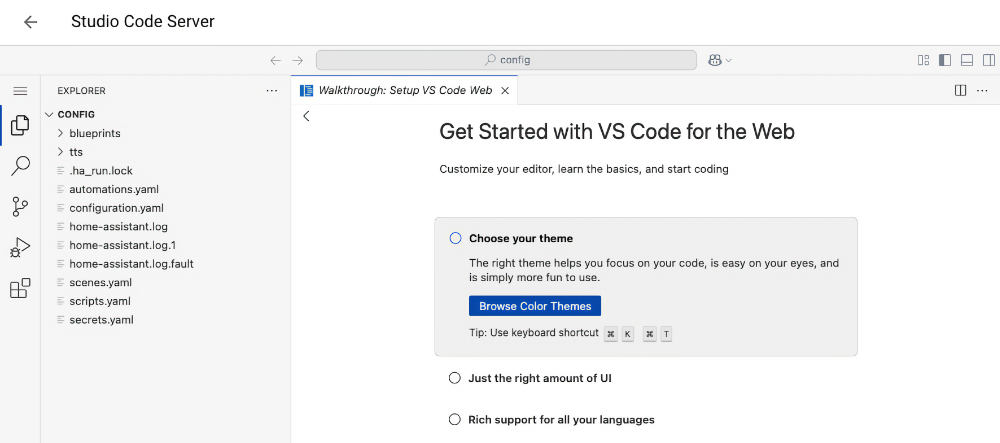

Par défaut, le module ne présente pas de barre de menu. Pour la faire apparaître, cliquez sur l'icône Customize Layout puis choisissez Menu Bar.

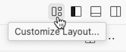

## 68.4 Éditer le fichier configuration.yaml {#fiche-Editer_le_fichier_configuration_yaml}

Le fichier configuration.yaml permet d'effectuer une foule de configurations dans Home Assistant.

Physiquement, il est placé dans le dossier /mnt/data/supervisor/homeassistant/configuration.yaml. Mais il est plus simple de travailler dans l'interface Web pour y accéder.

Pour l'éditer, ouvrez l'extension File editor ou Studio Code Server.

Cette démonstration est réalisée à l'aide de File editor.

Cliquez sur l'icône de chemise à gauche de la barre bleue.

Par défaut, l'extension présente les fichiers du dossier /mnt/data/supervisor/homeassistant (aussi appelé dossier config). C'est justement là que se trouve notre fichier.

Cliquez sur le fichier configuration.yaml.

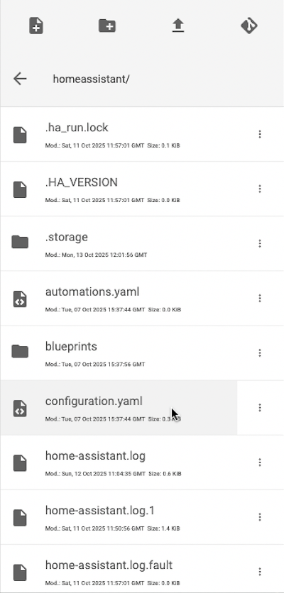

Voici le contenu initial de ce fichier.

Fichier configuration.yaml

# Loads default set of integrations. Do not remove.  
default\_config:

 

# Load frontend themes from the themes folder  
frontend:  
  themes: !include\_dir\_merge\_named themes

 

automation: !include automations.yaml  
script: !include scripts.yaml  
scene: !include scenes.yaml

## Chargement des configurations par défaut

La toute première ligne du fichier, default\_config:, permet de charger [les configurations par défaut de Home Assistant](https://www.home-assistant.io/integrations/default_config/).

## Chargement d'autres fichiers YAML

Afin de ne pas surcharger le fichier configuration.yaml, il est possible d'écrire des configurations dans d'autres fichiers YAML et de les inclure ici.

C'est ce qui est fait par défaut avec les fichiers automations.yaml, scripts.yaml et scenes.yaml.

## Ajout de configurations

Il est possible d'ajouter des instructions dans le fichier configuration.yaml, notamment pour :

* ajouter des capteurs virtuels
* effectuer des configurations pour pouvoir envoyer du courriel
* effectuer des configurations  pour s'abonner à un canal MQTT
* etc.

Chacune des configurations doit être placée dans une section avec un nom unique.

Voici, par exemple, comment ajouter un capteur virtuel qui simule une porte pouvant être ouverte ou fermée.

Le code peut être ajouté à différents endroits dans le fichier. J'ai choisi ici de l'ajouter au bas des instructions existantes.

Fichier configuration.yaml

input\_boolean:  
  porte\_virtuelle:  
    name: Porte virtuelle  
    icon: mdi:door

Puisque le nom de la section doit être unique, ceci n'est pas valide :

Fichier configuration.yaml

input\_boolean:  
  porte\_virtuelle:  
    name: Porte virtuelle  
    icon: mdi:door  
input\_boolean:  
  ventilateur\_virtuel:  
    name: Ventilateur virtuel  
    icon: mdi:fan

Lorsque plusieurs configurations doivent faire partie d'une même section, il faut plutôt faire ceci :

Fichier configuration.yaml

input\_boolean:  
  porte\_virtuelle:  
    name: Porte virtuelle  
    icon: mdi:door  
  ventilateur\_virtuel:  
    name: Ventilateur virtuel  
    icon: mdi:fan

N'oubliez pas d'enregistrer vos modifications en cliquant sur l'icône de disquette dans le haut de l'écran ou en appuyant sur Ctrl+S (Windows) ou ⌘ Cmd+S (macOS).

La couleur rouge indique que les modifications n'ont pas été enregistrées.

## Vérification des configurations

Avant de poursuivre, il est important de vérifier votre travail.

Suivez les conseils « validation\_des\_configurations » pour vous assurer que vos configurations sont valides.

## Pour que les configurations soient prises en compte {#rechargement}

La plupart des modifications au fichier de configuration nécessiteront un rechargement des configurations : Outils de développement / onglet YAML / Section Rechargement de la configuration YAML.

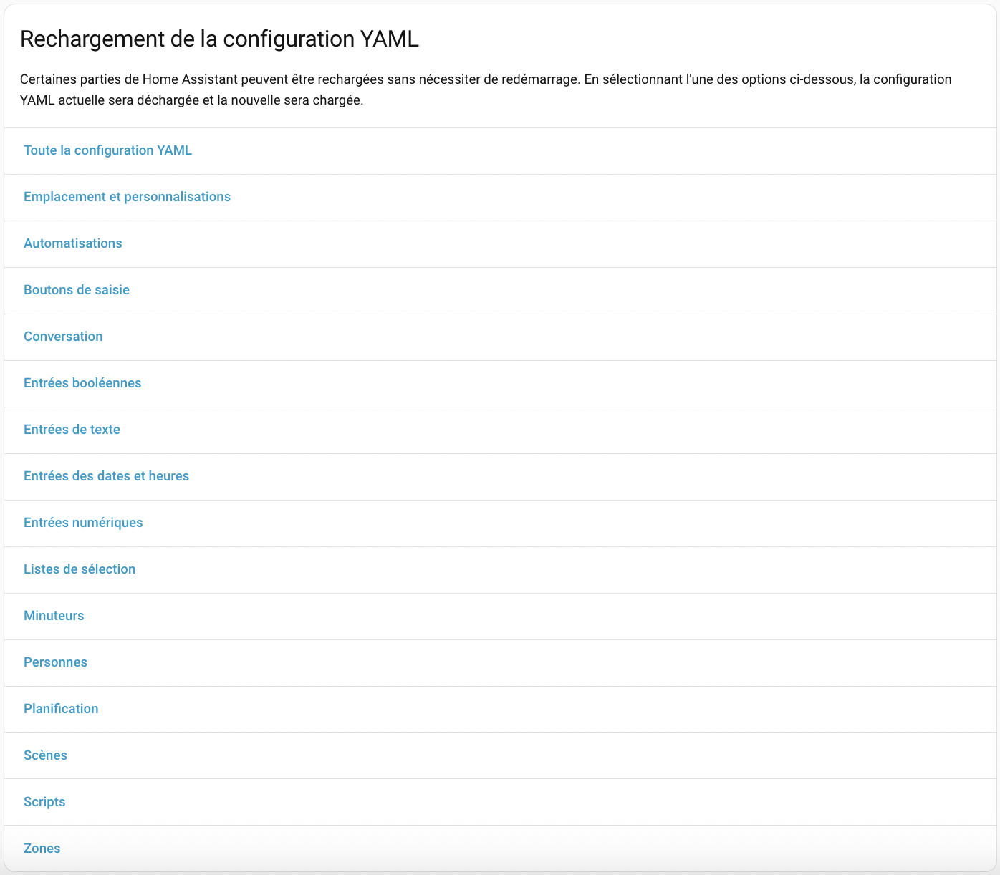

Parfois, un redémarrage de Home Assistant sera nécessaire : Paramètres / Système / Clic sur l'icône de démarrage dans le haut de l'écran / Redémarrer Home Assistant.

## Pour plus d'information

« Advanced Configuration ». Home Assistant. <https://www.home-assistant.io/getting-started/configuration/>

« Default Config ». Home Asssistant. <https://www.home-assistant.io/integrations/default_config/>

« Troubleshooting your configuration ». Home Assistant. <https://www.home-assistant.io/docs/configuration/troubleshooting/#problems-with-the-configuration>

« Home Assistant configuration YAML (The beginners guide) ». Siytek. <https://siytek.com/home-assistant-configuration-yaml-beginners-guide/>

## 68.5 Validation des configurations {#fiche-validation_des_configurations}

Une fois vos configurations en place dans le fichier configuration.yaml, il faut s'assurer que le tout soit valide avant de poursuivre.

Si vous essayez un redémarrage alors que le fichier de configuration n'est pas valide, Home Assistant ne le permettra pas.

Dans cette impression d'écran, on voit qu'il manque le symbole deux-points (:) à la ligne 12.

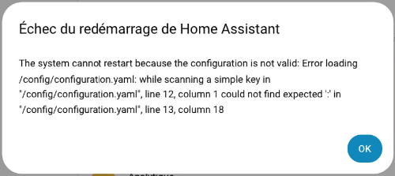

## Interface graphique - bouton de validation

Il est possible de valider la configuration à tout moment à partir de l'interface graphique de Home Assistant.

Rendez-vous dans le menu Outils de développement / YAML puis cliquez sur le bouton Vérifier la configuration.

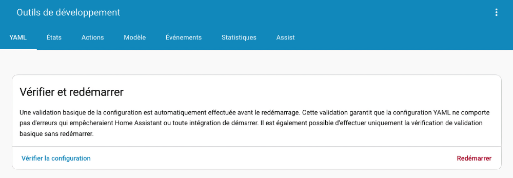

Si les configurations sont valides, vous verrez apparaître le message « La configuration n'empêchera pas Home Assistant de redémarrer! ».

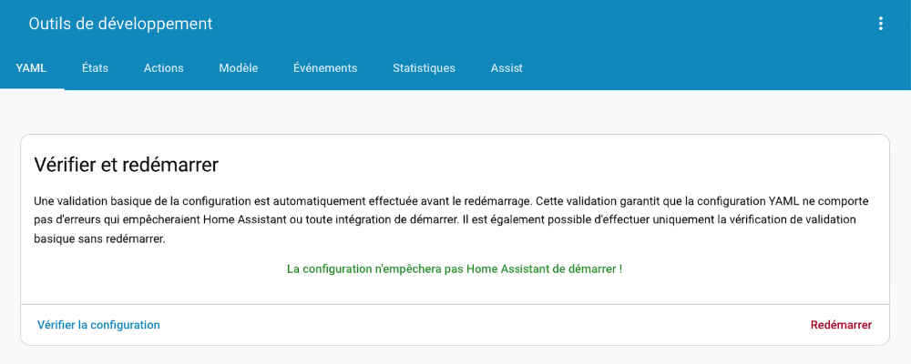

S'il y a des erreurs, vous verrez plutôt les mots « Configuration non valide! » avec une explication de l'erreur.

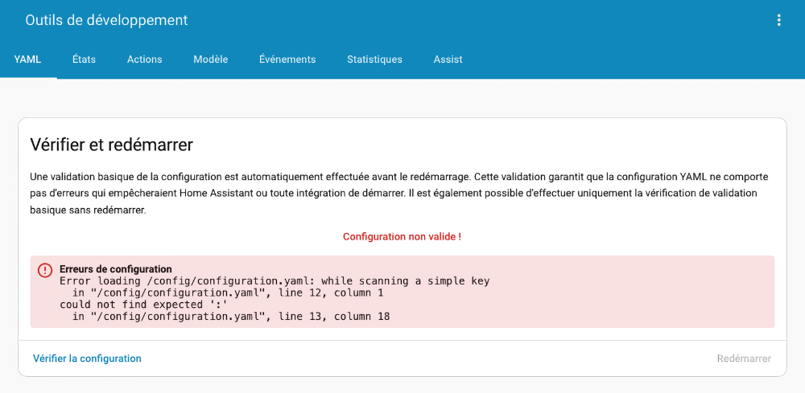

## Interface graphique - lors du démarrage

Home Assistant vérifie automatiquement la validité des configuration quand le système démarre.

S'il trouve des erreurs, il ajoute une pastille à côté du menu Notifications.

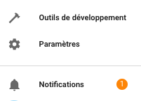

Un clic sur cette pastille nous confirme que la notification concerne une erreur de configuration.

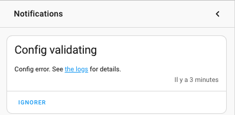

## Console Home Assistant {#consoleha}

Le fichier de configurations peut également être validé à la console Home Assistant.

Entrez la commande suivante :

Terminal HassOS

ha core check

Si les configurations sont valides, vous obtiendrez le message « Command completed successfully ».

Résultat à l'écran

# ha core check  
Processing... Done.

 

Command completed successfully.

En cas d'erreur, vous obtiendrez plutôt un message d'erreur.

Résultat à l'écran

# ha core check  
Processing... Done.

 

Error: Testing configuration at /config  
  
ERROR:annotatedyaml.loader:while scanning a simple key  
 in "/config/configuration.yaml", line 12, column 1  
could not find expected ':'  
 in "/config/configuration.yaml", line 13, column 18  
Fatal error while loading config: while scanning a simple key  
 in "/config/configuration.yaml", line 12, column 1  
could not find expected ':'  
 in "/config/configuration.yaml", line 13, column 18  
Failed config  
 General Errors:   
 - while scanning a simple key  
 in "/config/configuration.yaml", line 12, column 1  
could not find expected ':'  
 in "/config/configuration.yaml", line 13, column 18

 

Successful config (partial)

## Validateur YAML

Les validateurs YAML permettent d'effectuer l'analyse syntaxique (parse) de votre code YAML afin de vous aider à trouver ce qui ne va pas.

Il en existe plusieurs, par exemple :

* <http://yaml-online-parser.appspot.com/>
* <https://codebeautify.org/yaml-validator>
* <http://www.yamllint.com/>

Ces validateurs se concentrent sur la syntaxe YAML mais ils ne sont pas en mesure de vérifier si les configurations sont conformes à ce que Home Assistant s'attend.