# 75. Le soleil et la météo sous Home Assistant {#chapitre-le_soleil_et_la_meteo_sous_home_assistant}

## 75.1 Météo par défaut dans Home Assistant {#fiche-meteo_par_defaut_dans_home_assistant}

L'installation initiale de Home Assistant inclut une carte météo dans le menu Aperçu.

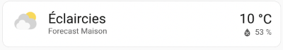

Cette météo est disponbible grâce à l'intégration Meteorologisk institutt.

On peut d'ailleurs voir la tuile de l'intégration dans le menu Paramètres / Appareils et services / onglet Intégrations.

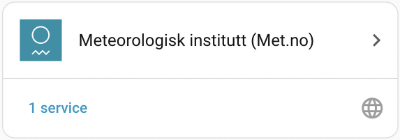

Pour <a href="fiche-la\_meteo\_dans\_les\_automatisations.md#la\_meteo\_dans\_les\_automatisations">utiliser ces prévisions météorologiques dans des automatisations</a>, vous travaillerez avec [l'entité Weather](https://www.home-assistant.io/integrations/weather/).

Le nom précis de l'entité sera sous la forme weather.forecast\_xxx comme déclencheur ou comme condition, selon vos besoins. Les xxx seront remplacés par le nom que vous avez donné à votre boîte Home Assistant.

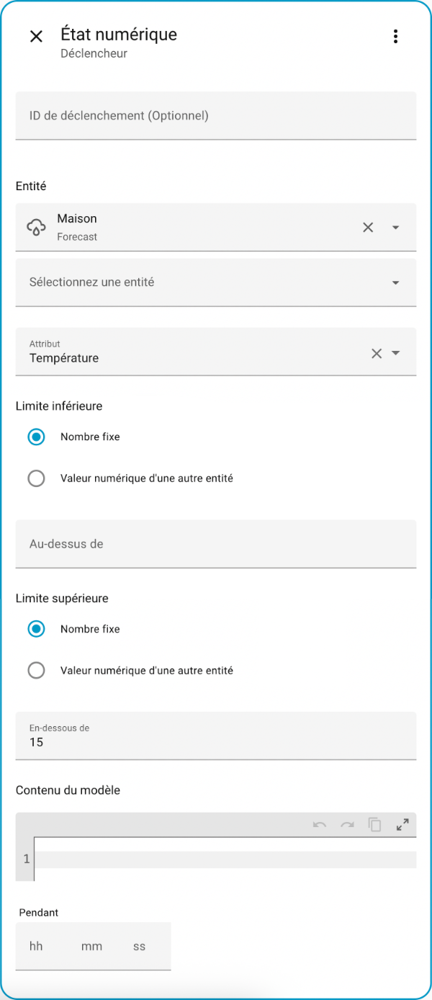

## 75.2 Service OpenWeatherMap {#fiche-service_openweathermap}

Les données météo peuvent être utilisées dans votre boîte domotique pour déclencher différentes actions, par exemple démarrer le chauffage quand la température extérieure est inférieure à 20 oC.

Ces données peuvent provenir de [OpenWeatherMap](https://openweathermap.org/guide). Il s'agit d'un service météo qui comporte un volet gratuit. Au moment d'écrire ces lignes, la version gratuite permettait une utilisation suffisante pour un système domotique, soit 60 requêtes par minute ou 1 000 000 requêtes par mois.

## Obtenir la clé de l'API OpenWeatherMap

Vous devrez avoir une clé pour accéder à ces données.

* Rendez-vous sur le [site d'OpenWeatherMap](https://home.openweathermap.org/users/sign_up) et enregistrez-vous.
* Une fois votre compte créé, rendez-vous dans votre profil. L'option API keys vous donnera la clé à utiliser pour intégrer le service dans votre système domotique. Notez qu'il peut y avoir un délai avant que la clé soit activée chez OpenWeatherMap.

  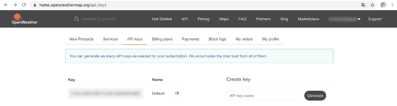

## 75.3 Travailler avec l'intégration OpenWeatherMap {#fiche-travailler_avec_l_integration_openweathermap}

Il est intéressant d'utiliser les données météo dans les automatisations Home Assistant.

Les <a href="fiche-meteo\_par\_defaut\_dans\_home\_assistant.md#meteo\_par\_defaut\_dans\_home\_assistant">données météo par défaut</a> de Home Assistant peuvent être utilisées directement sans nécessiter de configuration spécifique.

Si vous préférez, il est possible d'utiliser les données météo de [OpenWeatherMap](https://openweathermap.org/guide). Cette intégration offre des informations supplémentaires, par exemple les prévisions horaires.

La fiche « <a href="fiche-service\_openweathermap.md#service\_openweathermap">service\_openweathermap</a> » donne les instructions pour obtenir la clé API requise (gratuit).

## Ajouter OpenWeatherMap à Home Assistant

Pour avoir accès aux données météo OpenWeatherMap dans Home Assistant :

* Rendez-vous dans Paramètres / Appareils et services.
* Cliquez sur l'onglet Intégrations.
* Cliquez sur Ajouter une intégration.
* Dans la zone de recherche, tapez « weather » puis choisissez OpenWeatherMap.

  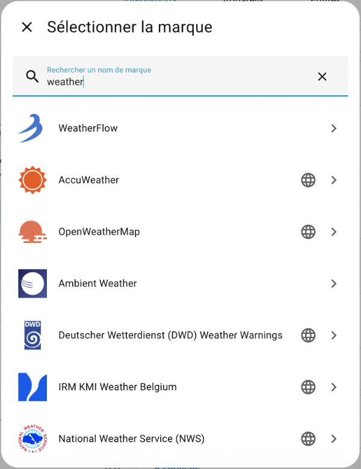

## Configuration d'OpenWeatherMap

Remplissez les informations demandées pour l'intégration d'OpenWeatherMap.

* La valeur entrée dans la case Nom, qui contient par défaut la valeur OpenWeatherMap, sera utilisée <a href="fiche-qu\_est-ce\_qu\_une\_entite.md#qu\_est-ce\_qu\_une\_entite">dans l'identifiant des entités créées</a>.
* Pour trouver la latitude et la longitude de l'endroit pour lequel vous désirez avoir la météo, vous pouvez utiliser Google Maps. Un clic droit sur l'endroit recherché affichera les coordonnées. Un clic sur ces coordonnées les copiera dans le presse-papier.

  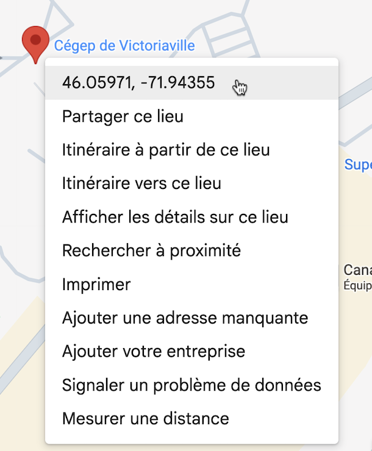
* Entrez votre clé API OpenWeatherMap.
* Vous devez choisir quel mode utiliser. Certains modes nécessitent un abonnement payant, d'autres sont gratuits. Référez-vous à la [documentation sur l'intégration OpenWeatherMap](https://www.home-assistant.io/integrations/openweathermap/) pour en savoir plus.

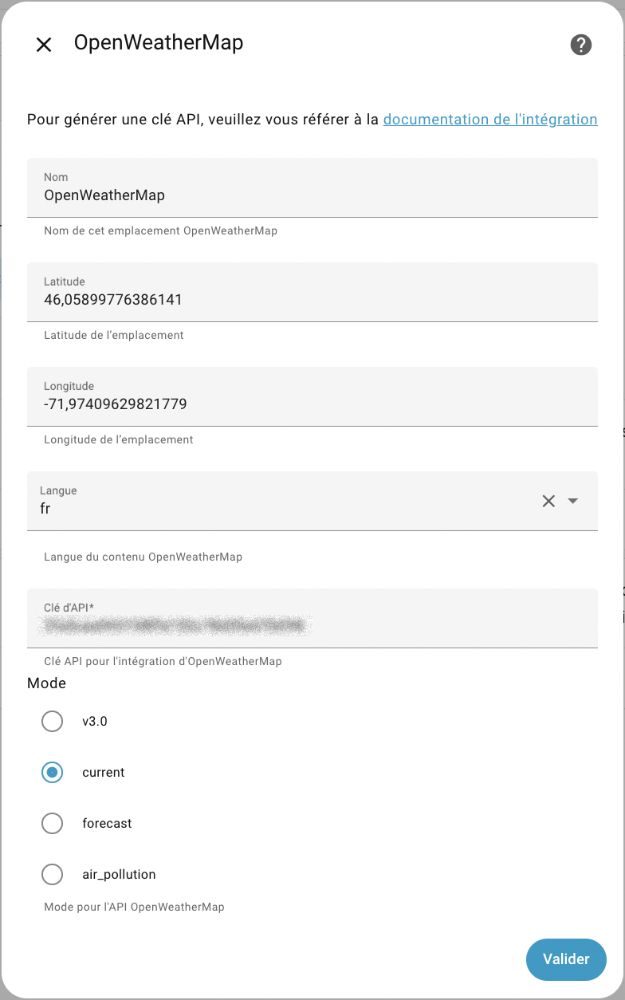

Voici la tuile OpenWeatherMap ainsi obtenue :

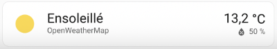

## Utiliser OpenWeatherMap

Pour <a href="fiche-la\_meteo\_dans\_les\_automatisations.md#la\_meteo\_dans\_les\_automatisations">utiliser ces prévisions météorologiques dans des automatisations</a>, vous travaillerez avec l'entité weather.openweathermap ou une de ses sous-entités, par exemple sensor.openweathermap\_temperature comme déclencheur ou comme condition, selon vos besoins.

 Notez que le nom exact dépend de ce que vous avez inscrit dans la case Nom (ici : openweathermap) lorsque vous avez ajouté l'intégration OpenWeatherMap à Home Assistant.

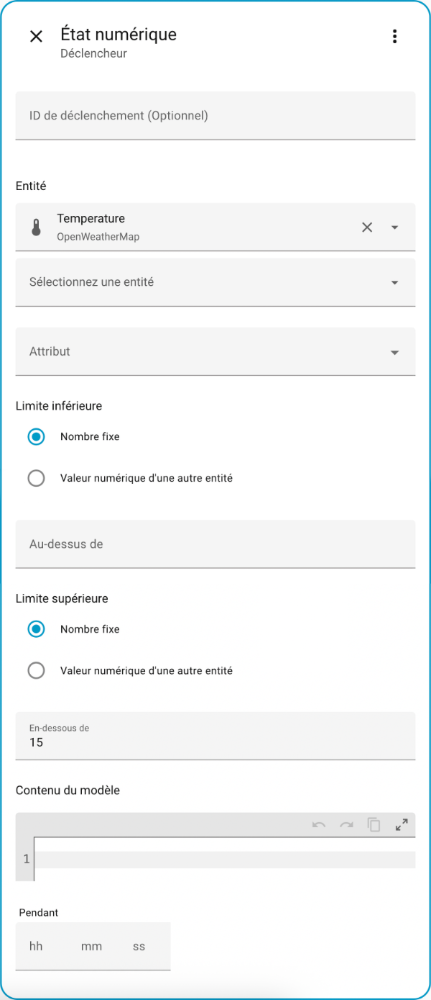

## 75.4 La météo dans les automatisations {#fiche-la_meteo_dans_les_automatisations}

Les conditions météorologiques peuvent être utilisées dans une automatisation comme déclencheur ou comme condition selon vos besoins.

Ces données peuvent provenir <a href="fiche-meteo\_par\_defaut\_dans\_home\_assistant.md#meteo\_par\_defaut\_dans\_home\_assistant">de l'intégration ajoutée automatiquement lors de l'installation de Home Assistant</a> ou encore d'une autre intégration à votre choix, par exemple <a href="fiche-travailler\_avec\_l\_integration\_openweathermap.md#travailler\_avec\_l\_integration\_openweathermap">OpenWeatherMap</a>.

Si la condition est utilisée comme déclencheur, il faut comprendre que l'action n'aura lieu que lorsque la condition atteindra la valeur indiquée, par exemple lorsque la température DEVIENDRA inférieure à 10 oC.

Si la condition est utilisée comme condition, Home Assistant vérifiera la valeur au moment ou l'automatisation est déclenchée.

## 75.5 L'intégration Sun {#fiche-l_integration_sun}

[L'intégration Sun](https://www.home-assistant.io/integrations/sun/) est disponible par défaut dans Home Assistant. Elle permet de réagir à la position du soleil, par exemple :

* soleil levé : above\_horizon
* soleil couché : below\_horizon

Elle permet aussi de connaître différents états, par exemple :

* en train de se lever : rising
* date et heure du prochain lever de soleil : next\_rising
* date et heure du prochain coucher de soleil : next\_setting

## Déclencheur

Pour créer une automatisation dont le déclencheur est lié au soleil, vous devez choisir Ajouter un déclencheur / Heure et lieu / Soleil.

Ceci permettra de déclencher l'automatisation au moment où le soleil se lève ou au moment où il se couche.

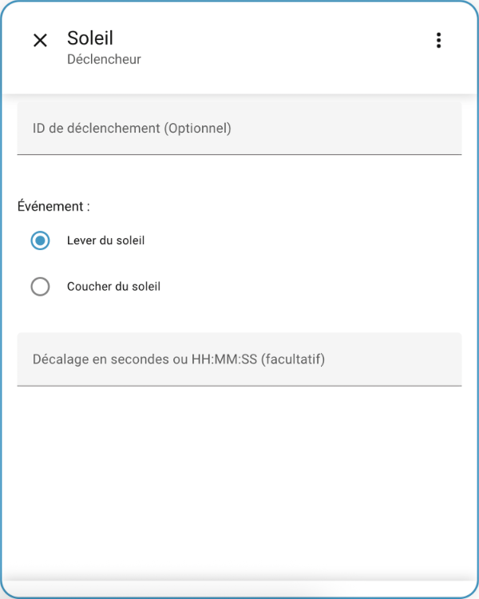

## Condition

[Le soleil peut également être utilisé dans une condition](https://www.home-assistant.io/docs/scripts/conditions/#sun-condition).

Différentes techniques permettent d'y arriver.

Dans ce premier exemple, la condition est définie en passant par Entité / État puis en sélectionnant l'entité sun.sun.

Il est ainsi possible de faire en sorte que l'action n'ait lieu que si le soleil est au-dessus de l'horizon ou sous l'horizon au moment du déclenchement.

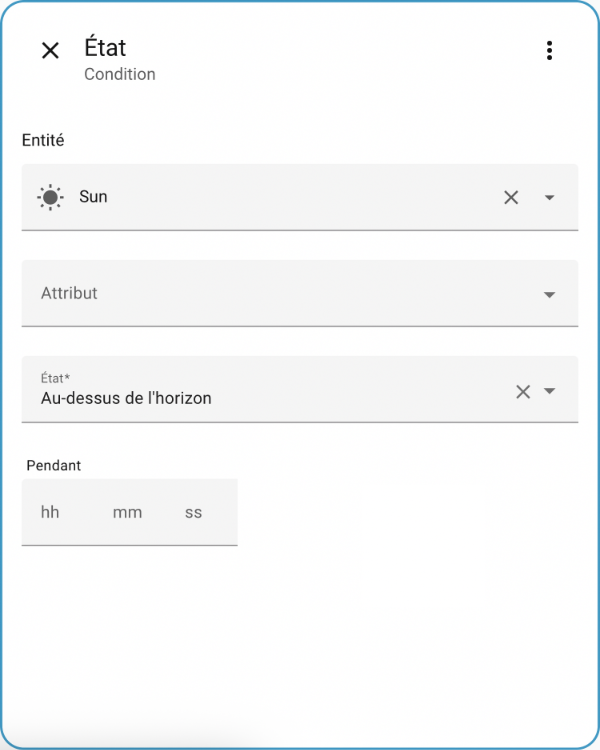

Dans ce deuxième exemple, la condition est définie en sélectionnant Heure et lieu / Soleil.

Pour bien régler la condition, il est important de comprendre que pour chaque option, une des balises est minuit.

Il est possible de choisir une seule option ou d'en combiner deux, par exemple :

* Si on choisit seulement Avant le lever du soleil, l'action n'aura lieu que s'il est entre minuit et le lever du soleil.

  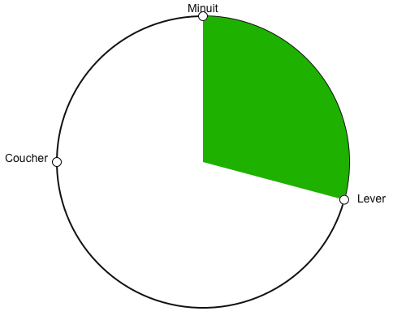
* Si on choisit seulement Avant le coucher du soleil, l'action n'aura lieu que s'il est entre minuit et le coucher du soleil.
* Si on choisit seulement Après le lever du soleil, l'action n'aura lieu que s'il est entre le lever du soleil et minuit.
* Si on choisit seulement Après le coucher du soleil, l'action n'aura lieu que s'il est entre le coucher du soleil et minuit.
* Si on choisit Avant le coucher du soleil et Après le lever du soleil, l'action n'aura lieu que s'il est entre le lever et le coucher du soleil.

  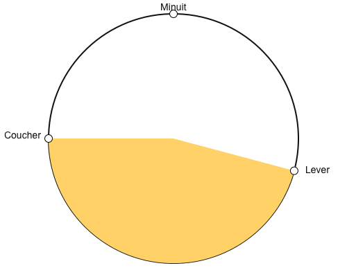

Ceci est clairement indiqué dans la documentation officielle de Home Assistant[1](https://www.home-assistant.io/docs/scripts/conditions/#sunsetsunrise-condition) :

> Note that if only before key is used, the condition will be true from midnight until sunrise/sunset. If only after key is used, the condition will be true from sunset/sunrise until midnight. If both before: sunrise and after: sunset keys are used, the condition will be true from midnight until sunrise and from sunset until midnight. If both after: sunrise and before: sunset keys are used, the condition will be true from sunrise until sunset.

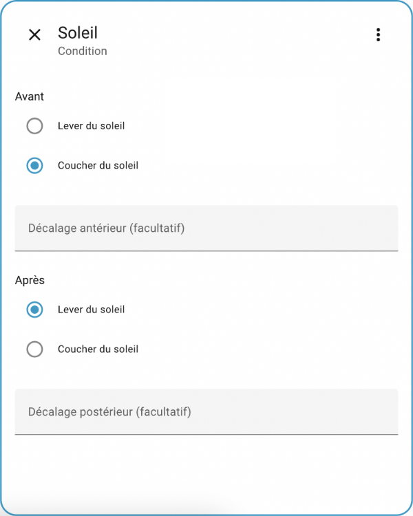

## Source

1. « Conditions ». Home Assistant. <https://www.home-assistant.io/docs/scripts/conditions/#sunsetsunrise-condition>

## Pour plus d'information {#prenomnomfamille}

« Sun condition ». Home Assistant. <https://www.home-assistant.io/docs/scripts/conditions/#sun-state-condition>