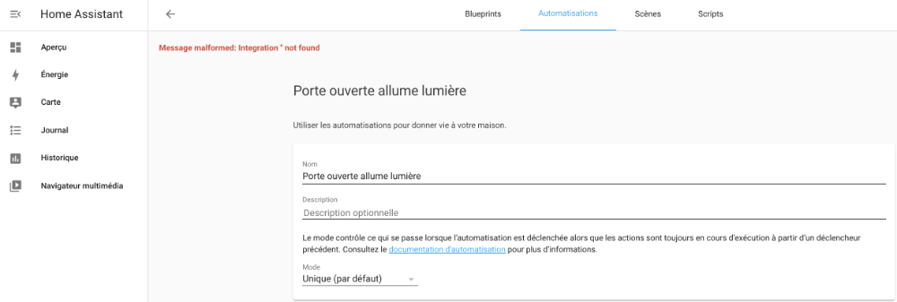

# 76. Dépannage sur les automatisations (troubleshooting) {#chapitre-depannage_sur_les_automatisations_troubleshooting}

## 76.1 Erreur « Message malformed: Integration '' not found » {#fiche-erreur_message_malformed_integration_not_found}

### Problème :

Lorsque vous tentez d'enregistrer une automatisation dans Home Assistant, vous obtenez le message  « Message malformed: Integration '' not found ».

### Contexte :

* Home Assistant 2021.10.6
* HassOS 6.4
* Raspberry Pi 4

### Cause possible :

Vous tentez d'enregistrer une automatisation qui n'a pas de déclencheur et/ou d'action.

### Solution proposée :

Fournissez le déclencheur et l'action avant de tenter de sauvergarder l'automatisation.

## 76.2 Automatisation ne s'enregistre pas {#fiche-automatisation_ne_s_enregistre_pas}

### Problème :

Lorsque vous tentez d'enregistrer une automatisation à partir de l'interface graphique de Home Assistant, vous n'obtenez aucun message d'erreur mais l'automatisation n'apparaît pas dans la liste des automatisations.

### Contexte :

* Home Assistant 2021.10.6
* HassOS 6.4
* Raspberry Pi 4

### Cause possible :

Il y a des erreurs dans le fichier configuration.yaml qui empêchent l'automatisation d'apparaître et ce, même si elle est effectivement enregistrée dans le fichier automations.yaml

### Solution proposée :

Validez les fichiers YAML de votre système en vous rendant dans le menu Configuration / Contrôle du serveur / Vérifier la configuration.

Apportez les correctifs pour les rendre valides.

Redémarrez ensuite le système.

Les automatisations devrait apparaître dans le menu Configuration / Automatisations.