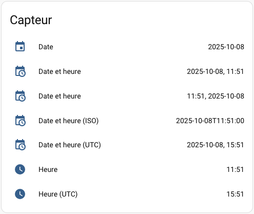
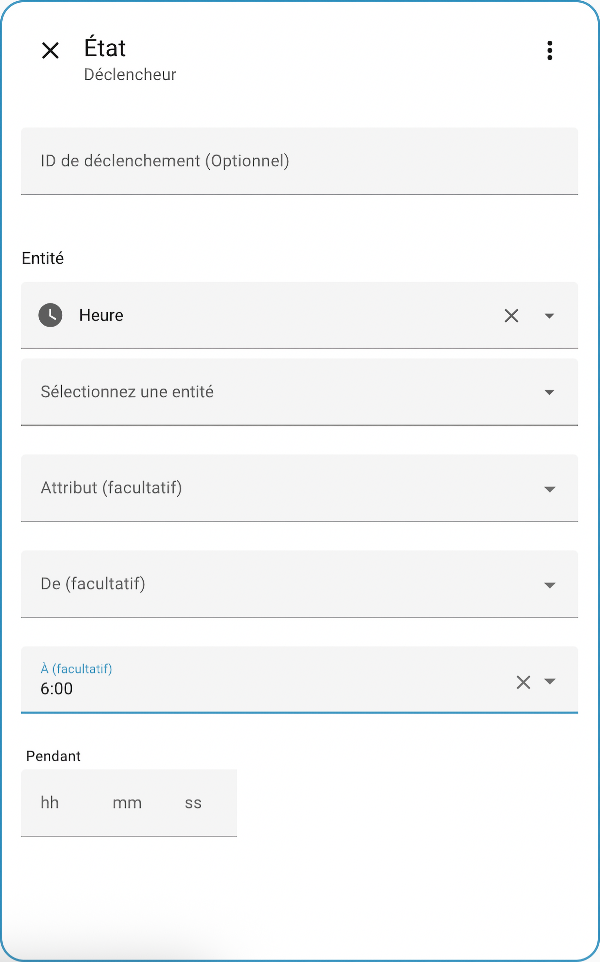
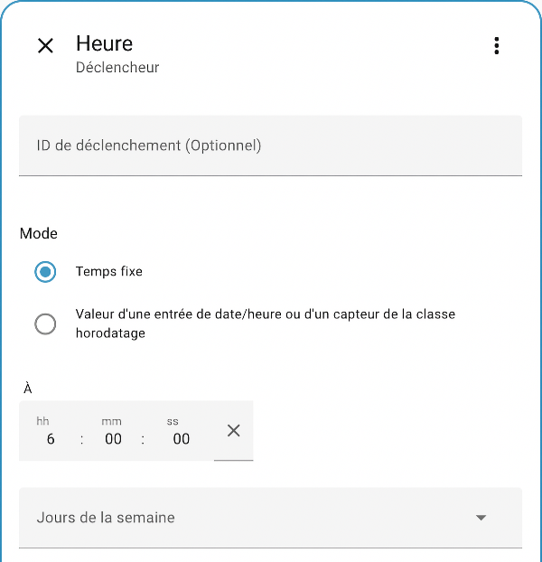

# 83. Automatisations qui tiennent compte de l'heure {#chapitre-automatisations_qui_tiennent_compte_de_l_heure}

## 83.1 Afficher la date et l'heure dans le tableau de bord {#fiche-afficher_la_date_et_l_heure_dans_le_tableau_de_bord}

Avant de vous lancer dans les [automatisations qui tiennent compte de l'heure](93_automatisations_qui_tiennent_compte_de_lheure.md#fiche-automatisation_qui_tient_compte_de_l_heure) il est intéressant d'ajouter une configuration qui affiche la date et l'heure actuelles dans Home Assistant.

En effet, si vous désirez éteindre les lumières à 22h00, vous devez vous assurer que l'heure de Home Assistant est la même que la vôtre.

L'affichage de la date et de l'heure actuelles est réalisé en ajoutant un capteur virtuel de type sensor. Attention : ce capteur est différent des [capteurs virtuels de type input\_datetime qui permettent de saisir la date et l'heure](79_les_capteurs_virtuels.md#fiche-configurer_un_capteur_virtuel)!

La configuration sera ajoutée par code [dans le fichier configuration.yaml](77_le_fichier_configurationyaml.md#fiche-Editer_le_fichier_configuration_yaml).

Il n'est pas nécessaire d'ajouter toutes les options d'affichage (display\_options) mais elles sont listées ici pour illustrer les options disponibles.

Fichier configuration.yaml


```
sensor:
- platform: time\_date
display\_options:
- 'time'
- 'date'
- 'date\_time'
- 'date\_time\_utc'
- 'date\_time\_iso'
- 'time\_date'
- 'time\_utc'
```


Après un redémarrage de Home Asssistant, vous verrez dans l'onglet Aperçu une entité pour chaque option d'affichage configurée.



Pour ma part, j'aime travailler avec les options suivantes :

Fichier configuration.yaml


```
sensor:
- platform: time\_date
display\_options:
- 'time'
- 'date'
- 'date\_time'
```


## Pour plus d'information {#popuprecherche}

« Date & time ». Home Assistant. <https://www.home-assistant.io/integrations/time_date/>

## 83.2 Automatisation qui tient compte de l'heure {#fiche-automatisation_qui_tient_compte_de_l_heure}

Les automatisations dans Home Asssistant peuvent tenir compte de la date et/ou de l'heure.

Par exemple, on pourrait vouloir envoyer une notifications si la porte est ouverte après minuit.

Je vous présente ici quelques techniques. À vous de les tester afin de trouver celle qui répond le mieux à votre besoin.

## Capteur virtuel

Le déclencheur peut utiliser [un capteur virtuel qui affiche la date et l'heure actuelles](93_automatisations_qui_tiennent_compte_de_lheure.md#fiche-afficher_la_date_et_l_heure_dans_le_tableau_de_bord) (sensor.date\_time, sensor.time, etc.) ou encore [un capteur virtuel de type input\_datetime qui permet de saisir une date et/ou une heure](79_les_capteurs_virtuels.md#fiche-configurer_un_capteur_virtuel).

Notez que pour utiliser sensor.xxx, vous devez avoir fait les ajouts requis dans le fichier configuration.yaml.

Dans les deux cas, le type de déclencheur sera Entité / État.

Dans la zone Entité, choisissez sensor.time pour utiliser l'heure actuelle ou input\_datetime.heure (au autre nom selon votre capteur virtuel) pour une heure saisie à l'écran.

Entrez ensuite, dans la zone À, l'heure à laquelle vous désirez que le déclencheur lance l'action.



## Type Heure

Une autre technique pour créer une automatisation qui tient compte de l'heure est d'utiliser un déclencheur de type Heure et lieu / Heure.

Ici, on entrera simplement l'heure à laquelle le déclencheur doit lancer l'action.

