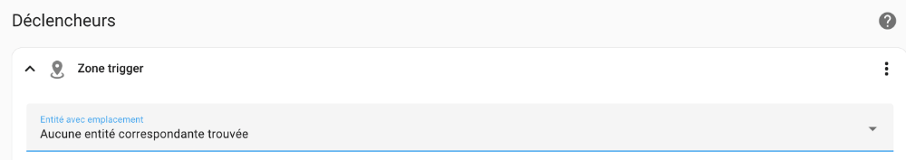
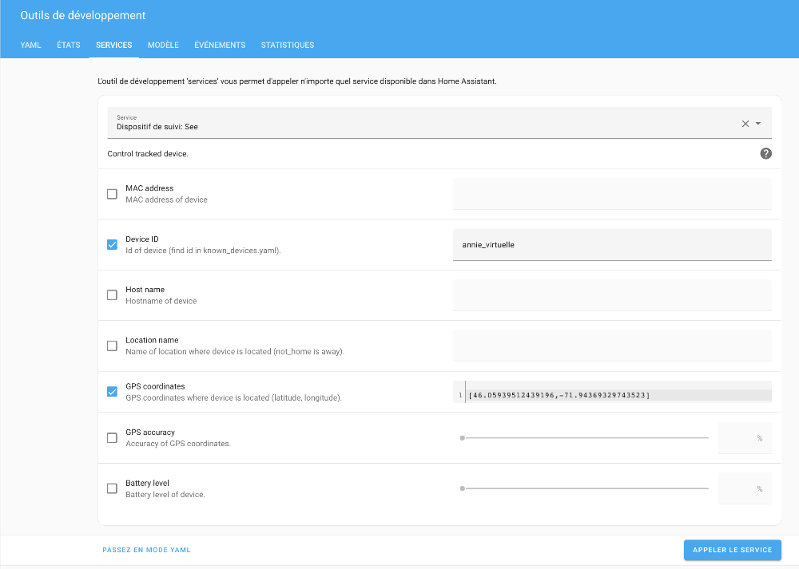
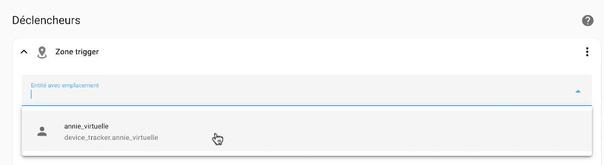

# 86. Dépannage sur les positions GPS (troubleshooting)

## 86.1 Erreur « Aucune entité correspondante trouvée »

### Problème :

Lorsque vous créez une automatisation qui tient compte de la position d'un capteur virtuel de type device\_tracker, la section Entité avec emplacement, qui apparaît notamment quand on ajoute un déclencheur ou une condition de type zone, ne montre pas votre capteur virtuel.

Elle n'affiche que vos capteurs de positionnement réels, par exemple un téléphone ou la personne associée à ce téléphone.

Si vous n'avez aucun capteur de positionnement réel, elle affiche « Aucune entité correspondante trouvée ».

### Contexte :

* Home Assistant 2022.10.5
* HassOS 9.3
* Raspberry Pi 4

### Cause possible :

Lorsque vous avez initialisé la position du capteur virtuel, vous avez utilisé un nom de zone plutôt qu'une position GPS.

### Solution proposée :

Initialisez la position du capteur virtuel à l'aide d'une position GPS :

* Rendez-vous dans le menu Outils de développement / onglet Services (ou Action selon votre version de Home Assistant).
* Choisissez le service device\_tracker.see. Vous verrez apparaître à l'écran Dispoitif de suivi: See.
* Cochez GPS Coordinates.
* Retrouvez les coordonnées GPS désirées. Vous pouvez trouver les coordonnées GPS d'un point en faisant un clic droit à l'endroit désiré sur Google Maps

  
* Entrez les coordonnées entre crochets carrés avec une virgule entre la latitude et la longitude, par exemple [46.05970,-71.94362].

  
* Votre capteur virtuel est désormais disponible dans votre automatisation.

  Mais attention : si, par la suite, vous lui donnez une position en entrant le nom d'une zone dans la section Location name, votre capteur virtuel n'aura plus de coordonnées GPS.

  