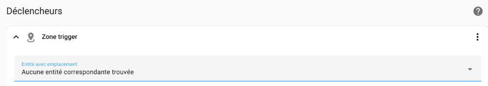

# 86. Dépannage sur les positions GPS (troubleshooting) {#chapitre-depannage_sur_les_positions_gps_troubleshooting}

## 86.1 Erreur « Aucune entité correspondante trouvée » {#fiche-erreur_aucune_entite_correspondante_trouvee}

### Problème :

Lorsque vous créez une automatisation qui tient compte de la position d'un capteur virtuel de type device_tracker, la section Entité avec emplacement, qui apparaît notamment quand on ajoute un déclencheur ou une condition de type zone, ne montre pas votre capteur virtuel.

Elle n'affiche que vos capteurs de positionnement réels, par exemple un téléphone ou la personne associée à ce téléphone.

Si vous n'avez aucun capteur de positionnement réel, elle affiche « Aucune entité correspondante trouvée ».

### Contexte :

* Home Assistant 2022.10.5
* HassOS 9.3
* Raspberry Pi 4

### Cause possible :

Lorsque vous avez initialisé la position du capteur virtuel, vous avez utilisé un nom de zone plutôt qu'une position GPS.

### Solution proposée :

Utilisez plutôt un suivi de position défini par un modèle :

Cette fiche décrit une ancienne méthode de suivi virtuel. Pour créer un suivi compatible avec les zones à partir d'une liste déroulante, suivez la procédure [Créer un suivi virtuel de personne avec un modèle](99_detecteur_de_presence_sous_home_assistant.md#fiche-suivi_virtuel_d_une_personne_avec_un_modele). Le modèle fournit les coordonnées de la zone sélectionnée, et l'entité peut être associée à une personne.