# 89. Détecteur de présence sous Home Assistant {#chapitre-detecteur_de_presence_sous_home_assistant}

## 89.1 Les zones dans Home Assistant {#fiche-les_zones_dans_home_assistant}

Par défaut, Home Assistant a créé une zone lors de sa configuration initiale. Elle porte le nom de `home` et s'affiche selon le nom que vous avez donné à votre boîte (ex : Maison).

Pour tirer profit des fonctionnalités de localisation de Home Assistant, vous devez définir les autres zones d'importance pour votre système : École, Travail, Centre commercial, etc.

Comme pour plusieurs configurations, les zones peuvent être définies à l'aide de l'interface graphique ou encore dans le fichier `configuration.yaml`.

## Interface graphique {#graphique}

Lorsque vous définissez des zones dans Home Assistant, elles sont enregistrées dans le fichier `/mnt/data/supervisor/homeassistant/.storage/zone`.

Pour configurer l'emplacement de votre maison (l'endroit où se trouve Home Assistant) :

* Rendez-vous dans le menu *Paramètres / Pièces, étiquettes* et *Zones* / onglet *Zones*.
* L'icône de maison devrait apparaître dans votre zone initiale. Déplacez-la à l'endroit désiré.

Pour ajouter d'autres emplacements :

* Rendez-vous dans le menu *Paramètres / Pièces, étiquettes et Zones* / Onglet *Zones*.
* Cliquez sur *Ajouter une zone*.
* Donnez un nom à l'emplacement.
* Optionnel : choisissez une icône de [la bibliothèque Material Design](78_les_icones.md#fiche-icones_material_design_dans_home_assistant).
* Sur la carte, placez le marqueur vis-à-vis l'emplacement souhaité.
* Il est possible de définir un rayon pour les zones. Faites glisser le point blanc pour agrandir ou rapetisser la zone.
* Cliquez sur *Ajouter* pour enregistrer vos modifications.
  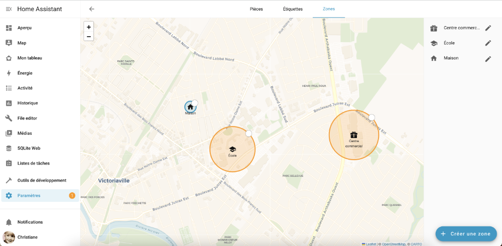
* Une fois les configurations terminées, vous devez redémarrer Home Assistant afin qu'elles soient prises en compte.

## Fichier configuration.yaml

Il est également possible de définir les zones dans le fichier configuration.yaml.

Fichier `configuration.yaml`


```
zone:
- name: Cégep
icon: mdi:school
latitude: 46.059284365916156
longitude: -71.94339343404864
radius: 190
- name: Centre commercial
latitude: 46.059869287591276
longitude: -71.92660569775728
```


## 89.2 Travailler avec l'application mobile Home Assistant {#fiche-travailler_avec_l_application_home_assistant}

L'application mobile Home Assistant, à installer sur le téléphone de chacune des personnes dont vous désirez connaître la position, permet de créer des automatisations qui tiennent compte de l'endroit où chaque personne se trouve.

Elle ajoute un gros plus à votre système domotique mais vous devez pouvoir rejoindre votre installation Home Assistant depuis l'extérieur de votre réseau local. Pour ce faire, vous devez configurer un accès à distance à votre Home Assistant. 

Le service Home Assistant Cloud est la solution la plus simple pour y arriver. Il est payant mais vous pouvez l'essayer gratuitement pendant 30 jours. Vous pouvez également configurer un accès à distance gratuit à l'aide de [DuckDNS](95_acces_a_distance_gratuit_avec_duckdns.md#fiche-acces_a_distance_gratuit_avec_duckdns).

>Dans le cadre de notre cours, nous allons utiliser une connexion directe à votre Home Assistant via le réseau `Domotique-Pedago`. N'oubliez pas de passer à ce réseau lorsque vous désirez utiliser l'application mobile Home Assistant.

## Installer l'application mobile

En recherchant l'application dans l'App Store ou dans Google Play, si vous voyez plusieurs applications qui parlent de Home Assistant, choisissez celle qui utilise le logo de Home Assistant.

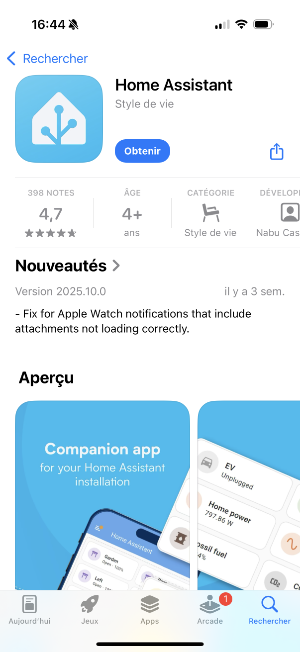

Grâce à l'application mobile Home Assistant, vos automatisations peuvent être plus éclatées qu'avec une simple <a href="fiche-detecter_la_presence_grace_au_wi-fi.md#detecter_la_presence_grace_au_wi-fi">détection de présence avec le Wi-Fi</a>.

Vous pouvez, par exemple, démarrer le chauffage dès que vous quittez le bureau, recevoir une notification lorsqu'un de vos enfants arrive au centre commercial, allumer une lumière tamisée lorsque votre amoureux ou votre amoureuse atteint le coin de la rue pour rentrer à la maison. La seule limite est votre imagination!

## Autoriser l'utilisation des données de localisation {#autoriser}

Pour que Home Assistant puisse savoir à quel endroit une personne se situe, il faut que l'application mobile soit autorisée à utiliser les données de localisation du téléphone.

Il est possible que pendant l'installation, l'application vous en demande l'autorisation.

Les autorisations peuvent par la suite être modifiées en tout temps.

Sur iPhone, rendez-vous dans Réglages / Confidentialité et sécurité / Service de localisation. Donnez le droit Toujours à l'application Home Assistant.

Sur Android, rendez-vous dans Paramètres / Sécurité et confidentialité / Paramètres de confidentialité / Gestionnaire des autorisations / Localisation. Assurez-vous que l'application Home Assistant ait l'autorisation Toujours autorisée.

## Configurer l'application

Lors du premier démarrage de l'application mobile Home Assistant, cliquez sur Connect to my Home Assistant.

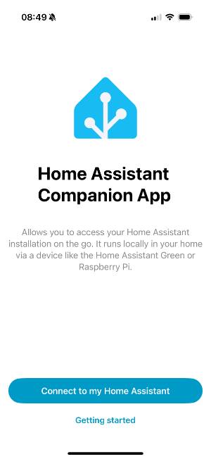

Si votre serveur est détecté, cliquez dessus pour le sélectionner.

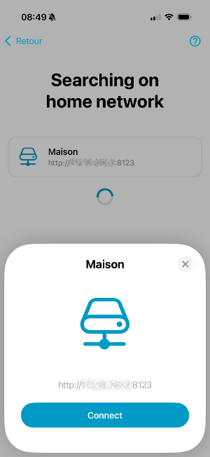

Sinon, cliquez sur Enter address manually puis entrez l'adresse IP de votre serveur, incluant le protocole (ici : http://) et le port (ici : 8123).

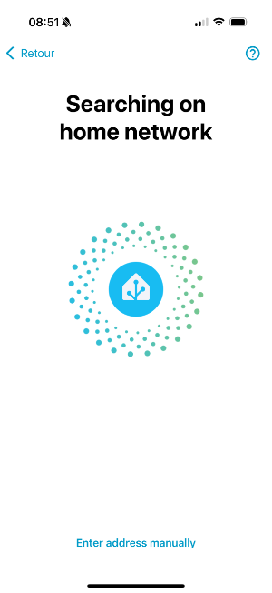   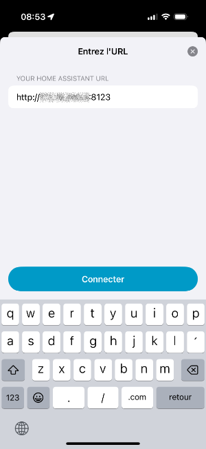

La personne en possession de ce téléphone a désormais la possibilité de contrôler votre Home Assistant à partir de celui-ci, <a href="fiche-gerer_les_personnes.md#gerer_les_personnes">dans les limites des privilèges que vous aurez accordé à l'utilisateur correspondant</a>.

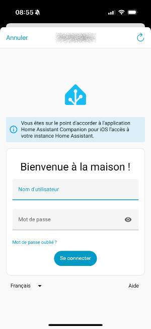

## Définir les zones {#zones}

Pour que l'application puisse indiquer à Home Assistant à quel endroit vous vous trouvez, vous devez [définir les zones d'importance pour votre système](99_detecteur_de_presence_sous_home_assistant.md#fiche-les_zones_dans_home_assistant) : Maison, École, Travail, Centre commercial, etc.

## Pour plus d'information {#soumettrerecherche}

« Setting up presence detection ». Home Assistant. <https://www.home-assistant.io/getting-started/presence-detection/>

## 89.3 Envoyer une notification à l'application mobile {#fiche-envoyer_une_notification_a_l_application_mobile}

L'intégration [notify](https://www.home-assistant.io/integrations/notify/) permet d'envoyer une notification à l'application mobile associée à votre Home Assistant.

Pour l'utiliser dans une automatisation ou dans les outils de développement, il faut exécuter l'action Notifications: Send a notification via mobile_app_... (notify.mobile_app_...), où les points de suspension sont remplacés par le nom du téléphone.

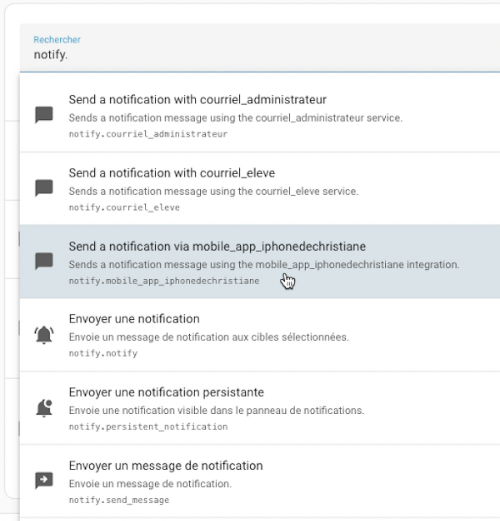

Si cette action n'apparaît pas, ouvrez l'application mobile puis rendez-vous dans le menu *Paramètres / Application Companion / Notifications*. Assurez-vous que la case Autorisation est à Activé.

Vous devez ensuite renseigner le titre et le message.

La notification apparaîtra à l'écran comme les autres notifications du téléphone.

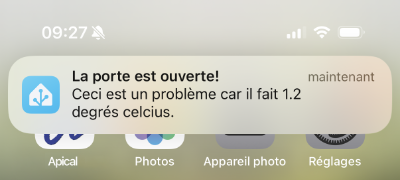

## 89.4 Gérer les personnes {#telephone}

Home Assistant vous permet de définir les personnes qui peuvent être « suivies », par exemple celles que le système pourra identifier comme présentes dans la maison ou pas.

Pour gérer les personnes :

* Rendez-vous dans le menu *Paramètres* / *Personnes*.
* Cliquez le nom de la personne à éditer ou sur *Ajouter une personne*
  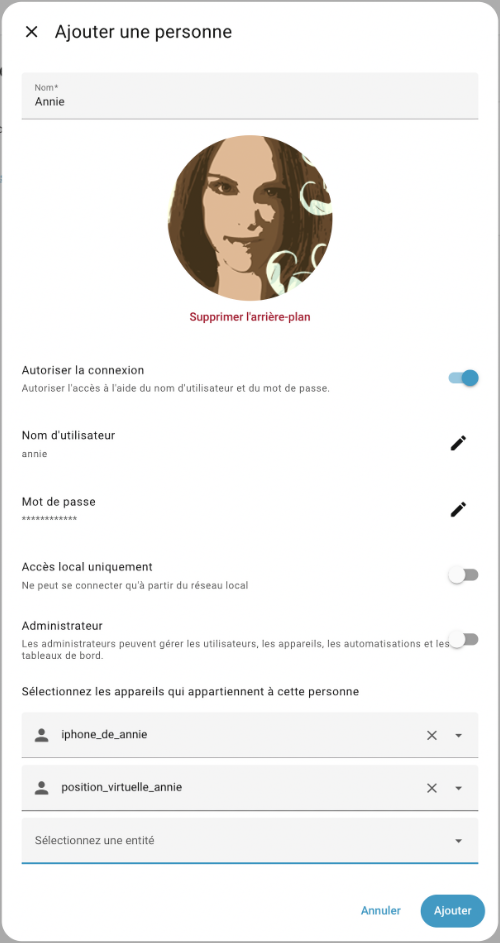
* Téléchargez une photo de la personne.
* Remplissez les informations demandées.
* Si la personne a déjà installé [l'application Home Assistant](99_detecteur_de_presence_sous_home_assistant.md#fiche-travailler_avec_l_application_home_assistant) sur son téléphone, choisissez le téléphone qui lui correspond dans la liste déroulante.
* Vous pouvez également lui assigner un [suivi virtuel défini par un modèle](99_detecteur_de_presence_sous_home_assistant.md#fiche-suivi_virtuel_d_une_personne_avec_un_modele) afin de faciliter les tests de vos automatisations.

Si [l'emplacement de la maison](99_detecteur_de_presence_sous_home_assistant.md#fiche-les_zones_dans_home_assistant) a été correctement configuré et que les personnes sont correctement associées à leur application mobile sur leur téléphone, la tuile *Entité Image* pour le type Personne affichera le statut (*Maison* , *Absent* ou zone spécifique) de la personne en plus de son image.

 

Dans le cas où la personne se trouve dans une [zone connue](99_detecteur_de_presence_sous_home_assistant.md#fiche-les_zones_dans_home_assistant), Home Assistant affichera le nom de cette zone.


Si une personne apparaît comme absente alors qu'elle est à la maison :

* Assurez-vous que [l'emplacement de la maison](99_detecteur_de_presence_sous_home_assistant.md#fiche-les_zones_dans_home_assistant) a été correctement configuré.
* Redémarrez Home Assistant pour vous assurer que toutes les configurations sont prise en compte.

Si une personne montre le statut Inconnu (en anglais, Unknown ou Unk), c'est qu'il y a un problème avec son téléphone.


Pour régler ce problème :

* Assurez-vous d'abord que la personne est [associée à son téléphone](https://apical.xyz/formations/pageunique/systeme_domotique_diy#telephone).
* Assurez-vous ensuite que [l'application Home Assistant détient les droits pour accéder aux données de localisation du téléphone,autoriser](99_detecteur_de_presence_sous_home_assistant.md#fiche-travailler_avec_l_application_home_assistant).
* Parfois, un redémarrage du téléphone est nécessaire.

## Pour plus d'information

« Person ». Home Assistant. <https://www.home-assistant.io/integrations/person/>

## 89.5 Automatisation qui tient compte de la présence {#fiche-automatisation_qui_tient_compte_de_la_presence}

Nous pouvons configurer Home Assistant pour que les lumières s'allument automatiquement quand une personne arrive à la maison après une heure donnée.

Ceci peut être réalisé à l'aide d'une automatisation qui utilise <a href="fiche-gerer_les_personnes.md#gerer_les_personnes">le détecteur de présence</a>.

Pour créer une telle automatisation :

* Paramètres / Automatisations et scènes / Créer une automatisation.
* Une personne ou un appareil est entré dans une zone / sortie d'une zone.
* Comme cible, choisissez la personne, le téléphone associé à la personne ou encore [le suivi virtuel](99_detecteur_de_presence_sous_home_assistant.md#fiche-suivi_virtuel_d_une_personne_avec_un_modele) qui doit déclencher l'action.

  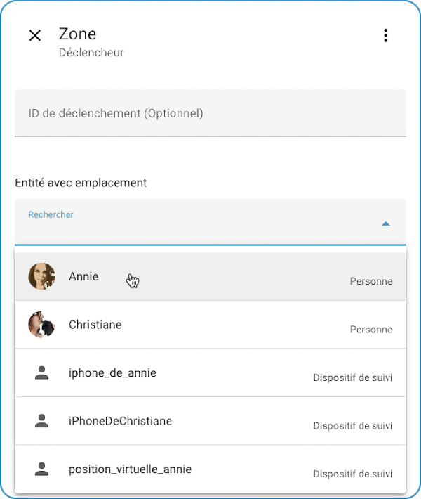
* Choisissez la zone désirée puis précisez si le déclenchement doit avoir lieu quand la personne entre ou sort de la zone.
* Vous pouvez finalement ajouter, selon vos besoins, les autres déclencheurs ou conditions, par exemple pour [tenir compte de l'heure](93_automatisations_qui_tiennent_compte_de_lheure.md#fiche-automatisation_qui_tient_compte_de_l_heure), puis de spécifier les actions à réaliser.

## Pour plus d'information

« Setting up presence detection ». Home Assistant. <https://www.home-assistant.io/getting-started/presence-detection/>

« Making Home Assistant’s Presence Detection not so Binary ». Phil Hawthorne. <https://philhawthorne.com/making-home-assistants-presence-detection-not-so-binary/>

## 89.6 Créer un suivi virtuel de personne avec un modèle {#fiche-suivi_virtuel_d_une_personne_avec_un_modele}

Lorsque vous désirez que Home Assistant puisse [réagir selon la position d'une personne](99_detecteur_de_presence_sous_home_assistant.md#fiche-automatisation_qui_tient_compte_de_la_presence) en utilisant [l'application Home Assistant](99_detecteur_de_presence_sous_home_assistant.md#fiche-travailler_avec_l_application_home_assistant), il devient difficile de tester les automatisations sans devoir vous déplacer physiquement dans la ville.

Pour tester les automatisations sans vous déplacer, créez un suivi de position à partir d'un modèle. Une liste déroulante permet de choisir la zone où se trouve le suivi virtuel.


  

### Définir la liste déroulante

Ajoutez une entrée `input_select` au fichier `configuration.yaml`. Les options doivent correspondre aux identifiants des zones, sans le préfixe `zone.`. Remplacez `ecole` et `travail` par les identifiants utilisés dans votre installation.

```yaml
input_select:
  exercice16_selecteur_zone_personne1:
    name: Zone simulée de la personne 1
    options:
      - home
      - ecole
      - travail
```

Vous pouvez aussi créer cette aide dans *Paramètres / Appareils et services / Assistants / Créer un assistant / Liste déroulante*. Dans ce cas, nommez son identifiant `input_select.exercice16_selecteur_zone_personne1`.

### Créer le suivi de personne

Ajoutez ce modèle au fichier `configuration.yaml`. Il met à jour la zone et les coordonnées GPS chaque fois que la liste déroulante change.

```yaml
template:
  - device_tracker:
      - name: Suivi virtuel personne 1
        unique_id: suivi_virtuel_personne_1
        in_zones: >-
          {{ ['zone.' ~ states('input_select.exercice16_selecteur_zone_personne1')] }}
        latitude: >-
          {{ state_attr('zone.' ~ states('input_select.exercice16_selecteur_zone_personne1'), 'latitude') }}
        longitude: >-
          {{ state_attr('zone.' ~ states('input_select.exercice16_selecteur_zone_personne1'), 'longitude') }}
```

Vérifiez la configuration puis redémarrez Home Assistant. L'entité créée sera `device_tracker.suivi_virtuel_personne_1`.

### Associer le suivi à une personne

Dans *Paramètres / Personnes*, ouvrez la personne concernée et ajoutez `device_tracker.suivi_virtuel_personne_1` parmi ses entités de suivi. Vous pourrez ensuite cibler la personne ou directement le suivi virtuel dans une automatisation de zone.

Si plusieurs trackers sont associés, Home Assistant sélectionne une source pour déterminer la position et les attributs de la personne. Un tracker de connexion encore connecté peut être prioritaire. Parmi les trackers de position, les coordonnées du tracker mis à jour le plus récemment font foi. Le suivi modèle est donc sélectionné selon ces règles; il ne remplace pas automatiquement les autres trackers associés.


## Retrouver la latitude et la longitude d'un device_tracker

Grâce aux [modèles](89_les_modeles_home_assistant.md#fiche-les_modeles_dans_home_assistant), il est possible de retrouver spécifiquement la latitude et la longitude d'un device_tracker.

D'abord, comme avec n'importe quelle entité, il est possible de connaître les attributs disponibles à partir du menu Outils de développement / Modèle.

Entrez dans la zone de gauche une chaîne au format {{ states.id_de_l_entite }}.

Modèle


```
{{ states.device_tracker.position_virtuelle_annie }}
```


Voici le résultat à l'écran lorsque la position a été définie à l'aide de coordonnées GPS.

J'ai ajouté des sauts de ligne pour que les attributs soient plus visibles.

Résultat à l'écran


```
<template TemplateState(<
state device_tracker.position_virtuelle_annie=Travail;
source_type=gps,
latitude=46.05123588418276,
longitude=-72.00332701206209,
gps_accuracy=0,
friendly_name=position_virtuelle_annie
@ 2025-11-03T11:04:01.874055-05:00>
)>
```


Si la position a été définie à l'aide du nom d'une zone, il y aura moins d'attributs disponibles.

Résultat à l'écran


```
<template TemplateState(<
state device_tracker.position_virtuelle_annie=Travail;
source_type=gps,
friendly_name=position_virtuelle_annie
@ 2025-11-03T11:15:01.874055-05:00>
)>
```


Voici un autre exemple où la position de l'entité n'a pas été redéfinie après un redémarrage de Home Assistant.

Résultat à l'écran


```
<template TemplateState(<
state device_tracker.position_virtuelle_annie=not_home;
source_type=None,
friendly_name=position_virtuelle_annie
@ 2025-11-03T11:04:55.752248-05:00>
)>
```


Une fois que vous connaissez les attributs disponibles, vous pouvez retrouver spécifiquement la latitude et la longitude si elles sont disponibles.

Modèle


```
{{ state_attr('device_tracker.position_virtuelle_annie', 'latitude') }}
```


Modèle


```
{{ state_attr('device_tracker.position_virtuelle_annie', 'longitude') }}
```
